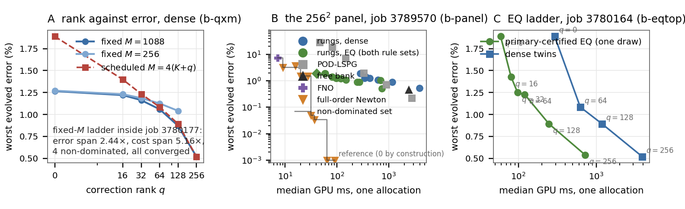
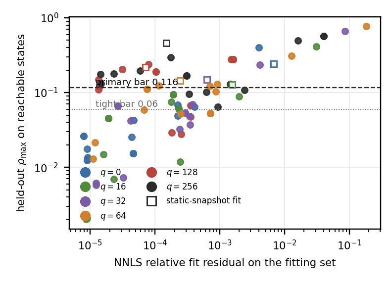

# Tunable Non-linear Manifold ROMs for Elliptic, Parabolic, and Hyperbolic PDEs via Matrix-Free Petrov--Galerkin Projection

*Anonymous submission to ICLR 2027. Every number below is generated from run records by `gen_tables.py`; tables are inlined from `tables-md/` behind an HTML comment naming their id; **[PENDING: …]** marks a lane that has not landed.*

*Status for the reader (generated 2026-09-19 21:36; this block is removed before submission).*
*Final tables (58): T00, T01, T01b, T02, T02b, T02c, T03, T03b, T03c, T03m, T03mb, T03mc, T04, T04b, T04m, T05, T05b, T05c, T05m, T06a, T06b, T07, T08, T08b, T09, T09b, T09c, T09c, T09d, T10, T11a, T11b, T11c, T11d, T11e, T11f, T11g, T11h, T12, T12b, T13, T13b, T14, T14b, T14c, T14d, T15, T16, T17, T18a, T18b, T18c, T18d, T18m, T19, T20, T20b, T21.*
*Pending cells: none. In-flight jobs are listed in Table C.3: low-viscosity training 3804337 (b-lowvisc), NS head-only data scaling ns302–ns304 (ns2d).*
*The sealed cohort (T13, b-seeds job 3804465) is the headline for the scheduled ladder; T12 is the development-cohort seed table; the two top EQ rungs are single-draw rules, never certified.*
*Open decisions for the user: (1) the headline Burgers metric, worst over evolved times or worst over all times, both printed everywhere, and now decisive for §5.1 at 1024², where reduced rungs are non-dominated on the evolved metric only because the t=0 compression bounds all-times; (2) sign-off on the abstract's new opening two sentences (resolution-knob framing), which are provisionally accepted and unchanged in this pass.*
*Abstract: the readability pass's Abstract A (<= 250 words) with first-use glosses; the previous 397-word abstract and Abstract B (~200 words, one line shorter) are in ABSTRACT-2026-09-17.md for the user to pick.*
*Changed in this pass: b-panel closed (bpn301 replaces bpn101 at 256², bpn203 adds 1024²); L-shape closed at 512² and now in the abstract; b-qxm pin at 4b9723e8 dropped after the lane committed its regeneration (no number in §5.2 moved); three seeds landed on the development cohort; Figure 2 moved into §3.2 beside the equation it draws; the sealed cohort landed (be9415ab): sealed values replace the development q=0 incumbent value as the headline, the wrong-branch cold start at q=0 is a stated failure mode.*

## Abstract

Neural operators (Li et al., 2021; Lu et al., 2021) deliver one (accuracy,
speed) point per trained model; at deployment only the evaluation grid can change, moving
cost, not representation. We present a non-linear manifold reduced order
model (NM-ROM) for elliptic, parabolic and hyperbolic PDEs, exposing a
family of accuracy/cost points from one decoder, controlled by
the correction rank $q$ and three solver-side knobs. The framework combines
a matrix-free least-squares Petrov–Galerkin residual projection
(Bradbury et al., 2018), empirical-quadrature (EQ) hyper-reduction fitted
by non-negative least squares (NNLS) (Hern'andez et al., 2017; Yano & Patera, 2019),
exact boundary enforcement, and a separable decoder: a per-node Fourier-feature
coordinate-network bank (Tancik et al., 2020) times
a small head with a linear skip, plus nested corrections. Across 2D
Burgers, Poisson, heat and waves, the scheduled ladder (one model per
rank $q$) is monotone in $q$ on Burgers on three seeds and a sealed cohort
opened once after every choice was frozen (top-rung error
0.59–0.68 % over 4
checkpoints); the fixed-test-count ladder meets a pre-registered bar on one
checkpoint; against a fine reference every rung's error stays within
$1.13\times$ the discretisation error; the
quadrature rules are confirmed on re-draw at $q\le32$ only; and the cost
results, each from one job, show the head
$2.77\times$ and
$6.07\times$ cheaper than the cheapest
full-order solve on L-shaped Poisson at $256^2$ and $512^2$, with
POD-128 cheaper for $15 %$ more error.
Nothing reduced is on the frontier at $256^2$ or $512^2$, where a tuned
full-order solver is cheaper and more accurate; on Poisson, heat and
waves the family collapses to a linear model, showing when the nonlinear
manifold pays.

## 1 Introduction

<!-- section sources: b-qxm analysis.json; b-eqtop summary.json; mesh-ladder json; b-panel summary.json -->

Neural operators for partial differential equations (PDEs)
(Li et al., 2021; Lu et al., 2021; Kovachki et al., 2023; Li2024PINO, ?; BoulleTownsend2024, ?) have
become a strong empirical baseline. But each trained model produces
essentially one (accuracy, wall-clock) operating point. The only
deployment-time knob is the evaluation grid, and it moves cost without
changing what the model can represent (§6.1).
Classical Full Order Methods (FOMs) (Hughes2000FEM, ?), solved
iteratively (HestenesStiefel1952CG, ?), expose this knob through their
tolerance. Where a fast transform applies, they are hard to beat on
wall-clock.

Two families of methods sit on either side of this gap. Neural
operators and PDE foundation models
(HerdePoseidon2024, ?; McCabeMPP2024, ?; HaoDPOT2024, ?; Chen2024UnsupervisedNO, ?) deliver fast
amortised inference. But they fix what the model can represent at
training time. Reduced order models (ROMs) address the same problem from
the opposite direction. Linear projection-based ROMs
(Benner et al., 2015; Sirovich, 1987) inherit the FOM's
guarantees. But they hit the Kolmogorov $n$-width barrier on
advection-dominated regimes (Cohen & DeVore, 2015): no fixed linear
subspace of modest dimension approximates solutions whose shape moves.
Non-linear manifold ROMs (NM-ROMs) (Lee & Carlberg, 2020; Kim et al., 2022)
lift this barrier with a learned manifold. But they have rarely been
measured head-to-head against neural operators and tuned full-order
solvers in the same job. The open question is whether a single trained
NM-ROM can expose a deployment-time accuracy/cost tradeoff that neither
alternative offers. The second question is where, if anywhere, it is worth
having, once the comparators are measured in the same allocation.

This paper answers that question with measurements on 2D Burgers,
Poisson, heat and waves. The answer is mixed. We present an NM-ROM
framework whose distinguishing property is a *deployment-time
accuracy/cost family traced by a single trained model*. At inference, one
primary knob and three solver-side knobs trade accuracy for cost. The
primary knob is the rank $q$ of a linear correction the solver may switch
on. The three solver-side knobs are the iteration cap, the stopping
tolerance, and the Empirical Quadrature (EQ) sample count. The machinery is a decoder that enforces Dirichlet
conditions exactly, a damped Levenberg–Marquardt latent solver
(Marquardt, 1963), Empirical Quadrature
(Hern'andez et al., 2017; Yano & Patera, 2019) validated on reachable states,
and a matrix-free JAX implementation (Bradbury et al., 2018).

**Contributions.**

1. **A tunable NM-ROM with a deployment-time accuracy/cost
family from a single trained model, and a matched-dimension
result.** With the test count $M$ held fixed so that $q$ is the
only control, the Burgers $256^2$ ladder (one rung per $q$) is
monotone with every rung converged, spanning $2.44\times$
in same-grid error for $5.16\times$ in cost inside one
allocation (§6.3). At matched $k=16$
inside one bank, the neural head reaches $2.5629 %$,
where the best linear map reaches $56.9296 %$ and
POD-16 reaches $61.6503 %$ (§6.4).
2. **Architectural choices that make this family
achievable.** We identify three constraints a decoder must satisfy:
cold-start convergence, EQ compatibility, and mesh-independent
per-node evaluation. We show that a separable decoder
(coordinate-network bank, head with a linear skip, nested
corrections) meets all three.
3. **Precomputed weak operators and validated quadrature.**
Exact preassembly of every linear term, Empirical Quadrature for
the one nonlinear term, and a validation rule that accepts a fitted
quadrature only by its held-out error on reachable states and by
independent re-draws, never by its fitting residual.
4. **Where the family is not worth having, reported as such.**
At $256^2$ on the square, no reduced subject is on the
non-dominated set once a tuned full-order solver and a neural
operator on the same data are in the job. On Poisson, heat and
waves, the top rung is the linear model and also the cheapest
point. On an L-shaped Poisson domain, where no fast transform
applies, reduced models are cheaper than the cheapest same-job
full-order solve (timed in the same allocation), POD-128 more so
than the head
(§6.1, §6.5).

**What we do not claim.** No speedup over an efficient full-order
solver on the square; no accuracy superiority over neural operators; no
frontier over POD at every rank; no cost ratio across jobs; no theory;
and every number is development-cohort evidence, from the cases used
while tuning (§Table 3).

## 2 Related Work

<!-- section sources: none (prose only) -->

**Linear and non-linear manifold ROMs.**
Linear projection-based ROMs
(Benner et al., 2015; Sirovich, 1987; Berkooz1993, ?; QuarteroniManzoniNegri2015, ?; HesthavenRozzaStamm2016, ?)
suffer from the Kolmogorov $n$-width barrier on advection-dominated and
moving-front problems
(Cohen & DeVore, 2015; GreifUrban2019, ?; Ohlberger & Rave, 2016). NM-ROMs lift this barrier with a non-linear trial manifold:
Lee & Carlberg (2020) introduced convolutional-autoencoder NM-ROMs with
LSPG projection (Carlberg et al., 2011), followed by shallow masked
autoencoders with sample-mesh hyper-reduction (Kim et al., 2022),
reduced over-collocation (RomorStabileRozza2023, ?), domain-decomposed
sparse autoencoders (Diaz2024DomainDecompNMROM, ?), quadratic
manifolds (Geelen et al., 2022; Barnett & Farhat, 2022),
feature-tracking variants with EQ (MirhoseiniZahr2023, ?),
POD-pre-compressed DL-ROMs (Fresca & Manzoni, 2022) and
neural-field ROMs (KimWenLeeChoiCNFROM2024, ?). We differ from these by a separable decoder — a coordinate-network
bank (Tancik et al., 2020) times a small head with a linear
skip — augmented by nested *correction* directions chosen offline
once, so that a rank $q$ is selected at run time without refit, a family
from one trained decoder analogous to runtime-tunable networks
(YuSlimmable2019, ?; Cai2020OnceForAll, ?). NN-augmented projection ROMs
(Barnett et al., 2023) and online-adaptive bases
(Peherstorfer & Willcox, 2015; Carlberg, 2015) add a
nonlinear correction to a linear basis; ours is the reverse composition,
the nonlinear head inside the linear bank with the linear part as the
correction. The projection is least-squares Petrov–Galerkin
(Carlberg et al., 2011) and the linear terms are preassembled as in
tensorial POD ( Stef anescu & Sandu, 2014; Weder et al., 2024);
we claim no novelty for either.

**Neural operators, hyper-reduction, and differentiable programming.**
Neural-operator surrogates
(Li et al., 2021; Lu et al., 2021; Kovachki et al., 2023; LiGeoFNO2023, ?; TranFFNO2023, ?; Cao2021GalerkinTransformer, ?; LiOFormer2023, ?; HaoGNOT2023, ?; WuTransolver2024, ?; WangLNO2024, ?; WenGAOT2025, ?; HuLinearNO2025, ?; Shikhman2026BoundaryIndexed, ?)
and PDE foundation models
(HerdePoseidon2024, ?; McCabeMPP2024, ?; HaoDPOT2024, ?; HolzschuhPDETransformer2025, ?)
deliver one fixed (accuracy, speed) point per trained model and
typically approximate boundary conditions via penalty terms, with
partial fixes via distance functions or hard constraints
(SukumarSrivastava2022, ?; BerroneBC2022, ?; BrechtHardConstraints2023, ?; WangBENO2024, ?; LippePDERefiner2023, ?);
hybrid solver-in-the-loop methods
(UmSolverInTheLoop2020, ?; Kochkov2021PNAS, ?; KopanicakovaKarniadakis2024, ?; EshaghiNOWS2025, ?; Raissi2019, ?; Karniadakis2021PIML, ?)
embed operators in classical iterations. We instead use the network solely for manifold learning with a
least-squares Petrov–Galerkin projection (Carlberg et al., 2011) for
the residual, and compare against an FNO, a U-Net
(Ronneberger et al., 2015; Takamoto et al., 2022) and a Transolver
(WuTransolver2024, ?) on identical data at an equal wall budget
(§6.1). For hyper-reduction we retain classical EQ fitted by non-negative least squares (NNLS)
(Hern'andez et al., 2017; Yano & Patera, 2019; Lawson & Hanson, 1974) over DEIM
(Chaturantabut & Sorensen, 2010), ECSW
(Farhat et al., 2014; Chapman et al., 2017), GNAT
(Carlberg et al., 2013) and their neural and high-order variants
(NegriManzoniAmsallem2015, ?; HirschPichiHesthavenNEIM2024, ?; Nguyen2024HighOrderEIM, ?);
the difference is that only the nonlinear term is sampled and that a
fitted rule is accepted by its held-out error and by re-draws, not by
its fit residual. On separable cells the discrete sine transform (Swarztrauber, 1977)
is a direct solve faster than every reduced model we measure;
preconditioned Krylov methods (HestenesStiefel1952CG, ?; Saad, 2003) are
the iterative comparator.

## 3 Methodology

<!-- section sources: none (prose only) -->

We turn a learned manifold into a practical PDE solver through three
components: a trial manifold whose decoder enforces Dirichlet conditions
exactly and carries nested linear correction directions
(§3.1); a least-squares Petrov–Galerkin
projection of the discrete residual onto fixed weak tests
(§3.2); and exact preassembly of every linear term
with Empirical Quadrature for the one nonlinear term
(§3.3); §3.4 gives the architecture.
Throughout, $u \in \mathbb{R}^{n}$ is the
full-order state on a uniform grid of $N$ intervals per axis,
$A \in \mathbb{R}^{n \times n}$ the negative five-point Laplacian on
$[0,1]^2$; $R$ is the bank width, $k$ the latent dimension, $M$ the number
of weak tests and $m$ the number of quadrature nodes.
Figure 2 (Appendix D) shows the data flow;
Appendix B gives the per-PDE derivations and exit codes.

### 3.1 Trial Manifold with Exact Dirichlet Enforcement

<!-- section sources: none (prose only) -->

We train a decoder $\mathcal{D} : \mathbb{R}^k \to \mathbb{R}^n$, $k \ll n$, with
latent state $z$ and no encoder in the deployed path, separable into a
frozen spatial *bank* $G\in\mathbb{R}^{n\times R}$ times a small
neural *head* $h_\theta:\mathbb{R}^{k}\to\mathbb{R}^{R}$, $k\le R\ll n$, the bank
built once per mesh from a random-Fourier-feature coordinate network
$g_\phi$ (Tancik et al., 2020),

$$
G_{x,:} = \mu(x)\,g_\phi(x)^{\top},
  \qquad
  \mu(x) = 16\,x_1(1-x_1)\,x_2(1-x_2).
$$

<!-- equation (1) -->

To strictly enforce the homogeneous Dirichlet condition on the boundary
$\Gamma$, we utilize the smooth vanishing factor $\mu$, zero on
$\Gamma$, folded into every column of the bank, so that
$\partial u/\partial z = 0$ on $\Gamma$ at every resolution (homogeneous
data only).

**The correction ladder.**

The deployed model augments the head's output with $q$ fixed directions
$C_q\in\mathbb{R}^{R\times q}$ and solves for the latent code and the
correction coefficients together,

$$
u(z,y) \;=\; G\big(h_\theta(z) + C_q\,y\big),
  \qquad z\in\mathbb{R}^{k},\; y\in\mathbb{R}^{q},\; 0\le q\le R .
$$

<!-- equation (2) -->

The columns of $C_q$ are chosen offline once per checkpoint by a
principal component analysis of the head's own residual on the training
codes, ordered so that $C_{q}$ is a prefix of $C_{q'}$ for $q<q'$; the
ladder is nested and no rung needs retraining. At $q=0$ the model is the
frozen head; at $q=R$ the head is irrelevant and the model is the linear
reduced model on the bank's span, solved without a nonlinear iteration;
in between, $q$ moves the reachable set from the head's image towards
the bank's span, and the solved dimension from $k$ to $k+q$. Two consequences follow: the bank's projection error is a floor on the
achievable error whatever the head or the solver does, so nonlinearity
in $h_\theta$ buys a smaller *solved* dimension, not an escape from the
span; and all $x$-dependence factors through $G$, which makes node
sampling and exact preassembly available from one decoder.

### 3.2 Projecting the PDE onto the Manifold

<!-- section sources: none (prose only) -->

Each PDE we consider gives a discretised residual $r(u)$ that
should vanish at the true solution. We substitute the trial manifold
$u(z,y)$ into $r$ and project onto a fixed, latent-independent
test space: $P\in\mathbb{R}^{M\times n}$ collects the $M$ lowest
tensor-product sine vectors of the square, eigenvectors of the five-point
operator, $PA=\LambdaP$. The reduced problem solved online
is

$$
(z^{\star},y^{\star})
  =
  \operatorname*{arg\,min}_{z,\,y}\;
  \tfrac12\,\lVert r_{w}(z,y) \rVert_2^2,
  \qquad
  r_{w}(z,y) = \Lambda_\star^{-1}\,P\,r\!\big(u(z,y)\big)
  \in\mathbb{R}^{M},
  \qquad M>k+q ,
$$

<!-- equation (3) -->

with a diagonal row scaling $\Lambda_\star$ stated per PDE in
Appendix B: a least-squares Petrov–Galerkin condition
with an explicit test space (Carlberg et al., 2011; Lee & Carlberg, 2020), not
tangent Galerkin, overdetermined rather than square, solved by a method
appropriate to each PDE's structure.

**Elliptic (Poisson).**
The Poisson residual is $r(u) = A u - f$, and projection gives
$r_{w}(z,y)=B_0(h_\theta(z)+C_q y)-b_0$, $B_0=PG$
(Appendix B.1); the projector onto
$\operatorname{range}(B_0C_q)$ does not depend on $z$, so $y$ is
eliminated exactly (Golub & Pereyra, 1973), the iteration stays
$k$-dimensional at every $q$, and $q=R$ is a linear solve.

**Parabolic (heat).**
The heat semi-discretisation $du/dt = -\kappa A u$ is advanced with
Crank–Nicolson; the reduced step substitutes the manifold into the fully
discrete equation *before* projecting and solves
$z_{n+1}=\operatorname*{arg min}_{z}\lVert B_0h_\theta(z)-D B_0h_\theta(z_n) \rVert_2$
(Appendix B.2), a nonlinear least-squares problem, not
a linear system; at $q=R$ the trajectory is the exact modal propagation
of the bank coefficients.

**Hyperbolic (Burgers).**
For $u_t+u(u_x+u_y)=\nu\Delta u$ with a sign-upwind stencil and backward
Euler (Appendix B.3) the weak residual is quadratic
in the coefficients, so $y$ is not eliminated in closed form; we damp the
$(z,y)$ blocks separately inside one Levenberg–Marquardt step
(*block-damped* variable projection), which exits stationary
everywhere where a joint LM leaves $6$ budget exits
(Table 12).

**Solver and exits.**
Each attempt solves the damped normal system
$(H+\lambda \operatorname{diag}(\operatorname{diag} H)) \delta=-g$, $H=J_{}\TJ_{}$,
$g=J_{}^{\top}r_{w}$, accepting the step only if it strictly decreases the
residual: damped Levenberg–Marquardt with a monotone test
(Marquardt, 1963). Three exit families are recorded and never conflated: the scale-free
stationarity measure
$\eta(z,y)=\lVert J_{}^{\top}r_{w} \rVert_2/(\lVert J_{} \rVert_{F}\lVert r_{w} \rVert_2)\le\eta_{\mathrm{tol}}$
\refstepcounter{equation}

(\theequation), a
residual threshold, and the stalls, reported as early-stopped, never as
converged. No query uses the solution it predicts: the elliptic solve starts from
the cached training code nearest the projected source, the Burgers query
fits $(z,y)$ to the supplied initial field
(Appendix B.5).

### 3.3 Hyper-reduction

<!-- section sources: none (prose only) -->

The non-linear manifold reduces the DOF count from $n$ to $k+q$, but a
projected term such as $P N(G c)$ still costs $O(n)$. For a fixed linear operator
the tested residual is exactly precomputable,
$P(A u-f)=B (h_\theta(z)+C_q y)-b$ with
$B=\Lambda PG$ assembled offline by two sine transforms, so
linear terms are never approximated; the Burgers advection
$P N(G c)$ is the only term that resists preassembly, evaluated
*densely*, $O(nR)$ per residual, or on an *empirical quadrature*
rule of $m$ nodes (Hern'andez et al., 2017; Yano & Patera, 2019), $O(mR)$. The rule is a non-negative *per-node* weight vector, *independent
of the snapshot*, fitted by NNLS (Lawson & Hanson, 1974) to reproduce
the projected advection term at $n_{\rm fit}$ stored codes with a hard cap
of $m$ nodes (Appendix B.4); changing $m$ re-solves the
fit, rules are not nested, and deployment selects among stored rules. *A rule is never accepted on its NNLS fit residual*; we score it by
the held-out relative error $\rho$ of the projected advection term
(9) over states the solver actually reaches on trajectories
disjoint from the fit and evaluation cases, against a primary bar
$\rho_{\max}\le0.116$ fixed before any certification job ran and a
tight bar $0.06$, and then re-draw the construction: a rule is
*confirmed* only if every re-draw passes
(§6.3).

### 3.4 Model Architecture

<!-- section sources: none (prose only) -->

Three properties of the problem motivate our architecture: the latent
iteration is initialised cold, so the decoder Jacobian must retain a
well-conditioned linear component, which motivates a *linear skip*
in the head; hyper-reduction retains a sparse subset of mesh nodes, so
the decoder must evaluate at any node in mesh-independent time, which
motivates a *per-node bank*; and the family must reach from the
head's image to the bank's whole span without retraining, which
motivates the nested *correction directions*.

**Linear skip, for cold-start convergence.**
The head is a two-layer SiLU MLP plus a linear skip,
$h_\theta(z)=\varphi_\theta(z)+W^{\top}z$, so its Jacobian
retains a latent-independent component along which the cold solve can
descend; the elliptic solver checks the numerical rank of the projected
Jacobian at every query. The skip is a design choice, not ablated here.

**No encoder; per-node bank.** No encoder is needed: the query
fits $(z,y)$ against the supplied input. The decoder restricted to
a rule's support is a cached block times the coefficients, and the
network's parameters do not depend on the mesh.

**What is fixed, what is chosen, and how error is reported.**

Every operating point uses one frozen artefact per PDE; selected at run
time are the rank $q$, the quadrature (dense or a stored rule) and the
stopping tolerance and budget; $M$ is held fixed along the headline ladder.

Every panel reports three numbers: the *bank floor* (projection
error onto $\operatorname{range}G$), the *best-found* error (the
smallest any point of the augmented manifold attains, from a multistart
oracle) and the *solved* error the iteration returns.

## 4 Implementation

<!-- section sources: none (prose only) -->

\subsection{Matrix-free Projected Operators via JAX}
Every linear term is preassembled once per mesh as the $M\times R$
matrix $B$, so the online residual and Jacobian of a linear PDE are
$B (h_\theta(z)+C_q y)-b$ and $B [Dh_\theta C_q]$, with $Dh_\theta$
from a forward-mode Jacobian-Vector Product (Bradbury et al., 2018); the
sampled Burgers advection uses the cached stencil block. The damped
normal system is solved directly; no Krylov solve is applied to the
projected operator.

\subsection{Training Protocol}

The bank and the head are trained in two stages, both as auto-decoders:
the coordinate network $g_\phi$ is fitted to the training states through
(1), then frozen, and the head is fitted with a code library
$Z$ on the bank-projected states; $C_q$ is then the principal
components of the head's residual on the training codes. Sizes, cohorts
and offline cost are in Appendix C; every
headline uses one checkpoint per PDE, named by hash in
Table 6.

## 5 Experimental Setup and Benchmark Problems

<!-- section sources: none (prose only) -->

All full-order comparators and reduced solves are benchmarked in one
Slurm allocation on one GPU per job to provide a direct
hardware-to-hardware comparison; *no ratio is ever formed across
jobs or GPUs*. Table 9 specifies each cell and
Table 10 the sampled families.

**Problems.**
*Burgers (hyperbolic, the hero):* $u_t+u(u_x+u_y)=\nu\Delta u$ on
$(0,1)^2$ at $256^2$ intervals with a frozen-checkpoint ladder from
$64^2$ to $1024^2$; errors are against the same job's converged
full-order solve on the same grid (discretisation error
$4.0265 %$ at $256^2$ against a $4096^2$ reference).
*Poisson (elliptic):* $-\Delta u = f$, ground truth the verified
discrete solution from the direct sine transform, at $256^2$ and $1024^2$
on the square and on the L-shaped domain $(0,1)^2\setminus[\tfrac12,1)^2$
at $64^2$ to $512^2$, where a sparse direct solve replaces the transform.
*Heat and waves:* $\partial_t u - \kappa \Delta u = 0$ with
Crank–Nicolson and $u_{tt}=c^2\Delta u$ with reflective walls.

**Metrics and timing.**
We report the relative $L^2$ error against the reference of each cell,
maximised over cases and output times; for Burgers two maxima are
reported everywhere and neither is chosen, worst over *all* times
(bounded below by the decoder's compression of the input at $t=0$) and
worst over the *evolved* times $t>0$. Every cost is the median over repetitions of a completed computation
after a burn-in, arms interleaved in a recorded random order, in
float64; “device ms” is the device time with inputs and outputs
resident, “complete-query ms” the host-to-host time charging the dense
input and output, and every column says which; offline setup is charged
separately. Only *admissible* solves — stationarity $10^{-6}$ at
every step or a residual-rule exit, with a passing quadrature rule —
enter a frontier or a ratio, so the $10^{-3}$ arms are reported but never
counted (Table 21).

**Baselines.**
FNO, a PDEBench-style U-Net and a Transolver are trained on the
identical dataset and split at an equal wall budget; only the FNO is
timed in the same allocation as the ROM. POD-LSPG, the same projection on a POD basis instead of the trained
manifold, runs through the same weak objective, tests, solver and stopping rule. Full-order comparators
are always in the same job: preconditioned Newton (Burgers); the direct
sine transform and tuned CG (Poisson, heat, waves); sparse direct, CG and
IC(0)-PCG (L-shape). The NM-ROM of Kim et al. (2022) is not run
under this protocol and is not compared; the earlier comparison against
plain CG is kept in Appendix G.6 for continuity. Every table names its job
id, GPU and checkpoint (Table 6), every solve carries
its exit reason, and every number is emitted by one generator from
audited records.

## 6 Numerical Experiments and Results

<!-- section sources: none (prose only) -->

All results here have full tables in the appendix; Table 4
maps experiments to question, jobs and tables.

Every number is one checkpoint per PDE on development cases unless seeds
are stated, and costs compare only inside one allocation. The losses come
first.

### 6.1 Comparison against Neural Operators and Full-Order Solvers

<!-- section sources: none (prose only) -->

Two plain sentences first. At $256^2$ and $512^2$ a well-tuned
full-order solver is cheaper and more accurate than every reduced model,
ours included. At $1024^2$ 3 of
the 16 admissible reduced subjects, the
cheapest quadrature rungs, are on the non-dominated set, on the
evolved-times metric only; the flip lies between $512^2$ and $1024^2$.
The same-job costs follow (Table 1): on one A100
model the cheapest reduced query costs $4.48\times$ the
cheapest full-order setting at $256^2$ and
$2.92\times$ at $512^2$, a trend on shared
hardware; at $1024^2$ on an H200 it costs
$2.27\times$, a separate fact.

**Table 1.** The same-allocation panels on Burgers, one job per mesh
(Table 18, Table 20,
Table 19); same-job ratios only; $256^2$ and
$512^2$ share the GPU model, $1024^2$ does not. “Admissible” is the
§5 rule; the $10^{-3}$ arms are timed in
Table 21 but counted nowhere here.

<!-- table: T05m_panel_summary -->
| mesh | job | GPU | timed subjects | admissible reduced (\S5) | non-dom. (evolved) | non-dom. (all-times) | cheapest reduced / cheapest FOM | cheapest reduced / converged FFT | ladder vs-ref span |
|---|---|---|---|---|---|---|---|---|---|
| $256^2$ | `3789570` | NVIDIA A100 80GB PCIe | 48 | 27 | 0 | 0 | 4.48$\times$ | 0.446$\times$ | 1.13$\times$ |
| $512^2$ | `3805065` | NVIDIA A100 80GB PCIe | 48 | 23 | 0 | 0 | 2.92$\times$ | 0.257$\times$ | 1.36$\times$ |
| $1024^2$ | `3789572` | NVIDIA H200 | 30 | 16 | 3 | 0 | 2.27$\times$ | 0.191$\times$ | 1.38$\times$ |

**Nothing reduced is on the frontier at $256^2$ or $512^2$.**
Table 1 and Figure 1 come from one
allocation on one A100 (job 3789570) holding correction rungs,
POD-LSPG, the unrestricted bank, the FNO and full-order Newton.
**0 of the 27
admissible reduced subjects are non-dominated** on either metric once the
full-order controls are in: the most accurate, POD-512 at
$0.2184 %$ and $2790.8$ ms, loses
on both axes to 4 same-job full-order
settings (cheapest $0.0489 %$,
$31.8$ ms) and the FNO reaches $7.4164 %$ at
$7.2$ ms. At $512^2$ on the same GPU (job
3805065) 0 of
23 are non-dominated, the frontier is
Newton alone and POD-512
($0.3328 %$) is beaten on both axes by
4 same-job settings.

**At $1024^2$ the statement is mesh-qualified.**
On one H200 (job 3789572) the
3 reduced subjects
non-dominated on (GPU ms, worst *evolved* error) are the $q=0$, $16$ and
$32$ rungs with rules transferred from $256^2$. On *all-times* none is at
either mesh, because the $t=0$ compression
($3.71$–$3.86 %$
on those rungs) bounds it: which metric is the headline decides whether
this is a gain. The transferred rules at $q\ge64$ miss the primary bar
there; why is open.

**Neural operators on the same data.**
Neural operators trained on the same data are more accurate than the
reduced model, and the one that was timed against it is also cheaper
(Table 17). Worst error on the matched 8-case cohort:
U-Net-small $1.4712$, Transolver-refine
$1.5224$, **ROM $1.8671$**, FNO-large
$2.4829$, efficient full-order solver
$0.9978 %$ ($4$ operator arms beat the
ROM; the FNO's $7.4164 %$ above is on the six-case cohort).
An earlier FNO-only finding to the contrary is withdrawn; it survives a
float64 and a second-seed control
(Appendix G.1), all but one operator number is
a lower bound, and the Poisson gap is larger
(Table 41). Their own knob, evaluation resolution, is usable for
`fno-large`{} only (Table 39); it moves cost, $q$
moves what the model can represent.

**Figure 1.** The family on Burgers $256^2$. **A**: worst evolved error
against $q$ for the fixed-$M$ and scheduled ladders (b-qxm; no cost
axis, costs span jobs). **B**: the same-allocation panel (job
3789570), every admissible subject on (GPU ms, worst evolved
error), step line the non-dominated set. **C**:
the EQ ladder against its dense twins in one job (job
3780164; rules confirmed at $q=0, 16, 32$,
marginal at $q=64 (2/6), 128 (4/5), 256 (1/5)$, i.e. passing on some re-draws only).

### 6.2 Best Configurations per Problem and Resolution

<!-- section sources: none (prose only) -->

The same trained decoder serves every resolution. With one frozen
checkpoint per PDE transferred across $64$–$1024$ intervals, the cached
reduced solve costs $44.16\to43.58$ ms
on Burgers, while the unknowns grow $264\times$
(Table 34). The complete host-to-host query grows
$1.52\times$ through dense input and output. There
is no crossover against the cheapest same-job full-order arm at any rung
on the square (FOM/ROM 0.265–0.495 on Burgers,
0.063–0.112 on Poisson; Table 42).

### 6.3 Which Knob to Turn

<!-- section sources: none (prose only) -->

The rank $q$ is the only deployment-time knob moving accuracy. The
quadrature rule and the tolerance move cost. Training data and head
capacity move the floor but need retraining (Table 13,
Table 27, Table 43).

**Table 2.** The correction ladder on Burgers $256^2$: fixed-$M$ inside job
G2 = 3780177 (top) and scheduled $M=4(K+q)$ in the panel job
3789570 (bottom), development-cohort errors; the scheduled rows add
the same checkpoint's sealed-cohort error (b-seeds job 3804465, the
headline), the error against the $4096^2$ reference (“vs ref”; discretisation
error $4.03 %$) and the EQ rule's status; costs are per job.

<!-- table: T04m_fixedM_main -->
| $q$ | $M$ | dev evolved % | sealed evolved % | all % | vs ref % | device ms | EQ evolved % | EQ ms | EQ rule (status) |
|---|---|---|---|---|---|---|---|---|---|
| 0 | 1088 | 1.2657 | — | — | — | 848.0 | — | — | dense, job 3780177 |
| 64 | 1088 | 1.0593 | — | — | — | 1359.4 | — | — | dense, job 3780177 |
| 128 | 1088 | 0.8711 | — | — | — | 1886.5 | — | — | dense, job 3780177 |
| 256 | 1088 | 0.5194 | — | — | — | 4377.9 | — | — | dense, job 3780177 |
| 0 | 64 | 1.8890 | 10.1120 | 2.5629 | 4.56 | 283.9 | 1.8891 | 58.6 | confirmed (3 of 3 re-draws) |
| 16 | 128 | 1.3985 | 1.4617 | 2.4806 | 4.11 | 360.8 | 1.4270 | 81.1 | confirmed (3 of 3 re-draws) |
| 32 | 192 | 1.2336 | 1.4458 | 2.3534 | 4.08 | 434.7 | 1.2493 | 97.8 | confirmed (2 of 2 re-draws) |
| 64 | 320 | 1.0843 | 1.3252 | 2.1489 | 4.10 | 621.1 | 1.0840 | 148.9 | confirmed (2 of 2 re-draws) |
| 128 | 576 | 0.8930 | 1.0964 | 1.8116 | 4.08 | 1186.9 | 0.8931 | 273.5 | single-draw |
| 256 | 1088 | 0.5194 | 0.6789 | 0.9053 | 4.04 | 3939.8 | 0.5129 | 746.0 | single-draw |

**Rank against test count: the family at fixed $M$.**
The rank alone moves the error: hold the test count fixed, add correction
directions, and the error falls at every step while the cost rises
(Table 2). The ROM approximates the discrete system,
so the same-grid error is what the knob controls. Against the fine reference the knob moves the error only from
$4.56$ to $4.04 %$ ($1.13\times$),
because at $256^2$ every rung's reference error is
$1.00$–$1.13\times$ the mesh's
own discretisation error of $4.03 %$: the
reduction adds little on top of the discretisation. And a same-job full-order setting at $15.7$ ms
reaches $2.47 %$ against the reference, more accurate than
every reduced subject at a small fraction of the top rung's cost; at
$512^2$ the ladder runs $3.76$ to
$2.76 %$ against the reference over a converged
same-grid error of $2.70 %$, all
39 reduced subjects above it
and the 2 full-order settings below it
coarser solves cancelling against the reference, not better ones; at $1024^2$
the rungs run $3.86$ to
$2.80 %$ over
$2.14 %$. The knob moves the reduction error, not the physical error. At fixed $M=256$ the ladder spans only $1.22\times$
and **fails** the pre-registered bar
(Table 13: monotone on evolved, every rung converged, error
span $\ge2\times$, and two generator clauses, $\ge3$ non-dominated points
and cost span $\ge2\times$). **At $M=1088$ the ladder $q=0,64,128,256$,
inside one job is monotone, every rung converged, spans
$2.44\times$ in evolved error for $5.16\times$ in cost
with $4$ non-dominated points** and passes. $M=1088$ is the pre-registered pure-rank ladder (the largest fixed
$M$ holding every rung to $q=256$); the $q=512$ extension did not converge and enters no span; $M$ at $q=256$
saturates at $M^\star=2176$.

Sealed cohort and seeds (Table 38, Table 37). The
sealed cohort was opened once, after every choice was frozen; on it all
4 checkpoints (the incumbent and 3 fresh
seeds) give a ladder monotone on both metrics, 3 of
them meeting the knob bar, with top-rung errors of
0.59–0.68 %. The one
checkpoint-specific number is the incumbent's uncorrected $q=0$ rung,
10.1120 % sealed against 1.8890 % in
development (the seeds: 2.15–3.43 %):
one sealed case converged to a wrong branch, and the first correction rung
removes it ($q=16$: 1.46–1.87 % on
every checkpoint). The pre-registered sealed-over-development ratio thus
fails at $q=0$ for the incumbent alone (5.35; worst
seed-mean ratio 1.40); the sealed numbers are the
headline and the development table records seed variability (the incumbent
beats every seed there at $q=16, 32, 64, 128$). Rungs not
converged everywhere (`seed2` at $q=64$ (3 budget exits){} sealed, the one bar
failure; one seed at $q=256$ in development) are reported as run, not tuned; the fixed-$M$
ladder, one development-cohort checkpoint, is unchanged.

**Quadrature and tolerance move cost.**
Quadrature is a cost lever at equal error ($4.77\times$
at $q=0$, $4.81\times$ at $q=128$) and the
tolerance $10^{-6}\to10^{-3}$ removes a further
$27$–$23 %$
(Table 18; those arms are not admissible). The earlier ladder's rule set breaks
upward at $q=256$; the replication-selected set is monotone at both
tolerances,
$4.2$–$5.3\times$ cheaper
than its dense twins, its $q=128, 256$ rules single-draw
(Table 2). Transferred to $512^2$ (Table 20) it stays
monotone; its $q=128$ and $256$ transfers pass the primary bar there
though single-draw at source, the ladder-rule transfers at $q\ge64$ do not, and at $q=256$
the transfer reaches $0.5510 %$ in
$21\times$ less time than
its twin. Solver knobs move cost only (Table 27).

**Validate on reachable states, then re-draw.**

A quadrature rule must be judged on the states the solver reaches, not
on its fit to the states it was built from. The NNLS fit residual says nothing about held-out error
(Figure 3: a rule fitting to $1.5e-04$ reaches
$\rho_{\max}=0.462$ held-out, $4.0\times$
the primary bar).
**The pre-registered replication re-drew every construction**
(Table 33): $\rho_{\max}$ moves
$1.4$–$9.6\times$ within one construction; the
ladder's rules are **confirmed at $q=0, 16, 32$ and
marginal at $q=64 (2/6), 128 (4/5), 256 (1/5)$**; one passing rule does not certify its construction; a re-draw does
(Appendix G.2). One gate failed: same-source rule pairs transferred to
$512^2$ are not bitwise identical (each transfer refits its own
draw), and one $q=32$ source passes the primary bar in one
transfer and only the secondary in the other, an
$8.7\times$ spread in
$\rho_{\max}$, unexplained; no falsification clause fired.

### 6.4 The Head against Linear Maps at Matched Dimension

<!-- section sources: none (prose only) -->

At the same latent dimension the neural head is more accurate than any
linear map in the same bank. Per millisecond it is not. At matched $k=16$ it is compared with the
optimal rank-$k$ affine map, a quadratic map, the free bank and
POD-LSPG in the same solver (Table 25,
Table 26). On Burgers the head reaches
$2.5629 %$ against $56.9296 %$ (best linear
map) and $61.6503 %$ (POD-16); on Poisson at $1024^2$ it wins per dimension ($6.0927 %$ against
$17.2966 %$) and loses per ms to POD-128
($4.3452 %$ at
$5.930$ vs $5.843$ ms).
In three layers (Table 14) the reduction layer sits
$6.5\times$ above the floor, the solver
layer costs $0.018$ pp on the all-times metric, where
the $t=0$ term dominates: the head binds.

### 6.5 Where the Family Collapses: Linear PDEs, Navier–Stokes, and the L-shaped Domain

<!-- section sources: none (prose only) -->

On linear PDEs there is no trade. The corrections are solved exactly and
the top rung is the most accurate and cheapest. On Poisson at
$1024^2$ (Table 15) the rungs run
$3.1495\to0.9648 %$ at
flat cost, and $q=R$ lands on the floor at $0.7421 %$
as the *cheapest* point ($4.42$ vs
$3.248$ ms exact). Heat and the reflective wave
do likewise (Appendix G.5). Against unpreconditioned
CG at $10^{-6}$, the previous comparator, reduced rungs are
3.7–23.4$\times$ faster on Poisson in the
same job; the transform is faster still by
1.3–4.0$\times$, hence our
comparator (Appendix G.6). **The collapse
is confounded with a weak bank**:
$3.4$–$4.0\times$ worse than a POD
basis of equal rank on both cells. No reduced arm beats the direct
solve.

**Navier–Stokes collapses differently.** On 2D
incompressible flow (nonlinear residual) the family was gated before any ladder (Table 44): at $K=16$ and $32$ the
held-out oracle beats POD-$K$ by only $1.19\times$ and
$1.15\times$ against a bar of
$2.0$ (oracle values are upper bounds), and at $t=0$ POD-32 is more accurate (POD/oracle
$0.82$): linear wins where data lie in a
low-dimensional subspace. Retraining the head on 128–512
trajectories moves the oracle
$27.4938$ to $20.6889$ to
$19.8279 %$ (gains $25 %$ then
$4 %$; “ambiguous”
by the pre-registered rule, Table 48; the bank saw all
512). A family of dimension 8 instead of
14 lowers every error 3.3–4.4$\times$ yet
leaves the head's edge over POD-16 at 1.39$\times$ and the
gap near 3.8: the edge does not grow as the manifold eases. With
$4\times$ the data (2048 trajectories) the gap
closes from 4.0 to 1.3 as the
head no longer fits the training data: the limit moved to
capacity (ratio 1.46). Across $K=16$ and $32$,
family dimension 14 and 8, and
128–2048 trajectories, this head class never beats POD-$K$
by the pre-registered $2.0\times$ on held-out decaying 2D
Navier–Stokes (ratios 1.15–1.46). An exploratory ladder on that
manifold (Table 49; not phase 3) closes the
manifold gap only at $q=R$, where the head no longer matters; POD-LSPG at
matched dimension is more accurate at every rung and cheaper below the
top, no neural rung non-dominated: the falsification clause's
named outcome. A trade between
rungs needs a residual nonlinear in the coefficients and a manifold that
beats POD held-out: Poisson, heat and waves lack the first, this cell the
second, Burgers had both and still lost on cost. At ten-fold lower viscosity
(Appendix G.7) linear floors collapse
$12$–$19\times$ while the head degrades
$3.3$–$4.5\times$, every neural rung beats
every POD-LSPG rank, $q\ge64$ is on the
reduced-only frontier: the manifold's edge appears where the Kolmogorov
width is worst. Nothing reduced is on the full-order frontier,
the fixed-$M$ ladder spans 1.36$\times${} and the mesh is
under-resolved (discretisation error $19.3$–$20.9 %$):
reduced-versus-reduced only.

**Table 3.** L-shaped Poisson, solve layer at $M=257$, one job per mesh
(complete-query ms; ratios inside each job): the cheapest full-order arm,
POD-128 and the head at $q=64$ (full sets: Table 45).

<!-- table: T18m_lshape_main -->
| mesh | job | sparse direct ms | cheapest FOM | ms | err % | POD-128 err % | ms | $\times$ vs direct / cheapest | head $q{=}64$ err % | ms | $\times$ vs direct / cheapest | head on set |
|---|---|---|---|---|---|---|---|---|---|---|---|---|
| $64^2$ | `3784662` | 1.28 | sparse direct (SuperLU) | 1.28 | 0.000 | 2.591 | 2.711 | 0.47 / 0.47 | 2.300 | 2.846 | 0.45 / 0.45 | no |
| $128^2$ | `3784662` | 2.48 | sparse direct (SuperLU) | 2.48 | 0.000 | 2.483 | 2.764 | 0.90 / 0.90 | 2.164 | 2.806 | 0.88 / 0.88 | no |
| $256^2$ | `3784663` | 8.39 | sparse direct (SuperLU) | 8.39 | 0.000 | 2.457 | 2.850 | 2.94 / 2.94 | 2.131 | 3.028 | 2.77 / 2.77 | yes |
| $512^2$ | `3789568` | 36.50 | CG $10^{-2}$ | 29.13 | 0.385 | 2.451 | 4.031 | 9.06 / 7.23 | 2.123 | 4.801 | 7.60 / 6.07 | yes |

**On the L-shaped domain (Poisson, a linear residual; no fast
transform) reduced models are cheaper, POD most of all.** The direct solve's cost climbs with the mesh, at
$512^2$ CG at tolerance $10^{-2}$ is the cheaper full-order arm ($29.13$ ms
at $0.385 %$, more accurate than any reduced
arm), and the reduced arms stay nearly flat (Table 3). Against the cheapest same-job full-order arm the head at $q=64$ is
$2.77\times$ and
$6.07\times$ cheaper, POD-128
$2.94\times$ and
$7.23\times$; the head is non-dominated
only on accuracy
($6$–$19 %$
more cost than POD-128, $15 %$ less error).
Nothing is claimed beyond $512^2$; the banks' reconstruction degrades from
$6.8$ to $16.7 %$ on unswept
validation sources (Table 47).

\FloatBarrier

**Limitations.**

(i) We use one checkpoint per PDE. Burgers' checkpoint is a favourable
draw in development (Table 37), and the fixed-$M$ ladder uses
only that seed. A cold-start solve at $q=0$ can converge to a wrong
branch; one sealed case did (10.1120 %, Table 38).
Raising $q\ge16$ removed it, with no guarantee. (ii) Uniform Cartesian
differences, 2D only. Our cohorts are small
(Table 9). The low-viscosity cell is under-resolved. (iii)
We ran no cold-start comparison with Kim et al. (2022) and no
skip ablation. (iv) Operator numbers are lower bounds
(11 of 12 arms still improving). Quadrature rules above
$q=32$ are marginal; one transfer-draw spread in $\rho_{\max}$ is
8.7$\times$, unexplained. One cell shows a cross-job spread of
$14 %$. The $1024^2$ frontier rests on one job. (v)
Against the fine reference the knob moves the error only
$1.13\times$. (vi) No convergence or quadrature-error theory.

## 7 Conclusion and Future Work

<!-- section sources: none (prose only) -->

We built an NM-ROM for elliptic, parabolic and hyperbolic PDEs with a
deployment-time accuracy/cost family per model. Rank $q$ and three
solver knobs span $2.44\times$ in same-grid error for
$5.16\times$ in cost on 2D Burgers in one job. It does
not beat a tuned full-order solver or a neural operator on the same data
at $256^2$. Where no fast transform applies reduced models are cheaper,
plain POD most of all. Next: a resolved low-viscosity cell,
unstructured meshes, another Navier–Stokes head class.

## Reproducibility statement

<!-- section sources: none (prose only) -->

Every table and every number in the prose is generated by one script
(`paper/gen_tables.py`) from the machine-readable outputs of the
runs named in Appendix E; the script records the SHA256
of every file it reads. Each run's job id, GPU, source commit and
checkpoint hash are in Table 6. Solver definitions,
stopping rules and exit-reason codes are in §3.2 and
Appendix B; timing and cohort protocol in
§5. An anonymised repository with the generator, the
provenance registry, the lane summaries and the audit JSONs, and the
checkpoints by hash, accompanies the submission; it is built from the
paper directory as committed, with nothing outside it, and the header
comment of this file is stripped.

## AI use statement

<!-- section sources: none (prose only) -->

Language-model assistants were used to draft and edit prose, to write the
table generator and the figure scripts, and to audit run records; every
number in the paper comes from the recorded run outputs through that
generator and none was produced by a language model. The authors take
full responsibility for the content.

## References

<!-- section sources: none (prose only) -->

See `bib-inline.tex` and `main.pdf`; citations in the text are author–year keys from that file.

---

# Appendices

\setcounter{table}{0}\setcounter{figure}{0}
\makeatletter\@addtoreset{table}{section}\@addtoreset{figure}{section}\makeatother
\renewcommand{\thetable}{\Alph{section}.\arabic{table}}
\renewcommand{\thefigure}{\Alph{section}.\arabic{figure}}

## A Experiments at a Glance

<!-- section sources: none (prose only) -->

Table 4 lists every experiment in the paper with the
question it answers, the PDE and meshes, the number of cluster jobs and
the lane, and where its full numbers are; every row's jobs, GPUs and
checkpoints are in Table 6.

**Table 4.** Experiments at a glance: one row per experiment, the question it
answers, the PDE and meshes, the number of cluster jobs (distinct job ids
in Table 6) and the lane, and where the full numbers
are.

<!-- table: T00_glance -->
| experiment | question it answers | PDE, mesh | jobs (lane) | where the numbers are |
|---|---|---|---|---|
| Fixed-$M$ correction ladder | With $M$ held, does the rank $q$ alone move the error, and by how much? | Burgers $256^2$ | 5 (b-qxm) | Tables \ref{tab:ladder-main}, \ref{tab:qxm}; Fig. \ref{fig:family}A |
| Rank $\times$ test count | Which of $q$ and $M$ carries the error; where does $M$ saturate? | Burgers $256^2$ | same (b-qxm) | Tables \ref{tab:qxm}, \ref{tab:qxm-fixedq} |
| Three-seed retraining | Is the ladder a property of one checkpoint? | Burgers $256^2$ | 3 (b-seeds) | Table \ref{tab:seeds} |
| Sealed cohort | Does the ladder hold on cases opened once, after every choice was frozen? | Burgers $256^2$ | 1 (b-seeds) | Tables \ref{tab:sealed}, \ref{tab:ladder-main} |
| Same-job panels | Is anything reduced on the frontier against POD-LSPG, an FNO, a Newton grid and the direct solve in one job? | Burgers $256^2$–$1024^2$ | 3 (b-panel) | Tables \ref{tab:panel-main}, \ref{tab:panel-all}, \ref{tab:panel-all-fivetwelve}, \ref{tab:panel-all-tentwentyfour}; Fig. \ref{fig:family}B |
| Reference-error column | Does the knob move the physical error or only the same-grid error? | Burgers vs $4096^2$ | same (b-panel) | Tables \ref{tab:ladder-main}, \ref{tab:tunability}, \ref{tab:tunability-fivetwelve}, \ref{tab:tunability-tentwentyfour} |
| Mesh ladder | How do the cached solve and the complete query scale with mesh at a frozen checkpoint? | Burgers, Poisson $64^2$–$1024^2$ | 2 (mesh-ladder) | Table \ref{tab:mesh} |
| Speed at parity | What does the fused implementation cost at bit-level agreement? | Burgers | 3 (b-speed) | Table \ref{tab:speed} |
| Solver knobs | Which solver knob moves accuracy and which moves cost? | Burgers | 1 (tuning) | Table \ref{tab:knobs} |
| Quadrature certification, re-draw | Does the NNLS fit residual predict held-out error; do rules survive re-draws? | Burgers $256^2$ | 3 (b-eqtop) | Tables \ref{tab:eqcert}, \ref{tab:replication}, \ref{tab:eqrules}; Fig. \ref{fig:cert} |
| Two rule sets, transfers | Do the two rule sets agree in one allocation; do rules transfer to $512^2$? | Burgers $256^2$, $512^2$ | same (b-panel) | Tables \ref{tab:eqladder}, \ref{tab:tunability-fivetwelve}; Fig. \ref{fig:family}C |
| Neural operators on shared data | FNO ($\times3$), U-Net, Transolver, one-variable controls, and the operators' own knob | Burgers $256^2$; Poisson | 8 (no-second) | Tables \ref{tab:operators}, \ref{tab:operators-poisson}, \ref{tab:op-controls}, \ref{tab:resolution}; App. \ref{app:extended:operators} |
| Head ablation, matched dimension | Is the head better than the best linear, quadratic or POD map in the same bank? | Burgers $256^2$; Poisson $1024^2$ | 2 (head-ablation) | Tables \ref{tab:head-burgers}, \ref{tab:head-poisson}, \ref{tab:head-capacity}; App. \ref{app:extended:head} |
| Three-layer decomposition | How much of the deployed error is the bank, the head, and the solver? | every cell | same | Table \ref{tab:layers} |
| Linear PDEs | Poisson ladder, heat linear bank, waves: does the family collapse to a linear model? | Poisson, heat, waves $64^2$–$1024^2$ | 3+1+3 (p-linear, heat, w-ladder) | Tables \ref{tab:linear}, \ref{tab:heat}, \ref{tab:waves}; App. \ref{app:extended:linear} |
| Navier–Stokes | Phase-2 gate in four settings; head-only data scaling; exploratory ladder | 2D decaying NS $256^2$ | 7 (ns2d) | Tables \ref{tab:ns}, \ref{tab:ns-scaling}, \ref{tab:ns-ladder}, \ref{tab:ns-fom} |
| L-shaped Poisson | Where no fast transform applies, is a reduced solve cheaper than the cheapest full-order solve? | L-shape $64^2$–$512^2$ | 5 (lshape) | Tables \ref{tab:lshape-main}, \ref{tab:lshape-solve}, \ref{tab:lshape}, \ref{tab:lshape-free} |
| Low-viscosity Burgers | Does the manifold's edge over linear reduction grow where the Kolmogorov width is worst? (under-resolved mesh) | Burgers $256^2$ | 3 (b-lowvisc) | Tables \ref{tab:lowvisc-ladder}, \ref{tab:lowvisc-panel}; App. \ref{app:extended:lowvisc} |
| Training study | Data density, objective, latent size and smoothness penalty of the head | Burgers $256^2$ | 2 (b-head-train) | Table \ref{tab:training}; App. \ref{app:training-schedule} |
| SMA-NM-ROM cold start | Not run under this protocol; a stated limitation | — | 0 | \S\ref{sec:limitations} |

## B Method details

<!-- section sources: none (prose only) -->

### B.1 Elliptic instance: Poisson

<!-- section sources: none (prose only) -->

For $A u=f$ we take $\Lambda_\star=\Lambda$, so the weak residual is

$$
r_{w}(z,y)
  \;=\;\Lambda^{-1}P(Au-f)
  \;=\; B_0\,\big(h_\theta(z)+C_q y\big) - b_0,
  \qquad
  B_0=PG,\quad b_0=\Lambda^{-1}P f .
$$

<!-- equation (4) -->

Because the retained tests are orthonormal and $A u^{\star}=f$, this residual
is exactly the tested error $P(u-u^{\star})$, so the minimised
objective is the squared discrete $L^2$ error of the reduced state in the
retained modes; this holds only for the modes $P$ retains.

**Analytically eliminated corrections.** Let $B_0C_q=Q\mathcal{R}$ be
a thin QR factorisation. $Q$ does not depend on $z$, so the inner
minimisation over $y$ has the closed form
$\mathcal{R}y=Q^{\top}(b_0-B_0h_\theta(z))$ and the minimised value is

$$
\min_{y}\lVert B_0(h_\theta(z)+C_q y)-b_0 \rVert
  \;=\;
  \lVert B_\perp h_\theta(z)-b_\perp \rVert,
  \qquad
  B_\perp=(I-QQ^{\top})B_0,\quad b_\perp=(I-QQ^{\top})b_0 .
$$

<!-- equation (5) -->

The LM iteration runs on $z$ alone with the deflated operator, and $y$ is
recovered by one triangular solve. Because the projector is constant the
elimination introduces no approximation and $B_\perpDh_\theta$ is the exact
Jacobian of the eliminated residual; the only dropped derivative anywhere in
the elliptic solve is the head curvature. At $q=R$ the deflated operator is
zero, the latent problem is degenerate by construction, and the model is the
linear least-squares solve $\min_y\lVert B_0 y-b_0 \rVert$; the timed top rung is that
QR solve, not an LM iteration on a zero Jacobian. We report the reduced
stationarity of the deflated problem, the augmented stationarity of the full
problem, the backward error of the triangular recovery and the numerical rank
of $B_0C_q$.

### B.2 Parabolic instance: heat

<!-- section sources: none (prose only) -->

The semi-discrete heat equation $\dot u=-\kappaA u$ is advanced with
Crank–Nicolson,
$(I+\tfrac{\Delta t\kappa}{2}A)u^{n+1}=(I-\tfrac{\Delta t\kappa}{2}A)u^{n}$,

and the reduced step substitutes the manifold into the fully discrete equation
*before* projecting. With $u^{n}=u(z_n)$, projecting with
$P$ and row-scaling by $\Lambda_\star=I+\tfrac{\Delta t\kappa}{2}\Lambda$
gives

$$
r_{w,n}(z)
  \;=\;
  B_0\,h_\theta(z) \;-\; D\,B_0\,h_\theta(z_n),
  \qquad
  D=\operatorname{diag}\!\left(\frac{1-\tfrac{\Delta t\kappa}{2}\lambda_i}
                      {1+\tfrac{\Delta t\kappa}{2}\lambda_i}\right),
$$

<!-- equation (6) -->

and $z_{n+1}=\operatorname*{arg min}_{z}\lVert r_{w,n}(z) \rVert_2$, warm-started
at $z_n$. Two points are structural. The right-hand side is built from
the *decoded current state* at every step: carrying the quantity the
previous step already made small freezes the recursion and reproduces a
one-step solution to round-off. And $z_{n+1}$ enters through $h_\theta$, so
the step is a nonlinear least-squares problem, not a linear solve.
At $q=R$ the step is linear in the coefficients and the whole trajectory is the
exact modal propagation of the bank coefficients, with no head and no
iteration; this is the “top rung” of the heat and wave ladders. The deployed
path factors the damped normal matrix by Cholesky; a variant assembles the Gram
matrix $S=B_0^{\top} B_0$ offline and forms $H=Dh_\theta^{\top} SDh_\theta$ directly, which is
exact and is reported as an algebraic ablation of the same step.

### B.3 Nonlinear advection: Burgers

<!-- section sources: none (prose only) -->

The full-order problem is $u_t+u(u_x+u_y)=\nu\Delta u$ with the non-conservative
sign-upwind stencil

$$
N(u)_{ij} \;=\; u_{ij}\,\big(\delta_x u + \delta_y u\big)_{ij},
  \qquad
  (\delta_x u)_{ij} = N\!\cdot\!
  \begin{cases}
    u_{ij}-u_{i-1,j}, & u_{ij}>0,\\[2pt]
    u_{i+1,j}-u_{ij}, & u_{ij}\le 0,
  \end{cases}
$$

<!-- equation (7) -->

$\delta_y$ analogous and switching on the same centre value, ghost zeros on all
four walls, and backward Euler in time,
$r_n(u)=u-u^{n}+\Delta t\big(N(u)-\nu\Delta_h u\big)$. Projecting and row
scaling by $\Lambda_\star=I+\Delta t \nu\Lambda$ gives, with
$c=h_\theta(z)+C_q y$,

$$
r_{w,n}
  \;=\;
  \big(I+\Delta t\,\nu\Lambda\big)^{-1}
  \Big[\,
    B_0c-B_0c_n
    \;+\;\Delta t\,\big(\,\widehat{N}(c)+\nu\Lambda B_0c\,\big)
  \Big],
$$

<!-- equation (8) -->

where the diffusion term is exact and the row scaling is the diagonal of the
linearised implicit operator in the modal basis, the modal form of the
Helmholtz preconditioner the full-order Newton solver uses. Only
$\widehat{N}(c)\approxP N(G c)$ requires a choice: dense evaluation at
every interior node, the sampled rule
$\widehat{N}(c)=\sum_{i\in\mathcal S}w_iP_{:,i}N_i(G c)$ with the sign
switch retained at the retained nodes, or the precomputed quadratic form
$\tfrac12 c^{\top} Q c$ with $Q$ the symmetrised tensor
$T_{iab}=\sum_xP_{ix}G_{xa}(DG)_{xb}$, which is an identity only where
$u>0$ at every stencil node of every trial state the solver visits. The last is
an algebraic route we verified in-job (residual and Jacobian parity below
$10^{-11}$ relative on sign-satisfying states) and do not time in this paper.
Time stepping uses a fixed substep count per output interval; each step is
warm-started at the previous code, and the linear extrapolation is used instead
when, and only when, its residual norm is smaller.

### B.4 Empirical quadrature: the fit and the counts

<!-- section sources: none (prose only) -->

A fitted rule with support $\mathcal S$ and weights $w$ is scored by the
held-out relative error of the projected advection term,

$$
\rho(u)=\frac{\lVert \sum_{i\in\mathcal S}w_iP_{:,i}N_i(u)-P N(u) \rVert_2}{\lVert P N(u) \rVert_2},
  \qquad
  \rho_{\max}\le0.116\ \text{(primary bar)},\quad \rho_{\max}\le0.06\ \text{(tight)},
$$

<!-- equation (9) -->

over the held-out reachable states described below; the primary bar is
the held-out $\rho$ of the incumbent $q{=}0$ rule at the state carrying the first-interval penalty, measured in the q-diag cell and adopted as the primary bar in the q-ridge design before any certification job ran; the tight bar was declared before b-eqtop ran. A candidate node set $\mathcal C$ is drawn once with a fixed seed. For each of
$n_{\text{fit}}$ stored codes $c^{(\ell)}$ we evaluate the decoded state, form
the per-node contributions $N_i(G c^{(\ell)})$ and the exact full-grid
target $P N(G c^{(\ell)})$, and solve

$$
\min_{w\ge 0}\;
  \lVert \,\mathcal{G}\,w-\beta\, \rVert_2,
  \qquad
  \mathcal{G}_{(\ell,i),\,c}=P_{i,c}\,N_c\big(G c^{(\ell)}\big),
  \qquad
  \beta_{(\ell,i)}=\big[P N(G c^{(\ell)})\big]_i ,
$$

<!-- equation (10) -->

rows normalised by their Euclidean norms, support grown greedily by the
Lawson–Hanson criterion with an exact non-negative refit after each addition
and a hard cap of $m$ nodes, padded to the requested count if the support
saturates. Three counts are separated: the requested node count $m$, the
achieved support, and the number of fit states $n_{\text{fit}}$. In the
certification cell the fit states are reachable states (states of the dense
solver's own converged per-step trajectory on fit trajectories), the held-out
states are 512 reachable states per rung from certification trajectories
disjoint from both the fit and the evaluation cases, and $\rho$ of
(9) is evaluated on those. A deployed rule is a stored triple: node
indices, weights, and the cached $m\times5\times R$ bank block.

### B.5 Solver constants and exit codes

<!-- section sources: none (prose only) -->

Damping starts at $\lambda_0=10^{-6}$ (Poisson, Burgers) or $10^{-4}$ (heat);
$\lambda\leftarrow\max(\lambda/3,10^{-12})$ on acceptance and
$\min(10\lambda,\lambda_{\max})$ on rejection; the trust radius is taken from the
spread of the training codes. Exit codes differ per cell and are reported per
cell. Burgers: 4 stationarity, 1 residual, 2 tiny step, 3 rejected at
$\lambda\ge10^{14}$, 0 budget. Poisson: 6 stationarity, 2 relative residual, 1
stall, 3 damping limit, 5 non-finite initial value, 0 budget. Heat: 1
stationarity, 2 tiny step, 3 damping limit, 4 non-finite, 0 budget. The heat
criterion divides by $\lVert J_{} \rVert_{F}$ only, applied to a residual already
normalised by the target norm; Poisson and Burgers use (3)
directly. The completion rule that accepts an attained initial fit
(§3.2) was pre-registered in the panel cell's design before
the job ran; the stricter flag is printed beside it in Table 21.

### B.6 What the method is, stated once

<!-- section sources: none (prose only) -->

For a reader comparing this construction with related descriptions, the
following hold for every result here. Dirichlet enforcement is a smooth
polynomial factor folded into the bank, with zero lift, and covers homogeneous
data only. The projection is least-squares Petrov–Galerkin with a fixed test
space, not tangent Galerkin; the two differ even for a linear trial space,
since $V^\top A^\top(AVz-b)=0$ and $V^\top(AVz-b)=0$ are different conditions.
The heat scheme is Crank–Nicolson and the reduced step is a nonlinear
least-squares problem, not a linear system in $z_{n+1}$; no latent mass
matrix is formed and no latent ODE is integrated. The quadrature fit targets
the weak advection term with $M$ rows per snapshot; the requested node count
$m$, the achieved support and the fit-state count $n_{\text{fit}}$ are three
different numbers. No conjugate-gradient solve is applied to the projected
operator. There is no encoder in the deployed path. The update is damped
Levenberg–Marquardt, not undamped Gauss–Newton. The Poisson ground truth is
the verified discrete solution, not an analytic field.

## C Per-cell Training Schedule

<!-- section sources: none (prose only) -->

This appendix lists the per-cell configuration and training cost referenced in
§4. The problem specification per cell (mesh, $k$, $R$, $M$,
reference and cohorts) is Table 9 and the sampled families
Table 10; the offline cost per stage, from the lane records, is
Table 11; the head-retraining arms on the frozen Burgers bank
(training-set size, latent dimension and loss terms) are Table 43.
Every headline uses one checkpoint per PDE, named by hash in
Table 6.

## D Architecture Choices: Evidence from Sweeps

<!-- section sources: none (prose only) -->

This appendix collects the evidence behind the architectural choices in
§3.4: the matched-dimension head ablation on Burgers and
Poisson (Table 25, Table 26), the three
error layers per cell (Table 14), the head-capacity sweep on the
frozen Poisson bank (Table 36), the head-retraining arms
(Table 43), and the solver variants for the corrections on
Burgers (Table 12). The linear skip is a design choice
adopted for cold-start convergence and is not ablated in this paper.

**Figure 2.** NM-ROM pipeline. Colour says when each quantity is fixed:
purple, trained once and frozen for every result; blue, assembled
offline once per mesh; orange, computed inside the timed query; green,
chosen at run time among artefacts that already exist; grey, supplied,
or a comparator. This is a schematic, not a measurement. The only things
that change between operating points are the three green controls (the
rank $q$, the stored quadrature rule or dense evaluation, and the
tolerance), so every point of the family comes from one training run.

Figure 2 draws the pipeline;
Table 5 lists its blocks, their sizes in the symbols of
§3.1, and when each is fixed.

**Table 5.** The blocks of Figure 2. “Fixed when” is the colour of
the block in the figure.

## E Provenance

<!-- section sources: every lane; tables/provenance.json -->

**Table 6.** Provenance of every result table: job id, GPU, source commit and
checkpoint. The SHA256 of every machine-readable file the generator read is in
`tables/provenance.json`. Every job asserted `jax_backend=gpu`,
float64 and highest matmul precision before doing any work.

<!-- table: T02_provenance -->
| table | lane | job id(s) | GPU | commit | checkpoint |
|---|---|---|---|---|---|
| T3, T5 | b-panel ($256^2$, bpn301) | 3789570 | NVIDIA A100 80GB PCIe | f3c5fbed8a21… / 7a57f02e2bf4… | incumbent (gate checkpoint_unchanged; hash in T2, tuning row) |
| T3c, T5c | b-panel ($512^2$, bpn401) | 3805065 | NVIDIA A100 80GB PCIe | f3c5fbed8a21… / 7a57f02e2bf4… | incumbent (gate checkpoint_unchanged; hash in T2, tuning row) |
| T3b, T5b | b-panel ($1024^2$, bpn203) | 3789572 | NVIDIA H200 | f3c5fbed8a21… / 7a57f02e2bf4… | incumbent (gate checkpoint_unchanged; hash in T2, tuning row) |
| T4 | b-qxm | G1 = 3780175 (NVIDIA A100 80GB PCIe), G2 = 3780177 (NVIDIA A100-PCIE-40GB), S1 = 3780178 (NVIDIA A100-PCIE-40GB), E1 = 3783898 (NVIDIA A100-PCIE-40GB), E2 = 3783899 (NVIDIA A100 80GB PCIe) | per job | ed431edb498a / 76072bf42014 | 18f0266ae6f04542… |
| T6a, T7 | head-ablation (Burgers) | 3711424 | NVIDIA A100 80GB PCIe | 2718bd320dce… | 18f0266ae6f04542… |
| T6b, T7 | head-ablation (Poisson) | 3711736 | NVIDIA A100 80GB PCIe | 6759adcc9d85… | a128e7635c31… |
| T8 | fixed-checkpoint tuning | 3712269 | NVIDIA A100 80GB PCIe | d2b93bd4f56d… | 18f0266ae6f0… |
| T9 | b-eqtop | bet101 = 3780164 (NVIDIA A100 80GB PCIe, commit ace8936e42b3…); bet201 = 3780165 (NVIDIA A100 80GB PCIe, commit ace8936e42b3…); bet301 = 3783811 (NVIDIA A100-PCIE-40GB, commit b2844c607290…) | see job list | see job list | 18f0266ae6f04542… |
| T10 | mesh-ladder (Burgers) | 3711388 | NVIDIA A100-PCIE-40GB | 521cdced6f4d… | 18f0266ae6f0… |
| T10 | mesh-ladder (Poisson) | 3711389 | NVIDIA A100 80GB PCIe | 521cdced6f4d… | a128e7635c31… |
| T21 | p-linear + lshape (secondary: previous comparator, CG) | the p-linear and lshape jobs above | per job | per job | same checkpoints as T11b / T18c |
| T20, T20b | b-lowvisc (appendix; F4 under-resolution caveat) | panel 3817807; gate 3789639; training 3804337 | NVIDIA A100-PCIE-40GB | 2cf5dc34 | low-viscosity checkpoint hashed in the lane summary |
| T11e | ns2d phase 2 (K=16, K=32, family dimension 8, 2048 trajectories); lane closed, no phase-3 job | 3787319 ($K{=}16$, $R{=}256$), 3787320 ($K{=}32$, $R{=}512$), 3808498 ($K{=}16$, $R{=}256$, family dimension 8), 3808495 ($K{=}16$, $R{=}256$, 2048 trajectories); FOM 3780151 | ns303 A100 (pax105); others per job | per job | checkpoints hashed in each result.json |
| T11f | ns2d ns301 (head-only data scaling on the frozen K=16 bank) | 3808493 | per job | per job | frozen K=16 bank; heads hashed in result.json |
| T11g, T11h | ns2d ns304 (exploratory after a failed phase-2 gate) | 3808502 | NVIDIA A100 80GB PCIe | 31e0846f | ckpt_K32_R512 hashed in result.json |
| T11a | w-ladder | $64^2$: job 3780447 (NVIDIA A100 80GB PCIe, commit 0bb3cc86); $256^2$: job 3783805 (NVIDIA A100-PCIE-40GB, commit 2655bb01); $1024^2$: job 3780450 (NVIDIA A100 80GB PCIe, commit 0bb3cc86) | per job | per job | frozen-math SHA asserted in job |
| T11d | heat linear bank (2026-09-10) | 3511417 | NVIDIA A100-PCIE-40GB | 73fdaa88eb75… | expanded_seed790715 (frozen) |
| T11b, T11c | p-linear | $256^2$: job 3780692 (NVIDIA A100-PCIE-40GB, commit b43a437d7360); $1024^2$: job 3783813 (NVIDIA H200, commit 3e411b5ac59d); head capacity job 3783883 | per job | per job | R=512/K=32 checkpoint (pbh02 primary) |
| T14, T14c, T14d | no-second (5 of 8 jobs counted; two preamble deaths uncounted) | 3702464, 3702709, 3710846, 3780138, 3780139, 3780625, 3783831, 3787189 | A100 (per job) | per job | operator checkpoints hash-verified in job |
| T15 | b-speed | 3745655 (spd01), 3745656 (fine01), 3745913 (comp01) | A100 80GB PCIe | 8fdfbb08 / 94399dd6 | 18f0266ae6f04542… |
| T16 | b-head-train | 3745912 (training), 3749074 (evaluation) | A100-PCIE-40GB | 0f0c56f7 / 2b9e7ee7 | trained checkpoints hashed in archive |
| T18, T18c, T18d | lshape | training 3783786; solves 3784662, 3784663, 3789568; free rung 3784910 | NVIDIA A100 80GB PCIe | 1086ccefdcb5… | 7 heads + bases Git-tracked |
| T12 | b-seeds (development cohort) | `seed1` = 3783776 (NVIDIA A100 80GB PCIe); `seed2` = 3783777 (NVIDIA A100 80GB PCIe); `seed3` = 3783778 (NVIDIA A100-PCIE-40GB) | per job | per job | three seed checkpoints hashed in summary |
| T13 | b-seeds (sealed cohort) | 3804465 | NVIDIA A100-PCIE-40GB | be9415ab | four checkpoints (incumbent + three seeds) hashed in summary |

**Table 7.** Attempts that produced no reported number. A retracted attempt contributes no timed
row, no gate and no oracle value; it is listed so that it is visibly retracted rather than
absent.

<!-- table: T02b_retracted -->
| lane | attempt | job | what it would have produced | why nothing is reported |
|---|---|---|---|---|
| b-panel | `bpn201` | `3783817` | $1024^2$ panel | config-parsing bug; no timed number produced |
| b-panel | `bpn202` | `3787247` | $1024^2$ panel | out of memory during autotuning inside an untimed diagnostic |
| lshape | `lsh01` | `3780148` | bank and head training | mis-scaled basis-orthonormality gate; rerun in full as lsh02 |
| p-linear | `plin1024` | `3780691` | Poisson $1024^2$ ladder | GPU out of memory in the untimed best-found oracle; rerun on an H200 |
| w-ladder | `wl256b` | `3780448` | wave $256^2$ ladder | retained-value gate failed on a tie-breaking difference; rerun as wl256c |
| no-second | `pois01` | `3780224` | Poisson U-Net screen | stager omitted a config directory; no training ran; rerun as pois02 |
| ns2d | `ns202` | `3783797` | Navier–Stokes $K=32$ head | pre-\S A4 attempt on a rank-capped bank; superseded by ns204 |

**Table 8.** Attempts in flight when this version was prepared: none; every
lane this version reads is closed.

<!-- table: T02c_inflight -->
| lane | attempt | job | what it will add |
|---|---|---|---|
| — | — | — | none: every lane read by this version is closed |

## F Full tables

<!-- section sources: every lane (see each table comment) -->

**Table 9.** Problem specification. Cohort and reduced sizes are read from the run
configurations where recorded; the sealed final cohorts have not been opened
for any cell.

<!-- table: T01_problems -->
| PDE | equation, domain, boundary | meshes | time stepping | reduced sizes | reference | cohorts |
|---|---|---|---|---|---|---|
| Burgers 2D | $u_t+u(u_x+u_y)=\nu\Delta u$, $(0,1)^2$, $u\|_{\partial\Omega}=0$ | $256^2$ (ladder 64–1024) | $\Delta t=0.005$, backward Euler, sign-upwind | $K=16$, $R=512$ | refined $ 4096^2$, $\Delta t=0.00015625$ | 6 development cases; 32 held-out (tuning); sealed cohort opened once (job 3804465) |
| Poisson 2D | $-\Delta u=f$, $(0,1)^2$, $u\|_{\partial\Omega}=0$ | $256^2$, $1024^2$ | none (elliptic) | $K=16$, $R=128$ (incumbent); $K=32$, $R=512$ | exact discrete (DST); 2048$^2$ refinement | 12 development sources |
| Heat 2D | $u_t=\kappa\Delta u$, $(0,1)^2$ | $64^2$–$1024^2$ | Crank–Nicolson | $k=8$, $R=32$ | exact modal | 12 development cases (earlier cell, job 3511417) |
| Wave 2D (reflective) | $u_{tt}=c^2\Delta u$, $(0,1)^2$, $u\|_{\partial\Omega}=0$ | $64^2$, $256^2$, $1024^2$ | RK4 on the manifold; exact modal propagation for the bank | $K=32$, $R=64$ | direct DST | 8 development cases |
| Poisson, L-shape | $-\Delta u=f$, $(0,1)^2\setminus[\tfrac12,1)^2$ | $256^2$, $512^2$ | none | $K\in\{16,32\}$, $R\in\{256,512,514\}$ | sparse direct (SuperLU) | 3072 / 256 / 32 sources (train / selection / development) |

**Table 10.** Sampled problem families, transcribed from the generator sources named
in the last column (code constants, not run outputs).

<!-- table: T01b_spec -->
| PDE | equation and boundary | sampled family (transcribed from the generator source) | source |
|---|---|---|---|
| Burgers 2D | $u_t+u(u_x+u_y)=\nu\Delta u$ on $(0,1)^2$, $u=0$ on $\partial\Omega$ | $u_0=a\exp(-\lvert x-c\rvert^2/2w^2)$, $c_i\sim U(0.15,0.85)$, $w\sim U(0.05,0.20)$, $a\sim U(0.5,2)$; $\nu\sim\log U(0.01,0.1)$; outputs $t\in\{0.05,\dots,0.25\}$ | `experiments/mr-burgers2d/engines.py:params_draw` |
| Poisson 2D | $-\Delta u=f$ on $(0,1)^2$, $u=0$ on $\partial\Omega$ | $f=a\exp(-\lvert x-c\rvert^2/2w^2)$, $c_i\sim U(0.15,0.85)$, $w\sim\log U(0.02,0.1)$, $a\sim U(0.5,2)$ | `multistage-precision/ms_parametric.py:sample_params` |
| Poisson, L-shape | same source family on $(0,1)^2\setminus[\tfrac12,1)^2$ | as above; sources centred in the removed quadrant rejected | `experiments/lshape` |
| Heat 2D | $u_t=\kappa\Delta u$ on $(0,1)^2$, $\kappa=0.02$ fixed | polynomial-boundary Gaussian family (single_bc_poly_gaussian_v1); Crank–Nicolson $\Delta t=0.025$ | heat linear-bank report, job 3511417 |
| Wave 2D (reflective) | $u_{tt}=c^2\Delta u$ on $(0,1)^2$, $u=0$ on $\partial\Omega$ | compact bump $\times$ Gaussian: half-widths $s_i\sim U(0.36,0.42)$, centre $c_i\sim U(s_i{+}0.025,\,1{-}s_i{-}0.025)$, amplitude $\sim U(0.7,1.3)$, $\sigma_i\sim U(0.12,0.16)$, advective velocity $v_i\sim U(-0.5,0.5)$ (zero every fourth case); speed $c\sim U(0.85,1.15)$ | `experiments/multiresolution-wave/audit_dynamics.py:parameter_rows` |

**Table 11.** Offline cost per stage, from the lane records: head training on the
retrained arms (the incumbent's own training time was not recorded), the
correction-direction fit, and the NNLS fit of each rule the primary EQ ladder
ran. Every rule is refit when $m$ changes; nothing is nested.

<!-- table: T17_offline_cost -->
| offline stage | seconds | amortised over | source |
|---|---|---|---|
| head training, like-for-like retrain of the incumbent recipe (4608 traj., 200k steps) | 387 | once per checkpoint | b-head-train job 3745912 (A100-PCIE-40GB) |
| head training, selected retrained arm | 1459 | once per checkpoint | b-head-train job 3745912 (A100-PCIE-40GB) |
| correction directions $C_q$ (PCA of the head residual; flattened LM fit of the best-found codes) | 1242 | once per checkpoint, all $q$ | cheap-corrections job 3734098 |
| certified EQ rule, $q=0$, $m=1024$ (reachable, qrg304:reachable) | 72 | once per rung and rule | b-eqtop job 3780164 |
| certified EQ rule, $q=16$, $m=1024$ (reachable, qrg304:reachable) | 147 | once per rung and rule | b-eqtop job 3780164 |
| certified EQ rule, $q=32$, $m=1024$ (reachable, qrg304:reachable) | 155 | once per rung and rule | b-eqtop job 3780164 |
| certified EQ rule, $q=64$, $m=1024$ (reachable, qrg304:reachable) | 160 | once per rung and rule | b-eqtop job 3780164 |
| certified EQ rule, $q=128$, $m=2048$ (fs64, this_job:reachable) | 2920 | once per rung and rule | b-eqtop job 3780164 |
| certified EQ rule, $q=256$, $m=2048$ (fs64, this_job:reachable) | 2650 | once per rung and rule | b-eqtop job 3780164 |

**Table 12.** How the corrections are solved on Burgers, one job (job
3734098, NVIDIA A100 80GB PCIe): joint LM on $(z,y)$, block-damped, and plain
variable projection at $q=64$ and $128$. Same error where all converge; the
block-damped step is the one kept.

<!-- table: T19_solver_variants -->
| arm | $M$ | worst all-times % | budget exits | all stationary | device ms |
|---|---|---|---|---|---|
| $q{=}64$, joint LM on $(z,y)$ | 320 | 2.1489 | 6 | no | 1119.7 |
| $q{=}64$, block-damped | 320 | 2.1489 | 0 | yes | 619.2 |
| $q{=}64$, plain variable projection | 320 | 2.1489 | 0 | yes | 9527.9 |
| $q{=}128$, plain variable projection | 256 | 1.8116 | 297 | no | 47566.9 |
| $q{=}128$, block-damped | 256 | 1.8116 | 0 | yes | 825.5 |

**Figure 3.** Quadrature rules: fit residual against held-out error. Each point is
one fitted rule; the horizontal axis is its NNLS fit residual on the states it
was fitted to, the vertical axis its worst held-out $\rho$ (9) on
states the solver actually reaches, with the primary and tight bars drawn.
Filled markers are rules fitted on reachable states, hollow squares rules
fitted on static snapshots. Data: every rule of the b-eqtop lane, jobs
3780164, 3780165, 3783811 (Table 30). What it shows: the fit residual
does not predict the held-out error, and because the same construction
re-drawn moves by $1.4$–$9.6\times$
(Table 33), a point below the bar is a passing draw, not a
certified construction.

**Table 13.** Rank against test count (dense advection, budget 600, single seed). Both
fixed-$M$ ladders are shown; the $M=256$ ladder fails the bar and the
$M=1088$ ladder passes it, and $M=1088$ was chosen after the grid was run.
The scheduled ladder's cells span two jobs so its costs are not printed. Jobs G1 = 3780175 (NVIDIA A100 80GB PCIe), G2 = 3780177 (NVIDIA A100-PCIE-40GB), S1 = 3780178 (NVIDIA A100-PCIE-40GB), E1 = 3783898 (NVIDIA A100-PCIE-40GB), E2 = 3783899 (NVIDIA A100 80GB PCIe); commit
ed431edb498a / 76072bf42014; checkpoint 18f0266ae6f04542….

<!-- table: T04_rank_vs_tests -->
| ladder | $q$ | $M$ | worst evolved % | device ms |
|---|---|---|---|---|
| fixed $M=256$ (job 3780177) | 0 | 256 | 1.2710 | 406.2 |
| fixed $M=256$ (job 3780177) | 64 | 256 | 1.1255 | 645.6 |
| fixed $M=256$ (job 3780177) | 128 | 256 | 1.0418 | 921.8 |
| fixed $M=1088$ (job 3780177) | 0 | 1088 | 1.2657 | 848.0 |
| fixed $M=1088$ (job 3780177) | 64 | 1088 | 1.0593 | 1359.4 |
| fixed $M=1088$ (job 3780177) | 128 | 1088 | 0.8711 | 1886.5 |
| fixed $M=1088$ (job 3780177) | 256 | 1088 | 0.5194 | 4377.9 |
| scheduled $M=4(K+q)$ | 0 | 64 | 1.8890 | — |
| scheduled $M=4(K+q)$ | 16 | 128 | 1.3985 | — |
| scheduled $M=4(K+q)$ | 32 | 192 | 1.2336 | — |
| scheduled $M=4(K+q)$ | 64 | 320 | 1.0843 | — |
| scheduled $M=4(K+q)$ | 128 | 576 | 0.8930 | — |
| scheduled $M=4(K+q)$ | 256 | 1088 | 0.5194 | — |

**Table 14.** Three layers of deployed error, worst over each cell's development
cases: what the bank can express, what the augmented manifold can reach
(multistart oracle, an upper bound), what the deployed iteration returned. The
p-linear $q>0$ oracle was mis-scaled and is retracted; only its $q=0$ oracle
appears.

<!-- table: T07_three_layers -->
| cell | arm | bank floor % | best-found % | solved % | best/floor | solved $-$ best (pp) | source |
|---|---|---|---|---|---|---|---|
| Burgers $256^2$ | neural head, $q{=}0$ | 0.3918 | 2.5447 | 2.5629 | 6.49 | 0.018 | head-ablation |
| Poisson $1024^2$, $R{=}128$ | neural head | 2.3148 | 6.0926 | 6.0927 | 2.63 | 0.000 | head-ablation |
| Poisson $256^2$, $R{=}512$ | neural head $K{=}32$, $q{=}0$ | 0.7459 | 3.1211 | 3.1217 | 4.18 | 0.001 | p-linear |
| Poisson $1024^2$, $R{=}512$ | neural head $K{=}32$, $q{=}0$ | 0.7421 | 3.1139 | 3.1146 | 4.20 | 0.001 | p-linear |
| wave $256^2$ | head, $q{=}0$ | 2.4571 | 8.0772 | 11.3314 | 3.29 | 3.254 | w-ladder |
| wave $256^2$ | head, $q{=}32$ | 2.4571 | 2.4571 | 5.1038 | 1.00 | 2.647 | w-ladder |
| L-shape $256^2$ | `head_sdf_R512_K32` | 0.7766 | 3.1802 | 3.1814 | 4.09 | 0.001 | lshape (untimed) |
| L-shape $256^2$ | `head_sdf_R512_K16` | 0.7766 | 3.8607 | 3.8608 | 4.97 | 0.000 | lshape (untimed) |

**Table 15.** Poisson ladder at $256^2$ and $1024^2$ (one job per mesh:
$256^2$: job 3780692 (NVIDIA A100-PCIE-40GB, commit b43a437d7360); $1024^2$: job 3783813 (NVIDIA H200, commit 3e411b5ac59d); never compare costs across meshes; $q=512$ via LM is degenerate
by construction and its QR twin is the timed top rung).

<!-- table: T11b_poisson -->
| mesh | subject | $M$ | worst % | median % | complete-query ms | device ms | valid | non-dom. (all) | non-dom. (reduced) |
|---|---|---|---|---|---|---|---|---|---|
| $256^2$ | $q{=}0$ | 129 | 3.1567 | 0.5080 | 9.214 | 6.703 | 36/36 | no | no |
| $256^2$ | $q{=}32$ | 257 | 2.4699 | 0.4437 | 9.537 | 6.893 | 36/36 | no | no |
| $256^2$ | $q{=}64$ | 384 | 2.0808 | 0.4127 | 9.819 | 7.347 | 36/36 | no | no |
| $256^2$ | $q{=}128$ | 640 | 1.5497 | 0.3195 | 10.219 | 7.536 | 36/36 | no | no |
| $256^2$ | $q{=}256$ | 1153 | 0.9689 | 0.1315 | 9.658 | 7.121 | 36/36 | no | no |
| $256^2$ | $q{=}512$ | 2177 | 0.7459 | 0.0580 | 117.854 | 114.990 | 0/36 | no | no |
| $256^2$ | linear top rung ($q{=}R$, QR) | 2177 | 0.7459 | 0.0580 | 3.221 | 1.693 | 36/36 | no | yes |
| $256^2$ | free bank (LM) | 2177 | 0.7789 | 0.0597 | 23.295 | 21.416 | 36/36 | no | no |
| $256^2$ | POD $k'{=}32$ | 129 | 9.9912 | 2.7371 | 3.766 | 2.094 | 36/36 | no | no |
| $256^2$ | POD $k'{=}64$ | 257 | 5.7375 | 0.6105 | 4.062 | 2.309 | 36/36 | no | no |
| $256^2$ | POD $k'{=}128$ | 512 | 2.5117 | 0.1060 | 4.825 | 3.231 | 36/36 | no | no |
| $256^2$ | POD $k'{=}256$ | 1025 | 0.8165 | 0.0134 | 6.171 | 4.566 | 36/36 | no | no |
| $256^2$ | POD $k'{=}512$ | 2048 | 0.1855 | 0.0014 | 10.002 | 8.340 | 36/36 | no | yes |
| $256^2$ | direct DST | — | 0.0000 | 0.0000 | 2.526 | 0.227 | 36/36 | yes | no |
| $256^2$ | CG $10^{-2}$ | — | 0.1527 | 0.0554 | 23.818 | 22.290 | 36/36 | no | no |
| $256^2$ | CG $10^{-4}$ | — | 0.0012 | 0.0003 | 32.698 | 30.962 | 36/36 | no | no |
| $256^2$ | CG $10^{-6}$ | — | 0.0000 | 0.0000 | 38.046 | 36.330 | 36/36 | no | no |
| $1024^2$ | $q{=}0$ | 129 | 3.1495 | 0.5079 | 6.394 | 3.941 | 36/36 | no | no |
| $1024^2$ | $q{=}32$ | 257 | 2.4641 | 0.4437 | 6.592 | 4.108 | 36/36 | no | no |
| $1024^2$ | $q{=}64$ | 384 | 2.0760 | 0.4128 | 6.745 | 4.240 | 36/36 | no | no |
| $1024^2$ | $q{=}128$ | 640 | 1.5459 | 0.3195 | 6.875 | 4.393 | 36/36 | no | no |
| $1024^2$ | $q{=}256$ | 1153 | 0.9648 | 0.1315 | 6.849 | 4.319 | 36/36 | no | no |
| $1024^2$ | $q{=}512$ | 2177 | 0.7421 | 0.0580 | 43.220 | 40.632 | 0/36 | no | no |
| $1024^2$ | linear top rung ($q{=}R$, QR) | 2177 | 0.7421 | 0.0580 | 4.424 | 1.830 | 36/36 | no | yes |
| $1024^2$ | free bank (LM) | 2177 | 0.7751 | 0.0596 | 13.021 | 10.662 | 36/36 | no | no |
| $1024^2$ | POD $k'{=}32$ | 129 | 9.9816 | 2.7357 | 3.696 | 1.318 | 36/36 | no | no |
| $1024^2$ | POD $k'{=}64$ | 257 | 5.7282 | 0.6099 | 3.970 | 1.571 | 36/36 | no | no |
| $1024^2$ | POD $k'{=}128$ | 512 | 2.5019 | 0.1058 | 4.397 | 2.095 | 36/36 | no | no |
| $1024^2$ | POD $k'{=}256$ | 1025 | 0.8119 | 0.0133 | 5.262 | 2.908 | 36/36 | no | no |
| $1024^2$ | POD $k'{=}512$ | 2048 | 0.1838 | 0.0014 | 6.972 | 4.572 | 36/36 | no | yes |
| $1024^2$ | direct DST | — | 0.0000 | 0.0000 | 3.248 | 0.237 | 36/36 | yes | no |
| $1024^2$ | CG $10^{-2}$ | — | 0.0722 | 0.0297 | 62.498 | 60.017 | 36/36 | no | no |
| $1024^2$ | CG $10^{-4}$ | — | 0.0004 | 0.0001 | 85.988 | 83.437 | 36/36 | no | no |
| $1024^2$ | CG $10^{-6}$ | — | 0.0000 | 0.0000 | 103.642 | 101.260 | 36/36 | no | no |

**Table 16.** Heat 2D, an earlier cell of the same decoder family (job
3511417, NVIDIA A100-PCIE-40GB, commit 73fdaa88eb75…; $k=8$, $R=32$, twelve
development cases, three repetitions; the finest three meshes of a five-rung
ladder). The linear evolution of the full bank is the $q=R$ rung.

<!-- table: T11d_heat -->
| mesh | arm | worst physical % | worst same-grid % | device ms | complete-query ms |
|---|---|---|---|---|---|
| $64^2$ | linear bank, exact modal evolution ($q{=}R$, no head) | 1.675754 | 1.675754 | 0.116167 | 1.146627 |
| $64^2$ | nonlinear head ($k{=}8$) | 4.559260 | 4.554246 | 12.091245 | 12.540239 |
| $64^2$ | same-grid direct solve | 0.089749 | 0.000000 | 0.184825 | 0.557447 |
| $64^2$ | coarse ($16^2$) direct solve, interpolated | 2.585355 | 2.623291 | 0.176126 | 0.518843 |
| $256^2$ | linear bank, exact modal evolution ($q{=}R$, no head) | 1.675830 | 1.675830 | 0.137731 | 2.326213 |
| $256^2$ | nonlinear head ($k{=}8$) | 4.555681 | 4.555390 | 11.888083 | 13.147866 |
| $256^2$ | same-grid direct solve | 0.005602 | 0.000000 | 0.209627 | 1.438594 |
| $256^2$ | coarse ($16^2$) direct solve, interpolated | 2.578601 | 2.581196 | 0.190585 | 1.400465 |
| $1024^2$ | linear bank, exact modal evolution ($q{=}R$, no head) | 1.675830 | 1.675830 | 0.561659 | 17.681166 |
| $1024^2$ | nonlinear head ($k{=}8$) | 4.555479 | 4.555461 | 12.318828 | 36.325427 |
| $1024^2$ | same-grid direct solve | 0.000350 | 0.000000 | 1.034563 | 25.068664 |
| $1024^2$ | coarse ($16^2$) direct solve, interpolated | 2.577910 | 2.578073 | 0.313116 | 24.364979 |

**Table 17.** Neural operators on the shared Burgers data: capacity, epochs, whether
the arm was still improving at its budget, worst and median error on the
matched eight-case cohort and on the 32 held-out cases. Accuracy is comparable
across jobs; timing never is, and none is shown. Single seed, one mesh, one
3000 s budget per capacity.

<!-- table: T14_operators -->
| arm | family | params | epochs | still improving | 8-case worst % | val-32 worst % | val-32 median % | job |
|---|---|---|---|---|---|---|---|---|
| `same_nt1e-2_dt005` | FOM | — | — | — | 0.9978 | — | — | `3702709` |
| `same_nt1e-6_dt005` | FOM | — | — | — | 1.3811 | — | — | `3702709` |
| `same_nt1e-4_dt005` | FOM | — | — | — | 1.3811 | — | — | `3702709` |
| `unet-small` | U-Net | 4,368,389 | 2327 | yes | 1.4712 | 5.5937 | 1.3963 | `3780138` |
| `unet-medium` | U-Net | 7,763,461 | 1963 | yes | 1.5189 | 3.9622 | 1.3169 | `3780138` |
| `tsol-refine` | Transolver | 3,108,240 | 1628 | no | 1.5224 | 9.3183 | 1.3591 | `3780139` |
| `unet-refine` | U-Net | 7,763,461 | 1962 | yes | 1.7110 | 7.5176 | 1.0806 | `3780138` |
| `same_nt1e-2_dt01` | FOM | — | — | — | 1.8642 | — | — | `3702709` |
| `rom` | ROM | — | — | — | 1.8671 | — | — | `3702709` |
| `coarse_half_dt005` | FOM | — | — | — | 1.8993 | — | — | `3702709` |
| `unet-large` | U-Net | 17,462,021 | 908 | yes | 2.3176 | 4.2340 | 1.3642 | `3780138` |
| `fno-large` | FNO | 17,877,317 | 692 | yes | 2.4829 | 6.3825 | 1.8054 | `3710846` |
| `tsol-small` | Transolver | 3,108,240 | 1628 | yes | 2.5273 | 6.8213 | 1.4522 | `3780139` |
| `tsol-medium` | Transolver | 6,952,208 | 586 | yes | 2.8498 | 9.5338 | 2.3846 | `3780139` |
| `fno-medium` | FNO | 5,780,213 | 1198 | yes | 2.8882 | 6.0423 | 1.7638 | `3710846` |
| `fno-small` | FNO | 1,193,125 | 1741 | yes | 2.9350 | 7.4812 | 1.9552 | `3710846` |
| `tsol-large` | Transolver | 12,322,960 | 882 | yes | 3.0988 | 6.3953 | 3.0690 | `3780139` |
| `fno-refine` | FNO | 17,877,317 | 688 | yes | 3.2660 | 7.1747 | 1.8810 | `3710846` |
| `coarse_quarter_dt01` | FOM | — | — | — | 3.6398 | — | — | `3702709` |

**Table 18.** The correction ladder at $256^2$ in one allocation (job
3789570, NVIDIA A100 80GB PCIe, checkpoint incumbent (gate checkpoint_unchanged; hash in T2, tuning row)), tolerance $10^{-6}$:
dense advection beside two quadrature rule sets, the rules the b-eqtop ladder
used and the rules its replication selected (§Table 2), with each
rule's status from that replication; worst error over evolved and over all
times (%), median GPU ms, and the $t{=}0$ compression bounding the all-times
metric. “Certified in one draw” is a single passing draw, not a certified
construction. Every subject of the job, at both tolerances, is in
Table 21.

<!-- table: T03_tunability -->
| $q$ | $M$ | dense: evolved % | all % | ms | EQ, b-eqtop ladder rules: evolved % | all % | ms | rule status | EQ, replication-selected rules: evolved % | all % | ms | rule status | $t{=}0$ % |
|---|---|---|---|---|---|---|---|---|---|---|---|---|---|
| 0 | 64 | 1.8890 | 2.5629 | 283.9 | 1.8891 | 2.5629 | 59.5 | confirmed (3 of 3 re-draws) | 1.8891 | 2.5629 | 58.6 | confirmed (3 of 3 re-draws) | 2.5629 |
| 16 | 128 | 1.3985 | 2.4806 | 360.8 | 1.4270 | 2.4806 | 81.7 | confirmed (3 of 3 re-draws) | 1.4270 | 2.4806 | 81.1 | confirmed (3 of 3 re-draws) | 2.4806 |
| 32 | 192 | 1.2336 | 2.3534 | 434.7 | 1.2493 | 2.3534 | 96.4 | confirmed (2 of 2 re-draws) | 1.2493 | 2.3534 | 97.8 | confirmed (2 of 2 re-draws) | 2.3534 |
| 64 | 320 | 1.0843 | 2.1489 | 621.1 | 1.2275 | 2.1489 | 119.7 | marginal (2 of 6 draws pass) | 1.0840 | 2.1489 | 148.9 | confirmed (2 of 2 re-draws) | 2.1489 |
| 128 | 576 | 0.8930 | 1.8116 | 1186.9 | 0.8925 | 1.8116 | 246.5 | marginal (4 of 5 draws pass) | 0.8931 | 1.8116 | 273.5 | single-draw | 1.8116 |
| 256 | 1088 | 0.5194 | 0.9053 | 3939.8 | 1.0361 | 1.0361 | 697.6 | marginal (1 of 5 draws pass) | 0.5129 | 0.9053 | 746.0 | single-draw | 0.9053 |

**Table 19.** The correction ladder at $1024^2$ in one allocation (job
3789572, NVIDIA H200, same checkpoint),
tolerance $10^{-6}$: dense advection beside the quadrature rules transferred
from $256^2$ (rule status as at $256^2$; the $q\ge64$ rules miss the primary
bar here, §6.1). Milliseconds are not comparable with
Table 18: different GPU, different job.

<!-- table: T03b_tunability -->
| $q$ | $M$ | dense: evolved % | all % | ms | EQ, ladder rules transferred from $256^2$: evolved % | all % | ms | rule status | $t{=}0$ % |
|---|---|---|---|---|---|---|---|---|---|
| 0 | 64 | 2.2886 | 3.8562 | 1551.7 | 2.2913 | 3.8562 | 40.3 | transferred, primary at $1024^2$; source confirmed (3 of 3 re-draws) | 3.8562 |
| 16 | 128 | 1.5398 | 3.8071 | 1949.1 | 1.5273 | 3.8071 | 59.6 | transferred, primary at $1024^2$; source confirmed (3 of 3 re-draws) | 3.8071 |
| 32 | 192 | 1.4482 | 3.7140 | 2382.9 | 1.4487 | 3.7140 | 72.0 | transferred, primary at $1024^2$; source confirmed (2 of 2 re-draws) | 3.7140 |
| 64 | 320 | 1.2739 | 3.5773 | 3565.6 | 1.2762 | 3.5773 | 84.0 | transferred, not primary at $1024^2$; source marginal (2 of 6 draws pass) | 3.5773 |
| 128 | 576 | 1.0444 | 3.2858 | 6895.2 | 1.0442 | 3.2858 | 163.7 | transferred, not primary at $1024^2$; source marginal (4 of 5 draws pass) | 3.2858 |
| 256 | 1088 | 0.5861 | 2.7974 | 22053.9 | 1.8664 | 2.7974 | 502.2 | transferred, not primary at $1024^2$; source marginal (1 of 5 draws pass) | 2.7974 |

**Table 20.** The correction ladder at $512^2$ in one allocation (job
3805065, NVIDIA A100 80GB PCIe, same checkpoint and GPU
model as $256^2$), tolerance $10^{-6}$: dense advection beside both
$256^2$ rule sets transferred to this mesh (each transfer refits on its
own fit-state draw); the status names whether the transfer passes the
primary bar here and its source rule's verdict at $256^2$. Milliseconds
are not comparable with Table 18: a different job.

<!-- table: T03c_tunability -->
| $q$ | $M$ | dense: evolved % | all % | ms | EQ, ladder rules transferred from $256^2$: evolved % | all % | ms | rule status | EQ, replication-selected rules transferred from $256^2$: evolved % | all % | ms | rule status | $t{=}0$ % |
|---|---|---|---|---|---|---|---|---|---|---|---|---|---|
| 0 | 64 | 2.1376 | 3.2836 | 923.2 | 2.1400 | 3.2836 | 58.0 | transferred, primary at $512^2$; source confirmed (3 of 3 re-draws) | 2.1378 | 3.2836 | 59.1 | transferred, primary at $512^2$; source confirmed (3 of 3 re-draws) | 3.2836 |
| 16 | 128 | 1.5071 | 3.2248 | 1190.8 | 1.4914 | 3.2248 | 79.6 | transferred, primary at $512^2$; source confirmed (3 of 3 re-draws) | 1.4537 | 3.2248 | 79.2 | transferred, primary at $512^2$; source confirmed (3 of 3 re-draws) | 3.2248 |
| 32 | 192 | 1.3666 | 3.1172 | 1502.4 | 1.3672 | 3.1172 | 96.7 | transferred, primary at $512^2$; source confirmed (2 of 2 re-draws) | 1.4055 | 3.1172 | 93.9 | transferred, not primary at $512^2$; source confirmed (2 of 2 re-draws) | 3.1172 |
| 64 | 320 | 1.2015 | 2.9565 | 2221.7 | 1.2485 | 2.9565 | 120.8 | transferred, not primary at $512^2$; source marginal (2 of 6 draws pass) | 1.1994 | 2.9565 | 150.2 | transferred, not primary at $512^2$; source confirmed (2 of 2 re-draws) | 2.9565 |
| 128 | 576 | 0.9890 | 2.6066 | 4541.3 | 0.9894 | 2.6066 | 242.0 | transferred, not primary at $512^2$; source marginal (4 of 5 draws pass) | 0.9901 | 2.6066 | 262.4 | transferred, primary at $512^2$; source single-draw | 2.6066 |
| 256 | 1088 | 0.5625 | 2.0195 | 16219.9 | 1.8204 | 2.0195 | 686.6 | transferred, not primary at $512^2$; source marginal (1 of 5 draws pass) | 0.5510 | 2.0195 | 783.3 | transferred, primary at $512^2$; source single-draw | 2.0195 |

**Table 21.** Every timed subject of the $256^2$ same-allocation panel (job
3789570). “conv. (§5)” is the pre-registered completion rule as
written — stationarity $10^{-6}$ at every step, or a residual-rule exit,
with an attained initial fit accepted; “strict” is the earlier rule that
does not accept it, tested against the arm's own tolerance (so a
$10^{-3}$ arm can be strict and still not converged under §5);
“adm. (§5)” is admissibility for a frontier or a
ratio (converged under that rule, and for EQ subjects a rule passing a
bar). “adm. (own tol.)” is the superseded flag: it tested each arm
against its own tolerance and so admitted the 12 arms
run at $10^{-3}$, which the rule as written does not
(0 of 12 pass it). Those
arms are kept here with all their numbers but are not admissible, which
moves the admissible reduced count at this mesh from
39 to 27. The correction is
the panel pre-registration's § A13, and every panel number in this paper
is read from that lane at commit 25434a27.

<!-- table: T05_panel_all -->
| subject | family | $q$ / $k^\prime$ | $M$ | quad. | rule | evolved % | all % | $t{=}0$ % | vs ref % | device ms | complete-query ms | conv. (\S5) | strict | adm. (\S5) | adm. (own tol.) |
|---|---|---|---|---|---|---|---|---|---|---|---|---|---|---|---|
| `q0_M256_dense_g1em06` | rom | 0 | 256 | dense | none | 1.2710 | 2.5629 | 2.5629 | 4.0637 | 341.5 | 343.4 | yes | yes | yes | yes |
| `q0_M64_dense_g1em06` | rom | 0 | 64 | dense | none | 1.8890 | 2.5629 | 2.5629 | 4.5575 | 283.9 | 285.9 | yes | yes | yes | yes |
| `q0_M64_eqcert_g0p001` | rom | 0 | 64 | eq | eqcert $m{=}1024$, confirmed (3 of 3 re-draws) | 1.8898 | 2.5628 | 2.5628 | 4.5521 | 43.6 | 45.8 | no | yes | no | yes |
| `q0_M64_eqcert_g1em06` | rom | 0 | 64 | eq | eqcert $m{=}1024$, confirmed (3 of 3 re-draws) | 1.8891 | 2.5629 | 2.5629 | 4.5529 | 59.5 | 61.7 | yes | yes | yes | yes |
| `q0_M64_eqtop_g0p001` | rom | 0 | 64 | eq | eqtop $m{=}1024$, confirmed (3 of 3 re-draws) | 1.8898 | 2.5628 | 2.5628 | 4.5521 | 43.4 | 45.5 | no | yes | no | yes |
| `q0_M64_eqtop_g1em06` | rom | 0 | 64 | eq | eqtop $m{=}1024$, confirmed (3 of 3 re-draws) | 1.8891 | 2.5629 | 2.5629 | 4.5529 | 58.6 | 60.6 | yes | yes | yes | yes |
| `q16_M128_dense_g1em06` | rom | 16 | 128 | dense | none | 1.3985 | 2.4806 | 2.4806 | 4.1065 | 360.8 | 362.8 | yes | yes | yes | yes |
| `q16_M128_eqcert_g0p001` | rom | 16 | 128 | eq | eqcert $m{=}1024$, confirmed (3 of 3 re-draws) | 1.4272 | 2.4806 | 2.4806 | 4.1136 | 63.3 | 65.3 | no | yes | no | yes |
| `q16_M128_eqcert_g1em06` | rom | 16 | 128 | eq | eqcert $m{=}1024$, confirmed (3 of 3 re-draws) | 1.4270 | 2.4806 | 2.4806 | 4.1145 | 81.7 | 83.8 | yes | yes | yes | yes |
| `q16_M128_eqtop_g0p001` | rom | 16 | 128 | eq | eqtop $m{=}1024$, confirmed (3 of 3 re-draws) | 1.4272 | 2.4806 | 2.4806 | 4.1136 | 62.1 | 64.2 | no | yes | no | yes |
| `q16_M128_eqtop_g1em06` | rom | 16 | 128 | eq | eqtop $m{=}1024$, confirmed (3 of 3 re-draws) | 1.4270 | 2.4806 | 2.4806 | 4.1145 | 81.1 | 83.3 | yes | yes | yes | yes |
| `q32_M192_dense_g1em06` | rom | 32 | 192 | dense | none | 1.2336 | 2.3534 | 2.3534 | 4.0814 | 434.7 | 437.0 | yes | yes | yes | yes |
| `q32_M192_eqcert_g0p001` | rom | 32 | 192 | eq | eqcert $m{=}1024$, confirmed (2 of 2 re-draws) | 1.2497 | 2.3534 | 2.3534 | 4.0805 | 73.7 | 75.7 | no | yes | no | yes |
| `q32_M192_eqcert_g1em06` | rom | 32 | 192 | eq | eqcert $m{=}1024$, confirmed (2 of 2 re-draws) | 1.2493 | 2.3534 | 2.3534 | 4.0818 | 96.4 | 98.4 | yes | yes | yes | yes |
| `q32_M192_eqtop_g0p001` | rom | 32 | 192 | eq | eqtop $m{=}1024$, confirmed (2 of 2 re-draws) | 1.2497 | 2.3534 | 2.3534 | 4.0805 | 74.1 | 76.2 | no | yes | no | yes |
| `q32_M192_eqtop_g1em06` | rom | 32 | 192 | eq | eqtop $m{=}1024$, confirmed (2 of 2 re-draws) | 1.2493 | 2.3534 | 2.3534 | 4.0818 | 97.8 | 99.8 | yes | yes | yes | yes |
| `q64_M320_dense_g1em06` | rom | 64 | 320 | dense | none | 1.0843 | 2.1489 | 2.1489 | 4.1013 | 621.1 | 623.0 | yes | yes | yes | yes |
| `q64_M320_eqcert_g0p001` | rom | 64 | 320 | eq | eqcert $m{=}1024$, marginal (2 of 6 draws pass) | 1.2278 | 2.1489 | 2.1489 | 4.0836 | 90.8 | 92.6 | no | yes | no | yes |
| `q64_M320_eqcert_g1em06` | rom | 64 | 320 | eq | eqcert $m{=}1024$, marginal (2 of 6 draws pass) | 1.2275 | 2.1489 | 2.1489 | 4.0855 | 119.7 | 121.8 | yes | yes | yes | yes |
| `q64_M320_eqtop_g0p001` | rom | 64 | 320 | eq | eqtop $m{=}2048$, confirmed (2 of 2 re-draws) | 1.0841 | 2.1489 | 2.1489 | 4.1008 | 113.9 | 116.0 | no | yes | no | yes |
| `q64_M320_eqtop_g1em06` | rom | 64 | 320 | eq | eqtop $m{=}2048$, confirmed (2 of 2 re-draws) | 1.0840 | 2.1489 | 2.1489 | 4.1027 | 148.9 | 151.0 | yes | yes | yes | yes |
| `q128_M576_dense_g1em06` | rom | 128 | 576 | dense | none | 0.8930 | 1.8116 | 1.8116 | 4.0797 | 1186.9 | 1189.0 | yes | yes | yes | yes |
| `q128_M576_eqcert_g0p001` | rom | 128 | 576 | eq | eqcert $m{=}2048$, marginal (4 of 5 draws pass) | 0.8926 | 1.8116 | 1.8116 | 4.0791 | 189.3 | 191.5 | no | yes | no | yes |
| `q128_M576_eqcert_g1em06` | rom | 128 | 576 | eq | eqcert $m{=}2048$, marginal (4 of 5 draws pass) | 0.8925 | 1.8116 | 1.8116 | 4.0809 | 246.5 | 248.6 | yes | yes | yes | yes |
| `q128_M576_eqtop_g0p001` | rom | 128 | 576 | eq | eqtop $m{=}2319$, single-draw | 0.8932 | 1.8116 | 1.8116 | 4.0787 | 205.1 | 207.2 | no | yes | no | yes |
| `q128_M576_eqtop_g1em06` | rom | 128 | 576 | eq | eqtop $m{=}2319$, single-draw | 0.8931 | 1.8116 | 1.8116 | 4.0806 | 273.5 | 275.3 | yes | yes | yes | yes |
| `q256_M1088_dense_g1em06` | rom | 256 | 1088 | dense | none | 0.5194 | 0.9053 | 0.9053 | 4.0391 | 3939.8 | 3942.0 | yes | yes | yes | yes |
| `q256_M1088_eqcert_g0p001` | rom | 256 | 1088 | eq | eqcert $m{=}2048$, marginal (1 of 5 draws pass) | 1.0324 | 1.0324 | 0.9053 | 4.0322 | 429.6 | 431.6 | no | yes | no | yes |
| `q256_M1088_eqcert_g1em06` | rom | 256 | 1088 | eq | eqcert $m{=}2048$, marginal (1 of 5 draws pass) | 1.0361 | 1.0361 | 0.9053 | 4.0332 | 697.6 | 699.7 | yes | yes | yes | yes |
| `q256_M1088_eqtop_g0p001` | rom | 256 | 1088 | eq | eqtop $m{=}2560$, single-draw | 0.5129 | 0.9053 | 0.9053 | 4.0355 | 466.4 | 468.6 | no | yes | no | yes |
| `q256_M1088_eqtop_g1em06` | rom | 256 | 1088 | eq | eqtop $m{=}2560$, single-draw | 0.5129 | 0.9053 | 0.9053 | 4.0365 | 746.0 | 748.4 | yes | yes | yes | yes |
| `q0_M64_eqcert_g1em06_fastL4` | fast | 0 | 64 | eq | eqcert $m{=}1024$, confirmed (3 of 3 re-draws) | 1.8891 | 2.5629 | 2.5629 | 4.5529 | 40.4 | 42.5 | yes | yes | yes | yes |
| `pod16_M64_dense` | pod | 16 | 64 | dense | none | 28.7250 | 61.6503 | 61.6503 | 61.6503 | 46.8 | 48.8 | yes | yes | yes | yes |
| `pod32_M128_dense` | pod | 32 | 128 | dense | none | 18.7995 | 47.0681 | 47.0681 | 47.0681 | 81.0 | 82.9 | yes | no | yes | yes |
| `pod64_M256_dense` | pod | 64 | 256 | dense | none | 7.0835 | 19.8156 | 19.8156 | 19.8156 | 145.7 | 147.7 | yes | no | yes | yes |
| `pod128_M512_dense` | pod | 128 | 512 | dense | none | 1.9464 | 10.1198 | 10.1198 | 10.1198 | 331.6 | 333.5 | yes | no | yes | yes |
| `pod256_M1024_dense` | pod | 256 | 1024 | dense | none | 0.7109 | 3.7698 | 3.7698 | 4.0362 | 898.8 | 901.2 | yes | no | yes | yes |
| `pod512_M2048_dense` | pod | 512 | 2048 | dense | none | 0.2184 | 0.6125 | 0.6125 | 4.0266 | 2790.8 | 2794.3 | yes | no | yes | yes |
| `free512_M1024_dense` | free | 512 | 1024 | dense | none | 0.4471 | 0.6027 | 0.6027 | 4.0423 | 2439.6 | 2441.9 | yes | no | yes | yes |
| `fno-large` | fno | — | — | — | — | 7.4164 | 7.4164 | 0.0000 | 5.7495 | 7.2 | 7.4 | — | — | — | — |
| `dense_tight` | fom | — | — | — | — | 0.0000 | 0.0000 | 0.0000 | 4.0265 | 63.9 | 65.8 | — | — | — | — |
| `fft_tight` | fom | — | — | — | — | 0.0000 | 0.0000 | 0.0000 | 4.0265 | 90.4 | 92.5 | — | — | — | — |
| `nt1e-2_dt005` | fom | — | — | — | — | 3.7127 | 3.7127 | 0.0000 | 2.4737 | 15.7 | 17.7 | — | — | — | — |
| `nt1e-2_dt01` | fom | — | — | — | — | 3.1999 | 3.1999 | 0.0000 | 3.6168 | 9.0 | 11.0 | — | — | — | — |
| `nt1e-3_dt005` | fom | — | — | — | — | 0.0489 | 0.0489 | 0.0000 | 4.0399 | 31.8 | 34.2 | — | — | — | — |
| `nt1e-3_dt01` | fom | — | — | — | — | 1.5179 | 1.5179 | 0.0000 | 5.1761 | 19.7 | 21.7 | — | — | — | — |
| `nt1e-4_dt005` | fom | — | — | — | — | 0.0338 | 0.0338 | 0.0000 | 4.0320 | 37.0 | 39.0 | — | — | — | — |
| `nt1e-4_dt01` | fom | — | — | — | — | 1.5109 | 1.5109 | 0.0000 | 5.1552 | 27.8 | 30.0 | — | — | — | — |

**Table 22.** Every timed subject of the $1024^2$ same-allocation panel (job
3789572, H200). Columns as in Table 21;
milliseconds are comparable only within this table. The §5 rule takes the
admissible reduced count from 20 to
16 and the reduced subjects on the (GPU ms,
worst evolved) frontier from
5 to
3
(`q0_M64_eqxfer_g1em06`, `q16_M128_eqxfer_g1em06`, `q32_M192_eqxfer_g1em06`).

<!-- table: T05b_panel_all -->
| subject | family | $q$ / $k^\prime$ | $M$ | quad. | rule | evolved % | all % | $t{=}0$ % | vs ref % | device ms | complete-query ms | conv. (\S5) | strict | adm. (\S5) | adm. (own tol.) |
|---|---|---|---|---|---|---|---|---|---|---|---|---|---|---|---|
| `q0_M64_dense_g1em06` | rom | 0 | 64 | dense | none | 2.2886 | 3.8562 | 3.8562 | 3.8562 | 1551.7 | 1562.4 | yes | yes | yes | yes |
| `q0_M64_eqxfer_g0p001` | rom | 0 | 64 | eq | eqxfer $m{=}934$, transferred, primary at $1024^2$; source confirmed (3 of 3 re-draws) | 2.2925 | 3.8562 | 3.8562 | 3.8562 | 32.2 | 44.4 | no | yes | no | yes |
| `q0_M64_eqxfer_g1em06` | rom | 0 | 64 | eq | eqxfer $m{=}934$, transferred, primary at $1024^2$; source confirmed (3 of 3 re-draws) | 2.2913 | 3.8562 | 3.8562 | 3.8562 | 40.3 | 51.4 | yes | yes | yes | yes |
| `q16_M128_dense_g1em06` | rom | 16 | 128 | dense | none | 1.5398 | 3.8071 | 3.8071 | 3.8071 | 1949.1 | 1960.6 | yes | yes | yes | yes |
| `q16_M128_eqxfer_g0p001` | rom | 16 | 128 | eq | eqxfer $m{=}918$, transferred, primary at $1024^2$; source confirmed (3 of 3 re-draws) | 1.5277 | 3.8071 | 3.8071 | 3.8071 | 48.4 | 60.7 | no | yes | no | yes |
| `q16_M128_eqxfer_g1em06` | rom | 16 | 128 | eq | eqxfer $m{=}918$, transferred, primary at $1024^2$; source confirmed (3 of 3 re-draws) | 1.5273 | 3.8071 | 3.8071 | 3.8071 | 59.6 | 70.5 | yes | yes | yes | yes |
| `q32_M192_dense_g1em06` | rom | 32 | 192 | dense | none | 1.4482 | 3.7140 | 3.7140 | 3.7140 | 2382.9 | 2393.5 | yes | yes | yes | yes |
| `q32_M192_eqxfer_g0p001` | rom | 32 | 192 | eq | eqxfer $m{=}972$, transferred, primary at $1024^2$; source confirmed (2 of 2 re-draws) | 1.4488 | 3.7140 | 3.7140 | 3.7140 | 57.6 | 69.2 | no | yes | no | yes |
| `q32_M192_eqxfer_g1em06` | rom | 32 | 192 | eq | eqxfer $m{=}972$, transferred, primary at $1024^2$; source confirmed (2 of 2 re-draws) | 1.4487 | 3.7140 | 3.7140 | 3.7140 | 72.0 | 83.0 | yes | yes | yes | yes |
| `q64_M320_dense_g1em06` | rom | 64 | 320 | dense | none | 1.2739 | 3.5773 | 3.5773 | 3.5773 | 3565.6 | 3581.8 | yes | yes | yes | yes |
| `q64_M320_eqxfer_g0p001` | rom | 64 | 320 | eq | eqxfer $m{=}942$, transferred, not primary at $1024^2$; source marginal (2 of 6 draws pass) | 1.2763 | 3.5773 | 3.5773 | 3.5773 | 64.4 | 76.5 | no | yes | no | no |
| `q64_M320_eqxfer_g1em06` | rom | 64 | 320 | eq | eqxfer $m{=}942$, transferred, not primary at $1024^2$; source marginal (2 of 6 draws pass) | 1.2762 | 3.5773 | 3.5773 | 3.5773 | 84.0 | 94.5 | yes | yes | no | no |
| `q128_M576_dense_g1em06` | rom | 128 | 576 | dense | none | 1.0444 | 3.2858 | 3.2858 | 3.2858 | 6895.2 | 6909.1 | yes | yes | yes | yes |
| `q128_M576_eqxfer_g0p001` | rom | 128 | 576 | eq | eqxfer $m{=}1713$, transferred, not primary at $1024^2$; source marginal (4 of 5 draws pass) | 1.0443 | 3.2858 | 3.2858 | 3.2858 | 128.3 | 139.2 | no | yes | no | yes |
| `q128_M576_eqxfer_g1em06` | rom | 128 | 576 | eq | eqxfer $m{=}1713$, transferred, not primary at $1024^2$; source marginal (4 of 5 draws pass) | 1.0442 | 3.2858 | 3.2858 | 3.2858 | 163.7 | 175.4 | yes | yes | yes | yes |
| `q256_M1088_dense_g1em06` | rom | 256 | 1088 | dense | none | 0.5861 | 2.7974 | 2.7974 | 2.7974 | 22053.9 | 22066.3 | yes | yes | yes | yes |
| `q256_M1088_eqxfer_g0p001` | rom | 256 | 1088 | eq | eqxfer $m{=}1658$, transferred, not primary at $1024^2$; source marginal (1 of 5 draws pass) | 1.8655 | 2.7974 | 2.7974 | 2.7974 | 277.2 | 290.1 | no | yes | no | no |
| `q256_M1088_eqxfer_g1em06` | rom | 256 | 1088 | eq | eqxfer $m{=}1658$, transferred, not primary at $1024^2$; source marginal (1 of 5 draws pass) | 1.8664 | 2.7974 | 2.7974 | 2.7974 | 502.2 | 515.1 | yes | yes | no | no |
| `pod16_M64_dense` | pod | 16 | 64 | dense | none | 29.2793 | 61.9285 | 61.9285 | 61.9285 | 198.2 | 209.6 | yes | yes | yes | yes |
| `pod32_M128_dense` | pod | 32 | 128 | dense | none | 19.4088 | 47.6410 | 47.6410 | 47.6410 | 391.2 | 402.5 | yes | no | yes | yes |
| `pod64_M256_dense` | pod | 64 | 256 | dense | none | 7.4077 | 20.5994 | 20.5994 | 20.5994 | 741.6 | 752.9 | yes | no | yes | yes |
| `pod128_M512_dense` | pod | 128 | 512 | dense | none | 2.1609 | 10.7339 | 10.7339 | 10.7339 | 1760.6 | 1773.0 | yes | no | yes | yes |
| `pod256_M1024_dense` | pod | 256 | 1024 | dense | none | 1.1017 | 4.1416 | 4.1416 | 4.1416 | 4897.6 | 4911.4 | yes | no | yes | yes |
| `free512_M1024_dense` | free | 512 | 1024 | dense | none | 0.5108 | 2.4466 | 2.4466 | 2.4466 | 13514.6 | 13529.0 | yes | no | yes | yes |
| `fno-large` | fno | — | — | — | — | 6.2657 | 6.2657 | 0.0000 | 5.6472 | 58.9 | 71.0 | — | — | — | — |
| `fft_tight` | fom | — | — | — | — | 0.0000 | 0.0000 | 0.0000 | 2.1416 | 210.9 | 222.2 | — | — | — | — |
| `nt1e-2_dt005` | fom | — | — | — | — | 4.2628 | 4.2628 | 0.0000 | 2.3899 | 31.1 | 42.7 | — | — | — | — |
| `nt1e-2_dt01` | fom | — | — | — | — | 3.4582 | 3.4582 | 0.0000 | 2.8919 | 17.7 | 29.3 | — | — | — | — |
| `nt1e-4_dt005` | fom | — | — | — | — | 0.0343 | 0.0343 | 0.0000 | 2.1281 | 81.3 | 92.5 | — | — | — | — |
| `nt1e-4_dt01` | fom | — | — | — | — | 1.6287 | 1.6287 | 0.0000 | 3.7562 | 64.0 | 76.3 | — | — | — | — |

**Table 23.** Every timed subject of the $512^2$ same-allocation panel (job
3805065). Columns as in Table 21;
milliseconds are comparable only within this table. The §5 rule takes the
admissible reduced count from 31 to
23; nothing reduced is on the frontier under
either flag.

<!-- table: T05c_panel_all -->
| subject | family | $q$ / $k^\prime$ | $M$ | quad. | rule | evolved % | all % | $t{=}0$ % | vs ref % | device ms | complete-query ms | conv. (\S5) | strict | adm. (\S5) | adm. (own tol.) |
|---|---|---|---|---|---|---|---|---|---|---|---|---|---|---|---|
| `q0_M256_dense_g1em06` | rom | 0 | 256 | dense | none | 1.3761 | 3.2836 | 3.2836 | 3.2836 | 1175.7 | 1179.7 | yes | yes | yes | yes |
| `q0_M64_dense_g1em06` | rom | 0 | 64 | dense | none | 2.1376 | 3.2836 | 3.2836 | 3.7578 | 923.2 | 927.3 | yes | yes | yes | yes |
| `q0_M64_eqtopxfer_g0p001` | rom | 0 | 64 | eq | eqtopxfer $m{=}914$, transferred, primary at $512^2$; source confirmed (3 of 3 re-draws) | 2.1387 | 3.2836 | 3.2836 | 3.7448 | 43.8 | 47.5 | no | yes | no | yes |
| `q0_M64_eqtopxfer_g1em06` | rom | 0 | 64 | eq | eqtopxfer $m{=}914$, transferred, primary at $512^2$; source confirmed (3 of 3 re-draws) | 2.1378 | 3.2836 | 3.2836 | 3.7449 | 59.1 | 62.9 | yes | yes | yes | yes |
| `q0_M64_eqxfer_g0p001` | rom | 0 | 64 | eq | eqxfer $m{=}922$, transferred, primary at $512^2$; source confirmed (3 of 3 re-draws) | 2.1409 | 3.2836 | 3.2836 | 3.7681 | 44.1 | 48.3 | no | yes | no | yes |
| `q0_M64_eqxfer_g1em06` | rom | 0 | 64 | eq | eqxfer $m{=}922$, transferred, primary at $512^2$; source confirmed (3 of 3 re-draws) | 2.1400 | 3.2836 | 3.2836 | 3.7681 | 58.0 | 61.9 | yes | yes | yes | yes |
| `q16_M128_dense_g1em06` | rom | 16 | 128 | dense | none | 1.5071 | 3.2248 | 3.2248 | 3.2248 | 1190.8 | 1194.9 | yes | yes | yes | yes |
| `q16_M128_eqtopxfer_g0p001` | rom | 16 | 128 | eq | eqtopxfer $m{=}879$, transferred, primary at $512^2$; source confirmed (3 of 3 re-draws) | 1.4538 | 3.2248 | 3.2248 | 3.2248 | 62.5 | 66.3 | no | yes | no | yes |
| `q16_M128_eqtopxfer_g1em06` | rom | 16 | 128 | eq | eqtopxfer $m{=}879$, transferred, primary at $512^2$; source confirmed (3 of 3 re-draws) | 1.4537 | 3.2248 | 3.2248 | 3.2248 | 79.2 | 83.1 | yes | yes | yes | yes |
| `q16_M128_eqxfer_g0p001` | rom | 16 | 128 | eq | eqxfer $m{=}911$, transferred, primary at $512^2$; source confirmed (3 of 3 re-draws) | 1.4917 | 3.2248 | 3.2248 | 3.2248 | 62.5 | 66.7 | no | yes | no | yes |
| `q16_M128_eqxfer_g1em06` | rom | 16 | 128 | eq | eqxfer $m{=}911$, transferred, primary at $512^2$; source confirmed (3 of 3 re-draws) | 1.4914 | 3.2248 | 3.2248 | 3.2248 | 79.6 | 83.7 | yes | yes | yes | yes |
| `q32_M192_dense_g1em06` | rom | 32 | 192 | dense | none | 1.3666 | 3.1172 | 3.1172 | 3.1172 | 1502.4 | 1506.1 | yes | yes | yes | yes |
| `q32_M192_eqtopxfer_g0p001` | rom | 32 | 192 | eq | eqtopxfer $m{=}848$, transferred, not primary at $512^2$; source confirmed (2 of 2 re-draws) | 1.4060 | 3.1172 | 3.1172 | 3.1172 | 72.1 | 75.9 | no | yes | no | yes |
| `q32_M192_eqtopxfer_g1em06` | rom | 32 | 192 | eq | eqtopxfer $m{=}848$, transferred, not primary at $512^2$; source confirmed (2 of 2 re-draws) | 1.4055 | 3.1172 | 3.1172 | 3.1172 | 93.9 | 97.5 | yes | yes | yes | yes |
| `q32_M192_eqxfer_g0p001` | rom | 32 | 192 | eq | eqxfer $m{=}973$, transferred, primary at $512^2$; source confirmed (2 of 2 re-draws) | 1.3673 | 3.1172 | 3.1172 | 3.1172 | 74.4 | 78.6 | no | yes | no | yes |
| `q32_M192_eqxfer_g1em06` | rom | 32 | 192 | eq | eqxfer $m{=}973$, transferred, primary at $512^2$; source confirmed (2 of 2 re-draws) | 1.3672 | 3.1172 | 3.1172 | 3.1172 | 96.7 | 100.8 | yes | yes | yes | yes |
| `q64_M320_dense_g1em06` | rom | 64 | 320 | dense | none | 1.2015 | 2.9565 | 2.9565 | 3.0133 | 2221.7 | 2225.7 | yes | yes | yes | yes |
| `q64_M320_eqtopxfer_g0p001` | rom | 64 | 320 | eq | eqtopxfer $m{=}1898$, transferred, not primary at $512^2$; source confirmed (2 of 2 re-draws) | 1.1995 | 2.9565 | 2.9565 | 3.0056 | 115.1 | 119.1 | no | yes | no | no |
| `q64_M320_eqtopxfer_g1em06` | rom | 64 | 320 | eq | eqtopxfer $m{=}1898$, transferred, not primary at $512^2$; source confirmed (2 of 2 re-draws) | 1.1994 | 2.9565 | 2.9565 | 3.0069 | 150.2 | 154.0 | yes | yes | no | no |
| `q64_M320_eqxfer_g0p001` | rom | 64 | 320 | eq | eqxfer $m{=}937$, transferred, not primary at $512^2$; source marginal (2 of 6 draws pass) | 1.2488 | 2.9565 | 2.9565 | 3.0135 | 89.8 | 93.7 | no | yes | no | no |
| `q64_M320_eqxfer_g1em06` | rom | 64 | 320 | eq | eqxfer $m{=}937$, transferred, not primary at $512^2$; source marginal (2 of 6 draws pass) | 1.2485 | 2.9565 | 2.9565 | 3.0149 | 120.8 | 125.1 | yes | yes | no | no |
| `q128_M576_dense_g1em06` | rom | 128 | 576 | dense | none | 0.9890 | 2.6066 | 2.6066 | 2.9236 | 4541.3 | 4545.3 | yes | yes | yes | yes |
| `q128_M576_eqtopxfer_g0p001` | rom | 128 | 576 | eq | eqtopxfer $m{=}2152$, transferred, primary at $512^2$; source single-draw | 0.9902 | 2.6066 | 2.6066 | 2.9224 | 200.1 | 204.1 | no | yes | no | yes |
| `q128_M576_eqtopxfer_g1em06` | rom | 128 | 576 | eq | eqtopxfer $m{=}2152$, transferred, primary at $512^2$; source single-draw | 0.9901 | 2.6066 | 2.6066 | 2.9237 | 262.4 | 266.3 | yes | yes | yes | yes |
| `q128_M576_eqxfer_g0p001` | rom | 128 | 576 | eq | eqxfer $m{=}1644$, transferred, not primary at $512^2$; source marginal (4 of 5 draws pass) | 0.9895 | 2.6066 | 2.6066 | 2.9188 | 188.4 | 192.4 | no | yes | no | no |
| `q128_M576_eqxfer_g1em06` | rom | 128 | 576 | eq | eqxfer $m{=}1644$, transferred, not primary at $512^2$; source marginal (4 of 5 draws pass) | 0.9894 | 2.6066 | 2.6066 | 2.9200 | 242.0 | 245.9 | yes | yes | no | no |
| `q256_M1088_dense_g1em06` | rom | 256 | 1088 | dense | none | 0.5625 | 2.0195 | 2.0195 | 2.7611 | 16219.9 | 16224.4 | yes | yes | yes | yes |
| `q256_M1088_eqtopxfer_g0p001` | rom | 256 | 1088 | eq | eqtopxfer $m{=}2438$, transferred, primary at $512^2$; source single-draw | 0.5510 | 2.0195 | 2.0195 | 2.7581 | 486.3 | 490.4 | no | yes | no | yes |
| `q256_M1088_eqtopxfer_g1em06` | rom | 256 | 1088 | eq | eqtopxfer $m{=}2438$, transferred, primary at $512^2$; source single-draw | 0.5510 | 2.0195 | 2.0195 | 2.7602 | 783.3 | 787.8 | yes | yes | yes | yes |
| `q256_M1088_eqxfer_g0p001` | rom | 256 | 1088 | eq | eqxfer $m{=}1663$, transferred, not primary at $512^2$; source marginal (1 of 5 draws pass) | 1.8179 | 2.0195 | 2.0195 | 2.7920 | 395.7 | 399.9 | no | yes | no | no |
| `q256_M1088_eqxfer_g1em06` | rom | 256 | 1088 | eq | eqxfer $m{=}1663$, transferred, not primary at $512^2$; source marginal (1 of 5 draws pass) | 1.8204 | 2.0195 | 2.0195 | 2.7969 | 686.6 | 690.7 | yes | yes | no | no |
| `q0_M64_eqxfer_g1em06_fastL4` | fast | 0 | 64 | eq | eqxfer $m{=}922$, transferred, primary at $512^2$; source confirmed (3 of 3 re-draws) | 2.1400 | 3.2836 | 3.2836 | 3.7681 | 40.5 | 44.4 | yes | yes | yes | yes |
| `pod16_M64_dense` | pod | 16 | 64 | dense | none | 29.0916 | 61.8330 | 61.8330 | 61.8330 | 127.5 | 131.5 | yes | yes | yes | yes |
| `pod32_M128_dense` | pod | 32 | 128 | dense | none | 19.1988 | 47.4440 | 47.4440 | 47.4440 | 247.8 | 251.7 | yes | yes | yes | yes |
| `pod64_M256_dense` | pod | 64 | 256 | dense | none | 7.2900 | 20.3198 | 20.3198 | 20.3198 | 488.5 | 492.5 | yes | no | yes | yes |
| `pod128_M512_dense` | pod | 128 | 512 | dense | none | 2.0372 | 10.5346 | 10.5346 | 10.5346 | 1206.7 | 1210.7 | yes | no | yes | yes |
| `pod256_M1024_dense` | pod | 256 | 1024 | dense | none | 0.9578 | 4.0010 | 4.0010 | 4.0010 | 3488.2 | 3492.8 | yes | no | yes | yes |
| `pod512_M2048_dense` | pod | 512 | 2048 | dense | none | 0.3328 | 0.6579 | 0.6579 | 2.7209 | 11933.9 | 11941.1 | yes | no | yes | yes |
| `free512_M1024_dense` | free | 512 | 1024 | dense | none | 0.4912 | 1.8046 | 1.8046 | 2.7232 | 10019.3 | 10024.2 | yes | no | yes | yes |
| `fno-large` | fno | — | — | — | — | 6.6169 | 6.6169 | 0.0000 | 5.6812 | 22.5 | 23.2 | — | — | — | — |
| `dense_tight` | fom | — | — | — | — | 0.0000 | 0.0000 | 0.0000 | 2.7025 | 147.4 | 151.4 | — | — | — | — |
| `fft_tight` | fom | — | — | — | — | 0.0000 | 0.0000 | 0.0000 | 2.7025 | 157.7 | 161.8 | — | — | — | — |
| `nt1e-2_dt005` | fom | — | — | — | — | 4.0614 | 4.0614 | 0.0000 | 2.0638 | 24.4 | 28.3 | — | — | — | — |
| `nt1e-2_dt01` | fom | — | — | — | — | 3.3550 | 3.3550 | 0.0000 | 3.3046 | 13.9 | 17.8 | — | — | — | — |
| `nt1e-3_dt005` | fom | — | — | — | — | 0.0516 | 0.0516 | 0.0000 | 2.7116 | 52.9 | 56.5 | — | — | — | — |
| `nt1e-3_dt01` | fom | — | — | — | — | 1.5893 | 1.5893 | 0.0000 | 4.1814 | 33.7 | 37.7 | — | — | — | — |
| `nt1e-4_dt005` | fom | — | — | — | — | 0.0341 | 0.0341 | 0.0000 | 2.6975 | 61.2 | 65.4 | — | — | — | — |
| `nt1e-4_dt01` | fom | — | — | — | — | 1.5869 | 1.5869 | 0.0000 | 4.1611 | 48.4 | 52.3 | — | — | — | — |

**Table 24.** Fixed-$q$ sweeps in the test count $M$ (dense; errors comparable
across the three b-qxm jobs, costs not shown). The last column restricts the
span to at least two tests per unknown.

<!-- table: T04b_fixed_q -->
| $q$ | $M$ sweep | worst evolved % | monotone | span | best $M$ | span, $M\ge 2(K{+}q)$ |
|---|---|---|---|---|---|---|
| 0 | 64, 128, 256, 512, 1088, 2048, 4096 | 1.8890 / 1.4695 / 1.2710 / 1.2662 / 1.2657 / 1.2652 / 1.2649 | yes | 1.49$\times$ | 4096 | 1.49$\times$ |
| 16 | 128, 192, 256, 512, 1088 | 1.3985 / 1.2690 / 1.2305 / 1.2204 / 1.2204 | yes | 1.15$\times$ | 1088 | 1.15$\times$ |
| 32 | 192, 256, 320, 384, 768, 1088 | 1.2336 / 1.1869 / 1.1717 / 1.1665 / 1.1634 / 1.1629 | yes | 1.06$\times$ | 1088 | 1.06$\times$ |
| 64 | 128, 256, 320, 512, 576, 640, 1088, 1280, 2048, 4096 | 1.8032 / 1.1255 / 1.0843 / 1.0647 / 1.0633 / 1.0619 / 1.0593 / 1.0588 / 1.0594 / 1.0620 | no | 1.70$\times$ | 1280 | 1.06$\times$ |
| 128 | 256, 576, 1088, 1152 | 1.0418 / 0.8930 / 0.8711 / 0.8689 | yes | 1.20$\times$ | 1152 | 1.03$\times$ |
| 256 | 544, 1088, 2176, 3264, 4352, 6528 | 0.7566 / 0.5194 / 0.3736 / 0.3564 / 0.3523 / 0.3510 | yes | 2.16$\times$ | 6528 | 2.16$\times$ |

**Table 25.** Head ablation, Burgers $256^2$ (job 3711424,
NVIDIA A100 80GB PCIe). Same-grid error against the converged full-order solve;
“vs ref” against the $4096^2$ reference.

<!-- table: T06a_head_burgers -->
| arm | dim. | bank floor % | best-found % | solved same-grid % | vs ref % | device ms | stationary |
|---|---|---|---|---|---|---|---|
| (a) neural head, EQ | 16 | 0.3918 | 2.5447 | 2.5629 | 4.5546 | 47.6 | yes |
| (a) neural head, dense | 16 | 0.3918 | 2.5447 | 2.5629 | 4.5575 | 281.7 | yes |
| (b) linear map (fit to head outputs) | 16 | 0.3918 | 56.9296 | 56.9296 | 56.9296 | 19.9 | yes |
| (b) linear map (fit to truth) | 16 | 0.3918 | 61.5226 | 61.5226 | 61.5226 | 19.7 | yes |
| (c) quadratic map | 16 | 0.3918 | 31.8276 | 31.8276 | 31.8276 | 28.0 | yes |
| (e) POD-LSPG $k'{=}16$ | 16 | 61.6503 | 61.6503 | 61.6503 | 61.6503 | 46.0 | yes |
| (e) POD-LSPG $k'{=}32$ | 32 | 47.0681 | 47.0681 | 47.0681 | 47.0681 | 80.7 | yes |
| (e) POD-LSPG $k'{=}64$ | 64 | 19.8147 | 19.8147 | 19.8156 | 19.8156 | 144.1 | no |
| (e) POD-LSPG $k'{=}128$ | 128 | 10.1189 | 10.1189 | 10.1198 | 10.1198 | 328.3 | no |
| (d) unrestricted bank ($R{=}512$) | 512 | 0.3918 | 0.3918 | 0.6027 | 4.0423 | 2417.6 | no |
| FOM Newton, loose | — | — | — | 3.7127 | 2.4737 | 15.4 | — |
| FOM Newton, tight (reference) | — | — | — | 0.0000 | 4.0265 | 88.7 | — |

**Table 26.** Head ablation, Poisson $1024^2$, $R=128$ (job 3711736,
NVIDIA A100 80GB PCIe).

<!-- table: T06b_head_poisson -->
| arm | dim. | bank floor % | best-found % | solved % | query ms |
|---|---|---|---|---|---|
| (a) neural head | 16 | 2.3148 | 6.0926 | 6.0927 | 5.843 |
| (a$+$) head $+$ 32 eliminated corrections | 16 | — | — | 4.6670 | 7.317 |
| (b) linear map (head outputs) | 16 | 2.3148 | 17.2966 | 17.2966 | 5.163 |
| (b) linear map (truth) | 16 | 2.3148 | 21.1648 | 21.1648 | 5.329 |
| (c) quadratic map | 16 | 2.3148 | 16.6302 | 16.6303 | 5.774 |
| (e) POD-LSPG $k'{=}8$ | 8 | 22.3196 | 22.3196 | 22.3196 | 4.633 |
| (e) POD-LSPG $k'{=}16$ | 16 | 20.0548 | 20.0548 | 20.0548 | 4.659 |
| (e) POD-LSPG $k'{=}32$ | 32 | 11.8589 | 11.8589 | 11.8589 | 5.050 |
| (e) POD-LSPG $k'{=}64$ | 64 | 7.7397 | 7.7397 | 7.7398 | 5.170 |
| (e) POD-LSPG $k'{=}128$ | 128 | 4.3213 | 4.3213 | 4.3452 | 5.930 |
| (d) unrestricted bank ($R{=}128$) | 128 | 2.3148 | 2.3148 | 2.3274 | 5.995 |
| direct DST | — | — | — | 0.0007 | 4.341 |

**Table 27.** Solver knobs at a fixed Burgers checkpoint on 32 held-out cases (job
3712269, NVIDIA A100 80GB PCIe, checkpoint 18f0266ae6f0…). Loosening the
tolerance from $10^{-8}$ to $10^{-3}$ removes $35.6 %$ of the
query for a change from $6.712$ to $6.701 %$
worst error; a cap of 2 is a cliff ($90.3 %$). The full-order
control at tolerance $10^{-4}$ beats the best ROM setting on both axes.

<!-- table: T08_solver_knobs -->
| setting | worst % (32 held-out) | device ms | early-stopped |
|---|---|---|---|
| EQ $m{=}256$, tol $10^{-6}$, cap 180 | 7.245 | 51.0 | 0/96 |
| EQ $m{=}512$, tol $10^{-8}$ | 6.712 | 64.7 | 0/96 |
| EQ $m{=}512$, tol $10^{-3}$ | 6.701 | 41.6 | 0/96 |
| EQ $m{=}512$, cap 2 (early-stopped) | 90.324 | 28.4 | 96/96 |
| FOM Newton $10^{-2}$, $\Delta t{=}0.01$ | 6.807 | 9.9 | 0/96 |
| FOM Newton $10^{-2}$, $\Delta t{=}0.005$ | 35.357 | 17.4 | 0/96 |
| FOM Newton $10^{-4}$, $\Delta t{=}0.005$ | 6.171 | 22.4 | 0/96 |
| FOM Newton $10^{-6}$, $\Delta t{=}0.005$ | 6.172 | 88.3 | 0/96 |
| FOM $128^2$, $\Delta t{=}0.005$ | 9.849 | 21.2 | 0/96 |
| FOM $64^2$, $\Delta t{=}0.01$ | 16.095 | 14.0 | 0/96 |

**Table 28.** Cold-start iteration-cap sweep on Poisson at $1024$ intervals
(local GB10 diagnostic; only ratios transfer). From the nearest training code
the converged answer is reached at a small cap; from $z=0$ the cap traces a
monotone curve that looks like an accuracy–cost frontier, every point of
which is dominated by starting well.

<!-- table: T08b_cold_start -->
| start | LM cap | worst % | median % | median iters | ms (GB10, ratios only) |
|---|---|---|---|---|---|
| nearest | 1 | 13.55 | 4.29 | 1 | 20.18 |
| nearest | 2 | 6.80 | 1.29 | 2 | 25.68 |
| nearest | 4 | 6.09 | 1.24 | 4 | 33.83 |
| nearest | 6 | 6.09 | 1.24 | 5 | 40.58 |
| nearest | 8 | 6.09 | 1.24 | 5 | 38.67 |
| nearest | 10 | 6.09 | 1.24 | 5 | 38.23 |
| nearest | 12 | 6.09 | 1.24 | 5 | 38.92 |
| nearest | 20 | 6.09 | 1.24 | 5 | 38.47 |
| nearest | 300 | 6.09 | 1.24 | 5 | 70.17 |
| zero | 1 | 91.88 | 74.88 | 1 | 20.60 |
| zero | 2 | 91.88 | 74.88 | 2 | 25.46 |
| zero | 4 | 91.88 | 74.88 | 4 | 33.43 |
| zero | 6 | 91.88 | 54.37 | 6 | 45.09 |
| zero | 8 | 30.03 | 5.96 | 8 | 52.23 |
| zero | 10 | 8.19 | 2.10 | 10 | 61.98 |
| zero | 12 | 6.09 | 1.46 | 12 | 71.31 |
| zero | 20 | 6.09 | 1.24 | 14 | 85.48 |
| zero | 300 | 6.09 | 1.24 | 14 | 80.89 |

**Table 29.** Cheapest rule passing each bar per rung in its own draw, with its
fit-state count, and the parent lane's rule re-scored on the same held-out
states. Jobs bet101 = 3780164 (NVIDIA A100 80GB PCIe, commit ace8936e42b3…); bet201 = 3780165 (NVIDIA A100 80GB PCIe, commit ace8936e42b3…); bet301 = 3783811 (NVIDIA A100-PCIE-40GB, commit b2844c607290…). Construction status is in
Table 33.

<!-- table: T09b_eq_certification -->
| $q$ | cheapest rule passing the primary bar (its draw) | cheapest rule passing the tight bar (its draw) | best parent-lane rule, re-scored: primary? |
|---|---|---|---|
| 0 | this_job/std, $m{=}512$, 64 states, $\rho_{\max}{=}0.0641$ | this_job/rhow64, $m{=}622$, 64 states, $\rho_{\max}{=}0.0491$ | $m{=}1024$, $\rho_{\max}{=}0.0153$, yes |
| 16 | this_job/std, $m{=}512$, 64 states, $\rho_{\max}{=}0.0879$ | this_job/std, $m{=}1024$, 64 states, $\rho_{\max}{=}0.0118$ | $m{=}2048$, $\rho_{\max}{=}0.0452$, yes |
| 32 | qrg304/reachable, $m{=}1024$, 42 states, $\rho_{\max}{=}0.0533$ | qrg304/reachable, $m{=}1024$, 42 states, $\rho_{\max}{=}0.0533$ | $m{=}1024$, $\rho_{\max}{=}0.0533$, yes |
| 64 | qrg304/reachable, $m{=}1024$, 25 states, $\rho_{\max}{=}0.0531$ | qrg304/reachable, $m{=}1024$, 25 states, $\rho_{\max}{=}0.0531$ | $m{=}1024$, $\rho_{\max}{=}0.0531$, yes |
| 128 | this_job/fs64, $m{=}2048$, 64 states, $\rho_{\max}{=}0.0669$ | this_job/rhow64, $m{=}2048$, 64 states, $\rho_{\max}{=}0.0472$ | $m{=}2048$, $\rho_{\max}{=}0.1908$, no |
| 256 | this_job/fs64, $m{=}2048$, 64 states, $\rho_{\max}{=}0.1074$ | — | $m{=}2048$, $\rho_{\max}{=}0.1678$, no |

**Table 30.** Every quadrature rule at $q\le32$: NNLS fit residual beside the
held-out $\rho$, so the anti-correlation stays visible. Bars: primary
$\rho_{\max}\le0.116$, tight $\rho_{\max}\le0.06$
(source: b-eqtop/DESIGN.md §5 (byte-identical from commit 33e8bced, 2026-09-17 01:11, through the pinned 8542c604); origin q-ridge/DESIGN.md amendment A3, commit a1822ae6 (2026-09-16); every b-eqtop job post-dates it). Continued in Table 31.

<!-- table: T09c_eq_rules_full -->
| $q$ | fit arm | $m$ | population | NNLS rel. fit | $\rho_{\max}$ | $\rho_{95}$ | primary | job |
|---|---|---|---|---|---|---|---|---|
| 0 | reachable | 1024 | qrg304:reachable | 4.58e-05 | 0.0153 | 0.0088 | yes | `3780164` |
| 0 | reachable | 1024 | qrg304:reachable | 4.58e-05 | 0.0153 | 0.0088 | yes | `3780165` |
| 0 | reachable | 1024 | qrg304:reachable | 4.58e-05 | 0.0153 | 0.0088 | yes | `3783811` |
| 0 | reachable | 1521 | qrg304:reachable | 7.83e-06 | 0.0261 | 0.0083 | yes | `3780164` |
| 0 | reachable | 1521 | qrg304:reachable | 7.83e-06 | 0.0261 | 0.0083 | yes | `3780165` |
| 0 | reachable | 1521 | qrg304:reachable | 7.83e-06 | 0.0261 | 0.0083 | yes | `3783811` |
| 0 | static | 256 | qrg304:static | 6.85e-03 | 0.2407 | 0.2073 | no | `3780164` |
| 0 | static | 256 | qrg304:static | 6.85e-03 | 0.2407 | 0.2073 | no | `3780165` |
| 0 | static | 256 | qrg304:static | 6.85e-03 | 0.2407 | 0.2073 | no | `3783811` |
| 0 | fs64 | 1024 | this_job:reachable | 4.70e-05 | 0.0424 | 0.0154 | yes | `3780165` |
| 0 | fs64 | 1546 | this_job:reachable | 8.92e-06 | 0.0177 | 0.0091 | yes | `3780165` |
| 0 | rhow64 | 609 | this_job:reachable | 2.24e-04 | 0.0686 | 0.0550 | yes | `3780165` |
| 0 | rhow64 | 622 | this_job:reachable | 2.24e-04 | 0.0491 | 0.0328 | yes | `3780165` |
| 0 | std | 256 | this_job:reachable | 4.03e-03 | 0.4018 | 0.3674 | no | `3780165` |
| 0 | std | 512 | this_job:reachable | 4.07e-04 | 0.0641 | 0.0545 | yes | `3780165` |
| 0 | std | 1024 | this_job:reachable | 4.35e-05 | 0.0255 | 0.0087 | yes | `3780165` |
| 0 | std | 1526 | this_job:reachable | 9.17e-06 | 0.0135 | 0.0032 | yes | `3780165` |
| 0 | std | 1528 | this_job:reachable | 8.90e-06 | 0.0124 | 0.0038 | yes | `3780165` |
| 0 | std | 1530 | this_job:reachable | 9.07e-06 | 0.0128 | 0.0040 | yes | `3780165` |
| 16 | reachable | 1024 | qrg304:reachable | 1.90e-04 | 0.0935 | 0.0273 | yes | `3780164` |
| 16 | reachable | 1024 | qrg304:reachable | 1.90e-04 | 0.0935 | 0.0273 | yes | `3780165` |
| 16 | reachable | 1024 | qrg304:reachable | 1.90e-04 | 0.0935 | 0.0273 | yes | `3783811` |
| 16 | reachable | 2048 | qrg304:reachable | 1.92e-05 | 0.0452 | 0.0041 | yes | `3780164` |
| 16 | reachable | 2048 | qrg304:reachable | 1.92e-05 | 0.0452 | 0.0041 | yes | `3780165` |
| 16 | reachable | 2048 | qrg304:reachable | 1.92e-05 | 0.0452 | 0.0041 | yes | `3783811` |
| 16 | static | 512 | qrg304:static | 1.54e-03 | 0.1279 | 0.0523 | no | `3780164` |
| 16 | static | 512 | qrg304:static | 1.54e-03 | 0.1279 | 0.0523 | no | `3780165` |
| 16 | static | 512 | qrg304:static | 1.54e-03 | 0.1279 | 0.0523 | no | `3783811` |
| 16 | fs64 | 1024 | this_job:reachable | 1.79e-04 | 0.0751 | 0.0232 | yes | `3780165` |
| 16 | fs64 | 2048 | this_job:reachable | 1.59e-05 | 0.0148 | 0.0043 | yes | `3780165` |
| 16 | rhow64 | 946 | this_job:reachable | 2.30e-04 | 0.0618 | 0.0174 | yes | `3780165` |
| 16 | rhow64 | 972 | this_job:reachable | 2.33e-04 | 0.0603 | 0.0098 | yes | `3780165` |
| 16 | std | 256 | this_job:reachable | 3.09e-02 | 0.4133 | 0.3926 | no | `3780165` |
| 16 | std | 512 | this_job:reachable | 1.99e-03 | 0.0879 | 0.0723 | yes | `3780165` |
| 16 | std | 1024 | this_job:reachable | 2.42e-04 | 0.0118 | 0.0108 | yes | `3780165` |
| 16 | std | 2048 | this_job:reachable | 2.31e-05 | 0.0070 | 0.0031 | yes | `3780165` |
| 16 | std | 2556 | this_job:reachable | 8.89e-06 | 0.0021 | 0.0015 | yes | `3780165` |
| 16 | std | 2581 | this_job:reachable | 8.67e-06 | 0.0020 | 0.0014 | yes | `3780165` |
| 32 | reachable | 1024 | qrg304:reachable | 2.89e-04 | 0.0533 | 0.0226 | yes | `3780164` |
| 32 | reachable | 1024 | qrg304:reachable | 2.89e-04 | 0.0533 | 0.0226 | yes | `3780165` |
| 32 | reachable | 1024 | qrg304:reachable | 2.89e-04 | 0.0533 | 0.0226 | yes | `3783811` |
| 32 | reachable | 2048 | qrg304:reachable | 2.66e-05 | 0.0668 | 0.0120 | yes | `3780164` |
| 32 | reachable | 2048 | qrg304:reachable | 2.66e-05 | 0.0668 | 0.0120 | yes | `3780165` |
| 32 | reachable | 2048 | qrg304:reachable | 2.66e-05 | 0.0668 | 0.0120 | yes | `3783811` |
| 32 | static | 768 | qrg304:static | 6.27e-04 | 0.1482 | 0.0214 | no | `3780164` |
| 32 | static | 768 | qrg304:static | 6.27e-04 | 0.1482 | 0.0214 | no | `3780165` |
| 32 | static | 768 | qrg304:static | 6.27e-04 | 0.1482 | 0.0214 | no | `3783811` |
| 32 | fs64 | 1024 | this_job:reachable | 3.80e-04 | 0.0696 | 0.0324 | yes | `3780165` |
| 32 | fs64 | 2048 | this_job:reachable | 4.21e-05 | 0.0417 | 0.0036 | yes | `3780165` |
| 32 | rhow64 | 1024 | this_job:reachable | 3.50e-04 | 0.0374 | 0.0308 | yes | `3780165` |
| 32 | rhow64 | 1208 | this_job:reachable | 2.40e-04 | 0.0325 | 0.0280 | yes | `3780165` |
| 32 | std | 256 | this_job:reachable | 8.60e-02 | 0.6639 | 0.6101 | no | `3780165` |
| 32 | std | 512 | this_job:reachable | 4.14e-03 | 0.2339 | 0.1944 | no | `3780165` |
| 32 | std | 1024 | this_job:reachable | 3.40e-04 | 0.0481 | 0.0329 | yes | `3780165` |
| 32 | std | 2048 | this_job:reachable | 3.23e-05 | 0.0073 | 0.0049 | yes | `3780165` |
| 32 | std | 2628 | this_job:reachable | 1.23e-05 | 0.0058 | 0.0029 | yes | `3780165` |
| 32 | std | 2675 | this_job:reachable | 1.24e-05 | 0.0062 | 0.0021 | yes | `3780165` |

**Table 31.** Every quadrature rule at $q\ge64$ (continuation of
Table 30; same columns and bars).

<!-- table: T09c_eq_rules_full_b -->
| $q$ | fit arm | $m$ | population | NNLS rel. fit | $\rho_{\max}$ | $\rho_{95}$ | primary | job |
|---|---|---|---|---|---|---|---|---|
| 64 | reachable | 1024 | qrg304:reachable | 7.12e-04 | 0.0531 | 0.0230 | yes | `3780164` |
| 64 | reachable | 1024 | qrg304:reachable | 7.12e-04 | 0.0531 | 0.0230 | yes | `3780165` |
| 64 | reachable | 1024 | qrg304:reachable | 7.12e-04 | 0.0531 | 0.0230 | yes | `3783811` |
| 64 | reachable | 2048 | qrg304:reachable | 7.54e-05 | 0.1120 | 0.0172 | yes | `3780164` |
| 64 | reachable | 2048 | qrg304:reachable | 7.54e-05 | 0.1120 | 0.0172 | yes | `3780165` |
| 64 | reachable | 2048 | qrg304:reachable | 7.54e-05 | 0.1120 | 0.0172 | yes | `3783811` |
| 64 | static | 1280 | qrg304:static | 2.43e-04 | 0.1439 | 0.0235 | no | `3780164` |
| 64 | static | 1280 | qrg304:static | 2.43e-04 | 0.1439 | 0.0235 | no | `3780165` |
| 64 | static | 1280 | qrg304:static | 2.43e-04 | 0.1439 | 0.0235 | no | `3783811` |
| 64 | fs64 | 1024 | this_job:reachable | 9.19e-04 | 0.1303 | 0.0332 | no | `3780165` |
| 64 | fs64 | 2048 | this_job:reachable | 1.14e-04 | 0.1248 | 0.0032 | no | `3780165` |
| 64 | reprow64m2048s1 | 2048 | this_job:reachable | 1.26e-04 | 0.0459 | 0.0088 | yes | `3783811` |
| 64 | reprow64m2048s2 | 2048 | this_job:reachable | 1.18e-04 | 0.1036 | 0.0090 | yes | `3783811` |
| 64 | reprow64m2048s3 | 2048 | this_job:reachable | 1.27e-04 | 0.0134 | 0.0042 | yes | `3783811` |
| 64 | reprow64m2048s4 | 2048 | this_job:reachable | 1.36e-04 | 0.0108 | 0.0052 | yes | `3783811` |
| 64 | reprowincumbentm1024s1 | 1024 | this_job:reachable | 4.85e-04 | 0.1420 | 0.0608 | no | `3783811` |
| 64 | reprowincumbentm1024s2 | 1024 | this_job:reachable | 4.66e-04 | 0.1509 | 0.0526 | no | `3783811` |
| 64 | reprowincumbentm1024s3 | 1024 | this_job:reachable | 6.86e-04 | 0.1587 | 0.0924 | no | `3783811` |
| 64 | reprowincumbentm1024s4 | 1024 | this_job:reachable | 6.26e-04 | 0.0670 | 0.0309 | yes | `3783811` |
| 64 | rhow64 | 1024 | this_job:reachable | 8.60e-04 | 0.1039 | 0.0364 | yes | `3780165` |
| 64 | rhow64 | 1563 | this_job:reachable | 2.48e-04 | 0.0518 | 0.0238 | yes | `3780165` |
| 64 | std | 256 | this_job:reachable | 1.84e-01 | 0.7670 | 0.7632 | no | `3780165` |
| 64 | std | 512 | this_job:reachable | 1.28e-02 | 0.3106 | 0.2780 | no | `3780165` |
| 64 | std | 1024 | this_job:reachable | 6.97e-04 | 0.1220 | 0.0262 | no | `3780165` |
| 64 | std | 2048 | this_job:reachable | 6.75e-05 | 0.0583 | 0.0074 | yes | `3780165` |
| 64 | std | 3054 | this_job:reachable | 1.18e-05 | 0.0213 | 0.0022 | yes | `3780165` |
| 64 | std | 3128 | this_job:reachable | 1.11e-05 | 0.0129 | 0.0023 | yes | `3780165` |
| 128 | reachable | 1024 | qrg304:reachable | 1.62e-03 | 0.2786 | 0.2246 | no | `3780164` |
| 128 | reachable | 1024 | qrg304:reachable | 1.62e-03 | 0.2786 | 0.2246 | no | `3780165` |
| 128 | reachable | 1024 | qrg304:reachable | 1.62e-03 | 0.2786 | 0.2246 | no | `3783811` |
| 128 | reachable | 2048 | qrg304:reachable | 1.04e-04 | 0.1908 | 0.0518 | no | `3780164` |
| 128 | reachable | 2048 | qrg304:reachable | 1.04e-04 | 0.1908 | 0.0518 | no | `3780165` |
| 128 | reachable | 2048 | qrg304:reachable | 1.04e-04 | 0.1908 | 0.0518 | no | `3783811` |
| 128 | static | 2048 | qrg304:static | 7.16e-05 | 0.2194 | 0.0677 | no | `3780164` |
| 128 | static | 2048 | qrg304:static | 7.16e-05 | 0.2194 | 0.0677 | no | `3780165` |
| 128 | static | 2048 | qrg304:static | 7.16e-05 | 0.2194 | 0.0677 | no | `3783811` |
| 128 | fs64 | 2048 | this_job:reachable | 3.52e-04 | 0.0669 | 0.0214 | yes | `3780164` |
| 128 | fs64 | 2560 | this_job:reachable | 1.82e-04 | 0.0292 | 0.0111 | yes | `3780164` |
| 128 | reprow64m2048s1 | 2048 | this_job:reachable | 4.12e-04 | 0.0497 | 0.0372 | yes | `3783811` |
| 128 | reprow64m2048s2 | 2048 | this_job:reachable | 4.31e-04 | 0.0426 | 0.0298 | yes | `3783811` |
| 128 | reprow64m2048s3 | 2048 | this_job:reachable | 3.25e-04 | 0.0788 | 0.0234 | yes | `3783811` |
| 128 | reprow64m2048s4 | 2048 | this_job:reachable | 3.66e-04 | 0.2040 | 0.0506 | no | `3783811` |
| 128 | reprowincumbentm1024s1 | 1024 | this_job:reachable | 1.62e-03 | 0.3523 | 0.3057 | no | `3783811` |
| 128 | reprowincumbentm1024s2 | 1024 | this_job:reachable | 1.70e-03 | 0.2098 | 0.1380 | no | `3783811` |
| 128 | reprowincumbentm1024s3 | 1024 | this_job:reachable | 1.01e-03 | 0.3357 | 0.2786 | no | `3783811` |
| 128 | reprowincumbentm1024s4 | 1024 | this_job:reachable | 1.36e-03 | 0.4609 | 0.4217 | no | `3783811` |
| 128 | rhow64 | 2048 | this_job:reachable | 3.54e-04 | 0.0472 | 0.0176 | yes | `3780164` |
| 128 | rhow64 | 2319 | this_job:reachable | 2.52e-04 | 0.0277 | 0.0102 | yes | `3780164` |
| 128 | std | 1024 | this_job:reachable | 1.49e-03 | 0.2793 | 0.1615 | no | `3780164` |
| 128 | std | 2048 | this_job:reachable | 7.98e-05 | 0.2373 | 0.0520 | no | `3780164` |
| 128 | std | 2560 | this_job:reachable | 3.14e-05 | 0.2040 | 0.0308 | no | `3780164` |
| 128 | std | 3055 | this_job:reachable | 1.40e-05 | 0.1193 | 0.0197 | no | `3780164` |
| 128 | std | 3088 | this_job:reachable | 1.35e-05 | 0.1091 | 0.0183 | yes | `3780164` |
| 128 | std | 3128 | this_job:reachable | 1.33e-05 | 0.1487 | 0.0161 | no | `3780164` |
| 256 | reachable | 1024 | qrg304:reachable | 4.01e-02 | 0.5731 | 0.5370 | no | `3780164` |
| 256 | reachable | 1024 | qrg304:reachable | 4.01e-02 | 0.5731 | 0.5370 | no | `3780165` |
| 256 | reachable | 1024 | qrg304:reachable | 4.01e-02 | 0.5731 | 0.5370 | no | `3783811` |
| 256 | reachable | 2048 | qrg304:reachable | 3.08e-04 | 0.1678 | 0.0957 | no | `3780164` |
| 256 | reachable | 2048 | qrg304:reachable | 3.08e-04 | 0.1678 | 0.0957 | no | `3780165` |
| 256 | reachable | 2048 | qrg304:reachable | 3.08e-04 | 0.1678 | 0.0957 | no | `3783811` |
| 256 | static | 2048 | qrg304:static | 1.49e-04 | 0.4621 | 0.4275 | no | `3780164` |
| 256 | static | 2048 | qrg304:static | 1.49e-04 | 0.4621 | 0.4275 | no | `3780165` |
| 256 | static | 2048 | qrg304:static | 1.49e-04 | 0.4621 | 0.4275 | no | `3783811` |
| 256 | fs64 | 2048 | this_job:reachable | 2.41e-03 | 0.1074 | 0.0878 | yes | `3780164` |
| 256 | fs64 | 2560 | this_job:reachable | 9.35e-04 | 0.0647 | 0.0314 | yes | `3780164` |
| 256 | reprow64m2048s1 | 2048 | this_job:reachable | 1.34e-03 | 0.1820 | 0.1299 | no | `3783811` |
| 256 | reprow64m2048s2 | 2048 | this_job:reachable | 1.64e-03 | 0.1899 | 0.1209 | no | `3783811` |
| 256 | reprow64m2048s3 | 2048 | this_job:reachable | 1.41e-03 | 0.1299 | 0.0909 | no | `3783811` |
| 256 | reprow64m2048s4 | 2048 | this_job:reachable | 1.33e-03 | 0.2421 | 0.1413 | no | `3783811` |
| 256 | reprowincumbentm1024s1 | 1024 | this_job:reachable | 1.21e-02 | 0.6743 | 0.4499 | no | `3783811` |
| 256 | reprowincumbentm1024s2 | 1024 | this_job:reachable | 2.26e-02 | 0.5737 | 0.5502 | no | `3783811` |
| 256 | reprowincumbentm1024s3 | 1024 | this_job:reachable | 3.35e-02 | 0.7319 | 0.7216 | no | `3783811` |
| 256 | reprowincumbentm1024s4 | 1024 | this_job:reachable | 1.71e-02 | 0.5075 | 0.4916 | no | `3783811` |
| 256 | rhow64 | 2048 | this_job:reachable | 1.44e-03 | 0.1299 | 0.0836 | no | `3780164` |
| 256 | rhow64 | 2560 | this_job:reachable | 6.23e-04 | 0.1018 | 0.0380 | yes | `3780164` |
| 256 | rhow64 | 3072 | this_job:reachable | 3.37e-04 | 0.0963 | 0.0229 | yes | `3780164` |
| 256 | std | 1024 | this_job:reachable | 1.61e-02 | 0.4977 | 0.4450 | no | `3780164` |
| 256 | std | 2048 | this_job:reachable | 1.75e-04 | 0.2958 | 0.1822 | no | `3780164` |
| 256 | std | 2560 | this_job:reachable | 5.84e-05 | 0.1956 | 0.1052 | no | `3780164` |
| 256 | std | 3072 | this_job:reachable | 2.32e-05 | 0.1774 | 0.0722 | no | `3780164` |
| 256 | std | 3370 | this_job:reachable | 1.45e-05 | 0.1308 | 0.0685 | no | `3780164` |
| 256 | std | 3410 | this_job:reachable | 1.43e-05 | 0.1761 | 0.0836 | no | `3780164` |

**Table 32.** The EQ ladder with the cheapest rule passing the primary bar in its
draw per rung, timed in one allocation (job 3780164, A100 80 GB),
with its same-job dense twins, and the construction status from the four-draw
replication (job 3783811): confirmed = every re-draw passes, marginal
= only the listed fraction does. Errors are as measured with these rules
(SHA256-identified); they are not properties of the construction above
$q=32$. Ladder rows read from the lane summary.json (final).

<!-- table: T09_eq_ladder -->
| $q$ | $m$ | fit states | $\rho_{\max}$ (this draw) | construction status | EQ evolved % | EQ all % | EQ ms | dense evolved % | dense ms | EQ/dense cost |
|---|---|---|---|---|---|---|---|---|---|---|
| 0 | 1024 | 64 | 0.0153 | confirmed (3 of 3 re-draws) | 1.8891 | 2.5629 | 59.1 | 1.8890 | 292.9 | 0.202 |
| 16 | 1024 | 64 | 0.0935 | confirmed (3 of 3 re-draws) | 1.4270 | 2.4806 | 80.6 | — | — | — |
| 32 | 1024 | 42 | 0.0533 | confirmed (2 of 2 re-draws) | 1.2493 | 2.3534 | 97.7 | — | — | — |
| 64 | 1024 | 25 | 0.0531 | marginal (2 of 6 draws pass) | 1.2275 | 2.1489 | 120.6 | 1.0843 | 624.9 | 0.193 |
| 128 | 2048 | 64 | 0.0669 | marginal (4 of 5 draws pass) | 0.8936 | 1.8116 | 246.9 | 0.8930 | 1190.5 | 0.207 |
| 256 | 2048 | 64 | 0.1074 | marginal (1 of 5 draws pass) | 0.5389 | 0.9053 | 722.2 | 0.5194 | 3915.1 | 0.184 |

**Table 33.** The pre-registered draw replication (job 3783811): four
independent draws of candidate pool and fit-state subset at fixed $q$, $m$,
fit-state count and scaling, with the number of draws passing each bar and
the construction status over every draw of that construction in all three
jobs. Withdrawn by these data: the parent lane's extrapolated crossing node
count; the inherited fit-state convention for $q\ge128$ (0 of 6 draws pass);
“64 states is uniformly better” (1 of 5 at $q=256$); and the interim rule
export at $q\ge64$, superseded by rules chosen by moving up in $m$, a
post-hoc choice the lane discloses.

<!-- table: T09d_replication -->
| $q$ | $m$ | fit states | four draws: $\rho_{\max}$ | min / median / max | spread | primary | tight | construction status (all draws) |
|---|---|---|---|---|---|---|---|---|
| 64 | 1024 | 25 | 0.1420, 0.1509, 0.1587, 0.0670 | 0.0670 / 0.1464 / 0.1587 | 2.37 | 1/4 | 0/4 | marginal (2 of 6 draws pass) |
| 64 | 2048 | 64 | 0.0459, 0.1036, 0.0134, 0.0108 | 0.0108 / 0.0297 / 0.1036 | 9.57 | 4/4 | 3/4 | marginal (4 of 5 draws pass) |
| 128 | 1024 | 14 | 0.3523, 0.2098, 0.3357, 0.4609 | 0.2098 / 0.3440 / 0.4609 | 2.20 | 0/4 | 0/4 | marginal (0 of 6 draws pass) |
| 128 | 2048 | 64 | 0.0497, 0.0426, 0.0788, 0.2040 | 0.0426 / 0.0642 / 0.2040 | 4.79 | 3/4 | 2/4 | marginal (4 of 5 draws pass) |
| 256 | 1024 | 8 | 0.6743, 0.5737, 0.7319, 0.5075 | 0.5075 / 0.6240 / 0.7319 | 1.44 | 0/4 | 0/4 | marginal (0 of 6 draws pass) |
| 256 | 2048 | 64 | 0.1820, 0.1899, 0.1299, 0.2421 | 0.1299 / 0.1860 / 0.2421 | 1.86 | 0/4 | 0/4 | marginal (1 of 5 draws pass) |

**Table 34.** Frozen-checkpoint mesh ladder (Burgers job 3711388 on
NVIDIA A100-PCIE-40GB, checkpoint 18f0266ae6f0…; Poisson job
3711389 on NVIDIA A100 80GB PCIe, checkpoint
a128e7635c31…). “efficient FOM” is the cheapest same-job full-order
arm meeting the 5 % target on that mesh.

<!-- table: T10_mesh_ladder -->
| PDE | intervals | unknowns | ROM cached ms | ROM device ms | ROM complete-query ms | ROM worst vs ref % | ROM vs same-grid FOM % | efficient FOM | FOM ms | FOM/ROM | ROM meets 5% |
|---|---|---|---|---|---|---|---|---|---|---|---|
| Burgers | 64 | 3,969 | 44.2 | 48.5 | 50.4 | 10.8570 | 5.5018 | `fom_same_nt1e-2` | 12.9 | 0.265 | no |
| Burgers | 128 | 16,129 | 44.7 | 46.5 | 48.1 | 6.5431 | 2.8939 | `fom_same_nt1e-2` | 14.9 | 0.320 | no |
| Burgers | 256 | 65,025 | 44.7 | 48.2 | 50.6 | 4.5546 | 2.5629 | `fom_same_nt1e-2` | 15.7 | 0.325 | yes |
| Burgers | 512 | 261,121 | 45.1 | 47.4 | 53.7 | 3.7168 | 3.2836 | `fom_same_nt1e-2` | 23.5 | 0.495 | yes |
| Burgers | 1024 | 1,046,529 | 43.6 | 50.1 | 76.8 | 3.8847 | 3.8562 | `fom_coarse4_nt1e-4` | 22.2 | 0.443 | yes |
| Poisson | 64 | 3,969 | 2.1 | 2.3 | 3.2 | 6.1119 | 6.1282 | `dst` | 0.1 | 0.063 | no |
| Poisson | 128 | 16,129 | 2.1 | 2.2 | 3.2 | 6.1107 | 6.1149 | `dst` | 0.1 | 0.065 | no |
| Poisson | 256 | 65,025 | 2.1 | 2.2 | 3.3 | 6.1106 | 6.1116 | `dst` | 0.2 | 0.067 | no |
| Poisson | 512 | 261,121 | 1.9 | 2.3 | 3.8 | 6.1106 | 6.1108 | `dst` | 0.2 | 0.079 | no |
| Poisson | 1024 | 1,046,529 | 2.0 | 3.0 | 6.6 | 6.1106 | 6.1106 | `dst` | 0.3 | 0.112 | no |

**Table 35.** Reflective 2D wave, one job per mesh ($64^2$: job 3780447 (NVIDIA A100 80GB PCIe, commit 0bb3cc86); $256^2$: job 3783805 (NVIDIA A100-PCIE-40GB, commit 2655bb01); $1024^2$: job 3780450 (NVIDIA A100 80GB PCIe, commit 0bb3cc86)); costs
comparable only within a mesh. The top rung is the learned bank evolved by
exact modal propagation with no head.

<!-- table: T11a_waves -->
| mesh | arm | $q$ / $k^\prime$ | worst energy-state % | $t{=}0$ % | device ms | complete-query ms |
|---|---|---|---|---|---|---|
| $64^2$ | `head_q0` | 0 | 11.2055 | 5.5314 | 184.535 | 185.575 |
| $64^2$ | `trained_nested40` | 8 | 6.8128 | 4.7478 | 200.232 | 201.072 |
| $64^2$ | `nested_q8` | 8 | 5.9379 | 3.7715 | 199.289 | 200.375 |
| $64^2$ | `nested_q16` | 16 | 5.0053 | 2.5994 | 1977.402 | 1978.383 |
| $64^2$ | `nested_q32` | 32 | 4.9161 | 2.0345 | 2500.060 | 2501.038 |
| $64^2$ | `linear_bank64` | 64 ($=R$) | 4.9323 | 2.0345 | 1.168 | 1.986 |
| $64^2$ | `pod_k40` | $k'{=}40$ | 4.8825 | 4.2685 | 1.190 | 1.989 |
| $64^2$ | `pod_k64` | $k'{=}64$ | 1.4893 | 1.4709 | 1.202 | 2.018 |
| $64^2$ | `pod_k128` | $k'{=}128$ | 0.8668 | 0.4932 | 1.252 | 2.052 |
| $64^2$ | `dst` | — | 0.0000 | 0.0000 | 3.391 | 4.286 |
| $64^2$ | `rk4_fom` | — | 0.0612 | 0.0000 | 5.511 | 6.865 |
| $64^2$ | `cg_1e-06` | — | 0.5745 | 0.0000 | 109.836 | 111.350 |
| $256^2$ | `head_q0` | 0 | 11.3314 | 5.5585 | 183.516 | 198.619 |
| $256^2$ | `trained_nested40` | 8 | 6.8764 | 4.7840 | 197.587 | 213.401 |
| $256^2$ | `nested_q8` | 8 | 6.0627 | 3.8045 | 197.389 | 212.596 |
| $256^2$ | `nested_q16` | 16 | 5.1661 | 2.6270 | 1989.463 | 2004.700 |
| $256^2$ | `nested_q32` | 32 | 5.1038 | 2.0731 | 2520.177 | 2536.035 |
| $256^2$ | `linear_bank64` | 64 ($=R$) | 5.1208 | 2.0731 | 1.428 | 16.659 |
| $256^2$ | `pod_k40` | $k'{=}40$ | 4.9963 | 4.2844 | 1.365 | 16.639 |
| $256^2$ | `pod_k64` | $k'{=}64$ | 1.5018 | 1.4817 | 1.399 | 16.657 |
| $256^2$ | `pod_k128` | $k'{=}128$ | 0.9873 | 0.5122 | 1.482 | 16.773 |
| $256^2$ | `dst` | — | 0.0000 | 0.0000 | 4.356 | 19.703 |
| $256^2$ | `rk4_fom` | — | 0.0016 | 0.0000 | 24.346 | 40.083 |
| $256^2$ | `cg_1e-06` | — | 0.6018 | 0.0000 | 142.511 | 158.115 |
| $1024^2$ | `head_q0` | 0 | 11.3388 | 5.5602 | 192.462 | 451.994 |
| $1024^2$ | `trained_nested40` | 8 | 6.8789 | 4.7863 | 207.832 | 467.228 |
| $1024^2$ | `nested_q8` | 8 | 6.0692 | 3.8066 | 206.632 | 468.808 |
| $1024^2$ | `nested_q16` | 16 | 5.1763 | 2.6287 | 2003.425 | 2264.489 |
| $1024^2$ | `nested_q32` | 32 | 5.1164 | 2.0755 | 2529.445 | 2789.801 |
| $1024^2$ | `linear_bank64` | 64 ($=R$) | 5.1335 | 2.0755 | 4.562 | 265.785 |
| $1024^2$ | `pod_k40` | $k'{=}40$ | 5.0030 | 4.2854 | 4.183 | 263.883 |
| $1024^2$ | `pod_k64` | $k'{=}64$ | 1.5010 | 1.4824 | 4.232 | 264.860 |
| $1024^2$ | `pod_k128` | $k'{=}128$ | 0.9888 | 0.5135 | 5.879 | 265.409 |
| $1024^2$ | `dst` | — | 0.0000 | 0.0000 | 17.103 | 277.324 |
| $1024^2$ | `rk4_fom` | — | 0.0000 | 0.0000 | 958.007 | 1174.433 |
| $1024^2$ | `cg_1e-06` | — | 0.6079 | 0.0000 | 1043.368 | 1278.837 |

**Table 36.** Poisson head capacity on the frozen $R=512$ bank (job
3783883, NVIDIA A100-PCIE-40GB): width helps, depth alone does not, and
no arm reaches a $2\times$ ratio to the floor. The re-run of the primary
recipe reproduces it exactly.

<!-- table: T11c_head_capacity -->
| head | best-found dev. % | best-found / floor | solved $1024^2$ % | complete-query ms |
|---|---|---|---|---|
| `K32_w128_L2` | 3.1212 | 4.18 | 3.1146 | 12.93 |
| `K32_w256_L2` | 2.2652 | 3.04 | 2.2600 | 12.84 |
| `K32_w128_L3` | 3.0625 | 4.11 | 3.0558 | 13.23 |
| `K32_w256_L3` | 2.3614 | 3.17 | 2.3571 | 13.39 |
| `K64_w128_L2` | 2.5625 | 3.44 | 2.5587 | 13.72 |
| `K64_w256_L3` | 2.0553 | 2.76 | 2.0549 | 14.12 |
| `K32_w128_L2_x3` | 2.6428 | 3.54 | 2.6360 | 12.97 |

**Table 37.** Three training seeds on the development cohort (lane b-seeds, jobs
`seed1` = 3783776 (NVIDIA A100 80GB PCIe); `seed2` = 3783777 (NVIDIA A100 80GB PCIe); `seed3` = 3783778 (NVIDIA A100-PCIE-40GB)). Top: per rung of the dense $M=4(K+q)$ ladder, worst error
over the six development cases as mean $\pm$ sample standard deviation over
the 3 seed checkpoints, beside the incumbent checkpoint re-run in
each seed's own job (its value is identical in all three jobs). Bottom: the
per-seed ladder verdicts. Costs are never averaged across jobs. This is the
development cohort; the sealed cohort (Table 38) is the
headline.

<!-- table: T12_seeds -->
| $q$ | $M$ | evolved %, seeds | evolved %, incumbent | all-times %, seeds | all-times %, incumbent | best-found %, seeds | converged |
|---|---|---|---|---|---|---|---|
| 0 | 64 | 2.0002 $\pm$ 0.4986 | 1.8890 | 2.6659 $\pm$ 0.1715 | 2.5629 | 2.6552 $\pm$ 0.1781 | 3 of 3 |
| 16 | 128 | 1.5988 $\pm$ 0.0995 | 1.3985 | 2.5842 $\pm$ 0.1534 | 2.4806 | 2.5731 $\pm$ 0.1576 | 3 of 3 |
| 32 | 192 | 1.3727 $\pm$ 0.1314 | 1.2336 | 2.4971 $\pm$ 0.1344 | 2.3534 | 2.4928 $\pm$ 0.1359 | 3 of 3 |
| 64 | 320 | 1.2130 $\pm$ 0.0580 | 1.0843 | 2.2759 $\pm$ 0.0790 | 2.1489 | 2.2632 $\pm$ 0.0946 | 3 of 3 |
| 128 | 576 | 0.9562 $\pm$ 0.0264 | 0.8930 | 1.8806 $\pm$ 0.0704 | 1.8116 | 1.8793 $\pm$ 0.0704 | 3 of 3 |
| 256 | 1088 | 0.4987 $\pm$ 0.1164 | 0.5194 | 0.9538 $\pm$ 0.0381 | 0.9053 | 0.9431 $\pm$ 0.0398 | 2 of 3 |

<!-- table: T12b_seeds_verdicts -->
| seed | job | GPU | monotone (evolved) | monotone (all-times) | every rung converged | error span | cost span | knob bar |
|---|---|---|---|---|---|---|---|---|
| `seed1` | `3783776` | NVIDIA A100 80GB PCIe | yes | yes | yes | 4.07$\times$ | 16.26$\times$ | yes |
| `seed2` | `3783777` | NVIDIA A100 80GB PCIe | yes | yes | yes | 4.01$\times$ | 10.34$\times$ | yes |
| `seed3` | `3783778` | NVIDIA A100-PCIE-40GB | yes | yes | no | 3.93$\times$ | 20.97$\times$ | no |

**Table 38.** The sealed cohort (lane b-seeds, job 3804465, NVIDIA A100-PCIE-40GB),
opened once after every choice was frozen. Top: per rung of the dense
$M=4(K+q)$ ladder, the incumbent's sealed worst evolved error and device
time, the seed mean $\pm$ sample standard deviation on the sealed and the
development cohort, the lane's sealed-over-development ratio of seed means
(raw and difficulty-normalised) and the converged count over the
4 checkpoints. Bottom: per-checkpoint verdicts. The
incumbent's $q=0$ rung is a single sealed case converged to a wrong branch
(gradient exit, zero budget exits); the pre-registered ratio criterion fails
at $q=0$ for the incumbent alone (5.35) and the
convergence criterion fails on `seed2` at $q=64$ (3 budget exits).

<!-- table: T13_sealed -->
| $q$ | $M$ | incumbent sealed % | ms | seeds sealed % | seeds development % | sealed / dev | normalised | converged |
|---|---|---|---|---|---|---|---|---|
| 0 | 64 | 10.1120 | 375.1 | 2.8023 $\pm$ 0.6357 | 2.0002 $\pm$ 0.4986 | 1.40 | 1.41 | 4 of 4 |
| 16 | 128 | 1.4617 | 480.8 | 1.7305 $\pm$ 0.1297 | 1.5988 $\pm$ 0.0995 | 1.08 | 1.09 | 4 of 4 |
| 32 | 192 | 1.4458 | 540.5 | 1.5044 $\pm$ 0.1422 | 1.3727 $\pm$ 0.1314 | 1.10 | 1.14 | 4 of 4 |
| 64 | 320 | 1.3252 | 754.5 | 1.3528 $\pm$ 0.1099 | 1.2130 $\pm$ 0.0580 | 1.12 | 1.13 | 3 of 4 |
| 128 | 576 | 1.0964 | 1460.4 | 1.0461 $\pm$ 0.0619 | 0.9562 $\pm$ 0.0264 | 1.09 | 1.17 | 4 of 4 |
| 256 | 1088 | 0.6789 | 6725.5 | 0.6188 $\pm$ 0.0345 | 0.4987 $\pm$ 0.1164 | 1.24 | 1.20 | 4 of 4 |

<!-- table: T13b_sealed_verdicts -->
| checkpoint | job | monotone (evolved) | monotone (all-times) | every rung converged | error span | cost span | knob bar |
|---|---|---|---|---|---|---|---|
| `incumbent` | `3804465` | yes | yes | yes | 14.89$\times$ | 17.93$\times$ | yes |
| `seed1` | `3804465` | yes | yes | yes | 3.52$\times$ | 13.25$\times$ | yes |
| `seed2` | `3804465` | yes | yes | no | 4.81$\times$ | 13.17$\times$ | no |
| `seed3` | `3804465` | yes | yes | yes | 5.22$\times$ | 14.62$\times$ | yes |

**Table 39.** The operators' own inference-time knob: each validation-selected
checkpoint evaluated at coarser grids and prolonged back (job 3787189,
NVIDIA A100 80GB PCIe), with the interpolation floor (a perfect operator's error at that
rung) and the pre-registered gates ($\ge1.5\times$ own speed at $\le2\times$
own error). Speedups are within one model's own curve, same job.

<!-- table: T14c_resolution -->
| operator | rung | worst evolved % | interp. floor % | device ms | speed vs 256 | error vs 256 | both gates |
|---|---|---|---|---|---|---|---|
| `fno-large` | 256 | 6.38 | 0.00 | 7.35 | — | — | ref. |
| `fno-large` | 128 | 7.30 | 0.23 | 3.46 | 2.12 | 1.14 | yes |
| `fno-large` | 64 | 9.82 | 0.92 | 3.44 | 2.14 | 1.54 | yes |
| `fno-large` | 32 | 13.85 | 4.02 | 3.33 | 2.21 | 2.17 | no |
| `tsol-refine` | 256 | 9.32 | 0.00 | 11.20 | — | — | ref. |
| `tsol-refine` | 128 | 15.29 | 0.23 | 8.15 | 1.37 | 1.64 | no |
| `tsol-refine` | 64 | 35.18 | 0.92 | 8.09 | 1.38 | 3.78 | no |
| `tsol-refine` | 32 | 75.13 | 4.02 | 8.04 | 1.39 | 8.06 | no |
| `unet-refine` | 256 | 7.52 | 0.00 | 5.90 | — | — | ref. |
| `unet-refine` | 128 | 38.13 | 0.23 | 2.35 | 2.51 | 5.07 | no |
| `unet-refine` | 64 | 60.18 | 0.92 | 2.31 | 2.55 | 8.01 | no |
| `unet-refine` | 32 | 67.65 | 4.02 | 2.30 | 2.56 | 9.00 | no |

**Table 40.** One-variable controls on the validation-selected capacities (job
3783831): each repeats a screen arm under the identical protocol and
budget with exactly one variable changed, and is never eligible for capacity
selection. “vs ROM” is the matched eight-case worst against the ROM's, from
job 3702709; at equal wall clock a float64 twin is also a fewer-epochs twin.

<!-- table: T14d_controls -->
| control | twin | one variable changed | epochs vs twin | control worst % | twin worst % | control vs ROM | twin vs ROM |
|---|---|---|---|---|---|---|---|
| `ctrl-medium-f64` | `unet-medium` | network dtype float64 | 500 vs 1963 (0.25$\times$) | 1.6721 | 1.5189 | below (0.1950 pp) | below |
| `ctrl-medium-seed2` | `unet-medium` | training seed | 1969 vs 1963 (1.00$\times$) | 1.5479 | 1.5189 | below (0.3192 pp) | below |
| `ctrl-tsol-small-f64` | `tsol-small` | network dtype float64 | 682 vs 1628 (0.42$\times$) | 3.1329 | 2.5273 | above (1.2658 pp) | above |

**Table 41.** U-Net against FNO on the Poisson operator-screen dataset (physical
reference). The U-Net arms hit the epoch cap while still improving; the FNO
early-stopped.

<!-- table: T14b_operators_poisson -->
| arm | family | params | median % | worst % | job |
|---|---|---|---|---|---|
| `fno-large` | FNO | 17,876,673 | 2.03 | 29.37 | `3702464` |
| `fno-medium` | FNO | 5,779,729 | 2.35 | 28.28 | `3702464` |
| `fno-small` | FNO | 1,192,801 | 2.64 | 32.47 | `3702464` |
| `unet-large` | U-Net | 17,461,393 | 1.95 | 8.31 | `3780625` |
| `unet-medium` | U-Net | 7,763,041 | 1.68 | 6.02 | `3780625` |
| `unet-small` | U-Net | 4,368,073 | 2.40 | 12.80 | `3780625` |

**Table 42.** Speed at bit-level parity (jobs 3745655 (spd01), 3745656 (fine01), 3745913 (comp01)): fastest arm whose
fields agree with the incumbent to $10^{-12}$ with identical iteration counts
and exit reasons. The pre-registered $2\times$ target fails at every mesh.

<!-- table: T15_speed -->
| attempt | intervals | arm | incumbent ms | arm ms | GPU speedup | incl. host | parity | 2$\times$ target |
|---|---|---|---|---|---|---|---|---|
| spd01 | 256 | `L4` | 46.856 | 30.824 | 1.520x | 1.478x | 2.565e-13 | FAIL |
| fine01 | 512 | `L4` | 46.928 | 31.106 | 1.509x | 1.454x | 5.053e-13 | FAIL |
| fine01 | 1024 | `L4` | 49.283 | 33.544 | 1.469x | 1.310x | 6.951e-13 | FAIL |
| comp01 | 256 | `C1` | 46.627 | 30.723 | 1.518x | 1.482x | 2.562e-13 | FAIL |
| comp01 | 1024 | `C1` | 49.804 | 33.282 | 1.496x | 1.408x | 7.129e-13 | FAIL |

**Table 43.** Training study on the Burgers head (jobs 3745912 (training), 3749074 (evaluation)): data
density, objective, latent dimension and a joint bank arm, each evaluated
through the unchanged head-ablation machinery. $0$ of
$26$ arms pass the pre-registered success criterion. The
like-for-like retrain does not reproduce the incumbent, so the density verdict
is measured below baseline.

<!-- table: T16_training -->
| arm (EQ query) | $K$ | bank floor % | best-found % | solved all % | solved evolved % | device ms | conv. |
|---|---|---|---|---|---|---|---|
| incumbent (4608 traj., $K{=}16$) | 16 | 0.3918 | 2.5447 | 2.5629 | 1.9002 | 48.7 | yes |
| 128 traj., $K{=}16$ | 16 | 0.3918 | 12.6496 | 12.6496 | 7.2529 | 45.4 | yes |
| 512 traj. | 16 | 0.3918 | 6.8202 | 6.8204 | 3.7153 | 39.3 | yes |
| 2048 traj. | 16 | 0.3918 | 3.5570 | 3.5574 | 1.8752 | 46.6 | yes |
| 4608 traj. (like-for-like retrain) | 16 | 0.3918 | 3.9616 | 3.9710 | 1.9522 | 59.1 | yes |
| 128 traj., $K{=}32$ | 32 | 0.3918 | 8.8489 | 8.8496 | 6.2351 | 80.7 | yes |
| 2048 traj., $K{=}32$ | 32 | 0.3918 | 3.1132 | 3.1137 | 2.4882 | 54.5 | yes |
| 128 traj., weak-residual term | 16 | 0.3918 | 14.2164 | 14.2165 | 7.5935 | 43.9 | yes |
| 128 traj., trajectory term | 16 | 0.3918 | 12.8237 | 12.8238 | 7.8543 | 42.8 | yes |
| 128 traj., code-smoothness term | 16 | 0.3918 | 13.6497 | 13.6505 | 13.4135 | 36.8 | yes |
| selected: 2048 traj., $K{=}32$, weak term | 32 | 0.3918 | 2.8289 | 3.1275 | 3.1275 | 55.1 | yes |
| joint bank$+$head, $R{=}512$ | 32 | 2.8517 | 5.0383 | 5.0471 | 2.4399 | 46.3 | yes |

**Table 44.** Navier–Stokes 2D, phase-2 gates in four settings: the $K=16$
head on the full-rank $R=256$ bank, the $K=32$ head on the full-rank
$R=512$ bank, the same $K=16$ recipe on a family of intrinsic dimension
8 instead of 14 (3 modes; job
3808498, A100 (pax105)), and the $K=16$ recipe at
$4\times$ the training data (2048 trajectories:
512 gated plus 1536 extra, same family;
last row, job 3808495, A100 (pax106)) (jobs 3787319 ($K{=}16$, $R{=}256$), 3787320 ($K{=}32$, $R{=}512$), 3808498 ($K{=}16$, $R{=}256$, family dimension 8), 3808495 ($K{=}16$, $R{=}256$, 2048 trajectories); full-order
solver and dataset certified in job 3780151). Every gate passes
except the held-out oracle, whose pre-registered bar was a
$2.0\times$ margin over POD at matched dimension
(ns2d/DESIGN.md H-ORACLE gate: oracle median <= 1/2 x POD-K held-out, i.e. ratio >= 2.0; pre-registered at commit 1281ff73 (2026-09-17 00:55), before jobs 3783796/3787319/3787320); the ratio is 1.15–1.46 across
the 4 settings, so the ladder and timing were never run for
any head and the lane closed without a phase-3 job. With
$4\times$ the data the training reconstruction rises from
5.0345 to 12.3875 % and the
held-out/training gap falls from 4.0 to
1.3: the head no longer fits the training data either,
so the limit moved from generalisation to capacity at the same head
(0.52 at $t=0$, 1.39 on
evolved times). The $4\times$-data arm's B-DATA gate passed
by the pre-registered value path (a hash mismatch on its node, at
$10^{-16}$ on the archived trajectories). On the lower-dimensional
family every error falls 3.3–4.4$\times$ (POD-16
3.3, oracle 3.8, bank floor 4.4)
while the ratio stays at 1.39 (1.83
at $t=0$, 1.44 on evolved times) and the
held-out/training gap at 3.8 against
4.0. Oracle values are upper bounds:
12 ($K{=}16$), 18
($K{=}32$), 4 (family dimension 8) and
6 (2048 trajectories) held-out fits at
$256^2$ hit the LM budget, which biases the ratio downward, so the
negative verdict is conservative.

<!-- table: T11e_ns -->
| mesh | bank rank | B-ORTH | bank worst % | POD-$R$ worst % | B-FLOOR | oracle median % | POD-$K$ median % | POD-$K$ / oracle | H-ORACLE ($\ge$2.0) |
|---|---|---|---|---|---|---|---|---|---|
| $64^2$ | 256 | yes | 14.0487 | 13.0669 | yes | 20.3442 | 24.1747 | 1.19 | no |
| $128^2$ | 256 | yes | 14.0932 | 13.0156 | yes | 20.2574 | 24.0400 | 1.19 | no |
| $256^2$ | 256 | yes | 14.0838 | 13.0322 | yes | 20.2417 | 24.0219 | 1.19 | no |
| $64^2$ ($K{=}32$) | 512 | yes | 7.4103 | 6.0761 | yes | 12.1757 | 14.0697 | 1.16 | no |
| $128^2$ ($K{=}32$) | 512 | yes | 7.5545 | 5.9861 | yes | 12.1115 | 13.9568 | 1.15 | no |
| $256^2$ ($K{=}32$) | 512 | yes | 7.5643 | 5.9983 | yes | 12.0948 | 13.9455 | 1.15 | no |
| $256^2$ (family dim. 8) | 256 | yes | 6.4018 | 6.2295 | yes | 5.2823 | 7.3651 | 1.39 | no |
| $256^2$ (2048 traj.) | 256 | yes | 13.8371 | 11.5733 | yes | 16.6598 | 24.2492 | 1.46 | no |

**Table 45.** L-shaped Poisson, solve layer at $M=257$ (jobs
3784662, 3784663, 3789568, one per mesh): the non-dominated set on (complete-query
ms, worst same-grid error) at each mesh, over every reduced and full-order
subject. The sparse direct solve is exact to round-off. The $512^2$ job's
first attempt (Table 7) failed a residual gate that is
unreachable in float64 at that mesh, where the achievable residual floor grows
like $N^2$; the gate now takes the larger of the two bounds, which changed no
mesh already run, and the re-run differs from that attempt only by the gate.

<!-- table: T18c_lshape_solve -->
| mesh | subject | family | worst same-grid % | complete-query ms |
|---|---|---|---|---|
| $64^2$ | sparse direct (SuperLU) | fom | 0.0000 | 1.282 |
| $128^2$ | POD $k'{=}16$ | pod | 34.6279 | 2.086 |
| $128^2$ | POD $k'{=}32$ | pod | 19.0053 | 2.233 |
| $128^2$ | POD $k'{=}64$ | pod | 7.7013 | 2.294 |
| $128^2$ | sparse direct (SuperLU) | fom | 0.0000 | 2.475 |
| $256^2$ | POD $k'{=}16$ | pod | 34.5764 | 2.240 |
| $256^2$ | POD $k'{=}32$ | pod | 18.9497 | 2.341 |
| $256^2$ | POD $k'{=}64$ | pod | 7.6645 | 2.483 |
| $256^2$ | head $q{=}0$ (head_smooth_R256_K16) | neural | 3.4928 | 2.848 |
| $256^2$ | POD $k'{=}128$ | pod | 2.4575 | 2.850 |
| $256^2$ | head $q{=}64$ (head_sdf_R512_K16) | neural+linear | 2.1305 | 3.028 |
| $256^2$ | sparse direct (SuperLU) | fom | 0.0000 | 8.386 |
| $512^2$ | POD $k'{=}16$ | pod | 34.5639 | 3.217 |
| $512^2$ | POD $k'{=}32$ | pod | 18.9358 | 3.390 |
| $512^2$ | POD $k'{=}64$ | pod | 7.6554 | 3.512 |
| $512^2$ | POD $k'{=}128$ | pod | 2.4511 | 4.031 |
| $512^2$ | head $q{=}128$ (head_sdf_R512_K16) | neural+linear | 2.1977 | 4.748 |
| $512^2$ | head $q{=}64$ (head_sdf_R512_K16) | neural+linear | 2.1233 | 4.801 |
| $512^2$ | CG $10^{-2}$ | fom | 0.3845 | 29.127 |
| $512^2$ | sparse direct (SuperLU) | fom | 0.0000 | 36.505 |

**Table 46.** L-shaped Poisson, free rung at $M=1024$ (job 3784910).
**These costs are not comparable with Table 45**: the
dense projection is charged inside every reduced query here. Non-dominated set
only.

<!-- table: T18d_lshape_free -->
| subject | family | worst same-grid % | complete-query ms |
|---|---|---|---|
| POD $k'{=}16$ | pod | 34.5764 | 2.451 |
| POD $k'{=}32$ | pod | 18.9497 | 2.458 |
| free rung $q{=}R$ (head_sdf_R512_K32) | free | 0.7791 | 2.582 |
| free rung $q{=}R$ (head_sdf_R512_K16) | free | 0.7791 | 2.583 |
| sparse direct (SuperLU) | fom | 0.0000 | 8.351 |

**Table 47.** L-shaped Poisson (job 3783786, NVIDIA A100 80GB PCIe): bank floors
by boundary factor and rank, and the head layer at $256^2$. The solve layer is
in Table 45 ($64^2$–$512^2$, one job per mesh){}.

<!-- table: T18a_lshape_bank -->
| bank | floor, dev. $256^2$ % | floor, dev. $512^2$ % | floor, common $256^2$ % |
|---|---|---|---|
| `smooth_R256` | 1.5113 | 1.5057 | 3.1933 |
| `smooth_R512` | 0.7123 | 0.7093 | 1.9344 |
| `sdf_R256` | 1.5697 | 1.5626 | 3.2101 |
| `sdf_R512` | 0.7766 | 0.7698 | 1.6155 |
| `enrich_R512` | 0.6676 | 0.6650 | 1.7028 |
| `smooth_ff128s2_R512` | 2.5438 | 2.5388 | 3.8411 |

<!-- table: T18b_lshape_head -->
| head arm | best-found % | weak solve % (untimed) | best-found / bank floor |
|---|---|---|---|
| `head_enrich_R512_K16` | 3.8508 | 3.8510 | 5.77 |
| `head_sdf_R256_K16` | 3.5177 | 3.5181 | 2.24 |
| `head_sdf_R512_K16` | 3.8607 | 3.8608 | 4.97 |
| `head_sdf_R512_K32` | 3.1802 | 3.1814 | 4.09 |
| `head_smooth_R256_K16` | 3.4919 | 3.4928 | 2.31 |
| `head_smooth_R512_K16` | 3.5924 | 3.5931 | 5.04 |
| `head_smooth_ff128s2_R512_K16` | 6.7961 | 6.7970 | 2.67 |

## G Extended results

<!-- section sources: none (prose only) -->

### G.1 Neural operators: controls and the resolution knob

<!-- section sources: none (prose only) -->

Both pre-registered controls were run on the selected U-Net
(Table 40): its float64 twin lands at
$1.6721 %$ and its second-seed twin at
$1.5479 %$, both below the ROM, so that comparison is not
a seed or precision artefact — though the float64 margin is
$0.1950$ pp and, at equal wall clock, the float64
twins ran
$0.25$–$0.42\times$
of their parents' epochs, so precision is confounded with an epoch effect.
The Transolver arm below the ROM has no twin and remains a single-seed
float32 result. Every operator number is a lower bound
(7 of 8 of this lane's arms and 4 of 4 FNO arms
were still improving at their budget). The operators' own knob,
evaluation resolution, was tested under a pre-registered rule
(Table 39; speedups are within one model's own curve in
one job and carry no comparison to the ROM or the solver):
`fno-large`{} is usable — one step, $256\to128$, buys the whole gain
($2.12\times$ its own speed at $1.14\times$ its own
error), below which the query is launch-bound
($3.46$, $3.44$,
$3.33$ ms) while the error rises to
$1.54\times$ and $2.17\times$
— while `tsol-refine`, `unet-refine`{} are not (the U-Net breaks at once, the
Transolver is cost-flat). At rung 128 no family is within
$32\times$ of the interpolation floor, so the
off-resolution error is the network's, not the grid's.

### G.2 Quadrature: the fit-state count and the replication

<!-- section sources: none (prose only) -->

Scored by (9) on reachable states, the top-rung blocker is the
number of fit states, not the node count: 14- and 8-state rules at $q=128$
and $256$ fail at $m=2048$ ($\rho_{\max}=0.1908$,
$0.1678$) where 64-state rules pass in that draw
($0.0669$, $0.1074$;
Table 29). Rebuilt with the cheapest rule passing the
primary bar per rung and timed in one allocation, the EQ ladder runs
$1.8891\to0.5389 %$ at
$59.1\to722.2$ ms
(Table 32; offline cost in Table 11). In
the replication (pool and fit-state subset, four draws at fixed $q$, $m$,
fit-state count; Table 33) the rules are confirmed at
$q=0, 16, 32$ and marginal at $q=64 (2/6), 128 (4/5), 256 (1/5)$ (draws
passing / draws); at $q=256$ the rule the ladder ran is the only one of
$1 of 5$ draws of its recipe to meet the bar (re-draws
$0.130–0.242$). “Every rung carries a certified rule” is
withdrawn as a statement about the construction, and four earlier
readings are withdrawn by the same data.

### G.3 The head at matched dimension: metric dependence and the three layers

<!-- section sources: none (prose only) -->

On Burgers, on the all-times metric no POD rank up to $k'=128$ matches the
head ($10.1198 %$), while on evolved times POD-128
reaches $1.9464 %$ against the $q=0$ rung's
$1.8890 %$ (both on the development cohort; the rung's
sealed value is $10.1120 %$, Table 38). In three layers (Table 14): floor
$0.3918 %$, best-found $2.5447 %$, solved
$2.5629 %$. On Poisson a wider head moves the
best-found/floor ratio only from $4.18$ to
$2.76$ (Table 36).

### G.4 Navier–Stokes: the head-only data-scaling diagnosis

<!-- section sources: none (prose only) -->

Job 3808493 retrained only the head on the frozen $K=16$,
$R=256$ bank with 128, 256 and 512 training trajectories under three
recipes and scored the held-out oracle at $256^2$
(Table 48). The pre-registered rule
(ns2d/DESIGN.md §A9 (pre-registered data-scaling rule for the head-only diagnosis): least-squares log-log slope of the held-out oracle in the training-trajectory count; steeper than -0.25 = data-limited, shallower than -0.10 = head-limited, inside the band = ambiguous) returns “ambiguous” for every
recipe; the decelerating slope and the inertness of regularisation lean
towards a head-limited reading, which the lane does not upgrade beyond
ambiguous. Caveat, pre-registered: the frozen bank was trained on all 512
trajectories, so the small-$n$ arms are optimistic.

**Table 48.** Navier–Stokes head-only data scaling (job 3808493):
held-out oracle median per recipe and training-set size, POD-16 at
matched dimension, the held-out/train ratio, the selected training step,
and the pre-registered log-log slope with its verdict (band
$-0.25$ to $-0.10$).

<!-- table: T11f_ns_scaling -->
| recipe | training trajectories | held-out oracle median % | POD-16 median % | POD / oracle | held-out / train | selected step |
|---|---|---|---|---|---|---|
| plain recipe | 128 | 27.4938 | 23.5757 | 0.86 | 16.5 | 100000 |
| plain recipe | 256 | 20.6889 | 22.9610 | 1.11 | 6.9 | 100000 |
| plain recipe | 512 | 19.8279 | 22.7726 | 1.15 | 4.1 | 100000 |
| plain recipe (all $n$) | — | slope -0.236 | — | — | — | ambiguous |
| weight decay + early stopping | 128 | 26.1095 | 23.5757 | 0.90 | 4.6 | 5000 |
| weight decay + early stopping | 256 | 21.0204 | 22.9610 | 1.09 | 3.2 | 10000 |
| weight decay + early stopping | 512 | 19.3892 | 22.7726 | 1.17 | 3.1 | 30000 |
| weight decay + early stopping (all $n$) | — | slope -0.215 | — | — | — | ambiguous |
| weight decay, head $4\times$ smaller | 128 | 24.6583 | 23.5757 | 0.96 | 3.4 | 95000 |
| weight decay, head $4\times$ smaller | 256 | 21.3431 | 22.9610 | 1.08 | 1.8 | 10000 |
| weight decay, head $4\times$ smaller | 512 | 20.0874 | 22.7726 | 1.13 | 1.6 | 45000 |
| weight decay, head $4\times$ smaller (all $n$) | — | slope -0.148 | — | — | — | ambiguous |

**Exploratory ladder after the failed gate (not a phase-3 result).**

Every number in this paragraph and in Table 49 and
Table 50 is exploratory after a failed phase-2 gate: the
$K=32$, $R=512$ manifold failed the held-out oracle bar
(Table 44), so the ladder answers a mechanism question only, not
the pre-registered phase-3 question. Job 3808502 (NVIDIA A100 80GB PCIe)
ran the correction ladder $q\in\{0,32, 64, 128, 256, 512\}$ at one fixed test
count $M=2176$ on 8 development cases with
3 timed repetitions, same-job POD-LSPG at every matched
dimension $k'=K+q$, and a full-order Newton-tolerance ladder in the same
job. The correction rank closes the manifold gap: the manifold layer (median
over cases of the worst evolved time) falls from $16.4787$
to $1.7434 %$, the bank floor ($1.7434 %$),
but reaches it only at $q=R=512$, where the head no longer
matters; the residual directions capture 26, 44, 68, 92, 100 % of the
head-residual energy at $q=32, 64, 128, 256, 512$. On the matched statistic (the
same median-over-cases of the worst evolved time on both sides) the solve
layer is 1.4–2.5$\times$
the manifold layer, decreasing with $q$ from
2.51 at $q=0$ to 1.40
at $q=R$ (an earlier median over all 48 states, $t=0$ included, gave
2.9–10.8$\times$
and is superseded: it compared two different statistics). The loss
accumulates along the trajectory: at $q=0$ the per-time solved/manifold
ratio runs 1.44, 1.66, 2.19, 2.89, 3.85 from $t=0.2$ to $t=1$.
The ROM's enstrophy over the reference at $t=1$ is
1.043 (median) at $q=0$, 0.990 at
$q=32$, a deficit of 0.95–0.97 at
$q=64$–$256$ and 0.999 at $q=R$ (POD-32 control
1.026). Zero budget exits:
worst evolved $68.7654\to6.0140 %$
($11.4\times$ for $3.9\times$ in cost), monotone in
the median (yes) but not in the worst
(no; one inversion at the first rung). POD-LSPG at the
same dimension is more accurate at every rung
(yes) and cheaper at 5
of 6 rungs (all but $q=512$, where both cost
about the same); the non-dominated set on (ms, worst evolved) is
`fom_ntol0.0001`, `fom_ntol0.001`, `fom_ntol0.003`, `fom_ntol0.03`, `fom_ntol1e-06`, `fom_ntol1e-11`, `pod_k32`{} — 0 neural rungs, the
falsification clause's named outcome for this head. The loosest
full-order setting that converges reaches $0.0041 %$ at
$421.3$ ms (converged reference $1177.7$ ms).

**Table 49.** Navier–Stokes, **exploratory after a failed phase-2 gate**
(job 3808502): the correction ladder on the $K=32$,
$R=512$ manifold at fixed $M=2176$, its three-layer decomposition
(manifold layer and bank floor as the median over cases of the worst
evolved time, and the solved/manifold ratio on that matched statistic), the
share of head-residual energy the $q$ directions capture, and same-job
POD-LSPG at the matched dimension $k'=K+q$; costs are median ms inside this
job. “Non-dom.” marks membership of the non-dominated set on (ms, worst
evolved error) over every subject in the job.

<!-- table: T11g_ns_ladder -->
| $q$ | $k'=K+q$ | neural worst % | median % | ms | budget exits | manifold layer % | bank floor % | solved / manifold | energy % | POD-$k'$ worst % | median % | ms | neural non-dom. | POD non-dom. |
|---|---|---|---|---|---|---|---|---|---|---|---|---|---|---|
| 0 | 32 | 68.7654 | 41.3922 | 13387.5 | 0 | 16.4787 | 1.7434 | 2.51 | 0 | 54.6331 | 33.4692 | 212.1 | — | yes |
| 32 | 64 | 70.7701 | 36.8058 | 16979.1 | 0 | 15.9678 | 1.7434 | 2.31 | 26 | 35.5092 | 19.0979 | 431.0 | — | — |
| 64 | 96 | 61.5127 | 32.7278 | 21289.9 | 0 | 14.8960 | 1.7434 | 2.20 | 44 | 27.7285 | 13.2380 | 832.7 | — | — |
| 128 | 160 | 56.5456 | 25.6655 | 29011.5 | 0 | 13.4634 | 1.7434 | 1.91 | 68 | 17.1958 | 8.0974 | 2398.2 | — | — |
| 256 | 288 | 33.0536 | 13.8903 | 46267.9 | 0 | 6.8226 | 1.7434 | 2.04 | 92 | 9.5434 | 3.9876 | 9963.9 | — | — |
| 512 | 544 | 6.0140 | 2.4377 | 52592.3 | 0 | 1.7434 | 1.7434 | 1.40 | 100 | 4.1664 | 1.4871 | 53902.5 | — | — |

**Table 50.** Navier–Stokes, **exploratory after a failed phase-2 gate**
(job 3808502): the full-order Newton-tolerance ladder timed in the
same job as Table 49; the last row is the converged
reference.

<!-- table: T11h_ns_fom -->
| Newton tol. | worst evolved % | median % | ms | non-dominated |
|---|---|---|---|---|
| 0.03 | 106.4413 | 95.1088 | 46.7 | yes |
| 0.01 | 106.4413 | 95.1088 | 47.2 | — |
| 0.003 | 25.5895 | 7.3378 | 263.2 | yes |
| 0.001 | 0.0041 | 0.0030 | 421.3 | yes |
| 0.0001 | 0.0033 | 0.0006 | 425.6 | yes |
| 1e-06 | 0.0033 | 0.0007 | 477.8 | yes |
| 1e-11 | 0.0000 | 0.0000 | 1177.7 | yes |

### G.5 The linear cells in full

<!-- section sources: none (prose only) -->

Poisson at $1024^2$ ($R=512$, $K=32$; Table 15): the middle
rungs cost a flat
$6.4$–$6.9$ ms; the
pre-registered degenerate-curve criterion passes (at $256^2$ only its
literal cost-span clause fails, because the top rung is
$3.17\times$ cheaper than the middle rungs);
solver effort buys nothing at $q=0$ (floor $0.7421$,
best-found $3.1139$, solved
$3.1495 %$ at $M=129$). Heat at $1024^2$ (an
earlier cell of the same family, Table 16): the bank evolved
linearly reaches $1.68 %$ at
$0.56$ ms against the head's
$4.56 %$ at $12.3$ ms, with
the direct solve at $1.03$ ms. The reflective wave
(Table 35): the top rung, the bank under exact modal
propagation with no head, is not strictly the most accurate rung (strict
reading: no) but matches the $q=32$ rung
within the pre-registered integrator tie band of
$0.020$ pp at every mesh ($256^2$:
$5.121$ against $5.104 %$),
and is
$158$–$42\times$
cheaper than the cheapest head rung on device ms (on complete-query ms
the dense input and output dominate both, Table 35); the head ladder is monotone in $q$
(yes), cost is not. On waves POD $k'=64$
reaches $1.502 %$ against the bank's
$5.121 %$ at the same cost. On the L-shaped domain
the sparse direct solve costs $1.28$,
$2.48$, $8.39$,
$36.50$ ms at $64^2$, $128^2$, $256^2$, $512^2$; at
$64^2$ it dominates everything and at $128^2$ only POD rungs join the
non-dominated set (POD $k'{=}64${} at
$7.701 %$,
$1.08\times$ the direct solve's cost),
cheapness rather than a trade; at $512^2$ the best POD rung,
POD $k'{=}128${}, reaches $2.451 %$ at
$4.031$ ms. In a separate job at $M=1024$, whose
costs are not comparable with those above, the free rung $q=R$ is the one
place the learned bank beats the linear baseline on both axes, at
$1.003\times$ its own bank floor with no solver iterations
(Table 46).

### G.6 Against the previous submission's comparator: conjugate gradient

<!-- section sources: none (prose only) -->

An earlier version of this work compared the reduced solve against
unpreconditioned conjugate gradient (CG) at tolerance $10^{-6}$. That
comparison is retained here as a secondary one, same job only
(Table 51): on Poisson the reduced rungs are
3.7–23.4$\times$ faster than CG
$10^{-6}$ in the same job, but the direct transform (DST) solve is faster
than every rung by 1.3–4.0$\times$,
which is why the paper compares against the transform. On the L-shaped
domain, where no transform applies, the lane timed CG at its own
tolerances (tightest $10^{-10}$) and an IC(0)-preconditioned CG on
the CPU: the head is 2.9–14.9$\times$
faster than the tightest CG across $64^2$, $128^2$, $256^2$, $512^2$, and the sparse direct
solve is the competitive comparator (Table 3).

**Table 51.** Secondary comparison against the previous submission's comparator,
unpreconditioned CG, beside the competitive one, all inside one job per
mesh: the reduced rungs (and the linear top rung and POD) with their
complete-query ms, the CG solve at the tolerance shown, the direct solve
(DST on the square, SuperLU on the L-shape) and the ratios. Poisson from
the p-linear jobs, L-shape from the lshape jobs (CG at its own tolerances,
the tightest shown; the IC(0)-PCG arm runs on the CPU). Burgers has no CG
comparator (its full-order solver is Newton). Heat is omitted: its
committed CG record is per-invocation raw timing of an earlier decoder
family and is not re-aggregated here.

<!-- table: T21_cg_comparator -->
| mesh | subject | error % | ms | CG tol. | CG ms | CG / ROM | direct | direct ms | direct / ROM | IC(0)-PCG (CPU) ms | PCG / ROM |
|---|---|---|---|---|---|---|---|---|---|---|---|
| $256^2$ (job 3780692) | $q{=}0$ | 3.1567 | 9.214 | $10^{-6}$ | 38.05 | 4.1 | DST | 2.526 | 0.27 | — | — |
| $256^2$ (job 3780692) | $q{=}32$ | 2.4699 | 9.537 | $10^{-6}$ | 38.05 | 4.0 | DST | 2.526 | 0.26 | — | — |
| $256^2$ (job 3780692) | $q{=}64$ | 2.0808 | 9.819 | $10^{-6}$ | 38.05 | 3.9 | DST | 2.526 | 0.26 | — | — |
| $256^2$ (job 3780692) | $q{=}128$ | 1.5497 | 10.219 | $10^{-6}$ | 38.05 | 3.7 | DST | 2.526 | 0.25 | — | — |
| $256^2$ (job 3780692) | $q{=}256$ | 0.9689 | 9.658 | $10^{-6}$ | 38.05 | 3.9 | DST | 2.526 | 0.26 | — | — |
| $256^2$ (job 3780692) | linear top rung ($q{=}R$) | 0.7459 | 3.221 | $10^{-6}$ | 38.05 | 11.8 | DST | 2.526 | 0.78 | — | — |
| $256^2$ (job 3780692) | POD $k'{=}512$ | 0.1855 | 10.002 | $10^{-6}$ | 38.05 | 3.8 | DST | 2.526 | 0.25 | — | — |
| $1024^2$ (job 3783813) | $q{=}0$ | 3.1495 | 6.394 | $10^{-6}$ | 103.64 | 16.2 | DST | 3.248 | 0.51 | — | — |
| $1024^2$ (job 3783813) | $q{=}32$ | 2.4641 | 6.592 | $10^{-6}$ | 103.64 | 15.7 | DST | 3.248 | 0.49 | — | — |
| $1024^2$ (job 3783813) | $q{=}64$ | 2.0760 | 6.745 | $10^{-6}$ | 103.64 | 15.4 | DST | 3.248 | 0.48 | — | — |
| $1024^2$ (job 3783813) | $q{=}128$ | 1.5459 | 6.875 | $10^{-6}$ | 103.64 | 15.1 | DST | 3.248 | 0.47 | — | — |
| $1024^2$ (job 3783813) | $q{=}256$ | 0.9648 | 6.849 | $10^{-6}$ | 103.64 | 15.1 | DST | 3.248 | 0.47 | — | — |
| $1024^2$ (job 3783813) | linear top rung ($q{=}R$) | 0.7421 | 4.424 | $10^{-6}$ | 103.64 | 23.4 | DST | 3.248 | 0.73 | — | — |
| $1024^2$ (job 3783813) | POD $k'{=}512$ | 0.1838 | 6.972 | $10^{-6}$ | 103.64 | 14.9 | DST | 3.248 | 0.47 | — | — |
| $64^2$ (job 3784662) | head $q{=}0$ (head_sdf_R512_K16) | 4.0451 | 2.693 | $10^{-10}$ | 8.25 | 3.1 | SuperLU | 1.282 | 0.48 | 10.22 | 3.8 |
| $64^2$ (job 3784662) | head $q{=}32$ (head_sdf_R512_K16) | 2.7644 | 2.832 | $10^{-10}$ | 8.25 | 2.9 | SuperLU | 1.282 | 0.45 | 10.22 | 3.6 |
| $64^2$ (job 3784662) | head $q{=}64$ (head_sdf_R512_K16) | 2.3004 | 2.846 | $10^{-10}$ | 8.25 | 2.9 | SuperLU | 1.282 | 0.45 | 10.22 | 3.6 |
| $64^2$ (job 3784662) | head $q{=}128$ (head_sdf_R512_K16) | 2.3580 | 2.796 | $10^{-10}$ | 8.25 | 2.9 | SuperLU | 1.282 | 0.46 | 10.22 | 3.7 |
| $64^2$ (job 3784662) | POD $k'{=}128$ | 2.5913 | 2.711 | $10^{-10}$ | 8.25 | 3.0 | SuperLU | 1.282 | 0.47 | 10.22 | 3.8 |
| $128^2$ (job 3784662) | head $q{=}0$ (head_sdf_R512_K16) | 3.8965 | 2.673 | $10^{-10}$ | 14.96 | 5.6 | SuperLU | 2.475 | 0.93 | 66.51 | 24.9 |
| $128^2$ (job 3784662) | head $q{=}32$ (head_sdf_R512_K16) | 2.6261 | 2.789 | $10^{-10}$ | 14.96 | 5.4 | SuperLU | 2.475 | 0.89 | 66.51 | 23.8 |
| $128^2$ (job 3784662) | head $q{=}64$ (head_sdf_R512_K16) | 2.1643 | 2.806 | $10^{-10}$ | 14.96 | 5.3 | SuperLU | 2.475 | 0.88 | 66.51 | 23.7 |
| $128^2$ (job 3784662) | head $q{=}128$ (head_sdf_R512_K16) | 2.2217 | 2.868 | $10^{-10}$ | 14.96 | 5.2 | SuperLU | 2.475 | 0.86 | 66.51 | 23.2 |
| $128^2$ (job 3784662) | POD $k'{=}128$ | 2.4833 | 2.764 | $10^{-10}$ | 14.96 | 5.4 | SuperLU | 2.475 | 0.90 | 66.51 | 24.1 |
| $256^2$ (job 3784663) | head $q{=}0$ (head_sdf_R512_K16) | 3.8608 | 2.879 | $10^{-10}$ | 28.08 | 9.8 | SuperLU | 8.386 | 2.91 | 484.34 | 168.2 |
| $256^2$ (job 3784663) | head $q{=}32$ (head_sdf_R512_K16) | 2.5950 | 2.963 | $10^{-10}$ | 28.08 | 9.5 | SuperLU | 8.386 | 2.83 | 484.34 | 163.5 |
| $256^2$ (job 3784663) | head $q{=}64$ (head_sdf_R512_K16) | 2.1305 | 3.028 | $10^{-10}$ | 28.08 | 9.3 | SuperLU | 8.386 | 2.77 | 484.34 | 159.9 |
| $256^2$ (job 3784663) | head $q{=}128$ (head_sdf_R512_K16) | 2.2055 | 3.042 | $10^{-10}$ | 28.08 | 9.2 | SuperLU | 8.386 | 2.76 | 484.34 | 159.2 |
| $256^2$ (job 3784663) | POD $k'{=}128$ | 2.4575 | 2.850 | $10^{-10}$ | 28.08 | 9.9 | SuperLU | 8.386 | 2.94 | 484.34 | 169.9 |
| $512^2$ (job 3789568) | head $q{=}0$ (head_sdf_R512_K16) | 3.8521 | 4.716 | $10^{-10}$ | 70.12 | 14.9 | SuperLU | 36.505 | 7.74 | 4672.61 | 990.8 |
| $512^2$ (job 3789568) | head $q{=}32$ (head_sdf_R512_K16) | 2.5875 | 4.812 | $10^{-10}$ | 70.12 | 14.6 | SuperLU | 36.505 | 7.59 | 4672.61 | 971.1 |
| $512^2$ (job 3789568) | head $q{=}64$ (head_sdf_R512_K16) | 2.1233 | 4.801 | $10^{-10}$ | 70.12 | 14.6 | SuperLU | 36.505 | 7.60 | 4672.61 | 973.3 |
| $512^2$ (job 3789568) | head $q{=}128$ (head_sdf_R512_K16) | 2.1977 | 4.748 | $10^{-10}$ | 70.12 | 14.8 | SuperLU | 36.505 | 7.69 | 4672.61 | 984.1 |
| $512^2$ (job 3789568) | POD $k'{=}128$ | 2.4511 | 4.031 | $10^{-10}$ | 70.12 | 17.4 | SuperLU | 36.505 | 9.06 | 4672.61 | 1159.2 |

### G.7 Burgers at ten times lower viscosity (under-resolved; reduced-versus-reduced only)

<!-- section sources: none (prose only) -->

A second Burgers cell (lane b-lowvisc; training job 3804337, gate
job 3789639, panel job 3817807 on NVIDIA A100-PCIE-40GB) keeps the
incumbent recipe and mesh and lowers the viscosity range ten-fold. The
pre-registered under-resolution clause (F4) applies: the converged
discrete operator itself sits $19.3$–$20.9 %$ from the
$4096^2$ reference ($5.17\times$ the incumbent cell's
discretisation error), so every number below is evidence about reduced
models against each other on the same discrete system, not about the PDE.
Two things did happen. Linear reduction collapses: the POD-512 floor
degrades 12.09$\times${} and the trained linear bank's floor
19.00$\times${} ($0.3918\to7.4455 %$)
against the incumbent cell, while the neural head's solved $q=0$ error
degrades 3.27$\times${} ($2.5629\to8.3933 %$) and its
best-found 4.48$\times${} (an upper bound here: solved over
best-found is 0.74); the pre-registered F2 clause
therefore does not fire (no). And every neural rung of the fixed-$M=1088$ ladder, from
$q=0$, beats every POD-LSPG rank $k'=16$–$512$ (best
$11.2540 %$; not monotone past $k'=256$, the $k'=512$ solve
being solver-limited), and from $q=128$ up also the
free bank's own solve ($7.7940 %$ at $3174.6$ ms): on
the reduced-only frontier the neural rungs $q=64, 128, 256$ are
non-dominated. What did not happen:
no reduced subject is non-dominated against the full-order grid (criterion
P fails; the non-dominated set is `nt1e-2_dt01`, `nt1e-3_dt005`, `dense_tight`, `fft_tight`; the cheapest full-order
setting beating every reduced subject is `nt1e-2_dt01`{} at
$14.0$ ms and $3.90 %$),
the fixed-$M$ ladder is monotone and converged but spans only
1.36$\times${} in error for 3.25$\times${} in cost
($9.0500\to6.6718 %$, $557.4\to1810.3$ ms),
so the $2\times$ knob bar is not met, the $M=256$ control is not monotone
(test-starved at $q=128$, as in the incumbent cell), and every reduced row's
error against the reference ($17.98$–$19.44 %$)
is the discretisation error. 27 subjects, 0
budget exits.

**Table 52.** Burgers at ten times lower viscosity, panel job 3817807
(NVIDIA A100-PCIE-40GB): the neural ladder at fixed $M=1088$, the $M=256$ control and
the $(256, 2176)$ subject. **F4 applies**: the mesh is under-resolved
(the converged discrete operator is $19.3$–$20.9 %$ from the
$4096^2$ reference), so “vs ref” is the discretisation error and every
comparison is reduced-versus-reduced on the same discrete system. Costs are
median device ms inside this job; “non-dom.” against all subjects and
against reduced subjects only.

<!-- table: T20_lowvisc_ladder -->
| subject | worst evolved % | all times % | vs ref % | best-found % | device ms | converged | budget exits | non-dom. (all) | non-dom. (reduced only) |
|---|---|---|---|---|---|---|---|---|---|
| $q=0$, $M=1088$ | 9.0500 | 9.0500 | 17.98 | 11.3934 | 557.4 | yes | 0 | no | no |
| $q=16$, $M=1088$ | 8.7562 | 8.7562 | 18.03 | 11.3462 | 681.4 | yes | 0 | no | no |
| $q=32$, $M=1088$ | 8.6360 | 8.6360 | 18.08 | 11.2022 | 772.2 | yes | 0 | no | no |
| $q=64$, $M=1088$ | 8.3165 | 8.3165 | 18.36 | 10.9966 | 913.2 | yes | 0 | no | yes |
| $q=128$, $M=1088$ | 7.6276 | 7.6276 | 18.70 | 10.6478 | 1220.7 | yes | 0 | no | yes |
| $q=256$, $M=1088$ | 6.6718 | 6.6718 | 19.44 | 10.0347 | 1810.3 | yes | 0 | no | yes |
| $q=0$, $M=256$ | 8.3933 | 8.3933 | 18.00 | 11.3934 | 300.3 | yes | 0 | no | yes |
| $q=16$, $M=256$ | 8.4298 | 8.4298 | 17.90 | 11.3462 | 379.8 | yes | 0 | no | no |
| $q=32$, $M=256$ | 8.7191 | 8.7191 | 17.75 | 11.2022 | 422.7 | yes | 0 | no | no |
| $q=64$, $M=256$ | 8.9538 | 8.9538 | 18.14 | 10.9966 | 500.6 | yes | 0 | no | no |
| $q=128$, $M=256$ | 10.2614 | 10.2614 | 19.15 | 10.6478 | 658.6 | yes | 0 | no | no |
| $q=256$, $M=2176$ | 6.1869 | 6.1869 | 18.94 | 10.0347 | 2864.2 | yes | 0 | no | yes |

**Table 53.** The same job as Table 52: POD-LSPG at matched
dimension, the free $R=512$ bank and the full-order tolerance/step grid.
**F4 applies** (under-resolved mesh); the non-dominated set against
all subjects is `nt1e-2_dt01`, `nt1e-3_dt005`, `dense_tight`, `fft_tight`.

<!-- table: T20b_lowvisc_panel -->
| subject | worst evolved % | all times % | vs ref % | best-found % | device ms | converged | budget exits | non-dom. (all) | non-dom. (reduced only) |
|---|---|---|---|---|---|---|---|---|---|
| POD-LSPG $k'=16$, $M=64$ | 57.9837 | 67.3429 | 60.09 | 67.3429 | 46.5 | yes | 0 | no | yes |
| POD-LSPG $k'=32$, $M=128$ | 45.6825 | 54.4540 | 47.84 | 54.4539 | 80.2 | yes | 0 | no | yes |
| POD-LSPG $k'=64$, $M=256$ | 26.2116 | 35.1340 | 28.35 | 35.1339 | 150.1 | yes | 0 | no | yes |
| POD-LSPG $k'=128$, $M=512$ | 16.4288 | 23.2032 | 23.21 | 23.2019 | 331.2 | yes | 0 | no | no |
| POD-LSPG $k'=256$, $M=1024$ | 11.2540 | 15.2899 | 21.96 | 15.2670 | 881.2 | yes | 0 | no | no |
| POD-LSPG $k'=512$, $M=2048$ | 17.7782 | 17.7782 | 24.50 | 10.2797 | 2735.3 | yes | 0 | no | no |
| free bank $R=512$, $M=1024$ | 7.7940 | 7.7940 | 20.36 | 7.4455 | 3174.6 | yes | 0 | no | no |
| `nt1e-2_dt01` | 3.8950 | 3.8950 | 19.33 | — | 14.0 | — | — | yes | no |
| `nt1e-2_dt005` | 5.2542 | 5.2542 | 20.59 | — | 17.8 | — | — | no | no |
| `nt1e-3_dt01` | 3.2798 | 3.2798 | 19.72 | — | 63.3 | — | — | no | no |
| `nt1e-3_dt005` | 0.1971 | 0.1971 | 20.86 | — | 54.9 | — | — | yes | no |
| `nt1e-4_dt01` | 3.2798 | 3.2798 | 19.77 | — | 88.7 | — | — | no | no |
| `nt1e-4_dt005` | 0.0571 | 0.0571 | 20.81 | — | 123.0 | — | — | no | no |
| `dense_tight` | 0.0000 | 0.0000 | 20.82 | — | 112.3 | — | — | yes | no |
| `fft_tight` | 0.0000 | 0.0000 | 20.82 | — | 171.2 | — | — | yes | no |

## H Glossary

<!-- section sources: b-eqtop summary.json (bars) -->

Written for a reader who knows none of this project's vocabulary.

- **Bank, head, latent code ($G$, $h_\theta$, $z$; $R$, $k$)** — The fixed spatial functions the decoder combines (width $R$); the small network that maps $k$ latent numbers to their coefficients; the $k$ numbers solved for per query.
- **Correction rank $q$, rung, ladder, $C_q$** — The number of fixed extra bank directions the solver may add to the head's output; one value of $q$; the sequence of rungs; the matrix of directions, a nested prefix chosen offline. $q=0$ is the head alone, $q=R$ the linear model on the bank.
- **Test count $M$, weak tests, row scaling** — How many sine test functions the residual is averaged against; the functions; the diagonal weights on those averaged equations. All three change which solution is selected.
- **$m$, EQ, rule, NNLS, fit states, reachable states** — Quadrature node count; empirical quadrature, evaluating a sum over all nodes by a weighted sum over $m$ of them; one fitted instance; the non-negative least-squares fit; the states used to fit a rule; states the solver actually visits, as opposed to stored snapshots.
- **$\rho$, primary and tight bars, confirmed, marginal** — The rule's relative error on the projected advection term on held-out reachable states; $\rho_{\max}\le0.116$ and $\le0.06$; a construction every one of whose re-draws passes; one only some of whose re-draws pass. Never the NNLS fit residual, and never a single draw.
- **Dense** — Evaluating the advection term at every interior node, exactly.
- **Evolved vs all-times metric, $t{=}0$ compression** — Worst error over output times $t>0$; over all output times including $t=0$; the error at $t=0$ alone, which is the decoder's reconstruction of the supplied initial field and bounds the all-times metric from below.
- **Same-grid, reference, physical error** — Error against the converged full-order solve on the same mesh (isolates the reduction); against a much finer solve (includes the mesh's own discretisation error); the cell's declared accuracy metric.
- **Three layers: bank floor, best-found, solved** — Error of the best linear projection onto the bank (what nothing at inference can beat); the smallest error any point of the augmented manifold attains, found by a multistart oracle (an upper bound on the true minimum); the error the deployed iteration returns.
- **Stationary, budget exit, early-stopped, converged, strict** — The solve met the normalised-gradient tolerance; it hit its iteration cap; any output produced under a cap or stall; the pre-registered completion rule that also accepts an attained initial fit whose residual is at round-off; the earlier rule that does not.
- **Admissible** — Eligible for a frontier or a ratio: converged under the completion rule as written, with stationarity $10^{-6}$ at every step or a residual-rule exit, and for a quadrature subject a rule that passes its bar. Arms run at the loose tolerance $10^{-3}$ are reported everywhere but are not admissible.
- **Non-dominated, frontier, error span, cost span** — A point nothing else beats on both axes; the set of such points; ratio of largest to smallest error among a ladder's non-dominated converged points; the same for cost. The tunability bar: monotone, at least three non-dominated points, at least $2\times$ on both spans, nothing early-stopped.
- **Same-allocation, same-job, cross-job** — Two measurements inside one cluster allocation on one GPU, which may be divided; two from different allocations, which may not.
- **Development cohort, held-out, sealed cohort** — Cases opened and used for diagnosis; cases never used for selection; cases to be opened once, at the end, with every choice frozen (unopened for every cell here).
- **Pre-registered** — Declared in a design document before the job ran; every bar, gate and falsification clause in this paper was.
- **POD-LSPG, $k'$, DST, CG, Newton** — The classical linear reduced model on a snapshot basis of rank $k'$ solved through the same weak objective; the direct discrete sine transform solve, exact for separable constant-coefficient operators on a rectangle; conjugate gradients; the full-order nonlinear iteration for Burgers.
- **FNO, U-Net, Transolver** — Three neural-operator families. Each is fixed once trained; its evaluation grid is a cost–accuracy control of its own (Table 39), but one that does not change what the model can represent.
- **Checkpoint, frozen, incumbent** — Saved network weights; unchanged for every result; the one Burgers checkpoint every cell shares.
- **Provisional, pending** — A number that is real but rests on one draw, one seed or an unfinished replication; a placeholder for a run that has not landed.

