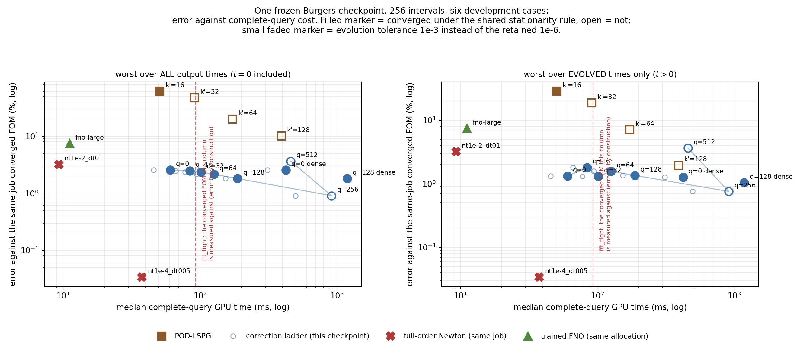

# The top of the correction ladder, and the combined envelope

Two questions on one frozen Burgers checkpoint at 256 intervals: whether the $q=256$ rung of the fixed-weight correction ladder can be made to converge, and what the whole inference-time envelope costs when the ladder, the quadrature, the evolution tolerance, classical POD-LSPG, the full-order solver and a trained neural operator are all priced in the same job on the same GPU. **All numbers below are final for this study** and are generated from the audited run JSONs; the predeclared protocol is `experiments/b-ladder-top/DESIGN.md`.

## Provenance

| job | Slurm id | GPU | source commit | elapsed seconds |
|---|---|---|---|---|
| Q1 convergence sweep | 3745589 | NVIDIA A100 80GB PCIe | b03fc2e07aa3ed98cacaccaacbd640f078d19f3d | 5641.8 |
| Q2 envelope | 3747245 | NVIDIA A100-PCIE-40GB | a9b99c50cb2e5b274cd02cf5b53dc62cc9eb8c75 | 6557.5 |

## Gates

### Q1

| gate | passed | kind |
|---|---|---|
| `artifacts_present` | yes | blocking |
| `backend_gpu` | yes | blocking |
| `bank_frozen` | yes | blocking |
| `cclad01_fidelity` | yes | blocking |
| `checkpoint_unchanged` | yes | blocking |
| `complete` | yes | blocking |
| `directions_hash_matches_cclad01` | yes | informational |
| `directions_rank_covers_ladder` | yes | blocking |
| `every_eq_rule_reports_validity` | yes | blocking |
| `every_invocation_paired` | yes | blocking |
| `every_rom_carries_exit_and_stationarity` | yes | blocking |
| `every_subject_case_has_all_reps` | yes | blocking |
| `final_cohort_unopened` | yes | blocking |
| `overdetermined_weak_system` | yes | blocking |
| `precision_highest` | yes | blocking |
| `q0_arms_bitwise` | yes | blocking |
| `recorded_errors_recomputed_from_saved_fields` | yes | blocking |
| `reference_fields_bitwise_match_cclad01` | no | informational |
| `reference_residuals` | yes | blocking |
| `repetition_output_identical` | yes | blocking |
| `reproduces_q0_m4_dense_base` | yes | blocking |
| `reproduces_q0_m4_eq_base` | yes | blocking |
| `reproduces_q128_m2_dense_base` | yes | blocking |
| `same_grid_baseline_present` | yes | blocking |
| `x64` | yes | blocking |

### Q2

| gate | passed | kind |
|---|---|---|
| `artifacts_present` | yes | blocking |
| `backend_gpu` | yes | blocking |
| `bank_frozen` | yes | blocking |
| `cclad01_fidelity` | yes | blocking |
| `checkpoint_unchanged` | yes | blocking |
| `complete` | yes | blocking |
| `directions_hash_matches_cclad01` | no | informational |
| `directions_rank_covers_ladder` | yes | blocking |
| `every_eq_rule_reports_validity` | yes | blocking |
| `every_invocation_paired` | yes | blocking |
| `every_rom_carries_exit_and_stationarity` | yes | blocking |
| `every_subject_case_has_all_reps` | yes | blocking |
| `final_cohort_unopened` | yes | blocking |
| `fno_cohort_disjoint_from_training` | yes | blocking |
| `fno_returns_supplied_field_at_t0` | yes | blocking |
| `overdetermined_weak_system` | yes | blocking |
| `precision_highest` | yes | blocking |
| `recorded_errors_recomputed_from_saved_fields` | yes | blocking |
| `reference_fields_bitwise_match_cclad01` | yes | informational |
| `reference_residuals` | yes | blocking |
| `repetition_output_identical` | yes | blocking |
| `reproduces_q0_M256_dense_g1em06` | yes | blocking |
| `reproduces_q128_M256_dense_g1em06` | yes | blocking |
| `same_grid_baseline_present` | yes | blocking |
| `x64` | yes | blocking |

## Q1 — making the top of the ladder converge

### Fidelity gates against the cheap-corrections job

| arm | reproduces | declared tolerance | relative difference (reference metric) | relative difference (same-grid metric) | ours worst reference % | theirs worst reference % | passed |
|---|---|---|---|---|---|---|---|
| `q0_m4_dense_base` | `q0_m4_dense_block` | 0.000000001000 | 0.000000000000 | 0.000000000000 | 4.5575 | 4.5575 | yes |
| `q0_m4_eq_base` | `q0_m4_eq_varpro` | 0.000000001000 | 0.000000000000 | 0.000000000000 | 4.5546 | 4.5546 | yes |
| `q128_m2_dense_base` | `q128_m2_dense_block` | 0.000000001000 | 0.000000000000 | 0.000000000000 | 4.0803 | 4.0803 | yes |

### Conditioning of the augmented normal equations

Measured offline at one representative state (case 0, the step the configuration names), never inside a timed query. $\kappa$ is the 2-norm condition number of the damped Gauss-Newton matrix at $\lambda = 10^{-6}$; the equilibrated column is fix (b).

| q | unknowns | M | min column norm | max column norm | column norm ratio | $\kappa(J)$ | $\kappa$ unscaled | $\kappa$ equilibrated | improvement |
|---|---|---|---|---|---|---|---|---|---|
| 0 | 16 | 32 | 1.915e+01 | 8.102e+01 | 4.231e+00 | 5.560e+02 | 2.968e+05 | 2.582e+05 | 1.149 |
| 64 | 80 | 160 | 7.596e-01 | 6.992e+01 | 9.204e+01 | 6.004e+02 | 3.475e+05 | 2.271e+05 | 1.530 |
| 128 | 144 | 288 | 8.917e-01 | 7.380e+01 | 8.277e+01 | 8.057e+02 | 6.080e+05 | 4.342e+05 | 1.400 |
| 256 | 272 | 544 | 8.791e-01 | 9.374e+01 | 1.066e+02 | 3.454e+03 | 6.139e+06 | 3.492e+06 | 1.758 |
| 512 | 528 | 1056 | 6.981e-01 | 6.795e+01 | 9.735e+01 | 4.833e+16 | 6.865e+10 | 3.494e+07 | 1964.597 |

### The convergence sweep

Dense quadrature throughout, so no quadrature rule confounds the reading. `base` is the cheap-corrections block-damped solver itself. A cascade arm also reports the cost of the coarse rung it was started from.

| arm | q | fix | M | median iters/step | max iters | budget exits | exit reasons | worst joint gradient | worst same-grid all % | worst evolved % | t0 compression % | median GPU ms | cascade total ms | converged |
|---|---|---|---|---|---|---|---|---|---|---|---|---|---|---|
| `q0_m4_dense_base` | 0 | `base` | 64 | 3.0 | 29 | 0 | 4:900 | 9.970e-07 | 2.5629 | 1.8890 | 2.5629 | 284.991 | — | yes |
| `q0_m4_dense_pre` | 0 | `pre` | 64 | 3.0 | 29 | 0 | 4:900 | 9.970e-07 | 2.5629 | 1.8890 | 2.5629 | 285.330 | — | yes |
| `q0_m4_dense_predamp` | 0 | `predamp` | 64 | 3.0 | 29 | 0 | 4:900 | 9.970e-07 | 2.5629 | 1.8890 | 2.5629 | 284.855 | — | yes |
| `q64_m2_dense_base` | 64 | `base` | 160 | 3.0 | 30 | 0 | 4:900 | 9.909e-07 | 2.1489 | 1.4480 | 2.1489 | 535.900 | — | yes |
| `q64_m2_dense_predamp` | 64 | `predamp` | 160 | 3.0 | 30 | 0 | 4:900 | 9.909e-07 | 2.1489 | 1.4480 | 2.1489 | 534.841 | — | yes |
| `q128_m2_dense_base` | 128 | `base` | 288 | 3.0 | 42 | 0 | 4:900 | 9.983e-07 | 1.8116 | 0.9799 | 1.8116 | 913.684 | — | yes |
| `q128_m2_dense_casc` | 128 | `casc` | 288 | 3.0 | 180 | 63 | 0:63, 4:837 | 5.339e-02 | 1.8116 | 0.9799 | 1.8116 | 1043.120 | 1577.962 | no |
| `q128_m2_dense_damp` | 128 | `damp` | 288 | 3.0 | 42 | 0 | 4:900 | 9.983e-07 | 1.8116 | 0.9799 | 1.8116 | 913.827 | — | yes |
| `q128_m2_dense_pre` | 128 | `pre` | 288 | 3.0 | 42 | 0 | 4:900 | 9.983e-07 | 1.8116 | 0.9799 | 1.8116 | 914.715 | — | yes |
| `q128_m2_dense_predamp` | 128 | `predamp` | 288 | 3.0 | 42 | 0 | 4:900 | 9.983e-07 | 1.8116 | 0.9799 | 1.8116 | 914.730 | — | yes |
| `q256_m2_dense_base` | 256 | `base` | 544 | 5.0 | 180 | 15 | 0:15, 4:885 | 1.191e-03 | 0.9053 | 0.7566 | 0.9053 | 3398.977 | — | no |
| `q256_m2_dense_casc` | 256 | `casc` | 544 | 7.0 | 180 | 180 | 0:180, 4:720 | 2.212e-02 | 0.9053 | 0.7566 | 0.9053 | 12301.559 | 13216.289 | no |
| `q256_m2_dense_damp` | 256 | `damp` | 544 | 5.0 | 180 | 15 | 0:15, 4:885 | 1.191e-03 | 0.9053 | 0.7566 | 0.9053 | 3413.226 | — | no |
| `q256_m2_dense_pre` | 256 | `pre` | 544 | 5.0 | 180 | 15 | 0:15, 4:885 | 1.191e-03 | 0.9053 | 0.7566 | 0.9053 | 3399.543 | — | no |
| `q256_m2_dense_predamp` | 256 | `predamp` | 544 | 5.0 | 180 | 15 | 0:15, 4:885 | 1.191e-03 | 0.9053 | 0.7566 | 0.9053 | 3410.992 | — | no |
| `q512_m2_dense_base` | 512 | `base` | 1056 | 2.0 | 3 | 0 | 4:900 | 1.497e-01 | 0.6027 | 0.4343 | 0.6027 | 2402.103 | — | no |
| `q512_m2_dense_casc` | 512 | `casc` | 1056 | 2.0 | 3 | 0 | 4:900 | 1.732e-01 | 0.6027 | 0.4343 | 0.6027 | 2372.593 | 5783.585 | no |
| `q512_m2_dense_damp` | 512 | `damp` | 1056 | 2.0 | 18 | 0 | 4:900 | 1.497e-01 | 0.6027 | 0.4343 | 0.6027 | 2431.989 | — | no |
| `q512_m2_dense_pre` | 512 | `pre` | 1056 | 2.0 | 3 | 0 | 4:900 | 1.497e-01 | 0.6027 | 0.4343 | 0.6027 | 2404.754 | — | no |
| `q512_m2_dense_predamp` | 512 | `predamp` | 1056 | 2.0 | 18 | 0 | 4:900 | 1.497e-01 | 0.6027 | 0.4343 | 0.6027 | 2424.614 | — | no |

### The empirical quadrature rule per rung

A rule is VALID only when the bounded fitter stopped on target support or on the gradient criterion. A walltime-truncated rule disqualifies its arm; that gate is pre-registered and does not look at the rung's error.

| arm | q | M | m | relative fit | truncated | rule valid | fit seconds | worst same-grid all % | worst evolved % | median GPU ms | converged |
|---|---|---|---|---|---|---|---|---|---|---|---|
| `q0_m4_eq_base` | 0 | 64 | 256 | 0.005159 | no | yes | 13.3 | 2.5629 | 1.9002 | 48.907 | yes |
| `q128_m2_eq_base` | 128 | 288 | 1152 | 0.000288 | no | yes | 217.5 | 1.8116 | 1.1515 | 182.093 | yes |
| `q128_m2_eq_predamp` | 128 | 288 | 1152 | 0.000288 | no | yes | 217.5 | 1.8116 | 1.1515 | 184.949 | yes |
| `q256_m2_eq_base` | 256 | 544 | 2048 | 0.000083 | no | yes | 841.7 | 0.9053 | 0.7580 | 842.368 | no |
| `q256_m2_eq_predamp` | 256 | 544 | 2048 | 0.000083 | no | yes | 841.7 | 0.9053 | 0.7580 | 853.113 | no |
| `q512_m2_eq_base` | 512 | 1056 | 2048 | 0.000206 | no | yes | 1005.9 | 3.6505 | 3.6505 | 396.541 | no |
| `q512_m2_eq_predamp` | 512 | 1056 | 2048 | 0.000206 | no | yes | 1005.9 | 3.6505 | 3.6505 | 410.159 | no |

### Same-job full-order controls

| method | worst same-grid all % | worst vs reference % | median GPU ms |
|---|---|---|---|
| `fft_tight` | 0.0000 | 4.0265 | 90.052 |
| `nt1e-2` | 3.7127 | 2.4737 | 15.450 |

### Where each rung's non-convergence actually lives

Localised from the saved per-step exit reasons and the initial-fit diagnostics, not asserted: an arm can miss the shared rule in its supplied-field fit, in its time stepping, or in both.

| arm | q | fix | converged | failure located in | initial-fit relative residual (min, max) | initial-fit exit reasons | worst initial-fit gradient | worst step gradient | cases with budget exits | their failing step indices |
|---|---|---|---|---|---|---|---|---|---|---|
| `q0_m4_dense_base` | 0 | `base` | yes | — | (8.145e-03, 2.512e-02) | 4:18 | 6.986e-07 | 9.970e-07 | 0 | — |
| `q0_m4_dense_pre` | 0 | `pre` | yes | — | (8.145e-03, 2.512e-02) | 4:18 | 6.986e-07 | 9.970e-07 | 0 | — |
| `q0_m4_dense_predamp` | 0 | `predamp` | yes | — | (8.145e-03, 2.512e-02) | 4:18 | 6.986e-07 | 9.970e-07 | 0 | — |
| `q64_m2_dense_base` | 64 | `base` | yes | — | (6.293e-03, 2.102e-02) | 4:18 | 7.333e-07 | 9.909e-07 | 0 | — |
| `q64_m2_dense_predamp` | 64 | `predamp` | yes | — | (6.293e-03, 2.102e-02) | 4:18 | 7.333e-07 | 9.909e-07 | 0 | — |
| `q128_m2_dense_base` | 128 | `base` | yes | — | (4.902e-03, 1.758e-02) | 4:18 | 5.437e-07 | 9.983e-07 | 0 | — |
| `q128_m2_dense_casc` | 128 | `casc` | no | time stepping only | (4.902e-03, 1.758e-02) | 4:18 | 5.294e-07 | 5.339e-02 | 1 | case 1: [21, 22, 24, 25, 27, 28, 30, 31, 33, 34, 36, 37, 39, 40, 42, 43, 45, 46, 47, 48, 49] |
| `q128_m2_dense_damp` | 128 | `damp` | yes | — | (4.902e-03, 1.758e-02) | 4:18 | 5.437e-07 | 9.983e-07 | 0 | — |
| `q128_m2_dense_pre` | 128 | `pre` | yes | — | (4.902e-03, 1.758e-02) | 4:18 | 5.437e-07 | 9.983e-07 | 0 | — |
| `q128_m2_dense_predamp` | 128 | `predamp` | yes | — | (4.902e-03, 1.758e-02) | 4:18 | 5.437e-07 | 9.983e-07 | 0 | — |
| `q256_m2_dense_base` | 256 | `base` | no | time stepping only | (1.623e-03, 8.069e-03) | 4:18 | 1.274e-07 | 1.191e-03 | 1 | case 0: [0, 1, 2, 3, 31] |
| `q256_m2_dense_casc` | 256 | `casc` | no | time stepping only | (1.623e-03, 8.069e-03) | 4:18 | 1.232e-07 | 2.212e-02 | 3 | case 0: [0, 1, 2, 3, 4, 5, 6, 7, 8, 9, 10, 11, 12, 13, 14, 15, 16, 17, 18, 19, 20, 21, 22]; case 1: [7, 8, 9, 10, 11, 12, 13, 14, 15, 16, 17, 18, 19, 20, 21, 22, 23, 24, 25, 26, 28, 29, 31, 32, 34, 35, 37, 38, 40, 41, 43, 44, 46, 47, 49]; case 2: [25, 26] |
| `q256_m2_dense_damp` | 256 | `damp` | no | time stepping only | (1.623e-03, 8.069e-03) | 4:18 | 1.274e-07 | 1.191e-03 | 1 | case 0: [0, 1, 2, 3, 31] |
| `q256_m2_dense_pre` | 256 | `pre` | no | time stepping only | (1.623e-03, 8.069e-03) | 4:18 | 1.274e-07 | 1.191e-03 | 1 | case 0: [0, 1, 2, 3, 31] |
| `q256_m2_dense_predamp` | 256 | `predamp` | no | time stepping only | (1.623e-03, 8.069e-03) | 4:18 | 1.274e-07 | 1.191e-03 | 1 | case 0: [0, 1, 2, 3, 31] |
| `q512_m2_dense_base` | 512 | `base` | no | initial fit only | (3.963e-17, 9.058e-17) | 2:18 | 1.497e-01 | 5.819e-07 | 0 | — |
| `q512_m2_dense_casc` | 512 | `casc` | no | initial fit only | (2.610e-17, 7.441e-17) | 2:18 | 1.732e-01 | 1.242e-07 | 0 | — |
| `q512_m2_dense_damp` | 512 | `damp` | no | initial fit only | (3.963e-17, 9.058e-17) | 2:18 | 1.497e-01 | 8.542e-07 | 0 | — |
| `q512_m2_dense_pre` | 512 | `pre` | no | initial fit only | (3.963e-17, 9.058e-17) | 2:18 | 1.497e-01 | 5.819e-07 | 0 | — |
| `q512_m2_dense_predamp` | 512 | `predamp` | no | initial fit only | (3.963e-17, 9.058e-17) | 2:18 | 1.497e-01 | 8.542e-07 | 0 | — |

At $q=512$ the correction directions span the **whole** bank ($q=R$), so the supplied field is fitted to machine zero — the initial-fit relative residual is 3.963e-17 to 9.058e-17 — and the normalized gradient $\|J^\top r\|/(\|J\|\,\|r\|)$ becomes a $0/0$ ratio. Its reported value 1.497e-01 therefore measures nothing, while every time step of that rung is stationary at 5.819e-07. The $q=512$ rung is a **degenerate endpoint of the stopping rule, not a solver failure** — the same thing the Poisson $q=R$ rung showed.

### Verdict on Q1

**FAIL.** No fix converged the $q=256$ rung under the shared stopping rule. The arms and their exit-reason histograms are in the sweep table above; the pre-registered falsification clauses in `DESIGN.md` say which reading the data supports.

## Q2 — the combined envelope, one job

Three error columns on every row. The same-grid error is measured against the converged full-order solve timed in this same job, which returns the supplied field exactly at $t=0$; so the $t=0$ column is the decoder's compression of the supplied field, the all-times column is pinned by it, and the evolved column is the trajectory error alone.

| subject | family | q / k' | M | m | quadrature | evolution tol | worst all times % | worst evolved % | t0 compression % | worst vs reference % | median GPU ms | median complete query ms | converged |
|---|---|---|---|---|---|---|---|---|---|---|---|---|---|
| `fno-large` | fno | None | None | None | — | — | 7.4164 | 7.4164 | 0.0000 | 5.7495 | 11.206 | 11.935 | — |
| `fft_tight` | fom | None | None | None | — | — | 0.0000 | 0.0000 | 0.0000 | 4.0265 | 92.903 | 95.190 | — |
| `nt1e-2_dt01` | fom | None | None | None | — | — | 3.1999 | 3.1999 | 0.0000 | 3.6168 | 9.312 | 11.836 | — |
| `nt1e-4_dt005` | fom | None | None | None | — | — | 0.0338 | 0.0338 | 0.0000 | 4.0320 | 37.699 | 40.302 | — |
| `pod16_dense` | pod | 16 | 64 | None | dense | 1e-06 | 61.6503 | 28.7250 | 61.6503 | 61.6503 | 50.835 | 53.433 | yes |
| `pod32_dense` | pod | 32 | 128 | None | dense | 1e-06 | 47.0681 | 18.7995 | 47.0681 | 47.0681 | 91.176 | 93.599 | no |
| `pod64_dense` | pod | 64 | 256 | None | dense | 1e-06 | 19.8156 | 7.0835 | 19.8156 | 19.8156 | 172.769 | 175.134 | no |
| `pod128_dense` | pod | 128 | 512 | None | dense | 1e-06 | 10.1198 | 1.9464 | 10.1198 | 10.1198 | 392.033 | 394.382 | no |
| `q0_M256_dense_g0p001` | rom | 0 | 256 | None | dense | 0.001 | 2.5628 | 1.2705 | 2.5628 | 4.0612 | 311.286 | 313.371 | no |
| `q0_M256_dense_g1em06` | rom | 0 | 256 | None | dense | 1e-06 | 2.5629 | 1.2710 | 2.5629 | 4.0637 | 422.825 | 425.389 | yes |
| `q0_M256_eq_g0p001` | rom | 0 | 256 | 1024 | eq | 0.001 | 2.5628 | 1.3182 | 2.5628 | 4.0678 | 45.762 | 48.314 | no |
| `q0_M256_eq_g1em06` | rom | 0 | 256 | 1024 | eq | 1e-06 | 2.5629 | 1.3186 | 2.5629 | 4.0703 | 60.627 | 63.086 | yes |
| `q16_M256_eq_g0p001` | rom | 16 | 256 | 1024 | eq | 0.001 | 2.4806 | 1.8070 | 2.4806 | 4.0646 | 66.350 | 69.018 | no |
| `q16_M256_eq_g1em06` | rom | 16 | 256 | 1024 | eq | 1e-06 | 2.4806 | 1.8066 | 2.4806 | 4.0663 | 84.494 | 87.018 | yes |
| `q32_M256_eq_g0p001` | rom | 32 | 256 | 1024 | eq | 0.001 | 2.3534 | 1.3052 | 2.3534 | 4.0621 | 77.793 | 80.536 | no |
| `q32_M256_eq_g1em06` | rom | 32 | 256 | 1024 | eq | 1e-06 | 2.3534 | 1.3048 | 2.3534 | 4.0633 | 101.934 | 104.295 | yes |
| `q64_M256_eq_g0p001` | rom | 64 | 256 | 1024 | eq | 0.001 | 2.1489 | 1.5742 | 2.1489 | 4.0863 | 94.373 | 96.868 | no |
| `q64_M256_eq_g1em06` | rom | 64 | 256 | 1024 | eq | 1e-06 | 2.1489 | 1.5738 | 2.1489 | 4.0880 | 126.211 | 128.898 | yes |
| `q128_M256_dense_g1em06` | rom | 128 | 256 | None | dense | 1e-06 | 1.8116 | 1.0418 | 1.8116 | 4.0926 | 1183.578 | 1186.216 | yes |
| `q128_M256_eq_g0p001` | rom | 128 | 256 | 1024 | eq | 0.001 | 1.8116 | 1.3517 | 1.8116 | 4.0892 | 153.748 | 156.347 | no |
| `q128_M256_eq_g1em06` | rom | 128 | 256 | 1024 | eq | 1e-06 | 1.8116 | 1.3517 | 1.8116 | 4.0902 | 188.358 | 190.953 | yes |
| `q256_M544_eq_g0p001` | rom | 256 | 544 | 2048 | eq | 0.001 | 0.9053 | 0.7580 | 0.9053 | 4.0607 | 496.671 | 499.326 | no |
| `q256_M544_eq_g1em06` | rom | 256 | 544 | 2048 | eq | 1e-06 | 0.9053 | 0.7580 | 0.9053 | 4.0617 | 912.092 | 914.671 | no |
| `q512_M1056_eq_g1em06` | rom | 512 | 1056 | 2048 | eq | 1e-06 | 3.6505 | 3.6505 | 0.6027 | 4.4829 | 459.722 | 462.158 | no |

### Non-dominated set over (median GPU ms, worst error) — all output times, all subjects

| subject | family | q / k' | worst error % | median GPU ms | converged |
|---|---|---|---|---|---|
| `nt1e-2_dt01` | fom | None | 3.1999 | 9.312 | — |
| `nt1e-4_dt005` | fom | None | 0.0338 | 37.699 | — |
| `fft_tight` | fom | None | 0.0000 | 92.903 | — |

### Non-dominated set over (median GPU ms, worst error) — evolved times only, all subjects

| subject | family | q / k' | worst error % | median GPU ms | converged |
|---|---|---|---|---|---|
| `nt1e-2_dt01` | fom | None | 3.1999 | 9.312 | — |
| `nt1e-4_dt005` | fom | None | 0.0338 | 37.699 | — |
| `fft_tight` | fom | None | 0.0000 | 92.903 | — |

### Is $q$ a knob?

| metric | monotone at the fixed test count | monotone over every rung | converged non-dominated points | cost span | error span | passes the pre-registered criterion |
|---|---|---|---|---|---|---|
| evolved | no | no | 4 | 19.522 | 1.266 | no |
| all_times | yes | no | 5 | 3.107 | 1.415 | no |

The retained ladder on the **evolved** metric (fixed test count, empirical quadrature, evolution tolerance $10^{-6}$):

| q | M | worst error % | median GPU ms |
|---|---|---|---|
| 0 | 256 | 1.3186 | 60.627 |
| 16 | 256 | 1.8066 | 84.494 |
| 32 | 256 | 1.3048 | 101.934 |
| 64 | 256 | 1.5738 | 126.211 |
| 128 | 256 | 1.3517 | 188.358 |
| 256 | 544 | 0.7580 | 912.092 |
| 512 | 1056 | 3.6505 | 459.722 |

The retained ladder on the **all_times** metric (fixed test count, empirical quadrature, evolution tolerance $10^{-6}$):

| q | M | worst error % | median GPU ms |
|---|---|---|---|
| 0 | 256 | 2.5629 | 60.627 |
| 16 | 256 | 2.4806 | 84.494 |
| 32 | 256 | 2.3534 | 101.934 |
| 64 | 256 | 2.1489 | 126.211 |
| 128 | 256 | 1.8116 | 188.358 |
| 256 | 544 | 0.9053 | 912.092 |
| 512 | 1056 | 3.6505 | 459.722 |

### Verdict on Q2

**Nothing but the full-order solver is on the envelope.** On BOTH metrics the non-dominated set over every subject in this job contains only same-job full-order controls: no correction-ladder rung, no POD-LSPG rank and not the trained neural operator survives. The cheapest non-dominated point is `nt1e-2_dt01` at 9.312 ms and 3.1999 % evolved error, and `nt1e-4_dt005` at 37.699 ms reaches 0.0338 %. The most accurate reduced-order arm, `q256_M544_eq_g0p001`, needs 496.671 ms for 0.7580 %, and the cheapest, `q0_M256_eq_g0p001`, needs 45.762 ms for 1.3182 %.

**The ladder's monotonicity is the $t=0$ compression term, not the trajectory.** On the all-times metric the fixed-test-count rungs fall monotonically 2.5629 % -> 1.8116 % from $q=0$ to $q=128$, and that column is pinned at every rung by the decoder's compression of the supplied field. On the evolved-times metric the same rungs are NOT monotone: $q=16$ (1.8066 %) is worse than $q=0$ (1.3186 %), and the whole converged non-dominated set spans only 1.266x in error across 19.522x in cost. The pre-registered criterion for calling $q$ a knob therefore fails on both metrics, and it fails for a different reason on each: error span on the all-times metric, monotonicity and error span on the evolved one.

### The trained FNO, in this allocation

`fno-large`, 17,877,317 real parameters, checkpoint SHA256 `208d9002cd8e8567…`, NVIDIA A100-PCIE-40GB, torch 2.11.0+cu128 / neuraloperator 2.0.0, float64/complex128. Pooled device query 11.206 ms median over 18 retained repetitions.

It returns the supplied field bitwise at $t=0$, so its $t=0$ compression is exactly zero and the all-times metric flatters it relative to the ROM, whose output contract decodes $t=0$ from the latent code. That is the whole reason both metrics are reported.

## The envelope

Marker shape is the family, fill is convergence under the shared stationarity rule, the $q$ label is the correction rank and $k'$ the POD rank. The left panel is the worst error over all output times and the right panel over evolved times only; the ladder line joins the retained empirical-quadrature rungs at evolution tolerance $10^{-6}$.

## Glossary

**ROM / reduced-order model** — a solver that evolves a handful of coefficients instead of the 65,025 interior grid values, and reconstructs the field from them.

**FOM / full-order model** — the ordinary finite-difference Burgers solver on the same 256-interval grid, timed in the same job. `fft_tight` is the converged one; `nt1e-4_dt005` and `nt1e-2_dt01` are cheaper, looser settings.

**checkpoint** — one set of trained neural weights, frozen. Nothing in this report retrains anything; every row uses the same weights.

**$K$ (latent dimension)** — the 16 coordinates the trained decoder takes as input.

**$R$ (bank rank)** — the 512 spatial basis functions the decoder outputs coefficients for. The reduced state is always a combination of these 512.

**$q$ (correction rank)** — the number of extra linear directions solved alongside the 16 latent coordinates. $q=0$ is the plain trained decoder; larger $q$ gives the solver more freedom inside the same 512-dimensional bank.

**directions $C_q$** — the extra directions, fixed offline and nested: the first $q$ columns of one matrix, so every rung is a subset of the next.

**$M$ (test count)** — how many weak equations the solver fits at each time step. It must exceed the number of unknowns $K+q$.

**$m$ (quadrature support)** — how many grid points the empirical quadrature rule evaluates the nonlinear term at, instead of all 65,025.

**EQ / empirical quadrature** — a fitted, nonnegatively weighted subset of grid points that reproduces the nonlinear term cheaply. `dense` means no such rule: every point is used.

**NNLS** — nonnegative least squares, the fit that chooses the quadrature points and their weights.

**truncated rule** — a quadrature rule whose fitter ran out of walltime before reaching its target number of points. Such a rule is disqualified here.

**LM / Levenberg-Marquardt** — the damped Gauss-Newton iteration that solves the weak equations at each time step.

**trust radius** — a cap on how far one iteration may move the unknowns.

**damping / ridge** — a value added to the diagonal of the normal equations that shrinks and stabilises the step; larger damping means a smaller, safer step.

**column equilibration** — rescaling each unknown so that its column of the Jacobian has unit length. It does not change the answer in exact arithmetic, only the floating-point conditioning of the linear solve.

**$\kappa$ (condition number)** — how much a linear solve can amplify rounding error. $10^{16}$ means no correct digits are left in double precision.

**cascade warm start** — starting the $q$ rung from the converged $q/2$ rung's answer, padded with zeros. Its cost column adds the coarse rung's cost.

**normalized gradient** — $\|J^\top r\|/(\|J\|\,\|r\|)$, the scale-free measure of how close a solve is to a stationary point. The shared rule asks for $10^{-6}$.

**budget exit** — a time step that ran out of solver iterations before meeting any stopping criterion. Any budget exit means the arm is not converged.

**exit reasons** — 0 = ran out of iterations, 1 = the residual fell below the absolute tolerance, 2 = the step became negligibly small, 4 = the normalized gradient met the tolerance.

**converged** — every time step and the initial fit exited for reason 1, 2 or 4, with no budget exit, and the worst normalized gradient was at most $10^{-6}$.

**evolution tolerance** — the normalized-gradient tolerance applied at each time step. The initial fit always uses $10^{-6}$.

**same-grid error** — distance from the converged full-order solve on the same grid in the same job, divided by the norm of the supplied initial field.

**reference error** — distance from a 4096-interval solve restricted to this grid — a stricter comparator that also charges the discretisation error of the 256 grid.

**worst over all times** — the largest of those distances over the six output times $t = 0, 0.05, \dots, 0.25$ and over the six cases.

**worst over evolved times** — the same, but over $t>0$ only.

**t0 compression** — the error at $t=0$ alone: how well the decoder can represent the field it was handed. It is not a solver error and no amount of solving removes it.

**POD-LSPG** — the classical linear reduced-order model: a rank-$k'$ basis from the same training snapshots, with no neural network, solved through the same weak objective.

**FNO** — Fourier Neural Operator — a trained network that maps the initial field straight to the whole trajectory, with no solver at all.

**non-dominated set** — the subjects no other subject beats on both cost and error at once; the useful operating points.

**held-out / development cohort** — the six physical cases used here were opened for development earlier in this campaign. The final evaluation cases remain sealed.

**bank projection / best found** — how well the 512 basis functions, and the arm's own manifold, could represent the true field if the solver were perfect. These are representation floors, not solver results.

