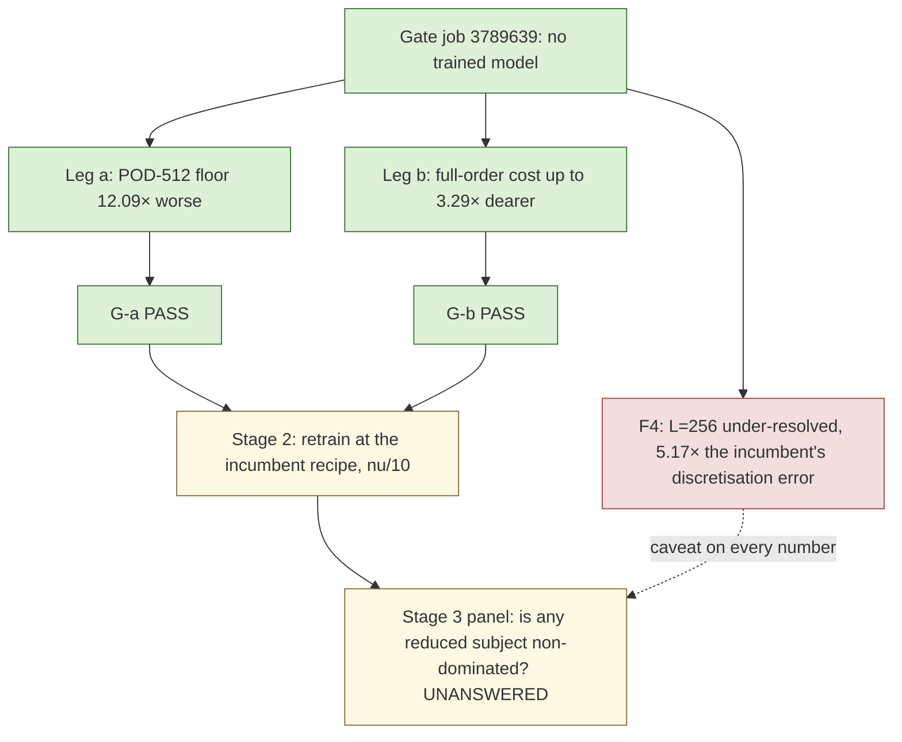

# b-lowvisc — the low-viscosity Burgers gate: both legs pass, with an under-resolution caveat

Generated by `reports/generate_lowvisc.py` from gate job `3789639`'s `result.json` and its
independent audit. **These numbers are final for the gate stage.** They decide whether the
training stage runs; they contain no trained model and therefore say nothing yet about whether
the nonlinear manifold wins. The training job `lvt01` is queued as a consequence of this verdict.

## Verdict

Both pre-registered gates pass.

* **G-a (leg a, the Kolmogorov width)** required the low-viscosity POD-512 projection floor to be
  at least 2.0× the incumbent's on worst-all-times, in the same job. Measured
  **12.092×** (0.6090 % → 7.3643 %),
  and **83.79×** on the worst-evolved metric. **PASS.**
* **G-b (leg b, the full-order cost)** required at least one tuned full-order setting to cost
  1.5× more on the low-viscosity family, in the same job. Measured **3.292×**,
  and *every one* of the 8 settings costs more (1.140×–3.292×).
  **PASS.** The design recorded leg (b) as the weaker leg *before* the measurement; it passed anyway.

Therefore the training stage is submitted, at the incumbent architecture and recipe with the
viscosity family as the only changed variable (DESIGN §5, stage 2).

**F4 is triggered and is not buried.** At the training mesh $L=256$ the low-viscosity family's
discretisation error against the 4096-interval reference is
20.8206 % against the incumbent's
4.0265 %, a ratio of 5.171×, above F4's
3× bar. Per the pre-registration this does not stop the lane — the go/no-go is G-a — but **every
low-viscosity number in this lane carries that caveat inline, and the cell is not offered as a
paper headline without a finer-mesh confirmation.** The cause is known and was written down
before the job ran: first-order upwinding contributes a numerical viscosity $|u|h/2$ that is
comparable to or larger than the physical $\nu$ for most of the low-viscosity cases at this mesh.

## The setup, in one line

The low-viscosity cohort **is** the incumbent cohort with $\nu$ divided by ten and nothing else
changed: the descriptors $(c_x,c_y,w,a)$ are bitwise identical and
$\nu_{\rm inc}/\nu_{\rm low}=10$ to 3.55e-16 relative,
re-derived in job and again by the audit.

$$\nu_{\rm incumbent}\sim\exp U(\log 10^{-2},\log 10^{-1}),\qquad
  \nu_{\rm low}\sim\exp U(\log 10^{-3},\log 10^{-2}).$$

**Validity.** The incumbent family's POD floors reproduce b-panel job `3780638`'s own
`best-found` column to 1.18e-06 relative, and the incumbent $L=256$ discretisation error
reproduces that job's 4.0265 % exactly. This
job's measurement is the panel's measurement, so the cross-family comparison is admissible.

## Leg (a) — POD degrades, and the degradation grows with rank

| POD rank $k$ | incumbent floor, worst-all-times % | low-viscosity floor % | ratio | incumbent worst-evolved % | low-viscosity worst-evolved % | evolved ratio |
|---|---|---|---|---|---|---|
| 16 | 61.6503 | 67.3429 | 1.092× | 28.2172 | 57.8338 | 2.050× |
| 32 | 47.0681 | 54.4539 | 1.157× | 18.2163 | 45.0333 | 2.472× |
| 64 | 19.8147 | 35.1339 | 1.773× | 6.7702 | 25.7885 | 3.809× |
| 128 | 10.1189 | 23.2019 | 2.293× | 1.7206 | 16.0559 | 9.332× |
| 256 | 3.7686 | 15.2670 | 4.051× | 0.4080 | 9.5329 | 23.366× |
| 512 | 0.6090 | 7.3643 | 12.092× | 0.0670 | 5.6109 | 83.793× |

The shape matters more than the headline. At $k=16$ the two families are nearly equally hard
(1.092×): a 16-mode basis is bad for both. The gap opens monotonically with
rank and is widest exactly where the incumbent cell is good, which is the signature of a slower
Kolmogorov-width decay rather than a uniform accuracy shift. A rank-512 POD basis reaches
0.6090 % on the incumbent family and only
7.3643 % on the low-viscosity one.

### The singular-value decay

| POD rank $k$ | incumbent $\sigma_k/\sigma_1$ | low-viscosity $\sigma_k/\sigma_1$ | incumbent tail energy | low-viscosity tail energy |
|---|---|---|---|---|
| 16 | 6.321e-02 | 8.992e-02 | 1.297e-02 | 3.381e-02 |
| 32 | 2.098e-02 | 3.883e-02 | 2.537e-03 | 1.138e-02 |
| 64 | 6.238e-03 | 1.613e-02 | 3.039e-04 | 3.438e-03 |
| 128 | 1.121e-03 | 6.057e-03 | 1.271e-05 | 7.973e-04 |
| 256 | 9.049e-05 | 1.964e-03 | 1.074e-07 | 1.147e-04 |
| 512 | 1.845e-06 | 3.996e-04 | 5.979e-11 | 6.452e-06 |

The incumbent snapshot spectrum collapses by 1.85e-06 over 512 modes; the
low-viscosity one by only 4.00e-04, i.e. **217×
less**. The incumbent basis is numerically rank-deficient by mode 512 — the tail sits at the f64
accumulation floor — while the low-viscosity basis still carries real energy there. That is the
same statement as the floor table, read off the spectrum instead of the projection.

## Leg (b) — the full-order solve does get more expensive

| full-order setting | incumbent ms | low-viscosity ms | cost ratio | incumbent Newton its | low-viscosity Newton its | Newton ratio | incumbent worst-evolved % | low-viscosity worst-evolved % |
|---|---|---|---|---|---|---|---|---|
| `nt1e-2_dt01` | 9.07 | 14.27 | 1.574× | 33 | 63 | 1.909× | 3.2 | 3.895 |
| `nt1e-2_dt005` | 15.73 | 17.93 | 1.140× | 51 | 94 | 1.843× | 3.713 | 5.254 |
| `nt1e-3_dt01` | 19.90 | 63.51 | 3.191× | 27 | 50 | 1.852× | 1.518 | 3.28 |
| `nt1e-4_dt01` | 27.87 | 88.88 | 3.189× | 49 | 64 | 1.306× | 1.511 | 3.28 |
| `nt1e-3_dt005` | 31.87 | 55.73 | 1.749× | 52 | 84 | 1.615× | 0.0489 | 0.1971 |
| `nt1e-4_dt005` | 37.13 | 122.21 | 3.292× | 56 | 100 | 1.786× | 0.03385 | 0.05708 |
| `dense_tight` | 62.47 | 116.34 | 1.862× | 101 | 135 | 1.337× | 9.026e-14 | 3.086e-14 |
| `fft_tight` | 90.70 | 169.92 | 1.873× | 101 | 135 | 1.337× | 0 | 0 |

Every setting costs more and every setting needs more Newton iterations. The mechanism is the one
the design named in advance: the backward-Euler step is preconditioned by the exact Helmholtz
operator $(I+\Delta t\,\nu\,\Lambda)^{-1}$, which is an excellent preconditioner when
$\Delta t\,\nu\,\lambda_{\max}\gg1$ and degenerates towards the identity as $\nu\to0$.
The low-viscosity family also loses accuracy at every loose setting, so the full-order frontier
moves right *and* up.

## The mesh probe, and the under-resolution caveat

| mesh $L$ | incumbent error vs 4096-interval reference % | low-viscosity % | ratio | incumbent ms | low-viscosity ms |
|---|---|---|---|---|---|
| 256 | 4.0265 | 20.8206 | 5.171× | 90.70 | 169.92 |
| 512 | 2.7025 | 13.9498 | 5.162× | 165.27 | 348.74 |
| 1024 | 2.1416 | 8.7877 | 4.103× | 523.92 | 1221.11 |

The low-viscosity family is materially under-resolved at $L=256$ and remains so at $L=512$ and
$L=1024$. The $L=256$ discrete operator is still a well-defined operator and the same-grid metric
— the primary metric of every panel in this campaign — is exactly as meaningful as for the
incumbent cell. But a reviewer is entitled to call the cell under-resolved against the continuous
PDE, and this report says so rather than waiting to be asked.

## Gates and the independent audit

All 6 in-job gates pass. The independent NumPy audit
(`audit_gate.py`, importing neither JAX nor the driver, recomputing the POD floors from the
snapshot Gram's eigenvectors rather than from the modes) ran 83 checks with
1 failure.

**The one failed check, stated plainly and not retracted.** `pod_orthonormal_incumbent` measures
7.207e-05 against a $10^{-8}$ bar. It is a *consequence of*
leg (a), not a defect in it: the incumbent snapshot Gram is numerically rank-deficient at 512
(eigenvalue ratio 3.41e-12), so its trailing modes sit at the f64
accumulation floor and the Gram-eigenvector route loses orthogonality there. The deviation is
confined to the tail (4.06e-09 over the leading 256 modes,
1.28e-05 over the leading 500), and recomputing the $k=512$ floor
with the full oblique projector $C^\top M^{-1}C$ instead of $\sum C^2$ moves it by
7.87e-07 relative and by $\le$ 5.20e-11 at every
other rank — so no reported digit changes. The low-viscosity basis, whose floors carry the result, is well conditioned
(1.05e-09). Both figures are in `summary.json`.

## What this does and does not establish

Established: the low-viscosity regime is harder for a *linear* subspace, by a margin that grows
with rank, and the full-order solve there is genuinely more expensive. **Not** established: that
the nonlinear manifold exploits either fact. The pass criterion P — at least one reduced subject
non-dominated on (median GPU ms, worst evolved error) against every same-job full-order control
and every POD rank, all converged — needs the trained checkpoint and the stage-3 panel, and
DESIGN A3 records in advance that a dense-quadrature reduced query costs of the order of a
full-order Newton step per iteration, so P remains a demanding bar even with leg (b) passing.

## Glossary

* **Incumbent family / low-viscosity family** — the two parameter cohorts compared here. They share
  every parameter except viscosity $\nu$, which is ten times smaller in the low-viscosity family.
* **$\nu$ (viscosity)** — the diffusion coefficient in the Burgers equation. Lower $\nu$ means the
  solution is more advection-dominated and develops sharper fronts.
* **POD (proper orthogonal decomposition)** — the standard linear method for building a small basis
  from simulation snapshots: keep the $k$ directions carrying the most energy.
* **POD rank $k$** — how many of those directions are kept. Larger $k$ is more accurate and more expensive.
* **Projection floor** — the error you would get from a $k$-dimensional linear basis *even with a
  perfect solver*, by projecting the true solution onto it. It is a lower bound on any method built
  on that basis, which is why it is the right thing to compare.
* **Worst-all-times / worst-evolved** — the error maximised over all output times including $t=0$,
  versus over the evolved times only ($t>0$). The $t=0$ term measures how well the basis compresses
  the initial condition, which is a different question from how well it tracks the dynamics.
* **Kolmogorov width** — how fast the best possible $k$-dimensional linear approximation improves as
  $k$ grows. Slow decay is the regime in which nonlinear (neural) manifolds are claimed to help.
* **Singular value $\sigma_k$ / tail energy** — the energy in the $k$-th POD direction, and the
  fraction of total energy left unrepresented after $k$ directions. Both describe the same decay.
* **Full-order (FOM) / reduced-order (ROM)** — the full discrete solve on the grid, versus a solve in
  a small number of unknowns. The point of a ROM is to be cheaper at acceptable accuracy.
* **Newton iterations** — the nonlinear solver's work per step; more iterations means a dearer solve.
* **`fft_tight` / `dense_tight` / `nt1e-3_dt005` …** — the tuned full-order settings, named by their
  linear-solver path and by (Newton tolerance, time step). The tight ones are the converged reference;
  the loose ones trade accuracy for speed and are the real competition for a ROM.
* **Same-grid metric** — error measured against the converged full-order solve *on the same grid*, so
  it isolates what the reduced model loses and excludes discretisation error.
* **Discretisation error vs the 4096-interval reference** — how far the $L$-interval discrete solution
  is from a much finer solve; it measures the grid, not the ROM.
* **G-a / G-b** — the two pre-registered go/no-go gates on legs (a) and (b), fixed before the job ran.
* **F1–F4** — the pre-registered falsification clauses. F4 is the under-resolution caveat triggered here.
* **Criterion P** — the lane's pass criterion, needing the stage-3 panel; see the closing section.
* **b-panel job `3780638`** — the incumbent Burgers panel this lane compares against; its numbers are
  read from a committed copy, never retyped.
* **Independent audit** — a separate NumPy-only script that recomputes every reported number from the
  saved fields by a different route, so a bug in the job's own code cannot pass unnoticed.
