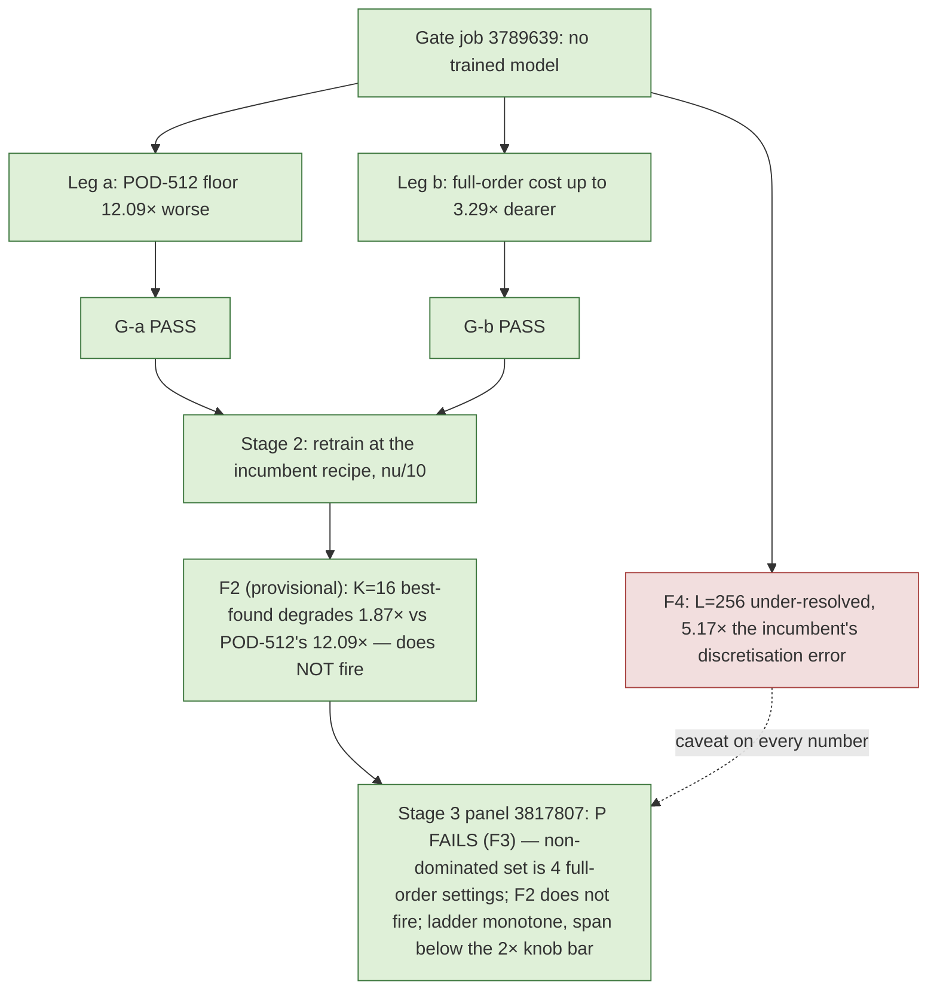

# b-lowvisc — low-viscosity Burgers: POD collapses 12×, the neural head 3–4×, F2 does not fire — but no reduced subject is non-dominated against the tuned full-order grid (P fails, F3)

Generated by `reports/generate_lowvisc.py` from gate job `3789639`'s `result.json`, training job
`3804337`'s three stage JSONs, panel job `3817807`'s `result.json`, and their independent audits.
**All three stages are final.** Criterion P and the pre-registered F2 are evaluated in the stage-3
section on the panel's development-cohort numbers; the stage-2 section's held-out F2 analogue is
kept as the provisional reading it was, superseded in the stage-3 section.

## Verdict

Both pre-registered gates pass.

* **G-a (leg a, the Kolmogorov width)** required the low-viscosity POD-512 projection floor to be
  at least 2.0× the incumbent's on worst-all-times, in the same job. Measured
  **12.092×** (0.6090 % → 7.3643 %),
  and **83.79×** on the worst-evolved metric. **PASS.**
* **G-b (leg b, the full-order cost)** required at least one tuned full-order setting to cost
  1.5× more on the low-viscosity family, in the same job. Measured **3.292×**,
  and *every one* of the 8 settings costs more (1.140×–3.292×).
  **PASS.** The design recorded leg (b) as the weaker leg *before* the measurement; it passed anyway.

Therefore the training stage is submitted, at the incumbent architecture and recipe with the
viscosity family as the only changed variable (DESIGN §5, stage 2).

**F4 is triggered and is not buried.** At the training mesh $L=256$ the low-viscosity family's
discretisation error against the 4096-interval reference is
20.8206 % against the incumbent's
4.0265 %, a ratio of 5.171×, above F4's
3× bar. Per the pre-registration this does not stop the lane — the go/no-go is G-a — but **every
low-viscosity number in this lane carries that caveat inline, and the cell is not offered as a
paper headline without a finer-mesh confirmation.** The cause is known and was written down
before the job ran: first-order upwinding contributes a numerical viscosity $|u|h/2$ that is
comparable to or larger than the physical $\nu$ for most of the low-viscosity cases at this mesh.

## The setup, in one line

The low-viscosity cohort **is** the incumbent cohort with $\nu$ divided by ten and nothing else
changed: the descriptors $(c_x,c_y,w,a)$ are bitwise identical and
$\nu_{\rm inc}/\nu_{\rm low}=10$ to 3.55e-16 relative,
re-derived in job and again by the audit.

$$\nu_{\rm incumbent}\sim\exp U(\log 10^{-2},\log 10^{-1}),\qquad
  \nu_{\rm low}\sim\exp U(\log 10^{-3},\log 10^{-2}).$$

**Validity.** The incumbent family's POD floors reproduce b-panel job `3780638`'s own
`best-found` column to 1.18e-06 relative, and the incumbent $L=256$ discretisation error
reproduces that job's 4.0265 % exactly. This
job's measurement is the panel's measurement, so the cross-family comparison is admissible.

## Leg (a) — POD degrades, and the degradation grows with rank

| POD rank $k$ | incumbent floor, worst-all-times % | low-viscosity floor % | ratio | incumbent worst-evolved % | low-viscosity worst-evolved % | evolved ratio |
|---|---|---|---|---|---|---|
| 16 | 61.6503 | 67.3429 | 1.092× | 28.2172 | 57.8338 | 2.050× |
| 32 | 47.0681 | 54.4539 | 1.157× | 18.2163 | 45.0333 | 2.472× |
| 64 | 19.8147 | 35.1339 | 1.773× | 6.7702 | 25.7885 | 3.809× |
| 128 | 10.1189 | 23.2019 | 2.293× | 1.7206 | 16.0559 | 9.332× |
| 256 | 3.7686 | 15.2670 | 4.051× | 0.4080 | 9.5329 | 23.366× |
| 512 | 0.6090 | 7.3643 | 12.092× | 0.0670 | 5.6109 | 83.793× |

The shape matters more than the headline. At $k=16$ the two families are nearly equally hard
(1.092×): a 16-mode basis is bad for both. The gap opens monotonically with
rank and is widest exactly where the incumbent cell is good, which is the signature of a slower
Kolmogorov-width decay rather than a uniform accuracy shift. A rank-512 POD basis reaches
0.6090 % on the incumbent family and only
7.3643 % on the low-viscosity one.

### The singular-value decay

| POD rank $k$ | incumbent $\sigma_k/\sigma_1$ | low-viscosity $\sigma_k/\sigma_1$ | incumbent tail energy | low-viscosity tail energy |
|---|---|---|---|---|
| 16 | 6.321e-02 | 8.992e-02 | 1.297e-02 | 3.381e-02 |
| 32 | 2.098e-02 | 3.883e-02 | 2.537e-03 | 1.138e-02 |
| 64 | 6.238e-03 | 1.613e-02 | 3.039e-04 | 3.438e-03 |
| 128 | 1.121e-03 | 6.057e-03 | 1.271e-05 | 7.973e-04 |
| 256 | 9.049e-05 | 1.964e-03 | 1.074e-07 | 1.147e-04 |
| 512 | 1.845e-06 | 3.996e-04 | 5.979e-11 | 6.452e-06 |

The incumbent snapshot spectrum collapses by 1.85e-06 over 512 modes; the
low-viscosity one by only 4.00e-04, i.e. **217×
less**. The incumbent basis is numerically rank-deficient by mode 512 — the tail sits at the f64
accumulation floor — while the low-viscosity basis still carries real energy there. That is the
same statement as the floor table, read off the spectrum instead of the projection.

## Leg (b) — the full-order solve does get more expensive

| full-order setting | incumbent ms | low-viscosity ms | cost ratio | incumbent Newton its | low-viscosity Newton its | Newton ratio | incumbent worst-evolved % | low-viscosity worst-evolved % |
|---|---|---|---|---|---|---|---|---|
| `nt1e-2_dt01` | 9.07 | 14.27 | 1.574× | 33 | 63 | 1.909× | 3.2 | 3.895 |
| `nt1e-2_dt005` | 15.73 | 17.93 | 1.140× | 51 | 94 | 1.843× | 3.713 | 5.254 |
| `nt1e-3_dt01` | 19.90 | 63.51 | 3.191× | 27 | 50 | 1.852× | 1.518 | 3.28 |
| `nt1e-4_dt01` | 27.87 | 88.88 | 3.189× | 49 | 64 | 1.306× | 1.511 | 3.28 |
| `nt1e-3_dt005` | 31.87 | 55.73 | 1.749× | 52 | 84 | 1.615× | 0.0489 | 0.1971 |
| `nt1e-4_dt005` | 37.13 | 122.21 | 3.292× | 56 | 100 | 1.786× | 0.03385 | 0.05708 |
| `dense_tight` | 62.47 | 116.34 | 1.862× | 101 | 135 | 1.337× | 9.026e-14 | 3.086e-14 |
| `fft_tight` | 90.70 | 169.92 | 1.873× | 101 | 135 | 1.337× | 0 | 0 |

Every setting costs more and every setting needs more Newton iterations. The mechanism is the one
the design named in advance: the backward-Euler step is preconditioned by the exact Helmholtz
operator $(I+\Delta t\,\nu\,\Lambda)^{-1}$, which is an excellent preconditioner when
$\Delta t\,\nu\,\lambda_{\max}\gg1$ and degenerates towards the identity as $\nu\to0$.
The low-viscosity family also loses accuracy at every loose setting, so the full-order frontier
moves right *and* up.

## The mesh probe, and the under-resolution caveat

| mesh $L$ | incumbent error vs 4096-interval reference % | low-viscosity % | ratio | incumbent ms | low-viscosity ms |
|---|---|---|---|---|---|
| 256 | 4.0265 | 20.8206 | 5.171× | 90.70 | 169.92 |
| 512 | 2.7025 | 13.9498 | 5.162× | 165.27 | 348.74 |
| 1024 | 2.1416 | 8.7877 | 4.103× | 523.92 | 1221.11 |

The low-viscosity family is materially under-resolved at $L=256$ and remains so at $L=512$ and
$L=1024$. The $L=256$ discrete operator is still a well-defined operator and the same-grid metric
— the primary metric of every panel in this campaign — is exactly as meaningful as for the
incumbent cell. But a reviewer is entitled to call the cell under-resolved against the continuous
PDE, and this report says so rather than waiting to be asked.

## Gates and the independent audit

All 6 in-job gates pass. The independent NumPy audit
(`audit_gate.py`, importing neither JAX nor the driver, recomputing the POD floors from the
snapshot Gram's eigenvectors rather than from the modes) ran 83 checks with
1 failure.

**The one failed check, stated plainly and not retracted.** `pod_orthonormal_incumbent` measures
7.207e-05 against a $10^{-8}$ bar. It is a *consequence of*
leg (a), not a defect in it: the incumbent snapshot Gram is numerically rank-deficient at 512
(eigenvalue ratio 3.41e-12), so its trailing modes sit at the f64
accumulation floor and the Gram-eigenvector route loses orthogonality there. The deviation is
confined to the tail (4.06e-09 over the leading 256 modes,
1.28e-05 over the leading 500), and recomputing the $k=512$ floor
with the full oblique projector $C^\top M^{-1}C$ instead of $\sum C^2$ moves it by
7.87e-07 relative and by $\le$ 5.20e-11 at every
other rank — so no reported digit changes. The low-viscosity basis, whose floors carry the result, is well conditioned
(1.05e-09). Both figures are in `summary.json`.

## What this does and does not establish

Established: the low-viscosity regime is harder for a *linear* subspace, by a margin that grows
with rank, and the full-order solve there is genuinely more expensive. **Not** established: that
the nonlinear manifold exploits either fact. The pass criterion P — at least one reduced subject
non-dominated on (median GPU ms, worst evolved error) against every same-job full-order control
and every POD rank, all converged — needs the trained checkpoint and the stage-3 panel, and
DESIGN A3 records in advance that a dense-quadrature reduced query costs of the order of a
full-order Newton step per iteration, so P remains a demanding bar even with leg (b) passing.

## Stage 3 — the panel: criterion P fails, F2 does not fire, the ladder is monotone but below the knob bar

Job `3817807` (A100-80G, 29 min after 22 min of in-job
directions, rank 512): 27 subjects in one allocation, three timed repetitions,
0 dropped. The independent audit ran 29 checks with 0 failures:
every recorded error recomputed from the saved fields, convergence re-derived, the timed `dense_tight`
reproduces `fft_tight`, repetitions bitwise identical. **Every reduced subject converged** (zero budget
exits, joint stationarity below $10^{-6}$), so the whole panel is admissible and P is evaluated on all
27. F4 travels with every row as the two vs-4096 columns: the same-grid full-order solve is itself
20.82 % from the reference, so nothing on this mesh can be
told apart against the continuum below that.

### The headline fixed-$M=1088$ ladder

| rung | same-grid worst-evolved % | same-grid all-times % | $t{=}0$ compression % | vs-4096 worst-evolved % | vs-4096 all-times % | same-job median ms | converged | non-dominated |
|---|---|---|---|---|---|---|---|---|
| $q=0$, $M=1088$ | 9.0500 | 9.0500 | 4.7255 | 17.9849 | 17.9849 | 557.4 | yes | no |
| $q=16$, $M=1088$ | 8.7562 | 8.7562 | 4.6964 | 18.0307 | 18.0307 | 681.4 | yes | no |
| $q=32$, $M=1088$ | 8.6360 | 8.6360 | 4.6368 | 18.0821 | 18.0821 | 772.2 | yes | no |
| $q=64$, $M=1088$ | 8.3165 | 8.3165 | 4.5437 | 18.3573 | 18.3573 | 913.2 | yes | no |
| $q=128$, $M=1088$ | 7.6276 | 7.6276 | 4.1378 | 18.7023 | 18.7023 | 1220.7 | yes | no |
| $q=256$, $M=1088$ | 6.6718 | 6.6718 | 3.2185 | 19.4393 | 19.4393 | 1810.3 | yes | no |

Monotone in the evolved error: **yes**; all converged: yes;
error span 1.356× over a cost span of 3.247×; **the $\ge2\times$ knob bar is
NOT met**. (The incumbent's $M=1088$ column spanned 2.437× — b-qxm.)

### The fixed-$M=256$ control column and the $(256, 2176)$ cell

| rung | same-grid worst-evolved % | same-grid all-times % | $t{=}0$ compression % | vs-4096 worst-evolved % | vs-4096 all-times % | same-job median ms | converged | non-dominated |
|---|---|---|---|---|---|---|---|---|
| $q=0$, $M=256$ | 8.3933 | 8.3933 | 4.7255 | 18.0041 | 18.0041 | 300.3 | yes | no |
| $q=16$, $M=256$ | 8.4298 | 8.4298 | 4.6964 | 17.9030 | 17.9030 | 379.8 | yes | no |
| $q=32$, $M=256$ | 8.7191 | 8.7191 | 4.6368 | 17.7546 | 17.7546 | 422.7 | yes | no |
| $q=64$, $M=256$ | 8.9538 | 8.9538 | 4.5437 | 18.1368 | 18.1368 | 500.6 | yes | no |
| $q=128$, $M=256$ | 10.2614 | 10.2614 | 4.1378 | 19.1471 | 19.1471 | 658.6 | yes | no |
| $q=256$, $M=2176$ | 6.1869 | 6.1869 | 3.2185 | 18.9400 | 18.9400 | 2864.2 | yes | no |

At $M=256$ the ladder is **not monotone — the correction hurts** (span 1.223×):
$q=128$ with 144 unknowns against 256 test equations is test-starved, exactly what b-qxm found on the incumbent.
The $(256, 2176)$ cell improves on $(256, 1088)$ by 1.078× in error
for 1.58× the cost, and is the most accurate reduced subject in the job.

### POD-LSPG, the free bank, and the tuned full-order grid

| subject | same-grid worst-evolved % | same-grid all-times % | $t{=}0$ compression % | vs-4096 worst-evolved % | vs-4096 all-times % | same-job median ms | converged | non-dominated |
|---|---|---|---|---|---|---|---|---|
| POD-LSPG $k'=16$, $M=64$ | 57.9837 | 67.3429 | 67.3429 | 60.0949 | 67.3429 | 46.5 | yes | no |
| POD-LSPG $k'=32$, $M=128$ | 45.6825 | 54.4540 | 54.4540 | 47.8406 | 54.4540 | 80.2 | yes | no |
| POD-LSPG $k'=64$, $M=256$ | 26.2116 | 35.1340 | 35.1340 | 28.3474 | 35.1340 | 150.1 | yes | no |
| POD-LSPG $k'=128$, $M=512$ | 16.4288 | 23.2032 | 23.2032 | 23.2067 | 23.2067 | 331.2 | yes | no |
| POD-LSPG $k'=256$, $M=1024$ | 11.2540 | 15.2899 | 15.2899 | 21.9565 | 21.9565 | 881.2 | yes | no |
| POD-LSPG $k'=512$, $M=2048$ | 17.7782 | 17.7782 | 9.2090 | 24.4998 | 24.4998 | 2735.3 | yes | no |
| free $R=512$ bank, $M=1024$ | 7.7940 | 7.7940 | 2.2374 | 20.3573 | 20.3573 | 3174.6 | yes | no |

| full-order setting | same-grid worst-evolved % | same-grid all-times % | $t{=}0$ compression % | vs-4096 worst-evolved % | vs-4096 all-times % | same-job median ms | converged | non-dominated |
|---|---|---|---|---|---|---|---|---|
| `nt1e-2_dt01` | 3.8950 | 3.8950 | 0.0000 | 19.3267 | 19.3267 | 14.0 | n/a (FOM) | **yes** |
| `nt1e-2_dt005` | 5.2542 | 5.2542 | 0.0000 | 20.5921 | 20.5921 | 17.8 | n/a (FOM) | no |
| `nt1e-3_dt005` | 0.1971 | 0.1971 | 0.0000 | 20.8643 | 20.8643 | 54.9 | n/a (FOM) | **yes** |
| `nt1e-3_dt01` | 3.2798 | 3.2798 | 0.0000 | 19.7193 | 19.7193 | 63.3 | n/a (FOM) | no |
| `nt1e-4_dt01` | 3.2798 | 3.2798 | 0.0000 | 19.7677 | 19.7677 | 88.7 | n/a (FOM) | no |
| `dense_tight` | 0.0000 | 0.0000 | 0.0000 | 20.8206 | 20.8206 | 112.3 | n/a (FOM) | **yes** |
| `nt1e-4_dt005` | 0.0571 | 0.0571 | 0.0000 | 20.8127 | 20.8127 | 123.0 | n/a (FOM) | no |
| `fft_tight` | 0.0000 | 0.0000 | 0.0000 | 20.8206 | 20.8206 | 171.2 | n/a (FOM) | **yes** |

POD-LSPG is **not** monotone past $k'=256$: at $k'=512$ the solve reaches 17.7782 %
against its own projection floor of 10.2797 % — the solver, not the subspace,
is the limit there. Every neural rung beats every POD-LSPG rank on the same-grid error; the best one,
$(256, 2176)$ at 6.1869 %, beats the best POD-LSPG (11.2540 %) and the free $R=512$ bank's own solve
(7.7940 %) — the reduced-only frontier is `pod16_M64_dense`, `pod32_M128_dense`, `pod64_M256_dense`, `q0_M256_dense_g1em06`, `q64_M1088_dense_g1em06`, `q128_M1088_dense_g1em06`, `q256_M1088_dense_g1em06`, `q256_M2176_dense_g1em06`.

### The non-dominated set and criterion P

Non-dominated on (same-job median GPU ms, same-grid worst-evolved %) over the admissible set, b-panel's
rule: **`nt1e-2_dt01`, `nt1e-3_dt005`, `dense_tight`, `fft_tight`** — **no reduced subject of any kind is in it**.
On all-times: `nt1e-2_dt01`, `nt1e-3_dt005`, `dense_tight`, `fft_tight`. The cheapest full-order setting that beats *every* reduced
subject on both axes is `nt1e-2_dt01` at 14.0 ms and
3.8950 %, against the cheapest reduced subject `pod16_M64_dense` at 46.5 ms /
57.9837 % and the most accurate `q256_M2176_dense_g1em06` at 2864.2 ms / 6.1869 %.

**P: FAIL.** This is F3 as pre-registered in §6 and anticipated in A3: leg (b) raised the full-order cost by up to 3.3×, but a dense-quadrature reduced query costs of the order of a full-order Newton step per iteration and needs more of them, so the reduced arms are 3.3× dearer than a full-order setting that is 15× more accurate. The non-dominance loss is structural in this discretisation.

### The three layers on the development cohort, and F2

| layer ($q=0$, development cohort, worst over cases and times) | incumbent (job 3780638) | low-viscosity (job 3817807) | ratio | POD-512 ratio |
|---|---|---|---|---|
| bank floor (free $R=512$ bank best-found) | 0.3918 | 7.4455 | **19.001×** | 12.092× |
| best-found ($K=16$ head, 8-start reconstruction oracle) | 2.5447 | 11.3934 | **4.477×** | 12.092× |
| solved, $q=0$, $M=256$, all-times | 2.5629 | 8.3933 | **3.275×** | 12.092× |
| solved, $q=0$, $M=256$, evolved | 1.2710 | 8.3933 | 6.604× | 12.092× |
| solved, $q=0$, $M=1088$, all-times | — | 9.0500 | — | — |

**F2: does NOT fire** — it needs all three of bank floor, best-found and solved to degrade by
$\ge$ 12.09×; the bank floor does (19.00×, a linear object), best-found and solved do not
(4.48× and 3.27×). The nonlinear head degrades three to four times less than
the linear rank-512 objects. This supersedes A7's provisional verdict on the held-out cohort, which
agreed in direction (1.87× on best-found there).

**A number that is not what it looks like.** The low-viscosity `solved / best-found` at $q=0$ is
0.737 — the solve *beats* the "best-found": the 8-start reconstruction oracle (a nonconvex fit
with the truth supplied) found a worse local minimum than the PDE-driven solve did. On the incumbent
the ratio was 1.007. So the low-viscosity best-found is an upper bound on the manifold's
representation error, not a floor, and the best-found ratio above (4.48×) is
correspondingly an over-estimate of the degradation; the solved layer (3.27×) is the
cleaner statement. The training-stage analogue (A7, oracle on 408 held-out states with a 150-iteration
fit and a trained encoder init) gave 1.87×.

## Stage 2 — the training run, and the (superseded) provisional F2 reading

Training job `3804337` ran the incumbent recipe verbatim — $K=16$, $R=512$, `n_ff` 128,
`g_hidden` 1024, `h_hidden` 512×2, 300000 + 200000 Adam steps, seed 0, the same 576 + 4032
training trajectories and the same 8 held-out test trajectories — with the viscosity family as
the only change (the job re-proved the generator patch bitwise-identical under the defaults
before its first step). The audit (`audit_train.py`, NumPy only) ran 16 checks
with 0 failures: recipe values equal the incumbent's field by field, the training
data has the incumbent's shape but *different* sums (the inverted fingerprint gate), full-order
residuals $\le10^{-8}$, whitening and Gram identities at $10^{-14}$, every checkpoint hash
consistent between the job's `TRAIN-SHA256.txt`, `OUTPUTS.sha256` and the bytes now in
`checkpoints/`.

### The three layers, like for like

Every column below is the **same JSON field from the same script on the same 408 held-out
states** (8 trajectories, `test_seed` 1, 51 times; under the low-viscosity bounds these are the
incumbent's own test trajectories with $\nu/10$). "Bank floor" is the best any coefficients in
the trained $R=512$ span can do (`test_span_floor`); "best-found" is the best the $K=16$ head's
manifold can reach with the truth in hand (`oracle_test`), no PDE solve involved. The incumbent
column is its own training run (job 2837431) and the three b-seeds reseeds show the seed spread.

| layer | incumbent (seed 0) | reseeds 1 / 2 / 3 | low-viscosity (seed 0) | ratio low / incumbent | POD-512 ratio, for scale |
|---|---|---|---|---|---|
| bank floor, worst held-out % | 0.2998 | 0.3025 / 0.3314 / 0.2538 | 2.7834 | **9.286×** | 12.092× |
| bank floor, mean held-out % | 0.0212 | 0.0218 / 0.0217 / 0.0198 | 0.9767 | **45.990×** | 12.092× |
| best-found, worst held-out % | 2.7651 | 2.8184 / 2.5731 / 3.0046 | 5.1726 | **1.871×** | 12.092× |
| best-found, mean held-out % | 0.5201 | 0.5604 / 0.5218 / 0.5341 | 2.2612 | **4.348×** | 12.092× |
| best-found at $t=0$ % | 1.5021 | 1.5930 / 1.4958 / 1.5973 | 2.0469 | **1.363×** | 12.092× |
| head reconstruction, training mean % | 0.7507 | 0.7616 / 0.7081 / 0.7713 | 2.3126 | **3.080×** | 12.092× |

**What the table says.** The *linear* objects collapse under the regime change by about the
POD factor: the trained $R=512$ bank's worst-case floor degrades
9.29× (POD-512 on the
development cohort: 12.09×). The *nonlinear* $K=16$ head's worst-case best-found
degrades only **1.87×**
(2.7651 % → 5.1726 %),
inside a factor of two, and at $t=0$ only 1.36×.
Read against the gate: on the incumbent family a 16-dimensional manifold sits **above** the
512-dimensional linear floor (2.7651 % vs
0.6090 %); on the low-viscosity family it sits **below** it
(5.1726 % vs 7.3643 %) —
with the caveat, stated once and meant everywhere, that the two figures are on different cohorts
(408 test states vs the six development cases) and the panel is what puts them in one job on one
cohort. The bank itself is also less degenerate at low viscosity: $\mathrm{cond}(G)$
4169 against 26369, and
$\sigma_{511}/\sigma_0$ 2.40e-04 against
3.79e-05 — the same slower-decay statement leg (a)
made about POD, now about the learned span.

### F2, applied

F2 (DESIGN §6) fires if the low-viscosity **bank floor, best-found and solved** each degrade by at
least the POD-512 factor (12.092×). Those are panel
quantities on the development cohort. On their training-stage analogues:

* bank floor (worst held-out): 9.286× — < the POD factor;
* best-found (worst held-out): 1.871× — < the POD factor;
* solved: **not available** — no reduced solve has run on this family.

Since F2 needs *all three* and best-found is already a factor of
6.5 short of
the bar, **F2 does not fire, provisionally**; the panel cannot make it fire through the solved
layer alone, because the criterion is conjunctive. The word *provisional* is carried because the
pre-registered evaluation is on the development cohort in the panel job.

### The caveat that travels with every number above — F4

Restated, not softened: the low-viscosity family is under-resolved at $L=256$
(20.8206 % against the 4096-interval reference,
5.17× the incumbent's), and stays under-resolved at $L=512$ and $1024$. Every low-viscosity
number in this report is a statement about the $L=256$ discrete operator, which is well defined;
none is yet a statement about the continuous low-viscosity PDE. The training-stage result above
— a nonlinear $K=16$ manifold below the linear rank-512 floor — is therefore a result about the
discrete regime the paper's every other Burgers number lives in, and is not offered as a headline
without a finer-mesh confirmation.

### What the next job is (written before stage 3; the stage-3 section above supersedes it)

Nothing is submitted; the choice is the coordinator's. The two candidates, with the case for each:

1. **`lvp01`, the stage-3 panel as pre-registered in A3** (fixed $M=1088$ ladder $q\in\{0..256\}$,
   the $M=256$ control column, the $(256, 2176)$ cell, POD-LSPG at $k'\in\{16..512\}$, the free
   bank, the tuned full-order grid, one job, 80 GB card, ≈ 1 h). It is the only job that can
   evaluate **P** and the pre-registered **F2**, and it puts the "16-dimensional manifold below the
   512-dimensional linear floor" comparison in one job on one cohort. Given leg (b) passed at
   3.29× and the dense-quadrature reduced query costs of the order of a
   full-order step (A3), P is still expected to be hard; the panel measures rather than assumes it.
2. **An $L=512$ confirmation for F4** (gate + retrain at 512, ≈ 5 h of A100 across two jobs). It
   answers the reviewer's under-resolution objection but not the paper's question, and a
   retrained $L=512$ checkpoint would then need its own panel.

The recommendation recorded here is **1 then 2**: the panel decides whether there is a result to
confirm; a finer-mesh confirmation of a cell that fails P would be wasted compute. Jobs used: 2 of 8.

## Glossary

* **Incumbent family / low-viscosity family** — the two parameter cohorts compared here. They share
  every parameter except viscosity $\nu$, which is ten times smaller in the low-viscosity family.
* **$\nu$ (viscosity)** — the diffusion coefficient in the Burgers equation. Lower $\nu$ means the
  solution is more advection-dominated and develops sharper fronts.
* **POD (proper orthogonal decomposition)** — the standard linear method for building a small basis
  from simulation snapshots: keep the $k$ directions carrying the most energy.
* **POD rank $k$** — how many of those directions are kept. Larger $k$ is more accurate and more expensive.
* **Projection floor** — the error you would get from a $k$-dimensional linear basis *even with a
  perfect solver*, by projecting the true solution onto it. It is a lower bound on any method built
  on that basis, which is why it is the right thing to compare.
* **Worst-all-times / worst-evolved** — the error maximised over all output times including $t=0$,
  versus over the evolved times only ($t>0$). The $t=0$ term measures how well the basis compresses
  the initial condition, which is a different question from how well it tracks the dynamics.
* **Kolmogorov width** — how fast the best possible $k$-dimensional linear approximation improves as
  $k$ grows. Slow decay is the regime in which nonlinear (neural) manifolds are claimed to help.
* **Singular value $\sigma_k$ / tail energy** — the energy in the $k$-th POD direction, and the
  fraction of total energy left unrepresented after $k$ directions. Both describe the same decay.
* **Full-order (FOM) / reduced-order (ROM)** — the full discrete solve on the grid, versus a solve in
  a small number of unknowns. The point of a ROM is to be cheaper at acceptable accuracy.
* **Newton iterations** — the nonlinear solver's work per step; more iterations means a dearer solve.
* **`fft_tight` / `dense_tight` / `nt1e-3_dt005` …** — the tuned full-order settings, named by their
  linear-solver path and by (Newton tolerance, time step). The tight ones are the converged reference;
  the loose ones trade accuracy for speed and are the real competition for a ROM.
* **Same-grid metric** — error measured against the converged full-order solve *on the same grid*, so
  it isolates what the reduced model loses and excludes discretisation error.
* **Discretisation error vs the 4096-interval reference** — how far the $L$-interval discrete solution
  is from a much finer solve; it measures the grid, not the ROM.
* **G-a / G-b** — the two pre-registered go/no-go gates on legs (a) and (b), fixed before the job ran.
* **F1–F4** — the pre-registered falsification clauses. F4 is the under-resolution caveat triggered here.
* **Criterion P** — the lane's pass criterion, needing the stage-3 panel; see the closing section.
* **b-panel job `3780638`** — the incumbent Burgers panel this lane compares against; its numbers are
  read from a committed copy, never retyped.
* **Bank / bank floor** — the trained $R=512$ linear span the decoder lifts through; its floor is
  the best any coefficients in that span can do on a held-out state, a bound no head can beat.
* **Best-found / oracle** — the best fit the $K=16$ head's manifold can reach on a held-out state
  when the truth is supplied to the fit; measures representation, not the solver.
* **Solved** — the error of the reduced model when it actually solves the PDE in reduced form,
  without the truth; only a panel job produces it.
* **F2** — the falsification clause "the nonlinear manifold degrades at least as much as POD does".
* **Held-out test states** — 8 trajectories never used in training (seed 1), 51 times each.
* **cond(G), $\sigma_{511}/\sigma_0$** — the condition number and singular-value decay of the
  bank's Gram matrix; large cond / fast decay means the span is nearly degenerate.
* **Independent audit** — a separate NumPy-only script that recomputes every reported number from the
  saved fields by a different route, so a bug in the job's own code cannot pass unnoticed.
