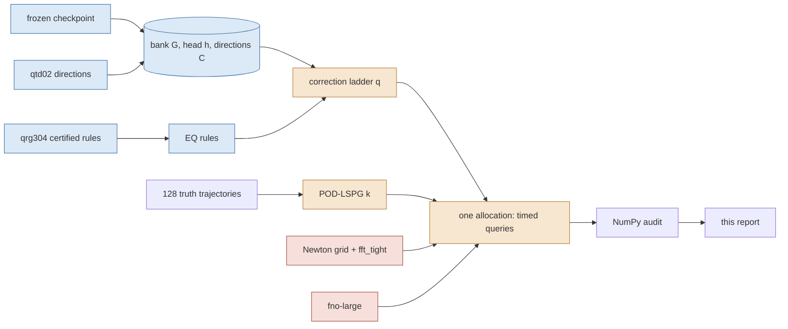

# 2026-09-17-b-panel — the central comparison priced in one allocation per mesh

Every cost and every error in this report was measured in one Slurm allocation on one GPU per mesh, against full-order controls timed in that same allocation with the same reference; every number is generated from the audit JSONs named at the end. Numbers are development-cohort (six opened cases), one checkpoint, one training seed; the sealed cohorts are untouched. **Status: provisional as paper claims until the coordinator assembles T5.**

The 256² table below is `bpn301`’s and **replaces `bpn101`’s wholesale** (DESIGN.md §A5.1): `bpn301` re-ran the whole panel — every full-order control, POD rank, dense rung and the FNO — in one allocation while carrying both quadrature rule sets as arms, so the two sets are compared in-allocation rather than across jobs. `bpn101` is not withdrawn; it stays in `artifacts/bpn101/` as the record of what the superseded rules gave. The 1024² table is `bpn203`’s, the third attempt at that mesh; `bpn201` and `bpn202` are retracted and produced no timed number (DESIGN.md §A6, §A7).

**Headline, 256² (job `3789570`, one allocation, one GPU): 0 of the 39 reduced-order subjects are non-dominated on (median GPU ms, worst evolved %).** The most accurate reduced subject is `pod512_M2048_dense` at 0.2184 % and 2790.8 ms, and 4 of the same job's full-order settings are **both cheaper and at least as accurate** — cheapest `nt1e-3_dt005` at 0.0489 % and 31.8 ms, i.e. 87.8× less time at 0.22× the error. The frontier over admissible subjects is the trained FNO plus full-order Newton. This is the evidence for the paper's claim of no speedup over an efficient full-order solver at this mesh.

**Headline, 512² (job `3805065`, one allocation, one GPU): 0 of the 31 reduced-order subjects are non-dominated on (median GPU ms, worst evolved %).** The most accurate reduced subject is `pod512_M2048_dense` at 0.3328 % and 11933.9 ms, and 4 of the same job's full-order settings are **both cheaper and at least as accurate** — cheapest `nt1e-3_dt005` at 0.0516 % and 52.9 ms, i.e. 225.5× less time at 0.16× the error. The frontier over admissible subjects is full-order Newton. This is the evidence for the paper's claim of no speedup over an efficient full-order solver at this mesh.

**Headline, 1024² (job `3789572`, one allocation, one GPU): 5 of the 20 reduced-order subjects are non-dominated on (median GPU ms, worst evolved %).** The most accurate reduced subject is `free512_M1024_dense` at 0.5108 % and 13514.6 ms, and 2 of the same job's full-order settings are **both cheaper and at least as accurate** — cheapest `nt1e-4_dt005` at 0.0343 % and 81.3 ms, i.e. 166.2× less time at 0.07× the error. The frontier over admissible subjects is full-order Newton plus the correction ladder. A reduced subject is on the frontier at this mesh; the no-speedup claim does not hold here unqualified.

## 256² intervals — job `3789570` on `NVIDIA A100 80GB PCIe`

Source commit `f3c5fbed8a2184f192513adb994c3c56a9b2e175`, attempt `bpn301`, elapsed 1780.3 s, JAX pool fraction 0.90, 47 timed subjects, failed gates: none. Every error below is against this job's own converged `fft_tight` solve (same grid) unless the column says reference; 'reference' is the 4096-interval solve. Costs are medians over 6 cases × 3 repetitions; ratios are only meaningful inside this table.

### Rule sets carried in this job

2 empirical-quadrature rule sets ran as arms at matched q, M and tolerance: `eqcert`, `eqtop`. The **rule status** column is the construction status the exporting lane recorded for that rule and travels with every row below: *confirmed (k/k)* means every independent re-draw of the construction met the primary bar; *marginal* means some re-draws failed it; *certified in one draw* means this single rule met the bar but its construction has not been re-drawn; blank means a single qrg304 draw never re-drawn. **2 rules in this job are single-draw: `eqtop` q=128, `eqtop` q=256 — those arms are 'b-eqtop's rules, single-draw', not 'certified rules'.

| set | q | M | file | source | m | fit states | ρ max | ρ 95 | basis | rule status |
|---|---|---|---|---|---|---|---|---|---|---|
| `eqcert` | 0 | 64 | `rule_q0_reachable_m1024.npz` | q-ridge / qrg304 / 3768168 | 1024 | — | 0.0153 | 0.0088 | primary | confirmed (3/3) |
| `eqcert` | 16 | 128 | `rule_q16_reachable_m1024.npz` | q-ridge / qrg304 / 3768168 | 1024 | — | 0.0935 | 0.0273 | primary | confirmed (3/3) |
| `eqcert` | 32 | 192 | `rule_q32_reachable_m1024.npz` | q-ridge / qrg304 / 3768168 | 1024 | — | 0.0533 | 0.0226 | primary | confirmed (2/2) |
| `eqcert` | 64 | 320 | `rule_q64_reachable_m1024.npz` | q-ridge / qrg304 / 3768168 | 1024 | — | 0.0531 | 0.0230 | primary | marginal (b-eqtop superseded list) |
| `eqcert` | 128 | 576 | `rule_q128_reachable_m2048.npz` | q-ridge / qrg304 / 3768168 | 2048 | — | 0.1908 | 0.0518 | secondary | — |
| `eqcert` | 256 | 1088 | `rule_q256_reachable_m2048.npz` | q-ridge / qrg304 / 3768168 | 2048 | — | 0.1678 | 0.0957 | secondary | — |
| `eqtop` | 0 | 64 | `rule_q0_m1024_qrg304_reachable.npz` | b-eqtop / qrg304 / 3768168 | 1024 | 64 | 0.0153 | 0.0088 | primary | confirmed (3/3) |
| `eqtop` | 16 | 128 | `rule_q16_m1024_qrg304_reachable.npz` | b-eqtop / qrg304 / 3768168 | 1024 | 64 | 0.0935 | 0.0273 | primary | confirmed (3/3) |
| `eqtop` | 32 | 192 | `rule_q32_m1024_qrg304_reachable.npz` | b-eqtop / qrg304 / 3768168 | 1024 | 42 | 0.0533 | 0.0226 | primary | confirmed (2/2) |
| `eqtop` | 64 | 320 | `rule_q64_m2048_bet201_std.npz` | b-eqtop / bet201 / 3780165 | 2048 | 25 | 0.0583 | 0.0074 | primary | confirmed (2/2) |
| `eqtop` | 128 | 576 | `rule_q128_m2319_bet101_rhow64.npz` | b-eqtop / bet101 / 3780164 | 2319 | 64 | 0.0277 | 0.0102 | primary | certified in one draw |
| `eqtop` | 256 | 1088 | `rule_q256_m2560_bet101_fs64.npz` | b-eqtop / bet101 / 3780164 | 2560 | 64 | 0.0647 | 0.0314 | primary | certified in one draw |

### How to read the two error columns

The same-grid columns measure every subject against this job's converged `fft_tight` solve, so **`fft_tight` sits at exactly zero there by construction** — `fft_tight` *is* the reference, and `dense_tight`, the same solve through a different preconditioner, agrees with it to 9.2e-16 relative. It is plotted at the axis floor, and it appears on the same-grid frontier for that reason, not because it is free. The `worst vs ref %` column is where the full-order solvers are not free: against the 4096-interval reference this mesh's own discretisation error is 2.4737–5.1761 % for the full-order controls, and every reduced subject inherits it. A reduced subject is only interesting where it is cheaper than a full-order solve of the accuracy it actually delivers.

### Every subject

| subject | family | q / k′ | M | quad. | m | rule set | rule basis | rule status | tol | worst all % | worst evolved % | median evolved % | t=0 % | worst vs ref % | best-found % | solved/best-found | GPU ms | complete ms | med it | max it | budget exits | conv. | strict | admissible |
|---|---|---|---|---|---|---|---|---|---|---|---|---|---|---|---|---|---|---|---|---|---|---|---|---|
| `q0_M256_dense_g1em06` | rom | q=0 | 256 | dense | — | — | — | — | 1.0e-06 | 2.5629 | 1.2710 | 0.5812 | 2.5629 | 4.0637 | 2.5447 | 1.00716 | 341.479 | 343.401 | 3.0 | 33 | 0 | yes | yes | yes |
| `q0_M64_dense_g1em06` | rom | q=0 | 64 | dense | — | — | — | — | 1.0e-06 | 2.5629 | 1.8890 | 1.0059 | 2.5629 | 4.5575 | 2.5447 | 1.00716 | 283.913 | 285.872 | 3.0 | 29 | 0 | yes | yes | yes |
| `q0_M64_eqcert_g0p001` | rom | q=0 | 64 | eq | 1024 | eqcert | primary | confirmed (3/3) | 1.0e-03 | 2.5628 | 1.8898 | 1.0103 | 2.5628 | 4.5521 | 2.5447 | 1.00713 | 43.636 | 45.797 | 2.0 | 26 | 0 | yes | yes | yes |
| `q0_M64_eqcert_g1em06` | rom | q=0 | 64 | eq | 1024 | eqcert | primary | confirmed (3/3) | 1.0e-06 | 2.5629 | 1.8891 | 1.0100 | 2.5629 | 4.5529 | 2.5447 | 1.00716 | 59.463 | 61.722 | 3.0 | 29 | 0 | yes | yes | yes |
| `q0_M64_eqtop_g0p001` | rom | q=0 | 64 | eq | 1024 | eqtop | primary | confirmed (3/3) | 1.0e-03 | 2.5628 | 1.8898 | 1.0103 | 2.5628 | 4.5521 | 2.5447 | 1.00713 | 43.411 | 45.468 | 2.0 | 26 | 0 | yes | yes | yes |
| `q0_M64_eqtop_g1em06` | rom | q=0 | 64 | eq | 1024 | eqtop | primary | confirmed (3/3) | 1.0e-06 | 2.5629 | 1.8891 | 1.0100 | 2.5629 | 4.5529 | 2.5447 | 1.00716 | 58.573 | 60.596 | 3.0 | 29 | 0 | yes | yes | yes |
| `q16_M128_dense_g1em06` | rom | q=16 | 128 | dense | — | — | — | — | 1.0e-06 | 2.4806 | 1.3985 | 0.6411 | 2.4806 | 4.1065 | 2.4615 | 1.00776 | 360.770 | 362.766 | 3.0 | 31 | 0 | yes | yes | yes |
| `q16_M128_eqcert_g0p001` | rom | q=16 | 128 | eq | 1024 | eqcert | primary | confirmed (3/3) | 1.0e-03 | 2.4806 | 1.4272 | 0.6423 | 2.4806 | 4.1136 | 2.4615 | 1.00776 | 63.303 | 65.284 | 2.0 | 25 | 0 | yes | yes | yes |
| `q16_M128_eqcert_g1em06` | rom | q=16 | 128 | eq | 1024 | eqcert | primary | confirmed (3/3) | 1.0e-06 | 2.4806 | 1.4270 | 0.6424 | 2.4806 | 4.1145 | 2.4615 | 1.00776 | 81.702 | 83.776 | 3.0 | 28 | 0 | yes | yes | yes |
| `q16_M128_eqtop_g0p001` | rom | q=16 | 128 | eq | 1024 | eqtop | primary | confirmed (3/3) | 1.0e-03 | 2.4806 | 1.4272 | 0.6423 | 2.4806 | 4.1136 | 2.4615 | 1.00776 | 62.090 | 64.207 | 2.0 | 25 | 0 | yes | yes | yes |
| `q16_M128_eqtop_g1em06` | rom | q=16 | 128 | eq | 1024 | eqtop | primary | confirmed (3/3) | 1.0e-06 | 2.4806 | 1.4270 | 0.6424 | 2.4806 | 4.1145 | 2.4615 | 1.00776 | 81.092 | 83.330 | 3.0 | 28 | 0 | yes | yes | yes |
| `q32_M192_dense_g1em06` | rom | q=32 | 192 | dense | — | — | — | — | 1.0e-06 | 2.3534 | 1.2336 | 0.5962 | 2.3534 | 4.0814 | 2.3325 | 1.00895 | 434.699 | 436.969 | 3.0 | 27 | 0 | yes | yes | yes |
| `q32_M192_eqcert_g0p001` | rom | q=32 | 192 | eq | 1024 | eqcert | primary | confirmed (2/2) | 1.0e-03 | 2.3534 | 1.2497 | 0.5951 | 2.3534 | 4.0805 | 2.3325 | 1.00895 | 73.695 | 75.670 | 2.0 | 28 | 0 | yes | yes | yes |
| `q32_M192_eqcert_g1em06` | rom | q=32 | 192 | eq | 1024 | eqcert | primary | confirmed (2/2) | 1.0e-06 | 2.3534 | 1.2493 | 0.5952 | 2.3534 | 4.0818 | 2.3325 | 1.00895 | 96.403 | 98.369 | 3.0 | 30 | 0 | yes | yes | yes |
| `q32_M192_eqtop_g0p001` | rom | q=32 | 192 | eq | 1024 | eqtop | primary | confirmed (2/2) | 1.0e-03 | 2.3534 | 1.2497 | 0.5951 | 2.3534 | 4.0805 | 2.3325 | 1.00895 | 74.104 | 76.157 | 2.0 | 28 | 0 | yes | yes | yes |
| `q32_M192_eqtop_g1em06` | rom | q=32 | 192 | eq | 1024 | eqtop | primary | confirmed (2/2) | 1.0e-06 | 2.3534 | 1.2493 | 0.5952 | 2.3534 | 4.0818 | 2.3325 | 1.00895 | 97.807 | 99.792 | 3.0 | 30 | 0 | yes | yes | yes |
| `q64_M320_dense_g1em06` | rom | q=64 | 320 | dense | — | — | — | — | 1.0e-06 | 2.1489 | 1.0843 | 0.5202 | 2.1489 | 4.1013 | 2.1386 | 1.00479 | 621.103 | 622.971 | 3.0 | 46 | 0 | yes | yes | yes |
| `q64_M320_eqcert_g0p001` | rom | q=64 | 320 | eq | 1024 | eqcert | primary | marginal (b-eqtop superseded list) | 1.0e-03 | 2.1489 | 1.2278 | 0.5211 | 2.1489 | 4.0836 | 2.1386 | 1.00479 | 90.828 | 92.633 | 2.0 | 38 | 0 | yes | yes | yes |
| `q64_M320_eqcert_g1em06` | rom | q=64 | 320 | eq | 1024 | eqcert | primary | marginal (b-eqtop superseded list) | 1.0e-06 | 2.1489 | 1.2275 | 0.5212 | 2.1489 | 4.0855 | 2.1386 | 1.00479 | 119.651 | 121.781 | 3.0 | 51 | 0 | yes | yes | yes |
| `q64_M320_eqtop_g0p001` | rom | q=64 | 320 | eq | 2048 | eqtop | primary | confirmed (2/2) | 1.0e-03 | 2.1489 | 1.0841 | 0.5200 | 2.1489 | 4.1008 | 2.1386 | 1.00479 | 113.887 | 116.014 | 2.0 | 45 | 0 | yes | yes | yes |
| `q64_M320_eqtop_g1em06` | rom | q=64 | 320 | eq | 2048 | eqtop | primary | confirmed (2/2) | 1.0e-06 | 2.1489 | 1.0840 | 0.5200 | 2.1489 | 4.1027 | 2.1386 | 1.00479 | 148.946 | 151.027 | 3.0 | 40 | 0 | yes | yes | yes |
| `q128_M576_dense_g1em06` | rom | q=128 | 576 | dense | — | — | — | — | 1.0e-06 | 1.8116 | 0.8930 | 0.4151 | 1.8116 | 4.0797 | 1.8105 | 1.00059 | 1186.926 | 1189.022 | 3.0 | 66 | 0 | yes | yes | yes |
| `q128_M576_eqcert_g0p001` | rom | q=128 | 576 | eq | 2048 | eqcert | secondary | — | 1.0e-03 | 1.8116 | 0.8926 | 0.4145 | 1.8116 | 4.0791 | 1.8105 | 1.00059 | 189.334 | 191.524 | 2.0 | 48 | 0 | yes | yes | yes |
| `q128_M576_eqcert_g1em06` | rom | q=128 | 576 | eq | 2048 | eqcert | secondary | — | 1.0e-06 | 1.8116 | 0.8925 | 0.4145 | 1.8116 | 4.0809 | 1.8105 | 1.00059 | 246.534 | 248.633 | 3.0 | 66 | 0 | yes | yes | yes |
| `q128_M576_eqtop_g0p001` | rom | q=128 | 576 | eq | 2319 | eqtop | primary | certified in one draw | 1.0e-03 | 1.8116 | 0.8932 | 0.4151 | 1.8116 | 4.0787 | 1.8105 | 1.00059 | 205.126 | 207.152 | 2.0 | 51 | 0 | yes | yes | yes |
| `q128_M576_eqtop_g1em06` | rom | q=128 | 576 | eq | 2319 | eqtop | primary | certified in one draw | 1.0e-06 | 1.8116 | 0.8931 | 0.4152 | 1.8116 | 4.0806 | 1.8105 | 1.00059 | 273.483 | 275.327 | 3.0 | 66 | 0 | yes | yes | yes |
| `q256_M1088_dense_g1em06` | rom | q=256 | 1088 | dense | — | — | — | — | 1.0e-06 | 0.9053 | 0.5194 | 0.1790 | 0.9053 | 4.0391 | 0.9016 | 1.00403 | 3939.764 | 3941.992 | 5.0 | 307 | 0 | yes | yes | yes |
| `q256_M1088_eqcert_g0p001` | rom | q=256 | 1088 | eq | 2048 | eqcert | secondary | — | 1.0e-03 | 1.0324 | 1.0324 | 0.3607 | 0.9053 | 4.0322 | 0.9016 | 1.14504 | 429.560 | 431.550 | 3.0 | 60 | 0 | yes | yes | yes |
| `q256_M1088_eqcert_g1em06` | rom | q=256 | 1088 | eq | 2048 | eqcert | secondary | — | 1.0e-06 | 1.0361 | 1.0361 | 0.3607 | 0.9053 | 4.0332 | 0.9016 | 1.14914 | 697.644 | 699.693 | 5.0 | 308 | 0 | yes | yes | yes |
| `q256_M1088_eqtop_g0p001` | rom | q=256 | 1088 | eq | 2560 | eqtop | primary | certified in one draw | 1.0e-03 | 0.9053 | 0.5129 | 0.1789 | 0.9053 | 4.0355 | 0.9016 | 1.00403 | 466.448 | 468.562 | 3.0 | 73 | 0 | yes | yes | yes |
| `q256_M1088_eqtop_g1em06` | rom | q=256 | 1088 | eq | 2560 | eqtop | primary | certified in one draw | 1.0e-06 | 0.9053 | 0.5129 | 0.1789 | 0.9053 | 4.0365 | 0.9016 | 1.00403 | 746.020 | 748.389 | 5.0 | 313 | 0 | yes | yes | yes |
| `q0_M64_eqcert_g1em06_fastL4` | fast | q=0 | 64 | eq | 1024 | eqcert | primary | confirmed (3/3) | 1.0e-06 | 2.5629 | 1.8891 | 1.0100 | 2.5629 | 4.5529 | 2.5447 | 1.00716 | 40.359 | 42.515 | 3.0 | 29 | 0 | yes | yes | yes |
| `pod16_M64_dense` | pod | k'=16 | 64 | dense | — | — | — | — | 1.0e-06 | 61.6503 | 28.7250 | 21.4948 | 61.6503 | 61.6503 | 61.6503 | 1.00000 | 46.776 | 48.762 | 2.0 | 18 | 0 | yes | yes | yes |
| `pod32_M128_dense` | pod | k'=32 | 128 | dense | — | — | — | — | 1.0e-06 | 47.0681 | 18.7995 | 9.9416 | 47.0681 | 47.0681 | 47.0681 | 1.00000 | 80.988 | 82.890 | 2.0 | 18 | 0 | yes | no | yes |
| `pod64_M256_dense` | pod | k'=64 | 256 | dense | — | — | — | — | 1.0e-06 | 19.8156 | 7.0835 | 3.4707 | 19.8156 | 19.8156 | 19.8147 | 1.00005 | 145.747 | 147.685 | 2.0 | 18 | 0 | yes | no | yes |
| `pod128_M512_dense` | pod | k'=128 | 512 | dense | — | — | — | — | 1.0e-06 | 10.1198 | 1.9464 | 0.9613 | 10.1198 | 10.1198 | 10.1189 | 1.00009 | 331.585 | 333.542 | 2.0 | 19 | 0 | yes | no | yes |
| `pod256_M1024_dense` | pod | k'=256 | 1024 | dense | — | — | — | — | 1.0e-06 | 3.7698 | 0.7109 | 0.2834 | 3.7698 | 4.0362 | 3.7686 | 1.00033 | 898.769 | 901.239 | 2.0 | 21 | 0 | yes | no | yes |
| `pod512_M2048_dense` | pod | k'=512 | 2048 | dense | — | — | — | — | 1.0e-06 | 0.6125 | 0.2184 | 0.0320 | 0.6125 | 4.0266 | 0.6090 | 1.00577 | 2790.828 | 2794.292 | 2.0 | 23 | 0 | yes | no | yes |
| `free512_M1024_dense` | free | k'=512 | 1024 | dense | — | — | — | — | 1.0e-06 | 0.6027 | 0.4471 | 0.1555 | 0.6027 | 4.0423 | 0.3918 | 1.53803 | 2439.551 | 2441.921 | 3.0 | 57 | 0 | yes | no | yes |
| `fno-large` | fno | — | — | — | — | — | — | — | — | 7.4164 | 7.4164 | 2.5256 | 0.0000 | 5.7495 | — | — | 7.183 | 7.427 | — | — | — | — | — | yes |
| `dense_tight` | fom | — | — | ntol 1.0e-06 dt 0.005 | — | — | — | — | — | 0.0000 | 0.0000 | 0.0000 | 0.0000 | 4.0265 | — | — | 63.878 | 65.849 | 2.0 | — | — | — | — | yes |
| `fft_tight` | fom | — | — | ntol 1.0e-06 dt 0.005 | — | — | — | — | — | 0.0000 | 0.0000 | 0.0000 | 0.0000 | 4.0265 | — | — | 90.405 | 92.537 | 2.0 | — | — | — | — | yes |
| `nt1e-2_dt005` | fom | — | — | ntol 1.0e-02 dt 0.005 | — | — | — | — | — | 3.7127 | 3.7127 | 1.4783 | 0.0000 | 2.4737 | — | — | 15.656 | 17.749 | 1.0 | — | — | — | — | yes |
| `nt1e-2_dt01` | fom | — | — | ntol 1.0e-02 dt 0.01 | — | — | — | — | — | 3.1999 | 3.1999 | 1.4192 | 0.0000 | 3.6168 | — | — | 9.009 | 10.982 | 1.0 | — | — | — | — | yes |
| `nt1e-3_dt005` | fom | — | — | ntol 1.0e-03 dt 0.005 | — | — | — | — | — | 0.0489 | 0.0489 | 0.0335 | 0.0000 | 4.0399 | — | — | 31.788 | 34.227 | 1.0 | — | — | — | — | yes |
| `nt1e-3_dt01` | fom | — | — | ntol 1.0e-03 dt 0.01 | — | — | — | — | — | 1.5179 | 1.5179 | 1.1980 | 0.0000 | 5.1761 | — | — | 19.724 | 21.666 | 1.0 | — | — | — | — | yes |
| `nt1e-4_dt005` | fom | — | — | ntol 1.0e-04 dt 0.005 | — | — | — | — | — | 0.0338 | 0.0338 | 0.0153 | 0.0000 | 4.0320 | — | — | 36.999 | 38.980 | 1.0 | — | — | — | — | yes |
| `nt1e-4_dt01` | fom | — | — | ntol 1.0e-04 dt 0.01 | — | — | — | — | — | 1.5109 | 1.5109 | 1.1722 | 0.0000 | 5.1552 | — | — | 27.769 | 30.047 | 1.0 | — | — | — | — | yes |

### The subjects that converge under this lane's rule and not under the stricter one

6 reduced subjects carry `converged = yes` and `strict = no`: `pod32_M128_dense`, `pod64_M256_dense`, `pod128_M512_dense`, `pod256_M1024_dense`, `pod512_M2048_dense`, `free512_M1024_dense`. This is not a solver failure and it is not a flag to read past, so here is exactly what fails, why no iteration budget can fix it, and whether the error would move if it were fixed.

**What fails.** Not the evolution. Every one of these subjects exits *every* time step on the gradient rule with a worst per-step normalised gradient of 1.0e-06 or better, at zero iteration-budget exits. The only quantity above tolerance is the **initial fit's** normalised gradient $\|J^\top r\|/(\|J\|\,\|r\|)$, at 4.5e-02–1.8e-01.

**Why no budget can fix it.** For these arms the initial fit is an *attainable* least-squares problem — for POD-LSPG it is the square linear system $R\,z=Q^\top u_{\rm in}$, for the unrestricted bank it is the full-rank bank fit — so the residual falls to round-off: the worst relative initial-fit residual over these subjects is 1.0e-15, i.e. machine zero against an input of norm one. The stationarity test is then the ratio of two vanishing quantities and stops being a measure of anything; iterating longer cannot move a $0/0$. That is the degeneracy `head-ablation/arms.py` already documents for attainable reduced fits, and it is why DESIGN.md §5 pre-registered a rule that accepts an initial fit whose relative residual is at round-off and reports the stricter flag beside it rather than instead of it.

**Whether the error would move.** No, and for 5 of these 6 subjects there is a direct check: the solved error already equals the best any coefficients in that subject's own span could achieve, solved / best-found between 1.00000 and 1.00577. Those solves are at their representation floor and a longer solve has nothing left to find.

Stated precisely rather than rounded away: `free512_M1024_dense` sits 1.538× above its floor (0.6027 % solved against 0.3918 %). That gap is **not** slack left by the solver: the floor quoted for it is a *static* projection bound — the best reconstruction of each supplied field taken one output time at a time — whereas the solved number is a trajectory that must also carry its own time-stepping error forward. A converged trajectory is not obliged to attain a static reconstruction bound, and its per-step gradients above show the solver is converged at every step regardless.

| subject | best-found (projection floor) % | solved worst all-times % | solved / best-found | worst per-step gradient | initial-fit gradient | initial-fit relative residual |
|---|---|---|---|---|---|---|
| `pod32_M128_dense` | 47.0681 | 47.0681 | 1.00000 | 9.8e-07 | 1.8e-01 | 9.1e-20 |
| `pod64_M256_dense` | 19.8147 | 19.8156 | 1.00005 | 9.7e-07 | 1.3e-01 | 6.0e-18 |
| `pod128_M512_dense` | 10.1189 | 10.1198 | 1.00009 | 9.9e-07 | 8.9e-02 | 1.2e-17 |
| `pod256_M1024_dense` | 3.7686 | 3.7698 | 1.00033 | 9.9e-07 | 6.3e-02 | 1.7e-17 |
| `pod512_M2048_dense` | 0.6090 | 0.6125 | 1.00577 | 7.6e-07 | 4.5e-02 | 1.4e-17 |
| `free512_M1024_dense` | 0.3918 | 0.6027 | 1.53803 | 1.0e-06 | 1.4e-01 | 1.0e-15 |

**So the classical baseline is not being handicapped.** Every POD rank in this job is solved to the same per-step tolerance as every correction-ladder rung, at the same per-step budget of 600, with zero budget exits, and lands on its own projection floor. Where POD beats the ladder below, it does so from a fully converged solve.

### Why a reduced subject is or is not converged

| subject | exit reasons (0 budget / 1 residual / 2 tiny step / 4 gradient) | worst step gradient | worst IC gradient | worst IC relative residual | converged | strict |
|---|---|---|---|---|---|---|
| `q0_M256_dense_g1em06` | {"4": 900} | 9.9e-07 | 7.0e-07 | 2.5e-02 | yes | yes |
| `q0_M64_dense_g1em06` | {"4": 900} | 1.0e-06 | 7.0e-07 | 2.5e-02 | yes | yes |
| `q0_M64_eqcert_g0p001` | {"4": 900} | 1.0e-03 | 3.2e-04 | 2.5e-02 | yes | yes |
| `q0_M64_eqcert_g1em06` | {"4": 900} | 9.9e-07 | 7.0e-07 | 2.5e-02 | yes | yes |
| `q0_M64_eqtop_g0p001` | {"4": 900} | 1.0e-03 | 3.2e-04 | 2.5e-02 | yes | yes |
| `q0_M64_eqtop_g1em06` | {"4": 900} | 9.9e-07 | 7.0e-07 | 2.5e-02 | yes | yes |
| `q16_M128_dense_g1em06` | {"4": 900} | 1.0e-06 | 8.5e-07 | 2.4e-02 | yes | yes |
| `q16_M128_eqcert_g0p001` | {"4": 900} | 9.8e-04 | 8.5e-07 | 2.4e-02 | yes | yes |
| `q16_M128_eqcert_g1em06` | {"4": 900} | 9.7e-07 | 8.5e-07 | 2.4e-02 | yes | yes |
| `q16_M128_eqtop_g0p001` | {"4": 900} | 9.8e-04 | 8.5e-07 | 2.4e-02 | yes | yes |
| `q16_M128_eqtop_g1em06` | {"4": 900} | 9.7e-07 | 8.5e-07 | 2.4e-02 | yes | yes |
| `q32_M192_dense_g1em06` | {"4": 900} | 9.8e-07 | 8.5e-07 | 2.3e-02 | yes | yes |
| `q32_M192_eqcert_g0p001` | {"4": 900} | 9.8e-04 | 8.5e-07 | 2.3e-02 | yes | yes |
| `q32_M192_eqcert_g1em06` | {"4": 900} | 9.9e-07 | 8.5e-07 | 2.3e-02 | yes | yes |
| `q32_M192_eqtop_g0p001` | {"4": 900} | 9.8e-04 | 8.5e-07 | 2.3e-02 | yes | yes |
| `q32_M192_eqtop_g1em06` | {"4": 900} | 9.9e-07 | 8.5e-07 | 2.3e-02 | yes | yes |
| `q64_M320_dense_g1em06` | {"4": 900} | 9.5e-07 | 7.3e-07 | 2.1e-02 | yes | yes |
| `q64_M320_eqcert_g0p001` | {"4": 900} | 9.9e-04 | 7.3e-07 | 2.1e-02 | yes | yes |
| `q64_M320_eqcert_g1em06` | {"4": 900} | 1.0e-06 | 7.3e-07 | 2.1e-02 | yes | yes |
| `q64_M320_eqtop_g0p001` | {"4": 900} | 9.8e-04 | 7.3e-07 | 2.1e-02 | yes | yes |
| `q64_M320_eqtop_g1em06` | {"4": 900} | 9.4e-07 | 7.3e-07 | 2.1e-02 | yes | yes |
| `q128_M576_dense_g1em06` | {"4": 900} | 9.9e-07 | 5.4e-07 | 1.8e-02 | yes | yes |
| `q128_M576_eqcert_g0p001` | {"4": 900} | 9.9e-04 | 5.4e-07 | 1.8e-02 | yes | yes |
| `q128_M576_eqcert_g1em06` | {"4": 900} | 9.8e-07 | 5.4e-07 | 1.8e-02 | yes | yes |
| `q128_M576_eqtop_g0p001` | {"4": 900} | 1.0e-03 | 5.4e-07 | 1.8e-02 | yes | yes |
| `q128_M576_eqtop_g1em06` | {"4": 900} | 9.8e-07 | 5.4e-07 | 1.8e-02 | yes | yes |
| `q256_M1088_dense_g1em06` | {"4": 900} | 1.0e-06 | 1.3e-07 | 8.1e-03 | yes | yes |
| `q256_M1088_eqcert_g0p001` | {"4": 900} | 1.0e-03 | 1.3e-07 | 8.1e-03 | yes | yes |
| `q256_M1088_eqcert_g1em06` | {"4": 900} | 9.9e-07 | 1.3e-07 | 8.1e-03 | yes | yes |
| `q256_M1088_eqtop_g0p001` | {"4": 900} | 9.9e-04 | 1.3e-07 | 8.1e-03 | yes | yes |
| `q256_M1088_eqtop_g1em06` | {"4": 900} | 9.9e-07 | 1.3e-07 | 8.1e-03 | yes | yes |
| `q0_M64_eqcert_g1em06_fastL4` | {"4": 900} | 9.9e-07 | 7.0e-07 | 2.5e-02 | yes | yes |
| `pod16_M64_dense` | {"4": 900} | 1.0e-06 | 0.0e+00 | 0.0e+00 | yes | yes |
| `pod32_M128_dense` | {"4": 900} | 1.8e-01 | 1.8e-01 | 9.1e-20 | yes | no |
| `pod64_M256_dense` | {"4": 900} | 1.3e-01 | 1.3e-01 | 6.0e-18 | yes | no |
| `pod128_M512_dense` | {"4": 900} | 8.9e-02 | 8.9e-02 | 1.2e-17 | yes | no |
| `pod256_M1024_dense` | {"4": 900} | 6.3e-02 | 6.3e-02 | 1.7e-17 | yes | no |
| `pod512_M2048_dense` | {"4": 900} | 4.5e-02 | 4.5e-02 | 1.4e-17 | yes | no |
| `free512_M1024_dense` | {"4": 900} | 1.4e-01 | 1.4e-01 | 1.0e-15 | yes | no |

### What is on the frontier

On (median GPU ms, worst evolved %) over admissible subjects, **0 of the 39 reduced subjects are non-dominated**. The most accurate reduced subject is `pod512_M2048_dense` at 0.2184 % and 2790.8 ms; the full-order settings that are **both cheaper and at least as accurate** are `dense_tight` (0.0000 %, 63.9 ms), `fft_tight` (0.0000 %, 90.4 ms), `nt1e-3_dt005` (0.0489 %, 31.8 ms), `nt1e-4_dt005` (0.0338 %, 37.0 ms).

### Non-dominated sets

**(median_gpu_ms, worst_all_times_percent)** — admissible subjects: `fno-large`, `nt1e-2_dt01`, `nt1e-3_dt01`, `nt1e-4_dt01`, `nt1e-3_dt005`, `nt1e-4_dt005`, `dense_tight`, `fft_tight`; all subjects: `fno-large`, `nt1e-2_dt01`, `nt1e-3_dt01`, `nt1e-4_dt01`, `nt1e-3_dt005`, `nt1e-4_dt005`, `dense_tight`, `fft_tight`; reduced subjects only (post-hoc, DESIGN §A4): `q0_M64_eqcert_g1em06_fastL4`, `q0_M64_eqtop_g0p001`, `q16_M128_eqtop_g0p001`, `q32_M192_eqcert_g0p001`, `q64_M320_eqcert_g0p001`, `q128_M576_eqcert_g0p001`, `q256_M1088_eqcert_g0p001`, `q256_M1088_eqtop_g0p001`, `free512_M1024_dense`

**(median_gpu_ms, worst_evolved_percent)** — admissible subjects: `fno-large`, `nt1e-2_dt01`, `nt1e-3_dt01`, `nt1e-4_dt01`, `nt1e-3_dt005`, `nt1e-4_dt005`, `dense_tight`, `fft_tight`; all subjects: `fno-large`, `nt1e-2_dt01`, `nt1e-3_dt01`, `nt1e-4_dt01`, `nt1e-3_dt005`, `nt1e-4_dt005`, `dense_tight`, `fft_tight`; reduced subjects only (post-hoc, DESIGN §A4): `q0_M64_eqcert_g1em06_fastL4`, `q0_M64_eqtop_g1em06`, `q16_M128_eqtop_g0p001`, `q32_M192_eqcert_g0p001`, `q64_M320_eqcert_g0p001`, `q64_M320_eqtop_g0p001`, `q64_M320_eqtop_g1em06`, `q128_M576_eqcert_g0p001`, `q128_M576_eqcert_g1em06`, `q256_M1088_eqtop_g0p001`, `free512_M1024_dense`, `pod512_M2048_dense`

**(median_host_ms, worst_all_times_percent)** — admissible subjects: `fno-large`, `nt1e-2_dt01`, `nt1e-3_dt01`, `nt1e-4_dt01`, `nt1e-3_dt005`, `nt1e-4_dt005`, `dense_tight`, `fft_tight`; all subjects: `fno-large`, `nt1e-2_dt01`, `nt1e-3_dt01`, `nt1e-4_dt01`, `nt1e-3_dt005`, `nt1e-4_dt005`, `dense_tight`, `fft_tight`; reduced subjects only (post-hoc, DESIGN §A4): `q0_M64_eqcert_g1em06_fastL4`, `q0_M64_eqtop_g0p001`, `q16_M128_eqtop_g0p001`, `q32_M192_eqcert_g0p001`, `q64_M320_eqcert_g0p001`, `q128_M576_eqcert_g0p001`, `q256_M1088_eqcert_g0p001`, `q256_M1088_eqtop_g0p001`, `free512_M1024_dense`

**(median_host_ms, worst_evolved_percent)** — admissible subjects: `fno-large`, `nt1e-2_dt01`, `nt1e-3_dt01`, `nt1e-4_dt01`, `nt1e-3_dt005`, `nt1e-4_dt005`, `dense_tight`, `fft_tight`; all subjects: `fno-large`, `nt1e-2_dt01`, `nt1e-3_dt01`, `nt1e-4_dt01`, `nt1e-3_dt005`, `nt1e-4_dt005`, `dense_tight`, `fft_tight`; reduced subjects only (post-hoc, DESIGN §A4): `q0_M64_eqcert_g1em06_fastL4`, `q0_M64_eqtop_g1em06`, `q16_M128_eqtop_g0p001`, `q32_M192_eqcert_g0p001`, `q64_M320_eqcert_g0p001`, `q64_M320_eqtop_g0p001`, `q64_M320_eqtop_g1em06`, `q128_M576_eqcert_g0p001`, `q128_M576_eqcert_g1em06`, `q256_M1088_eqtop_g0p001`, `free512_M1024_dense`, `pod512_M2048_dense`

### The nonlinear manifold against the classical one (post-hoc, DESIGN §A4)

- On **worst over ALL output times**, the reduced-only frontier has 9 points: 1 correction ladder (optimised q = 0 kernel), 7 correction ladder, 1 unrestricted bank. **No POD rank is on it.**
- On **worst over EVOLVED times**, the reduced-only frontier has 12 points: 1 correction ladder (optimised q = 0 kernel), 9 correction ladder, 1 POD-LSPG, 1 unrestricted bank. The only POD rank on it is $k'=512$ at 2791 ms.

Worth stating because it is easy to get wrong when the frontier is re-derived from a subset: on the all-times metric `pod512_M2048_dense` is **not** on the reduced frontier, because `free512_M1024_dense` is both cheaper (2439.6 ms against 2790.8 ms) and more accurate (0.6027 % against 0.6125 %). Drop the unrestricted-bank endpoint from the candidate set and `pod512_M2048_dense` becomes non-dominated at the expensive end; keep it and it does not. The set above is over every admissible reduced subject.

The head ablation reported that no POD rank up to $k'=128$ matched the neural head. That holds here and does not extend: no POD rank in this job is both cheaper and at least as accurate as the best correction-ladder point on the evolved metric.

### Ladders

| ladder | rungs | worst evolved % | worst all % | GPU ms | monotone evolved | monotone all | all converged | non-dominated converged points | error span | cost span |
|---|---|---|---|---|---|---|---|---|---|---|
| dense | 0 / 16 / 32 / 64 / 128 / 256 | 1.8890 / 1.3985 / 1.2336 / 1.0843 / 0.8930 / 0.5194 | 2.5629 / 2.4806 / 2.3534 / 2.1489 / 1.8116 / 0.9053 | 284 / 361 / 435 / 621 / 1187 / 3940 | yes | yes | yes | 6 | 3.637 | 13.877 |
| eq_eqcert_g0p001 | 0 / 16 / 32 / 64 / 128 / 256 | 1.8898 / 1.4272 / 1.2497 / 1.2278 / 0.8926 / 1.0324 | 2.5628 / 2.4806 / 2.3534 / 2.1489 / 1.8116 / 1.0324 | 44 / 63 / 74 / 91 / 189 / 430 | no | yes | yes | 5 | 2.117 | 4.339 |
| eq_eqcert_g1em06 | 0 / 16 / 32 / 64 / 128 / 256 | 1.8891 / 1.4270 / 1.2493 / 1.2275 / 0.8925 / 1.0361 | 2.5629 / 2.4806 / 2.3534 / 2.1489 / 1.8116 / 1.0361 | 59 / 82 / 96 / 120 / 247 / 698 | no | yes | yes | 5 | 2.117 | 4.146 |
| eq_eqtop_g0p001 | 0 / 16 / 32 / 64 / 128 / 256 | 1.8898 / 1.4272 / 1.2497 / 1.0841 / 0.8932 / 0.5129 | 2.5628 / 2.4806 / 2.3534 / 2.1489 / 1.8116 / 0.9053 | 43 / 62 / 74 / 114 / 205 / 466 | yes | yes | yes | 6 | 3.684 | 10.745 |
| eq_eqtop_g1em06 | 0 / 16 / 32 / 64 / 128 / 256 | 1.8891 / 1.4270 / 1.2493 / 1.0840 / 0.8931 / 0.5129 | 2.5629 / 2.4806 / 2.3534 / 2.1489 / 1.8116 / 0.9053 | 59 / 81 / 98 / 149 / 273 / 746 | yes | yes | yes | 6 | 3.683 | 12.737 |
| pod | 16 / 32 / 64 / 128 / 256 / 512 | 28.7250 / 18.7995 / 7.0835 / 1.9464 / 0.7109 / 0.2184 | 61.6503 / 47.0681 / 19.8156 / 10.1198 / 3.7698 / 0.6125 | 47 / 81 / 146 / 332 / 899 / 2791 | yes | yes | yes | 6 | 131.536 | 59.664 |

### Physical error against the 4096-interval reference, and the discretisation error of this mesh

`worst vs ref %` is measured against the 4096-interval, Δt = 3.125e-4 reference restricted to this grid; it contains the mesh's own discretisation error, which is the converged `fft_tight` row's value, **4.0265 %** (median over cases 1.3615 %). A reduced rung whose physical error is above that number is adding error on top of the mesh; one at or below it is indistinguishable from the converged same-grid solve in physical terms, and the `worst all %` column then says how far from that solve it actually is. Full-order settings with a coarser step (dt 0.01) sit above the converged value for the same reason.

| subject | family | q / k′ | rule set | rule status | tol | worst vs ref % | median vs ref % | worst all % (same grid) | worst evolved % | vs ref − discretisation (pp) | above discretisation error |
|---|---|---|---|---|---|---|---|---|---|---|---|
| `nt1e-2_dt005` | fom | — | — | — | — | 2.4737 | 1.0028 | 3.7127 | 3.7127 | -1.5528 | no |
| `nt1e-2_dt01` | fom | — | — | — | — | 3.6168 | 1.9023 | 3.1999 | 3.1999 | -0.4097 | no |
| `dense_tight` | fom | — | — | — | — | 4.0265 | 1.3615 | 0.0000 | 0.0000 | -0.0000 | no |
| `fft_tight` | fom | — | — | — | — | 4.0265 | 1.3615 | 0.0000 | 0.0000 | 0.0000 | no |
| `nt1e-4_dt005` | fom | — | — | — | — | 4.0320 | 1.3701 | 0.0338 | 0.0338 | 0.0055 | yes |
| `nt1e-3_dt005` | fom | — | — | — | — | 4.0399 | 1.3835 | 0.0489 | 0.0489 | 0.0134 | yes |
| `nt1e-4_dt01` | fom | — | — | — | — | 5.1552 | 2.3445 | 1.5109 | 1.5109 | 1.1286 | yes |
| `nt1e-3_dt01` | fom | — | — | — | — | 5.1761 | 2.3908 | 1.5179 | 1.5179 | 1.1496 | yes |
| `pod512_M2048_dense` | pod | k'=512 | — | — | 1.0e-06 | 4.0266 | 1.3616 | 0.6125 | 0.2184 | 0.0001 | yes |
| `q256_M1088_eqcert_g0p001` | rom | q=256 | eqcert | — | 1.0e-03 | 4.0322 | 1.6715 | 1.0324 | 1.0324 | 0.0057 | yes |
| `q256_M1088_eqcert_g1em06` | rom | q=256 | eqcert | — | 1.0e-06 | 4.0332 | 1.6721 | 1.0361 | 1.0361 | 0.0067 | yes |
| `q256_M1088_eqtop_g0p001` | rom | q=256 | eqtop | certified in one draw | 1.0e-03 | 4.0355 | 1.3708 | 0.9053 | 0.5129 | 0.0090 | yes |
| `pod256_M1024_dense` | pod | k'=256 | — | — | 1.0e-06 | 4.0362 | 2.1415 | 3.7698 | 0.7109 | 0.0097 | yes |
| `q256_M1088_eqtop_g1em06` | rom | q=256 | eqtop | certified in one draw | 1.0e-06 | 4.0365 | 1.3711 | 0.9053 | 0.5129 | 0.0100 | yes |
| `q256_M1088_dense_g1em06` | rom | q=256 | — | — | 1.0e-06 | 4.0391 | 1.3716 | 0.9053 | 0.5194 | 0.0126 | yes |
| `free512_M1024_dense` | free | k'=512 | — | — | 1.0e-06 | 4.0423 | 1.3701 | 0.6027 | 0.4471 | 0.0158 | yes |
| `q0_M256_dense_g1em06` | rom | q=0 | — | — | 1.0e-06 | 4.0637 | 1.9523 | 2.5629 | 1.2710 | 0.0372 | yes |
| `q128_M576_eqtop_g0p001` | rom | q=128 | eqtop | certified in one draw | 1.0e-03 | 4.0787 | 1.6673 | 1.8116 | 0.8932 | 0.0522 | yes |
| `q128_M576_eqcert_g0p001` | rom | q=128 | eqcert | — | 1.0e-03 | 4.0791 | 1.6660 | 1.8116 | 0.8926 | 0.0526 | yes |
| `q128_M576_dense_g1em06` | rom | q=128 | — | — | 1.0e-06 | 4.0797 | 1.6676 | 1.8116 | 0.8930 | 0.0532 | yes |
| `q32_M192_eqcert_g0p001` | rom | q=32 | eqcert | confirmed (2/2) | 1.0e-03 | 4.0805 | 1.8860 | 2.3534 | 1.2497 | 0.0539 | yes |
| `q32_M192_eqtop_g0p001` | rom | q=32 | eqtop | confirmed (2/2) | 1.0e-03 | 4.0805 | 1.8860 | 2.3534 | 1.2497 | 0.0539 | yes |
| `q128_M576_eqtop_g1em06` | rom | q=128 | eqtop | certified in one draw | 1.0e-06 | 4.0806 | 1.6674 | 1.8116 | 0.8931 | 0.0541 | yes |
| `q128_M576_eqcert_g1em06` | rom | q=128 | eqcert | — | 1.0e-06 | 4.0809 | 1.6661 | 1.8116 | 0.8925 | 0.0544 | yes |
| `q32_M192_dense_g1em06` | rom | q=32 | — | — | 1.0e-06 | 4.0814 | 1.8852 | 2.3534 | 1.2336 | 0.0548 | yes |
| `q32_M192_eqcert_g1em06` | rom | q=32 | eqcert | confirmed (2/2) | 1.0e-06 | 4.0818 | 1.8861 | 2.3534 | 1.2493 | 0.0553 | yes |
| `q32_M192_eqtop_g1em06` | rom | q=32 | eqtop | confirmed (2/2) | 1.0e-06 | 4.0818 | 1.8861 | 2.3534 | 1.2493 | 0.0553 | yes |
| `q64_M320_eqcert_g0p001` | rom | q=64 | eqcert | marginal (b-eqtop superseded list) | 1.0e-03 | 4.0836 | 1.8439 | 2.1489 | 1.2278 | 0.0571 | yes |
| `q64_M320_eqcert_g1em06` | rom | q=64 | eqcert | marginal (b-eqtop superseded list) | 1.0e-06 | 4.0855 | 1.8439 | 2.1489 | 1.2275 | 0.0590 | yes |
| `q64_M320_eqtop_g0p001` | rom | q=64 | eqtop | confirmed (2/2) | 1.0e-03 | 4.1008 | 1.8490 | 2.1489 | 1.0841 | 0.0743 | yes |
| `q64_M320_dense_g1em06` | rom | q=64 | — | — | 1.0e-06 | 4.1013 | 1.8421 | 2.1489 | 1.0843 | 0.0748 | yes |
| `q64_M320_eqtop_g1em06` | rom | q=64 | eqtop | confirmed (2/2) | 1.0e-06 | 4.1027 | 1.8490 | 2.1489 | 1.0840 | 0.0762 | yes |
| `q16_M128_dense_g1em06` | rom | q=16 | — | — | 1.0e-06 | 4.1065 | 1.9263 | 2.4806 | 1.3985 | 0.0800 | yes |
| `q16_M128_eqcert_g0p001` | rom | q=16 | eqcert | confirmed (3/3) | 1.0e-03 | 4.1136 | 1.9246 | 2.4806 | 1.4272 | 0.0871 | yes |
| `q16_M128_eqtop_g0p001` | rom | q=16 | eqtop | confirmed (3/3) | 1.0e-03 | 4.1136 | 1.9246 | 2.4806 | 1.4272 | 0.0871 | yes |
| `q16_M128_eqcert_g1em06` | rom | q=16 | eqcert | confirmed (3/3) | 1.0e-06 | 4.1145 | 1.9246 | 2.4806 | 1.4270 | 0.0880 | yes |
| `q16_M128_eqtop_g1em06` | rom | q=16 | eqtop | confirmed (3/3) | 1.0e-06 | 4.1145 | 1.9246 | 2.4806 | 1.4270 | 0.0880 | yes |
| `q0_M64_eqcert_g0p001` | rom | q=0 | eqcert | confirmed (3/3) | 1.0e-03 | 4.5521 | 2.1768 | 2.5628 | 1.8898 | 0.5256 | yes |
| `q0_M64_eqtop_g0p001` | rom | q=0 | eqtop | confirmed (3/3) | 1.0e-03 | 4.5521 | 2.1768 | 2.5628 | 1.8898 | 0.5256 | yes |
| `q0_M64_eqcert_g1em06` | rom | q=0 | eqcert | confirmed (3/3) | 1.0e-06 | 4.5529 | 2.1767 | 2.5629 | 1.8891 | 0.5264 | yes |
| `q0_M64_eqtop_g1em06` | rom | q=0 | eqtop | confirmed (3/3) | 1.0e-06 | 4.5529 | 2.1767 | 2.5629 | 1.8891 | 0.5264 | yes |
| `q0_M64_eqcert_g1em06_fastL4` | fast | q=0 | eqcert | confirmed (3/3) | 1.0e-06 | 4.5529 | 2.1767 | 2.5629 | 1.8891 | 0.5264 | yes |
| `q0_M64_dense_g1em06` | rom | q=0 | — | — | 1.0e-06 | 4.5575 | 2.1769 | 2.5629 | 1.8890 | 0.5310 | yes |
| `fno-large` | fno | — | — | — | — | 5.7495 | 3.0064 | 7.4164 | 7.4164 | 1.7230 | yes |
| `pod128_M512_dense` | pod | k'=128 | — | — | 1.0e-06 | 10.1198 | 2.7740 | 10.1198 | 1.9464 | 6.0933 | yes |
| `pod64_M256_dense` | pod | k'=64 | — | — | 1.0e-06 | 19.8156 | 6.7152 | 19.8156 | 7.0835 | 15.7891 | yes |
| `pod32_M128_dense` | pod | k'=32 | — | — | 1.0e-06 | 47.0681 | 17.5935 | 47.0681 | 18.7995 | 43.0416 | yes |
| `pod16_M64_dense` | pod | k'=16 | — | — | 1.0e-06 | 61.6503 | 36.7691 | 61.6503 | 28.7250 | 57.6237 | yes |

39 of 39 reduced subjects sit **above** the 4.0265 % discretisation error on worst-vs-reference; 0 sit at or below it. The closest reduced subjects above it: `pod512_M2048_dense` (+0.0001 pp), `q256_M1088_eqcert_g0p001` (+0.0057 pp), `q256_M1088_eqcert_g1em06` (+0.0067 pp), `q256_M1088_eqtop_g0p001` (+0.0090 pp), `pod256_M1024_dense` (+0.0097 pp). Full-order settings and their physical error: `nt1e-2_dt005` 2.4737 %, `nt1e-2_dt01` 3.6168 %, `dense_tight` 4.0265 %, `fft_tight` 4.0265 %, `nt1e-4_dt005` 4.0320 %, `nt1e-3_dt005` 4.0399 %, `nt1e-4_dt01` 5.1552 %, `nt1e-3_dt01` 5.1761 %.

### The two rule sets at matched q, M and tolerance (same job, same GPU)

Both rule sets ran as arms of this one allocation, so the comparison below is in-allocation, not across jobs. Rows where the two sets point at the same rule file are identical by construction and the driver gate `matched_rule_files_bitwise` asserts they are bitwise identical; rows where the files differ are the actual comparison. Every `eqtop` row carries its construction status, and a status of *certified in one draw* means exactly that — a single draw met the held-out bar and the construction was never re-drawn; it is not "certified".

| q | M | tol | eqcert m | eqcert ρ max | eqcert status | eqcert evolved % | eqcert all % | eqcert GPU ms | eqtop m | eqtop ρ max | eqtop status | eqtop evolved % | eqtop all % | eqtop GPU ms | same file | evolved ratio (later/earlier set) | cost ratio (later/earlier set) |
|---|---|---|---|---|---|---|---|---|---|---|---|---|---|---|---|---|---|
| 0 | 64 | 1.0e-03 | 1024 | 0.0153 | confirmed (3/3) | 1.8898 | 2.5628 | 43.6 | 1024 | 0.0153 | confirmed (3/3) | 1.8898 | 2.5628 | 43.4 | yes | 1.0000 | 0.9948 |
| 0 | 64 | 1.0e-06 | 1024 | 0.0153 | confirmed (3/3) | 1.8891 | 2.5629 | 59.5 | 1024 | 0.0153 | confirmed (3/3) | 1.8891 | 2.5629 | 58.6 | yes | 1.0000 | 0.9850 |
| 16 | 128 | 1.0e-03 | 1024 | 0.0935 | confirmed (3/3) | 1.4272 | 2.4806 | 63.3 | 1024 | 0.0935 | confirmed (3/3) | 1.4272 | 2.4806 | 62.1 | yes | 1.0000 | 0.9808 |
| 16 | 128 | 1.0e-06 | 1024 | 0.0935 | confirmed (3/3) | 1.4270 | 2.4806 | 81.7 | 1024 | 0.0935 | confirmed (3/3) | 1.4270 | 2.4806 | 81.1 | yes | 1.0000 | 0.9925 |
| 32 | 192 | 1.0e-03 | 1024 | 0.0533 | confirmed (2/2) | 1.2497 | 2.3534 | 73.7 | 1024 | 0.0533 | confirmed (2/2) | 1.2497 | 2.3534 | 74.1 | yes | 1.0000 | 1.0056 |
| 32 | 192 | 1.0e-06 | 1024 | 0.0533 | confirmed (2/2) | 1.2493 | 2.3534 | 96.4 | 1024 | 0.0533 | confirmed (2/2) | 1.2493 | 2.3534 | 97.8 | yes | 1.0000 | 1.0146 |
| 64 | 320 | 1.0e-03 | 1024 | 0.0531 | marginal (b-eqtop superseded list) | 1.2278 | 2.1489 | 90.8 | 2048 | 0.0583 | confirmed (2/2) | 1.0841 | 2.1489 | 113.9 | no | 0.8830 | 1.2539 |
| 64 | 320 | 1.0e-06 | 1024 | 0.0531 | marginal (b-eqtop superseded list) | 1.2275 | 2.1489 | 119.7 | 2048 | 0.0583 | confirmed (2/2) | 1.0840 | 2.1489 | 148.9 | no | 0.8832 | 1.2448 |
| 128 | 576 | 1.0e-03 | 2048 | 0.1908 | — | 0.8926 | 1.8116 | 189.3 | 2319 | 0.0277 | certified in one draw | 0.8932 | 1.8116 | 205.1 | no | 1.0006 | 1.0834 |
| 128 | 576 | 1.0e-06 | 2048 | 0.1908 | — | 0.8925 | 1.8116 | 246.5 | 2319 | 0.0277 | certified in one draw | 0.8931 | 1.8116 | 273.5 | no | 1.0006 | 1.1093 |
| 256 | 1088 | 1.0e-03 | 2048 | 0.1678 | — | 1.0324 | 1.0324 | 429.6 | 2560 | 0.0647 | certified in one draw | 0.5129 | 0.9053 | 466.4 | no | 0.4968 | 1.0859 |
| 256 | 1088 | 1.0e-06 | 2048 | 0.1678 | — | 1.0361 | 1.0361 | 697.6 | 2560 | 0.0647 | certified in one draw | 0.5129 | 0.9053 | 746.0 | no | 0.4950 | 1.0693 |

Rules in this job whose held-out ρ max exceeds the 0.116 primary bar (secondary basis only): `eqcert` q = 128, ρ max 0.1908; `eqcert` q = 256, ρ max 0.1678. Their arms are timed and reported, and they are the rungs the other set replaces.

### Each rule set against its same-job dense twin

The dense twin of an EQ arm is the `rom` arm at the same q and the same M with the exact advection sum, timed in this same job at tol 1e-06. The cost ratio below is therefore a within-job quadrature speedup at fixed model and fixed test space; the error columns say what that speedup costs in accuracy.

| set | q | M | tol | m | rule status | EQ GPU ms | dense GPU ms | dense / EQ (speedup) | EQ evolved % | dense evolved % | EQ − dense evolved (pp) | EQ all % | dense all % |
|---|---|---|---|---|---|---|---|---|---|---|---|---|---|
| `eqcert` | 0 | 64 | 1.0e-03 | 1024 | confirmed (3/3) | 43.6 | 283.9 | 6.51 | 1.8898 | 1.8890 | 0.0008 | 2.5628 | 2.5629 |
| `eqcert` | 0 | 64 | 1.0e-06 | 1024 | confirmed (3/3) | 59.5 | 283.9 | 4.77 | 1.8891 | 1.8890 | 0.0002 | 2.5629 | 2.5629 |
| `eqcert` | 16 | 128 | 1.0e-03 | 1024 | confirmed (3/3) | 63.3 | 360.8 | 5.70 | 1.4272 | 1.3985 | 0.0288 | 2.4806 | 2.4806 |
| `eqcert` | 16 | 128 | 1.0e-06 | 1024 | confirmed (3/3) | 81.7 | 360.8 | 4.42 | 1.4270 | 1.3985 | 0.0285 | 2.4806 | 2.4806 |
| `eqcert` | 32 | 192 | 1.0e-03 | 1024 | confirmed (2/2) | 73.7 | 434.7 | 5.90 | 1.2497 | 1.2336 | 0.0161 | 2.3534 | 2.3534 |
| `eqcert` | 32 | 192 | 1.0e-06 | 1024 | confirmed (2/2) | 96.4 | 434.7 | 4.51 | 1.2493 | 1.2336 | 0.0157 | 2.3534 | 2.3534 |
| `eqcert` | 64 | 320 | 1.0e-03 | 1024 | marginal (b-eqtop superseded list) | 90.8 | 621.1 | 6.84 | 1.2278 | 1.0843 | 0.1435 | 2.1489 | 2.1489 |
| `eqcert` | 64 | 320 | 1.0e-06 | 1024 | marginal (b-eqtop superseded list) | 119.7 | 621.1 | 5.19 | 1.2275 | 1.0843 | 0.1431 | 2.1489 | 2.1489 |
| `eqcert` | 128 | 576 | 1.0e-03 | 2048 | — | 189.3 | 1186.9 | 6.27 | 0.8926 | 0.8930 | -0.0004 | 1.8116 | 1.8116 |
| `eqcert` | 128 | 576 | 1.0e-06 | 2048 | — | 246.5 | 1186.9 | 4.81 | 0.8925 | 0.8930 | -0.0005 | 1.8116 | 1.8116 |
| `eqcert` | 256 | 1088 | 1.0e-03 | 2048 | — | 429.6 | 3939.8 | 9.17 | 1.0324 | 0.5194 | 0.5130 | 1.0324 | 0.9053 |
| `eqcert` | 256 | 1088 | 1.0e-06 | 2048 | — | 697.6 | 3939.8 | 5.65 | 1.0361 | 0.5194 | 0.5167 | 1.0361 | 0.9053 |
| `eqtop` | 0 | 64 | 1.0e-03 | 1024 | confirmed (3/3) | 43.4 | 283.9 | 6.54 | 1.8898 | 1.8890 | 0.0008 | 2.5628 | 2.5629 |
| `eqtop` | 0 | 64 | 1.0e-06 | 1024 | confirmed (3/3) | 58.6 | 283.9 | 4.85 | 1.8891 | 1.8890 | 0.0002 | 2.5629 | 2.5629 |
| `eqtop` | 16 | 128 | 1.0e-03 | 1024 | confirmed (3/3) | 62.1 | 360.8 | 5.81 | 1.4272 | 1.3985 | 0.0288 | 2.4806 | 2.4806 |
| `eqtop` | 16 | 128 | 1.0e-06 | 1024 | confirmed (3/3) | 81.1 | 360.8 | 4.45 | 1.4270 | 1.3985 | 0.0285 | 2.4806 | 2.4806 |
| `eqtop` | 32 | 192 | 1.0e-03 | 1024 | confirmed (2/2) | 74.1 | 434.7 | 5.87 | 1.2497 | 1.2336 | 0.0161 | 2.3534 | 2.3534 |
| `eqtop` | 32 | 192 | 1.0e-06 | 1024 | confirmed (2/2) | 97.8 | 434.7 | 4.44 | 1.2493 | 1.2336 | 0.0157 | 2.3534 | 2.3534 |
| `eqtop` | 64 | 320 | 1.0e-03 | 2048 | confirmed (2/2) | 113.9 | 621.1 | 5.45 | 1.0841 | 1.0843 | -0.0002 | 2.1489 | 2.1489 |
| `eqtop` | 64 | 320 | 1.0e-06 | 2048 | confirmed (2/2) | 148.9 | 621.1 | 4.17 | 1.0840 | 1.0843 | -0.0003 | 2.1489 | 2.1489 |
| `eqtop` | 128 | 576 | 1.0e-03 | 2319 | certified in one draw | 205.1 | 1186.9 | 5.79 | 0.8932 | 0.8930 | 0.0002 | 1.8116 | 1.8116 |
| `eqtop` | 128 | 576 | 1.0e-06 | 2319 | certified in one draw | 273.5 | 1186.9 | 4.34 | 0.8931 | 0.8930 | 0.0001 | 1.8116 | 1.8116 |
| `eqtop` | 256 | 1088 | 1.0e-03 | 2560 | certified in one draw | 466.4 | 3939.8 | 8.45 | 0.5129 | 0.5194 | -0.0065 | 0.9053 | 0.9053 |
| `eqtop` | 256 | 1088 | 1.0e-06 | 2560 | certified in one draw | 746.0 | 3939.8 | 5.28 | 0.5129 | 0.5194 | -0.0065 | 0.9053 | 0.9053 |

Ladder monotonicity at the top, by rule set and tolerance: `eq_eqcert_g0p001` evolved-monotone no (top two rungs 0.8926 % → 1.0324 %); `eq_eqcert_g1em06` evolved-monotone no (top two rungs 0.8925 % → 1.0361 %); `eq_eqtop_g0p001` evolved-monotone yes (top two rungs 0.8932 % → 0.5129 %); `eq_eqtop_g1em06` evolved-monotone yes (top two rungs 0.8931 % → 0.5129 %).

### Cross-job fidelity gates

| arm | reproduces | source job | worst relative difference | first tier | tier reached | passed |
|---|---|---|---|---|---|---|
| `q0_M64_dense_g1em06` | `q0_M64_dense` | 3757505 | 4.9e-13 | 1.0e-09 | first | yes |
| `q0_M256_dense_g1em06` | `q0_M256_dense_g1em06` | 3747245 | 1.8e-13 | 1.0e-09 | first | yes |
| `q0_M64_eqcert_g1em06` | `q0_m4_eqcert` | 3768168 | 6.5e-14 | 1.0e-09 | first | yes |
| `q16_M128_dense_g1em06` | `old_q16_M128_dense` | 3757505 | 9.1e-13 | 1.0e-09 | first | yes |
| `q32_M192_dense_g1em06` | `old_q32_M192_dense` | 3757505 | 6.1e-13 | 1.0e-09 | first | yes |
| `q64_M320_dense_g1em06` | `old_q64_M320_dense` | 3757505 | 2.2e-13 | 1.0e-09 | first | yes |
| `q128_M576_dense_g1em06` | `old_q128_M576_dense` | 3757505 | 2.8e-13 | 1.0e-09 | first | yes |
| `q256_M1088_dense_g1em06` | `old_q256_M1088_dense` | 3757505 | 6.9e-13 | 1.0e-09 | first | yes |
| `q64_M320_eqcert_g1em06` | `q64_m4_eqcert` | 3768168 | 1.9e-09 | 1.0e-03 | first | yes |
| `q256_M1088_eqcert_g1em06` | `q256_m4_eqcert` | 3768168 | 3.5e-09 | 1.0e-03 | first | yes |

**FNO.** `fno-large`, 17,877,317 real parameters, checkpoint SHA256 `208d9002cd8e8567…`, pooled device query median 7.183 ms, host transfer median 0.241 ms. Deviation: second process in the same Slurm allocation on the same GPU, after the JAX phase exited; the source protocol times all models in one process

### Gates

| gate | passed | detail |
|---|---|---|
| complete | yes |  |
| backend_gpu | yes | "gpu" |
| x64 | yes |  |
| precision_highest | yes |  |
| bank_frozen | yes |  |
| checkpoint_unchanged | yes |  |
| final_cohort_unopened | yes |  |
| step_budget_600 | yes | {"ic_budget": 400, "step_budget": 600, "gtol": 1e-06} |
| evaluation_cohort_bitwise_abl01 | yes | {"expected": "108f12dc8f9e6a64daf94f55861c616a29810134a52726e8a683a2a43892dc8a", "got": "108f12dc8f9e6a64daf94f55861c616a29810134a52726e8a683a2a43892dc8a", "pas |
| directions_file_sha256 | yes | {"passed": true, "got": "79d794580dad15c03630470940361d8ba9a7779673be9697c90d28e5c3d81535", "expected": "79d794580dad15c03630470940361d8ba9a7779673be9697c90d28e |
| directions_prefix_hashes | yes | {"passed": true, "detail": {"0": "e3b0c44298fc1c149afbf4c8996fb92427ae41e4649b934ca495991b7852b855", "16": "3417aa250f794e3ee5350a595341d8a5d17327effdb23c7b148c |
| repetition_output_identical | yes | {"passed": true} |
| fft_tight_converged_everywhere | yes | {"passed": true} |
| direct_reproduces_fft_tight | yes | {"passed": true, "worst_relative": 9.165269450615788e-16, "direct": "dense_tight", "tight": "fft_tight"} |
| fast_parity | yes | {"passed": true, "worst_relative": 1.1664953168571243e-13, "integers_identical": true, "bar": 1e-12, "against": "q0_M64_eqcert_g1em06", "cases": [{"case": 0, "r |
| fno_cohort_disjoint_from_training | yes | {"passed": true, "training_cases": 128, "nearest_descriptor_distance": [0.19232635342554294, 0.10736638494766206, 0.11269923423735635, 0.1599038760865144, 0.164 |
| reference_residuals | yes | 9.875956374345395e-12 |
| every_rule_hash_matches_provenance | yes |  |
| matched_rule_files_bitwise | yes | {"passed": true, "pairs": [{"q": 0, "gtol": 1e-06, "arms": ["q0_M64_eqcert_g1em06", "q0_M64_eqtop_g1em06"], "file_sha256": "6a32568f7b176b8774b31c8c96abf3da61b8 |
| no_subject_dropped | yes | [] |
| every_subject_case_has_all_reps | yes | [3] |
| every_invocation_paired | yes |  |
| overdetermined_weak_system | yes |  |
| every_rom_carries_exit_and_stationarity | yes |  |
| host_time_covers_gpu_time | yes |  |
| artifacts_present | yes | [] |
| same_grid_baseline_present | yes |  |
| recorded_errors_recomputed_from_saved_fields | yes | 5.755521588565978e-16 |
| matched_rule_files_bitwise_recomputed | yes | [{"arms": ["q0_M64_eqcert_g1em06", "q0_M64_eqtop_g1em06"], "q": 0, "gtol": 1e-06, "saved_fields_identical": true}, {"arms": ["q0_M64_eqcert_g0p001", "q0_M64_eqt |
| fno_returns_supplied_field_at_t0 | yes |  |
| fno_timed_in_same_allocation | yes | {"deviation": "second process in the same Slurm allocation on the same GPU, after the JAX phase exited; the source protocol times all models in one process", "s |
| convergence_flags_reproduced | yes | [] |
| reproduces_q0_M64_dense_g1em06 | yes | {"source": "qtd02", "comparator": "q0_M64_dense", "job": "3757505", "first_tier": 1e-09, "second_tier": null, "worst_all_times_percent": {"ours": 2.562871982659 |
| reproduces_q0_M256_dense_g1em06 | yes | {"source": "btq201", "comparator": "q0_M256_dense_g1em06", "job": "3747245", "first_tier": 1e-09, "second_tier": null, "worst_all_times_percent": {"ours": 2.562 |
| reproduces_q0_M64_eqcert_g1em06 | yes | {"source": "qrg304", "comparator": "q0_m4_eqcert", "job": "3768168", "first_tier": 1e-09, "second_tier": null, "worst_all_times_percent": {"ours": 2.56287198265 |
| reproduces_q16_M128_dense_g1em06 | yes | {"source": "qtd02", "comparator": "old_q16_M128_dense", "job": "3757505", "first_tier": 1e-09, "second_tier": 0.001, "worst_all_times_percent": {"ours": 2.48057 |
| reproduces_q32_M192_dense_g1em06 | yes | {"source": "qtd02", "comparator": "old_q32_M192_dense", "job": "3757505", "first_tier": 1e-09, "second_tier": 0.001, "worst_all_times_percent": {"ours": 2.35337 |
| reproduces_q64_M320_dense_g1em06 | yes | {"source": "qtd02", "comparator": "old_q64_M320_dense", "job": "3757505", "first_tier": 1e-09, "second_tier": 0.001, "worst_all_times_percent": {"ours": 2.14887 |
| reproduces_q128_M576_dense_g1em06 | yes | {"source": "qtd02", "comparator": "old_q128_M576_dense", "job": "3757505", "first_tier": 1e-09, "second_tier": 0.001, "worst_all_times_percent": {"ours": 1.8115 |
| reproduces_q256_M1088_dense_g1em06 | yes | {"source": "qtd02", "comparator": "old_q256_M1088_dense", "job": "3757505", "first_tier": 1e-09, "second_tier": 0.001, "worst_all_times_percent": {"ours": 0.905 |
| reproduces_q64_M320_eqcert_g1em06 | yes | {"source": "qrg304", "comparator": "q64_m4_eqcert", "job": "3768168", "first_tier": 0.001, "second_tier": null, "worst_all_times_percent": {"ours": 2.1488705425 |
| reproduces_q256_M1088_eqcert_g1em06 | yes | {"source": "qrg304", "comparator": "q256_m4_eqcert", "job": "3768168", "first_tier": 0.001, "second_tier": null, "worst_all_times_percent": {"ours": 1.036116103 |

## 512² intervals — job `3805065` on `NVIDIA A100 80GB PCIe`

Source commit `7a57f02e2bf4aeeadee32bba1073723024e0af76`, attempt `bpn401`, elapsed 5469.6 s, JAX pool fraction 0.90, 47 timed subjects, failed gates: matched_rule_files_bitwise, matched_rule_files_bitwise_recomputed. Every error below is against this job's own converged `fft_tight` solve (same grid) unless the column says reference; 'reference' is the 4096-interval solve. Costs are medians over 6 cases × 3 repetitions; ratios are only meaningful inside this table.

### Rule sets carried in this job

2 empirical-quadrature rule sets ran as arms at matched q, M and tolerance: `eqtopxfer`, `eqxfer`. The **rule status** column is the construction status the exporting lane recorded for that rule and travels with every row below: *confirmed (k/k)* means every independent re-draw of the construction met the primary bar; *marginal* means some re-draws failed it; *certified in one draw* means this single rule met the bar but its construction has not been re-drawn; blank means a single qrg304 draw never re-drawn. **2 rules in this job are single-draw: `eqtopxfer` q=128, `eqtopxfer` q=256 — those arms are 'b-eqtop's rules, single-draw', not 'certified rules'.

| set | q | M | file | source | m | fit states | ρ max | ρ 95 | basis | rule status |
|---|---|---|---|---|---|---|---|---|---|---|
| `eqtopxfer` | 0 | 64 | `rule_q0_m1024_qrg304_reachable.npz` | b-eqtop / qrg304 / 3768168 | — | 64 | 0.0153 | 0.0088 | primary | confirmed (3/3) |
| `eqtopxfer` | 16 | 128 | `rule_q16_m1024_qrg304_reachable.npz` | b-eqtop / qrg304 / 3768168 | — | 64 | 0.0935 | 0.0273 | primary | confirmed (3/3) |
| `eqtopxfer` | 32 | 192 | `rule_q32_m1024_qrg304_reachable.npz` | b-eqtop / qrg304 / 3768168 | — | 42 | 0.0533 | 0.0226 | primary | confirmed (2/2) |
| `eqtopxfer` | 64 | 320 | `rule_q64_m2048_bet201_std.npz` | b-eqtop / bet201 / 3780165 | — | 25 | 0.0583 | 0.0074 | primary | confirmed (2/2) |
| `eqtopxfer` | 128 | 576 | `rule_q128_m2319_bet101_rhow64.npz` | b-eqtop / bet101 / 3780164 | — | 64 | 0.0277 | 0.0102 | primary | certified in one draw |
| `eqtopxfer` | 256 | 1088 | `rule_q256_m2560_bet101_fs64.npz` | b-eqtop / bet101 / 3780164 | — | 64 | 0.0647 | 0.0314 | primary | certified in one draw |
| `eqxfer` | 0 | 64 | `rule_q0_reachable_m1024.npz` | q-ridge / qrg304 / 3768168 | — | — | 0.0153 | 0.0088 | primary | confirmed (3/3) |
| `eqxfer` | 16 | 128 | `rule_q16_reachable_m1024.npz` | q-ridge / qrg304 / 3768168 | — | — | 0.0935 | 0.0273 | primary | confirmed (3/3) |
| `eqxfer` | 32 | 192 | `rule_q32_reachable_m1024.npz` | q-ridge / qrg304 / 3768168 | — | — | 0.0533 | 0.0226 | primary | confirmed (2/2) |
| `eqxfer` | 64 | 320 | `rule_q64_reachable_m1024.npz` | q-ridge / qrg304 / 3768168 | — | — | 0.0531 | 0.0230 | primary | marginal (b-eqtop superseded list) |
| `eqxfer` | 128 | 576 | `rule_q128_reachable_m2048.npz` | q-ridge / qrg304 / 3768168 | — | — | 0.1908 | 0.0518 | secondary | — |
| `eqxfer` | 256 | 1088 | `rule_q256_reachable_m2048.npz` | q-ridge / qrg304 / 3768168 | — | — | 0.1678 | 0.0957 | secondary | — |

### How to read the two error columns

The same-grid columns measure every subject against this job's converged `fft_tight` solve, so **`fft_tight` sits at exactly zero there by construction** — `fft_tight` *is* the reference, and `dense_tight`, the same solve through a different preconditioner, agrees with it to 1.9e-15 relative. It is plotted at the axis floor, and it appears on the same-grid frontier for that reason, not because it is free. The `worst vs ref %` column is where the full-order solvers are not free: against the 4096-interval reference this mesh's own discretisation error is 2.0638–4.1814 % for the full-order controls, and every reduced subject inherits it. A reduced subject is only interesting where it is cheaper than a full-order solve of the accuracy it actually delivers.

### Every subject

| subject | family | q / k′ | M | quad. | m | rule set | rule basis | rule status | tol | worst all % | worst evolved % | median evolved % | t=0 % | worst vs ref % | best-found % | solved/best-found | GPU ms | complete ms | med it | max it | budget exits | conv. | strict | admissible |
|---|---|---|---|---|---|---|---|---|---|---|---|---|---|---|---|---|---|---|---|---|---|---|---|---|
| `q0_M256_dense_g1em06` | rom | q=0 | 256 | dense | — | — | — | — | 1.0e-06 | 3.2836 | 1.3761 | 0.5874 | 3.2836 | 3.2836 | 3.2828 | 1.00022 | 1175.712 | 1179.724 | 3.0 | 33 | 0 | yes | yes | yes |
| `q0_M64_dense_g1em06` | rom | q=0 | 64 | dense | — | — | — | — | 1.0e-06 | 3.2836 | 2.1376 | 1.0346 | 3.2836 | 3.7578 | 3.2828 | 1.00022 | 923.215 | 927.304 | 3.0 | 29 | 0 | yes | yes | yes |
| `q0_M64_eqtopxfer_g0p001` | rom | q=0 | 64 | eq | 914 | eqtopxfer | primary | confirmed (3/3) | 1.0e-03 | 3.2836 | 2.1387 | 1.0310 | 3.2836 | 3.7448 | 3.2828 | 1.00023 | 43.823 | 47.497 | 2.0 | 23 | 0 | yes | yes | yes |
| `q0_M64_eqtopxfer_g1em06` | rom | q=0 | 64 | eq | 914 | eqtopxfer | primary | confirmed (3/3) | 1.0e-06 | 3.2836 | 2.1378 | 1.0306 | 3.2836 | 3.7449 | 3.2828 | 1.00022 | 59.080 | 62.925 | 3.0 | 27 | 0 | yes | yes | yes |
| `q0_M64_eqxfer_g0p001` | rom | q=0 | 64 | eq | 922 | eqxfer | primary | confirmed (3/3) | 1.0e-03 | 3.2836 | 2.1409 | 1.0354 | 3.2836 | 3.7681 | 3.2828 | 1.00023 | 44.135 | 48.273 | 2.0 | 26 | 0 | yes | yes | yes |
| `q0_M64_eqxfer_g1em06` | rom | q=0 | 64 | eq | 922 | eqxfer | primary | confirmed (3/3) | 1.0e-06 | 3.2836 | 2.1400 | 1.0351 | 3.2836 | 3.7681 | 3.2828 | 1.00022 | 58.009 | 61.925 | 3.0 | 29 | 0 | yes | yes | yes |
| `q16_M128_dense_g1em06` | rom | q=16 | 128 | dense | — | — | — | — | 1.0e-06 | 3.2248 | 1.5071 | 0.6981 | 3.2248 | 3.2248 | 3.2235 | 1.00042 | 1190.822 | 1194.891 | 3.0 | 28 | 0 | yes | yes | yes |
| `q16_M128_eqtopxfer_g0p001` | rom | q=16 | 128 | eq | 879 | eqtopxfer | primary | confirmed (3/3) | 1.0e-03 | 3.2248 | 1.4538 | 0.6970 | 3.2248 | 3.2248 | 3.2235 | 1.00042 | 62.452 | 66.326 | 2.0 | 25 | 0 | yes | yes | yes |
| `q16_M128_eqtopxfer_g1em06` | rom | q=16 | 128 | eq | 879 | eqtopxfer | primary | confirmed (3/3) | 1.0e-06 | 3.2248 | 1.4537 | 0.6971 | 3.2248 | 3.2248 | 3.2235 | 1.00042 | 79.214 | 83.143 | 3.0 | 28 | 0 | yes | yes | yes |
| `q16_M128_eqxfer_g0p001` | rom | q=16 | 128 | eq | 911 | eqxfer | primary | confirmed (3/3) | 1.0e-03 | 3.2248 | 1.4917 | 0.6978 | 3.2248 | 3.2248 | 3.2235 | 1.00042 | 62.504 | 66.734 | 2.0 | 25 | 0 | yes | yes | yes |
| `q16_M128_eqxfer_g1em06` | rom | q=16 | 128 | eq | 911 | eqxfer | primary | confirmed (3/3) | 1.0e-06 | 3.2248 | 1.4914 | 0.6979 | 3.2248 | 3.2248 | 3.2235 | 1.00042 | 79.574 | 83.654 | 3.0 | 28 | 0 | yes | yes | yes |
| `q32_M192_dense_g1em06` | rom | q=32 | 192 | dense | — | — | — | — | 1.0e-06 | 3.1172 | 1.3666 | 0.6070 | 3.1172 | 3.1172 | 3.1156 | 1.00051 | 1502.392 | 1506.082 | 3.0 | 27 | 0 | yes | yes | yes |
| `q32_M192_eqtopxfer_g0p001` | rom | q=32 | 192 | eq | 848 | eqtopxfer | secondary | confirmed (2/2) | 1.0e-03 | 3.1172 | 1.4060 | 0.5999 | 3.1172 | 3.1172 | 3.1156 | 1.00051 | 72.140 | 75.900 | 2.0 | 25 | 0 | yes | yes | yes |
| `q32_M192_eqtopxfer_g1em06` | rom | q=32 | 192 | eq | 848 | eqtopxfer | secondary | confirmed (2/2) | 1.0e-06 | 3.1172 | 1.4055 | 0.5999 | 3.1172 | 3.1172 | 3.1156 | 1.00051 | 93.874 | 97.523 | 3.0 | 27 | 0 | yes | yes | yes |
| `q32_M192_eqxfer_g0p001` | rom | q=32 | 192 | eq | 973 | eqxfer | primary | confirmed (2/2) | 1.0e-03 | 3.1172 | 1.3673 | 0.6050 | 3.1172 | 3.1172 | 3.1156 | 1.00051 | 74.392 | 78.572 | 2.0 | 25 | 0 | yes | yes | yes |
| `q32_M192_eqxfer_g1em06` | rom | q=32 | 192 | eq | 973 | eqxfer | primary | confirmed (2/2) | 1.0e-06 | 3.1172 | 1.3672 | 0.6051 | 3.1172 | 3.1172 | 3.1156 | 1.00051 | 96.697 | 100.783 | 3.0 | 27 | 0 | yes | yes | yes |
| `q64_M320_dense_g1em06` | rom | q=64 | 320 | dense | — | — | — | — | 1.0e-06 | 2.9565 | 1.2015 | 0.5277 | 2.9565 | 3.0133 | 2.9535 | 1.00102 | 2221.735 | 2225.724 | 3.0 | 44 | 0 | yes | yes | yes |
| `q64_M320_eqtopxfer_g0p001` | rom | q=64 | 320 | eq | 1898 | eqtopxfer | none | confirmed (2/2) | 1.0e-03 | 2.9565 | 1.1995 | 0.5274 | 2.9565 | 3.0056 | 2.9535 | 1.00102 | 115.103 | 119.116 | 2.0 | 46 | 0 | yes | yes | no |
| `q64_M320_eqtopxfer_g1em06` | rom | q=64 | 320 | eq | 1898 | eqtopxfer | none | confirmed (2/2) | 1.0e-06 | 2.9565 | 1.1994 | 0.5274 | 2.9565 | 3.0069 | 2.9535 | 1.00102 | 150.222 | 154.019 | 3.0 | 44 | 0 | yes | yes | no |
| `q64_M320_eqxfer_g0p001` | rom | q=64 | 320 | eq | 937 | eqxfer | none | marginal (b-eqtop superseded list) | 1.0e-03 | 2.9565 | 1.2488 | 0.5256 | 2.9565 | 3.0135 | 2.9535 | 1.00102 | 89.783 | 93.704 | 2.0 | 58 | 0 | yes | yes | no |
| `q64_M320_eqxfer_g1em06` | rom | q=64 | 320 | eq | 937 | eqxfer | none | marginal (b-eqtop superseded list) | 1.0e-06 | 2.9565 | 1.2485 | 0.5257 | 2.9565 | 3.0149 | 2.9535 | 1.00102 | 120.838 | 125.105 | 3.0 | 52 | 0 | yes | yes | no |
| `q128_M576_dense_g1em06` | rom | q=128 | 576 | dense | — | — | — | — | 1.0e-06 | 2.6066 | 0.9890 | 0.4193 | 2.6066 | 2.9236 | 2.5997 | 1.00266 | 4541.310 | 4545.276 | 3.0 | 68 | 0 | yes | yes | yes |
| `q128_M576_eqtopxfer_g0p001` | rom | q=128 | 576 | eq | 2152 | eqtopxfer | primary | certified in one draw | 1.0e-03 | 2.6066 | 0.9902 | 0.4193 | 2.6066 | 2.9224 | 2.5997 | 1.00266 | 200.064 | 204.058 | 2.0 | 45 | 0 | yes | yes | yes |
| `q128_M576_eqtopxfer_g1em06` | rom | q=128 | 576 | eq | 2152 | eqtopxfer | primary | certified in one draw | 1.0e-06 | 2.6066 | 0.9901 | 0.4193 | 2.6066 | 2.9237 | 2.5997 | 1.00266 | 262.366 | 266.311 | 3.0 | 68 | 0 | yes | yes | yes |
| `q128_M576_eqxfer_g0p001` | rom | q=128 | 576 | eq | 1644 | eqxfer | none | — | 1.0e-03 | 2.6066 | 0.9895 | 0.4197 | 2.6066 | 2.9188 | 2.5997 | 1.00266 | 188.391 | 192.382 | 2.0 | 45 | 0 | yes | yes | no |
| `q128_M576_eqxfer_g1em06` | rom | q=128 | 576 | eq | 1644 | eqxfer | none | — | 1.0e-06 | 2.6066 | 0.9894 | 0.4197 | 2.6066 | 2.9200 | 2.5997 | 1.00266 | 241.968 | 245.916 | 3.0 | 68 | 0 | yes | yes | no |
| `q256_M1088_dense_g1em06` | rom | q=256 | 1088 | dense | — | — | — | — | 1.0e-06 | 2.0195 | 0.5625 | 0.1846 | 2.0195 | 2.7611 | 1.9835 | 1.01819 | 16219.871 | 16224.390 | 5.0 | 427 | 0 | yes | yes | yes |
| `q256_M1088_eqtopxfer_g0p001` | rom | q=256 | 1088 | eq | 2438 | eqtopxfer | primary | certified in one draw | 1.0e-03 | 2.0195 | 0.5510 | 0.1845 | 2.0195 | 2.7581 | 1.9835 | 1.01819 | 486.341 | 490.449 | 3.0 | 82 | 0 | yes | yes | yes |
| `q256_M1088_eqtopxfer_g1em06` | rom | q=256 | 1088 | eq | 2438 | eqtopxfer | primary | certified in one draw | 1.0e-06 | 2.0195 | 0.5510 | 0.1845 | 2.0195 | 2.7602 | 1.9835 | 1.01819 | 783.328 | 787.776 | 5.0 | 424 | 0 | yes | yes | yes |
| `q256_M1088_eqxfer_g0p001` | rom | q=256 | 1088 | eq | 1663 | eqxfer | none | — | 1.0e-03 | 2.0195 | 1.8179 | 0.3931 | 2.0195 | 2.7920 | 1.9835 | 1.01819 | 395.669 | 399.906 | 2.5 | 66 | 0 | yes | yes | no |
| `q256_M1088_eqxfer_g1em06` | rom | q=256 | 1088 | eq | 1663 | eqxfer | none | — | 1.0e-06 | 2.0195 | 1.8204 | 0.3932 | 2.0195 | 2.7969 | 1.9835 | 1.01819 | 686.643 | 690.736 | 4.0 | 237 | 0 | yes | yes | no |
| `q0_M64_eqxfer_g1em06_fastL4` | fast | q=0 | 64 | eq | 922 | eqxfer | primary | confirmed (3/3) | 1.0e-06 | 3.2836 | 2.1400 | 1.0351 | 3.2836 | 3.7681 | 3.2828 | 1.00022 | 40.492 | 44.414 | 3.0 | 29 | 0 | yes | yes | yes |
| `pod16_M64_dense` | pod | k'=16 | 64 | dense | — | — | — | — | 1.0e-06 | 61.8330 | 29.0916 | 21.8944 | 61.8330 | 61.8330 | 61.8330 | 1.00000 | 127.522 | 131.465 | 2.0 | 18 | 0 | yes | yes | yes |
| `pod32_M128_dense` | pod | k'=32 | 128 | dense | — | — | — | — | 1.0e-06 | 47.4440 | 19.1988 | 10.0597 | 47.4440 | 47.4440 | 47.4440 | 1.00000 | 247.828 | 251.734 | 2.0 | 18 | 0 | yes | yes | yes |
| `pod64_M256_dense` | pod | k'=64 | 256 | dense | — | — | — | — | 1.0e-06 | 20.3198 | 7.2900 | 3.5932 | 20.3198 | 20.3198 | 20.3195 | 1.00002 | 488.515 | 492.463 | 2.0 | 18 | 0 | yes | no | yes |
| `pod128_M512_dense` | pod | k'=128 | 512 | dense | — | — | — | — | 1.0e-06 | 10.5346 | 2.0372 | 1.1190 | 10.5346 | 10.5346 | 10.5342 | 1.00003 | 1206.731 | 1210.684 | 2.0 | 19 | 0 | yes | no | yes |
| `pod256_M1024_dense` | pod | k'=256 | 1024 | dense | — | — | — | — | 1.0e-06 | 4.0010 | 0.9578 | 0.3605 | 4.0010 | 4.0010 | 4.0004 | 1.00015 | 3488.159 | 3492.766 | 2.0 | 21 | 0 | yes | no | yes |
| `pod512_M2048_dense` | pod | k'=512 | 2048 | dense | — | — | — | — | 1.0e-06 | 0.6579 | 0.3328 | 0.0497 | 0.6579 | 2.7209 | 0.6554 | 1.00382 | 11933.903 | 11941.127 | 2.0 | 23 | 0 | yes | no | yes |
| `free512_M1024_dense` | free | k'=512 | 1024 | dense | — | — | — | — | 1.0e-06 | 1.8046 | 0.4912 | 0.1651 | 1.8046 | 2.7232 | 1.4953 | 1.20683 | 10019.307 | 10024.221 | 3.0 | 65 | 0 | yes | no | yes |
| `fno-large` | fno | — | — | — | — | — | — | — | — | 6.6169 | 6.6169 | 2.6613 | 0.0000 | 5.6812 | — | — | 22.476 | 23.221 | — | — | — | — | — | yes |
| `dense_tight` | fom | — | — | ntol 1.0e-06 dt 0.005 | — | — | — | — | — | 0.0000 | 0.0000 | 0.0000 | 0.0000 | 2.7025 | — | — | 147.433 | 151.423 | 2.0 | — | — | — | — | yes |
| `fft_tight` | fom | — | — | ntol 1.0e-06 dt 0.005 | — | — | — | — | — | 0.0000 | 0.0000 | 0.0000 | 0.0000 | 2.7025 | — | — | 157.688 | 161.759 | 2.0 | — | — | — | — | yes |
| `nt1e-2_dt005` | fom | — | — | ntol 1.0e-02 dt 0.005 | — | — | — | — | — | 4.0614 | 4.0614 | 1.5052 | 0.0000 | 2.0638 | — | — | 24.371 | 28.254 | 1.0 | — | — | — | — | yes |
| `nt1e-2_dt01` | fom | — | — | ntol 1.0e-02 dt 0.01 | — | — | — | — | — | 3.3550 | 3.3550 | 1.4513 | 0.0000 | 3.3046 | — | — | 13.851 | 17.840 | 1.0 | — | — | — | — | yes |
| `nt1e-3_dt005` | fom | — | — | ntol 1.0e-03 dt 0.005 | — | — | — | — | — | 0.0516 | 0.0516 | 0.0299 | 0.0000 | 2.7116 | — | — | 52.915 | 56.513 | 1.0 | — | — | — | — | yes |
| `nt1e-3_dt01` | fom | — | — | ntol 1.0e-03 dt 0.01 | — | — | — | — | — | 1.5893 | 1.5893 | 1.2115 | 0.0000 | 4.1814 | — | — | 33.716 | 37.692 | 1.0 | — | — | — | — | yes |
| `nt1e-4_dt005` | fom | — | — | ntol 1.0e-04 dt 0.005 | — | — | — | — | — | 0.0341 | 0.0341 | 0.0163 | 0.0000 | 2.6975 | — | — | 61.194 | 65.395 | 1.0 | — | — | — | — | yes |
| `nt1e-4_dt01` | fom | — | — | ntol 1.0e-04 dt 0.01 | — | — | — | — | — | 1.5869 | 1.5869 | 1.1873 | 0.0000 | 4.1611 | — | — | 48.432 | 52.335 | 1.5 | — | — | — | — | yes |

### The subjects that converge under this lane's rule and not under the stricter one

5 reduced subjects carry `converged = yes` and `strict = no`: `pod64_M256_dense`, `pod128_M512_dense`, `pod256_M1024_dense`, `pod512_M2048_dense`, `free512_M1024_dense`. This is not a solver failure and it is not a flag to read past, so here is exactly what fails, why no iteration budget can fix it, and whether the error would move if it were fixed.

**What fails.** Not the evolution. Every one of these subjects exits *every* time step on the gradient rule with a worst per-step normalised gradient of 1.0e-06 or better, at zero iteration-budget exits. The only quantity above tolerance is the **initial fit's** normalised gradient $\|J^\top r\|/(\|J\|\,\|r\|)$, at 4.4e-02–1.4e-01.

**Why no budget can fix it.** For these arms the initial fit is an *attainable* least-squares problem — for POD-LSPG it is the square linear system $R\,z=Q^\top u_{\rm in}$, for the unrestricted bank it is the full-rank bank fit — so the residual falls to round-off: the worst relative initial-fit residual over these subjects is 1.0e-15, i.e. machine zero against an input of norm one. The stationarity test is then the ratio of two vanishing quantities and stops being a measure of anything; iterating longer cannot move a $0/0$. That is the degeneracy `head-ablation/arms.py` already documents for attainable reduced fits, and it is why DESIGN.md §5 pre-registered a rule that accepts an initial fit whose relative residual is at round-off and reports the stricter flag beside it rather than instead of it.

**Whether the error would move.** No, and for 4 of these 5 subjects there is a direct check: the solved error already equals the best any coefficients in that subject's own span could achieve, solved / best-found between 1.00002 and 1.00382. Those solves are at their representation floor and a longer solve has nothing left to find.

Stated precisely rather than rounded away: `free512_M1024_dense` sits 1.207× above its floor (1.8046 % solved against 1.4953 %). That gap is **not** slack left by the solver: the floor quoted for it is a *static* projection bound — the best reconstruction of each supplied field taken one output time at a time — whereas the solved number is a trajectory that must also carry its own time-stepping error forward. A converged trajectory is not obliged to attain a static reconstruction bound, and its per-step gradients above show the solver is converged at every step regardless.

| subject | best-found (projection floor) % | solved worst all-times % | solved / best-found | worst per-step gradient | initial-fit gradient | initial-fit relative residual |
|---|---|---|---|---|---|---|
| `pod64_M256_dense` | 20.3195 | 20.3198 | 1.00002 | 1.0e-06 | 1.3e-01 | 5.8e-18 |
| `pod128_M512_dense` | 10.5342 | 10.5346 | 1.00003 | 1.0e-06 | 8.8e-02 | 6.5e-18 |
| `pod256_M1024_dense` | 4.0004 | 4.0010 | 1.00015 | 9.6e-07 | 6.3e-02 | 7.8e-18 |
| `pod512_M2048_dense` | 0.6554 | 0.6579 | 1.00382 | 7.9e-07 | 4.4e-02 | 6.7e-18 |
| `free512_M1024_dense` | 1.4953 | 1.8046 | 1.20683 | 1.0e-06 | 1.4e-01 | 1.0e-15 |

**So the classical baseline is not being handicapped.** Every POD rank in this job is solved to the same per-step tolerance as every correction-ladder rung, at the same per-step budget of 600, with zero budget exits, and lands on its own projection floor. Where POD beats the ladder below, it does so from a fully converged solve.

### Why a reduced subject is or is not converged

| subject | exit reasons (0 budget / 1 residual / 2 tiny step / 4 gradient) | worst step gradient | worst IC gradient | worst IC relative residual | converged | strict |
|---|---|---|---|---|---|---|
| `q0_M256_dense_g1em06` | {"4": 900} | 9.9e-07 | 7.6e-07 | 2.7e-02 | yes | yes |
| `q0_M64_dense_g1em06` | {"4": 900} | 9.8e-07 | 7.6e-07 | 2.7e-02 | yes | yes |
| `q0_M64_eqtopxfer_g0p001` | {"4": 900} | 9.8e-04 | 4.5e-04 | 2.7e-02 | yes | yes |
| `q0_M64_eqtopxfer_g1em06` | {"4": 900} | 9.7e-07 | 7.6e-07 | 2.7e-02 | yes | yes |
| `q0_M64_eqxfer_g0p001` | {"4": 900} | 9.6e-04 | 4.5e-04 | 2.7e-02 | yes | yes |
| `q0_M64_eqxfer_g1em06` | {"4": 900} | 9.9e-07 | 7.6e-07 | 2.7e-02 | yes | yes |
| `q16_M128_dense_g1em06` | {"4": 900} | 9.9e-07 | 9.0e-07 | 2.7e-02 | yes | yes |
| `q16_M128_eqtopxfer_g0p001` | {"4": 900} | 9.9e-04 | 9.0e-07 | 2.7e-02 | yes | yes |
| `q16_M128_eqtopxfer_g1em06` | {"4": 900} | 9.7e-07 | 9.0e-07 | 2.7e-02 | yes | yes |
| `q16_M128_eqxfer_g0p001` | {"4": 900} | 9.9e-04 | 9.0e-07 | 2.7e-02 | yes | yes |
| `q16_M128_eqxfer_g1em06` | {"4": 900} | 9.7e-07 | 9.0e-07 | 2.7e-02 | yes | yes |
| `q32_M192_dense_g1em06` | {"4": 900} | 9.9e-07 | 8.6e-07 | 2.5e-02 | yes | yes |
| `q32_M192_eqtopxfer_g0p001` | {"4": 900} | 9.8e-04 | 8.6e-07 | 2.5e-02 | yes | yes |
| `q32_M192_eqtopxfer_g1em06` | {"4": 900} | 9.4e-07 | 8.6e-07 | 2.5e-02 | yes | yes |
| `q32_M192_eqxfer_g0p001` | {"4": 900} | 9.8e-04 | 8.6e-07 | 2.5e-02 | yes | yes |
| `q32_M192_eqxfer_g1em06` | {"4": 900} | 9.9e-07 | 8.6e-07 | 2.5e-02 | yes | yes |
| `q64_M320_dense_g1em06` | {"4": 900} | 9.7e-07 | 7.0e-07 | 2.3e-02 | yes | yes |
| `q64_M320_eqtopxfer_g0p001` | {"4": 900} | 9.9e-04 | 7.0e-07 | 2.3e-02 | yes | yes |
| `q64_M320_eqtopxfer_g1em06` | {"4": 900} | 9.6e-07 | 7.0e-07 | 2.3e-02 | yes | yes |
| `q64_M320_eqxfer_g0p001` | {"4": 900} | 1.0e-03 | 7.0e-07 | 2.3e-02 | yes | yes |
| `q64_M320_eqxfer_g1em06` | {"4": 900} | 9.8e-07 | 7.0e-07 | 2.3e-02 | yes | yes |
| `q128_M576_dense_g1em06` | {"4": 900} | 1.0e-06 | 5.4e-07 | 1.9e-02 | yes | yes |
| `q128_M576_eqtopxfer_g0p001` | {"4": 900} | 9.9e-04 | 5.4e-07 | 1.9e-02 | yes | yes |
| `q128_M576_eqtopxfer_g1em06` | {"4": 900} | 9.9e-07 | 5.4e-07 | 1.9e-02 | yes | yes |
| `q128_M576_eqxfer_g0p001` | {"4": 900} | 9.9e-04 | 5.4e-07 | 1.9e-02 | yes | yes |
| `q128_M576_eqxfer_g1em06` | {"4": 900} | 9.9e-07 | 5.4e-07 | 1.9e-02 | yes | yes |
| `q256_M1088_dense_g1em06` | {"4": 900} | 1.0e-06 | 1.3e-07 | 8.2e-03 | yes | yes |
| `q256_M1088_eqtopxfer_g0p001` | {"4": 900} | 1.0e-03 | 1.3e-07 | 8.2e-03 | yes | yes |
| `q256_M1088_eqtopxfer_g1em06` | {"4": 900} | 9.9e-07 | 1.3e-07 | 8.2e-03 | yes | yes |
| `q256_M1088_eqxfer_g0p001` | {"4": 900} | 1.0e-03 | 1.3e-07 | 8.2e-03 | yes | yes |
| `q256_M1088_eqxfer_g1em06` | {"4": 900} | 1.0e-06 | 1.3e-07 | 8.2e-03 | yes | yes |
| `q0_M64_eqxfer_g1em06_fastL4` | {"4": 900} | 9.9e-07 | 7.6e-07 | 2.7e-02 | yes | yes |
| `pod16_M64_dense` | {"4": 900} | 9.9e-07 | 0.0e+00 | 0.0e+00 | yes | yes |
| `pod32_M128_dense` | {"4": 900} | 9.7e-07 | 0.0e+00 | 0.0e+00 | yes | yes |
| `pod64_M256_dense` | {"4": 900} | 1.3e-01 | 1.3e-01 | 5.8e-18 | yes | no |
| `pod128_M512_dense` | {"4": 900} | 8.8e-02 | 8.8e-02 | 6.5e-18 | yes | no |
| `pod256_M1024_dense` | {"4": 900} | 6.3e-02 | 6.3e-02 | 7.8e-18 | yes | no |
| `pod512_M2048_dense` | {"4": 900} | 4.4e-02 | 4.4e-02 | 6.7e-18 | yes | no |
| `free512_M1024_dense` | {"4": 900} | 1.4e-01 | 1.4e-01 | 1.0e-15 | yes | no |

### What is on the frontier

On (median GPU ms, worst evolved %) over admissible subjects, **0 of the 31 reduced subjects are non-dominated**. The most accurate reduced subject is `pod512_M2048_dense` at 0.3328 % and 11933.9 ms; the full-order settings that are **both cheaper and at least as accurate** are `dense_tight` (0.0000 %, 147.4 ms), `fft_tight` (0.0000 %, 157.7 ms), `nt1e-3_dt005` (0.0516 %, 52.9 ms), `nt1e-4_dt005` (0.0341 %, 61.2 ms).

### Non-dominated sets

**(median_gpu_ms, worst_all_times_percent)** — admissible subjects: `nt1e-2_dt01`, `nt1e-3_dt01`, `nt1e-4_dt01`, `nt1e-3_dt005`, `nt1e-4_dt005`, `dense_tight`, `fft_tight`; all subjects: `nt1e-2_dt01`, `nt1e-3_dt01`, `nt1e-4_dt01`, `nt1e-3_dt005`, `nt1e-4_dt005`, `dense_tight`, `fft_tight`; reduced subjects only (post-hoc, DESIGN §A4): `q0_M64_eqxfer_g1em06_fastL4`, `q16_M128_eqtopxfer_g0p001`, `q32_M192_eqtopxfer_g0p001`, `q128_M576_eqtopxfer_g0p001`, `q256_M1088_eqtopxfer_g0p001`, `free512_M1024_dense`, `pod512_M2048_dense`

**(median_gpu_ms, worst_evolved_percent)** — admissible subjects: `nt1e-2_dt01`, `nt1e-3_dt01`, `nt1e-4_dt01`, `nt1e-3_dt005`, `nt1e-4_dt005`, `dense_tight`, `fft_tight`; all subjects: `nt1e-2_dt01`, `nt1e-3_dt01`, `nt1e-4_dt01`, `nt1e-3_dt005`, `nt1e-4_dt005`, `dense_tight`, `fft_tight`; reduced subjects only (post-hoc, DESIGN §A4): `q0_M64_eqxfer_g1em06_fastL4`, `q0_M64_eqtopxfer_g0p001`, `q0_M64_eqtopxfer_g1em06`, `q16_M128_eqtopxfer_g0p001`, `q32_M192_eqtopxfer_g0p001`, `q32_M192_eqxfer_g0p001`, `q32_M192_eqxfer_g1em06`, `q128_M576_eqtopxfer_g0p001`, `q128_M576_eqtopxfer_g1em06`, `q256_M1088_eqtopxfer_g0p001`, `q256_M1088_eqtopxfer_g1em06`, `free512_M1024_dense`, `pod512_M2048_dense`

**(median_host_ms, worst_all_times_percent)** — admissible subjects: `nt1e-2_dt01`, `nt1e-3_dt01`, `nt1e-4_dt01`, `nt1e-3_dt005`, `nt1e-4_dt005`, `dense_tight`, `fft_tight`; all subjects: `nt1e-2_dt01`, `nt1e-3_dt01`, `nt1e-4_dt01`, `nt1e-3_dt005`, `nt1e-4_dt005`, `dense_tight`, `fft_tight`; reduced subjects only (post-hoc, DESIGN §A4): `q0_M64_eqxfer_g1em06_fastL4`, `q16_M128_eqtopxfer_g0p001`, `q32_M192_eqtopxfer_g0p001`, `q128_M576_eqtopxfer_g0p001`, `q256_M1088_eqtopxfer_g0p001`, `free512_M1024_dense`, `pod512_M2048_dense`

**(median_host_ms, worst_evolved_percent)** — admissible subjects: `nt1e-2_dt01`, `nt1e-3_dt01`, `nt1e-4_dt01`, `nt1e-3_dt005`, `nt1e-4_dt005`, `dense_tight`, `fft_tight`; all subjects: `nt1e-2_dt01`, `nt1e-3_dt01`, `nt1e-4_dt01`, `nt1e-3_dt005`, `nt1e-4_dt005`, `dense_tight`, `fft_tight`; reduced subjects only (post-hoc, DESIGN §A4): `q0_M64_eqxfer_g1em06_fastL4`, `q0_M64_eqtopxfer_g0p001`, `q0_M64_eqtopxfer_g1em06`, `q16_M128_eqtopxfer_g0p001`, `q32_M192_eqtopxfer_g0p001`, `q32_M192_eqxfer_g0p001`, `q32_M192_eqxfer_g1em06`, `q128_M576_eqtopxfer_g0p001`, `q128_M576_eqtopxfer_g1em06`, `q256_M1088_eqtopxfer_g0p001`, `q256_M1088_eqtopxfer_g1em06`, `free512_M1024_dense`, `pod512_M2048_dense`

### The nonlinear manifold against the classical one (post-hoc, DESIGN §A4)

- On **worst over ALL output times**, the reduced-only frontier has 7 points: 1 correction ladder (optimised q = 0 kernel), 4 correction ladder, 1 POD-LSPG, 1 unrestricted bank. The only POD rank on it is $k'=512$ at 11934 ms.
- On **worst over EVOLVED times**, the reduced-only frontier has 13 points: 1 correction ladder (optimised q = 0 kernel), 10 correction ladder, 1 POD-LSPG, 1 unrestricted bank. The only POD rank on it is $k'=512$ at 11934 ms.

Worth stating because it is easy to get wrong when the frontier is re-derived from a subset: on the all-times metric `pod256_M1024_dense` is **not** on the reduced frontier, because `q256_M1088_eqtopxfer_g0p001` is both cheaper (486.3 ms against 3488.2 ms) and more accurate (2.0195 % against 4.0010 %). Drop the unrestricted-bank endpoint from the candidate set and `pod256_M1024_dense` becomes non-dominated at the expensive end; keep it and it does not. The set above is over every admissible reduced subject.

The head ablation reported that no POD rank up to $k'=128$ matched the neural head. That holds here and does not extend: no POD rank in this job is both cheaper and at least as accurate as the best correction-ladder point on the evolved metric.

### Ladders

| ladder | rungs | worst evolved % | worst all % | GPU ms | monotone evolved | monotone all | all converged | non-dominated converged points | error span | cost span |
|---|---|---|---|---|---|---|---|---|---|---|
| dense | 0 / 16 / 32 / 64 / 128 / 256 | 2.1376 / 1.5071 / 1.3666 / 1.2015 / 0.9890 / 0.5625 | 3.2836 / 3.2248 / 3.1172 / 2.9565 / 2.6066 / 2.0195 | 923 / 1191 / 1502 / 2222 / 4541 / 16220 | yes | yes | yes | 6 | 3.800 | 17.569 |
| eq_eqtopxfer_g0p001 | 0 / 16 / 32 / 64 / 128 / 256 | 2.1387 / 1.4538 / 1.4060 / 1.1995 / 0.9902 / 0.5510 | 3.2836 / 3.2248 / 3.1172 / 2.9565 / 2.6066 / 2.0195 | 44 / 62 / 72 / 115 / 200 / 486 | yes | yes | yes | 5 | 3.882 | 11.098 |
| eq_eqtopxfer_g1em06 | 0 / 16 / 32 / 64 / 128 / 256 | 2.1378 / 1.4537 / 1.4055 / 1.1994 / 0.9901 / 0.5510 | 3.2836 / 3.2248 / 3.1172 / 2.9565 / 2.6066 / 2.0195 | 59 / 79 / 94 / 150 / 262 / 783 | yes | yes | yes | 5 | 3.880 | 13.259 |
| eq_eqxfer_g0p001 | 0 / 16 / 32 / 64 / 128 / 256 | 2.1409 / 1.4917 / 1.3673 / 1.2488 / 0.9895 / 1.8179 | 3.2836 / 3.2248 / 3.1172 / 2.9565 / 2.6066 / 2.0195 | 44 / 63 / 74 / 90 / 188 / 396 | no | yes | yes | 3 | 1.566 | 1.686 |
| eq_eqxfer_g1em06 | 0 / 16 / 32 / 64 / 128 / 256 | 2.1400 / 1.4914 / 1.3672 / 1.2485 / 0.9894 / 1.8204 | 3.2836 / 3.2248 / 3.1172 / 2.9565 / 2.6066 / 2.0195 | 58 / 80 / 97 / 121 / 242 / 687 | no | yes | yes | 3 | 1.565 | 1.667 |
| pod | 16 / 32 / 64 / 128 / 256 / 512 | 29.0916 / 19.1988 / 7.2900 / 2.0372 / 0.9578 / 0.3328 | 61.8330 / 47.4440 / 20.3198 / 10.5346 / 4.0010 / 0.6579 | 128 / 248 / 489 / 1207 / 3488 / 11934 | yes | yes | yes | 6 | 87.420 | 93.583 |

### Physical error against the 4096-interval reference, and the discretisation error of this mesh

`worst vs ref %` is measured against the 4096-interval, Δt = 3.125e-4 reference restricted to this grid; it contains the mesh's own discretisation error, which is the converged `fft_tight` row's value, **2.7025 %** (median over cases 1.1905 %). A reduced rung whose physical error is above that number is adding error on top of the mesh; one at or below it is indistinguishable from the converged same-grid solve in physical terms, and the `worst all %` column then says how far from that solve it actually is. Full-order settings with a coarser step (dt 0.01) sit above the converged value for the same reason.

| subject | family | q / k′ | rule set | rule status | tol | worst vs ref % | median vs ref % | worst all % (same grid) | worst evolved % | vs ref − discretisation (pp) | above discretisation error |
|---|---|---|---|---|---|---|---|---|---|---|---|
| `nt1e-2_dt005` | fom | — | — | — | — | 2.0638 | 1.1624 | 4.0614 | 4.0614 | -0.6386 | no |
| `nt1e-4_dt005` | fom | — | — | — | — | 2.6975 | 1.1975 | 0.0341 | 0.0341 | -0.0050 | no |
| `fft_tight` | fom | — | — | — | — | 2.7025 | 1.1905 | 0.0000 | 0.0000 | 0.0000 | no |
| `dense_tight` | fom | — | — | — | — | 2.7025 | 1.1905 | 0.0000 | 0.0000 | 0.0000 | no |
| `nt1e-3_dt005` | fom | — | — | — | — | 2.7116 | 1.2173 | 0.0516 | 0.0516 | 0.0092 | yes |
| `nt1e-2_dt01` | fom | — | — | — | — | 3.3046 | 1.9575 | 3.3550 | 3.3550 | 0.6022 | yes |
| `nt1e-4_dt01` | fom | — | — | — | — | 4.1611 | 2.3801 | 1.5869 | 1.5869 | 1.4586 | yes |
| `nt1e-3_dt01` | fom | — | — | — | — | 4.1814 | 2.4221 | 1.5893 | 1.5893 | 1.4789 | yes |
| `pod512_M2048_dense` | pod | k'=512 | — | — | 1.0e-06 | 2.7209 | 1.1951 | 0.6579 | 0.3328 | 0.0185 | yes |
| `free512_M1024_dense` | free | k'=512 | — | — | 1.0e-06 | 2.7232 | 1.1982 | 1.8046 | 0.4912 | 0.0207 | yes |
| `q256_M1088_eqtopxfer_g0p001` | rom | q=256 | eqtopxfer | certified in one draw | 1.0e-03 | 2.7581 | 1.1954 | 2.0195 | 0.5510 | 0.0557 | yes |
| `q256_M1088_eqtopxfer_g1em06` | rom | q=256 | eqtopxfer | certified in one draw | 1.0e-06 | 2.7602 | 1.1955 | 2.0195 | 0.5510 | 0.0577 | yes |
| `q256_M1088_dense_g1em06` | rom | q=256 | — | — | 1.0e-06 | 2.7611 | 1.1955 | 2.0195 | 0.5625 | 0.0586 | yes |
| `q256_M1088_eqxfer_g0p001` | rom | q=256 | eqxfer | — | 1.0e-03 | 2.7920 | 1.2680 | 2.0195 | 1.8179 | 0.0896 | yes |
| `q256_M1088_eqxfer_g1em06` | rom | q=256 | eqxfer | — | 1.0e-06 | 2.7969 | 1.2688 | 2.0195 | 1.8204 | 0.0945 | yes |
| `q128_M576_eqxfer_g0p001` | rom | q=128 | eqxfer | — | 1.0e-03 | 2.9188 | 1.5479 | 2.6066 | 0.9895 | 0.2163 | yes |
| `q128_M576_eqxfer_g1em06` | rom | q=128 | eqxfer | — | 1.0e-06 | 2.9200 | 1.5479 | 2.6066 | 0.9894 | 0.2176 | yes |
| `q128_M576_eqtopxfer_g0p001` | rom | q=128 | eqtopxfer | certified in one draw | 1.0e-03 | 2.9224 | 1.5477 | 2.6066 | 0.9902 | 0.2200 | yes |
| `q128_M576_dense_g1em06` | rom | q=128 | — | — | 1.0e-06 | 2.9236 | 1.5477 | 2.6066 | 0.9890 | 0.2211 | yes |
| `q128_M576_eqtopxfer_g1em06` | rom | q=128 | eqtopxfer | certified in one draw | 1.0e-06 | 2.9237 | 1.5477 | 2.6066 | 0.9901 | 0.2213 | yes |
| `q64_M320_eqtopxfer_g0p001` | rom | q=64 | eqtopxfer | confirmed (2/2) | 1.0e-03 | 3.0056 | 1.7369 | 2.9565 | 1.1995 | 0.3032 | yes |
| `q64_M320_eqtopxfer_g1em06` | rom | q=64 | eqtopxfer | confirmed (2/2) | 1.0e-06 | 3.0069 | 1.7369 | 2.9565 | 1.1994 | 0.3045 | yes |
| `q64_M320_dense_g1em06` | rom | q=64 | — | — | 1.0e-06 | 3.0133 | 1.7369 | 2.9565 | 1.2015 | 0.3108 | yes |
| `q64_M320_eqxfer_g0p001` | rom | q=64 | eqxfer | marginal (b-eqtop superseded list) | 1.0e-03 | 3.0135 | 1.7369 | 2.9565 | 1.2488 | 0.3111 | yes |
| `q64_M320_eqxfer_g1em06` | rom | q=64 | eqxfer | marginal (b-eqtop superseded list) | 1.0e-06 | 3.0149 | 1.7369 | 2.9565 | 1.2485 | 0.3124 | yes |
| `q32_M192_dense_g1em06` | rom | q=32 | — | — | 1.0e-06 | 3.1172 | 1.8735 | 3.1172 | 1.3666 | 0.4147 | yes |
| `q32_M192_eqtopxfer_g0p001` | rom | q=32 | eqtopxfer | confirmed (2/2) | 1.0e-03 | 3.1172 | 1.8735 | 3.1172 | 1.4060 | 0.4147 | yes |
| `q32_M192_eqtopxfer_g1em06` | rom | q=32 | eqtopxfer | confirmed (2/2) | 1.0e-06 | 3.1172 | 1.8735 | 3.1172 | 1.4055 | 0.4147 | yes |
| `q32_M192_eqxfer_g0p001` | rom | q=32 | eqxfer | confirmed (2/2) | 1.0e-03 | 3.1172 | 1.8735 | 3.1172 | 1.3673 | 0.4147 | yes |
| `q32_M192_eqxfer_g1em06` | rom | q=32 | eqxfer | confirmed (2/2) | 1.0e-06 | 3.1172 | 1.8735 | 3.1172 | 1.3672 | 0.4147 | yes |
| `q16_M128_dense_g1em06` | rom | q=16 | — | — | 1.0e-06 | 3.2248 | 1.9516 | 3.2248 | 1.5071 | 0.5224 | yes |
| `q16_M128_eqtopxfer_g0p001` | rom | q=16 | eqtopxfer | confirmed (3/3) | 1.0e-03 | 3.2248 | 1.9516 | 3.2248 | 1.4538 | 0.5224 | yes |
| `q16_M128_eqtopxfer_g1em06` | rom | q=16 | eqtopxfer | confirmed (3/3) | 1.0e-06 | 3.2248 | 1.9516 | 3.2248 | 1.4537 | 0.5224 | yes |
| `q16_M128_eqxfer_g0p001` | rom | q=16 | eqxfer | confirmed (3/3) | 1.0e-03 | 3.2248 | 1.9516 | 3.2248 | 1.4917 | 0.5224 | yes |
| `q16_M128_eqxfer_g1em06` | rom | q=16 | eqxfer | confirmed (3/3) | 1.0e-06 | 3.2248 | 1.9516 | 3.2248 | 1.4914 | 0.5224 | yes |
| `q0_M256_dense_g1em06` | rom | q=0 | — | — | 1.0e-06 | 3.2836 | 1.9985 | 3.2836 | 1.3761 | 0.5811 | yes |
| `q0_M64_eqtopxfer_g0p001` | rom | q=0 | eqtopxfer | confirmed (3/3) | 1.0e-03 | 3.7448 | 2.1063 | 3.2836 | 2.1387 | 1.0424 | yes |
| `q0_M64_eqtopxfer_g1em06` | rom | q=0 | eqtopxfer | confirmed (3/3) | 1.0e-06 | 3.7449 | 2.1062 | 3.2836 | 2.1378 | 1.0425 | yes |
| `q0_M64_dense_g1em06` | rom | q=0 | — | — | 1.0e-06 | 3.7578 | 2.1131 | 3.2836 | 2.1376 | 1.0553 | yes |
| `q0_M64_eqxfer_g0p001` | rom | q=0 | eqxfer | confirmed (3/3) | 1.0e-03 | 3.7681 | 2.1104 | 3.2836 | 2.1409 | 1.0656 | yes |
| `q0_M64_eqxfer_g1em06` | rom | q=0 | eqxfer | confirmed (3/3) | 1.0e-06 | 3.7681 | 2.1104 | 3.2836 | 2.1400 | 1.0656 | yes |
| `q0_M64_eqxfer_g1em06_fastL4` | fast | q=0 | eqxfer | confirmed (3/3) | 1.0e-06 | 3.7681 | 2.1104 | 3.2836 | 2.1400 | 1.0656 | yes |
| `pod256_M1024_dense` | pod | k'=256 | — | — | 1.0e-06 | 4.0010 | 1.5628 | 4.0010 | 0.9578 | 1.2986 | yes |
| `fno-large` | fno | — | — | — | — | 5.6812 | 3.0058 | 6.6169 | 6.6169 | 2.9787 | yes |
| `pod128_M512_dense` | pod | k'=128 | — | — | 1.0e-06 | 10.5346 | 2.5224 | 10.5346 | 2.0372 | 7.8321 | yes |
| `pod64_M256_dense` | pod | k'=64 | — | — | 1.0e-06 | 20.3198 | 6.5962 | 20.3198 | 7.2900 | 17.6174 | yes |
| `pod32_M128_dense` | pod | k'=32 | — | — | 1.0e-06 | 47.4440 | 17.6365 | 47.4440 | 19.1988 | 44.7415 | yes |
| `pod16_M64_dense` | pod | k'=16 | — | — | 1.0e-06 | 61.8330 | 36.6509 | 61.8330 | 29.0916 | 59.1306 | yes |

39 of 39 reduced subjects sit **above** the 2.7025 % discretisation error on worst-vs-reference; 0 sit at or below it. The closest reduced subjects above it: `pod512_M2048_dense` (+0.0185 pp), `free512_M1024_dense` (+0.0207 pp), `q256_M1088_eqtopxfer_g0p001` (+0.0557 pp), `q256_M1088_eqtopxfer_g1em06` (+0.0577 pp), `q256_M1088_dense_g1em06` (+0.0586 pp). Full-order settings and their physical error: `nt1e-2_dt005` 2.0638 %, `nt1e-4_dt005` 2.6975 %, `fft_tight` 2.7025 %, `dense_tight` 2.7025 %, `nt1e-3_dt005` 2.7116 %, `nt1e-2_dt01` 3.3046 %, `nt1e-4_dt01` 4.1611 %, `nt1e-3_dt01` 4.1814 %.

### The two rule sets at matched q, M and tolerance (same job, same GPU)

Both rule sets ran as arms of this one allocation, so the comparison below is in-allocation, not across jobs. Rows where the two sets point at the same rule file are identical by construction and the driver gate `matched_rule_files_bitwise` asserts they are bitwise identical; rows where the files differ are the actual comparison. Every `eqtop` row carries its construction status, and a status of *certified in one draw* means exactly that — a single draw met the held-out bar and the construction was never re-drawn; it is not "certified".

| q | M | tol | eqtopxfer m | eqtopxfer ρ max | eqtopxfer status | eqtopxfer evolved % | eqtopxfer all % | eqtopxfer GPU ms | eqxfer m | eqxfer ρ max | eqxfer status | eqxfer evolved % | eqxfer all % | eqxfer GPU ms | same file | evolved ratio (later/earlier set) | cost ratio (later/earlier set) |
|---|---|---|---|---|---|---|---|---|---|---|---|---|---|---|---|---|---|
| 0 | 64 | 1.0e-03 | 914 | 0.0186 | confirmed (3/3) | 2.1387 | 3.2836 | 43.8 | 922 | 0.0185 | confirmed (3/3) | 2.1409 | 3.2836 | 44.1 | yes | 1.0010 | 1.0071 |
| 0 | 64 | 1.0e-06 | 914 | 0.0186 | confirmed (3/3) | 2.1378 | 3.2836 | 59.1 | 922 | 0.0185 | confirmed (3/3) | 2.1400 | 3.2836 | 58.0 | yes | 1.0010 | 0.9819 |
| 16 | 128 | 1.0e-03 | 879 | 0.0825 | confirmed (3/3) | 1.4538 | 3.2248 | 62.5 | 911 | 0.0499 | confirmed (3/3) | 1.4917 | 3.2248 | 62.5 | yes | 1.0261 | 1.0008 |
| 16 | 128 | 1.0e-06 | 879 | 0.0825 | confirmed (3/3) | 1.4537 | 3.2248 | 79.2 | 911 | 0.0499 | confirmed (3/3) | 1.4914 | 3.2248 | 79.6 | yes | 1.0259 | 1.0046 |
| 32 | 192 | 1.0e-03 | 848 | 0.1319 | confirmed (2/2) | 1.4060 | 3.1172 | 72.1 | 973 | 0.0152 | confirmed (2/2) | 1.3673 | 3.1172 | 74.4 | yes | 0.9725 | 1.0312 |
| 32 | 192 | 1.0e-06 | 848 | 0.1319 | confirmed (2/2) | 1.4055 | 3.1172 | 93.9 | 973 | 0.0152 | confirmed (2/2) | 1.3672 | 3.1172 | 96.7 | yes | 0.9727 | 1.0301 |
| 64 | 320 | 1.0e-03 | 1898 | 0.1791 | confirmed (2/2) | 1.1995 | 2.9565 | 115.1 | 937 | 0.1303 | marginal (b-eqtop superseded list) | 1.2488 | 2.9565 | 89.8 | no | 1.0411 | 0.7800 |
| 64 | 320 | 1.0e-06 | 1898 | 0.1791 | confirmed (2/2) | 1.1994 | 2.9565 | 150.2 | 937 | 0.1303 | marginal (b-eqtop superseded list) | 1.2485 | 2.9565 | 120.8 | no | 1.0410 | 0.8044 |
| 128 | 576 | 1.0e-03 | 2152 | 0.0532 | certified in one draw | 0.9902 | 2.6066 | 200.1 | 1644 | 0.1406 | — | 0.9895 | 2.6066 | 188.4 | no | 0.9993 | 0.9417 |
| 128 | 576 | 1.0e-06 | 2152 | 0.0532 | certified in one draw | 0.9901 | 2.6066 | 262.4 | 1644 | 0.1406 | — | 0.9894 | 2.6066 | 242.0 | no | 0.9993 | 0.9223 |
| 256 | 1088 | 1.0e-03 | 2438 | 0.0364 | certified in one draw | 0.5510 | 2.0195 | 486.3 | 1663 | 0.3253 | — | 1.8179 | 2.0195 | 395.7 | no | 3.2994 | 0.8136 |
| 256 | 1088 | 1.0e-06 | 2438 | 0.0364 | certified in one draw | 0.5510 | 2.0195 | 783.3 | 1663 | 0.3253 | — | 1.8204 | 2.0195 | 686.6 | no | 3.3039 | 0.8766 |

Rules in this job whose held-out ρ max exceeds the 0.116 primary bar (secondary basis only): `eqtopxfer` q = 32, ρ max 0.1319. Their arms are timed and reported, and they are the rungs the other set replaces.

**Gate `matched_rule_files_bitwise` FAILED in this job, on 6 pairs (0, 16, 32 at both tolerances).** The gate (DESIGN.md §A8) asserts that two rule sets pointing at the same rule *file* give bitwise identical fields. That holds when the file is used at its own mesh; here both sets are **transferred**, and the transfer refits each set's weights on its own random draw of fit states, so the two arms ran two different transferred rules built from one source file. The failure is therefore a property of the transfer path, not of the timed queries, and it is reported as a failed gate rather than re-labelled. What it measures is the draw variance of the transfer at fixed source rule: q = 0: eqtopxfer ρ max 0.0186 (primary) against eqxfer ρ max 0.0185 (primary); q = 16: eqtopxfer ρ max 0.0825 (primary) against eqxfer ρ max 0.0499 (primary); q = 32: eqtopxfer ρ max 0.1319 (secondary) against eqxfer ρ max 0.0152 (primary). The affected arms keep their own in-job certification and admissibility; the §7 falsification clause is not triggered (it names the 1e-9 fidelity gates, `fft_tight` convergence and the OOM survivors).

### Each rule set against its same-job dense twin

The dense twin of an EQ arm is the `rom` arm at the same q and the same M with the exact advection sum, timed in this same job at tol 1e-06. The cost ratio below is therefore a within-job quadrature speedup at fixed model and fixed test space; the error columns say what that speedup costs in accuracy.

| set | q | M | tol | m | rule status | EQ GPU ms | dense GPU ms | dense / EQ (speedup) | EQ evolved % | dense evolved % | EQ − dense evolved (pp) | EQ all % | dense all % |
|---|---|---|---|---|---|---|---|---|---|---|---|---|---|
| `eqtopxfer` | 0 | 64 | 1.0e-03 | 914 | confirmed (3/3) | 43.8 | 923.2 | 21.07 | 2.1387 | 2.1376 | 0.0011 | 3.2836 | 3.2836 |
| `eqtopxfer` | 0 | 64 | 1.0e-06 | 914 | confirmed (3/3) | 59.1 | 923.2 | 15.63 | 2.1378 | 2.1376 | 0.0002 | 3.2836 | 3.2836 |
| `eqtopxfer` | 16 | 128 | 1.0e-03 | 879 | confirmed (3/3) | 62.5 | 1190.8 | 19.07 | 1.4538 | 1.5071 | -0.0534 | 3.2248 | 3.2248 |
| `eqtopxfer` | 16 | 128 | 1.0e-06 | 879 | confirmed (3/3) | 79.2 | 1190.8 | 15.03 | 1.4537 | 1.5071 | -0.0534 | 3.2248 | 3.2248 |
| `eqtopxfer` | 32 | 192 | 1.0e-03 | 848 | confirmed (2/2) | 72.1 | 1502.4 | 20.83 | 1.4060 | 1.3666 | 0.0395 | 3.1172 | 3.1172 |
| `eqtopxfer` | 32 | 192 | 1.0e-06 | 848 | confirmed (2/2) | 93.9 | 1502.4 | 16.00 | 1.4055 | 1.3666 | 0.0389 | 3.1172 | 3.1172 |
| `eqtopxfer` | 64 | 320 | 1.0e-03 | 1898 | confirmed (2/2) | 115.1 | 2221.7 | 19.30 | 1.1995 | 1.2015 | -0.0020 | 2.9565 | 2.9565 |
| `eqtopxfer` | 64 | 320 | 1.0e-06 | 1898 | confirmed (2/2) | 150.2 | 2221.7 | 14.79 | 1.1994 | 1.2015 | -0.0021 | 2.9565 | 2.9565 |
| `eqtopxfer` | 128 | 576 | 1.0e-03 | 2152 | certified in one draw | 200.1 | 4541.3 | 22.70 | 0.9902 | 0.9890 | 0.0012 | 2.6066 | 2.6066 |
| `eqtopxfer` | 128 | 576 | 1.0e-06 | 2152 | certified in one draw | 262.4 | 4541.3 | 17.31 | 0.9901 | 0.9890 | 0.0011 | 2.6066 | 2.6066 |
| `eqtopxfer` | 256 | 1088 | 1.0e-03 | 2438 | certified in one draw | 486.3 | 16219.9 | 33.35 | 0.5510 | 0.5625 | -0.0115 | 2.0195 | 2.0195 |
| `eqtopxfer` | 256 | 1088 | 1.0e-06 | 2438 | certified in one draw | 783.3 | 16219.9 | 20.71 | 0.5510 | 0.5625 | -0.0115 | 2.0195 | 2.0195 |
| `eqxfer` | 0 | 64 | 1.0e-03 | 922 | confirmed (3/3) | 44.1 | 923.2 | 20.92 | 2.1409 | 2.1376 | 0.0033 | 3.2836 | 3.2836 |
| `eqxfer` | 0 | 64 | 1.0e-06 | 922 | confirmed (3/3) | 58.0 | 923.2 | 15.91 | 2.1400 | 2.1376 | 0.0024 | 3.2836 | 3.2836 |
| `eqxfer` | 16 | 128 | 1.0e-03 | 911 | confirmed (3/3) | 62.5 | 1190.8 | 19.05 | 1.4917 | 1.5071 | -0.0154 | 3.2248 | 3.2248 |
| `eqxfer` | 16 | 128 | 1.0e-06 | 911 | confirmed (3/3) | 79.6 | 1190.8 | 14.96 | 1.4914 | 1.5071 | -0.0157 | 3.2248 | 3.2248 |
| `eqxfer` | 32 | 192 | 1.0e-03 | 973 | confirmed (2/2) | 74.4 | 1502.4 | 20.20 | 1.3673 | 1.3666 | 0.0007 | 3.1172 | 3.1172 |
| `eqxfer` | 32 | 192 | 1.0e-06 | 973 | confirmed (2/2) | 96.7 | 1502.4 | 15.54 | 1.3672 | 1.3666 | 0.0006 | 3.1172 | 3.1172 |
| `eqxfer` | 64 | 320 | 1.0e-03 | 937 | marginal (b-eqtop superseded list) | 89.8 | 2221.7 | 24.75 | 1.2488 | 1.2015 | 0.0473 | 2.9565 | 2.9565 |
| `eqxfer` | 64 | 320 | 1.0e-06 | 937 | marginal (b-eqtop superseded list) | 120.8 | 2221.7 | 18.39 | 1.2485 | 1.2015 | 0.0470 | 2.9565 | 2.9565 |
| `eqxfer` | 128 | 576 | 1.0e-03 | 1644 | — | 188.4 | 4541.3 | 24.11 | 0.9895 | 0.9890 | 0.0005 | 2.6066 | 2.6066 |
| `eqxfer` | 128 | 576 | 1.0e-06 | 1644 | — | 242.0 | 4541.3 | 18.77 | 0.9894 | 0.9890 | 0.0004 | 2.6066 | 2.6066 |
| `eqxfer` | 256 | 1088 | 1.0e-03 | 1663 | — | 395.7 | 16219.9 | 40.99 | 1.8179 | 0.5625 | 1.2554 | 2.0195 | 2.0195 |
| `eqxfer` | 256 | 1088 | 1.0e-06 | 1663 | — | 686.6 | 16219.9 | 23.62 | 1.8204 | 0.5625 | 1.2579 | 2.0195 | 2.0195 |

Ladder monotonicity at the top, by rule set and tolerance: `eq_eqtopxfer_g0p001` evolved-monotone yes (top two rungs 0.9902 % → 0.5510 %); `eq_eqtopxfer_g1em06` evolved-monotone yes (top two rungs 0.9901 % → 0.5510 %); `eq_eqxfer_g0p001` evolved-monotone no (top two rungs 0.9895 % → 1.8179 %); `eq_eqxfer_g1em06` evolved-monotone no (top two rungs 0.9894 % → 1.8204 %).

### Transferred rules (`eqxfer`, DESIGN.md §3.2)

| q | M | support m | nonzero m | refit rel. fit | ρ max | ρ 95 | ρ median | basis | source ρ max (256²) | seconds |
|---|---|---|---|---|---|---|---|---|---|---|
| 0 | 64 | 1024 | 922 | 5.1e-05 | 0.0185 | 0.0166 | 0.0027 | primary | 0.0153 | 31 |
| 16 | 128 | 1024 | 911 | 4.7e-04 | 0.0499 | 0.0370 | 0.0081 | primary | 0.0935 | 39 |
| 32 | 192 | 1024 | 973 | 3.9e-04 | 0.0152 | 0.0126 | 0.0060 | primary | 0.0533 | 46 |
| 64 | 320 | 1024 | 937 | 1.7e-02 | 0.1303 | 0.1215 | 0.0105 | none | 0.0531 | 61 |
| 128 | 576 | 2048 | 1644 | 1.1e-02 | 0.1406 | 0.1170 | 0.0240 | none | 0.1908 | 186 |
| 256 | 1088 | 2048 | 1663 | 7.7e-02 | 0.3253 | 0.2925 | 0.0803 | none | 0.1678 | 468 |
| 0 | 64 | 1024 | 914 | 7.0e-05 | 0.0186 | 0.0175 | 0.0039 | primary | 0.0153 | 21 |
| 16 | 128 | 1024 | 879 | 9.6e-04 | 0.0825 | 0.0350 | 0.0089 | primary | 0.0935 | 29 |
| 32 | 192 | 1024 | 848 | 7.3e-03 | 0.1319 | 0.0765 | 0.0306 | secondary | 0.0533 | 35 |
| 64 | 320 | 2048 | 1898 | 3.0e-04 | 0.1791 | 0.1647 | 0.0043 | none | 0.0583 | 92 |
| 128 | 576 | 2319 | 2152 | 7.9e-04 | 0.0532 | 0.0259 | 0.0061 | primary | 0.0277 | 198 |
| 256 | 1088 | 2560 | 2438 | 7.9e-04 | 0.0364 | 0.0231 | 0.0090 | primary | 0.0647 | 569 |

### The §A5.2 prediction, scored

Before `bpn201` returned, DESIGN.md §A5.2 predicted that the **top two transferred rungs (q = 128, 256) would come back uncertified**, because the then-current convention `clip(8192/M, 8, 64)` would fit them on 14 and 8 reachable states — b-eqtop's fit-state-starvation diagnosis, not anything about the mesh. `bpn201` (retracted) and `bpn202` (failed) both ran that capped refit; its per-rung values are read here from the archived `artifacts/bpn202-failed/FAILURE.json` and appear in the second table below, never typed into prose. **This job is not the same test**: DESIGN.md §A7 retired the cap, so every rung here is fitted on the full configured fit-state count, which is the change §A5.2 said would be made and smoked first. The table below is what the uncapped refit gives; it measures the remedy, not the prediction.

| q | M | fit states used | fit states available | fit-state rule | support m | nonzero m | ρ max | ρ 95 | basis | certified primary | bar |
|---|---|---|---|---|---|---|---|---|---|---|---|
| 0 | 64 | 64 | 408 | fit_states, uncapped (DESIGN A7) | 1024 | 922 | 0.0185 | 0.0166 | primary | yes | 0.1160 |
| 16 | 128 | 64 | 408 | fit_states, uncapped (DESIGN A7) | 1024 | 911 | 0.0499 | 0.0370 | primary | yes | 0.1160 |
| 32 | 192 | 64 | 408 | fit_states, uncapped (DESIGN A7) | 1024 | 973 | 0.0152 | 0.0126 | primary | yes | 0.1160 |
| 64 | 320 | 64 | 408 | fit_states, uncapped (DESIGN A7) | 1024 | 937 | 0.1303 | 0.1215 | none | no | 0.1160 |
| 128 | 576 | 64 | 408 | fit_states, uncapped (DESIGN A7) | 2048 | 1644 | 0.1406 | 0.1170 | none | no | 0.1160 |
| 256 | 1088 | 64 | 408 | fit_states, uncapped (DESIGN A7) | 2048 | 1663 | 0.3253 | 0.2925 | none | no | 0.1160 |
| 0 | 64 | 64 | 408 | fit_states, uncapped (DESIGN A7) | 1024 | 914 | 0.0186 | 0.0175 | primary | yes | 0.1160 |
| 16 | 128 | 64 | 408 | fit_states, uncapped (DESIGN A7) | 1024 | 879 | 0.0825 | 0.0350 | primary | yes | 0.1160 |
| 32 | 192 | 64 | 408 | fit_states, uncapped (DESIGN A7) | 1024 | 848 | 0.1319 | 0.0765 | secondary | no | 0.1160 |
| 64 | 320 | 64 | 408 | fit_states, uncapped (DESIGN A7) | 2048 | 1898 | 0.1791 | 0.1647 | none | no | 0.1160 |
| 128 | 576 | 64 | 408 | fit_states, uncapped (DESIGN A7) | 2319 | 2152 | 0.0532 | 0.0259 | primary | yes | 0.1160 |
| 256 | 1088 | 64 | 408 | fit_states, uncapped (DESIGN A7) | 2560 | 2438 | 0.0364 | 0.0231 | primary | yes | 0.1160 |

Against the capped refit the retracted attempts recorded (archived in `artifacts/bpn201-retracted/` and `artifacts/bpn202-failed/`; those values enter no other table):

| q | capped fit states (bpn202) | capped ρ max | capped basis | uncapped fit states (this job) | uncapped ρ max | uncapped basis | certified primary |
|---|---|---|---|---|---|---|---|
| 0 | 64 | 0.0180 | primary | 64 | 0.0185 | primary | yes |
| 16 | 64 | 0.0594 | primary | 64 | 0.0499 | primary | yes |
| 32 | 42 | 0.0313 | primary | 64 | 0.0152 | primary | yes |
| 64 | 25 | 0.1316 | none | 64 | 0.1303 | none | no |
| 128 | 14 | 1.0295 | none | 64 | 0.1406 | none | no |
| 256 | 8 | 0.4144 | none | 64 | 0.3253 | none | no |
| 0 | 64 | 0.0180 | primary | 64 | 0.0186 | primary | yes |
| 16 | 64 | 0.0594 | primary | 64 | 0.0825 | primary | yes |
| 32 | 42 | 0.0313 | primary | 64 | 0.1319 | secondary | no |
| 64 | 25 | 0.1316 | none | 64 | 0.1791 | none | no |
| 128 | 14 | 1.0295 | none | 64 | 0.0532 | primary | yes |
| 256 | 8 | 0.4144 | none | 64 | 0.0364 | primary | yes |

7 of 12 transferred rungs certify on the primary bar in this job under the uncapped count, against 6 of 12 under the capped one. Rungs still not primary-certified: q = 64 (ρ max 0.1303, basis none), q = 128 (ρ max 0.1406, basis none), q = 256 (ρ max 0.3253, basis none), q = 32 (ρ max 0.1319, basis secondary), q = 64 (ρ max 0.1791, basis none).

**Scoring §A5.2.** The two rungs it named (q = 128, 256, 128, 256) came back q = 128: none (ρ max 0.1406 against the 0.1160 bar), q = 256: none (ρ max 0.3253 against the 0.1160 bar), q = 128: primary (ρ max 0.0532 against the 0.1160 bar), q = 256: primary (ρ max 0.0364 against the 0.1160 bar). The predicted **outcome** therefore did not hold: 2 of the 4 named rungs are not primary-certified. Its **mechanism** does not survive this job, and that is the part to carry forward: §A5.2 blamed the fit-state starvation b-eqtop identified, and DESIGN.md §A7 removed exactly that — every rung here is fitted on 64 states, not the 14 and 8 and 14 and 8 the capped convention gave — yet the same rungs still miss the bar. Fit-state starvation is therefore not a sufficient explanation for the top transferred rungs at this mesh; what remains is the transfer itself (the mapped support loses weight mass: see the support m against nonzero m column) and the 512² reachable population. The comparison needs that care: the capped and uncapped refits are not the same experiment, so the capped ρ column above is context, not a controlled A/B.

**FNO.** `fno-large`, 17,877,317 real parameters, checkpoint SHA256 `208d9002cd8e8567…`, pooled device query median 22.476 ms, host transfer median 0.745 ms. Deviation: second process in the same Slurm allocation on the same GPU, after the JAX phase exited; the source protocol times all models in one process

### Gates

| gate | passed | detail |
|---|---|---|
| complete | yes |  |
| backend_gpu | yes | "gpu" |
| x64 | yes |  |
| precision_highest | yes |  |
| bank_frozen | yes |  |
| checkpoint_unchanged | yes |  |
| final_cohort_unopened | yes |  |
| step_budget_600 | yes | {"ic_budget": 400, "step_budget": 600, "gtol": 1e-06} |
| evaluation_cohort_bitwise_abl01 | yes | {"expected": "108f12dc8f9e6a64daf94f55861c616a29810134a52726e8a683a2a43892dc8a", "got": "108f12dc8f9e6a64daf94f55861c616a29810134a52726e8a683a2a43892dc8a", "pas |
| directions_file_sha256 | yes | {"passed": true, "got": "79d794580dad15c03630470940361d8ba9a7779673be9697c90d28e5c3d81535", "expected": "79d794580dad15c03630470940361d8ba9a7779673be9697c90d28e |
| directions_prefix_hashes | yes | {"passed": true, "detail": {"0": "e3b0c44298fc1c149afbf4c8996fb92427ae41e4649b934ca495991b7852b855", "16": "3417aa250f794e3ee5350a595341d8a5d17327effdb23c7b148c |
| repetition_output_identical | yes | {"passed": true} |
| fft_tight_converged_everywhere | yes | {"passed": true} |
| direct_reproduces_fft_tight | yes | {"passed": true, "worst_relative": 1.885960408373875e-15, "direct": "dense_tight", "tight": "fft_tight"} |
| fast_parity | yes | {"passed": true, "worst_relative": 2.006163103631948e-13, "integers_identical": true, "bar": 1e-12, "against": "q0_M64_eqxfer_g1em06", "cases": [{"case": 0, "re |
| fno_cohort_disjoint_from_training | yes | {"passed": true, "training_cases": 128, "nearest_descriptor_distance": [0.19232635342554294, 0.10736638494766206, 0.11269923423735635, 0.1599038760865144, 0.164 |
| transfer_fit_cert_disjoint | yes | {"passed": true, "fit": [0, 1, 2, 3, 4, 5, 6, 7], "cert": [8, 9, 10, 11]} |
| reference_residuals | yes | 9.875956374345395e-12 |
| every_rule_hash_matches_provenance | yes |  |
| matched_rule_files_bitwise | no | {"passed": false, "pairs": [{"q": 0, "gtol": 1e-06, "arms": ["q0_M64_eqtopxfer_g1em06", "q0_M64_eqxfer_g1em06"], "file_sha256": "6a32568f7b176b8774b31c8c96abf3d |
| no_subject_dropped | yes | [] |
| every_subject_case_has_all_reps | yes | [3] |
| every_invocation_paired | yes |  |
| overdetermined_weak_system | yes |  |
| every_rom_carries_exit_and_stationarity | yes |  |
| host_time_covers_gpu_time | yes |  |
| artifacts_present | yes | [] |
| same_grid_baseline_present | yes |  |
| recorded_errors_recomputed_from_saved_fields | yes | 5.8979681730354e-16 |
| matched_rule_files_bitwise_recomputed | no | [{"arms": ["q0_M64_eqtopxfer_g1em06", "q0_M64_eqxfer_g1em06"], "q": 0, "gtol": 1e-06, "saved_fields_identical": false}, {"arms": ["q0_M64_eqtopxfer_g0p001", "q0 |
| fno_returns_supplied_field_at_t0 | yes |  |
| fno_timed_in_same_allocation | yes | {"deviation": "second process in the same Slurm allocation on the same GPU, after the JAX phase exited; the source protocol times all models in one process", "s |
| convergence_flags_reproduced | yes | [] |

## 1024² intervals — job `3789572` on `NVIDIA H200`

Source commit `f3c5fbed8a2184f192513adb994c3c56a9b2e175`, attempt `bpn203`, elapsed 5559.7 s, JAX pool fraction 0.90, 29 timed subjects, failed gates: none. Every error below is against this job's own converged `fft_tight` solve (same grid) unless the column says reference; 'reference' is the 4096-interval solve. Costs are medians over 6 cases × 3 repetitions; ratios are only meaningful inside this table.

### Rule sets carried in this job

1 empirical-quadrature rule set ran as arms at matched q, M and tolerance: `eqxfer`. The **rule status** column is the construction status the exporting lane recorded for that rule and travels with every row below: *confirmed (k/k)* means every independent re-draw of the construction met the primary bar; *marginal* means some re-draws failed it; *certified in one draw* means this single rule met the bar but its construction has not been re-drawn; blank means a single qrg304 draw never re-drawn. 

| set | q | M | file | source | m | fit states | ρ max | ρ 95 | basis | rule status |
|---|---|---|---|---|---|---|---|---|---|---|
| `eqxfer` | 0 | 64 | `rule_q0_reachable_m1024.npz` | q-ridge / qrg304 / 3768168 | — | — | 0.0153 | 0.0088 | primary | confirmed (3/3) |
| `eqxfer` | 16 | 128 | `rule_q16_reachable_m1024.npz` | q-ridge / qrg304 / 3768168 | — | — | 0.0935 | 0.0273 | primary | confirmed (3/3) |
| `eqxfer` | 32 | 192 | `rule_q32_reachable_m1024.npz` | q-ridge / qrg304 / 3768168 | — | — | 0.0533 | 0.0226 | primary | confirmed (2/2) |
| `eqxfer` | 64 | 320 | `rule_q64_reachable_m1024.npz` | q-ridge / qrg304 / 3768168 | — | — | 0.0531 | 0.0230 | primary | marginal (b-eqtop superseded list) |
| `eqxfer` | 128 | 576 | `rule_q128_reachable_m2048.npz` | q-ridge / qrg304 / 3768168 | — | — | 0.1908 | 0.0518 | secondary | — |
| `eqxfer` | 256 | 1088 | `rule_q256_reachable_m2048.npz` | q-ridge / qrg304 / 3768168 | — | — | 0.1678 | 0.0957 | secondary | — |

### How to read the two error columns

The same-grid columns measure every subject against this job's converged `fft_tight` solve, so **`fft_tight` sits at exactly zero there by construction** — `fft_tight` *is* the reference. It is plotted at the axis floor, and it appears on the same-grid frontier for that reason, not because it is free. The `worst vs ref %` column is where the full-order solvers are not free: against the 4096-interval reference this mesh's own discretisation error is 2.1281–3.7562 % for the full-order controls, and every reduced subject inherits it. A reduced subject is only interesting where it is cheaper than a full-order solve of the accuracy it actually delivers.

### Every subject

| subject | family | q / k′ | M | quad. | m | rule set | rule basis | rule status | tol | worst all % | worst evolved % | median evolved % | t=0 % | worst vs ref % | best-found % | solved/best-found | GPU ms | complete ms | med it | max it | budget exits | conv. | strict | admissible |
|---|---|---|---|---|---|---|---|---|---|---|---|---|---|---|---|---|---|---|---|---|---|---|---|---|
| `q0_M64_dense_g1em06` | rom | q=0 | 64 | dense | — | — | — | — | 1.0e-06 | 3.8562 | 2.2886 | 1.0387 | 3.8562 | 3.8562 | 3.8549 | 1.00034 | 1551.732 | 1562.390 | 3.0 | 29 | 0 | yes | yes | yes |
| `q0_M64_eqxfer_g0p001` | rom | q=0 | 64 | eq | 934 | eqxfer | primary | confirmed (3/3) | 1.0e-03 | 3.8562 | 2.2925 | 1.0397 | 3.8562 | 3.8562 | 3.8549 | 1.00035 | 32.230 | 44.384 | 2.0 | 26 | 0 | yes | yes | yes |
| `q0_M64_eqxfer_g1em06` | rom | q=0 | 64 | eq | 934 | eqxfer | primary | confirmed (3/3) | 1.0e-06 | 3.8562 | 2.2913 | 1.0394 | 3.8562 | 3.8562 | 3.8549 | 1.00034 | 40.270 | 51.411 | 3.0 | 29 | 0 | yes | yes | yes |
| `q16_M128_dense_g1em06` | rom | q=16 | 128 | dense | — | — | — | — | 1.0e-06 | 3.8071 | 1.5398 | 0.7131 | 3.8071 | 3.8071 | 3.8053 | 1.00049 | 1949.125 | 1960.572 | 3.0 | 28 | 0 | yes | yes | yes |
| `q16_M128_eqxfer_g0p001` | rom | q=16 | 128 | eq | 918 | eqxfer | primary | confirmed (3/3) | 1.0e-03 | 3.8071 | 1.5277 | 0.7125 | 3.8071 | 3.8071 | 3.8053 | 1.00049 | 48.351 | 60.676 | 2.0 | 25 | 0 | yes | yes | yes |
| `q16_M128_eqxfer_g1em06` | rom | q=16 | 128 | eq | 918 | eqxfer | primary | confirmed (3/3) | 1.0e-06 | 3.8071 | 1.5273 | 0.7125 | 3.8071 | 3.8071 | 3.8053 | 1.00049 | 59.585 | 70.490 | 3.0 | 28 | 0 | yes | yes | yes |
| `q32_M192_dense_g1em06` | rom | q=32 | 192 | dense | — | — | — | — | 1.0e-06 | 3.7140 | 1.4482 | 0.6111 | 3.7140 | 3.7140 | 3.7119 | 1.00058 | 2382.864 | 2393.457 | 3.0 | 27 | 0 | yes | yes | yes |
| `q32_M192_eqxfer_g0p001` | rom | q=32 | 192 | eq | 972 | eqxfer | primary | confirmed (2/2) | 1.0e-03 | 3.7140 | 1.4488 | 0.6093 | 3.7140 | 3.7140 | 3.7119 | 1.00058 | 57.585 | 69.248 | 2.0 | 25 | 0 | yes | yes | yes |
| `q32_M192_eqxfer_g1em06` | rom | q=32 | 192 | eq | 972 | eqxfer | primary | confirmed (2/2) | 1.0e-06 | 3.7140 | 1.4487 | 0.6094 | 3.7140 | 3.7140 | 3.7119 | 1.00058 | 72.025 | 83.041 | 3.0 | 27 | 0 | yes | yes | yes |
| `q64_M320_dense_g1em06` | rom | q=64 | 320 | dense | — | — | — | — | 1.0e-06 | 3.5773 | 1.2739 | 0.5305 | 3.5773 | 3.5773 | 3.5739 | 1.00095 | 3565.635 | 3581.765 | 3.0 | 31 | 0 | yes | yes | yes |
| `q64_M320_eqxfer_g0p001` | rom | q=64 | 320 | eq | 942 | eqxfer | none | marginal (b-eqtop superseded list) | 1.0e-03 | 3.5773 | 1.2763 | 0.5283 | 3.5773 | 3.5773 | 3.5739 | 1.00095 | 64.433 | 76.499 | 2.0 | 25 | 0 | yes | yes | no |
| `q64_M320_eqxfer_g1em06` | rom | q=64 | 320 | eq | 942 | eqxfer | none | marginal (b-eqtop superseded list) | 1.0e-06 | 3.5773 | 1.2762 | 0.5284 | 3.5773 | 3.5773 | 3.5739 | 1.00095 | 83.970 | 94.548 | 3.0 | 31 | 0 | yes | yes | no |
| `q128_M576_dense_g1em06` | rom | q=128 | 576 | dense | — | — | — | — | 1.0e-06 | 3.2858 | 1.0444 | 0.4210 | 3.2858 | 3.2858 | 3.2791 | 1.00207 | 6895.231 | 6909.123 | 3.0 | 67 | 0 | yes | yes | yes |
| `q128_M576_eqxfer_g0p001` | rom | q=128 | 576 | eq | 1713 | eqxfer | secondary | — | 1.0e-03 | 3.2858 | 1.0443 | 0.4220 | 3.2858 | 3.2858 | 3.2791 | 1.00207 | 128.250 | 139.230 | 2.0 | 44 | 0 | yes | yes | yes |
| `q128_M576_eqxfer_g1em06` | rom | q=128 | 576 | eq | 1713 | eqxfer | secondary | — | 1.0e-06 | 3.2858 | 1.0442 | 0.4220 | 3.2858 | 3.2858 | 3.2791 | 1.00207 | 163.684 | 175.414 | 3.0 | 68 | 0 | yes | yes | yes |
| `q256_M1088_dense_g1em06` | rom | q=256 | 1088 | dense | — | — | — | — | 1.0e-06 | 2.7974 | 0.5861 | 0.1854 | 2.7974 | 2.7974 | 2.7688 | 1.01032 | 22053.852 | 22066.298 | 5.0 | 169 | 0 | yes | yes | yes |
| `q256_M1088_eqxfer_g0p001` | rom | q=256 | 1088 | eq | 1658 | eqxfer | none | — | 1.0e-03 | 2.7974 | 1.8655 | 0.4080 | 2.7974 | 2.7974 | 2.7688 | 1.01032 | 277.226 | 290.052 | 2.0 | 57 | 0 | yes | yes | no |
| `q256_M1088_eqxfer_g1em06` | rom | q=256 | 1088 | eq | 1658 | eqxfer | none | — | 1.0e-06 | 2.7974 | 1.8664 | 0.4098 | 2.7974 | 2.7974 | 2.7688 | 1.01032 | 502.207 | 515.150 | 5.0 | 137 | 0 | yes | yes | no |
| `pod16_M64_dense` | pod | k'=16 | 64 | dense | — | — | — | — | 1.0e-06 | 61.9285 | 29.2793 | 22.0991 | 61.9285 | 61.9285 | 61.9285 | 1.00000 | 198.177 | 209.595 | 2.0 | 15 | 0 | yes | yes | yes |
| `pod32_M128_dense` | pod | k'=32 | 128 | dense | — | — | — | — | 1.0e-06 | 47.6410 | 19.4088 | 10.1149 | 47.6410 | 47.6410 | 47.6410 | 1.00000 | 391.216 | 402.508 | 2.0 | 18 | 0 | yes | no | yes |
| `pod64_M256_dense` | pod | k'=64 | 256 | dense | — | — | — | — | 1.0e-06 | 20.5994 | 7.4077 | 3.6551 | 20.5994 | 20.5994 | 20.5991 | 1.00002 | 741.581 | 752.921 | 2.0 | 18 | 0 | yes | no | yes |
| `pod128_M512_dense` | pod | k'=128 | 512 | dense | — | — | — | — | 1.0e-06 | 10.7339 | 2.1609 | 1.2093 | 10.7339 | 10.7339 | 10.7336 | 1.00003 | 1760.633 | 1773.032 | 2.0 | 19 | 0 | yes | no | yes |
| `pod256_M1024_dense` | pod | k'=256 | 1024 | dense | — | — | — | — | 1.0e-06 | 4.1416 | 1.1017 | 0.4205 | 4.1416 | 4.1416 | 4.1410 | 1.00013 | 4897.627 | 4911.441 | 2.0 | 21 | 0 | yes | no | yes |
| `free512_M1024_dense` | free | k'=512 | 1024 | dense | — | — | — | — | 1.0e-06 | 2.4466 | 0.5108 | 0.1678 | 2.4466 | 2.4466 | 2.2593 | 1.08290 | 13514.566 | 13528.993 | 3.0 | 167 | 0 | yes | no | yes |
| `fno-large` | fno | — | — | — | — | — | — | — | — | 6.2657 | 6.2657 | 2.8007 | 0.0000 | 5.6472 | — | — | 58.917 | 71.029 | — | — | — | — | — | yes |
| `fft_tight` | fom | — | — | ntol 1.0e-06 dt 0.005 | — | — | — | — | — | 0.0000 | 0.0000 | 0.0000 | 0.0000 | 2.1416 | — | — | 210.898 | 222.236 | 2.0 | — | — | — | — | yes |
| `nt1e-2_dt005` | fom | — | — | ntol 1.0e-02 dt 0.005 | — | — | — | — | — | 4.2628 | 4.2628 | 1.5187 | 0.0000 | 2.3899 | — | — | 31.116 | 42.734 | 1.0 | — | — | — | — | yes |
| `nt1e-2_dt01` | fom | — | — | ntol 1.0e-02 dt 0.01 | — | — | — | — | — | 3.4582 | 3.4582 | 1.4686 | 0.0000 | 2.8919 | — | — | 17.724 | 29.300 | 1.0 | — | — | — | — | yes |
| `nt1e-4_dt005` | fom | — | — | ntol 1.0e-04 dt 0.005 | — | — | — | — | — | 0.0343 | 0.0343 | 0.0165 | 0.0000 | 2.1281 | — | — | 81.311 | 92.541 | 1.0 | — | — | — | — | yes |
| `nt1e-4_dt01` | fom | — | — | ntol 1.0e-04 dt 0.01 | — | — | — | — | — | 1.6287 | 1.6287 | 1.1955 | 0.0000 | 3.7562 | — | — | 64.035 | 76.278 | 2.0 | — | — | — | — | yes |

### The subjects that converge under this lane's rule and not under the stricter one

5 reduced subjects carry `converged = yes` and `strict = no`: `pod32_M128_dense`, `pod64_M256_dense`, `pod128_M512_dense`, `pod256_M1024_dense`, `free512_M1024_dense`. This is not a solver failure and it is not a flag to read past, so here is exactly what fails, why no iteration budget can fix it, and whether the error would move if it were fixed.

**What fails.** Not the evolution. Every one of these subjects exits *every* time step on the gradient rule with a worst per-step normalised gradient of 1.0e-06 or better, at zero iteration-budget exits. The only quantity above tolerance is the **initial fit's** normalised gradient $\|J^\top r\|/(\|J\|\,\|r\|)$, at 6.3e-02–1.8e-01.

**Why no budget can fix it.** For these arms the initial fit is an *attainable* least-squares problem — for POD-LSPG it is the square linear system $R\,z=Q^\top u_{\rm in}$, for the unrestricted bank it is the full-rank bank fit — so the residual falls to round-off: the worst relative initial-fit residual over these subjects is 2.1e-15, i.e. machine zero against an input of norm one. The stationarity test is then the ratio of two vanishing quantities and stops being a measure of anything; iterating longer cannot move a $0/0$. That is the degeneracy `head-ablation/arms.py` already documents for attainable reduced fits, and it is why DESIGN.md §5 pre-registered a rule that accepts an initial fit whose relative residual is at round-off and reports the stricter flag beside it rather than instead of it.

**Whether the error would move.** No, and for 4 of these 5 subjects there is a direct check: the solved error already equals the best any coefficients in that subject's own span could achieve, solved / best-found between 1.00000 and 1.00013. Those solves are at their representation floor and a longer solve has nothing left to find.

Stated precisely rather than rounded away: `free512_M1024_dense` sits 1.083× above its floor (2.4466 % solved against 2.2593 %). That gap is **not** slack left by the solver: the floor quoted for it is a *static* projection bound — the best reconstruction of each supplied field taken one output time at a time — whereas the solved number is a trajectory that must also carry its own time-stepping error forward. A converged trajectory is not obliged to attain a static reconstruction bound, and its per-step gradients above show the solver is converged at every step regardless.

| subject | best-found (projection floor) % | solved worst all-times % | solved / best-found | worst per-step gradient | initial-fit gradient | initial-fit relative residual |
|---|---|---|---|---|---|---|
| `pod32_M128_dense` | 47.6410 | 47.6410 | 1.00000 | 9.8e-07 | 1.8e-01 | 1.5e-18 |
| `pod64_M256_dense` | 20.5991 | 20.5994 | 1.00002 | 9.8e-07 | 1.3e-01 | 1.2e-17 |
| `pod128_M512_dense` | 10.7336 | 10.7339 | 1.00003 | 1.0e-06 | 8.9e-02 | 5.5e-18 |
| `pod256_M1024_dense` | 4.1410 | 4.1416 | 1.00013 | 1.0e-06 | 6.3e-02 | 1.5e-17 |
| `free512_M1024_dense` | 2.2593 | 2.4466 | 1.08290 | 9.9e-07 | 1.5e-01 | 2.1e-15 |

**So the classical baseline is not being handicapped.** Every POD rank in this job is solved to the same per-step tolerance as every correction-ladder rung, at the same per-step budget of 600, with zero budget exits, and lands on its own projection floor. Where POD beats the ladder below, it does so from a fully converged solve.

### Why a reduced subject is or is not converged

| subject | exit reasons (0 budget / 1 residual / 2 tiny step / 4 gradient) | worst step gradient | worst IC gradient | worst IC relative residual | converged | strict |
|---|---|---|---|---|---|---|
| `q0_M64_dense_g1em06` | {"4": 900} | 9.9e-07 | 8.2e-07 | 2.9e-02 | yes | yes |
| `q0_M64_eqxfer_g0p001` | {"4": 900} | 9.9e-04 | 2.4e-04 | 2.9e-02 | yes | yes |
| `q0_M64_eqxfer_g1em06` | {"4": 900} | 9.8e-07 | 8.2e-07 | 2.9e-02 | yes | yes |
| `q16_M128_dense_g1em06` | {"4": 900} | 1.0e-06 | 9.0e-07 | 2.8e-02 | yes | yes |
| `q16_M128_eqxfer_g0p001` | {"4": 900} | 1.0e-03 | 9.0e-07 | 2.8e-02 | yes | yes |
| `q16_M128_eqxfer_g1em06` | {"4": 900} | 9.9e-07 | 9.0e-07 | 2.8e-02 | yes | yes |
| `q32_M192_dense_g1em06` | {"4": 900} | 9.8e-07 | 7.9e-07 | 2.7e-02 | yes | yes |
| `q32_M192_eqxfer_g0p001` | {"4": 900} | 9.9e-04 | 7.9e-07 | 2.7e-02 | yes | yes |
| `q32_M192_eqxfer_g1em06` | {"4": 900} | 9.6e-07 | 7.9e-07 | 2.7e-02 | yes | yes |
| `q64_M320_dense_g1em06` | {"4": 900} | 1.0e-06 | 6.5e-07 | 2.5e-02 | yes | yes |
| `q64_M320_eqxfer_g0p001` | {"4": 900} | 9.8e-04 | 6.5e-07 | 2.5e-02 | yes | yes |
| `q64_M320_eqxfer_g1em06` | {"4": 900} | 1.0e-06 | 6.5e-07 | 2.5e-02 | yes | yes |
| `q128_M576_dense_g1em06` | {"4": 900} | 9.9e-07 | 5.4e-07 | 2.1e-02 | yes | yes |
| `q128_M576_eqxfer_g0p001` | {"4": 900} | 9.9e-04 | 5.4e-07 | 2.1e-02 | yes | yes |
| `q128_M576_eqxfer_g1em06` | {"4": 900} | 1.0e-06 | 5.4e-07 | 2.1e-02 | yes | yes |
| `q256_M1088_dense_g1em06` | {"4": 900} | 1.0e-06 | 1.3e-07 | 1.1e-02 | yes | yes |
| `q256_M1088_eqxfer_g0p001` | {"4": 900} | 9.9e-04 | 1.3e-07 | 1.1e-02 | yes | yes |
| `q256_M1088_eqxfer_g1em06` | {"4": 900} | 9.9e-07 | 1.3e-07 | 1.1e-02 | yes | yes |
| `pod16_M64_dense` | {"4": 900} | 9.9e-07 | 0.0e+00 | 0.0e+00 | yes | yes |
| `pod32_M128_dense` | {"4": 900} | 1.8e-01 | 1.8e-01 | 1.5e-18 | yes | no |
| `pod64_M256_dense` | {"4": 900} | 1.3e-01 | 1.3e-01 | 1.2e-17 | yes | no |
| `pod128_M512_dense` | {"4": 900} | 8.9e-02 | 8.9e-02 | 5.5e-18 | yes | no |
| `pod256_M1024_dense` | {"4": 900} | 6.3e-02 | 6.3e-02 | 1.5e-17 | yes | no |
| `free512_M1024_dense` | {"4": 900} | 1.5e-01 | 1.5e-01 | 2.1e-15 | yes | no |

### What is on the frontier

On (median GPU ms, worst evolved %) over admissible subjects, **5 of the 20 reduced subjects are non-dominated**. The most accurate reduced subject is `free512_M1024_dense` at 0.5108 % and 13514.6 ms; the full-order settings that are **both cheaper and at least as accurate** are `fft_tight` (0.0000 %, 210.9 ms), `nt1e-4_dt005` (0.0343 %, 81.3 ms).

### Non-dominated sets

**(median_gpu_ms, worst_all_times_percent)** — admissible subjects: `nt1e-2_dt01`, `nt1e-4_dt01`, `nt1e-4_dt005`, `fft_tight`; all subjects: `nt1e-2_dt01`, `nt1e-4_dt01`, `nt1e-4_dt005`, `fft_tight`; reduced subjects only (post-hoc, DESIGN §A4): `q0_M64_eqxfer_g0p001`, `q0_M64_eqxfer_g1em06`, `q16_M128_eqxfer_g0p001`, `q32_M192_eqxfer_g0p001`, `q128_M576_eqxfer_g0p001`, `free512_M1024_dense`

**(median_gpu_ms, worst_evolved_percent)** — admissible subjects: `nt1e-2_dt01`, `q0_M64_eqxfer_g0p001`, `q0_M64_eqxfer_g1em06`, `q16_M128_eqxfer_g0p001`, `q32_M192_eqxfer_g0p001`, `q32_M192_eqxfer_g1em06`, `nt1e-4_dt005`, `fft_tight`; all subjects: `nt1e-2_dt01`, `q0_M64_eqxfer_g0p001`, `q0_M64_eqxfer_g1em06`, `q16_M128_eqxfer_g0p001`, `q32_M192_eqxfer_g0p001`, `q64_M320_eqxfer_g0p001`, `nt1e-4_dt005`, `fft_tight`; reduced subjects only (post-hoc, DESIGN §A4): `q0_M64_eqxfer_g0p001`, `q0_M64_eqxfer_g1em06`, `q16_M128_eqxfer_g0p001`, `q32_M192_eqxfer_g0p001`, `q32_M192_eqxfer_g1em06`, `q128_M576_eqxfer_g0p001`, `q128_M576_eqxfer_g1em06`, `free512_M1024_dense`

**(median_host_ms, worst_all_times_percent)** — admissible subjects: `nt1e-2_dt01`, `nt1e-4_dt01`, `nt1e-4_dt005`, `fft_tight`; all subjects: `nt1e-2_dt01`, `nt1e-4_dt01`, `nt1e-4_dt005`, `fft_tight`; reduced subjects only (post-hoc, DESIGN §A4): `q0_M64_eqxfer_g0p001`, `q0_M64_eqxfer_g1em06`, `q16_M128_eqxfer_g0p001`, `q32_M192_eqxfer_g0p001`, `q128_M576_eqxfer_g0p001`, `free512_M1024_dense`

**(median_host_ms, worst_evolved_percent)** — admissible subjects: `nt1e-2_dt01`, `q0_M64_eqxfer_g0p001`, `q0_M64_eqxfer_g1em06`, `q16_M128_eqxfer_g0p001`, `q32_M192_eqxfer_g0p001`, `q32_M192_eqxfer_g1em06`, `nt1e-4_dt005`, `fft_tight`; all subjects: `nt1e-2_dt01`, `q0_M64_eqxfer_g0p001`, `q0_M64_eqxfer_g1em06`, `q16_M128_eqxfer_g0p001`, `q32_M192_eqxfer_g0p001`, `q64_M320_eqxfer_g0p001`, `nt1e-4_dt005`, `fft_tight`; reduced subjects only (post-hoc, DESIGN §A4): `q0_M64_eqxfer_g0p001`, `q0_M64_eqxfer_g1em06`, `q16_M128_eqxfer_g0p001`, `q32_M192_eqxfer_g0p001`, `q32_M192_eqxfer_g1em06`, `q128_M576_eqxfer_g0p001`, `q128_M576_eqxfer_g1em06`, `free512_M1024_dense`

### The nonlinear manifold against the classical one (post-hoc, DESIGN §A4)

- On **worst over ALL output times**, the reduced-only frontier has 6 points: 5 correction ladder, 1 unrestricted bank. **No POD rank is on it.**
- On **worst over EVOLVED times**, the reduced-only frontier has 8 points: 7 correction ladder, 1 unrestricted bank. **No POD rank is on it.**

Worth stating because it is easy to get wrong when the frontier is re-derived from a subset: on the all-times metric `pod256_M1024_dense` is **not** on the reduced frontier, because `q128_M576_eqxfer_g0p001` is both cheaper (128.3 ms against 4897.6 ms) and more accurate (3.2858 % against 4.1416 %). Drop the unrestricted-bank endpoint from the candidate set and `pod256_M1024_dense` becomes non-dominated at the expensive end; keep it and it does not. The set above is over every admissible reduced subject.

The head ablation reported that no POD rank up to $k'=128$ matched the neural head. That holds here and does not extend: no POD rank in this job is both cheaper and at least as accurate as the best correction-ladder point on the evolved metric.

### Ladders

| ladder | rungs | worst evolved % | worst all % | GPU ms | monotone evolved | monotone all | all converged | non-dominated converged points | error span | cost span |
|---|---|---|---|---|---|---|---|---|---|---|
| dense | 0 / 16 / 32 / 64 / 128 / 256 | 2.2886 / 1.5398 / 1.4482 / 1.2739 / 1.0444 / 0.5861 | 3.8562 / 3.8071 / 3.7140 / 3.5773 / 3.2858 / 2.7974 | 1552 / 1949 / 2383 / 3566 / 6895 / 22054 | yes | yes | yes | 6 | 3.905 | 14.212 |
| eq_eqxfer_g0p001 | 0 / 16 / 32 / 64 / 128 / 256 | 2.2925 / 1.5277 / 1.4488 / 1.2763 / 1.0443 / 1.8655 | 3.8562 / 3.8071 / 3.7140 / 3.5773 / 3.2858 / 2.7974 | 32 / 48 / 58 / 64 / 128 / 277 | no | yes | yes | 4 | 2.195 | 3.979 |
| eq_eqxfer_g1em06 | 0 / 16 / 32 / 64 / 128 / 256 | 2.2913 / 1.5273 / 1.4487 / 1.2762 / 1.0442 / 1.8664 | 3.8562 / 3.8071 / 3.7140 / 3.5773 / 3.2858 / 2.7974 | 40 / 60 / 72 / 84 / 164 / 502 | no | yes | yes | 4 | 2.194 | 4.065 |
| pod | 16 / 32 / 64 / 128 / 256 | 29.2793 / 19.4088 / 7.4077 / 2.1609 / 1.1017 | 61.9285 / 47.6410 / 20.5994 / 10.7339 / 4.1416 | 198 / 391 / 742 / 1761 / 4898 | yes | yes | yes | 5 | 26.577 | 24.713 |

### Physical error against the 4096-interval reference, and the discretisation error of this mesh

`worst vs ref %` is measured against the 4096-interval, Δt = 3.125e-4 reference restricted to this grid; it contains the mesh's own discretisation error, which is the converged `fft_tight` row's value, **2.1416 %** (median over cases 1.2096 %). A reduced rung whose physical error is above that number is adding error on top of the mesh; one at or below it is indistinguishable from the converged same-grid solve in physical terms, and the `worst all %` column then says how far from that solve it actually is. Full-order settings with a coarser step (dt 0.01) sit above the converged value for the same reason.

| subject | family | q / k′ | rule set | rule status | tol | worst vs ref % | median vs ref % | worst all % (same grid) | worst evolved % | vs ref − discretisation (pp) | above discretisation error |
|---|---|---|---|---|---|---|---|---|---|---|---|
| `nt1e-4_dt005` | fom | — | — | — | — | 2.1281 | 1.2159 | 0.0343 | 0.0343 | -0.0135 | no |
| `fft_tight` | fom | — | — | — | — | 2.1416 | 1.2096 | 0.0000 | 0.0000 | 0.0000 | no |
| `nt1e-2_dt005` | fom | — | — | — | — | 2.3899 | 1.2847 | 4.2628 | 4.2628 | 0.2483 | yes |
| `nt1e-2_dt01` | fom | — | — | — | — | 2.8919 | 2.0005 | 3.4582 | 3.4582 | 0.7503 | yes |
| `nt1e-4_dt01` | fom | — | — | — | — | 3.7562 | 2.4111 | 1.6287 | 1.6287 | 1.6146 | yes |
| `free512_M1024_dense` | free | k'=512 | — | — | 1.0e-06 | 2.4466 | 1.2178 | 2.4466 | 0.5108 | 0.3050 | yes |
| `q256_M1088_dense_g1em06` | rom | q=256 | — | — | 1.0e-06 | 2.7974 | 1.2885 | 2.7974 | 0.5861 | 0.6558 | yes |
| `q256_M1088_eqxfer_g0p001` | rom | q=256 | eqxfer | — | 1.0e-03 | 2.7974 | 1.2881 | 2.7974 | 1.8655 | 0.6558 | yes |
| `q256_M1088_eqxfer_g1em06` | rom | q=256 | eqxfer | — | 1.0e-06 | 2.7974 | 1.2881 | 2.7974 | 1.8664 | 0.6558 | yes |
| `q128_M576_dense_g1em06` | rom | q=128 | — | — | 1.0e-06 | 3.2858 | 1.6728 | 3.2858 | 1.0444 | 1.1442 | yes |
| `q128_M576_eqxfer_g0p001` | rom | q=128 | eqxfer | — | 1.0e-03 | 3.2858 | 1.6728 | 3.2858 | 1.0443 | 1.1442 | yes |
| `q128_M576_eqxfer_g1em06` | rom | q=128 | eqxfer | — | 1.0e-06 | 3.2858 | 1.6728 | 3.2858 | 1.0442 | 1.1442 | yes |
| `q64_M320_dense_g1em06` | rom | q=64 | — | — | 1.0e-06 | 3.5773 | 1.8672 | 3.5773 | 1.2739 | 1.4357 | yes |
| `q64_M320_eqxfer_g0p001` | rom | q=64 | eqxfer | marginal (b-eqtop superseded list) | 1.0e-03 | 3.5773 | 1.8672 | 3.5773 | 1.2763 | 1.4357 | yes |
| `q64_M320_eqxfer_g1em06` | rom | q=64 | eqxfer | marginal (b-eqtop superseded list) | 1.0e-06 | 3.5773 | 1.8672 | 3.5773 | 1.2762 | 1.4357 | yes |
| `q32_M192_dense_g1em06` | rom | q=32 | — | — | 1.0e-06 | 3.7140 | 1.9338 | 3.7140 | 1.4482 | 1.5724 | yes |
| `q32_M192_eqxfer_g0p001` | rom | q=32 | eqxfer | confirmed (2/2) | 1.0e-03 | 3.7140 | 1.9338 | 3.7140 | 1.4488 | 1.5724 | yes |
| `q32_M192_eqxfer_g1em06` | rom | q=32 | eqxfer | confirmed (2/2) | 1.0e-06 | 3.7140 | 1.9338 | 3.7140 | 1.4487 | 1.5724 | yes |
| `q16_M128_dense_g1em06` | rom | q=16 | — | — | 1.0e-06 | 3.8071 | 2.0079 | 3.8071 | 1.5398 | 1.6655 | yes |
| `q16_M128_eqxfer_g0p001` | rom | q=16 | eqxfer | confirmed (3/3) | 1.0e-03 | 3.8071 | 2.0079 | 3.8071 | 1.5277 | 1.6655 | yes |
| `q16_M128_eqxfer_g1em06` | rom | q=16 | eqxfer | confirmed (3/3) | 1.0e-06 | 3.8071 | 2.0079 | 3.8071 | 1.5273 | 1.6655 | yes |
| `q0_M64_dense_g1em06` | rom | q=0 | — | — | 1.0e-06 | 3.8562 | 2.0939 | 3.8562 | 2.2886 | 1.7146 | yes |
| `q0_M64_eqxfer_g1em06` | rom | q=0 | eqxfer | confirmed (3/3) | 1.0e-06 | 3.8562 | 2.0911 | 3.8562 | 2.2913 | 1.7146 | yes |
| `q0_M64_eqxfer_g0p001` | rom | q=0 | eqxfer | confirmed (3/3) | 1.0e-03 | 3.8562 | 2.0912 | 3.8562 | 2.2925 | 1.7146 | yes |
| `pod256_M1024_dense` | pod | k'=256 | — | — | 1.0e-06 | 4.1416 | 1.3660 | 4.1416 | 1.1017 | 1.9999 | yes |
| `fno-large` | fno | — | — | — | — | 5.6472 | 3.0104 | 6.2657 | 6.2657 | 3.5056 | yes |
| `pod128_M512_dense` | pod | k'=128 | — | — | 1.0e-06 | 10.7339 | 2.3799 | 10.7339 | 2.1609 | 8.5923 | yes |
| `pod64_M256_dense` | pod | k'=64 | — | — | 1.0e-06 | 20.5994 | 6.5664 | 20.5994 | 7.4077 | 18.4578 | yes |
| `pod32_M128_dense` | pod | k'=32 | — | — | 1.0e-06 | 47.6410 | 17.6570 | 47.6410 | 19.4088 | 45.4994 | yes |
| `pod16_M64_dense` | pod | k'=16 | — | — | 1.0e-06 | 61.9285 | 36.5883 | 61.9285 | 29.2793 | 59.7869 | yes |

24 of 24 reduced subjects sit **above** the 2.1416 % discretisation error on worst-vs-reference; 0 sit at or below it. The closest reduced subjects above it: `free512_M1024_dense` (+0.3050 pp), `q256_M1088_dense_g1em06` (+0.6558 pp), `q256_M1088_eqxfer_g0p001` (+0.6558 pp), `q256_M1088_eqxfer_g1em06` (+0.6558 pp), `q128_M576_dense_g1em06` (+1.1442 pp). Full-order settings and their physical error: `nt1e-4_dt005` 2.1281 %, `fft_tight` 2.1416 %, `nt1e-2_dt005` 2.3899 %, `nt1e-2_dt01` 2.8919 %, `nt1e-4_dt01` 3.7562 %.

### Each rule set against its same-job dense twin

The dense twin of an EQ arm is the `rom` arm at the same q and the same M with the exact advection sum, timed in this same job at tol 1e-06. The cost ratio below is therefore a within-job quadrature speedup at fixed model and fixed test space; the error columns say what that speedup costs in accuracy.

| set | q | M | tol | m | rule status | EQ GPU ms | dense GPU ms | dense / EQ (speedup) | EQ evolved % | dense evolved % | EQ − dense evolved (pp) | EQ all % | dense all % |
|---|---|---|---|---|---|---|---|---|---|---|---|---|---|
| `eqxfer` | 0 | 64 | 1.0e-03 | 934 | confirmed (3/3) | 32.2 | 1551.7 | 48.15 | 2.2925 | 2.2886 | 0.0039 | 3.8562 | 3.8562 |
| `eqxfer` | 0 | 64 | 1.0e-06 | 934 | confirmed (3/3) | 40.3 | 1551.7 | 38.53 | 2.2913 | 2.2886 | 0.0027 | 3.8562 | 3.8562 |
| `eqxfer` | 16 | 128 | 1.0e-03 | 918 | confirmed (3/3) | 48.4 | 1949.1 | 40.31 | 1.5277 | 1.5398 | -0.0121 | 3.8071 | 3.8071 |
| `eqxfer` | 16 | 128 | 1.0e-06 | 918 | confirmed (3/3) | 59.6 | 1949.1 | 32.71 | 1.5273 | 1.5398 | -0.0125 | 3.8071 | 3.8071 |
| `eqxfer` | 32 | 192 | 1.0e-03 | 972 | confirmed (2/2) | 57.6 | 2382.9 | 41.38 | 1.4488 | 1.4482 | 0.0007 | 3.7140 | 3.7140 |
| `eqxfer` | 32 | 192 | 1.0e-06 | 972 | confirmed (2/2) | 72.0 | 2382.9 | 33.08 | 1.4487 | 1.4482 | 0.0005 | 3.7140 | 3.7140 |
| `eqxfer` | 64 | 320 | 1.0e-03 | 942 | marginal (b-eqtop superseded list) | 64.4 | 3565.6 | 55.34 | 1.2763 | 1.2739 | 0.0024 | 3.5773 | 3.5773 |
| `eqxfer` | 64 | 320 | 1.0e-06 | 942 | marginal (b-eqtop superseded list) | 84.0 | 3565.6 | 42.46 | 1.2762 | 1.2739 | 0.0023 | 3.5773 | 3.5773 |
| `eqxfer` | 128 | 576 | 1.0e-03 | 1713 | — | 128.3 | 6895.2 | 53.76 | 1.0443 | 1.0444 | -0.0001 | 3.2858 | 3.2858 |
| `eqxfer` | 128 | 576 | 1.0e-06 | 1713 | — | 163.7 | 6895.2 | 42.13 | 1.0442 | 1.0444 | -0.0002 | 3.2858 | 3.2858 |
| `eqxfer` | 256 | 1088 | 1.0e-03 | 1658 | — | 277.2 | 22053.9 | 79.55 | 1.8655 | 0.5861 | 1.2795 | 2.7974 | 2.7974 |
| `eqxfer` | 256 | 1088 | 1.0e-06 | 1658 | — | 502.2 | 22053.9 | 43.91 | 1.8664 | 0.5861 | 1.2803 | 2.7974 | 2.7974 |

Ladder monotonicity at the top, by rule set and tolerance: `eq_eqxfer_g0p001` evolved-monotone no (top two rungs 1.0443 % → 1.8655 %); `eq_eqxfer_g1em06` evolved-monotone no (top two rungs 1.0442 % → 1.8664 %).

### Transferred rules (`eqxfer`, DESIGN.md §3.2)

| q | M | support m | nonzero m | refit rel. fit | ρ max | ρ 95 | ρ median | basis | source ρ max (256²) | seconds |
|---|---|---|---|---|---|---|---|---|---|---|
| 0 | 64 | 1024 | 934 | 5.1e-05 | 0.0180 | 0.0161 | 0.0030 | primary | 0.0153 | 37 |
| 16 | 128 | 1024 | 918 | 4.1e-04 | 0.0594 | 0.0562 | 0.0085 | primary | 0.0935 | 44 |
| 32 | 192 | 1024 | 972 | 4.0e-04 | 0.0307 | 0.0135 | 0.0058 | primary | 0.0533 | 53 |
| 64 | 320 | 1024 | 942 | 1.3e-02 | 0.1275 | 0.1169 | 0.0103 | none | 0.0531 | 73 |
| 128 | 576 | 2048 | 1713 | 8.1e-03 | 0.1702 | 0.1020 | 0.0244 | secondary | 0.1908 | 200 |
| 256 | 1088 | 2048 | 1658 | 7.4e-02 | 0.3239 | 0.2931 | 0.0805 | none | 0.1678 | 560 |

### The §A5.2 prediction, scored

Before `bpn201` returned, DESIGN.md §A5.2 predicted that the **top two transferred rungs (q = 128, 256) would come back uncertified**, because the then-current convention `clip(8192/M, 8, 64)` would fit them on 14 and 8 reachable states — b-eqtop's fit-state-starvation diagnosis, not anything about the mesh. `bpn201` (retracted) and `bpn202` (failed) both ran that capped refit; its per-rung values are read here from the archived `artifacts/bpn202-failed/FAILURE.json` and appear in the second table below, never typed into prose. **This job is not the same test**: DESIGN.md §A7 retired the cap, so every rung here is fitted on the full configured fit-state count, which is the change §A5.2 said would be made and smoked first. The table below is what the uncapped refit gives; it measures the remedy, not the prediction.

| q | M | fit states used | fit states available | fit-state rule | support m | nonzero m | ρ max | ρ 95 | basis | certified primary | bar |
|---|---|---|---|---|---|---|---|---|---|---|---|
| 0 | 64 | 64 | 408 | fit_states, uncapped (DESIGN A7) | 1024 | 934 | 0.0180 | 0.0161 | primary | yes | 0.1160 |
| 16 | 128 | 64 | 408 | fit_states, uncapped (DESIGN A7) | 1024 | 918 | 0.0594 | 0.0562 | primary | yes | 0.1160 |
| 32 | 192 | 64 | 408 | fit_states, uncapped (DESIGN A7) | 1024 | 972 | 0.0307 | 0.0135 | primary | yes | 0.1160 |
| 64 | 320 | 64 | 408 | fit_states, uncapped (DESIGN A7) | 1024 | 942 | 0.1275 | 0.1169 | none | no | 0.1160 |
| 128 | 576 | 64 | 408 | fit_states, uncapped (DESIGN A7) | 2048 | 1713 | 0.1702 | 0.1020 | secondary | no | 0.1160 |
| 256 | 1088 | 64 | 408 | fit_states, uncapped (DESIGN A7) | 2048 | 1658 | 0.3239 | 0.2931 | none | no | 0.1160 |

Against the capped refit the retracted attempts recorded (archived in `artifacts/bpn201-retracted/` and `artifacts/bpn202-failed/`; those values enter no other table):

| q | capped fit states (bpn202) | capped ρ max | capped basis | uncapped fit states (this job) | uncapped ρ max | uncapped basis | certified primary |
|---|---|---|---|---|---|---|---|
| 0 | 64 | 0.0180 | primary | 64 | 0.0180 | primary | yes |
| 16 | 64 | 0.0594 | primary | 64 | 0.0594 | primary | yes |
| 32 | 42 | 0.0313 | primary | 64 | 0.0307 | primary | yes |
| 64 | 25 | 0.1316 | none | 64 | 0.1275 | none | no |
| 128 | 14 | 1.0295 | none | 64 | 0.1702 | secondary | no |
| 256 | 8 | 0.4144 | none | 64 | 0.3239 | none | no |

3 of 6 transferred rungs certify on the primary bar in this job under the uncapped count, against 3 of 6 under the capped one. Rungs still not primary-certified: q = 64 (ρ max 0.1275, basis none), q = 128 (ρ max 0.1702, basis secondary), q = 256 (ρ max 0.3239, basis none).

**Scoring §A5.2.** The two rungs it named (q = 128, 256) came back q = 128: secondary (ρ max 0.1702 against the 0.1160 bar), q = 256: none (ρ max 0.3239 against the 0.1160 bar). The predicted **outcome** therefore held: 2 of the 2 named rungs are not primary-certified. Its **mechanism** does not survive this job, and that is the part to carry forward: §A5.2 blamed the fit-state starvation b-eqtop identified, and DESIGN.md §A7 removed exactly that — every rung here is fitted on 64 states, not the 14 and 8 the capped convention gave — yet the same rungs still miss the bar. Fit-state starvation is therefore not a sufficient explanation for the top transferred rungs at this mesh; what remains is the transfer itself (the mapped support loses weight mass: see the support m against nonzero m column) and the 1024² reachable population. The comparison needs that care: the capped and uncapped refits are not the same experiment, so the capped ρ column above is context, not a controlled A/B.

**FNO.** `fno-large`, 17,877,317 real parameters, checkpoint SHA256 `208d9002cd8e8567…`, pooled device query median 58.917 ms, host transfer median 12.124 ms. Deviation: second process in the same Slurm allocation on the same GPU, after the JAX phase exited; the source protocol times all models in one process

### Gates

| gate | passed | detail |
|---|---|---|
| complete | yes |  |
| backend_gpu | yes | "gpu" |
| x64 | yes |  |
| precision_highest | yes |  |
| bank_frozen | yes |  |
| checkpoint_unchanged | yes |  |
| final_cohort_unopened | yes |  |
| step_budget_600 | yes | {"ic_budget": 400, "step_budget": 600, "gtol": 1e-06} |
| evaluation_cohort_bitwise_abl01 | yes | {"expected": "108f12dc8f9e6a64daf94f55861c616a29810134a52726e8a683a2a43892dc8a", "got": "108f12dc8f9e6a64daf94f55861c616a29810134a52726e8a683a2a43892dc8a", "pas |
| directions_file_sha256 | yes | {"passed": true, "got": "79d794580dad15c03630470940361d8ba9a7779673be9697c90d28e5c3d81535", "expected": "79d794580dad15c03630470940361d8ba9a7779673be9697c90d28e |
| directions_prefix_hashes | yes | {"passed": true, "detail": {"0": "e3b0c44298fc1c149afbf4c8996fb92427ae41e4649b934ca495991b7852b855", "16": "3417aa250f794e3ee5350a595341d8a5d17327effdb23c7b148c |
| repetition_output_identical | yes | {"passed": true} |
| fft_tight_converged_everywhere | yes | {"passed": true} |
| fno_cohort_disjoint_from_training | yes | {"passed": true, "training_cases": 128, "nearest_descriptor_distance": [0.19232635342554294, 0.10736638494766206, 0.11269923423735635, 0.1599038760865144, 0.164 |
| transfer_fit_cert_disjoint | yes | {"passed": true, "fit": [0, 1, 2, 3, 4, 5, 6, 7], "cert": [8, 9, 10, 11]} |
| reference_residuals | yes | 9.875956374345395e-12 |
| every_rule_hash_matches_provenance | yes |  |
| matched_rule_files_bitwise | — | {"passed": null, "pairs": [], "note": "None when no two sets share a rule file; a pair that differs means the multi-set path perturbs a result"} |
| no_subject_dropped | yes | [] |
| every_subject_case_has_all_reps | yes | [3] |
| every_invocation_paired | yes |  |
| overdetermined_weak_system | yes |  |
| every_rom_carries_exit_and_stationarity | yes |  |
| host_time_covers_gpu_time | yes |  |
| artifacts_present | yes | [] |
| same_grid_baseline_present | yes |  |
| recorded_errors_recomputed_from_saved_fields | yes | 1.49238541265177e-15 |
| fno_returns_supplied_field_at_t0 | yes |  |
| fno_timed_in_same_allocation | yes | {"deviation": "second process in the same Slurm allocation on the same GPU, after the JAX phase exited; the source protocol times all models in one process", "s |
| convergence_flags_reproduced | yes | [] |

## The mesh trend: reduced against full-order, inside each job

Every entry below is a ratio of two timings **from the same allocation on the same GPU**. The raw millisecond columns of two different jobs are never compared: the meshes ran on different GPUs (a ratio across them would be meaningless), so only the within-job ratios are put side by side, and even those carry the different hardware. The question they answer is whether reduced queries buy more, relative to the full-order solver they must beat, as the mesh is refined.

| mesh | job | GPU | cheapest admissible reduced | its GPU ms | its evolved % | cheapest full-order | its GPU ms | its evolved % | reduced / cheapest FOM | converged FOM `fft_tight` ms | reduced / `fft_tight` | reduced subjects on the admissible frontier |
|---|---|---|---|---|---|---|---|---|---|---|---|---|
| 256² | `3789570` | NVIDIA A100 80GB PCIe | `q0_M64_eqcert_g1em06_fastL4` | 40.4 | 1.8891 | `nt1e-2_dt01` | 9.0 | 3.1999 | 4.480 | 90.4 | 0.446 | 0 (none) |
| 512² | `3805065` | NVIDIA A100 80GB PCIe | `q0_M64_eqxfer_g1em06_fastL4` | 40.5 | 2.1400 | `nt1e-2_dt01` | 13.9 | 3.3550 | 2.923 | 157.7 | 0.257 | 0 (none) |
| 1024² | `3789572` | NVIDIA H200 | `q0_M64_eqxfer_g0p001` | 32.2 | 2.2925 | `nt1e-2_dt01` | 17.7 | 3.4582 | 1.818 | 210.9 | 0.153 | 5 (q0_M64_eqxfer_g0p001, q0_M64_eqxfer_g1em06, q16_M128_eqxfer_g0p001, q32_M192_eqxfer_g0p001, q32_M192_eqxfer_g1em06) |

**Shared-hardware pairs** (DESIGN.md §A11: only these ratios are compared as ratios on the same GPU class; every other mesh enters as a ratio only): 256² and 512² on `NVIDIA A100 80GB PCIe` — cheapest admissible reduced / cheapest same-job FOM 4.480× → 2.923×, / same-job `fft_tight` 0.446× → 0.257×, reduced subjects on the admissible frontier 0 → 0.

**§A11 pre-registration, scored (512²).** (i) The count of non-dominated admissible reduced subjects on (median GPU ms, worst evolved %) is **0**, i.e. **0**: the same side of the crossover as 256²; the crossover lies between 512² and 1024². (ii) The same-job cheapest-admissible-reduced / cheapest-FOM ratio is 2.923× and the ratio to the same-job `fft_tight` is 0.257×, against 4.480× and 0.446× at 256² on the same GPU class, and 1.818× / 0.153× at 1024² (H200, ratio-only).

From 256² to 1024², the cheapest admissible reduced query goes from 4.480× the cheapest full-order setting of its own job to 1.818× — a factor of 2.46 in the reduced query's favour — and from 0.446× to 0.153× the converged `fft_tight` solve of its own job, a factor of 2.92. The frontier follows: 0 reduced subjects are non-dominated at 256², 5 at 1024². That is the crossover this lane was built to measure, and it is visible only in the ratios — not in the raw milliseconds, which are different GPUs.

## Glossary

- **subject:** one timed configuration; everything except the named difference is held fixed.
- **family:** `rom` the frozen nonlinear-manifold model with q corrections; `fast` the same q = 0 query through the optimised kernel; `pod` classical POD-LSPG at rank k′; `free` all 512 bank coefficients solved; `fom` the full-order Newton solver on the same grid; `fno` the trained Fourier neural operator.
- **q:** number of fixed correction directions added to the head output; q = 0 is the plain frozen model.
- **M:** number of sine test modes the weak residual is projected on; M = 4 × unknowns unless stated.
- **quad. / m:** dense = exact advection sum on the whole grid; eq = an m-point empirical quadrature rule.
- **eqcert / eqxfer:** eqcert: the rule qrg304 fitted on reachable states and certified by held-out ρ; eqxfer: that rule's support mapped to a finer grid with weights refit and re-certified.
- **eqtop:** the b-eqtop lane's final exported rule set, one rule per rung, carried as a second set of arms at matched q, M and tolerance in the same job; at q = 0, 16, 32 its files are qrg304's own (the two sets must then agree bitwise, an in-job gate), at q = 64 a confirmed m = 2048 construction, at q = 128 and 256 single-draw rules.
- **rule set:** which named set of empirical-quadrature rules the arm used; sets differ only in the (nodes, weights) files.
- **rule basis:** primary: ρ max ≤ 0.116 on held-out reachable states; secondary: only the 95th percentile of ρ is ≤ 0.116; none: uncertified.
- **rule status:** the exporting lane's verdict on the rule's CONSTRUCTION, not just this rule: confirmed (k/k) = every independent re-draw certified; marginal = some re-draws failed; certified in one draw = never re-drawn, a fresh draw could fail; blank = a single qrg304 draw that was never re-drawn.
- **ρ:** the rule's relative error on the projected advection term, measured on states the model actually reaches, never its own fit residual.
- **tol:** the evolution stopping tolerance on the normalised gradient.
- **worst all % / worst evolved %:** largest relative error against the same-job converged full-order solve over all six output times / over the five evolved times, worst over the six cases.
- **t=0 %:** the model's error reproducing the supplied initial field (its compression); the FNO returns the field exactly.
- **worst vs ref %:** the same against the 4096-interval reference; includes the mesh's discretisation error, which the `fft_tight` row shows.
- **GPU ms / complete ms:** median time from the input resident on the GPU to the six outputs resident on the GPU / the same including the input upload and output download.
- **med it / max it:** median and maximum Levenberg–Marquardt iterations per time step (Newton iterations for `fom` rows are in the audit).
- **budget exits:** time steps that hit the 600-iteration cap.
- **conv.:** DESIGN.md §5: every exit regular, every step gradient ≤ tol or residual at tolerance, initial fit gradient ≤ tol or its residual at round-off.
- **strict:** btq201's rule: every gradient ≤ tol regardless of residual; differs from conv. only for attained (square) initial fits.
- **admissible:** eligible for the reported frontier: converged reduced subjects with certified rules, parity-passing `fast`, and all `fom` / `fno` rows.
- **non-dominated:** no other subject in the same job is both cheaper and more accurate.
- **dense twin:** for an EQ arm, the arm at the same q and the same M with the exact (dense) advection sum, timed in the same job at tol 1e-06; `dense / EQ` is the within-job quadrature speedup at fixed model and test space.
- **fit states:** the number of reachable states the rule's weights were fitted on. b-eqtop found this, not the node count m, to be the binding constraint on whether a rule certifies.
- **support m / nonzero m:** for a transferred rule: the number of mapped nodes offered to the refit, and the number that kept a strictly positive weight.
- **transferred rule (`eqxfer`):** a 256²-grid rule's node set mapped to the same physical points on the finer grid, its weights refitted by nonnegative least squares at that mesh, and certified there by held-out ρ on disjoint trajectories.
- **ladder spans:** over the converged non-dominated rungs of that ladder on the evolved metric.
- **same allocation:** the FNO is timed by a second process in the same Slurm job on the same GPU after the JAX process exits.

---

Generated by `experiments/b-panel/reports/generate_panel.py` from: `audit.json` (SHA256 `41f015e3e6549d2e…`, job 3789570), `audit.json` (SHA256 `66a0cc311ea3144d…`, job 3805065), `audit.json` (SHA256 `9090ee219c03e2f7…`, job 3789572).
