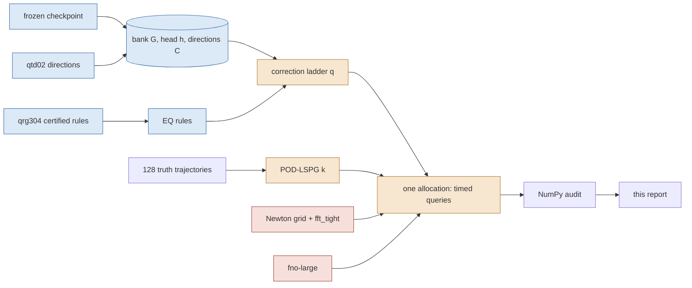

# 2026-09-17-b-panel — the central comparison priced in one allocation per mesh

Every cost and every error in this report was measured in one Slurm allocation on one GPU per mesh, against full-order controls timed in that same allocation with the same reference; every number is generated from the audit JSONs named at the end. Numbers are development-cohort (six opened cases), one checkpoint, one training seed; the sealed cohorts are untouched. **Status: provisional as paper claims until the coordinator assembles T5.**

**Headline, 256² (job `3780638`, one allocation, one GPU): 0 of the 27 reduced-order subjects are non-dominated on (median GPU ms, worst evolved %).** The frontier is full-order Newton plus the trained FNO. The most accurate reduced subject is `pod512_M2048_dense` at 0.2184 % and 2928.9 ms, and 4 of the same job's full-order settings are **both cheaper and at least as accurate** — cheapest `nt1e-3_dt005` at 0.0489 % and 31.4 ms, i.e. 93.2× less time at 0.22× the error. This is the evidence for the paper's claim of no speedup over an efficient full-order solver at this mesh.

## 256² intervals — job `3780638` on `NVIDIA A100 80GB PCIe`

Source commit `89df5cd18b01d99e630999ddfed5ddf43bba377c`, attempt `bpn101`, elapsed 1712.8 s, JAX pool fraction 0.90, 35 timed subjects, failed gates: none. Every error below is against this job's own converged `fft_tight` solve (same grid) unless the column says reference; 'reference' is the 4096-interval solve. Costs are medians over 6 cases × 3 repetitions; ratios are only meaningful inside this table.

### How to read the two error columns

The same-grid columns measure every subject against this job's converged `fft_tight` solve, so **`fft_tight` sits at exactly zero there by construction** — `fft_tight` *is* the reference, and `dense_tight`, the same solve through a different preconditioner, agrees with it to 9.2e-16 relative. They are plotted at the axis floor, and they appear on the same-grid frontier for that reason, not because they are free. The `worst vs ref %` column is where the full-order solvers are not free: against the 4096-interval reference this mesh's own discretisation error is 2.4737–5.1761 % for the full-order controls, and every reduced subject inherits it. A reduced subject is only interesting where it is cheaper than a full-order solve of the accuracy it actually delivers.

### Every subject

| subject | family | q / k′ | M | quad. | m | rule basis | tol | worst all % | worst evolved % | median evolved % | t=0 % | worst vs ref % | best-found % | solved/best-found | GPU ms | complete ms | med it | max it | budget exits | conv. | strict | admissible |
|---|---|---|---|---|---|---|---|---|---|---|---|---|---|---|---|---|---|---|---|---|---|---|
| `q0_M256_dense_g1em06` | rom | q=0 | 256 | dense | — | — | 1.0e-06 | 2.5629 | 1.2710 | 0.5812 | 2.5629 | 4.0637 | 2.5447 | 1.00716 | 341.134 | 343.446 | 3.0 | 33 | 0 | yes | yes | yes |
| `q0_M64_dense_g1em06` | rom | q=0 | 64 | dense | — | — | 1.0e-06 | 2.5629 | 1.8890 | 1.0059 | 2.5629 | 4.5575 | 2.5447 | 1.00716 | 284.822 | 287.404 | 3.0 | 29 | 0 | yes | yes | yes |
| `q0_M64_eqcert_g0p001` | rom | q=0 | 64 | eq | 1024 | primary | 1.0e-03 | 2.5628 | 1.8898 | 1.0103 | 2.5628 | 4.5521 | 2.5447 | 1.00713 | 42.620 | 45.101 | 2.0 | 26 | 0 | yes | yes | yes |
| `q0_M64_eqcert_g1em06` | rom | q=0 | 64 | eq | 1024 | primary | 1.0e-06 | 2.5629 | 1.8891 | 1.0100 | 2.5629 | 4.5529 | 2.5447 | 1.00716 | 57.851 | 60.431 | 3.0 | 29 | 0 | yes | yes | yes |
| `q16_M128_dense_g1em06` | rom | q=16 | 128 | dense | — | — | 1.0e-06 | 2.4806 | 1.3985 | 0.6411 | 2.4806 | 4.1065 | 2.4615 | 1.00776 | 363.045 | 365.588 | 3.0 | 31 | 0 | yes | yes | yes |
| `q16_M128_eqcert_g0p001` | rom | q=16 | 128 | eq | 1024 | primary | 1.0e-03 | 2.4806 | 1.4272 | 0.6423 | 2.4806 | 4.1136 | 2.4615 | 1.00776 | 60.398 | 62.915 | 2.0 | 25 | 0 | yes | yes | yes |
| `q16_M128_eqcert_g1em06` | rom | q=16 | 128 | eq | 1024 | primary | 1.0e-06 | 2.4806 | 1.4270 | 0.6424 | 2.4806 | 4.1145 | 2.4615 | 1.00776 | 79.743 | 82.243 | 3.0 | 28 | 0 | yes | yes | yes |
| `q32_M192_dense_g1em06` | rom | q=32 | 192 | dense | — | — | 1.0e-06 | 2.3534 | 1.2336 | 0.5962 | 2.3534 | 4.0814 | 2.3325 | 1.00895 | 442.614 | 445.320 | 3.0 | 27 | 0 | yes | yes | yes |
| `q32_M192_eqcert_g0p001` | rom | q=32 | 192 | eq | 1024 | primary | 1.0e-03 | 2.3534 | 1.2497 | 0.5951 | 2.3534 | 4.0805 | 2.3325 | 1.00895 | 72.317 | 74.820 | 2.0 | 28 | 0 | yes | yes | yes |
| `q32_M192_eqcert_g1em06` | rom | q=32 | 192 | eq | 1024 | primary | 1.0e-06 | 2.3534 | 1.2493 | 0.5952 | 2.3534 | 4.0818 | 2.3325 | 1.00895 | 95.681 | 97.991 | 3.0 | 30 | 0 | yes | yes | yes |
| `q64_M320_dense_g1em06` | rom | q=64 | 320 | dense | — | — | 1.0e-06 | 2.1489 | 1.0843 | 0.5202 | 2.1489 | 4.1013 | 2.1386 | 1.00479 | 637.350 | 639.733 | 3.0 | 46 | 0 | yes | yes | yes |
| `q64_M320_eqcert_g0p001` | rom | q=64 | 320 | eq | 1024 | primary | 1.0e-03 | 2.1489 | 1.2278 | 0.5211 | 2.1489 | 4.0836 | 2.1386 | 1.00479 | 88.508 | 90.933 | 2.0 | 38 | 0 | yes | yes | yes |
| `q64_M320_eqcert_g1em06` | rom | q=64 | 320 | eq | 1024 | primary | 1.0e-06 | 2.1489 | 1.2275 | 0.5212 | 2.1489 | 4.0855 | 2.1386 | 1.00479 | 119.118 | 121.881 | 3.0 | 51 | 0 | yes | yes | yes |
| `q128_M576_dense_g1em06` | rom | q=128 | 576 | dense | — | — | 1.0e-06 | 1.8116 | 0.8930 | 0.4151 | 1.8116 | 4.0797 | 1.8105 | 1.00059 | 1223.219 | 1225.747 | 3.0 | 66 | 0 | yes | yes | yes |
| `q128_M576_eqcert_g0p001` | rom | q=128 | 576 | eq | 2048 | secondary | 1.0e-03 | 1.8116 | 0.8926 | 0.4145 | 1.8116 | 4.0791 | 1.8105 | 1.00059 | 189.046 | 191.565 | 2.0 | 48 | 0 | yes | yes | yes |
| `q128_M576_eqcert_g1em06` | rom | q=128 | 576 | eq | 2048 | secondary | 1.0e-06 | 1.8116 | 0.8925 | 0.4145 | 1.8116 | 4.0809 | 1.8105 | 1.00059 | 247.045 | 249.723 | 3.0 | 66 | 0 | yes | yes | yes |
| `q256_M1088_dense_g1em06` | rom | q=256 | 1088 | dense | — | — | 1.0e-06 | 0.9053 | 0.5194 | 0.1790 | 0.9053 | 4.0391 | 0.9016 | 1.00403 | 4164.622 | 4167.141 | 5.0 | 307 | 0 | yes | yes | yes |
| `q256_M1088_eqcert_g0p001` | rom | q=256 | 1088 | eq | 2048 | secondary | 1.0e-03 | 1.0324 | 1.0324 | 0.3607 | 0.9053 | 4.0322 | 0.9016 | 1.14504 | 429.438 | 431.861 | 3.0 | 60 | 0 | yes | yes | yes |
| `q256_M1088_eqcert_g1em06` | rom | q=256 | 1088 | eq | 2048 | secondary | 1.0e-06 | 1.0361 | 1.0361 | 0.3607 | 0.9053 | 4.0332 | 0.9016 | 1.14914 | 700.352 | 703.009 | 5.0 | 308 | 0 | yes | yes | yes |
| `q0_M64_eqcert_g1em06_fastL4` | fast | q=0 | 64 | eq | 1024 | primary | 1.0e-06 | 2.5629 | 1.8891 | 1.0100 | 2.5629 | 4.5529 | 2.5447 | 1.00716 | 39.097 | 41.672 | 3.0 | 29 | 0 | yes | yes | yes |
| `pod16_M64_dense` | pod | k'=16 | 64 | dense | — | — | 1.0e-06 | 61.6503 | 28.7250 | 21.4948 | 61.6503 | 61.6503 | 61.6503 | 1.00000 | 46.892 | 49.388 | 2.0 | 18 | 0 | yes | yes | yes |
| `pod32_M128_dense` | pod | k'=32 | 128 | dense | — | — | 1.0e-06 | 47.0681 | 18.7995 | 9.9416 | 47.0681 | 47.0681 | 47.0681 | 1.00000 | 81.655 | 84.179 | 2.0 | 18 | 0 | yes | no | yes |
| `pod64_M256_dense` | pod | k'=64 | 256 | dense | — | — | 1.0e-06 | 19.8156 | 7.0835 | 3.4707 | 19.8156 | 19.8156 | 19.8147 | 1.00005 | 148.190 | 150.788 | 2.0 | 18 | 0 | yes | no | yes |
| `pod128_M512_dense` | pod | k'=128 | 512 | dense | — | — | 1.0e-06 | 10.1198 | 1.9464 | 0.9613 | 10.1198 | 10.1198 | 10.1189 | 1.00009 | 337.204 | 339.592 | 2.0 | 19 | 0 | yes | no | yes |
| `pod256_M1024_dense` | pod | k'=256 | 1024 | dense | — | — | 1.0e-06 | 3.7698 | 0.7109 | 0.2834 | 3.7698 | 4.0362 | 3.7686 | 1.00033 | 927.786 | 930.811 | 2.0 | 21 | 0 | yes | no | yes |
| `pod512_M2048_dense` | pod | k'=512 | 2048 | dense | — | — | 1.0e-06 | 0.6125 | 0.2184 | 0.0320 | 0.6125 | 4.0266 | 0.6090 | 1.00577 | 2928.909 | 2932.935 | 2.0 | 23 | 0 | yes | no | yes |
| `free512_M1024_dense` | free | k'=512 | 1024 | dense | — | — | 1.0e-06 | 0.6027 | 0.4471 | 0.1555 | 0.6027 | 4.0423 | 0.3918 | 1.53803 | 2542.287 | 2545.905 | 3.0 | 57 | 0 | yes | no | yes |
| `fno-large` | fno | — | — | — | — | — | — | 7.4164 | 7.4164 | 2.5256 | 0.0000 | 5.7495 | — | — | 7.214 | 7.550 | — | — | — | — | — | yes |
| `dense_tight` | fom | — | — | ntol 1.0e-06 dt 0.005 | — | — | — | 0.0000 | 0.0000 | 0.0000 | 0.0000 | 4.0265 | — | — | 60.793 | 63.350 | 2.0 | — | — | — | — | yes |
| `fft_tight` | fom | — | — | ntol 1.0e-06 dt 0.005 | — | — | — | 0.0000 | 0.0000 | 0.0000 | 0.0000 | 4.0265 | — | — | 89.285 | 91.996 | 2.0 | — | — | — | — | yes |
| `nt1e-2_dt005` | fom | — | — | ntol 1.0e-02 dt 0.005 | — | — | — | 3.7127 | 3.7127 | 1.4783 | 0.0000 | 2.4737 | — | — | 15.837 | 18.303 | 1.0 | — | — | — | — | yes |
| `nt1e-2_dt01` | fom | — | — | ntol 1.0e-02 dt 0.01 | — | — | — | 3.1999 | 3.1999 | 1.4192 | 0.0000 | 3.6168 | — | — | 9.282 | 11.355 | 1.0 | — | — | — | — | yes |
| `nt1e-3_dt005` | fom | — | — | ntol 1.0e-03 dt 0.005 | — | — | — | 0.0489 | 0.0489 | 0.0335 | 0.0000 | 4.0399 | — | — | 31.414 | 33.676 | 1.0 | — | — | — | — | yes |
| `nt1e-3_dt01` | fom | — | — | ntol 1.0e-03 dt 0.01 | — | — | — | 1.5179 | 1.5179 | 1.1980 | 0.0000 | 5.1761 | — | — | 20.049 | 22.420 | 1.0 | — | — | — | — | yes |
| `nt1e-4_dt005` | fom | — | — | ntol 1.0e-04 dt 0.005 | — | — | — | 0.0338 | 0.0338 | 0.0153 | 0.0000 | 4.0320 | — | — | 36.734 | 39.379 | 1.0 | — | — | — | — | yes |
| `nt1e-4_dt01` | fom | — | — | ntol 1.0e-04 dt 0.01 | — | — | — | 1.5109 | 1.5109 | 1.1722 | 0.0000 | 5.1552 | — | — | 27.868 | 30.231 | 1.0 | — | — | — | — | yes |

### The subjects that converge under this lane's rule and not under the stricter one

6 reduced subjects carry `converged = yes` and `strict = no`: `pod32_M128_dense`, `pod64_M256_dense`, `pod128_M512_dense`, `pod256_M1024_dense`, `pod512_M2048_dense`, `free512_M1024_dense`. This is not a solver failure and it is not a flag to read past, so here is exactly what fails, why no iteration budget can fix it, and whether the error would move if it were fixed.

**What fails.** Not the evolution. Every one of these subjects exits *every* time step on the gradient rule with a worst per-step normalised gradient of 1.0e-06 or better, at zero iteration-budget exits. The only quantity above tolerance is the **initial fit's** normalised gradient $\|J^\top r\|/(\|J\|\,\|r\|)$, at 4.5e-02–1.9e-01.

**Why no budget can fix it.** For these arms the initial fit is an *attainable* least-squares problem — for POD-LSPG it is the square linear system $R\,z=Q^\top u_{\rm in}$, for the unrestricted bank it is the full-rank bank fit — so the residual falls to round-off: the worst relative initial-fit residual over these subjects is 1.0e-15, i.e. machine zero against an input of norm one. The stationarity test is then the ratio of two vanishing quantities and stops being a measure of anything; iterating longer cannot move a $0/0$. That is the degeneracy `head-ablation/arms.py` already documents for attainable reduced fits, and it is why DESIGN.md §5 pre-registered a rule that accepts an initial fit whose relative residual is at round-off and reports the stricter flag beside it rather than instead of it.

**Whether the error would move.** No, and for 5 of these 6 subjects there is a direct check: the solved error already equals the best any coefficients in that subject's own span could achieve, solved / best-found between 1.00000 and 1.00577. Those solves are at their representation floor and a longer solve has nothing left to find.

Stated precisely rather than rounded away: `free512_M1024_dense` sits 1.538× above its floor (0.6027 % solved against 0.3918 %). That gap is **not** slack left by the solver: the floor quoted for it is a *static* projection bound — the best reconstruction of each supplied field taken one output time at a time — whereas the solved number is a trajectory that must also carry its own time-stepping error forward. A converged trajectory is not obliged to attain a static reconstruction bound, and its per-step gradients above show the solver is converged at every step regardless.

| subject | best-found (projection floor) % | solved worst all-times % | solved / best-found | worst per-step gradient | initial-fit gradient | initial-fit relative residual |
|---|---|---|---|---|---|---|
| `pod32_M128_dense` | 47.0681 | 47.0681 | 1.00000 | 9.8e-07 | 1.8e-01 | 9.1e-20 |
| `pod64_M256_dense` | 19.8147 | 19.8156 | 1.00005 | 9.7e-07 | 1.3e-01 | 6.0e-18 |
| `pod128_M512_dense` | 10.1189 | 10.1198 | 1.00009 | 9.9e-07 | 8.9e-02 | 1.2e-17 |
| `pod256_M1024_dense` | 3.7686 | 3.7698 | 1.00033 | 9.9e-07 | 6.3e-02 | 7.2e-18 |
| `pod512_M2048_dense` | 0.6090 | 0.6125 | 1.00577 | 7.6e-07 | 4.5e-02 | 1.4e-17 |
| `free512_M1024_dense` | 0.3918 | 0.6027 | 1.53803 | 1.0e-06 | 1.9e-01 | 1.0e-15 |

**So the classical baseline is not being handicapped.** Every POD rank in this job is solved to the same per-step tolerance as every correction-ladder rung, at the same per-step budget of 600, with zero budget exits, and lands on its own projection floor. Where POD beats the ladder below, it does so from a fully converged solve.

### Why a reduced subject is or is not converged

| subject | exit reasons (0 budget / 1 residual / 2 tiny step / 4 gradient) | worst step gradient | worst IC gradient | worst IC relative residual | converged | strict |
|---|---|---|---|---|---|---|
| `q0_M256_dense_g1em06` | {"4": 900} | 9.9e-07 | 7.0e-07 | 2.5e-02 | yes | yes |
| `q0_M64_dense_g1em06` | {"4": 900} | 1.0e-06 | 7.0e-07 | 2.5e-02 | yes | yes |
| `q0_M64_eqcert_g0p001` | {"4": 900} | 1.0e-03 | 3.2e-04 | 2.5e-02 | yes | yes |
| `q0_M64_eqcert_g1em06` | {"4": 900} | 9.9e-07 | 7.0e-07 | 2.5e-02 | yes | yes |
| `q16_M128_dense_g1em06` | {"4": 900} | 1.0e-06 | 8.5e-07 | 2.4e-02 | yes | yes |
| `q16_M128_eqcert_g0p001` | {"4": 900} | 9.8e-04 | 8.5e-07 | 2.4e-02 | yes | yes |
| `q16_M128_eqcert_g1em06` | {"4": 900} | 9.7e-07 | 8.5e-07 | 2.4e-02 | yes | yes |
| `q32_M192_dense_g1em06` | {"4": 900} | 9.8e-07 | 8.5e-07 | 2.3e-02 | yes | yes |
| `q32_M192_eqcert_g0p001` | {"4": 900} | 9.8e-04 | 8.5e-07 | 2.3e-02 | yes | yes |
| `q32_M192_eqcert_g1em06` | {"4": 900} | 9.9e-07 | 8.5e-07 | 2.3e-02 | yes | yes |
| `q64_M320_dense_g1em06` | {"4": 900} | 9.5e-07 | 7.3e-07 | 2.1e-02 | yes | yes |
| `q64_M320_eqcert_g0p001` | {"4": 900} | 9.9e-04 | 7.3e-07 | 2.1e-02 | yes | yes |
| `q64_M320_eqcert_g1em06` | {"4": 900} | 1.0e-06 | 7.3e-07 | 2.1e-02 | yes | yes |
| `q128_M576_dense_g1em06` | {"4": 900} | 9.9e-07 | 5.4e-07 | 1.8e-02 | yes | yes |
| `q128_M576_eqcert_g0p001` | {"4": 900} | 9.9e-04 | 5.4e-07 | 1.8e-02 | yes | yes |
| `q128_M576_eqcert_g1em06` | {"4": 900} | 9.8e-07 | 5.4e-07 | 1.8e-02 | yes | yes |
| `q256_M1088_dense_g1em06` | {"4": 900} | 1.0e-06 | 1.3e-07 | 8.1e-03 | yes | yes |
| `q256_M1088_eqcert_g0p001` | {"4": 900} | 1.0e-03 | 1.3e-07 | 8.1e-03 | yes | yes |
| `q256_M1088_eqcert_g1em06` | {"4": 900} | 9.9e-07 | 1.3e-07 | 8.1e-03 | yes | yes |
| `q0_M64_eqcert_g1em06_fastL4` | {"4": 900} | 9.9e-07 | 7.0e-07 | 2.5e-02 | yes | yes |
| `pod16_M64_dense` | {"4": 900} | 1.0e-06 | 0.0e+00 | 0.0e+00 | yes | yes |
| `pod32_M128_dense` | {"4": 900} | 1.8e-01 | 1.8e-01 | 9.1e-20 | yes | no |
| `pod64_M256_dense` | {"4": 900} | 1.3e-01 | 1.3e-01 | 6.0e-18 | yes | no |
| `pod128_M512_dense` | {"4": 900} | 8.9e-02 | 8.9e-02 | 1.2e-17 | yes | no |
| `pod256_M1024_dense` | {"4": 900} | 6.3e-02 | 6.3e-02 | 7.2e-18 | yes | no |
| `pod512_M2048_dense` | {"4": 900} | 4.5e-02 | 4.5e-02 | 1.4e-17 | yes | no |
| `free512_M1024_dense` | {"4": 900} | 1.9e-01 | 1.9e-01 | 1.0e-15 | yes | no |

### What is on the frontier

On (median GPU ms, worst evolved %) over admissible subjects, **0 of the 27 reduced subjects are non-dominated**. The most accurate reduced subject is `pod512_M2048_dense` at 0.2184 % and 2928.9 ms; the full-order settings that are **both cheaper and at least as accurate** are `dense_tight` (0.0000 %, 60.8 ms), `fft_tight` (0.0000 %, 89.3 ms), `nt1e-3_dt005` (0.0489 %, 31.4 ms), `nt1e-4_dt005` (0.0338 %, 36.7 ms).

### Non-dominated sets

**(median_gpu_ms, worst_all_times_percent)** — admissible subjects: `fno-large`, `nt1e-2_dt01`, `nt1e-3_dt01`, `nt1e-4_dt01`, `nt1e-3_dt005`, `nt1e-4_dt005`, `dense_tight`, `fft_tight`; all subjects: `fno-large`, `nt1e-2_dt01`, `nt1e-3_dt01`, `nt1e-4_dt01`, `nt1e-3_dt005`, `nt1e-4_dt005`, `dense_tight`, `fft_tight`; reduced subjects only (post-hoc, DESIGN §A4): `q0_M64_eqcert_g1em06_fastL4`, `q0_M64_eqcert_g0p001`, `q16_M128_eqcert_g0p001`, `q32_M192_eqcert_g0p001`, `q64_M320_eqcert_g0p001`, `q128_M576_eqcert_g0p001`, `q256_M1088_eqcert_g0p001`, `free512_M1024_dense`

**(median_gpu_ms, worst_evolved_percent)** — admissible subjects: `fno-large`, `nt1e-2_dt01`, `nt1e-3_dt01`, `nt1e-4_dt01`, `nt1e-3_dt005`, `nt1e-4_dt005`, `dense_tight`, `fft_tight`; all subjects: `fno-large`, `nt1e-2_dt01`, `nt1e-3_dt01`, `nt1e-4_dt01`, `nt1e-3_dt005`, `nt1e-4_dt005`, `dense_tight`, `fft_tight`; reduced subjects only (post-hoc, DESIGN §A4): `q0_M64_eqcert_g1em06_fastL4`, `q0_M64_eqcert_g1em06`, `q16_M128_eqcert_g0p001`, `q32_M192_eqcert_g0p001`, `q64_M320_eqcert_g0p001`, `q64_M320_eqcert_g1em06`, `q128_M576_eqcert_g0p001`, `q128_M576_eqcert_g1em06`, `pod256_M1024_dense`, `free512_M1024_dense`, `pod512_M2048_dense`

**(median_host_ms, worst_all_times_percent)** — admissible subjects: `fno-large`, `nt1e-2_dt01`, `nt1e-3_dt01`, `nt1e-4_dt01`, `nt1e-3_dt005`, `nt1e-4_dt005`, `dense_tight`, `fft_tight`; all subjects: `fno-large`, `nt1e-2_dt01`, `nt1e-3_dt01`, `nt1e-4_dt01`, `nt1e-3_dt005`, `nt1e-4_dt005`, `dense_tight`, `fft_tight`; reduced subjects only (post-hoc, DESIGN §A4): `q0_M64_eqcert_g1em06_fastL4`, `q0_M64_eqcert_g0p001`, `q16_M128_eqcert_g0p001`, `q32_M192_eqcert_g0p001`, `q64_M320_eqcert_g0p001`, `q128_M576_eqcert_g0p001`, `q256_M1088_eqcert_g0p001`, `free512_M1024_dense`

**(median_host_ms, worst_evolved_percent)** — admissible subjects: `fno-large`, `nt1e-2_dt01`, `nt1e-3_dt01`, `nt1e-4_dt01`, `nt1e-3_dt005`, `nt1e-4_dt005`, `dense_tight`, `fft_tight`; all subjects: `fno-large`, `nt1e-2_dt01`, `nt1e-3_dt01`, `nt1e-4_dt01`, `nt1e-3_dt005`, `nt1e-4_dt005`, `dense_tight`, `fft_tight`; reduced subjects only (post-hoc, DESIGN §A4): `q0_M64_eqcert_g1em06_fastL4`, `q0_M64_eqcert_g1em06`, `q16_M128_eqcert_g0p001`, `q32_M192_eqcert_g0p001`, `q64_M320_eqcert_g0p001`, `q64_M320_eqcert_g1em06`, `q128_M576_eqcert_g0p001`, `q128_M576_eqcert_g1em06`, `pod256_M1024_dense`, `free512_M1024_dense`, `pod512_M2048_dense`

### The nonlinear manifold against the classical one (post-hoc, DESIGN §A4)

- On **worst over ALL output times**, the reduced-only frontier holds 7 correction-ladder point(s) and 0 POD rank(s), and **no POD rank appears on it at all**.
- On **worst over EVOLVED times**, the reduced-only frontier holds 8 correction-ladder point(s) and 2 POD rank(s) — POD enters only at k′=256, k′=512.

The head ablation reported that no POD rank up to $k'=128$ matched the neural head. That holds here and does not extend: at $k'=512$ — a rank that ablation never ran — POD beats the best correction-ladder point on **both** axes (`pod512_M2048_dense` 0.2184 % at 2929 ms, against `q256_M1088_dense_g1em06` 0.5194 % at 4165 ms), from a solve whose convergence is established above.

### Ladders

| ladder | rungs | worst evolved % | worst all % | GPU ms | monotone evolved | monotone all | all converged | non-dominated converged points | error span | cost span |
|---|---|---|---|---|---|---|---|---|---|---|
| dense | 0 / 16 / 32 / 64 / 128 / 256 | 1.8890 / 1.3985 / 1.2336 / 1.0843 / 0.8930 / 0.5194 | 2.5629 / 2.4806 / 2.3534 / 2.1489 / 1.8116 / 0.9053 | 285 / 363 / 443 / 637 / 1223 / 4165 | yes | yes | yes | 6 | 3.637 | 14.622 |
| eq_g1em06 | 0 / 16 / 32 / 64 / 128 / 256 | 1.8891 / 1.4270 / 1.2493 / 1.2275 / 0.8925 / 1.0361 | 2.5629 / 2.4806 / 2.3534 / 2.1489 / 1.8116 / 1.0361 | 58 / 80 / 96 / 119 / 247 / 700 | no | yes | yes | 5 | 2.117 | 4.270 |
| eq_g0p001 | 0 / 16 / 32 / 64 / 128 / 256 | 1.8898 / 1.4272 / 1.2497 / 1.2278 / 0.8926 / 1.0324 | 2.5628 / 2.4806 / 2.3534 / 2.1489 / 1.8116 / 1.0324 | 43 / 60 / 72 / 89 / 189 / 429 | no | yes | yes | 5 | 2.117 | 4.436 |
| pod | 16 / 32 / 64 / 128 / 256 / 512 | 28.7250 / 18.7995 / 7.0835 / 1.9464 / 0.7109 / 0.2184 | 61.6503 / 47.0681 / 19.8156 / 10.1198 / 3.7698 / 0.6125 | 47 / 82 / 148 / 337 / 928 / 2929 | yes | yes | yes | 6 | 131.536 | 62.460 |

### Cross-job fidelity gates

| arm | reproduces | source job | worst relative difference | first tier | tier reached | passed |
|---|---|---|---|---|---|---|
| `q0_M64_dense_g1em06` | `q0_M64_dense` | 3757505 | 1.3e-13 | 1.0e-09 | first | yes |
| `q0_M256_dense_g1em06` | `q0_M256_dense_g1em06` | 3747245 | 5.3e-13 | 1.0e-09 | first | yes |
| `q0_M64_eqcert_g1em06` | `q0_m4_eqcert` | 3768168 | 8.2e-16 | 1.0e-09 | first | yes |
| `q16_M128_dense_g1em06` | `old_q16_M128_dense` | 3757505 | 3.6e-13 | 1.0e-09 | first | yes |
| `q32_M192_dense_g1em06` | `old_q32_M192_dense` | 3757505 | 2.6e-13 | 1.0e-09 | first | yes |
| `q64_M320_dense_g1em06` | `old_q64_M320_dense` | 3757505 | 1.6e-13 | 1.0e-09 | first | yes |
| `q128_M576_dense_g1em06` | `old_q128_M576_dense` | 3757505 | 1.8e-13 | 1.0e-09 | first | yes |
| `q256_M1088_dense_g1em06` | `old_q256_M1088_dense` | 3757505 | 1.5e-12 | 1.0e-09 | first | yes |
| `q64_M320_eqcert_g1em06` | `q64_m4_eqcert` | 3768168 | 1.9e-09 | 1.0e-03 | first | yes |
| `q256_M1088_eqcert_g1em06` | `q256_m4_eqcert` | 3768168 | 3.5e-09 | 1.0e-03 | first | yes |

**FNO.** `fno-large`, 17,877,317 real parameters, checkpoint SHA256 `208d9002cd8e8567…`, pooled device query median 7.214 ms, host transfer median 0.277 ms. Deviation: second process in the same Slurm allocation on the same GPU, after the JAX phase exited; the source protocol times all models in one process

### Gates

| gate | passed | detail |
|---|---|---|
| complete | yes |  |
| backend_gpu | yes | "gpu" |
| x64 | yes |  |
| precision_highest | yes |  |
| bank_frozen | yes |  |
| checkpoint_unchanged | yes |  |
| final_cohort_unopened | yes |  |
| step_budget_600 | yes | {"ic_budget": 400, "step_budget": 600, "gtol": 1e-06} |
| evaluation_cohort_bitwise_abl01 | yes | {"expected": "108f12dc8f9e6a64daf94f55861c616a29810134a52726e8a683a2a43892dc8a", "got": "108f12dc8f9e6a64daf94f55861c616a29810134a52726e8a683a2a43892dc8a", "pas |
| directions_file_sha256 | yes | {"passed": true, "got": "79d794580dad15c03630470940361d8ba9a7779673be9697c90d28e5c3d81535", "expected": "79d794580dad15c03630470940361d8ba9a7779673be9697c90d28e |
| directions_prefix_hashes | yes | {"passed": true, "detail": {"0": "e3b0c44298fc1c149afbf4c8996fb92427ae41e4649b934ca495991b7852b855", "16": "3417aa250f794e3ee5350a595341d8a5d17327effdb23c7b148c |
| repetition_output_identical | yes | {"passed": true} |
| fft_tight_converged_everywhere | yes | {"passed": true} |
| direct_reproduces_fft_tight | yes | {"passed": true, "worst_relative": 9.165269450615788e-16, "direct": "dense_tight", "tight": "fft_tight"} |
| fast_parity | yes | {"passed": true, "worst_relative": 1.21082619667208e-13, "integers_identical": true, "bar": 1e-12, "against": "q0_M64_eqcert_g1em06", "cases": [{"case": 0, "rel |
| fno_cohort_disjoint_from_training | yes | {"passed": true, "training_cases": 128, "nearest_descriptor_distance": [0.19232635342554294, 0.10736638494766206, 0.11269923423735635, 0.1599038760865144, 0.164 |
| reference_residuals | yes | 9.875956374345395e-12 |
| every_rule_hash_matches_provenance | yes |  |
| no_subject_dropped | yes | [] |
| every_subject_case_has_all_reps | yes | [3] |
| every_invocation_paired | yes |  |
| overdetermined_weak_system | yes |  |
| every_rom_carries_exit_and_stationarity | yes |  |
| host_time_covers_gpu_time | yes |  |
| artifacts_present | yes | [] |
| same_grid_baseline_present | yes |  |
| recorded_errors_recomputed_from_saved_fields | yes | 5.169900890572052e-16 |
| fno_returns_supplied_field_at_t0 | yes |  |
| fno_timed_in_same_allocation | yes | {"deviation": "second process in the same Slurm allocation on the same GPU, after the JAX phase exited; the source protocol times all models in one process", "s |
| convergence_flags_reproduced | yes | [] |
| reproduces_q0_M64_dense_g1em06 | yes | {"source": "qtd02", "comparator": "q0_M64_dense", "job": "3757505", "first_tier": 1e-09, "second_tier": null, "worst_all_times_percent": {"ours": 2.562871982659 |
| reproduces_q0_M256_dense_g1em06 | yes | {"source": "btq201", "comparator": "q0_M256_dense_g1em06", "job": "3747245", "first_tier": 1e-09, "second_tier": null, "worst_all_times_percent": {"ours": 2.562 |
| reproduces_q0_M64_eqcert_g1em06 | yes | {"source": "qrg304", "comparator": "q0_m4_eqcert", "job": "3768168", "first_tier": 1e-09, "second_tier": null, "worst_all_times_percent": {"ours": 2.56287198265 |
| reproduces_q16_M128_dense_g1em06 | yes | {"source": "qtd02", "comparator": "old_q16_M128_dense", "job": "3757505", "first_tier": 1e-09, "second_tier": 0.001, "worst_all_times_percent": {"ours": 2.48057 |
| reproduces_q32_M192_dense_g1em06 | yes | {"source": "qtd02", "comparator": "old_q32_M192_dense", "job": "3757505", "first_tier": 1e-09, "second_tier": 0.001, "worst_all_times_percent": {"ours": 2.35337 |
| reproduces_q64_M320_dense_g1em06 | yes | {"source": "qtd02", "comparator": "old_q64_M320_dense", "job": "3757505", "first_tier": 1e-09, "second_tier": 0.001, "worst_all_times_percent": {"ours": 2.14887 |
| reproduces_q128_M576_dense_g1em06 | yes | {"source": "qtd02", "comparator": "old_q128_M576_dense", "job": "3757505", "first_tier": 1e-09, "second_tier": 0.001, "worst_all_times_percent": {"ours": 1.8115 |
| reproduces_q256_M1088_dense_g1em06 | yes | {"source": "qtd02", "comparator": "old_q256_M1088_dense", "job": "3757505", "first_tier": 1e-09, "second_tier": 0.001, "worst_all_times_percent": {"ours": 0.905 |
| reproduces_q64_M320_eqcert_g1em06 | yes | {"source": "qrg304", "comparator": "q64_m4_eqcert", "job": "3768168", "first_tier": 0.001, "second_tier": null, "worst_all_times_percent": {"ours": 2.1488705425 |
| reproduces_q256_M1088_eqcert_g1em06 | yes | {"source": "qrg304", "comparator": "q256_m4_eqcert", "job": "3768168", "first_tier": 0.001, "second_tier": null, "worst_all_times_percent": {"ours": 1.036116103 |

## Glossary

- **subject:** one timed configuration; everything except the named difference is held fixed.
- **family:** `rom` the frozen nonlinear-manifold model with q corrections; `fast` the same q = 0 query through the optimised kernel; `pod` classical POD-LSPG at rank k′; `free` all 512 bank coefficients solved; `fom` the full-order Newton solver on the same grid; `fno` the trained Fourier neural operator.
- **q:** number of fixed correction directions added to the head output; q = 0 is the plain frozen model.
- **M:** number of sine test modes the weak residual is projected on; M = 4 × unknowns unless stated.
- **quad. / m:** dense = exact advection sum on the whole grid; eq = an m-point empirical quadrature rule.
- **eqcert / eqxfer:** eqcert: the rule qrg304 fitted on reachable states and certified by held-out ρ; eqxfer: that rule's support mapped to a finer grid with weights refit and re-certified.
- **rule basis:** primary: ρ max ≤ 0.116 on held-out reachable states; secondary: only the 95th percentile of ρ is ≤ 0.116; none: uncertified.
- **ρ:** the rule's relative error on the projected advection term, measured on states the model actually reaches, never its own fit residual.
- **tol:** the evolution stopping tolerance on the normalised gradient.
- **worst all % / worst evolved %:** largest relative error against the same-job converged full-order solve over all six output times / over the five evolved times, worst over the six cases.
- **t=0 %:** the model's error reproducing the supplied initial field (its compression); the FNO returns the field exactly.
- **worst vs ref %:** the same against the 4096-interval reference; includes the mesh's discretisation error, which the `fft_tight` row shows.
- **GPU ms / complete ms:** median time from the input resident on the GPU to the six outputs resident on the GPU / the same including the input upload and output download.
- **med it / max it:** median and maximum Levenberg–Marquardt iterations per time step (Newton iterations for `fom` rows are in the audit).
- **budget exits:** time steps that hit the 600-iteration cap.
- **conv.:** DESIGN.md §5: every exit regular, every step gradient ≤ tol or residual at tolerance, initial fit gradient ≤ tol or its residual at round-off.
- **strict:** btq201's rule: every gradient ≤ tol regardless of residual; differs from conv. only for attained (square) initial fits.
- **admissible:** eligible for the reported frontier: converged reduced subjects with certified rules, parity-passing `fast`, and all `fom` / `fno` rows.
- **non-dominated:** no other subject in the same job is both cheaper and more accurate.
- **ladder spans:** over the converged non-dominated rungs of that ladder on the evolved metric.
- **same allocation:** the FNO is timed by a second process in the same Slurm job on the same GPU after the JAX process exits.

---

Generated by `experiments/b-panel/reports/generate_panel.py` from: `bpn101-audit.json` (SHA256 `a9f8a7e8f82e8baa…`, job 3780638).
