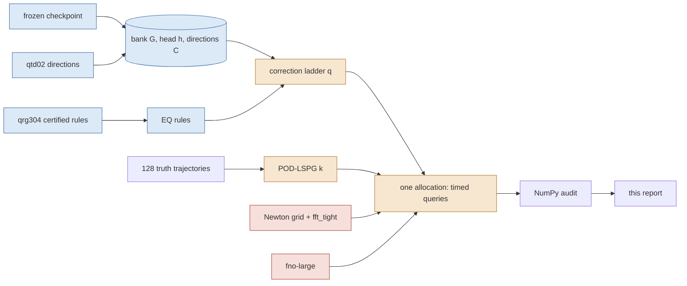

# smoke-panel — the central comparison priced in one allocation per mesh

Every cost and every error in this report was measured in one Slurm allocation on one GPU per mesh, against full-order controls timed in that same allocation with the same reference; every number is generated from the audit JSONs named at the end. Numbers are development-cohort (six opened cases), one checkpoint, one training seed; the sealed cohorts are untouched. **Status: provisional as paper claims until the coordinator assembles T5.**

**Headline, 64² (job `None`, one allocation, one GPU): 0 of the 6 reduced-order subjects are non-dominated on (median GPU ms, worst evolved %).** The frontier is full-order Newton plus the trained FNO. The most accurate reduced subject is `free512_M1024_dense` at 0.1635 % and 4220.2 ms, and 2 of the same job's full-order settings are **both cheaper and at least as accurate** — cheapest `dense_tight` at 0.0000 % and 43.7 ms, i.e. 96.5× less time at 0.00× the error. This is the evidence for the paper's claim of no speedup over an efficient full-order solver at this mesh.

**Headline, 128² (job `None`, one allocation, one GPU): 0 of the 5 reduced-order subjects are non-dominated on (median GPU ms, worst evolved %).** The frontier is full-order Newton plus the trained FNO. The most accurate reduced subject is `q4_M80_dense_g1em06` at 0.7404 % and 688.4 ms, and 1 of the same job's full-order settings are **both cheaper and at least as accurate** — cheapest `fft_tight` at 0.0000 % and 105.0 ms, i.e. 6.6× less time at 0.00× the error. This is the evidence for the paper's claim of no speedup over an efficient full-order solver at this mesh.

## 64² intervals — job `None` on `NVIDIA GB10`

Source commit `None`, attempt `smoke`, elapsed 153.3 s, JAX pool fraction 0.25, 18 timed subjects, failed gates: none. Every error below is against this job's own converged `fft_tight` solve (same grid) unless the column says reference; 'reference' is the 4096-interval solve. Costs are medians over 6 cases × 3 repetitions; ratios are only meaningful inside this table.

### Rule sets carried in this job

2 empirical-quadrature rule sets ran as arms at matched q, M and tolerance: `eqcert`, `eqdup`. The **rule status** column is the construction status the exporting lane recorded for that rule and travels with every row below: *confirmed (k/k)* means every independent re-draw of the construction met the primary bar; *marginal* means some re-draws failed it; *certified in one draw* means this single rule met the bar but its construction has not been re-drawn; blank means a single qrg304 draw never re-drawn. 

| set | q | M | file | source | m | fit states | ρ max | ρ 95 | basis | rule status |
|---|---|---|---|---|---|---|---|---|---|---|
| `eqcert` | 0 | 64 | `rule_q0_smoke_m256.npz` | q-ridge / smoke | 256 | — | — | — | none | — |
| `eqcert` | 4 | 80 | `rule_q4_smoke_m320.npz` | q-ridge / smoke | 320 | — | — | — | none | — |
| `eqdup` | 0 | 64 | `rule_q0_smoke_m256.npz` | q-ridge / smoke | 256 | — | — | — | none | — |
| `eqdup` | 4 | 80 | `rule_q4_smoke_m320.npz` | q-ridge / smoke | 320 | — | — | — | none | — |

### How to read the two error columns

The same-grid columns measure every subject against this job's converged `fft_tight` solve, so **`fft_tight` sits at exactly zero there by construction** — `fft_tight` *is* the reference, and `dense_tight`, the same solve through a different preconditioner, agrees with it to 1.4e-16 relative. It is plotted at the axis floor, and it appears on the same-grid frontier for that reason, not because it is free. The `worst vs ref %` column is where the full-order solvers are not free: against the 128-interval reference this mesh's own discretisation error is 1.2885–1.7941 % for the full-order controls, and every reduced subject inherits it. A reduced subject is only interesting where it is cheaper than a full-order solve of the accuracy it actually delivers.

### Every subject

| subject | family | q / k′ | M | quad. | m | rule set | rule basis | rule status | tol | worst all % | worst evolved % | median evolved % | t=0 % | worst vs ref % | best-found % | solved/best-found | GPU ms | complete ms | med it | max it | budget exits | conv. | strict | admissible |
|---|---|---|---|---|---|---|---|---|---|---|---|---|---|---|---|---|---|---|---|---|---|---|---|---|
| `q0_M128_dense_g1em06` | rom | q=0 | 128 | dense | — | — | — | — | 1.0e-06 | 2.3473 | 0.6464 | 0.5573 | 2.3473 | 2.3473 | 2.2959 | 1.02235 | 205.612 | 206.933 | 3.0 | 30 | 0 | yes | yes | yes |
| `q0_M64_dense_g1em06` | rom | q=0 | 64 | dense | — | — | — | — | 1.0e-06 | 2.3473 | 0.7644 | 0.7333 | 2.3473 | 2.3473 | 2.2959 | 1.02235 | 186.935 | 188.495 | 3.0 | 32 | 0 | yes | yes | yes |
| `q0_M64_eqcert_g0p001` | rom | q=0 | 64 | eq | 256 | eqcert | none | — | 1.0e-03 | 2.3473 | 1.1508 | 0.9662 | 2.3473 | 2.3473 | 2.2959 | 1.02236 | 65.808 | 68.741 | 2.0 | 29 | 0 | yes | yes | no |
| `q0_M64_eqcert_g1em06` | rom | q=0 | 64 | eq | 256 | eqcert | none | — | 1.0e-06 | 2.3473 | 1.1380 | 0.9597 | 2.3473 | 2.3473 | 2.2959 | 1.02235 | 86.673 | 89.085 | 3.0 | 32 | 0 | yes | yes | no |
| `q0_M64_eqdup_g0p001` | rom | q=0 | 64 | eq | 256 | eqdup | none | — | 1.0e-03 | 2.3473 | 1.1508 | 0.9662 | 2.3473 | 2.3473 | 2.2959 | 1.02236 | 66.049 | 68.336 | 2.0 | 29 | 0 | yes | yes | no |
| `q0_M64_eqdup_g1em06` | rom | q=0 | 64 | eq | 256 | eqdup | none | — | 1.0e-06 | 2.3473 | 1.1380 | 0.9597 | 2.3473 | 2.3473 | 2.2959 | 1.02235 | 86.671 | 89.441 | 3.0 | 32 | 0 | yes | yes | no |
| `q4_M80_dense_g1em06` | rom | q=4 | 80 | dense | — | — | — | — | 1.0e-06 | 2.3368 | 0.7475 | 0.6973 | 2.3368 | 2.3368 | 2.2849 | 1.02272 | 241.743 | 243.254 | 3.0 | 32 | 0 | yes | yes | yes |
| `q4_M80_eqcert_g0p001` | rom | q=4 | 80 | eq | 320 | eqcert | none | — | 1.0e-03 | 2.3368 | 0.9855 | 0.9146 | 2.3368 | 2.3368 | 2.2849 | 1.02272 | 104.465 | 106.737 | 2.0 | 29 | 0 | yes | yes | no |
| `q4_M80_eqcert_g1em06` | rom | q=4 | 80 | eq | 320 | eqcert | none | — | 1.0e-06 | 2.3368 | 0.9855 | 0.9146 | 2.3368 | 2.3368 | 2.2849 | 1.02272 | 132.059 | 134.619 | 3.0 | 32 | 0 | yes | yes | no |
| `q4_M80_eqdup_g0p001` | rom | q=4 | 80 | eq | 320 | eqdup | none | — | 1.0e-03 | 2.3368 | 0.9855 | 0.9146 | 2.3368 | 2.3368 | 2.2849 | 1.02272 | 105.051 | 107.089 | 2.0 | 29 | 0 | yes | yes | no |
| `q4_M80_eqdup_g1em06` | rom | q=4 | 80 | eq | 320 | eqdup | none | — | 1.0e-06 | 2.3368 | 0.9855 | 0.9146 | 2.3368 | 2.3368 | 2.2849 | 1.02272 | 132.233 | 134.005 | 3.0 | 32 | 0 | yes | yes | no |
| `q0_M64_eqcert_g1em06_fastL4` | fast | q=0 | 64 | eq | 256 | eqcert | none | — | 1.0e-06 | 2.3473 | 1.1380 | 0.9597 | 2.3473 | 2.3473 | 2.2959 | 1.02235 | 60.681 | 62.769 | 3.0 | 32 | 0 | yes | yes | no |
| `pod8_M32_dense` | pod | k'=8 | 32 | dense | — | — | — | — | 1.0e-06 | 99.0236 | 66.6050 | 37.3897 | 99.0236 | 99.0236 | 99.0232 | 1.00000 | 15.355 | 16.436 | 2.0 | 12 | 0 | yes | yes | yes |
| `pod16_M64_dense` | pod | k'=16 | 64 | dense | — | — | — | — | 1.0e-06 | 97.3310 | 65.3293 | 36.3026 | 97.3310 | 97.3310 | 97.3258 | 1.00005 | 21.606 | 22.910 | 2.0 | 14 | 0 | yes | no | yes |
| `free512_M1024_dense` | free | k'=512 | 1024 | dense | — | — | — | — | 1.0e-06 | 0.5701 | 0.1635 | 0.1139 | 0.5701 | 1.8297 | 0.3147 | 1.81135 | 4220.213 | 4221.786 | 2.0 | 29 | 0 | yes | no | yes |
| `dense_tight` | fom | — | — | ntol 1.0e-06 dt 0.005 | — | — | — | — | — | 0.0000 | 0.0000 | 0.0000 | 0.0000 | 1.7941 | — | — | 43.716 | 45.679 | 2.0 | — | — | — | — | yes |
| `fft_tight` | fom | — | — | ntol 1.0e-06 dt 0.005 | — | — | — | — | — | 0.0000 | 0.0000 | 0.0000 | 0.0000 | 1.7941 | — | — | 81.535 | 83.915 | 2.0 | — | — | — | — | yes |
| `nt1e-2_dt01` | fom | — | — | ntol 1.0e-02 dt 0.01 | — | — | — | — | — | 1.4285 | 1.4285 | 1.2725 | 0.0000 | 1.2885 | — | — | 8.631 | 10.119 | 1.0 | — | — | — | — | yes |

### The subjects that converge under this lane's rule and not under the stricter one

2 reduced subjects carry `converged = yes` and `strict = no`: `pod16_M64_dense`, `free512_M1024_dense`. This is not a solver failure and it is not a flag to read past, so here is exactly what fails, why no iteration budget can fix it, and whether the error would move if it were fixed.

**What fails.** Not the evolution. Every one of these subjects exits *every* time step on the gradient rule with a worst per-step normalised gradient of 1.0e-06 or better, at zero iteration-budget exits. The only quantity above tolerance is the **initial fit's** normalised gradient $\|J^\top r\|/(\|J\|\,\|r\|)$, at 1.2e-01–2.5e-01.

**Why no budget can fix it.** For these arms the initial fit is an *attainable* least-squares problem — for POD-LSPG it is the square linear system $R\,z=Q^\top u_{\rm in}$, for the unrestricted bank it is the full-rank bank fit — so the residual falls to round-off: the worst relative initial-fit residual over these subjects is 9.0e-16, i.e. machine zero against an input of norm one. The stationarity test is then the ratio of two vanishing quantities and stops being a measure of anything; iterating longer cannot move a $0/0$. That is the degeneracy `head-ablation/arms.py` already documents for attainable reduced fits, and it is why DESIGN.md §5 pre-registered a rule that accepts an initial fit whose relative residual is at round-off and reports the stricter flag beside it rather than instead of it.

**Whether the error would move.** No, and for 1 of these 2 subjects there is a direct check: the solved error already equals the best any coefficients in that subject's own span could achieve, solved / best-found between 1.00005 and 1.00005. Those solves are at their representation floor and a longer solve has nothing left to find.

Stated precisely rather than rounded away: `free512_M1024_dense` sits 1.811× above its floor (0.5701 % solved against 0.3147 %). That gap is **not** slack left by the solver: the floor quoted for it is a *static* projection bound — the best reconstruction of each supplied field taken one output time at a time — whereas the solved number is a trajectory that must also carry its own time-stepping error forward. A converged trajectory is not obliged to attain a static reconstruction bound, and its per-step gradients above show the solver is converged at every step regardless.

| subject | best-found (projection floor) % | solved worst all-times % | solved / best-found | worst per-step gradient | initial-fit gradient | initial-fit relative residual |
|---|---|---|---|---|---|---|
| `pod16_M64_dense` | 97.3258 | 97.3310 | 1.00005 | 8.6e-07 | 2.5e-01 | 6.9e-18 |
| `free512_M1024_dense` | 0.3147 | 0.5701 | 1.81135 | 1.0e-06 | 1.2e-01 | 9.0e-16 |

**So the classical baseline is not being handicapped.** Every POD rank in this job is solved to the same per-step tolerance as every correction-ladder rung, at the same per-step budget of 600, with zero budget exits, and lands on its own projection floor. Where POD beats the ladder below, it does so from a fully converged solve.

### Why a reduced subject is or is not converged

| subject | exit reasons (0 budget / 1 residual / 2 tiny step / 4 gradient) | worst step gradient | worst IC gradient | worst IC relative residual | converged | strict |
|---|---|---|---|---|---|---|
| `q0_M128_dense_g1em06` | {"4": 100} | 9.8e-07 | 9.4e-07 | 2.3e-02 | yes | yes |
| `q0_M64_dense_g1em06` | {"4": 100} | 9.4e-07 | 9.4e-07 | 2.3e-02 | yes | yes |
| `q0_M64_eqcert_g0p001` | {"4": 100} | 9.6e-04 | 9.6e-04 | 2.3e-02 | yes | yes |
| `q0_M64_eqcert_g1em06` | {"4": 100} | 9.4e-07 | 9.4e-07 | 2.3e-02 | yes | yes |
| `q0_M64_eqdup_g0p001` | {"4": 100} | 9.6e-04 | 9.6e-04 | 2.3e-02 | yes | yes |
| `q0_M64_eqdup_g1em06` | {"4": 100} | 9.4e-07 | 9.4e-07 | 2.3e-02 | yes | yes |
| `q4_M80_dense_g1em06` | {"4": 100} | 8.7e-07 | 5.5e-07 | 2.3e-02 | yes | yes |
| `q4_M80_eqcert_g0p001` | {"4": 100} | 9.5e-04 | 5.5e-07 | 2.3e-02 | yes | yes |
| `q4_M80_eqcert_g1em06` | {"4": 100} | 1.0e-06 | 5.5e-07 | 2.3e-02 | yes | yes |
| `q4_M80_eqdup_g0p001` | {"4": 100} | 9.5e-04 | 5.5e-07 | 2.3e-02 | yes | yes |
| `q4_M80_eqdup_g1em06` | {"4": 100} | 1.0e-06 | 5.5e-07 | 2.3e-02 | yes | yes |
| `q0_M64_eqcert_g1em06_fastL4` | {"4": 100} | 9.4e-07 | 9.4e-07 | 2.3e-02 | yes | yes |
| `pod8_M32_dense` | {"4": 100} | 4.4e-07 | 0.0e+00 | 0.0e+00 | yes | yes |
| `pod16_M64_dense` | {"4": 100} | 2.5e-01 | 2.5e-01 | 6.9e-18 | yes | no |
| `free512_M1024_dense` | {"4": 100} | 1.2e-01 | 1.2e-01 | 9.0e-16 | yes | no |

### What is on the frontier

On (median GPU ms, worst evolved %) over admissible subjects, **0 of the 6 reduced subjects are non-dominated**. The most accurate reduced subject is `free512_M1024_dense` at 0.1635 % and 4220.2 ms; the full-order settings that are **both cheaper and at least as accurate** are `dense_tight` (0.0000 %, 43.7 ms), `fft_tight` (0.0000 %, 81.5 ms).

### Non-dominated sets

**(median_gpu_ms, worst_all_times_percent)** — admissible subjects: `nt1e-2_dt01`, `dense_tight`, `fft_tight`; all subjects: `nt1e-2_dt01`, `dense_tight`, `fft_tight`; reduced subjects only (post-hoc, DESIGN §A4): `pod8_M32_dense`, `pod16_M64_dense`, `q0_M64_dense_g1em06`, `q4_M80_dense_g1em06`, `free512_M1024_dense`

**(median_gpu_ms, worst_evolved_percent)** — admissible subjects: `nt1e-2_dt01`, `dense_tight`, `fft_tight`; all subjects: `nt1e-2_dt01`, `dense_tight`, `fft_tight`; reduced subjects only (post-hoc, DESIGN §A4): `pod8_M32_dense`, `pod16_M64_dense`, `q0_M64_dense_g1em06`, `q0_M128_dense_g1em06`, `free512_M1024_dense`

**(median_host_ms, worst_all_times_percent)** — admissible subjects: `nt1e-2_dt01`, `dense_tight`, `fft_tight`; all subjects: `nt1e-2_dt01`, `dense_tight`, `fft_tight`; reduced subjects only (post-hoc, DESIGN §A4): `pod8_M32_dense`, `pod16_M64_dense`, `q0_M64_dense_g1em06`, `q4_M80_dense_g1em06`, `free512_M1024_dense`

**(median_host_ms, worst_evolved_percent)** — admissible subjects: `nt1e-2_dt01`, `dense_tight`, `fft_tight`; all subjects: `nt1e-2_dt01`, `dense_tight`, `fft_tight`; reduced subjects only (post-hoc, DESIGN §A4): `pod8_M32_dense`, `pod16_M64_dense`, `q0_M64_dense_g1em06`, `q0_M128_dense_g1em06`, `free512_M1024_dense`

### The nonlinear manifold against the classical one (post-hoc, DESIGN §A4)

- On **worst over ALL output times**, the reduced-only frontier has 5 points: 2 correction ladder, 2 POD-LSPG, 1 unrestricted bank. The only POD rank on it is $k'=8$ at 15 ms.
- On **worst over EVOLVED times**, the reduced-only frontier has 5 points: 2 correction ladder, 2 POD-LSPG, 1 unrestricted bank. The only POD rank on it is $k'=8$ at 15 ms.

The head ablation reported that no POD rank up to $k'=128$ matched the neural head. That holds here and does not extend: no POD rank in this job is both cheaper and at least as accurate as the best correction-ladder point on the evolved metric.

### Ladders

| ladder | rungs | worst evolved % | worst all % | GPU ms | monotone evolved | monotone all | all converged | non-dominated converged points | error span | cost span |
|---|---|---|---|---|---|---|---|---|---|---|
| dense | 0 / 4 | 0.7644 / 0.7475 | 2.3473 / 2.3368 | 187 / 242 | yes | yes | yes | 2 | 1.023 | 1.293 |
| eq_eqcert_g0p001 | 0 / 4 | 1.1508 / 0.9855 | 2.3473 / 2.3368 | 66 / 104 | yes | yes | yes | 0 | — | — |
| eq_eqcert_g1em06 | 0 / 4 | 1.1380 / 0.9855 | 2.3473 / 2.3368 | 87 / 132 | yes | yes | yes | 0 | — | — |
| eq_eqdup_g0p001 | 0 / 4 | 1.1508 / 0.9855 | 2.3473 / 2.3368 | 66 / 105 | yes | yes | yes | 0 | — | — |
| eq_eqdup_g1em06 | 0 / 4 | 1.1380 / 0.9855 | 2.3473 / 2.3368 | 87 / 132 | yes | yes | yes | 0 | — | — |
| pod | 8 / 16 | 66.6050 / 65.3293 | 99.0236 / 97.3310 | 15 / 22 | yes | yes | yes | 2 | 1.020 | 1.407 |

### Gates

| gate | passed | detail |
|---|---|---|
| complete | yes |  |
| backend_gpu | yes | "gpu" |
| x64 | yes |  |
| precision_highest | yes |  |
| bank_frozen | yes |  |
| checkpoint_unchanged | yes |  |
| final_cohort_unopened | yes |  |
| step_budget_600 | yes | {"ic_budget": 400, "step_budget": 600, "gtol": 1e-06} |
| evaluation_cohort_bitwise_abl01 | yes | {"expected": null, "got": "3610a428db73a58615a5a2dc7dae5045da0f4977f93fcd1f798c3a9723289e57", "passed": null} |
| directions_file_sha256 | yes | {"passed": true, "got": "79d794580dad15c03630470940361d8ba9a7779673be9697c90d28e5c3d81535", "expected": "79d794580dad15c03630470940361d8ba9a7779673be9697c90d28e |
| directions_prefix_hashes | yes | {"passed": true, "detail": {"0": "e3b0c44298fc1c149afbf4c8996fb92427ae41e4649b934ca495991b7852b855", "4": "4a4bb607c94763c0c8fa899bde052d527a25fa994bbf286b9927b |
| repetition_output_identical | yes | {"passed": true} |
| fft_tight_converged_everywhere | yes | {"passed": true} |
| direct_reproduces_fft_tight | yes | {"passed": true, "worst_relative": 1.3773089753853853e-16, "direct": "dense_tight", "tight": "fft_tight"} |
| fast_parity | yes | {"passed": true, "worst_relative": 4.6957058072204813e-14, "integers_identical": true, "bar": 1e-12, "against": "q0_M64_eqcert_g1em06", "cases": [{"case": 0, "r |
| reference_residuals | yes | 9.307712365132512e-12 |
| every_rule_hash_matches_provenance | yes |  |
| matched_rule_files_bitwise | yes | {"passed": true, "pairs": [{"q": 0, "gtol": 1e-06, "arms": ["q0_M64_eqcert_g1em06", "q0_M64_eqdup_g1em06"], "file_sha256": "95f1304ed015ecce46dbb64dfb553cc7bfb3 |
| no_subject_dropped | yes | [] |
| every_subject_case_has_all_reps | yes | [1] |
| every_invocation_paired | yes |  |
| overdetermined_weak_system | yes |  |
| every_rom_carries_exit_and_stationarity | yes |  |
| host_time_covers_gpu_time | yes |  |
| artifacts_present | yes | [] |
| same_grid_baseline_present | yes |  |
| recorded_errors_recomputed_from_saved_fields | yes | 0.0 |
| matched_rule_files_bitwise_recomputed | yes | [{"arms": ["q0_M64_eqcert_g1em06", "q0_M64_eqdup_g1em06"], "q": 0, "gtol": 1e-06, "saved_fields_identical": true}, {"arms": ["q0_M64_eqcert_g0p001", "q0_M64_eqd |
| fno_phase_present | no | "/home/tahmid/Dev/pod-ae-nmrom/Tunable-NM-ROM-Claude/worktrees/2026-09-17-b-panel/experiments/b-panel/runs/smoke/smoke64/output/fno-large-timing.json" |
| convergence_flags_reproduced | yes | [] |

## 128² intervals — job `None` on `NVIDIA GB10`

Source commit `None`, attempt `smoke`, elapsed 134.4 s, JAX pool fraction 0.25, 7 timed subjects, failed gates: none. Every error below is against this job's own converged `fft_tight` solve (same grid) unless the column says reference; 'reference' is the 4096-interval solve. Costs are medians over 6 cases × 3 repetitions; ratios are only meaningful inside this table.

### Rule sets carried in this job

1 empirical-quadrature rule set ran as arms at matched q, M and tolerance: `eqxfer`. The **rule status** column is the construction status the exporting lane recorded for that rule and travels with every row below: *confirmed (k/k)* means every independent re-draw of the construction met the primary bar; *marginal* means some re-draws failed it; *certified in one draw* means this single rule met the bar but its construction has not been re-drawn; blank means a single qrg304 draw never re-drawn. 

| set | q | M | file | source | m | fit states | ρ max | ρ 95 | basis | rule status |
|---|---|---|---|---|---|---|---|---|---|---|
| `eqxfer` | 0 | 64 | `rule_q0_smoke_m256.npz` | q-ridge / smoke | — | — | — | — | none | — |
| `eqxfer` | 4 | 80 | `rule_q4_smoke_m320.npz` | q-ridge / smoke | — | — | — | — | none | — |

### How to read the two error columns

The same-grid columns measure every subject against this job's converged `fft_tight` solve, so **`fft_tight` sits at exactly zero there by construction** — `fft_tight` *is* the reference. It is plotted at the axis floor, and it appears on the same-grid frontier for that reason, not because it is free. The `worst vs ref %` column is where the full-order solvers are not free: against the 256-interval reference this mesh's own discretisation error is 1.0451–1.2611 % for the full-order controls, and every reduced subject inherits it. A reduced subject is only interesting where it is cheaper than a full-order solve of the accuracy it actually delivers.

### Every subject

| subject | family | q / k′ | M | quad. | m | rule set | rule basis | rule status | tol | worst all % | worst evolved % | median evolved % | t=0 % | worst vs ref % | best-found % | solved/best-found | GPU ms | complete ms | med it | max it | budget exits | conv. | strict | admissible |
|---|---|---|---|---|---|---|---|---|---|---|---|---|---|---|---|---|---|---|---|---|---|---|---|---|
| `q0_M64_dense_g1em06` | rom | q=0 | 64 | dense | — | — | — | — | 1.0e-06 | 2.3349 | 0.7850 | 0.7246 | 2.3349 | 2.3349 | 2.3282 | 1.00287 | 506.979 | 508.772 | 3.0 | 29 | 0 | yes | yes | yes |
| `q0_M64_eqxfer_g1em06` | rom | q=0 | 64 | eq | 240 | eqxfer | primary | — | 1.0e-06 | 2.3349 | 1.8138 | 1.4611 | 2.3349 | 2.3349 | 2.3282 | 1.00287 | 88.968 | 90.962 | 3.0 | 33 | 0 | yes | yes | yes |
| `q4_M80_dense_g1em06` | rom | q=4 | 80 | dense | — | — | — | — | 1.0e-06 | 2.3247 | 0.7404 | 0.6728 | 2.3247 | 2.3247 | 2.3179 | 1.00294 | 688.359 | 690.779 | 3.0 | 32 | 0 | yes | yes | yes |
| `q4_M80_eqxfer_g1em06` | rom | q=4 | 80 | eq | 285 | eqxfer | primary | — | 1.0e-06 | 2.3247 | 1.6302 | 1.2050 | 2.3247 | 2.3247 | 2.3179 | 1.00294 | 135.473 | 137.362 | 3.0 | 35 | 0 | yes | yes | yes |
| `pod8_M32_dense` | pod | k'=8 | 32 | dense | — | — | — | — | 1.0e-06 | 92.1335 | 59.0218 | 47.6814 | 92.1335 | 92.1335 | 92.1335 | 1.00000 | 23.100 | 24.597 | 2.0 | 12 | 0 | yes | yes | yes |
| `fft_tight` | fom | — | — | ntol 1.0e-06 dt 0.005 | — | — | — | — | — | 0.0000 | 0.0000 | 0.0000 | 0.0000 | 1.0451 | — | — | 105.030 | 106.630 | 2.0 | — | — | — | — | yes |
| `nt1e-2_dt01` | fom | — | — | ntol 1.0e-02 dt 0.01 | — | — | — | — | — | 1.3542 | 1.3542 | 1.2131 | 0.0000 | 1.2611 | — | — | 10.206 | 11.404 | 1.0 | — | — | — | — | yes |

### Why a reduced subject is or is not converged

| subject | exit reasons (0 budget / 1 residual / 2 tiny step / 4 gradient) | worst step gradient | worst IC gradient | worst IC relative residual | converged | strict |
|---|---|---|---|---|---|---|
| `q0_M64_dense_g1em06` | {"4": 100} | 9.4e-07 | 9.4e-07 | 2.3e-02 | yes | yes |
| `q0_M64_eqxfer_g1em06` | {"4": 100} | 9.6e-07 | 9.4e-07 | 2.3e-02 | yes | yes |
| `q4_M80_dense_g1em06` | {"4": 100} | 9.8e-07 | 8.8e-07 | 2.3e-02 | yes | yes |
| `q4_M80_eqxfer_g1em06` | {"4": 100} | 9.5e-07 | 8.8e-07 | 2.3e-02 | yes | yes |
| `pod8_M32_dense` | {"4": 100} | 9.7e-07 | 0.0e+00 | 0.0e+00 | yes | yes |

### What is on the frontier

On (median GPU ms, worst evolved %) over admissible subjects, **0 of the 5 reduced subjects are non-dominated**. The most accurate reduced subject is `q4_M80_dense_g1em06` at 0.7404 % and 688.4 ms; the full-order settings that are **both cheaper and at least as accurate** are `fft_tight` (0.0000 %, 105.0 ms).

### Non-dominated sets

**(median_gpu_ms, worst_all_times_percent)** — admissible subjects: `nt1e-2_dt01`, `fft_tight`; all subjects: `nt1e-2_dt01`, `fft_tight`; reduced subjects only (post-hoc, DESIGN §A4): `pod8_M32_dense`, `q0_M64_eqxfer_g1em06`, `q4_M80_eqxfer_g1em06`

**(median_gpu_ms, worst_evolved_percent)** — admissible subjects: `nt1e-2_dt01`, `fft_tight`; all subjects: `nt1e-2_dt01`, `fft_tight`; reduced subjects only (post-hoc, DESIGN §A4): `pod8_M32_dense`, `q0_M64_eqxfer_g1em06`, `q4_M80_eqxfer_g1em06`, `q0_M64_dense_g1em06`, `q4_M80_dense_g1em06`

**(median_host_ms, worst_all_times_percent)** — admissible subjects: `nt1e-2_dt01`, `fft_tight`; all subjects: `nt1e-2_dt01`, `fft_tight`; reduced subjects only (post-hoc, DESIGN §A4): `pod8_M32_dense`, `q0_M64_eqxfer_g1em06`, `q4_M80_eqxfer_g1em06`

**(median_host_ms, worst_evolved_percent)** — admissible subjects: `nt1e-2_dt01`, `fft_tight`; all subjects: `nt1e-2_dt01`, `fft_tight`; reduced subjects only (post-hoc, DESIGN §A4): `pod8_M32_dense`, `q0_M64_eqxfer_g1em06`, `q4_M80_eqxfer_g1em06`, `q0_M64_dense_g1em06`, `q4_M80_dense_g1em06`

### The nonlinear manifold against the classical one (post-hoc, DESIGN §A4)

- On **worst over ALL output times**, the reduced-only frontier has 3 points: 2 correction ladder, 1 POD-LSPG. The only POD rank on it is $k'=8$ at 23 ms.
- On **worst over EVOLVED times**, the reduced-only frontier has 5 points: 4 correction ladder, 1 POD-LSPG. The only POD rank on it is $k'=8$ at 23 ms.

The head ablation reported that no POD rank up to $k'=128$ matched the neural head. That holds here and does not extend: no POD rank in this job is both cheaper and at least as accurate as the best correction-ladder point on the evolved metric.

### Ladders

| ladder | rungs | worst evolved % | worst all % | GPU ms | monotone evolved | monotone all | all converged | non-dominated converged points | error span | cost span |
|---|---|---|---|---|---|---|---|---|---|---|
| dense | 0 / 4 | 0.7850 / 0.7404 | 2.3349 / 2.3247 | 507 / 688 | yes | yes | yes | 2 | 1.060 | 1.358 |
| eq_eqxfer_g1em06 | 0 / 4 | 1.8138 / 1.6302 | 2.3349 / 2.3247 | 89 / 135 | yes | yes | yes | 2 | 1.113 | 1.523 |
| pod | 8 | 59.0218 | 92.1335 | 23 | yes | yes | yes | 1 | 1.000 | 1.000 |

### Transferred rules (`eqxfer`, DESIGN.md §3.2)

| q | M | support m | nonzero m | refit rel. fit | ρ max | ρ 95 | ρ median | basis | source ρ max (256²) | seconds |
|---|---|---|---|---|---|---|---|---|---|---|
| 0 | 64 | 256 | 240 | 1.7e-03 | 0.0761 | 0.0717 | 0.0216 | primary | — | 17 |
| 4 | 80 | 320 | 285 | 1.0e-03 | 0.0632 | 0.0440 | 0.0237 | primary | — | 19 |

### Gates

| gate | passed | detail |
|---|---|---|
| complete | yes |  |
| backend_gpu | yes | "gpu" |
| x64 | yes |  |
| precision_highest | yes |  |
| bank_frozen | yes |  |
| checkpoint_unchanged | yes |  |
| final_cohort_unopened | yes |  |
| step_budget_600 | yes | {"ic_budget": 400, "step_budget": 600, "gtol": 1e-06} |
| evaluation_cohort_bitwise_abl01 | yes | {"expected": null, "got": "3610a428db73a58615a5a2dc7dae5045da0f4977f93fcd1f798c3a9723289e57", "passed": null} |
| directions_file_sha256 | yes | {"passed": true, "got": "79d794580dad15c03630470940361d8ba9a7779673be9697c90d28e5c3d81535", "expected": "79d794580dad15c03630470940361d8ba9a7779673be9697c90d28e |
| directions_prefix_hashes | yes | {"passed": true, "detail": {"0": "e3b0c44298fc1c149afbf4c8996fb92427ae41e4649b934ca495991b7852b855", "4": "4a4bb607c94763c0c8fa899bde052d527a25fa994bbf286b9927b |
| repetition_output_identical | yes | {"passed": true} |
| fft_tight_converged_everywhere | yes | {"passed": true} |
| transfer_fit_cert_disjoint | yes | {"passed": true, "fit": [0, 1], "cert": [2]} |
| reference_residuals | yes | 9.875615023157604e-12 |
| every_rule_hash_matches_provenance | yes |  |
| matched_rule_files_bitwise | — | {"passed": null, "pairs": [], "note": "None when no two sets share a rule file; a pair that differs means the multi-set path perturbs a result"} |
| no_subject_dropped | yes | [] |
| every_subject_case_has_all_reps | yes | [1] |
| every_invocation_paired | yes |  |
| overdetermined_weak_system | yes |  |
| every_rom_carries_exit_and_stationarity | yes |  |
| host_time_covers_gpu_time | yes |  |
| artifacts_present | yes | [] |
| same_grid_baseline_present | yes |  |
| recorded_errors_recomputed_from_saved_fields | yes | 0.0 |
| fno_phase_present | no | "/home/tahmid/Dev/pod-ae-nmrom/Tunable-NM-ROM-Claude/worktrees/2026-09-17-b-panel/experiments/b-panel/runs/smoke/smoke128/output/fno-large-timing.json" |
| convergence_flags_reproduced | yes | [] |

## Glossary

- **subject:** one timed configuration; everything except the named difference is held fixed.
- **family:** `rom` the frozen nonlinear-manifold model with q corrections; `fast` the same q = 0 query through the optimised kernel; `pod` classical POD-LSPG at rank k′; `free` all 512 bank coefficients solved; `fom` the full-order Newton solver on the same grid; `fno` the trained Fourier neural operator.
- **q:** number of fixed correction directions added to the head output; q = 0 is the plain frozen model.
- **M:** number of sine test modes the weak residual is projected on; M = 4 × unknowns unless stated.
- **quad. / m:** dense = exact advection sum on the whole grid; eq = an m-point empirical quadrature rule.
- **eqcert / eqxfer:** eqcert: the rule qrg304 fitted on reachable states and certified by held-out ρ; eqxfer: that rule's support mapped to a finer grid with weights refit and re-certified.
- **eqtop:** the b-eqtop lane's final exported rule set, one rule per rung, carried as a second set of arms at matched q, M and tolerance in the same job; at q = 0, 16, 32 its files are qrg304's own (the two sets must then agree bitwise, an in-job gate), at q = 64 a confirmed m = 2048 construction, at q = 128 and 256 single-draw rules.
- **rule set:** which named set of empirical-quadrature rules the arm used; sets differ only in the (nodes, weights) files.
- **rule basis:** primary: ρ max ≤ 0.116 on held-out reachable states; secondary: only the 95th percentile of ρ is ≤ 0.116; none: uncertified.
- **rule status:** the exporting lane's verdict on the rule's CONSTRUCTION, not just this rule: confirmed (k/k) = every independent re-draw certified; marginal = some re-draws failed; certified in one draw = never re-drawn, a fresh draw could fail; blank = a single qrg304 draw that was never re-drawn.
- **ρ:** the rule's relative error on the projected advection term, measured on states the model actually reaches, never its own fit residual.
- **tol:** the evolution stopping tolerance on the normalised gradient.
- **worst all % / worst evolved %:** largest relative error against the same-job converged full-order solve over all six output times / over the five evolved times, worst over the six cases.
- **t=0 %:** the model's error reproducing the supplied initial field (its compression); the FNO returns the field exactly.
- **worst vs ref %:** the same against the 4096-interval reference; includes the mesh's discretisation error, which the `fft_tight` row shows.
- **GPU ms / complete ms:** median time from the input resident on the GPU to the six outputs resident on the GPU / the same including the input upload and output download.
- **med it / max it:** median and maximum Levenberg–Marquardt iterations per time step (Newton iterations for `fom` rows are in the audit).
- **budget exits:** time steps that hit the 600-iteration cap.
- **conv.:** DESIGN.md §5: every exit regular, every step gradient ≤ tol or residual at tolerance, initial fit gradient ≤ tol or its residual at round-off.
- **strict:** btq201's rule: every gradient ≤ tol regardless of residual; differs from conv. only for attained (square) initial fits.
- **admissible:** eligible for the reported frontier: converged reduced subjects with certified rules, parity-passing `fast`, and all `fom` / `fno` rows.
- **non-dominated:** no other subject in the same job is both cheaper and more accurate.
- **ladder spans:** over the converged non-dominated rungs of that ladder on the evolved metric.
- **same allocation:** the FNO is timed by a second process in the same Slurm job on the same GPU after the JAX process exits.

---

Generated by `experiments/b-panel/reports/generate_panel.py` from: `audit.json` (SHA256 `9e48a3902a41ea14…`, job None), `audit.json` (SHA256 `c2138379208b869c…`, job None).
