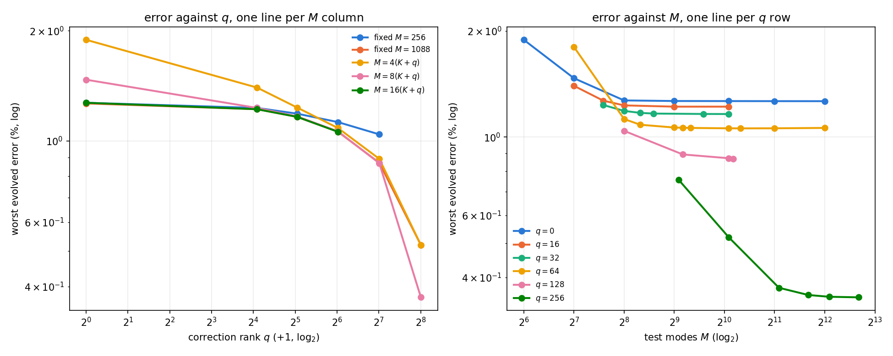
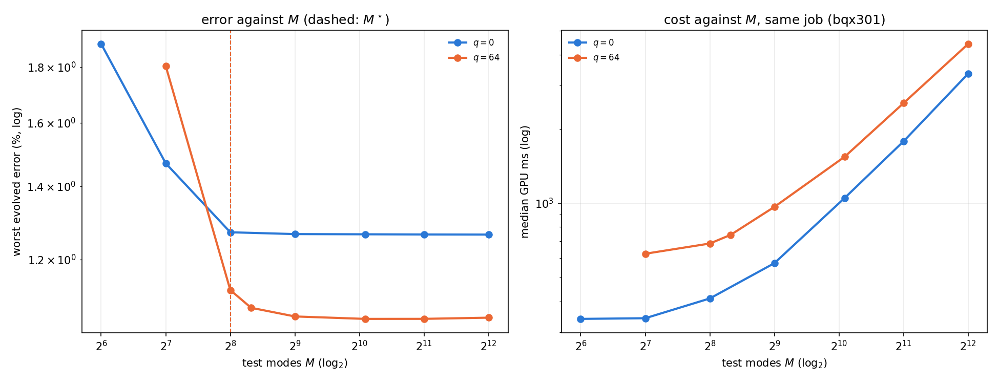

# b-qxm — the correction ladder's accuracy control: rank $q$, test count $M$, or both

**Status: final.** Numbers are development-cohort, single-seed, one frozen Burgers $256^2$ checkpoint (`18f0266ae6f0…`), six opened development cases, dense quadrature, the budget-600 block-damped variable-projection contract, three timed repetitions with burn-in. Every number below is generated from the audit JSONs by `reports/generate_xm.py`; the pre-registered design, gates and decision rules are in [`../DESIGN.md`](../DESIGN.md). **Costs are compared within one job only**; error comparisons across jobs rest on the anchor and fidelity tables at the end.

| job | attempt | job id | GPU | source commit | elapsed (s) | ROM arms | failed gates | audit SHA256 |
|---|---|---|---|---|---|---|---|---|
| G1 | bqx101 | 3780175 | NVIDIA A100 80GB PCIe | ed431edb498a | 2528.1 | 16 | none | 7bdb79a3ef0209fd… |
| G2 | bqx201 | 3780177 | NVIDIA A100-PCIE-40GB | ed431edb498a | 3715.1 | 15 | none | 59c2d9c2c0bfcce7… |
| S1 | bqx301 | 3780178 | NVIDIA A100-PCIE-40GB | ed431edb498a | 3217.5 | 14 | none | be5e22445a4a0979… |

## Verdict

**both factors matter; the pure-rank ladder at fixed M = 1088 spans 2.44x and the scheduled ladder's log-span is 69 % rank, 31 % test count (corner path).**

Headline for the paper by the §6 rules: **fixed-M ladder (M = 1088, pure rank), scheduled ladder reported beside it**. Fixed-$M=1088$ ladder monotone: yes; every rung converged: yes; $q$-span at fixed $M=1088$: 2.437x; at fixed $M=256$ (to $q=128$): 1.220x. Rank claim false: no. H(rank) false: yes ({'fixed_q_spans_ge_1p5_at_q_ge_64': [256], 'M_star_q64': 256}). H(tests) false: yes. Corner-path shares: rank 0.690, tests 0.310; rung-path test share 0.344; paths disagree by more than 0.15: no.

## T4 — the crossed grid, every cell

One row per $(q, M)$ cell, taken from its primary job (G1 for $q \le 32$, G2 for $q \ge 64$; the two $q=0$ anchors in G2 and every S1 cell that also exists in G1/G2 appear only in the anchor table). `column` names the schedule the cell belongs to; a cell can belong to several.

| $q$ | $M$ | column | job | job id | worst evolved % | worst all-times % | $t=0$ compression % | median GPU ms | converged | median iters | budget exits | worst joint gradient |
|---|---|---|---|---|---|---|---|---|---|---|---|---|
| 0 | 64 | 4x | G1 | 3780175 | 1.8890 | 2.5629 | 2.5629 | 290.6 | yes | 3.0 | 0 | 9.97e-07 |
| 0 | 128 | 8x | G1 | 3780175 | 1.4695 | 2.5629 | 2.5629 | 291.4 | yes | 3.0 | 0 | 9.97e-07 |
| 0 | 256 | 16x, fixed256 | G1 | 3780175 | 1.2710 | 2.5629 | 2.5629 | 349.5 | yes | 3.0 | 0 | 9.93e-07 |
| 0 | 512 | sat | S1 | 3780178 | 1.2662 | 2.5629 | 2.5629 | 571.2 | yes | 3.0 | 0 | 9.76e-07 |
| 0 | 1088 | fixed1088 | G1 | 3780175 | 1.2657 | 2.5629 | 2.5629 | 742.2 | yes | 3.0 | 0 | 9.67e-07 |
| 0 | 2048 | sat | S1 | 3780178 | 1.2652 | 2.5629 | 2.5629 | 1780.8 | yes | 3.0 | 0 | 9.70e-07 |
| 0 | 4096 | sat | S1 | 3780178 | 1.2649 | 2.5629 | 2.5629 | 3347.2 | yes | 3.0 | 0 | 9.52e-07 |
| 16 | 128 | 4x | G1 | 3780175 | 1.3985 | 2.4806 | 2.4806 | 367.0 | yes | 3.0 | 0 | 9.99e-07 |
| 16 | 192 | bridge | G1 | 3780175 | 1.2690 | 2.4806 | 2.4806 | 391.6 | yes | 3.0 | 0 | 9.95e-07 |
| 16 | 256 | 8x, fixed256 | G1 | 3780175 | 1.2305 | 2.4806 | 2.4806 | 432.3 | yes | 3.0 | 0 | 9.84e-07 |
| 16 | 512 | 16x | G1 | 3780175 | 1.2204 | 2.4806 | 2.4806 | 564.0 | yes | 3.0 | 0 | 9.80e-07 |
| 16 | 1088 | fixed1088 | G1 | 3780175 | 1.2204 | 2.4806 | 2.4806 | 868.6 | yes | 3.0 | 0 | 9.92e-07 |
| 32 | 192 | 4x | G1 | 3780175 | 1.2336 | 2.3534 | 2.3534 | 440.5 | yes | 3.0 | 0 | 9.83e-07 |
| 32 | 256 | fixed256 | G1 | 3780175 | 1.1869 | 2.3534 | 2.3534 | 490.0 | yes | 3.0 | 0 | 9.80e-07 |
| 32 | 320 | bridge | G1 | 3780175 | 1.1717 | 2.3534 | 2.3534 | 524.9 | yes | 3.0 | 0 | 9.79e-07 |
| 32 | 384 | 8x | G1 | 3780175 | 1.1665 | 2.3534 | 2.3534 | 551.3 | yes | 3.0 | 0 | 9.88e-07 |
| 32 | 768 | 16x | G1 | 3780175 | 1.1634 | 2.3534 | 2.3534 | 772.7 | yes | 3.0 | 0 | 9.96e-07 |
| 32 | 1088 | fixed1088 | G1 | 3780175 | 1.1629 | 2.3534 | 2.3534 | 958.2 | yes | 3.0 | 0 | 9.89e-07 |
| 64 | 128 | sat | S1 | 3780178 | 1.8032 | 2.1489 | 2.1489 | 623.7 | yes | 3.0 | 0 | 9.61e-07 |
| 64 | 256 | fixed256 | G2 | 3780177 | 1.1255 | 2.1489 | 2.1489 | 645.6 | yes | 3.0 | 0 | 9.92e-07 |
| 64 | 320 | 4x | G2 | 3780177 | 1.0843 | 2.1489 | 2.1489 | 703.4 | yes | 3.0 | 0 | 9.47e-07 |
| 64 | 512 | sat | S1 | 3780178 | 1.0647 | 2.1489 | 2.1489 | 965.9 | yes | 3.0 | 0 | 9.51e-07 |
| 64 | 576 | bridge | G2 | 3780177 | 1.0633 | 2.1489 | 2.1489 | 968.3 | yes | 3.0 | 0 | 9.97e-07 |
| 64 | 640 | 8x | G2 | 3780177 | 1.0619 | 2.1489 | 2.1489 | 1018.2 | yes | 3.0 | 0 | 9.95e-07 |
| 64 | 1088 | fixed1088 | G2 | 3780177 | 1.0593 | 2.1489 | 2.1489 | 1359.4 | yes | 3.0 | 0 | 9.92e-07 |
| 64 | 1280 | 16x | G2 | 3780177 | 1.0588 | 2.1489 | 2.1489 | 1487.1 | yes | 3.0 | 0 | 9.69e-07 |
| 64 | 2048 | sat | S1 | 3780178 | 1.0594 | 2.1489 | 2.1489 | 2542.9 | yes | 3.0 | 0 | 9.94e-07 |
| 64 | 4096 | sat | S1 | 3780178 | 1.0620 | 2.1489 | 2.1489 | 4418.7 | yes | 3.0 | 0 | 9.90e-07 |
| 128 | 256 | fixed256 | G2 | 3780177 | 1.0418 | 1.8116 | 1.8116 | 921.8 | yes | 3.0 | 0 | 9.60e-07 |
| 128 | 576 | 4x | G2 | 3780177 | 0.8930 | 1.8116 | 1.8116 | 1331.8 | yes | 3.0 | 0 | 9.93e-07 |
| 128 | 1088 | fixed1088, bridge | G2 | 3780177 | 0.8711 | 1.8116 | 1.8116 | 1886.5 | yes | 3.0 | 0 | 9.81e-07 |
| 128 | 1152 | 8x | G2 | 3780177 | 0.8689 | 1.8116 | 1.8116 | 1920.1 | yes | 3.0 | 0 | 9.95e-07 |
| 256 | 544 | 2x | G2 | 3780177 | 0.7566 | 0.9053 | 0.9053 | 3718.9 | yes | 5.0 | 0 | 9.71e-07 |
| 256 | 1088 | 4x, fixed1088 | G2 | 3780177 | 0.5194 | 0.9053 | 0.9053 | 4377.9 | yes | 5.0 | 0 | 9.99e-07 |
| 256 | 2176 | 8x | G2 | 3780177 | 0.3736 | 0.9053 | 0.9053 | 7012.6 | yes | 4.0 | 0 | 9.97e-07 |

### T4 pivot — worst evolved error (%), rows $q$, columns the $M$ schedule

| $q$ | fixed $M=256$ | fixed $M=1088$ | $M=2(K+q)$ | $M=4(K+q)$ | $M=8(K+q)$ | $M=16(K+q)$ | bridge |
|---|---|---|---|---|---|---|---|
| 0 | 1.2710 ($M=256$) | 1.2657 ($M=1088$) | — | 1.8890 ($M=64$) | 1.4695 ($M=128$) | 1.2710 ($M=256$) | — |
| 16 | 1.2305 ($M=256$) | 1.2204 ($M=1088$) | — | 1.3985 ($M=128$) | 1.2305 ($M=256$) | 1.2204 ($M=512$) | 1.2690 ($M=192$) |
| 32 | 1.1869 ($M=256$) | 1.1629 ($M=1088$) | — | 1.2336 ($M=192$) | 1.1665 ($M=384$) | 1.1634 ($M=768$) | 1.1717 ($M=320$) |
| 64 | 1.1255 ($M=256$) | 1.0593 ($M=1088$) | — | 1.0843 ($M=320$) | 1.0619 ($M=640$) | 1.0588 ($M=1280$) | 1.0633 ($M=576$) |
| 128 | 1.0418 ($M=256$) | 0.8711 ($M=1088$) | — | 0.8930 ($M=576$) | 0.8689 ($M=1152$) | — | 0.8711 ($M=1088$) |
| 256 | — | 0.5194 ($M=1088$) | 0.7566 ($M=544$) | 0.5194 ($M=1088$) | 0.3736 ($M=2176$) | — | — |

### T4 pivot — median GPU ms (job in brackets; never compare down a column across jobs)

| $q$ | fixed $M=256$ | fixed $M=1088$ | $M=2(K+q)$ | $M=4(K+q)$ | $M=8(K+q)$ | $M=16(K+q)$ | bridge |
|---|---|---|---|---|---|---|---|
| 0 | 349 [G1] | 742 [G1] | — | 291 [G1] | 291 [G1] | 349 [G1] | — |
| 16 | 432 [G1] | 869 [G1] | — | 367 [G1] | 432 [G1] | 564 [G1] | 392 [G1] |
| 32 | 490 [G1] | 958 [G1] | — | 440 [G1] | 551 [G1] | 773 [G1] | 525 [G1] |
| 64 | 646 [G2] | 1359 [G2] | — | 703 [G2] | 1018 [G2] | 1487 [G2] | 968 [G2] |
| 128 | 922 [G2] | 1886 [G2] | — | 1332 [G2] | 1920 [G2] | — | 1886 [G2] |
| 256 | — | 4378 [G2] | 3719 [G2] | 4378 [G2] | 7013 [G2] | — | — |

## The solver control

The inner linear solve switches from Gauss–Jordan to LU when $K + q > 64$, i.e. between the $q = 32$ and $q = 64$ rows — the same step at which the fixed-$M$ ladders cross from job G1 to G2. The control below runs the $(32, 1088)$ cell with LU in the same job as its Gauss–Jordan twin, so the solver switch is measured on its own.

| cell | primary solve | evolved % | GPU ms | control solve | evolved % | GPU ms | rel. diff evolved | cost ratio (same job) | job |
|---|---|---|---|---|---|---|---|---|---|
| (32, 1088) | gj | 1.1629 | 958.2 | lu | 1.1629 | 958.1 | 0.00e+00 | 1.000x | G1 |

## Spans — evolved metric

### The pure-rank ladder as an operating-point family, measured inside one job

The tunability bar this project has used since 15 September: error monotone in the setting, at least three non-dominated points, at least $2\times$ span in **both** error and cost, no early-stopped point. Cost may only be compared inside one job, so each fixed-$M$ column is reported over the longest run of its rungs that one job holds.

| $M$ | job | job id | rungs $q$ | worst evolved % | median GPU ms | error span | cost span | non-dominated points | monotone | passes the tunability bar |
|---|---|---|---|---|---|---|---|---|---|---|
| 256 | G2 | 3780177 | 0, 64, 128 | 1.2710 / 1.1255 / 1.0418 | 406 / 646 / 922 | 1.220x | 2.269x | 3 | yes | no |
| 1088 | G2 | 3780177 | 0, 64, 128, 256 | 1.2657 / 1.0593 / 0.8711 / 0.5194 | 848 / 1359 / 1886 / 4378 | 2.437x | 5.163x | 4 | yes | yes |

### At fixed $M$: the span in $q$ (the pure-rank effect)

| $M$ | rows $q$ | values % | monotone in $q$ | every rung converged | span (first/last) | span to $q=128$ |
|---|---|---|---|---|---|---|
| 256 | 0, 16, 32, 64, 128 | 1.2710 / 1.2305 / 1.1869 / 1.1255 / 1.0418 | yes | yes | 1.220x | 1.220x |
| 1088 | 0, 16, 32, 64, 128, 256 | 1.2657 / 1.2204 / 1.1629 / 1.0593 / 0.8711 / 0.5194 | yes | yes | 2.437x | 1.453x |

Other $M$ values that happen to hold two rows (one of them from the saturation job, some with fewer than two tests per unknown); informational, not a declared column: $M=128$: $q$ = 0, 16, 64, 1.4695 / 1.3985 / 1.8032 %; $M=192$: $q$ = 16, 32, 1.2690 / 1.2336 %; $M=320$: $q$ = 32, 64, 1.1717 / 1.0843 %; $M=512$: $q$ = 0, 16, 64, 1.2662 / 1.2204 / 1.0647 %; $M=576$: $q$ = 64, 128, 1.0633 / 0.8930 %; $M=2048$: $q$ = 0, 64, 1.2652 / 1.0594 %; $M=4096$: $q$ = 0, 64, 1.2649 / 1.0620 %.

### At fixed $q$: the span in $M$ (the test-count effect)

The last column restricts the span to $M \ge 2(K+q)$ (at least two tests per unknown); it is the quantity the H(rank) falsification clause reads, so a near-square cell cannot decide it.

| $q$ | columns $M$ | values % | monotone in $M$ | span (max/min) | best $M$ | span over $M \ge 2(K+q)$ |
|---|---|---|---|---|---|---|
| 0 | 64, 128, 256, 512, 1088, 2048, 4096 | 1.8890 / 1.4695 / 1.2710 / 1.2662 / 1.2657 / 1.2652 / 1.2649 | yes | 1.493x | 4096 | 1.493x |
| 16 | 128, 192, 256, 512, 1088 | 1.3985 / 1.2690 / 1.2305 / 1.2204 / 1.2204 | yes | 1.146x | 1088 | 1.146x |
| 32 | 192, 256, 320, 384, 768, 1088 | 1.2336 / 1.1869 / 1.1717 / 1.1665 / 1.1634 / 1.1629 | yes | 1.061x | 1088 | 1.061x |
| 64 | 128, 256, 320, 512, 576, 640, 1088, 1280, 2048, 4096 | 1.8032 / 1.1255 / 1.0843 / 1.0647 / 1.0633 / 1.0619 / 1.0593 / 1.0588 / 1.0594 / 1.0620 | no | 1.703x | 1280 | 1.063x |
| 128 | 256, 576, 1088, 1152 | 1.0418 / 0.8930 / 0.8711 / 0.8689 | yes | 1.199x | 1152 | 1.028x |
| 256 | 544, 1088, 2176 | 0.7566 / 0.5194 / 0.3736 | yes | 2.025x | 2176 | 2.025x |

### The scheduled ladders

| schedule | cells $(q, M)$ | values % | monotone | span |
|---|---|---|---|---|
| 4x | (0,64), (16,128), (32,192), (64,320), (128,576), (256,1088) | 1.8890 / 1.3985 / 1.2336 / 1.0843 / 0.8930 / 0.5194 | yes | 3.637x |
| 8x | (0,128), (16,256), (32,384), (64,640), (128,1152), (256,2176) | 1.4695 / 1.2305 / 1.1665 / 1.0619 / 0.8689 / 0.3736 | yes | 3.933x |

## Decomposition of the scheduled $4(K+q)$ ladder — evolved metric

**Corner path** (0,64) -> (0,1088) [M] -> (256,1088) [q]: $\log S = 1.2912$ ($S = 3.637$x) $= \Delta_M + \Delta_q = 0.4004 + 0.8907$; shares **test count 31.0 %**, **rank 69.0 %**.

**Rung path** (through the bridge cells): complete yes; totals $\Delta_M = 0.4441$, $\Delta_q = 0.8471$; shares test count **34.4 %**, rank **65.6 %**.

| rung | bridge cell | $\Delta_M$ (M first, at $q_k$) | $\Delta_q$ (then $q$, at $M_{k+1}$) | total | test-count share |
|---|---|---|---|---|---|
| (0,64) → (16,128) | (0,128) | 0.2511 | 0.0496 | 0.3007 | 0.835 |
| (16,128) → (32,192) | (16,192) | 0.0971 | 0.0283 | 0.1254 | 0.774 |
| (32,192) → (64,320) | (32,320) | 0.0515 | 0.0775 | 0.1290 | 0.399 |
| (64,320) → (128,576) | (64,576) | 0.0196 | 0.1745 | 0.1941 | 0.101 |
| (128,576) → (256,1088) | (128,1088) | 0.0248 | 0.5172 | 0.5419 | 0.046 |

**Variance shares** on the balanced sub-grid $q \in \{0, 16, 32, 64, 128\} \times M \in \{256, 1088\}$ (log error): rank main effect **85.1 %**, test-count main effect **6.1 %**, interaction 8.8 % of the total sum of squares. Interaction matrix (rows $q$, columns $M$): $q=0$: -0.0251, +0.0251; $q=16$: -0.0231, +0.0231; $q=32$: -0.0170, +0.0170; $q=64$: +0.0031, -0.0031; $q=128$: +0.0622, -0.0622.

## Spans — all-times metric

**Caveat.** The all-times metric is dominated by the $t = 0$ compression, which does not depend on $M$ (gate `t0_field_invariant_in_M`), so its $M$-spans and its $\Delta_M$ are near zero **by construction** wherever the compression exceeds the evolved error. It is reported for completeness; the evolved metric is the one that separates the factors.

### The pure-rank ladder as an operating-point family, measured inside one job

The tunability bar this project has used since 15 September: error monotone in the setting, at least three non-dominated points, at least $2\times$ span in **both** error and cost, no early-stopped point. Cost may only be compared inside one job, so each fixed-$M$ column is reported over the longest run of its rungs that one job holds.

| $M$ | job | job id | rungs $q$ | worst evolved % | median GPU ms | error span | cost span | non-dominated points | monotone | passes the tunability bar |
|---|---|---|---|---|---|---|---|---|---|---|
| 256 | G2 | 3780177 | 0, 64, 128 | 2.5629 / 2.1489 / 1.8116 | 406 / 646 / 922 | 1.415x | 2.269x | 3 | yes | no |
| 1088 | G2 | 3780177 | 0, 64, 128, 256 | 2.5629 / 2.1489 / 1.8116 / 0.9053 | 848 / 1359 / 1886 / 4378 | 2.831x | 5.163x | 4 | yes | yes |

### At fixed $M$: the span in $q$ (the pure-rank effect)

| $M$ | rows $q$ | values % | monotone in $q$ | every rung converged | span (first/last) | span to $q=128$ |
|---|---|---|---|---|---|---|
| 256 | 0, 16, 32, 64, 128 | 2.5629 / 2.4806 / 2.3534 / 2.1489 / 1.8116 | yes | yes | 1.415x | 1.415x |
| 1088 | 0, 16, 32, 64, 128, 256 | 2.5629 / 2.4806 / 2.3534 / 2.1489 / 1.8116 / 0.9053 | yes | yes | 2.831x | 1.415x |

Other $M$ values that happen to hold two rows (one of them from the saturation job, some with fewer than two tests per unknown); informational, not a declared column: $M=128$: $q$ = 0, 16, 64, 2.5629 / 2.4806 / 2.1489 %; $M=192$: $q$ = 16, 32, 2.4806 / 2.3534 %; $M=320$: $q$ = 32, 64, 2.3534 / 2.1489 %; $M=512$: $q$ = 0, 16, 64, 2.5629 / 2.4806 / 2.1489 %; $M=576$: $q$ = 64, 128, 2.1489 / 1.8116 %; $M=2048$: $q$ = 0, 64, 2.5629 / 2.1489 %; $M=4096$: $q$ = 0, 64, 2.5629 / 2.1489 %.

### At fixed $q$: the span in $M$ (the test-count effect)

The last column restricts the span to $M \ge 2(K+q)$ (at least two tests per unknown); it is the quantity the H(rank) falsification clause reads, so a near-square cell cannot decide it.

| $q$ | columns $M$ | values % | monotone in $M$ | span (max/min) | best $M$ | span over $M \ge 2(K+q)$ |
|---|---|---|---|---|---|---|
| 0 | 64, 128, 256, 512, 1088, 2048, 4096 | 2.5629 / 2.5629 / 2.5629 / 2.5629 / 2.5629 / 2.5629 / 2.5629 | yes | 1.000x | 64 | 1.000x |
| 16 | 128, 192, 256, 512, 1088 | 2.4806 / 2.4806 / 2.4806 / 2.4806 / 2.4806 | yes | 1.000x | 128 | 1.000x |
| 32 | 192, 256, 320, 384, 768, 1088 | 2.3534 / 2.3534 / 2.3534 / 2.3534 / 2.3534 / 2.3534 | yes | 1.000x | 192 | 1.000x |
| 64 | 128, 256, 320, 512, 576, 640, 1088, 1280, 2048, 4096 | 2.1489 / 2.1489 / 2.1489 / 2.1489 / 2.1489 / 2.1489 / 2.1489 / 2.1489 / 2.1489 / 2.1489 | no | 1.000x | 128 | 1.000x |
| 128 | 256, 576, 1088, 1152 | 1.8116 / 1.8116 / 1.8116 / 1.8116 | yes | 1.000x | 256 | 1.000x |
| 256 | 544, 1088, 2176 | 0.9053 / 0.9053 / 0.9053 | yes | 1.000x | 544 | 1.000x |

### The scheduled ladders

| schedule | cells $(q, M)$ | values % | monotone | span |
|---|---|---|---|---|
| 4x | (0,64), (16,128), (32,192), (64,320), (128,576), (256,1088) | 2.5629 / 2.4806 / 2.3534 / 2.1489 / 1.8116 / 0.9053 | yes | 2.831x |
| 8x | (0,128), (16,256), (32,384), (64,640), (128,1152), (256,2176) | 2.5629 / 2.4806 / 2.3534 / 2.1489 / 1.8116 / 0.9053 | yes | 2.831x |

## Decomposition of the scheduled $4(K+q)$ ladder — all-times metric

**Corner path** (0,64) -> (0,1088) [M] -> (256,1088) [q]: $\log S = 1.0406$ ($S = 2.831$x) $= \Delta_M + \Delta_q = 0.0000 + 1.0406$; shares **test count 0.0 %**, **rank 100.0 %**.

**Rung path** (through the bridge cells): complete yes; totals $\Delta_M = 0.0000$, $\Delta_q = 1.0406$; shares test count **0.0 %**, rank **100.0 %**.

| rung | bridge cell | $\Delta_M$ (M first, at $q_k$) | $\Delta_q$ (then $q$, at $M_{k+1}$) | total | test-count share |
|---|---|---|---|---|---|
| (0,64) → (16,128) | (0,128) | 0.0000 | 0.0326 | 0.0326 | 0.000 |
| (16,128) → (32,192) | (16,192) | 0.0000 | 0.0526 | 0.0526 | 0.000 |
| (32,192) → (64,320) | (32,320) | 0.0000 | 0.0909 | 0.0909 | 0.000 |
| (64,320) → (128,576) | (64,576) | 0.0000 | 0.1707 | 0.1707 | 0.000 |
| (128,576) → (256,1088) | (128,1088) | 0.0000 | 0.6937 | 0.6937 | 0.000 |

**Variance shares** on the balanced sub-grid $q \in \{0, 16, 32, 64, 128\} \times M \in \{256, 1088\}$ (log error): rank main effect **100.0 %**, test-count main effect **0.0 %**, interaction 0.0 % of the total sum of squares. Interaction matrix (rows $q$, columns $M$): $q=0$: +0.0000, +0.0000; $q=16$: +0.0000, +0.0000; $q=32$: +0.0000, +0.0000; $q=64$: +0.0000, +0.0000; $q=128$: +0.0000, +0.0000.

## Saturation in $M$ (job S1)

Job `bqx301` (3780178, NVIDIA A100-PCIE-40GB). $M^\star$ is the smallest $M$ whose next step improves the worst evolved error by less than 5 %. Cost ratios are within this job, against the row's own $M = 4(K+q)$ cell; the cost-neutral sentence is written only if that ratio is $\le 1.1$.

### $q = 0$ — $M^\star = 256$ (16.0 tests per unknown), error there 1.2710 %, cost 1.210x the $M=64$ cell; cost-neutral claim: no; monotone in $M$: yes [S1 3780178]

| $M$ | worst evolved % | worst all-times % | median GPU ms | cost vs $4(K+q)$ | median iters | converged | improvement to next $M$ |
|---|---|---|---|---|---|---|---|
| 64 | 1.8890 | 2.5629 | 339.6 | 1.000x | 3.0 | yes | 22.2 % (to 128) |
| 128 | 1.4695 | 2.5629 | 341.7 | 1.006x | 3.0 | yes | 13.5 % (to 256) |
| 256 | 1.2710 | 2.5629 | 410.9 | 1.210x | 3.0 | yes | 0.4 % (to 512) |
| 512 | 1.2662 | 2.5629 | 571.2 | 1.682x | 3.0 | yes | 0.0 % (to 1088) |
| 1088 | 1.2657 | 2.5629 | 1049.3 | 3.090x | 3.0 | yes | 0.0 % (to 2048) |
| 2048 | 1.2652 | 2.5629 | 1780.8 | 5.244x | 3.0 | yes | 0.0 % (to 4096) |
| 4096 | 1.2649 | 2.5629 | 3347.2 | 9.857x | 3.0 | yes | — |

### $q = 64$ — $M^\star = 256$ (3.2 tests per unknown), error there 1.1255 %, cost 0.922x the $M=320$ cell; cost-neutral claim: yes; monotone in $M$: no [S1 3780178]

| $M$ | worst evolved % | worst all-times % | median GPU ms | cost vs $4(K+q)$ | median iters | converged | improvement to next $M$ |
|---|---|---|---|---|---|---|---|
| 128 | 1.8032 | 2.1489 | 623.7 | 0.838x | 3.0 | yes | 37.6 % (to 256) |
| 256 | 1.1255 | 2.1489 | 686.2 | 0.922x | 3.0 | yes | 3.7 % (to 320) |
| 320 | 1.0843 | 2.1489 | 743.8 | 1.000x | 3.0 | yes | 1.8 % (to 512) |
| 512 | 1.0647 | 2.1489 | 965.9 | 1.298x | 3.0 | yes | 0.5 % (to 1088) |
| 1088 | 1.0593 | 2.1489 | 1541.8 | 2.073x | 3.0 | yes | -0.0 % (to 2048) |
| 2048 | 1.0594 | 2.1489 | 2542.9 | 3.419x | 3.0 | yes | -0.2 % (to 4096) |
| 4096 | 1.0620 | 2.1489 | 4418.7 | 5.940x | 3.0 | yes | — |

## Cells that appear in more than one job (anchors)

Errors must agree to the declared tolerance ($10^{-9}$ at $q=0$; two-tier at $q>0$). Both costs are printed and **no ratio is formed between them**: different jobs, possibly different GPUs.

| $q$ | $M$ | job A | job B | rel. diff evolved | rel. diff all-times | tolerance | passed | A median ms | B median ms |
|---|---|---|---|---|---|---|---|---|---|
| 0 | 64 | bqx101 (3780175) | bqx301 (3780178) | 6.34e-13 | 0.00e+00 | 1e-09 | yes | 290.6 | 339.6 |
| 0 | 128 | bqx101 (3780175) | bqx301 (3780178) | 3.40e-13 | 0.00e+00 | 1e-09 | yes | 291.4 | 341.7 |
| 0 | 256 | bqx101 (3780175) | bqx201 (3780177) | 5.42e-14 | 0.00e+00 | 1e-09 | yes | 349.5 | 406.2 |
| 0 | 256 | bqx101 (3780175) | bqx301 (3780178) | 9.08e-14 | 0.00e+00 | 1e-09 | yes | 349.5 | 410.9 |
| 0 | 1088 | bqx101 (3780175) | bqx201 (3780177) | 1.23e-14 | 0.00e+00 | 1e-09 | yes | 742.2 | 848.0 |
| 0 | 1088 | bqx101 (3780175) | bqx301 (3780178) | 1.27e-13 | 0.00e+00 | 1e-09 | yes | 742.2 | 1049.3 |
| 64 | 256 | bqx201 (3780177) | bqx301 (3780178) | 1.44e-09 | 1.22e-09 | 1e-03 | yes | 645.6 | 686.2 |
| 64 | 320 | bqx201 (3780177) | bqx301 (3780178) | 6.07e-10 | 1.22e-09 | 1e-03 | yes | 703.4 | 743.8 |
| 64 | 1088 | bqx201 (3780177) | bqx301 (3780178) | 7.09e-12 | 1.22e-09 | 1e-03 | yes | 1359.4 | 1541.8 |

## Same-job full-order controls

### G1 (bqx101, 3780175, NVIDIA A100 80GB PCIe)

| control | worst all-times % | worst evolved % | median GPU ms | repetitions |
|---|---|---|---|---|
| `nt1e-2_dt01` | 3.1999 | 3.1999 | 8.862 | 18 |
| `fft_tight` | 0.0000 | 0.0000 | 90.351 | 18 |
| `fft_loose` | 0.0338 | 0.0338 | 36.646 | 18 |

### G2 (bqx201, 3780177, NVIDIA A100-PCIE-40GB)

| control | worst all-times % | worst evolved % | median GPU ms | repetitions |
|---|---|---|---|---|
| `nt1e-2_dt01` | 3.1999 | 3.1999 | 9.527 | 18 |
| `fft_tight` | 0.0000 | 0.0000 | 89.545 | 18 |
| `fft_loose` | 0.0338 | 0.0338 | 37.382 | 18 |

### S1 (bqx301, 3780178, NVIDIA A100-PCIE-40GB)

| control | worst all-times % | worst evolved % | median GPU ms | repetitions |
|---|---|---|---|---|
| `fft_loose` | 0.0338 | 0.0338 | 38.990 | 18 |
| `fft_tight` | 0.0000 | 0.0000 | 93.380 | 18 |
| `nt1e-2_dt01` | 3.1999 | 3.1999 | 9.575 | 18 |

## Gates and cross-job fidelity

### G1 (bqx101)

| gate | passed | kind |
|---|---|---|
| `artifacts_present` | yes | blocking |
| `at_least_two_unconditional_reproductions_at_1e-9` | yes | blocking |
| `backend_gpu` | yes | blocking |
| `bank_frozen` | yes | blocking |
| `checkpoint_unchanged` | yes | blocking |
| `complete` | yes | blocking |
| `cross_job_fidelity` | yes | blocking |
| `dense_quadrature_everywhere` | yes | blocking |
| `directions_hash_matches_btq101` | no | informational |
| `directions_hash_matches_btq102` | no | informational |
| `directions_hash_matches_btq201` | no | informational |
| `directions_hash_matches_cclad01` | no | informational |
| `directions_hash_matches_qrg201` | no | informational |
| `directions_hash_matches_qtd02` | no | informational |
| `directions_rank_covers_ladder` | yes | blocking |
| `evaluation_cohort_bitwise_abl01` | yes | blocking |
| `every_declared_cell_timed` | yes | blocking |
| `every_invocation_paired` | yes | blocking |
| `every_rom_carries_exit_and_stationarity` | yes | blocking |
| `every_subject_case_has_all_reps` | yes | blocking |
| `final_cohort_unopened` | yes | blocking |
| `operators_shared_bitwise` | yes | blocking |
| `overdetermined_weak_system` | yes | blocking |
| `precision_highest` | yes | blocking |
| `recorded_errors_recomputed_from_saved_fields` | yes | blocking |
| `reference_fields_bitwise_match_btq101` | no | informational |
| `reference_fields_bitwise_match_btq102` | yes | informational |
| `reference_fields_bitwise_match_btq201` | no | informational |
| `reference_fields_bitwise_match_cclad01` | no | informational |
| `reference_residuals` | yes | blocking |
| `repetition_output_identical` | yes | blocking |
| `same_grid_baseline_present` | yes | blocking |
| `step_budget_600` | yes | blocking |
| `t0_field_bitwise_in_M` | yes | informational |
| `t0_field_invariant_in_M` | yes | blocking |
| `t0_field_invariant_in_M_1e-12` | yes | informational |
| `x64` | yes | blocking |

| arm | source job | comparator arm | unconditional | directions bitwise | declared tolerance | achieved worst rel. diff | passed |
|---|---|---|---|---|---|---|---|
| `q0_M128_dense` | qrg201 (3757237) | `q0_m8_dense_l0` | yes | no | 1e-09 | 3.42e-13 | yes |
| `q0_M256_dense` | cclad01 (3734098) | `q0_m256_dense_block` | yes | no | 1e-09 | 1.48e-14 | yes |
| `q0_M256_dense` | qrg201 (3757237) | `q0_m16_dense_l0` | yes | no | 1e-09 | 5.44e-13 | yes |
| `q0_M256_dense` | qtd02 (3757505) | `q0_M256_dense` | yes | no | 1e-09 | 7.58e-13 | yes |
| `q0_M64_dense` | btq101 (3745589) | `q0_m4_dense_base` | yes | no | 1e-09 | 5.31e-13 | yes |
| `q0_M64_dense` | cclad01 (3734098) | `q0_m4_dense_block` | yes | no | 1e-09 | 6.95e-13 | yes |
| `q0_M64_dense` | qrg201 (3757237) | `q0_m4_dense_l0` | yes | no | 1e-09 | 4.62e-13 | yes |
| `q0_M64_dense` | qtd02 (3757505) | `q0_M64_dense` | yes | no | 1e-09 | 6.78e-13 | yes |
| `q16_M128_dense` | cclad01 (3734098) | `q16_m4_dense_block` | no | no | 1e-03 | 1.09e-10 | yes |
| `q16_M128_dense` | qrg201 (3757237) | `q16_m4_dense_l0` | no | no | 1e-03 | 1.09e-10 | yes |
| `q16_M128_dense` | qtd02 (3757505) | `old_q16_M128_dense` | no | no | 1e-03 | 2.60e-10 | yes |
| `q16_M256_dense` | cclad01 (3734098) | `q16_m256_dense_block` | no | no | 1e-03 | 5.16e-11 | yes |
| `q16_M256_dense` | qrg201 (3757237) | `q16_m8_dense_l0` | no | no | 1e-03 | 5.16e-11 | yes |
| `q16_M256_dense` | qtd02 (3757505) | `old_q16_M256_dense` | no | no | 1e-03 | 1.07e-10 | yes |
| `q16_M512_dense` | qrg201 (3757237) | `q16_m16_dense_l0` | no | no | 1e-03 | 5.16e-11 | yes |
| `q32_M192_dense` | cclad01 (3734098) | `q32_m4_dense_block` | no | no | 1e-03 | 2.64e-11 | yes |
| `q32_M192_dense` | qtd02 (3757505) | `old_q32_M192_dense` | no | no | 1e-03 | 9.81e-11 | yes |
| `q32_M256_dense` | cclad01 (3734098) | `q32_m256_dense_block` | no | no | 1e-03 | 4.96e-11 | yes |
| `q32_M256_dense` | qtd02 (3757505) | `old_q32_M256_dense` | no | no | 1e-03 | 4.74e-11 | yes |

### G2 (bqx201)

| gate | passed | kind |
|---|---|---|
| `artifacts_present` | yes | blocking |
| `at_least_two_unconditional_reproductions_at_1e-9` | yes | blocking |
| `backend_gpu` | yes | blocking |
| `bank_frozen` | yes | blocking |
| `checkpoint_unchanged` | yes | blocking |
| `complete` | yes | blocking |
| `cross_job_fidelity` | yes | blocking |
| `dense_quadrature_everywhere` | yes | blocking |
| `directions_hash_matches_btq101` | no | informational |
| `directions_hash_matches_btq102` | no | informational |
| `directions_hash_matches_btq201` | no | informational |
| `directions_hash_matches_cclad01` | no | informational |
| `directions_hash_matches_qrg201` | no | informational |
| `directions_hash_matches_qtd02` | no | informational |
| `directions_rank_covers_ladder` | yes | blocking |
| `evaluation_cohort_bitwise_abl01` | yes | blocking |
| `every_declared_cell_timed` | yes | blocking |
| `every_invocation_paired` | yes | blocking |
| `every_rom_carries_exit_and_stationarity` | yes | blocking |
| `every_subject_case_has_all_reps` | yes | blocking |
| `final_cohort_unopened` | yes | blocking |
| `operators_shared_bitwise` | yes | blocking |
| `overdetermined_weak_system` | yes | blocking |
| `precision_highest` | yes | blocking |
| `recorded_errors_recomputed_from_saved_fields` | yes | blocking |
| `reference_fields_bitwise_match_btq101` | no | informational |
| `reference_fields_bitwise_match_btq102` | no | informational |
| `reference_fields_bitwise_match_btq201` | yes | informational |
| `reference_fields_bitwise_match_cclad01` | no | informational |
| `reference_residuals` | yes | blocking |
| `repetition_output_identical` | yes | blocking |
| `same_grid_baseline_present` | yes | blocking |
| `step_budget_600` | yes | blocking |
| `t0_field_bitwise_in_M` | yes | informational |
| `t0_field_invariant_in_M` | yes | blocking |
| `t0_field_invariant_in_M_1e-12` | yes | informational |
| `x64` | yes | blocking |

| arm | source job | comparator arm | unconditional | directions bitwise | declared tolerance | achieved worst rel. diff | passed |
|---|---|---|---|---|---|---|---|
| `q0_M256_dense` | cclad01 (3734098) | `q0_m256_dense_block` | yes | no | 1e-09 | 1.64e-13 | yes |
| `q0_M256_dense` | qrg201 (3757237) | `q0_m16_dense_l0` | yes | no | 1e-09 | 7.14e-13 | yes |
| `q0_M256_dense` | qtd02 (3757505) | `q0_M256_dense` | yes | no | 1e-09 | 9.28e-13 | yes |
| `q128_M256_dense` | cclad01 (3734098) | `q128_m256_dense_block` | no | no | 1e-03 | 6.66e-10 | yes |
| `q128_M256_dense` | qtd02 (3757505) | `old_q128_M256_dense` | no | no | 1e-03 | 6.44e-09 | yes |
| `q128_M576_dense` | cclad01 (3734098) | `q128_m4_dense_block` | no | no | 1e-03 | 2.95e-09 | yes |
| `q128_M576_dense` | qtd02 (3757505) | `old_q128_M576_dense` | no | no | 1e-03 | 3.96e-09 | yes |
| `q256_M1088_dense` | cclad01 (3734098) | `q256_m4_dense_block` | no | no | 1e-03 | 3.02e-09 | yes |
| `q256_M1088_dense` | qtd02 (3757505) | `old_q256_M1088_dense` | no | no | 1e-03 | 9.16e-09 | yes |
| `q256_M544_dense` | btq102 (3749039) | `q256_m2_dense_base_b600` | no | no | 1e-03 | 5.88e-09 | yes |
| `q64_M1280_dense` | qrg201 (3757237) | `q64_m16_dense_l0` | no | no | 1e-03 | 1.20e-09 | yes |
| `q64_M256_dense` | cclad01 (3734098) | `q64_m256_dense_block` | no | no | 1e-03 | 1.46e-09 | yes |
| `q64_M256_dense` | qtd02 (3757505) | `old_q64_M256_dense` | no | no | 1e-03 | 2.27e-09 | yes |
| `q64_M320_dense` | cclad01 (3734098) | `q64_m4_dense_block` | no | no | 1e-03 | 1.20e-09 | yes |
| `q64_M320_dense` | qrg201 (3757237) | `q64_m4_dense_l0` | no | no | 1e-03 | 1.20e-09 | yes |
| `q64_M320_dense` | qtd02 (3757505) | `old_q64_M320_dense` | no | no | 1e-03 | 2.27e-09 | yes |
| `q64_M640_dense` | qrg201 (3757237) | `q64_m8_dense_l0` | no | no | 1e-03 | 1.20e-09 | yes |

### S1 (bqx301)

| gate | passed | kind |
|---|---|---|
| `artifacts_present` | yes | blocking |
| `at_least_two_unconditional_reproductions_at_1e-9` | yes | blocking |
| `backend_gpu` | yes | blocking |
| `bank_frozen` | yes | blocking |
| `checkpoint_unchanged` | yes | blocking |
| `complete` | yes | blocking |
| `cross_job_fidelity` | yes | blocking |
| `dense_quadrature_everywhere` | yes | blocking |
| `directions_hash_matches_btq101` | no | informational |
| `directions_hash_matches_btq102` | no | informational |
| `directions_hash_matches_btq201` | no | informational |
| `directions_hash_matches_cclad01` | no | informational |
| `directions_hash_matches_qrg201` | no | informational |
| `directions_hash_matches_qtd02` | no | informational |
| `directions_rank_covers_ladder` | yes | blocking |
| `evaluation_cohort_bitwise_abl01` | yes | blocking |
| `every_declared_cell_timed` | yes | blocking |
| `every_invocation_paired` | yes | blocking |
| `every_rom_carries_exit_and_stationarity` | yes | blocking |
| `every_subject_case_has_all_reps` | yes | blocking |
| `final_cohort_unopened` | yes | blocking |
| `operators_shared_bitwise` | yes | blocking |
| `overdetermined_weak_system` | yes | blocking |
| `precision_highest` | yes | blocking |
| `recorded_errors_recomputed_from_saved_fields` | yes | blocking |
| `reference_fields_bitwise_match_btq101` | no | informational |
| `reference_fields_bitwise_match_btq102` | no | informational |
| `reference_fields_bitwise_match_btq201` | yes | informational |
| `reference_fields_bitwise_match_cclad01` | no | informational |
| `reference_residuals` | yes | blocking |
| `repetition_output_identical` | yes | blocking |
| `same_grid_baseline_present` | yes | blocking |
| `step_budget_600` | yes | blocking |
| `t0_field_bitwise_in_M` | yes | informational |
| `t0_field_invariant_in_M` | yes | blocking |
| `t0_field_invariant_in_M_1e-12` | yes | informational |
| `x64` | yes | blocking |

| arm | source job | comparator arm | unconditional | directions bitwise | declared tolerance | achieved worst rel. diff | passed |
|---|---|---|---|---|---|---|---|
| `q0_M128_dense` | qrg201 (3757237) | `q0_m8_dense_l0` | yes | no | 1e-09 | 2.06e-14 | yes |
| `q0_M256_dense` | cclad01 (3734098) | `q0_m256_dense_block` | yes | no | 1e-09 | 5.35e-13 | yes |
| `q0_M256_dense` | qrg201 (3757237) | `q0_m16_dense_l0` | yes | no | 1e-09 | 1.49e-14 | yes |
| `q0_M256_dense` | qtd02 (3757505) | `q0_M256_dense` | yes | no | 1e-09 | 2.29e-13 | yes |
| `q0_M64_dense` | btq101 (3745589) | `q0_m4_dense_base` | yes | no | 1e-09 | 5.22e-13 | yes |
| `q0_M64_dense` | cclad01 (3734098) | `q0_m4_dense_block` | yes | no | 1e-09 | 3.26e-13 | yes |
| `q0_M64_dense` | qrg201 (3757237) | `q0_m4_dense_l0` | yes | no | 1e-09 | 2.80e-13 | yes |
| `q0_M64_dense` | qtd02 (3757505) | `q0_M64_dense` | yes | no | 1e-09 | 1.25e-13 | yes |
| `q64_M256_dense` | cclad01 (3734098) | `q64_m256_dense_block` | no | no | 1e-03 | 2.07e-11 | yes |
| `q64_M256_dense` | qtd02 (3757505) | `old_q64_M256_dense` | no | no | 1e-03 | 1.05e-09 | yes |
| `q64_M320_dense` | cclad01 (3734098) | `q64_m4_dense_block` | no | no | 1e-03 | 1.94e-11 | yes |
| `q64_M320_dense` | qrg201 (3757237) | `q64_m4_dense_l0` | no | no | 1e-03 | 1.94e-11 | yes |
| `q64_M320_dense` | qtd02 (3757505) | `old_q64_M320_dense` | no | no | 1e-03 | 1.05e-09 | yes |

## Figures

## Glossary

- **$q$, rank, rung** — the number of extra correction directions added to the frozen neural head; the solved state is $u = G(h_\theta(z) + C_q y)$ with $z \in \mathbb{R}^{16}$ the latent code and $y \in \mathbb{R}^q$ the corrections. One value of $q$ is a rung.
- **$M$, test count, test modes** — the number of weak test equations the per-step solve is graded on: the first $M$ sine modes of the square in ascending discrete-Laplacian order. The incumbent schedule is $M = 4(K+q)$, four tests per unknown.
- **$K$** — the latent dimension, 16. The solve has $K + q$ unknowns, so every cell needs $M > K + q$.
- **column / schedule** — a rule for $M$ across rows: fixed ($M = 256$ or $1088$ whatever $q$ is) or scheduled ($M = c\,(K+q)$). The `bridge` cells are the $(q_k, M_{k+1})$ cells that make the rung-by-rung decomposition exact.
- **fixed-$M$ ladder, pure-rank ladder** — the rungs $q = 0, 16, \ldots$ at one fixed $M$: only the rank moves. At $M = 1088$ it holds every rung to $q = 256$.
- **scheduled ladder** — the rungs with $M = 4(K+q)$: rank and test count move together. This is the ladder earlier lanes quoted.
- **span** — the ratio of the largest to the smallest error along a ladder (first over last for a ladder ordered by $q$). Both spans here are on the same metric.
- **corner path / rung path** — two exact ways of splitting the scheduled ladder's log-span into a test-count part $\Delta_M$ and a rank part $\Delta_q$: the corner path moves $M$ first at $q = 0$ then $q$ at $M = 1088$; the rung path does the same split rung by rung through the bridge cells.
- **share** — $\Delta_M / \log S$ or $\Delta_q / \log S$: the fraction of the ladder's log-span that one factor accounts for on that path.
- **variance shares** — on the balanced $5 \times 2$ sub-grid, the fraction of the total sum of squares of the log error carried by the $q$ main effect, the $M$ main effect and their interaction. A small interaction means "additive" is fair.
- **$M^\star$, saturation** — the smallest $M$ beyond which the next step in the sweep improves the error by less than 5 %.
- **worst evolved-times error** — the largest relative error over output times $t > 0$ and over the six cases, against the same-job converged full-order solve on the same grid: the trajectory error proper.
- **worst all-times error** — the same with $t = 0$ included, where the error is the decoder's compression of the supplied initial field.
- **$t = 0$ compression** — the relative error at $t = 0$: how well the reduced model represents the field it was handed. It uses only the cold Gauss space and $C_q$, never the test modes, so it does not depend on $M$ (a gate).
- **same-grid metric** — error against `fft_tight`, the same job's own converged full-order Newton solve on the 256-interval grid, so discretisation error cancels.
- **median GPU ms** — the median over three timed repetitions and six cases of the complete query time on the GPU (supplied initial field in, six output fields out), after a burn-in and with a device sync. Comparable only inside one job.
- **converged** — every one of the 900 solved steps exited on a convergence criterion (no step hit its 600-iteration budget), the initial fit converged, and the worst normalised joint gradient is at or inside $10^{-6}$.
- **median iterations** — the median number of Levenberg–Marquardt iterations per time step over all steps, cases and repetitions.
- **budget exit** — a time step that stopped because it hit the iteration budget rather than a convergence criterion; any budget exit disqualifies a cell from the spans.
- **anchor** — a cell run in more than one job so the jobs can be checked against each other on error; costs are printed side by side and never divided.
- **cross-job fidelity** — a named cell reproducing a named arm of an earlier audited job to a declared tolerance; unconditional at $10^{-9}$ for $q = 0$ (no directions involved), two-tier for $q > 0$ because the direction matrix is GPU-model dependent.
- **fft_tight / fft_loose / nt1e-2_dt01** — same-job full-order Newton solves at three tolerance/time-step settings. `fft_tight` is the reference, so its own error is zero by construction.
- **development cohort** — the six cases every lane since head-ablation has used for diagnosis; no sealed case is opened here.

