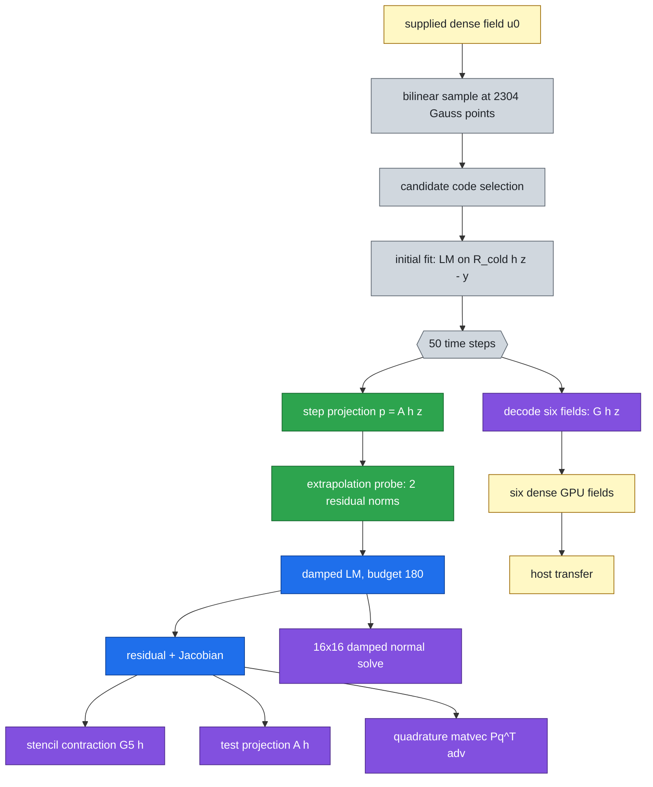

# Making the frozen Burgers query faster at parity: the profile, the port, and what it bought

Where the 2026-09-14 head ablation's `a_neural_eq` query spends its time, and how much of that a kernel-level port of the 2026-08-28 1D optimisations removes without changing what is computed. Numbers **final** for the meshes and arms listed; every table is generated from the job JSONs and the independent NumPy audits by the generator beside this file, and every arm carries its own parity verdict.

## The answer, up front

| attempt | intervals | fastest parity arm | incumbent GPU ms | arm GPU ms | GPU speedup | speedup incl. host transfer | parity | pre-registered 2x target |
|---|---:|---|---:|---:|---:|---:|---:|:---:|
| spd01 | 256 | `L4` | 46.856 | 30.824 | 1.520x | 1.478x | 2.565e-13 | FAIL |
| fine01 | 512 | `L4` | 46.928 | 31.106 | 1.509x | 1.454x | 5.053e-13 | FAIL |
| fine01 | 1024 | `L4` | 49.283 | 33.544 | 1.469x | 1.310x | 6.951e-13 | FAIL |
| comp01 | 256 | `C1` | 46.627 | 30.723 | 1.518x | 1.482x | 2.562e-13 | FAIL |
| comp01 | 1024 | `C1` | 49.804 | 33.282 | 1.496x | 1.408x | 7.129e-13 | FAIL |

The speedup column is the incumbent's median single-query GPU latency divided by the arm's, both measured in the same job on the same GPU with every arm interleaved in a randomized order. Parity is the worst relative field deviation from the incumbent over every case, against a bar of 1e-12, with the per-step iteration counts and exit reasons identical as integers.

## The query

`fused` = one `jax.linearize` pass replaces two primals and a `lax.cond` (`fuse`);
`hoisted` = the $\nu$-dependent constants leave the loop and one evaluation serves both the
step projection and the probe (`hoist`, `share`); `folded` = the head's output layer is
pre-multiplied into the frozen operators and the small solve eliminates four unknowns per
stage (`lean`, `block4`, `leandec`); `unchanged` = same program, same arithmetic.

## S0 — the profile

*From attempt `spd01`, job `3745655` on `NVIDIA A100 80GB PCIe`.*

### The incumbent query at 256 intervals, component by component

| component | median ms | % of whole query | repetitions |
|---|---:|---:|---:|
| `whole_query` | 60.563 | 100.0 | 7 |
| `initial_fit` | 16.030 | 26.5 | 7 |
| `evolution` | 44.016 | 72.7 | 7 |
| `decode_six_fields` | 0.364 | 0.6 | 7 |
| `host_transfer` | 0.050 | 0.1 | 7 |

Each phase is its own completed device computation, separately compiled; none is obtained by subtracting another and their sum is not the whole query.

**The `host_transfer` row is withdrawn as a measurement** and is shown only for the record: it times `np.asarray` on the same array repeatedly, and a JAX array caches its numpy value after the first conversion, so every repetition after the first measures a cache hit. What the transfers actually cost is the `transfer ms` column of the ladder tables below, which comes from the nested GPU and host timers of each timed invocation.

### Per-iteration marginal cost

| LM iterations per step (unconditional) | median evolution ms |
|---|---:|
| 1 | 9.313 |
| 2 | 16.793 |
| 4 | 23.907 |
| 8 | 59.265 |

Least squares over those budgets gives **17.2 µs fixed per time step + 141.1 µs per LM iteration** (R² = 0.9755), over 50 steps. Unconditional fixed-budget lm; capping iterations changes the answer and this is never a production arm.

### In-loop component cost

Each row is a `fori_loop` whose body is only that component, timed at two iteration counts; the reported figure is the slope, so the fixed launch cost of the surrounding program is removed. Every operator the body reads is a jit argument, never a captured constant.

| in-loop body | µs / iteration | T | ms at T | ms at 2T |
|---|---:|---:|---:|---:|
| `loop_control_scalar` | 4.50 | 3000 | 14.162 | 27.674 |
| `elementwise_chain_1` | 5.02 | 3000 | 16.576 | 31.630 |
| `elementwise_chain_4` | 5.78 | 3000 | 18.140 | 35.492 |
| `elementwise_chain_16` | 7.95 | 3000 | 24.659 | 48.521 |
| `head_h_of_z` | 15.72 | 400 | 6.162 | 12.449 |
| `kernel_G5h_and_Ah` | 18.25 | 400 | 8.133 | 15.435 |
| `residual` | 24.80 | 400 | 11.248 | 21.170 |
| `residual_and_jacfwd` | 64.69 | 400 | 27.798 | 53.674 |
| `residual_and_linearize` | 66.27 | 400 | 27.586 | 54.094 |
| `lean_kernel` | 16.13 | 400 | 7.013 | 13.465 |
| `lean_residual` | 19.66 | 400 | 8.375 | 16.240 |
| `gj_solve_16` | 26.42 | 3000 | 82.243 | 161.515 |
| `gj_block2_16` | 64.74 | 3000 | 195.643 | 389.849 |
| `gj_block4_16` | 93.25 | 3000 | 281.181 | 560.927 |
| `gj_block8_16` | 103.17 | 3000 | 309.681 | 619.193 |

### What kind of bound it is, from the compiled artefacts

| compiled program | FLOPs | bytes accessed | FLOP/byte | fusions | custom calls | dots |
|---|---:|---:|---:|---:|---:|---:|
| `whole_query_incumbent` | 5.662e+08 | 4.560e+08 | 1.24 | 219 | 0 | 26 |
| `initial_fit` | 6.766e+07 | 9.808e+07 | 0.69 | 82 | 0 | 9 |
| `evolution` | 9.250e+07 | 7.731e+07 | 1.20 | 113 | 0 | 13 |
| `decode_six_fields` | 4.060e+08 | 2.804e+08 | 1.45 | 8 | 0 | 4 |
| `residual` | 2.496e+06 | 1.032e+07 | 0.24 | 11 | 0 | 0 |
| `residual_and_jacfwd` | 4.247e+07 | 2.178e+07 | 1.95 | 23 | 0 | 6 |
| `residual_and_linearize` | 4.247e+07 | 2.178e+07 | 1.95 | 23 | 0 | 6 |
| `lean_residual` | 2.001e+06 | 8.330e+06 | 0.24 | 8 | 0 | 0 |
| `gj_solve_16` | 1.638e+04 | 3.724e+04 | 0.44 | 14 | 0 | 0 |
| `gj_block2_16` | 1.265e+04 | 7.422e+04 | 0.17 | 41 | 0 | 16 |
| `gj_block4_16` | 1.284e+04 | 5.270e+04 | 0.24 | 57 | 4 | 20 |
| `gj_block8_16` | 1.629e+04 | 5.011e+04 | 0.33 | 67 | 4 | 24 |

### Is it launch bound? The measurement

| in-loop body | fusions | us / iteration | us / fusion | FLOPs | GFLOP/s achieved |
|---|---:|---:|---:|---:|---:|
| `residual` | 11 | 24.80 | 2.25 | 2.50e+06 | 100.6 |
| `residual_and_jacfwd` | 23 | 64.69 | 2.81 | 4.25e+07 | 656.6 |
| `residual_and_linearize` | 23 | 66.27 | 2.88 | 4.25e+07 | 640.9 |
| `lean_residual` | 8 | 19.66 | 2.46 | 2.00e+06 | 101.8 |
| `gj_solve_16` | 14 | 26.42 | 1.89 | 1.64e+04 | 0.6 |
| `gj_block2_16` | 41 | 64.74 | 1.58 | 1.26e+04 | 0.2 |
| `gj_block4_16` | 57 | 93.25 | 1.64 | 1.28e+04 | 0.1 |
| `gj_block8_16` | 67 | 103.17 | 1.54 | 1.63e+04 | 0.2 |

Across these bodies the arithmetic spans a factor of **3358** while the time spans a factor of only **5.2**. Regressing microseconds per in-loop iteration on the compiled fusion count gives **1.34 us per fusion + 17.05 us** (R-squared = 0.873), against a bare loop-control floor of 4.50 us/iteration. Cost tracks the number of compiled kernels, not the work inside them: the program is **kernel-count bound**. Every result below follows from that one fact - an optimisation pays only if it removes kernels, and one that removes arithmetic while adding kernels loses.

The elementwise-chain rows above are NOT a per-kernel calibration and must not be read as one: XLA fuses a chain of elementwise operations on one small vector into a single kernel, so those rows measure arithmetic inside one fusion, which is why they are nearly flat in the chain length. They are kept as the contrast that makes the point.

The whole evolution moves 77.3 MB and does 92.5 MFLOP in 44.016 ms, i.e. 1.76 GB/s and 2.10 GFLOP/s, against an A100 80GB PCIe capability of order 1900 GB/s and 9700 GFLOP/s in f64.

*From attempt `fine01`, job `3745656` on `NVIDIA A100 80GB PCIe`.*

### The incumbent query at 1024 intervals, component by component

| component | median ms | % of whole query | repetitions |
|---|---:|---:|---:|
| `whole_query` | 58.893 | 100.0 | 7 |
| `initial_fit` | 14.106 | 24.0 | 7 |
| `evolution` | 41.040 | 69.7 | 7 |
| `decode_six_fields` | 2.680 | 4.6 | 7 |
| `host_transfer` | 0.056 | 0.1 | 7 |

Each phase is its own completed device computation, separately compiled; none is obtained by subtracting another and their sum is not the whole query.

**The `host_transfer` row is withdrawn as a measurement** and is shown only for the record: it times `np.asarray` on the same array repeatedly, and a JAX array caches its numpy value after the first conversion, so every repetition after the first measures a cache hit. What the transfers actually cost is the `transfer ms` column of the ladder tables below, which comes from the nested GPU and host timers of each timed invocation.

### Per-iteration marginal cost

| LM iterations per step (unconditional) | median evolution ms |
|---|---:|
| 1 | 9.055 |
| 2 | 15.894 |
| 4 | 24.329 |
| 8 | 60.443 |

Least squares over those budgets gives **0.1 µs fixed per time step + 146.3 µs per LM iteration** (R² = 0.9792), over 50 steps. Unconditional fixed-budget lm; capping iterations changes the answer and this is never a production arm.

### In-loop component cost

Each row is a `fori_loop` whose body is only that component, timed at two iteration counts; the reported figure is the slope, so the fixed launch cost of the surrounding program is removed. Every operator the body reads is a jit argument, never a captured constant.

| in-loop body | µs / iteration | T | ms at T | ms at 2T |
|---|---:|---:|---:|---:|
| `loop_control_scalar` | 4.43 | 3000 | 14.222 | 27.503 |
| `elementwise_chain_1` | 4.79 | 3000 | 15.505 | 29.869 |
| `elementwise_chain_4` | 5.17 | 3000 | 17.248 | 32.759 |
| `elementwise_chain_16` | 7.53 | 3000 | 23.567 | 46.149 |
| `head_h_of_z` | 14.01 | 400 | 6.196 | 11.800 |
| `kernel_G5h_and_Ah` | 15.49 | 400 | 8.092 | 14.289 |
| `residual` | 25.10 | 400 | 10.902 | 20.942 |
| `residual_and_jacfwd` | 63.45 | 400 | 27.457 | 52.838 |
| `residual_and_linearize` | 65.00 | 400 | 27.181 | 53.179 |
| `lean_kernel` | 15.26 | 400 | 6.856 | 12.961 |
| `lean_residual` | 19.00 | 400 | 8.531 | 16.130 |
| `gj_solve_16` | 28.16 | 3000 | 83.847 | 168.317 |
| `gj_block2_16` | 64.02 | 3000 | 191.992 | 384.061 |
| `gj_block4_16` | 82.56 | 3000 | 248.736 | 496.422 |
| `gj_block8_16` | 93.82 | 3000 | 282.922 | 564.370 |

### What kind of bound it is, from the compiled artefacts

| compiled program | FLOPs | bytes accessed | FLOP/byte | fusions | custom calls | dots |
|---|---:|---:|---:|---:|---:|---:|
| `whole_query_incumbent` | 6.597e+09 | 4.626e+09 | 1.43 | 219 | 0 | 26 |
| `initial_fit` | 6.766e+07 | 1.060e+08 | 0.64 | 82 | 0 | 9 |
| `evolution` | 9.250e+07 | 7.731e+07 | 1.20 | 113 | 0 | 13 |
| `decode_six_fields` | 6.436e+09 | 4.442e+09 | 1.45 | 8 | 0 | 4 |
| `residual` | 2.496e+06 | 1.032e+07 | 0.24 | 11 | 0 | 0 |
| `residual_and_jacfwd` | 4.247e+07 | 2.178e+07 | 1.95 | 23 | 0 | 6 |
| `residual_and_linearize` | 4.247e+07 | 2.178e+07 | 1.95 | 23 | 0 | 6 |
| `lean_residual` | 2.001e+06 | 8.330e+06 | 0.24 | 8 | 0 | 0 |
| `gj_solve_16` | 1.638e+04 | 3.724e+04 | 0.44 | 14 | 0 | 0 |
| `gj_block2_16` | 1.265e+04 | 7.422e+04 | 0.17 | 41 | 0 | 16 |
| `gj_block4_16` | 1.297e+04 | 5.309e+04 | 0.24 | 57 | 0 | 24 |
| `gj_block8_16` | 1.642e+04 | 5.050e+04 | 0.33 | 67 | 0 | 28 |

### Is it launch bound? The measurement

| in-loop body | fusions | us / iteration | us / fusion | FLOPs | GFLOP/s achieved |
|---|---:|---:|---:|---:|---:|
| `residual` | 11 | 25.10 | 2.28 | 2.50e+06 | 99.4 |
| `residual_and_jacfwd` | 23 | 63.45 | 2.76 | 4.25e+07 | 669.4 |
| `residual_and_linearize` | 23 | 65.00 | 2.83 | 4.25e+07 | 653.5 |
| `lean_residual` | 8 | 19.00 | 2.37 | 2.00e+06 | 105.3 |
| `gj_solve_16` | 14 | 28.16 | 2.01 | 1.64e+04 | 0.6 |
| `gj_block2_16` | 41 | 64.02 | 1.56 | 1.26e+04 | 0.2 |
| `gj_block4_16` | 57 | 82.56 | 1.45 | 1.30e+04 | 0.2 |
| `gj_block8_16` | 67 | 93.82 | 1.40 | 1.64e+04 | 0.2 |

Across these bodies the arithmetic spans a factor of **3358** while the time spans a factor of only **4.9**. Regressing microseconds per in-loop iteration on the compiled fusion count gives **1.15 us per fusion + 19.96 us** (R-squared = 0.837), against a bare loop-control floor of 4.43 us/iteration. Cost tracks the number of compiled kernels, not the work inside them: the program is **kernel-count bound**. Every result below follows from that one fact - an optimisation pays only if it removes kernels, and one that removes arithmetic while adding kernels loses.

The elementwise-chain rows above are NOT a per-kernel calibration and must not be read as one: XLA fuses a chain of elementwise operations on one small vector into a single kernel, so those rows measure arithmetic inside one fusion, which is why they are nearly flat in the chain length. They are kept as the contrast that makes the point.

The whole evolution moves 77.3 MB and does 92.5 MFLOP in 41.040 ms, i.e. 1.88 GB/s and 2.25 GFLOP/s, against an A100 80GB PCIe capability of order 1900 GB/s and 9700 GFLOP/s in f64.

## S1/S2 — the optimisation ladder at parity

### Attempt `spd01` — job `3745655`, `NVIDIA A100 80GB PCIe`

**256 intervals.** Incumbent median 46.856 ms GPU / 49.306 ms including host transfer, over 40 retained invocations (8 cases x 5 repetitions).

*Isolated optimisations*

| arm | intent | GPU ms | host ms | transfer ms | vs incumbent | vs `o_none` | parity (job) | parity (audit) | same iterations | same exits | PARITY |
|---|---|---:|---:|---:|---:|---:|---:|---:|:---:|:---:|:---:|
| `o_none` | bitwise | 44.684 | 47.058 | 2.374 | 1.049x | 1.000x | 8.790e-14 | 8.790e-14 | yes | yes | yes |
| `o_fuse` | bitwise | 35.829 | 38.400 | 2.570 | 1.308x | 1.247x | 8.293e-14 | 8.293e-14 | yes | yes | yes |
| `o_hoist` | bitwise | 44.715 | 47.130 | 2.416 | 1.048x | 0.999x | 8.790e-14 | 8.790e-14 | yes | yes | yes |
| `o_share` | bitwise | 45.313 | 47.656 | 2.343 | 1.034x | 0.986x | 8.790e-14 | 8.790e-14 | yes | yes | yes |
| `o_unroll5` | bitwise | 45.574 | 48.089 | 2.515 | 1.028x | 0.980x | 8.790e-14 | 8.790e-14 | yes | yes | yes |
| `o_probe` | reassociation | 45.090 | 47.573 | 2.483 | 1.039x | 0.991x | 2.104e-13 | 2.104e-13 | yes | yes | yes |
| `o_lean` | reassociation | 38.849 | 41.261 | 2.412 | 1.206x | 1.150x | 2.637e-13 | 2.637e-13 | yes | yes | yes |
| `o_block2` | reassociation | 52.590 | 55.087 | 2.496 | 0.891x | 0.850x | 6.871e-14 | 6.871e-14 | yes | yes | yes |
| `o_block4` | reassociation | 59.504 | 61.912 | 2.408 | 0.787x | 0.751x | 8.132e-14 | 8.132e-14 | yes | yes | yes |
| `o_block8` | reassociation | 62.333 | 64.841 | 2.508 | 0.752x | 0.717x | 8.657e-14 | 8.657e-14 | yes | yes | yes |
| `o_nodot` | reassociation | 48.607 | 50.988 | 2.380 | 0.964x | 0.919x | 6.904e-14 | 6.904e-14 | yes | yes | yes |
| `o_decfused` | reassociation | 44.960 | 47.482 | 2.522 | 1.042x | 0.994x | 8.790e-14 | 8.790e-14 | yes | yes | yes |
| `o_decleaan` | reassociation | 44.716 | 46.944 | 2.228 | 1.048x | 0.999x | 8.948e-14 | 8.948e-14 | yes | yes | yes |

*Cumulative ladder, pre-registered order*

| arm | intent | GPU ms | host ms | transfer ms | vs incumbent | vs `o_none` | parity (job) | parity (audit) | same iterations | same exits | PARITY |
|---|---|---:|---:|---:|---:|---:|---:|---:|:---:|:---:|:---:|
| `L1` | bitwise | 35.680 | 38.221 | 2.541 | 1.313x | 1.252x | 8.293e-14 | 8.293e-14 | yes | yes | yes |
| `L2` | bitwise | 35.639 | 38.279 | 2.640 | 1.315x | 1.254x | 8.293e-14 | 8.293e-14 | yes | yes | yes |
| `L3` | bitwise | 36.626 | 39.100 | 2.475 | 1.279x | 1.220x | 8.293e-14 | 8.293e-14 | yes | yes | yes |
| `L4` | reassociation | 30.824 | 33.357 | 2.533 | 1.520x | 1.450x | 2.565e-13 | 2.565e-13 | yes | yes | yes |
| `L5` | reassociation | 46.575 | 48.937 | 2.362 | 1.006x | 0.959x | 2.620e-13 | 2.620e-13 | yes | yes | yes |
| `L6` | reassociation | 46.592 | 49.197 | 2.605 | 1.006x | 0.959x | 2.633e-13 | 2.633e-13 | yes | yes | yes |
| `L7` | reassociation | 48.356 | 50.914 | 2.558 | 0.969x | 0.924x | 2.616e-13 | 2.616e-13 | yes | yes | yes |

*Labelled non-parity*

| arm | intent | GPU ms | host ms | transfer ms | vs incumbent | vs `o_none` | parity (job) | parity (audit) | same iterations | same exits | PARITY |
|---|---|---:|---:|---:|---:|---:|---:|---:|:---:|:---:|:---:|
| `f32out` | labelled | 48.930 | 51.181 | 2.251 | 0.958x | 0.913x | 2.656e-08 | 2.656e-08 | yes | yes | NO |

**Harness floor.** The null arm `o_none` — the same arithmetic emitted through the optimisation harness with every switch off — already deviates from the incumbent by 8.790e-14 in the field, and already runs at 44.684 ms against the incumbent's 46.856 ms (1.049x). Both are the floor: an arm at that parity has changed nothing the harness does not already change, and the null-arm column is what each optimisation is actually worth once the harness itself is paid for.

### Attempt `fine01` — job `3745656`, `NVIDIA A100 80GB PCIe`

**512 intervals.** Incumbent median 46.928 ms GPU / 51.181 ms including host transfer, over 24 retained invocations (8 cases x 3 repetitions).

*Isolated optimisations*

| arm | intent | GPU ms | host ms | transfer ms | vs incumbent | vs `o_none` | parity (job) | parity (audit) | same iterations | same exits | PARITY |
|---|---|---:|---:|---:|---:|---:|---:|---:|:---:|:---:|:---:|
| `o_none` | bitwise | 45.809 | 50.044 | 4.235 | 1.024x | 1.000x | 9.937e-14 | 9.937e-14 | yes | yes | yes |
| `o_lean` | reassociation | 39.285 | 43.636 | 4.351 | 1.195x | 1.166x | 5.131e-13 | 5.131e-13 | yes | yes | yes |
| `o_block4` | reassociation | 57.004 | 61.283 | 4.279 | 0.823x | 0.804x | 8.970e-14 | 8.970e-14 | yes | yes | yes |
| `o_decfused` | reassociation | 45.715 | 49.854 | 4.139 | 1.027x | 1.002x | 9.937e-14 | 9.937e-14 | yes | yes | yes |
| `o_decleaan` | reassociation | 46.113 | 50.219 | 4.106 | 1.018x | 0.993x | 9.449e-14 | 9.441e-14 | yes | yes | yes |

*Cumulative ladder, pre-registered order*

| arm | intent | GPU ms | host ms | transfer ms | vs incumbent | vs `o_none` | parity (job) | parity (audit) | same iterations | same exits | PARITY |
|---|---|---:|---:|---:|---:|---:|---:|---:|:---:|:---:|:---:|
| `L1` | bitwise | 35.927 | 40.367 | 4.440 | 1.306x | 1.275x | 9.783e-14 | 9.784e-14 | yes | yes | yes |
| `L2` | bitwise | 35.606 | 39.865 | 4.258 | 1.318x | 1.287x | 9.706e-14 | 9.705e-14 | yes | yes | yes |
| `L3` | bitwise | 36.380 | 40.699 | 4.319 | 1.290x | 1.259x | 9.706e-14 | 9.705e-14 | yes | yes | yes |
| `L4` | reassociation | 31.106 | 35.210 | 4.104 | 1.509x | 1.473x | 5.053e-13 | 5.053e-13 | yes | yes | yes |
| `L5` | reassociation | 43.143 | 47.403 | 4.260 | 1.088x | 1.062x | 4.935e-13 | 4.935e-13 | yes | yes | yes |
| `L6` | reassociation | 42.938 | 46.923 | 3.984 | 1.093x | 1.067x | 5.075e-13 | 5.075e-13 | yes | yes | yes |
| `L7` | reassociation | 45.608 | 49.864 | 4.256 | 1.029x | 1.004x | 5.030e-13 | 5.030e-13 | yes | yes | yes |

*Labelled non-parity*

| arm | intent | GPU ms | host ms | transfer ms | vs incumbent | vs `o_none` | parity (job) | parity (audit) | same iterations | same exits | PARITY |
|---|---|---:|---:|---:|---:|---:|---:|---:|:---:|:---:|:---:|
| `f32out` | labelled | 45.560 | 48.828 | 3.268 | 1.030x | 1.005x | 2.637e-08 | 2.653e-08 | yes | yes | NO |

**Harness floor.** The null arm `o_none` — the same arithmetic emitted through the optimisation harness with every switch off — already deviates from the incumbent by 9.937e-14 in the field, and already runs at 45.809 ms against the incumbent's 46.928 ms (1.024x). Both are the floor: an arm at that parity has changed nothing the harness does not already change, and the null-arm column is what each optimisation is actually worth once the harness itself is paid for.

**1024 intervals.** Incumbent median 49.283 ms GPU / 67.281 ms including host transfer, over 24 retained invocations (8 cases x 3 repetitions).

*Isolated optimisations*

| arm | intent | GPU ms | host ms | transfer ms | vs incumbent | vs `o_none` | parity (job) | parity (audit) | same iterations | same exits | PARITY |
|---|---|---:|---:|---:|---:|---:|---:|---:|:---:|:---:|:---:|
| `o_none` | bitwise | 48.109 | 66.135 | 18.026 | 1.024x | 1.000x | 9.424e-14 | 9.424e-14 | yes | yes | yes |
| `o_lean` | reassociation | 41.567 | 59.295 | 17.728 | 1.186x | 1.157x | 6.883e-13 | 6.883e-13 | yes | yes | yes |
| `o_block4` | reassociation | 59.790 | 77.452 | 17.662 | 0.824x | 0.805x | 7.519e-14 | 7.518e-14 | yes | yes | yes |
| `o_decfused` | reassociation | 47.996 | 65.951 | 17.956 | 1.027x | 1.002x | 9.424e-14 | 9.424e-14 | yes | yes | yes |
| `o_decleaan` | reassociation | 48.296 | 65.930 | 17.634 | 1.020x | 0.996x | 9.804e-14 | 9.809e-14 | yes | yes | yes |

*Cumulative ladder, pre-registered order*

| arm | intent | GPU ms | host ms | transfer ms | vs incumbent | vs `o_none` | parity (job) | parity (audit) | same iterations | same exits | PARITY |
|---|---|---:|---:|---:|---:|---:|---:|---:|:---:|:---:|:---:|
| `L1` | bitwise | 37.905 | 55.695 | 17.791 | 1.300x | 1.269x | 1.031e-13 | 1.030e-13 | yes | yes | yes |
| `L2` | bitwise | 37.853 | 55.687 | 17.835 | 1.302x | 1.271x | 1.025e-13 | 1.025e-13 | yes | yes | yes |
| `L3` | bitwise | 38.318 | 56.152 | 17.835 | 1.286x | 1.256x | 1.025e-13 | 1.025e-13 | yes | yes | yes |
| `L4` | reassociation | 33.544 | 51.371 | 17.827 | 1.469x | 1.434x | 6.951e-13 | 6.951e-13 | yes | yes | yes |
| `L5` | reassociation | 46.269 | 63.926 | 17.657 | 1.065x | 1.040x | 6.985e-13 | 6.985e-13 | yes | yes | yes |
| `L6` | reassociation | 45.527 | 63.618 | 18.091 | 1.083x | 1.057x | 6.918e-13 | 6.918e-13 | yes | yes | yes |
| `L7` | reassociation | 48.470 | 66.000 | 17.530 | 1.017x | 0.993x | 6.889e-13 | 6.888e-13 | yes | yes | yes |

*Labelled non-parity*

| arm | intent | GPU ms | host ms | transfer ms | vs incumbent | vs `o_none` | parity (job) | parity (audit) | same iterations | same exits | PARITY |
|---|---|---:|---:|---:|---:|---:|---:|---:|:---:|:---:|:---:|
| `f32out` | labelled | 48.098 | 56.215 | 8.117 | 1.025x | 1.000x | 2.634e-08 | 2.649e-08 | yes | yes | NO |

**Harness floor.** The null arm `o_none` — the same arithmetic emitted through the optimisation harness with every switch off — already deviates from the incumbent by 9.424e-14 in the field, and already runs at 48.109 ms against the incumbent's 49.283 ms (1.024x). Both are the floor: an arm at that parity has changed nothing the harness does not already change, and the null-arm column is what each optimisation is actually worth once the harness itself is paid for.

### Attempt `comp01` — job `3745913`, `NVIDIA A100 80GB PCIe`

**256 intervals.** Incumbent median 46.627 ms GPU / 48.833 ms including host transfer, over 40 retained invocations (8 cases x 5 repetitions).

*Isolated optimisations*

| arm | intent | GPU ms | host ms | transfer ms | vs incumbent | vs `o_none` | parity (job) | parity (audit) | same iterations | same exits | PARITY |
|---|---|---:|---:|---:|---:|---:|---:|---:|:---:|:---:|:---:|
| `o_none` | bitwise | 45.748 | 48.004 | 2.257 | 1.019x | 1.000x | 1.059e-13 | 1.059e-13 | yes | yes | yes |

*Cumulative ladder, pre-registered order*

| arm | intent | GPU ms | host ms | transfer ms | vs incumbent | vs `o_none` | parity (job) | parity (audit) | same iterations | same exits | PARITY |
|---|---|---:|---:|---:|---:|---:|---:|---:|:---:|:---:|:---:|
| `L4` | reassociation | 30.823 | 32.989 | 2.165 | 1.513x | 1.484x | 2.575e-13 | 2.575e-13 | yes | yes | yes |

*Composed after the isolated measurements (post-hoc, labelled)*

| arm | intent | GPU ms | host ms | transfer ms | vs incumbent | vs `o_none` | parity (job) | parity (audit) | same iterations | same exits | PARITY |
|---|---|---:|---:|---:|---:|---:|---:|---:|:---:|:---:|:---:|
| `C1` | reassociation | 30.723 | 32.954 | 2.231 | 1.518x | 1.489x | 2.562e-13 | 2.562e-13 | yes | yes | yes |
| `C2` | reassociation | 32.078 | 34.299 | 2.222 | 1.454x | 1.426x | 2.548e-13 | 2.548e-13 | yes | yes | yes |
| `C3` | reassociation | 31.806 | 34.049 | 2.243 | 1.466x | 1.438x | 2.585e-13 | 2.585e-13 | yes | yes | yes |

*Labelled non-parity*

| arm | intent | GPU ms | host ms | transfer ms | vs incumbent | vs `o_none` | parity (job) | parity (audit) | same iterations | same exits | PARITY |
|---|---|---:|---:|---:|---:|---:|---:|---:|:---:|:---:|:---:|
| `f32c` | labelled | 32.108 | 34.072 | 1.965 | 1.452x | 1.425x | 2.656e-08 | 2.656e-08 | yes | yes | NO |

**Harness floor.** The null arm `o_none` — the same arithmetic emitted through the optimisation harness with every switch off — already deviates from the incumbent by 1.059e-13 in the field, and already runs at 45.748 ms against the incumbent's 46.627 ms (1.019x). Both are the floor: an arm at that parity has changed nothing the harness does not already change, and the null-arm column is what each optimisation is actually worth once the harness itself is paid for.

**1024 intervals.** Incumbent median 49.804 ms GPU / 66.221 ms including host transfer, over 40 retained invocations (8 cases x 5 repetitions).

*Isolated optimisations*

| arm | intent | GPU ms | host ms | transfer ms | vs incumbent | vs `o_none` | parity (job) | parity (audit) | same iterations | same exits | PARITY |
|---|---|---:|---:|---:|---:|---:|---:|---:|:---:|:---:|:---:|
| `o_none` | bitwise | 48.710 | 63.848 | 15.138 | 1.022x | 1.000x | 1.141e-13 | 1.141e-13 | yes | yes | yes |

*Cumulative ladder, pre-registered order*

| arm | intent | GPU ms | host ms | transfer ms | vs incumbent | vs `o_none` | parity (job) | parity (audit) | same iterations | same exits | PARITY |
|---|---|---:|---:|---:|---:|---:|---:|---:|:---:|:---:|:---:|
| `L4` | reassociation | 33.503 | 48.889 | 15.386 | 1.487x | 1.454x | 7.137e-13 | 7.137e-13 | yes | yes | yes |

*Composed after the isolated measurements (post-hoc, labelled)*

| arm | intent | GPU ms | host ms | transfer ms | vs incumbent | vs `o_none` | parity (job) | parity (audit) | same iterations | same exits | PARITY |
|---|---|---:|---:|---:|---:|---:|---:|---:|:---:|:---:|:---:|
| `C1` | reassociation | 33.282 | 47.034 | 13.752 | 1.496x | 1.464x | 7.129e-13 | 7.129e-13 | yes | yes | yes |
| `C2` | reassociation | 34.851 | 50.641 | 15.789 | 1.429x | 1.398x | 7.122e-13 | 7.122e-13 | yes | yes | yes |
| `C3` | reassociation | 34.904 | 51.728 | 16.824 | 1.427x | 1.396x | 7.092e-13 | 7.091e-13 | yes | yes | yes |

*Labelled non-parity*

| arm | intent | GPU ms | host ms | transfer ms | vs incumbent | vs `o_none` | parity (job) | parity (audit) | same iterations | same exits | PARITY |
|---|---|---:|---:|---:|---:|---:|---:|---:|:---:|:---:|:---:|
| `f32c` | labelled | 34.749 | 42.608 | 7.860 | 1.433x | 1.402x | 2.634e-08 | 2.649e-08 | yes | yes | NO |

**Harness floor.** The null arm `o_none` — the same arithmetic emitted through the optimisation harness with every switch off — already deviates from the incumbent by 1.141e-13 in the field, and already runs at 48.710 ms against the incumbent's 49.804 ms (1.022x). Both are the floor: an arm at that parity has changed nothing the harness does not already change, and the null-arm column is what each optimisation is actually worth once the harness itself is paid for.

## The full-order controls

*Attempt `spd01`.*

### Against the full-order controls, same job, same GPU

Single-query latency. The ratio is ROM / FOM: below 1 the reduced query is faster. Same-grid error is against the same-job `fft_tight` solution at the same mesh.

**256 intervals**

| subject | kind | GPU ms | host ms | worst same-grid % | ROM/`fft_loose` | ROM/`fft_loose_dt01` | ROM/`fft_tight` |
|---|---|---:|---:|---:|---:|---:|---:|
| `fft_loose` | FOM | 15.789 | 18.365 | 19.5626 | — | — | — |
| `fft_loose_dt01` | FOM | 8.928 | 11.196 | 4.2390 | — | — | — |
| `fft_tight` | FOM | 91.338 | 93.875 | 0.0000 | — | — | — |
| `incumbent` | ROM | 46.856 | 49.306 | 3.2197 | 2.97x | 5.25x | 0.51x |
| `L4` | ROM | 30.824 | 33.357 | 3.2197 | 1.95x | 3.45x | 0.34x |

*Attempt `fine01`.*

### Against the full-order controls, same job, same GPU

Single-query latency. The ratio is ROM / FOM: below 1 the reduced query is faster. Same-grid error is against the same-job `fft_tight` solution at the same mesh.

**512 intervals**

| subject | kind | GPU ms | host ms | worst same-grid % | ROM/`fft_loose` | ROM/`fft_loose_dt01` | ROM/`fft_tight` |
|---|---|---:|---:|---:|---:|---:|---:|
| `fft_loose` | FOM | 24.074 | 28.199 | 19.5645 | — | — | — |
| `fft_loose_dt01` | FOM | 13.712 | 17.862 | 4.4462 | — | — | — |
| `fft_tight` | FOM | 157.478 | 161.710 | 0.0000 | — | — | — |
| `incumbent` | ROM | 46.928 | 51.181 | 3.2836 | 1.95x | 3.42x | 0.30x |
| `L4` | ROM | 31.106 | 35.210 | 3.2836 | 1.29x | 2.27x | 0.20x |

**1024 intervals**

| subject | kind | GPU ms | host ms | worst same-grid % | ROM/`fft_loose` | ROM/`fft_loose_dt01` | ROM/`fft_tight` |
|---|---|---:|---:|---:|---:|---:|---:|
| `fft_loose` | FOM | 60.475 | 78.440 | 19.5628 | — | — | — |
| `fft_loose_dt01` | FOM | 33.074 | 51.182 | 4.5932 | — | — | — |
| `fft_tight` | FOM | 447.103 | 464.553 | 0.0000 | — | — | — |
| `incumbent` | ROM | 49.283 | 67.281 | 3.8562 | 0.81x | 1.49x | 0.11x |
| `L4` | ROM | 33.544 | 51.371 | 3.8562 | 0.55x | 1.01x | 0.08x |

*Attempt `comp01`.*

### Against the full-order controls, same job, same GPU

Single-query latency. The ratio is ROM / FOM: below 1 the reduced query is faster. Same-grid error is against the same-job `fft_tight` solution at the same mesh.

**256 intervals**

| subject | kind | GPU ms | host ms | worst same-grid % | ROM/`fft_loose` | ROM/`fft_loose_dt01` | ROM/`fft_tight` |
|---|---|---:|---:|---:|---:|---:|---:|
| `fft_loose` | FOM | 15.643 | 17.772 | 19.5626 | — | — | — |
| `fft_loose_dt01` | FOM | 8.891 | 10.969 | 4.2390 | — | — | — |
| `fft_tight` | FOM | 90.903 | 93.173 | 0.0000 | — | — | — |
| `incumbent` | ROM | 46.627 | 48.833 | 3.2197 | 2.98x | 5.24x | 0.51x |
| `C1` | ROM | 30.723 | 32.954 | 3.2197 | 1.96x | 3.46x | 0.34x |

**1024 intervals**

| subject | kind | GPU ms | host ms | worst same-grid % | ROM/`fft_loose` | ROM/`fft_loose_dt01` | ROM/`fft_tight` |
|---|---|---:|---:|---:|---:|---:|---:|
| `fft_loose` | FOM | 61.773 | 71.677 | 19.5628 | — | — | — |
| `fft_loose_dt01` | FOM | 34.024 | 49.972 | 4.5932 | — | — | — |
| `fft_tight` | FOM | 461.557 | 474.789 | 0.0000 | — | — | — |
| `incumbent` | ROM | 49.804 | 66.221 | 3.8562 | 0.81x | 1.46x | 0.11x |
| `C1` | ROM | 33.282 | 47.034 | 3.8562 | 0.54x | 0.98x | 0.07x |

## What paid and what did not

### What each optimisation bought, isolated

- **256 intervals** (against the null arm, every one of them at parity). Pays: `o_fuse` 1.247x, `o_lean` 1.150x. Inside noise: `o_hoist` 0.999x, `o_decleaan` 0.999x, `o_decfused` 0.994x, `o_probe` 0.991x, `o_share` 0.986x, `o_unroll5` 0.980x. **Costs: `o_nodot` 0.919x, `o_block2` 0.850x, `o_block4` 0.751x, `o_block8` 0.717x.**
- **512 intervals** (against the null arm, every one of them at parity). Pays: `o_lean` 1.166x. Inside noise: `o_decfused` 1.002x, `o_decleaan` 0.993x. **Costs: `o_block4` 0.804x.**
- **1024 intervals** (against the null arm, every one of them at parity). Pays: `o_lean` 1.157x. Inside noise: `o_decfused` 1.002x, `o_decleaan` 0.996x. **Costs: `o_block4` 0.805x.**
- **256 intervals** (against the null arm, every one of them at parity). Pays: none. Inside noise: none. **Costs: none.**
- **1024 intervals** (against the null arm, every one of them at parity). Pays: none. Inside noise: none. **Costs: none.**

Two of those are the result worth carrying. **The block Gauss-Jordan solve is a loss at every block size**, and the profile says exactly why: it trades 16 sequential elimination stages for 41, 57 and 67 compiled fusions at $b=2,4,8$ in a program whose cost tracks fusion count, so cutting the sequential depth by four raises the measured in-loop cost from 26.4 to 93.3 microseconds. This is the same lesson the 1D study learned when a scalar-unrolled Cholesky lost to a cuSOLVER call it was meant to replace; here it also means the pre-registered cumulative ladder regresses from `L5` onward, since `block4` sits at that rung. **And `nodot` is a loss too**: the 1D path won 18% by replacing cuBLAS calls on 8-dimensional matvecs, but at K=16 with a 144-wide folded head the same rewrite materialises larger intermediates and adds kernels instead of removing them.

## The mesh trend

### The mesh trend, one row per mesh measured

Every ratio in a row comes from the same job, the same GPU and the same randomized interleaving. Rows from different jobs are never divided by each other.

| attempt | intervals | arm | incumbent GPU ms | arm GPU ms | speedup | arm err % | arm/`fft_loose` | `fft_loose` err % | arm/`fft_loose_dt01` | `fft_loose_dt01` err % | arm/`fft_tight` | `fft_tight` err % |
|---|---:|---|---:|---:|---:|---:|---:|---:|---:|---:|---:|---:|
| spd01 | 256 | `L4` | 46.856 | 30.824 | 1.520x | 3.220 | 1.95x | 19.563 | 3.45x | 4.239 | 0.34x | 0.000 |
| fine01 | 512 | `L4` | 46.928 | 31.106 | 1.509x | 3.284 | 1.29x | 19.564 | 2.27x | 4.446 | 0.20x | 0.000 |
| fine01 | 1024 | `L4` | 49.283 | 33.544 | 1.469x | 3.856 | 0.55x | 19.563 | 1.01x | 4.593 | 0.08x | 0.000 |
| comp01 | 256 | `C1` | 46.627 | 30.723 | 1.518x | 3.220 | 1.96x | 19.563 | 3.46x | 4.239 | 0.34x | 0.000 |
| comp01 | 1024 | `C1` | 49.804 | 33.282 | 1.496x | 3.856 | 0.54x | 19.563 | 0.98x | 4.593 | 0.07x | 0.000 |

**The crossover.** For each mesh, the cheapest full-order control that is no more accurate than the reduced arm is the only fair comparator; anything cheaper is also worse, and anything more accurate is much more expensive. Those pairings and their ratios:

| attempt | intervals | arm | comparator | arm GPU / comparator GPU | arm err % | comparator err % |
|---|---:|---|---|---:|---:|---:|
| comp01 | 256 | `C1` | `fft_loose_dt01` | 3.456x | 3.220 | 4.239 |
| spd01 | 256 | `L4` | `fft_loose_dt01` | 3.452x | 3.220 | 4.239 |
| fine01 | 512 | `L4` | `fft_loose_dt01` | 2.269x | 3.284 | 4.446 |
| comp01 | 1024 | `C1` | `fft_loose_dt01` | 0.978x | 3.856 | 4.593 |
| fine01 | 1024 | `L4` | `fft_loose_dt01` | 1.014x | 3.856 | 4.593 |

That ratio falls from 3.45-3.46x at 256 intervals to 0.98-1.01x at 1024. At the fine mesh the two are within a few percent of each other in **two independent jobs that straddle 1.0**, so the honest reading is that the optimised reduced query **reaches** the crossover against an equally accurate full-order solver at 1024 intervals; it does not clear it. The incumbent does not reach it at any mesh measured.

## S3 — throughput

*Attempt `spd01`.*

### Throughput, clearly labelled

One compiled program over the eight-case cohort. This is **throughput, not latency**: a batched `while_loop` pays each batch its worst-case iteration count, and the full-order controls were **not** batched, so no ROM-beats-FOM claim rests on this table.

| intervals | arm | batch | batch ms | ms / query | vs incumbent single-query latency | parity vs incumbent |
|---:|---|---:|---:|---:|---:|---:|
| 256 | `o_none` | 8 | 96.893 | 12.112 | 3.87x | 1.423e-13 |
| 256 | `L7` | 8 | 121.819 | 15.227 | 3.08x | 2.647e-13 |

For the same meshes the single-query **latency** of every arm is in the ladder table above; these two numbers answer different questions and are never mixed.

*Attempt `fine01`.*

### Throughput, clearly labelled

One compiled program over the eight-case cohort. This is **throughput, not latency**: a batched `while_loop` pays each batch its worst-case iteration count, and the full-order controls were **not** batched, so no ROM-beats-FOM claim rests on this table.

| intervals | arm | batch | batch ms | ms / query | vs incumbent single-query latency | parity vs incumbent |
|---:|---|---:|---:|---:|---:|---:|
| 512 | `o_none` | 8 | 92.568 | 11.571 | 4.06x | 1.784e-13 |
| 512 | `L7` | 8 | 118.972 | 14.872 | 3.16x | 5.035e-13 |
| 1024 | `o_none` | 8 | 95.390 | 11.924 | 4.13x | 1.498e-13 |
| 1024 | `L7` | 8 | 123.254 | 15.407 | 3.20x | 6.893e-13 |

For the same meshes the single-query **latency** of every arm is in the ladder table above; these two numbers answer different questions and are never mixed.

*Attempt `comp01`.*

### Throughput, clearly labelled

One compiled program over the eight-case cohort. This is **throughput, not latency**: a batched `while_loop` pays each batch its worst-case iteration count, and the full-order controls were **not** batched, so no ROM-beats-FOM claim rests on this table.

| intervals | arm | batch | batch ms | ms / query | vs incumbent single-query latency | parity vs incumbent |
|---:|---|---:|---:|---:|---:|---:|
| 256 | `o_none` | 8 | 94.375 | 11.797 | 3.95x | 1.166e-13 |
| 256 | `C3` | 8 | 95.497 | 11.937 | 3.91x | 2.649e-13 |
| 1024 | `o_none` | 8 | 94.963 | 11.870 | 4.20x | 1.282e-13 |
| 1024 | `C3` | 8 | 96.378 | 12.047 | 4.13x | 7.114e-13 |

For the same meshes the single-query **latency** of every arm is in the ladder table above; these two numbers answer different questions and are never mixed.

## Gates

| attempt | gate | value |
|---|---|---:|
| spd01 | `complete` | yes |
| spd01 | `backend_gpu` | yes |
| spd01 | `x64` | yes |
| spd01 | `precision_highest` | yes |
| spd01 | `checkpoint_unchanged` | yes |
| spd01 | `checkpoint_is_retained_dn256b` | yes |
| spd01 | `bank_frozen` | yes |
| spd01 | `weights_frozen` | yes |
| spd01 | `final_cohort_unopened` | yes |
| spd01 | `complete_cartesian_grid` | yes |
| spd01 | `every_timing_positive` | yes |
| spd01 | `host_time_covers_gpu_time` | yes |
| spd01 | `every_invocation_finite` | yes |
| spd01 | `repetition_output_identical` | yes |
| spd01 | `archived_digests_match` | yes |
| spd01 | `recomputed_parity_agrees_with_job` | yes |
| spd01 | `recomputed_parity_worst_ratio` | 2.872e-16 |
| spd01 | `every_arm_has_a_parity_verdict` | yes |
| spd01 | `incumbent_reproduces_abl01` | yes |
| spd01 | `incumbent_vs_abl01_worst` | 7.610e-14 |
| spd01 | `tight_control_converged` | yes |
| spd01 | `fom_controls_present` | yes |
| fine01 | `complete` | yes |
| fine01 | `backend_gpu` | yes |
| fine01 | `x64` | yes |
| fine01 | `precision_highest` | yes |
| fine01 | `checkpoint_unchanged` | yes |
| fine01 | `checkpoint_is_retained_dn256b` | yes |
| fine01 | `bank_frozen` | yes |
| fine01 | `weights_frozen` | yes |
| fine01 | `final_cohort_unopened` | yes |
| fine01 | `complete_cartesian_grid` | yes |
| fine01 | `every_timing_positive` | yes |
| fine01 | `host_time_covers_gpu_time` | yes |
| fine01 | `every_invocation_finite` | yes |
| fine01 | `repetition_output_identical` | yes |
| fine01 | `archived_digests_match` | yes |
| fine01 | `recomputed_parity_agrees_with_job` | yes |
| fine01 | `recomputed_parity_worst_ratio` | 6.078e-03 |
| fine01 | `every_arm_has_a_parity_verdict` | yes |
| fine01 | `tight_control_converged` | yes |
| fine01 | `fom_controls_present` | yes |
| comp01 | `complete` | yes |
| comp01 | `backend_gpu` | yes |
| comp01 | `x64` | yes |
| comp01 | `precision_highest` | yes |
| comp01 | `checkpoint_unchanged` | yes |
| comp01 | `checkpoint_is_retained_dn256b` | yes |
| comp01 | `bank_frozen` | yes |
| comp01 | `weights_frozen` | yes |
| comp01 | `final_cohort_unopened` | yes |
| comp01 | `complete_cartesian_grid` | yes |
| comp01 | `every_timing_positive` | yes |
| comp01 | `host_time_covers_gpu_time` | yes |
| comp01 | `every_invocation_finite` | yes |
| comp01 | `repetition_output_identical` | yes |
| comp01 | `archived_digests_match` | yes |
| comp01 | `recomputed_parity_agrees_with_job` | yes |
| comp01 | `recomputed_parity_worst_ratio` | 5.691e-03 |
| comp01 | `every_arm_has_a_parity_verdict` | yes |
| comp01 | `incumbent_reproduces_abl01` | yes |
| comp01 | `incumbent_vs_abl01_worst` | 9.256e-14 |
| comp01 | `tight_control_converged` | yes |
| comp01 | `fom_controls_present` | yes |

## Ops record

- `spd01`: job `3745655`, `NVIDIA A100 80GB PCIe`, `jax_backend=gpu`, x64 `True`, matmul precision `highest`, JAX `0.10.2`, source commit `8fdfbb08c07c2b934eb5d76d9884649f28dc0276`, checkpoint sha256 `18f0266ae6f04542…` unchanged at exit, elapsed 11.2 min, 1000 timed invocations, audit passed `True`.

- `fine01`: job `3745656`, `NVIDIA A100 80GB PCIe`, `jax_backend=gpu`, x64 `True`, matmul precision `highest`, JAX `0.10.2`, source commit `8fdfbb08c07c2b934eb5d76d9884649f28dc0276`, checkpoint sha256 `18f0266ae6f04542…` unchanged at exit, elapsed 12.7 min, 816 timed invocations, audit passed `True`.

- `comp01`: job `3745913`, `NVIDIA A100 80GB PCIe`, `jax_backend=gpu`, x64 `True`, matmul precision `highest`, JAX `0.10.2`, source commit `94399dd676fb07afc3a64ede571ad30349dc19ee`, checkpoint sha256 `18f0266ae6f04542…` unchanged at exit, elapsed 8.6 min, 800 timed invocations, audit passed `True`.

## Glossary

Written for a reader who opens this cold.

- **The query** — one complete reduced-order model run: a supplied dense initial field on the
  GPU in, six dense output fields at $t = 0, 0.05, \dots, 0.25$ out. Everything in between —
  fitting the initial latent code, stepping 50 times, decoding — is charged to it.
- **Incumbent** — the retained solver, `arms.make_query` imported unmodified. It is the thing
  every number here is measured against, not a re-implementation of it.
- **Arm** — one variant of the query. Isolated arms switch on a single optimisation; the
  cumulative ladder `L1`…`L7` switches them on one at a time in a pre-registered order.
- **Parity** — the requirement that an arm change *how* the answer is computed and not *what*
  the answer is: output fields within $10^{-12}$ relative of the incumbent's, and the
  per-step iteration counts and exit reasons identical as integers. An arm that is faster but
  fails parity is rejected, not reported as a speedup.
- **Harness floor** — the parity deviation of the null arm `o_none`, which switches nothing
  on. It is not zero, because re-emitting the same arithmetic in a differently structured
  program changes XLA's fusion decisions and therefore its rounding. Read every arm's parity
  number against this floor.
- **bitwise / reassociation** — the declared intent of an optimisation: `bitwise` means it
  evaluates the identical floating-point expressions, `reassociation` means it is
  algebraically exact but rounds differently. At whole-query level the measurement cannot
  tell them apart (see the harness floor); the classes are verified at component level.
- **LM (Levenberg–Marquardt)** — the damped nonlinear least-squares iteration that solves each
  time step. Each iteration builds a Jacobian, solves a small damped normal system for a
  step, and accepts it only if the residual decreased.
- **Jacobian** — the matrix of derivatives of the 64 weak-residual components with respect to
  the 16 latent unknowns.
- **`jax.linearize` / `jacfwd`** — two ways to get that Jacobian. `jacfwd` evaluates the
  function and then differentiates it; `linearize` does one pass that yields both.
- **`lax.cond`** — a GPU branch. Removing it costs an unconditional Jacobian on rejected
  steps but removes a dispatch boundary and a duplicated function evaluation.
- **Hoisting** — moving a computation that cannot change out of the loop that was repeating
  it. Here: everything that depends only on the query's viscosity.
- **Empirical quadrature (EQ)** — the rule that evaluates the nonlinear advection term at only
  $m = 256$ chosen grid points with fitted weights, instead of all 65025. It is the campaign's
  largest cost lever and is held fixed here.
- **Stencil contraction $G_5 h$** — evaluating the decoder at each quadrature point and its
  four neighbours, which is what the upwind advection needs.
- **Test projection $A h$** — projecting the state onto the 64 sine test modes that define the
  weak residual.
- **Gauss–Jordan** — solving the small linear system by elimination written as array
  operations instead of calling a library factorization. The incumbent eliminates one unknown
  per stage: 16 strictly sequential stages. **Block Gauss–Jordan** eliminates $b$ at a time.
- **Folding / `lean`** — pre-multiplying the head's last weight matrix into the frozen
  operators offline, so one matmul at query time replaces three.
- **`nodot`** — writing tiny matrix-vector products as broadcast-and-sum expressions, which
  fuse, instead of as library calls, which each cost a fixed dispatch.
- **Decode** — turning the six latent codes into six dense fields. Its cost grows with the
  mesh; the reduced solve's does not.
- **Kernel-count bound (launch bound)** — the wall time is set by how many GPU operations are
  launched, not by arithmetic or memory bandwidth. Each operation here is microseconds and
  moves almost nothing, so the gaps dominate.
- **Fusion** — one compiled GPU kernel, XLA's unit of launch. The fusion count of a compiled
  program is the quantity that matters for a launch-bound program.
- **FLOP/byte** — arithmetic per byte moved. Low values mean the program is not doing enough
  work to justify the memory traffic; here both are far below what the device can sustain,
  which is the signature of a launch-bound program.
- **FOM (full-order model)** — the ordinary finite-difference Burgers solver on the same grid,
  run in the same job. `fft_loose` stops Newton at $10^{-2}$, `fft_tight` at $10^{-6}$;
  `fft_loose_dt01` is `fft_loose` with twice the time step.
- **Same-grid error** — the reduced solution's discrepancy from the same-job `fft_tight`
  solution on the same grid, so discretisation error cancels and what is left is the
  reduced model's own error.
- **Latency vs throughput** — latency is how long one query takes; throughput is total time
  divided by the number of queries when several run in one batched program. The full-order
  controls were not batched, so throughput numbers are never compared against them.
- **Repetition / median** — every timed invocation is repeated; all repetitions are kept in
  the JSON and the tables quote medians. Nothing is a single measurement.

