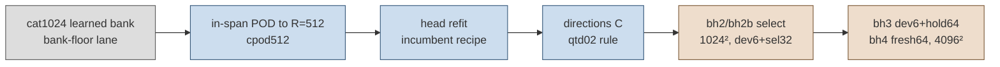

# Burgers 2D held-out accuracy at $4096^2$: a better bank does not close the gap

Status: **final for jobs bh1–bh5** (numbers finalised 2026-09-22; bh5 = incumbent re-timed with `lat64` j=1,
coordinator task). Every number in the tables comes from `reports/tables.generated.md` /
`reports/summary.json`, generated by `reports/gen_report.py` from the audited per-job summaries; prose numbers are copied
from those files.

## Question and bar

Can a new frozen Burgers model, with a better mesh-free bank at the same rank $R=512$, bring the held-out worst evolved
error at $4096^2$ to $\le 1\,\%$ with speedup $\ge 5\times$ over the fastest Newton–BiCGStab setting at least as accurate
(paper FOM rule)? Design: `DESIGN.md` (pre-registered, Codex-audited, amendments A2–A4).

## Result

**Bar not met.** The new bank lowers the projection floor about 2× (sel32 at $256^2$: 0.513 % → 0.183 %; hold64 at
$4096^2$: 0.295 %), but the certified corrected rung (q=256, M=1088, `lat64`) is *less* accurate on held-out cases than the
incumbent's: hold64 1.60 % (incumbent hb4kh64: 1.33 %), fresh64 2.41 %. It is faster (80 ms vs 100–107 ms), so its speedup
is 6.7× on hold64 — but at the wrong error. The corrected error is 3–8× the floor: the binding term is the correction
subspace and weak test space, not the bank. Arms that do reach sub-1 % held-out error (q=512, M=2112, `lat128`: hold64
0.39 %, fresh64 0.46 %) fail the ρ certificate and run at ~260 ms, 2.1–2.2× the FOM: **accurate held-out Burgers at
$4096^2$ costs roughly 2× the FOM's speed, not 5×.**

## Tables

See `tables.generated.md` (all arms, all jobs). Headline rows are in the final lane message and the lab-log entry.

## Glossary

- **dev6 / sel32 / hold64 / fresh64**: evaluation cohorts (6 opened development cases; 32 selection cases, this lane;
  64 held-out cases opened by earlier lanes; 64 untouched cases, this lane). Definitions in `DESIGN.md` §4.
- **worst evolved %**: max over cases and output times $t>0$ of $\lVert u-u^{\rm tight}\rVert/\lVert u_0\rVert$.
- **floor %**: the same metric for the orthogonal projection of the reference onto the bank's span (a lower bound for
  any corrected ROM).
- **q, M, rule**: correction rank, number of weak test modes, quadrature rule (`latN` = uniform $(N-1)^2$ sub-lattice).
- **cert.**: held-out ρ certificate (max ρ ≤ 0.116 on the dense-query population and on the arm's own states). For bh5
  (eqcert procedure) certified = all 5 draws pass **and** the 16-trajectory confirmation draw passes.
- **FOM (paper rule)**: fastest tested Newton–BiCGStab setting in the same allocation whose worst evolved error is ≤ the
  ROM row's. **speedup**: its median GPU ms / the ROM's median GPU ms.
- **j**: number of initial time steps solved with the exact residual before the rule takes over (bh5).

## bh5 — incumbent model at $4096^2$ with `lat64` j=1 vs the paper's j=0 (coordinator task, DESIGN A4)

Job 4153483 (H200, source 7912b033), dev6 + hold64, 5 reps, audited by `audit_bh.py` (`checks/bh5-summary.json`) and
`eqcert/audit_eqcert.py` (`checks/bh5-eqcert-summary.json`). Certificate population `params_draw(20260921,56)`, five
8-trajectory draws + a 16-trajectory confirmation draw, bar 0.116.

- **j=0 (the paper's rule):** passes 5/5 draws (held-out ρ_max 0.0717, deployed 0.1072) but **fails the confirmation
  draw at $4096^2$** (held-out ρ 0.1173 > 0.116; deployed 0.1084). Error and speed reproduce hb4k04/hb4kh64: g1e-2
  dev6 0.604 % @ 107.0 ms (4.90× `lean_nt3e-3`), hold64 1.331 % @ 99.6 ms (5.39×).
- **j=1:** certifies with margin everywhere (draws ≤ 0.037, confirmation 0.051 held-out / 0.048 deployed), identical error
  (0.604 / 1.331 %), but the exact first step at $4096^2$ costs ~5–7 s per query: 5308 ms dev6 / 6558 ms hold64
  (0.10× / 0.08×). **j=1 is not a usable replacement for the 4096² speed row.**
- Paired table (paper rows from hires-burgers hb4k04/hb4kh64 beside the bh5 rows): last block of `tables.generated.md`.
- Independent NumPy audit (`checks/bh5-eqcert-summary.json`): every certificate status reproduced from the saved
  per-state ρ (`arm_status_recomputed_matches_job`), ρ itself re-implemented in NumPy (bank, upwind advection, sine
  tests, rule) and matched on 79 spot-check states to $2.7\times10^{-9}$ relative, full-grid errors reproduced to
  $1.4\times10^{-18}$, control fails, verdict `certified_rule_exists: false` at $4096^2$. Its one failed gate is the
  restricted-proxy gate (gap 0.060), which fails in every $4096^2$ job of this lane and is superseded by the full-grid
  recomputation.
- Diagnostic from the same audit: raising the exact-step threshold to $k \ge 2$ would put the confirmation draw at
  ρ 0.0147 — the certificate failure is concentrated in the first one or two steps after the initial condition.
- **Correction (2026-09-22).** The first bh5 commit (0e20e20c) printed `cert. True` for the j=0 rows in
  `tables.generated.md` / `summary.json` because `audit_bh.py` read only the 5-draw status and ignored the failed
  confirmation draw; the prose was right, the table was not. Fixed in `audit_bh.py` (certified = 5/5 **and**
  confirmation). The same commit cited `checks/bh5-eqcert-summary.json` before it existed (the eqcert audit had been
  OOM-killed); it is now produced. Running it at $4096^2$ needed one memory-only change to the copied
  `eqcert/audit_eqcert.py` (`bank_np` writes into a preallocated array instead of concatenating chunks: the full-grid
  bank matrix is ~69 GB in f64 and the concatenation doubled that) and `JAXRUN_HIGH=84G JAXRUN_MAX=96G`. Values are
  unchanged — `bank_np` is chunk-invariant, checked in `checks/bank_np_chunk_check.txt`.
- The j=1 cost is the driver's dense exact-residual first step at $4096^2$ (full-grid residual against all $M$ tests);
  no cheaper exact first step was tested.
- Control `bad0` fails (ρ 0.53) as required. The restricted-proxy gate fails as in every 4096² job; full-grid
  worst-case recomputation passes.
