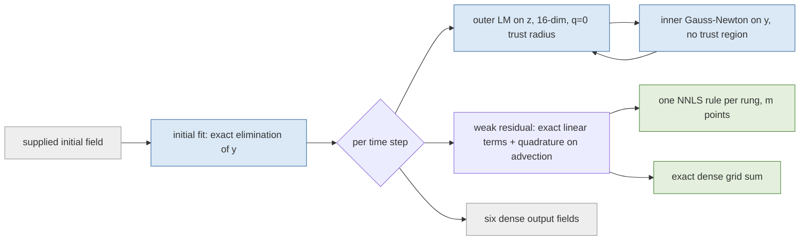
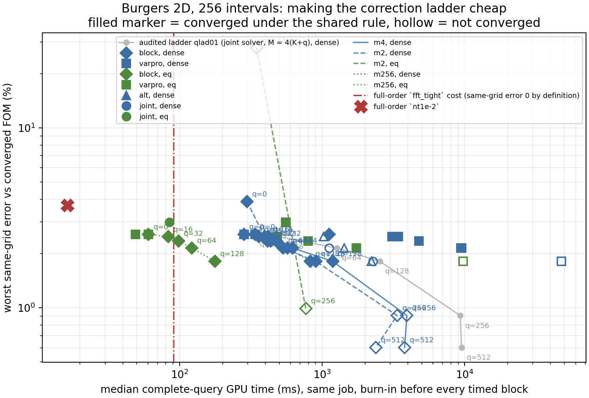

# Making the Burgers correction ladder converge cheaply

Three isolated changes to the audited fixed-weight correction ladder — eliminating the correction coefficients from the nonlinear iteration, decoupling the test count from $q$, and fitting one empirical-quadrature rule per rung — measured on the same frozen checkpoint, the same nested directions and the same six opened development cases as job `3713867`. These numbers are final for this cell: job `3734098` on `NVIDIA A100 80GB PCIe`, source `f76ec2ff9acd1cfad96dcb0bda733b29a20b1be6`, independently recomputed from the saved fields. Nothing here is provisional unless a row says so.

## What the audited ladder left open

The audited ladder solved the whole augmented vector $w=(z,y)\in\mathbb R^{K+q}$ with one Levenberg–Marquardt iteration at the $q=0$ trust radius, forced $M=4(K+q)$ test modes, and had no empirical-quadrature rule above $q=16$. Error fell monotonically with $q$ but only $q\in\{0,16\}$ converged and cost grew about $28\times$.

The reduced state, the directions and the reachable set are unchanged here:

$$u(z,y)=G\big(h_\theta(z)+C_q\,y\big),\qquad r(z,y)=\frac{A\eta-p+\Delta t\big(\Phi^\top\mathcal N(G\eta)+\nu\lambda\odot A\eta\big)}{1+\Delta t\,\nu\lambda},\qquad \eta=h_\theta(z)+C_qy.$$

## Gates

| gate | passed | detail |
|---|---:|---:|
| `complete` | yes |  |
| `backend_gpu` | yes | gpu |
| `x64` | yes |  |
| `precision_highest` | yes |  |
| `bank_frozen` | yes |  |
| `checkpoint_unchanged` | yes |  |
| `final_cohort_unopened` | yes |  |
| `reference_residuals` | yes | 9.875956332294223e-12 |
| `reference_fields_bitwise_match_qlad01` | no | [False, False, False, False, False, False] |
| `directions_hash_matches_qlad01` | no | {'expected': 'f270e5bf682ad220f2164ced82dde0f3e0374e84e2fa002f3101e0728062d399', 'got': '802737d3509a81d5b9f2b9f896c603dceb4a6f84c86abb635d9e3ec62b0aa… |
| `directions_rank_covers_ladder` | yes | 512 |
| `flattened_direction_fit` | yes | {'seconds': 1242.3600494801067, 'compile_seconds_saved': -124.27167616412044, 'bitwise_identical_to_audited': True, 'max_abs_difference_from_audited':… |
| `every_subject_case_has_all_reps` | yes | [3] |
| `repetition_output_identical` | yes | [] |
| `every_invocation_paired` | yes |  |
| `overdetermined_weak_system` | yes | [] |
| `test_count_rule_followed` | yes | [] |
| `every_rom_carries_exit_and_stationarity` | yes |  |
| `q0_variants_bitwise` | yes | {'reference': 'q0_m4_dense_joint', 'arms': {'q0_m4_dense_varpro': {'compared': 6, 'identical': 6}, 'q0_m4_dense_block': {'compared': 6, 'identical': 6… |
| `artifacts_present` | yes | [] |
| `recorded_errors_recomputed_from_saved_fields` | yes | 5.169900890572035e-16 |
| `q0_reproduces_qlad01_q0_eq` | yes | {'compared': 6, 'worst_relative_delta': 1.0059226592191645e-12, 'tolerance': 1e-09, 'reference_gpu': 'NVIDIA A100-PCIE-40GB', 'this_gpu': 'NVIDIA A100… |
| `cases_identical` | yes |  |
| `q0_reproduces_abl01_a_neural_eq` | yes | {'compared': 6, 'worst_relative_delta': 7.313945611504219e-13, 'tolerance': 1e-09, 'reference_gpu': 'NVIDIA A100 80GB PCIe', 'this_gpu': 'NVIDIA A100 … |
| `q16_varpro_agrees_with_qlad01_q16_dense` | yes | {'compared': 6, 'worst_relative_error_delta': 3.6222938353923505e-06, 'tolerance': 0.001, 'worst_relative_field_difference': 9.409231903993106e-07, 'f… |

## Change 1 — the solver

For fixed $z$ the residual is quadratic in $y$, so $y^\*(z)=\arg\min_y\|r(z,y)\|$ is found by damped Gauss–Newton and the outer iteration runs on $z\in\mathbb R^{16}$ alone. Three variants were compared against the audited joint solver at matched $q$, test count and quadrature. Convergence is the shared rule: every time step and the initial fit exit for a reason in $\{1,2,4\}$, no iteration-budget exit, and joint normalized gradient

$$g=\frac{\sqrt{\|J_z^{\top}r\|^2+\|J_y^{\top}r\|^2}}{\sqrt{\|J_z\|_F^2+\|J_y\|_F^2}\;\|r\|}\le 10^{-6}.$$

| q | variant | outer dim | M | worst same-grid % | median GPU ms | median iters/step | budget exits | max joint $g$ | max inner $g_y$ | converged |
|---|---:|---:|---:|---:|---:|---:|---:|---:|---:|---:|
| 0 | `alt` | 16 | 64 | 2.5629 | 282.438 | 3.0 | 0 | 9.97e-07 | 0.00e+00 | yes |
| 0 | `block` | 16 | 64 | 2.5629 | 282.871 | 3.0 | 0 | 9.97e-07 | 0.00e+00 | yes |
| 0 | `joint` | 16 | 64 | 2.5629 | 283.221 | 3.0 | 0 | 9.97e-07 | 0.00e+00 | yes |
| 0 | `varpro` | 16 | 64 | 2.5629 | 282.866 | 3.0 | 0 | 9.97e-07 | 0.00e+00 | yes |
| 16 | `alt` | 16 | 128 | 2.4806 | 1026.099 | 7.0 | 0 | 8.07e-03 | 5.52e-08 | no |
| 16 | `block` | 16 | 128 | 2.4806 | 359.839 | 3.0 | 0 | 9.99e-07 | 1.94e-07 | yes |
| 16 | `joint` | 32 | 128 | 2.4806 | 427.170 | 3.0 | 0 | 9.92e-07 | 0.00e+00 | yes |
| 16 | `varpro` | 16 | 128 | 2.4806 | 3420.852 | 17.0 | 0 | 9.98e-07 | 1.52e-07 | yes |
| 32 | `block` | 16 | 192 | 2.3534 | 433.285 | 3.0 | 0 | 9.83e-07 | 1.63e-07 | yes |
| 64 | `alt` | 16 | 320 | 2.1489 | 1427.426 | 7.0 | 0 | 3.43e-02 | 4.72e-08 | no |
| 64 | `block` | 16 | 320 | 2.1489 | 619.242 | 3.0 | 0 | 9.47e-07 | 1.34e-07 | yes |
| 64 | `joint` | 80 | 320 | 2.1489 | 1119.719 | 3.0 | 6 | 2.60e-02 | 0.00e+00 | no |
| 64 | `varpro` | 16 | 320 | 2.1489 | 9527.948 | 33.0 | 0 | 9.97e-07 | 3.92e-08 | yes |
| 128 | `alt` | 16 | 576 | 1.8116 | 2215.151 | 7.0 | 0 | 4.46e-02 | 3.95e-08 | no |
| 128 | `block` | 16 | 576 | 1.8116 | 1184.683 | 3.0 | 0 | 9.93e-07 | 1.37e-07 | yes |
| 128 | `joint` | 144 | 576 | 1.8116 | 2268.532 | 3.0 | 15 | 3.26e-02 | 0.00e+00 | no |
| 256 | `block` | 16 | 1088 | 0.9053 | 3927.271 | 5.0 | 12 | 2.27e-03 | 2.32e-04 | no |
| 512 | `block` | 16 | 2112 | 0.6027 | 3790.395 | 2.0 | 0 | 1.38e-01 | 1.87e-07 | no |

## Change 2 — the test count

$M=4(K+q)$ (the retained rule), $M=2(K+q)$, and a fixed $M=256$ wherever $M>K+q$.

| q | rule | M | quadrature | m | worst same-grid % | median GPU ms | budget exits | converged |
|---|---:|---:|---:|---:|---:|---:|---:|---:|
| 0 | `m2` | 32 | dense | — | 3.8946 | 296.888 | 0 | yes |
| 0 | `m256` | 256 | dense | — | 2.5629 | 338.578 | 0 | yes |
| 0 | `m256` | 256 | eq | 1010 | 2.5629 | 60.206 | 0 | yes |
| 0 | `m4` | 64 | dense | — | 2.5629 | 282.871 | 0 | yes |
| 16 | `m2` | 64 | dense | — | 2.4806 | 394.245 | 0 | yes |
| 16 | `m256` | 256 | dense | — | 2.4806 | 420.396 | 0 | yes |
| 16 | `m256` | 256 | eq | 1000 | 2.4806 | 83.235 | 0 | yes |
| 16 | `m4` | 128 | dense | — | 2.4806 | 359.839 | 0 | yes |
| 32 | `m2` | 96 | dense | — | 2.3534 | 415.017 | 0 | yes |
| 32 | `m256` | 256 | dense | — | 2.3534 | 477.319 | 0 | yes |
| 32 | `m256` | 256 | eq | 1024 | 2.3534 | 98.287 | 0 | yes |
| 32 | `m4` | 192 | dense | — | 2.3534 | 433.285 | 0 | yes |
| 64 | `m2` | 160 | dense | — | 2.1489 | 532.219 | 0 | yes |
| 64 | `m256` | 256 | dense | — | 2.1489 | 570.216 | 0 | yes |
| 64 | `m256` | 256 | eq | 1010 | 2.1489 | 121.765 | 0 | yes |
| 64 | `m4` | 320 | dense | — | 2.1489 | 619.242 | 0 | yes |
| 128 | `m2` | 288 | dense | — | 1.8116 | 902.397 | 0 | yes |
| 128 | `m256` | 256 | dense | — | 1.8116 | 825.527 | 0 | yes |
| 128 | `m256` | 256 | eq | 999 | 1.8116 | 177.291 | 0 | yes |
| 128 | `m4` | 576 | dense | — | 1.8116 | 1184.683 | 0 | yes |
| 256 | `m2` | 544 | dense | — | 0.9053 | 3354.317 | 15 | no |
| 256 | `m2` | 544 | eq | 1176 | 0.9899 | 767.031 | 12 | no |
| 256 | `m4` | 1088 | dense | — | 0.9053 | 3927.271 | 12 | no |
| 512 | `m2` | 1056 | dense | — | 0.6027 | 2381.771 | 0 | no |
| 512 | `m2` | 1056 | eq | 1209 | 27.8120 | 345.974 | 0 | no |
| 512 | `m4` | 2112 | dense | — | 0.6027 | 3790.395 | 0 | no |

## Change 3 — one empirical-quadrature rule per rung

Each rule is a nonnegative least-squares weighting of $m$ grid points fitted offline on enriched decoder-output advection snapshots $h_\theta(z_i^\*)+C_qy_i$. Offline fitting cost is charged here and never inside a query timing.

| arm | q | M | m | fitter | relative fit | support | truncated | fit seconds | worst same-grid % | median GPU ms |
|---|---:|---:|---:|---:|---:|---:|---:|---:|---:|---:|
| `q0_m4_eq_varpro` | 0 | 64 | 256 | retained | 5.159e-03 | 256 | no | 13.4 | 2.5629 | 49.128 |
| `q0_m256_eq_block` | 0 | 256 | 1010 | bounded | 4.061e-04 | 1010 | yes | 304.2 | 2.5629 | 60.206 |
| `q0_m256_eq_varpro` | 0 | 256 | 1010 | bounded | 4.061e-04 | 1010 | yes | 304.2 | 2.5629 | 60.237 |
| `q16_m4_eq_joint` | 16 | 128 | 512 | retained | 1.316e-03 | 512 | no | 221.2 | 2.9937 | 84.569 |
| `q16_m4_eq_varpro` | 16 | 128 | 512 | retained | 1.316e-03 | 512 | no | 221.2 | 2.9937 | 555.374 |
| `q16_m4_eq_varpro_bnd` | 16 | 128 | 512 | bounded | 1.523e-03 | 512 | no | 83.5 | 2.9776 | 556.299 |
| `q16_m256_eq_block` | 16 | 256 | 1000 | bounded | 3.889e-04 | 1000 | yes | 300.7 | 2.4806 | 83.235 |
| `q16_m256_eq_varpro` | 16 | 256 | 1000 | bounded | 3.889e-04 | 1000 | yes | 300.7 | 2.4806 | 483.214 |
| `q32_m256_eq_block` | 32 | 256 | 1024 | bounded | 3.740e-04 | 1024 | no | 306.1 | 2.3534 | 98.287 |
| `q32_m256_eq_varpro` | 32 | 256 | 1024 | bounded | 3.740e-04 | 1024 | no | 306.1 | 2.3534 | 795.650 |
| `q64_m256_eq_block` | 64 | 256 | 1010 | bounded | 3.873e-04 | 1010 | yes | 301.9 | 2.1489 | 121.765 |
| `q64_m256_eq_varpro` | 64 | 256 | 1010 | bounded | 3.873e-04 | 1010 | yes | 301.9 | 2.1489 | 1740.237 |
| `q128_m256_eq_block` | 128 | 256 | 999 | bounded | 4.033e-04 | 999 | yes | 305.0 | 1.8116 | 177.291 |
| `q128_m256_eq_varpro` | 128 | 256 | 999 | bounded | 4.033e-04 | 999 | yes | 305.0 | 1.8116 | 9740.424 |
| `q256_m2_eq_block` | 256 | 544 | 1176 | bounded | 5.517e-04 | 1176 | yes | 307.4 | 0.9899 | 767.031 |
| `q512_m2_eq_block` | 512 | 1056 | 1209 | bounded | 5.668e-03 | 1209 | yes | 303.5 | 27.8120 | 345.974 |

Paired empirical-quadrature / dense rows at the same $q$ and the same $M$ isolate the quadrature effect:

| q | M | eq GPU ms | dense GPU ms | cost factor | same-grid difference (pp) |
|---|---:|---:|---:|---:|---:|
| 0 | 64 | 49.128 | 282.866 | 5.758 | 0.00000 |
| 0 | 256 | 60.206 | 338.578 | 5.624 | 0.00000 |
| 0 | 256 | 60.237 | 338.195 | 5.614 | 0.00000 |
| 16 | 128 | 84.569 | 427.170 | 5.051 | 0.51311 |
| 16 | 128 | 555.374 | 3420.852 | 6.160 | 0.51311 |
| 16 | 128 | 556.299 | 3420.852 | 6.149 | 0.49707 |
| 16 | 256 | 83.235 | 420.396 | 5.051 | 0.00000 |
| 16 | 256 | 483.214 | 3100.231 | 6.416 | 0.00000 |
| 32 | 256 | 98.287 | 477.319 | 4.856 | 0.00000 |
| 32 | 256 | 795.650 | 4779.440 | 6.007 | 0.00000 |
| 64 | 256 | 121.765 | 570.216 | 4.683 | 0.00000 |
| 64 | 256 | 1740.237 | 9385.230 | 5.393 | 0.00000 |
| 128 | 256 | 177.291 | 825.527 | 4.656 | 0.00000 |
| 128 | 256 | 9740.424 | 47566.942 | 4.883 | 0.00000 |
| 256 | 544 | 767.031 | 3354.317 | 4.373 | 0.08465 |
| 512 | 1056 | 345.974 | 2381.771 | 6.884 | 27.20933 |

## The three layers

Bank projection is the floor any coefficients at all could reach; best-found reconstruction is the best the $q$-rung manifold can do on the reference field with no PDE involved; solved is the online result. They are not an additive decomposition.

| arm | q | rule | quadrature | variant | bank projection % | best-found % | solved worst same-grid % | solved worst vs reference % |
|---|---:|---:|---:|---:|---:|---:|---:|---:|
| `q0_Mmax_dense_block` | 0 | `Mmax` | dense | `block` | 0.3918 | 2.5447 | 2.5629 | 4.0687 |
| `q0_m2_dense_block` | 0 | `m2` | dense | `block` | 0.3918 | 2.5447 | 3.8946 | 4.9659 |
| `q0_m256_dense_block` | 0 | `m256` | dense | `block` | 0.3918 | 2.5447 | 2.5629 | 4.0637 |
| `q0_m256_dense_varpro` | 0 | `m256` | dense | `varpro` | 0.3918 | 2.5447 | 2.5629 | 4.0637 |
| `q0_m256_eq_block` | 0 | `m256` | eq | `block` | 0.3918 | 2.5447 | 2.5629 | 4.0527 |
| `q0_m256_eq_varpro` | 0 | `m256` | eq | `varpro` | 0.3918 | 2.5447 | 2.5629 | 4.0527 |
| `q0_m4_dense_alt` | 0 | `m4` | dense | `alt` | 0.3918 | 2.5447 | 2.5629 | 4.5575 |
| `q0_m4_dense_block` | 0 | `m4` | dense | `block` | 0.3918 | 2.5447 | 2.5629 | 4.5575 |
| `q0_m4_dense_joint` | 0 | `m4` | dense | `joint` | 0.3918 | 2.5447 | 2.5629 | 4.5575 |
| `q0_m4_dense_varpro` | 0 | `m4` | dense | `varpro` | 0.3918 | 2.5447 | 2.5629 | 4.5575 |
| `q0_m4_eq_varpro` | 0 | `m4` | eq | `varpro` | 0.3918 | 2.5447 | 2.5629 | 4.5546 |
| `q16_m2_dense_block` | 16 | `m2` | dense | `block` | 0.3918 | 2.4615 | 2.4806 | 4.4307 |
| `q16_m256_dense_block` | 16 | `m256` | dense | `block` | 0.3918 | 2.4615 | 2.4806 | 4.0664 |
| `q16_m256_dense_varpro` | 16 | `m256` | dense | `varpro` | 0.3918 | 2.4615 | 2.4806 | 4.0664 |
| `q16_m256_eq_block` | 16 | `m256` | eq | `block` | 0.3918 | 2.4615 | 2.4806 | 4.0654 |
| `q16_m256_eq_varpro` | 16 | `m256` | eq | `varpro` | 0.3918 | 2.4615 | 2.4806 | 4.0654 |
| `q16_m4_dense_alt` | 16 | `m4` | dense | `alt` | 0.3918 | 2.4615 | 2.4806 | 4.1079 |
| `q16_m4_dense_block` | 16 | `m4` | dense | `block` | 0.3918 | 2.4615 | 2.4806 | 4.1065 |
| `q16_m4_dense_joint` | 16 | `m4` | dense | `joint` | 0.3918 | 2.4615 | 2.4806 | 4.1065 |
| `q16_m4_dense_varpro` | 16 | `m4` | dense | `varpro` | 0.3918 | 2.4615 | 2.4806 | 4.1065 |
| `q16_m4_eq_joint` | 16 | `m4` | eq | `joint` | 0.3918 | 2.4615 | 2.9937 | 4.0646 |
| `q16_m4_eq_varpro` | 16 | `m4` | eq | `varpro` | 0.3918 | 2.4615 | 2.9937 | 4.0646 |
| `q16_m4_eq_varpro_bnd` | 16 | `m4` | eq | `varpro` | 0.3918 | 2.4615 | 2.9776 | 4.1048 |
| `q32_m2_dense_block` | 32 | `m2` | dense | `block` | 0.3918 | 2.3325 | 2.3534 | 4.3043 |
| `q32_m256_dense_block` | 32 | `m256` | dense | `block` | 0.3918 | 2.3325 | 2.3534 | 4.0760 |
| `q32_m256_dense_varpro` | 32 | `m256` | dense | `varpro` | 0.3918 | 2.3325 | 2.3534 | 4.0760 |
| `q32_m256_eq_block` | 32 | `m256` | eq | `block` | 0.3918 | 2.3325 | 2.3534 | 4.0827 |
| `q32_m256_eq_varpro` | 32 | `m256` | eq | `varpro` | 0.3918 | 2.3325 | 2.3534 | 4.0827 |
| `q32_m4_dense_block` | 32 | `m4` | dense | `block` | 0.3918 | 2.3325 | 2.3534 | 4.0814 |
| `q64_m2_dense_block` | 64 | `m2` | dense | `block` | 0.3918 | 2.1386 | 2.1489 | 4.1614 |
| `q64_m256_dense_block` | 64 | `m256` | dense | `block` | 0.3918 | 2.1386 | 2.1489 | 4.0951 |
| `q64_m256_dense_varpro` | 64 | `m256` | dense | `varpro` | 0.3918 | 2.1386 | 2.1489 | 4.0951 |
| `q64_m256_eq_block` | 64 | `m256` | eq | `block` | 0.3918 | 2.1386 | 2.1489 | 4.0926 |
| `q64_m256_eq_varpro` | 64 | `m256` | eq | `varpro` | 0.3918 | 2.1386 | 2.1489 | 4.0926 |
| `q64_m4_dense_alt` | 64 | `m4` | dense | `alt` | 0.3918 | 2.1386 | 2.1489 | 4.1056 |
| `q64_m4_dense_block` | 64 | `m4` | dense | `block` | 0.3918 | 2.1386 | 2.1489 | 4.1013 |
| `q64_m4_dense_joint` | 64 | `m4` | dense | `joint` | 0.3918 | 2.1386 | 2.1489 | 4.1013 |
| `q64_m4_dense_varpro` | 64 | `m4` | dense | `varpro` | 0.3918 | 2.1386 | 2.1489 | 4.1013 |
| `q128_m2_dense_block` | 128 | `m2` | dense | `block` | 0.3918 | 1.8105 | 1.8116 | 4.0803 |
| `q128_m256_dense_block` | 128 | `m256` | dense | `block` | 0.3918 | 1.8105 | 1.8116 | 4.0926 |
| `q128_m256_dense_varpro` | 128 | `m256` | dense | `varpro` | 0.3918 | 1.8105 | 1.8116 | 4.0926 |
| `q128_m256_eq_block` | 128 | `m256` | eq | `block` | 0.3918 | 1.8105 | 1.8116 | 4.1027 |
| `q128_m256_eq_varpro` | 128 | `m256` | eq | `varpro` | 0.3918 | 1.8105 | 1.8116 | 4.1027 |
| `q128_m4_dense_alt` | 128 | `m4` | dense | `alt` | 0.3918 | 1.8105 | 1.8116 | 4.0780 |
| `q128_m4_dense_block` | 128 | `m4` | dense | `block` | 0.3918 | 1.8105 | 1.8116 | 4.0797 |
| `q128_m4_dense_joint` | 128 | `m4` | dense | `joint` | 0.3918 | 1.8105 | 1.8116 | 4.0797 |
| `q256_m2_dense_block` | 256 | `m2` | dense | `block` | 0.3918 | 0.9016 | 0.9053 | 4.0611 |
| `q256_m2_eq_block` | 256 | `m2` | eq | `block` | 0.3918 | 0.9016 | 0.9899 | 4.0630 |
| `q256_m4_dense_block` | 256 | `m4` | dense | `block` | 0.3918 | 0.9016 | 0.9053 | 4.0391 |
| `q512_m2_dense_block` | 512 | `m2` | dense | `block` | 0.3918 | 0.3918 | 0.6027 | 4.0432 |
| `q512_m2_eq_block` | 512 | `m2` | eq | `block` | 0.3918 | 0.3918 | 27.8120 | 27.5595 |
| `q512_m4_dense_block` | 512 | `m4` | dense | `block` | 0.3918 | 0.3918 | 0.6027 | 4.0392 |

## Full-order controls, as context only

| method | worst same-grid % | worst vs reference % | median GPU ms | median host ms |
|---|---:|---:|---:|---:|
| `fft_tight` | 0.0000 | 4.0265 | 90.917 | 92.697 |
| `nt1e-2` | 3.7127 | 2.4737 | 16.264 | 18.253 |

## Non-dominated set

Non-dominated over (median GPU ms, worst same-grid %), all arms: `q0_m4_eq_varpro`, `q128_m256_eq_block`, `q16_m256_eq_block`, `q256_m2_eq_block`, `q32_m256_eq_block`, `q512_m2_dense_block`, `q64_m256_eq_block`.

Restricted to CONVERGED arms: `q0_m4_eq_varpro`, `q128_m256_eq_block`, `q16_m256_eq_block`, `q32_m256_eq_block`, `q64_m256_eq_block`.

| arm | q | rule | quadrature | worst same-grid % | median GPU ms | converged |
|---|---:|---:|---:|---:|---:|---:|
| `q0_m4_eq_varpro` | 0 | `m4` | eq | 2.5629 | 49.128 | yes |
| `q16_m256_eq_block` | 16 | `m256` | eq | 2.4806 | 83.235 | yes |
| `q32_m256_eq_block` | 32 | `m256` | eq | 2.3534 | 98.287 | yes |
| `q64_m256_eq_block` | 64 | `m256` | eq | 2.1489 | 121.765 | yes |
| `q128_m256_eq_block` | 128 | `m256` | eq | 1.8116 | 177.291 | yes |

## Pre-registered acceptance

| criterion | required | measured | verdict |
|---|---:|---:|---:|
| error monotone in $q$ | non-increasing in at least one retained configuration | m4/dense: yes; m2/dense: yes; m256/dense: yes; m256/eq: yes | yes |
| non-dominated converged points | >= 3 | 5 | yes |
| cost span of those points | >= 2x | 3.61 | yes |
| error span of those points | >= 2x | 1.41 | no |
| **q is a knob** | all of the above |  | no |

**Target.** $q=64$ converged at $\le 3\times$ the $q=0$ median GPU cost, the baseline being the ladder's own retained $q=0$ rung `q0_m4_eq_varpro`.

| quantity | value |
|---|---:|
| $q=0$ baseline arm | `q0_m4_eq_varpro` |
| $q=0$ baseline median GPU ms | 49.128 |
| cheapest CONVERGED $q=64$ arm | `q64_m256_eq_block` |
| its median GPU ms | 121.765 |
| its worst same-grid % | 2.1489 |
| cost ratio | 2.479 |
| **target (<= 3x, converged)** | **PASS** |

## Direction fit and its compilation cost

| quantity | audited double vmap | flattened single vmap |
|---|---:|---:|
| seconds | 1118.1 | 1242.4 |
| directions sha256 | `802737d3509a81d5…` | `802737d3509a81d5…` |
| bitwise identical to the audited path | — | yes |
| max absolute difference | — | 0.000e+00 |
| seconds saved | — | -124.3 |

Residual energy captured by the first $q$ directions: $q=0$: 0.0000\%, $q=16$: 45.2788\%, $q=32$: 62.0079\%, $q=64$: 80.2613\%, $q=128$: 94.7010\%, $q=256$: 99.8307\%, $q=512$: 100.0000\%.

## Poisson 2D, 1024 intervals

The Poisson weak residual is exactly $B\,h(z)-f_m$, **linear** in the coefficients, so the retained path already eliminates $y$ by an exact triangular solve and the nonlinear iteration stays $K=16$-dimensional at every $q$. There is no quadrature, so change 3 does not apply. Job `3734084` on `NVIDIA A100 80GB PCIe`.

| arm | q | rule | M | nominal dim | nonlinear dim | linear rank ok | bank projection % | best-found % | worst physical % | median device ms | all solver-valid |
|---|---:|---:|---:|---:|---:|---:|---:|---:|---:|---:|---:|
| `q0_m2` | 0 | `m2` | 32 | 16 | 16 | yes | 2.3148 | 6.0926 | 6.5665 | 3.7495 | yes |
| `q0_m256` | 0 | `m256` | 257 | 16 | 16 | yes | 2.3148 | 6.0926 | 6.0927 | 3.8285 | yes |
| `q0_m4` | 0 | `m4` | 64 | 16 | 16 | yes | 2.3148 | 6.0926 | 6.2249 | 3.9574 | yes |
| `q8_m2` | 8 | `m2` | 48 | 24 | 16 | yes | 2.3148 | 5.4401 | 8.0615 | 3.8822 | yes |
| `q8_m256` | 8 | `m256` | 257 | 24 | 16 | yes | 2.3148 | 5.4401 | 5.4407 | 4.0133 | yes |
| `q8_m4` | 8 | `m4` | 96 | 24 | 16 | yes | 2.3148 | 5.4401 | 5.7226 | 3.8752 | yes |
| `q16_m2` | 16 | `m2` | 64 | 32 | 16 | yes | 2.3148 | 5.0187 | 7.0408 | 3.9351 | yes |
| `q16_m256` | 16 | `m256` | 257 | 32 | 16 | yes | 2.3148 | 5.0187 | 5.0202 | 3.9480 | yes |
| `q16_m4` | 16 | `m4` | 129 | 32 | 16 | yes | 2.3148 | 5.0187 | 5.1213 | 3.9784 | yes |
| `q32_m2` | 32 | `m2` | 96 | 48 | 16 | yes | 2.3148 | 4.6640 | 5.6855 | 3.9742 | yes |
| `q32_m256` | 32 | `m256` | 257 | 48 | 16 | yes | 2.3148 | 4.6640 | 4.6670 | 3.8952 | yes |
| `q32_m4` | 32 | `m4` | 193 | 48 | 16 | yes | 2.3148 | 4.6640 | 4.6803 | 3.8447 | yes |
| `q64_m2` | 64 | `m2` | 160 | 80 | 16 | yes | 2.3148 | 4.1721 | 4.3258 | 4.0073 | yes |
| `q64_m256` | 64 | `m256` | 257 | 80 | 16 | yes | 2.3148 | 4.1721 | 4.1781 | 4.1173 | yes |
| `q64_m4` | 64 | `m4` | 320 | 80 | 16 | yes | 2.3148 | 4.1721 | 4.1734 | 4.1805 | yes |
| `q128_m2` | 128 | `m2` | 288 | 144 | 16 | yes | 2.3148 | 2.3148 | 2.3218 | 5.4516 | no |
| `q128_m256` | 128 | `m256` | 257 | 144 | 16 | yes | 2.3148 | 2.3148 | 2.3274 | 5.4756 | no |
| `q128_m4` | 128 | `m4` | 577 | 144 | 16 | yes | 2.3148 | 2.3148 | 2.3148 | 5.6946 | no |
| `dst_direct` | None | `None` | None | — | — | — | — | — | 0.0007 | 0.3323 | — |

Non-dominated over (median device ms, worst physical %), all arms: `q0_m2`, `q0_m256`, `q128_m2`, `q128_m4`, `q32_m256`, `q32_m4`, `q64_m2`, `q64_m256`, `q64_m4`.

| gate | passed | detail |
|---|---:|---:|
| `complete` | yes | None |
| `backend_gpu` | yes | gpu |
| `x64` | yes | None |
| `precision_highest` | yes | None |
| `bank_frozen` | yes | None |
| `final_cohort_unopened` | yes | None |
| `retained_direction_prefix_exact` | yes | {'max_abs_difference': 0.0, 'passed': True} |
| `every_subject_case_has_all_reps` | yes | [3] |
| `repetition_output_identical` | yes | [] |
| `overdetermined_weak_system` | yes | [] |
| `nonlinear_dimension_stays_K` | yes | [16] |
| `every_rom_reports_solver_validity` | yes | None |
| `artifacts_present` | yes | [] |
| `recorded_errors_recomputed_from_saved_fields` | yes | 1.0401691331867622e-15 |
| `q32_reproduces_pabl01_a_neural_q32` | yes | {'compared': 12, 'worst_relative_delta': 4.137506416355348e-15, 'tolerance': 1e-09, 'reference_gpu': 'NVIDIA A100 80GB P |
| `cohort_identical` | yes | None |

## Limitations

- One mesh, one checkpoint, one training seed, six (Burgers) and twelve (Poisson) opened development cases. The final cohorts stay sealed and no new case was opened.

- The variable-projection and block-damped arms reach the SAME reachable set as the audited ladder but are a different solver, so agreement with the audited rungs is on the solution, not bitwise.

- Empirical-quadrature rules above the two retained ones use the bounded block-greedy fitter with a walltime cap; every rule records its support, fit residual and whether the cap bound.

- Offline costs (direction fit, quadrature fit, operator assembly) are reported separately and are never part of a query timing; they are one-time per rung.

- The full-order rows are same-job context, not a speed claim: no ratio against another job is taken anywhere in this report.

- At $q>0$ the block-damped variant solves its augmented normal equations with a pivoted dense solve, while the joint arms below 64 unknowns keep the incumbent unrolled Gauss-Jordan; the `linear_solve` column records the joint convention, not the block variant's. That is a more accurate step, not a weaker one, and it is the same recorded deviation the audited ladder carried at its larger arms. At $q=0$ every variant takes the audited path verbatim, which is what the bitwise gate checks.

## Glossary

- **$q$** — the number of extra fixed linear bank directions solved on top of the neural head.
- **$K$** — the latent dimension of the frozen head, 16 here; the outer solve works in this many unknowns once the corrections are eliminated.
- **$M$ (test count)** — how many smooth sine test functions the PDE residual is averaged against. The weak objective needs more tests than unknowns.
- **$m$** — how many grid points the empirical-quadrature rule keeps.
- **Variable projection** — eliminating the coefficients a residual depends on linearly (or here, quadratically but solvably) so the hard nonlinear search runs in fewer dimensions.
- **Kaufman Jacobian** — the cheap variable-projection Jacobian that ignores how the eliminated coefficients move with the outer variables. It gives the exact gradient at inner optimality, so the stopping test is exact.
- **Block-damped** — one Jacobian per iteration for the whole augmented vector, but the Levenberg damping and the trust radius apply only to the latent block.
- **Alternating** — rounds of (solve the latent block, then solve the correction block).
- **Trust radius** — a cap on how far one solver step may move; the audited ladder applied the $q=0$ cap to the whole augmented step, which is what bound at large $q$.
- **Converged** — every time step and the initial fit exited for a legitimate reason, with no iteration-budget exit, and the joint normalized gradient is below $10^{-6}$.
- **Budget exit** — a solve that stopped because it ran out of iterations, not because it reached a solution.
- **Joint normalized gradient $g$** — a scale-free measure of how close a solve is to a stationary point; small means the solve really stopped at a solution.
- **Empirical quadrature (EQ)** — a learned weighted subset of grid points standing in for a full grid sum; "dense" means no such approximation.
- **NNLS** — nonnegative least squares: fitting weights that are not allowed to be negative, which keeps the quadrature rule physically sensible.
- **Bank projection floor** — the best error any coefficients at all could reach in the frozen spatial bank.
- **Best-found reconstruction** — the best that rung's manifold can do on the reference field with no PDE solve involved.
- **Worst same-grid error** — the largest discrepancy, over cases and output times, against the converged full-order solve on the SAME mesh. It excludes the mesh's own discretization error.
- **Worst reference error** — the same but against the refined full-order reference, so it also contains the mesh's discretization error.
- **Non-dominated** — a setting that nothing else beats on both cost and error at once.
- **Held-out / development / final cohort** — cases used for measurement versus cases kept unopened for the final report.
- **pp** — percentage points, i.e. an absolute difference between two percentages.

