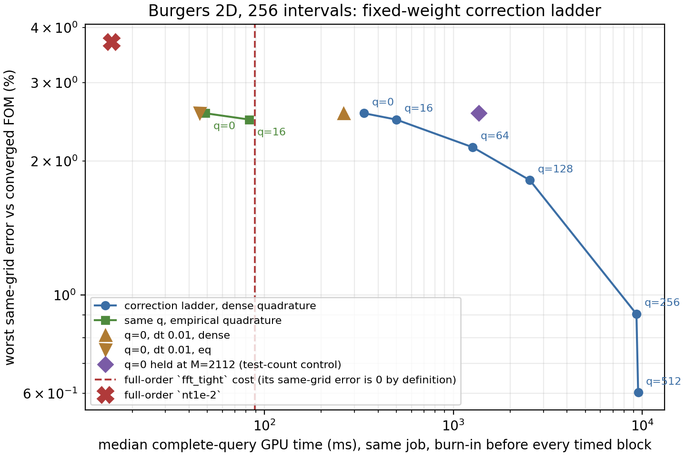

# A fixed-weight correction ladder on Burgers 2D

How much accuracy can be bought from a frozen checkpoint at inference time, and at what
cost, by solving extra linear bank directions on top of the neural head? One knob, $q$, and
one secondary knob, the time step. **Final for the six opened development cases and
provisional as a paper claim**: one checkpoint, one mesh, one training seed, final cohort
sealed.

Job `3713867` on `NVIDIA A100-PCIE-40GB`, source commit `313374fab24ee74e69d0355ebf60f53d49cefc1a`, JAX 0.10.2, backend `gpu`, float64, matmul precision `highest`, elapsed 3716.4 s, mesh 256 intervals per axis.

## The knob

$$u(z,y) = G\big(h_\theta(z) + C_q\,y\big),\qquad w=(z,y)\in\mathbb R^{K+q},$$

with the bank $G$, the head $h_\theta$ and every network weight frozen. $q=0$ is the head-ablation arm (a) exactly: $C_0$ has no columns. Because the Burgers weak residual is quadratic in the coefficients through the upwind advection term, $y$ **cannot** be eliminated analytically as it is on Poisson; the whole augmented vector is solved by the same Levenberg-Marquardt iteration, with the same trust radius 0.0525651166, the same budgets (400 initial, 180 per step) and the same normalized-gradient tolerance 1e-06.

**The directions are fixed offline and nested.** field-metric POD of the decoder-output residual eta - h_theta(z*), with z* the best-found head code under the shared LM rule; nested in q. 1024 snapshots, 4 multistart fits each at budget 200, seed 20260915; the head's own best-found relative fit over them is 0.5584% median and 6.9161% worst, and the available rank is 512, which covers the whole ladder. This fit is **offline and one-time**: it cost 1757.6 s of the job and enters no query timing, but it is the dominant setup cost and any redesign of the direction rule pays it again. Almost all of it is XLA compilation rather than arithmetic - the retained job stderr carries a single slow-operation alarm covering nearly the whole stage - because the fit is a doubly vectorised Levenberg-Marquardt `while_loop` with a forward-mode Jacobian inside. A flatter formulation would remove most of this setup cost without changing a single reported number. Residual energy captured: $q=0$ 0.0000%, $q=16$ 45.2788%, $q=64$ 80.2613%, $q=128$ 94.7010%, $q=256$ 99.8307%, $q=512$ 100.0000%.

**Fidelity gate.** Through the corrected-head wrapper at $q=0$, the smoke reproduces the consolidated saved Burgers case to 1.403e-14 relative and is **bit-identical** (0.0e+00) to the incumbent `accuracy_paths.make_rom`.
In the job itself, `q0_eq` reproduces the head-ablation job's `a_neural_eq` on all 6 cases to a worst relative difference of 7.174e-13, with 0 of 6 output fields bitwise identical across the two jobs.

## The ladder

The primary metric is the same-grid discrepancy against the converged full-order solve on this mesh, because the refined-reference metric also contains this mesh's discretization error: the full-order model itself carries 4.0265% worst against the refined reference. Both are reported.

| arm | $q$ | solved dim | $M$ | $m$ | quad. | $\Delta t$ | best-found % | worst same-grid % | median same-grid % | worst reference % | median iters/step | budget exits | max stationarity | stationary | completed | median GPU ms | median host ms |
|---|---:|---:|---:|---:|---|---:|---:|---:|---:|---:|---:|---:|---:|---|---|---:|---:|
| `q0_dense` | 0 | 16 | 64 | — | dense | 0.005 | 2.5447 | 2.5629 | 1.6957 | 4.5575 | 3.0 | 0 | 9.97e-07 | yes | yes | 336.793 | 339.257 |
| `q0_dense_Mmax` | 0 | 16 | 2112 | — | dense | 0.005 | 2.5447 | 2.5629 | 1.5039 | 4.0687 | 3.0 | 0 | 1.00e-06 | yes | yes | 1361.309 | 1364.314 |
| `q0_dense_dt0p01` | 0 | 16 | 64 | — | dense | 0.01 | 2.5447 | 2.5629 | 1.9413 | 5.5576 | 4.0 | 0 | 9.48e-07 | yes | yes | 262.223 | 264.619 |
| `q0_eq` | 0 | 16 | 64 | 256 | eq | 0.005 | 2.5447 | 2.5629 | 1.7013 | 4.5546 | 3.0 | 0 | 9.92e-07 | yes | yes | 48.758 | 51.278 |
| `q0_eq_dt0p01` | 0 | 16 | 64 | 256 | eq | 0.01 | 2.5447 | 2.5629 | 1.9508 | 5.5638 | 4.0 | 0 | 9.91e-07 | yes | yes | 45.469 | 48.158 |
| `q16_dense` | 16 | 32 | 128 | — | dense | 0.005 | 2.4615 | 2.4806 | 1.4380 | 4.1065 | 3.0 | 0 | 9.92e-07 | yes | yes | 498.271 | 500.443 |
| `q16_eq` | 16 | 32 | 128 | 512 | eq | 0.005 | 2.4615 | 2.4806 | 1.4380 | 4.1197 | 3.0 | 0 | 9.87e-07 | yes | yes | 83.233 | 85.642 |
| `q64_dense` | 64 | 80 | 320 | — | dense | 0.005 | 2.1386 | 2.1489 | 1.1300 | 4.1013 | 3.0 | 6 | 2.60e-02 | no | no | 1266.072 | 1268.568 |
| `q128_dense` | 128 | 144 | 576 | — | dense | 0.005 | 1.8105 | 1.8116 | 0.8161 | 4.0797 | 3.0 | 15 | 3.26e-02 | no | no | 2538.979 | 2541.763 |
| `q256_dense` | 256 | 272 | 1088 | — | dense | 0.005 | 0.9016 | 0.9053 | 0.4323 | 4.0361 | 6.0 | 60 | 5.55e-02 | no | no | 9306.086 | 9308.814 |
| `q512_dense` | 512 | 528 | 2112 | — | dense | 0.005 | 0.3918 | 0.6027 | 0.2980 | 4.0392 | 2.0 | 9 | 2.59e-01 | no | no | 9502.081 | 9504.550 |
| FOM `fft_tight` | — | — | — | — | — | — | — | 0.0000 | 0.0000 | 4.0265 | 2.0 | — | — | — | — | 89.090 | 91.780 |
| FOM `nt1e-2` | — | — | — | — | — | — | — | 3.7127 | 1.4783 | 2.4737 | 1.0 | — | — | — | — | 15.523 | 17.944 |

`fft_tight` is the converged full-order solve that *defines* the same-grid metric, so its own same-grid value is zero by construction and it appears in the figure as a cost line rather than a point. `nt1e-2` is the efficient loose-tolerance full-order control, the same setting the head-ablation job recorded as `fft_loose`.

## Is the curve monotone?

**Error: monotone decreasing** along $q=[0, 16, 64, 128, 256, 512]$, with worst same-grid values [2.5629, 2.4806, 2.1489, 1.8116, 0.9053, 0.6027] percent.

**But the upper rungs are not converged solves.** Under the shared stopping rule, $q=64$ (6 iteration-budget exits, worst normalized gradient 2.60e-02), $q=128$ (15 iteration-budget exits, worst normalized gradient 3.26e-02), $q=256$ (60 iteration-budget exits, worst normalized gradient 5.55e-02), $q=512$ (9 iteration-budget exits, worst normalized gradient 2.59e-01) failed to complete. Those points are legitimate approximate entries on an error-versus-cost curve, but they keep their true stopping status: they are early-stopped outputs at a fixed budget, not stationary solutions, and they must not be read as a converged accuracy curve. The shared trust radius and per-step budget were deliberately held at the $q=0$ values so that $q$ is the only knob, and that is exactly what binds as the solved dimension grows.

Restricted to the rungs that do converge ($q=0$, $q=16$), the error falls only from 2.5629% to 2.4806% for a 1.479-fold cost increase.

**Cost: monotone increasing**, [336.793, 498.271, 1266.072, 2538.979, 9306.086, 9502.081] median GPU ms. Two effects grow together here and the `q0_dense_Mmax` control separates them: it holds $q=0$ at the ladder's largest test count, so the difference between it and `q0_dense` is the cost of the tests alone.

`q0_dense` costs 336.793 ms at $M=64$; the same arm at $M=2112$ costs 1361.309 ms, a factor 4.042, at 2.5629% against 2.5629%. So most of the ladder's cost growth is the growing test count that $M>K+q$ forces, not the extra unknowns themselves.

## Cost per unit of accuracy

Taking $q=0$ dense as the reference point, each rung is scored by how much error it removes per extra millisecond.

| $q$ | worst same-grid % | error removed vs $q=0$ (pp) | extra median GPU ms | pp removed per extra ms | cost factor vs $q=0$ |
|---:|---:|---:|---:|---:|---:|
| 0 | 2.5629 | 0.0000 | 0.000 | — | 1.000 |
| 16 | 2.4806 | 0.0823 | 161.478 | 0.00051 | 1.479 |
| 64 | 2.1489 | 0.4140 | 929.279 | 0.00045 | 3.759 |
| 128 | 1.8116 | 0.7513 | 2202.186 | 0.00034 | 7.539 |
| 256 | 0.9053 | 1.6576 | 8969.292 | 0.00018 | 27.631 |
| 512 | 0.6027 | 1.9602 | 9165.288 | 0.00021 | 28.213 |

## What actually bought accuracy cheaply

At $q=0$ the empirical-quadrature arm costs 48.758 ms against 336.793 ms for the same arm with the exact dense grid sum, a factor 6.908, while their worst same-grid errors differ by 0.0000 percentage points.
At $q=16$ the empirical-quadrature arm costs 83.233 ms against 498.271 ms for the same arm with the exact dense grid sum, a factor 5.986, while their worst same-grid errors differ by 0.0000 percentage points.

So on this mesh hyper-reduction, not correction capacity, is the lever that moves cost: it is worth several times more than any rung of the ladder and costs nothing measurable in accuracy. The ladder can only be bought at the dense price above $q=16$, because a nonnegative-least-squares rule at $m=4M$ stops being constructible there.

The time-step knob at $q=0$ (dense): doubling the step to 0.01 costs 262.223 ms against 336.793 ms, only a factor 0.779, because the initial fit and the decode do not scale with the number of steps. Worst same-grid error is 2.5629% against 2.5629% and the median rises from 1.6957% to 1.9413%, so it buys little and costs accuracy on the typical case.
The time-step knob at $q=0$ (eq): doubling the step to 0.01 costs 45.469 ms against 48.758 ms, only a factor 0.933, because the initial fit and the decode do not scale with the number of steps. Worst same-grid error is 2.5629% against 2.5629% and the median rises from 1.7013% to 1.9508%, so it buys little and costs accuracy on the typical case.

## Does any rung beat the efficient full-order solver on both axes?

Against full-order `nt1e-2` (3.7127% same-grid, 15.523 ms median GPU, 17.944 ms complete host query): **no arm on this ladder dominates it on both axes.**

Against full-order `fft_tight` (0.0000% same-grid, 89.090 ms median GPU, 91.780 ms complete host query): **no arm on this ladder dominates it on both axes.**

This is a within-job comparison on one GPU with burn-in before every timed block and all repetitions retained. It is not a cross-job timing ratio and it is not a claim about any other mesh.

## Recorded deviations and caveats

1. Empirical quadrature is fitted only at $q\in{0, 16}$. Above that, $m=4M$ points grow with $q$ and the bounded nonnegative-least-squares fit is not constructible inside the job budget, so those rungs use the exact dense grid sum. Each row states its own quadrature, and the paired `eq`/`dense` rows at the same $q$ isolate the quadrature effect.
2. The weak objective requires more tests than unknowns, so $M=4(K+q)$ grows along the ladder. Cost therefore rises for two reasons at once; `q0_dense_Mmax` separates them.
3. At $q=R=512$ the reachable set coincides with the head-ablation free-bank arm (d), because $h_\theta(z)+C_R y$ can reach any bank coefficient vector. The parameterization is redundant by $K$ dimensions, so its Jacobian is rank deficient and the damped iteration is not arm (d)'s; the test count also differs. The two are the same reachable set, not the same solver, and are not expected to agree numerically.
4. The trust radius, iteration budgets and stopping tolerance are held at arm (a)'s values for every rung, so that $q$ is the only online knob. A fixed trust radius is a tighter restriction on a larger step, which is part of what the ladder measures.
5. Arms above 64 unknowns use a pivoted dense step solve instead of the incumbent unrolled Gauss-Jordan, which is more accurate, not weaker.
6. The stationarity column is not a quality ranking: the normalized gradient is scale invariant and stays of order one for an arm whose reduced fit is attainable, which then exits by the small-step rule with a better fit. The `completed` column is the honest status - no iteration-budget exit and no rejected-step exit anywhere.

## Glossary

- **$q$:** the online knob: how many extra fixed linear directions inside the frozen bank are solved on top of the neural head. $q=0$ is the unmodified retained model.
- **correction direction:** one fixed spatial field, chosen offline, that the solver may add a freely solved multiple of. The set is nested, so a larger $q$ contains every smaller one.
- **$K$ / solved dimension:** the neural latent dimension / $K+q$, the number of unknowns the online solver actually solves for.
- **$M$ (test modes):** how many smooth functions the PDE residual is averaged against; it must exceed the solved dimension, which is why it grows with $q$.
- **$m$ (quadrature points):** grid points used by the empirical quadrature rule for the nonlinear advection term instead of the whole grid; "dense" means the full grid sum, with no approximation.
- **same-grid error:** difference from the converged full-order solve on the same mesh, normalised by the initial reference field norm. This isolates the reduction error from the discretization error.
- **reference error:** difference from the refined reference solved on a much finer mesh and time step. It contains this mesh's discretization error as well.
- **best-found reconstruction:** the smallest error found on that arm's manifold when fitting the reference field directly, with no PDE. It separates representation from dynamics.
- **iterations:** Levenberg-Marquardt steps per time step; hardware-free.
- **budget exits:** time steps that stopped because the iteration cap was reached rather than because a stopping criterion was met.
- **stationary:** the normalized weak gradient fell below the shared tolerance everywhere. See the caveats: not a quality ranking.
- **completed:** the shared stopping rule terminated everywhere with no budget exit and no rejected-step exit.
- **complete query:** the timed unit: one supplied dense initial field on the GPU to six dense output fields, including the initial fit, the evolution and the decode. The host column adds the same-invocation transfers.
- **pp:** percentage points.
- **FOM:** full-order model: the unreduced solver. `fft_tight` is the converged reference solve on this mesh; `nt1e-2` is the efficient loose-tolerance control.
- **development / final cohort:** cases usable for method selection / cases kept unopened.

---

Generated by `experiments/head-ablation/reports/generate_correction_ladder.py` from `result.json` (SHA256 `3124c167589ba758f8147527a7f776bedae281d0ed8125ae90a0317d015317cf`), its audit JSON and the smoke evidence. The figure is produced by the same script (PNG SHA256 `734ea9fca5ce4beebb816a3b863800efd7439ea0d4fed7d3ba0d8e3561e64f3e`, 13 plotted points). Every number and marker is read from those files.
