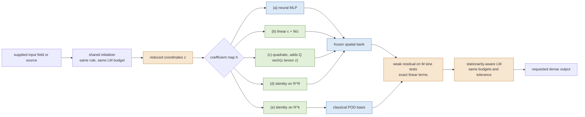

# Does the nonlinear coefficient map earn its place?

A matched head ablation in one frozen spatial bank per PDE. The retained neural coefficient map
is compared against a linear map, a quadratic map, unrestricted bank coefficients and a classical
POD-LSPG reduced model, at matched latent dimension and under the same weak objective, test modes,
time discretization, initializer policy, stopping rule and output contract. **The numbers are
final for the development cohorts and provisional as paper claims**: one training seed, one
checkpoint per PDE, development cases only, and the final cohorts remain sealed.

## What every arm shares

Each arm writes the reduced state as

$$u(z) = B\,h(z),\qquad B\in\mathbb R^{n\times D},\quad h:\mathbb R^{K}\to\mathbb R^{D},$$

and solves the same overdetermined weak residual for the reduced coordinates $z$. Only the pair
$(B,h)$ changes. Writing $\Phi\in\mathbb R^{n\times M}$ for the $M$ lowest discrete sine test
modes ($\Phi^\top\Phi=I$), $\lambda$ for their Laplacian eigenvalues and $A=\Phi^\top B$, the
Burgers arms minimise

$$r_w(z)=\frac{A h(z)-p+\Delta t\,\big(\Phi^\top\mathcal N(Bh(z))+\nu\,\lambda\odot A h(z)\big)}{1+\Delta t\,\nu\lambda},\qquad p=A h(z^{\rm prev}),$$

with $\mathcal N$ the full-order model\'s own sign-upwind advection, and the Poisson arms minimise
$B h(z)-\lambda^{-1}\Phi^\top f$. The linear terms are exact in both.

The arms are

| arm | $B$ | $h$ |
|---|---|---|
| (a) neural | frozen bank $G$ | the retained checkpoint head $h_\theta$ |
| (b) linear | $G$ | $c + Wz$ |
| (c) quadratic | $G$ | $c + Wz + Q\,\mathrm{vech}(zz^\top)$ |
| (d) free bank | $G$ | identity on $\mathbb R^{R}$ |
| (e) POD-LSPG | classical POD basis $V_{k'}$ | identity on $\mathbb R^{k'}$ |

With $G=Q_GR_G$ the thin QR of the bank, $\|G\delta\|_2=\|R_G\delta\|_2$, so least squares in the
whitened coefficient metric is exactly field-metric least squares: arm (b) is therefore the
*optimal* rank-$K$ affine map inside the bank, not an arbitrary one, and arm (c) adds the
established quadratic-manifold correction on the same coordinates with its ridge chosen on a
seeded held-out split. Arm (b) is fitted twice — once to the neural head's own decoder outputs,
so it is asked to cover arm (a)'s exact image, and once to bank-projected truth snapshots, which
is the practitioner's baseline.

## Burgers 2D — the nonlinear performance case

Job `3711424` on `NVIDIA A100 80GB PCIe`, source commit `2718bd320dce1f6411ca9dd8b097fee10ca61419`, JAX 0.10.2, backend `gpu`, float64, matmul precision `highest`, elapsed 1150.6 s.

$$u_t+u(u_x+u_y)=\nu\Delta u \quad\text{on}\quad (0,1)^2,\qquad u|_{\partial\Omega}=0.$$

Frozen bank of $R=512$ coordinate-network features, neural latent dimension $K=16$, time step 0.005, output times [0, 0.05, 0.1, 0.15, 0.2, 0.25], refined reference at 4096 intervals and time step 0.0003125, 6 opened development cases, 3 timed repetitions each with GPU burn-in.

**Fidelity gate.** Run through the generic arm machinery, the neural arm reproduces the consolidated saved Burgers case to 1.633e-14 relative (latent coordinates 9.538e-13) and agrees with the incumbent `accuracy_paths.make_rom` to 0.000e+00. Arm (a) is the retained solver, not a re-implementation.

**Campaign reproduction.** On the same 12 case/mesh combinations this job's `a_neural_eq` reproduces the retained multiresolution campaign's `frozen_stationary` rollout errors to a worst relative difference of 5.025e-13, so the regenerated reference and rebuilt operators are the campaign's own.

### Burgers at 64 intervals per axis

Training snapshots: 128 regenerated trajectories, 3328 states, worst relative Newton residual 9.898e-10. Over those snapshots the frozen bank's own root-mean-square projection floor is 0.060375%.

| arm | $K$ | quad. | $M$ | $m$ | bank proj. % | best-found % | worst same-grid % | worst rollout % | median rollout % | median iters/step | median GPU ms | median host ms | stationary | completed |
|---|---:|---|---:|---:|---:|---:|---:|---:|---:|---:|---:|---:|---|---|
| (a) neural head · dense | 16 | dense | 64 | — | 0.314713 | 2.295950 | 3.956378 | 10.818181 | 4.159954 | 3.0 | 69.150 | 70.758 | yes | yes |
| (a) neural head · eq | 16 | eq | 64 | 256 | 0.314713 | 2.295950 | 5.501845 | 10.856979 | 4.175852 | 3.0 | 48.154 | 49.585 | yes | yes |
| (b) linear, decoder-output fit · dense | 16 | dense | 64 | — | 0.314713 | 56.929165 | 56.929483 | 56.929483 | 30.862310 | 2.0 | 28.363 | 30.012 | yes | yes |
| (b) linear, decoder-output fit · eq | 16 | eq | 64 | 256 | 0.314713 | 56.929165 | 56.929483 | 56.929483 | 30.862310 | 2.0 | 19.944 | 21.643 | yes | yes |
| (b) linear, truth fit · eq | 16 | eq | 64 | 256 | 0.314713 | 60.534282 | 60.534665 | 60.534665 | 37.056515 | 2.0 | 19.911 | 21.474 | yes | yes |
| (c) quadratic · dense | 16 | dense | 64 | — | 0.314713 | 31.786271 | 31.789671 | 31.789671 | 12.135899 | 2.0 | 37.368 | 38.774 | yes | yes |
| (c) quadratic · eq | 16 | eq | 64 | 256 | 0.314713 | 31.786271 | 31.789671 | 31.789671 | 12.132586 | 2.0 | 26.323 | 27.836 | yes | yes |
| (e) POD-LSPG, rank 8 · dense | 8 | dense | 32 | — | 78.000745 | 78.000745 | 78.000753 | 78.000753 | 52.171987 | 1.0 | 13.003 | 14.561 | no | yes |
| (e) POD-LSPG, rank 16 · dense | 16 | dense | 64 | — | 60.735599 | 60.735599 | 60.735669 | 60.735669 | 37.273041 | 2.0 | 20.310 | 21.909 | yes | yes |
| (e) POD-LSPG, rank 16 · eq | 16 | eq | 64 | 256 | 60.735599 | 60.735599 | 60.735669 | 60.735669 | 37.273041 | 2.0 | 16.921 | 18.713 | yes | yes |
| (e) POD-LSPG, rank 32 · dense | 32 | dense | 128 | — | 45.260765 | 45.260765 | 45.262256 | 45.262256 | 17.386483 | 2.0 | 27.033 | 28.332 | no | yes |
| (e) POD-LSPG, rank 64 · dense | 64 | dense | 256 | — | 17.855380 | 17.855380 | 17.861395 | 17.861395 | 8.111531 | 2.0 | 40.769 | 42.293 | no | yes |
| (e) POD-LSPG, rank 128 · dense | 128 | dense | 512 | — | 8.659057 | 8.659057 | 8.663764 | 10.980339 | 6.125787 | 2.0 | 84.590 | 85.791 | no | yes |
| (d) free bank coefficients · dense | 512 | dense | 1024 | — | 0.314713 | 0.314713 | 0.997017 | 11.011289 | 4.136599 | 3.0 | 459.168 | 460.591 | no | yes |
| FOM `fft_loose` (context only) | — | — | — | — | — | — | 2.496790 | 10.391989 | 3.272685 | 1.0 | 12.861 | 14.609 | — | — |
| FOM `fft_tight` (context only) | — | — | — | — | — | — | 0.000000 | 10.989131 | 4.025783 | 2.0 | 64.056 | 65.289 | — | — |

The same-job full-order model at this mesh already carries 10.989131% worst and 4.025783% median error against the refined reference, because the reference metric contains the discretization error of this mesh as well as the reduction error. Wherever an arm's rollout error approaches that value the column is saturated and cannot separate arms; the same-grid column, which measures each arm against the converged full-order solve on its own mesh, is the discriminator there.

**On the same-grid metric no tested POD rank up to $k'=128$ ($8\times$ $K=16$) matches the neural head**: the largest rung reaches 8.663764% against 5.501845%.

**No tested POD rank up to $k'=128$ ($8\times$ the neural latent dimension) matches the neural head.** The largest rung reaches 10.980339% worst rollout error against the neural head's 10.856979%, and its best-found reconstruction alone is already 8.659057% against 2.295950%.

At matched $K=16$ the lowest worst rollout error is 10.818181% from (a) neural head · dense. Every linear and quadratic arm at that dimension is listed above with its own quadrature and stopping status.

Map fitting at this mesh: the rank-16 linear map retains 97.609664% of the decoder-output coefficient energy, leaving a relative projection root-mean-square of 15.460713%; the quadratic correction uses ridge 1e-06 chosen on a 20% held-out split, with held-out relative residual 8.624345%.

### Burgers at 256 intervals per axis

Training snapshots: 128 regenerated trajectories, 3328 states, worst relative Newton residual 9.963e-10. Over those snapshots the frozen bank's own root-mean-square projection floor is 0.103522%.

| arm | $K$ | quad. | $M$ | $m$ | bank proj. % | best-found % | worst same-grid % | worst rollout % | median rollout % | median iters/step | median GPU ms | median host ms | stationary | completed |
|---|---:|---|---:|---:|---:|---:|---:|---:|---:|---:|---:|---:|---|---|
| (a) neural head · dense | 16 | dense | 64 | — | 0.391845 | 2.544663 | 2.562872 | 4.557509 | 2.176854 | 3.0 | 281.664 | 283.791 | yes | yes |
| (a) neural head · eq | 16 | eq | 64 | 256 | 0.391845 | 2.544663 | 2.562872 | 4.554611 | 2.195423 | 3.0 | 47.649 | 49.694 | yes | yes |
| (b) linear, decoder-output fit · dense | 16 | dense | 64 | — | 0.391845 | 56.929572 | 56.929573 | 56.929573 | 31.173457 | 2.0 | 160.880 | 162.973 | yes | yes |
| (b) linear, decoder-output fit · eq | 16 | eq | 64 | 256 | 0.391845 | 56.929572 | 56.929573 | 56.929573 | 31.173457 | 2.0 | 19.948 | 22.163 | yes | yes |
| (b) linear, truth fit · eq | 16 | eq | 64 | 256 | 0.391845 | 61.522624 | 61.522625 | 61.522625 | 36.479523 | 2.0 | 19.665 | 21.568 | yes | yes |
| (c) quadratic · dense | 16 | dense | 64 | — | 0.391845 | 31.827575 | 31.827588 | 31.827588 | 10.735647 | 2.0 | 189.522 | 191.525 | yes | yes |
| (c) quadratic · eq | 16 | eq | 64 | 256 | 0.391845 | 31.827575 | 31.827588 | 31.827588 | 10.737802 | 2.0 | 28.027 | 29.677 | yes | yes |
| (e) POD-LSPG, rank 8 · dense | 8 | dense | 32 | — | 78.514847 | 78.514847 | 78.514847 | 78.514847 | 52.089782 | 1.0 | 22.229 | 24.276 | no | yes |
| (e) POD-LSPG, rank 16 · dense | 16 | dense | 64 | — | 61.650255 | 61.650255 | 61.650255 | 61.650255 | 36.769056 | 2.0 | 45.965 | 47.985 | yes | yes |
| (e) POD-LSPG, rank 16 · eq | 16 | eq | 64 | 256 | 61.650255 | 61.650255 | 61.650255 | 61.650255 | 36.769056 | 2.0 | 16.328 | 18.190 | yes | yes |
| (e) POD-LSPG, rank 32 · dense | 32 | dense | 128 | — | 47.068125 | 47.068125 | 47.068141 | 47.068141 | 17.593548 | 2.0 | 80.720 | 82.750 | yes | yes |
| (e) POD-LSPG, rank 64 · dense | 64 | dense | 256 | — | 19.814736 | 19.814736 | 19.815643 | 19.815643 | 6.715175 | 2.0 | 144.147 | 145.961 | no | yes |
| (e) POD-LSPG, rank 128 · dense | 128 | dense | 512 | — | 10.118905 | 10.118905 | 10.119784 | 10.119784 | 2.774035 | 2.0 | 328.344 | 330.621 | no | yes |
| (d) free bank coefficients · dense | 512 | dense | 1024 | — | 0.391845 | 0.391845 | 0.602667 | 4.042335 | 1.370076 | 3.0 | 2417.608 | 2419.596 | no | yes |
| FOM `fft_loose` (context only) | — | — | — | — | — | — | 3.712655 | 2.473687 | 1.002811 | 1.0 | 15.356 | 17.745 | — | — |
| FOM `fft_tight` (context only) | — | — | — | — | — | — | 0.000000 | 4.026515 | 1.361525 | 2.0 | 88.729 | 90.770 | — | — |

The same-job full-order model at this mesh already carries 4.026515% worst and 1.361525% median error against the refined reference, because the reference metric contains the discretization error of this mesh as well as the reduction error. Wherever an arm's rollout error approaches that value the column is saturated and cannot separate arms; the same-grid column, which measures each arm against the converged full-order solve on its own mesh, is the discriminator there.

**On the same-grid metric no tested POD rank up to $k'=128$ ($8\times$ $K=16$) matches the neural head**: the largest rung reaches 10.119784% against 2.562872%.

**No tested POD rank up to $k'=128$ ($8\times$ the neural latent dimension) matches the neural head.** The largest rung reaches 10.119784% worst rollout error against the neural head's 4.554611%, and its best-found reconstruction alone is already 10.118905% against 2.544663%.

At matched $K=16$ the lowest worst rollout error is 4.554611% from (a) neural head · eq. Every linear and quadratic arm at that dimension is listed above with its own quadrature and stopping status.

Map fitting at this mesh: the rank-16 linear map retains 97.587817% of the decoder-output coefficient energy, leaving a relative projection root-mean-square of 15.531204%; the quadratic correction uses ridge 1e-06 chosen on a 20% held-out split, with held-out relative residual 8.717884%.

## Stopping status, and why the stationarity column is not a quality ranking

Every arm runs the identical stopping rule. The campaign's stationarity test is the normalized
gradient $\|J^\top r\|/(\|J\|\,\|r\|)$, which is scale invariant: it can only fall below its
tolerance once the residual becomes orthogonal to the reduced tangent space. For an arm whose
reduced fit is attainable — a square or nearly square reduced system — the residual instead falls
to round-off while that ratio stays of order one, so the arm exits by the small-step rule with a
*better* fit and a *worse* looking stationarity number. The `completed` column therefore reports
the honest status: no iteration-budget exit and no rejected-step exit anywhere. Both are reported;
neither alone ranks quality.

## Necessary, recorded deviations from the matched contract

1. On Burgers, arm (d) solves $R=512$ coefficients, so its weak system needs $M>R$; it uses $M=1024$ and the exact dense advection, because a nonnegative-least-squares rule with $m=4M$ points is not constructible inside the job budget. Its cost is therefore grid-bound, which is itself part of the compression answer.
2. On Burgers, empirical quadrature is fitted at the matched rank for every $K$-dimensional arm and for POD rank 16. The higher POD rungs run with exact dense advection, which *favours* the POD baseline, so any reported matching rank is a conservative lower bound on the rank a hyper-reduced POD reduced model would need. Paired `eq`/`dense` rows at matched rank isolate the quadrature effect directly.
3. The incumbent unpivoted Gauss-Jordan step solve unrolls one graph level per unknown; arms above 64 unknowns use a pivoted dense solve instead. That is a more accurate step, not a weaker one.
4. POD modes have no continuum representation, so on Burgers they are evaluated at the Gauss initializer points by the same aligned bilinear interpolation the supplied input field already receives in every arm. A classical POD basis is also mesh-bound and is therefore rebuilt at each mesh, whereas the frozen coordinate bank transfers unchanged.
5. The best-found reconstruction error is an exact projection for every affine-manifold arm and a seeded multistart local search for the curved ones, so it is an upper bound exactly where the nonlinear arms would benefit from it being tight.

## What this does and does not establish

It establishes, inside one frozen bank per PDE and at matched latent dimension, how much of the
retained accuracy is attributable to the nonlinearity of the coefficient map rather than to the
bank, the weak objective or the solver, and what classical POD rank buys the same accuracy in the
same job. It does not establish anything about other PDEs, other checkpoints, other training
seeds, the sealed final cohorts, or a speed advantage over a full-order solver: the same-job
full-order rows are context only, and earlier work already records that the retained Burgers
reduced model is slower and less accurate than an efficient same-job full-order solver.

## Glossary

- **arm:** one configuration under test; everything except the named difference is held fixed.
- **bank $B$:** the fixed set of spatial fields the reduced state is built from. For arms (a)-(d) it is the frozen network of the retained checkpoint; for arm (e) it is a classical POD basis computed from training snapshots.
- **coefficient map $h$:** the function turning the few solved coordinates into bank coefficients. This is the object under ablation.
- **$K$ (latent dimension):** how many numbers the online solver actually solves for.
- **$R$:** the number of fields in the frozen bank.
- **$M$ (test modes):** how many smooth functions the PDE residual is averaged against. It must exceed the solved dimension or the objective collapses.
- **$m$ (quadrature points):** how many grid points the empirical quadrature rule uses for the nonlinear advection term instead of the whole grid.
- **EQ / empirical quadrature:** a learned nonnegative weighted subset of grid points that reproduces the full sum; "dense" means the full grid sum was used, with no approximation.
- **POD / POD-LSPG:** proper orthogonal decomposition: the classical linear basis of snapshot data. LSPG means the reduced coordinates minimise the projected residual in least squares, which is what every arm here does.
- **quadratic manifold:** the established extension of POD that adds a quadratic function of the same coordinates to the linear subspace.
- **bank projection error:** the smallest error any coefficients whatsoever could achieve in that arm's bank. A floor, not a solve.
- **best-found reconstruction error:** the smallest error found on that arm's actual manifold when fitting the reference field directly, with no PDE. It separates representation from dynamics. For an arm whose manifold is an affine subspace this is an exact projection; for a curved manifold it is a multistart local search and is therefore an upper bound.
- **rollout / physical error:** the error of the real online solve against the refined reference, largest over output times where there are several.
- **median / worst:** middle value across cases or repetitions / largest case value.
- **iterations:** Levenberg-Marquardt steps; hardware-free, so comparable without any timing assumption.
- **stationary / stationarity:** the normalized weak gradient fell below the shared tolerance. See the methodology note: this is not a quality ranking.
- **completed:** the shared stopping rule terminated everywhere without hitting the iteration budget and without a rejected-step exit.
- **stop reason:** the exit code of the shared solver: 1 residual tolerance, 2 small step, 3 rejected/non-finite, 4 stationary gradient, 0 iteration budget.
- **complete query:** the timed unit: one supplied input on the GPU to the requested dense output fields, including projection or initial fit, the solve and the decode.
- **development / final cohort:** cases available for method selection / cases reserved unopened for later confirmation.
- **FOM:** full-order model: the unreduced PDE solver, shown only as same-job context.

---

Generated by `experiments/head-ablation/reports/generate_head_ablation.py` from Burgers `result.json` (SHA256 `ea07c46144fb6295c2ed0c718d6227c0048f2a6289b00140092b7c429de6af46`) and their audit JSONs. Every number above is read from those files.
