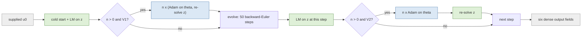
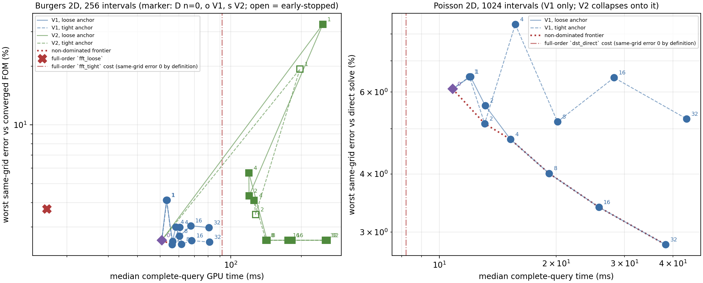

# Per-query head refinement as an inference-time knob

Is refining the frozen head's own weights at query time, anchored to the trained weights, a usable accuracy/cost knob? Two pre-registered variants on two PDEs, at one frozen checkpoint each, against pre-registered acceptance criteria. **Final for the opened development cohorts and provisional as a paper claim**: one checkpoint per PDE, one mesh, one training seed, final cohorts sealed. The predeclared protocol is [DESIGN.md](../DESIGN.md).

Burgers job `3733978` on `NVIDIA A100-PCIE-40GB` (source `4ba4d17f6b65e2d527546f3123591e038eedd5de`, elapsed 1234.1 s, 256 intervals) and Poisson job `3733979` on `NVIDIA A100-PCIE-40GB` (source `4ba4d17f6b65e2d527546f3123591e038eedd5de`, elapsed 427.7 s, 1024 intervals). JAX 0.10.2, backend `gpu`, float64, matmul precision `highest` in both.

## The knob

Everything except the refinement is the head-ablation arm (a) contract. The reduced state is $u(z) = G\,h_\theta(z)$ with the bank $G$ frozen; $\theta$ is the head's own weights, flattened into one vector, and the anchor uses the plain Euclidean metric on that vector, made dimensionless by $\|\theta_0\|_2$:

$$\Omega(\theta) = \frac{\|\theta-\theta_0\|_2^2}{\|\theta_0\|_2^2},\qquad \sqrt{\Omega}\ \text{is the relative drift reported below.}$$

On Burgers $\theta$ has 542,208 entries and $\|\theta_0\|_2 = 209.2359$; on Poisson 37,248 entries and $\|\theta_0\|_2 = 32.8298$.

**V1, initial-only.** Refine once against the supplied initial field, on the same sampled node set the initializer uses, then evolve with the refined head and the unchanged solver:

$$F_1(z,\theta) = \frac{\|\mathrm R\,h_\theta(z)-y\|_2^2}{\|u_0^{(w)}\|_2^2} + \mu\,\Omega(\theta),$$

with $\mathrm R$ the thin-QR factor of the weighted bank at the Gauss nodes and $y = Q^\top u_0^{(w)}$. This attacks the initial-compression loss the head-ablation job recorded as comparable to the whole trajectory error.

**V2, per-step.** After each time step's Levenberg-Marquardt solve converges on $z$, take $n$ Adam steps on $\theta$ against that step's own weak residual, anchored, then re-solve $z$ under the identical rule:

$$F_2(\theta) = \frac{\|r_w(z;\theta,p)\|_2^2}{\|p\|_2^2} + \mu\,\Omega(\theta).$$

On Poisson the query is a **single static solve** with residual exactly $Bh(z)-f_m$, so V2 has no per-step structure to exploit and collapses onto V1. Only V1 is defined and run there; the Poisson refinement objective is that same weak residual against the source-projected data, which is simultaneously the initial fit and the solve.

## Fidelity gates

**(i) Local smoke.** Through the new code path with $\theta$ as a traced runtime operand, $n=0$ reproduces the consolidated saved Burgers case to 1.358e-14 relative (latents 7.192e-13) and the incumbent `accuracy_paths.make_rom` to 1.463e-14, both inside the declared $10^{-12}$. The reconstructed head is bit-identical to the retained head (0.0e+00 maximum absolute difference).

**(ii) In-job Burgers.** `n0` reproduces the head-ablation job's `a_neural_eq` on all 6 cases to a worst relative difference of 1.140e-12 against a declared $10^{-9}$, with 0 of 6 output fields bitwise identical across the two jobs (reference job `3711424` on `NVIDIA A100 80GB PCIe`, this job on `NVIDIA A100-PCIE-40GB`).

**(iii) In-job Poisson.** `n0` reproduces the head-ablation Poisson job's `a_neural` at 1024 intervals on all 12 sources to 4.455e-15, against the declared cross-job tolerance 1e-06, with 0 of 12 fields bitwise identical.

**(iv) Independent audit.** A NumPy-only audit that imports neither driver nor JAX recomputed every reported error from the retained output fields: worst relative difference 5.65e-16 on Burgers and 1.21e-15 on Poisson.

**(v) Re-decode.** The refined weights are saved per arm and case. The same audit rebuilt the head in pure NumPy from those weights and recomputed $G\,h_\theta(z)$ at a fixed 4096-node sample of the frozen bank: 162 Burgers (arm, case) pairs agree with the saved output field to 4.52e-14 and 156 Poisson pairs to 2.96e-15, against a declared 1e-10.

## The step size and the anchor

**Burgers.** lowest V1 data term after n = calibration_n alternating steps at the loose anchor, on one training-family case; ties within calibration_tie_relative broken by the smaller step size; then frozen for both variants, both anchor weights, every n and every evaluation case. On the single training-family calibration case the sweep gave $\alpha=1e-08$ &rarr; 1.324351e-04, $\alpha=3e-08$ &rarr; 1.296202e-04, $\alpha=1e-07$ &rarr; 1.204414e-04, $\alpha=3e-07$ &rarr; 9.953891e-05, $\alpha=1e-06$ &rarr; 6.583827e-05, $\alpha=3e-06$ &rarr; 4.277044e-05, $\alpha=1e-05$ &rarr; 3.737812e-05, $\alpha=3e-05$ &rarr; 1.733294e-04, $\alpha=0.0001$ &rarr; 8.902143e-04, so $\alpha = 1e-05$ was selected and frozen.

Anchor diagnostic on the same calibration case at $n=32$ (diagnostic only; it selects nothing): $\mu=1$ drift 1.721e-04, anchor/data gradient 1.66e-04, $\mu=100$ drift 1.111e-04, anchor/data gradient 1.08e-02, $\mu=1000$ drift 5.871e-05, anchor/data gradient 5.77e-02, $\mu=10000$ drift 3.204e-05, anchor/data gradient 3.40e-01, $\mu=100000$ drift 1.450e-05, anchor/data gradient 1.02e+00, $\mu=1e+06$ drift 6.468e-06, anchor/data gradient 1.92e+00.

**Poisson.** lowest V1 data term after n = calibration_n alternating steps at the loose anchor, on one training-family source; ties within calibration_tie_relative broken by the smaller step size; then frozen for both anchor weights, every n and every evaluation source. On the single training-family calibration case the sweep gave $\alpha=1e-08$ &rarr; 1.260709e-04, $\alpha=3e-08$ &rarr; 1.259235e-04, $\alpha=1e-07$ &rarr; 1.254090e-04, $\alpha=3e-07$ &rarr; 1.239524e-04, $\alpha=1e-06$ &rarr; 1.190091e-04, $\alpha=3e-06$ &rarr; 1.062092e-04, $\alpha=1e-05$ &rarr; 7.510723e-05, $\alpha=3e-05$ &rarr; 4.380413e-05, $\alpha=0.0001$ &rarr; 3.734057e-05, so $\alpha = 0.0001$ was selected and frozen.

**Recorded limitation.** The selected step size sits at the upper edge of the pre-registered grid $[1e-08, 0.0001]$, so the calibration did not bracket an interior optimum: a larger step was never tested. The grid was fixed before the run and was not widened afterwards, so every Poisson number below is for that step size and may understate what refinement could do with a better-chosen one.

Anchor diagnostic on the same calibration case at $n=32$ (diagnostic only; it selects nothing): $\mu=1$ drift 1.939e-03, anchor/data gradient 1.79e-01, $\mu=100$ drift 4.910e-04, anchor/data gradient 1.05e+00, $\mu=1000$ drift 1.376e-04, anchor/data gradient 1.28e+00, $\mu=10000$ drift 9.756e-05, anchor/data gradient 5.22e+00, $\mu=100000$ drift 8.789e-05, anchor/data gradient 3.65e+01, $\mu=1e+06$ drift 8.672e-05, anchor/data gradient 3.51e+02.

## Burgers 2D — the three layers

The primary metric is the same-grid discrepancy against the converged full-order solve on this mesh, because the refined-reference metric also contains this mesh's discretisation error: that full-order solve itself carries 4.0265% worst against the refined reference. Both are reported. The bank projection floor is the best any coefficients at all could do in the frozen bank and is unchanged by refinement.

**How the refined best-found column is computed, and one structural caveat.** For each arm and case it is the worst over the six output times of a seeded multistart fit on that arm's own moved manifold, using the weights that arm actually produced. For V1 those weights are one refined $\theta$ used at every output time. For V2 the weights in force at $t=0$ are $\theta_0$ by construction — no time step has happened yet — so a V2 arm's worst-over-times best-found can never fall below the $n=0$ value even when its later times improve. Read the V2 best-found column as an upper bound pinned at $t=0$, not as evidence that per-step refinement does not move the manifold; the drift column and the per-output-time table show that it does.

| arm | variant | $n$ | $\mu$ | bank floor % | best-found (refined) % | worst same-grid % | median same-grid % | worst reference % | drift | median median gpu ms | latent solves | budget exits | converged |
|---|---|---:|---:|---:|---:|---:|---:|---:|---:|---:|---:|---:|---|
| `n0` | baseline | 0 | — | 0.3918 | 2.5447 | 2.5629 | 1.7013 | 4.5546 | 0.000e+00 | 50.737 | 51 | 0 | yes |
| `n0_dense` | baseline | 0 | — | 0.3918 | 2.5447 | 2.5629 | 1.6957 | 4.5575 | 0.000e+00 | 334.353 | 51 | 0 | yes |
| `v1_n1_muloose` | v1 | 1 | 100 | 0.3918 | 4.1119 | 4.1122 | 2.3613 | 4.8766 | 3.449e-05 | 53.140 | 52 | 0 | yes |
| `v1_n1_mutight` | v1 | 1 | 100000 | 0.3918 | 4.1119 | 4.1122 | 2.3613 | 4.8766 | 3.449e-05 | 53.356 | 52 | 0 | yes |
| `v1_n2_muloose` | v1 | 2 | 100 | 0.3918 | 2.4849 | 2.5259 | 2.3646 | 4.8143 | 4.838e-05 | 56.402 | 53 | 0 | yes |
| `v1_n2_mutight` | v1 | 2 | 100000 | 0.3918 | 2.4485 | 2.4345 | 2.3347 | 4.8098 | 2.753e-05 | 56.158 | 53 | 0 | yes |
| `v1_n4_muloose` | v1 | 4 | 100 | 0.3918 | 2.9939 | 2.9942 | 2.2486 | 4.8254 | 7.003e-05 | 58.185 | 55 | 0 | yes |
| `v1_n4_mutight` | v1 | 4 | 100000 | 0.3918 | 2.9893 | 2.9896 | 2.2296 | 4.8091 | 3.313e-05 | 60.550 | 55 | 0 | yes |
| `v1_n8_muloose` | v1 | 8 | 100 | 0.3918 | 2.4434 | 2.6895 | 2.1893 | 4.8435 | 1.016e-04 | 60.406 | 59 | 0 | yes |
| `v1_n8_mutight` | v1 | 8 | 100000 | 0.3918 | 2.4115 | 2.4452 | 2.1362 | 4.8544 | 3.294e-05 | 61.579 | 59 | 0 | yes |
| `v1_n8_mutight_dense` | v1 | 8 | 100000 | 0.3918 | 2.4115 | 2.3999 | 2.0551 | 4.9099 | 3.294e-05 | 340.328 | 59 | 0 | yes |
| `v1_n16_muloose` | v1 | 16 | 100 | 0.3918 | 2.3784 | 3.0425 | 1.8043 | 4.9352 | 1.363e-04 | 67.408 | 67 | 0 | yes |
| `v1_n16_mutight` | v1 | 16 | 100000 | 0.3918 | 2.2337 | 2.5512 | 1.6429 | 4.8011 | 3.259e-05 | 68.012 | 67 | 0 | yes |
| `v1_n32_muloose` | v1 | 32 | 100 | 0.3918 | 2.4423 | 2.9772 | 1.8840 | 5.0727 | 1.625e-04 | 80.597 | 83 | 0 | yes |
| `v1_n32_mutight` | v1 | 32 | 100000 | 0.3918 | 2.2322 | 2.5100 | 1.7317 | 4.8004 | 2.876e-05 | 81.034 | 83 | 0 | yes |
| `v2_n1_muloose` | v2 | 1 | 100 | 0.3918 | 25.0258 | 32.7477 | 20.9085 | 32.8715 | 4.638e-04 | 246.900 | 101 | 0 | yes |
| `v2_n1_mutight` | v2 | 1 | 100000 | 0.3918 | 18.1563 | 19.3042 | 6.5112 | 19.4051 | 7.275e-05 | 197.057 | 101 | 3 | no |
| `v2_n2_muloose` | v2 | 2 | 100 | 0.3918 | 3.2054 | 4.3275 | 2.6108 | 5.1223 | 7.646e-05 | 119.654 | 101 | 0 | yes |
| `v2_n2_mutight` | v2 | 2 | 100000 | 0.3918 | 2.5447 | 3.4746 | 2.2383 | 4.6979 | 1.251e-05 | 127.632 | 101 | 3 | no |
| `v2_n4_muloose` | v2 | 4 | 100 | 0.3918 | 2.6528 | 5.6716 | 2.3885 | 6.1320 | 6.728e-05 | 119.380 | 101 | 0 | yes |
| `v2_n4_mutight` | v2 | 4 | 100000 | 0.3918 | 2.5447 | 4.1049 | 2.2323 | 4.7375 | 9.069e-06 | 125.731 | 101 | 0 | yes |
| `v2_n8_muloose` | v2 | 8 | 100 | 0.3918 | 2.5447 | 2.5629 | 1.8546 | 4.7029 | 5.745e-05 | 142.808 | 101 | 0 | yes |
| `v2_n8_mutight` | v2 | 8 | 100000 | 0.3918 | 2.5447 | 2.5629 | 1.7319 | 4.6055 | 8.175e-06 | 141.253 | 101 | 0 | yes |
| `v2_n16_muloose` | v2 | 16 | 100 | 0.3918 | 2.5447 | 2.5629 | 1.7006 | 4.5061 | 3.863e-05 | 175.589 | 101 | 0 | yes |
| `v2_n16_mutight` | v2 | 16 | 100000 | 0.3918 | 2.5447 | 2.5629 | 1.6031 | 4.4802 | 7.184e-06 | 182.151 | 101 | 0 | yes |
| `v2_n32_muloose` | v2 | 32 | 100 | 0.3918 | 2.5447 | 2.5629 | 1.6185 | 4.4825 | 2.711e-05 | 253.545 | 101 | 0 | yes |
| `v2_n32_mutight` | v2 | 32 | 100000 | 0.3918 | 2.5447 | 2.5629 | 1.6252 | 4.5217 | 6.917e-06 | 257.879 | 101 | 0 | yes |
| FOM `fft_loose` | — | — | — | — | — | 3.7127 | 1.4783 | 2.4737 | — | 16.370 | — | — | — |
| FOM `fft_tight` | — | — | — | — | — | 0.0000 | 0.0000 | 4.0265 | — | 91.693 | — | — | — |

Full-order rows are **context only**; no speed claim is made against them here. `fft_tight` defines the same-grid metric, so its own same-grid value is zero by construction and it enters the figure as a cost line rather than a point.

## Poisson 2D — the three layers

| arm | variant | $n$ | $\mu$ | bank floor % | best-found (refined) % | worst same-grid % | median same-grid % | worst reference % | drift | median median query ms | latent solves | budget exits | converged |
|---|---|---:|---:|---:|---:|---:|---:|---:|---:|---:|---:|---:|---|
| `n0` | baseline | 0 | — | 2.3148 | 6.0926 | 6.0931 | 1.2421 | 6.0927 | 0.000e+00 | 10.819 | — | 0 | yes |
| `v1_n1_muloose` | v1 | 1 | 100 | 2.3148 | 6.4755 | 6.4759 | 1.0016 | 6.4756 | 5.877e-04 | 12.027 | — | 0 | yes |
| `v1_n1_mutight` | v1 | 1 | 100000 | 2.3148 | 6.4755 | 6.4759 | 1.0016 | 6.4756 | 5.877e-04 | 11.951 | — | 0 | yes |
| `v1_n2_muloose` | v1 | 2 | 100 | 2.3148 | 5.6141 | 5.6145 | 0.8875 | 5.6142 | 7.050e-04 | 13.123 | — | 0 | yes |
| `v1_n2_mutight` | v1 | 2 | 100000 | 2.3148 | 5.1312 | 5.1317 | 1.1008 | 5.1313 | 1.780e-04 | 13.083 | — | 0 | yes |
| `v1_n4_muloose` | v1 | 4 | 100 | 2.3148 | 4.7487 | 4.7492 | 0.7922 | 4.7488 | 8.313e-04 | 15.248 | — | 0 | yes |
| `v1_n4_mutight` | v1 | 4 | 100000 | 2.3148 | 8.3932 | 8.3936 | 1.7948 | 8.3933 | 4.431e-04 | 15.692 | — | 0 | yes |
| `v1_n8_muloose` | v1 | 8 | 100 | 2.3148 | 4.0108 | 4.0113 | 0.7668 | 4.0109 | 1.102e-03 | 19.167 | — | 0 | yes |
| `v1_n8_mutight` | v1 | 8 | 100000 | 2.3148 | 5.1782 | 5.1787 | 1.0616 | 5.1783 | 2.425e-04 | 20.156 | — | 0 | yes |
| `v1_n16_muloose` | v1 | 16 | 100 | 2.3148 | 3.3931 | 3.3936 | 0.7412 | 3.3932 | 1.357e-03 | 25.763 | — | 0 | yes |
| `v1_n16_mutight` | v1 | 16 | 100000 | 2.3148 | 6.4435 | 6.4440 | 1.4857 | 6.4436 | 2.133e-04 | 28.201 | — | 0 | yes |
| `v1_n32_muloose` | v1 | 32 | 100 | 2.3148 | 2.8178 | 2.8183 | 0.7309 | 2.8179 | 1.413e-03 | 38.259 | — | 0 | yes |
| `v1_n32_mutight` | v1 | 32 | 100000 | 2.3148 | 5.2545 | 5.2550 | 1.1506 | 5.2546 | 1.175e-04 | 43.380 | — | 0 | yes |
| FOM `dst_direct` | fom | — | — | — | — | 0.0000 | 0.0000 | 0.0007 | — | 8.205 | — | — | — |

## Is $n$ a knob? The pre-registered acceptance test

All three must hold, per variant: the worst same-grid error non-increasing along $n = 0,1,2,4,8,16,32$; at least three non-dominated points spanning $\ge 2\times$ in cost and $\ge 2\times$ in error; and none of those points early-stopped.

| PDE | variant | anchor | monotone | non-dominated | cost span | error span | none early-stopped | **verdict** |
|---|---|---|---|---:|---:|---:|---|---|
| Burgers | V1 | loose | no | 2 | 1.11x | 1.01x | yes | **NOT a knob** |
| Burgers | V1 | tight | no | 2 | 1.11x | 1.05x | yes | **NOT a knob** |
| Burgers | V2 | loose | no | 2 | 2.81x | 1.00x | yes | **NOT a knob** |
| Burgers | V2 | tight | no | 2 | 2.78x | 1.00x | yes | **NOT a knob** |
| Poisson | V1 | loose | no | 6 | 3.54x | 2.16x | yes | **NOT a knob** |
| Poisson | V1 | tight | no | 2 | 1.21x | 1.19x | yes | **NOT a knob** |

**Reading.** Every ladder fails at least one criterion, so refinement is **not** a usable knob as pre-registered, on either PDE and under either anchor. What each ladder failed on: Burgers V1/loose — monotonicity, fewer than three non-dominated points, cost span below 2x, error span below 2x; Burgers V1/tight — monotonicity, fewer than three non-dominated points, cost span below 2x, error span below 2x; Burgers V2/loose — monotonicity, fewer than three non-dominated points, error span below 2x; Burgers V2/tight — monotonicity, fewer than three non-dominated points, error span below 2x; Poisson V1/loose — monotonicity; Poisson V1/tight — monotonicity, fewer than three non-dominated points, cost span below 2x, error span below 2x.

- Burgers V1 / loose: worst same-grid along $n=[0, 1, 2, 4, 8, 16, 32]$ is [2.5629, 4.1122, 2.5259, 2.9942, 2.6895, 3.0425, 2.9772] percent at [50.737, 53.14, 56.402, 58.185, 60.406, 67.408, 80.597] ms. No arm on this ladder is early-stopped. Monotonicity breaks at $n=1$ (2.5629 &rarr; 4.1122 %), $n=4$ (2.5259 &rarr; 2.9942 %), $n=16$ (2.6895 &rarr; 3.0425 %).
- Burgers V1 / tight: worst same-grid along $n=[0, 1, 2, 4, 8, 16, 32]$ is [2.5629, 4.1122, 2.4345, 2.9896, 2.4452, 2.5512, 2.51] percent at [50.737, 53.356, 56.158, 60.55, 61.579, 68.012, 81.034] ms. No arm on this ladder is early-stopped. Monotonicity breaks at $n=1$ (2.5629 &rarr; 4.1122 %), $n=4$ (2.4345 &rarr; 2.9896 %), $n=16$ (2.4452 &rarr; 2.5512 %).
- Burgers V2 / loose: worst same-grid along $n=[0, 1, 2, 4, 8, 16, 32]$ is [2.5629, 32.7477, 4.3275, 5.6716, 2.5629, 2.5629, 2.5629] percent at [50.737, 246.9, 119.654, 119.38, 142.808, 175.589, 253.545] ms. No arm on this ladder is early-stopped. Monotonicity breaks at $n=1$ (2.5629 &rarr; 32.7477 %), $n=4$ (4.3275 &rarr; 5.6716 %).
- Burgers V2 / tight: worst same-grid along $n=[0, 1, 2, 4, 8, 16, 32]$ is [2.5629, 19.3042, 3.4746, 4.1049, 2.5629, 2.5629, 2.5629] percent at [50.737, 197.057, 127.632, 125.731, 141.253, 182.151, 257.879] ms. Early-stopped arms on this ladder: `v2_n1_mutight`, `v2_n2_mutight`. Monotonicity breaks at $n=1$ (2.5629 &rarr; 19.3042 %), $n=4$ (3.4746 &rarr; 4.1049 %).
- Poisson V1 / loose: worst same-grid along $n=[0, 1, 2, 4, 8, 16, 32]$ is [6.0931, 6.4759, 5.6145, 4.7492, 4.0113, 3.3936, 2.8183] percent at [10.819, 12.027, 13.123, 15.248, 19.167, 25.763, 38.259] ms. No arm on this ladder is early-stopped. Monotonicity breaks at $n=1$ (6.0931 &rarr; 6.4759 %).
- Poisson V1 / tight: worst same-grid along $n=[0, 1, 2, 4, 8, 16, 32]$ is [6.0931, 6.4759, 5.1317, 8.3936, 5.1787, 6.444, 5.255] percent at [10.819, 11.951, 13.083, 15.692, 20.156, 28.201, 43.38] ms. No arm on this ladder is early-stopped. Monotonicity breaks at $n=1$ (6.0931 &rarr; 6.4759 %), $n=4$ (5.1317 &rarr; 8.3936 %), $n=16$ (5.1787 &rarr; 6.4440 %).

### The non-dominated set

**Burgers**, over every reduced arm in the primary quadrature:

| arm | variant | $n$ | $\mu$ | worst same-grid % | median cost (ms) | drift | converged |
|---|---|---:|---:|---:|---:|---:|---|
| `n0` | baseline | 0 | — | 2.5629 | 50.737 | 0.000e+00 | yes |
| `v1_n2_mutight` | v1 | 2 | 100000 | 2.4345 | 56.158 | 2.753e-05 | yes |

**Poisson**, over every reduced arm in the primary quadrature:

| arm | variant | $n$ | $\mu$ | worst same-grid % | median cost (ms) | drift | converged |
|---|---|---:|---:|---:|---:|---:|---|
| `n0` | baseline | 0 | — | 6.0931 | 10.819 | 0.000e+00 | yes |
| `v1_n2_mutight` | v1 | 2 | 100000 | 5.1317 | 13.083 | 1.780e-04 | yes |
| `v1_n4_muloose` | v1 | 4 | 100 | 4.7492 | 15.248 | 8.313e-04 | yes |
| `v1_n8_muloose` | v1 | 8 | 100 | 4.0113 | 19.167 | 1.102e-03 | yes |
| `v1_n16_muloose` | v1 | 16 | 100 | 3.3936 | 25.763 | 1.357e-03 | yes |
| `v1_n32_muloose` | v1 | 32 | 100 | 2.8183 | 38.259 | 1.413e-03 | yes |

## The held-out generalisation risk: error per output time

Refining on the initial field can overfit it and worsen later times. Worst same-grid error over the six development cases, by output time, on Burgers:

| arm | $t=0$ | $t=0.05$ | $t=0.1$ | $t=0.15$ | $t=0.2$ | $t=0.25$ |
|---|---:|---:|---:|---:|---:|---:|
| `n0` | 2.5629 | 1.7496 | 1.7051 | 1.9002 | 1.5602 | 1.3391 |
| `n0_dense` | 2.5629 | 1.4744 | 1.7355 | 1.8890 | 1.5710 | 1.3220 |
| `v1_n1_muloose` | 4.1122 | 3.3644 | 2.7256 | 2.3927 | 1.9045 | 1.6752 |
| `v1_n1_mutight` | 4.1122 | 3.3644 | 2.7256 | 2.3927 | 1.9045 | 1.6752 |
| `v1_n2_muloose` | 2.3415 | 2.5259 | 2.3329 | 2.3877 | 1.8556 | 1.4877 |
| `v1_n2_mutight` | 2.3147 | 2.4345 | 2.2788 | 2.3710 | 1.8526 | 1.4742 |
| `v1_n4_muloose` | 2.9942 | 2.5488 | 2.2673 | 2.3676 | 1.8405 | 1.2834 |
| `v1_n4_mutight` | 2.9896 | 2.3536 | 2.1769 | 2.3267 | 1.8413 | 1.2690 |
| `v1_n8_muloose` | 2.3925 | 2.6895 | 2.1159 | 2.3499 | 1.8755 | 1.1780 |
| `v1_n8_mutight` | 2.3999 | 2.4452 | 2.0927 | 2.3653 | 1.8983 | 1.2406 |
| `v1_n8_mutight_dense` | 2.3999 | 2.2148 | 2.1513 | 2.3986 | 1.9410 | 1.2498 |
| `v1_n16_muloose` | 1.5615 | 3.0425 | 2.4256 | 2.4430 | 1.9436 | 1.1482 |
| `v1_n16_mutight` | 1.6381 | 2.5512 | 1.9869 | 2.2466 | 1.7657 | 1.1584 |
| `v1_n32_muloose` | 1.2146 | 2.9772 | 2.3278 | 2.6511 | 2.2191 | 1.2549 |
| `v1_n32_mutight` | 1.3732 | 2.5100 | 2.0403 | 2.2899 | 1.7734 | 1.2096 |
| `v2_n1_muloose` | 2.5629 | 25.7558 | 32.7477 | 30.8837 | 27.5186 | 30.2737 |
| `v2_n1_mutight` | 2.5629 | 19.3042 | 19.1323 | 18.0675 | 16.9137 | 15.6434 |
| `v2_n2_muloose` | 2.5629 | 4.3275 | 3.3406 | 2.7181 | 2.2733 | 1.9489 |
| `v2_n2_mutight` | 2.5629 | 3.4746 | 2.0401 | 1.9819 | 1.4046 | 0.9995 |
| `v2_n4_muloose` | 2.5629 | 5.6716 | 4.2713 | 2.9930 | 2.3760 | 2.1876 |
| `v2_n4_mutight` | 2.5629 | 4.1049 | 2.0737 | 2.1135 | 1.8127 | 1.7626 |
| `v2_n8_muloose` | 2.5629 | 2.0904 | 2.1620 | 2.2066 | 1.7782 | 1.5910 |
| `v2_n8_mutight` | 2.5629 | 1.6440 | 1.8155 | 1.9614 | 1.6398 | 1.4626 |
| `v2_n16_muloose` | 2.5629 | 1.9235 | 1.8987 | 1.8011 | 1.4015 | 1.1703 |
| `v2_n16_mutight` | 2.5629 | 1.6395 | 1.6065 | 1.7038 | 1.3456 | 0.9932 |
| `v2_n32_muloose` | 2.5629 | 1.9028 | 1.7345 | 1.7190 | 1.3543 | 1.0573 |
| `v2_n32_mutight` | 2.5629 | 1.5870 | 1.6232 | 1.7478 | 1.3193 | 0.9307 |

**Where the worst-over-times error lives.** For the unrefined head the maximum over the six output times is attained at $t=0$ (2.5629% against 1.9002% over the evolved times). Because the $t=0$ output is the model's own compression of the supplied initial field, and V2 has not taken a single refinement step by the time that field is decoded, **no V2 arm can move the worst-over-times number at all** once its evolved times fall below the $t=0$ value: several V2 rows sit at exactly the $n=0$ value for that reason, not because refinement did nothing. V1 does move it, because it refines before $t=0$ is decoded. The per-time table above is the honest reading for V2.

Arms that improve the first evolved output time and worsen the last, relative to `n0` — the signature of overfitting the supplied initial field: `v2_n8_mutight`.

## Plain-language glossary

- **Arm** — one configuration under test; everything except the named difference is held fixed.
- **Bank $G$** — the fixed set of spatial fields the reduced state is built from. It is frozen here: refinement never touches it.
- **Head $h_\theta$** — the small network turning the few solved coordinates into bank coefficients. Its weights $\theta$ are the object being refined.
- **$n$** — the number of gradient steps taken on $\theta$ inside the timed query. $n=0$ is the retained frozen-weight model exactly.
- **V1 / V2** — initial-only refinement (once, against the supplied initial field) and per-step refinement (after every time step, against that step's weak residual).
- **Anchor weight $\mu$** — how hard the refined weights are pulled back towards the trained weights. "Loose" permits drift, "tight" restrains it.
- **Drift** — $\sqrt{\Omega}$, how far the refined weights moved, relative to the size of the trained weights. Zero at $n=0$.
- **Step size $\alpha$** — the Adam learning rate, chosen once on one training-family case and then frozen for every evaluation case.
- **Latent solve** — one run of the Levenberg-Marquardt iteration for the coordinates $z$: the initial fit, each time step, and each refinement re-solve.
- **Exit reason** — why a latent solve stopped: 1 residual below tolerance, 2 step too small to matter, 3 step rejected repeatedly, 4 normalized gradient below tolerance, 0 iteration budget exhausted. Only 1, 2 and 4 count as converged.
- **Early-stopped** — a solve that ran out of iteration budget or kept rejecting steps. Such an arm is a legitimate point on an error/cost curve but is never relabelled stationary or converged.
- **Bank projection floor** — the best any coefficients at all could do in the frozen bank. No head, refined or not, can beat it.
- **Best-found reconstruction (refined)** — the best that arm's own moved manifold can do on the reference field with no PDE involved, using the weights that arm actually produced. It separates representation from dynamics.
- **Same-grid error** — the discrepancy against the converged full-order solve on the same mesh. It isolates reduction error from this mesh's discretisation error, so it is the discriminator.
- **Reference error** — the discrepancy against a much finer refined solve. It contains this mesh's discretisation error as well.
- **Empirical quadrature (eq) / dense** — a learned weighted subset of grid points standing in for the full grid sum, versus the exact full sum.
- **Non-dominated** — a point no other point beats on both cost and error at once. The set of them is the usable frontier.
- **Development / final cohort** — cases usable for method selection / cases kept unopened. No final-cohort case was opened here.
- **Calibration case** — the single training-family case used to choose the step size. It is not an evaluation case.
- **Full-order (FOM) rows** — the conventional solver, shown as context only. No speed claim is made against them in this report.

