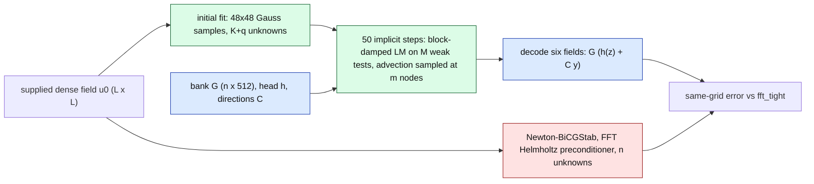

# hires-burgers — frozen Burgers NM-ROM against Newton–BiCGStab above $1024^2$

Same-allocation accuracy and cost of the frozen 2D Burgers NM-ROM (one checkpoint, $K=16$, $R=512$, trained at $256^2$) transferred without retraining to the meshes below. **Status: provisional: hb4k04/hb4kh64 running.** Development cases only Two cohorts: dev6 (the six opened development cases every arm was chosen on) and, where run, hold64 (64 held-out cases, `params_draw(20260916, 64)`, never used to choose anything); the sealed final cohort is unopened. One checkpoint, one seed. Every number is generated from the audit JSONs listed at the end.

Error: $\epsilon_k = \lVert u_k - u^{\mathrm{tight}}_k \rVert_2 / \lVert u_0 \rVert_2$ on the full grid; *evolved* $=\max_{k\ge 1}\epsilon_k$, *all-times* $=\max_{k\ge 0}\epsilon_k$; worst over the six cases. Speedup $S = T_{\mathrm{FOM}} / T_{\mathrm{ROM}}$ from median GPU times of the same job.

## Bar verdict per mesh and cohort

Bar: worst evolved error $\le 1\,\%$ **and** $S \ge 5$. The accurate arm is chosen on dev6 by the pre-registered rule and then looked up unchanged on hold64; the pre-declared accurate rung ($q=256$, $M=1088$) and the fast setting are shown beside it. $S$ is given for the GPU query (dense GPU input to six dense GPU fields) and the complete query (host-inclusive, including the transfer of the six output fields); both come from the same job. "relaxed passing" is the cheapest FOM of that job that converges every step within 0.1 % of `fft_tight` on that cohort (the tight FOM when none does). "coarse" is the fastest coarse-grid FOM whose same-grid error is at most the ROM's (— if none). hold64 jobs time one repetition only. Only the latest dev6 audit of each mesh enters this table; earlier ones keep their own sections below.

| mesh | cohort | job | role | arm | worst evolved % | stalled exits | GPU ms | host ms | $S$ tight GPU / host | $S$ relaxed passing GPU / host | $S$ fastest same-grid FOM at least as accurate, GPU | $S$ coarse GPU / host | bar vs tight | bar vs relaxed passing |
|---|---|---|---|---|---|---|---|---|---|---|---|---|---|---|
| 2048² | dev6 | `hb2k02` | chosen on dev6 | `q256_M544_lat64_g0p001_fast_chol_clip` | 0.865 | 0 / 300 | 124.2 | 187.2 | 6.07 / 4.36 (`lean_tight`) | 0.99 / 0.99 (`lean_nt3e-3_l3e-3_dt005`) | 0.99 (`lean_nt3e-3_l3e-3_dt005`) | 0.63 / 0.75 (`c1024_nt1e-4_dt005`) | MET | not met |
| 2048² | dev6 | `hb2k02` | accurate rung q256/M1088 | `q256_M1088_lat64_g0p001_fast_chol_clip_lamcarry` | 0.598 | 0 / 300 | 130.7 | 192.4 | 5.76 / 4.24 (`lean_tight`) | 0.94 / 0.96 (`lean_nt3e-3_l3e-3_dt005`) | 0.94 (`lean_nt3e-3_l3e-3_dt005`) | 0.60 / 0.73 (`c1024_nt1e-4_dt005`) | MET | not met |
| 2048² | dev6 | `hb2k02` | fast q=0 | `q0_M64_scaled_g0p001_fast_clip_lamcarry` | 2.372 | 0 / 300 | 29.5 | 91.8 | 25.54 / 8.88 (`lean_tight`) | 4.16 / 2.01 (`lean_nt3e-3_l3e-3_dt005`) | 3.25 (`lean_nt1e-3_l1e-3_dt01`) | 1.21 / 1.07 (`c512_nt1e-4_dt005`) | not met | not met |
| 2048² | hold64 | `hb2kh64` | chosen on dev6 | `q256_M544_lat64_g0p001_fast_chol_clip` | not run on this cohort at this mesh | — | — | — | — | — | — | — | — | — |
| 2048² | hold64 | `hb2kh64` | accurate rung q256/M1088 | `q256_M1088_lat64_g0p001_fast_chol_clip_lamcarry` | 1.308 | 0 / 3200 | 114.9 | 177.5 | 6.48 / 4.53 (`lean_tight`) | 6.48 / 4.53 (`lean_tight`) | 1.43 (`lean_nt1e-3_l1e-3_dt005`) | 0.71 / 0.80 (`c1024_nt1e-4_dt005`) | not met | not met |
| 2048² | hold64 | `hb2kh64` | fast q=0 | `q0_M64_scaled_g0p001_fast_clip_lamcarry` | 9.026 | 0 / 3200 | 29.2 | 90.9 | 25.51 / 8.85 (`lean_tight`) | 25.51 / 8.85 (`lean_tight`) | 5.63 (`lean_nt1e-3_l1e-3_dt005`) | 2.79 / 1.56 (`c1024_nt1e-4_dt005`) | not met | not met |
| 4096² | dev6 | `hb4k03` | chosen on dev6 | `q256_M544_lat64_g0p001_fast_chol_clip` | 0.875 | 0 / 300 | 137.8 | 381.0 | 23.64 / 9.18 (`lean_tight`) | 3.79 / 1.99 (`lean_nt3e-3_l3e-3_dt005`) | 3.79 (`lean_nt3e-3_l3e-3_dt005`) | 0.58 / 0.85 (`c1024_nt1e-4_dt005`) | MET | not met |
| 4096² | dev6 | `hb4k03` | accurate rung q256/M1088 | `q256_M1088_lat64_g0p001_fast_chol_clip_lamcarry` | 0.604 | 0 / 300 | 144.7 | 385.0 | 22.52 / 9.09 (`lean_tight`) | 3.61 / 1.97 (`lean_nt3e-3_l3e-3_dt005`) | 3.61 (`lean_nt3e-3_l3e-3_dt005`) | 1.94 / 1.36 (`c2048_nt1e-4_dt005`) | MET | not met |
| 4096² | dev6 | `hb4k03` | fast q=0 | `q0_M64_scaled_g0p001_fast_clip_lamcarry` | 2.416 | 0 / 300 | 43.0 | 285.2 | 75.69 / 12.27 (`lean_tight`) | 12.13 / 2.66 (`lean_nt3e-3_l3e-3_dt005`) | 9.39 (`lean_nt1e-3_l1e-3_dt01`) | 1.85 / 1.13 (`c1024_nt1e-4_dt005`) | not met | not met |

## $2048^2$ — attempt `hb2k01`, job `4054951`, GPU 0: NVIDIA H200 (UUID: GPU-50404ee7-1d50-1d0c-6780-806cf66543b8)

**Cohort: dev6 (six opened development cases) — 6 cases.** Every number in this section is on this cohort only.

Source commit `b66a59bda43a70cc46aef12902e2b6910c5a29f9`; elapsed 5654 s; failed audit gates: none; dropped: none.

### Bar verdict

| setting | arm | worst evolved % | worst all-times % | GPU ms | stalled exits / steps | $S$ vs tight | $S$ vs relaxed passing | $S$ vs fastest tested FOM at least as accurate | bar ($\le$ limit and $S\ge5$) |
|---|---|---|---|---|---|---|---|---|---|
| accurate_1_percent | `q256_M1088_lat64_g0p001_fast_chol` | 0.5980 | 3.2190 | 195.18 | 0 / 300 | 3.85 (`lean_tight`) | 0.84 (`lean_nt1e-3_l1e-3_dt005`) | 0.84 (`lean_nt1e-3_l1e-3_dt005`) | tight: not met; relaxed: not met; matched: not met |
| stretch_half_percent | — | — | — | — | — | — | — | — | **not met**: no certified ROM arm at or below the error limit |
| fast ($q=0$) | `q0_M64_xfer_g0p001_fast` | 2.3822 | — | 25.10 | — | 29.92 | 6.52 | 3.82 | reported beside the accurate rung |

### Every arm

| arm | family | q | M | m | rule | tol | worst evolved % | worst all-times % | GPU ms | host ms | it/step | stalled | retries | ρ_max held-out | ρ_max deployed | certified | vs refined ref % |
|---|---|---|---|---|---|---|---|---|---|---|---|---|---|---|---|---|---|---|
| `c512_nt1e-4_dt005` | fom audited mesh 512 | — | — | — | ntol 0.0001, ltol 1e-06, dt 0.005 | — | 1.2170 | 2.3569 | 35.82 | 98.65 | — | 0 / 300 | — | — | — | — | 2.788 |
| `nt1e-2_dt01` | fom audited mesh 2048 | — | — | — | ntol 0.01, ltol 0.5, dt 0.01 | — | 3.5129 | 3.5129 | 56.74 | 121.35 | — | 0 / 150 | — | — | — | — | 2.788 |
| `c1024_nt1e-4_dt005` | fom audited mesh 1024 | — | — | — | ntol 0.0001, ltol 1e-06, dt 0.005 | — | 0.4173 | 1.2598 | 78.38 | 141.03 | — | 0 / 300 | — | — | — | — | 2.208 |
| `lean_nt1e-3_l1e-3_dt01` | fom lean mesh 2048 | — | — | — | ntol 0.001, ltol 0.001, dt 0.01 | — | 1.6501 | 1.6501 | 95.76 | 159.78 | — | 0 / 150 | — | — | — | — | 3.627 |
| `lean_nt1e-2_l1e-2_dt005` | fom lean mesh 2048 | — | — | — | ntol 0.01, ltol 0.01, dt 0.005 | — | 2.1615 | 2.1615 | 100.43 | 162.95 | — | 0 / 300 | — | — | — | — | 2.479 |
| `nt1e-2_dt005` | fom audited mesh 2048 | — | — | — | ntol 0.01, ltol 0.5, dt 0.005 | — | 4.3716 | 4.3716 | 100.97 | 164.09 | — | 0 / 300 | — | — | — | — | 2.578 |
| `nt1e-3_dt01` | fom audited mesh 2048 | — | — | — | ntol 0.001, ltol 1e-05, dt 0.01 | — | 1.6493 | 1.6493 | 154.02 | 218.55 | — | 0 / 150 | — | — | — | — | 3.626 |
| `lean_nt1e-3_l1e-3_dt005` | fom lean mesh 2048 | — | — | — | ntol 0.001, ltol 0.001, dt 0.005 | — | 0.0543 | 0.0543 | 163.62 | 225.49 | — | 0 / 300 | — | — | — | — | 1.992 |
| `nt1e-4_dt01` | fom audited mesh 2048 | — | — | — | ntol 0.0001, ltol 1e-06, dt 0.01 | — | 1.6507 | 1.6507 | 227.52 | 290.35 | — | 0 / 150 | — | — | — | — | 3.638 |
| `lean_nt1e-3_dt005` | fom lean mesh 2048 | — | — | — | ntol 0.001, ltol 1e-05, dt 0.005 | — | 0.0540 | 0.0540 | 238.13 | 300.91 | — | 0 / 300 | — | — | — | — | 1.993 |
| `nt1e-3_dt005` | fom audited mesh 2048 | — | — | — | ntol 0.001, ltol 1e-05, dt 0.005 | — | 0.0540 | 0.0540 | 243.68 | 319.45 | — | 0 / 300 | — | — | — | — | 1.993 |
| `lean_nt1e-4_dt005` | fom lean mesh 2048 | — | — | — | ntol 0.0001, ltol 1e-06, dt 0.005 | — | 0.0334 | 0.0334 | 280.05 | 342.80 | — | 0 / 300 | — | — | — | — | 1.981 |
| `nt1e-4_dt005` | fom audited mesh 2048 | — | — | — | ntol 0.0001, ltol 1e-06, dt 0.005 | — | 0.0334 | 0.0334 | 284.58 | 351.61 | — | 0 / 300 | — | — | — | — | 1.981 |
| `lean_tight` | fom lean mesh 2048 | — | — | — | ntol 1e-06, ltol 1e-08, dt 0.005 | — | 0.0000 | 0.0000 | 750.81 | 813.76 | — | 0 / 300 | — | — | — | — | 1.995 |
| `fft_tight` | fom audited mesh 2048 | — | — | — | ntol 1e-06, ltol 1e-08, dt 0.005 | — | 0.0000 | 0.0000 | 758.48 | 819.93 | — | 0 / 300 | — | — | — | — | 1.995 |
| `q0_M64_xfer_g0p001_fast` | rom | 0 | 64 | 933 | xfer | 0.001 | 2.3822 | 4.1823 | 25.10 | 87.85 | 2.0 | 0 / 300 | 0 | 0.0328 | 0.0337 | True | 3.410 |
| `q0_M64_scaled_g0p001_fast` | rom | 0 | 64 | 1024 | scaled | 0.001 | 2.3728 | 4.1823 | 26.29 | 89.51 | 2.0 | 0 / 300 | 0 | 0.0404 | 0.0424 | True | 3.395 |
| `q0_M64_xfer_g1em06_fast` | rom | 0 | 64 | 933 | xfer | 1e-06 | 2.3809 | 4.1823 | 29.49 | 93.07 | 3.0 | 0 / 300 | 0 | 0.0328 | 0.0337 | True | 3.409 |
| `q0_M64_scaled_g1em06_fast` | rom | 0 | 64 | 1024 | scaled | 1e-06 | 2.3714 | 4.1823 | 30.02 | 93.17 | 3.0 | 0 / 300 | 0 | 0.0404 | 0.0424 | True | 3.394 |
| `q0_M64_xfer_g0p001_base` | rom | 0 | 64 | 933 | xfer | 0.001 | 2.3822 | 4.1823 | 32.04 | 95.25 | 2.0 | 0 / 300 | 0 | 0.0328 | — | None | 3.410 |
| `q0_M64_xfer_g1em06_base` | rom | 0 | 64 | 933 | xfer | 1e-06 | 2.3809 | 4.1823 | 39.76 | 103.29 | 3.0 | 0 / 300 | 0 | 0.0328 | — | None | 3.409 |
| `q128_M576_xfer_g0p001_fast` | rom | 128 | 576 | 2151 | xfer | 0.001 | 1.0750 | 3.6604 | 115.21 | 179.76 | 2.0 | 0 / 300 | 163 | 0.1315 | 0.1393 | False | 2.343 |
| `q128_M576_scaled_g0p001_fast` | rom | 128 | 576 | 2319 | scaled | 0.001 | 1.0750 | 3.6604 | 117.68 | 181.46 | 2.0 | 0 / 300 | 165 | 0.0988 | 0.1065 | True | 2.345 |
| `q256_M1088_badfit_g0p001_fast_chol` | rom | 256 | 1088 | 1678 | badfit | 0.001 | 0.9770 | 3.2190 | 129.08 | 192.30 | 2.5 | 0 / 300 | 308 | 4.2252 | 4.3293 | False | 2.144 |
| `q128_M576_lat64_g0p001_fast` | rom | 128 | 576 | 3969 | lat64 | 0.001 | 1.0748 | 3.6604 | 133.90 | 198.21 | 2.0 | 0 / 300 | 164 | 0.0698 | 0.0719 | True | 2.345 |
| `q128_M576_xfer_g0p001_base` | rom | 128 | 576 | 2151 | xfer | 0.001 | 1.0750 | 3.6604 | 133.92 | 197.98 | 2.0 | 0 / 300 | 0 | 0.1315 | — | None | 2.343 |
| `q256_M1088_bad0_g0p001_fast_chol` | rom | 256 | 1088 | 2048 | bad0 (control) | 0.001 | 1.0359 | 3.2190 | 138.60 | 201.73 | 3.0 | 0 / 300 | 349 | 0.4840 | 0.4841 | False | 2.105 |
| `q128_M576_xfer_g1em06_fast` | rom | 128 | 576 | 2151 | xfer | 1e-06 | 1.0750 | 3.6604 | 145.17 | 208.45 | 3.0 | 0 / 300 | 164 | 0.1315 | 0.1393 | False | 2.344 |
| `q256_M1088_scaled_g0p001_fast_chol` | rom | 256 | 1088 | 2560 | scaled | 0.001 | 0.5915 | 3.2190 | 147.94 | 209.82 | 3.0 | 0 / 300 | 399 | 0.2549 | 0.2927 | False | 2.111 |
| `q128_M576_scaled_g1em06_fast` | rom | 128 | 576 | 2319 | scaled | 1e-06 | 1.0750 | 3.6604 | 149.15 | 212.68 | 3.0 | 0 / 300 | 165 | 0.0988 | 0.1065 | True | 2.346 |
| `q256_M1088_xfer_g0p001_fast_chol` | rom | 256 | 1088 | 2470 | xfer | 0.001 | 0.5886 | 3.2190 | 161.47 | 223.98 | 3.0 | 0 / 300 | 378 | 0.2052 | 0.2192 | False | 2.111 |
| `q128_M576_xfer_g1em06_base` | rom | 128 | 576 | 2151 | xfer | 1e-06 | 1.0750 | 3.6604 | 168.09 | 231.71 | 3.0 | 0 / 300 | 0 | 0.1315 | — | None | 2.344 |
| `q128_M576_lat64_g1em06_fast` | rom | 128 | 576 | 3969 | lat64 | 1e-06 | 1.0748 | 3.6604 | 170.46 | 233.53 | 3.0 | 0 / 300 | 166 | 0.0698 | 0.0719 | True | 2.345 |
| `q256_M1088_lat64_g0p001_fast_chol` | rom | 256 | 1088 | 3969 | lat64 | 0.001 | 0.5980 | 3.2190 | 195.18 | 257.66 | 3.0 | 0 / 300 | 378 | 0.1000 | 0.0980 | True | 2.112 |
| `q256_M1088_bad0_g1em06_fast_chol` | rom | 256 | 1088 | 2048 | bad0 (control) | 1e-06 | 1.0476 | 3.2190 | 211.38 | 274.59 | 5.0 | 0 / 300 | 640 | 0.4840 | 0.4841 | False | 2.105 |
| `q256_M1088_badfit_g0p001_fast` | rom | 256 | 1088 | 1678 | badfit | 0.001 | 0.9770 | 3.2190 | 223.33 | 284.72 | 2.5 | 0 / 300 | 308 | 4.2252 | 4.3293 | False | 2.144 |
| `q256_M1088_scaled_g1em06_fast_chol` | rom | 256 | 1088 | 2560 | scaled | 1e-06 | 0.5915 | 3.2190 | 225.03 | 291.42 | 4.8 | 0 / 300 | 757 | 0.2549 | 0.2927 | False | 2.111 |
| `q256_M1088_badfit_g1em06_fast_chol` | rom | 256 | 1088 | 1678 | badfit | 1e-06 | 0.9796 | 3.2190 | 228.56 | 291.91 | 4.5 | 0 / 300 | 801 | 4.2252 | 4.3293 | False | 2.145 |
| `q256_M1088_xfer_g1em06_fast_chol` | rom | 256 | 1088 | 2470 | xfer | 1e-06 | 0.5886 | 3.2190 | 244.92 | 307.67 | 4.8 | 0 / 300 | 780 | 0.2052 | 0.2192 | False | 2.111 |
| `q256_M1088_bad0_g0p001_fast` | rom | 256 | 1088 | 2048 | bad0 (control) | 0.001 | 1.0359 | 3.2190 | 245.18 | 308.09 | 3.0 | 0 / 300 | 349 | 0.4840 | 0.4841 | False | 2.105 |
| `q256_M1088_scaled_g0p001_fast` | rom | 256 | 1088 | 2560 | scaled | 0.001 | 0.5915 | 3.2190 | 255.58 | 347.74 | 3.0 | 0 / 300 | 399 | 0.2549 | 0.2927 | False | 2.111 |
| `q256_M1088_xfer_g0p001_fast` | rom | 256 | 1088 | 2470 | xfer | 0.001 | 0.5886 | 3.2190 | 270.03 | 330.88 | 3.0 | 0 / 300 | 378 | 0.2052 | 0.2192 | False | 2.111 |
| `q256_M1088_lat64_g1em06_fast_chol` | rom | 256 | 1088 | 3969 | lat64 | 1e-06 | 0.5979 | 3.2190 | 295.21 | 359.20 | 4.8 | 0 / 300 | 797 | 0.1000 | 0.0980 | True | 2.112 |
| `q256_M1088_lat64_g0p001_fast` | rom | 256 | 1088 | 3969 | lat64 | 0.001 | 0.5980 | 3.2190 | 304.07 | 367.25 | 3.0 | 0 / 300 | 378 | 0.1000 | 0.0980 | True | 2.112 |
| `q256_M1088_xfer_g0p001_base` | rom | 256 | 1088 | 2470 | xfer | 0.001 | 0.5886 | 3.2190 | 310.57 | 372.85 | 3.0 | 0 / 300 | 0 | 0.2052 | — | None | 2.111 |
| `q256_M544_xfer_g0p001_fast` | rom | 256 | 544 | 2395 | xfer | 0.001 | 0.8637 | 3.2190 | 314.51 | 482.08 | 3.0 | 0 / 300 | 489 | 0.0749 | 0.0808 | True | 2.198 |
| `q256_M544_scaled_g0p001_fast` | rom | 256 | 544 | 2560 | scaled | 0.001 | 0.8819 | 3.2190 | 317.71 | 379.78 | 3.0 | 0 / 300 | 461 | 0.1470 | 0.1668 | False | 2.199 |
| `q256_M544_lat64_g0p001_fast` | rom | 256 | 544 | 3969 | lat64 | 0.001 | 0.8896 | 3.2190 | 332.09 | 395.55 | 3.0 | 0 / 300 | 468 | 0.0634 | 0.0624 | True | 2.198 |
| `q256_M544_xfer_g0p001_base` | rom | 256 | 544 | 2395 | xfer | 0.001 | 0.8637 | 3.2190 | 352.31 | 414.76 | 3.0 | 0 / 300 | 0 | 0.0749 | — | None | 2.198 |
| `q256_M1088_bad0_g1em06_fast` | rom | 256 | 1088 | 2048 | bad0 (control) | 1e-06 | 1.0476 | 3.2190 | 393.87 | 455.90 | 5.0 | 0 / 300 | 640 | 0.4840 | 0.4841 | False | 2.105 |
| `q256_M1088_scaled_g1em06_fast` | rom | 256 | 1088 | 2560 | scaled | 1e-06 | 0.5915 | 3.2190 | 404.33 | 471.84 | 4.8 | 0 / 300 | 757 | 0.2549 | 0.2927 | False | 2.111 |
| `q256_M1088_badfit_g1em06_fast` | rom | 256 | 1088 | 1678 | badfit | 1e-06 | 0.9796 | 3.2190 | 417.35 | 483.04 | 4.5 | 0 / 300 | 801 | 4.2252 | 4.3293 | False | 2.145 |
| `q256_M1088_xfer_g1em06_fast` | rom | 256 | 1088 | 2470 | xfer | 1e-06 | 0.5886 | 3.2190 | 426.33 | 489.93 | 4.8 | 0 / 300 | 780 | 0.2052 | 0.2192 | False | 2.111 |
| `q256_M1088_lat64_g1em06_fast` | rom | 256 | 1088 | 3969 | lat64 | 1e-06 | 0.5979 | 3.2190 | 478.36 | 541.46 | 4.8 | 0 / 300 | 797 | 0.1000 | 0.0980 | True | 2.112 |
| `q256_M1088_xfer_g1em06_base` | rom | 256 | 1088 | 2470 | xfer | 1e-06 | 0.5886 | 3.2190 | 489.18 | 552.88 | 4.8 | 0 / 300 | 0 | 0.2052 | — | None | 2.111 |
| `q256_M544_xfer_g1em06_fast` | rom | 256 | 544 | 2395 | xfer | 1e-06 | 0.8608 | 3.2190 | 541.54 | 604.11 | 4.5 | 0 / 300 | 922 | 0.0749 | 0.0808 | True | 2.197 |
| `q256_M544_scaled_g1em06_fast` | rom | 256 | 544 | 2560 | scaled | 1e-06 | 0.8639 | 3.2190 | 543.25 | 606.32 | 4.5 | 0 / 300 | 934 | 0.1470 | 0.1668 | False | 2.198 |
| `q256_M544_lat64_g1em06_fast` | rom | 256 | 544 | 3969 | lat64 | 1e-06 | 0.8653 | 3.2190 | 586.82 | 648.02 | 4.5 | 0 / 300 | 911 | 0.0634 | 0.0624 | True | 2.197 |
| `q256_M544_xfer_g1em06_base` | rom | 256 | 544 | 2395 | xfer | 1e-06 | 0.8608 | 3.2190 | 602.57 | 663.65 | 4.5 | 0 / 300 | 0 | 0.0749 | — | None | 2.197 |

Same-grid truth (`fft_tight`) against the refined reference, worst evolved: 1.995 % (the discretisation error of this mesh; no reduced arm can be more physical than this).

### Dense truth (exact advection, same solver, tolerance 1e-6) and the deployed arms against it

| rung | case | worst evolved % | iterations | seconds | deployed arm − dense (relative, per arm) |
|---|---|---|---|---|---|
| `q0_M64_dense` | 0 | 0.8010 | 191 | 9.1 | `q0_M64_scaled_g0p001_fast` 1.01e-04; `q0_M64_scaled_g1em06_fast` 9.37e-05; `q0_M64_xfer_g0p001_base` 1.24e-04; `q0_M64_xfer_g0p001_fast` 1.24e-04; `q0_M64_xfer_g1em06_base` 1.19e-04; `q0_M64_xfer_g1em06_fast` 1.19e-04 |
| `q0_M64_dense` | 1 | 0.4362 | 236 | 5.8 | `q0_M64_scaled_g0p001_fast` 2.00e-05; `q0_M64_scaled_g1em06_fast` 1.95e-05; `q0_M64_xfer_g0p001_base` 2.83e-05; `q0_M64_xfer_g0p001_fast` 2.83e-05; `q0_M64_xfer_g1em06_base` 2.75e-05; `q0_M64_xfer_g1em06_fast` 2.75e-05 |
| `q0_M64_dense` | 2 | 2.3717 | 197 | 5.0 | `q0_M64_scaled_g0p001_fast` 2.04e-04; `q0_M64_scaled_g1em06_fast` 1.88e-04; `q0_M64_xfer_g0p001_base` 3.89e-04; `q0_M64_xfer_g0p001_fast` 3.89e-04; `q0_M64_xfer_g1em06_base` 3.79e-04; `q0_M64_xfer_g1em06_fast` 3.79e-04 |
| `q0_M64_dense` | 3 | 1.6334 | 228 | 5.7 | `q0_M64_scaled_g0p001_fast` 4.34e-04; `q0_M64_scaled_g1em06_fast` 4.45e-04; `q0_M64_xfer_g0p001_base` 1.11e-03; `q0_M64_xfer_g0p001_fast` 1.11e-03; `q0_M64_xfer_g1em06_base` 1.11e-03; `q0_M64_xfer_g1em06_fast` 1.11e-03 |
| `q0_M64_dense` | 4 | 1.2818 | 148 | 4.1 | `q0_M64_scaled_g0p001_fast` 1.32e-04; `q0_M64_scaled_g1em06_fast` 1.32e-04; `q0_M64_xfer_g0p001_base` 1.74e-04; `q0_M64_xfer_g0p001_fast` 1.74e-04; `q0_M64_xfer_g1em06_base` 1.74e-04; `q0_M64_xfer_g1em06_fast` 1.74e-04 |
| `q0_M64_dense` | 5 | 0.8107 | 186 | 4.8 | `q0_M64_scaled_g0p001_fast` 2.55e-04; `q0_M64_scaled_g1em06_fast` 2.50e-04; `q0_M64_xfer_g0p001_base` 2.70e-04; `q0_M64_xfer_g0p001_fast` 2.70e-04; `q0_M64_xfer_g1em06_base` 2.66e-04; `q0_M64_xfer_g1em06_fast` 2.66e-04 |
| `q128_M576_dense` | 0 | 0.2533 | 364 | 55.8 | `q128_M576_lat64_g0p001_fast` 5.43e-05; `q128_M576_lat64_g1em06_fast` 2.58e-05; `q128_M576_scaled_g0p001_fast` 5.24e-05; `q128_M576_scaled_g1em06_fast` 2.76e-05; `q128_M576_xfer_g0p001_base` 5.31e-05; `q128_M576_xfer_g0p001_fast` 5.31e-05; `q128_M576_xfer_g1em06_base` 2.96e-05; `q128_M576_xfer_g1em06_fast` 2.96e-05 |
| `q128_M576_dense` | 1 | 0.2212 | 295 | 42.0 | `q128_M576_lat64_g0p001_fast` 1.02e-05; `q128_M576_lat64_g1em06_fast` 9.77e-07; `q128_M576_scaled_g0p001_fast` 2.01e-05; `q128_M576_scaled_g1em06_fast` 1.01e-05; `q128_M576_xfer_g0p001_base` 1.62e-05; `q128_M576_xfer_g0p001_fast` 1.62e-05; `q128_M576_xfer_g1em06_base` 6.91e-06; `q128_M576_xfer_g1em06_fast` 6.91e-06 |
| `q128_M576_dense` | 2 | 1.0747 | 201 | 30.7 | `q128_M576_lat64_g0p001_fast` 3.35e-05; `q128_M576_lat64_g1em06_fast` 7.03e-06; `q128_M576_scaled_g0p001_fast` 6.25e-05; `q128_M576_scaled_g1em06_fast` 4.53e-05; `q128_M576_xfer_g0p001_base` 9.61e-05; `q128_M576_xfer_g0p001_fast` 9.61e-05; `q128_M576_xfer_g1em06_base` 8.24e-05; `q128_M576_xfer_g1em06_fast` 8.24e-05 |
| `q128_M576_dense` | 3 | 0.8227 | 303 | 43.0 | `q128_M576_lat64_g0p001_fast` 2.39e-04; `q128_M576_lat64_g1em06_fast` 2.31e-04; `q128_M576_scaled_g0p001_fast` 1.56e-04; `q128_M576_scaled_g1em06_fast` 1.48e-04; `q128_M576_xfer_g0p001_base` 2.16e-04; `q128_M576_xfer_g0p001_fast` 2.16e-04; `q128_M576_xfer_g1em06_base` 2.17e-04; `q128_M576_xfer_g1em06_fast` 2.17e-04 |
| `q128_M576_dense` | 4 | 0.3675 | 137 | 22.9 | `q128_M576_lat64_g0p001_fast` 1.49e-05; `q128_M576_lat64_g1em06_fast` 1.40e-05; `q128_M576_scaled_g0p001_fast` 2.16e-05; `q128_M576_scaled_g1em06_fast` 1.91e-05; `q128_M576_xfer_g0p001_base` 3.70e-05; `q128_M576_xfer_g0p001_fast` 3.70e-05; `q128_M576_xfer_g1em06_base` 3.64e-05; `q128_M576_xfer_g1em06_fast` 3.64e-05 |
| `q128_M576_dense` | 5 | 0.4765 | 224 | 33.4 | `q128_M576_lat64_g0p001_fast` 1.11e-05; `q128_M576_lat64_g1em06_fast` 9.13e-06; `q128_M576_scaled_g0p001_fast` 2.03e-05; `q128_M576_scaled_g1em06_fast` 1.90e-05; `q128_M576_xfer_g0p001_base` 2.85e-05; `q128_M576_xfer_g0p001_fast` 2.85e-05; `q128_M576_xfer_g1em06_base` 2.53e-05; `q128_M576_xfer_g1em06_fast` 2.53e-05 |
| `q256_M544_dense` | 0 | 0.1204 | 1684 | 318.0 | `q256_M544_lat64_g0p001_fast` 2.98e-04; `q256_M544_lat64_g1em06_fast` 2.33e-05; `q256_M544_scaled_g0p001_fast` 8.30e-05; `q256_M544_scaled_g1em06_fast` 2.65e-05; `q256_M544_xfer_g0p001_base` 2.94e-04; `q256_M544_xfer_g0p001_fast` 2.94e-04; `q256_M544_xfer_g1em06_base` 2.41e-05; `q256_M544_xfer_g1em06_fast` 2.41e-05 |
| `q256_M544_dense` | 1 | 0.1368 | 494 | 98.0 | `q256_M544_lat64_g0p001_fast` 7.19e-06; `q256_M544_lat64_g1em06_fast` 1.36e-06; `q256_M544_scaled_g0p001_fast` 1.80e-05; `q256_M544_scaled_g1em06_fast` 1.38e-05; `q256_M544_xfer_g0p001_base` 1.78e-05; `q256_M544_xfer_g0p001_fast` 1.78e-05; `q256_M544_xfer_g1em06_base` 1.31e-05; `q256_M544_xfer_g1em06_fast` 1.31e-05 |
| `q256_M544_dense` | 2 | 0.8655 | 843 | 160.8 | `q256_M544_lat64_g0p001_fast` 1.51e-03; `q256_M544_lat64_g1em06_fast` 3.66e-05; `q256_M544_scaled_g0p001_fast` 1.48e-03; `q256_M544_scaled_g1em06_fast` 1.29e-04; `q256_M544_xfer_g0p001_base` 1.40e-03; `q256_M544_xfer_g0p001_fast` 1.40e-03; `q256_M544_xfer_g1em06_base` 6.40e-04; `q256_M544_xfer_g1em06_fast` 6.40e-04 |
| `q256_M544_dense` | 3 | 0.4621 | 775 | 148.6 | `q256_M544_lat64_g0p001_fast` 4.44e-04; `q256_M544_lat64_g1em06_fast` 2.28e-04; `q256_M544_scaled_g0p001_fast` 3.78e-04; `q256_M544_scaled_g1em06_fast` 1.93e-04; `q256_M544_xfer_g0p001_base` 3.87e-04; `q256_M544_xfer_g0p001_fast` 3.87e-04; `q256_M544_xfer_g1em06_base` 2.03e-04; `q256_M544_xfer_g1em06_fast` 2.03e-04 |
| `q256_M544_dense` | 4 | 0.2401 | 207 | 46.3 | `q256_M544_lat64_g0p001_fast` 1.64e-05; `q256_M544_lat64_g1em06_fast` 1.64e-05; `q256_M544_scaled_g0p001_fast` 4.21e-05; `q256_M544_scaled_g1em06_fast` 4.16e-05; `q256_M544_xfer_g0p001_base` 4.40e-05; `q256_M544_xfer_g0p001_fast` 4.40e-05; `q256_M544_xfer_g1em06_base` 4.38e-05; `q256_M544_xfer_g1em06_fast` 4.38e-05 |
| `q256_M544_dense` | 5 | 0.2805 | 284 | 60.2 | `q256_M544_lat64_g0p001_fast` 1.85e-05; `q256_M544_lat64_g1em06_fast` 6.52e-06; `q256_M544_scaled_g0p001_fast` 3.70e-05; `q256_M544_scaled_g1em06_fast` 2.79e-05; `q256_M544_xfer_g0p001_base` 3.27e-05; `q256_M544_xfer_g0p001_fast` 3.27e-05; `q256_M544_xfer_g1em06_base` 2.78e-05; `q256_M544_xfer_g1em06_fast` 2.78e-05 |
| `q256_M1088_dense` | 0 | 0.0747 | 1588 | 347.3 | `q256_M1088_bad0_g0p001_fast` 1.04e-02; `q256_M1088_bad0_g0p001_fast_chol` 1.04e-02; `q256_M1088_bad0_g1em06_fast` 1.04e-02; `q256_M1088_bad0_g1em06_fast_chol` 1.04e-02; `q256_M1088_badfit_g0p001_fast` 9.31e-03; `q256_M1088_badfit_g0p001_fast_chol` 9.31e-03; `q256_M1088_badfit_g1em06_fast` 9.34e-03; `q256_M1088_badfit_g1em06_fast_chol` 9.34e-03; `q256_M1088_lat64_g0p001_fast` 7.46e-05; `q256_M1088_lat64_g0p001_fast_chol` 7.46e-05; `q256_M1088_lat64_g1em06_fast` 1.90e-05; `q256_M1088_lat64_g1em06_fast_chol` 1.90e-05; `q256_M1088_scaled_g0p001_fast` 1.38e-04; `q256_M1088_scaled_g0p001_fast_chol` 1.38e-04; `q256_M1088_scaled_g1em06_fast` 1.89e-05; `q256_M1088_scaled_g1em06_fast_chol` 1.89e-05; `q256_M1088_xfer_g0p001_base` 7.87e-05; `q256_M1088_xfer_g0p001_fast` 7.87e-05; `q256_M1088_xfer_g0p001_fast_chol` 7.87e-05; `q256_M1088_xfer_g1em06_base` 1.64e-05; `q256_M1088_xfer_g1em06_fast` 1.64e-05; `q256_M1088_xfer_g1em06_fast_chol` 1.64e-05 |
| `q256_M1088_dense` | 1 | 0.0704 | 498 | 114.9 | `q256_M1088_bad0_g0p001_fast` 8.67e-06; `q256_M1088_bad0_g0p001_fast_chol` 8.67e-06; `q256_M1088_bad0_g1em06_fast` 7.42e-06; `q256_M1088_bad0_g1em06_fast_chol` 7.42e-06; `q256_M1088_badfit_g0p001_fast` 1.65e-05; `q256_M1088_badfit_g0p001_fast_chol` 1.65e-05; `q256_M1088_badfit_g1em06_fast` 1.55e-05; `q256_M1088_badfit_g1em06_fast_chol` 1.55e-05; `q256_M1088_lat64_g0p001_fast` 8.40e-06; `q256_M1088_lat64_g0p001_fast_chol` 8.40e-06; `q256_M1088_lat64_g1em06_fast` 7.47e-07; `q256_M1088_lat64_g1em06_fast_chol` 7.47e-07; `q256_M1088_scaled_g0p001_fast` 2.07e-05; `q256_M1088_scaled_g0p001_fast_chol` 2.07e-05; `q256_M1088_scaled_g1em06_fast` 1.48e-05; `q256_M1088_scaled_g1em06_fast_chol` 1.48e-05; `q256_M1088_xfer_g0p001_base` 2.23e-05; `q256_M1088_xfer_g0p001_fast` 2.23e-05; `q256_M1088_xfer_g0p001_fast_chol` 2.23e-05; `q256_M1088_xfer_g1em06_base` 1.59e-05; `q256_M1088_xfer_g1em06_fast` 1.59e-05; `q256_M1088_xfer_g1em06_fast_chol` 1.59e-05 |
| `q256_M1088_dense` | 2 | 0.5985 | 450 | 104.8 | `q256_M1088_bad0_g0p001_fast` 5.19e-04; `q256_M1088_bad0_g0p001_fast_chol` 5.19e-04; `q256_M1088_bad0_g1em06_fast` 2.97e-04; `q256_M1088_bad0_g1em06_fast_chol` 2.97e-04; `q256_M1088_badfit_g0p001_fast` 2.09e-03; `q256_M1088_badfit_g0p001_fast_chol` 2.09e-03; `q256_M1088_badfit_g1em06_fast` 1.98e-03; `q256_M1088_badfit_g1em06_fast_chol` 1.98e-03; `q256_M1088_lat64_g0p001_fast` 4.53e-04; `q256_M1088_lat64_g0p001_fast_chol` 4.53e-04; `q256_M1088_lat64_g1em06_fast` 1.20e-05; `q256_M1088_lat64_g1em06_fast_chol` 1.20e-05; `q256_M1088_scaled_g0p001_fast` 4.75e-04; `q256_M1088_scaled_g0p001_fast_chol` 4.75e-04; `q256_M1088_scaled_g1em06_fast` 1.56e-04; `q256_M1088_scaled_g1em06_fast_chol` 1.56e-04; `q256_M1088_xfer_g0p001_base` 5.29e-04; `q256_M1088_xfer_g0p001_fast` 5.29e-04; `q256_M1088_xfer_g0p001_fast_chol` 5.29e-04; `q256_M1088_xfer_g1em06_base` 2.15e-04; `q256_M1088_xfer_g1em06_fast` 2.15e-04; `q256_M1088_xfer_g1em06_fast_chol` 2.15e-04 |
| `q256_M1088_dense` | 3 | 0.3360 | 908 | 200.6 | `q256_M1088_bad0_g0p001_fast` 5.48e-03; `q256_M1088_bad0_g0p001_fast_chol` 5.48e-03; `q256_M1088_bad0_g1em06_fast` 5.52e-03; `q256_M1088_bad0_g1em06_fast_chol` 5.52e-03; `q256_M1088_badfit_g0p001_fast` 5.20e-03; `q256_M1088_badfit_g0p001_fast_chol` 5.20e-03; `q256_M1088_badfit_g1em06_fast` 5.19e-03; `q256_M1088_badfit_g1em06_fast_chol` 5.19e-03; `q256_M1088_lat64_g0p001_fast` 2.11e-04; `q256_M1088_lat64_g0p001_fast_chol` 2.11e-04; `q256_M1088_lat64_g1em06_fast` 1.82e-04; `q256_M1088_lat64_g1em06_fast_chol` 1.82e-04; `q256_M1088_scaled_g0p001_fast` 2.28e-04; `q256_M1088_scaled_g0p001_fast_chol` 2.28e-04; `q256_M1088_scaled_g1em06_fast` 4.14e-04; `q256_M1088_scaled_g1em06_fast_chol` 4.14e-04; `q256_M1088_xfer_g0p001_base` 2.74e-04; `q256_M1088_xfer_g0p001_fast` 2.74e-04; `q256_M1088_xfer_g0p001_fast_chol` 2.74e-04; `q256_M1088_xfer_g1em06_base` 4.78e-04; `q256_M1088_xfer_g1em06_fast` 4.78e-04; `q256_M1088_xfer_g1em06_fast_chol` 4.78e-04 |
| `q256_M1088_dense` | 4 | 0.1653 | 239 | 60.8 | `q256_M1088_bad0_g0p001_fast` 9.82e-05; `q256_M1088_bad0_g0p001_fast_chol` 9.82e-05; `q256_M1088_bad0_g1em06_fast` 9.74e-05; `q256_M1088_bad0_g1em06_fast_chol` 9.74e-05; `q256_M1088_badfit_g0p001_fast` 1.05e-04; `q256_M1088_badfit_g0p001_fast_chol` 1.05e-04; `q256_M1088_badfit_g1em06_fast` 1.03e-04; `q256_M1088_badfit_g1em06_fast_chol` 1.03e-04; `q256_M1088_lat64_g0p001_fast` 1.02e-05; `q256_M1088_lat64_g0p001_fast_chol` 1.02e-05; `q256_M1088_lat64_g1em06_fast` 1.03e-05; `q256_M1088_lat64_g1em06_fast_chol` 1.03e-05; `q256_M1088_scaled_g0p001_fast` 3.56e-05; `q256_M1088_scaled_g0p001_fast_chol` 3.56e-05; `q256_M1088_scaled_g1em06_fast` 3.40e-05; `q256_M1088_scaled_g1em06_fast_chol` 3.40e-05; `q256_M1088_xfer_g0p001_base` 3.36e-05; `q256_M1088_xfer_g0p001_fast` 3.36e-05; `q256_M1088_xfer_g0p001_fast_chol` 3.36e-05; `q256_M1088_xfer_g1em06_base` 3.25e-05; `q256_M1088_xfer_g1em06_fast` 3.25e-05; `q256_M1088_xfer_g1em06_fast_chol` 3.25e-05 |
| `q256_M1088_dense` | 5 | 0.2061 | 271 | 67.5 | `q256_M1088_bad0_g0p001_fast` 6.52e-05; `q256_M1088_bad0_g0p001_fast_chol` 6.52e-05; `q256_M1088_bad0_g1em06_fast` 6.61e-05; `q256_M1088_bad0_g1em06_fast_chol` 6.61e-05; `q256_M1088_badfit_g0p001_fast` 1.26e-04; `q256_M1088_badfit_g0p001_fast_chol` 1.26e-04; `q256_M1088_badfit_g1em06_fast` 1.27e-04; `q256_M1088_badfit_g1em06_fast_chol` 1.27e-04; `q256_M1088_lat64_g0p001_fast` 1.55e-05; `q256_M1088_lat64_g0p001_fast_chol` 1.55e-05; `q256_M1088_lat64_g1em06_fast` 5.49e-06; `q256_M1088_lat64_g1em06_fast_chol` 5.49e-06; `q256_M1088_scaled_g0p001_fast` 3.73e-05; `q256_M1088_scaled_g0p001_fast_chol` 3.73e-05; `q256_M1088_scaled_g1em06_fast` 2.73e-05; `q256_M1088_scaled_g1em06_fast_chol` 2.73e-05; `q256_M1088_xfer_g0p001_base` 3.68e-05; `q256_M1088_xfer_g0p001_fast` 3.68e-05; `q256_M1088_xfer_g0p001_fast_chol` 3.68e-05; `q256_M1088_xfer_g1em06_base` 2.62e-05; `q256_M1088_xfer_g1em06_fast` 2.62e-05; `q256_M1088_xfer_g1em06_fast_chol` 2.62e-05 |

### Quadrature rules (certified only by held-out ρ; the NNLS fit residual is never a certificate)

| q | M | rule | m | NNLS fit (not a certificate) | ρ_max fit states | ρ_max held-out | ρ_95 held-out | argmax state | primary (≤ bar) | control |
|---|---|---|---|---|---|---|---|---|---|---|
| 0 | 64 | scaled | 1024 | — | 0.0042 | 0.0404 | 0.0239 | 145 | True | False |
| 128 | 576 | scaled | 2319 | — | 0.1356 | 0.0988 | 0.0030 | 357 | True | False |
| 128 | 576 | lat64 | 3969 | — | 0.0725 | 0.0698 | 0.0050 | 357 | True | False |
| 256 | 544 | scaled | 2560 | — | 0.0103 | 0.1470 | 0.0071 | 357 | False | False |
| 256 | 544 | lat64 | 3969 | — | 0.0048 | 0.0634 | 0.0035 | 357 | True | False |
| 256 | 1088 | scaled | 2560 | — | 0.0245 | 0.2549 | 0.0169 | 357 | False | False |
| 256 | 1088 | lat64 | 3969 | — | 0.0085 | 0.1000 | 0.0065 | 357 | True | False |
| 256 | 1088 | bad0 | 2048 | — | 0.3263 | 0.4840 | 0.2599 | 255 | False | True |
| 0 | 64 | xfer | 933 | 0.000061 | 0.0001 | 0.0328 | 0.0192 | 357 | True | False |
| 128 | 576 | xfer | 2151 | 0.000831 | 0.0063 | 0.1315 | 0.0284 | 357 | False | False |
| 256 | 544 | xfer | 2395 | 0.000215 | 0.0005 | 0.0749 | 0.0063 | 357 | True | False |
| 256 | 1088 | xfer | 2470 | 0.000691 | 0.0018 | 0.2052 | 0.0170 | 357 | False | False |
| 256 | 1088 | badfit | 1678 | 0.063384 | 0.3001 | 4.2252 | 0.2730 | 357 | False | False |

### Parity of the optimised kernel against the audited path (same rule, same tolerance)

| fast arm | audited twin | worst relative field difference | integers identical | passed (≤ 1e-9 and integers) |
|---|---|---|---|---|
| `q0_M64_scaled_g0p001_fast` | none in this job | — | — | not covered |
| `q0_M64_scaled_g1em06_fast` | none in this job | — | — | not covered |
| `q128_M576_scaled_g0p001_fast` | none in this job | — | — | not covered |
| `q128_M576_scaled_g1em06_fast` | none in this job | — | — | not covered |
| `q128_M576_lat64_g0p001_fast` | none in this job | — | — | not covered |
| `q128_M576_lat64_g1em06_fast` | none in this job | — | — | not covered |
| `q256_M544_scaled_g0p001_fast` | none in this job | — | — | not covered |
| `q256_M544_scaled_g1em06_fast` | none in this job | — | — | not covered |
| `q256_M544_lat64_g0p001_fast` | none in this job | — | — | not covered |
| `q256_M544_lat64_g1em06_fast` | none in this job | — | — | not covered |
| `q256_M1088_scaled_g0p001_fast` | none in this job | — | — | not covered |
| `q256_M1088_scaled_g0p001_fast_chol` | none in this job | — | — | not covered |
| `q256_M1088_scaled_g1em06_fast` | none in this job | — | — | not covered |
| `q256_M1088_scaled_g1em06_fast_chol` | none in this job | — | — | not covered |
| `q256_M1088_lat64_g0p001_fast` | none in this job | — | — | not covered |
| `q256_M1088_lat64_g0p001_fast_chol` | none in this job | — | — | not covered |
| `q256_M1088_lat64_g1em06_fast` | none in this job | — | — | not covered |
| `q256_M1088_lat64_g1em06_fast_chol` | none in this job | — | — | not covered |
| `q256_M1088_bad0_g0p001_fast` | none in this job | — | — | not covered |
| `q256_M1088_bad0_g0p001_fast_chol` | none in this job | — | — | not covered |
| `q256_M1088_bad0_g1em06_fast` | none in this job | — | — | not covered |
| `q256_M1088_bad0_g1em06_fast_chol` | none in this job | — | — | not covered |
| `q0_M64_xfer_g0p001_fast` | `q0_M64_xfer_g0p001_base` | 7.657e-13 | True | True |
| `q0_M64_xfer_g1em06_fast` | `q0_M64_xfer_g1em06_base` | 7.857e-13 | True | True |
| `q128_M576_xfer_g0p001_fast` | `q128_M576_xfer_g0p001_base` | 5.378e-14 | True | True |
| `q128_M576_xfer_g1em06_fast` | `q128_M576_xfer_g1em06_base` | 5.353e-14 | True | True |
| `q256_M544_xfer_g0p001_fast` | `q256_M544_xfer_g0p001_base` | 6.177e-14 | True | True |
| `q256_M544_xfer_g1em06_fast` | `q256_M544_xfer_g1em06_base` | 9.597e-14 | True | True |
| `q256_M1088_xfer_g0p001_fast` | `q256_M1088_xfer_g0p001_base` | 6.177e-14 | True | True |
| `q256_M1088_xfer_g0p001_fast_chol` | `q256_M1088_xfer_g0p001_base` | 8.356e-14 | True | True |
| `q256_M1088_xfer_g1em06_fast` | `q256_M1088_xfer_g1em06_base` | 7.232e-14 | True | True |
| `q256_M1088_xfer_g1em06_fast_chol` | `q256_M1088_xfer_g1em06_base` | 7.295e-14 | True | True |
| `q256_M1088_badfit_g0p001_fast` | none in this job | — | — | not covered |
| `q256_M1088_badfit_g0p001_fast_chol` | none in this job | — | — | not covered |
| `q256_M1088_badfit_g1em06_fast` | none in this job | — | — | not covered |
| `q256_M1088_badfit_g1em06_fast_chol` | none in this job | — | — | not covered |

### Profile of the accurate rung (case 0, medians of 7; micro-kernels medians of 30)

| arm | whole query ms | initial fit ms | evolve ms | decode ms | LM iterations | retries | ms per iteration | (r, J) ms | residual ms | Gram ms | Gram + solve ms |
|---|---|---|---|---|---|---|---|---|---|---|---|
| `q256_M1088_xfer_g0p001_fast` | 450.41 | 18.46 | 427.99 | 4.29 | 491 | 113 | 0.872 | 0.502 | 0.495 | 0.161 | 0.792 |
| `q256_M1088_xfer_g1em06_fast` | 1340.64 | 18.44 | 1315.39 | 4.26 | 1561 | 407 | 0.843 | 0.641 | 0.384 | 0.165 | 0.782 |
| `q256_M544_xfer_g0p001_fast` | 485.91 | 18.43 | 461.05 | 4.27 | 556 | 143 | 0.829 | 0.462 | 0.316 | 0.162 | 0.780 |
| `q128_M576_xfer_g0p001_fast` | 161.16 | 10.94 | 144.64 | 4.27 | 277 | 59 | 0.522 | 0.427 | 0.320 | 0.135 | 0.453 |
| `q256_M1088_lat64_g0p001_fast` | 506.04 | 18.43 | 479.92 | 4.27 | 494 | 114 | 0.972 | 0.761 | 0.348 | 0.158 | 0.780 |
| `q256_M1088_scaled_g0p001_fast` | 444.86 | 18.44 | 421.43 | 4.27 | 511 | 130 | 0.825 | 0.584 | 0.341 | 0.166 | 0.779 |

## $2048^2$ — attempt `hb2k02`, job `4071616`, GPU 0: NVIDIA H200 (UUID: GPU-0603978b-01ce-16f6-4753-599dad36006b)

**Cohort: dev6 (six opened development cases) — 6 cases.** Every number in this section is on this cohort only.

Source commit `ae700dfde8c2d4834e082e539a6c730c47d8d2f3`; elapsed 2647 s; failed audit gates: none; dropped: none.

### Bar verdict

| setting | arm | worst evolved % | worst all-times % | GPU ms | stalled exits / steps | $S$ vs tight | $S$ vs relaxed passing | $S$ vs fastest tested FOM at least as accurate | bar ($\le$ limit and $S\ge5$) |
|---|---|---|---|---|---|---|---|---|---|
| accurate_1_percent | `q256_M544_lat64_g0p001_fast_chol_clip` | 0.8653 | 3.2190 | 124.15 | 0 / 300 | 6.07 (`lean_tight`) | 0.99 (`lean_nt3e-3_l3e-3_dt005`) | 0.99 (`lean_nt3e-3_l3e-3_dt005`) | tight: MET; relaxed: not met; matched: not met |
| stretch_half_percent | — | — | — | — | — | — | — | — | **not met**: no certified ROM arm at or below the error limit |
| fast ($q=0$) | `q0_M64_scaled_g0p001_fast_clip_lamcarry` | 2.3721 | — | 29.48 | — | 25.54 | 4.16 | 3.25 | reported beside the accurate rung |

### Every arm

| arm | family | q | M | m | rule | tol | worst evolved % | worst all-times % | GPU ms | host ms | it/step | stalled | retries | ρ_max held-out | ρ_max deployed | certified | vs refined ref % |
|---|---|---|---|---|---|---|---|---|---|---|---|---|---|---|---|---|---|---|
| `c512_nt1e-4_dt005` | fom audited mesh 512 | — | — | — | ntol 0.0001, ltol 1e-06, dt 0.005 | — | 1.2170 | 2.3569 | 35.62 | 98.63 | — | 0 / 300 | — | — | — | — | 2.788 |
| `c1024_nt1e-4_dt005` | fom audited mesh 1024 | — | — | — | ntol 0.0001, ltol 1e-06, dt 0.005 | — | 0.4173 | 1.2598 | 78.41 | 141.18 | — | 0 / 300 | — | — | — | — | 2.208 |
| `lean_nt1e-3_l1e-3_dt01` | fom lean mesh 2048 | — | — | — | ntol 0.001, ltol 0.001, dt 0.01 | — | 1.6501 | 1.6501 | 95.87 | 158.71 | — | 0 / 150 | — | — | — | — | 3.627 |
| `lean_nt1e-2_l1e-2_dt005` | fom lean mesh 2048 | — | — | — | ntol 0.01, ltol 0.01, dt 0.005 | — | 2.1615 | 2.1615 | 100.35 | 163.35 | — | 0 / 300 | — | — | — | — | 2.479 |
| `lean_nt3e-3_l3e-3_dt005` | fom lean mesh 2048 | — | — | — | ntol 0.003, ltol 0.003, dt 0.005 | — | 0.0494 | 0.0494 | 122.76 | 185.03 | — | 0 / 300 | — | — | — | — | 1.996 |
| `lean_nt1e-3_l1e-3_dt005` | fom lean mesh 2048 | — | — | — | ntol 0.001, ltol 0.001, dt 0.005 | — | 0.0543 | 0.0543 | 163.44 | 225.38 | — | 0 / 300 | — | — | — | — | 1.992 |
| `lean_nt1e-3_dt005` | fom lean mesh 2048 | — | — | — | ntol 0.001, ltol 1e-05, dt 0.005 | — | 0.0540 | 0.0540 | 238.80 | 299.89 | — | 0 / 300 | — | — | — | — | 1.993 |
| `lean_nt1e-4_dt005` | fom lean mesh 2048 | — | — | — | ntol 0.0001, ltol 1e-06, dt 0.005 | — | 0.0334 | 0.0334 | 280.37 | 342.97 | — | 0 / 300 | — | — | — | — | 1.981 |
| `nt1e-4_dt005` | fom audited mesh 2048 | — | — | — | ntol 0.0001, ltol 1e-06, dt 0.005 | — | 0.0334 | 0.0334 | 285.35 | 346.67 | — | 0 / 300 | — | — | — | — | — |
| `lean_tight` | fom lean mesh 2048 | — | — | — | ntol 1e-06, ltol 1e-08, dt 0.005 | — | 0.0000 | 0.0000 | 753.01 | 815.66 | — | 0 / 300 | — | — | — | — | 1.995 |
| `fft_tight` | fom audited mesh 2048 | — | — | — | ntol 1e-06, ltol 1e-08, dt 0.005 | — | 0.0000 | 0.0000 | 758.97 | 822.43 | — | 0 / 300 | — | — | — | — | 1.995 |
| `q0_M64_scaled_g0p001_fast_clip_lamcarry` | rom | 0 | 64 | 1024 | scaled | 0.001 | 2.3721 | 4.1823 | 29.48 | 91.84 | 2.0 | 0 / 300 | 0 | 0.0404 | 0.0424 | True | 3.394 |
| `q0_M64_scaled_g0p001_fast` | rom | 0 | 64 | 1024 | scaled | 0.001 | 2.3721 | 4.1823 | 33.19 | 95.66 | 2.0 | 0 / 300 | 77 | 0.0404 | 0.0424 | True | — |
| `q128_M576_lat64_g0p001_fast_chol_clip_lamcarry` | rom | 128 | 576 | 3969 | lat64 | 0.001 | 1.0748 | 3.6604 | 74.35 | 134.04 | 2.0 | 0 / 300 | 0 | 0.0698 | 0.0719 | True | 2.345 |
| `q128_M576_lat64_g0p001_fast_chol_clip` | rom | 128 | 576 | 3969 | lat64 | 0.001 | 1.0748 | 3.6604 | 74.35 | 135.22 | 2.0 | 0 / 300 | 0 | 0.0698 | 0.0719 | True | — |
| `q256_M1088_bad0_g0p001_fast_chol_clip_lamcarry` | rom | 256 | 1088 | 2048 | bad0 (control) | 0.001 | 1.0478 | 3.2190 | 93.74 | 156.52 | 2.5 | 0 / 300 | 0 | 0.4840 | 0.4841 | False | 2.105 |
| `q128_M576_lat64_g0p001_fast_chol_lamcarry` | rom | 128 | 576 | 3969 | lat64 | 0.001 | 1.0748 | 3.6604 | 97.62 | 160.18 | 2.0 | 0 / 300 | 158 | 0.0698 | 0.0719 | True | — |
| `q256_M1088_bad0_g0p001_fast_chol_clip` | rom | 256 | 1088 | 2048 | bad0 (control) | 0.001 | 1.0478 | 3.2190 | 98.25 | 160.12 | 3.0 | 0 / 300 | 0 | 0.4840 | 0.4841 | False | — |
| `q128_M576_lat64_g0p001_fast_chol` | rom | 128 | 576 | 3969 | lat64 | 0.001 | 1.0748 | 3.6604 | 102.73 | 166.38 | 2.0 | 0 / 300 | 164 | 0.0698 | 0.0719 | True | — |
| `q256_M544_lat64_g0p001_fast_chol_clip` | rom | 256 | 544 | 3969 | lat64 | 0.001 | 0.8653 | 3.2190 | 124.15 | 187.22 | 3.0 | 0 / 300 | 0 | 0.0634 | 0.0624 | True | — |
| `q256_M1088_lat64_g0p001_fast_chol_clip_lamcarry` | rom | 256 | 1088 | 3969 | lat64 | 0.001 | 0.5980 | 3.2190 | 130.69 | 192.36 | 3.0 | 0 / 300 | 0 | 0.1000 | 0.0980 | True | 2.112 |
| `q128_M576_lat64_g0p001_fast` | rom | 128 | 576 | 3969 | lat64 | 0.001 | 1.0748 | 3.6604 | 131.97 | 195.26 | 2.0 | 0 / 300 | 164 | 0.0698 | 0.0719 | True | — |
| `q256_M1088_bad0_g0p001_fast_chol` | rom | 256 | 1088 | 2048 | bad0 (control) | 0.001 | 1.0359 | 3.2190 | 137.10 | 198.39 | 3.0 | 0 / 300 | 349 | 0.4840 | 0.4841 | False | — |
| `q256_M1088_lat64_g0p001_fast_chol_clip` | rom | 256 | 1088 | 3969 | lat64 | 0.001 | 0.5980 | 3.2190 | 137.27 | 199.43 | 3.0 | 0 / 300 | 0 | 0.1000 | 0.0980 | True | — |
| `q256_M2176_lat64_g0p001_fast_chol_clip_lamcarry` | rom | 256 | 2176 | 3969 | lat64 | 0.001 | 0.4538 | 3.2190 | 138.80 | 200.42 | 2.5 | 0 / 300 | 10 | 0.1515 | 0.1468 | False | 2.078 |
| `q256_M2176_lat64_g0p001_fast_chol_clip` | rom | 256 | 2176 | 3969 | lat64 | 0.001 | 0.4538 | 3.2190 | 147.23 | 207.45 | 2.5 | 0 / 300 | 10 | 0.1515 | 0.1468 | False | — |
| `q256_M1088_bad0_g0p001_fast_chol_lamcarry` | rom | 256 | 1088 | 2048 | bad0 (control) | 0.001 | 1.0358 | 3.2190 | 158.54 | 219.92 | 3.0 | 0 / 300 | 502 | 0.4840 | 0.4841 | False | — |
| `q256_M2176_lat64_g0p001_fast_chol_lamcarry` | rom | 256 | 2176 | 3969 | lat64 | 0.001 | 0.4538 | 3.2190 | 180.82 | 242.68 | 2.5 | 0 / 300 | 452 | 0.1515 | 0.1468 | False | — |
| `q256_M2176_lat64_g0p001_fast_chol` | rom | 256 | 2176 | 3969 | lat64 | 0.001 | 0.4538 | 3.2190 | 183.57 | 245.71 | 2.5 | 0 / 300 | 343 | 0.1515 | 0.1468 | False | — |
| `q256_M1088_lat64_g0p001_fast_chol` | rom | 256 | 1088 | 3969 | lat64 | 0.001 | 0.5980 | 3.2190 | 193.79 | 254.62 | 3.0 | 0 / 300 | 378 | 0.1000 | 0.0980 | True | — |
| `q256_M544_lat64_g0p001_fast_chol` | rom | 256 | 544 | 3969 | lat64 | 0.001 | 0.8896 | 3.2190 | 200.23 | 263.13 | 3.0 | 0 / 300 | 468 | 0.0634 | 0.0624 | True | — |
| `q256_M1088_lat64_g0p001_fast_chol_lamcarry` | rom | 256 | 1088 | 3969 | lat64 | 0.001 | 0.5980 | 3.2190 | 222.11 | 284.11 | 3.0 | 0 / 300 | 565 | 0.1000 | 0.0980 | True | — |
| `q256_M1088_bad0_g0p001_fast` | rom | 256 | 1088 | 2048 | bad0 (control) | 0.001 | 1.0359 | 3.2190 | 244.13 | 306.31 | 3.0 | 0 / 300 | 349 | 0.4840 | 0.4841 | False | — |
| `q256_M2176_lat64_g0p001_fast` | rom | 256 | 2176 | 3969 | lat64 | 0.001 | 0.4538 | 3.2190 | 271.01 | 333.29 | 2.5 | 0 / 300 | 343 | 0.1515 | 0.1468 | False | — |
| `q256_M1088_lat64_g0p001_fast` | rom | 256 | 1088 | 3969 | lat64 | 0.001 | 0.5980 | 3.2190 | 302.74 | 365.71 | 3.0 | 0 / 300 | 378 | 0.1000 | 0.0980 | True | — |
| `q256_M2176_lat128_g0p001_fast_chol_clip_lamcarry` | rom | 256 | 2176 | 16129 | lat128 | 0.001 | 0.4539 | 3.2190 | 317.78 | 378.43 | 2.5 | 0 / 300 | 9 | 0.6233 | 0.6856 | False | 2.078 |
| `q256_M2176_lat128_g0p001_fast_chol_clip` | rom | 256 | 2176 | 16129 | lat128 | 0.001 | 0.4539 | 3.2190 | 335.05 | 398.00 | 2.5 | 0 / 300 | 9 | 0.6233 | 0.6856 | False | — |
| `q256_M2176_lat128_g0p001_fast_chol_lamcarry` | rom | 256 | 2176 | 16129 | lat128 | 0.001 | 0.4539 | 3.2190 | 420.45 | 483.15 | 2.5 | 0 / 300 | 456 | 0.6233 | 0.6856 | False | — |
| `q256_M2176_lat128_g0p001_fast_chol` | rom | 256 | 2176 | 16129 | lat128 | 0.001 | 0.4539 | 3.2190 | 420.83 | 483.05 | 2.5 | 0 / 300 | 347 | 0.6233 | 0.6856 | False | — |
| `q256_M2176_lat128_g0p001_fast` | rom | 256 | 2176 | 16129 | lat128 | 0.001 | 0.4539 | 3.2190 | 508.89 | 571.31 | 2.5 | 0 / 300 | 347 | 0.6233 | 0.6856 | False | — |

Same-grid truth (`fft_tight`) against the refined reference, worst evolved: 1.995 % (the discretisation error of this mesh; no reduced arm can be more physical than this).

### Dense truth (exact advection, same solver, tolerance 1e-6) and the deployed arms against it

| rung | case | worst evolved % | iterations | seconds | deployed arm − dense (relative, per arm) |
|---|---|---|---|---|---|

### Quadrature rules (certified only by held-out ρ; the NNLS fit residual is never a certificate)

| q | M | rule | m | NNLS fit (not a certificate) | ρ_max fit states | ρ_max held-out | ρ_95 held-out | argmax state | primary (≤ bar) | control |
|---|---|---|---|---|---|---|---|---|---|---|
| 0 | 64 | scaled | 1024 | — | 0.0042 | 0.0404 | 0.0239 | 145 | True | False |
| 128 | 576 | lat64 | 3969 | — | 0.0725 | 0.0698 | 0.0050 | 357 | True | False |
| 256 | 544 | lat64 | 3969 | — | 0.0048 | 0.0634 | 0.0035 | 357 | True | False |
| 256 | 1088 | lat64 | 3969 | — | 0.0085 | 0.1000 | 0.0065 | 357 | True | False |
| 256 | 1088 | bad0 | 2048 | — | 0.3263 | 0.4840 | 0.2599 | 255 | False | True |
| 256 | 2176 | lat64 | 3969 | — | 0.0169 | 0.1515 | 0.0155 | 357 | False | False |
| 256 | 2176 | lat128 | 16129 | — | 0.0307 | 0.6233 | 0.0052 | 357 | False | False |

### Parity of the optimised kernel against the audited path (same rule, same tolerance)

| fast arm | audited twin | worst relative field difference | integers identical | passed (≤ 1e-9 and integers) |
|---|---|---|---|---|
| `q0_M64_scaled_g0p001_fast` | none in this job | — | — | not covered |
| `q0_M64_scaled_g0p001_fast_clip_lamcarry` | none in this job | — | — | not covered |
| `q128_M576_lat64_g0p001_fast` | none in this job | — | — | not covered |
| `q128_M576_lat64_g0p001_fast_chol` | none in this job | — | — | not covered |
| `q128_M576_lat64_g0p001_fast_chol_clip` | none in this job | — | — | not covered |
| `q128_M576_lat64_g0p001_fast_chol_lamcarry` | none in this job | — | — | not covered |
| `q128_M576_lat64_g0p001_fast_chol_clip_lamcarry` | none in this job | — | — | not covered |
| `q256_M544_lat64_g0p001_fast_chol` | none in this job | — | — | not covered |
| `q256_M544_lat64_g0p001_fast_chol_clip` | none in this job | — | — | not covered |
| `q256_M1088_lat64_g0p001_fast` | none in this job | — | — | not covered |
| `q256_M1088_lat64_g0p001_fast_chol` | none in this job | — | — | not covered |
| `q256_M1088_lat64_g0p001_fast_chol_clip` | none in this job | — | — | not covered |
| `q256_M1088_lat64_g0p001_fast_chol_lamcarry` | none in this job | — | — | not covered |
| `q256_M1088_lat64_g0p001_fast_chol_clip_lamcarry` | none in this job | — | — | not covered |
| `q256_M1088_bad0_g0p001_fast` | none in this job | — | — | not covered |
| `q256_M1088_bad0_g0p001_fast_chol` | none in this job | — | — | not covered |
| `q256_M1088_bad0_g0p001_fast_chol_clip` | none in this job | — | — | not covered |
| `q256_M1088_bad0_g0p001_fast_chol_lamcarry` | none in this job | — | — | not covered |
| `q256_M1088_bad0_g0p001_fast_chol_clip_lamcarry` | none in this job | — | — | not covered |
| `q256_M2176_lat64_g0p001_fast` | none in this job | — | — | not covered |
| `q256_M2176_lat64_g0p001_fast_chol` | none in this job | — | — | not covered |
| `q256_M2176_lat64_g0p001_fast_chol_clip` | none in this job | — | — | not covered |
| `q256_M2176_lat64_g0p001_fast_chol_lamcarry` | none in this job | — | — | not covered |
| `q256_M2176_lat64_g0p001_fast_chol_clip_lamcarry` | none in this job | — | — | not covered |
| `q256_M2176_lat128_g0p001_fast` | none in this job | — | — | not covered |
| `q256_M2176_lat128_g0p001_fast_chol` | none in this job | — | — | not covered |
| `q256_M2176_lat128_g0p001_fast_chol_clip` | none in this job | — | — | not covered |
| `q256_M2176_lat128_g0p001_fast_chol_lamcarry` | none in this job | — | — | not covered |
| `q256_M2176_lat128_g0p001_fast_chol_clip_lamcarry` | none in this job | — | — | not covered |

### Profile of the accurate rung (case 0, medians of 7; micro-kernels medians of 30)

| arm | whole query ms | initial fit ms | evolve ms | decode ms | LM iterations | retries | ms per iteration | (r, J) ms | residual ms | Gram ms | Gram + solve ms |
|---|---|---|---|---|---|---|---|---|---|---|---|
| `q256_M1088_lat64_g0p001_fast_chol` | 315.13 | 17.94 | 288.05 | 4.26 | 494 | 114 | 0.583 | 0.668 | 0.436 | 0.160 | 0.781 |
| `q256_M1088_lat64_g0p001_fast_chol_clip` | 171.34 | 18.17 | 146.94 | 4.26 | 229 | 0 | 0.642 | 0.722 | 0.337 | 0.153 | 0.784 |
| `q256_M1088_lat64_g0p001_fast_chol_clip_lamcarry` | 146.77 | 16.59 | 125.51 | 4.26 | 191 | 0 | 0.657 | 0.719 | 0.366 | 0.155 | 0.784 |
| `q256_M2176_lat64_g0p001_fast_chol_clip_lamcarry` | 178.45 | 18.31 | 156.15 | 4.26 | 210 | 10 | 0.744 | 0.625 | 0.496 | 0.160 | 0.784 |
| `q128_M576_lat64_g0p001_fast_chol_clip_lamcarry` | 86.49 | 11.03 | 71.11 | 4.27 | 134 | 0 | 0.531 | 0.499 | 0.472 | 0.125 | 0.456 |

## $2048^2$ — attempt `hb2kh64`, job `4077566`, GPU 0: NVIDIA H200 (UUID: GPU-82ad2379-97ca-7878-e8f3-7e960c158cff)

**Cohort: hold64: params_draw(20260916, 64), the bank-floor lane's held-out cohort; never used to fit the bank, the head, the directions or any rule in this lane — 64 cases.** Every number in this section is on this cohort only.

Source commit `7627da25f2ab7bbd4c72c3a86b17712ef9c84c75`; elapsed 1210 s; failed audit gates: restricted_recomputation_tracks_full_grid; dropped: none.

### Bar verdict

| setting | arm | worst evolved % | worst all-times % | GPU ms | stalled exits / steps | $S$ vs tight | $S$ vs relaxed passing | $S$ vs fastest tested FOM at least as accurate | bar ($\le$ limit and $S\ge5$) |
|---|---|---|---|---|---|---|---|---|---|
| accurate_1_percent | — | — | — | — | — | — | — | — | **not met**: no certified ROM arm at or below the error limit |
| stretch_half_percent | — | — | — | — | — | — | — | — | **not met**: no certified ROM arm at or below the error limit |
| fast ($q=0$) | `q0_M64_scaled_g0p001_fast_clip_lamcarry` | 9.0260 | — | 29.19 | — | 25.51 | 25.51 | 5.63 | reported beside the accurate rung |

### Every arm

| arm | family | q | M | m | rule | tol | worst evolved % | worst all-times % | GPU ms | host ms | it/step | stalled | retries | ρ_max held-out | ρ_max deployed | certified | vs refined ref % |
|---|---|---|---|---|---|---|---|---|---|---|---|---|---|---|---|---|---|---|
| `c1024_nt1e-4_dt005` | fom audited mesh 1024 | — | — | — | ntol 0.0001, ltol 1e-06, dt 0.005 | — | 0.5088 | 1.6197 | 81.44 | 141.89 | — | 0 / 3200 | — | — | — | — | — |
| `lean_nt1e-3_l1e-3_dt005` | fom lean mesh 2048 | — | — | — | ntol 0.001, ltol 0.001, dt 0.005 | — | 0.1303 | 0.1303 | 164.43 | 226.84 | — | 0 / 3200 | — | — | — | — | — |
| `lean_tight` | fom lean mesh 2048 | — | — | — | ntol 1e-06, ltol 1e-08, dt 0.005 | — | 0.0000 | 0.0000 | 744.64 | 804.58 | — | 0 / 3200 | — | — | — | — | — |
| `fft_tight` | fom audited mesh 2048 | — | — | — | ntol 1e-06, ltol 1e-08, dt 0.005 | — | 0.0000 | 0.0000 | 750.69 | 811.56 | — | 0 / 3200 | — | — | — | — | — |
| `q0_M64_scaled_g0p001_fast_clip_lamcarry` | rom | 0 | 64 | 1024 | scaled | 0.001 | 9.0260 | 9.0260 | 29.19 | 90.92 | 2.0 | 0 / 3200 | 21 | 0.0404 | 0.0424 | True | — |
| `q128_M576_lat64_g0p001_fast_chol_clip_lamcarry` | rom | 128 | 576 | 3969 | lat64 | 0.001 | 2.3878 | 5.7471 | 71.18 | 133.54 | 2.0 | 0 / 3200 | 0 | 0.0698 | 0.0719 | True | — |
| `q256_M1088_lat64_g0p001_fast_chol_clip_lamcarry` | rom | 256 | 1088 | 3969 | lat64 | 0.001 | 1.3084 | 3.8144 | 114.91 | 177.53 | 2.0 | 0 / 3200 | 38 | 0.1000 | 0.0980 | True | — |
| `q256_M2176_lat64_g0p001_fast_chol_clip_lamcarry` | rom | 256 | 2176 | 3969 | lat64 | 0.001 | 1.1088 | 3.8144 | 129.34 | 189.74 | 2.0 | 0 / 3200 | 221 | 0.1515 | 0.1468 | False | — |

Same-grid truth (`fft_tight`) against the refined reference, worst evolved: — % (the discretisation error of this mesh; no reduced arm can be more physical than this).

### Dense truth (exact advection, same solver, tolerance 1e-6) and the deployed arms against it

| rung | case | worst evolved % | iterations | seconds | deployed arm − dense (relative, per arm) |
|---|---|---|---|---|---|

### Quadrature rules (certified only by held-out ρ; the NNLS fit residual is never a certificate)

| q | M | rule | m | NNLS fit (not a certificate) | ρ_max fit states | ρ_max held-out | ρ_95 held-out | argmax state | primary (≤ bar) | control |
|---|---|---|---|---|---|---|---|---|---|---|
| 0 | 64 | scaled | 1024 | — | 0.0042 | 0.0404 | 0.0239 | 145 | True | False |
| 128 | 576 | lat64 | 3969 | — | 0.0725 | 0.0698 | 0.0050 | 357 | True | False |
| 256 | 1088 | lat64 | 3969 | — | 0.0085 | 0.1000 | 0.0065 | 357 | True | False |
| 256 | 2176 | lat64 | 3969 | — | 0.0169 | 0.1515 | 0.0155 | 357 | False | False |

### Parity of the optimised kernel against the audited path (same rule, same tolerance)

| fast arm | audited twin | worst relative field difference | integers identical | passed (≤ 1e-9 and integers) |
|---|---|---|---|---|
| `q0_M64_scaled_g0p001_fast_clip_lamcarry` | none in this job | — | — | not covered |
| `q128_M576_lat64_g0p001_fast_chol_clip_lamcarry` | none in this job | — | — | not covered |
| `q256_M1088_lat64_g0p001_fast_chol_clip_lamcarry` | none in this job | — | — | not covered |
| `q256_M2176_lat64_g0p001_fast_chol_clip_lamcarry` | none in this job | — | — | not covered |

### Profile of the accurate rung (case 0, medians of 7; micro-kernels medians of 30)

| arm | whole query ms | initial fit ms | evolve ms | decode ms | LM iterations | retries | ms per iteration | (r, J) ms | residual ms | Gram ms | Gram + solve ms |
|---|---|---|---|---|---|---|---|---|---|---|---|

## $4096^2$ — attempt `hb4k03`, job `4071625`, GPU 0: NVIDIA H200 (UUID: GPU-3011fd20-5985-c4ea-f6bf-649a67b8d28b)

**Cohort: dev6 (six opened development cases) — 6 cases.** Every number in this section is on this cohort only.

Source commit `ae700dfde8c2d4834e082e539a6c730c47d8d2f3`; elapsed 4697 s; failed audit gates: none; dropped: none.

### Bar verdict

| setting | arm | worst evolved % | worst all-times % | GPU ms | stalled exits / steps | $S$ vs tight | $S$ vs relaxed passing | $S$ vs fastest tested FOM at least as accurate | bar ($\le$ limit and $S\ge5$) |
|---|---|---|---|---|---|---|---|---|---|
| accurate_1_percent | `q256_M544_lat64_g0p001_fast_chol_clip` | 0.8755 | 3.4303 | 137.83 | 0 / 300 | 23.64 (`lean_tight`) | 3.79 (`lean_nt3e-3_l3e-3_dt005`) | 3.79 (`lean_nt3e-3_l3e-3_dt005`) | tight: MET; relaxed: not met; matched: not met |
| stretch_half_percent | — | — | — | — | — | — | — | — | **not met**: no certified ROM arm at or below the error limit |
| fast ($q=0$) | `q0_M64_scaled_g0p001_fast_clip_lamcarry` | 2.4158 | — | 43.04 | — | 75.69 | 12.13 | 9.39 | reported beside the accurate rung |

### Every arm

| arm | family | q | M | m | rule | tol | worst evolved % | worst all-times % | GPU ms | host ms | it/step | stalled | retries | ρ_max held-out | ρ_max deployed | certified | vs refined ref % |
|---|---|---|---|---|---|---|---|---|---|---|---|---|---|---|---|---|---|---|
| `c1024_nt1e-4_dt005` | fom audited mesh 1024 | — | — | — | ntol 0.0001, ltol 1e-06, dt 0.005 | — | 0.6268 | 1.6664 | 79.68 | 323.32 | — | 0 / 300 | — | — | — | — | 2.208 |
| `c2048_nt1e-4_dt005` | fom audited mesh 2048 | — | — | — | ntol 0.0001, ltol 1e-06, dt 0.005 | — | 0.2146 | 0.8908 | 281.30 | 524.95 | — | 0 / 300 | — | — | — | — | 1.981 |
| `lean_nt1e-3_l1e-3_dt01` | fom lean mesh 4096 | — | — | — | ntol 0.001, ltol 0.001, dt 0.01 | — | 1.6607 | 1.6607 | 403.96 | 642.23 | — | 0 / 150 | — | — | — | — | 3.540 |
| `lean_nt1e-2_l1e-2_dt005` | fom lean mesh 4096 | — | — | — | ntol 0.01, ltol 0.01, dt 0.005 | — | 2.1635 | 2.1635 | 419.30 | 662.46 | — | 0 / 300 | — | — | — | — | 2.489 |
| `lean_nt3e-3_l3e-3_dt005` | fom lean mesh 4096 | — | — | — | ntol 0.003, ltol 0.003, dt 0.005 | — | 0.0499 | 0.0499 | 522.28 | 758.58 | — | 0 / 300 | — | — | — | — | 1.896 |
| `lean_nt1e-3_l1e-3_dt005` | fom lean mesh 4096 | — | — | — | ntol 0.001, ltol 0.001, dt 0.005 | — | 0.0550 | 0.0550 | 704.85 | 947.42 | — | 0 / 300 | — | — | — | — | 1.892 |
| `lean_nt1e-3_dt005` | fom lean mesh 4096 | — | — | — | ntol 0.001, ltol 1e-05, dt 0.005 | — | 0.0544 | 0.0544 | 1022.96 | 1265.05 | — | 0 / 300 | — | — | — | — | 1.893 |
| `lean_nt1e-4_dt005` | fom lean mesh 4096 | — | — | — | ntol 0.0001, ltol 1e-06, dt 0.005 | — | 0.0318 | 0.0318 | 1202.39 | 1440.43 | — | 0 / 300 | — | — | — | — | 1.881 |
| `nt1e-4_dt005` | fom audited mesh 4096 | — | — | — | ntol 0.0001, ltol 1e-06, dt 0.005 | — | 0.0318 | 0.0318 | 1219.37 | 1461.82 | — | 0 / 300 | — | — | — | — | — |
| `lean_tight` | fom lean mesh 4096 | — | — | — | ntol 1e-06, ltol 1e-08, dt 0.005 | — | 0.0000 | 0.0000 | 3257.79 | 3498.10 | — | 0 / 300 | — | — | — | — | 1.895 |
| `fft_tight` | fom audited mesh 4096 | — | — | — | ntol 1e-06, ltol 1e-08, dt 0.005 | — | 0.0000 | 0.0000 | 3283.07 | 3527.01 | — | 0 / 300 | — | — | — | — | 1.895 |
| `q0_M64_scaled_g0p001_fast_clip_lamcarry` | rom | 0 | 64 | 1024 | scaled | 0.001 | 2.4158 | 4.3503 | 43.04 | 285.17 | 2.0 | 0 / 300 | 0 | 0.0403 | 0.0431 | True | — |
| `q0_M64_scaled_g0p001_fast` | rom | 0 | 64 | 1024 | scaled | 0.001 | 2.4157 | 4.3503 | 46.49 | 288.47 | 2.0 | 0 / 300 | 77 | 0.0403 | 0.0431 | True | — |
| `q128_M576_lat64_g0p001_fast_chol_clip` | rom | 128 | 576 | 3969 | lat64 | 0.001 | 1.0907 | 3.8503 | 87.78 | 330.51 | 2.0 | 0 / 300 | 0 | 0.0644 | 0.0662 | True | — |
| `q128_M576_lat64_g0p001_fast_chol_clip_lamcarry` | rom | 128 | 576 | 3969 | lat64 | 0.001 | 1.0907 | 3.8503 | 88.02 | 331.73 | 2.0 | 0 / 300 | 0 | 0.0644 | 0.0662 | True | 2.265 |
| `q256_M1088_bad0_g0p001_fast_chol_clip_lamcarry` | rom | 256 | 1088 | 2048 | bad0 (control) | 0.001 | 1.0475 | 3.4303 | 107.77 | 347.22 | 2.5 | 0 / 300 | 0 | 0.4838 | 0.4839 | False | 2.013 |
| `q128_M576_lat64_g0p001_fast_chol_lamcarry` | rom | 128 | 576 | 3969 | lat64 | 0.001 | 1.0907 | 3.8503 | 111.95 | 355.59 | 2.0 | 0 / 300 | 158 | 0.0644 | 0.0662 | True | — |
| `q256_M1088_bad0_g0p001_fast_chol_clip` | rom | 256 | 1088 | 2048 | bad0 (control) | 0.001 | 1.0475 | 3.4303 | 112.49 | 355.53 | 3.0 | 0 / 300 | 0 | 0.4838 | 0.4839 | False | — |
| `q128_M576_lat64_g0p001_fast_chol` | rom | 128 | 576 | 3969 | lat64 | 0.001 | 1.0907 | 3.8503 | 116.70 | 354.51 | 2.0 | 0 / 300 | 164 | 0.0644 | 0.0662 | True | — |
| `q256_M544_lat64_g0p001_fast_chol_clip` | rom | 256 | 544 | 3969 | lat64 | 0.001 | 0.8755 | 3.4303 | 137.83 | 380.98 | 3.0 | 0 / 300 | 0 | 0.0577 | 0.0561 | True | — |
| `q256_M1088_lat64_g0p001_fast_chol_clip_lamcarry` | rom | 256 | 1088 | 3969 | lat64 | 0.001 | 0.6043 | 3.4303 | 144.66 | 385.01 | 3.0 | 0 / 300 | 0 | 0.0908 | 0.0877 | True | 2.020 |
| `q128_M576_lat64_g0p001_fast` | rom | 128 | 576 | 3969 | lat64 | 0.001 | 1.0907 | 3.8503 | 146.38 | 387.46 | 2.0 | 0 / 300 | 164 | 0.0644 | 0.0662 | True | — |
| `q256_M1088_bad0_g0p001_fast_chol` | rom | 256 | 1088 | 2048 | bad0 (control) | 0.001 | 1.0365 | 3.4303 | 150.89 | 392.39 | 3.0 | 0 / 300 | 349 | 0.4838 | 0.4839 | False | — |
| `q256_M1088_lat64_g0p001_fast_chol_clip` | rom | 256 | 1088 | 3969 | lat64 | 0.001 | 0.6043 | 3.4303 | 151.08 | 393.28 | 3.0 | 0 / 300 | 0 | 0.0908 | 0.0877 | True | — |
| `q256_M2176_lat64_g0p001_fast_chol_clip_lamcarry` | rom | 256 | 2176 | 3969 | lat64 | 0.001 | 0.4608 | 3.4303 | 152.73 | 394.96 | 2.5 | 0 / 300 | 10 | 0.1368 | 0.1304 | False | 1.984 |
| `q256_M2176_lat64_g0p001_fast_chol_clip` | rom | 256 | 2176 | 3969 | lat64 | 0.001 | 0.4609 | 3.4303 | 160.16 | 403.57 | 2.5 | 0 / 300 | 10 | 0.1368 | 0.1304 | False | — |
| `q256_M1088_bad0_g0p001_fast_chol_lamcarry` | rom | 256 | 1088 | 2048 | bad0 (control) | 0.001 | 1.0363 | 3.4303 | 174.25 | 417.62 | 3.0 | 0 / 300 | 501 | 0.4838 | 0.4839 | False | — |
| `q256_M2176_lat64_g0p001_fast_chol` | rom | 256 | 2176 | 3969 | lat64 | 0.001 | 0.4609 | 3.4303 | 197.04 | 434.52 | 2.5 | 0 / 300 | 355 | 0.1368 | 0.1304 | False | — |
| `q256_M1088_lat64_g0p001_fast_chol` | rom | 256 | 1088 | 3969 | lat64 | 0.001 | 0.6043 | 3.4303 | 207.01 | 450.14 | 3.0 | 0 / 300 | 378 | 0.0908 | 0.0877 | True | — |
| `q256_M544_lat64_g0p001_fast_chol` | rom | 256 | 544 | 3969 | lat64 | 0.001 | 0.9048 | 3.4303 | 212.75 | 452.62 | 3.0 | 0 / 300 | 477 | 0.0577 | 0.0561 | True | — |
| `q256_M1088_lat64_g0p001_fast_chol_lamcarry` | rom | 256 | 1088 | 3969 | lat64 | 0.001 | 0.6043 | 3.4303 | 236.95 | 477.96 | 3.0 | 0 / 300 | 582 | 0.0908 | 0.0877 | True | — |
| `q256_M2176_lat64_g0p001_fast_chol_lamcarry` | rom | 256 | 2176 | 3969 | lat64 | 0.001 | 0.4608 | 3.4303 | 244.27 | 482.27 | 2.5 | 0 / 300 | 547 | 0.1368 | 0.1304 | False | — |
| `q256_M1088_bad0_g0p001_fast` | rom | 256 | 1088 | 2048 | bad0 (control) | 0.001 | 1.0365 | 3.4303 | 258.22 | 499.42 | 3.0 | 0 / 300 | 349 | 0.4838 | 0.4839 | False | — |
| `q256_M2176_lat64_g0p001_fast` | rom | 256 | 2176 | 3969 | lat64 | 0.001 | 0.4609 | 3.4303 | 284.30 | 527.72 | 2.5 | 0 / 300 | 355 | 0.1368 | 0.1304 | False | — |
| `q256_M1088_lat64_g0p001_fast` | rom | 256 | 1088 | 3969 | lat64 | 0.001 | 0.6043 | 3.4303 | 315.78 | 559.39 | 3.0 | 0 / 300 | 378 | 0.0908 | 0.0877 | True | — |
| `q256_M2176_lat128_g0p001_fast_chol_clip_lamcarry` | rom | 256 | 2176 | 16129 | lat128 | 0.001 | 0.4609 | 3.4303 | 331.95 | 572.31 | 2.5 | 0 / 300 | 9 | 0.6191 | 0.6810 | False | 1.984 |
| `q256_M2176_lat128_g0p001_fast_chol_clip` | rom | 256 | 2176 | 16129 | lat128 | 0.001 | 0.4610 | 3.4303 | 350.13 | 592.70 | 2.5 | 0 / 300 | 9 | 0.6191 | 0.6810 | False | — |
| `q256_M2176_lat128_g0p001_fast_chol` | rom | 256 | 2176 | 16129 | lat128 | 0.001 | 0.4610 | 3.4303 | 436.51 | 697.85 | 2.5 | 0 / 300 | 347 | 0.6191 | 0.6810 | False | — |
| `q256_M2176_lat128_g0p001_fast` | rom | 256 | 2176 | 16129 | lat128 | 0.001 | 0.4610 | 3.4303 | 523.58 | 759.82 | 2.5 | 0 / 300 | 347 | 0.6191 | 0.6810 | False | — |
| `q256_M2176_lat128_g0p001_fast_chol_lamcarry` | rom | 256 | 2176 | 16129 | lat128 | 0.001 | 0.4609 | 3.4303 | 548.54 | 786.04 | 2.5 | 0 / 300 | 553 | 0.6191 | 0.6810 | False | — |

Same-grid truth (`fft_tight`) against the refined reference, worst evolved: 1.895 % (the discretisation error of this mesh; no reduced arm can be more physical than this).

### Dense truth (exact advection, same solver, tolerance 1e-6) and the deployed arms against it

| rung | case | worst evolved % | iterations | seconds | deployed arm − dense (relative, per arm) |
|---|---|---|---|---|---|

### Quadrature rules (certified only by held-out ρ; the NNLS fit residual is never a certificate)

| q | M | rule | m | NNLS fit (not a certificate) | ρ_max fit states | ρ_max held-out | ρ_95 held-out | argmax state | primary (≤ bar) | control |
|---|---|---|---|---|---|---|---|---|---|---|
| 0 | 64 | scaled | 1024 | — | 0.0041 | 0.0403 | 0.0235 | 145 | True | False |
| 128 | 576 | lat64 | 3969 | — | 0.0654 | 0.0644 | 0.0050 | 357 | True | False |
| 256 | 544 | lat64 | 3969 | — | 0.0049 | 0.0577 | 0.0035 | 357 | True | False |
| 256 | 1088 | lat64 | 3969 | — | 0.0086 | 0.0908 | 0.0064 | 357 | True | False |
| 256 | 1088 | bad0 | 2048 | — | 0.3257 | 0.4838 | 0.2597 | 255 | False | True |
| 256 | 2176 | lat64 | 3969 | — | 0.0171 | 0.1368 | 0.0152 | 357 | False | False |
| 256 | 2176 | lat128 | 16129 | — | 0.0299 | 0.6191 | 0.0056 | 357 | False | False |

### Parity of the optimised kernel against the audited path (same rule, same tolerance)

| fast arm | audited twin | worst relative field difference | integers identical | passed (≤ 1e-9 and integers) |
|---|---|---|---|---|
| `q0_M64_scaled_g0p001_fast` | none in this job | — | — | not covered |
| `q0_M64_scaled_g0p001_fast_clip_lamcarry` | none in this job | — | — | not covered |
| `q128_M576_lat64_g0p001_fast` | none in this job | — | — | not covered |
| `q128_M576_lat64_g0p001_fast_chol` | none in this job | — | — | not covered |
| `q128_M576_lat64_g0p001_fast_chol_clip` | none in this job | — | — | not covered |
| `q128_M576_lat64_g0p001_fast_chol_lamcarry` | none in this job | — | — | not covered |
| `q128_M576_lat64_g0p001_fast_chol_clip_lamcarry` | none in this job | — | — | not covered |
| `q256_M544_lat64_g0p001_fast_chol` | none in this job | — | — | not covered |
| `q256_M544_lat64_g0p001_fast_chol_clip` | none in this job | — | — | not covered |
| `q256_M1088_lat64_g0p001_fast` | none in this job | — | — | not covered |
| `q256_M1088_lat64_g0p001_fast_chol` | none in this job | — | — | not covered |
| `q256_M1088_lat64_g0p001_fast_chol_clip` | none in this job | — | — | not covered |
| `q256_M1088_lat64_g0p001_fast_chol_lamcarry` | none in this job | — | — | not covered |
| `q256_M1088_lat64_g0p001_fast_chol_clip_lamcarry` | none in this job | — | — | not covered |
| `q256_M1088_bad0_g0p001_fast` | none in this job | — | — | not covered |
| `q256_M1088_bad0_g0p001_fast_chol` | none in this job | — | — | not covered |
| `q256_M1088_bad0_g0p001_fast_chol_clip` | none in this job | — | — | not covered |
| `q256_M1088_bad0_g0p001_fast_chol_lamcarry` | none in this job | — | — | not covered |
| `q256_M1088_bad0_g0p001_fast_chol_clip_lamcarry` | none in this job | — | — | not covered |
| `q256_M2176_lat64_g0p001_fast` | none in this job | — | — | not covered |
| `q256_M2176_lat64_g0p001_fast_chol` | none in this job | — | — | not covered |
| `q256_M2176_lat64_g0p001_fast_chol_clip` | none in this job | — | — | not covered |
| `q256_M2176_lat64_g0p001_fast_chol_lamcarry` | none in this job | — | — | not covered |
| `q256_M2176_lat64_g0p001_fast_chol_clip_lamcarry` | none in this job | — | — | not covered |
| `q256_M2176_lat128_g0p001_fast` | none in this job | — | — | not covered |
| `q256_M2176_lat128_g0p001_fast_chol` | none in this job | — | — | not covered |
| `q256_M2176_lat128_g0p001_fast_chol_clip` | none in this job | — | — | not covered |
| `q256_M2176_lat128_g0p001_fast_chol_lamcarry` | none in this job | — | — | not covered |
| `q256_M2176_lat128_g0p001_fast_chol_clip_lamcarry` | none in this job | — | — | not covered |

### Profile of the accurate rung (case 0, medians of 7; micro-kernels medians of 30)

| arm | whole query ms | initial fit ms | evolve ms | decode ms | LM iterations | retries | ms per iteration | (r, J) ms | residual ms | Gram ms | Gram + solve ms |
|---|---|---|---|---|---|---|---|---|---|---|---|
| `q256_M1088_lat64_g0p001_fast_chol` | 329.94 | 18.15 | 289.48 | 16.68 | 495 | 114 | 0.585 | 0.628 | 0.496 | 0.159 | 0.775 |
| `q256_M1088_lat64_g0p001_fast_chol_clip` | 185.36 | 18.24 | 148.24 | 16.68 | 230 | 0 | 0.645 | 0.584 | 0.484 | 0.155 | 0.768 |
| `q256_M1088_lat64_g0p001_fast_chol_clip_lamcarry` | 163.71 | 18.29 | 127.17 | 16.67 | 191 | 0 | 0.666 | 0.682 | 0.469 | 0.163 | 0.773 |
| `q256_M2176_lat64_g0p001_fast_chol_clip_lamcarry` | 190.75 | 18.31 | 155.46 | 16.68 | 209 | 10 | 0.744 | 0.770 | 0.459 | 0.159 | 0.776 |
| `q128_M576_lat64_g0p001_fast_chol_clip_lamcarry` | 98.76 | 10.95 | 71.12 | 16.68 | 134 | 0 | 0.531 | 0.645 | 0.322 | 0.136 | 0.446 |

## Glossary

- **FOM** — full-order model: backward-Euler upwind finite differences on the full grid, Newton iterations with FFT-preconditioned BiCGStab. `fft_tight` is its converged setting and the truth every same-grid error is measured against.
- **audited / lean FOM** — two implementations of the same solver; the lean one omits a per-Newton diagnostic and is the FOM at its best. Speedups use the faster of the two.
- **relaxed passing** — the cheapest tested FOM setting that still converges every step and stays within 0.1 % of `fft_tight`.
- **q** — number of linear correction directions added to the neural head; q = 0 is the fast setting.
- **M / m** — number of sine test functions in the weak residual / number of quadrature nodes at which the advection term is sampled.
- **rule** — `scaled`: b-eqtop 256² nodes at the same physical points with weights × (L/256)²; `xfer`: same nodes, weights refit by non-negative least squares; `lat64`: uniform 63×63 lattice, equal weights; `bad0`: control rule expected to fail.
- **ρ** — relative error of the sampled weak advection term on one state; ρ_max over held-out reachable states is the only certificate (bar 0.116). "Deployed" = on the states that arm itself visits on held-out trajectories.
- **tol** — stationarity tolerance of the per-step Levenberg–Marquardt solve.
- **stalled** — ROM: steps that ended on budget, tiny step or rejection instead of the stationarity/residual test. FOM: time steps whose Newton residual missed its tolerance.
- **retries** — rejected LM trial steps (damping increases).
- **evolved / all-times** — worst error over output times after t = 0 / including t = 0, where the ROM returns its own compression of the supplied field.
- **vs refined ref** — error against an 8192² solve at Δt/16 restricted to this grid: the physical error.
- **dev6 / hold64** — the two evaluation cohorts: six opened development cases (all choices are made on these) and 64 held-out cases drawn with a different seed, never used to choose anything.
- **GPU / host (complete) query** — GPU: dense input on the device to six dense output fields on the device. Host: the same plus copying the six fields to host memory; at 4096² that copy is about 240 ms for every arm, ROM and FOM alike.
- **coarse FOM** — the same full-order solver on a 2× or 4× coarser grid, its output interpolated to this grid, scored against the same same-grid truth.
- **pred2** — algorithmic ROM arm: each time step starts from the smallest-residual of {current state, linear extrapolation, quadratic extrapolation}, evaluated as one batched residual.
- **clip / lamcarry / chol** — ROM solver variants: shorten an over-long step onto the trust radius instead of rejecting it; carry the damping between time steps; Cholesky instead of LU for the normal equations.
- **parity** — agreement of the optimised kernel with the audited one on output fields and on the integer iteration and exit vectors.

## Sources

- `checks/hb2k01-summary.json` SHA256 `125beef32d43b048db70d0223145e056ad13795c2a4fd0649460f4761d50ccc2` (attempt `hb2k01`, job `4054951`, commit `b66a59bda43a70cc46aef12902e2b6910c5a29f9`, result.json `36804abd3cd456abb5f3f2a68c85bc815eaee3eb4aab66a30465c89f5baa6796`)
- `checks/hb2k02-summary.json` SHA256 `62e285f523a40b03a5fb006db9e441b077f9b5b4fcc5218c563bf162564f5011` (attempt `hb2k02`, job `4071616`, commit `ae700dfde8c2d4834e082e539a6c730c47d8d2f3`, result.json `657ff6496e5580e5add9a04b2e0ace6ac24cc28e8e60bea8f1c2f1cc1c180479`)
- `checks/hb2kh64-summary.json` SHA256 `64bc7deed9015c9f4881d6c101f6c5fd79a6af2551121a24bf780c8523661620` (attempt `hb2kh64`, job `4077566`, commit `7627da25f2ab7bbd4c72c3a86b17712ef9c84c75`, result.json `0ea4527462677f5fc5416538b240b3075d9271afc805f8265ec02df6be2a02d5`)
- `checks/hb4k03-summary.json` SHA256 `c785be00d9182de60b6a63b14c74093c15652205e76d93e78dcc2083aee38d5e` (attempt `hb4k03`, job `4071625`, commit `ae700dfde8c2d4834e082e539a6c730c47d8d2f3`, result.json `5af5bee5017ccde297b271641ec089278a69db073ddf9481122963465b450745`)
