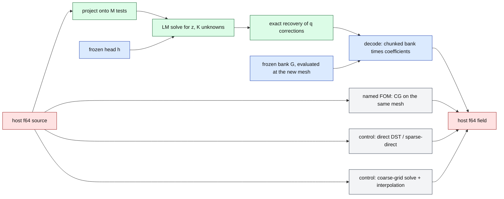

# High-resolution Poisson: does the NM-ROM's speedup over CG keep growing at high accuracy?

Lane report of `exp/2026-09-20-hires-poisson` for the 2026-09-20 speed-and-accuracy campaign. Every number below is
generated by `experiments/hires-poisson/reports/generate_hires.py` from the on-cluster independent NumPy audits
(`runs/<attempt>/archive/output/audit.json`); status of each row is in its last column. All sources are **opened
development sources** (nothing was tuned on them in this lane; no sealed cohort was opened), so these are development
measurements, final for this lane's question and not a generalisation claim.

## What was run

Nothing is trained. Frozen checkpoints are evaluated on finer meshes than they were trained on ("frozen-weight mesh
transfer"): the decoder is $u(x) = G(x)\,[\,h(z) + C_q y\,]$ with a coordinate bank $G$, a nonlinear head $h$ and $q$ linear
correction directions, and the query solves $\min_{z,y} \lVert B\,[h(z)+C_q y] - f_m \rVert_2$ over $M$ sine (or, on the
L-shape, discrete-eigenmode) tests with $y$ eliminated exactly. On large meshes the bank is held as row chunks.

Blue = frozen (never retrained), green = solved per query, red = identical host copies paid by every subject, grey =
comparators. Every job times all subjects in one allocation on one physical GPU (UUID-guarded), 12 sources × 5
repetitions, randomised order, burn-in, medians.

## Bar verdict per mesh (accurate arm, pre-registered)

| mesh | accurate arm | worst same-grid % | total ms | device ms | × vs CG 1e-2 (total) | (device) | × vs fastest CG with error ≤ ROM's | × vs matched coarse grid | × vs direct solver | bar (≤1 % and ≥5×) | attempt / job / status |
|---|---|---:|---:|---:|---:|---:|---:|---:|---:|---|---|
| square 2048² | `rom_q256_lean64` | 0.965 | 14.17 | 5.47 | 28.73 | 72.77 | 28.73 | 0.67 | 0.68 | **met** | `hp2048` / 4049279 / audit passed |
| square 4096² | `rom_q256_lean64` | 0.965 | 61.35 | 16.92 | 41.08 | 146.14 | 32.67 | 0.74 | 0.80 | **met** | `hp4096` / 4051236 / audit passed |
| cube 64³ | `rom_q96_leandst64` | 0.160 | 2.63 | 1.43 | 1.57 | 2.02 | 1.57 | — | 0.65 | missed | `hp3d128` / 4051032 / audit passed |
| cube 128³ | `rom_q96_leandst64` | 0.160 | 6.33 | 1.86 | 2.70 | 6.75 | 2.70 | 0.83 | 0.81 | missed | `hp3d128` / 4051032 / audit passed |
| cube 128³ | `rom_q96_leandst64` | 0.160 | 6.38 | 1.90 | 2.65 | 6.52 | 2.65 | 0.80 | 0.80 | missed | `hp3d256` / 4056288 / audit passed |
| cube 256³ | `rom_q96_leandst64` | 0.160 | 42.52 | 6.08 | 4.18 | 23.18 | 4.18 | 0.88 | 0.92 | missed | `hp3d256` / 4056288 / audit passed |
| L-shape 1024² (12 sources) | `rom_q128_lean@head_sdf_R512_K16` | 0.895 | 5.88 | 3.33 | 9.88 | 16.68 | 9.88 | 0.99 | 30.72 | withdrawn: 12-source subset (A8) | `hpl1024` / 4053801 / audit passed |
| L-shape 1024² (32 sources) | `rom_q128_lean@head_sdf_R512_K16` | 2.196 | 5.81 | 3.38 | 9.76 | 16.05 | 8.38 | 0.81 | 30.91 | missed | `hpl32` / 4057694 / audit passed |

Bank projection floors (the error no query on this checkpoint can beat): square 2048² 0.742 %; square 4096² 0.742 %; cube 64³ 0.143 %; cube 128³ 0.143 %; cube 128³ 0.143 %; cube 256³ 0.143 %; L-shape 1024² (12 sources) 0.423 %; L-shape 1024² (32 sources) 0.768 %.

**Reading.** Against the named same-mesh CG the speedup grows with the mesh at unchanged error, because CG's iteration
count grows with $n$ while the ROM's device time is one bank-times-coefficients product. **The ROM does not beat the
direct transform solver or a coarse-grid solve at its own accuracy on any mesh** (ratios below 1 in the last two speedup
columns): a 1 %-accurate answer to these smooth problems does not need the fine mesh. Total-time ratios are compressed
by the identical f64 host↔device copies; device-only ratios are shown beside them.

## square 2048² — `hp2048`, job `4049279`, NVIDIA H200, source `0c92c025766c`

Audit: **passed** (3720 recomputed errors, worst difference 0.0e+00). Bank projection floor: worst 0.742 %. Bar (accurate arm `rom_q256_lean64` vs `cg_0.01`): worst same-grid 0.965 % (≤ 1 %, stretch 0.5 % missed), speedup 28.73× (≥ 5) → **BAR MET**.

| subject | worst same-grid % | worst physical % | median total ms | median device ms | iterations | × vs CG 1e-2 (total / device) | × vs fastest matched CG | × vs matched coarse grid | × vs DST |
|---|---:|---:|---:|---:|---:|---:|---:|---:|---:|
| `rom_q0_lean32` | 3.149 | 3.149 | 12.33 | 3.43 | 5 | 33.02 / 115.9 | 33.02 (`cg_0.01`) | 0.77 (`coarse64_dst`) | 0.78 |
| `rom_q0_lean64` | 3.149 | 3.149 | 14.14 | 5.35 | 5 | 28.79 / 74.3 | 28.79 (`cg_0.01`) | 0.67 (`coarse64_dst`) | 0.68 |
| `rom_q0_retained` | 3.149 | 3.149 | 15.49 | 6.33 | 5 | 26.28 / 62.9 | 26.28 (`cg_0.01`) | 0.61 (`coarse64_dst`) | 0.62 |
| `rom_q128_lean32` | 1.546 | 1.546 | 12.85 | 3.49 | 5 | 31.68 / 114.1 | 31.68 (`cg_0.01`) | 0.74 (`coarse64_dst`) | 0.75 |
| `rom_q128_lean64` | 1.546 | 1.546 | 14.46 | 5.42 | 5 | 28.15 / 73.4 | 28.15 (`cg_0.01`) | 0.66 (`coarse64_dst`) | 0.66 |
| `rom_q128_retained` | 1.546 | 1.546 | 16.04 | 6.77 | 5 | 25.39 / 58.7 | 25.39 (`cg_0.01`) | 0.59 (`coarse64_dst`) | 0.60 |
| `rom_q256_lean32` | 0.965 | 0.965 | 12.23 | 3.57 | 5 | 33.28 / 111.5 | 33.28 (`cg_0.01`) | 0.78 (`coarse64_dst`) | 0.78 |
| `rom_q256_lean64` | 0.965 | 0.965 | 14.17 | 5.47 | 5 | 28.73 / 72.8 | 28.73 (`cg_0.01`) | 0.67 (`coarse64_dst`) | 0.68 |
| `rom_q256_retained` | 0.965 | 0.965 | 15.88 | 6.77 | 5 | 25.63 / 58.8 | 25.63 (`cg_0.01`) | 0.60 (`coarse64_dst`) | 0.60 |
| `rom_q512_linear_lean32` | 0.742 | 0.742 | 11.91 | 2.62 | 0 | 34.18 / 151.6 | 34.18 (`cg_0.01`) | 0.80 (`coarse64_dst`) | 0.81 |
| `rom_q512_linear_lean64` | 0.742 | 0.742 | 13.45 | 4.54 | 0 | 30.28 / 87.6 | 30.28 (`cg_0.01`) | 0.71 (`coarse64_dst`) | 0.71 |
| `rom_q64_lean32` | 2.076 | 2.076 | 12.63 | 3.50 | 5 | 32.25 / 113.7 | 32.25 (`cg_0.01`) | 0.75 (`coarse64_dst`) | 0.76 |
| `rom_q64_lean64` | 2.076 | 2.076 | 14.20 | 5.36 | 5 | 28.68 / 74.2 | 28.68 (`cg_0.01`) | 0.67 (`coarse64_dst`) | 0.68 |
| `rom_q64_retained` | 2.076 | 2.076 | 15.74 | 6.59 | 5 | 25.87 / 60.4 | 25.87 (`cg_0.01`) | 0.60 (`coarse64_dst`) | 0.61 |

Comparators and controls in the same job:

| subject | worst same-grid % | worst physical % | median total ms | median device ms | iterations | × vs CG 1e-2 (total / device) | × vs fastest matched CG | × vs matched coarse grid | × vs DST |
|---|---:|---:|---:|---:|---:|---:|---:|---:|---:|
| `cg_0.0001` | 0.000 | 0.000 | 564.55 | 554.36 | 4491 | — | — | — | — |
| `cg_0.001` | 0.005 | 0.005 | 496.31 | 488.13 | 3954 | — | — | — | — |
| `cg_0.01` | 0.049 | 0.049 | 407.17 | 397.80 | 3237 | — | — | — | — |
| `cg_1e-06` | 0.000 | 0.000 | 681.85 | 671.29 | 5458.5 | — | — | — | — |
| `coarse128_cg_0.0001` | 0.041 | 0.041 | 14.86 | 6.18 | 262.5 | — | — | — | — |
| `coarse128_cg_0.01` | 0.201 | 0.201 | 13.25 | 4.42 | 176 | — | — | — | — |
| `coarse128_dst` | 0.041 | 0.041 | 9.62 | 0.74 |  | — | — | — | — |
| `coarse256_cg_0.0001` | 0.011 | 0.011 | 21.26 | 12.26 | 536 | — | — | — | — |
| `coarse256_cg_0.01` | 0.153 | 0.153 | 18.12 | 8.87 | 364.5 | — | — | — | — |
| `coarse256_dst` | 0.011 | 0.010 | 9.53 | 0.76 |  | — | — | — | — |
| `coarse512_cg_0.0001` | 0.003 | 0.003 | 41.64 | 32.39 | 1090 | — | — | — | — |
| `coarse512_cg_0.01` | 0.116 | 0.116 | 32.30 | 22.85 | 755 | — | — | — | — |
| `coarse512_dst` | 0.003 | 0.003 | 9.57 | 0.78 |  | — | — | — | — |
| `coarse64_cg_0.0001` | 0.168 | 0.168 | 12.26 | 3.51 | 129.5 | — | — | — | — |
| `coarse64_cg_0.01` | 0.304 | 0.304 | 11.66 | 2.59 | 85.5 | — | — | — | — |
| `coarse64_dst` | 0.168 | 0.168 | 9.49 | 0.76 |  | — | — | — | — |
| `dst_direct` | 0.000 | 0.000 | 9.59 | 0.56 |  | — | — | — | — |

## square 4096² — `hp4096`, job `4051236`, NVIDIA H200, source `4ef296c34ccf`

Audit: **passed** (3750 recomputed errors, worst difference 0.0e+00). Bank projection floor: worst 0.742 %. Bar (accurate arm `rom_q256_lean64` vs `cg_0.01`): worst same-grid 0.965 % (≤ 1 %, stretch 0.5 % missed), speedup 41.08× (≥ 5) → **BAR MET**.

| subject | worst same-grid % | worst physical % | median total ms | median device ms | iterations | × vs CG 1e-2 (total / device) | × vs fastest matched CG | × vs matched coarse grid | × vs DST |
|---|---:|---:|---:|---:|---:|---:|---:|---:|---:|
| `rom_q0_lean32` | 3.149 | 3.149 | 56.14 | 9.21 | 5 | 44.89 / 268.6 | 35.70 (`cg_0.1`) | 0.81 (`coarse64_dst`) | 0.87 |
| `rom_q0_lean64` | 3.149 | 3.149 | 60.41 | 16.74 | 5 | 41.72 / 147.7 | 33.18 (`cg_0.1`) | 0.75 (`coarse64_dst`) | 0.81 |
| `rom_q128_lean32` | 1.546 | 1.546 | 54.06 | 9.28 | 5 | 46.63 / 266.4 | 37.08 (`cg_0.1`) | 0.84 (`coarse64_dst`) | 0.91 |
| `rom_q128_lean64` | 1.546 | 1.546 | 63.00 | 16.87 | 5 | 40.01 / 146.6 | 31.82 (`cg_0.1`) | 0.72 (`coarse64_dst`) | 0.78 |
| `rom_q256_lean32` | 0.965 | 0.965 | 56.32 | 9.40 | 5 | 44.76 / 263.2 | 35.60 (`cg_0.1`) | 0.81 (`coarse64_dst`) | 0.87 |
| `rom_q256_lean64` | 0.965 | 0.965 | 61.35 | 16.92 | 5 | 41.08 / 146.1 | 32.67 (`cg_0.1`) | 0.74 (`coarse64_dst`) | 0.80 |
| `rom_q512_linear_lean32` | 0.742 | 0.742 | 54.43 | 8.35 | 0 | 46.30 / 296.2 | 36.83 (`cg_0.1`) | 0.83 (`coarse64_dst`) | 0.90 |
| `rom_q512_linear_lean64` | 0.742 | 0.742 | 62.70 | 15.88 | 0 | 40.20 / 155.8 | 31.97 (`cg_0.1`) | 0.72 (`coarse64_dst`) | 0.78 |
| `rom_q64_lean32` | 2.076 | 2.076 | 56.37 | 9.28 | 5 | 44.71 / 266.3 | 35.56 (`cg_0.1`) | 0.81 (`coarse64_dst`) | 0.87 |
| `rom_q64_lean64` | 2.076 | 2.076 | 63.82 | 16.91 | 5 | 39.49 / 146.2 | 31.41 (`cg_0.1`) | 0.71 (`coarse64_dst`) | 0.77 |

Comparators and controls in the same job:

| subject | worst same-grid % | worst physical % | median total ms | median device ms | iterations | × vs CG 1e-2 (total / device) | × vs fastest matched CG | × vs matched coarse grid | × vs DST |
|---|---:|---:|---:|---:|---:|---:|---:|---:|---:|
| `cg_0.0001` | 0.000 | 0.000 | 3410.56 | 3361.00 | 9110.5 | — | — | — | — |
| `cg_0.001` | 0.004 | 0.004 | 3046.11 | 3000.21 | 8113 | — | — | — | — |
| `cg_0.01` | 0.038 | 0.038 | 2520.48 | 2472.81 | 6690 | — | — | — | — |
| `cg_0.03` | 0.123 | 0.123 | 2197.91 | 2149.08 | 5824.5 | — | — | — | — |
| `cg_0.1` | 0.451 | 0.451 | 2004.62 | 1954.80 | 5289 | — | — | — | — |
| `cg_1e-06` | 0.000 | 0.000 | 4244.25 | 4194.34 | 11371 | — | — | — | — |
| `coarse1024_cg_0.0001` | 0.001 | 0.001 | 130.44 | 83.56 | 2213.5 | — | — | — | — |
| `coarse1024_cg_0.01` | 0.072 | 0.072 | 105.81 | 59.92 | 1566.5 | — | — | — | — |
| `coarse1024_dst` | 0.001 | 0.001 | 46.39 | 0.85 |  | — | — | — | — |
| `coarse128_cg_0.0001` | 0.041 | 0.041 | 52.06 | 6.22 | 262.5 | — | — | — | — |
| `coarse128_cg_0.01` | 0.201 | 0.201 | 51.23 | 4.52 | 176 | — | — | — | — |
| `coarse128_dst` | 0.041 | 0.041 | 45.67 | 0.72 |  | — | — | — | — |
| `coarse256_cg_0.0001` | 0.010 | 0.010 | 58.78 | 12.18 | 536 | — | — | — | — |
| `coarse256_cg_0.01` | 0.153 | 0.153 | 55.40 | 8.50 | 364.5 | — | — | — | — |
| `coarse256_dst` | 0.010 | 0.010 | 47.04 | 0.73 |  | — | — | — | — |
| `coarse512_cg_0.0001` | 0.003 | 0.003 | 79.18 | 32.83 | 1090 | — | — | — | — |
| `coarse512_cg_0.01` | 0.116 | 0.116 | 70.78 | 22.78 | 755 | — | — | — | — |
| `coarse512_dst` | 0.003 | 0.003 | 47.05 | 0.76 |  | — | — | — | — |
| `coarse64_cg_0.0001` | 0.168 | 0.167 | 49.68 | 3.45 | 129.5 | — | — | — | — |
| `coarse64_cg_0.01` | 0.304 | 0.304 | 46.35 | 2.56 | 85.5 | — | — | — | — |
| `coarse64_dst` | 0.167 | 0.167 | 45.38 | 0.66 |  | — | — | — | — |
| `dst_direct` | 0.000 | 0.000 | 49.03 | 2.21 |  | — | — | — | — |

## cube 64³ — `hp3d128`, job `4051032`, NVIDIA H200, source `c6d5eb6c367d`

Audit: **passed**. Bank floor worst 0.143 %. Bar (accurate arm `rom_q96_leandst64` vs `cg_0.01`): worst same-grid 0.160 %, speedup 1.57× → **BAR MISSED**; fast arm `rom_q0_leandst64` 0.545 % / 1.56×.

| subject | worst same-grid % | worst physical % | median total ms | median device ms | iterations | × vs CG 1e-2 (total / device) | × vs fastest matched CG | × vs matched coarse grid | × vs DST |
|---|---:|---:|---:|---:|---:|---:|---:|---:|---:|
| `rom_q0_lean64` | 0.545 | 0.548 | 2.80 | 1.60 | 4 | 1.48 / 1.8 | 1.48 (`cg_0.01`) | 0.69 (`coarse32_dst`) | 0.61 |
| `rom_q0_leandst32` | 0.545 | 0.548 | 2.54 | 1.37 | 4 | 1.63 / 2.1 | 1.63 (`cg_0.01`) | 0.76 (`coarse32_dst`) | 0.67 |
| `rom_q0_leandst64` | 0.545 | 0.548 | 2.65 | 1.38 | 4 | 1.56 / 2.1 | 1.56 (`cg_0.01`) | 0.73 (`coarse32_dst`) | 0.64 |
| `rom_q0_onestart64` | 0.545 | 0.548 | 2.63 | 1.46 | 3 | 1.57 / 2.0 | 1.57 (`cg_0.01`) | 0.73 (`coarse32_dst`) | 0.65 |
| `rom_q0_retained` | 0.545 | 0.548 | 3.21 | 2.04 | 4 | 1.28 / 1.4 | 1.28 (`cg_0.01`) | 0.60 (`coarse32_dst`) | 0.53 |
| `rom_q128_linear` | 0.144 | 0.153 | 1.99 | 0.45 |  | 2.08 / 6.4 | 2.08 (`cg_0.01`) | — | 0.86 |
| `rom_q32_lean64` | 0.287 | 0.292 | 2.71 | 1.48 | 4 | 1.52 / 1.9 | 1.52 (`cg_0.01`) | — | 0.63 |
| `rom_q32_leandst32` | 0.287 | 0.292 | 2.56 | 1.41 | 4 | 1.61 / 2.0 | 1.61 (`cg_0.01`) | — | 0.67 |
| `rom_q32_leandst64` | 0.287 | 0.292 | 2.63 | 1.43 | 4 | 1.57 / 2.0 | 1.57 (`cg_0.01`) | — | 0.65 |
| `rom_q32_onestart64` | 0.287 | 0.292 | 2.60 | 1.41 | 4 | 1.59 / 2.0 | 1.59 (`cg_0.01`) | — | 0.66 |
| `rom_q32_retained` | 0.287 | 0.292 | 3.14 | 1.98 | 4 | 1.32 / 1.5 | 1.32 (`cg_0.01`) | — | 0.54 |
| `rom_q96_lean64` | 0.160 | 0.168 | 2.76 | 1.53 | 4 | 1.49 / 1.9 | 1.49 (`cg_0.01`) | — | 0.62 |
| `rom_q96_leandst32` | 0.160 | 0.168 | 2.71 | 1.54 | 4 | 1.52 / 1.9 | 1.52 (`cg_0.01`) | — | 0.63 |
| `rom_q96_leandst64` | 0.160 | 0.168 | 2.63 | 1.43 | 4 | 1.57 / 2.0 | 1.57 (`cg_0.01`) | — | 0.65 |
| `rom_q96_onestart64` | 0.160 | 0.168 | 2.68 | 1.49 | 4 | 1.54 / 1.9 | 1.54 (`cg_0.01`) | — | 0.64 |
| `rom_q96_retained` | 0.160 | 0.168 | 3.21 | 2.05 | 4 | 1.29 / 1.4 | 1.29 (`cg_0.01`) | — | 0.53 |

Comparators and controls in the same job:

| subject | worst same-grid % | worst physical % | median total ms | median device ms | iterations | × vs CG 1e-2 (total / device) | × vs fastest matched CG | × vs matched coarse grid | × vs DST |
|---|---:|---:|---:|---:|---:|---:|---:|---:|---:|
| `cg_0.0001` | 0.001 | 0.052 | 5.75 | 4.48 | 134 | — | — | — | — |
| `cg_0.01` | 0.113 | 0.125 | 4.13 | 2.88 | 78.5 | — | — | — | — |
| `cg_1e-06` | 0.000 | 0.052 | 6.94 | 5.77 | 174 | — | — | — | — |
| `coarse16_cg_0.0001` | 1.209 | 1.179 | 2.52 | 1.27 | 30 | — | — | — | — |
| `coarse16_cg_0.01` | 1.231 | 1.202 | 2.23 | 1.04 | 16.5 | — | — | — | — |
| `coarse16_dst` | 1.209 | 1.179 | 1.92 | 0.73 |  | — | — | — | — |
| `coarse32_cg_0.0001` | 0.323 | 0.303 | 3.73 | 2.56 | 62.5 | — | — | — | — |
| `coarse32_cg_0.01` | 0.353 | 0.335 | 2.98 | 1.76 | 34 | — | — | — | — |
| `coarse32_dst` | 0.323 | 0.303 | 1.93 | 0.72 |  | — | — | — | — |
| `dst_direct` | 0.000 | 0.052 | 1.71 | 0.18 |  | — | — | — | — |

## cube 128³ — `hp3d128`, job `4051032`, NVIDIA H200, source `c6d5eb6c367d`

Audit: **passed**. Bank floor worst 0.143 %. Bar (accurate arm `rom_q96_leandst64` vs `cg_0.01`): worst same-grid 0.160 %, speedup 2.70× → **BAR MISSED**; fast arm `rom_q0_leandst64` 0.545 % / 2.66×.

| subject | worst same-grid % | worst physical % | median total ms | median device ms | iterations | × vs CG 1e-2 (total / device) | × vs fastest matched CG | × vs matched coarse grid | × vs DST |
|---|---:|---:|---:|---:|---:|---:|---:|---:|---:|
| `rom_q0_lean64` | 0.545 | 0.546 | 7.93 | 3.44 | 4 | 2.15 / 3.7 | 2.15 (`cg_0.01`) | 0.64 (`coarse32_dst`) | 0.65 |
| `rom_q0_leandst32` | 0.545 | 0.546 | 6.05 | 1.51 | 4 | 2.82 / 8.3 | 2.82 (`cg_0.01`) | 0.84 (`coarse32_dst`) | 0.85 |
| `rom_q0_leandst64` | 0.545 | 0.546 | 6.43 | 1.80 | 4 | 2.66 / 7.0 | 2.66 (`cg_0.01`) | 0.79 (`coarse32_dst`) | 0.80 |
| `rom_q0_onestart64` | 0.545 | 0.546 | 6.42 | 1.89 | 3 | 2.66 / 6.6 | 2.66 (`cg_0.01`) | 0.79 (`coarse32_dst`) | 0.80 |
| `rom_q0_retained` | 0.545 | 0.546 | 8.10 | 3.65 | 4 | 2.11 / 3.4 | 2.11 (`cg_0.01`) | 0.63 (`coarse32_dst`) | 0.63 |
| `rom_q128_linear` | 0.144 | 0.145 | 7.19 | 2.47 |  | 2.38 / 5.1 | 2.38 (`cg_0.01`) | 0.73 (`coarse64_dst`) | 0.71 |
| `rom_q32_lean64` | 0.287 | 0.288 | 7.93 | 3.39 | 4 | 2.15 / 3.7 | 2.15 (`cg_0.01`) | 0.67 (`coarse64_dst`) | 0.65 |
| `rom_q32_leandst32` | 0.287 | 0.288 | 6.08 | 1.59 | 4 | 2.81 / 7.9 | 2.81 (`cg_0.01`) | 0.87 (`coarse64_dst`) | 0.84 |
| `rom_q32_leandst64` | 0.287 | 0.288 | 6.27 | 1.83 | 4 | 2.72 / 6.9 | 2.72 (`cg_0.01`) | 0.84 (`coarse64_dst`) | 0.82 |
| `rom_q32_onestart64` | 0.287 | 0.288 | 6.33 | 1.79 | 4 | 2.70 / 7.0 | 2.70 (`cg_0.01`) | 0.84 (`coarse64_dst`) | 0.81 |
| `rom_q32_retained` | 0.287 | 0.288 | 8.08 | 3.52 | 4 | 2.12 / 3.6 | 2.12 (`cg_0.01`) | 0.65 (`coarse64_dst`) | 0.63 |
| `rom_q96_lean64` | 0.160 | 0.160 | 8.03 | 3.51 | 4 | 2.13 / 3.6 | 2.13 (`cg_0.01`) | 0.66 (`coarse64_dst`) | 0.64 |
| `rom_q96_leandst32` | 0.160 | 0.160 | 6.24 | 1.72 | 4 | 2.74 / 7.3 | 2.74 (`cg_0.01`) | 0.85 (`coarse64_dst`) | 0.82 |
| `rom_q96_leandst64` | 0.160 | 0.160 | 6.33 | 1.86 | 4 | 2.70 / 6.8 | 2.70 (`cg_0.01`) | 0.83 (`coarse64_dst`) | 0.81 |
| `rom_q96_onestart64` | 0.160 | 0.160 | 6.42 | 1.89 | 4 | 2.66 / 6.6 | 2.66 (`cg_0.01`) | 0.82 (`coarse64_dst`) | 0.80 |
| `rom_q96_retained` | 0.160 | 0.160 | 8.10 | 3.70 | 4 | 2.11 / 3.4 | 2.11 (`cg_0.01`) | 0.65 (`coarse64_dst`) | 0.63 |

Comparators and controls in the same job:

| subject | worst same-grid % | worst physical % | median total ms | median device ms | iterations | × vs CG 1e-2 (total / device) | × vs fastest matched CG | × vs matched coarse grid | × vs DST |
|---|---:|---:|---:|---:|---:|---:|---:|---:|---:|
| `cg_0.0001` | 0.000 | 0.013 | 24.57 | 20.09 | 280 | — | — | — | — |
| `cg_0.01` | 0.075 | 0.076 | 17.09 | 12.55 | 173.5 | — | — | — | — |
| `cg_1e-06` | 0.000 | 0.013 | 30.19 | 25.71 | 360.5 | — | — | — | — |
| `coarse16_cg_0.0001` | 1.169 | 1.161 | 5.77 | 1.16 | 30 | — | — | — | — |
| `coarse16_cg_0.01` | 1.192 | 1.184 | 5.41 | 0.92 | 16.5 | — | — | — | — |
| `coarse16_dst` | 1.169 | 1.161 | 5.03 | 0.60 |  | — | — | — | — |
| `coarse32_cg_0.0001` | 0.301 | 0.293 | 6.92 | 2.54 | 62.5 | — | — | — | — |
| `coarse32_cg_0.01` | 0.333 | 0.326 | 6.16 | 1.65 | 34 | — | — | — | — |
| `coarse32_dst` | 0.301 | 0.293 | 5.07 | 0.56 |  | — | — | — | — |
| `coarse64_cg_0.0001` | 0.081 | 0.076 | 9.19 | 4.69 | 134 | — | — | — | — |
| `coarse64_cg_0.01` | 0.140 | 0.137 | 7.62 | 3.00 | 78.5 | — | — | — | — |
| `coarse64_dst` | 0.081 | 0.076 | 5.28 | 0.63 |  | — | — | — | — |
| `dst_direct` | 0.000 | 0.013 | 5.12 | 0.42 |  | — | — | — | — |

## cube 128³ — `hp3d256`, job `4056288`, NVIDIA H200, source `b8bd7059c6a1`

Audit: **passed**. Bank floor worst 0.143 %. Bar (accurate arm `rom_q96_leandst64` vs `cg_0.01`): worst same-grid 0.160 %, speedup 2.65× → **BAR MISSED**; fast arm `rom_q0_leandst64` 0.545 % / 2.70×.

| subject | worst same-grid % | worst physical % | median total ms | median device ms | iterations | × vs CG 1e-2 (total / device) | × vs fastest matched CG | × vs matched coarse grid | × vs DST |
|---|---:|---:|---:|---:|---:|---:|---:|---:|---:|
| `rom_q0_lean64` | 0.545 | 0.546 | 7.88 | 3.43 | 4 | 2.15 / 3.6 | 2.15 (`cg_0.01`) | 0.64 (`coarse32_dst`) | 0.64 |
| `rom_q0_leandst32` | 0.545 | 0.546 | 6.09 | 1.54 | 4 | 2.78 / 8.0 | 2.78 (`cg_0.01`) | 0.83 (`coarse32_dst`) | 0.83 |
| `rom_q0_leandst64` | 0.545 | 0.546 | 6.27 | 1.76 | 4 | 2.70 / 7.0 | 2.70 (`cg_0.01`) | 0.81 (`coarse32_dst`) | 0.81 |
| `rom_q0_onestart64` | 0.545 | 0.546 | 6.26 | 1.81 | 3 | 2.70 / 6.8 | 2.70 (`cg_0.01`) | 0.81 (`coarse32_dst`) | 0.81 |
| `rom_q0_retained` | 0.545 | 0.546 | 7.88 | 3.48 | 4 | 2.15 / 3.6 | 2.15 (`cg_0.01`) | 0.64 (`coarse32_dst`) | 0.64 |
| `rom_q128_linear` | 0.144 | 0.145 | 7.06 | 2.45 |  | 2.40 / 5.1 | 2.40 (`cg_0.01`) | 0.72 (`coarse64_dst`) | 0.72 |
| `rom_q128_lineardst` | 0.144 | 0.145 | 5.37 | 0.85 |  | 3.15 / 14.6 | 3.15 (`cg_0.01`) | 0.95 (`coarse64_dst`) | 0.95 |
| `rom_q32_lean64` | 0.287 | 0.288 | 7.92 | 3.45 | 4 | 2.14 / 3.6 | 2.14 (`cg_0.01`) | 0.64 (`coarse64_dst`) | 0.64 |
| `rom_q32_leandst32` | 0.287 | 0.288 | 6.03 | 1.55 | 4 | 2.80 / 8.0 | 2.80 (`cg_0.01`) | 0.84 (`coarse64_dst`) | 0.84 |
| `rom_q32_leandst64` | 0.287 | 0.288 | 6.21 | 1.75 | 4 | 2.73 / 7.1 | 2.73 (`cg_0.01`) | 0.82 (`coarse64_dst`) | 0.82 |
| `rom_q32_onestart64` | 0.287 | 0.288 | 6.24 | 1.86 | 4 | 2.71 / 6.7 | 2.71 (`cg_0.01`) | 0.82 (`coarse64_dst`) | 0.81 |
| `rom_q32_retained` | 0.287 | 0.288 | 7.95 | 3.56 | 4 | 2.13 / 3.5 | 2.13 (`cg_0.01`) | 0.64 (`coarse64_dst`) | 0.64 |
| `rom_q96_lean64` | 0.160 | 0.160 | 7.94 | 3.53 | 4 | 2.13 / 3.5 | 2.13 (`cg_0.01`) | 0.64 (`coarse64_dst`) | 0.64 |
| `rom_q96_leandst32` | 0.160 | 0.160 | 6.07 | 1.59 | 4 | 2.79 / 7.8 | 2.79 (`cg_0.01`) | 0.84 (`coarse64_dst`) | 0.84 |
| `rom_q96_leandst64` | 0.160 | 0.160 | 6.38 | 1.90 | 4 | 2.65 / 6.5 | 2.65 (`cg_0.01`) | 0.80 (`coarse64_dst`) | 0.80 |
| `rom_q96_onestart64` | 0.160 | 0.160 | 6.28 | 1.89 | 4 | 2.70 / 6.6 | 2.70 (`cg_0.01`) | 0.81 (`coarse64_dst`) | 0.81 |
| `rom_q96_retained` | 0.160 | 0.160 | 8.06 | 3.60 | 4 | 2.10 / 3.4 | 2.10 (`cg_0.01`) | 0.63 (`coarse64_dst`) | 0.63 |

Comparators and controls in the same job:

| subject | worst same-grid % | worst physical % | median total ms | median device ms | iterations | × vs CG 1e-2 (total / device) | × vs fastest matched CG | × vs matched coarse grid | × vs DST |
|---|---:|---:|---:|---:|---:|---:|---:|---:|---:|
| `cg_0.0001` | 0.000 | 0.013 | 24.18 | 19.83 | 280 | — | — | — | — |
| `cg_0.01` | 0.075 | 0.076 | 16.92 | 12.40 | 173.5 | — | — | — | — |
| `cg_1e-06` | 0.000 | 0.013 | 30.01 | 25.45 | 360.5 | — | — | — | — |
| `coarse32_cg_0.0001` | 0.301 | 0.293 | 6.77 | 2.31 | 62.5 | — | — | — | — |
| `coarse32_cg_0.01` | 0.333 | 0.326 | 6.07 | 1.52 | 34 | — | — | — | — |
| `coarse32_dst` | 0.301 | 0.293 | 5.08 | 0.65 |  | — | — | — | — |
| `coarse64_cg_0.0001` | 0.081 | 0.076 | 8.98 | 4.56 | 134 | — | — | — | — |
| `coarse64_cg_0.01` | 0.140 | 0.137 | 7.40 | 2.94 | 78.5 | — | — | — | — |
| `coarse64_dst` | 0.081 | 0.076 | 5.10 | 0.69 |  | — | — | — | — |
| `dst_direct` | 0.000 | 0.013 | 5.08 | 0.41 |  | — | — | — | — |

## cube 256³ — `hp3d256`, job `4056288`, NVIDIA H200, source `b8bd7059c6a1`

Audit: **passed**. Bank floor worst 0.143 %. Bar (accurate arm `rom_q96_leandst64` vs `cg_0.01`): worst same-grid 0.160 %, speedup 4.18× → **BAR MISSED**; fast arm `rom_q0_leandst64` 0.546 % / 4.21×.

| subject | worst same-grid % | worst physical % | median total ms | median device ms | iterations | × vs CG 1e-2 (total / device) | × vs fastest matched CG | × vs matched coarse grid | × vs DST |
|---|---:|---:|---:|---:|---:|---:|---:|---:|---:|
| `rom_q0_leandst32` | 0.546 | 0.546 | 40.51 | 4.15 | 4 | 4.39 / 34.0 | 4.39 (`cg_0.01`) | 0.91 (`coarse32_dst`) | 0.96 |
| `rom_q0_leandst64` | 0.546 | 0.546 | 42.27 | 5.95 | 4 | 4.21 / 23.7 | 4.21 (`cg_0.01`) | 0.87 (`coarse32_dst`) | 0.92 |
| `rom_q0_onestart64` | 0.546 | 0.546 | 42.30 | 5.97 | 3 | 4.20 / 23.6 | 4.20 (`cg_0.01`) | 0.87 (`coarse32_dst`) | 0.92 |
| `rom_q128_lineardst` | 0.144 | 0.144 | 41.11 | 4.95 |  | 4.33 / 28.4 | 4.33 (`cg_0.01`) | 0.91 (`coarse128_dst`) | 0.95 |
| `rom_q32_leandst32` | 0.287 | 0.287 | 40.49 | 4.09 | 4 | 4.39 / 34.5 | 4.39 (`cg_0.01`) | 0.92 (`coarse128_dst`) | 0.96 |
| `rom_q32_leandst64` | 0.287 | 0.287 | 42.41 | 5.97 | 4 | 4.19 / 23.6 | 4.19 (`cg_0.01`) | 0.88 (`coarse128_dst`) | 0.92 |
| `rom_q32_onestart64` | 0.287 | 0.287 | 42.20 | 6.01 | 4 | 4.21 / 23.5 | 4.21 (`cg_0.01`) | 0.88 (`coarse128_dst`) | 0.92 |
| `rom_q96_leandst32` | 0.160 | 0.160 | 40.60 | 4.29 | 4 | 4.38 / 32.8 | 4.38 (`cg_0.01`) | 0.92 (`coarse128_dst`) | 0.96 |
| `rom_q96_leandst64` | 0.160 | 0.160 | 42.52 | 6.08 | 4 | 4.18 / 23.2 | 4.18 (`cg_0.01`) | 0.88 (`coarse128_dst`) | 0.92 |
| `rom_q96_onestart64` | 0.160 | 0.160 | 42.33 | 6.05 | 4 | 4.20 / 23.3 | 4.20 (`cg_0.01`) | 0.88 (`coarse128_dst`) | 0.92 |

Comparators and controls in the same job:

| subject | worst same-grid % | worst physical % | median total ms | median device ms | iterations | × vs CG 1e-2 (total / device) | × vs fastest matched CG | × vs matched coarse grid | × vs DST |
|---|---:|---:|---:|---:|---:|---:|---:|---:|---:|
| `cg_0.0001` | 0.000 | 0.003 | 257.09 | 220.31 | 576 | — | — | — | — |
| `cg_0.01` | 0.049 | 0.049 | 177.82 | 140.87 | 368.5 | — | — | — | — |
| `cg_1e-06` | 0.000 | 0.003 | 320.63 | 282.19 | 740.5 | — | — | — | — |
| `coarse128_cg_0.0001` | 0.020 | 0.019 | 56.42 | 20.17 | 280 | — | — | — | — |
| `coarse128_cg_0.01` | 0.078 | 0.078 | 49.06 | 12.83 | 173.5 | — | — | — | — |
| `coarse128_dst` | 0.020 | 0.019 | 37.21 | 1.01 |  | — | — | — | — |
| `coarse32_cg_0.0001` | 0.291 | 0.289 | 38.83 | 2.39 | 62.5 | — | — | — | — |
| `coarse32_cg_0.01` | 0.324 | 0.322 | 37.73 | 1.55 | 34 | — | — | — | — |
| `coarse32_dst` | 0.291 | 0.289 | 36.83 | 0.72 |  | — | — | — | — |
| `coarse64_cg_0.0001` | 0.075 | 0.073 | 41.10 | 4.62 | 134 | — | — | — | — |
| `coarse64_cg_0.01` | 0.137 | 0.136 | 39.31 | 2.97 | 78.5 | — | — | — | — |
| `coarse64_dst` | 0.075 | 0.073 | 37.31 | 0.72 |  | — | — | — | — |
| `dst_direct` | 0.000 | 0.003 | 38.99 | 2.29 |  | — | — | — | — |

## L-shape 1024² (12 sources) — `hpl1024`, job `4053801`, NVIDIA H200, source `849afb2d89ae`

Audit: **passed** (4080 recomputed errors). Bank floor worst 0.423 % (`head_sdf_R512_K16`). Bar (accurate arm `rom_q128_lean@head_sdf_R512_K16` vs `cg_0.01`): worst same-grid 0.895 %, speedup 9.88× → **12-SOURCE SUBSET — NOT A BAR VERDICT (DESIGN A8)**; fast arm `rom_q0_lean@head_sdf_R512_K16` 1.331 % / 9.96×. The `× vs DST` column is against the CPU sparse-direct solve on this domain.

| subject | worst same-grid % | worst physical % | median total ms | median device ms | iterations | × vs CG 1e-2 (total / device) | × vs fastest matched CG | × vs matched coarse grid | × vs DST |
|---|---:|---:|---:|---:|---:|---:|---:|---:|---:|
| `rom_q0_lean@head_sdf_R512_K16` | 1.331 | 1.331 | 5.84 | 3.28 | 4 | 9.96 / 16.9 | 8.81 (`cg_0.03`) | 1.00 (`coarse64_cg_0.0001`) | 30.95 |
| `rom_q0_lean@head_sdf_R512_K32` | 1.016 | 1.016 | 5.96 | 3.40 | 5 | 9.76 / 16.3 | 9.76 (`cg_0.01`) | 0.97 (`coarse64_cg_0.0001`) | 30.33 |
| `rom_q0_retained@head_sdf_R512_K16` | 1.331 | 1.331 | 5.94 | 3.34 | 4 | 9.79 / 16.6 | 8.66 (`cg_0.03`) | 0.98 (`coarse64_cg_0.0001`) | 30.43 |
| `rom_q0_retained@head_sdf_R512_K32` | 1.016 | 1.016 | 6.04 | 3.45 | 5 | 9.63 / 16.1 | 9.63 (`cg_0.01`) | 0.96 (`coarse64_cg_0.0001`) | 29.94 |
| `rom_q128_lean@head_sdf_R512_K16` | 0.895 | 0.895 | 5.88 | 3.33 | 4 | 9.88 / 16.7 | 9.88 (`cg_0.01`) | 0.99 (`coarse64_cg_0.0001`) | 30.72 |
| `rom_q128_lean@head_sdf_R512_K32` | 1.043 | 1.043 | 5.96 | 3.44 | 5 | 9.75 / 16.2 | 9.75 (`cg_0.01`) | 0.97 (`coarse64_cg_0.0001`) | 30.32 |
| `rom_q128_retained@head_sdf_R512_K16` | 0.895 | 0.895 | 6.00 | 3.41 | 4 | 9.70 / 16.3 | 9.70 (`cg_0.01`) | 0.97 (`coarse64_cg_0.0001`) | 30.14 |
| `rom_q128_retained@head_sdf_R512_K32` | 1.043 | 1.043 | 6.10 | 3.53 | 5 | 9.53 / 15.7 | 9.53 (`cg_0.01`) | 0.95 (`coarse64_cg_0.0001`) | 29.61 |
| `rom_q32_lean@head_sdf_R512_K16` | 1.092 | 1.092 | 5.91 | 3.33 | 4 | 9.85 / 16.7 | 8.71 (`cg_0.03`) | 0.98 (`coarse64_cg_0.0001`) | 30.60 |
| `rom_q32_lean@head_sdf_R512_K32` | 0.969 | 0.969 | 6.06 | 3.49 | 5 | 9.60 / 15.9 | 9.60 (`cg_0.01`) | 0.96 (`coarse64_cg_0.0001`) | 29.84 |
| `rom_q32_retained@head_sdf_R512_K16` | 1.092 | 1.092 | 5.94 | 3.37 | 4 | 9.79 / 16.5 | 8.65 (`cg_0.03`) | 0.98 (`coarse64_cg_0.0001`) | 30.42 |
| `rom_q32_retained@head_sdf_R512_K32` | 0.969 | 0.969 | 6.02 | 3.49 | 5 | 9.66 / 15.9 | 9.66 (`cg_0.01`) | 0.96 (`coarse64_cg_0.0001`) | 30.01 |
| `rom_q64_lean@head_sdf_R512_K16` | 1.021 | 1.021 | 5.89 | 3.29 | 4 | 9.87 / 16.9 | 9.87 (`cg_0.01`) | 0.99 (`coarse64_cg_0.0001`) | 30.67 |
| `rom_q64_lean@head_sdf_R512_K32` | 0.997 | 0.997 | 5.96 | 3.44 | 5 | 9.76 / 16.1 | 9.76 (`cg_0.01`) | 0.98 (`coarse64_cg_0.0001`) | 30.34 |
| `rom_q64_retained@head_sdf_R512_K16` | 1.021 | 1.021 | 5.92 | 3.40 | 4 | 9.82 / 16.3 | 9.82 (`cg_0.01`) | 0.98 (`coarse64_cg_0.0001`) | 30.51 |
| `rom_q64_retained@head_sdf_R512_K32` | 0.997 | 0.997 | 6.08 | 3.54 | 5 | 9.57 / 15.7 | 9.57 (`cg_0.01`) | 0.96 (`coarse64_cg_0.0001`) | 29.74 |

Comparators and controls in the same job:

| subject | worst same-grid % | worst physical % | median total ms | median device ms | iterations | × vs CG 1e-2 (total / device) | × vs fastest matched CG | × vs matched coarse grid | × vs DST |
|---|---:|---:|---:|---:|---:|---:|---:|---:|---:|
| `cg_0.0001` | 0.001 | 0.009 | 82.92 | 80.12 | 2099 | — | — | — | — |
| `cg_0.01` | 0.314 | 0.314 | 58.16 | 55.53 | 1443.5 | — | — | — | — |
| `cg_0.03` | 1.046 | 1.047 | 51.43 | 48.49 | 1262.5 | — | — | — | — |
| `cg_0.1` | 6.928 | 6.929 | 42.74 | 39.63 | 1027 | — | — | — | — |
| `coarse128_cg_0.0001` | 0.249 | 0.258 | 8.43 | 5.82 | 245 | — | — | — | — |
| `coarse128_cg_0.01` | 0.999 | 1.000 | 6.49 | 3.94 | 159.5 | — | — | — | — |
| `coarse128_splu_cpu` | 0.249 | 0.258 | 12.35 | 11.84 |  | — | — | — | — |
| `coarse256_cg_0.0001` | 0.086 | 0.095 | 14.04 | 11.44 | 501 | — | — | — | — |
| `coarse256_cg_0.01` | 0.644 | 0.645 | 10.58 | 8.00 | 337 | — | — | — | — |
| `coarse256_splu_cpu` | 0.086 | 0.095 | 20.66 | 20.00 |  | — | — | — | — |
| `coarse512_cg_0.0001` | 0.024 | 0.033 | 33.26 | 30.63 | 1028 | — | — | — | — |
| `coarse512_cg_0.01` | 0.386 | 0.386 | 23.84 | 21.11 | 699.5 | — | — | — | — |
| `coarse512_splu_cpu` | 0.024 | 0.033 | 55.08 | 53.90 |  | — | — | — | — |
| `coarse64_cg_0.0001` | 0.784 | 0.784 | 5.81 | 3.22 | 119.5 | — | — | — | — |
| `coarse64_cg_0.01` | 1.581 | 1.582 | 4.88 | 2.27 | 73 | — | — | — | — |
| `coarse64_splu_cpu` | 0.784 | 0.784 | 10.01 | 9.54 |  | — | — | — | — |
| `fom_splu_cpu` | 0.000 | 0.009 | 180.75 | 176.42 |  | — | — | — | — |
| `pcg_ic0_cpu_0.01` | 0.316 | 0.316 | 11846.18 | 11841.68 | 425.5 | — | — | — | — |

## L-shape 1024² (32 sources) — `hpl32`, job `4057694`, NVIDIA H200, source `40d41cbfd432`

Audit: **passed** (10580 recomputed errors). Bank floor worst 0.768 % (`head_sdf_R512_K16`). Bar (accurate arm `rom_q128_lean@head_sdf_R512_K16` vs `cg_0.01`): worst same-grid 2.196 %, speedup 9.76× → **BAR MISSED**; fast arm `rom_q0_lean@head_sdf_R512_K16` 3.850 % / 10.01×. The `× vs DST` column is against the CPU sparse-direct solve on this domain.

| subject | worst same-grid % | worst physical % | median total ms | median device ms | iterations | × vs CG 1e-2 (total / device) | × vs fastest matched CG | × vs matched coarse grid | × vs DST |
|---|---:|---:|---:|---:|---:|---:|---:|---:|---:|
| `rom_q0_lean@head_sdf_R512_K16` | 3.850 | 3.849 | 5.67 | 3.29 | 4 | 10.01 / 16.5 | 8.59 (`cg_0.03`) | 0.84 (`coarse64_cg_0.01`) | 31.68 |
| `rom_q0_lean@head_sdf_R512_K32` | 3.171 | 3.171 | 5.82 | 3.42 | 5 | 9.74 / 15.9 | 8.36 (`cg_0.03`) | 0.81 (`coarse64_cg_0.01`) | 30.83 |
| `rom_q0_retained@head_sdf_R512_K16` | 3.850 | 3.849 | 5.75 | 3.33 | 4 | 9.87 / 16.3 | 8.47 (`cg_0.03`) | 0.82 (`coarse64_cg_0.01`) | 31.24 |
| `rom_q0_retained@head_sdf_R512_K32` | 3.171 | 3.171 | 5.86 | 3.44 | 5 | 9.69 / 15.8 | 8.32 (`cg_0.03`) | 0.81 (`coarse64_cg_0.01`) | 30.66 |
| `rom_q128_lean@head_sdf_R512_K16` | 2.196 | 2.195 | 5.81 | 3.38 | 4 | 9.76 / 16.0 | 8.38 (`cg_0.03`) | 0.81 (`coarse64_cg_0.01`) | 30.91 |
| `rom_q128_lean@head_sdf_R512_K32` | 2.262 | 2.262 | 5.90 | 3.48 | 5 | 9.62 / 15.6 | 8.26 (`cg_0.03`) | 0.80 (`coarse64_cg_0.01`) | 30.45 |
| `rom_q128_retained@head_sdf_R512_K16` | 2.196 | 2.195 | 5.82 | 3.43 | 4 | 9.74 / 15.8 | 8.37 (`cg_0.03`) | 0.81 (`coarse64_cg_0.01`) | 30.84 |
| `rom_q128_retained@head_sdf_R512_K32` | 2.262 | 2.262 | 5.94 | 3.54 | 5 | 9.54 / 15.3 | 8.19 (`cg_0.03`) | 0.80 (`coarse64_cg_0.01`) | 30.20 |
| `rom_q32_lean@head_sdf_R512_K16` | 2.586 | 2.585 | 5.75 | 3.34 | 4 | 9.87 / 16.2 | 8.47 (`cg_0.03`) | 0.82 (`coarse64_cg_0.01`) | 31.24 |
| `rom_q32_lean@head_sdf_R512_K32` | 2.348 | 2.348 | 5.86 | 3.44 | 5 | 9.68 / 15.8 | 8.31 (`cg_0.03`) | 0.81 (`coarse64_cg_0.01`) | 30.65 |
| `rom_q32_retained@head_sdf_R512_K16` | 2.586 | 2.585 | 5.78 | 3.38 | 4 | 9.82 / 16.0 | 8.43 (`cg_0.03`) | 0.82 (`coarse64_cg_0.01`) | 31.08 |
| `rom_q32_retained@head_sdf_R512_K32` | 2.348 | 2.348 | 5.94 | 3.53 | 5 | 9.55 / 15.4 | 8.20 (`cg_0.03`) | 0.80 (`coarse64_cg_0.01`) | 30.22 |
| `rom_q64_lean@head_sdf_R512_K16` | 2.122 | 2.121 | 5.74 | 3.34 | 4 | 9.87 / 16.3 | 8.48 (`cg_0.03`) | 0.82 (`coarse64_cg_0.01`) | 31.25 |
| `rom_q64_lean@head_sdf_R512_K32` | 2.227 | 2.226 | 5.90 | 3.47 | 5 | 9.62 / 15.6 | 8.26 (`cg_0.03`) | 0.80 (`coarse64_cg_0.01`) | 30.45 |
| `rom_q64_retained@head_sdf_R512_K16` | 2.122 | 2.121 | 5.83 | 3.41 | 4 | 9.73 / 15.9 | 8.35 (`cg_0.03`) | 0.81 (`coarse64_cg_0.01`) | 30.80 |
| `rom_q64_retained@head_sdf_R512_K32` | 2.227 | 2.226 | 5.91 | 3.49 | 5 | 9.60 / 15.5 | 8.24 (`cg_0.03`) | 0.80 (`coarse64_cg_0.01`) | 30.38 |

Comparators and controls in the same job:

| subject | worst same-grid % | worst physical % | median total ms | median device ms | iterations | × vs CG 1e-2 (total / device) | × vs fastest matched CG | × vs matched coarse grid | × vs DST |
|---|---:|---:|---:|---:|---:|---:|---:|---:|---:|
| `cg_0.0001` | 0.001 | 0.018 | 81.74 | 79.23 | 2093.5 | — | — | — | — |
| `cg_0.01` | 0.314 | 0.314 | 56.72 | 54.28 | 1422.5 | — | — | — | — |
| `cg_0.03` | 1.046 | 1.047 | 48.70 | 46.28 | 1210.5 | — | — | — | — |
| `cg_0.1` | 6.928 | 6.929 | 40.87 | 38.46 | 1005 | — | — | — | — |
| `coarse128_cg_0.0001` | 0.527 | 0.545 | 8.17 | 5.73 | 243 | — | — | — | — |
| `coarse128_cg_0.01` | 0.999 | 1.000 | 6.32 | 3.91 | 151.5 | — | — | — | — |
| `coarse128_splu_cpu` | 0.527 | 0.544 | 11.71 | 11.26 |  | — | — | — | — |
| `coarse256_cg_0.0001` | 0.177 | 0.194 | 17.43 | 15.02 | 498 | — | — | — | — |
| `coarse256_cg_0.01` | 0.644 | 0.645 | 12.47 | 10.01 | 323 | — | — | — | — |
| `coarse256_splu_cpu` | 0.176 | 0.194 | 20.00 | 19.34 |  | — | — | — | — |
| `coarse512_cg_0.0001` | 0.049 | 0.066 | 32.65 | 30.24 | 1022 | — | — | — | — |
| `coarse512_cg_0.01` | 0.386 | 0.386 | 22.85 | 20.47 | 686.5 | — | — | — | — |
| `coarse512_splu_cpu` | 0.048 | 0.066 | 53.72 | 52.59 |  | — | — | — | — |
| `coarse64_cg_0.0001` | 1.531 | 1.548 | 5.64 | 3.21 | 119 | — | — | — | — |
| `coarse64_cg_0.01` | 1.624 | 1.641 | 4.73 | 2.28 | 73 | — | — | — | — |
| `coarse64_splu_cpu` | 1.530 | 1.547 | 9.69 | 9.20 |  | — | — | — | — |
| `fom_splu_cpu` | 0.000 | 0.018 | 179.54 | 175.68 |  | — | — | — | — |
| `pcg_ic0_cpu_0.01` | 0.079 | 0.079 | 11838.66 | 11834.71 | 427 | — | — | — | — |

## Glossary

- **NM-ROM** — nonlinear-manifold reduced-order model: the solution is sought on a low-dimensional learned manifold instead of on the mesh.
- **bank $G$ / head $h$ / corrections $C_q$** — the decoder is a fixed set of $R$ spatial basis functions (bank) combined by coefficients; the head maps $K$ latent unknowns nonlinearly to those coefficients; $q$ extra linear directions ("corrections") are added and solved exactly. `q` in subject names is that count; `q = R` is the purely linear model on the bank (`*_linear*`).
- **frozen-weight mesh transfer** — the trained networks are evaluated at the nodes of a finer mesh; nothing is retrained.
- **bank projection floor** — the error of the best possible combination of bank functions for a given truth field; no solver setting can go below it.
- **worst same-grid %** — largest, over the 12 sources, relative $L^2$ difference to the exact discrete solution on the same mesh. **worst physical %** — the same against a reference solved on a mesh twice as fine (this is what coarse-grid arms are judged by).
- **total ms / device ms** — median wall time from host source array to host solution array / the part between the two host↔device copies.
- **CG 1e-2 (named FOM)** — unpreconditioned conjugate gradient on the same mesh, zero start, stopped at relative residual $10^{-2}$; other `cg_*` rows are other tolerances. **fastest CG with error ≤ ROM's** — the quickest tested CG tolerance whose worst physical error does not exceed the ROM arm's.
- **DST / direct solver** — the FFT-based sine-transform solve (square, cube) or CPU sparse-direct SuperLU (L-shape); an exact solver, reported as a labelled control.
- **coarse{n}_dst / coarse{n}_cg** — solve on an $n$-interval mesh from the point-sampled source, then bi/tri-linear interpolation to the requested mesh (interpolation charged). **matched coarse grid** — the fastest of these whose worst physical error does not exceed the ROM arm's.
- **retained / lean64 / lean32 / leandst / onestart / io32** — speed-loop variants: the unmodified parent kernel; diagnostics moved out of the timed kernel; additionally an f32 bank for the decode (labelled); DST-based source projection (3D); one LM start instead of three (3D); host f32 in/out for every subject alike (labelled contract).
- **iterations** — CG iterations, or LM attempts for ROM rows. **LM** — Levenberg–Marquardt, the damped Gauss–Newton iteration that finds the latent unknowns.
- **parity gate** — a faster variant is accepted only if its field matches the unoptimised path (f64: $10^{-12}$ relative and identical solver integers; f32 decode: $10^{-4}$).
- **bar** — the campaign's pre-registered success rule: accurate arm worst same-grid error ≤ 1 % (stretch 0.5 %) and speedup ≥ 5 over the named FOM in the same allocation.
