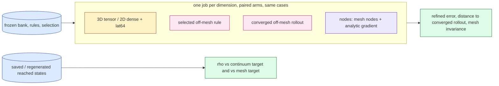

# jcp-mechanism — Group A reviewer-proofing: what carries the off-mesh gain? (pre-registration)

Lane `exp/2026-10-06-jcp-mechanism`, cluster namespace `/cluster/tufts/paralab/tawal01/jcpmech/`. Written 2026-10-08,
before any code or job of this lane. Status: **pre-registration v1** (amendments are appended at the end, dated; this
text is never rewritten). Plan items: E2b (mesh nodes + analytic gradient) and the stencil-gap part of E2a / check C6 of
`reports/2026-10-06-jcp-offmesh-paper-plan.md` and its note `03-theory.md` §2, with the corrections of `06-codex-audit.md`.

**Scope (coordinator, 2026-10-08):** this lane runs **A1** and **A2** only. **A3** (random-shift robustness, shift-spread
indicator, bad generating vector) and **A4** (measured vs theoretical rates, polynomial Gauss-exactness machinery check)
are **deferred, not cancelled**; their designs are kept in §8 so a later session can pick them up unchanged.
Concurrent cluster-job cap: **1**.

## 0. What is reused, unchanged

Nothing is retrained. Both studies reuse frozen models, frozen rules and saved reached states of the two 2026-10-01 lanes,
through byte-identical copies in `vendor/` (sha256 in `vendor/PROVENANCE.json`); any changed file is a copy in the lane
directory, never an edit of `vendor/`.

| item | 3D (Burgers 3D, `vendor/quad3d`) | 2D (Burgers 2D, `vendor/quad2d`) |
|---|---|---|
| model | `inputs/model_M2/bank.pkl` (sha `6687f259…`), ordered bank $R=512$ | Table-1 checkpoint `dn256b` + `rotation_R512.npz` |
| settings | $R'=512$, $R'=256$, $M\approx4R'$ shell-completed per mesh (2052 / 1027 at $64^3$, 2049 / 1024 at $128^3$), $\Delta t=0.01$, fixed-sweep LM | `acc` ($R'=384$, $M=1536$), `fast` ($R'=128$, $M=512$), $\Delta t=0.005$, fused LM |
| rules | `rules/rules.npz` (sha `099a7997…`): `gl24`, `lat4096`, `lat32768`, `gl80` (target), `gl64` (check) | generators of `vendor/hari_quadrature.py`: `gauss96`, `fib1597`, `gauss640` (target / converged rollout), `gauss768` (check) |
| selected off-mesh rule (frozen) | `selection.json` (sha `ca69098a…`): `gl24` at $R'=512$, `lat4096` at $R'=256$, every mesh | post-hoc rules frozen before the 2D test jobs: `acc` Gauss $96^2$, `fast` Fibonacci 1597 |
| converged off-mesh rollout | `lat32768` | `gref` = Gauss $640^2$ |
| mesh incumbent | precomputed tensor (backward difference) | `dense` (sign-upwind on every node) and `lat64` (deployed $63^2$ mesh lattice) |
| cohort | validation 923801 × 64 (+ certification draws 923811–923813 × 8 each for $\rho$) | dev6 ∪ val32 (38 cases); test64 replication only |
| refined reference | 513 nodes/axis, $\Delta t/4$, first order (`ref1`, `ref_923801.npz`) | $8192^2$, first order: ST ($\Delta t/16$) and S ($\Delta t$) (`refdv`, `reft`) |

**No new cohort is created or opened.** test64 (2D) is used for replication only and never for a choice; the 3D held-out
cohort 923901 is not used by this lane at all.

## 1. Questions

- **A1.** The off-mesh solve beats the mesh incumbents against the refined reference and is mesh-invariant. Is that
  because its points are *off the mesh*, or because it uses the bank's *exact (analytic) gradient* and so quadratures the
  continuum advection instead of the mesh stencil? A1 separates the two with one new arm that keeps the mesh nodes but
  uses the analytic gradient.
- **A2.** The mesh incumbents carry the stencil's consistency gap to the continuum advection. Does the gap of the
  first-order sign-upwind stencil fall like $h$, and that of a second-order central stencil like $h^2$, on the saved
  reached states? (Quadrature-level only: no rollouts, no new reduced solves with a central stencil.)

## 2. The A1 arm (`nodes`)

Notation of `03-theory.md` §0: $u=\widehat G_{R'}c$, tests $\psi_a=2^{d/2}\prod_j\sin(a_j\pi x_j)$, $L=1/h$ intervals per
axis. The off-mesh rule with points $x_q$ and weights $w_q$ is

$$ N_{m,a}(c)=L^{d/2}\sum_{q=1}^{m} w_q\,\psi_a(x_q)\,u(x_q)\,\big(\mathbf 1\cdot\nabla u\big)(x_q), $$

with $u$ and $\mathbf 1\cdot\nabla u$ from the bank and its forward-mode derivative at the points (3D: `offmesh.point_blocks`,
one JVP with tangent $(1,1,1)$; 2D: `qcore.Model.values_grads`, $u_x+u_y$). The `nodes` arm is **exactly this code path**
with the rule replaced by the interior mesh nodes $x_i=i h$ and equal weights $w_i=h^d$ (the composite trapezoid rule on the
interior; the boundary values of the integrand are zero because the mask vanishes there). With these points
$L^{d/2}w_i\psi_a(x_i)=\Phi_{ia}$, the mesh-orthonormal discrete sine, so

$$ N^{\rm nodes}(c)=\Phi^{\mathsf T}\big(u\odot(\mathbf 1\cdot\nabla u)\big)\big|_{\rm nodes},\qquad
   N^{\rm dense}(c)=\Phi^{\mathsf T}\big(u\odot\mathcal A_h u\big)\big|_{\rm nodes}, $$

i.e. the `nodes` arm differs from the FOM's own dense advection **only** in replacing the upwind difference $\mathcal A_h$
by the analytic derivative. Its Jacobian is the off-mesh formula $P^{\mathsf T}\big(\operatorname{diag}(Dc)B+\operatorname{diag}(Bc)D\big)$
(linear in $c$, so the cached predictor of the 3D solver stays exact). Everything else (linear terms $A,\Lambda$,
projection of $u_0$, LM solver, $\Delta t$, $R'$, $M$, output decoding) is identical to the other arms of the same job.

**Prediction (pre-registered, from `03-theory.md` Prop. 2.1 and Euler–Maclaurin):** the integrand $\psi_a u(\mathbf 1\cdot\nabla u)$
vanishes with its first normal derivative on every face, so the interior trapezoid sum has no $O(h^2)$ end correction;
its continuum $\rho$ should be far below the upwind gap at every mesh and fall faster than $h^2$ once the tests are
resolved. If this holds and the `nodes` rollout sits with the off-mesh rules (§5 outcome **G**), the gain is the exact
gradient (continuum target), not off-mesh point placement; the off-mesh rules then add only an $N$-independent cost.

## 3. A1 runs and metrics

**3D** (job `a1d3`, one H200): meshes $64^3$ ($n=65$) and $128^3$ ($n=129$), $R'\in\{512,256\}$; arms `tensor`, the selected
rule (`gl24` at 512, `lat4096` at 256; both rules are run at both widths), `lat32768` (converged), `nodes`. Cohort:
validation 923801, all 64 cases. If the job time limit forces it, the documented subset is $R'=512$ only (the
coordinator's fallback); which one ran is recorded. The `dense` sign-upwind arm is not rerun (it costs $R'$ full-grid
JVPs per Jacobian): its validation rollouts from the 2026-10-01 jobs (all 64 cases at $64^3$, 4 at $128^3$) are read from
the saved coefficients as context, labelled "earlier job".

**2D** (job `a1d2`, one A100-80G or H100): meshes $256^2$ and $1024^2$, settings `acc` and `fast`; arms `dense`, `lat64`, the
post-hoc frozen rule (`gauss96` / `fib1597`), `gref` (converged), `nodes`. Cohorts dev6 ∪ val32; test64 added as
replication if the job fits in its time limit (reported separately, never used for a choice). The documented subset, if
needed, is `acc` only on dev6 ∪ val32.

Metrics (all generated from the job JSONs and saved coefficients by `make_report.py`):

1. **$\rho$ on reached states** (quadrature error of the tested advection, `03-theory.md` eq:rho):
   $\rho(c)=\lVert N_{\rm rule}(c)-N_{\rm target}(c)\rVert/\lVert N_{\rm target}(c)\rVert$ against the **continuum target**
   (3D Gauss $80^3$, checked against $64^3$; 2D Gauss $640^2$, checked against $768^2$) and against the **mesh target**
   (sign-upwind on every node). Populations exactly as in the source lanes: 3D the tensor-reached states of the 24
   certification draws ($k\ge1$ evolved; $k=0$ separately); 2D the `lat64`-reached states $k=1..50$ of dev6 ∪ val32.
   Worst, p90, median. Rules: tensor/dense, selected, converged, `nodes`.
2. **End-to-end error, PROVISIONAL** (the references are first-order solutions): worst and median over cases of the
   evolved-time maximum relative error against the refined reference (3D: 513-node reference on the $63^3$ lattice
   $x=k/64$; 2D: ST and S on the $257^2$ shared nodes). Also the same-grid error (3D: from the saved same-grid reference
   restricted to the $63^3$ lattice; 2D: in-job truth).
3. **Distance to the converged off-mesh rollout** (field norm, normalised by $\lVert u_0\rVert$) and to the mesh incumbent.
4. **Mesh invariance** of each arm: worst refined error max/min over the two meshes, and per-case spread.

## 4. A2: stencil gap vs $h$

On a **fixed** set of reached coefficient states (so that only $h$ changes), evaluate on interior nodes of meshes of
spacing $h$ the tested mesh sums

- `upwind`: $\Phi^{\mathsf T}(u\odot\mathcal A_h u)$, the FOM's sign-upwind ($u\,\delta^{\mp}$ by the sign of $u$, ghost zeros);
- `central`: $\Phi^{\mathsf T}\big(u\odot\sum_j\delta^0_ju\big)$, $\delta^0_ju=(u_{i+e_j}-u_{i-e_j})/(2h)$, ghost zeros (exact, $u|_{\partial\Omega}=0$);
- `nodes`: $\Phi^{\mathsf T}(u\odot\mathbf 1\cdot\nabla u)$ with the analytic gradient (the A1 arm; expected far below both);

each against the continuum target computed with the **same** fixed tests $\psi_a$ (the first $M$ modes of one fixed
ordering, independent of $h$). Gap $g(h;c)=\rho$ of the mesh sum against the continuum target.

- 3D: meshes $h^{-1}\in\{32,64,128,256\}$; states: the saved `tensor` rollouts of the 2026-10-01 validation job at $64^3$,
  cases 0–7, $k=1..25$ (200 states per width), $R'\in\{512,256\}$; tests: the $n=65$ ordering, $M=2052$ / $1027$.
- 2D: meshes $L\in\{128,256,512,1024,2048,4096\}$; states: the `lat64` population of the 2026-10-01 dev job at $1024^2$,
  dev6 cases (6 cases × 50 steps = 300 states), settings `acc` and `fast`; tests: that setting's $(k_x,k_y)$.
- Secondary (context, not fitted): each mesh's *own* saved states at that mesh (3D val $64^3/128^3/256^3$ tensor states;
  2D populations at $256^2/1024^2/4096^2$), reproducing the source lanes' "dense continuum $\rho$" plateaus.

**Slope fit (pre-registered):** least squares of $\log g$ against $\log h$ over the **window** 3D $h^{-1}\in\{64,128,256\}$,
2D $L\in\{256,\dots,4096\}$ (the coarsest mesh is reported, not fitted: the tests are under-resolved there,
$h\,a_{\max}\pi\gtrsim1$). Three statistics: slope of the median-over-states gap, slope of the worst-over-states gap, and
the median of per-state slopes. **Prediction:** upwind $\approx1$, central $\approx2$, `nodes` $\ge2$ (nominally 4 once
resolved). Bars for "consistent with the prediction": upwind in $[0.8,1.2]$, central in $[1.7,2.3]$, on the median-state
statistic; anything else is reported as an observed, inconsistent slope.

**Controls (must be checked at real size before any verdict is read):**

- **C-pos (detects slopes):** a manufactured smooth state with $u|_{\partial\Omega}=0$ (a fixed product of the polynomial
  mask and low trigonometric modes, coded independently of the bank), run through the same stencil and target code at the
  same meshes. Must give upwind slope in $[0.9,1.1]$ and central in $[1.9,2.1]$. If it fails, every A2 verdict is void.
- **C-neg (the fit is not forced):** `central` multiplied by $(1+10^{-2})$, i.e. an $O(1)$ relative defect. Its fitted
  slope on the window must be $<0.5$ on the manufactured state (the gap saturates at about $10^{-2}$). If it does not
  fall below 0.5, the fit window or code cannot distinguish an $O(1)$ defect from convergence: A2 verdicts void.
- **Implementation parity:** my `upwind` equals the vendor FOM stencil (3D `common.upwind`; 2D the `dense` tested value)
  to $10^{-12}$ relative on one state per mesh; my tested sums equal the vendor DST / sine-table projections to $10^{-12}$.

## 5. A1 outcomes and gates

**Gates (abort / void the job if any fails):**

- G1: analytic directional derivative vs centred finite differences at nodes, relative $<10^{-6}$ (as the source lanes).
- G2: `nodes` blocks are the mesh bank: $B_{\rm nodes}$ equals the mesh bank rows (3D `GTb`, 2D `Grot`) to $10^{-12}$;
  the assembled test block equals $\Phi$ at the nodes to $10^{-12}$; $N^{\rm nodes}$ via the off-mesh GEMM equals
  $\Phi^{\mathsf T}(u\odot\mathbf 1\cdot\nabla u)$ via the DST / sine tables to $10^{-11}$ on 4 states.
- G3: Jacobian formula equals `jax.jacfwd` of the value to $10^{-12}$; value equals $\tfrac12 J c$ (3D).
- G4 (reproduction, pairing): in the same job, the rerun `tensor` and selected rule (3D) / `dense`, `lat64` and selected
  rule (2D) reproduce the 2026-10-01 validation results: 3D $\rho$ worst values to relative $10^{-6}$ and rollout
  coefficients (offline, against the saved `coefficients.npz`) to $10^{-8}$ relative in field norm; 2D worst ST errors
  to $10^{-6}$ relative. A failure means the comparison is not paired with the earlier lane and is reported as such.
- Continuum target check as in the source lanes (3D Gauss $64^3$ vs $80^3$ worst $\rho\le10^{-6}$; 2D $640^2$ vs $768^2$
  $\le10^{-5}$).

**Pre-registered outcome classes** (per mesh and width/setting; worst over cases, refined error $e$, distance $d$):

- **G (gradient explains the gain):** `nodes` continuum $\rho_{\max}\le0.116$ **and** $d(\texttt{nodes},\text{converged})\le10^{-2}$
  **and** $|e_{\rm nodes}-e_{\rm conv}|<|e_{\rm nodes}-e_{\rm incumbent}|$.
- **P (off-mesh placement matters):** $|e_{\rm nodes}-e_{\rm incumbent}|\le|e_{\rm nodes}-e_{\rm conv}|$, i.e. `nodes` behaves like
  the mesh incumbent (tensor in 3D, dense in 2D).
- **X (mixed / unresolved):** anything else, e.g. the `nodes` quadrature itself under-resolves the tests at the coarse mesh.

Because the refined references are first order (and so favour upwind discretisations), the refined-error comparisons are
**provisional**; the distance to the converged rollout and the continuum $\rho$ do not depend on the reference and are the
primary evidence for the mechanism. Where both 2D references exist, S is reported beside ST.

## 6. Budget, jobs, deliverables

| job | content | GPU | estimate |
|---|---|---|---|
| `a2q` | A2, 3D and 2D, fixed-state ladders, own-mesh states, controls | H200 (or H100) | 1.0 GPU-h |
| `a1d3` | A1 3D, $64^3$ then $128^3$, both widths, 64 validation cases, $\rho$ on certification draws | H200 | 3.0 GPU-h |
| `a1d2` | A1 2D, $256^2$ then $1024^2$, `acc` + `fast`, dev6 ∪ val32 (+ test64 replication) | A100-80G / H100 | 2.5 GPU-h |

Total ≈ 6.5 GPU-h (≈ 10 with contingency), run **one at a time** (cap 1). Every job: its own directory under
`/cluster/tufts/paralab/tawal01/jcpmech/<job>/`, the paralab venv, `JAX_DEFAULT_MATMUL_PRECISION=highest`, f64, the
`jax_backend=gpu` preflight (exit 42 → resubmit on another GPU type), `squeue` before and after each submission, results
pulled into `runs/<job>/` and the cluster directory deleted. The first mesh of each job is its real-size smoke: gates assert
there before the finer mesh runs. Timing is **not** measured in this lane (the `nodes` arm is $O(N)$ per Jacobian by
construction; its flop and byte counts are reported from the cost model, not timed).

Deliverables: this DESIGN (Codex-audited), the code (Codex-audited per file), the three jobs, `make_report.py` → `report.md`
(generated numbers, provisional labels inline, glossary), PNG plots: (i) worst refined error and distance to the converged
rollout vs mesh with the `nodes` arm beside tensor/dense/lat64/selected/converged; (ii) gap vs $h$ for upwind, central,
`nodes` and the controls with fitted slopes. Every Codex audit is kept in `audits/`.

## 7. What would be wrong to conclude

- A1 outcome G does not show that off-mesh rules are useless: they keep the $N$-independent cost and memory; it shows the
  *accuracy* mechanism is the continuum target reached through the exact gradient.
- A2 slopes are finite-range observations on one bank's reached states, not asymptotic rates.
- Neither study says anything about the head (nonlinear) setting, about the 3D held-out cohort, or about second-order
  full-order solvers (another lane).

## 8. Deferred (not cancelled): A3 and A4

- **A3, random-shift robustness.** For the 2D Fibonacci and 3D CBC lattices, 32–64 independent uniform shifts per rule size
  (seeds disjoint from the deployed seed 0), and 32–64 Sobol scrambles; on the saved reached states: distribution over
  shifts of the worst-state continuum $\rho$ (median, p95, max), lattice vs Gauss at (approximately) equal $m$ with these
  error bars (lattice "better" only if its p95 is below Gauss). Shift-spread indicator for a single deployed shift: RMS
  deviation of $K=8$ auxiliary-shift values about their mean, divided by the deployed value; effectivity against the true
  deployed error (median, p5, p95, fraction below 1 and 0.5, coverage at a stated safety factor), reported as empirical
  coverage, not a bound. A bad generating vector $z=(1,1[,1])$ must be flagged by an *independent* rule family (Gauss or
  Sobol of comparable $m$, discrepancy $>0.116$), while the good lattice at the largest $m$ must not be flagged; the
  rule-doubling indicator is reported for the bad vector to show it cannot detect it.
- **A4, measured vs theory.** Observed rates over a window fixed by rule (points with worst $\rho\le0.116$ and $\ge10^{-6}$):
  lattice algebraic exponent from $\log\rho$ vs $\log m$, Gauss geometric parameter from $\log\rho$ vs $p$; one or two
  extra doublings where cheap; reported as observed rates against the conditional upper bounds, never as asymptotic
  claims. Machinery check: a polynomial "bank" and polynomial tests of known per-axis degree $D$ through the lane's
  rule generators and assembly, exact reference by rational monomial integration; tensor Gauss must be exact to rounding
  at $p^*=\lceil(D+1)/2\rceil$ and clearly not at $p^*-1$.

---

## Amendment 1 (2026-10-08, after Codex design audit `audits/codex-design-1.md`, before any code ran)

The audit returned 3 WRONG and 6 NEEDS-RESTATEMENT. Every item is resolved as follows; where this amendment and the
text above differ, this amendment governs.

**A1-1 (audit 4, WRONG): outcome classes are replaced** by paired per-case field distances on the evaluation lattice
(3D: $63^3$ lattice $x=k/64$; 2D: $257^2$ shared nodes), normalised by $\lVert u_0\rVert$, evolved times only:
$d_j(\mathrm{a},\mathrm{b})=\max_{t>0}\lVert u_{\rm a}(t)-u_{\rm b}(t)\rVert/\lVert u_0\rVert$ for case $j$. Let
$s_j=d_j(\text{incumbent},\text{converged})$ be the separation to explain (incumbent: 3D `tensor`, 2D `dense`; `lat64` is
reported beside it), and the recovered fraction $f_j=1-d_j(\texttt{nodes},\text{converged})/s_j$.

- **Resolvable** iff the median over cases of $s_j$ is at least $10^{-2}$ (1 % of $\lVert u_0\rVert$). If not resolvable:
  outcome **X0** (nothing to explain at this mesh), no mechanism label.
- **R (nodes recovers the continuum rollout):** resolvable, every solve finite with no reason-3 exit, median $f_j\ge0.9$
  and $f_j\ge0.75$ on at least 90 % of cases.
- **N (nodes does not recover it):** resolvable and median $f_j\le0.5$.
- **X (intermediate / failed):** anything else, including any non-finite solve or reason-3 exit in the `nodes` arm.

Claim scope (audit 3): **R** supports only the sufficiency statement "with the analytic gradient on the mesh nodes, the
reduced solve already reaches the continuum rollout, so off-mesh point placement is not needed for the accuracy
observed"; `nodes` vs the selected rule is called a *quadrature-rule replacement* (it changes locations, weights and
point count at once), not a placement ablation. **N** does not show that placement causes the gain. Neither label says
anything about the finer-training-data confound (E2c, not this lane). Refined-reference errors stay provisional context.

**A1-2 (audit 10, WRONG): no giant test blocks.** The `nodes` arm keeps $B$ and $D$ from `offmesh.point_blocks` (the
unchanged off-mesh code path) but applies the tests by the exact identity $P=\Phi$ at the nodes: 3D
$J_u=\Phi^{\mathsf T}\big(\operatorname{diag}(Dc)B+\operatorname{diag}(Bc)D\big)$ by the vendor DST (`common.phiT`, column chunks of 16),
value $\tfrac12J_uc$; 2D unchanged `qcore` point form (its $\Psi$ at $1024^2$, `acc`, is $1.61\times10^9<2^{31}$ elements,
12.9 GB, and fits an 80 GB GPU; it is built in chunks). Gates added: **G2c** compares the DST Jacobian with the
off-mesh GEMM $P^{\mathsf T}(\cdot)$ built from `offmesh.test_block` — in full at $64^3$, and at $128^3$ accumulated over
point chunks for 4 states and 32 columns — relative $\le10^{-11}$. A2 never forms test matrices: 3D tested sums by the DST,
2D by the separable sine tables (`hops.sep_project`).

**A1-3 (audit 7, WRONG): controls re-specified.**
- *C-pos:* the manufactured state $u_\star=\mu(x)\,\big(1+0.3\sin(2\pi x_1+0.4)+0.2\cos(3\pi x_2-0.1)\,[+0.25\sin(\pi x_3+1.1)]\big)$,
  $\mu=4^d\prod_jx_j(1-x_j)$ (the bracket in 3D only). $u_\star>0$ in the interior, so the sign-upwind stencil is the
  backward difference everywhere and has a smooth expansion. Its leading terms are computed independently by Gauss
  quadrature ($80^3$ / $640^2$) from analytic derivatives: upwind
  $N_h-N=-\tfrac h2L^{d/2}\!\int\psi\,u\,\Delta u+O(h^2)$, central $N_h-N=\tfrac{h^2}6L^{d/2}\!\int\psi\,u\sum_ju_{x_jx_jx_j}+O(h^4)$.
  Pass: fitted window slopes within $\pm0.15$ of 1 (upwind) and 2 (central), **and** at the finest mesh the measured gap
  vector is within 10 % (relative norm) of the predicted leading term. If C-pos fails, A2 verdicts are void.
- *C-neg:* (a) a constant injected vector error, $v=N+10^{-2}\lVert N\rVert e/\lVert e\rVert$ with a fixed random $e$: the fitted
  slope must satisfy $|s|<0.05$ (tests the fit, analytically zero); (b) central scaled by $1.01$ on $u_\star$ is reported
  descriptively with its predicted finite-window slope, not as a gate.

**A1-4 (audit 6, 8): A2 statistics.** Each $\rho$ uses the target computed at the same mesh (normalisation cancels); the
frozen mode tuples are written to the output. Fitted statistic: least-squares slope of $\log(\operatorname{median}_c g(h;c))$ on
$\log h$ over the window; also the median of per-state slopes and the worst-state slope. A gap value is *resolved* iff it
exceeds 100× the continuum-target check $\rho$ of that state ($64^3$ vs $80^3$; $640^2$ vs $768^2$, both computed in the
job); slopes are fitted on resolved values only, and fewer than 3 resolved window meshes gives "unresolved slope". The
`nodes` prediction is restated: asymptotically $h^4$ (tensor-product Euler–Maclaurin, the integrand and its normal
derivative vanish on every face), possibly faster; no finite-window bar is set for it.

**A1-5 (audit 5): gates split.** Implementation parity (G1–G3, G2a–c) aborts the job. Historical reproducibility (G4) is
**report-only**: per-case field distance of the rerun tensor / selected rule (3D) and `dense` / `lat64` / selected rule
(2D) from the 2026-10-01 rollouts, computed offline from saved coefficients / ST errors, and the 3D $\rho$ worst values;
JAX version and GPU are recorded. Within-job pairing (all arms, same job, same inputs) holds regardless of G4.

**A1-6 (audit 11): solver diagnostics and robustness.** Every arm reports finite flags, reason counts (0 non-stationary,
3 failure) and LM iterations; a reason-3 exit in `nodes` forces outcome X. 3D, $64^3$ only, first 8 validation cases: a
tighter-solve sensitivity rerun of `tensor`, `lat32768` and `nodes` with adaptive LM on every step (vendor
`adaptive_first = 25`), reporting its field distance from the fixed-sweep rollout. $\rho$ of `nodes` (and of the other
rules) is also evaluated on the `nodes`-reached states of the first 8 validation cases (3D) / of the population arm (2D).

**A1-7 (audit 1, 2, 9): restatements.** The 3D tensor uses the fixed *backward* difference, not sign-upwind; the
sign-upwind `dense` is context from the earlier job; their discrepancy on the certification states is the tensor's
"mesh $\rho$" and is reported. Interior weights $h^d$ are not renormalised. **test64 is dropped** from this lane (the
coordinator's narrowing and the audit: its outcomes were already inspected, so it would not be fresh replication).
Cohorts are fixed: 3D validation 923801 × 64 (+ certification draws), 2D dev6 ∪ val32. If a job runs out of time the
fallback is the coordinator's subset (3D $R'=512$; 2D `acc`), decided before the job by its config, never after outcomes.

## Amendment 2 (2026-10-08, after `audits/codex-design-2.md`, before any code ran)

**A2-1 (re-audit 1): decision order for the A1 labels**, per mesh and width / setting, applied in this order:

1. **X (invalid)** if, on any validation case, the `nodes`, incumbent or converged arm is non-finite or has a reason-3 exit,
   or (3D, first mesh) the adaptive-LM sensitivity distance of `nodes` or of the converged arm exceeds $0.1\,\mathrm{median}_j s_j$.
2. **X0 (nothing to explain)** if $\mathrm{median}_j s_j<10^{-2}$.
3. Cases with $s_j<10^{-3}$ are excluded from the $f_j$ statistics and listed. On the rest: **R** if the median $f_j\ge0.9$,
   the 2.5 % bootstrap bound of that median (2000 resamples of cases, seed 0) is $\ge0.8$, and $f_j\ge0.75$ on at least 90 %
   of them; **N** if the median $f_j\le0.5$; **X** otherwise.

The margins (1 %, 0.9, 0.8, 0.75, 90 %, 0.5) are declared conventions, not derived from an error model; the bootstrap bound
is reported beside every label. Wording for R: "`nodes` recovers the converged off-mesh rollout within the declared
margins".

**A2-2 (re-audit 3): C-pos uses the normalised expansions** $L^{-d/2}(N_h-N)=-\tfrac h2\int\psi\,u\,\Delta u+O(h^2)$ (backward
difference, $u>0$) and $L^{-d/2}(N_h-N)=\tfrac{h^2}{6}\int\psi\,u\sum_ju_{x_jx_jx_j}+O(h^4)$ (central), the integrals by
Gauss $80^3$ / $640^2$ from analytic derivatives. The job reports the leading-coefficient norms relative to
$\lVert L^{-d/2}N\rVert$; they must be $\ge10^{-3}$ (nonzero leading term), otherwise C-pos is void. C-neg(a) validates only
the normalisation and the fit, not stencil assembly; that is what C-pos is for.

**A2-3 (re-audit 4): the resolution rule is an empirical screen.** A state enters a slope fit only if its gap is
resolved at **every** window mesh (one fixed population per stencil and statistic), where resolved means: gap $>100\times$
the state's continuum check $\rho$ **and** gap $>10^{-12}$ (numerical floor). The continuum target is validated by two
independent families as well as by the Gauss check: 3D the converged `lat32768` value, 2D the Fibonacci 121393 value (both
reported as their $\rho$ against the target on the same states). Fewer than 25 % of states surviving the screen, or fewer
than 3 window meshes, gives "unresolved slope".

**A2-4 (re-audit 5): gate details.** G1 uses centred differences with step $10^{-5}$ per coordinate (summed over the
tangent directions), relative max-abs error $<10^{-6}$; G2a–c and G3 are relative max-abs errors against the reference
array's max-abs (never zero here). Historical reproducibility: 3D per-case field distance from saved coefficients; 2D
per-case ST error differences, plus the field distance on the two saved audit cases (dev6 cases 0 and 2).

**A2-5 (re-audit 6): solver acceptance.** Besides A2-1(1): reason-0 (non-stationary) counts are reported per arm, and the
2D job also evaluates $\rho$ of every configured rule on the `nodes`-reached states (first 8 dev6 ∪ val32 cases, $k=1..50$).
The 2D solver has no adaptive-sensitivity rerun (its fused LM already iterates to the gradient tolerance at every step);
this is stated as untested.

**A2-6 (re-audit 7):** a job that times out is an incomplete result: every missing case is listed, and no subset is chosen
after outcomes are seen.

## Amendment 3 (2026-10-08, after `audits/codex-design-3.md`: no WRONG; three restatements)

- **A3-1 (re A2-3):** there is **one** independent family per dimension (3D `lat32768`, 2D Fibonacci 121393), besides the
  Gauss check. The target is declared invalid for a state set if that family's worst $\rho$ against the target exceeds
  $10^{-2}$; otherwise the target is validated to the family's own level, which is reported, and gaps below it are
  screened only by the Gauss-check rule of A2-3.
- **A3-2 (re A2-4):** G1–G3 pass iff $\max|a-b|\le\tau\max|b|$ with $\tau$ as stated **and** $\max|b|\ge10^{-8}$ (a reference
  array this small fails the gate instead of passing vacuously).
- **A3-3 (re A2-5):** an R or N label is reported as **provisional (solver)** when, in the `nodes`, incumbent or converged
  arm, reason-0 (non-stationary) exits exceed 1 % of all steps, or (2D, and 3D at $128^3$) when no sensitivity rerun
  exists for that configuration. The bootstrap bound is "N/A" for X and X0.

## Amendment 4 (2026-10-08, after Codex code audit `audits/codex-code-1.md`, before any cluster job)

- **A4-1 (populations):** the A2 fixed populations are restored to the registered ones (3D: 8 cases × $k=1..25$ = 200 per
  width; 2D: 6 dev6 cases × $k=1..50$ = 300 per setting). The *own-mesh* context sets, whose size §4 left open, are fixed
  as: 3D cases 0–3 × $k=1..25$ (100 per mesh and width); 2D dev6 × $k=3,6,\dots,48$ (96 per mesh and setting).
- **A4-2 (validity flags):** a configuration whose continuum-target check fails (3D worst $\rho>10^{-6}$; 2D the source
  lane's $10^{-5}$ bar, also on the `nodes`-reached states) is labelled X with that reason; `complete` in a job's JSON means
  only that execution finished.
- **A4-3 (gate coverage):** G3 compares the full $J_u$ (all $R'$ columns, basis JVPs in chunks of 16) at $10^{-12}$; G2c
  compares values on 4 states and the Jacobian at each of the 4 states (all columns at $64^3$, 32 random columns at
  $128^3$) at $10^{-11}$; 2D G2a compares the whole nodes value block with the mesh bank, block by block.

## Amendment 5 (2026-10-08, after `audits/codex-code-2.md`)

- **A5-1:** A4-3's coverage applies to **3D**. In 2D, G3 compares the analytic Jacobian with `jax.jacfwd` at one state (all
  columns), and G2c compares values on 4 states (the 2D Jacobian path is the unchanged vendor `tested_jac`).
- **A5-2:** the 3D cohort-table hash is report-only: it includes GPU-computed floating-point fields and already differs
  between the two historical jobs (64³ vs 128³); the cohort is fixed by its seed and count.
- **A5-3:** labels are computed only on complete cohorts; a missing case gives the label INCOMPLETE with the list.
  The 1 % non-stationary rule applies **per arm**.

## Amendment 6 (2026-10-08, from the 2D local smoke, before the 2D job)

- **A6-1:** the 2D G1 finite-difference check at 256² gave 8.2e-7 against its $10^{-6}$ bar with second-order centred
  differences at step $10^{-5}$ (truncation error of a bank with high Fourier-feature frequencies, not a code fault). The
  2D G1 therefore uses **fourth-order** centred differences, step $10^{-4}$, per coordinate, summed; the bar stays
  $10^{-6}$. The 3D job (already submitted, its G1 at the smoke mesh was 1.1e-8) keeps the second-order check.
- **A6-2 (job audit a1d3-2):** the report validates the required sensitivity evidence per arm and per case (finite flags,
  reason-3, every distance finite) before accepting its aggregate, and renders partial outputs as INCOMPLETE.
- **A6-1b (supersedes A6-1, same day, before the 2D job):** a local study (1024², `acc`, 32 nodes) showed the 2D bank's
  analytic derivative is correct but has very large higher derivatives within a few nodes of the walls: the second-order
  difference error falls exactly as $h^2$ (relative 0.74, 0.083, 9.5e-3, 8.5e-4, 9.5e-5, 8.5e-6, 9.5e-7 for
  $h=10^{-3}\dots10^{-6}$; worst node at $y=1-1/1024$), so a fixed-step bar of $10^{-6}$ fails for a reason that is not a
  defect, and fourth order at $h=10^{-4}$ is worse. The 2D G1 is therefore a convergence check: second-order centred
  differences per coordinate at $h=10^{-5}$ and $10^{-6}$; pass iff the error at $10^{-6}$ is $\le10^{-5}$ and the ratio
  of the two errors is in $[30,300]$ (consistent with $h^2$), or the error at $10^{-6}$ is already $\le10^{-9}$.
  (The numbers in this bullet were typed from a terminal diagnostic, `/tmp` script not kept; the job records its own.)
