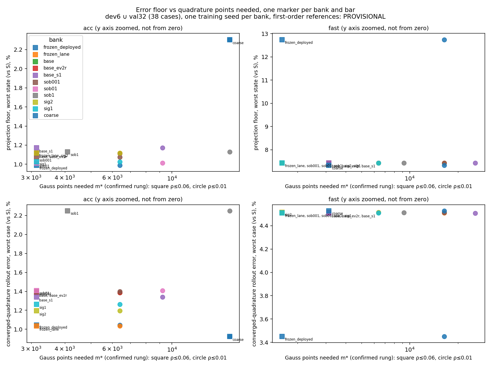
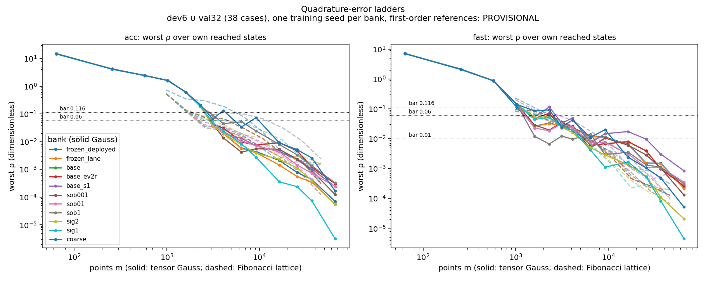
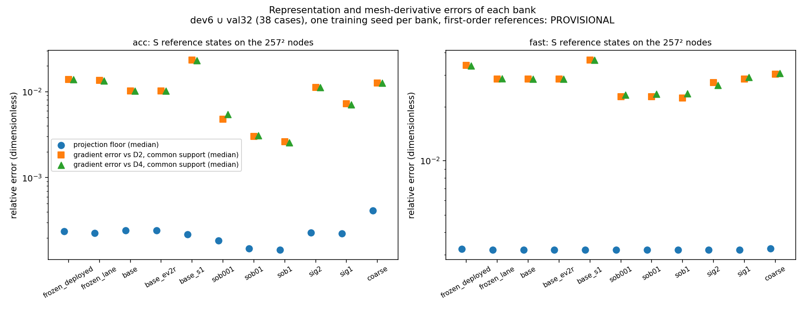
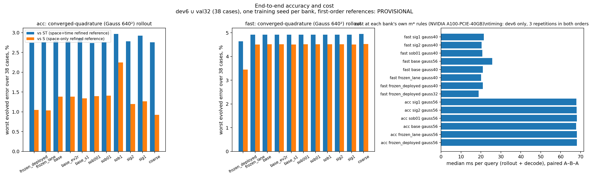
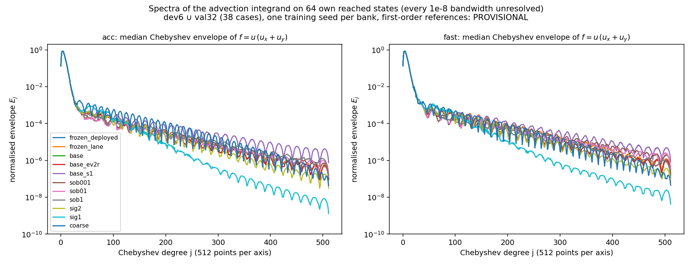

# Smooth and derivative-trained banks for the off-mesh Burgers 2D ROM (lane C3)

Retrains the Burgers 2D coordinate-network bank with a gradient-matching (Sobolev) loss and with smaller initial random-Fourier-feature scales, and measures what that does to the quadrature points the off-mesh ROM needs and to its accuracy. Status: **rounds 1 and 2 (when present), development/validation cohorts (dev6 ∪ val32) only; every accuracy number is PROVISIONAL** because the references are first-order (ST = space+time refined, S = space-only refined; both reported). Generated by `make_report.py` from the run JSONs; pre-registration `DESIGN.md` (amendments A1–A6).

## What ran

| job | role | GPU | job id | content |
|---|---|---|---|---|
| `tr1b,tr2` | training | NVIDIA A100-PCIE-40GB | 5016275 | base, base_s1, coarse, sig1, sig2, sob001, sob01, sob1 |
| `ev1,ev2r` | evaluation at $1024^2$ | NVIDIA A100-PCIE-40GB | 5027022 | frozen_deployed, frozen_lane, base, base_ev2r, base_s1, sob001, sob01, sob1, sig2, sig1, coarse |
| `ev1,ev2r` (timing) | paired timing | NVIDIA A100-PCIE-40GB | 5027022 | m* rules of every bank |

## Answers in brief (generated; PROVISIONAL, development/validation, one training seed per bank)

- **H2 (smoothness lowers the points needed): no resolved improvement** (sig1, sig2: UNRESOLVED; sob01: not met). Own-state $m^*(0.06)$ in `acc`: frozen_deployed 3136, frozen_lane 3136, base 3136, base_ev2r 3136, base_s1 3136, sob001 3136, sob01 3136, sob1 4096, sig2 3136, sig1 3136, coarse 16384. In `fast` it is 3136 for `base` and 1600 / 1600 / 1600 for sig1 / sig2 / sob01. However, `frozen_lane` (the same recipe and seed as `base`) gives 1600, so the pre-registered verdict is UNRESOLVED, not a pass.
- **Onset.** Gauss 32² gives worst ρ 1.61–1.61 in `acc` for every bank. The restricted-vector diagnostic (first 320 tests only, own denominator, solver not rerun) gives 0.107–0.142. This is consistent with a test-frequency contribution to the onset.
- **Tail.** Smaller initial σ gives steeper fitted Gauss tails in these runs: in `acc` the fitted parameter is 1.0221 (base), 1.0251 (sig2) and 1.0322 (sig1); over all banks and settings it spans 1.0166–1.0322. Worst ρ at Gauss 128² is 3.57e-04 (sig1), 9.27e-03 (base) and 2.11e-03 (frozen); at Gauss 256² it is 3.18e-06 (sig1) and 3.09e-04 (base). These rungs lie past the 0.01 bar.
- **Representation.** Neither smaller-σ run increases the median `acc` projection floor (2.43e-04 base, 2.30e-04 sig2, 2.24e-04 sig1). The trained Fourier frequencies stay near their initial scale: the final median ‖B_j‖ is 1.15 for sig1 and 4.64 for base.
- **H1 (Sobolev).** Against the common-support **mesh** derivative targets, sob01 lowers the median gradient error by 70.3% (D2) / 69.7% (D4) and the median projection floor by 38.2% in `acc`. In `fast` the reductions are only 20.2% / 17.8%. Its converged-quadrature rollout error vs S changes by +1.7% (`acc`) and -0.01% (`fast`), so there is no resolved rollout improvement in this run. H1 is not met.
- **Rollout accuracy.** Lower projection and derivative errors did not produce a resolved rollout improvement, and the limiting contribution is not isolated here. Across all evaluated banks the worst `acc` error against ST lies in 2.738–2.966%, and against S in 0.924–2.248%. The `base` vs `frozen_lane` comparator differs by 33.9% on `acc` $E_S$, so no treatment-versus-base `acc` $E_S$ change clears the pre-registered noise gate.
- **Evaluation procedure.** The same frozen bank gives a worst `fast` S error of 3.451% under the 2D lane's deployed procedure (head-based rotation, trust radius and coefficient population) and 4.510% under this lane's least-squares procedure (A1.2). In `acc` the two are close (1.046% vs 1.034%). Retrained banks must be compared with `frozen_lane`.
- **Cost.** At the fixed `acc` setting and rule (every bank's $m^*$ there is the same Gauss rung), the observed per-query medians lie in 67.8–68.2 ms on one NVIDIA A100-PCIE-40GB.
- **Seed variance (round 2).** `base_s1` (seed 1) differs from `base` by -3.4% (`acc`) and -0.1% (`fast`) in converged-quadrature rollout error vs S, by +128.7% in the `acc` gradient error, and needs m*(0.06) = 3136 (`acc`) / 3136 (`fast`) points. These differences enter the noise yardstick below.
- **Re-evaluation.** `base` evaluated again in the round-2 job on a different A100 model (ev2r) reproduces its round-1 metrics to a largest relative difference of 7.5e-15.
- **Derivatives across all banks (descriptive).** In `acc` every Sobolev bank's median gradient error on the common support (2.60e-03–4.79e-03) lies below every value-only bank's (7.19e-03–0.0233). The value-only banks alone vary by a factor of 3.2 between seeds and recipes, so the pre-registered treatment-versus-base gate (whose noise yardstick now includes `base_s1`) does not resolve the effect.
- **λ ladder (gradient error D2 / projection floor / E_S, change vs base, `acc`; m*(0.06) acc/fast):** λ=0.01: -53% / -23% / +1.0%; 3136/1600; λ=0.1: -70% / -38% / +1.7%; 3136/1600; λ=1.0: -74% / -41% / +62.3%; 4096/1600.
- **Coarse-data control.** On the common 129-node restriction against S, the ROM with the bank trained only on 129-node data has worst error 0.832% (`acc`) / 4.514% (`fast`). The FOM has 7.576% at 129 nodes and 4.117% at 257 nodes, and `base` has 0.876% / 4.358%. See the coarse-control section for ST. The coarse bank needs m*(0.06) = 16384 (`acc`) / 3136 (`fast`) points against base's 3136 / 3136, and its median `acc` projection floor is 4.15e-04 against base's 2.43e-04.
- **Pre-registered outcome:** no useful winner, so nothing is promoted to 3D and `comb` is not run (A1.5) (verdicts below re-read with `base_s1` in the noise yardstick).

## Method in one screen

Each backward-Euler step approximately minimises $\tfrac12\lVert r(c)\rVert_2^2$ by Levenberg–Marquardt, with $r(c)=D\big(Ac-p+\Delta t\,(N(c)+\nu\Lambda Ac)\big)$ ($A=\Phi^{\mathsf T}G'$ the exact projection on the $M$ sine tests, $\Lambda$ their eigenvalues, $D=(I+\Delta t\nu\Lambda)^{-1}$, $p$ the previous step) and the tested advection $N_a(c)=L\sum_q w_q\,\psi_a(x_q)\,u(x_q)\,(u_x+u_y)(x_q)$, where $u=G'(x)c$ is the rotated bank. For a rule $Q$ and a state $c$, $\rho_Q(c)=\lVert N^{Q}(c)-N^{\mathrm{G640}}(c)\rVert_2/\lVert N^{\mathrm{G640}}(c)\rVert_2$. The Sobolev arm adds $\lambda\,\overline{\lVert\nabla\hat u-D_hu\rVert^2}/\overline{\lVert D_hu\rVert^2}$ to the value loss, with $D_h$ second-order central differences on the training mesh. The projection floor is $\min_c\lVert G'c-u_{\rm ref}\rVert/\lVert u_{\rm ref}\rVert$ on the 257² nodes, and the gradient error is that of $\nabla(G'c^\star)$ against $D^{(2)}u_{\rm ref}$ or $D^{(4)}u_{\rm ref}$.

## Training

| bank | σ (initial) | λ | steps | train h | recon mean (train) | train LS floor median / max | ‖B_j‖ median init→final | ‖B_j‖ max init→final | R2a | FD stencil sensitivity (train, median) |
|---|---|---|---|---|---|---|---|---|---|---|
| base | 4.0 | 0.0 | 300000 | 2.98 | 6.95e-03 | 1.79e-04 / 9.14e-03 | 4.84 → 4.64 | 11.57 → 11.19 | 1: 2.402e+00 vs 2.402e+00, 5000: 3.003e-03 vs 2.125e-03 | 3.82e-04 |
| base_s1 | 4.0 | 0.0 | 300000 | 3.01 | 6.87e-03 | 1.68e-04 / 8.62e-03 | 4.86 → 4.64 | 10.94 → 10.51 | n/a | 3.82e-04 |
| sob001 | 4.0 | 0.01 | 300000 | 4.64 | 6.89e-03 | 1.33e-04 / 7.18e-03 | 4.84 → 4.64 | 11.57 → 11.03 | n/a | 3.82e-04 |
| sob01 | 4.0 | 0.1 | 300000 | 4.67 | 6.87e-03 | 9.95e-05 / 5.89e-03 | 4.84 → 4.50 | 11.57 → 10.85 | n/a | 3.82e-04 |
| sob1 | 4.0 | 1.0 | 300000 | 4.73 | 7.32e-03 | 8.51e-05 / 7.53e-03 | 4.84 → 4.43 | 11.57 → 10.75 | n/a | 3.82e-04 |
| sig2 | 2.0 | 0.0 | 300000 | 3.01 | 7.18e-03 | 1.76e-04 / 8.25e-03 | 2.42 → 2.36 | 5.79 → 5.50 | n/a | 3.82e-04 |
| sig1 | 1.0 | 0.0 | 300000 | 2.99 | 7.67e-03 | 1.83e-04 / 8.65e-03 | 1.21 → 1.15 | 2.89 → 2.77 | n/a | 3.82e-04 |
| coarse | 4.0 | 0.0 | 300000 | 2.41 | 6.47e-03 | 1.46e-04 / 7.47e-03 | 4.84 → 4.66 | 11.57 → 11.13 | n/a | 1.42e-03 |

## Setting `acc` ($R'=384$, $M=1536$)

### Representation and derivatives (discrete, 257² nodes, vs the S reference; PROVISIONAL)

| bank | projection floor median | projection floor worst | gradient error median, D2 all interior | D2 on the D4 support | D4 | gradient error worst (D2) | FD stencil sensitivity (ref., median) |
|---|---|---|---|---|---|---|---|
| frozen_deployed | 2.38e-04 | 9.90e-03 | 0.019 | 0.0139 | 0.0139 | 0.65 | 4.25e-04 |
| frozen_lane | 2.27e-04 | 0.0112 | 0.0188 | 0.0135 | 0.0133 | 0.662 | 4.25e-04 |
| base | 2.43e-04 | 0.0111 | 0.0149 | 0.0102 | 0.0102 | 0.662 | 4.25e-04 |
| base_ev2r | 2.43e-04 | 0.0111 | 0.0149 | 0.0102 | 0.0102 | 0.662 | 4.25e-04 |
| base_s1 | 2.18e-04 | 0.0117 | 0.0307 | 0.0233 | 0.0231 | 0.916 | 4.25e-04 |
| sob001 | 1.86e-04 | 0.0107 | 8.33e-03 | 4.79e-03 | 5.41e-03 | 0.29 | 4.25e-04 |
| sob01 | 1.50e-04 | 0.0101 | 0.013 | 3.02e-03 | 3.08e-03 | 0.318 | 4.25e-04 |
| sob1 | 1.44e-04 | 0.0113 | 0.0185 | 2.60e-03 | 2.56e-03 | 0.812 | 4.25e-04 |
| sig2 | 2.30e-04 | 0.0112 | 0.0164 | 0.0111 | 0.0111 | 0.582 | 4.25e-04 |
| sig1 | 2.24e-04 | 0.0103 | 0.0181 | 7.19e-03 | 7.08e-03 | 0.862 | 4.25e-04 |
| coarse | 4.15e-04 | 0.023 | 0.0134 | 0.0126 | 0.0126 | 0.422 | 4.25e-04 |

### Quadrature points needed (worst ρ over the population ≤ bar, confirmed at every larger rung)

| bank | Gauss m*(0.116) own / common | Gauss m*(0.06) own / common | Gauss m*(0.01) own / common | interpolated m(0.06), descriptive | Fibonacci m*(0.06) own | tail ϱ̂ (R²) | target checks C4 |
|---|---|---|---|---|---|---|---|
| frozen_deployed | 3136 / 9216 | 3136 / 16384 | 6400 / 65536 | 2.89e+03 | 2584 | 1.0207 (0.96) | pass |
| frozen_lane | 3136 / 9216 | 3136 / 16384 | 6400 / 65536 | 2.89e+03 | 2584 | 1.0206 (0.95) | pass |
| base | 3136 / 6400 | 3136 / 6400 | 6400 / 36864 | 2.92e+03 | 6765 | 1.0221 (0.95) | pass |
| base_ev2r | 3136 / 6400 | 3136 / 6400 | 6400 / 36864 | 2.92e+03 | 6765 | 1.0221 (0.95) | pass |
| base_s1 | 3136 / 16384 | 3136 / 25600 | 9216 / 65536 | 2.88e+03 | 2584 | 1.0167 (0.94) | pass |
| sob001 | 3136 / 6400 | 3136 / 16384 | 6400 / 36864 | 2.93e+03 | 2584 | 1.0218 (0.96) | pass |
| sob01 | 3136 / 6400 | 3136 / 9216 | 9216 / 65536 | 2.89e+03 | 2584 | 1.0192 (0.94) | pass |
| sob1 | 3136 / 3136 | 4096 / 9216 | 16384 / 25600 | 3.67e+03 | 17711 | 1.0197 (0.92) | pass |
| sig2 | 3136 / 3136 | 3136 / 6400 | 6400 / 16384 | 2.85e+03 | 4181 | 1.0251 (0.94) | pass |
| sig1 | 3136 / 6400 | 3136 / 6400 | 6400 / 25600 | 2.99e+03 | 4181 | 1.0322 (0.93) | pass |
| coarse | 6400 / 3136 | 16384 / 16384 | 16384 / 25600 | 9.75e+03 | 10946 | 1.0213 (0.97) | pass |

Worst ρ at selected Gauss rungs (own reached states; in brackets: restricted to the first 320 tests, Hari's $M$):

| bank | Gauss 32² | Gauss 48² | Gauss 64² | Gauss 96² | Gauss 128² |
|---|---|---|---|---|---|
| frozen_deployed | 1.61 (0.133) | 0.198 (0.0108) | 0.0197 (6.64e-03) | 4.36e-03 (1.52e-03) | 2.11e-03 (7.48e-04) |
| frozen_lane | 1.61 (0.142) | 0.191 (0.0106) | 0.0196 (6.63e-03) | 3.97e-03 (1.39e-03) | 1.46e-03 (6.12e-04) |
| base | 1.61 (0.125) | 0.195 (0.0305) | 0.0309 (0.012) | 7.50e-03 (2.58e-03) | 9.27e-03 (3.41e-03) |
| base_ev2r | 1.61 (0.125) | 0.195 (0.0305) | 0.0309 (0.012) | 7.50e-03 (2.58e-03) | 9.27e-03 (3.41e-03) |
| base_s1 | 1.61 (0.131) | 0.186 (0.0151) | 0.0196 (7.62e-03) | 7.10e-03 (3.52e-03) | 4.42e-03 (1.61e-03) |
| sob001 | 1.61 (0.135) | 0.193 (8.23e-03) | 0.0135 (6.41e-03) | 5.57e-03 (2.36e-03) | 5.32e-03 (1.88e-03) |
| sob01 | 1.61 (0.133) | 0.194 (4.40e-03) | 0.0208 (7.08e-03) | 7.12e-03 (2.43e-03) | 4.29e-03 (1.44e-03) |
| sob1 | 1.61 (0.136) | 0.19 (0.0235) | 0.0446 (0.0147) | 0.0244 (7.96e-03) | 7.92e-03 (2.53e-03) |
| sig2 | 1.61 (0.14) | 0.189 (0.0222) | 0.0199 (0.0109) | 3.86e-03 (1.77e-03) | 2.30e-03 (1.19e-03) |
| sig1 | 1.61 (0.107) | 0.191 (0.014) | 0.0239 (6.61e-03) | 2.76e-03 (8.68e-04) | 3.57e-04 (1.16e-04) |
| coarse | 1.61 (0.14) | 0.213 (0.102) | 0.132 (0.0723) | 0.0735 (0.0358) | 9.11e-03 (3.00e-03) |

### Smoothness (Chebyshev, 64 own reached states)

| bank | u: n(1e-8) median / max | f: n(1e-8) median / max | f: n(1e-4) median | f classification (geometric/algebraic/inconclusive/unresolved) |
|---|---|---|---|---|
| frozen_deployed | unresolved (64/64) | unresolved (64/64) | 145 (49/64 resolved) | 1/24/39/0 |
| frozen_lane | unresolved (64/64) | unresolved (64/64) | 133 (45/64 resolved) | 1/27/36/0 |
| base | unresolved (64/64) | unresolved (64/64) | 112 (45/64 resolved) | 3/37/24/0 |
| base_ev2r | unresolved (64/64) | unresolved (64/64) | 112 (45/64 resolved) | 3/37/24/0 |
| base_s1 | unresolved (64/64) | unresolved (64/64) | 119 (29/64 resolved) | 1/40/23/0 |
| sob001 | unresolved (64/64) | unresolved (64/64) | 105 (49/64 resolved) | 0/52/12/0 |
| sob01 | unresolved (64/64) | unresolved (64/64) | 75.5 (40/64 resolved) | 2/40/22/0 |
| sob1 | unresolved (64/64) | unresolved (64/64) | 85 (43/64 resolved) | 4/48/12/0 |
| sig2 | unresolved (64/64) | unresolved (64/64) | 112 (48/64 resolved) | 6/18/40/0 |
| sig1 | unresolved (64/64) | unresolved (64/64) | 126 (60/64 resolved) | 22/3/39/0 |
| coarse | unresolved (64/64) | unresolved (64/64) | 152 (38/64 resolved) | 20/8/36/0 |

Bandwidths are medians over the states whose n(ε) is resolved (256 vs 512 points agree within 2).

### End-to-end (worst over the 38 cases, evolved error %, PROVISIONAL; ST beside S)

| bank | gref | gauss32 | gauss48 | gauss64 | gauss96 | fib1597 | fib4181 | fib6765 | lat64 |
|---|---|---|---|---|---|---|---|---|---|
| frozen_deployed | 2.747 / 1.046 | 9.659 / 7.780 | 2.767 / 1.031 | 2.746 / 1.046 | 2.747 / 1.064 | 2.754 / 1.178 | 2.745 / 0.988 | 2.746 / 1.031 | 3.384 / 1.347 |
| frozen_lane | 2.764 / 1.034 | 10.054 / 8.198 | 2.786 / 1.008 | 2.765 / 1.042 | 2.764 / 1.033 | 2.763 / 1.092 | 2.762 / 1.029 | 2.765 / 1.037 | 3.337 / 1.263 |
| base | 2.789 / 1.385 | 9.568 / 7.661 | 2.817 / 1.395 | 2.791 / 1.355 | 2.789 / 1.382 | 2.786 / 1.237 | 2.789 / 1.238 | 2.789 / 1.422 | 3.377 / 1.567 |
| base_ev2r | 2.789 / 1.385 | 9.568 / 7.661 | 2.817 / 1.395 | 2.791 / 1.355 | 2.789 / 1.382 | 2.786 / 1.237 | 2.789 / 1.238 | 2.789 / 1.422 | 3.377 / 1.567 |
| base_s1 | 2.859 / 1.339 | 9.531 / 7.585 | 2.888 / 1.341 | 2.859 / 1.338 | 2.859 / 1.338 | 2.846 / 1.335 | 2.863 / 1.346 | 2.860 / 1.340 | 3.460 / 1.467 |
| sob001 | 2.738 / 1.398 | 9.052 / 7.183 | 2.796 / 1.539 | 2.737 / 1.456 | 2.738 / 1.355 | 2.735 / 1.306 | 2.738 / 1.397 | 2.738 / 1.426 | 3.343 / 1.427 |
| sob01 | 2.766 / 1.409 | 9.694 / 8.068 | 2.785 / 1.443 | 2.766 / 1.410 | 2.766 / 1.408 | 2.766 / 1.457 | 2.765 / 1.410 | 2.765 / 1.408 | 3.327 / 1.453 |
| sob1 | 2.966 / 2.248 | 9.122 / 7.379 | 2.933 / 2.199 | 2.977 / 2.237 | 2.970 / 2.254 | 2.898 / 2.252 | 2.789 / 1.989 | 2.883 / 2.136 | 3.395 / 2.010 |
| sig2 | 2.782 / 1.194 | 15.631 / 15.229 | 2.823 / 1.219 | 2.782 / 1.194 | 2.782 / 1.194 | 2.775 / 1.180 | 2.782 / 1.183 | 2.782 / 1.194 | 3.375 / 1.432 |
| sig1 | 2.926 / 1.263 | 9.319 / 7.636 | 2.921 / 1.406 | 2.938 / 1.259 | 2.927 / 1.267 | 2.977 / 1.313 | 2.969 / 1.243 | 2.956 / 1.291 | 3.457 / 1.439 |
| coarse | 2.759 / 0.924 | 9.277 / 7.299 | 2.781 / 0.929 | 2.760 / 0.930 | 2.759 / 0.917 | 2.757 / 0.960 | 2.759 / 0.922 | 2.759 / 0.939 | 3.335 / 1.227 |

Each cell: ST / S.

## Setting `fast` ($R'=128$, $M=512$)

### Representation and derivatives (discrete, 257² nodes, vs the S reference; PROVISIONAL)

| bank | projection floor median | projection floor worst | gradient error median, D2 all interior | D2 on the D4 support | D4 | gradient error worst (D2) | FD stencil sensitivity (ref., median) |
|---|---|---|---|---|---|---|---|
| frozen_deployed | 3.22e-03 | 0.127 | 0.0384 | 0.0339 | 0.0338 | 0.533 | 4.25e-04 |
| frozen_lane | 3.19e-03 | 0.0743 | 0.0333 | 0.0284 | 0.0287 | 0.522 | 4.25e-04 |
| base | 3.19e-03 | 0.0743 | 0.0312 | 0.0285 | 0.0285 | 0.521 | 4.25e-04 |
| base_ev2r | 3.19e-03 | 0.0743 | 0.0312 | 0.0285 | 0.0285 | 0.521 | 4.25e-04 |
| base_s1 | 3.19e-03 | 0.0743 | 0.0407 | 0.0363 | 0.0363 | 0.751 | 4.25e-04 |
| sob001 | 3.19e-03 | 0.0743 | 0.026 | 0.0228 | 0.0232 | 0.244 | 4.25e-04 |
| sob01 | 3.19e-03 | 0.0743 | 0.0262 | 0.0228 | 0.0234 | 0.246 | 4.25e-04 |
| sob1 | 3.19e-03 | 0.0743 | 0.0288 | 0.0223 | 0.0237 | 0.68 | 4.25e-04 |
| sig2 | 3.19e-03 | 0.0743 | 0.0308 | 0.0272 | 0.0263 | 0.432 | 4.25e-04 |
| sig1 | 3.19e-03 | 0.0743 | 0.0349 | 0.0285 | 0.0291 | 0.585 | 4.25e-04 |
| coarse | 3.24e-03 | 0.0733 | 0.0321 | 0.0303 | 0.0306 | 0.536 | 4.25e-04 |

### Quadrature points needed (worst ρ over the population ≤ bar, confirmed at every larger rung)

| bank | Gauss m*(0.116) own / common | Gauss m*(0.06) own / common | Gauss m*(0.01) own / common | interpolated m(0.06), descriptive | Fibonacci m*(0.06) own | tail ϱ̂ (R²) | target checks C4 |
|---|---|---|---|---|---|---|---|
| frozen_deployed | 1024 / 1600 | 1600 / 6400 | 16384 / 25600 | 1.24e+03 | 2584 | 1.0201 (0.94) | pass |
| frozen_lane | 1600 / 1600 | 1600 / 6400 | 16384 / 25600 | 1.29e+03 | 2584 | 1.0200 (0.94) | pass |
| base | 1600 / 3136 | 3136 / 6400 | 6400 / 25600 | 2.41e+03 | 2584 | 1.0211 (0.92) | pass |
| base_ev2r | 1600 / 3136 | 3136 / 6400 | 6400 / 25600 | 2.41e+03 | 2584 | 1.0211 (0.92) | pass |
| base_s1 | 1600 / 3136 | 3136 / 6400 | 25600 / 36864 | 2.71e+03 | 4181 | 1.0166 (0.90) | pass |
| sob001 | 1600 / 1600 | 1600 / 6400 | 16384 / 25600 | 1.31e+03 | 987 | 1.0203 (0.93) | pass |
| sob01 | 1600 / 1600 | 1600 / 4096 | 6400 / 25600 | 1.27e+03 | 1597 | 1.0185 (0.89) | pass |
| sob1 | 1600 / 1600 | 1600 / 1600 | 9216 / 9216 | 1.2e+03 | 2584 | 1.0213 (0.88) | pass |
| sig2 | 1600 / 1600 | 1600 / 3136 | 6400 / 6400 | 1.51e+03 | 2584 | 1.0243 (0.94) | pass |
| sig1 | 1600 / 3136 | 1600 / 6400 | 6400 / 9216 | 1.42e+03 | 2584 | 1.0317 (0.94) | pass |
| coarse | 1600 / 3136 | 3136 / 6400 | 16384 / 16384 | 2.55e+03 | 2584 | 1.0206 (0.96) | pass |

Worst ρ at selected Gauss rungs (own reached states; in brackets: restricted to the first 320 tests, Hari's $M$):

| bank | Gauss 32² | Gauss 48² | Gauss 64² | Gauss 96² | Gauss 128² |
|---|---|---|---|---|---|
| frozen_deployed | 0.114 (0.0526) | 0.0334 (0.0236) | 0.0236 (0.0164) | 0.0113 (7.89e-03) | 6.51e-03 (4.59e-03) |
| frozen_lane | 0.145 (0.0547) | 0.0322 (0.0227) | 0.0228 (0.0159) | 0.0108 (7.57e-03) | 6.26e-03 (4.41e-03) |
| base | 0.143 (0.0734) | 0.0709 (0.0499) | 0.0262 (0.0186) | 6.77e-03 (4.73e-03) | 7.96e-03 (5.62e-03) |
| base_ev2r | 0.143 (0.0734) | 0.0709 (0.0499) | 0.0262 (0.0186) | 6.77e-03 (4.73e-03) | 7.96e-03 (5.62e-03) |
| base_s1 | 0.144 (0.0939) | 0.115 (0.0808) | 0.0487 (0.0344) | 0.0147 (0.0102) | 0.0174 (0.0122) |
| sob001 | 0.145 (0.0349) | 0.0196 (0.0137) | 0.0248 (0.0173) | 0.0105 (7.35e-03) | 6.06e-03 (4.28e-03) |
| sob01 | 0.144 (0.0344) | 0.0184 (0.0127) | 0.0237 (0.0165) | 7.58e-03 (5.25e-03) | 3.08e-03 (2.16e-03) |
| sob1 | 0.144 (0.0365) | 6.63e-03 (4.62e-03) | 9.69e-03 (6.76e-03) | 2.94e-03 (2.02e-03) | 3.52e-03 (2.45e-03) |
| sig2 | 0.144 (0.0595) | 0.0545 (0.0383) | 0.016 (0.0115) | 2.85e-03 (1.98e-03) | 1.35e-03 (9.29e-04) |
| sig1 | 0.142 (0.0575) | 0.0517 (0.0364) | 0.0192 (0.0137) | 1.11e-03 (7.29e-04) | 1.68e-03 (1.17e-03) |
| coarse | 0.141 (0.0464) | 0.0922 (0.0677) | 0.0417 (0.0317) | 0.0201 (0.0149) | 2.38e-03 (1.68e-03) |

### Smoothness (Chebyshev, 64 own reached states)

| bank | u: n(1e-8) median / max | f: n(1e-8) median / max | f: n(1e-4) median | f classification (geometric/algebraic/inconclusive/unresolved) |
|---|---|---|---|---|
| frozen_deployed | unresolved (64/64) | unresolved (64/64) | 131 (27/64 resolved) | 1/23/40/0 |
| frozen_lane | unresolved (64/64) | unresolved (64/64) | 130 (26/64 resolved) | 1/21/42/0 |
| base | unresolved (64/64) | unresolved (64/64) | 129 (41/64 resolved) | 4/39/21/0 |
| base_ev2r | unresolved (64/64) | unresolved (64/64) | 129 (41/64 resolved) | 4/39/21/0 |
| base_s1 | unresolved (64/64) | unresolved (64/64) | 116 (24/64 resolved) | 1/41/22/0 |
| sob001 | unresolved (64/64) | unresolved (64/64) | 133 (30/64 resolved) | 2/43/19/0 |
| sob01 | unresolved (64/64) | unresolved (64/64) | 123 (41/64 resolved) | 1/46/17/0 |
| sob1 | unresolved (64/64) | unresolved (64/64) | 101 (38/64 resolved) | 1/51/12/0 |
| sig2 | unresolved (64/64) | unresolved (64/64) | 129 (42/64 resolved) | 6/15/43/0 |
| sig1 | unresolved (64/64) | unresolved (64/64) | 130 (60/64 resolved) | 17/3/44/0 |
| coarse | unresolved (64/64) | unresolved (64/64) | 153 (36/64 resolved) | 24/9/31/0 |

Bandwidths are medians over the states whose n(ε) is resolved (256 vs 512 points agree within 2).

### End-to-end (worst over the 38 cases, evolved error %, PROVISIONAL; ST beside S)

| bank | gref | gauss32 | gauss48 | gauss64 | gauss96 | fib1597 | fib4181 | fib6765 | lat64 |
|---|---|---|---|---|---|---|---|---|---|
| frozen_deployed | 4.637 / 3.451 | 4.594 / 3.430 | 4.634 / 3.490 | 4.636 / 3.473 | 4.637 / 3.449 | 4.637 / 3.445 | 4.637 / 3.449 | 4.637 / 3.451 | 5.033 / 3.480 |
| frozen_lane | 4.917 / 4.510 | 4.906 / 4.477 | 4.945 / 4.561 | 4.935 / 4.536 | 4.916 / 4.508 | 4.902 / 4.503 | 4.916 / 4.507 | 4.919 / 4.509 | 4.965 / 4.325 |
| base | 4.917 / 4.512 | 4.875 / 4.423 | 4.892 / 4.436 | 4.904 / 4.476 | 4.916 / 4.508 | 4.880 / 4.483 | 4.912 / 4.509 | 4.917 / 4.510 | 4.965 / 4.304 |
| base_ev2r | 4.917 / 4.512 | 4.875 / 4.423 | 4.892 / 4.436 | 4.904 / 4.476 | 4.916 / 4.508 | 4.880 / 4.483 | 4.912 / 4.509 | 4.917 / 4.510 | 4.965 / 4.304 |
| base_s1 | 4.917 / 4.508 | 4.901 / 4.462 | 4.886 / 4.480 | 4.904 / 4.513 | 4.924 / 4.512 | 4.894 / 4.470 | 4.917 / 4.493 | 4.917 / 4.509 | 4.966 / 4.306 |
| sob001 | 4.918 / 4.512 | 4.922 / 4.498 | 4.925 / 4.529 | 4.927 / 4.532 | 4.913 / 4.503 | 4.918 / 4.510 | 4.917 / 4.511 | 4.921 / 4.515 | 4.971 / 4.312 |
| sob01 | 4.917 / 4.512 | 4.906 / 4.495 | 4.926 / 4.525 | 4.931 / 4.532 | 4.914 / 4.510 | 4.912 / 4.509 | 4.914 / 4.508 | 4.917 / 4.513 | 4.971 / 4.313 |
| sob1 | 4.917 / 4.511 | 4.922 / 4.513 | 4.911 / 4.504 | 4.919 / 4.510 | 4.918 / 4.512 | 4.912 / 4.519 | 4.919 / 4.512 | 4.916 / 4.511 | 4.976 / 4.317 |
| sig2 | 4.922 / 4.515 | 4.910 / 4.450 | 4.911 / 4.463 | 4.917 / 4.493 | 4.921 / 4.515 | 4.908 / 4.494 | 4.921 / 4.516 | 4.920 / 4.512 | 4.976 / 4.316 |
| sig1 | 4.916 / 4.509 | 4.897 / 4.468 | 4.906 / 4.489 | 4.914 / 4.506 | 4.916 / 4.510 | 4.917 / 4.500 | 4.915 / 4.506 | 4.916 / 4.510 | 4.975 / 4.315 |
| coarse | 4.948 / 4.526 | 4.944 / 4.531 | 4.948 / 4.478 | 4.949 / 4.564 | 4.954 / 4.516 | 4.942 / 4.507 | 4.951 / 4.521 | 4.945 / 4.531 | 5.181 / 4.381 |

Each cell: ST / S.

## Cost at each bank's own m* rules (median ms per query, one GPU, paired A–B–A, dev6 × 3 repetitions)

| setting | bank | rule | m | median ms | max coefficient difference vs the evaluation rollout |
|---|---|---|---|---|---|
| acc | frozen_deployed | gauss56 | 3136 | 68.1 | 7.16e-16 |
| acc | frozen_lane | gauss56 | 3136 | 68.1 | 1.06e-15 |
| acc | base | gauss56 | 3136 | 67.8 | 9.41e-16 |
| acc | sob01 | gauss56 | 3136 | 68.2 | 9.64e-16 |
| acc | sig2 | gauss56 | 3136 | 68.0 | 6.98e-16 |
| acc | sig1 | gauss56 | 3136 | 67.8 | 8.90e-16 |
| fast | frozen_deployed | gauss32 | 1024 | 18.9 | 1.23e-15 |
| fast | frozen_deployed | gauss40 | 1600 | 20.9 | 1.18e-15 |
| fast | frozen_lane | gauss40 | 1600 | 20.1 | 1.84e-15 |
| fast | base | gauss40 | 1600 | 20.9 | 1.46e-15 |
| fast | base | gauss56 | 3136 | 25.7 | 1.43e-15 |
| fast | sob01 | gauss40 | 1600 | 20.7 | 1.29e-15 |
| fast | sig2 | gauss40 | 1600 | 20.4 | 1.10e-15 |
| fast | sig1 | gauss40 | 1600 | 21.4 | 1.28e-15 |

## Coarse-data control (A1.7, A2.6; PROVISIONAL)

Worst over the 38 cases of the evolved error % on the common 129-node restriction of the references (each cell ST / S). `coarse` was trained only on 129-node data; the FOMs are the training generator at 129 and 257 nodes.

| model | acc | fast |
|---|---|---|
| ROM `coarse` (converged quadrature) | 2.750 / 0.832 | 4.941 / 4.514 |
| ROM `base` (converged quadrature) | 2.756 / 0.876 | 4.854 / 4.358 |
| ROM `base_ev2r` (converged quadrature) | 2.756 / 0.876 | 4.854 / 4.358 |
| FOM, 129 nodes (38 cases) | 9.581 / 7.576 | 9.581 / 7.576 |
| FOM, 257 nodes (38 cases) | 6.170 / 4.117 | 6.170 / 4.117 |

Beating the 129-node FOM supports only the limited claim that the off-mesh accuracy is not solely inherited from finer training data; not beating it would not show that finer data are necessary (A2.6).

## Cost, evaluation job `ev2r` (median ms per query, NVIDIA A100 80GB PCIe; not comparable across jobs)

| setting | bank | rule | median ms |
|---|---|---|---|
| acc | base | gauss56 | 65.3 |
| acc | base_s1 | gauss56 | 66.0 |
| acc | sob001 | gauss56 | 66.9 |
| acc | sob1 | gauss56 | 66.0 |
| acc | sob1 | gauss64 | 79.6 |
| acc | coarse | gauss80 | 99.1 |
| acc | coarse | gauss128 | 196.1 |
| fast | base | gauss40 | 21.4 |
| fast | base | gauss56 | 25.4 |
| fast | base_s1 | gauss40 | 21.5 |
| fast | base_s1 | gauss56 | 25.4 |
| fast | sob001 | gauss40 | 21.3 |
| fast | sob1 | gauss40 | 21.5 |
| fast | coarse | gauss40 | 21.7 |
| fast | coarse | gauss56 | 25.2 |

## Gates and controls

- C2 (bandwidth ordering, manufactured bumps): pass (20 < 64); C3 (kink classified algebraic): pass; C5b (difference stencil response): pass.
- `base` training data: R0 fingerprint matches the original job (pass); R2a step 1 2.402e+00 vs original 2.402e+00 (equal), step 5000 3.003e-03 vs original 2.125e-03 (differs; recorded only, A2.5).
- `base_s1` training data: R0 fingerprint matches the original job (pass).
- `sob001` training data: R0 fingerprint matches the original job (pass).
- `sob01` training data: R0 fingerprint matches the original job (pass).
- `sob1` training data: R0 fingerprint matches the original job (pass).
- `sig2` training data: R0 fingerprint matches the original job (pass).
- `sig1` training data: R0 fingerprint matches the original job (pass).
- `coarse` training data: R0 fingerprint not applicable.
- R2b (local GB10): lane trainer at λ=0 vs the original trainer, max parameter difference 1.503e-02 with default XLA autotuning and 0.000e+00 with deterministic XLA flags (`audits/R2b-evidence.txt`): bit-identical only under deterministic compilation, so retrains are not bitwise reproducible and the noise yardstick is needed.
- C1 stress arm (Gauss 8²): worst ρ 7.04–15 over banks and settings, far above every bar, as expected.
- `frozen_deployed`: C5a min rel. error 2.35e-07; acc: C4 pass, gref-vs-768 rollout 1.54e-11, tight-solver distance 9.77e-06, eligibility ok; fast: C4 pass, gref-vs-768 rollout 1.87e-10, tight-solver distance 1.31e-05, eligibility ok.
- `frozen_lane`: C5a min rel. error 2.25e-07; acc: C4 pass, gref-vs-768 rollout 5.94e-11, tight-solver distance 3.10e-06, eligibility ok; fast: C4 pass, gref-vs-768 rollout 8.83e-11, tight-solver distance 1.70e-05, eligibility ok.
- `base`: C5a min rel. error 1.83e-07; acc: C4 pass, gref-vs-768 rollout 3.60e-11, tight-solver distance 3.03e-06, eligibility ok; fast: C4 pass, gref-vs-768 rollout 4.00e-11, tight-solver distance 1.70e-05, eligibility ok.
- `base_ev2r`: C5a min rel. error 1.83e-07; acc: C4 pass, gref-vs-768 rollout 3.60e-11, tight-solver distance 3.03e-06, eligibility FAILED: rotation diagnostics missing; fast: C4 pass, gref-vs-768 rollout 4.00e-11, tight-solver distance 1.70e-05, eligibility FAILED: rotation diagnostics missing.
- `base_s1`: C5a min rel. error 2.58e-07; acc: C4 pass, gref-vs-768 rollout 6.20e-11, tight-solver distance 3.29e-06, eligibility ok; fast: C4 pass, gref-vs-768 rollout 1.69e-10, tight-solver distance 1.70e-05, eligibility ok.
- `sob001`: C5a min rel. error 1.29e-07; acc: C4 pass, gref-vs-768 rollout 1.98e-10, tight-solver distance 3.20e-06, eligibility ok; fast: C4 pass, gref-vs-768 rollout 3.92e-10, tight-solver distance 1.70e-05, eligibility ok.
- `sob01`: C5a min rel. error 1.25e-07; acc: C4 pass, gref-vs-768 rollout 1.20e-11, tight-solver distance 2.90e-06, eligibility ok; fast: C4 pass, gref-vs-768 rollout 2.17e-11, tight-solver distance 1.70e-05, eligibility ok.
- `sob1`: C5a min rel. error 1.22e-07; acc: C4 pass, gref-vs-768 rollout 1.25e-10, tight-solver distance 2.79e-06, eligibility ok; fast: C4 pass, gref-vs-768 rollout 8.94e-11, tight-solver distance 1.70e-05, eligibility ok.
- `sig2`: C5a min rel. error 1.54e-07; acc: C4 pass, gref-vs-768 rollout 1.10e-13, tight-solver distance 3.06e-06, eligibility ok; fast: C4 pass, gref-vs-768 rollout 1.11e-13, tight-solver distance 1.70e-05, eligibility ok.
- `sig1`: C5a min rel. error 1.75e-07; acc: C4 pass, gref-vs-768 rollout 5.81e-15, tight-solver distance 3.00e-06, eligibility ok; fast: C4 pass, gref-vs-768 rollout 5.83e-15, tight-solver distance 1.70e-05, eligibility ok.
- `coarse`: C5a min rel. error 5.47e-07; acc: C4 pass, gref-vs-768 rollout 7.79e-13, tight-solver distance 3.09e-06, eligibility ok; fast: C4 pass, gref-vs-768 rollout 1.04e-12, tight-solver distance 1.70e-05, eligibility ok.

- **R1** (frozen bank with the deployed rotation reproduces the 2D lane's job 4735709 at $1024^2$; errors PROVISIONAL): pass — acc: Gauss 64² worst ρ on lat64 states 0.0186 (2D lane 0.0186), gref worst ST 2.747% (2.747%), lat64 worst ST 3.384% (3.384%); fast: Gauss 64² worst ρ on lat64 states 0.0233 (2D lane 0.0233), gref worst ST 4.637% (4.637%), lat64 worst ST 5.033% (5.033%).

## Verdicts (DESIGN A1.5, A2.4, A4; PROVISIONAL, development/validation; one seed per arm)

Noise yardstick (max of |base / frozen-lane − 1| and, when present, |base / base_s1 − 1|): acc|E_S 0.339, acc|E_ST 0.024, acc|e_val_med 0.113, acc|e_grad_med 0.514, acc|e_grad2c_med 0.563, acc|e_grad4_med 0.561, fast|E_S 0.001, fast|E_ST 0.000, fast|e_val_med 0.000, fast|e_grad_med 0.234, fast|e_grad2c_med 0.215, fast|e_grad4_med 0.215.

- **sig1**: H1 not met (gradient criterion False, value True, rollout False); H2 UNRESOLVED (every other H2 condition holds at some bar, but base and frozen-lane disagree on m* there) [acc|0.06: ×1.00 (unresolved); fast|0.06: ×1.96 (unresolved); acc|0.01: ×1.00 (unresolved); fast|0.01: ×1.00 (unresolved)]; useful winner: no. Δacc: E_S -8.824%, gradient error (D2 / D4 on the common support) -29.405% / -30.227%, projection floor -7.806%. Δfast: E_S -0.063%, gradient error (D2 / D4 on the common support) -0.094% / 2.131%, projection floor -0.004%.
- **sig2**: H1 not met (gradient criterion False, value True, rollout False); H2 UNRESOLVED (every other H2 condition holds at some bar, but base and frozen-lane disagree on m* there) [acc|0.06: ×1.00 (unresolved); fast|0.06: ×1.96 (unresolved); acc|0.01: ×1.00 (unresolved); fast|0.01: ×1.00 (unresolved)]; useful winner: no. Δacc: E_S -13.784%, gradient error (D2 / D4 on the common support) 9.251% / 9.731%, projection floor -5.277%. Δfast: E_S 0.070%, gradient error (D2 / D4 on the common support) -4.622% / -7.791%, projection floor 0.019%.
- **sob01**: H1 not met (gradient criterion False, value True, rollout False); H2 not met [acc|0.06: ×1.00 (unresolved); fast|0.06: ×1.96 (unresolved); acc|0.01: ×0.69 (unresolved); fast|0.01: ×1.00 (unresolved)]; useful winner: no. Δacc: E_S 1.720%, gradient error (D2 / D4 on the common support) -70.348% / -69.680%, projection floor -38.207%. Δfast: E_S -0.011%, gradient error (D2 / D4 on the common support) -20.198% / -17.772%, projection floor -0.057%.
- **sob001**: H1 not met (gradient criterion False, value True, rollout False); H2 not met [acc|0.06: ×1.00 (unresolved); fast|0.06: ×1.96 (unresolved); acc|0.01: ×1.00 (unresolved); fast|0.01: ×0.39 (unresolved)]; useful winner: no. Δacc: E_S 0.962%, gradient error (D2 / D4 on the common support) -53.019% / -46.682%, projection floor -23.448%. Δfast: E_S 0.006%, gradient error (D2 / D4 on the common support) -20.148% / -18.541%, projection floor -0.059%.
- **sob1**: H1 not met (gradient criterion False, value True, rollout False); H2 not met [acc|0.06: ×0.77 (unresolved); fast|0.06: ×1.96 (unresolved); acc|0.01: ×0.39 (unresolved); fast|0.01: ×0.69 (unresolved)]; useful winner: no. Δacc: E_S 62.297%, gradient error (D2 / D4 on the common support) -74.445% / -74.813%, projection floor -40.642%. Δfast: E_S -0.022%, gradient error (D2 / D4 on the common support) -21.770% / -16.922%, projection floor -0.075%.

Ranking of useful H2 winners (A2.4/A4): none.

## Plots

## Glossary

- **bank** — the frozen coordinate network G(x) whose columns span the reduced trial space; u(x) = G(x)c.
- **σ (initial)** — the standard deviation of the random Fourier frequencies B at initialisation; B is trained afterwards, so the final ‖B_j‖ are also reported.
- **λ** — weight of the gradient-matching (Sobolev) term in the training loss.
- **base** — the original recipe retrained in this lane with the same data and seed: the comparator for every treatment.
- **frozen bank, deployed / lane rotation** — the bank used by the 2D off-mesh lane, evaluated with that lane's rotation (replication) and with this lane's rotation procedure (comparator for base).
- **acc / fast** — linear settings: span of the first R'=384 (acc) or 128 (fast) importance-ordered bank columns, tested against M=1536 or 512 sine functions.
- **ρ** — relative error of a quadrature rule's tested advection vector against the converged target (Gauss 640²), per state.
- **own / common states** — own = the states the bank's own converged rollout reaches (k=1..50, 38 cases); common = the S reference fields projected onto each bank (same physical states for every bank).
- **m*(b)** — smallest rule size whose worst ρ is ≤ b and stays ≤ b at every larger rung; ">N" means no rung reached it.
- **tail ϱ̂** — effective geometric convergence parameter fitted to the median ρ over the resolved Gauss rungs (descriptive, not a certified analyticity width).
- **projection floor** — relative error of the least-squares projection of the reference field onto the bank span, on the 257² nodes.
- **gradient error (D2 / D4)** — relative error of the projection's exact gradient against second- / fourth-order central differences of the reference field.
- **FD stencil sensitivity** — ‖D2 − D4‖/‖D4‖: how much the derivative target itself depends on the stencil (an indicator, not a bound).
- **converged-quadrature rollout error (E_S, E_ST)** — worst error over cases and output times of the ROM with the converged rule (Gauss 640²) against the S or ST reference.
- **ST / S** — refined reference solutions at 8192²: ST also refines time (Δt/16), S keeps the ROM's Δt (space-only).
- **n(ε)** — Chebyshev degree beyond which the coefficient envelope of a field stays below ε; a bandwidth.
- **C2–C6, R0–R2** — pre-registered gates and controls (DESIGN A1.6, A2.5, A4).
- **PROVISIONAL** — the references are first-order; accuracy numbers can move when second-order references exist.
- **recon mean (train)** — mean over the 16 384 training states of the relative L2 error of the trained autodecoder (bank times head) on all training points.
- **train LS floor** — relative error of the least-squares projection of each training state onto the full 512-column bank, on its training mesh (median / max over states).
- **‖B_j‖** — length of the j-th random Fourier frequency vector (cycles per unit length), initial and after training.
- **R2a / R0 / R2b** — replication gates: R0 = training data fingerprint equals the original job; R2a = loss at logged steps equals the original log; R2b = local bitwise parity of the trainer code.
- **gref, lat64, Gauss p², Fibonacci n** — quadrature arms: Gauss 640² (the converged continuum rule), the deployed 63×63 mesh lattice, tensor Gauss–Legendre with p points per axis, rank-1 Fibonacci lattice with n points.
- **evolved error** — the largest error over the five output times after t = 0 (the initial fit is excluded), relative to the initial field norm on the same nodes.
- **common support** — interior nodes at least two nodes from the wall, where both the second- and fourth-order differences exist.
- **interpolated m** — descriptive log-linear interpolation of the points needed between the confirmed rung and the rung below it.
- **R²** — coefficient of determination of the tail fit (1 = a perfect straight line in log ρ against 2p).
- **geometric / algebraic / inconclusive / unresolved** — classification of a Chebyshev envelope: geometric decay (analytic-like), power-law decay, neither fit clearly better, or too few resolved blocks.
- **query ms** — wall time of one ROM query: initial fit, 50 implicit LM steps and decoding six output fields at 1024², median over paired repetitions.
- **coefficient difference vs the evaluation rollout** — relative difference between the coefficients of a timed rollout and those of the same rollout in the evaluation phase (checks that the timed computation is the evaluated one).
- **noise yardstick** — relative difference between base and frozen-lane (same recipe and seed; later also base vs base_s1); a treatment effect counts only if it is more than twice this.
- **C6 / non-accepted exit** — an LM step that stopped on the budget, a tiny step or the damping limit instead of tolerance or stationarity.
- **H1 / H2 / useful winner** — pre-registered hypotheses (Sobolev helps; smoothness reduces points) and the gate for promoting a bank (DESIGN A1.5).
