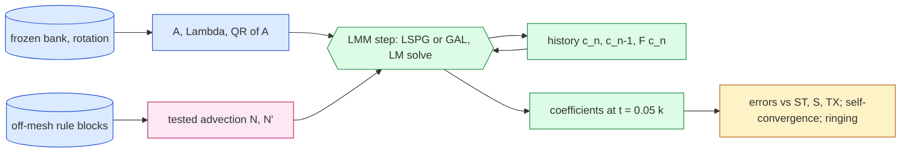

# jcp-time2 — second-order time stepping for the off-mesh coordinate-bank ROM (pre-registration)

Lane C2 of the JCP campaign (`reports/2026-10-06-jcp-offmesh-paper-plan.md` on `main`). Status: **pre-registration,
2026-10-08, before any code.** Amendments are appended at the end, dated; nothing above them is rewritten.

## 1. Question and motivation

The reduced model steps in time with backward Euler (BE). Question: **does a second-order reduced time stepper
(Crank–Nicolson, BDF2) remove the BE time error, and does it allow larger steps so that accuracy and speed improve
together?** Only the time discretisation changes; the frozen bank, the sine tests, the off-mesh quadrature rules and the
Levenberg–Marquardt (LM) solver stay the same.

Evidence (generated by `evidence_be_gap.py` → `checks/evidence-be-gap.json`, read from the 2D lane's pulled results,
dev6 ∪ val32, 38 cases): for every arm and mesh, every case has a larger error against the space+time refined reference
ST ($8192^2$, $\Delta t_0/16$) than against the space-only reference S ($8192^2$, $\Delta t_0$). For the accurate
setting (Gauss $96^2$, $1024^2$) the cohort-median error is 0.906 % against ST and 0.051 % against S, the worst 2.747 %
vs 1.064 %; the per-case gap ST − S has median 0.80 pp and maximum 1.76 pp (fast setting, Fibonacci 1597: 0.50 / 1.19
pp). The brief's "roughly 1–2 pp" is the *maximum* gap; the median gap is 0.5–0.8 pp. Against S, a BE rollout is compared
with a reference that carries the same BE time error at the same $\Delta t$, so the S error is (approximately) the
non-temporal error; the gap is (approximately) BE time error. In the accurate setting it dominates the median error
by a factor of about 18.

## 2. The reduced step, generalised to a two-step linear multistep method

Notation (as the 2D lane): bank coefficients $c\in\mathbb R^{R'}$, $A=\Phi^{\mathsf T}G'\in\mathbb R^{M\times R'}$,
$\Lambda$ the discrete eigenvalues (diagonal, $M$), $N(c)$ the tested advection (off-mesh rule or mesh rule),
$F(c) = N(c) + \nu\Lambda A c$ the tested spatial operator. The semi-discrete statement is
$A\dot c + F(c) \approx 0$ in the $M$ tests (over-determined, $M>R'$).

A two-step linear multistep method (LMM) with coefficients $(\alpha_0,\alpha_1,\alpha_2;\ \beta_0,\beta_1)$:

$$ \mathcal R_n(c) = A(\alpha_0 c + \alpha_1 c_n + \alpha_2 c_{n-1}) + \Delta t\,\big(\beta_0 F(c) + \beta_1 F(c_n)\big). $$

| scheme | $\alpha_0,\alpha_1,\alpha_2$ | $\beta_0,\beta_1$ | order | startup |
|---|---|---|---|---|
| BE (deployed) | $1,-1,0$ | $1,0$ | 1 | — |
| CN (trapezoidal, advection and diffusion) | $1,-1,0$ | $\tfrac12,\tfrac12$ | 2 | — |
| CN-R (CN with damped start) | as CN | as CN | 2 | the first 2 steps by BE |
| BDF2 | $\tfrac32,-2,\tfrac12$ | $1,0$ | 2 | the first step by BE |
| TH06 (control, θ = 0.6) | $1,-1,0$ | $0.6,0.4$ | 1 | — |

A fixed number of BE startup steps adds $O(\Delta t^2)$ local error each, so CN-R and BDF2 stay globally second order.
CN-R is a Rannacher-type start (full BE steps, not half steps) against CN ringing from the initial-fit error in stiff
modes.

**Two solve forms** for each step:

- **LSPG** (deployed form, primary): minimise $\lVert D\,\mathcal R_n(c)\rVert_2$ with
  $D=(\alpha_0 + \beta_0\Delta t\,\nu\Lambda)^{-1}$. For BE this is exactly the deployed residual
  $D(Ac-p+\Delta t(N(c)+\nu\Lambda Ac))$, $D=(1+\Delta t\nu\Lambda)^{-1}$, $p=Ac_n$.
  Jacobian $D(\alpha_0 A + \beta_0\Delta t\,(N'(c) + \nu\Lambda A))$.
- **GAL** (fixed-test Galerkin, diagnostic and candidate): solve the square system
  $Q^{\mathsf T}\mathcal R_n(c)=0$, $A=QR$ the thin QR factorisation. This is exactly the LMM applied to the ODE
  $R\dot c = -Q^{\mathsf T}F(c)$, i.e. $A^{\mathsf T}A\dot c=-A^{\mathsf T}F(c)$, the Galerkin ROM in the sine tests.
  Solved with the same LM (residual driven to zero).

**Why both forms (a pre-registered prediction).** LSPG's normal equations are
$(\alpha_0A+\beta_0\Delta t F')^{\mathsf T}D^2\mathcal R_n = 0$; as $\Delta t\to0$ they tend to
$A^{\mathsf T}(A\dot c+F)=0$, the GAL ODE, so every scheme and both forms converge to the same continuous-time ROM
trajectory $u_\infty$. But at finite $\Delta t$ the LSPG test space $D(\alpha_0A+\beta_0\Delta tF')$ and weight $D$ depend
on $\Delta t$. With $\delta=\mathcal R_n(c)=O(\Delta t)$ the out-of-range residual, the deviation of the LSPG step from the
GAL step is driven by $A^{\mathsf T}(D^2-I)\delta + \beta_0\Delta t F'^{\mathsf T}D^2\delta = O(\Delta t^2)$ per step, i.e.
$O(\Delta t)$ globally. **Prediction: LSPG-CN and LSPG-BDF2 converge to $u_\infty$ at observed order ≈ 1, not 2,
unless the out-of-range residual is small; GAL-CN and GAL-BDF2 converge at order 2.** The order check (section 6, G2)
therefore uses GAL to test the machinery, and reports the LSPG order as a finding. The relative size of the two errors
against the references decides which form is recommended.

Everything else is the deployed linear-rung query (`qcore.make_linear_query`): closed-form initial fit on Gauss-48
samples, quadratic predictor (best residual among the previous state and linear/quadratic extrapolation), fused LM
with Cholesky, step clipped to the trust radius, damping carried between steps. For BDF2/CN the history
$Ac_{n-1}$ and $F(c_n)$ are computed once per step. $\Delta t$, the step count, the output stride, the scheme
coefficients, the startup length and the LM tolerances are **traced** arguments, so one compiled query per
(setting, rule, form) serves every scheme and every $\Delta t$ (no recompilation inside timing).

## 3. Arms

Settings (linear rung, rotated Table-1 Burgers 2D bank, checkpoint `dn256b`, unchanged):

| setting | $R'$ | $M$ | off-mesh rule (selected in the 2D lane) | old method (comparison) |
|---|---|---|---|---|
| acc | 384 | 1536 | Gauss $96^2$ point form ($m=9216$) | mesh lattice $63^2$ (`lat64`) |
| fast | 128 | 512 | Fibonacci 1597 point form | `lat64` |

Mesh $L=1024$ (primary; the off-mesh rules are mesh-invariant to ≤0.02 pp in the 2D lane). Replication at
$L=4096$ of the frozen selection only, if time permits (phase A3).

Time-step ladder ($\Delta t_0=0.005$, output every 0.05 to $t=0.25$; a step must divide 0.05, which excludes
$4\Delta t_0=0.02$, replaced by $5\Delta t_0$):

$$\Delta t\in\{\Delta t_0/8,\ \Delta t_0/4,\ \Delta t_0/2,\ \Delta t_0,\ 2\Delta t_0,\ 5\Delta t_0,\ 10\Delta t_0\}
=\{0.000625,0.00125,0.0025,0.005,0.01,0.025,0.05\}.$$

Grid of runs per setting, every case of dev6 ∪ val32:
- off-mesh rule × {LSPG, GAL} × {BE, CN, CN-R, BDF2} × all 7 $\Delta t$, at the **production** tolerance
  (LSPG: deployed `gtol` $10^{-3}$, step budget 600; GAL: $\lVert Q^{\mathsf T}\mathcal R\rVert\le10^{-10}\lVert Ac_n\rVert$);
- the same grid at the **tight** tolerance (LSPG: `gtol` $10^{-9}$; GAL: $10^{-12}$) for the order check; TH06 is run
  only at the tight tolerance (control);
- `lat64` × LSPG × {BE, CN, BDF2} × $\{\Delta t_0/2,\Delta t_0,2\Delta t_0,5\Delta t_0\}$, production tolerance.

## 4. References (all accuracy is PROVISIONAL)

The 2D lane's stored references at $8192^2$ (sign-upwind, BE, Newton–BiCGStab), restricted to the $257^2$ shared nodes,
checked against that job's manifest (complete, accepted, sha256 per file) exactly as `qstudy.py` does:
**ST** ($\Delta t_0/16$) and **S** ($\Delta t_0$), jobs `refdv` 4734273 (dev6, val32) and `reft` 4734276 (test64).
Both are first order in time and first order (upwind) in space. A secondary, provisional time-extrapolated reference
$\mathrm{TX} = (16\,\mathrm{ST}-\mathrm{S})/15$ (Richardson for a first-order-in-time FOM at fixed mesh) is reported
beside ST; it assumes the FOM is in its asymptotic BE regime between $\Delta t_0$ and $\Delta t_0/16$ and still carries
the $8192^2$ upwind error. **Against S only the BE ROM is meaningful** (S carries BE time error at $\Delta t_0$); the
second-order schemes are judged against ST (and TX). Every accuracy number is labelled provisional because the
second-order references lane has not run.

## 5. Metrics

- $e_{\rm ref}$ (ref ∈ {ST, S, TX}): $\max_{t\in\{0.05,\dots,0.25\}} \lVert u(t)-u_{\rm ref}(t)\rVert_2/\lVert u_0\rVert_2$
  on the $257^2$ shared nodes (the 2D lane's `ref_*_evolved`); cohort worst and median over dev6 ∪ val32.
- **ROM time error** $e_{\rm time}(\text{form},\text{scheme},\Delta t)=\max_t\lVert u_{\Delta t}(t)-u_{\rm anc}(t)\rVert/\lVert u_0\rVert$
  against the anchor $u_{\rm anc}$ = GAL-BDF2 at $\Delta t_0/8$, tight tolerance (an estimate of $u_\infty$; its own error is
  estimated by $\lVert u^{\rm GAL\text{-}BDF2}_{\Delta t_0/8}-u^{\rm GAL\text{-}BDF2}_{\Delta t_0/4}\rVert/3$ and reported).
  Also computed for LSPG against an LSPG-free anchor, so it measures distance to the continuous-time ROM.
  Fallback if GAL fails G2 or is unstable: anchor = Richardson $2u^{\rm LSPG\text{-}BE}_{\Delta t_0/8}-u^{\rm LSPG\text{-}BE}_{\Delta t_0/4}$, stated.
- **Observed order** (self-convergence, per case, tight tolerance): $d_k=\max_t\lVert u_{\Delta t_k}-u_{\Delta t_k/2}\rVert/\lVert u_0\rVert$
  on the doubling chain $\Delta t_0/8\ldots2\Delta t_0$; $p_k=\log_2(d_k/d_{k+1})$. Reported per pair; the gate uses the
  finest pair ($\Delta t_0/2,\Delta t_0/4,\Delta t_0/8$), median over cases. A pair with $d<10^{-10}$ is "below solver
  noise" and excluded (count reported).
- **Ringing index** (CN diagnostic): with $h$ the tests above the median eigenvalue,
  $\max_n \lVert h\odot A(c_{n+1}-2c_n+c_{n-1})\rVert/(\lVert h\odot A(c_{n+1}-c_n)\rVert+\lVert h\odot A(c_n-c_{n-1})\rVert)$
  over $n\ge2$ (and its step average); 1 for sign-alternating ringing, ≪1 for smooth decay.
- **Solver**: LM iterations per query (total and per-step max), exit reasons, rejections.
- **Cost**: solve time per query (query minus nothing: the decode of six fields is identical for all arms and is timed
  separately), from paired A–B–A timing in one job on one GPU (section 7).

## 6. Gates and controls (checked at one real mesh before any verdict is read)

- **G0 integrity**: GPU backend asserted, x64 + `highest`, reference manifests and sha256 match, cohorts' hashes, all
  outputs finite.
- **G1 reproduction (must hold)**: LSPG-BE at $\Delta t_0$, production tolerance, reproduces the 2D lane's $1024^2$ job
  `dv1024` per case: $|e_{\rm ST}-e^{\rm lane}_{\rm ST}|\le10^{-6}$ and $|e_{\rm S}-e^{\rm lane}_{\rm S}|\le10^{-6}$
  (absolute, fraction of $\lVert u_0\rVert$) for Gauss $96^2$ (acc), Fibonacci 1597 (fast) and `lat64`. Control that must
  fail: the same comparison applied to CN at $\Delta t_0$ must exceed the tolerance on most cases (proves the check can
  fail).
- **G2 order machinery (must pass)**: median observed order at the finest pair: BE (both forms) in $[0.8,1.25]$;
  GAL-CN, GAL-CN-R, GAL-BDF2 in $[1.7,2.3]$. **Must-fail control**: TH06 (θ = 0.6, first order) and BE must *fail* the
  $[1.7,2.3]$ bar. If GAL fails the bar, the lane stops and debugs (no accuracy verdict is read). LSPG orders are
  reported, not gated (section 2 prediction).
- **G3 solver**: production arms reported with exit counts; any budget (reason 0) or damping-limit (reason 3) exit is
  flagged next to the number; an arm with such exits on more than 1 % of steps is not eligible for selection.
- **G4 timing integrity**: every timed output's sha256 equals its warm-up output; same GPU for all timed subjects.

## 7. Timing (paired A–B–A)

Inside one job on one GPU: every compiled query is warmed on every timing case first. For each candidate B (the
production-tolerance grid of the off-mesh rule, both forms, all schemes, $\Delta t\ge\Delta t_0/2$, plus `lat64`
LSPG-BE at $\Delta t_0$) and each of the first 6 dev6 cases, repetitions 3: run A (LSPG-BE at $\Delta t_0$), B, A with a
pre-compiled 0.1 s burn before each call; the paired ratio is $t_B/\tfrac12(t_{A_1}+t_{A_2})$. Reported: median paired
ratio and median absolute ms. The candidate order is randomised (seed fixed).

## 8. Pre-registered hypotheses and selection (dev6 ∪ val32 only)

- **H1 (accuracy at equal step)**: in the acc setting at $\Delta t_0$, the best second-order arm (any form/scheme) has
  cohort-median $e_{\rm ST}$ at most 0.7 × that of LSPG-BE at $\Delta t_0$, and cohort-worst $e_{\rm ST}$ no larger.
- **H2 (bigger steps, accuracy and speed together)**: per setting, some second-order arm with $\Delta t\ge2\Delta t_0$ has
  both cohort-worst and cohort-median $e_{\rm ST}$ ≤ those of LSPG-BE at $\Delta t_0$, and median paired time ratio
  ≤ 0.75.
- **H3 (ringing)**: CN's ringing index is reported per $\Delta t$; if any case has index > 0.5 at a $\Delta t$, CN at that
  $\Delta t$ is labelled ringing and CN-R / BDF2 are preferred.
- **Selection** (per setting): among eligible production arms (G3) whose worst and median $e_{\rm ST}$ are ≤ LSPG-BE at
  $\Delta t_0$, the one with the smallest median paired time ratio ("fast-equal-accuracy"); and among arms with ratio
  ≤ 1.0, the one with the smallest median $e_{\rm ST}$ ("accurate-equal-cost"). Ties by worst $e_{\rm ST}$. Both reported
  with the error-vs-cost Pareto front. Selection reads only dev6 ∪ val32.
- test64 is evaluated at most once, with the selection frozen and committed (`checks/FROZEN-SELECTION.json`),
  for replication only (phase A3, if time permits).

## 9. Fair full-order comparison (2d; designed now, run after 2a–2c)

The project FOM (`engines.make_fom`: sign-upwind, 5-point Laplacian, Newton–BiCGStab with the FFT-DST Helmholtz
preconditioner) generalised to the same LMM: residual
$\alpha_0u+\alpha_1u_n+\alpha_2u_{n-1}+\Delta t(\beta_0F_h(u)+\beta_1F_h(u_n))$ with
$F_h(u)=a_h(u)-\nu\Delta_hu$, preconditioner $(\alpha_0+\beta_0\Delta t\,\nu\lambda)^{-1}$ in the DST basis. Arms at
$L\in\{1024,4096\}$: BE, CN, CN-R, BDF2 at $\Delta t\in\{\Delta t_0/2,\Delta t_0,2\Delta t_0,5\Delta t_0\}$, ntol
$10^{-6}$ / ltol $10^{-8}$ (the 2D lane's timed FOM setting), dev6 ∪ val32 errors against ST/S/TX; paired A–B–A timing
against the ROM's selected arms in the same job (first 6 dev6 cases). Gate: FOM-BE at $\Delta t_0$ reproduces the 2D
lane's FOM rows (`fom_rows` same-grid truth vs ST) within $10^{-6}$; FOM order check on 2 cases at $L=256$
(BE ≈ 1, CN/BDF2 ≈ 2 in self-convergence). The comparison reported later is "best FOM at equal ST error vs best ROM",
both second order. The sign-upwind advection is first order in space, so a second-order FOM in time does not make the
FOM second order overall; that is the references lane's business.

## 10. 3D (after 2D)

Same LMM inserted in `offmesh.make_fsc_rule` (copied, not edited): the 3D model's LSPG residual has the same shape. The
deployed 3D solver does *one* GN sweep per step after 3 adaptive steps; the order check uses the adaptive LM on every
step, the production arms both. Rules: Gauss $24^3$ at $R'=512$, lattice 4096 at $R'=256$; mesh $65^3$ (and $129^3$ if
time); validation cohort 923801 (64 cases; the first 16 if time-limited, stated). Reference: the 3D lane's
$513^3$, $\Delta t=0.0025$ (= $\Delta t_0^{3D}/4$, BE) — an ST-type reference only, so 3D time error is isolated by the
self-convergence anchor (section 5). $\Delta t^{3D}_0=0.01$; ladder $\{\Delta t_0/4,\Delta t_0/2,\Delta t_0,\ldots\}$ with
the same divisibility rule. Details by amendment before code.

## 11. Cohorts

dev6 (seeds 7090702 × 4, 911702 × 2) and val32 (20260927 × 32) for everything that selects; test64 (20260916) only for
replication of the frozen selection; 3D validation 923801. No new cohort is drawn.

## 12. Budget (GPU hours) and jobs (concurrent cap 1)

| job | content | GPU | estimate |
|---|---|---|---|
| local smoke | $L=256$, 2 dev6 cases, all forms/schemes, 3 $\Delta t$ | GB10 (one `jaxrun`) | 0.3 h |
| `a1k` | 2D grid of section 3 + timing, $L=1024$, dev6 ∪ val32 | A100-80G | 1.5 h |
| `fom1` | section 9 | A100-80G (H200 for 4096) | 1.5 h |
| `b3d` | section 10 | H200 | 2 h |
| `a4k` | $L=4096$ replication of the frozen selection (+ test64 once) | H200 | 1 h |

Total ≈ 6 GPU-hours.

## 13. Deliverables

`DESIGN.md`; code (`t2core.py`, `t2run.py`, `audit_t2.py`, cluster `stage.py`/`submit.sh`); `audits/` (every Codex
audit); pulled cluster runs under `runs/` (large files by SHA256 manifest); `make_report.py` → `report.md` (generated
numbers, provisional labels, glossary); PNG plots in `plots/`: error vs $\Delta t$ per scheme with observed orders, error vs
cost per scheme, and (if reached) the second-order FOM comparison.

## Glossary

- **BE / CN / BDF2 / CN-R / TH06**: backward Euler; Crank–Nicolson (trapezoidal); second-order backward differentiation;
  CN with two BE start steps; θ-method with θ = 0.6 (a first-order control).
- **LSPG**: least-squares Petrov–Galerkin, the deployed solve (minimise the weighted residual over the $M$ tests).
- **GAL**: Galerkin with a fixed test space (the residual projected onto the range of $A$ and set to zero).
- **ST / S / TX**: refined references ($8192^2$) at $\Delta t_0/16$, at $\Delta t_0$, and their Richardson combination.
- **dev6, val32, test64**: the development (6), validation (32) and historical test (64) cohorts of initial bumps.
- **observed order**: $\log_2$ of the ratio of successive self-differences when $\Delta t$ is halved.
- **ringing index**: how much the stiff-mode part of the solution flips sign step to step (0 smooth, 1 alternating).
- **paired A–B–A**: time a baseline, a candidate, then the baseline again, back to back, and divide.
- **pp**: percentage points of $\lVert u_0\rVert$.

---

## Amendment A1 (2026-10-08, after the Codex design audit `audits/codex-design.md`; before any code)

Item numbers refer to the audit. Where this amendment and the text above disagree, this amendment governs.

**A1.1 (items 5, 6) Evidence and references restated.** The ST − S numbers of section 1 are *reference-sensitive error
gaps* of six inspected setting/arm combinations, not norms of BE time error; "every arm" means those six, and the
"factor about 18" is a ratio of median reference discrepancies only. `evidence_be_gap.py` is extended to report
$\max_t\lVert \mathrm{S}-\mathrm{ST}\rVert/\lVert u_0\rVert$ per case (the FOM's own BE time-error proxy at $8192^2$). Distances to S are
reported for every arm as *agreement with that discrete solution*; *estimated continuum accuracy* is read from ST and
TX, both provisional, with the ST-vs-TX ranking sensitivity reported; a ranking that changes between ST and TX is
marked reference-dependent. No certified accuracy floor is claimed.

**A1.2 (item 3) LSPG order prediction restated.** With $\widehat D=\alpha_0D\to I$, at the GAL step ($A^{\mathsf T}\delta=0$) the
LSPG stationarity perturbation is $A^{\mathsf T}(\widehat D^2-I)\delta+\tfrac{\beta_0\Delta t}{\alpha_0}F'^{\mathsf T}\widehat D^2\delta$, generically
$O(\Delta t^2)$ per step. Prediction (conditional on smooth solutions, full column rank of $A$, stability, one solution branch,
negligible solve error and a non-vanishing leading perturbation): LSPG-CN/BDF2 converge to the continuous-time ROM at
asymptotic order 1; a small leading coefficient can delay it. LSPG arms are therefore called *CN-family / BDF2-family*
arms, never "second order", unless their measured order says so. The job records rank and condition number of $A$.

**A1.3 (items 8, 12) Self-convergence restated.** $p(h)=\log_2\big(\lVert u_h-u_{h/2}\rVert_{\max}/\lVert u_{h/2}-u_{h/4}\rVert_{\max}\big)$, max over
the five evolved output times, per case, reported for every dyadic $h\in\{2\Delta t_0,\Delta t_0,\Delta t_0/2\}$ (finest triple
$\Delta t_0/2,\Delta t_0/4,\Delta t_0/8$). GAL-BDF2 and GAL-CN are additionally run at $\Delta t_0/16$ (tight), giving one more
triple and an anchor check: $e_{\rm time}$ is renamed **anchor discrepancy** (anchor GAL-BDF2 at $\Delta t_0/16$); the anchor's
own uncertainty is $\lVert u^{\rm anc}_{\Delta t_0/8}-u^{\rm anc}_{\Delta t_0/16}\rVert$ (not divided by 3 unless the measured order at the
finest triple is in [1.7, 2.3]); anchor discrepancies below 3 × that uncertainty are reported as *unresolved*. If GAL
fails G2, no anchor is used and no order claim is made (the LSPG-BE fallback is dropped).
G2 is split: **G2a implementation (must pass)** = manufactured tests (A1.4); **G2b real-data asymptotics** (blocks
order *claims*, is not by itself diagnosed as a bug): per case, the order at the finest valid triple; a triple is
*valid* only if both differences exceed 10 × the solve uncertainty of A1.5; reported per case with the count of valid
cases and outliers (outside the band). A scheme's order claim on real data requires valid triples on ≥ 80 % of the 38
cases and ≥ 80 % of the valid ones inside the band (BE/TH06 [0.8, 1.25]; CN-family/BDF2-family [1.7, 2.3]). Otherwise
"order not established" (with the refinement extension $\Delta t_0/16$ for GAL already included). TH06 and BE are
*empirical* controls: their expected outcome is "outside [1.7, 2.3]"; an inside result is reported as "control
inconclusive (not asymptotic)", not as a pass.

**A1.4 (item 10) Manufactured implementation tests (`test_lmm.py`, CPU, must pass before any GPU run).** The step
function used by the job (same Python code path, small arrays) on a manufactured over-determined system: $M=24$,
$R'=6$, random full-rank $A$, $\Lambda$ spread over $[1,10^3]$, a quadratic $N(c)$ with analytic Jacobian, $\nu=0.05$, smooth
solution to $t=0.25$; reference by GAL-BDF2 at $\Delta t=0.25/2^{14}$. Must pass: GAL-BE and GAL-TH06 order in
[0.85, 1.15], GAL-CN, GAL-CN-R, GAL-BDF2 in [1.85, 2.15] on the triple at $\Delta t\in\{0.25/64,0.25/128,0.25/256\}$.
**Mutation tests (must be detected, i.e. GAL-CN or GAL-BDF2 then lands outside [1.85, 2.15] or the residual check fails):**
(m1) $\alpha_2$ sign flipped in BDF2, (m2) CN's $F(c_n)$ replaced by $F(c_{n-1})$, (m3) the BDF2 history $c_{n-1}$ not shifted
(stale), (m4) output stored one step late, (m5) $D$ built with $\beta_1$ instead of $\beta_0$ (LSPG only: compared with a
direct NumPy LSPG solve, must differ). LSPG orders on the manufactured system are reported (not gated).

**A1.5 (items 11, 13) Stopping, verification and solve uncertainty.**
- LSPG production: deployed (`gtol` $10^{-3}$ on $\lVert J^{\mathsf T}r\rVert/(\lVert J\rVert_F\lVert r\rVert)$, residual tol $10^{-9}\,$scale, budget 600).
  LSPG tight: `gtol` $10^{-10}$, residual tol 0 (disabled), budget 600.
- GAL: `gtol` 0 (disabled); residual tol $\epsilon\lVert Ac_n\rVert$ with $\epsilon=10^{-10}$ (production) / $10^{-13}$ (tight); budget 600.
- Every step's exit is re-verified *inside the job* from the returned state: LSPG accepted iff the recomputed stationarity
  ratio ≤ `gtol` or residual ≤ tol; GAL accepted iff the recomputed root residual ≤ tol. Exit reasons 0 (budget), 3
  (damping limit) and any step failing re-verification (including tiny-step exits, reason 2) are **failed steps**. A
  trajectory with any failed step is **unverified**: excluded from selection, order estimates and the anchor; kept in a
  failure table (per case, per arm, first failed step).
- Solve uncertainty: dev6 (6 cases) is replayed at *tighter* tolerances (LSPG `gtol` $10^{-12}$; GAL $\epsilon=10^{-15}$) for every
  scheme and the dyadic $\Delta t$; $s(h)=\max_t\lVert u^{\rm tight}_h-u^{\rm tighter}_h\rVert/\lVert u_0\rVert$, the per-scheme maximum over the
  six cases is the solve uncertainty used in A1.3. Production-vs-tight discrepancy is reported for every arm.

**A1.6 (item 14) Ringing restated.** For the tests $h$ above the median eigenvalue and increments
$\delta_n=h\odot A(c_{n+1}-c_n)$: alternation index $\mathcal I=\sum_{n,j}\max(0,-\delta_{n,j}\delta_{n-1,j})/\sum_{n,j}|\delta_{n,j}\delta_{n-1,j}|$
(0 for monotone decay of each mode, 1 for sign alternation; 0/0 := 0), and amplitude
$a=\max_n\lVert\delta_n\rVert/\lVert Ac_0\rVert$. A run is labelled **ringing** iff $\mathcal I>0.5$ and $a>10^{-4}$. The normalised second
difference of section 5 is dropped. Effect on selection: none automatic; ringing arms are flagged in every table.

**A1.7 (items 9, 15, 16, 17) Implementation, reproduction and timing.**
- Loop: `lax.while_loop` over a traced step count; outputs in a fixed $(6,R')$ buffer written when $(k+1)\bmod$ keep $=0$;
  statistics accumulated in the carry (no per-step arrays). $F(c_n)$ is computed under `lax.cond(b1 != 0)` so BE/BDF2
  steps do not evaluate it. Argument shapes/dtypes are fixed (f64 scalars for $\Delta t$ and coefficients, int32 counts), and
  the job asserts the compiled-cache size of every query is unchanged across the timing phase.
- G1 split. **G1a (same job, must pass):** generic LSPG-BE at $\Delta t_0$ versus the vendor `qcore.make_linear_query`, per
  case: initial coefficients, the six output coefficient vectors and fields ($\max_t\lVert\Delta u\rVert/\lVert u_0\rVert\le10^{-8}$) and
  total LM iterations (reported; differences explained). **G1b (historical, reported):** vendor BE errors against the
  2D lane's `dv1024` per case, $|\Delta e|\le10^{-5}$.
- Cost = **end-to-end query latency** (initial fit + time stepping + decoding of the six output fields at the mesh), as
  the vendor query. Timing: for each candidate B and timing case, A–B–A with A = generic LSPG-BE at $\Delta t_0$; the
  vendor BE query is also a timed subject (generic-overhead check). Every timed output's 257-node sha256 must equal the
  accuracy-phase output of the same (arm, case) (same GPU, same compiled function); all A/B/A samples persisted with the
  GPU uuid; baseline drift reported as the spread of $t_{A_2}/t_{A_1}$. Six timing cases (first six of dev6), 3
  repetitions; conclusions about speed apply to those cases.

**A1.8 (item 18) Hypotheses and selection, exact.** Candidate universe: the production-tolerance off-mesh arms of
section 3 (both forms, BE/CN/CN-R/BDF2, every $\Delta t$ with a timing, i.e. $\Delta t\ge\Delta t_0/2$), verified on all 38 cases (A1.5);
the comparator LSPG-BE-$\Delta t_0$ is in the set. H1: *exists* a CN/BDF2-family arm at $\Delta t_0$ with median $e_{\rm ST}\le0.7\times$ and
worst $e_{\rm ST}\le1.0\times$ the comparator's. H2: *exists* a CN/BDF2-family arm with $\Delta t\ge2\Delta t_0$, worst and median
$e_{\rm ST}\le$ comparator's, and median paired ratio ≤ 0.75. Selection "fast-equal-accuracy": minimise median paired ratio
subject to worst and median $e_{\rm ST}\le$ comparator; "accurate-equal-cost": minimise median $e_{\rm ST}$ subject to median
paired ratio ≤ 1.0; ties by worst $e_{\rm ST}$, then by larger $\Delta t$. No eligible arm → "none" (the comparator is not
selected by default). Both are also recomputed with TX in place of ST (sensitivity, not selection).

**A1.9 (item 19) test64.** Called *historical-cohort replication* (the cohort was opened by the 2D lane and the rules
inherit that history). Run once, at $L=1024$ (and $4096$ if time), with selection, tolerances, failure rules and
references frozen in `checks/FROZEN-SELECTION.json` before staging.

**A1.10 (items 20, 21) FOM.** The LMM FOM records per step the final nonlinear relative residual and Newton count and
per Newton iteration the linear relative residual; a step with nonlinear residual > ntol or Newton count at its limit
is a failed step and the trajectory is rejected. Tolerance calibration on dev6 only: ntol ∈ {1e-4, 1e-6, 1e-8}, choose
the loosest whose fields differ from the 1e-10 solve by < 1 % of its own ST error. Comparison wording: "best among the
tested FOM configurations" at matched ST error; "second order" only for arms shown so.

**A1.11 (item 22) Attribution.** Added: (i) production-vs-tight discrepancy per arm (A1.5); (ii) higher-quadrature replay:
the same CN-family/BDF2-family/BE arms at $\Delta t\in\{\Delta t_0,2\Delta t_0,5\Delta t_0\}$ with Gauss $192^2$ (acc) and Fibonacci 6765 (fast),
LSPG and GAL, production tolerance, on all 38 cases; its distance from the selected-rule run is reported; (iii) full-mesh
check: every run's anchor discrepancy is computed on the full $1024^2$ mesh as well as on the $257^2$ nodes (ratio reported);
(iv) all output coefficients and initial coefficients are saved, so every error is reconstructable offline by
`audit_t2.py` (independent NumPy decode at the 257² nodes against the stored references).

**A1.12 (item 23) Smoke.** Local GB10: only `test_lmm.py` (CPU) and a sub-minute import/compile check (one case, $L=256$,
two $\Delta t$, one `jaxrun`). The real-size smoke (`smk`, $L=256$ and 1024, dev6 cases 0 and 2, every arm) runs on the
cluster before `a1k`. The local 0.3 h line of section 12 is withdrawn.

## Amendment A2 (2026-10-08, after the re-audit `audits/codex-design-r1.md`; before any run)

**A2.8 Anchor.** Anchor uncertainty uses the metric's own definition:
$U_{\rm anc}=\max_t\lVert u^{\rm anc}_{\Delta t_0/8}-u^{\rm anc}_{\Delta t_0/16}\rVert/\lVert u_0\rVert+s^{\rm anc}_{\Delta t_0/8}+s^{\rm anc}_{\Delta t_0/16}$ ($s$ = solve
uncertainty, A2.11), per case. The anchor is eligible for a case iff its $\Delta t_0/8$ and $\Delta t_0/16$ trajectories and their tighter
replays are verified. $U_{\rm anc}$ is an uncertainty *indicator*. G2a (manufactured) failure stops the lane; G2b (real data)
failure only withholds order claims, and anchor discrepancies are then reported as "distance to GAL-BDF2 at
$\Delta t_0/16$" without a continuous-time interpretation.

**A2.9 G1a tolerances.** The generic step keeps the vendor BE arithmetic order (same residual expression, Jacobian
$A+\Delta t\,S\,N'$, same predictor and LM). Pass: $\max_k\lVert W^{\rm gen}_k-W^{\rm ven}_k\rVert_2/\lVert W^{\rm ven}_0\rVert_2\le10^{-8}$ and
$\lVert w_0^{\rm gen}-w_0^{\rm ven}\rVert\le10^{-12}\lVert w_0^{\rm ven}\rVert$, and the field criterion of A1.7. A failure is diagnosed (per-step
iteration/predictor comparison) before any threshold changes. G1b historical parity tolerance is restored to
$10^{-6}$ and is reported, not gating (different job, commit and possibly GPU).

**A2.10 Manufactured tests (replaces A1.4).** Frozen problem (`test_lmm.py`): seed 20261008, $M=24$, $R'=6$, $A$ Gaussian
$(M,R')$ scaled by $1/\sqrt M$, $\Lambda=\mathrm{geomspace}(1,10^3,M)$, $\nu=0.05$, $N(c)_m=\sum_{ij}T_{mij}c_ic_j$ with $T$ Gaussian
$\times0.3$, $c_0$ Gaussian $\times0.5$; nonstationarity asserted ($\lVert c(0.25)-c_0\rVert>0.1\lVert c_0\rVert$).
**Independent oracle**: SciPy `solve_ivp` (Radau, rtol = atol = $10^{-13}$) on $R\dot c=-Q^{\mathsf T}F(c)$ written in NumPy, at
$t=0.05k$. Gates (GAL): order of the error against the oracle, on $\Delta t\in\{0.25/64,0.25/128,0.25/256\}$: BE, TH06 in
[0.85, 1.15]; CN, CN-R, BDF2 in [1.85, 2.15]. **Step-residual checks** (independent NumPy evaluation of the intended
LMM): runs with keep = 1 and 5 steps; for every scheme and steps 1..5, $\lVert Q^{\mathsf T}\mathcal R_n(c_{n+1})\rVert\le10^{-9}\lVert Ac_n\rVert$ (GAL), and
for LSPG BE/BDF2 the step equals a SciPy weighted least-squares solve of the intended residual within $10^{-7}$ relative.
**Mutations (each must be detected by the named check):** m1 `a2flip` (BDF2): oracle error and step-residual check;
m2 `fn_lag` (CN): step-residual check from step 2; m3 `stale_hist` (BDF2 uses $c_{n-2}$ in place of $c_{n-1}$): step-residual
check from step 3; m4 `late_out` (stores $c_k$ in place of $c_{k+1}$): step-residual check of $c_1$ against $c_0$ and the
oracle error at $t=0.25$; m5 `d_b1` (LSPG BE and BDF2, where $\beta_1=0\neq\beta_0$, nonzero LS residual, nonuniform weights):
SciPy comparison must differ by $>10^{-6}$ relative. LSPG orders against the oracle are reported (not gated).

**A2.11 Solve uncertainty (replaces the last bullet of A1.5).** Zero tolerances only make those tests trigger on
exact zeros (`<=` comparisons); the tiny-step and strict-decrease tests of the LM remain active. Each trajectory
records its achieved worst stationarity ratio and worst residual-to-tolerance ratio. The *tighter* replay (LSPG
`gtol` $10^{-12}$; GAL $\epsilon=10^{-15}$) is run on **every** case and every dyadic $\Delta t$ used for order estimates (not only
dev6); $s_h=\max_t\lVert u^{\rm tight}_h-u^{\rm tighter}_h\rVert/\lVert u_0\rVert$ per case. If the tighter replay is not verified, $s_h$ is
*unresolved* and the triples using it are invalid. A difference $d(h)=\max_t\lVert u_h-u_{h/2}\rVert/\lVert u_0\rVert$ is valid iff
$d(h)>10\,(s_h+s_{h/2})$.

**A2.12 Order claims.** Two fixed triples for every case: finest $(\Delta t_0/2,\Delta t_0/4,\Delta t_0/8)$ and adjacent
$(\Delta t_0,\Delta t_0/2,\Delta t_0/4)$ (GAL-CN/BDF2 also $(\Delta t_0/4,\Delta t_0/8,\Delta t_0/16)$). Per form and scheme, using the finest
triple: "order 2" iff ≥ 80 % of cases valid and ≥ 80 % of valid cases in [1.7, 2.3] and, where the adjacent triple is
also valid, in the same band for ≥ 80 % of those; "order 1" likewise with [0.8, 1.25]; otherwise "not established".
Applied identically to GAL and LSPG (LSPG prediction: order 1, A1.2).

**A2.14 Alternation diagnostic (replaces A1.6).** Per stiff test $j$ and step $n$, an *alternation event* is
$\delta_{n,j}\delta_{n-1,j}<0$ with $\min(|\delta_{n,j}|,|\delta_{n-1,j}|)>\tau\,\lVert Ac_0\rVert_\infty$, $\tau=10^{-5}$; a per-mode run counter counts
consecutive events. $\mathcal I=\sum_{\text{events with run}\ge3}|\delta_{n,j}\delta_{n-1,j}|\,/\,\sum_{\text{amplitude-qualified pairs}}|\delta_{n,j}\delta_{n-1,j}|$
(0/0 := 0). Label **alternating** iff $\mathcal I>0.5$. It remains a diagnostic (no automatic selection effect); the word
"ringing" is used only together with an accuracy degradation against ST at that $\Delta t$.

**A2.15 Timing.** Clock starts after `block_until_ready` of the burn and stops after `block_until_ready` of every
output leaf. Per candidate: paired ratios over 6 cases × 3 repetitions (18); report median, IQR and the number of
outliers (outside median ± 3 MAD); baseline drift $t_{A_2}/t_{A_1}$ likewise.

**A2.18 Selection outcomes.** The comparator's self-ratio is 1 by definition. If the selection returns the comparator the
outcome is "baseline retained (no improvement)"; if the comparator itself is unverified, "no verified candidate"
(selection none). Final tie-break after worst $e_{\rm ST}$ and larger $\Delta t$: form (LSPG before GAL), then scheme order
BE, CN, CN-R, BDF2. Required gates for eligibility: G0, G1a, G2a, G4 and trajectory verification on all 38 cases.

**A2.21 FOM calibration.** Per (mesh, scheme, $\Delta t$): over all dev6 cases, choose the loosest ntol in {1e-4, 1e-6, 1e-8}
whose fields differ from the ntol $10^{-10}$ solve by < 1 % of that case's ST error in every case; the $10^{-10}$ solve must
itself reach its tolerance. A step fails iff its final nonlinear relative residual exceeds ntol or is nonfinite
(reaching the Newton limit with a converged residual is not a failure). Linear (BiCGStab) residuals are recorded and
reported; they do not by themselves reject a converged step.

**A2.22 Attribution.** The higher-quadrature replay covers every *selected* arm whatever its $\Delta t$, in addition to the
$\{\Delta t_0,2\Delta t_0,5\Delta t_0\}$ grid; differences are labelled *quadrature sensitivity*. `audit_t2.py` reconstructs the reference
errors independently and runs index mutations (case permutation, time shift by one output, ST/S swap), each of which
must change the reconstructed errors.

## Amendment A3 (2026-10-08, after `audits/codex-design-r2.md`)

**A3.1 (item 10) Manufactured schedule.** The order steps are $h\in\{0.05/16,0.05/32,0.05/64\}$ (integral output stride;
0.25/64-type steps do not divide 0.05). RNG: NumPy `default_rng(20261008)`, draw order $A$, $T$, $c_0$ ($\Lambda$ is
deterministic). Oracle refinement check: Radau at rtol = atol = $10^{-12}$ vs $10^{-13}$ must differ by less than $10^{-3}\times$
the smallest gated error. m1/m4 oracle thresholds: the mutated error must exceed $10\times$ the unmutated error of the same
scheme at the finest $h$.

**A3.2 (item 11) wording.** $s_h$ is a *solve-sensitivity indicator*, not an error bound.

**A3.3 (item 12) Triples, exactly.** For every form/scheme the **primary** triple is $(\Delta t_0/2,\Delta t_0/4,\Delta t_0/8)$ and the
**adjacent** triple $(\Delta t_0,\Delta t_0/2,\Delta t_0/4)$. GAL-CN/BDF2's $(\Delta t_0/4,\Delta t_0/8,\Delta t_0/16)$ is reported only. Claim test:
primary valid on ≥ 80 % of cases and ≥ 80 % of the valid primary orders in the band; adjacent check over cases where
both triples are valid (denominator reported): ≥ 80 % of them with both orders in the band. If fewer than half of the
cases have both triples valid, the claim carries "(adjacent check unresolved)".

**A3.4 (item 14) Wording.** The diagnostic label is only **alternating**; this lane makes no "numerical ringing" claim.

**A3.5 (item 21) FOM calibration fallback.** Field-discrepancy metric: $\max_t\lVert u-u_{10^{-10}}\rVert/\lVert u_0\rVert$ on the $257^2$
nodes. If no candidate ntol passes, the configuration is run and timed at ntol $10^{-10}$ (labelled).

**A3.6 (item 22) Audit acceptance and rejection.** `audit_t2.py` pins, independently of the job: cohort physical
descriptors and their sha256 (recomputed from `engines.params_draw`), the reference files' sha256 (from the reference
job manifest), the output times (stride rows 0..5 ↔ $t=0.05k$), and per-case metrics recomputed from the saved
coefficients (NumPy decode at the $257^2$ nodes) against the job's values (relative tolerance $10^{-9}$). Acceptance: the
unmutated job output must pass every check. Rejection tests (each must be REJECTED by at least one check): (i) the saved
coefficients with two cases swapped, (ii) the output rows shifted by one time, (iii) ST and S references swapped,
(iv) a reference file whose sha256 differs, (v) a job metric perturbed by 1 %.

## Amendment A4 (2026-10-08, after `audits/codex-design-r3.md`; closes item 12)

**A4.1 Adjacent-check outcomes.** Let $n_{\rm both}$ be the number of cases with both triples valid. If $n_{\rm both}<19$ (half of
38), the claim is made from the primary triple alone and labelled "(adjacent check unresolved)"; this includes
$n_{\rm both}=0$. If $n_{\rm both}\ge19$ and fewer than 80 % of those cases have both orders in the band, the claim is withheld
("not established"). Otherwise the claim stands without qualification.

## Amendment A5 (2026-10-08, after a sub-minute-per-run local machinery check, before the code audit)

A local GB10 check (one dev6 case, $L=256$, fast setting, two $\Delta t$; development only, no verdict read) ran the
driver end to end. It showed:

**A5.1 LSPG tight tolerances were unattainable.** With `gtol` $10^{-10}$ / $10^{-12}$ the LM ended steps by tiny-step
exits with achieved stationarity ratios between about $10^{-10}$ and $4\times10^{-9}$ (the floating-point floor of
$\lVert J^{\mathsf T}r\rVert/(\lVert J\rVert\lVert r\rVert)$ for a nonzero LS residual), so every tight LSPG trajectory was unverified. New
values: LSPG tight `gtol` $10^{-7}$, tighter $10^{-8}$ (tight/tighter distances in the check were $\sim10^{-12}$ of
$\lVert u_0\rVert$, far below the self-differences $\sim10^{-4}$–$10^{-2}$). GAL levels unchanged (they verified).

**A5.2 Cohort hash on the GB10.** Local NumPy reproduces the cohort descriptors to within $3.5\times10^{-18}$ but not
bit-for-bit, so the sha256 differs from the cluster's. Cluster jobs keep the hash assertion; a local run may waive it
(`local_smoke_waives_cohort_hash`), and `audit_t2.py` pins the values to $10^{-15}$ and checks the job's hash against the
reference manifest.

**A5.3 Jobs.** The 2D grid runs as two sequential jobs (`a1kfast`, then `a1kacc`) after the cluster smoke `smk`
(both settings, $L=256$, dev6 cases 0 and 2); concurrency cap 1.

## Amendment A6 (2026-10-08, after the code audit `audits/codex-code-1.md`)

**A6.1 Grid.** Tighter replays also at $2\Delta t_0$ (all dyadic $\Delta t$ of both triples, $\Delta t_0/8$ … $2\Delta t_0$). TH06 runs at the
tight tolerance on the full 7-step ladder (section 3), with tighter replays on the dyadic steps.
**A6.2 Verification per form.** GAL steps are accepted only on the residual tolerance (a stationary non-root is a failed
step); LSPG accepts stationarity or residual tolerance. A manufactured test checks that GAL with an unattainable
tolerance is unverified.
**A6.3 Production-vs-tight** is reported for the main-rule arms (the `hq` and `old` arms have no tight counterparts).
**A6.4 G2a certificate.** `checks/test_lmm.json` (all gates pass, with the sha256 of `t2core.py` and `test_lmm.py`) is
committed; staging refuses unless it passes and matches the staged `t2core.py`; the audit re-checks this against the
job's provenance. The audit also requires exact run/case inventories, shapes, mandatory metrics, timing sample counts,
the vendor-subject output hashes and compiled-cache sizes, finiteness and the precision line, exits nonzero on failure,
and never passes a partial (`--max-cases`) audit. Submission takes an `flock` on the namespace and refuses while any
`t2_` job is live.

## Amendment A7 (2026-10-08, at the coordinator's suggestion relayed from lane C1; before any 1024 job)

Lane C1 (wide bank) reports, from a 2-case smoke, that against S the whole bank ($R'=512$) is about 10× more accurate
than $R'=128$, while against ST both sit at 0.5–1.3 % because the BE time error dominates. To let the combined effect
be shown later, a third setting is added: **`wide`** = linear rung, $R'=512$ (the whole rotated bank), $M=2048$ (the
$M$ lowest discrete sine tests, $\kappa=4$ as `acc`/`fast`; C1's shell-completed $M$ is not used), main rule **Gauss
$128^2$** (unselected: no rule selection exists at $R'=512$ in the 2D lane; $m$ grows with $R'$ as from fast to acc),
quadrature-sensitivity rule Gauss $192^2$, old method `lat64`. Same grid, gates, metrics and selection rules as the
other settings; job `a1kwide` after `a1kacc` (cap 1), run only if time permits. Its hypotheses H1/H2 and selection are
reported as a secondary setting. The rule is not selected, so its quadrature sensitivity is reported beside every
number.

## Amendment A8 (2026-10-08, after the smoke `smk` (job 5012794, A100-80G) passed its independent audit; code audit round 5)

**A8.1 Wall time from the smoke.** Accuracy phase at $L=256$, A100: fast ≈ 21 s of rollouts per case, acc ≈ 100 s per
case (all 232 runs; the ROM's per-step cost does not grow with $L$, only the six-field decodes do), max 16 LM
iterations per step; timing 82 A–B–A records took 43 s (fast) / 78 s (acc). Scaled to 38 cases and 738 records:
fast ≈ 0.5 h, acc ≈ 1.5 h, wide ≈ 5 h (≈ 3.2× acc arithmetic, per the round-5 audit). Requested: `a1kfast` 3 h,
`a1kacc` 4 h, `a1kwide` 12 h, A100-80G, 128 GB host.
**A8.2 Gate status.** Round 5 found no driver, shape or memory defect for the 1024 jobs; its remaining findings concern
`make_report.py` (audit identity binding, smoke labelling, verified-pair masks, wide-setting labels), which gate the
report and are fixed and re-audited before any result is reported. The `wide` disclosure is narrowed: quadrature
sensitivity (Gauss $192^2$) is measured for the production arms with $\Delta t\ge\Delta t_0/2$, not for the order or anchor runs.

## Amendment A9 (2026-10-08, after the FOM code audit `audits/codex-fom-1.md`; before `fom1k`)

**A9.1 FOM diagnostics.** `fom2.py` returns per-step arrays (final nonlinear relative residual, Newton count, worst
BiCGStab relative residual) besides the aggregates.
**A9.2 Calibration.** The tight solve is $(\mathrm{ntol},\mathrm{ltol})=(10^{-10},10^{-12})$; it must verify in all six dev6 cases,
otherwise the configuration is *unresolved* and excluded from every comparison. The candidates use ltol $10^{-8}$; the
fallback (no candidate passes) is the tight pair itself. The denominator is the tight solve's ST error per case.
**A9.3 ROM arms inside the FOM job.** The ROM arms compared with the FOM are evaluated on all 38 cases *in the same job*
(production tolerances as `t2run.py`): errors, verification and restricted-field hashes; their timed outputs must
match those evaluation outputs. Arms: fast and acc, LSPG and GAL, BE/CN/CN-R/BDF2, $\Delta t/\Delta t_0\in\{1/2,1,2,5,10\}$ (the
`t2run` timed set). The accuracy numbers of this job and of `a1k*` must agree (cross-job check in the audit/report).
**A9.4 Comparison rule ("best among the listed configurations").** For each verified ROM arm, the matched FOM is the
cheapest verified, calibrated FOM configuration (median paired time) whose cohort-worst ST error is ≤ the ROM arm's;
the reported speed-up is FOM time / ROM time (both from this job, same GPU). Accuracy over 38 cases; timing over the
six dev6 timing cases. "Second order" is used only for arms whose order is established (FOM: the L=256 order check;
ROM: `a1k*`).
**A9.5 Audit.** `audit_fom.py` derives every inventory from the staged, provenance-authenticated config; enforces the FOM
order check (BE [0.8, 1.25], CN/CN-R/BDF2 [1.7, 2.3] at the finest pair, recomputed from saved fields); re-applies the
calibration rule; re-scores FOM errors from saved fields and ROM errors from saved coefficients; re-hashes the timing
cases; requires the independent BE re-run (skipping it makes the audit incomplete); and has rejection tests.
