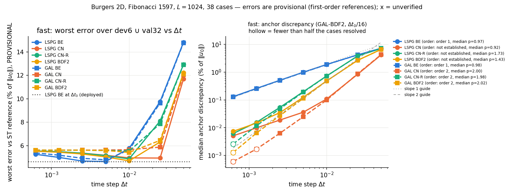
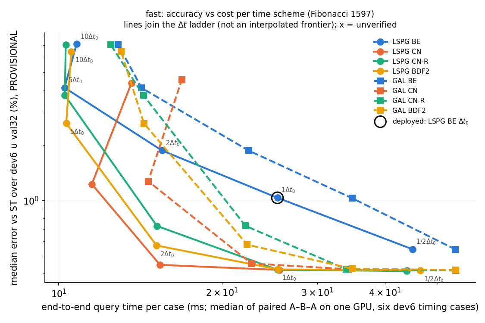
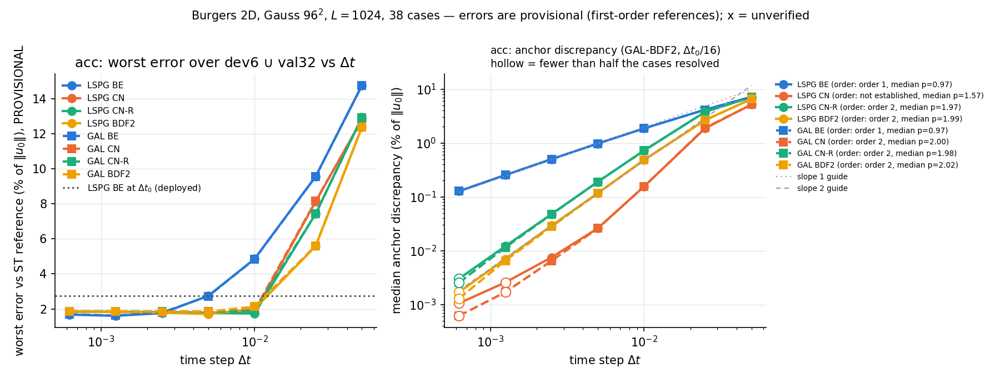
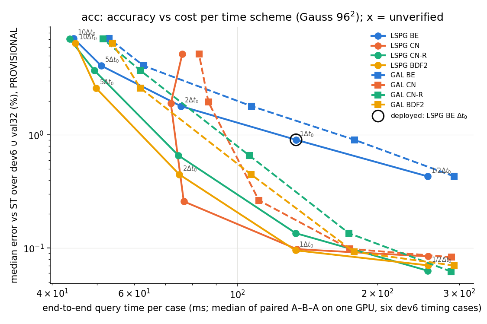
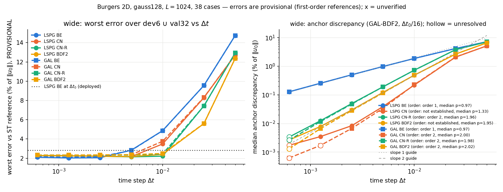
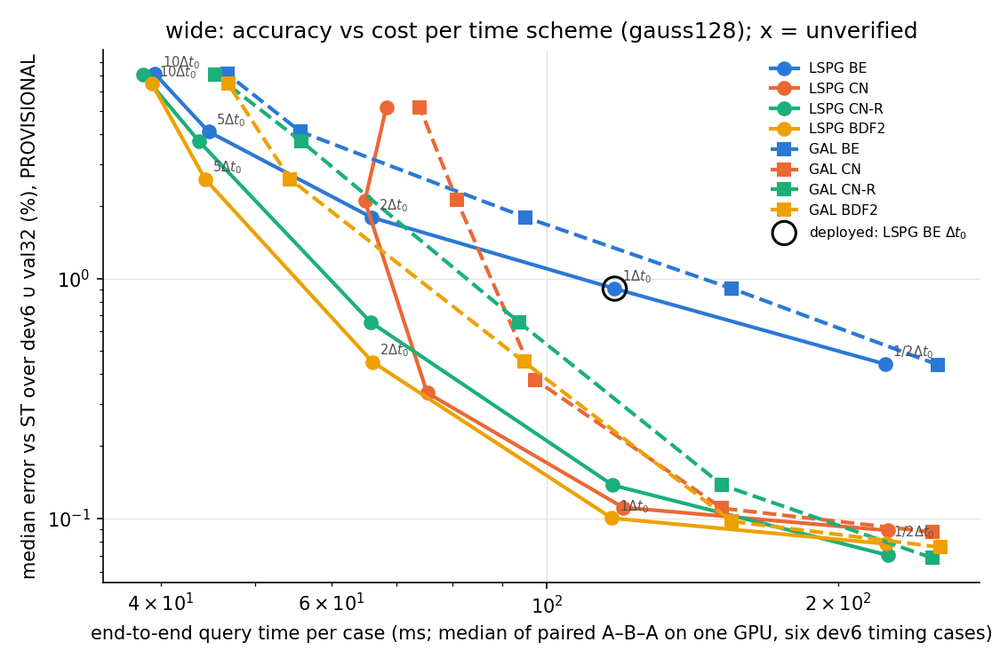
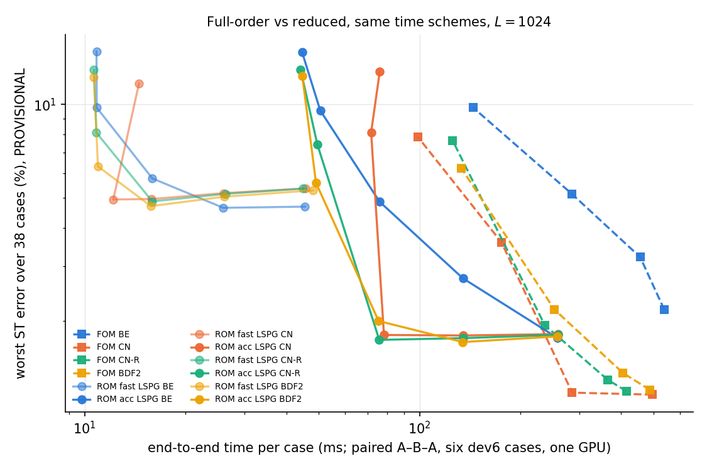
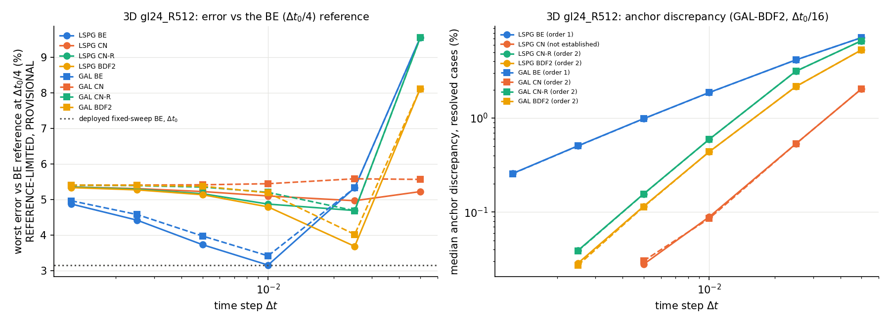
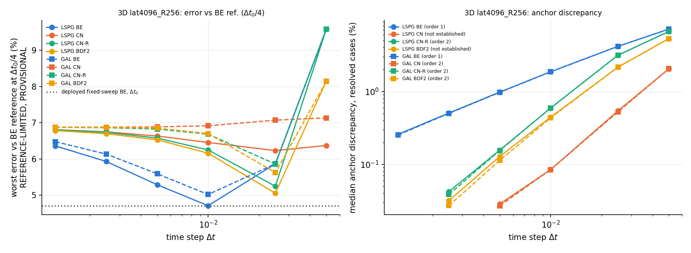

# Second-order time stepping for the off-mesh Burgers 2D ROM (jcp-time2)

Crank–Nicolson, Crank–Nicolson with a damped start, and BDF2 replace backward Euler in the off-mesh coordinate-bank ROM of the 2D quadrature lane. Within a solve form (LSPG, the deployed one, or GAL) only the time discretisation changes; GAL also changes the step equation. Status: **provisional 2D development/validation results (dev6 ∪ val32, 38 cases)**. Meshes: $1024^2$.  Every accuracy number is PROVISIONAL because the references are first order in time and upwind in space (the second-order references lane has not run). Generated by `make_report.py` from the pulled job results; the pre-registration is `DESIGN.md` (amendments A1–A8 apply to these jobs; A9 to the separate FOM comparison).

## What ran

| job | settings | mesh | cases | GPU | job id | elapsed (h) | commit | audit |
|---|---|---|---|---|---|---|---|---|
| `a1kfast` | fast | $1024^2$ | 38 | NVIDIA A100 80GB PCIe | 5012974 | 0.28 | `0a4703af3` | pass |
| `a1kacc` | acc | $1024^2$ | 38 | NVIDIA A100 80GB PCIe | 5015584 | 1.18 | `9c0ea67fa` | pass |
| `a1kwide` | wide | $1024^2$ | 38 | NVIDIA H200 | 5023437 | 1.03 | `35d4df123` | pass |

## Summary (generated; all reference errors PROVISIONAL)

- **2D `fast`** (Fibonacci 1597, $R'=128$): deployed BE at $\Delta t_0$ ST worst/median 4.637/1.035 %; LSPG CN at $\Delta t_0$ 5.171/0.419 % (paired time ratio 0.9933); LSPG CN at $2\Delta t_0$ 4.950/0.446 % (ratio 0.6142). Median anchor discrepancy (time-error estimate) 0.994 % → 0.036 % at $\Delta t_0$. H1 failed, H2 failed; orders: LSPG CN not established, LSPG CNR not established, LSPG BDF2 not established, GAL CN order 2, GAL BDF2 order 2.
- **2D `acc`** (Gauss $96^2$, $R'=384$): deployed BE at $\Delta t_0$ ST worst/median 2.747/0.906 %; LSPG CN at $\Delta t_0$ 1.796/0.098 % (paired time ratio 1.0001); LSPG CN at $2\Delta t_0$ 1.803/0.259 % (ratio 0.5701). Median anchor discrepancy (time-error estimate) 0.978 % → 0.026 % at $\Delta t_0$. H1 passed, H2 passed; orders: LSPG CN not established, LSPG CNR order 2, LSPG BDF2 order 2, GAL CN order 2, GAL BDF2 order 2.
- **2D `wide`** (gauss128, $R'=512$): deployed BE at $\Delta t_0$ ST worst/median 2.837/0.907 %; LSPG CN at $\Delta t_0$ 2.166/0.111 % (paired time ratio 1.0146); LSPG CN at $2\Delta t_0$ 3.481/0.334 % (ratio 0.6342). Median anchor discrepancy (time-error estimate) 0.978 % → 0.039 % at $\Delta t_0$. H1 passed, H2 passed; orders: LSPG CN not established, LSPG CNR order 2, LSPG BDF2 not established, GAL CN order 2, GAL BDF2 order 2.
- **Fair full-order comparison** (`fom1k`): `rom|acc|gauss96|LSPG|BE|1` vs the cheapest full-order configuration of equal or better cohort-worst ST error (`fom|CNR|2`): 1.76× (same job, same GPU; listed configurations only).
- **Fair full-order comparison** (`fom1k`): `rom|acc|gauss96|LSPG|CN|2` vs the cheapest full-order configuration of equal or better cohort-worst ST error (`fom|CN|1`): 3.65× (same job, same GPU; listed configurations only).
- **3D `gl24_R512`**: median anchor discrepancy of LSPG CN at $\Delta t_0$ 0.089 % (resolved cases), paired time ratio to the deployed fixed-sweep BE 1.673; orders: LSPG CN not established, LSPG BDF2 order 2, GAL CN order 2, GAL BDF2 order 2. Reference errors in 3D are reference-limited (A13).
- **3D `lat4096_R256`**: median anchor discrepancy of LSPG CN at $\Delta t_0$ 0.085 % (resolved cases), paired time ratio to the deployed fixed-sweep BE 1.758; orders: LSPG CN not established, LSPG BDF2 not established, GAL CN order 2, GAL BDF2 order 2. Reference errors in 3D are reference-limited (A13).

## The reduced step

A two-step linear multistep method with coefficients $(\alpha_0,\alpha_1,\alpha_2;\beta_0,\beta_1)$ on the tested residual

$$ \mathcal R_n(c)=A(\alpha_0c+\alpha_1c_n+\alpha_2c_{n-1})+\Delta t\,(\beta_0F(c)+\beta_1F(c_n)),\qquad F(c)=N(c)+\nu\Lambda Ac, $$

solved either as **LSPG** (minimise $\lVert D\mathcal R_n\rVert$, $D=(\alpha_0+\beta_0\Delta t\nu\Lambda)^{-1}$; for backward Euler exactly the deployed step) or as **GAL** ($Q^{\mathsf T}\mathcal R_n=0$, $A=QR$: the same method applied to the Galerkin ODE $A^{\mathsf T}A\dot c=-A^{\mathsf T}F(c)$).

## Motivation, re-checked from the 2D lane data

Backward-Euler rollouts of the 2D lane at $1024^2$ (38 cases): accurate setting (Gauss $96^2$) worst/median error 2.747/0.906 % against ST and 1.064/0.051 % against S; fast setting (Fibonacci 1597) 4.637/1.035 % vs 3.445/0.412 %. The per-case gap ST − S has median 0.80 pp and maximum 1.76 pp (accurate), 0.50/1.19 pp (fast). These are reference-sensitive gaps, not norms of the time error. The full-order model's own S-to-ST distance (its backward-Euler time-error proxy at $8192^2$) is 2.65 % worst, 0.91 % median — the same size as the accurate ROM's error against ST. All of these numbers are PROVISIONAL (first-order references).

## Machinery checks

Manufactured tests (`test_lmm.py`, CPU, independent SciPy oracle): all gates pass. Observed orders against the oracle on the finest pair:

| scheme | GAL order | LSPG order |
|---|---|---|
| BE | 0.991 | 0.978 |
| TH06 | 0.981 | 0.985 |
| CN | 2.000 | 0.985 |
| CN-R | 1.989 | 1.071 |
| BDF2 | 2.015 | 1.018 |

Mutations detected: 6 of 6. On the manufactured system the LSPG versions of CN and BDF2 converge at first order to the Galerkin trajectory, as predicted in DESIGN A1.2: the LSPG test space depends on $\Delta t$.

## Setting `fast` (Fibonacci 1597, $R'=128$, $M=512$, $L=1024$, 38 cases)

Gates: G1a (generic LSPG-BE = vendor BE query, same job) max coefficient difference 0.0e+00, field 0.0e+00 (pass); G1b vs the 2D lane: 4.946672411965114e-16 (tol 1e-6, reported); metrics reconstructed independently: pass; timed outputs match accuracy outputs: pass; $A$ rank 128, condition 2.11.

### Accuracy and cost per scheme and step (production tolerance; errors PROVISIONAL, % of $\lVert u_0\rVert$)

| form | scheme | $\Delta t/\Delta t_0$ | ST worst | ST median | TX worst | TX median | S worst | S median | anchor disc. median (%) | resolved | prod vs tight worst (%) | full/257 | paired ratio (IQR) | ms | verified | alternating | quad. sens. worst (%) | HQ ST worst |
|---|---|---|---|---|---|---|---|---|---|---|---|---|---|---|---|---|---|---|
| LSPG | BE | 1/8 | 5.256 | 0.410 | 5.289 | 0.419 | 5.328 | 0.959 | 0.131 | 38/38 | 0.007 (38) | 1.00 (38) | — | — | 38/38 | 0 | — (0) | — |
| LSPG | BE | 1/4 | 4.992 | 0.440 | 5.038 | 0.464 | 4.892 | 0.819 | 0.260 | 38/38 | 0.013 (38) | 1.00 (38) | — | — | 38/38 | 0 | — (0) | — |
| LSPG | BE | 1/2 | 4.678 | 0.542 | 4.750 | 0.584 | 4.208 | 0.577 | 0.510 | 38/38 | 0.006 (38) | 1.00 (38) | 1.7659 (1.66–1.78) | 45.0 | 38/38 | 0 | 0.077 (38) | 4.677 |
| LSPG | BE | 1 | 4.637 | 1.035 | 4.748 | 1.091 | 3.445 | 0.412 | 0.994 | 38/38 | 0.005 (38) | 1.00 (38) | 1.0000 | 25.3 | 38/38 | 0 | 0.071 (38) | 4.637 |
| LSPG | BE | 2 | 5.770 | 1.873 | 5.928 | 1.937 | 3.686 | 0.995 | 1.894 | 38/38 | 0.014 (38) | 1.00 (38) | 0.6085 (0.60–0.63) | 15.5 | 38/38 | 0 | 0.065 (38) | 5.767 |
| LSPG | BE | 5 | 9.764 | 4.120 | 9.926 | 4.181 | 7.365 | 3.218 | 4.192 | 38/38 | 0.011 (38) | 1.00 (38) | 0.4090 (0.39–0.44) | 10.2 | 38/38 | 0 | 0.058 (38) | 9.762 |
| LSPG | BE | 10 | 14.829 | 7.116 | 14.982 | 7.176 | 12.579 | 6.221 | 7.219 | 38/38 | 0.010 (38) | 1.00 (38) | 0.4274 (0.38–0.44) | 10.8 | 38/38 | 0 | 0.053 (38) | 14.829 |
| LSPG | CN | 1/8 | 5.540 | 0.417 | 5.561 | 0.413 | 5.756 | 1.096 | 0.005 | 27/38 | 0.007 (38) | 1.00 (38) | — | — | 38/38 | 0 | — (0) | — |
| LSPG | CN | 1/4 | 5.478 | 0.417 | 5.500 | 0.413 | 5.682 | 1.097 | 0.010 | 29/38 | 0.017 (38) | 1.00 (38) | — | — | 38/38 | 0 | — (0) | — |
| LSPG | CN | 1/2 | 5.357 | 0.417 | 5.382 | 0.413 | 5.534 | 1.100 | 0.019 | 38/38 | 0.007 (38) | 1.00 (38) | 1.7226 (1.65–1.77) | 43.9 | 38/38 | 0 | 0.082 (38) | 5.354 |
| LSPG | CN | 1 | 5.171 | 0.419 | 5.200 | 0.415 | 5.311 | 1.114 | 0.036 | 38/38 | 0.004 (38) | 1.00 (38) | 0.9933 (0.98–1.01) | 25.5 | 38/38 | 0 | 0.080 (38) | 5.169 |
| LSPG | CN | 2 | 4.950 | 0.446 | 4.982 | 0.433 | 5.076 | 1.172 | 0.108 | 38/38 | 0.040 (38) | 1.00 (38) | 0.6142 (0.60–0.64) | 15.4 | 38/38 | 0 | 0.078 (38) | 4.949 |
| LSPG | CN | 5 | 4.935 | 1.228 | 4.951 | 1.191 | 5.288 | 1.805 | 0.839 | 38/38 | 0.030 (38) | 1.00 (38) | 0.4523 (0.42–0.50) | 11.5 | 38/38 | 0 | 0.080 (38) | 4.934 |
| LSPG | CN | 10 | 11.699 | 4.362 | 11.692 | 4.352 | 11.810 | 4.627 | 4.160 | 38/38 | 0.029 (38) | 1.00 (38) | 0.5241 (0.41–0.64) | 13.6 | 38/38 | 0 | 0.120 (38) | 11.704 |
| LSPG | CN-R | 1/8 | 5.539 | 0.417 | 5.560 | 0.413 | 5.755 | 1.094 | 0.006 | 30/38 | 0.007 (38) | 1.00 (38) | — | — | 38/38 | 0 | — (0) | — |
| LSPG | CN-R | 1/4 | 5.476 | 0.416 | 5.498 | 0.412 | 5.676 | 1.087 | 0.016 | 38/38 | 0.017 (38) | 1.00 (38) | — | — | 38/38 | 0 | — (0) | — |
| LSPG | CN-R | 1/2 | 5.349 | 0.413 | 5.375 | 0.411 | 5.514 | 1.060 | 0.054 | 38/38 | 0.007 (38) | 1.00 (38) | 1.7252 (1.66–1.76) | 43.9 | 38/38 | 0 | 0.082 (38) | 5.346 |
| LSPG | CN-R | 1 | 5.144 | 0.420 | 5.176 | 0.444 | 5.236 | 0.940 | 0.197 | 38/38 | 0.005 (38) | 1.00 (38) | 1.0003 (0.99–1.00) | 25.3 | 38/38 | 0 | 0.079 (38) | 5.142 |
| LSPG | CN-R | 2 | 4.865 | 0.727 | 4.910 | 0.795 | 4.793 | 0.601 | 0.732 | 38/38 | 0.036 (38) | 1.00 (38) | 0.6008 (0.59–0.61) | 15.2 | 38/38 | 0 | 0.074 (38) | 4.864 |
| LSPG | CN-R | 5 | 8.103 | 3.753 | 8.231 | 3.809 | 6.224 | 2.907 | 3.820 | 38/38 | 0.021 (38) | 1.00 (38) | 0.4029 (0.39–0.43) | 10.3 | 38/38 | 0 | 0.064 (38) | 8.095 |
| LSPG | CN-R | 10 | 12.932 | 7.071 | 13.073 | 7.132 | 10.855 | 6.168 | 7.167 | 38/38 | 0.015 (38) | 1.00 (38) | 0.4022 (0.37–0.44) | 10.3 | 38/38 | 0 | 0.053 (38) | 12.932 |
| LSPG | BDF2 | 1/8 | 5.517 | 0.417 | 5.538 | 0.413 | 5.728 | 1.094 | 0.007 | 27/38 | 0.016 (38) | 1.00 (38) | — | — | 38/38 | 0 | — (0) | — |
| LSPG | BDF2 | 1/4 | 5.431 | 0.416 | 5.454 | 0.413 | 5.621 | 1.092 | 0.015 | 38/38 | 0.027 (38) | 1.00 (38) | — | — | 38/38 | 0 | — (0) | — |
| LSPG | BDF2 | 1/2 | 5.281 | 0.416 | 5.308 | 0.413 | 5.431 | 1.079 | 0.035 | 38/38 | 0.008 (38) | 1.00 (38) | 1.8144 (1.77–1.84) | 46.4 | 38/38 | 0 | 0.081 (38) | 5.278 |
| LSPG | BDF2 | 1 | 5.036 | 0.421 | 5.070 | 0.429 | 5.106 | 1.026 | 0.124 | 38/38 | 0.008 (38) | 1.00 (38) | 0.9978 (0.98–1.01) | 25.4 | 38/38 | 0 | 0.078 (38) | 5.034 |
| LSPG | BDF2 | 2 | 4.696 | 0.569 | 4.748 | 0.616 | 4.545 | 0.806 | 0.484 | 38/38 | 0.030 (38) | 1.00 (38) | 0.6048 (0.59–0.61) | 15.1 | 38/38 | 0 | 0.074 (38) | 4.695 |
| LSPG | BDF2 | 5 | 6.311 | 2.635 | 6.435 | 2.692 | 4.549 | 1.808 | 2.667 | 38/38 | 0.015 (38) | 1.00 (38) | 0.4105 (0.39–0.43) | 10.3 | 38/38 | 0 | 0.066 (38) | 6.303 |
| LSPG | BDF2 | 10 | 12.225 | 6.483 | 12.323 | 6.555 | 10.759 | 5.417 | 6.587 | 38/38 | 0.010 (38) | 1.00 (38) | 0.4174 (0.38–0.44) | 10.5 | 38/38 | 0 | 0.058 (38) | 12.225 |
| GAL | BE | 1/8 | 5.376 | 0.411 | 5.406 | 0.420 | 5.480 | 0.960 | 0.128 | 38/38 | 0.000 (38) | 1.00 (38) | — | — | 38/38 | 0 | — (0) | — |
| GAL | BE | 1/4 | 5.183 | 0.441 | 5.223 | 0.465 | 5.150 | 0.819 | 0.254 | 38/38 | 0.000 (38) | 1.00 (38) | — | — | 38/38 | 0 | — (0) | — |
| GAL | BE | 1/2 | 4.916 | 0.541 | 4.977 | 0.583 | 4.581 | 0.579 | 0.501 | 38/38 | 0.000 (38) | 1.00 (38) | 2.1433 (2.12–2.18) | 54.0 | 38/38 | 0 | 0.082 (38) | 4.914 |
| GAL | BE | 1 | 4.783 | 1.029 | 4.882 | 1.085 | 3.978 | 0.411 | 0.978 | 38/38 | 0.000 (38) | 1.00 (38) | 1.3677 (1.34–1.54) | 34.8 | 38/38 | 0 | 0.079 (38) | 4.782 |
| GAL | BE | 2 | 5.637 | 1.873 | 5.791 | 1.936 | 3.845 | 0.987 | 1.873 | 38/38 | 0.000 (38) | 1.00 (38) | 0.8748 (0.87–0.89) | 22.4 | 38/38 | 0 | 0.073 (38) | 5.634 |
| GAL | BE | 5 | 9.644 | 4.107 | 9.815 | 4.167 | 7.233 | 3.205 | 4.176 | 38/38 | 0.000 (38) | 1.00 (38) | 0.5694 (0.54–0.58) | 14.2 | 38/38 | 0 | 0.063 (38) | 9.644 |
| GAL | BE | 10 | 14.784 | 7.109 | 14.937 | 7.169 | 12.536 | 6.214 | 7.210 | 38/38 | 0.000 (38) | 1.00 (38) | 0.5069 (0.45–0.55) | 12.9 | 38/38 | 0 | 0.051 (38) | 14.783 |
| GAL | CN | 1/8 | 5.611 | 0.418 | 5.631 | 0.414 | 5.843 | 1.097 | 0.001 | 0/38 | 0.000 (38) | 1.00 (38) | — | — | 38/38 | 0 | — (0) | — |
| GAL | CN | 1/4 | 5.612 | 0.418 | 5.631 | 0.414 | 5.844 | 1.097 | 0.002 | 0/38 | 0.000 (38) | 1.00 (38) | — | — | 38/38 | 0 | — (0) | — |
| GAL | CN | 1/2 | 5.614 | 0.419 | 5.633 | 0.415 | 5.846 | 1.100 | 0.006 | 36/38 | 0.000 (38) | 1.00 (38) | 2.1205 (2.09–2.15) | 54.0 | 38/38 | 0 | 0.086 (38) | 5.610 |
| GAL | CN | 1 | 5.621 | 0.423 | 5.640 | 0.417 | 5.857 | 1.114 | 0.025 | 38/38 | 0.000 (38) | 1.00 (38) | 1.3544 (1.29–1.53) | 34.2 | 38/38 | 0 | 0.086 (38) | 5.617 |
| GAL | CN | 2 | 5.650 | 0.454 | 5.668 | 0.438 | 5.900 | 1.172 | 0.099 | 38/38 | 0.000 (38) | 1.00 (38) | 0.8892 (0.88–0.90) | 22.7 | 38/38 | 0 | 0.086 (38) | 5.646 |
| GAL | CN | 5 | 5.870 | 1.274 | 5.884 | 1.230 | 6.157 | 1.902 | 0.874 | 38/38 | 0.000 (38) | 1.00 (38) | 0.5846 (0.55–0.67) | 14.6 | 38/38 | 0 | 0.087 (38) | 5.866 |
| GAL | CN | 10 | 12.051 | 4.546 | 12.044 | 4.533 | 12.162 | 4.717 | 4.262 | 38/38 | 0.000 (38) | 1.00 (38) | 0.6568 (0.54–0.77) | 16.9 | 38/38 | 0 | 0.124 (38) | 12.043 |
| GAL | CN-R | 1/8 | 5.611 | 0.418 | 5.630 | 0.414 | 5.842 | 1.094 | 0.003 | 1/38 | 0.000 (38) | 1.00 (38) | — | — | 38/38 | 0 | — (0) | — |
| GAL | CN-R | 1/4 | 5.609 | 0.417 | 5.629 | 0.413 | 5.838 | 1.088 | 0.012 | 37/38 | 0.000 (38) | 1.00 (38) | — | — | 38/38 | 0 | — (0) | — |
| GAL | CN-R | 1/2 | 5.604 | 0.415 | 5.625 | 0.413 | 5.826 | 1.060 | 0.048 | 38/38 | 0.000 (38) | 1.00 (38) | 2.1190 (2.10–2.14) | 54.0 | 38/38 | 0 | 0.085 (38) | 5.601 |
| GAL | CN-R | 1 | 5.585 | 0.423 | 5.608 | 0.446 | 5.777 | 0.941 | 0.190 | 38/38 | 0.000 (38) | 1.00 (38) | 1.3493 (1.30–1.54) | 33.9 | 38/38 | 0 | 0.084 (38) | 5.582 |
| GAL | CN-R | 2 | 5.530 | 0.727 | 5.561 | 0.795 | 5.604 | 0.603 | 0.725 | 38/38 | 0.000 (38) | 1.00 (38) | 0.8781 (0.87–0.89) | 22.1 | 38/38 | 0 | 0.082 (38) | 5.527 |
| GAL | CN-R | 5 | 7.866 | 3.741 | 7.993 | 3.798 | 6.090 | 2.893 | 3.806 | 38/38 | 0.000 (38) | 1.00 (38) | 0.5587 (0.53–0.59) | 14.3 | 38/38 | 0 | 0.070 (38) | 7.860 |
| GAL | CN-R | 10 | 12.922 | 7.063 | 13.064 | 7.123 | 10.844 | 6.159 | 7.156 | 38/38 | 0.000 (38) | 1.00 (38) | 0.4870 (0.44–0.54) | 12.5 | 38/38 | 0 | 0.054 (38) | 12.923 |
| GAL | BDF2 | 1/8 | 5.611 | 0.418 | 5.631 | 0.414 | 5.842 | 1.095 | 0.001 | 0/38 | 0.000 (38) | 1.00 (38) | — | — | 38/38 | 0 | — (0) | — |
| GAL | BDF2 | 1/4 | 5.611 | 0.418 | 5.631 | 0.414 | 5.842 | 1.092 | 0.006 | 38/38 | 0.000 (38) | 1.00 (38) | — | — | 38/38 | 0 | — (0) | — |
| GAL | BDF2 | 1/2 | 5.609 | 0.419 | 5.629 | 0.415 | 5.836 | 1.079 | 0.027 | 38/38 | 0.000 (38) | 1.00 (38) | 2.1401 (2.13–2.17) | 54.0 | 38/38 | 0 | 0.085 (38) | 5.605 |
| GAL | BDF2 | 1 | 5.584 | 0.425 | 5.605 | 0.432 | 5.792 | 1.026 | 0.113 | 38/38 | 0.000 (38) | 1.00 (38) | 1.3926 (1.34–1.54) | 34.8 | 38/38 | 0 | 0.085 (38) | 5.580 |
| GAL | BDF2 | 2 | 5.416 | 0.575 | 5.449 | 0.619 | 5.478 | 0.807 | 0.484 | 38/38 | 0.000 (38) | 1.00 (38) | 0.8811 (0.87–0.89) | 22.3 | 38/38 | 0 | 0.083 (38) | 5.413 |
| GAL | BDF2 | 5 | 6.446 | 2.630 | 6.558 | 2.688 | 5.057 | 1.802 | 2.665 | 38/38 | 0.000 (38) | 1.00 (38) | 0.5639 (0.51–0.61) | 14.4 | 38/38 | 0 | 0.074 (38) | 6.444 |
| GAL | BDF2 | 10 | 12.112 | 6.474 | 12.210 | 6.545 | 10.645 | 5.408 | 6.575 | 38/38 | 0.000 (38) | 1.00 (38) | 0.5146 (0.45–0.54) | 13.0 | 38/38 | 0 | 0.059 (38) | 12.112 |

Timing detail (all subjects; ratio = candidate / mean of the flanking deployed-BE runs):

| subject | samples | ratio median | ratio IQR | ratio outliers | drift median | drift IQR | drift outliers |
|---|---|---|---|---|---|---|---|
| `main|GAL|BDF2|0.0025|prod` | 18 | 2.140 | 2.134–2.173 | 4 | 0.994 | 0.980–1.000 | 3 |
| `main|GAL|BDF2|0.005|prod` | 18 | 1.393 | 1.341–1.538 | 0 | 1.001 | 0.995–1.012 | 3 |
| `main|GAL|BDF2|0.01|prod` | 18 | 0.881 | 0.874–0.891 | 2 | 1.002 | 0.999–1.011 | 4 |
| `main|GAL|BDF2|0.025|prod` | 18 | 0.564 | 0.508–0.608 | 0 | 0.997 | 0.987–1.004 | 4 |
| `main|GAL|BDF2|0.05|prod` | 18 | 0.515 | 0.452–0.536 | 0 | 1.002 | 0.995–1.006 | 2 |
| `main|GAL|BE|0.0025|prod` | 18 | 2.143 | 2.124–2.184 | 5 | 1.000 | 0.991–1.007 | 3 |
| `main|GAL|BE|0.005|prod` | 18 | 1.368 | 1.342–1.536 | 1 | 0.990 | 0.980–1.003 | 0 |
| `main|GAL|BE|0.01|prod` | 18 | 0.875 | 0.870–0.890 | 3 | 0.991 | 0.978–1.000 | 2 |
| `main|GAL|BE|0.025|prod` | 18 | 0.569 | 0.539–0.582 | 2 | 0.997 | 0.985–1.013 | 3 |
| `main|GAL|BE|0.05|prod` | 18 | 0.507 | 0.450–0.546 | 0 | 0.997 | 0.985–1.012 | 1 |
| `main|GAL|CNR|0.0025|prod` | 18 | 2.119 | 2.096–2.142 | 2 | 0.995 | 0.984–1.007 | 2 |
| `main|GAL|CNR|0.005|prod` | 18 | 1.349 | 1.301–1.535 | 0 | 1.005 | 0.996–1.012 | 4 |
| `main|GAL|CNR|0.01|prod` | 18 | 0.878 | 0.867–0.886 | 2 | 1.002 | 0.998–1.012 | 3 |
| `main|GAL|CNR|0.025|prod` | 18 | 0.559 | 0.529–0.588 | 0 | 0.998 | 0.991–1.010 | 3 |
| `main|GAL|CNR|0.05|prod` | 18 | 0.487 | 0.436–0.542 | 0 | 1.000 | 0.975–1.005 | 0 |
| `main|GAL|CN|0.0025|prod` | 18 | 2.121 | 2.093–2.149 | 1 | 0.997 | 0.991–1.012 | 1 |
| `main|GAL|CN|0.005|prod` | 18 | 1.354 | 1.285–1.526 | 0 | 0.998 | 0.993–1.010 | 3 |
| `main|GAL|CN|0.01|prod` | 18 | 0.889 | 0.878–0.905 | 1 | 0.999 | 0.991–1.014 | 0 |
| `main|GAL|CN|0.025|prod` | 18 | 0.585 | 0.549–0.671 | 1 | 1.013 | 0.999–1.026 | 1 |
| `main|GAL|CN|0.05|prod` | 18 | 0.657 | 0.541–0.766 | 0 | 1.001 | 0.985–1.011 | 2 |
| `main|LSPG|BDF2|0.0025|prod` | 18 | 1.814 | 1.772–1.840 | 4 | 0.997 | 0.992–1.010 | 2 |
| `main|LSPG|BDF2|0.005|prod` | 18 | 0.998 | 0.984–1.015 | 3 | 0.995 | 0.991–1.026 | 6 |
| `main|LSPG|BDF2|0.01|prod` | 18 | 0.605 | 0.591–0.609 | 0 | 0.993 | 0.989–0.997 | 1 |
| `main|LSPG|BDF2|0.025|prod` | 18 | 0.410 | 0.388–0.432 | 4 | 0.999 | 0.990–1.009 | 1 |
| `main|LSPG|BDF2|0.05|prod` | 18 | 0.417 | 0.380–0.444 | 3 | 1.000 | 0.992–1.011 | 1 |
| `main|LSPG|BE|0.0025|prod` | 18 | 1.766 | 1.661–1.784 | 4 | 0.997 | 0.990–1.015 | 3 |
| `main|LSPG|BE|0.01|prod` | 18 | 0.609 | 0.595–0.627 | 3 | 1.005 | 0.994–1.019 | 2 |
| `main|LSPG|BE|0.025|prod` | 18 | 0.409 | 0.389–0.437 | 3 | 0.999 | 0.979–1.008 | 2 |
| `main|LSPG|BE|0.05|prod` | 18 | 0.427 | 0.376–0.444 | 1 | 1.003 | 0.990–1.010 | 2 |
| `main|LSPG|CNR|0.0025|prod` | 18 | 1.725 | 1.656–1.761 | 0 | 1.002 | 0.979–1.009 | 2 |
| `main|LSPG|CNR|0.005|prod` | 18 | 1.000 | 0.992–1.003 | 5 | 0.997 | 0.992–1.006 | 3 |
| `main|LSPG|CNR|0.01|prod` | 18 | 0.601 | 0.594–0.614 | 3 | 1.004 | 0.999–1.017 | 3 |
| `main|LSPG|CNR|0.025|prod` | 18 | 0.403 | 0.389–0.426 | 5 | 0.992 | 0.988–1.003 | 4 |
| `main|LSPG|CNR|0.05|prod` | 18 | 0.402 | 0.369–0.438 | 2 | 0.998 | 0.989–1.003 | 2 |
| `main|LSPG|CN|0.0025|prod` | 18 | 1.723 | 1.654–1.772 | 0 | 1.000 | 0.993–1.012 | 2 |
| `main|LSPG|CN|0.005|prod` | 18 | 0.993 | 0.980–1.010 | 1 | 0.996 | 0.982–1.002 | 2 |
| `main|LSPG|CN|0.01|prod` | 18 | 0.614 | 0.598–0.639 | 1 | 1.004 | 0.995–1.010 | 3 |
| `main|LSPG|CN|0.025|prod` | 18 | 0.452 | 0.421–0.502 | 3 | 0.994 | 0.986–1.004 | 4 |
| `main|LSPG|CN|0.05|prod` | 18 | 0.524 | 0.413–0.643 | 0 | 0.993 | 0.985–1.000 | 4 |
| `old|LSPG|BE|0.005|prod` | 18 | 1.478 | 1.468–1.487 | 2 | 1.007 | 0.991–1.016 | 2 |
| `vendor|LSPG|BE|0.005|prod` | 18 | 0.879 | 0.872–0.885 | 4 | 1.000 | 0.984–1.011 | 1 |

Every trajectory of this setting was verified (every step met its acceptance test).

Comparator: `main|LSPG|BE|0.005|prod` — the deployed backward-Euler step run through this lane's generic code (identical output to the deployed code, G1a), 25.3 ms median. The deployed (vendor) code itself has paired ratio 0.8792 to it, so every paired ratio below is 1.137× larger when measured against the vendor code (the generic code carries a small overhead).

### Observed temporal order (self-convergence, tight tolerance)

| form | scheme | claim | primary median $p$ | valid / cases | adjacent median $p$ | cases with both triples | outside [1.7, 2.3] | outside [0.8, 1.25] | coarse triple median (valid) | finer GAL triple median |
|---|---|---|---|---|---|---|---|---|---|---|
| LSPG | BE | order 1 | 0.97 | 38/38 | 0.95 | 38 | 38 | 1 | 0.91 (38) | — |
| LSPG | CN | not established | 0.92 | 38/38 | 1.12 | 38 | 35 | 12 | 1.67 (38) | — |
| LSPG | CN-R | not established | 1.73 | 38/38 | 1.87 | 38 | 18 | 35 | 1.89 (38) | — |
| LSPG | BDF2 | not established | 1.43 | 38/38 | 1.82 | 38 | 26 | 28 | 1.97 (38) | — |
| LSPG | TH06 | order 1 | 0.94 | 38/38 | 0.90 | 38 | 38 | 0 | 0.84 (38) | — |
| GAL | BE | order 1 | 0.98 | 38/38 | 0.95 | 38 | 38 | 0 | 0.91 (38) | — |
| GAL | CN | order 2 | 2.00 | 38/38 | 2.00 | 38 | 0 | 38 | 2.01 (38) | 2.00 |
| GAL | CN-R | order 2 | 1.98 | 38/38 | 1.96 | 38 | 0 | 38 | 1.92 (38) | — |
| GAL | BDF2 | order 2 | 2.02 | 38/38 | 2.05 | 38 | 0 | 38 | 2.02 (38) | 2.01 |
| GAL | TH06 | order 1 | 0.97 | 38/38 | 0.95 | 38 | 38 | 0 | 0.92 (38) | — |

### Hypotheses and selection (dev6 ∪ val32; PROVISIONAL references)

- H1 (a CN/BDF2-family arm at $\Delta t_0$ with median ST error ≤ 0.7× and worst ≤ the deployed BE): **failed** (none).
- H2 (a CN/BDF2-family arm with $\Delta t\ge2\Delta t_0$, worst and median ST ≤ BE at $\Delta t_0$, paired time ratio ≤ 0.75): **failed** (none).
- Selection against ST (fast-equal-accuracy: cheapest arm with worst and median ST ≤ the comparator's; accurate-equal-cost: smallest median ST among arms with paired ratio ≤ 1, no worst-error constraint): fast-equal-accuracy **baseline retained (no improvement)**; accurate-equal-cost **main|LSPG|CN|0.005|prod**. Sensitivity with TX: main|LSPG|BDF2|0.01|prod / main|LSPG|CN|0.005|prod (reference-dependent).

Old method (deployed mesh lattice $63^2$, LSPG), worst / median ST error (%, PROVISIONAL):

| scheme | $\Delta t/\Delta t_0$ | ST worst | ST median | verified |
|---|---|---|---|---|
| BE | 1/2 | 4.852 | 0.549 | 38/38 |
| BE | 1 | 5.033 | 1.041 | 38/38 |
| BE | 2 | 6.140 | 1.919 | 38/38 |
| BE | 5 | 10.076 | 4.165 | 38/38 |
| CN | 1/2 | 5.175 | 0.432 | 38/38 |
| CN | 1 | 5.028 | 0.430 | 38/38 |
| CN | 2 | 4.826 | 0.440 | 38/38 |
| CN | 5 | 4.736 | 1.157 | 38/38 |
| BDF2 | 1/2 | 5.126 | 0.430 | 38/38 |
| BDF2 | 1 | 4.960 | 0.450 | 38/38 |
| BDF2 | 2 | 4.796 | 0.575 | 38/38 |
| BDF2 | 5 | 6.560 | 2.673 | 38/38 |

## Setting `acc` (Gauss $96^2$, $R'=384$, $M=1536$, $L=1024$, 38 cases)

Gates: G1a (generic LSPG-BE = vendor BE query, same job) max coefficient difference 0.0e+00, field 0.0e+00 (pass); G1b vs the 2D lane: 6.595743916315566e-16 (tol 1e-6, reported); metrics reconstructed independently: pass; timed outputs match accuracy outputs: pass; $A$ rank 384, condition 9.56.

### Accuracy and cost per scheme and step (production tolerance; errors PROVISIONAL, % of $\lVert u_0\rVert$)

| form | scheme | $\Delta t/\Delta t_0$ | ST worst | ST median | TX worst | TX median | S worst | S median | anchor disc. median (%) | resolved | prod vs tight worst (%) | full/257 | paired ratio (IQR) | ms | verified | alternating | quad. sens. worst (%) | HQ ST worst |
|---|---|---|---|---|---|---|---|---|---|---|---|---|---|---|---|---|---|---|
| LSPG | BE | 1/8 | 1.674 | 0.080 | 1.693 | 0.128 | 2.792 | 0.862 | 0.128 | 38/38 | 0.006 (38) | 1.00 (38) | — | — | 38/38 | 0 | — (0) | — |
| LSPG | BE | 1/4 | 1.608 | 0.195 | 1.662 | 0.258 | 2.433 | 0.737 | 0.254 | 38/38 | 0.010 (38) | 1.00 (38) | — | — | 38/38 | 0 | — (0) | — |
| LSPG | BE | 1/2 | 1.761 | 0.431 | 1.890 | 0.491 | 1.791 | 0.492 | 0.501 | 38/38 | 0.002 (38) | 1.00 (38) | 1.9115 (1.88–1.94) | 256.5 | 38/38 | 0 | 0.023 (38) | 1.762 |
| LSPG | BE | 1 | 2.747 | 0.906 | 2.919 | 0.967 | 1.064 | 0.051 | 0.978 | 38/38 | 0.002 (38) | 1.00 (38) | 1.0000 | 133.8 | 38/38 | 0 | 0.028 (38) | 2.747 |
| LSPG | BE | 2 | 4.854 | 1.796 | 5.030 | 1.857 | 2.237 | 0.885 | 1.868 | 38/38 | 0.003 (38) | 1.00 (38) | 0.5627 (0.54–0.57) | 75.7 | 38/38 | 0 | 0.028 (38) | 4.854 |
| LSPG | BE | 5 | 9.557 | 4.091 | 9.728 | 4.152 | 7.043 | 3.185 | 4.161 | 38/38 | 0.005 (38) | 1.00 (38) | 0.3868 (0.35–0.41) | 51.0 | 38/38 | 0 | 0.020 (38) | 9.557 |
| LSPG | BE | 10 | 14.749 | 7.117 | 14.901 | 7.177 | 12.507 | 6.221 | 7.189 | 38/38 | 0.000 (38) | 1.00 (38) | 0.3352 (0.29–0.38) | 44.5 | 38/38 | 0 | 0.012 (38) | 14.749 |
| LSPG | CN | 1/8 | 1.844 | 0.081 | 1.831 | 0.052 | 3.204 | 0.990 | 0.001 | 5/38 | 0.011 (38) | 1.01 (38) | — | — | 38/38 | 0 | — (0) | — |
| LSPG | CN | 1/4 | 1.840 | 0.082 | 1.827 | 0.053 | 3.185 | 0.990 | 0.003 | 16/38 | 0.015 (38) | 1.01 (38) | — | — | 38/38 | 0 | — (0) | — |
| LSPG | CN | 1/2 | 1.814 | 0.085 | 1.804 | 0.054 | 3.143 | 0.994 | 0.008 | 36/38 | 0.003 (38) | 1.01 (38) | 1.9141 (1.88–1.92) | 257.1 | 38/38 | 0 | 0.020 (38) | 1.813 |
| LSPG | CN | 1 | 1.796 | 0.098 | 1.786 | 0.060 | 3.116 | 1.001 | 0.026 | 38/38 | 0.005 (38) | 1.00 (38) | 1.0001 (1.00–1.00) | 134.3 | 38/38 | 0 | 0.028 (38) | 1.793 |
| LSPG | CN | 2 | 1.803 | 0.259 | 1.790 | 0.205 | 3.150 | 1.168 | 0.156 | 38/38 | 0.013 (38) | 1.00 (38) | 0.5701 (0.56–0.62) | 76.8 | 38/38 | 0 | 0.047 (38) | 1.800 |
| LSPG | CN | 5 | 8.124 | 1.898 | 8.124 | 1.896 | 8.153 | 2.632 | 1.875 | 38/38 | 0.007 (38) | 1.02 (38) | 0.5346 (0.41–0.57) | 72.0 | 38/38 | 3 | 0.073 (38) | 8.120 |
| LSPG | CN | 10 | 12.786 | 5.187 | 12.780 | 5.187 | 13.477 | 5.632 | 5.185 | 38/38 | 0.009 (38) | 1.01 (38) | 0.5683 (0.35–0.61) | 76.2 | 38/38 | 0 | 0.167 (38) | 12.727 |
| LSPG | CN-R | 1/8 | 1.842 | 0.078 | 1.829 | 0.052 | 3.203 | 0.987 | 0.003 | 11/38 | 0.010 (38) | 1.00 (38) | — | — | 38/38 | 0 | — (0) | — |
| LSPG | CN-R | 1/4 | 1.837 | 0.070 | 1.825 | 0.052 | 3.178 | 0.979 | 0.012 | 38/38 | 0.015 (38) | 1.00 (38) | — | — | 38/38 | 0 | — (0) | — |
| LSPG | CN-R | 1/2 | 1.804 | 0.063 | 1.796 | 0.066 | 3.114 | 0.951 | 0.048 | 38/38 | 0.003 (38) | 1.00 (38) | 1.9074 (1.88–1.93) | 256.7 | 38/38 | 0 | 0.020 (38) | 1.802 |
| LSPG | CN-R | 1 | 1.761 | 0.135 | 1.761 | 0.195 | 3.007 | 0.847 | 0.190 | 38/38 | 0.004 (38) | 1.00 (38) | 0.9965 (0.99–1.00) | 133.6 | 38/38 | 0 | 0.027 (38) | 1.759 |
| LSPG | CN-R | 2 | 1.738 | 0.658 | 1.836 | 0.715 | 2.752 | 0.587 | 0.725 | 38/38 | 0.008 (38) | 1.00 (38) | 0.5585 (0.54–0.57) | 74.8 | 38/38 | 0 | 0.039 (38) | 1.735 |
| LSPG | CN-R | 5 | 7.426 | 3.723 | 7.560 | 3.780 | 5.520 | 2.868 | 3.791 | 38/38 | 0.005 (38) | 1.00 (38) | 0.3690 (0.35–0.39) | 49.3 | 38/38 | 0 | 0.031 (38) | 7.427 |
| LSPG | CN-R | 10 | 12.932 | 7.065 | 13.073 | 7.126 | 10.898 | 6.160 | 7.135 | 38/38 | 0.001 (38) | 1.00 (38) | 0.3302 (0.29–0.36) | 43.6 | 38/38 | 0 | 0.016 (38) | 12.932 |
| LSPG | BDF2 | 1/8 | 1.845 | 0.080 | 1.832 | 0.052 | 3.199 | 0.988 | 0.002 | 10/38 | 0.014 (38) | 1.01 (38) | — | — | 38/38 | 0 | — (0) | — |
| LSPG | BDF2 | 1/4 | 1.822 | 0.077 | 1.811 | 0.053 | 3.165 | 0.985 | 0.007 | 38/38 | 0.006 (38) | 1.00 (38) | — | — | 38/38 | 0 | — (0) | — |
| LSPG | BDF2 | 1/2 | 1.783 | 0.070 | 1.775 | 0.056 | 3.103 | 0.972 | 0.029 | 38/38 | 0.005 (38) | 1.00 (38) | 1.9230 (1.89–1.94) | 257.1 | 38/38 | 0 | 0.021 (38) | 1.782 |
| LSPG | BDF2 | 1 | 1.710 | 0.096 | 1.711 | 0.128 | 2.989 | 0.919 | 0.117 | 38/38 | 0.004 (38) | 1.00 (38) | 1.0020 (1.00–1.01) | 133.4 | 38/38 | 0 | 0.033 (38) | 1.709 |
| LSPG | BDF2 | 2 | 2.000 | 0.448 | 2.053 | 0.500 | 2.747 | 0.773 | 0.485 | 38/38 | 0.011 (38) | 1.00 (38) | 0.5581 (0.54–0.59) | 75.1 | 38/38 | 0 | 0.044 (38) | 2.000 |
| LSPG | BDF2 | 5 | 5.582 | 2.597 | 5.707 | 2.655 | 4.062 | 1.718 | 2.664 | 38/38 | 0.003 (38) | 1.00 (38) | 0.3695 (0.36–0.42) | 49.7 | 38/38 | 0 | 0.041 (38) | 5.582 |
| LSPG | BDF2 | 10 | 12.366 | 6.468 | 12.464 | 6.539 | 10.898 | 5.383 | 6.563 | 38/38 | 0.003 (38) | 1.00 (38) | 0.3347 (0.30–0.38) | 44.9 | 38/38 | 0 | 0.024 (38) | 12.366 |
| GAL | BE | 1/8 | 1.696 | 0.079 | 1.712 | 0.128 | 2.843 | 0.863 | 0.128 | 38/38 | 0.000 (38) | 1.00 (38) | — | — | 38/38 | 0 | — (0) | — |
| GAL | BE | 1/4 | 1.623 | 0.195 | 1.689 | 0.258 | 2.475 | 0.737 | 0.254 | 38/38 | 0.000 (38) | 1.00 (38) | — | — | 38/38 | 0 | — (0) | — |
| GAL | BE | 1/2 | 1.790 | 0.431 | 1.913 | 0.491 | 1.833 | 0.492 | 0.501 | 38/38 | 0.000 (38) | 1.00 (38) | 2.1659 (2.14–2.21) | 292.5 | 38/38 | 0 | 0.016 (38) | 1.791 |
| GAL | BE | 1 | 2.730 | 0.906 | 2.901 | 0.967 | 1.087 | 0.049 | 0.978 | 38/38 | 0.000 (38) | 1.00 (38) | 1.3418 (1.31–1.50) | 178.5 | 38/38 | 0 | 0.014 (38) | 2.730 |
| GAL | BE | 2 | 4.839 | 1.796 | 5.015 | 1.857 | 2.227 | 0.885 | 1.868 | 38/38 | 0.000 (38) | 1.00 (38) | 0.8077 (0.79–0.82) | 107.3 | 38/38 | 0 | 0.011 (38) | 4.839 |
| GAL | BE | 5 | 9.554 | 4.091 | 9.725 | 4.151 | 7.039 | 3.185 | 4.161 | 38/38 | 0.000 (38) | 1.00 (38) | 0.4766 (0.43–0.51) | 62.9 | 38/38 | 0 | 0.008 (38) | 9.554 |
| GAL | BE | 10 | 14.748 | 7.117 | 14.901 | 7.177 | 12.506 | 6.221 | 7.188 | 38/38 | 0.000 (38) | 1.00 (38) | 0.3950 (0.35–0.44) | 53.0 | 38/38 | 0 | 0.007 (38) | 14.748 |
| GAL | CN | 1/8 | 1.864 | 0.081 | 1.850 | 0.052 | 3.240 | 0.990 | 0.001 | 0/38 | 0.000 (38) | 1.00 (38) | — | — | 38/38 | 0 | — (0) | — |
| GAL | CN | 1/4 | 1.863 | 0.082 | 1.849 | 0.052 | 3.241 | 0.991 | 0.002 | 0/38 | 0.000 (38) | 1.00 (38) | — | — | 38/38 | 0 | — (0) | — |
| GAL | CN | 1/2 | 1.861 | 0.083 | 1.846 | 0.053 | 3.244 | 0.994 | 0.007 | 36/38 | 0.000 (38) | 1.00 (38) | 2.1423 (2.12–2.19) | 288.7 | 38/38 | 0 | 0.018 (38) | 1.860 |
| GAL | CN | 1 | 1.851 | 0.099 | 1.839 | 0.060 | 3.260 | 1.002 | 0.026 | 38/38 | 0.000 (38) | 1.00 (38) | 1.3054 (1.28–1.50) | 174.4 | 38/38 | 0 | 0.018 (38) | 1.850 |
| GAL | CN | 2 | 1.928 | 0.264 | 1.917 | 0.207 | 3.332 | 1.181 | 0.155 | 38/38 | 0.000 (38) | 1.00 (38) | 0.8298 (0.81–0.85) | 111.3 | 38/38 | 0 | 0.019 (38) | 1.929 |
| GAL | CN | 5 | 8.157 | 1.949 | 8.157 | 1.947 | 8.186 | 2.695 | 1.915 | 38/38 | 0.000 (38) | 1.02 (38) | 0.6468 (0.53–0.67) | 86.7 | 38/38 | 3 | 0.074 (38) | 8.153 |
| GAL | CN | 10 | 12.793 | 5.182 | 12.787 | 5.182 | 13.451 | 5.632 | 5.180 | 38/38 | 0.000 (38) | 1.01 (38) | 0.6182 (0.42–0.67) | 82.8 | 38/38 | 0 | 0.168 (38) | 12.733 |
| GAL | CN-R | 1/8 | 1.863 | 0.078 | 1.849 | 0.052 | 3.238 | 0.987 | 0.003 | 2/38 | 0.000 (38) | 1.00 (38) | — | — | 38/38 | 0 | — (0) | — |
| GAL | CN-R | 1/4 | 1.860 | 0.070 | 1.847 | 0.052 | 3.233 | 0.980 | 0.011 | 37/38 | 0.000 (38) | 1.00 (38) | — | — | 38/38 | 0 | — (0) | — |
| GAL | CN-R | 1/2 | 1.849 | 0.062 | 1.837 | 0.066 | 3.216 | 0.951 | 0.047 | 38/38 | 0.000 (38) | 1.00 (38) | 2.1414 (2.12–2.19) | 288.4 | 38/38 | 0 | 0.018 (38) | 1.848 |
| GAL | CN-R | 1 | 1.820 | 0.135 | 1.823 | 0.195 | 3.149 | 0.847 | 0.190 | 38/38 | 0.000 (38) | 1.00 (38) | 1.3038 (1.28–1.50) | 173.8 | 38/38 | 0 | 0.018 (38) | 1.821 |
| GAL | CN-R | 2 | 1.896 | 0.658 | 1.928 | 0.715 | 2.923 | 0.587 | 0.725 | 38/38 | 0.000 (38) | 1.00 (38) | 0.7992 (0.79–0.81) | 106.2 | 38/38 | 0 | 0.018 (38) | 1.897 |
| GAL | CN-R | 5 | 7.422 | 3.723 | 7.556 | 3.780 | 5.517 | 2.868 | 3.791 | 38/38 | 0.000 (38) | 1.00 (38) | 0.4716 (0.42–0.52) | 61.9 | 38/38 | 0 | 0.013 (38) | 7.422 |
| GAL | CN-R | 10 | 12.932 | 7.065 | 13.073 | 7.125 | 10.894 | 6.160 | 7.135 | 38/38 | 0.000 (38) | 1.00 (38) | 0.3875 (0.35–0.43) | 51.5 | 38/38 | 0 | 0.007 (38) | 12.932 |
| GAL | BDF2 | 1/8 | 1.863 | 0.080 | 1.848 | 0.052 | 3.239 | 0.989 | 0.001 | 0/38 | 0.000 (38) | 1.00 (38) | — | — | 38/38 | 0 | — (0) | — |
| GAL | BDF2 | 1/4 | 1.858 | 0.077 | 1.844 | 0.053 | 3.238 | 0.986 | 0.007 | 38/38 | 0.000 (38) | 1.00 (38) | — | — | 38/38 | 0 | — (0) | — |
| GAL | BDF2 | 1/2 | 1.837 | 0.070 | 1.827 | 0.056 | 3.231 | 0.972 | 0.028 | 38/38 | 0.000 (38) | 1.00 (38) | 2.1819 (2.16–2.22) | 292.7 | 38/38 | 0 | 0.018 (38) | 1.836 |
| GAL | BDF2 | 1 | 1.844 | 0.093 | 1.845 | 0.128 | 3.179 | 0.919 | 0.116 | 38/38 | 0.000 (38) | 1.00 (38) | 1.3378 (1.31–1.50) | 178.2 | 38/38 | 0 | 0.019 (38) | 1.845 |
| GAL | BDF2 | 2 | 2.133 | 0.448 | 2.177 | 0.498 | 2.911 | 0.773 | 0.485 | 38/38 | 0.000 (38) | 1.00 (38) | 0.8015 (0.80–0.81) | 107.1 | 38/38 | 0 | 0.019 (38) | 2.133 |
| GAL | BDF2 | 5 | 5.613 | 2.597 | 5.735 | 2.655 | 4.091 | 1.717 | 2.664 | 38/38 | 0.000 (38) | 1.00 (38) | 0.4707 (0.43–0.51) | 61.9 | 38/38 | 0 | 0.012 (38) | 5.613 |
| GAL | BDF2 | 10 | 12.362 | 6.467 | 12.460 | 6.539 | 10.894 | 5.382 | 6.562 | 38/38 | 0.000 (38) | 1.00 (38) | 0.4030 (0.37–0.46) | 53.9 | 38/38 | 0 | 0.008 (38) | 12.362 |

Timing detail (all subjects; ratio = candidate / mean of the flanking deployed-BE runs):

| subject | samples | ratio median | ratio IQR | ratio outliers | drift median | drift IQR | drift outliers |
|---|---|---|---|---|---|---|---|
| `main|GAL|BDF2|0.0025|prod` | 18 | 2.182 | 2.157–2.221 | 3 | 0.999 | 0.996–1.002 | 4 |
| `main|GAL|BDF2|0.005|prod` | 18 | 1.338 | 1.311–1.499 | 6 | 1.001 | 0.998–1.007 | 1 |
| `main|GAL|BDF2|0.01|prod` | 18 | 0.802 | 0.796–0.807 | 3 | 1.006 | 0.998–1.008 | 0 |
| `main|GAL|BDF2|0.025|prod` | 18 | 0.471 | 0.428–0.510 | 0 | 0.997 | 0.994–1.004 | 1 |
| `main|GAL|BDF2|0.05|prod` | 18 | 0.403 | 0.365–0.455 | 0 | 0.996 | 0.993–1.000 | 2 |
| `main|GAL|BE|0.0025|prod` | 18 | 2.166 | 2.142–2.211 | 3 | 1.000 | 0.992–1.006 | 0 |
| `main|GAL|BE|0.005|prod` | 18 | 1.342 | 1.309–1.500 | 0 | 0.999 | 0.995–1.003 | 4 |
| `main|GAL|BE|0.01|prod` | 18 | 0.808 | 0.794–0.815 | 0 | 0.998 | 0.995–1.001 | 2 |
| `main|GAL|BE|0.025|prod` | 18 | 0.477 | 0.428–0.507 | 0 | 1.000 | 0.996–1.009 | 1 |
| `main|GAL|BE|0.05|prod` | 18 | 0.395 | 0.353–0.439 | 3 | 0.999 | 0.997–1.000 | 4 |
| `main|GAL|CNR|0.0025|prod` | 18 | 2.141 | 2.121–2.188 | 3 | 1.001 | 0.998–1.004 | 3 |
| `main|GAL|CNR|0.005|prod` | 18 | 1.304 | 1.282–1.497 | 2 | 0.999 | 0.996–1.003 | 2 |
| `main|GAL|CNR|0.01|prod` | 18 | 0.799 | 0.791–0.813 | 0 | 1.000 | 0.995–1.004 | 1 |
| `main|GAL|CNR|0.025|prod` | 18 | 0.472 | 0.419–0.519 | 0 | 0.999 | 0.991–1.003 | 1 |
| `main|GAL|CNR|0.05|prod` | 18 | 0.387 | 0.351–0.428 | 3 | 0.999 | 0.994–1.003 | 0 |
| `main|GAL|CN|0.0025|prod` | 18 | 2.142 | 2.124–2.188 | 3 | 0.999 | 0.995–1.008 | 0 |
| `main|GAL|CN|0.005|prod` | 18 | 1.305 | 1.275–1.501 | 6 | 0.997 | 0.990–1.000 | 1 |
| `main|GAL|CN|0.01|prod` | 18 | 0.830 | 0.810–0.849 | 0 | 0.998 | 0.993–1.002 | 1 |
| `main|GAL|CN|0.025|prod` | 18 | 0.647 | 0.529–0.671 | 0 | 1.003 | 1.001–1.006 | 5 |
| `main|GAL|CN|0.05|prod` | 18 | 0.618 | 0.420–0.672 | 6 | 1.002 | 0.999–1.006 | 1 |
| `main|LSPG|BDF2|0.0025|prod` | 18 | 1.923 | 1.894–1.941 | 0 | 1.000 | 0.994–1.003 | 0 |
| `main|LSPG|BDF2|0.005|prod` | 18 | 1.002 | 0.997–1.006 | 2 | 1.002 | 0.997–1.008 | 0 |
| `main|LSPG|BDF2|0.01|prod` | 18 | 0.558 | 0.544–0.586 | 3 | 0.998 | 0.995–1.002 | 2 |
| `main|LSPG|BDF2|0.025|prod` | 18 | 0.370 | 0.355–0.415 | 2 | 0.999 | 0.996–1.002 | 4 |
| `main|LSPG|BDF2|0.05|prod` | 18 | 0.335 | 0.297–0.384 | 3 | 0.996 | 0.990–1.001 | 2 |
| `main|LSPG|BE|0.0025|prod` | 18 | 1.912 | 1.882–1.936 | 0 | 1.002 | 0.995–1.006 | 1 |
| `main|LSPG|BE|0.01|prod` | 18 | 0.563 | 0.540–0.571 | 0 | 0.998 | 0.997–1.004 | 4 |
| `main|LSPG|BE|0.025|prod` | 18 | 0.387 | 0.354–0.409 | 3 | 0.996 | 0.993–1.000 | 3 |
| `main|LSPG|BE|0.05|prod` | 18 | 0.335 | 0.292–0.382 | 3 | 0.995 | 0.990–1.004 | 0 |
| `main|LSPG|CNR|0.0025|prod` | 18 | 1.907 | 1.883–1.934 | 2 | 1.000 | 0.994–1.007 | 0 |
| `main|LSPG|CNR|0.005|prod` | 18 | 0.996 | 0.993–1.002 | 1 | 1.002 | 0.997–1.007 | 1 |
| `main|LSPG|CNR|0.01|prod` | 18 | 0.558 | 0.537–0.568 | 2 | 0.999 | 0.996–1.005 | 0 |
| `main|LSPG|CNR|0.025|prod` | 18 | 0.369 | 0.347–0.393 | 3 | 1.000 | 0.997–1.005 | 1 |
| `main|LSPG|CNR|0.05|prod` | 18 | 0.330 | 0.290–0.364 | 3 | 0.997 | 0.991–1.001 | 1 |
| `main|LSPG|CN|0.0025|prod` | 18 | 1.914 | 1.880–1.924 | 1 | 1.000 | 0.994–1.007 | 1 |
| `main|LSPG|CN|0.005|prod` | 18 | 1.000 | 0.997–1.005 | 5 | 0.998 | 0.997–1.003 | 3 |
| `main|LSPG|CN|0.01|prod` | 18 | 0.570 | 0.564–0.624 | 6 | 0.997 | 0.992–1.000 | 3 |
| `main|LSPG|CN|0.025|prod` | 18 | 0.535 | 0.413–0.572 | 3 | 0.996 | 0.994–1.000 | 4 |
| `main|LSPG|CN|0.05|prod` | 18 | 0.568 | 0.347–0.612 | 6 | 1.001 | 0.997–1.008 | 0 |
| `old|LSPG|BE|0.005|prod` | 18 | 0.673 | 0.668–0.676 | 0 | 0.998 | 0.994–1.001 | 1 |
| `vendor|LSPG|BE|0.005|prod` | 18 | 0.942 | 0.938–0.947 | 2 | 1.001 | 0.991–1.005 | 3 |

Every trajectory of this setting was verified (every step met its acceptance test).

Comparator: `main|LSPG|BE|0.005|prod` — the deployed backward-Euler step run through this lane's generic code (identical output to the deployed code, G1a), 133.8 ms median. The deployed (vendor) code itself has paired ratio 0.9417 to it, so every paired ratio below is 1.062× larger when measured against the vendor code (the generic code carries a small overhead).

### Observed temporal order (self-convergence, tight tolerance)

| form | scheme | claim | primary median $p$ | valid / cases | adjacent median $p$ | cases with both triples | outside [1.7, 2.3] | outside [0.8, 1.25] | coarse triple median (valid) | finer GAL triple median |
|---|---|---|---|---|---|---|---|---|---|---|
| LSPG | BE | order 1 | 0.97 | 38/38 | 0.95 | 38 | 38 | 0 | 0.91 (38) | — |
| LSPG | CN | not established | 1.57 | 38/38 | 1.93 | 38 | 22 | 33 | 2.03 (38) | — |
| LSPG | CN-R | order 2 | 1.97 | 38/38 | 1.95 | 38 | 2 | 37 | 1.92 (38) | — |
| LSPG | BDF2 | order 2 | 1.99 | 38/38 | 2.02 | 38 | 3 | 37 | 2.02 (38) | — |
| LSPG | TH06 | order 1 | 0.97 | 38/38 | 0.95 | 38 | 38 | 0 | 0.92 (38) | — |
| GAL | BE | order 1 | 0.97 | 38/38 | 0.95 | 38 | 38 | 0 | 0.91 (38) | — |
| GAL | CN | order 2 | 2.00 | 38/38 | 2.00 | 38 | 0 | 38 | 2.09 (38) | 2.00 |
| GAL | CN-R | order 2 | 1.98 | 38/38 | 1.96 | 38 | 0 | 38 | 1.92 (38) | — |
| GAL | BDF2 | order 2 | 2.02 | 38/38 | 2.05 | 38 | 0 | 38 | 2.03 (38) | 2.02 |
| GAL | TH06 | order 1 | 0.98 | 38/38 | 0.96 | 38 | 38 | 0 | 0.93 (38) | — |

### Hypotheses and selection (dev6 ∪ val32; PROVISIONAL references)

- H1 (a CN/BDF2-family arm at $\Delta t_0$ with median ST error ≤ 0.7× and worst ≤ the deployed BE): **passed** (main|LSPG|CN|0.005|prod, main|LSPG|CNR|0.005|prod, main|LSPG|BDF2|0.005|prod, main|GAL|CN|0.005|prod, main|GAL|CNR|0.005|prod, main|GAL|BDF2|0.005|prod).
- H2 (a CN/BDF2-family arm with $\Delta t\ge2\Delta t_0$, worst and median ST ≤ BE at $\Delta t_0$, paired time ratio ≤ 0.75): **passed** (main|LSPG|CN|0.01|prod, main|LSPG|CNR|0.01|prod, main|LSPG|BDF2|0.01|prod).
- Selection against ST (fast-equal-accuracy: cheapest arm with worst and median ST ≤ the comparator's; accurate-equal-cost: smallest median ST among arms with paired ratio ≤ 1, no worst-error constraint): fast-equal-accuracy **main|LSPG|BDF2|0.01|prod**; accurate-equal-cost **main|LSPG|CNR|0.005|prod**. Sensitivity with TX: main|LSPG|BDF2|0.01|prod / main|LSPG|CNR|0.005|prod.

Old method (deployed mesh lattice $63^2$, LSPG), worst / median ST error (%, PROVISIONAL):

| scheme | $\Delta t/\Delta t_0$ | ST worst | ST median | verified |
|---|---|---|---|---|
| BE | 1/2 | 2.504 | 0.511 | 38/38 |
| BE | 1 | 3.384 | 0.982 | 38/38 |
| BE | 2 | 5.207 | 1.862 | 38/38 |
| BE | 5 | 9.777 | 4.140 | 38/38 |
| CN | 1/2 | 1.934 | 0.203 | 38/38 |
| CN | 1 | 1.937 | 0.205 | 38/38 |
| CN | 2 | 1.950 | 0.309 | 38/38 |
| CN | 5 | 8.127 | 1.951 | 38/38 |
| BDF2 | 1/2 | 1.950 | 0.197 | 38/38 |
| BDF2 | 1 | 2.007 | 0.188 | 38/38 |
| BDF2 | 2 | 2.514 | 0.448 | 38/38 |
| BDF2 | 5 | 6.219 | 2.634 | 38/38 |

## Setting `wide` (gauss128, $R'=512$, $M=2048$, $L=1024$, 38 cases)

**Secondary setting (DESIGN A7).** Its rule (Gauss $128^2$) was not selected by any study at $R'=512$; the quadrature-sensitivity column (Gauss $192^2$) is an indicator, not a certificate, and exists only for the production arms with $\Delta t\ge\Delta t_0/2$.

Gates: G1a (generic LSPG-BE = vendor BE query, same job) max coefficient difference 0.0e+00, field 0.0e+00 (pass); G1b vs the 2D lane: None (tol 1e-6, reported); metrics reconstructed independently: pass; timed outputs match accuracy outputs: pass; $A$ rank 512, condition 15.23.

### Accuracy and cost per scheme and step (production tolerance; errors PROVISIONAL, % of $\lVert u_0\rVert$)

| form | scheme | $\Delta t/\Delta t_0$ | ST worst | ST median | TX worst | TX median | S worst | S median | anchor disc. median (%) | resolved | prod vs tight worst (%) | full/257 | paired ratio (IQR) | ms | verified | alternating | quad. sens. worst (%) | HQ ST worst |
|---|---|---|---|---|---|---|---|---|---|---|---|---|---|---|---|---|---|---|
| LSPG | BE | 1/8 | 2.098 | 0.085 | 2.108 | 0.130 | 3.105 | 0.866 | 0.128 | 38/38 | 0.015 (38) | 1.00 (38) | — | — | 38/38 | 0 | — (0) | — |
| LSPG | BE | 1/4 | 2.027 | 0.195 | 2.056 | 0.258 | 2.698 | 0.740 | 0.254 | 38/38 | 0.011 (38) | 1.00 (38) | — | — | 38/38 | 0 | — (0) | — |
| LSPG | BE | 1/2 | 2.052 | 0.439 | 2.114 | 0.495 | 2.110 | 0.497 | 0.501 | 38/38 | 0.002 (38) | 1.00 (38) | 1.8941 (1.88–1.92) | 223.5 | 38/38 | 0 | 0.042 (38) | 2.044 |
| LSPG | BE | 1 | 2.837 | 0.907 | 3.003 | 0.968 | 1.608 | 0.060 | 0.978 | 38/38 | 0.002 (38) | 1.00 (38) | 1.0000 | 117.5 | 38/38 | 0 | 0.043 (38) | 2.837 |
| LSPG | BE | 2 | 4.866 | 1.796 | 5.040 | 1.857 | 2.276 | 0.886 | 1.868 | 38/38 | 0.005 (38) | 1.00 (38) | 0.5578 (0.55–0.57) | 66.0 | 38/38 | 0 | 0.039 (38) | 4.866 |
| LSPG | BE | 5 | 9.557 | 4.091 | 9.728 | 4.152 | 7.042 | 3.185 | 4.162 | 38/38 | 0.001 (38) | 1.00 (38) | 0.3868 (0.35–0.42) | 44.8 | 38/38 | 0 | 0.028 (38) | 9.557 |
| LSPG | BE | 10 | 14.749 | 7.117 | 14.901 | 7.177 | 12.507 | 6.221 | 7.189 | 38/38 | 0.000 (38) | 1.00 (38) | 0.3412 (0.29–0.39) | 39.4 | 38/38 | 0 | 0.020 (38) | 14.749 |
| LSPG | CN | 1/8 | 2.280 | 0.085 | 2.272 | 0.065 | 3.535 | 0.993 | 0.002 | 11/38 | 0.013 (38) | 1.02 (38) | — | — | 38/38 | 0 | — (0) | — |
| LSPG | CN | 1/4 | 2.254 | 0.087 | 2.247 | 0.066 | 3.515 | 0.993 | 0.003 | 22/38 | 0.014 (38) | 1.02 (38) | — | — | 38/38 | 0 | — (0) | — |
| LSPG | CN | 1/2 | 2.211 | 0.089 | 2.205 | 0.067 | 3.476 | 0.997 | 0.008 | 38/38 | 0.004 (38) | 1.01 (38) | 1.9006 (1.88–1.92) | 224.8 | 38/38 | 0 | 0.053 (38) | 2.210 |
| LSPG | CN | 1 | 2.166 | 0.111 | 2.160 | 0.083 | 3.439 | 1.004 | 0.039 | 38/38 | 0.005 (38) | 1.00 (38) | 1.0146 (1.00–1.02) | 119.9 | 38/38 | 0 | 0.059 (38) | 2.165 |
| LSPG | CN | 2 | 3.481 | 0.334 | 3.481 | 0.319 | 3.530 | 1.300 | 0.219 | 38/38 | 0.013 (38) | 1.02 (38) | 0.6342 (0.58–0.70) | 75.3 | 38/38 | 0 | 0.082 (38) | 3.480 |
| LSPG | CN | 5 | 8.294 | 2.105 | 8.293 | 2.093 | 8.320 | 2.793 | 2.083 | 38/38 | 0.012 (38) | 1.02 (38) | 0.5516 (0.42–0.65) | 64.9 | 38/38 | 6 | 0.077 (38) | 8.293 |
| LSPG | CN | 10 | 12.730 | 5.161 | 12.724 | 5.160 | 13.514 | 5.633 | 5.160 | 38/38 | 0.016 (38) | 1.01 (38) | 0.5781 (0.36–0.62) | 68.3 | 38/38 | 0 | 0.126 (38) | 12.723 |
| LSPG | CN-R | 1/8 | 2.279 | 0.083 | 2.272 | 0.065 | 3.533 | 0.990 | 0.003 | 17/38 | 0.013 (38) | 1.01 (38) | — | — | 38/38 | 0 | — (0) | — |
| LSPG | CN-R | 1/4 | 2.252 | 0.078 | 2.246 | 0.064 | 3.508 | 0.982 | 0.012 | 38/38 | 0.014 (38) | 1.00 (38) | — | — | 38/38 | 0 | — (0) | — |
| LSPG | CN-R | 1/2 | 2.205 | 0.070 | 2.201 | 0.073 | 3.450 | 0.954 | 0.049 | 38/38 | 0.004 (38) | 1.00 (38) | 1.8993 (1.87–1.92) | 225.1 | 38/38 | 0 | 0.052 (38) | 2.204 |
| LSPG | CN-R | 1 | 2.145 | 0.137 | 2.149 | 0.196 | 3.336 | 0.850 | 0.190 | 38/38 | 0.004 (38) | 1.00 (38) | 0.9964 (0.99–1.00) | 117.0 | 38/38 | 0 | 0.056 (38) | 2.144 |
| LSPG | CN-R | 2 | 2.213 | 0.657 | 2.242 | 0.715 | 3.126 | 0.587 | 0.725 | 38/38 | 0.010 (38) | 1.00 (38) | 0.5549 (0.54–0.57) | 65.8 | 38/38 | 0 | 0.066 (38) | 2.213 |
| LSPG | CN-R | 5 | 7.439 | 3.722 | 7.573 | 3.779 | 5.524 | 2.868 | 3.791 | 38/38 | 0.006 (38) | 1.00 (38) | 0.3745 (0.34–0.41) | 43.8 | 38/38 | 0 | 0.037 (38) | 7.440 |
| LSPG | CN-R | 10 | 12.932 | 7.065 | 13.073 | 7.126 | 10.900 | 6.160 | 7.136 | 38/38 | 0.001 (38) | 1.00 (38) | 0.3327 (0.29–0.37) | 38.3 | 38/38 | 0 | 0.026 (38) | 12.932 |
| LSPG | BDF2 | 1/8 | 2.274 | 0.085 | 2.267 | 0.065 | 3.530 | 0.991 | 0.003 | 17/38 | 0.016 (38) | 1.02 (38) | — | — | 38/38 | 0 | — (0) | — |
| LSPG | BDF2 | 1/4 | 2.243 | 0.083 | 2.237 | 0.065 | 3.500 | 0.988 | 0.008 | 38/38 | 0.006 (38) | 1.01 (38) | — | — | 38/38 | 0 | — (0) | — |
| LSPG | BDF2 | 1/2 | 2.198 | 0.078 | 2.194 | 0.068 | 3.447 | 0.975 | 0.030 | 38/38 | 0.005 (38) | 1.00 (38) | 1.9100 (1.89–1.92) | 223.9 | 38/38 | 0 | 0.051 (38) | 2.198 |
| LSPG | BDF2 | 1 | 2.174 | 0.100 | 2.177 | 0.129 | 3.360 | 0.923 | 0.121 | 38/38 | 0.004 (38) | 1.00 (38) | 0.9996 (1.00–1.00) | 116.8 | 38/38 | 0 | 0.061 (38) | 2.174 |
| LSPG | BDF2 | 2 | 2.403 | 0.449 | 2.444 | 0.504 | 3.101 | 0.774 | 0.485 | 38/38 | 0.014 (38) | 1.00 (38) | 0.5573 (0.54–0.59) | 66.1 | 38/38 | 0 | 0.064 (38) | 2.403 |
| LSPG | BDF2 | 5 | 5.598 | 2.597 | 5.731 | 2.656 | 4.068 | 1.715 | 2.664 | 38/38 | 0.006 (38) | 1.00 (38) | 0.3759 (0.36–0.43) | 44.4 | 38/38 | 0 | 0.050 (38) | 5.598 |
| LSPG | BDF2 | 10 | 12.368 | 6.468 | 12.466 | 6.539 | 10.900 | 5.382 | 6.562 | 38/38 | 0.003 (38) | 1.00 (38) | 0.3372 (0.29–0.40) | 39.2 | 38/38 | 0 | 0.036 (38) | 12.368 |
| GAL | BE | 1/8 | 2.149 | 0.085 | 2.158 | 0.130 | 3.160 | 0.866 | 0.128 | 38/38 | 0.000 (38) | 1.00 (38) | — | — | 38/38 | 0 | — (0) | — |
| GAL | BE | 1/4 | 2.109 | 0.195 | 2.136 | 0.258 | 2.774 | 0.741 | 0.254 | 38/38 | 0.000 (38) | 1.00 (38) | — | — | 38/38 | 0 | — (0) | — |
| GAL | BE | 1/2 | 2.152 | 0.436 | 2.211 | 0.495 | 2.213 | 0.497 | 0.501 | 38/38 | 0.000 (38) | 1.00 (38) | 2.1467 (2.14–2.20) | 253.3 | 38/38 | 0 | 0.030 (38) | 2.146 |
| GAL | BE | 1 | 2.814 | 0.907 | 2.980 | 0.968 | 1.735 | 0.058 | 0.978 | 38/38 | 0.000 (38) | 1.00 (38) | 1.3376 (1.30–1.50) | 155.3 | 38/38 | 0 | 0.024 (38) | 2.814 |
| GAL | BE | 2 | 4.855 | 1.796 | 5.030 | 1.857 | 2.266 | 0.886 | 1.868 | 38/38 | 0.000 (38) | 1.00 (38) | 0.8123 (0.80–0.82) | 95.1 | 38/38 | 0 | 0.017 (38) | 4.855 |
| GAL | BE | 5 | 9.555 | 4.091 | 9.726 | 4.152 | 7.040 | 3.185 | 4.161 | 38/38 | 0.000 (38) | 1.00 (38) | 0.4834 (0.42–0.51) | 55.7 | 38/38 | 0 | 0.010 (38) | 9.555 |
| GAL | BE | 10 | 14.749 | 7.117 | 14.901 | 7.177 | 12.507 | 6.221 | 7.188 | 38/38 | 0.000 (38) | 1.00 (38) | 0.3962 (0.36–0.44) | 46.8 | 38/38 | 0 | 0.007 (38) | 14.749 |
| GAL | CN | 1/8 | 2.323 | 0.085 | 2.314 | 0.065 | 3.573 | 0.993 | 0.001 | 0/38 | 0.000 (38) | 1.00 (38) | — | — | 38/38 | 0 | — (0) | — |
| GAL | CN | 1/4 | 2.324 | 0.085 | 2.316 | 0.065 | 3.574 | 0.994 | 0.002 | 1/38 | 0.000 (38) | 1.00 (38) | — | — | 38/38 | 0 | — (0) | — |
| GAL | CN | 1/2 | 2.332 | 0.088 | 2.323 | 0.067 | 3.581 | 0.997 | 0.007 | 35/38 | 0.000 (38) | 1.00 (38) | 2.1238 (2.11–2.16) | 250.0 | 38/38 | 0 | 0.058 (38) | 2.328 |
| GAL | CN | 1 | 2.361 | 0.110 | 2.352 | 0.083 | 3.607 | 1.005 | 0.034 | 38/38 | 0.000 (38) | 1.00 (38) | 1.3108 (1.28–1.50) | 151.7 | 38/38 | 0 | 0.057 (38) | 2.358 |
| GAL | CN | 2 | 3.759 | 0.378 | 3.759 | 0.347 | 3.804 | 1.300 | 0.226 | 38/38 | 0.000 (38) | 1.02 (38) | 0.8353 (0.82–0.90) | 97.3 | 38/38 | 0 | 0.053 (38) | 3.758 |
| GAL | CN | 5 | 8.315 | 2.123 | 8.315 | 2.121 | 8.342 | 2.807 | 2.111 | 38/38 | 0.000 (38) | 1.02 (38) | 0.6802 (0.55–0.77) | 80.8 | 38/38 | 6 | 0.033 (38) | 8.314 |
| GAL | CN | 10 | 12.739 | 5.160 | 12.733 | 5.160 | 13.472 | 5.633 | 5.160 | 38/38 | 0.000 (38) | 1.01 (38) | 0.6272 (0.42–0.70) | 74.0 | 38/38 | 0 | 0.052 (38) | 12.731 |
| GAL | CN-R | 1/8 | 2.322 | 0.083 | 2.314 | 0.065 | 3.571 | 0.990 | 0.003 | 2/38 | 0.000 (38) | 1.00 (38) | — | — | 38/38 | 0 | — (0) | — |
| GAL | CN-R | 1/4 | 2.322 | 0.077 | 2.314 | 0.063 | 3.568 | 0.983 | 0.012 | 37/38 | 0.000 (38) | 1.00 (38) | — | — | 38/38 | 0 | — (0) | — |
| GAL | CN-R | 1/2 | 2.324 | 0.068 | 2.317 | 0.072 | 3.554 | 0.954 | 0.048 | 38/38 | 0.000 (38) | 1.00 (38) | 2.1159 (2.11–2.17) | 250.1 | 38/38 | 0 | 0.057 (38) | 2.321 |
| GAL | CN-R | 1 | 2.334 | 0.138 | 2.334 | 0.196 | 3.503 | 0.850 | 0.190 | 38/38 | 0.000 (38) | 1.00 (38) | 1.2998 (1.27–1.49) | 151.7 | 38/38 | 0 | 0.056 (38) | 2.332 |
| GAL | CN-R | 2 | 2.437 | 0.657 | 2.459 | 0.715 | 3.332 | 0.587 | 0.725 | 38/38 | 0.000 (38) | 1.00 (38) | 0.7977 (0.79–0.82) | 93.6 | 38/38 | 0 | 0.047 (38) | 2.436 |
| GAL | CN-R | 5 | 7.431 | 3.722 | 7.565 | 3.779 | 5.521 | 2.868 | 3.791 | 38/38 | 0.000 (38) | 1.00 (38) | 0.4826 (0.42–0.52) | 55.9 | 38/38 | 0 | 0.016 (38) | 7.432 |
| GAL | CN-R | 10 | 12.932 | 7.065 | 13.073 | 7.126 | 10.897 | 6.160 | 7.135 | 38/38 | 0.000 (38) | 1.00 (38) | 0.3895 (0.35–0.43) | 45.5 | 38/38 | 0 | 0.009 (38) | 12.932 |
| GAL | BDF2 | 1/8 | 2.324 | 0.085 | 2.315 | 0.065 | 3.573 | 0.992 | 0.001 | 0/38 | 0.000 (38) | 1.00 (38) | — | — | 38/38 | 0 | — (0) | — |
| GAL | BDF2 | 1/4 | 2.329 | 0.082 | 2.320 | 0.065 | 3.574 | 0.989 | 0.007 | 38/38 | 0.000 (38) | 1.00 (38) | — | — | 38/38 | 0 | — (0) | — |
| GAL | BDF2 | 1/2 | 2.343 | 0.076 | 2.336 | 0.067 | 3.576 | 0.975 | 0.028 | 38/38 | 0.000 (38) | 1.00 (38) | 2.1620 (2.14–2.20) | 254.7 | 38/38 | 0 | 0.056 (38) | 2.340 |
| GAL | BDF2 | 1 | 2.370 | 0.097 | 2.368 | 0.129 | 3.541 | 0.922 | 0.117 | 38/38 | 0.000 (38) | 1.00 (38) | 1.3382 (1.30–1.49) | 155.2 | 38/38 | 0 | 0.049 (38) | 2.368 |
| GAL | BDF2 | 2 | 2.492 | 0.449 | 2.528 | 0.504 | 3.210 | 0.774 | 0.485 | 38/38 | 0.000 (38) | 1.00 (38) | 0.8092 (0.79–0.82) | 94.8 | 38/38 | 0 | 0.033 (38) | 2.492 |
| GAL | BDF2 | 5 | 5.611 | 2.597 | 5.733 | 2.656 | 4.090 | 1.715 | 2.664 | 38/38 | 0.000 (38) | 1.00 (38) | 0.4714 (0.42–0.52) | 54.3 | 38/38 | 0 | 0.015 (38) | 5.611 |
| GAL | BDF2 | 10 | 12.365 | 6.468 | 12.463 | 6.539 | 10.897 | 5.382 | 6.562 | 38/38 | 0.000 (38) | 1.00 (38) | 0.4001 (0.37–0.46) | 46.9 | 38/38 | 0 | 0.010 (38) | 12.365 |

Timing detail (all subjects; ratio = candidate / mean of the flanking deployed-BE runs):

| subject | samples | ratio median | ratio IQR | ratio outliers | drift median | drift IQR | drift outliers |
|---|---|---|---|---|---|---|---|
| `main|GAL|BDF2|0.0025|prod` | 18 | 2.162 | 2.136–2.204 | 5 | 1.001 | 1.000–1.002 | 6 |
| `main|GAL|BDF2|0.005|prod` | 18 | 1.338 | 1.304–1.488 | 2 | 1.000 | 0.999–1.001 | 5 |
| `main|GAL|BDF2|0.01|prod` | 18 | 0.809 | 0.794–0.823 | 0 | 0.998 | 0.993–1.000 | 4 |
| `main|GAL|BDF2|0.025|prod` | 18 | 0.471 | 0.421–0.516 | 0 | 1.000 | 0.999–1.003 | 5 |
| `main|GAL|BDF2|0.05|prod` | 18 | 0.400 | 0.369–0.459 | 0 | 1.000 | 0.999–1.001 | 5 |
| `main|GAL|BE|0.0025|prod` | 18 | 2.147 | 2.140–2.200 | 4 | 1.000 | 0.999–1.002 | 4 |
| `main|GAL|BE|0.005|prod` | 18 | 1.338 | 1.302–1.496 | 0 | 1.000 | 0.997–1.001 | 4 |
| `main|GAL|BE|0.01|prod` | 18 | 0.812 | 0.797–0.818 | 1 | 1.000 | 0.998–1.000 | 4 |
| `main|GAL|BE|0.025|prod` | 18 | 0.483 | 0.425–0.513 | 0 | 1.000 | 0.999–1.004 | 7 |
| `main|GAL|BE|0.05|prod` | 18 | 0.396 | 0.356–0.440 | 3 | 1.000 | 0.999–1.001 | 4 |
| `main|GAL|CNR|0.0025|prod` | 18 | 2.116 | 2.107–2.172 | 3 | 1.001 | 0.999–1.001 | 5 |
| `main|GAL|CNR|0.005|prod` | 18 | 1.300 | 1.273–1.486 | 0 | 1.000 | 1.000–1.001 | 4 |
| `main|GAL|CNR|0.01|prod` | 18 | 0.798 | 0.792–0.817 | 0 | 0.999 | 0.997–1.000 | 2 |
| `main|GAL|CNR|0.025|prod` | 18 | 0.483 | 0.422–0.525 | 0 | 0.999 | 0.997–1.001 | 2 |
| `main|GAL|CNR|0.05|prod` | 18 | 0.390 | 0.348–0.430 | 3 | 0.999 | 0.995–1.000 | 5 |
| `main|GAL|CN|0.0025|prod` | 18 | 2.124 | 2.113–2.161 | 3 | 1.000 | 0.999–1.002 | 2 |
| `main|GAL|CN|0.005|prod` | 18 | 1.311 | 1.278–1.497 | 0 | 1.000 | 0.998–1.001 | 3 |
| `main|GAL|CN|0.01|prod` | 18 | 0.835 | 0.817–0.898 | 3 | 1.000 | 0.999–1.004 | 7 |
| `main|GAL|CN|0.025|prod` | 18 | 0.680 | 0.554–0.766 | 0 | 1.000 | 0.992–1.001 | 3 |
| `main|GAL|CN|0.05|prod` | 18 | 0.627 | 0.424–0.700 | 3 | 1.000 | 0.997–1.001 | 4 |
| `main|LSPG|BDF2|0.0025|prod` | 18 | 1.910 | 1.889–1.921 | 0 | 1.001 | 1.000–1.003 | 4 |
| `main|LSPG|BDF2|0.005|prod` | 18 | 1.000 | 0.998–1.001 | 6 | 0.999 | 0.999–1.001 | 4 |
| `main|LSPG|BDF2|0.01|prod` | 18 | 0.557 | 0.545–0.588 | 3 | 0.999 | 0.998–1.001 | 5 |
| `main|LSPG|BDF2|0.025|prod` | 18 | 0.376 | 0.357–0.430 | 0 | 1.000 | 0.998–1.001 | 4 |
| `main|LSPG|BDF2|0.05|prod` | 18 | 0.337 | 0.294–0.396 | 1 | 0.999 | 0.997–1.001 | 4 |
| `main|LSPG|BE|0.0025|prod` | 18 | 1.894 | 1.882–1.921 | 0 | 1.001 | 0.999–1.003 | 2 |
| `main|LSPG|BE|0.01|prod` | 18 | 0.558 | 0.553–0.566 | 4 | 1.000 | 0.999–1.001 | 4 |
| `main|LSPG|BE|0.025|prod` | 18 | 0.387 | 0.351–0.419 | 0 | 0.999 | 0.998–1.001 | 4 |
| `main|LSPG|BE|0.05|prod` | 18 | 0.341 | 0.288–0.387 | 0 | 1.000 | 0.999–1.006 | 6 |
| `main|LSPG|CNR|0.0025|prod` | 18 | 1.899 | 1.873–1.917 | 0 | 1.001 | 0.998–1.004 | 2 |
| `main|LSPG|CNR|0.005|prod` | 18 | 0.996 | 0.990–1.002 | 0 | 0.999 | 0.998–1.001 | 3 |
| `main|LSPG|CNR|0.01|prod` | 18 | 0.555 | 0.543–0.568 | 3 | 0.999 | 0.998–1.001 | 5 |
| `main|LSPG|CNR|0.025|prod` | 18 | 0.375 | 0.336–0.407 | 0 | 1.000 | 0.998–1.004 | 3 |
| `main|LSPG|CNR|0.05|prod` | 18 | 0.333 | 0.287–0.369 | 0 | 1.000 | 0.999–1.001 | 6 |
| `main|LSPG|CN|0.0025|prod` | 18 | 1.901 | 1.878–1.920 | 3 | 1.001 | 0.997–1.005 | 3 |
| `main|LSPG|CN|0.005|prod` | 18 | 1.015 | 1.001–1.017 | 0 | 1.000 | 0.999–1.003 | 2 |
| `main|LSPG|CN|0.01|prod` | 18 | 0.634 | 0.579–0.699 | 0 | 1.000 | 0.998–1.000 | 4 |
| `main|LSPG|CN|0.025|prod` | 18 | 0.552 | 0.415–0.650 | 0 | 1.000 | 0.993–1.001 | 3 |
| `main|LSPG|CN|0.05|prod` | 18 | 0.578 | 0.363–0.620 | 6 | 1.000 | 0.998–1.002 | 7 |
| `old|LSPG|BE|0.005|prod` | 18 | 0.561 | 0.557–0.564 | 3 | 1.000 | 0.998–1.002 | 4 |
| `vendor|LSPG|BE|0.005|prod` | 18 | 0.936 | 0.932–0.937 | 5 | 1.000 | 0.999–1.004 | 5 |

Every trajectory of this setting was verified (every step met its acceptance test).

Comparator: `main|LSPG|BE|0.005|prod` — the deployed backward-Euler step run through this lane's generic code (identical output to the deployed code, G1a), 117.5 ms median. The deployed (vendor) code itself has paired ratio 0.9355 to it, so every paired ratio below is 1.069× larger when measured against the vendor code (the generic code carries a small overhead).

### Observed temporal order (self-convergence, tight tolerance)

| form | scheme | claim | primary median $p$ | valid / cases | adjacent median $p$ | cases with both triples | outside [1.7, 2.3] | outside [0.8, 1.25] | coarse triple median (valid) | finer GAL triple median |
|---|---|---|---|---|---|---|---|---|---|---|
| LSPG | BE | order 1 | 0.97 | 38/38 | 0.95 | 38 | 38 | 0 | 0.91 (38) | — |
| LSPG | CN | not established | 1.33 | 38/38 | 1.85 | 38 | 32 | 24 | 2.63 (38) | — |
| LSPG | CN-R | order 2 | 1.96 | 38/38 | 1.95 | 38 | 5 | 37 | 1.92 (38) | — |
| LSPG | BDF2 | not established | 1.95 | 38/38 | 2.02 | 38 | 8 | 36 | 2.00 (38) | — |
| LSPG | TH06 | order 1 | 0.97 | 38/38 | 0.95 | 38 | 38 | 0 | 0.93 (38) | — |
| GAL | BE | order 1 | 0.97 | 38/38 | 0.95 | 38 | 38 | 0 | 0.91 (38) | — |
| GAL | CN | order 2 | 2.00 | 38/38 | 2.00 | 38 | 0 | 38 | 2.86 (38) | 2.00 |
| GAL | CN-R | order 2 | 1.98 | 38/38 | 1.96 | 38 | 0 | 38 | 1.92 (38) | — |
| GAL | BDF2 | order 2 | 2.02 | 38/38 | 2.05 | 38 | 0 | 38 | 2.01 (38) | 2.01 |
| GAL | TH06 | order 1 | 0.98 | 38/38 | 0.96 | 38 | 38 | 0 | 0.95 (38) | — |

### Hypotheses and selection (dev6 ∪ val32; PROVISIONAL references)

- H1 (a CN/BDF2-family arm at $\Delta t_0$ with median ST error ≤ 0.7× and worst ≤ the deployed BE): **passed** (main|LSPG|CN|0.005|prod, main|LSPG|CNR|0.005|prod, main|LSPG|BDF2|0.005|prod, main|GAL|CN|0.005|prod, main|GAL|CNR|0.005|prod, main|GAL|BDF2|0.005|prod).
- H2 (a CN/BDF2-family arm with $\Delta t\ge2\Delta t_0$, worst and median ST ≤ BE at $\Delta t_0$, paired time ratio ≤ 0.75): **passed** (main|LSPG|CNR|0.01|prod, main|LSPG|BDF2|0.01|prod).
- Selection against ST (fast-equal-accuracy: cheapest arm with worst and median ST ≤ the comparator's; accurate-equal-cost: smallest median ST among arms with paired ratio ≤ 1, no worst-error constraint): fast-equal-accuracy **main|LSPG|CNR|0.01|prod**; accurate-equal-cost **main|LSPG|BDF2|0.005|prod**. Sensitivity with TX: main|LSPG|CNR|0.01|prod / main|LSPG|BDF2|0.005|prod.

Old method (deployed mesh lattice $63^2$, LSPG), worst / median ST error (%, PROVISIONAL):

| scheme | $\Delta t/\Delta t_0$ | ST worst | ST median | verified |
|---|---|---|---|---|
| BE | 1/2 | 2.510 | 0.512 | 38/38 |
| BE | 1 | 3.345 | 0.982 | 38/38 |
| BE | 2 | 5.210 | 1.863 | 38/38 |
| BE | 5 | 9.776 | 4.140 | 38/38 |
| CN | 1/2 | 2.284 | 0.207 | 38/38 |
| CN | 1 | 2.268 | 0.206 | 38/38 |
| CN | 2 | 3.490 | 0.376 | 38/38 |
| CN | 5 | 8.335 | 2.148 | 38/38 |
| BDF2 | 1/2 | 2.301 | 0.204 | 38/38 |
| BDF2 | 1 | 2.371 | 0.194 | 38/38 |
| BDF2 | 2 | 2.827 | 0.449 | 38/38 |
| BDF2 | 5 | 6.232 | 2.634 | 38/38 |

## Fair full-order comparison (`fom1k`, $L=1024$; DESIGN section 9, A9–A11)

Job 5017631 on NVIDIA A100 80GB PCIe; independent audit: pass. The full-order model uses the same time-integration methods (sign-upwind advection, 5-point Laplacian, Newton–BiCGStab with the DST Helmholtz preconditioner), each at its calibrated Newton tolerance. Accuracy over the 38 dev6 ∪ val32 cases; timing over six dev6 cases × 3 repetitions on one GPU, ratios are medians of per-sample paired ratios relative to the full-order BE at $\Delta t_0$ (not ratios of the median times). All errors are PROVISIONAL (first-order references); the full-order model is first order (upwind) in space at this mesh.

FOM order check ($L=256$, dev6 cases 0 and 2; orders from the pairs starting at $2\Delta t_0$, $\Delta t_0$, $\Delta t_0/2$):

| scheme | case | orders | status |
|---|---|---|---|
| BE | dev60 | 0.94, 0.97, 0.99 | in band (gated) |
| CN | dev60 | 2.38, 5.32, 3.48 | pre-asymptotic (consistent with a stiff-mode transient); not gated (A11.1) |
| CN-R | dev60 | 1.96, 1.99, 2.00 | in band (gated) |
| BDF2 | dev60 | 2.04, 2.04, 2.02 | in band (gated) |
| BE | dev62 | 0.84, 0.91, 0.95 | in band (gated) |
| CN | dev62 | 2.01, 2.00, 2.00 | in band (reported only, A11.1) |
| CN-R | dev62 | 1.89, 1.95, 1.98 | in band (gated) |
| BDF2 | dev62 | 1.80, 1.97, 2.01 | in band (gated) |

Accuracy (PROVISIONAL, % of $\lVert u_0\rVert$) and cost; rows not verified on all 38 cases or without a complete timing are marked and excluded from the matching:

| solver | scheme | $\Delta t/\Delta t_0$ | tolerance | ST worst | ST median | verified | ms | ratio to FOM BE $\Delta t_0$ | eligible |
|---|---|---|---|---|---|---|---|---|---|
| FOM | BDF2 | 0.5 | ntol 1e-06 (calibrated) | 1.198 | 0.194 | 38/38 | 487.9 | 1.220 | yes |
| FOM | BDF2 | 1 | ntol 1e-06 (calibrated) | 1.359 | 0.187 | 38/38 | 405.0 | 0.889 | yes |
| FOM | BDF2 | 2 | ntol 1e-06 (calibrated) | 2.178 | 0.448 | 38/38 | 252.9 | 0.555 | yes |
| FOM | BDF2 | 5 | ntol 0.0001 (calibrated) | 6.232 | 2.635 | 38/38 | 133.2 | 0.287 | yes |
| FOM | BE | 0.5 | ntol 1e-06 (calibrated) | 2.173 | 0.511 | 38/38 | 538.5 | 1.361 | yes |
| FOM | BE | 1 | ntol 1e-06 (calibrated) | 3.214 | 0.982 | 38/38 | 456.1 | 1.000 | yes |
| FOM | BE | 2 | ntol 1e-06 (calibrated) | 5.140 | 1.860 | 38/38 | 285.2 | 0.615 | yes |
| FOM | BE | 5 | ntol 0.0001 (calibrated) | 9.771 | 4.139 | 38/38 | 144.5 | 0.308 | yes |
| FOM | CN-R | 0.5 | ntol 1e-06 (calibrated) | 1.187 | 0.193 | 38/38 | 415.3 | 1.054 | yes |
| FOM | CN-R | 1 | ntol 1e-06 (calibrated) | 1.291 | 0.207 | 38/38 | 365.1 | 0.817 | yes |
| FOM | CN-R | 2 | ntol 1e-06 (calibrated) | 1.938 | 0.684 | 38/38 | 236.7 | 0.518 | yes |
| FOM | CN-R | 5 | ntol 0.0001 (calibrated) | 7.653 | 3.773 | 38/38 | 125.5 | 0.273 | yes |
| FOM | CN | 0.5 | ntol 1e-06 (calibrated) | 1.157 | 0.211 | 38/38 | 496.3 | 1.169 | yes |
| FOM | CN | 1 | ntol 1e-06 (calibrated) | 1.174 | 0.316 | 38/38 | 285.7 | 0.689 | yes |
| FOM | CN | 2 | ntol 0.0001 (calibrated) | 3.589 | 0.648 | 38/38 | 175.7 | 0.408 | yes |
| FOM | CN | 5 | ntol 0.0001 (calibrated) | 7.865 | 1.987 | 38/38 | 98.7 | 0.217 | yes |
| ROM acc GAL | BDF2 | 0.5 | production | 1.837 | 0.070 | 38/38 | 295.1 | 0.636 | yes |
| ROM acc GAL | BDF2 | 1 | production | 1.844 | 0.093 | 38/38 | 179.0 | 0.391 | yes |
| ROM acc GAL | BDF2 | 10 | production | 12.362 | 6.467 | 38/38 | 52.5 | 0.106 | yes |
| ROM acc GAL | BDF2 | 2 | production | 2.133 | 0.448 | 38/38 | 107.9 | 0.237 | yes |
| ROM acc GAL | BDF2 | 5 | production | 5.613 | 2.597 | 38/38 | 62.1 | 0.123 | yes |
| ROM acc GAL | BE | 0.5 | production | 1.790 | 0.431 | 38/38 | 293.2 | 0.636 | yes |
| ROM acc GAL | BE | 1 | production | 2.730 | 0.906 | 38/38 | 178.9 | 0.385 | yes |
| ROM acc GAL | BE | 10 | production | 14.748 | 7.117 | 38/38 | 53.1 | 0.103 | yes |
| ROM acc GAL | BE | 2 | production | 4.839 | 1.796 | 38/38 | 108.5 | 0.235 | yes |
| ROM acc GAL | BE | 5 | production | 9.554 | 4.091 | 38/38 | 62.7 | 0.123 | yes |
| ROM acc GAL | CN-R | 0.5 | production | 1.849 | 0.062 | 38/38 | 289.9 | 0.627 | yes |
| ROM acc GAL | CN-R | 1 | production | 1.820 | 0.135 | 38/38 | 174.6 | 0.373 | yes |
| ROM acc GAL | CN-R | 10 | production | 12.932 | 7.065 | 38/38 | 51.3 | 0.101 | yes |
| ROM acc GAL | CN-R | 2 | production | 1.896 | 0.658 | 38/38 | 107.6 | 0.233 | yes |
| ROM acc GAL | CN-R | 5 | production | 7.422 | 3.723 | 38/38 | 62.2 | 0.122 | yes |
| ROM acc GAL | CN | 0.5 | production | 1.861 | 0.083 | 38/38 | 290.1 | 0.626 | yes |
| ROM acc GAL | CN | 1 | production | 1.851 | 0.099 | 38/38 | 174.5 | 0.374 | yes |
| ROM acc GAL | CN | 10 | production | 12.793 | 5.182 | 38/38 | 83.1 | 0.153 | yes |
| ROM acc GAL | CN | 2 | production | 1.928 | 0.264 | 38/38 | 111.8 | 0.248 | yes |
| ROM acc GAL | CN | 5 | production | 8.157 | 1.949 | 38/38 | 85.1 | 0.172 | yes |
| ROM acc LSPG | BDF2 | 0.5 | production | 1.783 | 0.070 | 38/38 | 258.1 | 0.569 | yes |
| ROM acc LSPG | BDF2 | 1 | production | 1.710 | 0.096 | 38/38 | 134.7 | 0.296 | yes |
| ROM acc LSPG | BDF2 | 10 | production | 12.366 | 6.468 | 38/38 | 44.7 | 0.089 | yes |
| ROM acc LSPG | BDF2 | 2 | production | 2.000 | 0.448 | 38/38 | 75.5 | 0.164 | yes |
| ROM acc LSPG | BDF2 | 5 | production | 5.582 | 2.597 | 38/38 | 49.1 | 0.100 | yes |
| ROM acc LSPG | BE | 0.5 | production | 1.761 | 0.431 | 38/38 | 258.7 | 0.562 | yes |
| ROM acc LSPG | BE | 1 | production | 2.747 | 0.906 | 38/38 | 134.7 | 0.296 | yes |
| ROM acc LSPG | BE | 10 | production | 14.749 | 7.117 | 38/38 | 44.6 | 0.087 | yes |
| ROM acc LSPG | BE | 2 | production | 4.854 | 1.796 | 38/38 | 76.0 | 0.164 | yes |
| ROM acc LSPG | BE | 5 | production | 9.557 | 4.091 | 38/38 | 50.5 | 0.098 | yes |
| ROM acc LSPG | CN-R | 0.5 | production | 1.804 | 0.063 | 38/38 | 259.0 | 0.557 | yes |
| ROM acc LSPG | CN-R | 1 | production | 1.761 | 0.135 | 38/38 | 134.7 | 0.295 | yes |
| ROM acc LSPG | CN-R | 10 | production | 12.932 | 7.065 | 38/38 | 44.2 | 0.084 | yes |
| ROM acc LSPG | CN-R | 2 | production | 1.738 | 0.658 | 38/38 | 75.8 | 0.159 | yes |
| ROM acc LSPG | CN-R | 5 | production | 7.426 | 3.723 | 38/38 | 49.5 | 0.099 | yes |
| ROM acc LSPG | CN | 0.5 | production | 1.814 | 0.085 | 38/38 | 259.1 | 0.560 | yes |
| ROM acc LSPG | CN | 1 | production | 1.796 | 0.098 | 38/38 | 134.8 | 0.295 | yes |
| ROM acc LSPG | CN | 10 | production | 12.786 | 5.187 | 38/38 | 76.1 | 0.137 | yes |
| ROM acc LSPG | CN | 2 | production | 1.803 | 0.259 | 38/38 | 78.3 | 0.175 | yes |
| ROM acc LSPG | CN | 5 | production | 8.124 | 1.898 | 38/38 | 71.7 | 0.137 | yes |
| ROM fast GAL | BDF2 | 0.5 | production | 5.609 | 0.419 | 38/38 | 54.3 | 0.117 | yes |
| ROM fast GAL | BDF2 | 1 | production | 5.584 | 0.425 | 38/38 | 34.9 | 0.076 | yes |
| ROM fast GAL | BDF2 | 10 | production | 12.112 | 6.474 | 38/38 | 12.7 | 0.025 | yes |
| ROM fast GAL | BDF2 | 2 | production | 5.416 | 0.575 | 38/38 | 22.1 | 0.048 | yes |
| ROM fast GAL | BDF2 | 5 | production | 6.446 | 2.630 | 38/38 | 14.3 | 0.028 | yes |
| ROM fast GAL | BE | 0.5 | production | 4.916 | 0.541 | 38/38 | 54.8 | 0.117 | yes |
| ROM fast GAL | BE | 1 | production | 4.783 | 1.029 | 38/38 | 34.7 | 0.073 | yes |
| ROM fast GAL | BE | 10 | production | 14.784 | 7.109 | 38/38 | 12.6 | 0.025 | yes |
| ROM fast GAL | BE | 2 | production | 5.637 | 1.873 | 38/38 | 22.6 | 0.049 | yes |
| ROM fast GAL | BE | 5 | production | 9.644 | 4.107 | 38/38 | 14.1 | 0.029 | yes |
| ROM fast GAL | CN-R | 0.5 | production | 5.604 | 0.415 | 38/38 | 54.0 | 0.117 | yes |
| ROM fast GAL | CN-R | 1 | production | 5.585 | 0.423 | 38/38 | 34.1 | 0.072 | yes |
| ROM fast GAL | CN-R | 10 | production | 12.922 | 7.063 | 38/38 | 12.4 | 0.024 | yes |
| ROM fast GAL | CN-R | 2 | production | 5.530 | 0.727 | 38/38 | 22.4 | 0.048 | yes |
| ROM fast GAL | CN-R | 5 | production | 7.866 | 3.741 | 38/38 | 14.0 | 0.029 | yes |
| ROM fast GAL | CN | 0.5 | production | 5.614 | 0.419 | 38/38 | 54.3 | 0.116 | yes |
| ROM fast GAL | CN | 1 | production | 5.621 | 0.423 | 38/38 | 34.1 | 0.073 | yes |
| ROM fast GAL | CN | 10 | production | 12.051 | 4.546 | 38/38 | 16.1 | 0.030 | yes |
| ROM fast GAL | CN | 2 | production | 5.650 | 0.454 | 38/38 | 22.7 | 0.050 | yes |
| ROM fast GAL | CN | 5 | production | 5.870 | 1.274 | 38/38 | 15.3 | 0.030 | yes |
| ROM fast LSPG | BDF2 | 0.5 | production | 5.281 | 0.416 | 38/38 | 48.0 | 0.099 | yes |
| ROM fast LSPG | BDF2 | 1 | production | 5.036 | 0.421 | 38/38 | 26.1 | 0.058 | yes |
| ROM fast LSPG | BDF2 | 10 | production | 12.225 | 6.483 | 38/38 | 10.7 | 0.021 | yes |
| ROM fast LSPG | BDF2 | 2 | production | 4.696 | 0.569 | 38/38 | 15.8 | 0.035 | yes |
| ROM fast LSPG | BDF2 | 5 | production | 6.311 | 2.635 | 38/38 | 11.0 | 0.021 | yes |
| ROM fast LSPG | BE | 0.5 | production | 4.678 | 0.542 | 38/38 | 45.5 | 0.095 | yes |
| ROM fast LSPG | BE | 1 | production | 4.637 | 1.035 | 38/38 | 25.9 | 0.056 | yes |
| ROM fast LSPG | BE | 10 | production | 14.829 | 7.116 | 38/38 | 10.8 | 0.021 | yes |
| ROM fast LSPG | BE | 2 | production | 5.770 | 1.873 | 38/38 | 15.9 | 0.034 | yes |
| ROM fast LSPG | BE | 5 | production | 9.764 | 4.120 | 38/38 | 10.9 | 0.021 | yes |
| ROM fast LSPG | CN-R | 0.5 | production | 5.349 | 0.413 | 38/38 | 44.9 | 0.096 | yes |
| ROM fast LSPG | CN-R | 1 | production | 5.144 | 0.420 | 38/38 | 26.4 | 0.057 | yes |
| ROM fast LSPG | CN-R | 10 | production | 12.932 | 7.071 | 38/38 | 10.7 | 0.020 | yes |
| ROM fast LSPG | CN-R | 2 | production | 4.865 | 0.727 | 38/38 | 15.9 | 0.034 | yes |
| ROM fast LSPG | CN-R | 5 | production | 8.103 | 3.753 | 38/38 | 10.8 | 0.021 | yes |
| ROM fast LSPG | CN | 0.5 | production | 5.357 | 0.417 | 38/38 | 45.6 | 0.095 | yes |
| ROM fast LSPG | CN | 1 | production | 5.171 | 0.419 | 38/38 | 26.0 | 0.056 | yes |
| ROM fast LSPG | CN | 10 | production | 11.699 | 4.362 | 38/38 | 14.5 | 0.026 | yes |
| ROM fast LSPG | CN | 2 | production | 4.950 | 0.446 | 38/38 | 15.8 | 0.034 | yes |
| ROM fast LSPG | CN | 5 | production | 4.935 | 1.228 | 38/38 | 12.2 | 0.023 | yes |

Matched comparison (A9.4; "best among the listed configurations" only): for each eligible ROM arm, the cheapest eligible FOM configuration whose cohort-worst ST error is no larger; speed-up = FOM time / ROM time (same job, same GPU). PROVISIONAL (both errors are against first-order references).

| ROM arm | ROM ST worst | ROM ms | matched FOM | FOM ST worst | FOM ms | speed-up |
|---|---|---|---|---|---|---|
| `rom|acc|gauss96|GAL|BDF2|0.5` | 1.837 | 295.1 | `fom|CN|1` | 1.174 | 285.7 | 1.0× |
| `rom|acc|gauss96|GAL|BDF2|1` | 1.844 | 179.0 | `fom|CN|1` | 1.174 | 285.7 | 1.6× |
| `rom|acc|gauss96|GAL|BDF2|10` | 12.362 | 52.5 | `fom|CN|5` | 7.865 | 98.7 | 1.9× |
| `rom|acc|gauss96|GAL|BDF2|2` | 2.133 | 107.9 | `fom|CNR|2` | 1.938 | 236.7 | 2.2× |
| `rom|acc|gauss96|GAL|BDF2|5` | 5.613 | 62.1 | `fom|CN|2` | 3.589 | 175.7 | 2.8× |
| `rom|acc|gauss96|GAL|BE|0.5` | 1.790 | 293.2 | `fom|CN|1` | 1.174 | 285.7 | 1.0× |
| `rom|acc|gauss96|GAL|BE|1` | 2.730 | 178.9 | `fom|CNR|2` | 1.938 | 236.7 | 1.3× |
| `rom|acc|gauss96|GAL|BE|10` | 14.748 | 53.1 | `fom|CN|5` | 7.865 | 98.7 | 1.9× |
| `rom|acc|gauss96|GAL|BE|2` | 4.839 | 108.5 | `fom|CN|2` | 3.589 | 175.7 | 1.6× |
| `rom|acc|gauss96|GAL|BE|5` | 9.554 | 62.7 | `fom|CN|5` | 7.865 | 98.7 | 1.6× |
| `rom|acc|gauss96|GAL|CNR|0.5` | 1.849 | 289.9 | `fom|CN|1` | 1.174 | 285.7 | 1.0× |
| `rom|acc|gauss96|GAL|CNR|1` | 1.820 | 174.6 | `fom|CN|1` | 1.174 | 285.7 | 1.6× |
| `rom|acc|gauss96|GAL|CNR|10` | 12.932 | 51.3 | `fom|CN|5` | 7.865 | 98.7 | 1.9× |
| `rom|acc|gauss96|GAL|CNR|2` | 1.896 | 107.6 | `fom|CN|1` | 1.174 | 285.7 | 2.7× |
| `rom|acc|gauss96|GAL|CNR|5` | 7.422 | 62.2 | `fom|BDF2|5` | 6.232 | 133.2 | 2.1× |
| `rom|acc|gauss96|GAL|CN|0.5` | 1.861 | 290.1 | `fom|CN|1` | 1.174 | 285.7 | 1.0× |
| `rom|acc|gauss96|GAL|CN|1` | 1.851 | 174.5 | `fom|CN|1` | 1.174 | 285.7 | 1.6× |
| `rom|acc|gauss96|GAL|CN|10` | 12.793 | 83.1 | `fom|CN|5` | 7.865 | 98.7 | 1.2× |
| `rom|acc|gauss96|GAL|CN|2` | 1.928 | 111.8 | `fom|CN|1` | 1.174 | 285.7 | 2.6× |
| `rom|acc|gauss96|GAL|CN|5` | 8.157 | 85.1 | `fom|CN|5` | 7.865 | 98.7 | 1.2× |
| `rom|acc|gauss96|LSPG|BDF2|0.5` | 1.783 | 258.1 | `fom|CN|1` | 1.174 | 285.7 | 1.1× |
| `rom|acc|gauss96|LSPG|BDF2|1` | 1.710 | 134.7 | `fom|CN|1` | 1.174 | 285.7 | 2.1× |
| `rom|acc|gauss96|LSPG|BDF2|10` | 12.366 | 44.7 | `fom|CN|5` | 7.865 | 98.7 | 2.2× |
| `rom|acc|gauss96|LSPG|BDF2|2` | 2.000 | 75.5 | `fom|CNR|2` | 1.938 | 236.7 | 3.1× |
| `rom|acc|gauss96|LSPG|BDF2|5` | 5.582 | 49.1 | `fom|CN|2` | 3.589 | 175.7 | 3.6× |
| `rom|acc|gauss96|LSPG|BE|0.5` | 1.761 | 258.7 | `fom|CN|1` | 1.174 | 285.7 | 1.1× |
| `rom|acc|gauss96|LSPG|BE|1` | 2.747 | 134.7 | `fom|CNR|2` | 1.938 | 236.7 | 1.8× |
| `rom|acc|gauss96|LSPG|BE|10` | 14.749 | 44.6 | `fom|CN|5` | 7.865 | 98.7 | 2.2× |
| `rom|acc|gauss96|LSPG|BE|2` | 4.854 | 76.0 | `fom|CN|2` | 3.589 | 175.7 | 2.3× |
| `rom|acc|gauss96|LSPG|BE|5` | 9.557 | 50.5 | `fom|CN|5` | 7.865 | 98.7 | 2.0× |
| `rom|acc|gauss96|LSPG|CNR|0.5` | 1.804 | 259.0 | `fom|CN|1` | 1.174 | 285.7 | 1.1× |
| `rom|acc|gauss96|LSPG|CNR|1` | 1.761 | 134.7 | `fom|CN|1` | 1.174 | 285.7 | 2.1× |
| `rom|acc|gauss96|LSPG|CNR|10` | 12.932 | 44.2 | `fom|CN|5` | 7.865 | 98.7 | 2.2× |
| `rom|acc|gauss96|LSPG|CNR|2` | 1.738 | 75.8 | `fom|CN|1` | 1.174 | 285.7 | 3.8× |
| `rom|acc|gauss96|LSPG|CNR|5` | 7.426 | 49.5 | `fom|BDF2|5` | 6.232 | 133.2 | 2.7× |
| `rom|acc|gauss96|LSPG|CN|0.5` | 1.814 | 259.1 | `fom|CN|1` | 1.174 | 285.7 | 1.1× |
| `rom|acc|gauss96|LSPG|CN|1` | 1.796 | 134.8 | `fom|CN|1` | 1.174 | 285.7 | 2.1× |
| `rom|acc|gauss96|LSPG|CN|10` | 12.786 | 76.1 | `fom|CN|5` | 7.865 | 98.7 | 1.3× |
| `rom|acc|gauss96|LSPG|CN|2` | 1.803 | 78.3 | `fom|CN|1` | 1.174 | 285.7 | 3.6× |
| `rom|acc|gauss96|LSPG|CN|5` | 8.124 | 71.7 | `fom|CN|5` | 7.865 | 98.7 | 1.4× |
| `rom|fast|fib1597|GAL|BDF2|0.5` | 5.609 | 54.3 | `fom|CN|2` | 3.589 | 175.7 | 3.2× |
| `rom|fast|fib1597|GAL|BDF2|1` | 5.584 | 34.9 | `fom|CN|2` | 3.589 | 175.7 | 5.0× |
| `rom|fast|fib1597|GAL|BDF2|10` | 12.112 | 12.7 | `fom|CN|5` | 7.865 | 98.7 | 7.8× |
| `rom|fast|fib1597|GAL|BDF2|2` | 5.416 | 22.1 | `fom|CN|2` | 3.589 | 175.7 | 8.0× |
| `rom|fast|fib1597|GAL|BDF2|5` | 6.446 | 14.3 | `fom|BDF2|5` | 6.232 | 133.2 | 9.3× |
| `rom|fast|fib1597|GAL|BE|0.5` | 4.916 | 54.8 | `fom|CN|2` | 3.589 | 175.7 | 3.2× |
| `rom|fast|fib1597|GAL|BE|1` | 4.783 | 34.7 | `fom|CN|2` | 3.589 | 175.7 | 5.1× |
| `rom|fast|fib1597|GAL|BE|10` | 14.784 | 12.6 | `fom|CN|5` | 7.865 | 98.7 | 7.8× |
| `rom|fast|fib1597|GAL|BE|2` | 5.637 | 22.6 | `fom|CN|2` | 3.589 | 175.7 | 7.8× |
| `rom|fast|fib1597|GAL|BE|5` | 9.644 | 14.1 | `fom|CN|5` | 7.865 | 98.7 | 7.0× |
| `rom|fast|fib1597|GAL|CNR|0.5` | 5.604 | 54.0 | `fom|CN|2` | 3.589 | 175.7 | 3.3× |
| `rom|fast|fib1597|GAL|CNR|1` | 5.585 | 34.1 | `fom|CN|2` | 3.589 | 175.7 | 5.1× |
| `rom|fast|fib1597|GAL|CNR|10` | 12.922 | 12.4 | `fom|CN|5` | 7.865 | 98.7 | 8.0× |
| `rom|fast|fib1597|GAL|CNR|2` | 5.530 | 22.4 | `fom|CN|2` | 3.589 | 175.7 | 7.9× |
| `rom|fast|fib1597|GAL|CNR|5` | 7.866 | 14.0 | `fom|CN|5` | 7.865 | 98.7 | 7.0× |
| `rom|fast|fib1597|GAL|CN|0.5` | 5.614 | 54.3 | `fom|CN|2` | 3.589 | 175.7 | 3.2× |
| `rom|fast|fib1597|GAL|CN|1` | 5.621 | 34.1 | `fom|CN|2` | 3.589 | 175.7 | 5.2× |
| `rom|fast|fib1597|GAL|CN|10` | 12.051 | 16.1 | `fom|CN|5` | 7.865 | 98.7 | 6.1× |
| `rom|fast|fib1597|GAL|CN|2` | 5.650 | 22.7 | `fom|CN|2` | 3.589 | 175.7 | 7.7× |
| `rom|fast|fib1597|GAL|CN|5` | 5.870 | 15.3 | `fom|CN|2` | 3.589 | 175.7 | 11.5× |
| `rom|fast|fib1597|LSPG|BDF2|0.5` | 5.281 | 48.0 | `fom|CN|2` | 3.589 | 175.7 | 3.7× |
| `rom|fast|fib1597|LSPG|BDF2|1` | 5.036 | 26.1 | `fom|CN|2` | 3.589 | 175.7 | 6.7× |
| `rom|fast|fib1597|LSPG|BDF2|10` | 12.225 | 10.7 | `fom|CN|5` | 7.865 | 98.7 | 9.3× |
| `rom|fast|fib1597|LSPG|BDF2|2` | 4.696 | 15.8 | `fom|CN|2` | 3.589 | 175.7 | 11.1× |
| `rom|fast|fib1597|LSPG|BDF2|5` | 6.311 | 11.0 | `fom|BDF2|5` | 6.232 | 133.2 | 12.2× |
| `rom|fast|fib1597|LSPG|BE|0.5` | 4.678 | 45.5 | `fom|CN|2` | 3.589 | 175.7 | 3.9× |
| `rom|fast|fib1597|LSPG|BE|1` | 4.637 | 25.9 | `fom|CN|2` | 3.589 | 175.7 | 6.8× |
| `rom|fast|fib1597|LSPG|BE|10` | 14.829 | 10.8 | `fom|CN|5` | 7.865 | 98.7 | 9.1× |
| `rom|fast|fib1597|LSPG|BE|2` | 5.770 | 15.9 | `fom|CN|2` | 3.589 | 175.7 | 11.0× |
| `rom|fast|fib1597|LSPG|BE|5` | 9.764 | 10.9 | `fom|CN|5` | 7.865 | 98.7 | 9.1× |
| `rom|fast|fib1597|LSPG|CNR|0.5` | 5.349 | 44.9 | `fom|CN|2` | 3.589 | 175.7 | 3.9× |
| `rom|fast|fib1597|LSPG|CNR|1` | 5.144 | 26.4 | `fom|CN|2` | 3.589 | 175.7 | 6.7× |
| `rom|fast|fib1597|LSPG|CNR|10` | 12.932 | 10.7 | `fom|CN|5` | 7.865 | 98.7 | 9.3× |
| `rom|fast|fib1597|LSPG|CNR|2` | 4.865 | 15.9 | `fom|CN|2` | 3.589 | 175.7 | 11.0× |
| `rom|fast|fib1597|LSPG|CNR|5` | 8.103 | 10.8 | `fom|CN|5` | 7.865 | 98.7 | 9.1× |
| `rom|fast|fib1597|LSPG|CN|0.5` | 5.357 | 45.6 | `fom|CN|2` | 3.589 | 175.7 | 3.9× |
| `rom|fast|fib1597|LSPG|CN|1` | 5.171 | 26.0 | `fom|CN|2` | 3.589 | 175.7 | 6.8× |
| `rom|fast|fib1597|LSPG|CN|10` | 11.699 | 14.5 | `fom|CN|5` | 7.865 | 98.7 | 6.8× |
| `rom|fast|fib1597|LSPG|CN|2` | 4.950 | 15.8 | `fom|CN|2` | 3.589 | 175.7 | 11.1× |
| `rom|fast|fib1597|LSPG|CN|5` | 4.935 | 12.2 | `fom|CN|2` | 3.589 | 175.7 | 14.4× |

## Burgers 3D (`b3d65`, $65^3$, validation cohort 923801, first 16 cases; A10.2, A13)

Job 5020049 on NVIDIA H200; audit: pass. Reference: the 3D lane's 513-node backward-Euler solution at $\Delta t=\Delta t_0/4$ on the 65-node lattice. **Errors against it are reference-limited (BE reference at $\Delta t_0/4$), PROVISIONAL: by A13 they cannot rank first- against second-order schemes.** The time-stepping evidence in 3D is the anchor discrepancy (distance to GAL-BDF2 at $\Delta t_0/16$, on the $63^3$ lattice), the observed orders and the cost. Comparator: the deployed fixed-sweep BE at $\Delta t_0=0.01$; timing: first four cases × 3 repetitions, paired A–B–A against it.

### `gl24_R512`

Deployed fixed-sweep BE at $\Delta t_0$: error worst / median 3.164 / 1.153 % (reference-limited (BE reference at $\Delta t_0/4$), PROVISIONAL); anchor discrepancy median 1.870 %; 35.5 ms median; distance from the generic adaptive BE at $\Delta t_0$: median 0.000 %.

| form | scheme | $\Delta t/\Delta t_0$ | error worst (%, reference-limited (BE reference at $\Delta t_0/4$), PROVISIONAL) | error median (%) | anchor disc. median, resolved cases only (%) | resolved / eligible | verified | ratio to deployed | ms |
|---|---|---|---|---|---|---|---|---|---|
| LSPG | BE | 0.125 | 4.880 | 0.718 | 0.257 | 16/16 | 16/16 | — | — |
| LSPG | BE | 0.25 | 4.428 | 0.633 | 0.508 | 16/16 | 16/16 | — | — |
| LSPG | BE | 0.5 | 3.737 | 0.674 | 0.987 | 16/16 | 16/16 | 3.192 | 109.2 |
| LSPG | BE | 1 | 3.164 | 1.153 | 1.870 | 16/16 | 16/16 | 1.700 | 58.4 |
| LSPG | BE | 2.5 | 5.339 | 3.279 | 4.156 | 16/16 | 16/16 | 1.021 | 34.9 |
| LSPG | BE | 5 | 9.559 | 6.266 | 7.165 | 16/16 | 16/16 | 0.858 | 29.3 |
| LSPG | CN | 0.125 | 5.361 | 0.885 | unresolved in most cases | 2/16 | 16/16 | — | — |
| LSPG | CN | 0.25 | 5.315 | 0.887 | unresolved in most cases | 3/16 | 16/16 | — | — |
| LSPG | CN | 0.5 | 5.232 | 0.897 | 0.028 | 15/16 | 16/16 | 3.113 | 108.7 |
| LSPG | CN | 1 | 5.108 | 0.951 | 0.089 | 16/16 | 16/16 | 1.673 | 58.2 |
| LSPG | CN | 2.5 | 4.974 | 1.342 | 0.533 | 16/16 | 16/16 | 1.094 | 37.8 |
| LSPG | CN | 5 | 5.230 | 2.426 | 2.040 | 16/16 | 16/16 | 1.125 | 38.3 |
| LSPG | CN-R | 0.125 | 5.357 | 0.877 | unresolved in most cases | 2/16 | 16/16 | — | — |
| LSPG | CN-R | 0.25 | 5.299 | 0.859 | 0.039 | 16/16 | 16/16 | — | — |
| LSPG | CN-R | 0.5 | 5.171 | 0.823 | 0.156 | 16/16 | 16/16 | 3.128 | 108.7 |
| LSPG | CN-R | 1 | 4.879 | 0.748 | 0.595 | 16/16 | 16/16 | 1.692 | 59.4 |
| LSPG | CN-R | 2.5 | 4.698 | 2.692 | 3.149 | 16/16 | 16/16 | 1.034 | 35.4 |
| LSPG | CN-R | 5 | 9.559 | 5.918 | 6.641 | 16/16 | 16/16 | 0.856 | 29.7 |
| LSPG | BDF2 | 0.125 | 5.343 | 0.882 | unresolved in most cases | 3/16 | 16/16 | — | — |
| LSPG | BDF2 | 0.25 | 5.279 | 0.872 | 0.029 | 16/16 | 16/16 | — | — |
| LSPG | BDF2 | 0.5 | 5.143 | 0.863 | 0.115 | 16/16 | 16/16 | 3.196 | 109.3 |
| LSPG | BDF2 | 1 | 4.801 | 0.840 | 0.438 | 16/16 | 16/16 | 1.686 | 58.0 |
| LSPG | BDF2 | 2.5 | 3.691 | 1.726 | 2.165 | 16/16 | 16/16 | 1.061 | 36.7 |
| LSPG | BDF2 | 5 | 8.123 | 4.858 | 5.303 | 16/16 | 16/16 | 0.829 | 28.5 |
| GAL | BE | 0.125 | 4.971 | 0.718 | 0.256 | 16/16 | 16/16 | — | — |
| GAL | BE | 0.25 | 4.587 | 0.634 | 0.506 | 16/16 | 16/16 | — | — |
| GAL | BE | 0.5 | 3.982 | 0.675 | 0.984 | 16/16 | 16/16 | 4.363 | 155.6 |
| GAL | BE | 1 | 3.424 | 1.153 | 1.867 | 16/16 | 16/16 | 2.505 | 86.0 |
| GAL | BE | 2.5 | 5.335 | 3.278 | 4.156 | 16/16 | 16/16 | 1.326 | 46.4 |
| GAL | BE | 5 | 9.558 | 6.266 | 7.165 | 16/16 | 16/16 | 1.037 | 35.9 |
| GAL | CN | 0.125 | 5.412 | 0.886 | unresolved in most cases | 0/16 | 16/16 | — | — |
| GAL | CN | 0.25 | 5.414 | 0.889 | unresolved in most cases | 0/16 | 16/16 | — | — |
| GAL | CN | 0.5 | 5.422 | 0.900 | 0.030 | 13/16 | 16/16 | 4.276 | 154.2 |
| GAL | CN | 1 | 5.452 | 0.957 | 0.086 | 16/16 | 16/16 | 2.516 | 86.0 |
| GAL | CN | 2.5 | 5.591 | 1.350 | 0.532 | 16/16 | 16/16 | 1.472 | 50.3 |
| GAL | CN | 5 | 5.573 | 2.438 | 2.043 | 16/16 | 16/16 | 1.291 | 44.1 |
| GAL | CN-R | 0.125 | 5.408 | 0.878 | unresolved in most cases | 0/16 | 16/16 | — | — |
| GAL | CN-R | 0.25 | 5.398 | 0.860 | 0.039 | 16/16 | 16/16 | — | — |
| GAL | CN-R | 0.5 | 5.358 | 0.823 | 0.156 | 16/16 | 16/16 | 4.275 | 152.0 |
| GAL | CN-R | 1 | 5.210 | 0.748 | 0.594 | 16/16 | 16/16 | 2.514 | 86.2 |
| GAL | CN-R | 2.5 | 4.694 | 2.692 | 3.149 | 16/16 | 16/16 | 1.349 | 48.4 |
| GAL | CN-R | 5 | 9.558 | 5.918 | 6.640 | 16/16 | 16/16 | 1.042 | 35.7 |
| GAL | BDF2 | 0.125 | 5.411 | 0.883 | unresolved in most cases | 0/16 | 16/16 | — | — |
| GAL | BDF2 | 0.25 | 5.407 | 0.875 | 0.027 | 16/16 | 16/16 | — | — |
| GAL | BDF2 | 0.5 | 5.384 | 0.865 | 0.114 | 16/16 | 16/16 | 4.416 | 157.6 |
| GAL | BDF2 | 1 | 5.194 | 0.844 | 0.438 | 16/16 | 16/16 | 2.514 | 86.3 |
| GAL | BDF2 | 2.5 | 4.027 | 1.726 | 2.165 | 16/16 | 16/16 | 1.332 | 48.5 |
| GAL | BDF2 | 5 | 8.122 | 4.858 | 5.303 | 16/16 | 16/16 | 1.023 | 35.0 |

Observed order (16 cases: a claim needs ≥ 13 valid primary triples; the adjacent check is unresolved below 8 cases with both triples valid):

| form | scheme | claim | primary median $p$ | valid | adjacent median $p$ | both valid | both in [1.7, 2.3] | both in [0.8, 1.25] |
|---|---|---|---|---|---|---|---|---|
| LSPG | BE | order 1 | 0.93 | 16/16 | 0.89 | 16 | 0 | 13 |
| LSPG | CN | not established | 1.83 | 16/16 | 1.97 | 16 | 10 | 1 |
| LSPG | CN-R | order 2 | 1.94 | 16/16 | 1.90 | 16 | 15 | 0 |
| LSPG | BDF2 | order 2 | 2.00 | 16/16 | 1.94 | 16 | 14 | 0 |
| LSPG | TH06 | order 1 | 0.95 | 16/16 | 0.92 | 16 | 0 | 16 |
| GAL | BE | order 1 | 0.94 | 16/16 | 0.89 | 16 | 0 | 15 |
| GAL | CN | order 2 | 2.00 | 16/16 | 2.00 | 16 | 16 | 0 |
| GAL | CN-R | order 2 | 1.97 | 16/16 | 1.91 | 16 | 16 | 0 |
| GAL | BDF2 | order 2 | 2.01 | 16/16 | 1.94 | 16 | 16 | 0 |
| GAL | TH06 | order 1 | 0.96 | 16/16 | 0.93 | 16 | 0 | 16 |

- H1-3D (**reference-dependent, PROVISIONAL**; CN/BDF2-family at $\Delta t_0$, median ≤ 0.7× and worst ≤ the deployed fixed-sweep BE against the reference-limited (BE reference at $\Delta t_0/4$)): **failed** (none).
- H2-3D (**reference-dependent, PROVISIONAL**; CN/BDF2-family at $\Delta t\ge2\Delta t_0$, worst and median ≤ deployed, paired ratio ≤ 0.75): **failed** (none).

### `lat4096_R256`

Deployed fixed-sweep BE at $\Delta t_0$: error worst / median 4.712 / 1.427 % (reference-limited (BE reference at $\Delta t_0/4$), PROVISIONAL); anchor discrepancy median 1.866 %; 11.9 ms median; distance from the generic adaptive BE at $\Delta t_0$: median 0.000 %.

| form | scheme | $\Delta t/\Delta t_0$ | error worst (%, reference-limited (BE reference at $\Delta t_0/4$), PROVISIONAL) | error median (%) | anchor disc. median, resolved cases only (%) | resolved / eligible | verified | ratio to deployed | ms |
|---|---|---|---|---|---|---|---|---|---|
| LSPG | BE | 0.125 | 6.363 | 1.021 | 0.258 | 16/16 | 16/16 | — | — |
| LSPG | BE | 0.25 | 5.932 | 0.943 | 0.506 | 16/16 | 16/16 | — | — |
| LSPG | BE | 0.5 | 5.291 | 0.951 | 0.982 | 16/16 | 16/16 | 3.155 | 36.9 |
| LSPG | BE | 1 | 4.712 | 1.427 | 1.866 | 16/16 | 16/16 | 1.756 | 20.6 |
| LSPG | BE | 2.5 | 5.870 | 3.377 | 4.161 | 16/16 | 16/16 | 1.036 | 12.5 |
| LSPG | BE | 5 | 9.587 | 6.313 | 7.166 | 16/16 | 16/16 | 0.980 | 11.5 |
| LSPG | CN | 0.125 | 6.811 | 1.146 | unresolved in most cases | 5/16 | 16/16 | — | — |
| LSPG | CN | 0.25 | 6.751 | 1.146 | unresolved in most cases | 6/16 | 16/16 | — | — |
| LSPG | CN | 0.5 | 6.637 | 1.150 | 0.029 | 16/16 | 16/16 | 3.141 | 36.8 |
| LSPG | CN | 1 | 6.458 | 1.181 | 0.085 | 16/16 | 16/16 | 1.758 | 20.4 |
| LSPG | CN | 2.5 | 6.234 | 1.541 | 0.542 | 16/16 | 16/16 | 1.124 | 13.1 |
| LSPG | CN | 5 | 6.374 | 2.652 | 2.042 | 16/16 | 16/16 | 1.172 | 14.0 |
| LSPG | CN-R | 0.125 | 6.807 | 1.140 | unresolved in most cases | 7/16 | 16/16 | — | — |
| LSPG | CN-R | 0.25 | 6.736 | 1.121 | 0.042 | 16/16 | 16/16 | — | — |
| LSPG | CN-R | 0.5 | 6.580 | 1.059 | 0.157 | 16/16 | 16/16 | 3.191 | 36.5 |
| LSPG | CN-R | 1 | 6.252 | 0.990 | 0.593 | 16/16 | 16/16 | 1.759 | 20.2 |
| LSPG | CN-R | 2.5 | 5.250 | 2.699 | 3.145 | 16/16 | 16/16 | 1.007 | 12.5 |
| LSPG | CN-R | 5 | 9.587 | 5.921 | 6.653 | 16/16 | 16/16 | 0.984 | 11.7 |
| LSPG | BDF2 | 0.125 | 6.787 | 1.142 | unresolved in most cases | 6/16 | 16/16 | — | — |
| LSPG | BDF2 | 0.25 | 6.699 | 1.132 | 0.032 | 16/16 | 16/16 | — | — |
| LSPG | BDF2 | 0.5 | 6.533 | 1.104 | 0.128 | 16/16 | 16/16 | 3.162 | 36.8 |
| LSPG | BDF2 | 1 | 6.161 | 1.031 | 0.445 | 16/16 | 16/16 | 1.739 | 20.3 |
| LSPG | BDF2 | 2.5 | 5.058 | 1.911 | 2.159 | 16/16 | 16/16 | 1.074 | 12.5 |
| LSPG | BDF2 | 5 | 8.152 | 4.859 | 5.299 | 16/16 | 16/16 | 0.877 | 10.9 |
| GAL | BE | 0.125 | 6.480 | 1.026 | 0.253 | 16/16 | 16/16 | — | — |
| GAL | BE | 0.25 | 6.136 | 0.951 | 0.500 | 16/16 | 16/16 | — | — |
| GAL | BE | 0.5 | 5.594 | 0.960 | 0.974 | 16/16 | 16/16 | 4.274 | 51.9 |
| GAL | BE | 1 | 5.022 | 1.429 | 1.859 | 16/16 | 16/16 | 2.629 | 29.8 |
| GAL | BE | 2.5 | 5.868 | 3.366 | 4.158 | 16/16 | 16/16 | 1.429 | 16.8 |
| GAL | BE | 5 | 9.583 | 6.305 | 7.166 | 16/16 | 16/16 | 1.154 | 13.7 |
| GAL | CN | 0.125 | 6.878 | 1.149 | unresolved in most cases | 0/16 | 16/16 | — | — |
| GAL | CN | 0.25 | 6.880 | 1.151 | unresolved in most cases | 0/16 | 16/16 | — | — |
| GAL | CN | 0.5 | 6.888 | 1.160 | 0.027 | 13/16 | 16/16 | 4.169 | 50.2 |
| GAL | CN | 1 | 6.918 | 1.196 | 0.085 | 16/16 | 16/16 | 2.581 | 30.0 |
| GAL | CN | 2.5 | 7.075 | 1.580 | 0.525 | 16/16 | 16/16 | 1.551 | 17.8 |
| GAL | CN | 5 | 7.137 | 2.732 | 2.047 | 16/16 | 16/16 | 1.421 | 17.3 |
| GAL | CN-R | 0.125 | 6.874 | 1.143 | unresolved in most cases | 0/16 | 16/16 | — | — |
| GAL | CN-R | 0.25 | 6.865 | 1.128 | 0.039 | 16/16 | 16/16 | — | — |
| GAL | CN-R | 0.5 | 6.828 | 1.076 | 0.155 | 16/16 | 16/16 | 4.202 | 50.5 |
| GAL | CN-R | 1 | 6.688 | 1.010 | 0.592 | 16/16 | 16/16 | 2.623 | 30.1 |
| GAL | CN-R | 2.5 | 5.863 | 2.700 | 3.145 | 16/16 | 16/16 | 1.478 | 17.1 |
| GAL | CN-R | 5 | 9.583 | 5.920 | 6.643 | 16/16 | 16/16 | 1.126 | 13.1 |
| GAL | BDF2 | 0.125 | 6.877 | 1.147 | unresolved in most cases | 0/16 | 16/16 | — | — |
| GAL | BDF2 | 0.25 | 6.874 | 1.140 | 0.027 | 16/16 | 16/16 | — | — |
| GAL | BDF2 | 0.5 | 6.855 | 1.117 | 0.113 | 16/16 | 16/16 | 4.315 | 52.4 |
| GAL | BDF2 | 1 | 6.702 | 1.064 | 0.434 | 16/16 | 16/16 | 2.598 | 29.7 |
| GAL | BDF2 | 2.5 | 5.627 | 1.963 | 2.160 | 16/16 | 16/16 | 1.438 | 17.1 |
| GAL | BDF2 | 5 | 8.144 | 4.860 | 5.300 | 16/16 | 16/16 | 1.154 | 13.4 |

Observed order (16 cases: a claim needs ≥ 13 valid primary triples; the adjacent check is unresolved below 8 cases with both triples valid):

| form | scheme | claim | primary median $p$ | valid | adjacent median $p$ | both valid | both in [1.7, 2.3] | both in [0.8, 1.25] |
|---|---|---|---|---|---|---|---|---|
| LSPG | BE | order 1 | 0.93 | 16/16 | 0.88 | 16 | 0 | 13 |
| LSPG | CN | not established | 1.27 | 16/16 | 1.74 | 16 | 2 | 4 |
| LSPG | CN-R | order 2 | 1.88 | 16/16 | 1.89 | 16 | 14 | 0 |
| LSPG | BDF2 | not established | 1.92 | 16/16 | 1.95 | 16 | 11 | 0 |
| LSPG | TH06 | order 1 | 0.93 | 16/16 | 0.88 | 16 | 0 | 15 |
| GAL | BE | order 1 | 0.94 | 16/16 | 0.89 | 16 | 0 | 14 |
| GAL | CN | order 2 | 2.00 | 16/16 | 2.00 | 16 | 16 | 0 |
| GAL | CN-R | order 2 | 1.97 | 16/16 | 1.92 | 16 | 16 | 0 |
| GAL | BDF2 | order 2 | 2.01 | 16/16 | 1.96 | 16 | 16 | 0 |
| GAL | TH06 | order 1 | 0.95 | 16/16 | 0.93 | 16 | 0 | 16 |

- H1-3D (**reference-dependent, PROVISIONAL**; CN/BDF2-family at $\Delta t_0$, median ≤ 0.7× and worst ≤ the deployed fixed-sweep BE against the reference-limited (BE reference at $\Delta t_0/4$)): **failed** (none).
- H2-3D (**reference-dependent, PROVISIONAL**; CN/BDF2-family at $\Delta t\ge2\Delta t_0$, worst and median ≤ deployed, paired ratio ≤ 0.75): **failed** (none).

3D definitions: anchor discrepancies are on the $63^3$ lattice; a value is shown only when at least half the eligible cases are resolved (≥ 3× the per-case anchor uncertainty indicator), and the median is over the resolved cases; timing is over four cases × 3 repetitions.

## What is provisional, and why

- Every error against ST, S or TX: the references are backward Euler in time and sign-upwind in space at $8192^2$. TX removes only the leading backward-Euler term and assumes the asymptotic regime. A second-order ROM can be closer to the true solution than ST is; its ST error then partly measures ST's own time error.
- In the 2D anchor-discrepancy plots a hollow marker means fewer than half the cases are resolved; a filled marker does not imply every case is resolved (the resolved count is in the tables).
- Anchor discrepancies concern the fixed reduced model and quadrature rule: they say nothing about the total PDE error or the spatial, representation and quadrature errors.
- 2D anchor discrepancies ($257^2$ nodes) are distances to the GAL-BDF2 $\Delta t_0/16$ rollout. They estimate the time-step error of a rollout only where GAL-BDF2 is shown to be second order on these data (its claim above) and the distance is resolved (≥ 3× the anchor uncertainty indicator); otherwise read them only as distances to that rollout.
- 2D timings are for the six dev6 timing cases on one GPU (3D: four cases; see its section).

## Glossary

- **BE / CN / CN-R / BDF2 / TH06**: backward Euler (deployed); Crank–Nicolson (trapezoidal in advection and diffusion); CN whose first two steps are BE; second-order backward differentiation (first step BE); the θ = 0.6 method (a first-order control).
- **LSPG**: the deployed least-squares solve of each step over the $M$ sine tests. **GAL**: the fixed-test Galerkin version (residual projected onto the range of $A$ and set to zero).
- **ST / S / TX**: full-order references at $8192^2$ with $\Delta t_0/16$ / with $\Delta t_0$ / their Richardson combination $(16\,\mathrm{ST}-\mathrm{S})/15$.
- **ST worst / median**: the largest / median over the 38 cases of the worst-over-time ($t=0.05$–$0.25$) error on the $257^2$ shared nodes, in % of $\lVert u_0\rVert$.
- **anchor disc.**: distance of a rollout from the anchor (GAL-BDF2 at $\Delta t_0/16$, tight tolerance), worst over time, median over cases, % of $\lVert u_0\rVert$ on the $257^2$ nodes; a time-step error estimate only under the conditions stated above.
- **anchor uncertainty indicator**: per case, the anchor's own change from $\Delta t_0/8$ to $\Delta t_0/16$ plus the two solve-sensitivity indicators; **resolved**: cases whose anchor discrepancy exceeds 3× it.
- **prod vs tight**: distance between the production-tolerance rollout and the tight-tolerance rollout of the same arm (a production-to-tight solve-sensitivity indicator, not an established solver error).
- **full/257**: median ratio of the anchor discrepancy measured on the full $1024^2$ mesh (normalised by the full-mesh $\lVert u_0\rVert$) to that on the $257^2$ nodes; near 1 means the shared nodes do not hide fine-scale differences.
- **adjacent check**: the primary order must also hold on the coarser triple; "(adjacent check unresolved)" when fewer than half the cases have both triples valid; coarse triple = $(2\Delta t_0,\Delta t_0,\Delta t_0/2)$, reported only.
- **solve-sensitivity indicator**: distance between the tight and the tighter rollout of the same arm.
- **ratio / drift outliers**: samples further than 3 median absolute deviations from the median; drift = second baseline time / first.
- **HQ ST worst**: worst ST error with the finer rule; **quad. sens.**: worst distance between the finer-rule and the main-rule rollouts.
- **observed order $p$**: $\log_2$ of the ratio of successive self-differences $\lVert u_h-u_{h/2}\rVert$ when $h$ is halved; primary triple $(\Delta t_0/2,\Delta t_0/4,\Delta t_0/8)$, adjacent $(\Delta t_0,\Delta t_0/2,\Delta t_0/4)$; a triple is valid when each difference exceeds 10× the sum of the solve-sensitivity indicators of its two rollouts, and all its rollouts (tight and tighter) are verified.
- **claim**: "order 2" / "order 1" when ≥ 80 % of cases have a valid primary order, ≥ 80 % of those lie in the band, and, among cases with both triples valid, ≥ 80 % have both orders in the band (DESIGN A2.12, A3.3, A4.1); "not established" otherwise. "Not established" for an LSPG arm does not mean order 1.
- **paired time ratio**: candidate time divided by the mean of the deployed BE times run just before and after it (A–B–A), median over 6 cases × 3 repetitions; IQR is the interquartile range.
- **ms**: median end-to-end query time (initial fit, stepping, decoding six fields).
- **verified**: cases in which every time step met its solver acceptance test.
- **alternating**: cases whose stiff-mode increments alternate in sign (index > 0.5; a diagnostic only).
- **G1a / G1b**: the new code's backward Euler equals the deployed code in the same job / equals the 2D lane's stored numbers.
- **dev6, val32**: development (6) and validation (32) cohorts of initial bumps; selection uses only these.
- **pp**: percentage points of $\lVert u_0\rVert$.
