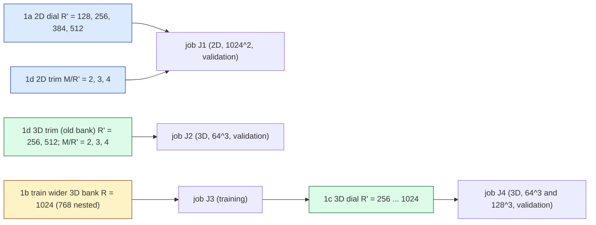

# C1 wide-bank lane: pre-registration

Lane C1 of the JCP campaign (`reports/2026-10-06-jcp-offmesh-paper-plan.md` on `main`; lane rules
`reports/2026-10-08-jcp-lane-agent-rules.md`). Question: **how far does the accuracy dial go when the bank is widened,
now that the off-mesh rule's storage is linear in $R'$?** Status: **pre-registration, written 2026-10-08 before any
code or job of this lane.** Amendments are appended, dated, at the end; nothing above them is rewritten.

Every accuracy number of this lane is scored against **first-order references** (the second-order references lane has
not run), so every accuracy comparison is **PROVISIONAL**. This label is carried next to the numbers in the report.

## 0. The reduced model (unchanged from the two 2026-10-01 quadrature lanes)

One backward-Euler step solves for the bank coefficients $c\in\mathbb R^{R'}$ of $u(x)=\hat G(x)\,c$
(the first $R'$ columns of the frozen, importance-ordered bank) by Levenberg–Marquardt on

$$ r(c) = S\Big(A c - A c_n + \Delta t\,\big(N(c) + \nu\Lambda A c\big)\Big),\qquad S=(1+\Delta t\,\nu\Lambda)^{-1},\qquad A=\Phi^{\top}\hat G , $$

with $\Phi$ the $M$ lowest discrete sine tests and $\Lambda$ their eigenvalues. Only the tested advection $N(c)$ is
hyper-reduced, by a fixed off-mesh rule $(x_q,w_q)_{q=1}^m$ (Hari's "point" form, the bank's exact gradient):

$$ N_m(c) = s_d\sum_{q=1}^{m} w_q\,\psi(x_q)\,u(x_q)\,\big(\textstyle\sum_i\partial_i u\big)(x_q),\qquad
   N_m(c)=P^{\top}\big[(Bc)\odot(Dc)\big], $$

$s_d=L$ (2D), $(n-1)^{3/2}$ (3D). Storage of the rule is $m(2R'+M)$ numbers; the precomputed quadratic tensor it
replaces stores $MR'^2$. With $M=\kappa R'$ the tensor is $\kappa R'^3$: cubic in $R'$.

Code: the vendored, byte-identical off-mesh code (`vendor/quad2d`, `vendor/quad3d`, `vendor/PROVENANCE.json`) is used
unchanged wherever possible; drivers in this lane import it. Any modified copy lives in the lane directory with its
diff against the vendor file recorded in the file header.

## 1. Questions and arms

The lane's concurrent cluster-job cap is 1, so J1–J4 run one after the other (J2 and J3 may swap order).

### 1a. 2D dial: $R'\in\{128,256,384,512\}$

Frozen 2D model `dn256b` ($K=16$, $R=512$, rotation `rotation_R512`; checkpoint sha256 pinned in the job), linear
rung (solve for $c$ directly), $\Delta t=0.005$, 50 steps, the Table-1 linear-rung LM query of `vendor/quad2d/qcore.py`
(`make_linear_query`, unchanged). Mesh $1024^2$ only: the 2026-10-01 lane showed the linear-rung off-mesh error is
mesh-invariant case by case ($\le 0.020$ pp over $256^2$–$4096^2$), so one mesh answers a question about $R'$ and $M$.
The current deployed settings are `fast` ($R'=128$, $M=512$) and `acc` ($R'=384$, $M=1536$); $R'=512$ is the whole
bank. Each setting is a pair $(R',M)$.

### 1d. Test-count trim: $M/R'\in\{2,3,4\}$

2D: all four $R'$ of 1a crossed with $\kappa=M/R'\in\{2,3,4\}$ (12 settings, $M\in\{256,\dots,2048\}$); $\kappa=4$ is
the current convention. 3D (old bank `model_M2`, $R=512$): $R'\in\{256,512\}\times\kappa\in\{2,3,4\}$, mesh $64^3$, with
$M=\kappa R'$ completed to the end of its discrete-eigenvalue shell (the 3D convention, `complete_M`). In LSPG
$M\ge R'$ is required for the residual to determine $c$; $\kappa=2$ is the smallest value tested.

Mechanism being tested: the highest test frequency grows with $M$ (2D: $|k|\approx\sqrt{4M/\pi}$; 3D:
$|k|\approx(6M/\pi)^{1/3}$), and the integrand $\psi\,u\,\partial u$ must be resolved by the rule, so a smaller $M$ should
need fewer points $m$ and cost less per Jacobian ($2Mm R'$ flops), possibly at some accuracy cost.

### 1b. Wider 3D bank (training; section 6)

### 1c. 3D dial on the wider bank: $R'\in\{256,512,768,1024\}$ at $64^3$ and $128^3$ (section 7)

## 2. Rules

**2D** (Hari's generators, `vendor/quad2d/vendor/hari_quadrature.py`, seed 0 as in the 2026-10-01 lane):
Gauss $p^2$, $p\in\{16,24,32,48,64,96,128,160,192,256\}$; Fibonacci lattices
$m\in\{987,1597,4181,6765,17711,46368\}$; converged continuum rollout `gref` = Gauss $640^2$; its check `gref_check` =
Gauss $768^2$ (dev6 only). Must-fail controls: Gauss $8^2$ and Smolyak-CC level 8.

**3D** (`vendor/quad3d/rules.py` generators; new rules generated locally once, committed with SHA256, never regenerated
on the cluster): CBC lattices $m\in\{2048,4096,8192,16384,32768,65536\}$ (seed-0 shift), Gauss $p^3$,
$p\in\{12,16,20,24,32,40\}$; converged continuum rollout = Gauss $48^3$ ($m=110592$); its check = Gauss $40^3$
rollout; continuum $\rho$ target Gauss $80^3$, checked against Gauss $64^3$ (as the 3D lane). Must-fail controls:
`lat256`, `smol8`. The existing rules are taken from `vendor/quad3d/rules/rules.npz` byte for byte; the new ones
(`lat2048`, `lat65536`, `gl12`, `gl20`, `gl40`, `gl48`) go into a lane rules file with the same generator code.

## 3. Cohorts

Selection only on validation/development cohorts; no new sealed cohort is created or opened.

| dim | role | cohort | cases |
|---|---|---|---|
| 2D | selection + reporting | dev6 ∪ val32 (the 2026-10-01 lane's development/validation sets) | 38 |
| 2D | replication only, **not run in this lane** | test64 | – |
| 3D | rollouts, selection + reporting | validation seed 923801 | 64 |
| 3D | $\rho$ population | certification draws 923811–923813 (8 each) | 24 |
| 3D | bank training / bank validation | train 923701 × 1536, bank-validation 923751 × 96 (as `model_M2`) | – |
| 3D | replication only, **not run in this lane** | held-out 923901 | – |

References: 2D, the 2026-10-01 refined references at $8192^2$ for dev6 ∪ val32 (`ST`: $\Delta t/16$; `S`: $\Delta t$; both
first-order upwind; local copy `worktrees/2026-10-01-quadrature-study/.../runs/refdv/archive/output`, re-staged with
its manifest and SHA256s checked in the job). 3D, the 513-node, $\Delta t/4$ first-order reference `ref_923801.npz`
(job 4732869) on the $63^3$ lattice $x=k/64$, re-staged with its `.done` record and SHA256 checked.

## 4. Metrics

For case $j$ and evolved output times $t\in\{0.05,\dots,0.25\}$:

- **refined error** $e_j=\max_t\lVert u_{\rm ROM}(t)-u_{\rm ref}(t)\rVert/\lVert u_{\rm ref}(0)\rVert$ on the shared
  nodes ($257^2$ in 2D, against ST and against S; $63^3$ in 3D). Reported worst and median over the cohort.
  **PROVISIONAL** (first-order references).
- **projection floor** $f_j(R')=\max_t\min_c\lVert \hat G_{R'}c-u_{\rm ref}(t)\rVert/\lVert u_{\rm ref}(0)\rVert$ on the same
  nodes (least squares on the shared nodes): the best the span can do against that reference, with no time stepping,
  test space or quadrature. Separates "the span is too small" from "the reduced dynamics lose accuracy".
- **distance from the converged rollout** $d_j=\max_t\lVert u_m(t)-u_{\rm conv}(t)\rVert/\lVert u_0\rVert$ on the full
  mesh (2D) / in the bank's field metric on the mesh (3D), where $u_{\rm conv}$ is the same setting's Gauss-$640^2$
  (2D) / Gauss-$48^3$ (3D) rollout.
- **continuum $\rho$**: $\lVert N_m(c)-N_{\rm target}(c)\rVert/\lVert N_{\rm target}(c)\rVert$ on reached states
  (2D: the converged rollout's own reached states $k=1..50$ of all 38 cases; 3D: the converged rule's reached states on
  the 24 certification draws, $k\ge1$); worst and median.
- **cost**: median ms per query (whole query: initial projection, 50/25 LM steps, decoding of the six output fields) on
  one GPU in one job; 2D also the decode-only time and solve time = query − decode; 3D also one advection-Jacobian
  evaluation (median of 50). Never compared across GPU types or jobs.
- **memory**: bytes of the advection data, $8m(2R'+M)$ (off-mesh) and $8MR'^2$ (tensor; computed for every $R'$, built
  only where it fits: 3D $R'\le512$).
- LM iterations per query, exit reasons, rejected steps.

**Rule size needed** $m^\star(R',M;\text{family})$, per family (Gauss, lattice), pre-registered: the smallest $m$ in the
family's ladder such that, on the selection cohort,
(i) every case is finite with no damping-exhausted / non-finite LM exit;
(ii) worst $d_j\le\tau=10^{-3}$;
(iii) worst continuum $\rho\le0.116$ (the project's certificate bar).
If no ladder member passes, $m^\star$ is reported as "> largest tested". A secondary, looser size at $\tau=10^{-2}$ is
reported alongside (same rule otherwise). $m^\star$ is chosen on validation only.

## 5. Controls that must fail, and gates

| id | what | must happen | if it does not |
|---|---|---|---|
| K-ctrl | under-resolved rules (2D Gauss $8^2$, Smolyak-8; 3D `lat256`, `smol8`) in **every** setting | worst $d_j>\tau$ **and** worst continuum $\rho>0.116$ | that setting's $m^\star$ is not reported (criteria not discriminating there) |
| K-conv | converged rollout vs its check (2D Gauss $640^2$ vs $768^2$ on dev6; 3D Gauss $48^3$ vs $40^3$ on all cases) | worst rollout distance $\le10^{-4}$ ($=0.1\tau$) | $\tau$-based $m^\star$ withdrawn for that setting; $\rho$ only |
| K-target | continuum $\rho$ target vs its check (2D Gauss $640^2$ vs $768^2$, flux vs point form; 3D Gauss $80^3$ vs $64^3$) | worst $\rho\le10^{-5}$ | $\rho$ criterion withdrawn |
| K-ref | reference files | manifest complete, every case accepted, SHA256 of every file equal to the manifest, contract (mesh, $\Delta t$, tolerances) equal | job aborts |
| K-eval | evaluator gates of the 3D lane (G1 derivative vs finite differences $<10^{-6}$; G2 mesh-node assembly vs tensor $<10^{-12}$; G3 Jacobian vs `jacfwd` $<10^{-12}$; G4 solver vs vendor solver $\le10^{-12}$) | pass | job aborts |
| K-time | timing: randomised interleaved order, pre-compiled burn before every timed call, outputs equal to the untimed run; drift = median of the last repetition / first repetition per arm | determinism exact (2D: sha256 of restricted fields; 3D: $\le10^{-12}$), drift within $[1/1.10, 1.10]$ | timing withdrawn for that job |
| K-backend | `jax_backend=gpu`, f64, `JAX_DEFAULT_MATMUL_PRECISION=highest` | logged | job aborts (exit 42 → resubmit on another GPU type) |

All gates and controls are checked on a **real-size smoke** (2D: $1024^2$, two settings, dev6 cases 0–1, every
control arm; 3D: $64^3$, one $(R',\kappa)$, four validation cases) before any verdict is read.

## 6. 1b. Wider 3D bank

Specified in amendment A1 (appended below once the provenance of `model_M2` is traced), audited before any 1b code is written. The baseline recipe of `model_M2` is used; a parallel lane (C3, `2026-10-08-jcp-smooth-bank`) studies better training recipes, so a recipe update may follow.

## 7. 1c. 3D scaling law

Specified in amendment A1, audited before any 1c code is written.

## 8. Hypotheses and bars (pre-registered; every accuracy verdict PROVISIONAL)

- **H1 (2D dial extends).** Worst ST refined error of the converged rollout at $(512, 4\cdot512)$ is
  $\le 0.9\times$ that at $(384,1536)$, and the median is lower. Otherwise "the 2D dial saturates at $R'=384$". Read also
  against S; if the two references disagree in direction, no verdict.
- **H2 (rule size grows with $M$).** $m^\star$ is non-decreasing in $M$ at fixed $R'$ and family. Reported either way.
- **H3 (trim).** A ratio $\kappa<4$ is an acceptable trim of setting $R'$ if the converged rollout's worst ST error is
  $\le$ that of $\kappa=4$ plus $0.05$ pp, and its median is $\le$ that of $\kappa=4$ plus $0.05$ pp; it is a
  *useful* trim if, in addition, the query time at $m^\star$ (Gauss or lattice, whichever is cheaper) drops by
  $\ge10\%$. 3D: the same with the refined error (and the Richardson diagnostic of the 3D lane, post-hoc label) and the
  bar $0.05$ pp.
- **H4 (3D dial).** Pre-registered in amendment A1.

## 9. Deliverables

`DESIGN.md`; code; `audits/` (every Codex audit); cluster runs pulled to `runs/<job>/archive` (large files listed by
SHA256 in a committed manifest); `make_report.py` → `report.md` (generated numbers, provisional labels, glossary);
PNG plots in `plots/`: error vs $R'$ (the dial extended), memory vs $R'$ (tensor vs off-mesh), $m^\star$ vs $R'$ and
$M$, cost vs $R'$.

## 10. GPU-hour estimate

| job | GPU | content | estimate |
|---|---|---|---|
| J1 | A100-80GB / H100 | 2D, $1024^2$, 12 settings × 18 arms × 38 cases, $\rho$ ladders, timing | 2–3 h |
| J2 | H100 / H200 | 3D, $64^3$, 6 settings × 13 arms + tensor × 64 cases, $\rho$, timing | 1.5–2.5 h |
| J3 | H200 | training (amendment A1) | in A1 |
| J4 | H200 | 3D dial, $64^3$ + $128^3$ (amendment A1) | in A1 |

---

## Amendment A0 (2026-10-08, after Codex design audit 1, `audits/codex-design-1.md`; before any code ran)

Each item answers the audit item of the same number. Where A0 and the text above disagree, A0 governs.

**A0-1 Scope of the dial.** The dial studied is the *linear-span setting* $(R',M)$ of the existing ordered bank; no
nonlinear-manifold head is involved. H1 compares $(512,2048)$ with $(384,1536)$ (both change) and is complemented by
the fixed-$\kappa$ rows of the grid, which separate the effect of $R'$ at constant $M/R'$. H3 is judged on the
**deployed** (selected-rule) rollouts, not on the converged ones (A0-7).

**A0-2 Controls.** For each control and setting the distance outcome ($d>\tau$) and the $\rho$ outcome
($\rho_{\max}>0.116$) are reported **separately**. A control that passes **both** criteria (i.e. would itself be
selected) invalidates that setting's $m^\star$ (reported as "criteria not discriminating"); a control failing at least
one is consistent with selection, which rejects either failure. Implementation checks are separate from these
empirical expectations: the offline NumPy audit (`audit_w.py`) recomputes refined errors from saved fields and the
selection from `result.json`, and must detect two injected faults through the same acceptance path: a swapped
reference between two cases, and a 1 % perturbation of one saved field.

**A0-3 Eligibility, gate dependencies, named diagnostics.** A rollout is *eligible* if every field is finite and
(2D) it has zero `damping_limit` exits and at most 1 % of its 50 steps ending on the step budget (`budget`), or
(3D) zero reason-3 exits and at most 1 % non-stationary (reason-0) steps (the 3D lane's contract). An arm is a
candidate only if every case is eligible. The converged rollout and the certification rollouts must themselves be
eligible on every case, or the setting's primary $m^\star$ is **unavailable**. If K-target or K-conv fails, the primary
$m^\star$ is **unavailable** for that setting (not redefined). Two named diagnostics are reported beside it and never
substituted for it: $m_d$ (distance criterion only) and $m_\rho$ ($\rho$ criterion only). "No tested ladder member
qualifies" is reported as such. The 3D certification draws (923811–3) are selection data (their $\rho$ enters
eligibility); they are disjoint from the validation cohort and from the held-out cohort.

**A0-3b Tolerances.** Primary $\tau=2.5\times10^{-4}$ (0.025 pp), half the H3 accuracy allowance, so that the selected
rule cannot by itself move a deployed error by more than half the trim bar; secondary $\tau=10^{-3}$ (the 3D lane's
criterion, for continuity). Both are reported; the primary one drives H2, H3 and the cost plots.

**A0-4 Metrics vs code.** 3D distances use the field metric $\lVert L^{\top}(c_m-c_{\rm conv})\rVert/\lVert u_{\rm ref}(0)\rVert$
with $LL^{\top}=\hat G^{\top}\hat G$ on the mesh (as `qpanel.py`); 2D distances are full-mesh field norms divided by
$\lVert u_0\rVert$ on the mesh. The $\rho$ population **changes** from the 2026-10-01 lanes (2D: lattice-reached states;
3D: tensor-reached states) to the **converged rule's own reached states** (2D: 38 cases × 50 steps; 3D: 24
certification draws × 25 steps, $k\ge1$); this is a deliberate switch so that the population does not depend on a
rule that is absent at $R'>512$. $\rho$ statistics (worst, p95, median) are pooled over states; error statistics
(worst, median) are per case. Denominators: the job asserts $\min\lVert N_{\rm target}\rVert>0$ on the population and
records it. A $\rho$ below the bar on this population is evidence about these states, not a certificate for every
candidate's own trajectory; the candidate's own rollout distance is the second, independent criterion.

**A0-5 Converged-rollout checks on every selection case.** 2D: `gref_check` (Gauss $768^2$) runs on **all 38**
cases of every setting; K-conv requires worst distance $\le 2.5\times10^{-5}=0.1\tau$ and both rollouts eligible. 3D:
the Gauss-$40^3$ check runs on all 64 validation cases and on the 24 certification draws; same bar. If K-conv fails
in a setting, the primary $m^\star$ is unavailable there (A0-3) and the 2D/3D converged rule is escalated in the
**next** job only (2D: Gauss $896^2$; 3D: Gauss $56^3$), never re-selected inside the same data.

**A0-6 Projection floor implementation.** Bank evaluated directly at the shared nodes (2D: $255^2$ interior of the
$257^2$ grid; 3D: the $63^3$ lattice), thin QR once per $R'$; the job records the numerical rank (count of
$|R_{ii}|>10^{-12}\max|R_{ii}|$) and the condition number of $R$; both ST and S floors in 2D. The floor diagnoses
representation error against that first-order reference only.

**A0-7 Hypotheses restated.**
- H1: outcome is one of *meets the registered improvement bar* (worst ST error of the deployed $(512,2048)$ rollout
  $\le0.9\times$ that of $(384,1536)$ and the median lower), *does not meet the registered bar* (anything else with a
  change of at least 0.05 pp in the worst error), or *unresolved* (worst errors within 0.05 pp). The same verdict is
  computed against S; if ST and S give different verdicts the result is *reference-dependent*. Every verdict is
  benchmark-relative (first-order references) and PROVISIONAL. Paired per-case changes (median change, fraction of
  cases improved) are reported beside the cohort statistics.
- H2: descriptive only (reached states and denominators change with $M$; no monotonicity is expected a priori).
- H3: a ratio $\kappa<4$ is an *acceptable* trim of $R'$ if the deployed rollout (primary $m^\star$, cheapest family
  by the final-panel time) has worst and median ST errors no more than 0.05 pp above those of the deployed
  $\kappa=4$ rollout; *useful* if, in addition, its query time is at least 10 % lower in **both** the per-setting panel and
  the cross-setting final panel (the second is the confirmation block). 3D: the same with the refined error.
  The 0.05 pp bar is a benchmark-relative tolerance against fixed reference files, not a physical-accuracy
  resolution.

**A0-8 Timing protocol (paired A–B–A).** Every timing panel is A1 → B → A2 in one job on one GPU: A1 = every
subject × timing case × $r$ repetitions in a seeded random order; B = the decode-only subject (2D) or one fixed FOM
setting (3D, `dt0.01_nt0.01_lt0.1`) on the same cases; A2 = A1's subject set again in a fresh random order. Every
subject is compiled and warmed on every timing case before A1; a pre-compiled burn (2D 0.1 s, 3D 2 s before each
phase plus 0.2 s after any call of 0.5 s or more, the 3D lane's protocol) precedes timed calls;
`block_until_ready` covers the whole output. Drift = median(A2)/median(A1) per subject, gate within
$[1/1.10,\,1.10]$; determinism: every timed output equals the untimed phase-1 output (2D sha256 of the restricted
fields; 3D $\le10^{-12}$). Timing cases: 2D the 6 dev6 cases, $r=2$; 3D the first 16 validation cases, $r=2$.
Reported time = median over A1 ∪ A2. Every invocation is persisted.

**A0-9 Scope.** All 2D conclusions are scoped to $1024^2$ and the 3D trim to $64^3$ (65 nodes); historical
mesh-invariance is motivation, not evidence. The 3D dial (A1) runs at two meshes and so carries its own cross-mesh
check.

**A0-10 Nominal and actual $M$.** 2D uses the vendored `modes_lean` (exactly $M$ modes by stable sort, no shell
completion, as both 2D settings of the 2026-10-01 lane). 3D uses `complete_M` (shell tolerance $10^{-9}$ relative,
stable sort): at 65 nodes $R'=256\to M=(513,771,1027)$ and $R'=512\to M=(1027,1538,2052)$ for nominal
$\kappa=(2,3,4)$; actual $M$ and actual $M/R'$ are recorded and used everywhere. Each setting records the singular
values of $A=\Phi^{\top}\hat G$ (rank and condition) as the identifiability check of the linear part.

**A0-11 Memory.** Settings are processed sequentially (largest first), rule blocks are built once per $R'$ at the
largest $M$ and column-sliced, the converged/check rules' blocks are freed after the setting, and peak device memory
(`memory_stats()['peak_bytes_in_use']`) is recorded per setting. The real-size smoke runs the largest arm
($R'=512$, $M=2048$, Gauss $768^2$ in 2D; $R'=512$, $\kappa=4$, Gauss $48^3$ in 3D) and its peak memory and per-query
time replace the estimates below before submission.

**A0-12 Workload, solver pins, Richardson.** Pinned solvers: 2D the vendored `make_linear_query` (dt 0.005, 50
steps, `step_budget` 600, `gtol` 1e-3, Cholesky, clipped step, damping carried, quadratic predictor, Gauss-48
closed-form initial fit); 3D the vendored `make_fsc_rule` (dt 0.01, 25 steps, adaptive LM on the first 3 steps then
one sweep per step, `gtol` 1e-3, trust $0.05\times$ the coefficient RMS spread at $R'$). The 3D Richardson diagnostic
is **not** computed in this lane (it needs the 257-node same-grid reference, which the trim job does not produce).
Workload: 2D 12 settings × (16 candidates + 2 controls + `gref` + `gref_check`) × 38 cases; 3D trim 6 settings ×
(11 candidates + 2 controls + converged + check + tensor) × 64 cases, plus 24 certification rollouts × (converged,
check) per setting. The $m(2R'+M)$ storage is linear in $R'$ only at fixed $m$ and $\kappa$; if $m^\star$ grows with $R'$
the storage grows faster, and the report says so with the measured $m^\star$.

**Estimates (to be replaced by the smoke measurements).** 2D: converged rollouts cost about 4.5 s per query at
$(384,1536)$ on an A100 (2026-10-01 job dv1024), scaling with $mR'M$; summed over the grid, `gref` + `gref_check`
on 38 cases ≈ 0.9 h, ladders ≈ 0.5 h, $\rho$ ≈ 0.3 h, timing ≈ 0.5 h, compilation ≈ 0.5 h: **J1 ≈ 3 h (A100) /
2 h (H100)**, requested 10 h. 3D trim: **J2 ≈ 2 h (H200)**, requested 8 h.

## Amendment A1 (2026-10-08): 1b wider 3D bank and 1c 3D scaling law

### Provenance of the 3D bank `model_M2` (traced)

Trained by `experiments/burgers3d-retry/train2.py` at commit `58d83d09b` (branch `exp/2026-09-23-burgers3d-retry`),
config `configs/train_w1024.json`, job 4246994 on an H200, 4923 s total (data ≈ 1270 s, bank 2072 s, heads
≈ 1300 s). Recipe: Burgers on the unit cube, zero walls, 1–3 Gaussian blobs, $\nu$ log-uniform on $[0.01,0.1]$;
1536 training trajectories (seed 923701) and 96 bank-validation trajectories (seed 923751) at 33, 65 and 129 nodes
(backward Euler $\Delta t=0.005$, Newton–BiCGStab tolerances $10^{-8}/10^{-9}$), 12 saved steps each (18432 snapshots
per mesh; the 129 group uses a fixed random subset of 250047 points). Bank: 128 Gaussian Fourier features (scale
2), SiLU MLP 1024×3, linear layer to $R=512$, boundary factor $64\prod x(1-x)$; code-free variable-projection loss
(log of the POD-weighted mean projection error over the top 1536 POD modes per mesh, $+0.5\times$ log of an $L^4$
power-mean over a 128-snapshot minibatch, $+10^{-3}\times$ Gram whitening at 65 nodes); Adam, clip 1, warmup 500,
cosine $10^{-3}\to10^{-5}$, 12000 steps on 32768 random points per mesh, checkpoint chosen by the worst
bank-validation projection error (step 7000). Ordering: SVD of the per-snapshot coefficients of all training
snapshots in the 65-grid metric, $T=R_G^{-1}V$. The 2D model `dn256b` (traced likewise: `sep_burgers_r3.py`
@`5ae420414`, job 2835788, A100, 2.97 h of training; rotation `make_rotation.py` @`577fc592c`) is not retrained.

### 1b. Training a wider 3D bank

- **Code:** byte-identical copies of `train2.py` and `burgers3d-span/common.py` (sha256 recorded in
  `train3d/PROVENANCE.json`), laid out as on the source branch so the import path is unchanged.
- **Config** `train3d/configs/train_r1024.json` = `train_w1024.json` with exactly these changes:
  `bank_rank` 512 → **1024**; `bank_width` 1024 → **2048** (the final layer is linear, so the rank is at most
  width + 1; the project's rule from the 2D bank work is width ≥ 2R, which the original satisfies); `modes`
  1536 → **2048** (must exceed the rank so the POD-weighted term does not saturate); `ladder` and
  `pod_reference_ranks` extended with 640, 768, 896, 1024 (ladder) and 768, 1024 (POD); `model_seed` → 923715 (a
  fresh seed); `head_variants` → `[]` (span-only deployment, as `model_M2`); `compare_bank` → the vendored
  `model_M2` (so both banks' full-grid floors are computed on the same bank-validation fields). Data seeds, meshes,
  steps, loss weights, optimiser, points per step, checkpoint rule: unchanged. The Gram-whitening term is a mean over
  $R^2$ entries, so its effective weight changes with $R$; it is kept as is (baseline recipe) and flagged. A recipe
  update from lane C3 (`2026-10-08-jcp-smooth-bank`) may follow; this bank is labelled "baseline recipe".
- **R = 768:** not trained separately. The ordered R = 1024 bank's 768-column prefix is the $R'=768$ arm. (A separately
  trained R = 768 bank would answer a different question: prefix vs dedicated training.)
- **Bank acceptance (pre-registered; read on the bank-validation cohort only):** (B1) finite training, checkpoint
  selected by the unchanged rule; (B2) ordering inverse check $\le10^{-8}$ and 65-grid condition number recorded;
  (B3) the R′ = 512 prefix's worst full-grid floor at 129 nodes is at most $1.10\times$ that of `model_M2`
  (3.12 %) — if not, the new bank is *worse at equal width* and 1c reports both banks side by side; (B4) the
  worst full-grid floor at 129 nodes decreases strictly from $R'=512$ to 768 to 1024 (the dial exists in the span). B3
  and B4 are reported either way; failing B4 ends 1c's accuracy question (cost is still measured).
- **Cost estimate:** `model_M2` ran ≈ 0.156 s per step at width 1024/rank 512; width 2048/rank 1024 costs ≈ 4× in the
  MLP and ≈ 4× in the per-step QRs, so ≈ 0.6 s/step × 12000 ≈ 2 h, plus data ≈ 0.4 h and ordering/floors ≈ 0.3 h:
  **J3 ≈ 3 H200-hours**, requested 10 h, 320 GB host memory (as job 4246994). The job logs seconds per step at the
  first checkpoint (step 50); if the projected bank time exceeds 7 h the job is cancelled and the design amended.
- **Training smoke:** a local CPU/GB10 run of the copied code with a tiny config (one mesh 17 nodes, 16 trajectories,
  20 steps, `bank_rank` 64, `bank_width` 128) to exercise the code path, never used for any result.

### 1c. 3D scaling law

- **Arms:** new bank $R'\in\{256,512,768,1024\}$ at nominal $\kappa=4$ (actual $M$ by `complete_M`); old bank
  `model_M2` $R'\in\{256,512\}$, $\kappa=4$, for a bank-to-bank comparison at equal width. If J2 finds a *useful*
  trim (A0-7 H3) at **both** $R'=256$ and 512, that $\kappa$ is added for every new-bank $R'$ (decided from J2's
  validation results before J4 is staged, recorded in an amendment).
- **Rules:** CBC lattices 4096–131072 (doubling), Gauss $p^3$ $p\in\{16,20,24,32,40,48\}$; converged Gauss
  $56^3$ ($m=175616$), check Gauss $48^3$; $\rho$ target Gauss $80^3$, check $64^3$; controls `lat256`, `smol8`. Same
  eligibility, $\tau$ and K-gates as A0. The tensor arm runs where it fits ($R'\le512$, both banks); its memory
  $8MR'^2$ is computed for every $R'$ (at $R'=1024$, $M\approx4100$: ≈ 34 GB).
- **Meshes:** 65 and 129 nodes (64³, 128³), validation cohort 923801 × 64 (the refined reference exists for it), ρ on
  certification draws 923811–3. 257 nodes only if J4's two meshes finish under 4 h (decided by the measured time,
  not by any accuracy result).
- **Metrics:** as section 4/A0: refined error (worst, median; PROVISIONAL), projection floor on the 63³ lattice,
  $m^\star$ (both $\tau$), $\rho$, ms per query (A–B–A), Jacobian ms, advection memory (tensor vs off-mesh at
  $m^\star$), peak device memory, LM iterations.
- **H4 (pre-registered, PROVISIONAL, benchmark-relative):** the deployed rollout's worst refined error at
  $R'=1024$ is $\le0.8\times$ that at $R'=512$ (new bank), median lower, at both meshes → *the 3D dial extends*;
  worst errors within 0.05 pp → *unresolved*; otherwise *does not meet the registered bar*. Because the 513-node
  reference differs from the 257-node one by up to 1.7 % (3D lane, section 2), an improvement below that size is
  additionally labelled *possibly reference-limited*. The projection floor is reported beside it so that a span gain
  that the dynamics do not deliver is visible.
- **J4 estimate:** at 129 nodes and $R'=1024$, $M\approx4100$, the converged rule's Jacobian is
  $2Mm R'\approx1.5$ TFLOP (≈ 25 ms on an H200), ≈ 28 per query: ≈ 0.7 s per query; the ladders and controls
  ≈ 2× the converged cost; tables, $\rho$, timing and compilation ≈ 1 h per mesh: **J4 ≈ 3–4 H200-hours**, requested
  12 h.

## Amendment A2 (2026-10-08, after Codex design audit 2, `audits/codex-design-2.md`; before any job)

Closes the six NOT-CLOSED items of audit 1 and the A1 findings. Where A2 and earlier text disagree, A2 governs.

**A2-6 Projection floor rank.** The floor uses the thin SVD of the bank sampled at the shared nodes,
$\hat G_{R'}=U\Sigma W^{\top}$; numerical rank $r=\#\{\sigma_i>10^{-12}\sigma_1\}$; floor $=\lVert(I-U_rU_r^{\top})u\rVert$.
Recorded per $R'$: $r$, $\sigma_1/\sigma_r$, and a residual check on the first case (the least-squares residual from
`lstsq` equals the SVD floor to $10^{-10}$ relative).

**A2-7 Verdict precedence (H1, H4).** Evaluated in this order: (1) *unavailable* if a deployed arm of either compared
setting is unavailable (failed gate, no eligible ladder member, or non-discriminating controls); (2) *unresolved* if
the worst errors differ by less than 0.05 pp; (3) *meets the registered bar* if the ratio bar (H1 0.9, H4 0.8) holds and
the median is lower; (4) otherwise *does not meet the registered bar*. Changes are reported both in percentage points and
as relative percentages. H1/H4 concern the joint $(R',M)$ setting at nominal $\kappa=4$, not rank alone.

**A2-8 Paired timing and family choice.** The deployed family of each setting (Gauss or lattice, whichever $m^\star$
arm has the lower median in that setting's own A–B–A panel) is fixed and written to `result.json` *before* the final
panel runs. The final cross-setting panel (A1 → B → A2 over every setting's deployed arm and its $\kappa=4$ partner on
the same 6 dev6 cases) is the independent confirmation block. H3's cost criterion is the **paired** ratio: for each
(case, phase) the median time of the trimmed setting divided by that of the $\kappa=4$ setting at the same $R'$; the
trim is *useful* if the median paired ratio is $\le0.9$ in the final panel **and** the per-setting panel medians also
give a ratio $\le0.9$. Drift is computed per subject as median(A2)/median(A1).

**A2-10 Identifiability.** $M\ge R'$ is necessary, not sufficient, for $c$ to be determined; earlier wording that
implied sufficiency is withdrawn. Each setting records the singular values of $A$ and of the full residual
Jacobian $J(c)=S\,(A+\Delta t\,(\partial N/\partial c+\nu\Lambda A))$ at the converged rollout's reached states of the
first case at $k\in\{1,25,50\}$ (2D) / $k\in\{1,12,25\}$ (3D): rank and condition number.

**A2-11 Residency and memory accounting.** 2D: per $R'$ the blocks of every rule of the setting are resident at
$(R', M_{\max}(R'))$ (largest: Gauss $768^2$ at 512/2048, 14.5 GB; Gauss $640^2$, 10.1 GB; the 16 ladder rules + 2
controls together ≈ 2 GB); $\rho$ targets are streamed in point chunks of 32768 and state chunks of 64; after each
setting the compiled queries are dropped and `jax.clear_caches()` is called; after each $R'$ all blocks are freed.
3D: per mesh, rule blocks at the bank's largest $R'$ and $M_{\max}$ are resident; the converged and check rules
($\le$ 8.6 GB each at $R'=1024$) are built per setting and freed. Recorded per setting: device `bytes_in_use` and
`peak_bytes_in_use`, and host `ru_maxrss`.

**A2-12 Workloads, raw data, budgets.** Raw data retained (pulled locally; files > 50 MB listed by SHA256 in a committed
`runs/MANIFEST-large.sha256`): every `result.json` row (all arms, all cases, per-time errors); restricted fields and
coefficient trajectories of every arm on the audit cases (2D dev6 0 and 2; 3D validation 0 and 1); restricted
fields of the converged rollout on every case; the $\rho$ populations; sub-sampled $\rho$ vectors of one audited rule.
Budgets are replaced by the real-size smoke measurements before J1/J2/J4 are submitted (the smoke job reports the
largest arm's per-query time, compile time and peak memory); the requested wall time is at least 2× the measured
projection.

**A2-A1-1 Naming.** The new bank is a *single-seed, capacity-scaled baseline-recipe bank*: rank, width, POD
truncation, seed (hence Fourier features, initialisation and minibatch sequence) all change with it, so old-vs-new
bank comparisons do not isolate rank; prefix comparisons inside the new bank isolate deployment width. The job reports
the dropped POD energy per mesh and the whitening term's value.

**A2-A1-2 Code.** The training code is a copy `train3d/train2w.py` of `train2.py`@`58d83d09b` with exactly two
changes, both recorded in its header and checked by a diff in the code audit: (i) the `sys.path` line points to the
vendored `vendor/quad3d/vendor/burgers3d-span` (which itself resolves `paper-b3d/vendor/b3d_common.py`; all three
files are staged with their SHA256); (ii) the comparison bank's floors are computed only for ladder ranks not exceeding
its column count, and larger ranks are recorded as unavailable (fixes the false-label defect). Head targets and
`head_data.npz` are still computed (unchanged code path; heads themselves are skipped by `head_variants=[]`).

**A2-A1-4 Host memory.** The data shapes do not depend on the bank rank and are identical to job 4246994, which
completed with 320 GB; the job runs under `/usr/bin/time -v` so the host MaxRSS is recorded, and `sacct` MaxRSS is
pulled with the logs.

**A2-B2 Numerical-stability gate.** (B2′) the ordered bank must have numerical rank 1024 on the 65-node grid
($\sigma_{\min}/\sigma_{\max}$ of $R_G$ above $10^{-10}$), inverse check $\lVert V^{\top}R_GT-I\rVert\le10^{-8}$, and in J4 the
vendored table gate (Gram condition of the ordered bank on the mesh $\le10^8$) at both meshes; failing B2′ stops 1c for
that bank (resource decision, recorded).

**A2-B3.** B3 is a comparison flag (it does not reject the bank), computed against the compare bank's floor
recomputed in the same job on the same regenerated validation fields (expected ≈ 3.1216 % at 129 nodes, $R'=512$).

**A2-B4.** (B4′) *material span gain*: worst full-grid floor at 129 nodes at $R'=1024\le0.8\times$ that at $R'=512$
(same bank). Reported either way; 1c's accuracy experiment runs **regardless** (a flat floor against first-order
native-grid fields does not rule out a gain against the refined reference).

**A2-smoke Training smoke config (local, never a result).** `meshes [17]`, `order_mesh 17`, `white_group "17"`,
`train_count 8`, `bankval_count 4`, `full_floor_cases 2`, `train_steps` unchanged (contains 0, 10, …, 50), `bank_rank 64`,
`bank_width 128`, `bank_depth 3`, `modes 96`, `ladder [16, 32, 48, 64]`, `pod_reference_ranks [16, 32, 64]`,
`bank_steps 20`, `checkpoint_every 10`, `points_per_step 1000`, `group_points_cap null`, `head_variants []`,
`compare_bank` the vendored `model_M2` (rank 512 > 64: exercises the comparison path); the comparison-ladder filter is
additionally unit-tested with a fake 32-column compare bank and the ladder [16, 64] (64 must come back unavailable).

**A2-12b Converged rules.** J2 (old bank, $M\le2052$): converged Gauss $48^3$, check $40^3$, escalation successor
$56^3$. J4 (new bank, $M$ up to ≈ 4100): converged Gauss $56^3$, check $48^3$ (which is also a ladder candidate and
runs once), escalation successor $64^3$. Every check runs at every mesh and setting.

**A2-13 J4 cross-mesh and gates at wide rank.** J4 records, per arm, the shared-node field distance between its
65-node and 129-node rollouts on the $63^3$ lattice, and $\rho$ per mesh. K-eval at ranks above 512: G1 and G3 at the
widest deployed arm; G2 and G4 on a 32-column, 128-test tensor built for the gate only (cheap). 257 nodes are
**excluded** from J4 (resource policy: the rank-1024 mesh bank alone is ≈ 136 GB).

**A2-15 Reference limitation.** The "possibly reference-limited below 1.7 %" label is withdrawn: 1.70 % was one probe
case (2.28 % on the held-out cohort) and neither is a continuum-error bound. Every physical-accuracy interpretation in
this lane is labelled reference-limited until a matched reference-convergence study (lane `jcp-references`) exists;
verdicts are benchmark-relative.

**A2-16 Estimates.** J3's steady-state step time is measured from checkpoint differences
($(t_{2000}-t_{1000})/1000$); if that rate projects the 12000 steps beyond 7 h the job is cancelled and the design
amended. J4's estimate is replaced by the smoke measurement of its largest query (129 nodes, $R'=1024$, Gauss $56^3$).

## Amendment A3 (2026-10-08, after Codex design audit 3, `audits/codex-design-3.md`; before any job)

**A3-8 Timing cohorts per dimension.** The final cross-setting panel uses the same timing cases as the per-setting
panels of that job: 2D the 6 dev6 cases; 3D the first 16 validation (923801) cases. ("6 dev6 cases" in A2-8 applies to
2D only.)

**A3-11 Memory policy (3D) and accounting.** 3D: off-mesh blocks $(B,D,P)$ are built **per setting** at that setting's
$(R',M)$ directly (no column slicing of a wider block), and freed with the setting; state batches for $\rho$ and for
the advection targets are chunked (64 states for the Gauss-$80^3$/$64^3$ targets, which are streamed in point chunks of
65536; the full population for the cheap ladder rules); after each setting the compiled queries are dropped and
`jax.clear_caches()` is called. Device `peak_bytes_in_use` is a lifetime maximum, so each setting records the
**increment** of the lifetime peak and `bytes_in_use` at its start and end; host `ru_maxrss` likewise. Training (J3):
the log records host RSS (from `/proc/self/status` via `/usr/bin/time -v` for the whole process, plus `sacct`
MaxRSS) — phase-resolved host peaks would need code changes to `train2.py` beyond A2-A1-2 and are **not** collected;
feasibility rests on job 4246994 (identical snapshot arrays, 320 GB) and the extra rank-dependent arrays enumerated
here: $G$ on 250047 points at rank 1024 (2.0 GB), the ordering rows $55296\times1024$ (0.45 GB), per-group $Q_g$
(2.0 GB), head targets $18432\times1024$ per group (0.15 GB) — under 10 GB above job 4246994's footprint.

**A3-12/16 Whole-job budgets (enumerated; each line replaced by the smoke measurement where marked).**

| job | component | count | unit cost (source) | total |
|---|---|---|---|---|
| J1 (A100) | converged + check rollouts | 12 settings × 38 cases × 2 | $\propto mR'M$; 4.5 s at (384,1536), Gauss $640^2$ (job dv1024); smoke-measured at (512,2048) | ≈ 0.9 h |
| | ladder + controls | 12 × 38 × 18 | ≈ 0.6 × converged | ≈ 0.4 h |
| | $\rho$ (targets $640^2$, $768^2$, flux + 18 rules) | 12 × 1900 states | ≈ 3 converged-rule evaluations per state batch | ≈ 0.3 h |
| | timing (A–B–A, 17 subjects × 6 cases × 2 reps × 2 phases + B) | 12 | ≈ 0.25 s per call incl. burn | ≈ 0.6 h |
| | compilation | 12 × 20 queries | ≈ 10 s (smoke-measured) | ≈ 0.7 h |
| | floors, Jacobian SVDs, setup | – | – | ≈ 0.1 h |
| | **J1 total** | | | **≈ 3 h; request 10 h** |
| J2 (H200) | tables + tensor at 65 nodes, R = 512 | 1 | ≈ 0.1 h (3D lane val65) | 0.1 h |
| | rollouts | 6 settings × (64 + 24) cases × 16 arms | ≈ 0.04 s mean query (3D lane: 11–61 ms) | ≈ 0.1 h |
| | compilation | 6 × 16 queries | ≈ 30 s (3D lane, smoke-measured) | ≈ 0.8 h |
| | $\rho$, timing (A–B–A 16 cases × 2 reps), microbenchmarks, floors | 6 | ≈ 5 min each | ≈ 0.5 h |
| | **J2 total** | | | **≈ 1.5 h; request 6 h** |
| J3 (H200) | data / bank (rate measured at steps 1000→2000) / ordering + floors | 1 | 0.4 h / ≈ 2 h / ≈ 0.4 h | **≈ 3 h; request 10 h** |
| J4 (H200) | per mesh: tables, gates | 2 | 0.1 h (65), 0.3 h (129) | 0.4 h |
| | rollouts: 6 settings (4 new-bank + 2 old-bank) × (64 + 24) × 17 arms | 2 meshes | largest query smoke-measured; mean ≈ 0.15 s | ≈ 0.6 h |
| | compilation | 2 × 6 × 17 | ≈ 30 s | ≈ 1.7 h |
| | $\rho$, timing, floors, microbenchmarks, cross-mesh distances | 2 × 6 | ≈ 6 min | ≈ 1.2 h |
| | **J4 total** (optional trims add ≈ 50 % per added $\kappa$) | | | **≈ 4 h; request 12 h** |

The J1/J2 rows marked "smoke-measured" are replaced by the measurement of the real-size smoke job before
submission; if the measured projection exceeds half the requested time, the request is raised (never the workload
cut silently).

**A3-6 lstsq pin.** The projection-floor consistency check uses `numpy.linalg.lstsq(..., rcond=1e-12)` (the same cutoff
as the SVD rank); when the floor is below $10^{-12}$ the check compares absolute residuals instead.

**A3-13 Gate scope.** G2 and G4 at 32 columns certify the off-mesh assembly and the solver path, not rank-dependent
behaviour above 512; G1 and G3 at the widest deployed arm, the table Gram-condition gate, and the converged/check
agreement are the only gates at $R'>512$. This limitation is stated in the report.

**A3-smoke.** The training smoke config also sets `warmup` 5 (with `bank_steps` 20 the inherited 500 would make the
cosine schedule invalid).

## Amendment A4 (2026-10-08, after Codex design audit 4, `audits/codex-design-4.md`; before any job)

**A4-11 Per-setting memory.** Both drivers run a sampling thread (every 0.2 s) that records the device
`bytes_in_use` and the host RSS (`/proc/self/status` VmRSS); each setting stores the **maximum sampled value within
its own interval** (start to end of the setting), alongside the lifetime peak. Sampled maxima can miss spikes shorter
than 0.2 s; this is stated with the numbers.

**A4-J3 Host memory, measured.** `sacct` for job 4246994 (the $R=512$ run of the same code on the same data shapes):
MaxRSS **287.1 GB** of 320 GB requested. The rank-dependent host arrays added at $R=1024$ are enumerated in A3-11
(< 10 GB); network parameters and optimiser state at width 2048 are on the device (≈ 0.1 GB). J3 therefore requests
**420 GB** (≥ 120 GB headroom over the measured peak + the enumerated additions). Phase-resolved host memory: the
sbatch runs a sidecar loop logging the training process's RSS every 30 s with a timestamp (no change to the training
code); phases are identified by the timestamps of the training log lines ("data n=…", "group …", "BANK …", "ORDER",
"FLOORS"). `/usr/bin/time -v` and `sacct` give the whole-process maximum.

**A4-budget Corrected arithmetic.** Cost of an off-mesh rollout is $\propto mR'M$ (Jacobian GEMM). For J1, per setting the
ladder (16 candidates, $\sum m\approx2.4\times10^5$) and the two controls cost about **0.24×** the converged + check
pair ($m=409600+589824\approx1.0\times10^6$) **in total**; the J1 line "ladder + controls ≈ 0.4 h" is therefore an
over-estimate (≈ 0.25 h), not an under-estimate. Each optional J4 trim adds four new-bank settings to the six, i.e.
**+67 %** of J4's per-setting work (not 50 %). Every "≈" line of A3 is replaced before submission by a smoke
measurement: J1 by the 2D smoke job (two settings incl. the largest, all arms, two cases, timing), J2 by a 3D smoke
(65 nodes, $R'=512$, $\kappa=4$, all arms, 4 validation cases, 4 certification draws, timing), J4 by a J4 smoke
(129 nodes, new bank, $R'=1024$, all arms, 4 + 4 cases) after J3. The submission request is then
$\max(2\times$ the smoke-calibrated projection, the A3 request$)$; the calibration (per-component seconds × counts) is
written to `runs/<attempt>/BUDGET.json` before each submission.

## Amendment A5 (2026-10-08, after Codex code audit w2d-2; before any job)

If a setting's own A–B–A panel fails K-time (drift or determinism), its deployed family is chosen by the smaller
$m^\star$ instead of the timed median, labelled *diagnostic only*; the job records `timing_valid_jobwide` (every
per-setting panel and the final panel pass K-time). Cost claims (H3 *useful*, cost-vs-$R'$ plots) are made only from
jobs with `timing_valid_jobwide = true`; otherwise the timing numbers are reported as withdrawn. Paired (case, phase)
ratios for H3 are computed offline by `make_report.py` from the persisted invocation records. A failed projection-floor
consistency check (`check_passed = false`) makes that $R'$'s floor *unavailable* in the report.
