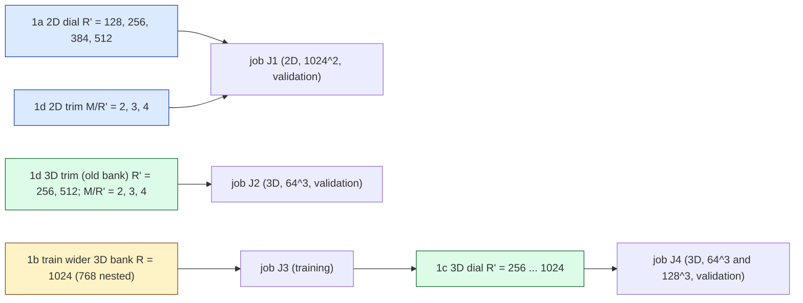

# C1 wide-bank lane: pre-registration

Lane C1 of the JCP campaign (`reports/2026-10-06-jcp-offmesh-paper-plan.md` on `main`; lane rules
`reports/2026-10-08-jcp-lane-agent-rules.md`). Question: **how far does the accuracy dial go when the bank is widened,
now that the off-mesh rule's storage is linear in $R'$?** Status: **pre-registration, written 2026-10-08 before any
code or job of this lane.** Amendments are appended, dated, at the end; nothing above them is rewritten.

Every accuracy number of this lane is scored against **first-order references** (the second-order references lane has
not run), so every accuracy comparison is **PROVISIONAL**. This label is carried next to the numbers in the report.

## 0. The reduced model (unchanged from the two 2026-10-01 quadrature lanes)

One backward-Euler step solves for the bank coefficients $c\in\mathbb R^{R'}$ of $u(x)=\hat G(x)\,c$
(the first $R'$ columns of the frozen, importance-ordered bank) by Levenberg–Marquardt on

$$ r(c) = S\Big(A c - A c_n + \Delta t\,\big(N(c) + \nu\Lambda A c\big)\Big),\qquad S=(1+\Delta t\,\nu\Lambda)^{-1},\qquad A=\Phi^{\top}\hat G , $$

with $\Phi$ the $M$ lowest discrete sine tests and $\Lambda$ their eigenvalues. Only the tested advection $N(c)$ is
hyper-reduced, by a fixed off-mesh rule $(x_q,w_q)_{q=1}^m$ (Hari's "point" form, the bank's exact gradient):

$$ N_m(c) = s_d\sum_{q=1}^{m} w_q\,\psi(x_q)\,u(x_q)\,\big(\textstyle\sum_i\partial_i u\big)(x_q),\qquad
   N_m(c)=P^{\top}\big[(Bc)\odot(Dc)\big], $$

$s_d=L$ (2D), $(n-1)^{3/2}$ (3D). Storage of the rule is $m(2R'+M)$ numbers; the precomputed quadratic tensor it
replaces stores $MR'^2$. With $M=\kappa R'$ the tensor is $\kappa R'^3$: cubic in $R'$.

Code: the vendored, byte-identical off-mesh code (`vendor/quad2d`, `vendor/quad3d`, `vendor/PROVENANCE.json`) is used
unchanged wherever possible; drivers in this lane import it. Any modified copy lives in the lane directory with its
diff against the vendor file recorded in the file header.

## 1. Questions and arms

The lane's concurrent cluster-job cap is 1, so J1–J4 run one after the other (J2 and J3 may swap order).

### 1a. 2D dial: $R'\in\{128,256,384,512\}$

Frozen 2D model `dn256b` ($K=16$, $R=512$, rotation `rotation_R512`; checkpoint sha256 pinned in the job), linear
rung (solve for $c$ directly), $\Delta t=0.005$, 50 steps, the Table-1 linear-rung LM query of `vendor/quad2d/qcore.py`
(`make_linear_query`, unchanged). Mesh $1024^2$ only: the 2026-10-01 lane showed the linear-rung off-mesh error is
mesh-invariant case by case ($\le 0.020$ pp over $256^2$–$4096^2$), so one mesh answers a question about $R'$ and $M$.
The current deployed settings are `fast` ($R'=128$, $M=512$) and `acc` ($R'=384$, $M=1536$); $R'=512$ is the whole
bank. Each setting is a pair $(R',M)$.

### 1d. Test-count trim: $M/R'\in\{2,3,4\}$

2D: all four $R'$ of 1a crossed with $\kappa=M/R'\in\{2,3,4\}$ (12 settings, $M\in\{256,\dots,2048\}$); $\kappa=4$ is
the current convention. 3D (old bank `model_M2`, $R=512$): $R'\in\{256,512\}\times\kappa\in\{2,3,4\}$, mesh $64^3$, with
$M=\kappa R'$ completed to the end of its discrete-eigenvalue shell (the 3D convention, `complete_M`). In LSPG
$M\ge R'$ is required for the residual to determine $c$; $\kappa=2$ is the smallest value tested.

Mechanism being tested: the highest test frequency grows with $M$ (2D: $|k|\approx\sqrt{4M/\pi}$; 3D:
$|k|\approx(6M/\pi)^{1/3}$), and the integrand $\psi\,u\,\partial u$ must be resolved by the rule, so a smaller $M$ should
need fewer points $m$ and cost less per Jacobian ($2Mm R'$ flops), possibly at some accuracy cost.

### 1b. Wider 3D bank (training; section 6)

### 1c. 3D dial on the wider bank: $R'\in\{256,512,768,1024\}$ at $64^3$ and $128^3$ (section 7)

## 2. Rules

**2D** (Hari's generators, `vendor/quad2d/vendor/hari_quadrature.py`, seed 0 as in the 2026-10-01 lane):
Gauss $p^2$, $p\in\{16,24,32,48,64,96,128,160,192,256\}$; Fibonacci lattices
$m\in\{987,1597,4181,6765,17711,46368\}$; converged continuum rollout `gref` = Gauss $640^2$; its check `gref_check` =
Gauss $768^2$ (dev6 only). Must-fail controls: Gauss $8^2$ and Smolyak-CC level 8.

**3D** (`vendor/quad3d/rules.py` generators; new rules generated locally once, committed with SHA256, never regenerated
on the cluster): CBC lattices $m\in\{2048,4096,8192,16384,32768,65536\}$ (seed-0 shift), Gauss $p^3$,
$p\in\{12,16,20,24,32,40\}$; converged continuum rollout = Gauss $48^3$ ($m=110592$); its check = Gauss $40^3$
rollout; continuum $\rho$ target Gauss $80^3$, checked against Gauss $64^3$ (as the 3D lane). Must-fail controls:
`lat256`, `smol8`. The existing rules are taken from `vendor/quad3d/rules/rules.npz` byte for byte; the new ones
(`lat2048`, `lat65536`, `gl12`, `gl20`, `gl40`, `gl48`) go into a lane rules file with the same generator code.

## 3. Cohorts

Selection only on validation/development cohorts; no new sealed cohort is created or opened.

| dim | role | cohort | cases |
|---|---|---|---|
| 2D | selection + reporting | dev6 ∪ val32 (the 2026-10-01 lane's development/validation sets) | 38 |
| 2D | replication only, **not run in this lane** | test64 | – |
| 3D | rollouts, selection + reporting | validation seed 923801 | 64 |
| 3D | $\rho$ population | certification draws 923811–923813 (8 each) | 24 |
| 3D | bank training / bank validation | train 923701 × 1536, bank-validation 923751 × 96 (as `model_M2`) | – |
| 3D | replication only, **not run in this lane** | held-out 923901 | – |

References: 2D, the 2026-10-01 refined references at $8192^2$ for dev6 ∪ val32 (`ST`: $\Delta t/16$; `S`: $\Delta t$; both
first-order upwind; local copy `worktrees/2026-10-01-quadrature-study/.../runs/refdv/archive/output`, re-staged with
its manifest and SHA256s checked in the job). 3D, the 513-node, $\Delta t/4$ first-order reference `ref_923801.npz`
(job 4732869) on the $63^3$ lattice $x=k/64$, re-staged with its `.done` record and SHA256 checked.

## 4. Metrics

For case $j$ and evolved output times $t\in\{0.05,\dots,0.25\}$:

- **refined error** $e_j=\max_t\lVert u_{\rm ROM}(t)-u_{\rm ref}(t)\rVert/\lVert u_{\rm ref}(0)\rVert$ on the shared
  nodes ($257^2$ in 2D, against ST and against S; $63^3$ in 3D). Reported worst and median over the cohort.
  **PROVISIONAL** (first-order references).
- **projection floor** $f_j(R')=\max_t\min_c\lVert \hat G_{R'}c-u_{\rm ref}(t)\rVert/\lVert u_{\rm ref}(0)\rVert$ on the same
  nodes (least squares on the shared nodes): the best the span can do against that reference, with no time stepping,
  test space or quadrature. Separates "the span is too small" from "the reduced dynamics lose accuracy".
- **distance from the converged rollout** $d_j=\max_t\lVert u_m(t)-u_{\rm conv}(t)\rVert/\lVert u_0\rVert$ on the full
  mesh (2D) / in the bank's field metric on the mesh (3D), where $u_{\rm conv}$ is the same setting's Gauss-$640^2$
  (2D) / Gauss-$48^3$ (3D) rollout.
- **continuum $\rho$**: $\lVert N_m(c)-N_{\rm target}(c)\rVert/\lVert N_{\rm target}(c)\rVert$ on reached states
  (2D: the converged rollout's own reached states $k=1..50$ of all 38 cases; 3D: the converged rule's reached states on
  the 24 certification draws, $k\ge1$); worst and median.
- **cost**: median ms per query (whole query: initial projection, 50/25 LM steps, decoding of the six output fields) on
  one GPU in one job; 2D also the decode-only time and solve time = query − decode; 3D also one advection-Jacobian
  evaluation (median of 50). Never compared across GPU types or jobs.
- **memory**: bytes of the advection data, $8m(2R'+M)$ (off-mesh) and $8MR'^2$ (tensor; computed for every $R'$, built
  only where it fits: 3D $R'\le512$).
- LM iterations per query, exit reasons, rejected steps.

**Rule size needed** $m^\star(R',M;\text{family})$, per family (Gauss, lattice), pre-registered: the smallest $m$ in the
family's ladder such that, on the selection cohort,
(i) every case is finite with no damping-exhausted / non-finite LM exit;
(ii) worst $d_j\le\tau=10^{-3}$;
(iii) worst continuum $\rho\le0.116$ (the project's certificate bar).
If no ladder member passes, $m^\star$ is reported as "> largest tested". A secondary, looser size at $\tau=10^{-2}$ is
reported alongside (same rule otherwise). $m^\star$ is chosen on validation only.

## 5. Controls that must fail, and gates

| id | what | must happen | if it does not |
|---|---|---|---|
| K-ctrl | under-resolved rules (2D Gauss $8^2$, Smolyak-8; 3D `lat256`, `smol8`) in **every** setting | worst $d_j>\tau$ **and** worst continuum $\rho>0.116$ | that setting's $m^\star$ is not reported (criteria not discriminating there) |
| K-conv | converged rollout vs its check (2D Gauss $640^2$ vs $768^2$ on dev6; 3D Gauss $48^3$ vs $40^3$ on all cases) | worst rollout distance $\le10^{-4}$ ($=0.1\tau$) | $\tau$-based $m^\star$ withdrawn for that setting; $\rho$ only |
| K-target | continuum $\rho$ target vs its check (2D Gauss $640^2$ vs $768^2$, flux vs point form; 3D Gauss $80^3$ vs $64^3$) | worst $\rho\le10^{-5}$ | $\rho$ criterion withdrawn |
| K-ref | reference files | manifest complete, every case accepted, SHA256 of every file equal to the manifest, contract (mesh, $\Delta t$, tolerances) equal | job aborts |
| K-eval | evaluator gates of the 3D lane (G1 derivative vs finite differences $<10^{-6}$; G2 mesh-node assembly vs tensor $<10^{-12}$; G3 Jacobian vs `jacfwd` $<10^{-12}$; G4 solver vs vendor solver $\le10^{-12}$) | pass | job aborts |
| K-time | timing: randomised interleaved order, pre-compiled burn before every timed call, outputs equal to the untimed run; drift = median of the last repetition / first repetition per arm | determinism exact (2D: sha256 of restricted fields; 3D: $\le10^{-12}$), drift within $[1/1.10, 1.10]$ | timing withdrawn for that job |
| K-backend | `jax_backend=gpu`, f64, `JAX_DEFAULT_MATMUL_PRECISION=highest` | logged | job aborts (exit 42 → resubmit on another GPU type) |

All gates and controls are checked on a **real-size smoke** (2D: $1024^2$, two settings, dev6 cases 0–1, every
control arm; 3D: $64^3$, one $(R',\kappa)$, four validation cases) before any verdict is read.

## 6. 1b. Wider 3D bank

Specified in amendment A1 (appended below once the provenance of `model_M2` is traced), audited before any 1b code is written. The baseline recipe of `model_M2` is used; a parallel lane (C3, `2026-10-08-jcp-smooth-bank`) studies better training recipes, so a recipe update may follow.

## 7. 1c. 3D scaling law

Specified in amendment A1, audited before any 1c code is written.

## 8. Hypotheses and bars (pre-registered; every accuracy verdict PROVISIONAL)

- **H1 (2D dial extends).** Worst ST refined error of the converged rollout at $(512, 4\cdot512)$ is
  $\le 0.9\times$ that at $(384,1536)$, and the median is lower. Otherwise "the 2D dial saturates at $R'=384$". Read also
  against S; if the two references disagree in direction, no verdict.
- **H2 (rule size grows with $M$).** $m^\star$ is non-decreasing in $M$ at fixed $R'$ and family. Reported either way.
- **H3 (trim).** A ratio $\kappa<4$ is an acceptable trim of setting $R'$ if the converged rollout's worst ST error is
  $\le$ that of $\kappa=4$ plus $0.05$ pp, and its median is $\le$ that of $\kappa=4$ plus $0.05$ pp; it is a
  *useful* trim if, in addition, the query time at $m^\star$ (Gauss or lattice, whichever is cheaper) drops by
  $\ge10\%$. 3D: the same with the refined error (and the Richardson diagnostic of the 3D lane, post-hoc label) and the
  bar $0.05$ pp.
- **H4 (3D dial).** Pre-registered in amendment A1.

## 9. Deliverables

`DESIGN.md`; code; `audits/` (every Codex audit); cluster runs pulled to `runs/<job>/archive` (large files listed by
SHA256 in a committed manifest); `make_report.py` → `report.md` (generated numbers, provisional labels, glossary);
PNG plots in `plots/`: error vs $R'$ (the dial extended), memory vs $R'$ (tensor vs off-mesh), $m^\star$ vs $R'$ and
$M$, cost vs $R'$.

## 10. GPU-hour estimate

| job | GPU | content | estimate |
|---|---|---|---|
| J1 | A100-80GB / H100 | 2D, $1024^2$, 12 settings × 18 arms × 38 cases, $\rho$ ladders, timing | 2–3 h |
| J2 | H100 / H200 | 3D, $64^3$, 6 settings × 13 arms + tensor × 64 cases, $\rho$, timing | 1.5–2.5 h |
| J3 | H200 | training (amendment A1) | in A1 |
| J4 | H200 | 3D dial, $64^3$ + $128^3$ (amendment A1) | in A1 |
