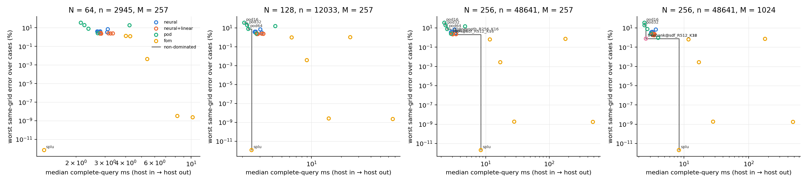

# Poisson on the L-shaped domain — the separable decoder against sparse direct and PCG (table T18)

This report covers one pre-registered cell (`experiments/lshape/DESIGN.md`): Poisson 2D on $\Omega=(0,1)^2\setminus[\tfrac12,1)^2$ with the re-entrant-corner singularity, a bank sweep over the boundary factor and rank, heads at $K\in\{16,32\}$, a correction ladder, POD-LSPG, and every full-order comparator timed in the same job. **Status of the numbers: final.** They are one training seed on one 32-source development cohort that selected nothing.

Training job `3783786` on `NVIDIA A100 80GB PCIe`, source commit `1086ccefdcb5417fd6c9be2cf3e6f56fc2853231`, 51.7 min, `jax_backend=gpu`, x64 yes, matmul precision `highest`, JAX 0.10.2.
Solve job `3784662` (meshes 64, 128) on `NVIDIA A100 80GB PCIe`, source commit `941a550e707de227490e930d5e147dc8eb54d8d6`, 32.7 min, `jax_backend=gpu`, x64 yes, matmul precision `highest`.
Solve job `3784663` (meshes 256) on `NVIDIA A100 80GB PCIe`, source commit `941a550e707de227490e930d5e147dc8eb54d8d6`, 15.0 min, `jax_backend=gpu`, x64 yes, matmul precision `highest`.
Solve job `3784910` (meshes 256) on `NVIDIA A100 80GB PCIe`, source commit `40170928199307fde705e6c6f94bdc6e4f653627`, 16.2 min, `jax_backend=gpu`, x64 yes, matmul precision `highest`.

## Headline: the non-dominated set per mesh, full-order comparators included

Subject $A$ dominates $B$ if $\mathrm{err}_A\le\mathrm{err}_B$ and $\mathrm{cost}_A\le\mathrm{cost}_B$ with one strict, on (worst same-grid error over the development cases, median complete-query ms). "Reduced" means any neural, correction-ladder, free-bank or POD subject.

**The blocks below are separate tables on purpose and their costs may NOT be compared.** The online residual projects the source onto $M$ test modes with a dense $M\times n$ product, and that product is charged inside every reduced query, so a subject at $M=1024$ carries about four times the projection work of the same subject at $M=257$. Every comparison that matters — reduced against full-order — is within one job and therefore inside one block.

### Block $M=257$ test modes — job(s) `3784662`, `3784663`

| mesh | non-dominated set (complete-query ms) | reduced model in it? | non-dominated set (device / solver ms) |
|---|---|---|---|
| 64 | `fom_splu` (0.000 %, 1.282 ms) | **no** | `fom_splu` (0.000 %, 0.545 ms) |
| 128 | `pod16` (34.628 %, 2.086 ms), `pod32` (19.005 %, 2.233 ms), `pod64` (7.701 %, 2.294 ms), `fom_splu` (0.000 %, 2.475 ms) | yes: `pod16`, `pod32`, `pod64` | `pod16` (34.628 %, 1.168 ms), `pod64` (7.701 %, 1.346 ms), `fom_splu` (0.000 %, 1.783 ms) |
| 256 | `pod16` (34.576 %, 2.240 ms), `pod32` (18.950 %, 2.341 ms), `pod64` (7.665 %, 2.483 ms), `neural_q0@head_smooth_R256_K16` (3.493 %, 2.848 ms), `pod128` (2.457 %, 2.850 ms), `neural_q64@head_sdf_R512_K16` (2.131 %, 3.028 ms), `fom_splu` (0.000 %, 8.386 ms) | yes: `pod16`, `pod32`, `pod64`, `neural_q0@head_smooth_R256_K16`, `pod128`, `neural_q64@head_sdf_R512_K16` | `pod16` (34.576 %, 1.325 ms), `pod32` (18.950 %, 1.391 ms), `pod64` (7.665 %, 1.561 ms), `pod128` (2.457 %, 1.940 ms), `neural_q64@head_sdf_R512_K16` (2.131 %, 2.094 ms), `fom_splu` (0.000 %, 7.534 ms) |

### Block $M=1024$ test modes — job(s) `3784910`

| mesh | non-dominated set (complete-query ms) | reduced model in it? | non-dominated set (device / solver ms) |
|---|---|---|---|
| 256 | `pod16` (34.576 %, 2.451 ms), `pod32` (18.950 %, 2.458 ms), `freebank@head_sdf_R512_K32` (0.779 %, 2.582 ms), `freebank@head_sdf_R512_K16` (0.779 %, 2.583 ms), `fom_splu` (0.000 %, 8.351 ms) | yes: `pod16`, `pod32`, `freebank@head_sdf_R512_K32`, `freebank@head_sdf_R512_K16` | `pod32` (18.950 %, 1.530 ms), `freebank@head_sdf_R512_K32` (0.779 %, 1.642 ms), `freebank@head_sdf_R512_K16` (0.779 %, 1.649 ms), `fom_splu` (0.000 %, 7.427 ms) |

**$M=257$, $N=64$.** **No reduced model is non-dominated.** `fom_splu` costs 1.282 ms at 0.000 % error; the cheapest reduced subject costs 2.141 ms, so the direct solve is both more accurate and cheaper than every one of them.

**$M=257$, $N=128$.** 3 reduced subjects are non-dominated. The most accurate of them, `pod64`, reaches 7.701 % worst error at 2.294 ms, against `fom_splu`, which is exact to round-off (0.00 %) at 2.475 ms — 1.08x more expensive per query. The cheapest reduced subject on the front is `pod16` at 2.086 ms and 34.628 %. **This is a cheapness-only membership.** Every reduced subject on this front is above the cell's own 5 % solved-error bar, so the front records subjects that are barely cheaper than the direct solve while being far less accurate — not a usable operating point.

**$M=257$, $N=256$.** 6 reduced subjects are non-dominated. The most accurate of them, `neural_q64@head_sdf_R512_K16`, reaches 2.131 % worst error at 3.028 ms, against `fom_splu`, which is exact to round-off (0.00 %) at 8.386 ms — 2.77x more expensive per query. The cheapest reduced subject on the front is `pod16` at 2.240 ms and 34.576 %. Non-dominance here means **cheaper and less accurate**, never better on both axes: no reduced subject improves on the direct solve's accuracy, and the front records what accuracy each one gives up to be cheaper.

**$M=1024$, $N=256$.** 4 reduced subjects are non-dominated. The most accurate of them, `freebank@head_sdf_R512_K16`, reaches 0.779 % worst error at 2.583 ms, against `fom_splu`, which is exact to round-off (0.00 %) at 8.351 ms — 3.23x more expensive per query. The cheapest reduced subject on the front is `pod16` at 2.451 ms and 34.576 %. Non-dominance here means **cheaper and less accurate**, never better on both axes: no reduced subject improves on the direct solve's accuracy, and the front records what accuracy each one gives up to be cheaper.

**Read every error above beside this gap.** The development cohort has 32 sources; the held-out validation split of the training draw has 461. Across the 7 head arms the worst best-found reconstruction error is 3.2–6.8 % on the 32 development sources but 10.7–16.7 % on the 461 validation sources — a factor of about 2.5 on the worst case. The worst case over 32 draws is simply not the worst case over 461, and the solved errors in every table below are worst-over-32 numbers. Treat them as the optimistic end of the range; a 461-source solve sweep is the measurement that would replace them, and it has not been run.

## Operator verification gates (G-FOM, DESIGN.md section 2)

| job | mesh | n | symmetric (max asym) | independent assembly | $\lambda_{\min}$ | vs $\lambda_1$ ref (rel) | within 1 % | passed |
|---|---:|---:|---|---|---:|---:|---|---|
| train | 256 | 48641 | yes (0.0e+00) | yes (nnz diff 0) | 38.571238 | 3.20e-04 | yes | yes |
| train | 512 | 195585 | yes (0.0e+00) | yes (nnz diff 0) | 38.563982 | 1.32e-04 | yes | yes |
| solve 3784662 | 64 | 2945 | yes (0.0e+00) | yes (nnz diff 0) | 38.624807 | 1.71e-03 | — | yes |
| solve 3784662 | 128 | 12033 | yes (0.0e+00) | yes (nnz diff 0) | 38.588092 | 7.57e-04 | yes | yes |
| solve 3784663 | 256 | 48641 | yes (0.0e+00) | yes (nnz diff 0) | 38.571238 | 3.20e-04 | yes | yes |
| solve 3784910 | 256 | 48641 | yes (0.0e+00) | yes (nnz diff 0) | 38.571238 | 3.20e-04 | yes | yes |
| solve 3784662 | 64 | — | — | G-FOM-5 tight iterative vs direct: 3.26e-11 ≤ 1e-08 | — | — | — | yes |
| solve 3784662 | 128 | — | — | G-FOM-5 tight iterative vs direct: 2.57e-11 ≤ 1e-08 | — | — | — | yes |
| solve 3784663 | 256 | — | — | G-FOM-5 tight iterative vs direct: 1.84e-11 ≤ 1e-08 | — | — | — | yes |
| solve 3784910 | 256 | — | — | G-FOM-5 tight iterative vs direct: 1.84e-11 ≤ 1e-08 | — | — | — | yes |

The known first Dirichlet eigenvalue of this L-shape is $\lambda_1 = 38.558895$. There is no DST: the L-shape operator is a principal submatrix of the square's Kronecker sum and is not itself a Kronecker sum, so no fast transform diagonalises it.

### Full-order setup, per mesh (offline, not charged to any query)

| job | mesh | n | nnz(A) | SuperLU factor s | nnz(L+U) | IC(0) factor s | nnz(IC0 L) | eigen-solve s (M modes) | eigen residual | 1024-ref residual |
|---|---:|---:|---:|---:|---:|---:|---:|---:|---:|---:|
| `3784662` | 64 | 2945 | 14473 | 0.005 | 119862 | 0.014 | 8709 | 0.6 (257) | 8.6e-15 | 4.7e-12 |
| `3784662` | 128 | 12033 | 59657 | 0.027 | 742370 | 0.018 | 35845 | 2.0 (257) | 2.7e-14 | 4.7e-12 |
| `3784663` | 256 | 48641 | 242185 | 0.145 | 4001780 | 0.072 | 145413 | 9.9 (257) | 8.8e-14 | 4.7e-12 |
| `3784910` | 256 | 48641 | 242185 | 0.139 | 4001780 | 0.069 | 145413 | 103.1 (1024) | 4.7e-14 | 4.7e-12 |

### Discretisation error of the FD solution itself (same-grid vs restricted 1024-interval direct solve)

The reduced models are graded against the same-grid direct solve, not against this; the column is here so a reader can see how much of the mesh's own error the corner singularity costs.

| job | mesh | worst over cases | median over cases |
|---|---:|---:|---:|
| `3784662` | 64 | 1.2945 % | 0.2614 % |
| `3784662` | 128 | 0.4700 % | 0.0817 % |
| `3784663` | 256 | 0.1629 % | 0.0261 % |

## Cohorts

| cohort | seed | drawn | rejected (centre in removed quadrant) | used | role |
|---|---:|---:|---:|---:|---|
| training | 0 | 4608 | 1161 | 3072 | bank and head training (85/15 fit/validation) |
| common | 20260916 | 512 | 126 | 256 | bank selection only |
| development | 20260917 | 64 | 14 | 32 | reporting only; selects nothing |

## Bank layer — boundary factor and rank

| arm | factor | $R$ | floor dev N=256 (worst / median) | floor dev N=512 (worst / median) | floor common N=256 (worst) | cond | head best-found dev N=256 | train min |
|---|---|---:|---:|---:|---:|---:|---:|---:|
| `smooth_R256` | smooth | 256 | 1.5113 / 0.1979 | 1.5057 / 0.1985 | 3.1933 | 1.30e+04 | 3.8245 | 4.1 |
| `smooth_R512` | smooth | 512 | 0.7123 / 0.1212 | 0.7093 / 0.1304 | 1.9344 | 2.40e+05 | 3.8509 | 11.0 |
| `sdf_R256` | sdf | 256 | 1.5697 / 0.3390 | 1.5626 / 0.3413 | 3.2101 | 2.03e+04 | 3.6180 | 3.1 |
| `sdf_R512` | sdf | 512 | 0.7766 / 0.3143 | 0.7698 / 0.3047 | 1.6155 | 2.30e+05 | 4.0460 | 6.7 |
| `enrich_R512` | smooth + 2 singular | 514 | 0.6676 / 0.1167 | 0.6650 / 0.1165 | 1.7028 | 1.13e+06 | 3.7892 | 7.6 |
| `smooth_ff128s2_R512` | smooth (n_ff 128, scale 2) | 512 | 2.5438 / 0.5912 | 2.5388 / 0.5912 | 3.8411 | 8.92e+09 | 12.3119 | 7.2 |

**Selected bank:** `sdf_R512` (rule: lowest worst bank projection floor on the common selection cohort at the training mesh; ties by median, then smaller R, then table order (DESIGN.md section 4); the development ranking **disagrees**). Ranking on the common cohort: `sdf_R512` 1.6155 %, `enrich_R512` 1.7028 %, `smooth_R512` 1.9344 %, `smooth_R256` 3.1933 %, `sdf_R256` 3.2101 %, `smooth_ff128s2_R512` 3.8411 %.
**Bank target** (worst development floor at N=512 below 1.0000 %): best arm 0.6650 % — **pass**.
**Factor swap at R=512:** smooth 0.7093 % vs sdf 0.7698 % (ratio sdf/smooth 1.085x).
**Corner enrichment:** enrich 0.6650 % vs smooth 0.7093 % (improvement 1.067x).
**Feature lever (a):** n_ff 128 / scale 2 2.5388 % vs baseline 0.7093 %.
**Falsification clause** (every smooth arm > 1.5 % at N=512 AND enrichment helps > 1.5x): not met (smooth floors 1.506 %, 0.709 %, 2.539 %; enrichment ratio 1.067x).

## Head layer at N=256 (training mesh)

| arm | bank | $K$ | bank floor dev | at stored codes (fit, worst) | best-found val | best-found dev | solved dev (untimed) | stationary | best-found / floor | target 1.2x |
|---|---|---:|---:|---:|---:|---:|---:|---:|---:|---|
| `head_smooth_R256_K16` | `smooth_R256` | 16 | 1.5113 | 4.2917 | 11.4909 | 3.4919 | 3.4928 | 32/32 | 2.311x | miss |
| `head_smooth_R512_K16` | `smooth_R512` | 16 | 0.7123 | 4.4188 | 10.7111 | 3.5924 | 3.5931 | 32/32 | 5.043x | miss |
| `head_sdf_R256_K16` | `sdf_R256` | 16 | 1.5697 | 4.4730 | 11.4302 | 3.5177 | 3.5181 | 32/32 | 2.241x | miss |
| `head_sdf_R512_K16` *(primary)* | `sdf_R512` | 16 | 0.7766 | 4.5649 | 12.0588 | 3.8607 | 3.8608 | 32/32 | 4.971x | miss |
| `head_sdf_R512_K32` *(primary)* | `sdf_R512` | 32 | 0.7766 | 3.5484 | 12.9499 | 3.1802 | 3.1814 | 32/32 | 4.095x | miss |
| `head_enrich_R512_K16` | `enrich_R512` | 16 | 0.6676 | 4.7560 | 13.2049 | 3.8508 | 3.8510 | 32/32 | 5.768x | miss |
| `head_smooth_ff128s2_R512_K16` | `smooth_ff128s2_R512` | 16 | 2.5438 | 10.5135 | 16.6614 | 6.7961 | 6.7970 | 32/32 | 2.672x | miss |

## Solve at N=64, $M=257$ (job `3784662`, 32 development cases × 3 repetitions)

Every cost in this section is measured inside job `3784662` at $M=257$ test modes and is comparable only with the other costs in this section.

### Three-layer decomposition per checkpoint (untimed)

| checkpoint | $K$ | $R$ | bank floor worst / median | best-found worst / median | solved q=0 worst |
|---|---:|---:|---:|---:|---:|
| `head_smooth_R256_K16` | 16 | 256 | 1.6302 / 0.1956 | 3.6805 / 0.7806 | 3.6816 |
| `head_smooth_R512_K16` | 16 | 512 | 0.7722 / 0.1149 | 3.7769 / 0.7646 | 3.7775 |
| `head_sdf_R256_K16` | 16 | 256 | 1.7048 / 0.4227 | 3.7076 / 0.8831 | 3.7083 |
| `head_sdf_R512_K16` | 16 | 512 | 0.8854 / 0.3967 | 4.0449 / 0.9002 | 4.0451 |
| `head_sdf_R512_K32` | 32 | 512 | 0.8854 / 0.3967 | 3.3469 / 0.7506 | 3.3481 |
| `head_enrich_R512_K16` | 16 | 514 | 0.7231 / 0.1198 | 4.0496 / 0.8530 | 4.0497 |
| `head_smooth_ff128s2_R512_K16` | 16 | 512 | 2.5854 / 0.5687 | 6.9992 / 2.0212 | 6.9999 |

### Every timed subject

| subject | family | $K$ / $k'$ | $q$ | worst same-grid | median same-grid | worst physical | median complete ms | median device / solver ms | stationary | median iters | max iters |
|---|---|---:|---:|---:|---:|---:|---:|---:|---:|---:|---:|
| `fom_cg_gpu_r0.0001` | fom | — | — | 0.0043 | 0.0015 | 1.2947 | 5.415 | 4.642 | — | 119.0 | 124 |
| `fom_cg_gpu_r0.01` | fom | — | — | 1.3222 | 0.2519 | 1.4364 | 4.018 | 3.298 | — | 73.0 | 81 |
| `fom_cg_gpu_r1e-10` | fom | — | — | 0.0000 | 0.0000 | 1.2945 | 8.245 | 7.435 | — | 213.5 | 222 |
| `fom_pcg_ic0_cpu_r0.01` | fom (cpu) | — | — | 1.2213 | 0.2558 | 1.4188 | 4.268 | 3.604 | — | 23.0 | 24 |
| `fom_pcg_ic0_cpu_r1e-10` | fom (cpu) | — | — | 0.0000 | 0.0000 | 1.2945 | 10.217 | 9.537 | — | 66.0 | 68 |
| `fom_splu` | fom (cpu) | — | — | 0.0000 | 0.0000 | 1.2945 | 1.282 | 0.545 | — | — | — |
| `neural_q0@head_enrich_R512_K16` | neural | 16 | 0 | 4.0497 | 0.8532 | 3.8488 | 2.808 | 1.901 | 96/96 | 4.0 | 5 |
| `neural_q0@head_sdf_R256_K16` | neural | 16 | 0 | 3.7083 | 0.8833 | 3.5151 | 2.808 | 1.895 | 96/96 | 4.0 | 5 |
| `neural_q0@head_sdf_R512_K16` | neural | 16 | 0 | 4.0451 | 0.9004 | 3.8545 | 2.693 | 1.769 | 96/96 | 4.0 | 5 |
| `neural_q0@head_sdf_R512_K32` | neural | 32 | 0 | 3.3481 | 0.7509 | 3.1838 | 3.092 | 2.213 | 96/96 | 5.0 | 5 |
| `neural_q0@head_smooth_R256_K16` | neural | 16 | 0 | 3.6816 | 0.7811 | 3.4954 | 2.720 | 1.832 | 96/96 | 4.0 | 5 |
| `neural_q0@head_smooth_R512_K16` | neural | 16 | 0 | 3.7775 | 0.7649 | 3.5953 | 2.751 | 1.864 | 96/96 | 4.0 | 5 |
| `neural_q0@head_smooth_ff128s2_R512_K16` | neural | 16 | 0 | 6.9999 | 2.0331 | 6.7888 | 3.121 | 2.179 | 96/96 | 6.0 | 14 |
| `neural_q128@head_sdf_R512_K16` | neural+linear | 16 | 128 | 2.3580 | 0.7032 | 2.2762 | 2.796 | 1.906 | 96/96 | 4.0 | 5 |
| `neural_q128@head_sdf_R512_K32` | neural+linear | 32 | 128 | 2.4624 | 0.7349 | 2.3993 | 3.351 | 2.446 | 96/96 | 5.0 | 7 |
| `neural_q32@head_sdf_R512_K16` | neural+linear | 16 | 32 | 2.7644 | 0.8315 | 2.6303 | 2.832 | 1.961 | 96/96 | 4.0 | 5 |
| `neural_q32@head_sdf_R512_K32` | neural+linear | 32 | 32 | 2.5125 | 0.6705 | 2.3969 | 3.152 | 2.266 | 96/96 | 5.0 | 5 |
| `neural_q64@head_sdf_R512_K16` | neural+linear | 16 | 64 | 2.3004 | 0.7703 | 2.1798 | 2.846 | 1.902 | 96/96 | 4.0 | 5 |
| `neural_q64@head_sdf_R512_K32` | neural+linear | 32 | 64 | 2.4238 | 0.6817 | 2.3243 | 3.248 | 2.346 | 96/96 | 5.0 | 5 |
| `pod128` | pod | 128 | 0 | 2.5913 | 0.1551 | 2.4354 | 2.711 | 1.827 | 96/96 | 2.0 | 2 |
| `pod16` | pod | 16 | 0 | 34.8382 | 9.8355 | 34.5406 | 2.141 | 1.242 | 96/96 | 1.0 | 2 |
| `pod256` | pod | 256 | 0 | 18.5541 | 0.3495 | 18.5698 | 4.227 | 3.334 | 96/96 | 3.0 | 4 |
| `pod32` | pod | 32 | 0 | 19.2320 | 3.2370 | 18.9843 | 2.251 | 1.330 | 96/96 | 1.0 | 2 |
| `pod64` | pod | 64 | 0 | 7.8504 | 0.7823 | 7.6891 | 2.382 | 1.454 | 96/96 | 2.0 | 2 |

## Solve at N=128, $M=257$ (job `3784662`, 32 development cases × 3 repetitions)

Every cost in this section is measured inside job `3784662` at $M=257$ test modes and is comparable only with the other costs in this section.

### Three-layer decomposition per checkpoint (untimed)

| checkpoint | $K$ | $R$ | bank floor worst / median | best-found worst / median | solved q=0 worst |
|---|---:|---:|---:|---:|---:|
| `head_smooth_R256_K16` | 16 | 256 | 1.5340 / 0.1864 | 3.5282 / 0.7703 | 3.5291 |
| `head_smooth_R512_K16` | 16 | 512 | 0.7243 / 0.1167 | 3.6276 / 0.7504 | 3.6282 |
| `head_sdf_R256_K16` | 16 | 256 | 1.5975 / 0.3643 | 3.5551 / 0.8171 | 3.5556 |
| `head_sdf_R512_K16` | 16 | 512 | 0.8023 / 0.3533 | 3.8964 / 0.8537 | 3.8965 |
| `head_sdf_R512_K32` | 32 | 512 | 0.8023 / 0.3533 | 3.2125 / 0.7084 | 3.2138 |
| `head_enrich_R512_K16` | 16 | 514 | 0.6783 / 0.1192 | 3.8893 / 0.8517 | 3.8895 |
| `head_smooth_ff128s2_R512_K16` | 16 | 512 | 2.5606 / 0.5895 | 6.8360 / 2.0115 | 6.8369 |

### Every timed subject

| subject | family | $K$ / $k'$ | $q$ | worst same-grid | median same-grid | worst physical | median complete ms | median device / solver ms | stationary | median iters | max iters |
|---|---|---:|---:|---:|---:|---:|---:|---:|---:|---:|---:|
| `fom_cg_gpu_r0.0001` | fom | — | — | 0.0038 | 0.0011 | 0.4702 | 8.973 | 8.236 | — | 243.0 | 254 |
| `fom_cg_gpu_r0.01` | fom | — | — | 0.9629 | 0.1852 | 0.9849 | 6.303 | 5.575 | — | 151.5 | 170 |
| `fom_cg_gpu_r1e-10` | fom | — | — | 0.0000 | 0.0000 | 0.4700 | 14.959 | 14.056 | — | 430.0 | 451 |
| `fom_pcg_ic0_cpu_r0.01` | fom (cpu) | — | — | 1.0172 | 0.1783 | 1.0392 | 24.666 | 24.027 | — | 46.5 | 51 |
| `fom_pcg_ic0_cpu_r1e-10` | fom (cpu) | — | — | 0.0000 | 0.0000 | 0.4700 | 66.506 | 65.967 | — | 130.0 | 135 |
| `fom_splu` | fom (cpu) | — | — | 0.0000 | 0.0000 | 0.4700 | 2.475 | 1.783 | — | — | — |
| `neural_q0@head_enrich_R512_K16` | neural | 16 | 0 | 3.8895 | 0.8519 | 3.8396 | 2.735 | 1.828 | 96/96 | 4.0 | 5 |
| `neural_q0@head_sdf_R256_K16` | neural | 16 | 0 | 3.5556 | 0.8172 | 3.5065 | 2.664 | 1.798 | 96/96 | 4.0 | 5 |
| `neural_q0@head_sdf_R512_K16` | neural | 16 | 0 | 3.8965 | 0.8540 | 3.8493 | 2.673 | 1.807 | 96/96 | 4.0 | 5 |
| `neural_q0@head_sdf_R512_K32` | neural | 32 | 0 | 3.2138 | 0.7087 | 3.1725 | 3.135 | 2.225 | 96/96 | 5.0 | 5 |
| `neural_q0@head_smooth_R256_K16` | neural | 16 | 0 | 3.5291 | 0.7708 | 3.4827 | 2.699 | 1.796 | 96/96 | 4.0 | 5 |
| `neural_q0@head_smooth_R512_K16` | neural | 16 | 0 | 3.6282 | 0.7508 | 3.5837 | 2.719 | 1.827 | 96/96 | 4.0 | 5 |
| `neural_q0@head_smooth_ff128s2_R512_K16` | neural | 16 | 0 | 6.8369 | 2.0242 | 6.7855 | 3.035 | 2.072 | 96/96 | 6.0 | 14 |
| `neural_q128@head_sdf_R512_K16` | neural+linear | 16 | 128 | 2.2217 | 0.6698 | 2.1978 | 2.868 | 1.951 | 96/96 | 4.0 | 5 |
| `neural_q128@head_sdf_R512_K32` | neural+linear | 32 | 128 | 2.3352 | 0.7019 | 2.3164 | 3.264 | 2.363 | 96/96 | 5.0 | 6 |
| `neural_q32@head_sdf_R512_K16` | neural+linear | 16 | 32 | 2.6261 | 0.7903 | 2.5914 | 2.789 | 1.888 | 96/96 | 4.0 | 5 |
| `neural_q32@head_sdf_R512_K32` | neural+linear | 32 | 32 | 2.3851 | 0.6341 | 2.3540 | 3.138 | 2.261 | 96/96 | 5.0 | 5 |
| `neural_q64@head_sdf_R512_K16` | neural+linear | 16 | 64 | 2.1643 | 0.7359 | 2.1321 | 2.806 | 1.907 | 96/96 | 4.0 | 5 |
| `neural_q64@head_sdf_R512_K32` | neural+linear | 32 | 64 | 2.2692 | 0.6483 | 2.2410 | 3.246 | 2.264 | 96/96 | 5.0 | 5 |
| `pod128` | pod | 128 | 0 | 2.4833 | 0.1496 | 2.4421 | 2.764 | 1.856 | 96/96 | 2.0 | 2 |
| `pod16` | pod | 16 | 0 | 34.6279 | 9.7638 | 34.5536 | 2.086 | 1.168 | 96/96 | 1.0 | 2 |
| `pod256` | pod | 256 | 0 | 15.1974 | 0.3733 | 15.1997 | 4.306 | 3.381 | 96/96 | 3.0 | 5 |
| `pod32` | pod | 32 | 0 | 19.0053 | 3.2091 | 18.9440 | 2.233 | 1.361 | 96/96 | 1.0 | 2 |
| `pod64` | pod | 64 | 0 | 7.7013 | 0.7668 | 7.6604 | 2.294 | 1.346 | 96/96 | 2.0 | 2 |

## Solve at N=256, $M=257$ (job `3784663`, 32 development cases × 3 repetitions)

Every cost in this section is measured inside job `3784663` at $M=257$ test modes and is comparable only with the other costs in this section.

### Three-layer decomposition per checkpoint (untimed)

| checkpoint | $K$ | $R$ | bank floor worst / median | best-found worst / median | solved q=0 worst |
|---|---:|---:|---:|---:|---:|
| `head_smooth_R256_K16` | 16 | 256 | 1.5113 / 0.1979 | 3.4919 / 0.7691 | 3.4928 |
| `head_smooth_R512_K16` | 16 | 512 | 0.7123 / 0.1212 | 3.5924 / 0.7483 | 3.5931 |
| `head_sdf_R256_K16` | 16 | 256 | 1.5697 / 0.3390 | 3.5177 / 0.7933 | 3.5181 |
| `head_sdf_R512_K16` | 16 | 512 | 0.7766 / 0.3143 | 3.8607 / 0.8349 | 3.8608 |
| `head_sdf_R512_K32` | 32 | 512 | 0.7766 / 0.3143 | 3.1802 / 0.7003 | 3.1814 |
| `head_enrich_R512_K16` | 16 | 514 | 0.6676 / 0.1167 | 3.8508 / 0.8524 | 3.8510 |
| `head_smooth_ff128s2_R512_K16` | 16 | 512 | 2.5438 / 0.5912 | 6.7961 / 2.0088 | 6.7970 |

### Every timed subject

| subject | family | $K$ / $k'$ | $q$ | worst same-grid | median same-grid | worst physical | median complete ms | median device / solver ms | stationary | median iters | max iters |
|---|---|---:|---:|---:|---:|---:|---:|---:|---:|---:|---:|
| `fom_cg_gpu_r0.0001` | fom | — | — | 0.0027 | 0.0008 | 0.1630 | 16.970 | 16.147 | — | 498.0 | 521 |
| `fom_cg_gpu_r0.01` | fom | — | — | 0.6374 | 0.1177 | 0.6428 | 11.644 | 10.872 | — | 323.0 | 353 |
| `fom_cg_gpu_r1e-10` | fom | — | — | 0.0000 | 0.0000 | 0.1629 | 28.085 | 27.192 | — | 869.0 | 910 |
| `fom_pcg_ic0_cpu_r0.01` | fom (cpu) | — | — | 0.7277 | 0.1389 | 0.7332 | 179.454 | 178.577 | — | 95.5 | 104 |
| `fom_pcg_ic0_cpu_r1e-10` | fom (cpu) | — | — | 0.0000 | 0.0000 | 0.1629 | 484.339 | 483.347 | — | 259.5 | 271 |
| `fom_splu` | fom (cpu) | — | — | 0.0000 | 0.0000 | 0.1629 | 8.386 | 7.534 | — | — | — |
| `neural_q0@head_enrich_R512_K16` | neural | 16 | 0 | 3.8510 | 0.8526 | 3.8390 | 2.895 | 2.006 | 96/96 | 4.0 | 5 |
| `neural_q0@head_sdf_R256_K16` | neural | 16 | 0 | 3.5181 | 0.7934 | 3.5061 | 2.878 | 1.942 | 96/96 | 4.0 | 5 |
| `neural_q0@head_sdf_R512_K16` | neural | 16 | 0 | 3.8608 | 0.8352 | 3.8497 | 2.879 | 1.969 | 96/96 | 4.0 | 5 |
| `neural_q0@head_sdf_R512_K32` | neural | 32 | 0 | 3.1814 | 0.7006 | 3.1715 | 3.338 | 2.442 | 96/96 | 5.0 | 5 |
| `neural_q0@head_smooth_R256_K16` | neural | 16 | 0 | 3.4928 | 0.7696 | 3.4816 | 2.848 | 1.944 | 96/96 | 4.0 | 5 |
| `neural_q0@head_smooth_R512_K16` | neural | 16 | 0 | 3.5931 | 0.7486 | 3.5826 | 2.885 | 1.973 | 96/96 | 4.0 | 5 |
| `neural_q0@head_smooth_ff128s2_R512_K16` | neural | 16 | 0 | 6.7970 | 2.0206 | 6.7848 | 3.231 | 2.326 | 96/96 | 6.0 | 14 |
| `neural_q128@head_sdf_R512_K16` | neural+linear | 16 | 128 | 2.2055 | 0.6486 | 2.1996 | 3.042 | 2.104 | 96/96 | 4.0 | 5 |
| `neural_q128@head_sdf_R512_K32` | neural+linear | 32 | 128 | 2.2681 | 0.6883 | 2.2634 | 3.403 | 2.517 | 96/96 | 5.0 | 6 |
| `neural_q32@head_sdf_R512_K16` | neural+linear | 16 | 32 | 2.5950 | 0.7674 | 2.5868 | 2.963 | 2.039 | 96/96 | 4.0 | 5 |
| `neural_q32@head_sdf_R512_K32` | neural+linear | 32 | 32 | 2.3570 | 0.6305 | 2.3495 | 3.424 | 2.490 | 96/96 | 5.0 | 5 |
| `neural_q64@head_sdf_R512_K16` | neural+linear | 16 | 64 | 2.1305 | 0.7190 | 2.1228 | 3.028 | 2.094 | 96/96 | 4.0 | 5 |
| `neural_q64@head_sdf_R512_K32` | neural+linear | 32 | 64 | 2.2367 | 0.6242 | 2.2297 | 3.431 | 2.520 | 96/96 | 5.0 | 5 |
| `pod128` | pod | 128 | 0 | 2.4575 | 0.1482 | 2.4474 | 2.850 | 1.940 | 96/96 | 2.0 | 2 |
| `pod16` | pod | 16 | 0 | 34.5764 | 9.7452 | 34.5584 | 2.240 | 1.325 | 96/96 | 1.0 | 2 |
| `pod256` | pod | 256 | 0 | 14.5957 | 0.3288 | 14.5954 | 4.747 | 3.681 | 96/96 | 3.0 | 5 |
| `pod32` | pod | 32 | 0 | 18.9497 | 3.2019 | 18.9349 | 2.341 | 1.391 | 96/96 | 1.0 | 2 |
| `pod64` | pod | 64 | 0 | 7.6645 | 0.7629 | 7.6547 | 2.483 | 1.561 | 96/96 | 2.0 | 2 |

### Pre-registered cell success at N=256

| clause | requirement | value | verdict |
|---|---|---:|---|
| 1 solved | worst same-grid < 5.0000 % (`neural_q0@head_sdf_R512_K32`) | 3.1814 % | **pass** |
| 2 stationary | every q=0 solve exits stationary | 96/96 | **pass** |
| 3 vs POD k'=K | beats `pod32` on worst error | 3.1814 % vs 18.9497 % | **pass** |
| 4 gates | every G-FOM gate passes | — | **pass** |
| honesty | POD-LSPG at k'=8K (`pod256`) vs the head | 14.5957 % vs 3.1814 % | head beats POD at 8K |
| honesty | `fom_splu` cost and error | 0.0000 % at 8.386 ms vs `neural_q0@head_sdf_R512_K32` 3.338 ms | the head is cheaper than the direct solve |

## Solve at N=256, $M=1024$ (job `3784910`, 32 development cases × 3 repetitions)

Every cost in this section is measured inside job `3784910` at $M=1024$ test modes and is comparable only with the other costs in this section.

### Three-layer decomposition per checkpoint (untimed)

| checkpoint | $K$ | $R$ | bank floor worst / median | best-found worst / median | solved q=0 worst |
|---|---:|---:|---:|---:|---:|
| `head_smooth_R256_K16` | 16 | 256 | 1.5113 / 0.1979 | 3.4919 / 0.7691 | 3.4919 |
| `head_smooth_R512_K16` | 16 | 512 | 0.7123 / 0.1212 | 3.5924 / 0.7483 | 3.5924 |
| `head_sdf_R256_K16` | 16 | 256 | 1.5697 / 0.3390 | 3.5177 / 0.7933 | 3.5177 |
| `head_sdf_R512_K16` | 16 | 512 | 0.7766 / 0.3143 | 3.8607 / 0.8349 | 3.8607 |
| `head_sdf_R512_K32` | 32 | 512 | 0.7766 / 0.3143 | 3.1802 / 0.7003 | 3.1802 |
| `head_enrich_R512_K16` | 16 | 514 | 0.6676 / 0.1167 | 3.8508 / 0.8524 | 3.8508 |
| `head_smooth_ff128s2_R512_K16` | 16 | 512 | 2.5438 / 0.5912 | 6.7961 / 2.0088 | 6.7961 |

### Every timed subject

| subject | family | $K$ / $k'$ | $q$ | worst same-grid | median same-grid | worst physical | median complete ms | median device / solver ms | stationary | median iters | max iters |
|---|---|---:|---:|---:|---:|---:|---:|---:|---:|---:|---:|
| `fom_cg_gpu_r0.0001` | fom | — | — | 0.0027 | 0.0008 | 0.1630 | 17.003 | 16.151 | — | 498.0 | 521 |
| `fom_cg_gpu_r0.01` | fom | — | — | 0.6374 | 0.1177 | 0.6428 | 11.750 | 10.938 | — | 323.0 | 353 |
| `fom_cg_gpu_r1e-10` | fom | — | — | 0.0000 | 0.0000 | 0.1629 | 28.134 | 27.210 | — | 869.0 | 910 |
| `fom_pcg_ic0_cpu_r0.01` | fom (cpu) | — | — | 0.7277 | 0.1389 | 0.7332 | 178.461 | 177.788 | — | 95.5 | 104 |
| `fom_pcg_ic0_cpu_r1e-10` | fom (cpu) | — | — | 0.0000 | 0.0000 | 0.1629 | 482.264 | 481.425 | — | 259.5 | 271 |
| `fom_splu` | fom (cpu) | — | — | 0.0000 | 0.0000 | 0.1629 | 8.351 | 7.427 | — | — | — |
| `freebank@head_sdf_R512_K16` | free | 16 | 512 | 0.7791 | 0.3170 | 0.7768 | 2.583 | 1.649 | 96/96 | 0.0 | 0 |
| `freebank@head_sdf_R512_K32` | free | 32 | 512 | 0.7791 | 0.3170 | 0.7768 | 2.582 | 1.642 | 96/96 | 0.0 | 0 |
| `neural_q0@head_enrich_R512_K16` | neural | 16 | 0 | 3.8508 | 0.8524 | 3.8389 | 3.266 | 2.314 | 96/96 | 4.0 | 5 |
| `neural_q0@head_sdf_R256_K16` | neural | 16 | 0 | 3.5177 | 0.7933 | 3.5055 | 3.167 | 2.241 | 96/96 | 4.0 | 5 |
| `neural_q0@head_sdf_R512_K16` | neural | 16 | 0 | 3.8607 | 0.8349 | 3.8494 | 3.207 | 2.292 | 96/96 | 4.0 | 4 |
| `neural_q0@head_sdf_R512_K32` | neural | 32 | 0 | 3.1802 | 0.7003 | 3.1702 | 3.358 | 2.426 | 96/96 | 5.0 | 5 |
| `neural_q0@head_smooth_R256_K16` | neural | 16 | 0 | 3.4919 | 0.7691 | 3.4806 | 3.119 | 2.202 | 96/96 | 4.0 | 5 |
| `neural_q0@head_smooth_R512_K16` | neural | 16 | 0 | 3.5924 | 0.7483 | 3.5819 | 3.192 | 2.268 | 96/96 | 4.0 | 5 |
| `neural_q0@head_smooth_ff128s2_R512_K16` | neural | 16 | 0 | 6.7961 | 2.0088 | 6.7838 | 3.678 | 2.742 | 96/96 | 6.0 | 14 |
| `neural_q128@head_sdf_R512_K16` | neural+linear | 16 | 128 | 1.7709 | 0.5198 | 1.7637 | 3.314 | 2.395 | 96/96 | 4.0 | 5 |
| `neural_q128@head_sdf_R512_K32` | neural+linear | 32 | 128 | 1.6852 | 0.4655 | 1.6788 | 3.455 | 2.518 | 96/96 | 5.0 | 5 |
| `neural_q32@head_sdf_R512_K16` | neural+linear | 16 | 32 | 2.5548 | 0.7588 | 2.5461 | 3.265 | 2.333 | 96/96 | 4.0 | 5 |
| `neural_q32@head_sdf_R512_K32` | neural+linear | 32 | 32 | 2.2900 | 0.6179 | 2.2820 | 3.509 | 2.597 | 96/96 | 5.0 | 5 |
| `neural_q64@head_sdf_R512_K16` | neural+linear | 16 | 64 | 2.0866 | 0.6773 | 2.0787 | 3.319 | 2.365 | 96/96 | 4.0 | 4 |
| `neural_q64@head_sdf_R512_K32` | neural+linear | 32 | 64 | 2.0489 | 0.5820 | 2.0414 | 3.430 | 2.541 | 96/96 | 5.0 | 5 |
| `pod128` | pod | 128 | 0 | 2.4568 | 0.1481 | 2.4468 | 3.096 | 2.182 | 96/96 | 2.0 | 2 |
| `pod16` | pod | 16 | 0 | 34.5764 | 9.7452 | 34.5584 | 2.451 | 1.543 | 96/96 | 1.0 | 2 |
| `pod256` | pod | 256 | 0 | 0.9303 | 0.0186 | 0.9242 | 3.987 | 2.966 | 96/96 | 2.0 | 2 |
| `pod32` | pod | 32 | 0 | 18.9497 | 3.2019 | 18.9349 | 2.458 | 1.530 | 96/96 | 1.0 | 2 |
| `pod64` | pod | 64 | 0 | 7.6645 | 0.7629 | 7.6547 | 2.718 | 1.761 | 96/96 | 2.0 | 2 |

### Pre-registered cell success at N=256

| clause | requirement | value | verdict |
|---|---|---:|---|
| 1 solved | worst same-grid < 5.0000 % (`neural_q0@head_sdf_R512_K32`) | 3.1802 % | **pass** |
| 2 stationary | every q=0 solve exits stationary | 96/96 | **pass** |
| 3 vs POD k'=K | beats `pod32` on worst error | 3.1802 % vs 18.9497 % | **pass** |
| 4 gates | every G-FOM gate passes | — | **pass** |
| honesty | POD-LSPG at k'=8K (`pod256`) vs the head | 0.9303 % vs 3.1802 % | POD at 8K matches or beats the head |
| honesty | `fom_splu` cost and error | 0.0000 % at 8.351 ms vs `neural_q0@head_sdf_R512_K32` 3.358 ms | the head is cheaper than the direct solve |

## The free rung $q=R$: a purely linear reduced model on the same bank

On this rung the correction basis is the whole bank ($C=I$), so no nonlinear unknown remains: the head is bypassed and every coefficient comes from one exact least-squares elimination against the test modes. It is the paper's structural claim made concrete — on a linear PDE the top rung of the ladder is itself a **linear** reduced model.

**Head-independence, measured.** The rung is head-independent in exact arithmetic, and the two heads on the same bank ($K=16$ and $K=32$) agree on every reported figure: worst 0.7791 % against 0.7791 %, median 0.3170 % against 0.3170 %. They are **not** bitwise identical: with $C=I$ the elimination cancels $h(z)$ against $R_q^{-1}Q_q^\top B\,h(z)$, and in f64 that cancellation leaves round-off that still depends on $h(z)$. The measured worst relative field difference between the two heads is in `checks/verify_report_2026-09-17.json` (`free_rung_is_head_independent_to_roundoff`); the timed repetitions of one subject *are* bitwise identical. DESIGN.md §A6 claimed byte-identical output from the two heads on the strength of an $N=32$, $R=32$ smoke, where the cancellation happened to be exact; §A9 corrects that.

| block $M$ | job | mesh | subject | $R$ | worst same-grid % | median same-grid % | bank floor worst % | worst / floor | median complete ms | iters | on the non-dominated front? |
|---:|---|---:|---|---:|---:|---:|---:|---:|---:|---:|---|
| 1024 | `3784910` | 256 | `freebank@head_sdf_R512_K16` | 512 | 0.7791 | 0.3170 | 0.7766 | 1.003x | 2.583 | 0.0 | **yes** |
| 1024 | `3784910` | 256 | `freebank@head_sdf_R512_K32` | 512 | 0.7791 | 0.3170 | 0.7766 | 1.003x | 2.582 | 0.0 | **yes** |

**`freebank@head_sdf_R512_K16` against the best linear baseline in the same job.** The strongest POD-LSPG rank at $M=1024$, $N=256$ is `pod256` at 0.9303 % worst and 3.987 ms; the free rung is 0.7791 % at 2.583 ms, so it **dominates** it — 1.19x better worst error at 1.54x the speed. That is the one place in this cell where the learned bank beats the classical linear baseline on both axes at once.

**Why these rows are at $M=1024$ and not at $M=R+1$** (DESIGN.md §A6). The rung is the least-squares solution of $Bc=f_M$ over all $R$ coefficients, so it needs $M>R$ equations. At the smallest such count, $M=R+1$, the system is one equation over square: the bank content outside the span of the lowest $R+1$ eigenmodes is unconstrained, $\mathrm{cond}(B)$ is $10^6$–$10^7$, and an untimed NumPy sweep on these exact banks put the rung 8–13x above its own bank floor (`smooth_R512` 8.4852 % worst against a 0.7123 % floor). From $M\approx768$ it is within 4 % of the floor on every bank and at $M=1024$ it *is* the floor. The sweep is `checks/free_rung_M_sweep.json`; the timed rung was therefore run at $M=1024$, which is why it lives in its own block and its cost may not be set beside the $M=257$ tables.

## Independent NumPy audits

`train` audit: `complete` pass, `backend_gpu` pass, `x64` pass, `precision_highest` pass, `development_cohort_reproduced` pass, `cohort_hashes_recorded` pass, `cohorts_disjoint` pass, `centres_in_omega` pass, `operator_independent_assembly` pass, `operator_symmetric` pass, `operator_positive_definite_lambda1_within_1pct` pass, `gates_recorded_pass` pass, `bank_floors_reproduced` pass, `bank_floors_within_reported_precision` pass, `bank_selection_reproduced` pass, `basis_codes_match_checkpoint` pass, `checkpoint_and_basis_hashes` pass, `head_stored_code_errors_reproduced` pass, `correction_bases_orthonormal_in_field_metric` pass.

- worst_bank_floor_relative_difference: 5.236e-06
- worst_bank_floor_absolute_difference: 4.723e-08
- bank_floor_absolute_limit: 1.000e-06
- worst_stored_code_relative_difference: 1.440e-10
- worst_basis_orthonormality_error: 2.824e-08
- bank cond(G): `smooth_R256` 1.30e+04, `smooth_R512` 2.40e+05, `sdf_R256` 2.03e+04, `sdf_R512` 2.30e+05, `enrich_R512` 1.13e+06, `smooth_ff128s2_R512` 8.92e+09

  The bank floor is compared across machines (driver on the GPU, audit on the CPU), so its deciding bound is **absolute** and tied to the reporting precision: the difference may not move the last digit of a floor quoted to four decimals in percent. The relative difference is dominated by cond(G) rather than by any error — two NumPy routes (QR and SVD) on identical features agree to 1e-14 — and is retained above only as a conditioning diagnostic (DESIGN.md §A4).

`solve` audit: `complete` pass, `backend_gpu` pass, `x64` pass, `precision_highest` pass, `gates_recorded_pass` pass, `development_cohort_reproduced` pass, `operator_symmetric` pass, `operator_independent_assembly` pass, `reference_residual_below_limit` pass, `same_grid_errors_recomputed_from_saved_fields` pass, `physical_errors_recomputed_from_saved_fields` pass, `every_subject_case_has_all_reps` pass, `tight_iterative_solves_match_direct` pass.

- worst_same_grid_difference: 2.146e-15
- worst_physical_difference: 7.058e-15
- worst_reference_residual: 7.417e-14

`solve` audit: `complete` pass, `backend_gpu` pass, `x64` pass, `precision_highest` pass, `gates_recorded_pass` pass, `development_cohort_reproduced` pass, `operator_symmetric` pass, `operator_independent_assembly` pass, `reference_residual_below_limit` pass, `same_grid_errors_recomputed_from_saved_fields` pass, `physical_errors_recomputed_from_saved_fields` pass, `every_subject_case_has_all_reps` pass, `tight_iterative_solves_match_direct` pass.

- worst_same_grid_difference: 4.662e-15
- worst_physical_difference: 7.227e-15
- worst_reference_residual: 2.973e-13

`solve` audit: `complete` pass, `backend_gpu` pass, `x64` pass, `precision_highest` pass, `gates_recorded_pass` pass, `development_cohort_reproduced` pass, `operator_symmetric` pass, `operator_independent_assembly` pass, `reference_residual_below_limit` pass, `same_grid_errors_recomputed_from_saved_fields` pass, `physical_errors_recomputed_from_saved_fields` pass, `every_subject_case_has_all_reps` pass, `tight_iterative_solves_match_direct` pass.

- worst_same_grid_difference: 4.662e-15
- worst_physical_difference: 7.227e-15
- worst_reference_residual: 2.973e-13

## Figure

Each panel is one mesh; every timed subject is one point (worst same-grid error over the development cases against median complete-query milliseconds), hollow markers coloured by family, the grey step is the non-dominated front with full-order comparators included, and only front members are labelled. Panels are labelled with their test-mode count M; panels at different M are different cost scales and must not be compared horizontally.

## Recorded deviations and honesty notes

- **The POD competitor sees more data than the bank did.** The bank and every head are fitted on the 85 % fit split (2611 sources); POD-LSPG is built from all 3072 training snapshots. The difference favours POD, and it is left that way deliberately so the linear baseline is not handicapped.
- **The free-bank rung is not constructible in the $M=257$ block.** The $q=R$ rung needs more test modes than bank columns, and both primaries have $R=514$ against $M=257$ tests. In that block the untimed bank projection floor stands in for it as the representation ceiling; the rung itself was measured in a separate job at $M=1024$ and is reported in its own, non-comparable block.
- **The two blocks are not one table.** Test modes enter every reduced query as a dense $M\times n$ projection, so a subject at $M=1024$ is doing about four times the projection work of the same subject at $M=257$. The $M=1024$ job re-ran the six full-order comparators and all five POD ranks in the same allocation for exactly this reason: the comparison that decides the cell is within one job, never across two.
- **The comparison heads run at $q=0$ only.** The correction ladder is run on the two primaries; the heads on the non-selected banks answer the boundary-factor question at $q=0$, which is where that question lives.
- **Offline setup is not charged to any query.** The operator assembly, the SuperLU and IC(0) factorisations, the eigen-decomposition that defines the test modes, the POD basis and the bank build all happen once per mesh before timing and are reported separately. Every timed subject is charged host-array-in to host-array-out.
- **CPU and GPU subjects are timed in the same process against the same contract.** The sparse direct and IC(0)-PCG subjects run on the node CPU; the neural, correction and POD subjects and the matrix-free CG run on the GPU. No ratio is formed across machines, and both cost columns are reported.
- **`lsh01` is retracted.** The first training attempt aborted on a mis-scaled basis-orthonormality gate after completing seven of eight head arms (DESIGN.md §A3). No number from it appears here; the job was rerun in full.
- **The independent-auditor requirement was met by a self-audit, not by Codex.** The Codex account quota was exhausted for the whole campaign window and a substitute review agent was killed by an API limit, both recorded in DESIGN.md §A1. The substitute is the NumPy/SciPy audit in this report plus the CPU-only checks listed there.

## Glossary

- **L-shaped domain** — the unit square with its upper-right quadrant removed; the corner at (1/2, 1/2) points into the domain (re-entrant) and the solution behaves like r^(2/3) there, so it is not smooth.
- **n** — the number of interior unknowns of the finite-difference system on a mesh.
- **G-FOM gates** — checks that the full-order operator is what it claims: symmetric, positive definite with the known first eigenvalue, identical under two independent assemblies, solved to round-off by the reference, and reproduced by the iterative solvers at tight tolerance.
- **fom_splu** — the sparse direct solve (SuperLU LU factorisation, factorised once offline; each timed query is one triangular solve pair on the CPU).
- **fom_cg_gpu_r*** — plain conjugate gradients on the GPU, matrix-free, stopped when the relative residual falls below r. Because the operator diagonal is constant, Jacobi preconditioning would change nothing, so this is also the Jacobi-PCG rung.
- **fom_pcg_ic0_cpu_r*** — conjugate gradients on the CPU with a zero-fill incomplete-Cholesky preconditioner (IC(0), the classical choice for this operator), factorised once offline.
- **same-grid error** — relative L2 difference between a subject's output and the sparse-direct reference on the same mesh; the primary error metric.
- **physical error** — relative L2 difference against the 1024-interval direct solution restricted to the mesh's nodes; it includes the mesh's own discretisation error, which is large near the corner.
- **worst / median** — maximum / middle value over the development cases.
- **complete-query ms** — wall time from the host source array to the host solution array, including transfer, projection, initialisation, solve and decode; the number a user pays.
- **device / solver ms** — the fused GPU interval inside the query for GPU subjects, or the solve call alone for CPU subjects; the secondary cost.
- **non-dominated set** — the subjects that no other subject beats on both error and cost at once; the Pareto front.
- **bank / bank floor** — the R fixed spatial functions bc(x)g(x) the decoder can combine; the floor is the best relative error any combination of them can reach on a case, measured by orthogonal projection.
- **boundary factor bc(x)** — a function that is zero on the boundary and positive inside, multiplied into every bank column so the boundary condition holds exactly: `smooth` is an R-function product, `sdf` the distance to the boundary, `poly` the square's parent factor.
- **enrich** — the smooth bank plus two fixed columns carrying the exact corner behaviour r^(2/3) and r^(4/3).
- **head / best-found** — the small network h(z) that maps K latent numbers to R bank coefficients; best-found is the smallest error reachable on its image, found by a multistart least-squares search, so an upper bound on the true head floor.
- **solved** — the error the online weak-residual solve actually returns from the nearest training code.
- **K, R, q, k'** — latent dimension of the head; bank rank; number of linear correction directions added to the head and eliminated analytically; rank of the POD-LSPG basis.
- **correction ladder** — the same head with q extra linear directions, q in {0, 32, 64, 128}; the nonlinear solve stays K-dimensional and the q coefficients are recovered exactly.
- **free bank** — the q = R rung: all bank coefficients solved directly, only constructible when there are more test modes than bank columns.
- **POD-LSPG** — the classical linear baseline: principal components of the training solutions on the same mesh, solved with the same weak residual and solver.
- **test modes M** — the 257 lowest eigenvectors of the operator, the L-shape analogue of the square's sine modes; the residual is scaled by the inverse eigenvalues.
- **stationary** — the solve stopped because the normalised gradient fell below 1e-6, a genuine critical point rather than an exhausted budget.
- **common selection cohort** — a fixed 256-source held-out set used only to choose the bank, so no selection touches the development cases.
- **development cohort** — the 32 sources everything is reported on; a fresh seed, never used for any selection; not the sealed final cohort.
- **centre rejection** — Gaussian sources whose centre falls in the removed quadrant are discarded, since a source outside the domain gives a tail-driven solution for which a relative error is meaningless.

