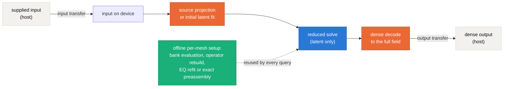
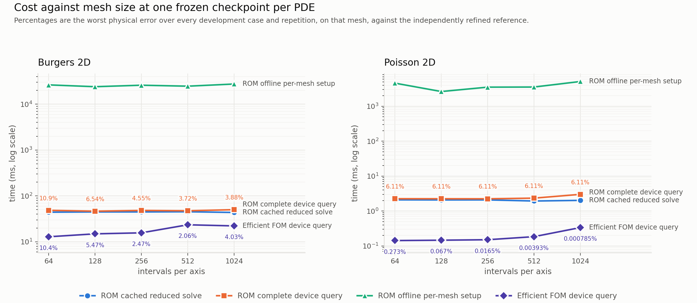

# Frozen-checkpoint mesh ladder: cached reduced cost, complete device query, and the full-order crossover

This report measures what changes, and what does not, when **one frozen checkpoint per PDE** is transferred across the mesh ladder 64, 128, 256, 512, 1024 intervals per axis, with latent dimension, bank rank, weak-mode count, quadrature budget, solver policy and stopping rule all held fixed. Each PDE ran as a single job on a single GPU, so the cost columns within a panel are directly comparable. **These numbers are development-cohort results and are provisional for publication**: the final cases remain sealed, one training seed and one checkpoint back each panel, and the reference margins are empirical refinement evidence rather than continuum error bounds.

## What was held fixed

- **Burgers 2D** — one checkpoint, one latent dimension, one bank rank, one weak-mode count, one quadrature budget, one solver policy and one stopping rule across every mesh; new-grid truth evaluates only
- **Poisson 2D** — one checkpoint, one latent dimension, one bank rank, one retained weak-mode count, one correction count, one solver budget and one stopping rule across every mesh; new-grid truth evaluates only

New-grid truth is used for evaluation only. Nothing here retrains, reselects or tunes; where the frozen checkpoint's accuracy degrades with the mesh, the degradation is reported as it stands.

## What was measured, and how the three costs are kept apart



The blue stage alone is the **cached reduced solve**. The blue and orange stages together, with the input already resident and the output left resident, are the **complete device query**. The green box is the **offline per-mesh setup**, charged separately and never amortised into a query number. Host transfers are timed inside the same invocation as the complete device query and reported as their own columns.

Each cost is its own completed device computation, obtained by blocking on the result — never by subtracting one measurement from another. Every timed call is preceded by a GPU burn-in, the arms are interleaved in a randomized order drawn from a recorded seed inside one job, and every repetition is retained in the JSON beside this report.

## The common observation grid and its restriction

Cross-mesh comparison uses a common observation grid of 64 intervals per axis and the restriction operator $R_h$ = **nested-node injection (stride selection)**: for a source grid of $N$ intervals and a target of $n$ intervals with $N = sn$,

$$(R_h u)_{i,j} \;=\; u_{si,\,sj}, \qquad 0 \le i,j \le n,$$

so no averaging or interpolation enters the comparison and the coarse grid's nodes are exactly a subset of the fine grid's nodes. This is well defined only on nested grids, and the driver refuses a non-nested pair rather than silently flooring the stride.

It is validated in-job on a concrete reference field: restricting in one step and restricting through every intermediate rung of the ladder give **bitwise identical** results (`chained_equals_direct = True`, both digests `92ff1d818e3d881e...`); the target nodes are verified to be source nodes (`True`); and all four boundary rows and columns survive restriction exactly (`True`). Errors are also reported on each requested grid, because a common-grid norm alone omits the finer nodes.

## Reference and its resolution margin

**Burgers 2D.** The reference is an independently refined full-order solve with spatial and temporal refinement controls. Per observation grid, the worst refinement margin and whether it resolves the 5% target within a tenth of it:

| Observation intervals | Worst margin | Margin budget | Refinement decreases | Resolved |
| --- | --- | --- | --- | --- |
| 64 | 3.608e-03 | 5.000e-03 | True | True |
| 128 | 3.608e-03 | 5.000e-03 | True | True |
| 256 | 3.608e-03 | 5.000e-03 | True | True |
| 512 | 3.608e-03 | 5.000e-03 | True | True |
| 1024 | 3.608e-03 | 5.000e-03 | True | True |

> space and time refinement differences are empirical development evidence, not a rigorous continuum error bound.

**Poisson 2D.** two independently refined discrete levels computed on the host with SciPy DST-I, separate from the JAX solve path; the level difference is empirical development evidence, not a continuum error bound. The level difference $\delta$ between the two refined levels is charged beside every error as the conservative form $(e + \delta)/(1 - \delta)$.

## Burgers 2D: cost against mesh

| Intervals | Interior unknowns | ROM cached (ms) | ROM complete query (ms) | ROM host-to-host (ms) | ROM offline setup (s) | Efficient FOM | FOM device (ms) | ROM worst err (%) | FOM worst err (%) | ROM vs same-grid FOM (%) |
| --- | --- | --- | --- | --- | --- | --- | --- | --- | --- | --- |
| 64 | 3969 | 44.156 | 48.504 | 50.387 | 26.307 | `fom_same_nt1e-2` (no arm meets the target) | 12.856 | 10.8570 | 10.3920 | 5.5018 |
| 128 | 16129 | 44.720 | 46.467 | 48.118 | 24.010 | `fom_same_nt1e-2` (no arm meets the target) | 14.893 | 6.5431 | 5.4655 | 2.8939 |
| 256 | 65025 | 44.730 | 48.191 | 50.633 | 25.878 | `fom_same_nt1e-2` | 15.662 | 4.5546 | 2.4737 | 2.5629 |
| 512 | 261121 | 45.116 | 47.405 | 53.657 | 24.645 | `fom_same_nt1e-2` | 23.469 | 3.7168 | 2.0638 | 3.2836 |
| 1024 | 1046529 | 43.577 | 50.093 | 76.825 | 27.478 | `fom_coarse4_nt1e-4` | 22.170 | 3.8847 | 4.0342 | 3.8562 |

`ROM offline setup` is charged once per mesh and is not amortised into any query column. `Efficient FOM` is the cheapest full-order arm whose worst error meets the 5% target on that mesh; where no arm meets it, the cheapest arm is shown and labelled. Errors are the worst over every development case and repetition on the requested grid.

### Burgers 2D: every arm

| Intervals | Subject | Device (ms) | Host-to-host (ms) | Worst err, requested grid (%) | Worst err, common grid (%) | Median iterations | Outliers | Stopping |
| --- | --- | --- | --- | --- | --- | --- | --- | --- |
| 64 | `fom_coarse4_nt1e-4` | 13.011 | 14.723 | 26.2796 | 26.2796 | 62 | 0/30 | tolerance_met=30 |
| 64 | `fom_same_nt1e-2` | 12.856 | 14.596 | 10.3920 | 10.3920 | 50 | 0/30 | tolerance_met=30 |
| 64 | `fom_same_nt1e-4` | 18.123 | 20.126 | 10.9803 | 10.9803 | 67 | 0/30 | tolerance_met=30 |
| 64 | `fom_same_nt1e-6` | 65.268 | 66.723 | 10.9891 | 10.9891 | 100 | 0/30 | tolerance_met=30 |
| 64 | `rom_frozen_stationary` | 48.504 | 50.387 | 10.8570 | 10.8570 | 192 | 0/30 | stationary=30 |
| 128 | `fom_coarse4_nt1e-4` | 17.208 | 19.158 | 17.6168 | 17.5736 | 66 | 0/30 | tolerance_met=30 |
| 128 | `fom_coarse_obs_nt1e-4` | 17.572 | 19.590 | 11.0379 | 10.9803 | 67 | 0/30 | tolerance_met=30 |
| 128 | `fom_same_nt1e-2` | 14.893 | 16.753 | 5.4655 | 5.4655 | 50 | 3/30 | tolerance_met=30 |
| 128 | `fom_same_nt1e-4` | 20.940 | 22.603 | 6.6337 | 6.6337 | 66 | 0/30 | tolerance_met=30 |
| 128 | `fom_same_nt1e-6` | 81.179 | 82.947 | 6.6399 | 6.6399 | 100 | 0/30 | tolerance_met=30 |
| 128 | `rom_frozen_stationary` | 46.467 | 48.118 | 6.5431 | 6.5429 | 204 | 0/30 | stationary=30 |
| 256 | `fom_coarse4_nt1e-4` | 17.515 | 20.491 | 11.0521 | 10.9803 | 67 | 0/30 | tolerance_met=30 |
| 256 | `fom_same_nt1e-2` | 15.662 | 18.395 | 2.4737 | 2.4737 | 50 | 1/30 | tolerance_met=30 |
| 256 | `fom_same_nt1e-4` | 21.870 | 24.696 | 4.0285 | 4.0285 | 66 | 0/30 | tolerance_met=30 |
| 256 | `fom_same_nt1e-6` | 92.377 | 95.036 | 4.0265 | 4.0265 | 100 | 0/30 | tolerance_met=30 |
| 256 | `rom_frozen_stationary` | 48.191 | 50.633 | 4.5546 | 4.5534 | 205 | 0/30 | stationary=30 |
| 512 | `fom_coarse4_nt1e-4` | 20.818 | 27.064 | 6.6548 | 6.6337 | 66 | 0/30 | tolerance_met=30 |
| 512 | `fom_coarse_obs_nt1e-4` | 17.761 | 23.922 | 11.0556 | 10.9803 | 67 | 0/30 | tolerance_met=30 |
| 512 | `fom_same_nt1e-2` | 23.469 | 29.476 | 2.0638 | 2.0638 | 50 | 1/30 | tolerance_met=30 |
| 512 | `fom_same_nt1e-4` | 33.922 | 40.107 | 2.7007 | 2.7007 | 66 | 0/30 | tolerance_met=30 |
| 512 | `fom_same_nt1e-6` | 157.725 | 163.541 | 2.7025 | 2.7025 | 100 | 0/30 | tolerance_met=30 |
| 512 | `rom_frozen_stationary` | 47.405 | 53.657 | 3.7168 | 3.7151 | 202 | 0/30 | stationary=30 |
| 1024 | `fom_coarse4_nt1e-4` | 22.170 | 49.188 | 4.0342 | 4.0285 | 66 | 0/30 | tolerance_met=30 |
| 1024 | `fom_coarse_obs_nt1e-4` | 17.522 | 44.563 | 11.0565 | 10.9803 | 67 | 0/30 | tolerance_met=30 |
| 1024 | `fom_same_nt1e-2` | 63.243 | 90.495 | 2.3899 | 2.3899 | 50 | 4/30 | tolerance_met=30 |
| 1024 | `fom_same_nt1e-4` | 96.052 | 122.781 | 2.1416 | 2.1416 | 66 | 0/30 | tolerance_met=30 |
| 1024 | `fom_same_nt1e-6` | 500.281 | 527.224 | 2.1416 | 2.1416 | 100 | 0/30 | tolerance_met=30 |
| 1024 | `rom_frozen_stationary` | 50.093 | 76.825 | 3.8847 | 3.8888 | 194 | 0/30 | stationary=30 |

The staged solver used for the timing split reproduces the retained selected solver to a worst relative difference of 0.0e+00 across the ladder, so the split does not change the numerics it measures.

### Burgers 2D: reduced-solver iteration counts and stopping status, per case per mesh

| Intervals | Case | Median total iterations | Stationary / graded | Worst normalized gradient | Exit reasons (count) |
| --- | --- | --- | --- | --- | --- |
| 64 | 0 | 177 | 5/5 | 9.012e-07 | 4: 250 |
| 64 | 1 | 204 | 5/5 | 8.876e-07 | 4: 250 |
| 64 | 2 | 236 | 5/5 | 9.557e-07 | 4: 250 |
| 64 | 3 | 198 | 5/5 | 9.911e-07 | 4: 250 |
| 64 | 4 | 145 | 5/5 | 9.474e-07 | 4: 250 |
| 64 | 5 | 185 | 5/5 | 9.419e-07 | 4: 250 |
| 128 | 0 | 203 | 5/5 | 9.399e-07 | 4: 250 |
| 128 | 1 | 222 | 5/5 | 8.921e-07 | 4: 250 |
| 128 | 2 | 204 | 5/5 | 9.553e-07 | 4: 250 |
| 128 | 3 | 206 | 5/5 | 9.615e-07 | 4: 250 |
| 128 | 4 | 145 | 5/5 | 9.265e-07 | 4: 250 |
| 128 | 5 | 160 | 5/5 | 9.667e-07 | 4: 250 |
| 256 | 0 | 209 | 5/5 | 8.807e-07 | 4: 250 |
| 256 | 1 | 229 | 5/5 | 9.451e-07 | 4: 250 |
| 256 | 2 | 201 | 5/5 | 9.711e-07 | 4: 250 |
| 256 | 3 | 221 | 5/5 | 9.921e-07 | 4: 250 |
| 256 | 4 | 140 | 5/5 | 9.874e-07 | 4: 250 |
| 256 | 5 | 175 | 5/5 | 8.953e-07 | 4: 250 |
| 512 | 0 | 209 | 5/5 | 8.621e-07 | 4: 250 |
| 512 | 1 | 237 | 5/5 | 8.991e-07 | 4: 250 |
| 512 | 2 | 197 | 5/5 | 6.092e-07 | 4: 250 |
| 512 | 3 | 207 | 5/5 | 9.858e-07 | 4: 250 |
| 512 | 4 | 141 | 5/5 | 9.942e-07 | 4: 250 |
| 512 | 5 | 180 | 5/5 | 9.881e-07 | 4: 250 |
| 1024 | 0 | 190 | 5/5 | 9.079e-07 | 4: 250 |
| 1024 | 1 | 236 | 5/5 | 9.972e-07 | 4: 250 |
| 1024 | 2 | 198 | 5/5 | 9.951e-07 | 4: 250 |
| 1024 | 3 | 211 | 5/5 | 9.459e-07 | 4: 250 |
| 1024 | 4 | 132 | 5/5 | 9.531e-07 | 4: 250 |
| 1024 | 5 | 182 | 5/5 | 9.307e-07 | 4: 250 |

## Poisson 2D: cost against mesh

| Intervals | Interior unknowns | ROM cached (ms) | ROM complete query (ms) | ROM host-to-host (ms) | ROM offline setup (s) | Efficient FOM | FOM device (ms) | ROM worst err (%) | FOM worst err (%) | ROM vs same-grid FOM (%) |
| --- | --- | --- | --- | --- | --- | --- | --- | --- | --- | --- |
| 64 | 3969 | 2.094 | 2.252 | 3.201 | 4.592 | `dst` | 0.143 | 6.1119 | 0.2732 | 6.1282 |
| 128 | 16129 | 2.080 | 2.246 | 3.239 | 2.640 | `dst` | 0.146 | 6.1107 | 0.0670 | 6.1149 |
| 256 | 65025 | 2.086 | 2.241 | 3.300 | 3.527 | `dst` | 0.151 | 6.1106 | 0.0165 | 6.1116 |
| 512 | 261121 | 1.937 | 2.341 | 3.790 | 3.552 | `dst` | 0.185 | 6.1106 | 0.0039 | 6.1108 |
| 1024 | 1046529 | 2.021 | 3.004 | 6.572 | 5.120 | `dst` | 0.336 | 6.1106 | 0.0008 | 6.1106 |

`ROM offline setup` is charged once per mesh and is not amortised into any query column. `Efficient FOM` is the cheapest full-order arm whose worst error meets the 5% target on that mesh; where no arm meets it, the cheapest arm is shown and labelled. Errors are the worst over every development case and repetition on the requested grid.

### Poisson 2D: every arm

| Intervals | Subject | Device (ms) | Host-to-host (ms) | Worst err, requested grid (%) | Worst err, common grid (%) | Median iterations | Outliers | Stopping |
| --- | --- | --- | --- | --- | --- | --- | --- | --- |
| 64 | `cg_1e-01` | 2.891 | 3.666 | 9.6271 | 9.6271 | 60 | 1/126 | converged=126 |
| 64 | `cg_1e-06` | 5.783 | 6.590 | 0.2732 | 0.2732 | 161 | 1/126 | converged=126 |
| 64 | `cg_3e-02` | 3.311 | 4.121 | 1.3768 | 1.3768 | 75 | 0/126 | converged=126 |
| 64 | `dst` | 0.143 | 1.650 | 0.2732 | 0.2732 | — | 14/126 | — |
| 64 | `r128_q32` | 2.252 | 3.201 | 6.1119 | 6.1119 | 5 | 1/126 | exit_reason_6=126 |
| 128 | `cg_1e-01` | 4.839 | 5.619 | 5.0459 | 5.0450 | 126 | 1/126 | converged=126 |
| 128 | `cg_1e-06` | 10.758 | 11.694 | 0.0670 | 0.0670 | 324 | 0/126 | converged=126 |
| 128 | `cg_3e-02` | 5.582 | 6.400 | 1.0251 | 1.0248 | 154 | 4/126 | converged=126 |
| 128 | `dst` | 0.146 | 1.713 | 0.0670 | 0.0670 | — | 11/126 | — |
| 128 | `r128_q32` | 2.246 | 3.239 | 6.1107 | 6.1107 | 5 | 0/126 | exit_reason_6=126 |
| 256 | `cg_1e-01` | 9.515 | 10.684 | 3.0360 | 3.0358 | 270 | 3/126 | converged=126 |
| 256 | `cg_1e-06` | 21.893 | 22.897 | 0.0165 | 0.0165 | 658 | 0/126 | converged=126 |
| 256 | `cg_3e-02` | 11.308 | 12.251 | 0.7217 | 0.7217 | 319 | 1/126 | converged=126 |
| 256 | `dst` | 0.151 | 1.803 | 0.0165 | 0.0165 | — | 13/126 | — |
| 256 | `r128_q32` | 2.241 | 3.300 | 6.1106 | 6.1106 | 5 | 1/126 | exit_reason_6=126 |
| 512 | `cg_1e-01` | 22.756 | 24.321 | 1.7363 | 1.7363 | 569 | 6/126 | converged=126 |
| 512 | `cg_1e-06` | 51.436 | 52.945 | 0.0039 | 0.0039 | 1338 | 4/126 | converged=126 |
| 512 | `cg_3e-02` | 26.739 | 28.235 | 0.3828 | 0.3828 | 674 | 2/126 | converged=126 |
| 512 | `dst` | 0.185 | 2.235 | 0.0039 | 0.0039 | — | 11/126 | — |
| 512 | `r128_q32` | 2.341 | 3.790 | 6.1106 | 6.1106 | 5 | 1/126 | exit_reason_6=126 |
| 1024 | `cg_1e-01` | 85.759 | 89.449 | 1.1826 | 1.1827 | 1197 | 3/126 | converged=126 |
| 1024 | `cg_1e-06` | 192.405 | 196.206 | 0.0008 | 0.0008 | 2710 | 0/126 | converged=126 |
| 1024 | `cg_3e-02` | 99.932 | 103.866 | 0.2695 | 0.2695 | 1402 | 0/126 | converged=126 |
| 1024 | `dst` | 0.336 | 4.635 | 0.0008 | 0.0008 | — | 9/126 | — |
| 1024 | `r128_q32` | 3.004 | 6.572 | 6.1106 | 6.1106 | 5 | 0/126 | exit_reason_6=126 |

The staged solver used for the timing split reproduces the retained selected solver to a worst relative difference of 6.7e-16 across the ladder, so the split does not change the numerics it measures.

### Poisson 2D: reduced-solver iteration counts and stopping status, per case per mesh

| Intervals | Case | Median total iterations | Stationary / graded | Worst normalized gradient | Exit reasons (count) |
| --- | --- | --- | --- | --- | --- |
| 64 | 0 | 6 | 1/1 (native row) | 4.463e-08 | 6: 3 |
| 64 | 1 | 6 | 1/1 (native row) | 2.242e-08 | 6: 3 |
| 64 | 2 | 5 | 1/1 (native row) | 7.850e-08 | 6: 3 |
| 64 | 3 | 5 | 1/1 (native row) | 1.763e-07 | 6: 3 |
| 64 | 4 | 6 | 1/1 (native row) | 3.876e-08 | 6: 3 |
| 64 | 5 | 6 | 1/1 (native row) | 1.412e-07 | 6: 3 |
| 64 | 6 | 8 | 1/1 (native row) | 4.999e-08 | 6: 3 |
| 64 | 7 | 6 | 1/1 (native row) | 1.088e-07 | 6: 3 |
| 64 | 8 | 6 | 1/1 (native row) | 1.460e-07 | 6: 3 |
| 64 | 9 | 5 | 1/1 (native row) | 9.926e-08 | 6: 3 |
| 64 | 10 | 5 | 1/1 (native row) | 1.564e-07 | 6: 3 |
| 64 | 11 | 5 | 1/1 (native row) | 1.608e-07 | 6: 3 |
| 64 | 12 | 5 | 1/1 (native row) | 1.501e-07 | 6: 3 |
| 64 | 13 | 5 | 1/1 (native row) | 1.829e-07 | 6: 3 |
| 64 | 14 | 9 | 1/1 (native row) | 1.793e-07 | 6: 3 |
| 64 | 15 | 7 | 1/1 (native row) | 4.183e-08 | 6: 3 |
| 64 | 16 | 6 | 1/1 (native row) | 1.816e-07 | 6: 3 |
| 64 | 17 | 5 | 1/1 (native row) | 7.492e-08 | 6: 3 |
| 64 | 18 | 5 | 1/1 (native row) | 1.458e-08 | 6: 3 |
| 64 | 19 | 4 | 1/1 (native row) | 1.958e-08 | 6: 3 |
| 64 | 20 | 4 | 1/1 (native row) | 4.468e-08 | 6: 3 |
| 64 | 21 | 5 | 1/1 (native row) | 1.606e-08 | 6: 3 |
| 64 | 22 | 4 | 1/1 (native row) | 4.160e-08 | 6: 3 |
| 64 | 23 | 4 | 1/1 (native row) | 9.005e-08 | 6: 3 |
| 64 | 24 | 6 | 1/1 (native row) | 3.053e-08 | 6: 3 |
| 64 | 25 | 5 | 1/1 (native row) | 8.627e-08 | 6: 3 |
| 64 | 26 | 6 | 1/1 (native row) | 2.343e-07 | 6: 3 |
| 64 | 27 | 6 | 1/1 (native row) | 8.497e-08 | 6: 3 |
| 64 | 28 | 5 | 1/1 (native row) | 3.654e-08 | 6: 3 |
| 64 | 29 | 5 | 1/1 (native row) | 1.455e-07 | 6: 3 |
| 64 | 30 | 4 | 1/1 (native row) | 2.242e-07 | 6: 3 |
| 64 | 31 | 5 | 1/1 (native row) | 1.293e-07 | 6: 3 |
| 64 | 32 | 5 | 1/1 (native row) | 6.258e-08 | 6: 3 |
| 64 | 33 | 4 | 1/1 (native row) | 2.405e-07 | 6: 3 |
| 64 | 34 | 4 | 1/1 (native row) | 1.859e-07 | 6: 3 |
| 64 | 35 | 4 | 1/1 (native row) | 1.716e-07 | 6: 3 |
| 64 | 36 | 5 | 1/1 (native row) | 9.693e-08 | 6: 3 |
| 64 | 37 | 5 | 1/1 (native row) | 4.877e-08 | 6: 3 |
| 64 | 38 | 6 | 1/1 (native row) | 3.046e-07 | 6: 3 |
| 64 | 39 | 6 | 1/1 (native row) | 1.890e-07 | 6: 3 |
| 64 | 40 | 5 | 1/1 (native row) | 2.546e-07 | 6: 3 |
| 64 | 41 | 3 | 1/1 (native row) | 3.843e-08 | 6: 3 |
| 128 | 0 | 6 | 1/1 (native row) | 4.227e-08 | 6: 3 |
| 128 | 1 | 6 | 1/1 (native row) | 2.298e-08 | 6: 3 |
| 128 | 2 | 5 | 1/1 (native row) | 7.703e-08 | 6: 3 |
| 128 | 3 | 5 | 1/1 (native row) | 1.747e-07 | 6: 3 |
| 128 | 4 | 6 | 1/1 (native row) | 3.692e-08 | 6: 3 |
| 128 | 5 | 6 | 1/1 (native row) | 1.459e-07 | 6: 3 |
| 128 | 6 | 8 | 1/1 (native row) | 5.299e-08 | 6: 3 |
| 128 | 7 | 6 | 1/1 (native row) | 1.017e-07 | 6: 3 |
| 128 | 8 | 6 | 1/1 (native row) | 1.488e-07 | 6: 3 |
| 128 | 9 | 5 | 1/1 (native row) | 9.784e-08 | 6: 3 |
| 128 | 10 | 5 | 1/1 (native row) | 1.549e-07 | 6: 3 |
| 128 | 11 | 5 | 1/1 (native row) | 1.618e-07 | 6: 3 |
| 128 | 12 | 5 | 1/1 (native row) | 1.481e-07 | 6: 3 |
| 128 | 13 | 5 | 1/1 (native row) | 1.829e-07 | 6: 3 |
| 128 | 14 | 9 | 1/1 (native row) | 1.840e-07 | 6: 3 |
| 128 | 15 | 7 | 1/1 (native row) | 4.020e-08 | 6: 3 |
| 128 | 16 | 6 | 1/1 (native row) | 1.822e-07 | 6: 3 |
| 128 | 17 | 5 | 1/1 (native row) | 7.301e-08 | 6: 3 |
| 128 | 18 | 4 | 1/1 (native row) | 2.307e-07 | 6: 3 |
| 128 | 19 | 4 | 1/1 (native row) | 1.811e-08 | 6: 3 |
| 128 | 20 | 4 | 1/1 (native row) | 4.430e-08 | 6: 3 |
| 128 | 21 | 5 | 1/1 (native row) | 1.534e-08 | 6: 3 |
| 128 | 22 | 4 | 1/1 (native row) | 4.352e-08 | 6: 3 |
| 128 | 23 | 4 | 1/1 (native row) | 9.124e-08 | 6: 3 |
| 128 | 24 | 6 | 1/1 (native row) | 3.322e-08 | 6: 3 |
| 128 | 25 | 5 | 1/1 (native row) | 8.506e-08 | 6: 3 |
| 128 | 26 | 6 | 1/1 (native row) | 2.441e-07 | 6: 3 |
| 128 | 27 | 6 | 1/1 (native row) | 8.399e-08 | 6: 3 |
| 128 | 28 | 5 | 1/1 (native row) | 3.569e-08 | 6: 3 |
| 128 | 29 | 5 | 1/1 (native row) | 1.477e-07 | 6: 3 |
| 128 | 30 | 4 | 1/1 (native row) | 2.324e-07 | 6: 3 |
| 128 | 31 | 5 | 1/1 (native row) | 1.221e-07 | 6: 3 |
| 128 | 32 | 5 | 1/1 (native row) | 8.291e-08 | 6: 3 |
| 128 | 33 | 4 | 1/1 (native row) | 2.441e-07 | 6: 3 |
| 128 | 34 | 4 | 1/1 (native row) | 1.806e-07 | 6: 3 |
| 128 | 35 | 4 | 1/1 (native row) | 1.780e-07 | 6: 3 |
| 128 | 36 | 5 | 1/1 (native row) | 9.486e-08 | 6: 3 |
| 128 | 37 | 5 | 1/1 (native row) | 4.654e-08 | 6: 3 |
| 128 | 38 | 6 | 1/1 (native row) | 2.934e-07 | 6: 3 |
| 128 | 39 | 6 | 1/1 (native row) | 1.875e-07 | 6: 3 |
| 128 | 40 | 5 | 1/1 (native row) | 2.676e-07 | 6: 3 |
| 128 | 41 | 3 | 1/1 (native row) | 3.814e-08 | 6: 3 |
| 256 | 0 | 6 | 1/1 (native row) | 4.170e-08 | 6: 3 |
| 256 | 1 | 6 | 1/1 (native row) | 2.313e-08 | 6: 3 |
| 256 | 2 | 5 | 1/1 (native row) | 7.668e-08 | 6: 3 |
| 256 | 3 | 5 | 1/1 (native row) | 1.743e-07 | 6: 3 |
| 256 | 4 | 6 | 1/1 (native row) | 3.647e-08 | 6: 3 |
| 256 | 5 | 6 | 1/1 (native row) | 1.471e-07 | 6: 3 |
| 256 | 6 | 8 | 1/1 (native row) | 5.375e-08 | 6: 3 |
| 256 | 7 | 6 | 1/1 (native row) | 9.998e-08 | 6: 3 |
| 256 | 8 | 6 | 1/1 (native row) | 1.495e-07 | 6: 3 |
| 256 | 9 | 5 | 1/1 (native row) | 9.749e-08 | 6: 3 |
| 256 | 10 | 5 | 1/1 (native row) | 1.546e-07 | 6: 3 |
| 256 | 11 | 5 | 1/1 (native row) | 1.620e-07 | 6: 3 |
| 256 | 12 | 5 | 1/1 (native row) | 1.476e-07 | 6: 3 |
| 256 | 13 | 5 | 1/1 (native row) | 1.831e-07 | 6: 3 |
| 256 | 14 | 9 | 1/1 (native row) | 1.851e-07 | 6: 3 |
| 256 | 15 | 7 | 1/1 (native row) | 3.981e-08 | 6: 3 |
| 256 | 16 | 6 | 1/1 (native row) | 1.824e-07 | 6: 3 |
| 256 | 17 | 5 | 1/1 (native row) | 7.257e-08 | 6: 3 |
| 256 | 18 | 4 | 1/1 (native row) | 2.251e-07 | 6: 3 |
| 256 | 19 | 4 | 1/1 (native row) | 1.777e-08 | 6: 3 |
| 256 | 20 | 4 | 1/1 (native row) | 4.421e-08 | 6: 3 |
| 256 | 21 | 5 | 1/1 (native row) | 1.515e-08 | 6: 3 |
| 256 | 22 | 4 | 1/1 (native row) | 4.396e-08 | 6: 3 |
| 256 | 23 | 4 | 1/1 (native row) | 9.155e-08 | 6: 3 |
| 256 | 24 | 6 | 1/1 (native row) | 3.391e-08 | 6: 3 |
| 256 | 25 | 5 | 1/1 (native row) | 8.474e-08 | 6: 3 |
| 256 | 26 | 6 | 1/1 (native row) | 2.465e-07 | 6: 3 |
| 256 | 27 | 6 | 1/1 (native row) | 8.375e-08 | 6: 3 |
| 256 | 28 | 5 | 1/1 (native row) | 3.548e-08 | 6: 3 |
| 256 | 29 | 5 | 1/1 (native row) | 1.483e-07 | 6: 3 |
| 256 | 30 | 4 | 1/1 (native row) | 2.347e-07 | 6: 3 |
| 256 | 31 | 5 | 1/1 (native row) | 1.204e-07 | 6: 3 |
| 256 | 32 | 5 | 1/1 (native row) | 8.786e-08 | 6: 3 |
| 256 | 33 | 4 | 1/1 (native row) | 2.451e-07 | 6: 3 |
| 256 | 34 | 4 | 1/1 (native row) | 1.795e-07 | 6: 3 |
| 256 | 35 | 4 | 1/1 (native row) | 1.798e-07 | 6: 3 |
| 256 | 36 | 5 | 1/1 (native row) | 9.434e-08 | 6: 3 |
| 256 | 37 | 5 | 1/1 (native row) | 4.600e-08 | 6: 3 |
| 256 | 38 | 6 | 1/1 (native row) | 2.907e-07 | 6: 3 |
| 256 | 39 | 6 | 1/1 (native row) | 1.871e-07 | 6: 3 |
| 256 | 40 | 5 | 1/1 (native row) | 2.709e-07 | 6: 3 |
| 256 | 41 | 3 | 1/1 (native row) | 3.878e-08 | 6: 3 |
| 512 | 0 | 6 | 1/1 (native row) | 4.156e-08 | 6: 3 |
| 512 | 1 | 6 | 1/1 (native row) | 2.316e-08 | 6: 3 |
| 512 | 2 | 5 | 1/1 (native row) | 7.659e-08 | 6: 3 |
| 512 | 3 | 5 | 1/1 (native row) | 1.742e-07 | 6: 3 |
| 512 | 4 | 6 | 1/1 (native row) | 3.635e-08 | 6: 3 |
| 512 | 5 | 6 | 1/1 (native row) | 1.474e-07 | 6: 3 |
| 512 | 6 | 8 | 1/1 (native row) | 5.394e-08 | 6: 3 |
| 512 | 7 | 6 | 1/1 (native row) | 9.955e-08 | 6: 3 |
| 512 | 8 | 6 | 1/1 (native row) | 1.497e-07 | 6: 3 |
| 512 | 9 | 5 | 1/1 (native row) | 9.740e-08 | 6: 3 |
| 512 | 10 | 5 | 1/1 (native row) | 1.545e-07 | 6: 3 |
| 512 | 11 | 5 | 1/1 (native row) | 1.621e-07 | 6: 3 |
| 512 | 12 | 5 | 1/1 (native row) | 1.475e-07 | 6: 3 |
| 512 | 13 | 5 | 1/1 (native row) | 1.831e-07 | 6: 3 |
| 512 | 14 | 9 | 1/1 (native row) | 1.854e-07 | 6: 3 |
| 512 | 15 | 7 | 1/1 (native row) | 3.971e-08 | 6: 3 |
| 512 | 16 | 6 | 1/1 (native row) | 1.824e-07 | 6: 3 |
| 512 | 17 | 5 | 1/1 (native row) | 7.246e-08 | 6: 3 |
| 512 | 18 | 4 | 1/1 (native row) | 2.238e-07 | 6: 3 |
| 512 | 19 | 4 | 1/1 (native row) | 1.769e-08 | 6: 3 |
| 512 | 20 | 4 | 1/1 (native row) | 4.419e-08 | 6: 3 |
| 512 | 21 | 5 | 1/1 (native row) | 1.511e-08 | 6: 3 |
| 512 | 22 | 4 | 1/1 (native row) | 4.407e-08 | 6: 3 |
| 512 | 23 | 4 | 1/1 (native row) | 9.163e-08 | 6: 3 |
| 512 | 24 | 6 | 1/1 (native row) | 3.409e-08 | 6: 3 |
| 512 | 25 | 5 | 1/1 (native row) | 8.466e-08 | 6: 3 |
| 512 | 26 | 6 | 1/1 (native row) | 2.471e-07 | 6: 3 |
| 512 | 27 | 6 | 1/1 (native row) | 8.369e-08 | 6: 3 |
| 512 | 28 | 5 | 1/1 (native row) | 3.543e-08 | 6: 3 |
| 512 | 29 | 5 | 1/1 (native row) | 1.484e-07 | 6: 3 |
| 512 | 30 | 4 | 1/1 (native row) | 2.353e-07 | 6: 3 |
| 512 | 31 | 5 | 1/1 (native row) | 1.200e-07 | 6: 3 |
| 512 | 32 | 5 | 1/1 (native row) | 8.909e-08 | 6: 3 |
| 512 | 33 | 4 | 1/1 (native row) | 2.454e-07 | 6: 3 |
| 512 | 34 | 4 | 1/1 (native row) | 1.792e-07 | 6: 3 |
| 512 | 35 | 4 | 1/1 (native row) | 1.803e-07 | 6: 3 |
| 512 | 36 | 5 | 1/1 (native row) | 9.421e-08 | 6: 3 |
| 512 | 37 | 5 | 1/1 (native row) | 4.586e-08 | 6: 3 |
| 512 | 38 | 6 | 1/1 (native row) | 2.900e-07 | 6: 3 |
| 512 | 39 | 6 | 1/1 (native row) | 1.870e-07 | 6: 3 |
| 512 | 40 | 5 | 1/1 (native row) | 2.718e-07 | 6: 3 |
| 512 | 41 | 3 | 1/1 (native row) | 3.898e-08 | 6: 3 |
| 1024 | 0 | 6 | 1/1 (native row) | 4.152e-08 | 6: 3 |
| 1024 | 1 | 6 | 1/1 (native row) | 2.317e-08 | 6: 3 |
| 1024 | 2 | 5 | 1/1 (native row) | 7.657e-08 | 6: 3 |
| 1024 | 3 | 5 | 1/1 (native row) | 1.742e-07 | 6: 3 |
| 1024 | 4 | 6 | 1/1 (native row) | 3.632e-08 | 6: 3 |
| 1024 | 5 | 6 | 1/1 (native row) | 1.474e-07 | 6: 3 |
| 1024 | 6 | 8 | 1/1 (native row) | 5.399e-08 | 6: 3 |
| 1024 | 7 | 6 | 1/1 (native row) | 9.944e-08 | 6: 3 |
| 1024 | 8 | 6 | 1/1 (native row) | 1.498e-07 | 6: 3 |
| 1024 | 9 | 5 | 1/1 (native row) | 9.738e-08 | 6: 3 |
| 1024 | 10 | 5 | 1/1 (native row) | 1.545e-07 | 6: 3 |
| 1024 | 11 | 5 | 1/1 (native row) | 1.621e-07 | 6: 3 |
| 1024 | 12 | 5 | 1/1 (native row) | 1.475e-07 | 6: 3 |
| 1024 | 13 | 5 | 1/1 (native row) | 1.831e-07 | 6: 3 |
| 1024 | 14 | 9 | 1/1 (native row) | 1.855e-07 | 6: 3 |
| 1024 | 15 | 7 | 1/1 (native row) | 3.969e-08 | 6: 3 |
| 1024 | 16 | 6 | 1/1 (native row) | 1.824e-07 | 6: 3 |
| 1024 | 17 | 5 | 1/1 (native row) | 7.243e-08 | 6: 3 |
| 1024 | 18 | 4 | 1/1 (native row) | 2.234e-07 | 6: 3 |
| 1024 | 19 | 4 | 1/1 (native row) | 1.767e-08 | 6: 3 |
| 1024 | 20 | 4 | 1/1 (native row) | 4.418e-08 | 6: 3 |
| 1024 | 21 | 5 | 1/1 (native row) | 1.509e-08 | 6: 3 |
| 1024 | 22 | 4 | 1/1 (native row) | 4.410e-08 | 6: 3 |
| 1024 | 23 | 4 | 1/1 (native row) | 9.164e-08 | 6: 3 |
| 1024 | 24 | 6 | 1/1 (native row) | 3.413e-08 | 6: 3 |
| 1024 | 25 | 5 | 1/1 (native row) | 8.464e-08 | 6: 3 |
| 1024 | 26 | 6 | 1/1 (native row) | 2.472e-07 | 6: 3 |
| 1024 | 27 | 6 | 1/1 (native row) | 8.368e-08 | 6: 3 |
| 1024 | 28 | 5 | 1/1 (native row) | 3.542e-08 | 6: 3 |
| 1024 | 29 | 5 | 1/1 (native row) | 1.484e-07 | 6: 3 |
| 1024 | 30 | 4 | 1/1 (native row) | 2.355e-07 | 6: 3 |
| 1024 | 31 | 5 | 1/1 (native row) | 1.199e-07 | 6: 3 |
| 1024 | 32 | 5 | 1/1 (native row) | 8.939e-08 | 6: 3 |
| 1024 | 33 | 4 | 1/1 (native row) | 2.454e-07 | 6: 3 |
| 1024 | 34 | 4 | 1/1 (native row) | 1.792e-07 | 6: 3 |
| 1024 | 35 | 4 | 1/1 (native row) | 1.804e-07 | 6: 3 |
| 1024 | 36 | 5 | 1/1 (native row) | 9.418e-08 | 6: 3 |
| 1024 | 37 | 5 | 1/1 (native row) | 4.583e-08 | 6: 3 |
| 1024 | 38 | 6 | 1/1 (native row) | 2.898e-07 | 6: 3 |
| 1024 | 39 | 6 | 1/1 (native row) | 1.870e-07 | 6: 3 |
| 1024 | 40 | 5 | 1/1 (native row) | 2.720e-07 | 6: 3 |
| 1024 | 41 | 3 | 1/1 (native row) | 3.903e-08 | 6: 3 |

## The figure



Both panels are log-log, in milliseconds, on one axis. The percentage beside each reduced complete-query point and each full-order point is the worst physical error on that mesh. The PDF is `2026-09-14-frozen-checkpoint-mesh-ladder.pdf`.

## Is the cached reduced cost flat?

- The cached reduced solve on Burgers 2D runs 44.156 -> 44.720 -> 44.730 -> 45.116 -> 43.577 ms across 64 to 1024 intervals, a factor of 0.987 from the coarsest rung to the finest and 1.035 between its own extremes, while the number of interior unknowns grows by 264$\times$.
- The cached reduced solve on Poisson 2D runs 2.094 -> 2.080 -> 2.086 -> 1.937 -> 2.021 ms across 64 to 1024 intervals, a factor of 0.965 from the coarsest rung to the finest and 1.081 between its own extremes, while the number of interior unknowns grows by 264$\times$.

- The complete device query on Burgers 2D runs 48.504 -> 46.467 -> 48.191 -> 47.405 -> 50.093 ms across 64 to 1024 intervals, a factor of 1.033 from the coarsest rung to the finest and 1.078 between its own extremes, while the number of interior unknowns grows by 264$\times$.
- The complete device query on Poisson 2D runs 2.252 -> 2.246 -> 2.241 -> 2.341 -> 3.004 ms across 64 to 1024 intervals, a factor of 1.334 from the coarsest rung to the finest and 1.341 between its own extremes, while the number of interior unknowns grows by 264$\times$.

A fixed-size reduced residual and Jacobian have no explicit full-grid loop, so the reduced solve carries no mesh dimension once its operators are assembled; the measurement is a check that no hidden mesh dependence survives, not a surprise. The complete device query is the quantity that can still grow, because reading an arbitrary dense input and reconstructing an arbitrary dense output must touch their values even when both stay on the device.

## Where is the crossover?

- On Burgers 2D there is **no crossover**: the efficient full-order solver is faster than the reduced complete device query at every rung of the ladder, by between 2.02$\times$ and 3.77$\times$.
- On Poisson 2D there is **no crossover**: the efficient full-order solver is faster than the reduced complete device query at every rung of the ladder, by between 8.93$\times$ and 15.78$\times$.

### Burgers 2D: reduced against efficient full-order, per rung

| Intervals | ROM device (ms) | Efficient FOM | FOM device (ms) | FOM/ROM | ROM meets target | FOM meets target |
| --- | --- | --- | --- | --- | --- | --- |
| 64 | 48.504 | `fom_same_nt1e-2` | 12.856 | 0.265 | False | False |
| 128 | 46.467 | `fom_same_nt1e-2` | 14.893 | 0.320 | False | False |
| 256 | 48.191 | `fom_same_nt1e-2` | 15.662 | 0.325 | True | True |
| 512 | 47.405 | `fom_same_nt1e-2` | 23.469 | 0.495 | True | True |
| 1024 | 50.093 | `fom_coarse4_nt1e-4` | 22.170 | 0.443 | True | True |

### Poisson 2D: reduced against efficient full-order, per rung

| Intervals | ROM device (ms) | Efficient FOM | FOM device (ms) | FOM/ROM | ROM meets target | FOM meets target |
| --- | --- | --- | --- | --- | --- | --- |
| 64 | 2.252 | `dst` | 0.143 | 0.063 | False | True |
| 128 | 2.246 | `dst` | 0.146 | 0.065 | False | True |
| 256 | 2.241 | `dst` | 0.151 | 0.067 | False | True |
| 512 | 2.341 | `dst` | 0.185 | 0.079 | False | True |
| 1024 | 3.004 | `dst` | 0.336 | 0.112 | False | True |

A ratio above one means the reduced model is faster. A ratio is only a *speedup* where both the `ROM meets target` and `FOM meets target` columns are true; elsewhere it is a timing diagnostic, because an unattained accuracy target has no qualifying speedup.

## What this does not establish

- **Not a claim about asymptotics.** Flat cached cost over a finite measured range does not prove asymptotically constant full-query cost, and the constant-cost claim is with respect to mesh size only — never to reduced dimension or to a tighter accuracy requirement.
- **Offline setup stays mesh-dependent.** The bank must be evaluated on the new grid and the operators rebuilt; those costs are in the table and are not amortised away here.
- **Development cohorts, one checkpoint, one training seed per PDE.** Final cases remain sealed and no retraining at any resolution was attempted, by design: this is frozen-weight transfer, so per-resolution tuning would answer a different question.
- **Reference margins are empirical.** Space and time refinement differences are development evidence, not rigorous continuum error bounds.
- **The comparison is against the named full-order arms only.** A result against these arms does not transfer to every full-order implementation, coefficient field or geometry — in particular the direct sine-transform solver exists only because this operator is constant coefficient on a rectangle.
- **No cross-job timing.** Every ratio here is within one job on one GPU; times from the two panels are never divided by each other.

## Provenance

| Panel | Attempt | Job | GPU | Node | Backend | Precision | f64 | Cases | Reps | Checkpoint SHA-256 | Job seconds |
| --- | --- | --- | --- | --- | --- | --- | --- | --- | --- | --- | --- |
| Burgers 2D | `burgers01` | 3711388 | NVIDIA A100-PCIE-40GB | pax051 | gpu | highest | True | 6 | 5 | `18f0266ae6f04542...` | 1862.5 |
| Poisson 2D | `poisson01` | 3711389 | NVIDIA A100 80GB PCIe | pax105 | gpu | highest | True | 42 | 3 | `a128e7635c318faa...` | 728.4 |

Regenerate everything in this report, including the figure, with:

```bash
/home/tahmid/Dev/.venv/bin/python experiments/mesh-ladder/reports/generate_ladder.py
```

The machine-readable aggregates, including every retained timing repetition, are in `2026-09-14-frozen-checkpoint-mesh-ladder.json` beside this file.

## Plain-language glossary

- **PDE / full-order model (FOM) / reduced model (ROM):** the equation being solved / solving it on the full grid / solving a compressed version with far fewer unknowns.
- **Intervals per axis:** how many cells the unit square is cut into along one direction. A grid of $N$ intervals has $(N+1)^2$ nodes and $(N-1)^2$ interior unknowns, since the boundary values are fixed at zero.
- **Mesh ladder / rung:** the list of grids the same frozen model is run on / one entry in it.
- **Frozen-weight transfer:** the neural weights are trained once, on one grid, and then used unchanged on every other grid. The opposite — retraining per grid — is a different experiment and is not done here.
- **Checkpoint:** the saved file holding those trained weights. Its SHA-256 is a fingerprint checked before and after the run so nothing can have changed underneath.
- **Latent / latent dimension $k$:** the handful of numbers the reduced model actually solves for. **Bank rank $R$:** how many learned spatial patterns those numbers combine. **Weak modes $M$:** how many smooth test functions the equation is averaged against.
- **Cached reduced solve:** the time to solve for the latent numbers alone, with every precomputed operator already in place. It is the quantity expected not to grow with the mesh.
- **Complete device query:** the time from the supplied input already sitting in GPU memory to the full dense answer still sitting in GPU memory — projection or initial fit, the solve, and the reconstruction of the full field.
- **Host-to-host:** the same query with the cost of copying the input into GPU memory and the answer back out added on.
- **Offline per-mesh setup:** one-time work each new grid needs before any query — evaluating the learned spatial patterns at the new grid points, rebuilding the discrete operators, and refitting or preassembling the reduced equations.
- **Empirical quadrature (EQ) / NNLS:** approximating an expensive sum over all grid points by a small weighted subset / the nonnegative least-squares fit that chooses those weights.
- **Quadrature-free preassembly:** the Poisson alternative, where the reduced operator is formed exactly in advance so no sampling is needed at all.
- **DST / direct solver:** a discrete sine transform, which diagonalises this particular operator and so solves it exactly in a couple of transforms. **CG:** conjugate gradients, an iterative solver that stops at a chosen tolerance.
- **Newton / BiCGStab / preconditioner:** the nonlinear iteration for the implicit time step / the iterative linear solver inside it / a transform that makes that linear solve converge fast.
- **Upwind:** a differencing rule that leans into the direction the solution is travelling, chosen here by the local sign of the field.
- **Tolerance:** how small a solver is required to drive its residual before it stops. Looser tolerances are cheaper and less accurate, which is why every full-order arm states its own.
- **Stationarity:** a near-zero optimisation gradient at the solver's exit. It says the solver stopped somewhere flat; it does **not** say the answer is physically accurate.
- **Stall / exit reason:** the solver stopped because it stopped improving or ran out of budget, rather than because it met its tolerance. Recorded per invocation.
- **Reference / independently refined reference:** a much finer, separately computed solution used as truth. **Refinement margin:** how much that truth still moves when refined again — evidence about its own uncertainty, not a proof.
- **Common observation grid:** the single coarse grid every method's answer is compared on, so results from different meshes are commensurable. **Restriction (nested-node injection):** the way a fine answer is put on that grid — by simply keeping the values at the shared nodes.
- **Requested grid:** the grid the caller actually asked for output on, which is the grid the method ran on. Errors are reported on both it and the common grid.
- **Same-grid discrepancy:** how far the reduced answer sits from a fully converged full-order answer on the *same* grid. It isolates the reduction error from the discretisation error.
- **Worst / median error:** the largest error over every case, output time and repetition / the middle one. The worst is what a target has to be met on.
- **Target:** the accuracy a method must reach for a speed comparison against it to count. Here 5% relative error.
- **Development case / final (sealed) case:** a problem instance already used while choosing methods / one deliberately held back so it can confirm a result later. Only development cases appear here.
- **Repetition / pooled median / outlier:** one re-timing of the same work / the middle value over all case-and-repetition samples / a sample above the upper Tukey fence, counted rather than discarded.
- **GPU burn-in:** running throwaway arithmetic before a timed block so the GPU is already at a steady clock speed, because a cold clock once manufactured a crossover that did not exist.
- **Crossover:** the mesh at which the reduced model first becomes faster than the full-order solver it is compared with.

