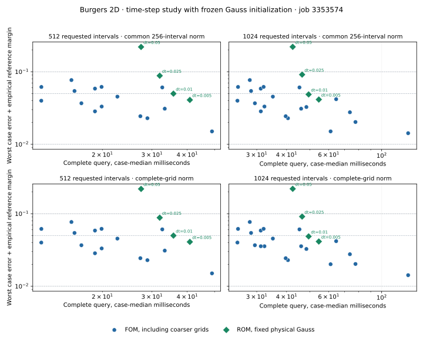

# Burgers 2D: complete-query accuracy and time-step cost

Audited development results for unchanged coordinate-separable network weights across the requested meshes. No tested configuration establishes a complete-query ROM advantage over the eligible efficient FOM envelope.

At 1024 intervals, the least-cost ROM meeting the empirical 5% target uses timestep 0.01: complete-grid error 0.04635117 at 49.4630 ms, compared with 24.9034 ms for the eligible FOM. The original Gauss step size costs 54.5700 ms in this same job.

This timestep study follows the corrected-initializer comparison from job `3352857`. [Its audited paired configuration summary](../runs/rollout04/SUMMARY.json) retains the original edge/Gauss comparison. The present study remeasures its Gauss control in this job; no cross-job timing ratio is used.

Source `ffd57ee68cd1a1a61503556135d74220a0ca2fa0`, job `3353574`, GPU `NVIDIA A100 80GB PCIe`; backend `gpu`, f64 `True`, precision `highest`. Checkpoint SHA-256 `18f0266ae6f0454200ec0b7bf94a18cde531feac9d3170d5099adc5d68d6b589`.

The clipped Gaussian family and seed 7090702 retain all 4 physical cases. Each configuration has 3 timing repetitions; final cases remain unopened. The inherited checkpoint was trained on 255 intervals and is evaluated at 512,1024 intervals.

The scalar equation is $u_t+u(u_x+u_y)=\nu\Delta u$ on the unit square, with zero Dirichlet walls. Both methods use backward Euler and sign-dependent upwinding. The FOM uses adaptive Newton/BiCGStab with exact Helmholtz preconditioning through FFT sine transforms.

The existing linear latent extrapolation predictor is retained and used only when it lowers the weak residual. The query starts with the supplied dense host field and viscosity, and ends with all requested dense host fields. Fixed Gauss sampling charges bilinear interpolation from that input. Weak evolution, sign-dependent upwinding and nonnegative advection quadrature remain unchanged. Initial fit, evolution, input/output transfers and requested dense reconstruction are included in query cost. Setup and compilation are separate.

Output times are [0, 0.05, 0.1, 0.15, 0.2, 0.25]. The common-grid metric observes 256 intervals; the complete-grid metric scores every node on the requested mesh. Both divide by the initial reference-field norm. Configuration cost is the median of per-case repetition medians. Each paired ratio is the median of per-case FOM/ROM median-time ratios from this job. GPU burn-in precedes every timed call, and the recorded configuration-order seed is 89005.

## Initial fitting and subsequent evolution

The table scores actual returned fields. Initial and later errors use the same initial-field normalization. A later error increase does not by itself isolate spatial representation, the nonlinear head, quadrature or optimization.

| Intervals | ROM setting | Query ms | Initial complete-grid worst | Later complete-grid worst | Complete-grid same-mesh worst | Current-relative complete-grid worst | IC budget / improvement stops | Evolution budget / improvement stops |
|---|---|---:|---:|---:|---:|---:|---|---|
| 512 | `rom_L512_fixed_gauss_ic180_dt0.005_stall0.01_starts1` | 40.8571 | 0.032835851 | 0.037133408 | 0.032835851 | 0.046528107 | 0 / 12 | 0 / 600 |
| 512 | `rom_L512_fixed_gauss_ic180_dt0.01_stall0.01_starts1` | 35.7302 | 0.032835851 | 0.046194464 | 0.032835851 | 0.057600939 | 0 / 12 | 9 / 291 |
| 512 | `rom_L512_fixed_gauss_ic180_dt0.025_stall0.01_starts1` | 31.9401 | 0.032835851 | 0.085849517 | 0.05711165 | 0.1054899 | 0 / 12 | 12 / 108 |
| 512 | `rom_L512_fixed_gauss_ic180_dt0.05_stall0.01_starts1` | 27.4384 | 0.032835851 | 0.21841116 | 0.14929718 | 0.2999638 | 0 / 12 | 21 / 39 |
| 1024 | `rom_L1024_fixed_gauss_ic180_dt0.005_stall0.01_starts1` | 54.5700 | 0.0385622 | 0.039076203 | 0.0385622 | 0.043874041 | 0 / 12 | 0 / 600 |
| 1024 | `rom_L1024_fixed_gauss_ic180_dt0.01_stall0.01_starts1` | 49.4630 | 0.0385622 | 0.046351173 | 0.0385622 | 0.053151055 | 0 / 12 | 6 / 294 |
| 1024 | `rom_L1024_fixed_gauss_ic180_dt0.025_stall0.01_starts1` | 46.4571 | 0.0385622 | 0.088998267 | 0.060492407 | 0.099883246 | 0 / 12 | 12 / 108 |
| 1024 | `rom_L1024_fixed_gauss_ic180_dt0.05_stall0.01_starts1` | 42.4253 | 0.0385622 | 0.2191251 | 0.14962824 | 0.30094444 | 0 / 12 | 18 / 42 |

All timestep arms use the same fixed physical fitting points and budget. Interpolation of the supplied dense field is charged and can still depend on mesh resolution. The following work and exit counts are from the measured complete invocations; budget exits are retained even when their returned field passes an accuracy target.

| Intervals | dt | Steps per query | Median LM attempts per query | Largest final weak residual | Evolution exits: budget / residual / improvement / failed | First-step budget exits |
|---|---:|---:|---:|---:|---|---:|
| 512 | 0.005 | 50 | 137.0 | 0.698661 | 0 / 0 / 600 / 0 | 0 |
| 512 | 0.01 | 25 | 135.5 | 1.218668 | 9 / 0 / 291 / 0 | 6 |
| 512 | 0.025 | 10 | 147.0 | 4.486906 | 12 / 0 / 108 / 0 | 12 |
| 512 | 0.05 | 5 | 122.0 | 25.23509 | 21 / 0 / 39 / 0 | 12 |
| 1024 | 0.005 | 50 | 134.5 | 1.502327 | 0 / 0 / 600 / 0 | 0 |
| 1024 | 0.01 | 25 | 135.0 | 2.538933 | 6 / 0 / 294 / 0 | 6 |
| 1024 | 0.025 | 10 | 137.0 | 8.649697 | 12 / 0 / 108 / 0 | 12 |
| 1024 | 0.05 | 5 | 119.5 | 50.36171 | 18 / 0 / 42 / 0 | 12 |

## Reference refinement and empirical eligibility

The finest reference has 4096 intervals and timestep 0.0003125. The largest reference nonlinear relative residual is 9.252003e-12. Spatial and temporal orders are observed from three levels; the margin is the larger of their raw-difference sum and the Richardson estimate for each case. Qualification also requires this margin to be at most one tenth of the target. These estimates do not supply a rigorous reference bound.

| Scoring intervals | Worst empirical margin | Minimum / maximum spatial order | Minimum / maximum time order |
|---|---:|---|---|
| 256 | 0.0037366692 | 0.97372 / 0.99459 | 0.97016 / 0.99226 |
| 512 | 0.0037366692 | 0.97372 / 0.99459 | 0.97016 / 0.99226 |
| 1024 | 0.0037366692 | 0.97372 / 0.99459 | 0.97016 / 0.99226 |

Every eligible case must satisfy measured error plus its reference margin at the target. The FOM envelope retains all declared coarse solves and the same-mesh solve, charging output interpolation. Configurations may be selected separately for each metric and requested resolution.

| Norm | Output intervals | Target | Reference budget | Selected ROM | Selected FOM | ROM / FOM ms | Paired FOM/ROM |
|---|---:|---:|---|---|---|---|---:|
| common | 512 | 0.1 | empirical pass | `rom_L512_fixed_gauss_ic180_dt0.025_stall0.01_starts1` | `fom_L256_out512_dt0.01_ntol0.01` | 31.9401 / 12.1467 | 0.39096 |
| common | 512 | 0.05 | empirical pass | `rom_L512_fixed_gauss_ic180_dt0.01_stall0.01_starts1` | `fom_L256_out512_dt0.01_ntol0.01` | 35.7302 / 12.1467 | 0.33999 |
| common | 512 | 0.01 | unresolved | `unattained` | `unattained` | — / — | — |
| common | 1024 | 0.1 | empirical pass | `rom_L1024_fixed_gauss_ic180_dt0.025_stall0.01_starts1` | `fom_L256_out1024_dt0.01_ntol0.01` | 46.4571 / 24.9034 | 0.55971 |
| common | 1024 | 0.05 | empirical pass | `rom_L1024_fixed_gauss_ic180_dt0.01_stall0.01_starts1` | `fom_L256_out1024_dt0.01_ntol0.01` | 49.4630 / 24.9034 | 0.52388 |
| common | 1024 | 0.01 | unresolved | `unattained` | `unattained` | — / — | — |
| dense | 512 | 0.1 | empirical pass | `rom_L512_fixed_gauss_ic180_dt0.025_stall0.01_starts1` | `fom_L256_out512_dt0.01_ntol0.01` | 31.9401 / 12.1467 | 0.39096 |
| dense | 512 | 0.05 | empirical pass | `rom_L512_fixed_gauss_ic180_dt0.01_stall0.01_starts1` | `fom_L256_out512_dt0.01_ntol0.01` | 35.7302 / 12.1467 | 0.33999 |
| dense | 512 | 0.01 | unresolved | `unattained` | `unattained` | — / — | — |
| dense | 1024 | 0.1 | empirical pass | `rom_L1024_fixed_gauss_ic180_dt0.025_stall0.01_starts1` | `fom_L256_out1024_dt0.01_ntol0.01` | 46.4571 / 24.9034 | 0.55971 |
| dense | 1024 | 0.05 | empirical pass | `rom_L1024_fixed_gauss_ic180_dt0.01_stall0.01_starts1` | `fom_L256_out1024_dt0.01_ntol0.01` | 49.4630 / 24.9034 | 0.52388 |
| dense | 1024 | 0.01 | unresolved | `unattained` | `unattained` | — / — | — |

## Where the primary Gauss error appears

The primary corrected setting uses timestep 0.005, the predeclared larger fitting budget with one start and the original loose evolution threshold. This table distinguishes an initial target miss from a miss that appears later. A configured improvement stop is not a stationary or globally optimal fit.

| Intervals | Case | Initial complete-grid error | Later complete-grid maximum | Time of maximum |
|---|---:|---:|---:|---:|
| 512 | 0 | 0.012581488 | 0.0098268462 | 0 |
| 512 | 1 | 0.013015672 | 0.01281491 | 0 |
| 512 | 2 | 0.015055721 | 0.037133408 | 0.15 |
| 512 | 3 | 0.032835851 | 0.028292717 | 0 |
| 1024 | 0 | 0.0162891 | 0.010502314 | 0 |
| 1024 | 1 | 0.013028027 | 0.012954762 | 0 |
| 1024 | 2 | 0.01505597 | 0.035015236 | 0.15 |
| 1024 | 3 | 0.0385622 | 0.039076203 | 0.05 |

Across the saved timestep controls, the largest absolute change in the initial field is 0. The increased later error therefore occurs after this unchanged initialization.

The next diagnostic uses the same saved full-query fields. The near-wall band contains nodes closer to a wall than the training mesh first interior node. Its squared-error fraction locates the error; it does not independently measure a bank projection floor.

| Intervals | Case | Cold rule / dt | Initial near-wall squared-error fraction | Target | Target diagnosis |
|---|---:|---|---:|---:|---|
| 512 | 0 | fixed_gauss / 0.005 | 0.555251 | 0.05 | measured error plus margin meets target |
| 512 | 0 | fixed_gauss / 0.01 | 0.555251 | 0.05 | measured error plus margin meets target |
| 512 | 0 | fixed_gauss / 0.025 | 0.555251 | 0.05 | measured error plus margin meets target |
| 512 | 0 | fixed_gauss / 0.05 | 0.555251 | 0.05 | later trajectory exceeds target |
| 512 | 1 | fixed_gauss / 0.005 | 0.01158765 | 0.05 | measured error plus margin meets target |
| 512 | 1 | fixed_gauss / 0.01 | 0.01158765 | 0.05 | measured error plus margin meets target |
| 512 | 1 | fixed_gauss / 0.025 | 0.01158765 | 0.05 | later trajectory exceeds target |
| 512 | 1 | fixed_gauss / 0.05 | 0.01158765 | 0.05 | later trajectory exceeds target |
| 512 | 2 | fixed_gauss / 0.005 | 0.00722158 | 0.05 | measured error plus margin meets target |
| 512 | 2 | fixed_gauss / 0.01 | 0.00722158 | 0.05 | measured error plus margin meets target |
| 512 | 2 | fixed_gauss / 0.025 | 0.00722158 | 0.05 | later trajectory exceeds target |
| 512 | 2 | fixed_gauss / 0.05 | 0.00722158 | 0.05 | later trajectory exceeds target |
| 512 | 3 | fixed_gauss / 0.005 | 0.4416153 | 0.05 | measured error plus margin meets target |
| 512 | 3 | fixed_gauss / 0.01 | 0.4416153 | 0.05 | measured error plus margin meets target |
| 512 | 3 | fixed_gauss / 0.025 | 0.4416153 | 0.05 | later trajectory exceeds target |
| 512 | 3 | fixed_gauss / 0.05 | 0.4416153 | 0.05 | later trajectory exceeds target |
| 1024 | 0 | fixed_gauss / 0.005 | 0.7082176 | 0.05 | measured error plus margin meets target |
| 1024 | 0 | fixed_gauss / 0.01 | 0.7082176 | 0.05 | measured error plus margin meets target |
| 1024 | 0 | fixed_gauss / 0.025 | 0.7082176 | 0.05 | measured error plus margin meets target |
| 1024 | 0 | fixed_gauss / 0.05 | 0.7082176 | 0.05 | later trajectory exceeds target |
| 1024 | 1 | fixed_gauss / 0.005 | 0.01117442 | 0.05 | measured error plus margin meets target |
| 1024 | 1 | fixed_gauss / 0.01 | 0.01117442 | 0.05 | measured error plus margin meets target |
| 1024 | 1 | fixed_gauss / 0.025 | 0.01117442 | 0.05 | later trajectory exceeds target |
| 1024 | 1 | fixed_gauss / 0.05 | 0.01117442 | 0.05 | later trajectory exceeds target |
| 1024 | 2 | fixed_gauss / 0.005 | 0.006120309 | 0.05 | measured error plus margin meets target |
| 1024 | 2 | fixed_gauss / 0.01 | 0.006120309 | 0.05 | measured error plus margin meets target |
| 1024 | 2 | fixed_gauss / 0.025 | 0.006120309 | 0.05 | later trajectory exceeds target |
| 1024 | 2 | fixed_gauss / 0.05 | 0.006120309 | 0.05 | later trajectory exceeds target |
| 1024 | 3 | fixed_gauss / 0.005 | 0.5778798 | 0.05 | measured error plus margin meets target |
| 1024 | 3 | fixed_gauss / 0.01 | 0.5778798 | 0.05 | measured error plus margin meets target |
| 1024 | 3 | fixed_gauss / 0.025 | 0.5778798 | 0.05 | later trajectory exceeds target |
| 1024 | 3 | fixed_gauss / 0.05 | 0.5778798 | 0.05 | later trajectory exceeds target |

## Complete measured configuration set

| Configuration | Query ms | Common-grid median / worst | Complete-grid median / worst | Error outliers common / complete | Timing outliers | Failed calls |
|---|---:|---|---|---|---:|---:|
| `fom_L256_out512_dt0.01_ntol0.01` | 12.1467 | 0.02004901 / 0.03616819 | 0.02217648 / 0.03627495 | 3 / 4 | 0 | 0 |
| `fom_L128_out512_dt0.01_ntol0.01` | 12.1542 | 0.02748078 / 0.05795444 | 0.03634001 / 0.05798938 | 4 / 4 | 0 | 0 |
| `fom_L128_out512_dt0.01_ntol0.003` | 15.5348 | 0.03572886 / 0.07306105 | 0.03686974 / 0.07311454 | 4 / 4 | 0 | 0 |
| `fom_L256_out512_dt0.01_ntol0.003` | 15.9273 | 0.02880155 / 0.05054089 | 0.02880847 / 0.05059877 | 3 / 4 | 0 | 0 |
| `fom_L512_out512_dt0.01_ntol0.01` | 16.8523 | 0.02072672 / 0.03304613 | 0.02071964 / 0.03304613 | 3 / 3 | 0 | 0 |
| `fom_L128_out512_dt0.005_ntol0.01` | 18.8268 | 0.02748078 / 0.05482779 | 0.03634001 / 0.05487062 | 3 / 3 | 0 | 0 |
| `fom_L256_out512_dt0.005_ntol0.01` | 18.8275 | 0.01305757 / 0.02473687 | 0.01921324 / 0.02520692 | 3 / 4 | 0 | 0 |
| `fom_L128_out512_dt0.005_ntol0.003` | 19.8689 | 0.02748078 / 0.05811261 | 0.03634001 / 0.05815377 | 4 / 4 | 0 | 0 |
| `fom_L256_out512_dt0.005_ntol0.003` | 19.8891 | 0.01230123 / 0.02943456 | 0.0194265 / 0.02947628 | 2 / 3 | 0 | 0 |
| `fom_L512_out512_dt0.01_ntol0.003` | 22.6102 | 0.02541756 / 0.04168595 | 0.02540853 / 0.04168595 | 3 / 3 | 0 | 0 |
| `fom_L512_out512_dt0.005_ntol0.01` | 27.2739 | 0.01215344 / 0.02063806 | 0.01214955 / 0.02063806 | 3 / 3 | 0 | 0 |
| `fom_L512_out512_dt0.005_ntol0.003` | 28.8919 | 0.00982102 / 0.01915143 | 0.009817653 / 0.01915143 | 2 / 2 | 0 | 0 |
| `fom_L128_out512_dt0.0025_ntol0.003` | 32.6313 | 0.02777728 / 0.05708146 | 0.03634001 / 0.0571262 | 3 / 3 | 0 | 0 |
| `fom_L256_out512_dt0.0025_ntol0.003` | 33.2926 | 0.01172413 / 0.02721718 | 0.0194265 / 0.02726691 | 2 / 3 | 0 | 0 |
| `fom_L512_out512_dt0.0025_ntol0.003` | 48.9544 | 0.006124359 / 0.01134245 | 0.006122112 / 0.01134245 | 1 / 1 | 0 | 0 |
| `rom_L512_fixed_gauss_ic180_dt0.05_stall0.01_starts1` | 27.4384 | 0.1719975 / 0.2184109 | 0.1721438 / 0.2184112 | 4 / 4 | 0 | 0 |
| `rom_L512_fixed_gauss_ic180_dt0.025_stall0.01_starts1` | 31.9401 | 0.07003382 / 0.08586723 | 0.07003425 / 0.08584952 | 4 / 4 | 0 | 0 |
| `rom_L512_fixed_gauss_ic180_dt0.01_stall0.01_starts1` | 35.7302 | 0.03076479 / 0.04619359 | 0.03075407 / 0.04619446 | 4 / 4 | 0 | 0 |
| `rom_L512_fixed_gauss_ic180_dt0.005_stall0.01_starts1` | 40.8571 | 0.02066393 / 0.03713245 | 0.02292576 / 0.03713341 | 3 / 4 | 0 | 0 |
| `fom_L256_out1024_dt0.01_ntol0.01` | 24.9034 | 0.02004901 / 0.03616819 | 0.02623869 / 0.03630153 | 3 / 4 | 0 | 0 |
| `fom_L128_out1024_dt0.01_ntol0.01` | 25.0483 | 0.02748078 / 0.05795444 | 0.04062111 / 0.0579981 | 4 / 4 | 0 | 0 |
| `fom_L128_out1024_dt0.01_ntol0.003` | 28.0539 | 0.03572886 / 0.07306105 | 0.04062111 / 0.07312789 | 4 / 4 | 0 | 0 |
| `fom_L256_out1024_dt0.01_ntol0.003` | 28.4015 | 0.02880155 / 0.05054089 | 0.02880742 / 0.05061321 | 3 / 4 | 0 | 0 |
| `fom_L512_out1024_dt0.01_ntol0.01` | 29.4576 | 0.02072672 / 0.03304613 | 0.02070701 / 0.03307223 | 3 / 3 | 0 | 0 |
| `fom_L128_out1024_dt0.005_ntol0.01` | 31.1714 | 0.02748078 / 0.05482779 | 0.04062111 / 0.0548813 | 3 / 3 | 0 | 0 |
| `fom_L256_out1024_dt0.005_ntol0.01` | 31.1936 | 0.01305757 / 0.02473687 | 0.02142133 / 0.03333581 | 3 / 4 | 0 | 0 |
| `fom_L128_out1024_dt0.005_ntol0.003` | 32.0456 | 0.02748078 / 0.05811261 | 0.04062111 / 0.05816404 | 4 / 4 | 0 | 0 |
| `fom_L256_out1024_dt0.005_ntol0.003` | 32.3075 | 0.01230123 / 0.02943456 | 0.02376906 / 0.03333581 | 2 / 3 | 0 | 0 |
| `fom_L512_out1024_dt0.01_ntol0.003` | 35.0389 | 0.02541756 / 0.04168595 | 0.0254078 / 0.04170888 | 3 / 3 | 0 | 0 |
| `fom_L512_out1024_dt0.005_ntol0.01` | 39.6583 | 0.01215344 / 0.02063806 | 0.01504179 / 0.02061413 | 3 / 3 | 0 | 0 |
| `fom_L512_out1024_dt0.005_ntol0.003` | 40.5246 | 0.00982102 / 0.01915143 | 0.01373429 / 0.01917962 | 2 / 2 | 0 | 0 |
| `fom_L128_out1024_dt0.0025_ntol0.003` | 45.2670 | 0.02777728 / 0.05708146 | 0.04062111 / 0.05713736 | 3 / 3 | 0 | 0 |
| `fom_L256_out1024_dt0.0025_ntol0.003` | 46.0101 | 0.01172413 / 0.02721718 | 0.02266537 / 0.03333581 | 2 / 3 | 0 | 0 |
| `fom_L1024_out1024_dt0.01_ntol0.01` | 48.4033 | 0.02173782 / 0.02891918 | 0.0217264 / 0.02891918 | 4 / 4 | 0 | 0 |
| `fom_L512_out1024_dt0.0025_ntol0.003` | 61.1141 | 0.006124359 / 0.01134245 | 0.01050156 / 0.017819 | 1 / 2 | 0 | 0 |
| `fom_L1024_out1024_dt0.01_ntol0.003` | 64.4974 | 0.02391871 / 0.0381257 | 0.02390672 / 0.0381257 | 3 / 3 | 0 | 0 |
| `fom_L1024_out1024_dt0.005_ntol0.01` | 73.6181 | 0.01326684 / 0.02389937 | 0.01326041 / 0.02389937 | 3 / 3 | 0 | 0 |
| `fom_L1024_out1024_dt0.005_ntol0.003` | 77.6931 | 0.01050882 / 0.01656559 | 0.01050334 / 0.01656559 | 2 / 2 | 0 | 0 |
| `fom_L1024_out1024_dt0.0025_ntol0.003` | 129.0409 | 0.00625118 / 0.01048777 | 0.006248106 / 0.01048777 | 1 / 1 | 0 | 0 |
| `rom_L1024_fixed_gauss_ic180_dt0.05_stall0.01_starts1` | 42.4253 | 0.1714156 / 0.2191248 | 0.1715386 / 0.2191251 | 4 / 4 | 0 | 0 |
| `rom_L1024_fixed_gauss_ic180_dt0.025_stall0.01_starts1` | 46.4571 | 0.06876616 / 0.08904865 | 0.06876665 / 0.08899827 | 4 / 4 | 0 | 0 |
| `rom_L1024_fixed_gauss_ic180_dt0.01_stall0.01_starts1` | 49.4630 | 0.03422912 / 0.04639094 | 0.03422975 / 0.04635117 | 4 / 4 | 0 | 0 |
| `rom_L1024_fixed_gauss_ic180_dt0.005_stall0.01_starts1` | 54.5700 | 0.02401685 / 0.03910892 | 0.02565217 / 0.0390762 | 4 / 4 | 0 | 0 |

## Runtime components and setup

Component timings are separately synchronized diagnostic invocations with field parity against the fused query. They do not replace complete-query timing or establish kernel-launch counts.

| Intervals | Cold rule / budget / dt | Input ms | Initial fit ms | Evolution ms | Decode ms | Output ms | Staged total ms | LM attempts |
|---|---|---:|---:|---:|---:|---:|---:|---:|
| 512 | fixed_gauss / 180 / 0.005 | 0.9015 | 4.4097 | 30.4465 | 0.8847 | 2.3256 | 40.2052 | 137.0 |
| 512 | fixed_gauss / 180 / 0.01 | 0.6426 | 4.4600 | 25.0207 | 0.9409 | 2.4143 | 35.6712 | 135.5 |
| 512 | fixed_gauss / 180 / 0.025 | 0.6057 | 4.6238 | 22.6339 | 0.8875 | 2.3957 | 31.6808 | 147.0 |
| 512 | fixed_gauss / 180 / 0.05 | 0.6562 | 4.9146 | 18.8573 | 0.8986 | 2.6925 | 28.5386 | 122.0 |
| 1024 | fixed_gauss / 180 / 0.005 | 1.7100 | 4.1664 | 29.7295 | 2.6702 | 13.8301 | 53.7760 | 134.5 |
| 1024 | fixed_gauss / 180 / 0.01 | 1.7873 | 4.2019 | 24.2536 | 2.6895 | 13.6069 | 47.6504 | 135.0 |
| 1024 | fixed_gauss / 180 / 0.025 | 1.7636 | 4.4066 | 20.8960 | 2.6679 | 13.7556 | 44.8426 | 137.0 |
| 1024 | fixed_gauss / 180 / 0.05 | 1.7283 | 4.3386 | 17.5901 | 2.7408 | 13.7095 | 41.3521 | 119.5 |

| Intervals | Sampled rank | K / R / M / m | Bank/operator setup s | Gauss setup s | Compilation/warmup s |
|---|---:|---|---:|---:|---:|
| 512 | 512 | 16 / 512 / 64 / 256 | 28.3568 | 2.8558 | 25.9406 |
| 1024 | 512 | 16 / 512 / 64 / 256 | 25.0741 | 0.9694 | 27.9607 |

The timestep sweep is development selection on the same cases. Larger steps can reduce evolution work while increasing temporal error or hitting the unchanged trial budget. Consequently, larger-step field loss cannot be attributed solely to time discretization. The fitted initial field is shared across these controls and remains an accuracy limit; this sweep does not change bank representation or certify stationary optimization. The first step has no extrapolation history, so later predictor scaling alone cannot directly remove a startup cap. A separate bounded startup-step allocation or different time integration formula would target this limitation; no such change or additional job is included here.

## Audit and scope

The independent NumPy audit checked 516 invocations across 43 configurations and 172 saved complete-grid artifacts. Maximum error-recomputation discrepancies are 1.11022e-16 on the common grid and 7.21645e-16 on complete grids. It found 0 FOM tolerance failures and 0 nonfinite invocations. 516 of 516 recorded dense-output hashes match their corresponding first repetitions.

Source, checkpoint and closed-output checksums are retained. Every repeated output is checked against an actual complete-grid artifact. Initial clipping and physical cases are preserved. Independent confirmation, rigorous reference bounds and per-resolution weight retraining remain open. The historical cold-only bank-floor diagnostics are not substituted for the returned rollout errors.

## Plain-language glossary

- **Intervals / complete grid / common grid:** cells per axis / every requested output node / fixed observation nodes shared by all resolutions.
- **FOM / ROM / frozen checkpoint:** full spatial model / nonlinear-manifold reduced model / saved neural weights kept unchanged.
- **Bank / head / IC:** learned coordinate-dependent spatial features / nonlinear map from latent coordinates to feature coefficients / initial condition.
- **Newton / BiCGStab / Helmholtz preconditioning / FFT:** nonlinear iteration / iterative linear solution / inversion of the diffusion-plus-identity part to help that solve / fast Fourier transform.
- **Gauss / edge / QR / cold:** fixed physical Gaussian quadrature / original mesh-dependent initial samples / orthogonal triangular factorization / initial reduced-state fitting.
- **K / R / M / m / sampled rank:** latent coordinates / learned spatial features / smooth weak tests / advection quadrature nodes / independently resolved bank directions on deterministic sampled rows.
- **Query ms / case median / paired FOM/ROM:** complete host-input-to-host-output latency in milliseconds / middle timing repetition for one physical case / casewise full-model time divided by reduced-model time, then a cohort median.
- **Initial / later / median / worst error:** first returned field / remaining output times / middle case error / largest case error; each is divided by the corresponding initial reference norm.
- **Current-relative error:** discrepancy divided by the current reference field norm, which exposes relative error as the field decays; it is a diagnostic separate from the initial-norm eligibility target.
- **Same-mesh error:** discrepancy from a tightly converged full solve using the same mesh and timestep.
- **dt / steps / final weak residual:** time-step size / autonomous steps between the first and last requested output / final weighted weak-equation discrepancy for each such solve; it is not a physical field-error norm.
- **Budget / improvement / failed stops:** configured trial cap / small-step or relative-improvement exit / rejected or nonfinite exit. The first two do not prove stationarity.
- **Empirical margin / Richardson / observed order / target / reference budget:** estimated reference error / extrapolation assuming the observed convergence rate continues / that rate inferred from three levels / requested accuracy / allowed fraction of target consumed by reference uncertainty.
- **Envelope / selected / unattained:** least-cost eligible candidate including coarse FOM interpolation / chosen development configuration / no tested configuration meets the stated error condition.
- **Weak evolution / sign-upwind / nonnegative quadrature:** PDE equations averaged against smooth functions / local-sign-selected differences / positive weighted sampling of advection.
- **Input / initial fit / evolution / decode / output / staged total / LM attempts:** device transfer / initial latent optimization / reduced timestepping / dense reconstruction / host transfer / sum of diagnostic phases / actual Levenberg–Marquardt trial steps.
- **Error / timing outliers:** physical cases above relative error 0.01 / calls taking more than twice that case’s timing median. All outliers remain in the results.
- **Near-wall squared-error fraction:** share of total squared field discrepancy at nodes closer to the boundary than the first interior node of the training mesh.
- **Setup / compilation / artifact / hash / parity:** reusable numerical preparation / executable preparation / saved numerical file / content fingerprint / agreement of two implementations or outputs.
- **Validation / final / f64 / highest / backend:** development cases / reserved independent cases / double precision / required matrix arithmetic precision / execution device type.
