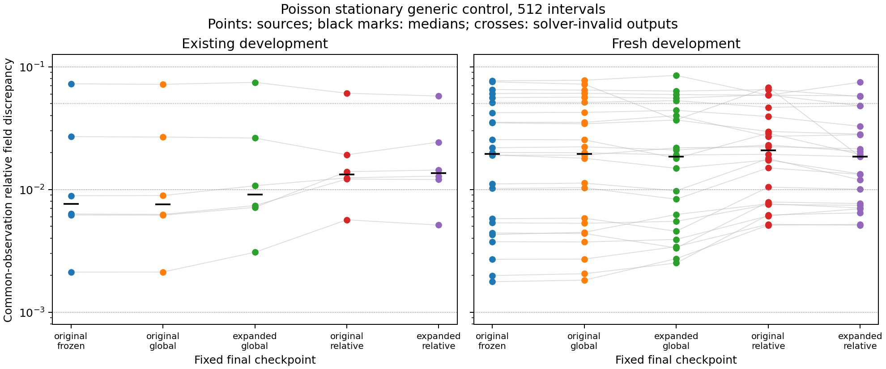
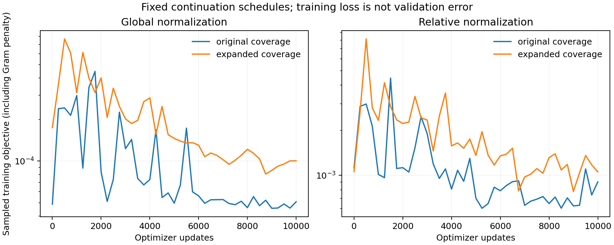
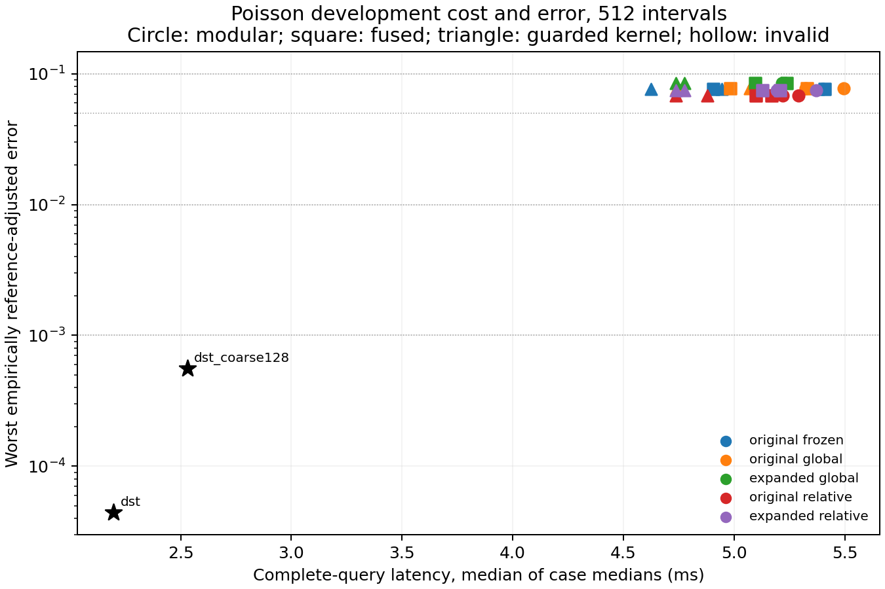

# Poisson training coverage and loss-normalization findings

These generated results are provisional development evidence from a fixed-compute continuation factorial, retaining the unchanged compact checkpoint. They separate training coverage from loss normalization and evaluate the resulting bank, head and deployed weak solve on original and fresh development sources.

Job `3353137`, source `0ed8384c30ff150d0f25adfe1dead41a8a739c26`, GPU `NVIDIA A100 80GB PCIe`. Evaluation contains 6 existing and 24 fresh development sources, with 4 full-query repetitions. Sealed final cohorts remain closed.

Training uses 256 nodes per axis, or 255 intervals. Query meshes use [256, 512] intervals, with one more node per axis. The architecture retains latent dimension 16 and 64 spatial features. Each scheduled checkpoint is frozen across both query meshes; operators are rebuilt. All assemblies retain bank ranks [64] and smooth-test counts [257]; complete tied shells can increase the requested count. All numerical work uses GPU float64 and highest matrix precision.

## Fixed training endpoints

| Model | Training sources | Updates | Complete endpoint | Compile s | Optimizer loop s | Actual train elapsed s | Training median relative error | Training worst relative error |
|---|---:|---:|---|---:|---:|---:|---:|---:|
| original_global | 512 | 10000 | True | 7.99326 | 5.38673 | 13.7955 | 0.0159792737 | 0.126382528 |
| expanded_global | 2048 | 10000 | True | 1.38046 | 5.55576 | 6.98235 | 0.0207311462 | 0.218312873 |
| original_relative | 512 | 10000 | True | 1.35083 | 5.42033 | 6.77955 | 0.0210175776 | 0.065631236 |
| expanded_relative | 2048 | 10000 | True | 1.44374 | 5.55093 | 7.00388 | 0.0236801275 | 0.113839799 |

Total offline elapsed including source generation, training-code fitting, compilation and training diagnostics is 47.1393 s. Training truth DST/CG discrepancy is 2.65575319e-15 at CG tolerance 1e-13.

Global-loss arms share the original training set's full-field mean-square denominator. Relative-loss arms use each training field's fixed full-grid mean square. Coverage pairs share exact initial weights, training codes and random-key schedule across objectives. The larger set receives fewer passes per source at this matched update/batch budget. In-sample errors cover different source sets across coverage arms and are not held-out accuracy measurements. Fixed scheduled endpoints are reported; none was selected by intermediate validation. Offline durations are actual observed costs including compilation, without a separate warm training-speed measurement.

## Deployed stationary-control accuracy

| Intervals | Development cohort | Model | Median physical error | Worst physical error | Invalid | Nonstationary | Generic modular latency ms |
|---:|---|---|---:|---:|---:|---:|---:|
| 256 | existing_development | original_frozen | 0.00760189002 | 0.0725423651 | 0 | 0 | 5.17079 |
| 256 | existing_development | original_global | 0.00758192806 | 0.0719184612 | 0 | 0 | 5.39734 |
| 256 | existing_development | expanded_global | 0.00905150484 | 0.0746116862 | 0 | 0 | 5.24552 |
| 256 | existing_development | original_relative | 0.0131921547 | 0.0608459011 | 0 | 0 | 5.18741 |
| 256 | existing_development | expanded_relative | 0.0136182999 | 0.0576748392 | 0 | 0 | 5.35603 |
| 256 | fresh_development | original_frozen | 0.0195452025 | 0.0766875934 | 0 | 0 | 5.07592 |
| 256 | fresh_development | original_global | 0.0194650646 | 0.0776348521 | 0 | 0 | 5.07366 |
| 256 | fresh_development | expanded_global | 0.0185411662 | 0.0849998522 | 0 | 0 | 4.95425 |
| 256 | fresh_development | original_relative | 0.0208308225 | 0.068015643 | 0 | 0 | 4.78073 |
| 256 | fresh_development | expanded_relative | 0.0184733094 | 0.0747453733 | 0 | 0 | 4.89918 |
| 512 | existing_development | original_frozen | 0.00760168447 | 0.0725423124 | 0 | 0 | 5.4905 |
| 512 | existing_development | original_global | 0.00758172043 | 0.0719184032 | 0 | 0 | 5.69012 |
| 512 | existing_development | expanded_global | 0.00905132552 | 0.0746116238 | 0 | 0 | 5.79699 |
| 512 | existing_development | original_relative | 0.0131920174 | 0.0608457768 | 0 | 0 | 5.55665 |
| 512 | existing_development | expanded_relative | 0.0136181807 | 0.0576747557 | 0 | 0 | 5.53631 |
| 512 | fresh_development | original_frozen | 0.0195451089 | 0.0766875155 | 0 | 0 | 5.38573 |
| 512 | fresh_development | original_global | 0.0194649613 | 0.077634775 | 0 | 0 | 5.33397 |
| 512 | fresh_development | expanded_global | 0.0185410352 | 0.0849997815 | 0 | 0 | 5.22016 |
| 512 | fresh_development | original_relative | 0.0208306791 | 0.068015574 | 0 | 0 | 5.22429 |
| 512 | fresh_development | expanded_relative | 0.0184731351 | 0.0747452342 | 0 | 0 | 5.32131 |

Physical errors above include every output, including failures. They use common nested observation nodes and the fine reference's norm; full-mesh same-grid errors remain separately available in JSON. The tighter generic solver is an accuracy diagnostic and is not automatically the selected cost configuration. The initialized code is each checkpoint's training-code mean, with no evaluation answer or source descriptor input.

## Bank and head diagnosis

| Intervals | Development cohort | Model | Worst bank same-grid error | Worst bank physical error | Worst best-head physical error | Nonstationary selected head fits |
|---:|---|---|---:|---:|---:|---:|
| 256 | existing_development | original_frozen | 0.0574652153 | 0.0573636997 | 0.0725423461 | 0 |
| 256 | existing_development | original_global | 0.0574462107 | 0.0573445809 | 0.0719184306 | 0 |
| 256 | existing_development | expanded_global | 0.0556033495 | 0.0555017574 | 0.0746116433 | 0 |
| 256 | existing_development | original_relative | 0.0527039244 | 0.0526050365 | 0.060845656 | 0 |
| 256 | existing_development | expanded_relative | 0.0513259102 | 0.0512261249 | 0.0576746317 | 0 |
| 256 | fresh_development | original_frozen | 0.0576098719 | 0.0575112708 | 0.0766875592 | 0 |
| 256 | fresh_development | original_global | 0.0578454529 | 0.0577468308 | 0.0776348177 | 0 |
| 256 | fresh_development | expanded_global | 0.0646725636 | 0.0645726613 | 0.0849998117 | 0 |
| 256 | fresh_development | original_relative | 0.0550978266 | 0.055001458 | 0.0680155321 | 0 |
| 256 | fresh_development | expanded_relative | 0.0639947852 | 0.0639079077 | 0.0747451727 | 0 |
| 512 | existing_development | original_frozen | 0.0573877784 | 0.0573636274 | 0.0725423 | 0 |
| 512 | existing_development | original_global | 0.0573686868 | 0.0573445086 | 0.0719183839 | 0 |
| 512 | existing_development | expanded_global | 0.055525851 | 0.0555016815 | 0.0746115979 | 0 |
| 512 | existing_development | original_relative | 0.0526284786 | 0.052604952 | 0.0608455931 | 0 |
| 512 | existing_development | expanded_relative | 0.051249778 | 0.0512260373 | 0.0576745653 | 0 |
| 512 | fresh_development | original_frozen | 0.0575346708 | 0.0575112128 | 0.0766875001 | 0 |
| 512 | fresh_development | original_global | 0.0577702362 | 0.0577467733 | 0.0776347593 | 0 |
| 512 | fresh_development | expanded_global | 0.0645963625 | 0.0645725852 | 0.0849997622 | 0 |
| 512 | fresh_development | original_relative | 0.0550243203 | 0.0550013929 | 0.0680154998 | 0 |
| 512 | fresh_development | expanded_relative | 0.0639285059 | 0.0639078286 | 0.0747451148 | 0 |

Bank projection and head fits see the discrete reference only for diagnosis and never initialize online queries. Head fitting minimizes the exact full-field objective in QR coordinates from fixed deterministic starts. A stationary local fit is not proof of a global optimum. All starts and terminal diagnostics remain recorded. Actual retained bank ranks and operator hashes are in setup records.

## Factorial contrasts

| Intervals | Development cohort | Contrast | Held fixed | Median paired physical-error change | Improved cases | Both solver-valid throughout |
|---:|---|---|---|---:|---:|---|
| 256 | existing_development | expanded_minus_original_coverage | global | 0.00105546624 | 1 | True |
| 256 | existing_development | expanded_minus_original_coverage | relative | 0.000151144469 | 3 | True |
| 256 | existing_development | relative_minus_global_loss | original | 0.00352360254 | 2 | True |
| 256 | existing_development | relative_minus_global_loss | expanded | 0.00208957518 | 2 | True |
| 256 | fresh_development | expanded_minus_original_coverage | global | -0.000309623536 | 12 | True |
| 256 | fresh_development | expanded_minus_original_coverage | relative | -0.000819474853 | 18 | True |
| 256 | fresh_development | relative_minus_global_loss | original | 0.00229052636 | 9 | True |
| 256 | fresh_development | relative_minus_global_loss | expanded | -0.000510934836 | 13 | True |
| 512 | existing_development | expanded_minus_original_coverage | global | 0.00105548594 | 1 | True |
| 512 | existing_development | expanded_minus_original_coverage | relative | 0.000151167786 | 3 | True |
| 512 | existing_development | relative_minus_global_loss | original | 0.00352368243 | 2 | True |
| 512 | existing_development | relative_minus_global_loss | expanded | 0.00208960691 | 2 | True |
| 512 | fresh_development | expanded_minus_original_coverage | global | -0.000309624801 | 12 | True |
| 512 | fresh_development | expanded_minus_original_coverage | relative | -0.000819461442 | 18 | True |
| 512 | fresh_development | relative_minus_global_loss | original | 0.00229053073 | 9 | True |
| 512 | fresh_development | relative_minus_global_loss | expanded | -0.000510971122 | 13 | True |

Contrasts use the tighter generic modular solve. Negative error changes favor expanded coverage or relative normalization, respectively. A contrast containing failed solves is descriptive, and does not establish a controlled accuracy gain. These results test the normalization/coverage hypothesis within this fixed architecture and compute budget; they do not establish a general model-family limitation or optimal training recipe.

## Qualifying complete-query development envelope

| Intervals | Development cohort | Target | ROM model / arm / tau | FOM | ROM ms | FOM ms | Median case FOM/ROM ratio |
|---:|---|---:|---|---|---:|---:|---:|---:|
| 256 | all_development | 0.1 | original_global / rom_gj / 0.01 | dst | 4.30971 | 1.78245 | 0.413619 |
| 256 | all_development | 0.05 | unattained | dst | unattained | 1.78245 | unattained |
| 256 | all_development | 0.01 | unattained | dst | unattained | 1.78245 | unattained |
| 256 | all_development | 0.001 | unattained | dst | unattained | 1.78245 | unattained |
| 512 | all_development | 0.1 | original_frozen / rom_gj / 0.01 | dst | 4.62552 | 2.1976 | 0.468782 |
| 512 | all_development | 0.05 | unattained | dst | unattained | 2.1976 | unattained |
| 512 | all_development | 0.01 | unattained | dst | unattained | 2.1976 | unattained |
| 512 | all_development | 0.001 | unattained | dst | unattained | 2.1976 | unattained |

Every case must pass endpoint, solver and numerical gates plus $(e+\delta)/(1-\delta)\leq\epsilon$ and the reference allowance. This uses empirical refinement evidence, not rigorous continuum bounds. Latencies are medians of case-median repetition times; cost ratios are medians of ratios of case-median FOM and ROM times. A ratio above unity favors ROM. The displayed envelope selects among tested development configurations and provides no independent final confirmation. Separate existing/fresh envelopes, all raw repetitions, component costs, outlier counts and failures remain in JSON.

The artifact audit checks 7680 timed invocations and 1496 distinct saved fields. Maximum CPU discrepancy in invocation metrics is 5.30084409e-16; maximum oracle-metric discrepancy is 9.71445147e-17. Specialized agreement failures: 0; timed fallbacks: 0. Maximum final reference refinement difference is 7.35117705e-06. Original generic controls and the guarded specialized query share each job's GPU and return a full host field. The lookup/projection speed proposal is separate and absent from these endpoints.

## Selected-query component costs

| Intervals | Model | Arm | Tau | Input ms | Projection/init ms | Solver ms | Fused device ms | Output ms |
|---:|---|---|---:|---:|---:|---:|---:|---:|
| 256 | — | dst | — | 0.510662 | 0 | 0.143138 | — | 1.12984 |
| 256 | original_global | rom_modular | 0.01 | 0.513562 | 0.849587 | 3.03177 | — | 0.564151 |
| 256 | original_global | rom_gj | 0.01 | 0.509624 | — | — | 3.33505 | 0.472888 |
| 512 | — | dst | — | 0.777262 | 0 | 0.185974 | — | 1.23126 |
| 512 | original_frozen | rom_modular | 0.01 | 0.777368 | 0.694519 | 2.89642 | — | 0.776344 |
| 512 | original_frozen | rom_gj | 0.01 | 0.764884 | — | — | 3.14972 | 0.670063 |

The selected full-query implementation and its generic modular control each supply their own component medians. Fused device time includes projection, solve, charged guards/fallback and decoding; separated control times are never substituted into a fused invocation. Component medians need not sum to the total median.

## Generated figures

The corresponding PDF files are standalone export artifacts. Every plotted value comes from the collected native JSON.

## Plain-language glossary

- **Model / original / expanded:** checkpoint evaluated / inherited training coverage / that coverage plus new sources from the same family.
- **Global / relative loss:** squared field error divided by one shared scale / each field's squared error divided by its own full-field scale.
- **Update / endpoint / compile / elapsed:** optimizer step / final scheduled checkpoint / preparation of device executable / actual wall time including compilation.
- **Existing / fresh development:** previously inspected diagnostic sources / independently seeded sources held outside all training; neither is a sealed final cohort.
- **Intervals / modes / bank / head:** grid cells per axis / smooth PDE tests / learned spatial features / nonlinear map from compact coordinates to feature coefficients.
- **Physical / same-grid / paired error change:** common-observation discrepancy from refined reference / full-mesh discrepancy from discrete full solver / treatment error minus control error on the same source.
- **Stationary / invalid / oracle / QR:** small normalized objective gradient / failed gate / reference-only diagnostic fit / orthonormal coordinates preserving the field least-squares objective.
- **ROM / FOM / DST / modular / fused / GJ:** reduced model / full discrete model / direct sine-transform solver / separated query stages / combined device pipeline / guarded Gauss–Jordan linear solve.
- **Tau / target / envelope / cost ratio:** requested initial-residual reduction / error ceiling / cheapest qualifying tested configuration / median of case-median FOM cost divided by ROM cost.
- **Fallback / outlier / delta / e / epsilon:** charged generic linear solve / repetition above three aggregate latencies / final refinement discrepancy relative to fine-reference norm / observed error / requested ceiling.
- **Coverage / factorial / held fixed / matched compute:** sampled training source range / independently crossed treatments / unchanged treatment dimension / same updates and batch sizes.
- **s / ms / source hash / checkpoint hash:** seconds / milliseconds / code identity / saved model identity.
