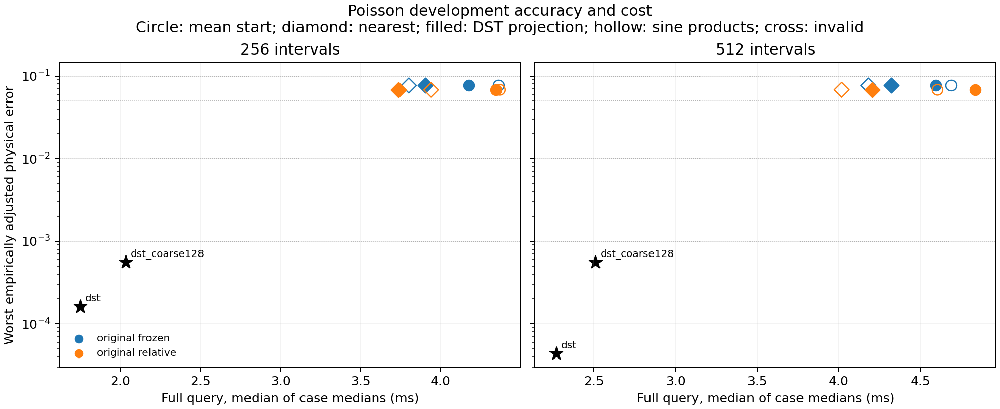
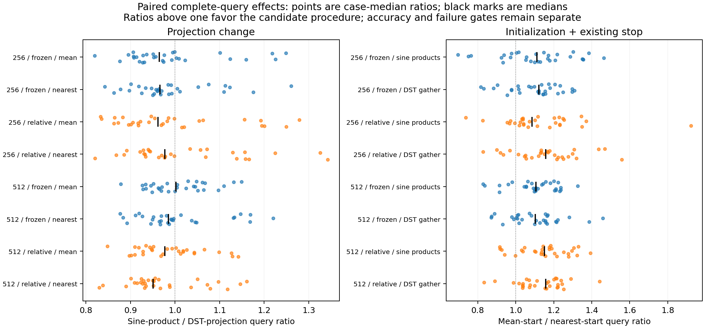

# Poisson source projection and initialization findings

These generated results are provisional development evidence from the approved frozen-checkpoint factorial. They compare complete query costs and errors under the existing per-start residual stopping rule; the final cohort stays closed.

Job `3354845`, source `20893525a16603a99f527dbd9e10affcdc206b9d`, GPU `NVIDIA A100 80GB PCIe`. The primary panel contains 1800 calls with 3 repetitions; separate stationary controls contain 480 single calls excluded from speed selection. All source draws and both frozen checkpoint hashes are checked against the preceding audited training study.

Query meshes use [256, 512] intervals, while the inherited training grid uses 256 nodes. Assemblies retain bank ranks [64] and smooth-test counts [257]. The original relative-loss continuation was selected by worst adjusted error over every declared development case and both meshes, before this run.

## Primary complete-query panel

| Intervals | Checkpoint | Projection | Initialization | Query ms | Median / worst physical error | Invalid | Nonstationary | Median same-grid DST/ROM |
|---:|---|---|---|---:|---:|---:|---:|---:|
| 256 | original_frozen | sine products | mean code | 4.36125 | 0.019049869 / 0.076687593 | 0 | 11 | 0.4128073 |
| 256 | original_frozen | sine products | nearest code | 3.799916 | 0.019049869 / 0.076687593 | 0 | 0 | 0.426915 |
| 256 | original_frozen | DST gather | mean code | 4.174044 | 0.019049869 / 0.076687593 | 0 | 11 | 0.4107092 |
| 256 | original_frozen | DST gather | nearest code | 3.903693 | 0.019049869 / 0.076687593 | 0 | 0 | 0.43269 |
| 256 | original_relative | sine products | mean code | 4.367388 | 0.018494548 / 0.068015643 | 0 | 6 | 0.3982343 |
| 256 | original_relative | sine products | nearest code | 3.939371 | 0.018494548 / 0.068015643 | 0 | 0 | 0.4450426 |
| 256 | original_relative | DST gather | mean code | 4.344527 | 0.018494548 / 0.068015643 | 0 | 6 | 0.3946741 |
| 256 | original_relative | DST gather | nearest code | 3.734867 | 0.018494548 / 0.068015643 | 0 | 0 | 0.4567805 |
| 512 | original_frozen | sine products | mean code | 4.689149 | 0.019049769 / 0.076687515 | 0 | 11 | 0.480681 |
| 512 | original_frozen | sine products | nearest code | 4.18059 | 0.019049769 / 0.076687515 | 0 | 0 | 0.545577 |
| 512 | original_frozen | DST gather | mean code | 4.593671 | 0.019049769 / 0.076687515 | 0 | 11 | 0.4840468 |
| 512 | original_frozen | DST gather | nearest code | 4.321072 | 0.019049769 / 0.076687515 | 0 | 0 | 0.5324662 |
| 512 | original_relative | sine products | mean code | 4.605231 | 0.018494353 / 0.068015574 | 0 | 6 | 0.4802078 |
| 512 | original_relative | sine products | nearest code | 4.018243 | 0.018494353 / 0.068015574 | 0 | 0 | 0.561288 |
| 512 | original_relative | DST gather | mean code | 4.8363 | 0.018494353 / 0.068015574 | 0 | 6 | 0.4580623 |
| 512 | original_relative | DST gather | nearest code | 4.204581 | 0.018494353 / 0.068015574 | 0 | 0 | 0.5421284 |

Across the matched checkpoint/mesh/projection contrasts, median case ratios of mean-start to nearest-start cost range from 1.086295 to 1.158323. Median sine-product/DST-projection ratios range from 0.9507564 to 1.002107. The paired projection comparisons do not establish a consistent DST-projection speed gain. Aggregate latency and the median paired ratio summarize different aspects of the case distribution and can order configurations differently; medians and ratios do not commute. The envelope selects by aggregate case-median latency, while every reported paired ratio uses case-wise ratios.

Errors include failed outputs and use common observation nodes divided by the fine reference norm. Full requested-mesh same-grid discrepancies, both cohort summaries, raw repetition times and outliers remain in JSON. A nonstationary primary call may meet its intentional residual-reduction stop; it is not labeled stationary. Same-grid ratios above unity favor ROM and are raw cost comparisons, not a substitute for target qualification.

## Initialization and unchanged stopping procedure

| Intervals | Checkpoint | Projection | Initialization | Median initial residual | Median absolute tau threshold | Median final residual | Median attempts | Case stop reasons |
|---:|---|---|---|---:|---:|---:|---:|---|
| 256 | original_frozen | sine products | mean code | 0.1956635 | 0.001956635 | 0.005341166 | 12 | `{"1": 19, "2": 11}` |
| 256 | original_frozen | sine products | nearest code | 0.06819853 | 0.0006819853 | 0.005151433 | 8 | `{"1": 30}` |
| 256 | original_frozen | DST gather | mean code | 0.1956635 | 0.001956635 | 0.005341166 | 12 | `{"1": 19, "2": 11}` |
| 256 | original_frozen | DST gather | nearest code | 0.06819853 | 0.0006819853 | 0.005151433 | 8 | `{"1": 30}` |
| 256 | original_relative | sine products | mean code | 0.1922333 | 0.001922333 | 0.005751325 | 12 | `{"1": 24, "2": 6}` |
| 256 | original_relative | sine products | nearest code | 0.06809913 | 0.0006809913 | 0.005636237 | 7.5 | `{"1": 30}` |
| 256 | original_relative | DST gather | mean code | 0.1922333 | 0.001922333 | 0.005751325 | 12 | `{"1": 24, "2": 6}` |
| 256 | original_relative | DST gather | nearest code | 0.06809913 | 0.0006809913 | 0.005636237 | 7.5 | `{"1": 30}` |
| 512 | original_frozen | sine products | mean code | 0.3913151 | 0.003913151 | 0.0106804 | 12 | `{"1": 19, "2": 11}` |
| 512 | original_frozen | sine products | nearest code | 0.1363962 | 0.001363962 | 0.01029779 | 8 | `{"1": 30}` |
| 512 | original_frozen | DST gather | mean code | 0.3913151 | 0.003913151 | 0.0106804 | 12 | `{"1": 19, "2": 11}` |
| 512 | original_frozen | DST gather | nearest code | 0.1363962 | 0.001363962 | 0.01029779 | 8 | `{"1": 30}` |
| 512 | original_relative | sine products | mean code | 0.3844545 | 0.003844545 | 0.01148775 | 12 | `{"1": 24, "2": 6}` |
| 512 | original_relative | sine products | nearest code | 0.1361973 | 0.001361973 | 0.01126405 | 7.5 | `{"1": 30}` |
| 512 | original_relative | DST gather | mean code | 0.3844545 | 0.003844545 | 0.01148775 | 12 | `{"1": 24, "2": 6}` |
| 512 | original_relative | DST gather | nearest code | 0.1361973 | 0.001361973 | 0.01126405 | 7.5 | `{"1": 30}` |

The threshold is $\tau\|r(z_0)\|_2$ for each call's own start. A nearer start can impose a tighter absolute target and require a stationary exit. Neither target nor residual is re-anchored. Cost differences therefore describe the complete initialization and existing stopping procedure. Every selected cache index, nearest distance, runner-up gap and near-tie flag is retained; the cache uses training-code predictions only.

## Separate stationary accuracy controls

| Intervals | Checkpoint | Projection | Initialization | Median / worst physical error | Invalid | Nonstationary | Median attempts |
|---:|---|---|---|---:|---:|---:|---:|
| 256 | original_frozen | sine products | mean code | 0.019049869 / 0.076687593 | 0 | 0 | 13 |
| 256 | original_frozen | sine products | nearest code | 0.019049869 / 0.076687593 | 0 | 0 | 8 |
| 256 | original_frozen | DST gather | mean code | 0.019049869 / 0.076687593 | 0 | 0 | 13 |
| 256 | original_frozen | DST gather | nearest code | 0.019049869 / 0.076687593 | 0 | 0 | 8 |
| 256 | original_relative | sine products | mean code | 0.018494548 / 0.068015643 | 0 | 0 | 12 |
| 256 | original_relative | sine products | nearest code | 0.018494548 / 0.068015643 | 0 | 0 | 7.5 |
| 256 | original_relative | DST gather | mean code | 0.018494548 / 0.068015643 | 0 | 0 | 12 |
| 256 | original_relative | DST gather | nearest code | 0.018494548 / 0.068015643 | 0 | 0 | 7.5 |
| 512 | original_frozen | sine products | mean code | 0.019049769 / 0.076687515 | 0 | 0 | 13 |
| 512 | original_frozen | sine products | nearest code | 0.019049769 / 0.076687515 | 0 | 0 | 8 |
| 512 | original_frozen | DST gather | mean code | 0.019049769 / 0.076687515 | 0 | 0 | 13.5 |
| 512 | original_frozen | DST gather | nearest code | 0.019049769 / 0.076687515 | 0 | 0 | 8 |
| 512 | original_relative | sine products | mean code | 0.018494353 / 0.068015574 | 0 | 0 | 12 |
| 512 | original_relative | sine products | nearest code | 0.018494353 / 0.068015574 | 0 | 0 | 7.5 |
| 512 | original_relative | DST gather | mean code | 0.018494353 / 0.068015574 | 0 | 0 | 12 |
| 512 | original_relative | DST gather | nearest code | 0.018494353 / 0.068015574 | 0 | 0 | 7.5 |

These single-call controls retain timing components and every output, but never enter the speed envelope. Projection equality checks pair the same initialization choice. Different mean-versus-nearest local minima remain valid scientific outcomes and are assessed by error and stationarity, without an equality requirement. A small residual alone does not rescue a failed stationary control.

## Development cost-to-accuracy envelope

| Intervals | Target | ROM checkpoint / projection / start | Eligible FOM | ROM / FOM ms | Median case FOM/ROM |
|---:|---:|---|---|---:|---:|
| 256 | 0.1 | original_relative / DST gather / nearest code | dst | 3.734867 / 1.750966 | 0.4567805 |
| 256 | 0.05 | unattained | dst | — / 1.750966 | — |
| 256 | 0.01 | unattained | dst | — / 1.750966 | — |
| 256 | 0.001 | unattained | dst | — / 1.750966 | — |
| 512 | 0.1 | original_relative / sine products / nearest code | dst | 4.018243 / 2.267152 | 0.561288 |
| 512 | 0.05 | unattained | dst | — / 2.267152 | — |
| 512 | 0.01 | unattained | dst | — / 2.267152 | — |
| 512 | 0.001 | unattained | dst | — / 2.267152 | — |

Eligibility requires every case to satisfy the solver and parity gates, $(e+\delta)/(1-\delta)\leq\epsilon$, and the declared reference allowance. Reference differences are empirical estimates, not rigorous continuum bounds. The FOM envelope includes same-grid DST and the charged coarse-grid solve with interpolation. Latencies are medians of case-median repetitions; paired ratios are medians of ratios of case medians. Selection remains development-only.

## Recorded primary cost components

| Intervals | Checkpoint / solver | Projection | Initialization | Input ms | Fused device ms | FOM solve/interpolation ms | Output ms |
|---:|---|---|---|---:|---:|---:|---:|
| 256 | dst | — | — | 0.5158925 | — | 0.1424635 | 1.103712 |
| 256 | dst_coarse128 | — | — | 0.507751 | — | 1.168669 | 0.364892 |
| 256 | original_frozen | sine products | mean code | 0.5104895 | 3.303173 | — | 0.5285 |
| 256 | original_frozen | sine products | nearest code | 0.513175 | 2.756437 | — | 0.528018 |
| 256 | original_frozen | DST gather | mean code | 0.494746 | 3.213096 | — | 0.535334 |
| 256 | original_frozen | DST gather | nearest code | 0.4974445 | 2.899102 | — | 0.5157031 |
| 256 | original_relative | sine products | mean code | 0.4996855 | 3.302506 | — | 0.520519 |
| 256 | original_relative | sine products | nearest code | 0.5083285 | 2.873975 | — | 0.5326505 |
| 256 | original_relative | DST gather | mean code | 0.516751 | 3.285318 | — | 0.530312 |
| 256 | original_relative | DST gather | nearest code | 0.4973 | 2.766004 | — | 0.5305645 |
| 512 | dst | — | — | 0.7777945 | — | 0.1872035 | 1.308326 |
| 512 | dst_coarse128 | — | — | 0.784351 | — | 1.153128 | 0.591399 |
| 512 | original_frozen | sine products | mean code | 0.771739 | 3.227617 | — | 0.6846085 |
| 512 | original_frozen | sine products | nearest code | 0.7886755 | 2.671334 | — | 0.6815001 |
| 512 | original_frozen | DST gather | mean code | 0.7737936 | 3.168962 | — | 0.6797075 |
| 512 | original_frozen | DST gather | nearest code | 0.7759335 | 2.880146 | — | 0.6751691 |
| 512 | original_relative | sine products | mean code | 0.786359 | 3.195308 | — | 0.6529695 |
| 512 | original_relative | sine products | nearest code | 0.7630475 | 2.578971 | — | 0.671609 |
| 512 | original_relative | DST gather | mean code | 0.7775545 | 3.3594 | — | 0.686139 |
| 512 | original_relative | DST gather | nearest code | 0.768535 | 2.750802 | — | 0.670702 |

Each component is a median of case-median values from the same primary invocations. Component medians need not sum to the total median.

| Intervals | Checkpoint | Bank build s | Weak assembly s | Cache build including compile s | Cache MiB |
|---:|---|---:|---:|---:|---:|
| 256 | original_frozen | 2.233403 | 1.069117 | 1.291266 | 1.066406 |
| 256 | original_relative | 0.002785964 | 0.1427217 | 0.09575731 | 1.066406 |
| 512 | original_frozen | 1.326918 | 1.082555 | 0.09957645 | 1.066406 |
| 512 | original_relative | 0.008642092 | 0.1592642 | 0.09864967 | 1.066406 |

Setup values are actual observed offline durations including applicable compilation; they are not separately warmed speed comparisons. Query warm-up durations remain in native JSON.

## Timing scope and artifact audit

Full host source through returned host field, stop reason/counters/latents, guard diagnostics and initialization metadata. Independent stationarity recomputation, physical-error and parity scoring occur after the timer, using that same invocation.

Input, fused device and host-output intervals belong to each exact measured invocation. The fused device interval includes projection, optional lookup, guarded LM and decoding; those operations have no separately substituted component measurements. Offline cache/operator setup and compilation/warm-up records remain separate. Physical error, stationarity and numerical parity diagnostics use the actual output but are not included in query cost.

The independent CPU audit checks 668 preserved full fields. Maximum physical-metric disagreement is 5.30084409e-16, decoded-field relative disagreement 7.25450008e-15, cached-prediction disagreement 2.00654202e-16, and stationarity difference 2.31287212e-13. Projection gate failures: 0; nearest-index mismatches: 0; near-tie calls: 0; primary/stationary fallback totals: 0/0. Source/checkpoint/archive checks and exact remote deletion passed.

## Generated figures

Standalone PDF versions accompany these data-generated figures.

## Plain-language glossary

- **Projection / sine products / DST gather:** smooth source coefficients / skinny sine matrix products / forward sine transform followed by selecting the same coefficients.
- **Checkpoint / code / nearest cache:** frozen bank and head / compact neural coordinates / closest decoder-predicted weak source among training codes.
- **Physical / same-grid / adjusted error:** common-observation refined discrepancy / complete requested-grid discrepancy / physical discrepancy enlarged using empirical reference refinement.
- **Tau / initial / final / threshold / attempt:** requested residual reduction / residual at the chosen start / residual at the returned code / tau times that initial norm / attempted LM update.
- **Stop reasons:** 0 is the iteration budget, 1 is small accepted relative decrease or step, 2 is the tau threshold, 3 is the damping cap, and 5 is a nonfinite initial residual. Stationarity is diagnosed separately.
- **Stationary / invalid / parity:** small normalized objective gradient / failure of a declared solver or numerical gate / agreement of the two projection implementations at the same initialization.
- **FOM / ROM / LM / guarded / fallback:** full solver / reduced model / damped nonlinear least squares / residual-checked small linear solve / charged generic linear solve if that check fails.
- **Primary / stationary panel / envelope:** repeated speed measurements / single-call tighter accuracy controls / cheapest eligible tested configuration.
- **Median case ratio / outlier / near tie / ms:** median of ratios of case-median costs / repetition above three aggregate latencies / small relative runner-up squared-distance gap / milliseconds.
