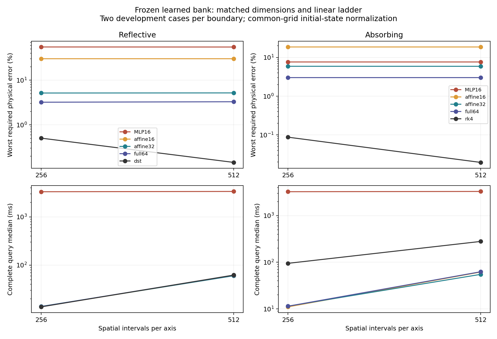
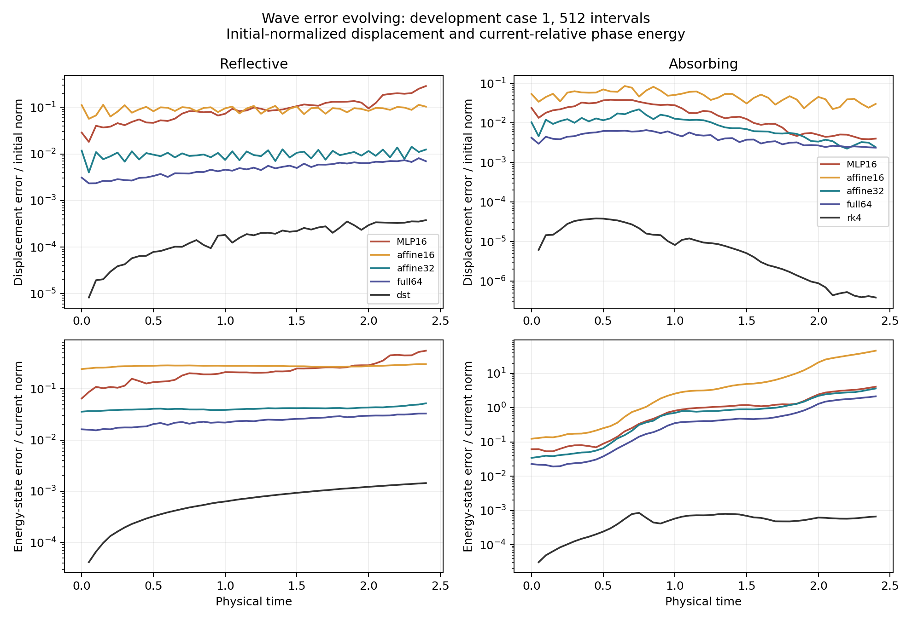

# Matched-dimensional fresh-wave compression and dynamics

This generated report covers the completed bounded wave dynamics pilot. Numbers are provisional development evidence on the declared cases; the independent final cohort remains sealed.

Source `a0c4d0a7d7b59b05615846e61df0499ef5de4f62`, GPU job `3353136`, device `NVIDIA A100 80GB PCIe`. Native result hash `e6ffda759faf5bf7e468e789f068b435b4a3e3f7ed6c01b9653f7c8cbac18063`. All rows come from the audited native JSON.

The frozen MLP16 and saved common-affine16 have equal displacement and phase dimensions. Affine32 and full64 are larger linear controls inside the same learned neural bank. No spatial or head weight is retrained, and the family and validation draws are unchanged. The full-bank control is not an equal-dimensional nonlinear comparison.

All queries consume full host displacement and velocity fields plus wave speed, and return both dense fields at every requested time. Input projection/fitting, speed-dependent augmented linear generator and exponential, evolution, decoding and host transfer are charged. Mesh-only bank assembly and training-only PCA construction are offline.

| Boundary | Intervals | Method | Step / CFL | Query median ms | Error median | Error worst | Raw FOM/method | Cases over 5% |
|---|---:|---|---:|---:|---:|---:|---:|---:|
| dirichlet | 256 | rom | 0.0025 | 3334.92487 | 0.461654496 | 0.553670782 | 0.00408950761 | 2 |
| dirichlet | 256 | rom | 0.00125 | 6642.73346 | 0.461653908 | 0.553670185 | 0.00205309906 | 2 |
| dirichlet | 256 | affine16 | 0 | 13.8044755 | 0.263319648 | 0.302046394 | 0.988611437 | 2 |
| dirichlet | 256 | affine32 | 0 | 13.9311475 | 0.043225567 | 0.0515792703 | 0.979004677 | 1 |
| dirichlet | 256 | full64 | 0 | 13.8163755 | 0.0305055764 | 0.0321260298 | 0.988074215 | 0 |
| dirichlet | 256 | dst | 0 | 13.638379 | 0.00446922297 | 0.00504741643 | 1 | 0 |
| dirichlet | 512 | rom | 0.0025 | 3380.99124 | 0.460137104 | 0.552043386 | 0.0184357184 | 2 |
| dirichlet | 512 | rom | 0.00125 | 6679.97855 | 0.460136515 | 0.552042787 | 0.00933099954 | 2 |
| dirichlet | 512 | affine16 | 0 | 60.6830765 | 0.263324292 | 0.302048959 | 1.02717218 | 2 |
| dirichlet | 512 | affine32 | 0 | 60.314674 | 0.0433949076 | 0.0518880924 | 1.03347987 | 1 |
| dirichlet | 512 | full64 | 0 | 61.9177956 | 0.031116257 | 0.0328962054 | 1.00670988 | 0 |
| dirichlet | 512 | dst | 0 | 62.33081 | 0.00127173905 | 0.00144462138 | 1 | 0 |
| absorbing | 256 | rom | 0.0025 | 3257.96117 | 0.0757633877 | 0.076553518 | 0.02908946 | 2 |
| absorbing | 256 | rom | 0.00125 | 6490.76951 | 0.0757633728 | 0.0765535102 | 0.0146014838 | 2 |
| absorbing | 256 | affine16 | 0 | 11.0369271 | 0.16825796 | 0.186755154 | 8.58446835 | 2 |
| absorbing | 256 | affine32 | 0 | 11.451179 | 0.0563624165 | 0.0592365678 | 8.27357709 | 2 |
| absorbing | 256 | full64 | 0 | 11.407737 | 0.0284769934 | 0.030205908 | 8.30624875 | 0 |
| absorbing | 256 | rk4 | 0.45 | 94.7871995 | 0.000805023919 | 0.000874813996 | 1 | 0 |
| absorbing | 256 | rk4 | 0.225 | 180.347308 | 0.000804492374 | 0.000874222348 | 0.525519837 | 0 |
| absorbing | 512 | rom | 0.0025 | 3300.85134 | 0.0757294592 | 0.0765434652 | 0.0846689546 | 2 |
| absorbing | 512 | rom | 0.00125 | 6518.92035 | 0.0757294446 | 0.0765434575 | 0.0428738688 | 2 |
| absorbing | 512 | affine16 | 0 | 61.6480535 | 0.168166927 | 0.186664297 | 4.53480719 | 2 |
| absorbing | 512 | affine32 | 0 | 54.9658725 | 0.0562761817 | 0.0591274722 | 5.13761569 | 2 |
| absorbing | 512 | full64 | 0 | 62.5465 | 0.0284687028 | 0.0302014316 | 4.46803487 | 0 |
| absorbing | 512 | rk4 | 0.45 | 279.529536 | 0.000178887394 | 0.000195075097 | 1 | 0 |
| absorbing | 512 | rk4 | 0.225 | 508.737818 | 0.000178792288 | 0.000194967941 | 0.54892309 | 0 |

The matched comparison has boundary-dependent ordering; the larger linear ladder separates compression from the nonlinear head behavior.

At the finer mesh, `dirichlet` worst required errors are MLP16 `0.552043386`, affine16 `0.302048959`, affine32 `0.0518880924` and full64 `0.0328962054`. The equal-dimensional control improves on the frozen nonlinear rollout for this boundary.

At the finer mesh, `absorbing` worst required errors are MLP16 `0.0765434652`, affine16 `0.186664297`, affine32 `0.0591274722` and full64 `0.0302014316`. The equal-dimensional control is worse than the frozen nonlinear rollout for this boundary.

A better snapshot fit alone does not ensure accurate autonomous evolution. Conversely, failure of one linear model at a given dimension does not establish that every nonlinear manifold of that dimension must fail. This experiment identifies a strong larger-dimensional linear control, not a successful retrained nonlinear model.

Errors are common-observation-grid time maxima of the required displacement, velocity and phase-energy state norms. Displacement is divided by initial displacement L2; velocity and energy-state are divided by $\sqrt{2E(0)}$. The table takes medians across case timing medians; paired ratios are the median of per-case FOM/method timing ratios. A ratio above one means faster than the listed FOM, but is not equal-accuracy certification. Reflective FOM is exact discrete DST evolution; absorbing FOM uses the declared primary CFL. Both solve at the requested mesh. Coarser FOM solves with charged output interpolation are not swept in this diagnostic, so these ratios do not establish the fastest FOM cost at a target accuracy.

| Boundary | Training field hashes identical | Saved PCA projector defect | Saved center defect | Training construction seconds |
|---|---|---:|---:|---:|
| dirichlet | True | 2.02069171e-14 | 3.30098617e-17 | 21.7810617 |
| absorbing | True | 1.35158913e-14 | 3.21253849e-17 | 40.5050642 |

Original training-only displacement coefficients use their original centering and standard-deviation convention. The saved affine initialization is retained exactly; covariance, basis, singular values, coefficient arrays, training membership and hashes are archived. The added dimension ladder is only labeled the same construction when the saved projector and center agree. Training-generation seconds include compilation and are not paired GPU training-speed measurements.

| Boundary | Intervals | Case | Head | Snapshot displacement | Tangent velocity | Snapshot energy state | Normal force absolute | Zero-field norm | Nonstationary selected fits |
|---|---:|---:|---|---:|---:|---:|---:|---:|---:|
| dirichlet | 256 | 0 | mlp16 | 0.0196929154 | 0.0752699831 | 0.0886546268 | 3.47932587 | 0.00266658496 | 0 |
| dirichlet | 256 | 0 | affine16 | 0.0796947539 | 0.171074421 | 0.22118786 | 0.462305575 | 5.56306913e-05 | 0 |
| dirichlet | 256 | 0 | affine32 | 0.00963593506 | 0.0277093772 | 0.0346718752 | 0.106550148 | 1.31268205e-05 | 0 |
| dirichlet | 256 | 0 | full64 | 0.0027945353 | 0.0082316592 | 0.0182711545 | 0 | 0 | 0 |
| dirichlet | 256 | 1 | mlp16 | 0.0614245386 | 0.123514669 | 0.178505309 | 5.66733762 | 0.00266658496 | 0 |
| dirichlet | 256 | 1 | affine16 | 0.111426556 | 0.195360539 | 0.299813019 | 0.586193121 | 5.56306913e-05 | 0 |
| dirichlet | 256 | 1 | affine32 | 0.0117415446 | 0.0355958845 | 0.049254976 | 0.152594871 | 1.31268205e-05 | 0 |
| dirichlet | 256 | 1 | full64 | 0.00308965245 | 0.011650198 | 0.0192460095 | 0 | 0 | 0 |
| dirichlet | 512 | 0 | mlp16 | 0.0196591031 | 0.0752659143 | 0.0887348578 | 3.46629113 | 0.00266658496 | 0 |
| dirichlet | 512 | 0 | affine16 | 0.0796947536 | 0.171295585 | 0.221222178 | 0.462549145 | 5.56306912e-05 | 0 |
| dirichlet | 512 | 0 | affine32 | 0.00963593628 | 0.0277300015 | 0.034686604 | 0.10663944 | 1.31268205e-05 | 0 |
| dirichlet | 512 | 0 | full64 | 0.00279453905 | 0.00821092153 | 0.0182926693 | 0 | 0 | 0 |
| dirichlet | 512 | 1 | mlp16 | 0.0615080098 | 0.12327291 | 0.178563402 | 5.65429211 | 0.00266658496 | 0 |
| dirichlet | 512 | 1 | affine16 | 0.111426555 | 0.196035058 | 0.299878538 | 0.586528135 | 5.56306912e-05 | 0 |
| dirichlet | 512 | 1 | affine32 | 0.011741545 | 0.0353842312 | 0.0493593855 | 0.152599559 | 1.31268205e-05 | 0 |
| dirichlet | 512 | 1 | full64 | 0.0030896538 | 0.0116670465 | 0.0192443165 | 0 | 0 | 0 |
| absorbing | 256 | 0 | mlp16 | 0.0180183126 | 0.0276223267 | 0.0536874563 | 1.15225745 | 0.000310591504 | 0 |
| absorbing | 256 | 0 | affine16 | 0.0328336421 | 0.0592179841 | 0.0965257681 | 0.876448739 | 0.000628253428 | 0 |
| absorbing | 256 | 0 | affine32 | 0.00878832148 | 0.0201995333 | 0.0355819449 | 1.15057029 | 9.06771639e-05 | 0 |
| absorbing | 256 | 0 | full64 | 0.00339792429 | 0.00690925513 | 0.0228836894 | 0 | 0 | 0 |
| absorbing | 256 | 1 | mlp16 | 0.0240275332 | 0.02488878 | 0.0615909861 | 2.74574144 | 0.000310591504 | 0 |
| absorbing | 256 | 1 | affine16 | 0.0542094646 | 0.0909065445 | 0.124365172 | 3.55104619 | 0.000628253428 | 0 |
| absorbing | 256 | 1 | affine32 | 0.0131313717 | 0.0163621822 | 0.0486697197 | 1.26385934 | 9.06771639e-05 | 0 |
| absorbing | 256 | 1 | full64 | 0.00422979081 | 0.00917555944 | 0.0281554977 | 0 | 0 | 0 |
| absorbing | 512 | 0 | mlp16 | 0.0180092821 | 0.0275762893 | 0.0536746794 | 1.15191186 | 0.000310575142 | 0 |
| absorbing | 512 | 0 | affine16 | 0.0328326959 | 0.0592352923 | 0.0965134096 | 0.877257628 | 0.000628148205 | 0 |
| absorbing | 512 | 0 | affine32 | 0.00878737719 | 0.0201715283 | 0.035608706 | 1.15102031 | 9.06622543e-05 | 0 |
| absorbing | 512 | 0 | full64 | 0.00339520762 | 0.00691220975 | 0.0229297124 | 0 | 0 | 0 |
| absorbing | 512 | 1 | mlp16 | 0.024024695 | 0.024860293 | 0.0616073659 | 2.74723316 | 0.000310575142 | 0 |
| absorbing | 512 | 1 | affine16 | 0.0542081954 | 0.0908305329 | 0.124378555 | 3.55464735 | 0.000628148205 | 0 |
| absorbing | 512 | 1 | affine32 | 0.0131133919 | 0.0163428991 | 0.0486631198 | 1.26238667 | 9.06622543e-05 | 0 |
| absorbing | 512 | 1 | full64 | 0.00422754097 | 0.0091600776 | 0.0281777326 | 0 | 0 | 0 |

Snapshot/tangent/normal-force diagnostics are restricted to times `[0.0, 0.6000000000000001, 1.2000000000000002, 1.8, 2.4000000000000004]`. MLP fitting uses the same eight starts at budgets `[400, 800]`; all endpoints, gradients, stationarity, damping and rank ratios are retained. The longer-budget result is selected by the declared uniform rule. Nonstationary fit counts include the separate zero target. These are best-recorded local fits, not global nonlinear optima.

The unrestricted full64 snapshot row isolates the learned-bank projection floor. Normal-force residual is computed inside weak bank coordinates as $(I-QQ^T)(-Ka-Db-h^{\prime\prime}[w,w])$. Absolute norms are shown; fixed scaled norms and their denominator $\|u(0)\|/T^2$ are saved in the JSON. It measures local force compatibility, not accumulated trajectory error or proof of a causal mechanism. Zero-field norm is the best-recorded mass norm of a fitted zero displacement. A nonzero fit is evidence about that tested image and optimizer; it does not prove the source of absorbing late-time error.

| Boundary | Intervals | Method | Case | Final current-relative displacement | Final current-relative energy state | Final absolute energy error | Final truth energy-state norm |
|---|---:|---|---:|---:|---:|---:|---:|
| absorbing | 256 | rom | 0 | 2.27031864 | 2.92960125 | 0.010536441 | 0.00359654441 |
| absorbing | 256 | rom | 1 | 3.1256958 | 4.10823084 | 0.00878873415 | 0.002139299 |
| absorbing | 256 | affine16 | 0 | 15.278704 | 21.4520487 | 0.0771532457 | 0.00359654441 |
| absorbing | 256 | affine16 | 1 | 23.5966864 | 46.235469 | 0.0989114929 | 0.002139299 |
| absorbing | 256 | affine32 | 0 | 1.24476172 | 2.69664158 | 0.00969859118 | 0.00359654441 |
| absorbing | 256 | affine32 | 1 | 1.89822092 | 3.65028193 | 0.00780904449 | 0.002139299 |
| absorbing | 256 | full64 | 0 | 0.679655125 | 1.33123845 | 0.00478785819 | 0.00359654441 |
| absorbing | 256 | full64 | 1 | 1.85077464 | 2.15650189 | 0.00461340234 | 0.002139299 |
| absorbing | 256 | rk4 | 0 | 0.00122299498 | 0.00237606499 | 8.54562326e-06 | 0.00359654441 |
| absorbing | 256 | rk4 | 1 | 0.00150936925 | 0.00336150979 | 7.19127454e-06 | 0.002139299 |
| absorbing | 256 | rk4 | 0 | 0.00122297129 | 0.00238443124 | 8.57571284e-06 | 0.00359654441 |
| absorbing | 256 | rk4 | 1 | 0.00150934023 | 0.00337688275 | 7.2241619e-06 | 0.002139299 |
| absorbing | 512 | rom | 0 | 2.26878835 | 2.92808132 | 0.0105309745 | 0.00359654441 |
| absorbing | 512 | rom | 1 | 3.12595398 | 4.10704502 | 0.00878619732 | 0.002139299 |
| absorbing | 512 | affine16 | 0 | 15.268093 | 21.4504186 | 0.0771473831 | 0.00359654441 |
| absorbing | 512 | affine16 | 1 | 23.6133533 | 46.2361333 | 0.0989129139 | 0.002139299 |
| absorbing | 512 | affine32 | 0 | 1.24358833 | 2.69765307 | 0.00970222907 | 0.00359654441 |
| absorbing | 512 | affine32 | 1 | 1.89813513 | 3.65007672 | 0.00780860549 | 0.002139299 |
| absorbing | 512 | full64 | 0 | 0.679119591 | 1.32914903 | 0.0047803435 | 0.00359654441 |
| absorbing | 512 | full64 | 1 | 1.85271075 | 2.15488275 | 0.00460993852 | 0.002139299 |
| absorbing | 512 | rk4 | 0 | 0.00024422595 | 0.000472582013 | 1.6996622e-06 | 0.00359654441 |
| absorbing | 512 | rk4 | 1 | 0.000301282761 | 0.000668417755 | 1.42994544e-06 | 0.002139299 |
| absorbing | 512 | rk4 | 0 | 0.00024422423 | 0.000472589118 | 1.69968775e-06 | 0.00359654441 |
| absorbing | 512 | rk4 | 1 | 0.000301280245 | 0.00066841917 | 1.42994846e-06 | 0.002139299 |

Fixed initial-state normalization and current-relative accuracy answer different questions as the absorbing field decays. Absolute errors, truth norms and vanishing flags remain available for every observation. No small initial-normalized error is described as current-relative accuracy.

All `8` nonlinear time-step comparisons pass: `True`; maximum required difference `1.04106986e-06`. Each first-repetition affine control is checked against an independent direct-time SciPy matrix exponential. Nonzero affine offset forcing is retained; the small-system controls also verify the zero-nonlinearity manifold equation and coordinate-gauge invariance.

Native CPU audit reconstructs common-grid errors for `156` timed invocations, maximum metric difference `0`. It also reconstructs full-grid ROM fields from saved banks/coefficients and scores them against retained full-grid references, maximum native-grid metric difference `0`. It independently differentiates the MLP in NumPy and checks physical velocities, curvature and normal forces. The saved reference trajectories are not independently regenerated by this audit; finer-grid FOM metrics for nonreference CFLs cannot be reconstructed from their common fields and remain outside its fine-grid scope.

Reference self-differences and absorbing contraction estimates are empirical. Proven continuum uncertainty bounds remain unspecified. This small development experiment does not open final data, isolate all training effects, compare retrained nonlinear dimensions or establish a paper-wide cost-to-tolerance conclusion.

Error-evolution plots omit values at or below $10^{-12}$ on the logarithmic axis; all raw values remain in the JSON.

## Plain-language glossary

- **Intervals / common grid:** spatial cells per axis / the shared observation mesh used to compare physical errors across meshes.
- **Bank / head / frozen:** learned spatial features / map from reduced coordinates to feature coefficients / unchanged network weights.
- **MLP / affine / full64:** nonlinear multilayer coefficient map / linear coefficient map plus an offset / all dimensions of the learned spatial span.
- **Configuration / phase / snapshot / tangent:** displacement coordinates / displacement and velocity coordinates / a field at one time / locally representable velocity directions.
- **PCA / covariance / projector:** principal training-coefficient directions / their second-order variation matrix / map into their span.
- **Mass / stiffness / damping / offset forcing:** physical inner product / restoring operator / energy-loss operator / constant force required by a nonzero affine displacement offset.
- **Weak / normal force / curvature:** projected spatial equations / acceleration outside the tangent span / acceleration caused by bending of the coefficient map.
- **Stationary / rank / budget / multistart:** locally small fitting gradient / independent local directions / maximum fitting iterations / repeated fitting from predetermined starting points.
- **DST / RK4 / CFL / matrix exponential:** sine transform / fourth-order time integration / time-step-to-grid ratio / direct linear-system propagation.
- **L2 / energy state / initial-normalized / current-relative:** mass-weighted field norm / velocity plus gradient state norm / divided by a fixed initial scale / divided by the current truth norm.
- **Complete query / repetition / median / outlier:** supplied input through requested host output / repeated timing of the same physical case / central sorted value / case exceeding a declared error target.
- **Reference / empirical / final cohort:** comparison solution / supported by observed refinement without a rigorous bound / independent cases reserved for later confirmation.
- **Audit / hash / provenance:** independent artifact check / content fingerprint / recorded source, parameters, device and job identity.
