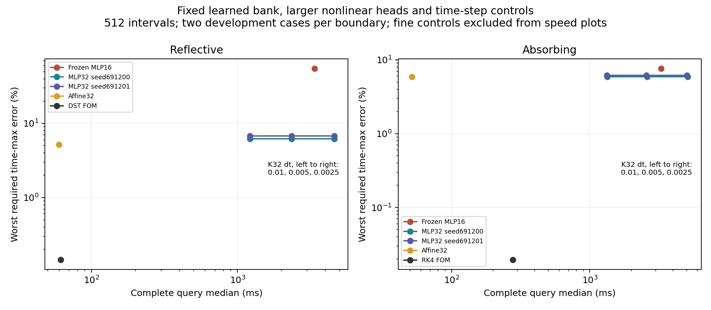
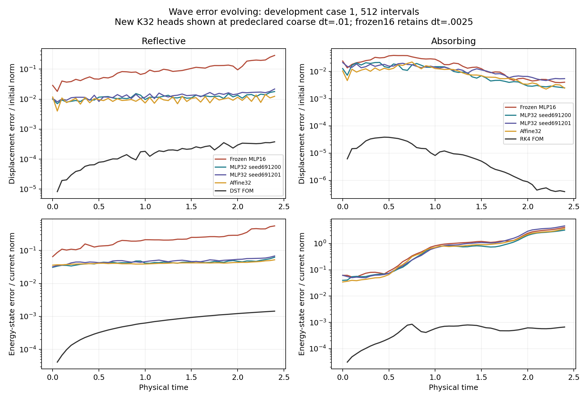

# Larger nonlinear wave heads and time-step controls

This generated report covers the completed fixed-bank larger-head development pilot. Numbers are provisional on the declared original development inputs; the final cohort remains unopened.

Scientific source `0351e9865ac4559c9e9dbd7bfe4b8a52596e143c`, job `3353701`, device `NVIDIA A100 80GB PCIe`. Native result SHA-256 `b76064e45af70de38b75f1f3f7e383982017c82effefbfd04ad7d8ac75ca4851`.

Both new heads use the original reconstruction-only training protocol and cohort, with the bank frozen. Their common affine32 initializer is the matched linear control. The unchanged MLP16 is retained at its original primary time step. The fixed weak bank has more equations than latent coordinates, with the explicitly changed overdetermination ratio recorded in the configuration.

| Boundary | Endpoint | Head coordinates | Seed | Updates | Training seconds | Final recorded training objective |
|---|---|---:|---:|---:|---:|---:|
| dirichlet | new_mlp32_seed691200 | 32 | 691200 | 10000 | 7.78984229 | 0.000107625524 |
| dirichlet | new_mlp32_seed691201 | 32 | 691201 | 10000 | 4.19474422 | 0.000104479665 |
| absorbing | new_mlp32_seed691200 | 32 | 691200 | 10000 | 5.40388737 | 8.60272292e-05 |
| absorbing | new_mlp32_seed691201 | 32 | 691201 | 10000 | 4.46704833 | 0.000192271989 |

At `512` intervals for `dirichlet`, the two larger heads at the coarsest repeated step have worst required errors `6.20295%–6.77418%`, versus `55.2043%` for the frozen smaller head and `5.18881%` for affine32. At the unchanged primary step, the larger heads cost `4.60388–4.6052` seconds versus `3.37382` seconds for the smaller head. The faster larger-head rows use a larger time step; increasing dimension alone does not improve speed.

At `512` intervals for `absorbing`, the two larger heads at the coarsest repeated step have worst required errors `5.91321%–6.18112%`, versus `7.65435%` for the frozen smaller head and `5.91275%` for affine32. At the unchanged primary step, the larger heads cost `5.05013–5.09442` seconds versus `3.28812` seconds for the smaller head. The faster larger-head rows use a larger time step; increasing dimension alone does not improve speed.

No nonlinear configuration is faster than the same-job requested-mesh FOM. The two larger-head seeds also fail the declared all-case accuracy targets below their reported worst errors. These results support an accuracy improvement over the smaller head, not an established nonlinear advantage over the matched affine model or FOM.

Training times include compilation and host work and are not paired warm-GPU training-speed measurements. Both fixed endpoints are reported. No velocity, tangent, curvature, force, energy, rollout or validation objective is added. Original seed data are regenerated on the cluster; saved prior coefficients are lineage checks only.

| Boundary | Intervals | Method | dt / CFL | Query median ms | Time-max error median | Time-max error worst | Raw same-grid FOM/method | Failed / nonstationary / unresolved cases |
|---|---:|---|---:|---:|---:|---:|---:|---|
| dirichlet | 256 | frozen_mlp16_seed691200 | 0.0025 | 3331.1491 | 0.461654496 | 0.553670782 | 0.0041439243 | 0 / 0 / 0 |
| dirichlet | 256 | new_mlp32_seed691200 | 0.01 | 1174.98305 | 0.0525800432 | 0.0618800486 | 0.0117480507 | 0 / 0 / 0 |
| dirichlet | 256 | new_mlp32_seed691200 | 0.005 | 2308.80146 | 0.0525830825 | 0.0618816182 | 0.00597880883 | 0 / 0 / 0 |
| dirichlet | 256 | new_mlp32_seed691200 | 0.0025 | 4578.66724 | 0.0525831715 | 0.0618815596 | 0.00301482584 | 0 / 0 / 0 |
| dirichlet | 256 | new_mlp32_seed691201 | 0.01 | 1176.78381 | 0.0549843568 | 0.0673350053 | 0.0117305401 | 0 / 0 / 0 |
| dirichlet | 256 | new_mlp32_seed691201 | 0.005 | 2311.08806 | 0.0550102209 | 0.0673733499 | 0.00597301397 | 0 / 0 / 0 |
| dirichlet | 256 | new_mlp32_seed691201 | 0.0025 | 4580.89368 | 0.0550117686 | 0.0673756409 | 0.00301341628 | 0 / 0 / 0 |
| dirichlet | 256 | affine32 | 0 | 13.4178636 | 0.043225567 | 0.0515792703 | 1.02872522 | 0 / 0 / 0 |
| dirichlet | 256 | dst | 0 | 13.804001 | 0.00446922297 | 0.00504741643 | 1 | 0 / 0 / 0 |
| dirichlet | 512 | frozen_mlp16_seed691200 | 0.0025 | 3373.82379 | 0.460137104 | 0.552043386 | 0.018253474 | 0 / 0 / 0 |
| dirichlet | 512 | new_mlp32_seed691200 | 0.01 | 1217.24244 | 0.0526874183 | 0.0620294688 | 0.0505928993 | 0 / 0 / 0 |
| dirichlet | 512 | new_mlp32_seed691200 | 0.005 | 2346.72973 | 0.0526975527 | 0.0620430853 | 0.0262424005 | 0 / 0 / 0 |
| dirichlet | 512 | new_mlp32_seed691200 | 0.0025 | 4603.8799 | 0.0526980922 | 0.0620437926 | 0.0133765047 | 0 / 0 / 0 |
| dirichlet | 512 | new_mlp32_seed691201 | 0.01 | 1216.62655 | 0.055302935 | 0.0677418064 | 0.0506185271 | 0 / 0 / 0 |
| dirichlet | 512 | new_mlp32_seed691201 | 0.005 | 2342.18361 | 0.0553371252 | 0.0677911082 | 0.0262934456 | 0 / 0 / 0 |
| dirichlet | 512 | new_mlp32_seed691201 | 0.0025 | 4605.20431 | 0.0553391994 | 0.0677940936 | 0.0133726585 | 0 / 0 / 0 |
| dirichlet | 512 | affine32 | 0 | 59.5703715 | 0.0433949076 | 0.0518880924 | 1.03380062 | 0 / 0 / 0 |
| dirichlet | 512 | dst | 0 | 61.584 | 0.00127173905 | 0.00144462138 | 1 | 0 / 0 / 0 |
| absorbing | 256 | frozen_mlp16_seed691200 | 0.0025 | 3253.17074 | 0.0757633877 | 0.0765535179 | 0.0303764877 | 0 / 0 / 0 |
| absorbing | 256 | new_mlp32_seed691200 | 0.01 | 1300.58868 | 0.0551299181 | 0.0591629861 | 0.0759788849 | 0 / 0 / 0 |
| absorbing | 256 | new_mlp32_seed691200 | 0.005 | 2554.30018 | 0.0551285946 | 0.0591598953 | 0.0386867274 | 0 / 0 / 0 |
| absorbing | 256 | new_mlp32_seed691200 | 0.0025 | 5061.11022 | 0.0551285169 | 0.0591597232 | 0.0195248963 | 0 / 0 / 0 |
| absorbing | 256 | new_mlp32_seed691201 | 0.01 | 1294.01553 | 0.0554927076 | 0.0618106527 | 0.0763650738 | 0 / 0 / 0 |
| absorbing | 256 | new_mlp32_seed691201 | 0.005 | 2535.0598 | 0.0554923454 | 0.0618106527 | 0.0389802819 | 0 / 0 / 0 |
| absorbing | 256 | new_mlp32_seed691201 | 0.0025 | 5019.75621 | 0.0554923217 | 0.0618106527 | 0.0196856719 | 0 / 0 / 0 |
| absorbing | 256 | affine32 | 0 | 15.7821369 | 0.0563624165 | 0.0592365678 | 6.88229541 | 0 / 0 / 0 |
| absorbing | 256 | rk4 | 0.45 | 98.818259 | 0.000805023919 | 0.000874813996 | 1 | 0 / 0 / 0 |
| absorbing | 256 | rk4 | 0.225 | 184.108888 | 0.000804492374 | 0.000874222348 | 0.53703172 | 0 / 0 / 0 |
| absorbing | 512 | frozen_mlp16_seed691200 | 0.0025 | 3288.12294 | 0.0757294592 | 0.0765434652 | 0.0844831318 | 0 / 0 / 0 |
| absorbing | 512 | new_mlp32_seed691200 | 0.01 | 1336.63877 | 0.0551223955 | 0.0591320724 | 0.207855978 | 0 / 0 / 0 |
| absorbing | 512 | new_mlp32_seed691200 | 0.005 | 2589.39325 | 0.055121262 | 0.0591292285 | 0.10728702 | 0 / 0 / 0 |
| absorbing | 512 | new_mlp32_seed691200 | 0.0025 | 5094.41691 | 0.0551211961 | 0.0591290719 | 0.0545307682 | 0 / 0 / 0 |
| absorbing | 512 | new_mlp32_seed691201 | 0.01 | 1328.15156 | 0.0554951549 | 0.0618111736 | 0.20919479 | 0 / 0 / 0 |
| absorbing | 512 | new_mlp32_seed691201 | 0.005 | 2568.87681 | 0.0554948523 | 0.0618111736 | 0.108150433 | 0 / 0 / 0 |
| absorbing | 512 | new_mlp32_seed691201 | 0.0025 | 5050.12627 | 0.0554948322 | 0.0618111736 | 0.0550125603 | 0 / 0 / 0 |
| absorbing | 512 | affine32 | 0 | 51.660837 | 0.0562761817 | 0.0591274722 | 5.48073806 | 0 / 0 / 0 |
| absorbing | 512 | rk4 | 0.45 | 277.789682 | 0.000178887394 | 0.000195075097 | 1 | 0 / 0 / 0 |
| absorbing | 512 | rk4 | 0.225 | 501.370193 | 0.000178792288 | 0.000194967941 | 0.554317948 | 0 / 0 / 0 |

These are medians across case timing medians and medians of per-case FOM/method timing ratios. Physical errors are time maxima on the common observation mesh, taking the maximum of displacement, velocity and phase-energy norms. Displacement is divided by its initial L2 norm; velocity/energy state use $\sqrt{2E(0)}$. The frozen control has no newly measured time-step pair in this panel, which is distinct from a failed refinement test.

All repeated query costs include full host inputs, every cold-fit start, speed-dependent work, evolution, dense requested outputs and host transfer. Linear offset forcing and propagation are charged. The listed FOMs solve at the requested mesh. No cheaper coarse-FOM/interpolation envelope is swept, so raw ratios are not a paper cost-to-tolerance comparison.

| Boundary | Intervals | New head | Adjacent dt pair | Maximum required difference over cases | Failed refinement cases |
|---|---:|---|---|---:|---:|
| dirichlet | 256 | new_mlp32_seed691200 | 0.01 / 0.005 | 0.000301695246 | 0 |
| dirichlet | 256 | new_mlp32_seed691200 | 0.005 / 0.0025 | 1.89423142e-05 | 0 |
| dirichlet | 256 | new_mlp32_seed691200 | 0.0025 / 0.00125 | 1.18676609e-06 | 0 |
| dirichlet | 256 | new_mlp32_seed691201 | 0.01 / 0.005 | 0.000303426709 | 0 |
| dirichlet | 256 | new_mlp32_seed691201 | 0.005 / 0.0025 | 1.90243002e-05 | 0 |
| dirichlet | 256 | new_mlp32_seed691201 | 0.0025 / 0.00125 | 1.19080652e-06 | 0 |
| dirichlet | 512 | new_mlp32_seed691200 | 0.01 / 0.005 | 0.000301890709 | 0 |
| dirichlet | 512 | new_mlp32_seed691200 | 0.005 / 0.0025 | 1.89549633e-05 | 0 |
| dirichlet | 512 | new_mlp32_seed691200 | 0.0025 / 0.00125 | 1.18757313e-06 | 0 |
| dirichlet | 512 | new_mlp32_seed691201 | 0.01 / 0.005 | 0.000303607675 | 0 |
| dirichlet | 512 | new_mlp32_seed691201 | 0.005 / 0.0025 | 1.90356732e-05 | 0 |
| dirichlet | 512 | new_mlp32_seed691201 | 0.0025 / 0.00125 | 1.19152089e-06 | 0 |
| absorbing | 256 | new_mlp32_seed691200 | 0.01 / 0.005 | 4.69819868e-05 | 0 |
| absorbing | 256 | new_mlp32_seed691200 | 0.005 / 0.0025 | 2.90236544e-06 | 0 |
| absorbing | 256 | new_mlp32_seed691200 | 0.0025 / 0.00125 | 1.79906738e-07 | 0 |
| absorbing | 256 | new_mlp32_seed691201 | 0.01 / 0.005 | 4.8618483e-05 | 0 |
| absorbing | 256 | new_mlp32_seed691201 | 0.005 / 0.0025 | 3.01745843e-06 | 0 |
| absorbing | 256 | new_mlp32_seed691201 | 0.0025 / 0.00125 | 1.87649282e-07 | 0 |
| absorbing | 512 | new_mlp32_seed691200 | 0.01 / 0.005 | 4.70034489e-05 | 0 |
| absorbing | 512 | new_mlp32_seed691200 | 0.005 / 0.0025 | 2.90358749e-06 | 0 |
| absorbing | 512 | new_mlp32_seed691200 | 0.0025 / 0.00125 | 1.7998074e-07 | 0 |
| absorbing | 512 | new_mlp32_seed691201 | 0.01 / 0.005 | 4.86414408e-05 | 0 |
| absorbing | 512 | new_mlp32_seed691201 | 0.005 / 0.0025 | 3.01882919e-06 | 0 |
| absorbing | 512 | new_mlp32_seed691201 | 0.0025 / 0.00125 | 1.87733062e-07 | 0 |

The refinement criterion `0.01` is the unchanged original fresh-campaign criterion on fixed initial displacement/phase-energy scales. The fine step is an accuracy-only control with one complete query per endpoint/case. Its full latency is saved in raw JSON, may include uncached compilation, and never enters the timing table, speed selection or reported ratios. No extra repetition is inferred from it.

| Boundary | Intervals | Case | Head | Snapshot displacement | Tangent velocity | Snapshot energy state | Zero-field norm | Selected nonstationary fits |
|---|---:|---:|---|---:|---:|---:|---:|---:|
| dirichlet | 256 | 0 | frozen_mlp16_seed691200 | 0.0196929154 | 0.0752699831 | 0.0886546268 | 0.00266658496 | 0 |
| dirichlet | 256 | 0 | new_mlp32_seed691200 | 0.0140277032 | 0.0220442918 | 0.0372627137 | 0.000368227105 | 0 |
| dirichlet | 256 | 0 | new_mlp32_seed691201 | 0.0114894698 | 0.0244170217 | 0.0369856303 | 0.000297356024 | 0 |
| dirichlet | 256 | 1 | frozen_mlp16_seed691200 | 0.0614245386 | 0.123514669 | 0.178505309 | 0.00266658496 | 0 |
| dirichlet | 256 | 1 | new_mlp32_seed691200 | 0.0148661953 | 0.0364390573 | 0.0550448724 | 0.000368227105 | 0 |
| dirichlet | 256 | 1 | new_mlp32_seed691201 | 0.0148450094 | 0.0380392452 | 0.0559345775 | 0.000297356024 | 0 |
| dirichlet | 512 | 0 | frozen_mlp16_seed691200 | 0.0196591031 | 0.0752659143 | 0.0887348578 | 0.00266658496 | 0 |
| dirichlet | 512 | 0 | new_mlp32_seed691200 | 0.0140277038 | 0.0220608911 | 0.0372755297 | 0.000368227105 | 0 |
| dirichlet | 512 | 0 | new_mlp32_seed691201 | 0.011489471 | 0.024398935 | 0.036999808 | 0.000297356022 | 0 |
| dirichlet | 512 | 1 | frozen_mlp16_seed691200 | 0.0615080098 | 0.12327291 | 0.178563402 | 0.00266658496 | 0 |
| dirichlet | 512 | 1 | new_mlp32_seed691200 | 0.0149025967 | 0.0363935921 | 0.0551126055 | 0.000368227105 | 0 |
| dirichlet | 512 | 1 | new_mlp32_seed691201 | 0.0148833345 | 0.0378896258 | 0.0558869239 | 0.000297356022 | 0 |
| absorbing | 256 | 0 | frozen_mlp16_seed691200 | 0.0180183126 | 0.0276223267 | 0.0536874563 | 0.000310591504 | 0 |
| absorbing | 256 | 0 | new_mlp32_seed691200 | 0.0120141405 | 0.0131835014 | 0.0385175632 | 0.000169978677 | 0 |
| absorbing | 256 | 0 | new_mlp32_seed691201 | 0.0154007775 | 0.0203661533 | 0.0476826257 | 0.000318349945 | 0 |
| absorbing | 256 | 1 | frozen_mlp16_seed691200 | 0.0240275332 | 0.02488878 | 0.0615909861 | 0.000310591504 | 0 |
| absorbing | 256 | 1 | new_mlp32_seed691200 | 0.012765982 | 0.0147957379 | 0.0398548681 | 0.000169978677 | 0 |
| absorbing | 256 | 1 | new_mlp32_seed691201 | 0.0212785704 | 0.0218194868 | 0.0618106527 | 0.000318349945 | 0 |
| absorbing | 512 | 0 | frozen_mlp16_seed691200 | 0.0180092821 | 0.0275762893 | 0.0536746794 | 0.000310575142 | 0 |
| absorbing | 512 | 0 | new_mlp32_seed691200 | 0.0120126132 | 0.0131819266 | 0.0385335126 | 0.000169955503 | 0 |
| absorbing | 512 | 0 | new_mlp32_seed691201 | 0.0153998133 | 0.0203583872 | 0.0476998953 | 0.000318338311 | 0 |
| absorbing | 512 | 1 | frozen_mlp16_seed691200 | 0.024024695 | 0.024860293 | 0.0616073659 | 0.000310575142 | 0 |
| absorbing | 512 | 1 | new_mlp32_seed691200 | 0.0127643244 | 0.0147856392 | 0.0398714675 | 0.000169955503 | 0 |
| absorbing | 512 | 1 | new_mlp32_seed691201 | 0.0212776166 | 0.0217909841 | 0.0618309259 | 0.000318338311 | 0 |

Snapshot diagnostics use only the declared indices `[0, 12, 24, 36, 48]`. Every head receives the same eight-start rule at budgets `[400, 800]`, using its own training-code library. All endpoints, gradients, stationarity, rank and budget changes are retained. These are local best-recorded fits, not global optima. Truth-only fits never initialize a measured query. Weak normal force uses the fixed scale $\|u(0)\|/T^2$ and is diagnostic, not a trajectory-error or causal certificate.

| Absorbing intervals | Method | Step | Final current-relative energy error range |
|---|---|---:|---:|
| 256 | frozen_mlp16_seed691200 | 0.0025 | 2.92960126–4.10823084 |
| 256 | new_mlp32_seed691200 | 0.01 | 2.93173218–3.23015248 |
| 256 | new_mlp32_seed691200 | 0.005 | 2.93150004–3.2302798 |
| 256 | new_mlp32_seed691200 | 0.0025 | 2.9314809–3.23027707 |
| 256 | new_mlp32_seed691201 | 0.01 | 3.12482938–4.67106886 |
| 256 | new_mlp32_seed691201 | 0.005 | 3.12462506–4.67079911 |
| 256 | new_mlp32_seed691201 | 0.0025 | 3.12461131–4.67077177 |
| 256 | affine32 | 0 | 2.69664158–3.65028193 |
| 512 | frozen_mlp16_seed691200 | 0.0025 | 2.92808132–4.10704502 |
| 512 | new_mlp32_seed691200 | 0.01 | 2.92708691–3.22814115 |
| 512 | new_mlp32_seed691200 | 0.005 | 2.92685487–3.22826849 |
| 512 | new_mlp32_seed691200 | 0.0025 | 2.92683574–3.22826576 |
| 512 | new_mlp32_seed691201 | 0.01 | 3.12150754–4.66729224 |
| 512 | new_mlp32_seed691201 | 0.005 | 3.121304–4.66702278 |
| 512 | new_mlp32_seed691201 | 0.0025 | 3.12129031–4.66699547 |
| 512 | affine32 | 0 | 2.69765307–3.65007672 |

Current-relative errors, absolute errors, current truth norms and vanishing flags remain visible as the absorber decays. A small error relative to the initial state does not establish accurate prediction relative to the remaining field.

A separate [archived absorbing-wave moment diagnostic](../../dynamics02/analysis/ABSORBING-MOMENT.md) distinguishes initial fitting error in the outgoing-wave invariant from subsequent drift. It establishes a missing discrete invariance property in the learned bank, without showing that this defect alone causes the field errors. Neither constant-mode nor initial-moment corrections are tested in this larger-head panel.

Independent CPU audit checks `228` repeated comparison calls and `16` ineligible fine controls, with maximum common-grid metric discrepancy `0`. Full-grid ROM fields are reconstructed from bank/coefficient states and checked against retained full-grid references, maximum metric discrepancy `0`. Checkpoint/source/cohort, training initialization/objective, coordinate-bank, physical-velocity, curvature, normal-force, fitting and affine-generator checks are included. Failed trajectories remain recorded and do not become eligible winners.

The audit reuses preserved reference trajectories; fine-grid timed FOM fields at nonreference CFLs remain outside its full-grid reconstruction scope. Physical-reference self-differences are empirical and rigorous bounds remain unspecified. Any within-job time-step selection is exploratory development selection, with no independent-cohort confirmation.

Error-evolution plots omit values at or below $10^{-12}$ on logarithmic axes; the unmodified values remain in the raw JSON.

## Plain-language glossary

- **Bank / head / frozen:** learned spatial functions / reduced-coordinate coefficient map / unchanged model weights.
- **Configuration / phase / weak equations:** displacement coordinates / displacement and velocity coordinates / spatially projected equations.
- **MLP / affine / PCA / endpoint:** nonlinear multilayer head / linear map plus an offset / principal training-coefficient directions / fixed trained model.
- **Reconstruction / tangent / normal force / curvature:** snapshot fit / representable local velocity / force outside its tangent span / acceleration due to decoder bending.
- **Code / seed / stationary / budget / rank:** training coordinates / recorded random generator state / local fitting convergence / maximum iterations / independent local directions.
- **dt / CFL / DST / RK4:** time step / time-step-to-grid ratio / sine-transform propagation / fourth-order integration.
- **Common grid / initial-normalized / current-relative / energy state:** shared physical observation mesh / fixed initial scale / current truth norm / displacement-gradient plus velocity norm.
- **Complete query / repetition / median / paired ratio:** supplied input to requested host output / timing repeat of one case / central value / same-case FOM time divided by model time.
- **Accuracy-only / unresolved / eligible:** retained control excluded from speed comparison / failed time-refinement check / permitted to enter a declared comparison.
- **Reference / empirical / final cohort / provenance:** comparison solution / supported by observed refinement / unopened confirmation inputs / source, data, device and job record.
- **Archive / checksum / audit:** preserved complete output / content fingerprint / independent verification.
