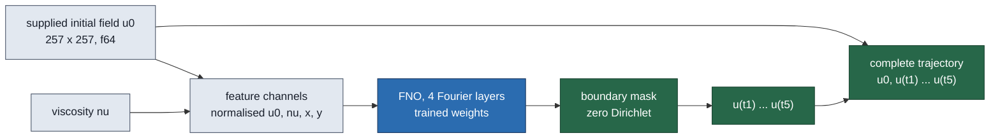

# Burgers FNO baseline on the common dataset

This report covers the FNO baseline trained on the Burgers common dataset built
by the Burgers lane, evaluated on that lane's 32 held-out validation cases and on
the exact eight cases its ROM/FOM diagnosis was graded on, and timed for complete
queries inside the same allocation. **The numbers are final for these jobs and
provisional as evidence about neural operators on this problem:** one training
seed, one mesh, one Gaussian continuum family, and a bounded compute budget per
capacity. No speed ratio against the ROM or the FOM is stated anywhere here; the
interleaved same-job panel that could produce one has not been run.

Primary job `3710846` on `NVIDIA A100 80GB PCIe` (node `pax105`),
staged from source commit `6fe122e2`,
`jax_backend=gpu`, float64 / complex128 throughout,
`JAX_DEFAULT_MATMUL_PRECISION=highest`.
Accounting: `3710846|ctol_noa_fno_b02|COMPLETED|03:22:35|pax105`.

## What the model is

The operator maps the supplied state and the known physical coefficient to the
whole requested trajectory in one evaluation,

$$\mathcal{G}_\theta : \bigl(u_0,\ \nu\bigr) \;\longmapsto\;
\bigl(u(t_1),\dots,u(t_5)\bigr), \qquad
t_k \in \{0.05,\,0.10,\,0.15,\,0.20,\,0.25\},$$

with the five evolved fields produced as five output channels of a single
Fourier neural operator and the supplied state returned exactly, so the complete
six-time trajectory is $\bigl(u_0,\ \mathcal{G}_\theta(u_0,\nu)\bigr)$.

**This is a direct multi-time output, not an autoregressive rollout.** No
prediction is fed back as an input, so there is no step-to-step error
accumulation to report. The price is that the output times are fixed by
training: the model cannot be queried at an unseen time or continued past
$t=0.25$. Per-time errors are retained regardless, so any growth across the
requested times is visible; they are tabulated below.

Inputs are the sampled initial nodal field, the viscosity broadcast to a channel
and the two coordinate channels. Generation descriptors, case identifiers and
solver-audit sidecars are offline metadata and never enter the model.

## How accuracy is defined

The metric is the Burgers lane's own, so the FNO, the ROM and the FOM are graded
identically:

$$E(\text{case}) \;=\; \max_{k=0,\dots,5}\;
\frac{\bigl\lVert \hat u(t_k) - u^{\mathrm{ref}}(t_k) \bigr\rVert_{2,\;\mathrm{interior}}}
     {\bigl\lVert u^{\mathrm{ref}}(t_0) \bigr\rVert_{2,\;\mathrm{interior}}} .$$

The denominator is fixed at the initial field for every output time
(fixed-initial normalisation) and the maximum runs over the requested times; the
$t_0$ term is identically zero here because the supplied state is returned
bitwise. `check_burgers_error_definition.py` imports the Burgers lane's
`fixed_initial_errors` from
`/home/tahmid/Dev/pod-ae-nmrom/Tunable-NM-ROM-Claude/worktrees/2026-09-14-no-burgers/experiments/neural-operator-burgers/data.py`
(SHA256 `8d491d5ea25b10f67183ddedf469c69ba5fee0ff90061901b664cc096bba5ca7`) and confirms the two
implementations agree to `3.469e-18`
on contract-valid fields — floating-point summation order, not a definitional
difference.

The reference $u^{\mathrm{ref}}$ is the Burgers lane's recorded fine
numerical solution (4096 intervals, $\Delta t = 1.5625\times 10^{-4}$,
restricted to the 256-interval grid). It is an empirically refined numerical
reference, not a continuum error bound.

## Capacities trained

Each capacity received the same wall budget and early stopping decided when to
stop, so epoch counts differ by design: this is an equal-compute comparison, not
an equal-epoch one. The best capacity was then retrained at a lower learning
rate.

| Run | Width | Modes | Learning rate | Real parameters | Epochs run | Best epoch | Training seconds | Truncated by wall budget |
| --- | ---: | ---: | ---: | ---: | ---: | ---: | ---: | --- |
| `fno-large` | 64 | 32 | 0.001 | 17877317 | 692 | 683 | 3003 | yes |
| `fno-medium` | 48 | 24 | 0.001 | 5780213 | 1198 | 1190 | 3004 | yes |
| `fno-refine` | 64 | 32 | 0.0003 | 17877317 | 688 | 685 | 3005 | yes |
| `fno-small` | 32 | 16 | 0.001 | 1193125 | 1741 | 1732 | 3003 | yes |

## Validation accuracy — 32 held-out cases

Recomputed independently from the saved prediction fields with NumPy.

| Run | Mean (%) | Median (%) | p95 (%) | Worst (%) | Cases > 1% | Cases > 2% | Cases > 5% | Upper-Tukey outliers |
| --- | ---: | ---: | ---: | ---: | ---: | ---: | ---: | ---: |
| `fno-large` | 2.2811 | 1.8054 | 5.3819 | 6.3825 | 24 | 14 | 2 | 2 |
| `fno-medium` | 2.3122 | 1.7638 | 5.3254 | 6.0423 | 27 | 15 | 3 | 2 |
| `fno-refine` | 2.3501 | 1.8810 | 5.4449 | 7.1747 | 28 | 15 | 2 | 2 |
| `fno-small` | 2.5968 | 1.9552 | 6.1454 | 7.4812 | 31 | 15 | 3 | 2 |

## Worst error per output time

Worst case in the cohort at each requested time. Any growth here is the
difficulty of the later states, not rollout accumulation — there is no rollout.

| Run | $t=0$ | $t=0.05$ | $t=0.1$ | $t=0.15$ | $t=0.2$ | $t=0.25$ |
| --- | ---: | ---: | ---: | ---: | ---: | ---: |
| `fno-large` | 0.0000 | 5.6506 | 6.1626 | 5.7752 | 5.2998 | 6.3825 |
| `fno-medium` | 0.0000 | 5.4627 | 6.0423 | 5.3075 | 4.8143 | 5.6573 |
| `fno-refine` | 0.0000 | 5.1156 | 6.0213 | 5.6344 | 5.1540 | 7.1747 |
| `fno-small` | 0.0000 | 6.6418 | 7.4812 | 6.8576 | 6.5566 | 6.7261 |

## Same-case comparison with the ROM and the efficient FOM

These are the **same eight cases and the same references** the Burgers lane's
ROM/FOM diagnosis used at 256 intervals: its refined 4096-interval anchors,
restricted to the training grid, with the supplied initial field taken from the
same restriction. The cohort is held out from FNO training by generation seed
(`True`) and by input-field content
(`True`), both re-checked against
the training index.

**Accuracy is comparable across jobs on these cases; timing is not.** Error does
not depend on which GPU ran the job, so the accuracy column below is a genuine
like-for-like comparison. Wall clock does depend on it, which is why no time
appears in this table.

| Method | Kind | Worst (%) | Median (%) | Mean (%) | Cases > 1% | Cases > 2% |
| --- | --- | ---: | ---: | ---: | ---: | ---: |
| `fno-large` | FNO (this lane) | 2.4829 | 1.0494 | 1.3269 | 5 | 2 |
| `fno-medium` | FNO (this lane) | 2.8882 | 1.2195 | 1.4137 | 7 | 1 |
| `fno-refine` | FNO (this lane) | 3.2660 | 1.3448 | 1.6711 | 8 | 2 |
| `fno-small` | FNO (this lane) | 2.9350 | 1.2124 | 1.4958 | 7 | 1 |
| `rom` | ROM (Burgers lane) | 1.8671 | — | — | — | — |
| `same_nt1e-2_dt005` | FOM (Burgers lane) | 0.9978 | — | — | — | — |
| `same_nt1e-4_dt005` | FOM (Burgers lane) | 1.3811 | — | — | — | — |
| `same_nt1e-6_dt005` | FOM (Burgers lane) | 1.3811 | — | — | — | — |
| `same_nt1e-2_dt01` | FOM (Burgers lane) | 1.8642 | — | — | — | — |
| `coarse_half_dt005` | FOM (Burgers lane) | 1.8993 | — | — | — | — |
| `coarse_quarter_dt01` | FOM (Burgers lane) | 3.6398 | — | — | — | — |

## Complete-query timing (this job only)

| Run | Repetitions | Device query, pooled median (ms) | Device query, median of case medians (ms) | Host transfer, pooled median (ms) | Device + host, pooled median (ms) |
| --- | ---: | ---: | ---: | ---: | ---: |
| `fno-large` | 32×30 | 7.315 | 7.315 | 0.239 | 7.555 |
| `fno-medium` | 32×30 | 5.479 | 5.480 | 0.237 | 5.717 |
| `fno-refine` | 32×30 | 7.318 | 7.317 | 0.237 | 7.556 |
| `fno-small` | 32×30 | 3.349 | 3.349 | 0.238 | 3.587 |

Timing protocol, recorded so the later interleaved ROM/FNO/FOM confirmation job
can reproduce it exactly: the timed region starts with the supplied initial
field and the viscosity already resident on the GPU and ends when the complete
six-time trajectory is resident on the GPU; coordinate construction,
normalisation, the forward pass, boundary masking and trajectory assembly are
all inside it, and nothing is precomputed outside it. `torch.cuda.synchronize()`
brackets every repetition, every timed block is preceded by its own
20-query GPU burn-in, host transfer is a
separate timed block with its own burn-in, and every individual repetition is
retained in `timing.npz` — none discarded, and no minimum substituted for a
median.

## The ROM and FOM reference numbers, with their timings

Reproduced from the Burgers lane's diagnosis job (`3702709`) so the eventual
confirmation job has a target. The timings were measured in a **different
allocation on a different GPU instance** and must never be divided by the
timings in the table above.

| Method | Worst fixed-initial error (%) | Median GPU (ms) | Median complete host query (ms) |
| --- | ---: | ---: | ---: |
| `rom` | 1.8671 | 54.631 | 57.552 |
| `same_nt1e-2_dt005` | 0.9978 | 16.664 | 18.759 |
| `same_nt1e-4_dt005` | 1.3811 | 19.061 | 21.060 |
| `same_nt1e-6_dt005` | 1.3811 | 81.567 | 83.903 |
| `same_nt1e-2_dt01` | 1.8642 | 9.297 | 11.172 |
| `coarse_half_dt005` | 1.8993 | 18.535 | 20.639 |
| `coarse_quarter_dt01` | 3.6398 | 13.842 | 15.896 |

## The bounded first screen

Job `3710790` on `NVIDIA A100 80GB PCIe` gave all three capacities an
identical 200-epoch budget. Every capacity was still improving when that budget
ran out, which is why the primary job above switched to an equal wall budget with
early stopping. Its numbers are superseded by the table above and are kept only
to document that decision.

Accounting: `3710790|ctol_noa_fno_b01|COMPLETED|00:46:00|pax007`.

| Run | Mean (%) | Median (%) | p95 (%) | Worst (%) | Cases > 1% | Cases > 2% | Cases > 5% | Upper-Tukey outliers |
| --- | ---: | ---: | ---: | ---: | ---: | ---: | ---: | ---: |
| `fno-large` | 2.5851 | 1.9752 | 5.8420 | 7.6394 | 30 | 15 | 3 | 2 |
| `fno-medium` | 2.7675 | 2.0717 | 6.2529 | 6.7769 | 32 | 16 | 6 | 2 |
| `fno-refine` | 2.9823 | 2.3155 | 6.3158 | 8.9433 | 32 | 19 | 4 | 2 |
| `fno-small` | 3.2520 | 2.5529 | 6.8319 | 8.4553 | 32 | 22 | 7 | 2 |

Its best run `fno-large` reached 7.6394%
worst validation error after 200 epochs.

## What this does and does not establish

- The best FNO run, `fno-large`, reaches a worst validation-case error of 6.3825% and a median of 1.8054% over the 32 held-out validation cases.
- On the eight diagnosis cases, the validation-selected FNO (`fno-large`) reaches 2.4829% worst error, above the ROM's 1.8671% and above the efficient FOM arm `same_nt1e-2_dt005`'s 0.9978%. This is a same-case, same-reference accuracy comparison, and it carries no timing claim. The run is chosen on the validation cases, not on these eight.
- **No speed claim is made.** FNO complete-query timing is reported for this job only. Dividing it by the ROM or FOM medians would be exactly the cross-job ratio this project has already had to retract once; the interleaved same-job panel remains the only admissible route to a speed statement.
- The screen is a single seed, a single mesh (256 intervals), a single Gaussian continuum family and a bounded compute budget. It is not a tuned FNO baseline, and it does not establish a capacity ceiling: a larger budget or a wider search could move these numbers.
- Training here is deliberately **not resumable**. Each run was bounded inside one allocation, and any run marked truncated stopped at its recorded epoch. No run in this report was resumed.
- The dataset supports a Gaussian continuum-family claim only. It is not evidence about arbitrary sampled initial fields.
- The eight-case cohort is small. Its worst-case column is one case, so a single hard case moves it; the per-case arrays are retained in the audit for anyone who wants the distribution.

## Glossary

- **FNO (Fourier neural operator):** a network whose layers multiply the input's
  Fourier coefficients by learned weights, so one trained model applies to a
  whole family of inputs on a grid.
- **Capacity:** how big the network is — its hidden-channel width and the number
  of Fourier modes each layer keeps. `small`, `medium` and `large` are the three
  sizes screened; `refine` is the best size retrained at a lower learning rate.
- **Width / modes:** the two numbers that set capacity: channels carried between
  layers, and Fourier modes retained per axis.
- **Real parameters:** trainable real numbers, counting each complex weight as two.
- **Epoch:** one pass over all 128 training cases. **Best epoch:** the epoch whose
  checkpoint scored best on the validation cases; that checkpoint, not the last
  one, is what is evaluated and timed.
- **Early stopping:** halting when the validation score has not improved for a set
  number of epochs, so a model is not trained past the point of usefulness.
- **Truncated by wall budget:** the run hit its time limit rather than finishing
  its epochs or stopping early on its own.
- **Equal wall budget:** every capacity got the same amount of GPU time rather than
  the same number of epochs, because a bigger network costs more per epoch.
- **Case:** one physical problem — an initial field and a viscosity — with its
  whole reference trajectory.
- **Held-out / validation cases:** 32 cases never used to update weights, used to
  pick the checkpoint and report accuracy. Train and validation cases are disjoint
  by case, by generation seed and by field content.
- **Diagnosis cases:** the eight cases the Burgers lane graded its ROM and FOM on.
  Also never trained on here, which is what makes the same-case comparison valid.
- **Fixed-initial error:** the error measure defined above — field discrepancy
  divided by the size of the *initial* field, so all output times share one
  yardstick.
- **Worst / median / mean / p95:** taken over the per-case numbers, where each case
  has already been reduced to its worst output time.
- **Upper-Tukey outliers:** cases more than 1.5 interquartile ranges above the
  upper quartile — the count says how much a mean is being dragged by a few bad
  cases.
- **Reference:** the fine numerical solution the lane treats as truth. It is an
  empirically refined numerical solution, not an exact one.
- **Restriction:** taking every $n$-th node of a fine grid to land exactly on a
  coarser grid, which is how the fine reference is brought to the training grid.
- **Complete query:** everything charged between handing the model its input and
  having the requested output, with nothing precomputed outside the measurement.
- **Burn-in:** untimed repetitions run first so the GPU clock has already ramped
  when measurement starts; skipping it has manufactured a false crossover in this
  project before.
- **Pooled median:** the median over every (case, repetition) measurement.
  **Median of case medians:** each case is reduced first, then the median is taken
  across cases. Both are given because they answer different questions.
- **Host transfer:** copying the finished result from the GPU back to main memory,
  reported separately because not every consumer needs it.
- **ROM (reduced-order model):** the project's learned small-representation solver.
  **FOM (full-order model):** a conventional solver on the full grid.
- **`same_nt1e-2_dt005`:** the Burgers lane's name for one efficient FOM arm — same
  grid, Newton tolerance $10^{-2}$, time step $0.005$.
- **Autoregressive rollout:** predicting each time by feeding the previous
  prediction back in. Not used here, which is why no rollout error growth is
  reported.
- **Cross-job timing ratio:** dividing a time measured in one Slurm job by a time
  measured in another. Forbidden in this project; different allocations land on
  different hardware instances.
- **f64 / complex128:** double-precision real and complex arithmetic, used
  throughout so that reported errors are not floating-point artefacts.
