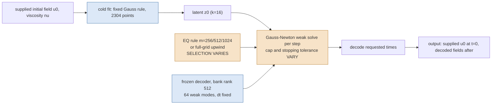

# Burgers fixed-checkpoint tuning: measured physical error against complete query cost

This report measures what the Gauss-Newton iteration cap, the evolution stopping tolerance and the choice of offline-fitted empirical-quadrature rule buy from **one frozen checkpoint**, against the efficient full-order controls timed in the same job on the same GPU. All numbers below are final for this study.

## Verdict

**No.** Across every setting measured on the calibration cases, no tuned configuration of this frozen checkpoint is simultaneously at least as accurate and at least as fast as every efficient full-order control timed in the same job.

The most accurate tuned setting is `m512_converged` at 1.510853% worst error and 70.726856 ms median GPU time. The most accurate full-order control, `same_nt1e-2_dt005`, reaches 0.997803% at 16.519509 ms, and the cheapest, `same_nt1e-2_dt01`, costs 9.052748 ms. The reduced-order model is beaten on both axes at once.

What the three controls do buy is a real **cost** curve at essentially unchanged accuracy, plus a cliff below a threshold of solver effort. Above that threshold the physical error is flat to five or six significant figures while the cost moves by tens of percent, because the error is set by how well the frozen decoder can represent the solution, not by how well the weak equations are solved.

The held-out pass confirms this on 32 cases the shortlist never saw. The best frozen setting `m512_gtol0.001` reaches 6.701206% worst error at 41.641916 ms, and `same_nt1e-4_dt005` beats it on both axes at 6.170513% and 22.389024 ms. The held-out data also corrects a calibration-stage statement about which full-order control is the accuracy bar; see the correction below.

## What was held fixed

```json
{
  "checkpoint_sha256": "18f0266ae6f0454200ec0b7bf94a18cde531feac9d3170d5099adc5d68d6b589",
  "latent_dimension": 16,
  "bank_rank": 512,
  "weak_modes": 64,
  "intervals": 256,
  "dt": 0.005,
  "trust_radius": 0.05256511659045252,
  "initial_fit": {
    "ic_budget": 400,
    "gtol": 1e-06
  },
  "cold_initializer": {
    "rule": "fixed_gauss",
    "axis_points": 48,
    "points": 2304
  },
  "weak_mode_set": "the 64 lowest discrete eigenvalue sine modes"
}
```

Trust radius 0.0525651165905. Weak-mode count $M = 64$, latent dimension $k = 16$, bank rank $R = 512$, mesh $L = 256$ intervals, time step $\Delta t = 0.005$.

## Pipeline



The weak residual minimised at each step is

$$ r(z) = \frac{\Phi^\top \big(D(z) - D(z_{\mathrm{prev}})\big) + \Delta t\,\big(Q^\top a(z) + \nu \Lambda \Phi^\top D(z)\big)}{1 + \Delta t\, \nu \Lambda}, $$

with $\Phi$ the $M$ retained sine modes, $\Lambda$ their discrete eigenvalues, $D(z)$ the decoded field and $a(z)$ the FOM-exact upwind advection.  An EQ arm evaluates $a$ at $m$ fitted nodes with nonnegative weights; the quadrature-free control evaluates it at every interior node.  The stopping tolerance is applied to $\lVert J^\top r\rVert / (\lVert J\rVert\,\lVert r\rVert)$, which is an optimisation measure and not a physical-error bound.

## Offline quadrature rules

| Rule | Requested m | Actual support | NNLS relative fit | Deadline truncated | Fit seconds |
| --- | ---: | ---: | ---: | --- | ---: |
| archived accepted rule | 256 | 256 | 0.0051591 | False | 0.0 |
| decoder-output NNLS refit | 512 | 512 | 0.000465755 | False | 102.2 |
| decoder-output NNLS refit | 1024 | 1024 | 6.08107e-05 | False | 880.3 |
| full grid (quadrature-free control) | n/a | 65025 | n/a (exact) | False | 0.0 |

Independent bounded refit of the accepted $m=256$ rule: support identical `True`, largest absolute weight difference `0.0`.

## Converged sentinel

| Case | Arm | Worst error (%) | Steps at iteration cap | Worst normalized gradient | Gradient stationary |
| --- | --- | ---: | ---: | ---: | --- |
| burgers-calibration-00002 | `m256_native` | 1.658743 | 0 | 9.04e-07 | True |
| burgers-calibration-00002 | `m256_converged` | 1.658743 | 0 | 8.82e-09 | True |
| burgers-calibration-00002 | `m256_ultra` | 1.658743 | 0 | 7.48e-10 | True |
| burgers-calibration-00002 | `full_native` | 1.567388 | 0 | 9.37e-07 | True |
| burgers-calibration-00002 | `full_converged` | 1.567388 | 0 | 2.76e-08 | True |
| burgers-calibration-00002 | `full_ultra` | 1.567388 | 0 | 5.05e-09 | True |
| burgers-calibration-00003 | `m256_native` | 0.691987 | 0 | 8.51e-07 | True |
| burgers-calibration-00003 | `m256_converged` | 0.691987 | 0 | 9.62e-09 | True |
| burgers-calibration-00003 | `m256_ultra` | 0.691987 | 0 | 7.39e-10 | True |
| burgers-calibration-00003 | `full_native` | 0.684547 | 0 | 9.6e-07 | True |
| burgers-calibration-00003 | `full_converged` | 0.684548 | 0 | 9.11e-09 | True |
| burgers-calibration-00003 | `full_ultra` | 0.684548 | 0 | 5.15e-10 | True |

| Case | Stability check | Relative field difference | Declared tolerance |
| --- | --- | ---: | ---: |
| burgers-calibration-00002 | m256: ultra versus converged | 8.85297e-10 | 1e-06 |
| burgers-calibration-00002 | full: ultra versus converged | 1.04603e-09 | 1e-06 |
| burgers-calibration-00003 | m256: ultra versus converged | 6.95428e-09 | 1e-06 |
| burgers-calibration-00003 | full: ultra versus converged | 5.07449e-09 | 1e-06 |

### Sampled versus full-grid supplied-field initial fit (diagnostic only)

| Case | Sampled relative error | Full-grid relative error | Sampled iterations | Full-grid iterations |
| --- | ---: | ---: | ---: | ---: |
| burgers-calibration-00002 | 0.016436 | 0.0164301 | 11 | 11 |
| burgers-calibration-00003 | 0.0101512 | 0.0100919 | 178 | 173 |

The deployed cold initializer is unchanged in every timed arm; this row pair only says how much of the initial-fit error is the sampling rule rather than the decoder.

### Calibration cases: measured error against complete query cost

| Arm | Pass | Quadrature | Cap | Evolution gtol | Median case error (%) | 95th pct case error (%) | Worst error (%) | Cases above 10% | Median GPU (ms) | Median complete query (ms) | Early-stopped invocations | Gradient-stationary invocations | Latency outliers |
| --- | --- | --- | ---: | ---: | ---: | ---: | ---: | ---: | ---: | ---: | ---: | ---: | ---: |
| `same_nt1e-2_dt01` | quadrature | FOM mesh 256, dt 0.01 | - | Newton tol 0.01 | 0.847080 | 1.710434 | 1.864195 | 0 | 9.052748 | 10.617246 | 0 | 0 | 2 |
| `coarse_quarter_dt01` | quadrature | FOM mesh 64, dt 0.01 | - | Newton tol 0.0001 | 2.777721 | 3.564298 | 3.639752 | 0 | 13.494967 | 15.548257 | 0 | 0 | 1 |
| `same_nt1e-2_dt005` | quadrature | FOM mesh 256, dt 0.005 | - | Newton tol 0.01 | 0.413806 | 0.887369 | 0.997803 | 0 | 16.519509 | 18.305014 | 0 | 0 | 3 |
| `coarse_half_dt005` | quadrature | FOM mesh 128, dt 0.005 | - | Newton tol 0.0001 | 1.434636 | 1.865805 | 1.899297 | 0 | 17.588601 | 19.821747 | 0 | 0 | 1 |
| `same_nt1e-4_dt005` | quadrature | FOM mesh 256, dt 0.005 | - | Newton tol 0.0001 | 0.870488 | 1.296014 | 1.381132 | 0 | 18.543491 | 20.341579 | 0 | 0 | 1 |
| `m256_native` | quadrature | m256 (m=256) | 180 | 1e-06 | 0.939970 | 1.589613 | 1.658743 | 0 | 54.176387 | 56.393012 | 0 | 24 | 1 |
| `m512_native` | quadrature | m512 (m=512) | 180 | 1e-06 | 0.942177 | 1.508118 | 1.510853 | 0 | 57.788957 | 59.930177 | 0 | 24 | 1 |
| `m1024_native` | quadrature | m1024 (m=1024) | 180 | 1e-06 | 0.940334 | 1.538089 | 1.556934 | 0 | 63.313999 | 65.883465 | 0 | 24 | 1 |
| `m256_converged` | quadrature | m256 (m=256) | 180 | 1e-08 | 0.939970 | 1.589612 | 1.658743 | 0 | 65.956854 | 68.155141 | 0 | 24 | 1 |
| `m512_converged` | quadrature | m512 (m=512) | 180 | 1e-08 | 0.942177 | 1.508117 | 1.510853 | 0 | 70.726856 | 73.191591 | 0 | 24 | 1 |
| `m1024_converged` | quadrature | m1024 (m=1024) | 180 | 1e-08 | 0.940334 | 1.538089 | 1.556933 | 0 | 76.839364 | 79.336293 | 0 | 24 | 1 |
| `same_nt1e-6_dt005` | quadrature | FOM mesh 256, dt 0.005 | - | Newton tol 1e-06 | 0.872767 | 1.296607 | 1.381082 | 0 | 81.907711 | 84.587124 | 0 | 0 | 1 |
| `full_native` | quadrature | full (m=65025) | 180 | 1e-06 | 0.940624 | 1.544401 | 1.567388 | 0 | 309.817492 | 311.814486 | 0 | 24 | 1 |
| `full_converged` | quadrature | full (m=65025) | 180 | 1e-08 | 0.940624 | 1.544401 | 1.567388 | 0 | 392.165308 | 394.900876 | 0 | 24 | 1 |
| `same_nt1e-2_dt005` | effort | FOM mesh 256, dt 0.005 | - | Newton tol 0.01 | 0.413806 | 0.887369 | 0.997803 | 0 | 18.722449 | 20.829653 | 0 | 0 | 0 |
| `same_nt1e-4_dt005` | effort | FOM mesh 256, dt 0.005 | - | Newton tol 0.0001 | 0.870488 | 1.296014 | 1.381132 | 0 | 21.498545 | 23.312950 | 0 | 0 | 0 |
| `m512_cap2` | effort | m512 (m=512) | 2 | 1e-06 | 58.466971 | 72.878433 | 74.896500 | 8 | 32.733207 | 35.152685 | 24 | 0 | 4 |
| `m512_cap4` | effort | m512 (m=512) | 4 | 1e-06 | 58.466971 | 72.878433 | 74.896500 | 8 | 44.495170 | 46.741079 | 24 | 0 | 4 |
| `m512_gtol0.001` | effort | m512 (m=512) | 180 | 0.001 | 0.941904 | 1.508070 | 1.510865 | 0 | 50.292543 | 52.660222 | 0 | 0 | 4 |
| `m512_cap8` | effort | m512 (m=512) | 8 | 1e-06 | 1.217488 | 3.544100 | 4.442939 | 0 | 59.531328 | 61.962703 | 24 | 0 | 1 |
| `m512_gtol1e-05` | effort | m512 (m=512) | 180 | 1e-05 | 0.942175 | 1.508117 | 1.510853 | 0 | 60.783314 | 63.096100 | 0 | 0 | 4 |
| `m512_gtol1e-06` | effort | m512 (m=512) | 180 | 1e-06 | 0.942177 | 1.508118 | 1.510853 | 0 | 65.185628 | 67.498714 | 0 | 24 | 1 |

Rule selected for the effort screens: **m512**. Criterion: lowest worst-case fixed-initial physical error over the calibration cases at the converged setting; rules within 1% of the best are separated by lower median GPU seconds.

### What the effort knobs actually buy

All rows below use the selected `m512` quadrature rule and were measured in the same pass as the reference `m512_gtol1e-06`, which is the archived native solver configuration on that rule: 1.510853% worst error at 65.185628 ms.

| Setting | Cost change | Worst-error change (percentage points) | Worst error (%) | Early-stopped invocations |
| --- | ---: | ---: | ---: | ---: |
| `m512_gtol0.001` | -22.847% | +0.000012 | 1.510865 | 0 |
| `m512_gtol1e-05` | -6.754% | +0.000000 | 1.510853 | 0 |
| `m512_cap8` | -8.674% | +2.932086 | 4.442939 | 24 |
| `m512_cap4` | -31.741% | +73.385646 | 74.896500 | 24 |
| `m512_cap2` | -49.785% | +73.385646 | 74.896500 | 24 |

Loosening the stopping tolerance is a usable cost control: it moves the cost by tens of percent while the physical error changes in the fifth or sixth significant figure. Starving the iteration cap is not: below a threshold the solve stops making accepted steps at all and the trajectory collapses, and because the fixed initial fit and the decode still have to be paid, the saving is far from proportional to the work removed.

### Does any tuned setting beat the efficient FOM on both axes?

No. On the calibration cases no tuned setting is simultaneously at least as accurate and at least as fast as every efficient full-order control timed in the same job.

Controls compared: `coarse_half_dt005`, `coarse_quarter_dt01`, `same_nt1e-2_dt005`, `same_nt1e-2_dt01`, `same_nt1e-4_dt005`, `same_nt1e-6_dt005`.

### Within-job drift control

The same full-order controls were re-timed in the second pass of the same job on the same GPU. Their accuracy is identical by construction; the timing difference is the drift these measurements carry, and it bounds how finely two arms measured in different passes may be compared.

| Control | Pass 1 median GPU (ms) | Pass 2 median GPU (ms) | Drift | Worst error pass 1 (%) | Worst error pass 2 (%) |
| --- | ---: | ---: | ---: | ---: | ---: |
| `same_nt1e-2_dt005` | 16.519509 | 18.722449 | +13.335% | 0.997803 | 0.997803 |
| `same_nt1e-4_dt005` | 18.543491 | 21.498545 | +15.936% | 1.381132 | 1.381132 |

### Native compression of the supplied field

Every deployable arm returns the supplied initial field exactly. If the decoder's own fit of that field were returned instead, the worst relative initial error over the reported cases would be 1.867068%. That cost is paid inside every query and is reported here rather than hidden in the output.

### Held-out validation cases: frozen shortlist

| Arm | Pass | Quadrature | Cap | Evolution gtol | Median case error (%) | 95th pct case error (%) | Worst error (%) | Cases above 10% | Median GPU (ms) | Median complete query (ms) | Early-stopped invocations | Gradient-stationary invocations | Latency outliers |
| --- | --- | --- | ---: | ---: | ---: | ---: | ---: | ---: | ---: | ---: | ---: | ---: | ---: |
| `same_nt1e-2_dt01` | validation | FOM mesh 256, dt 0.01 | - | Newton tol 0.01 | 1.341303 | 4.145038 | 6.806734 | 0 | 9.910044 | 12.210279 | 0 | 0 | 6 |
| `coarse_quarter_dt01` | validation | FOM mesh 64, dt 0.01 | - | Newton tol 0.0001 | 3.594731 | 10.805216 | 16.094676 | 2 | 13.961922 | 16.169056 | 0 | 0 | 2 |
| `same_nt1e-2_dt005` | validation | FOM mesh 256, dt 0.005 | - | Newton tol 0.01 | 1.135606 | 24.270810 | 35.357022 | 3 | 17.380670 | 19.398844 | 0 | 0 | 1 |
| `coarse_half_dt005` | validation | FOM mesh 128, dt 0.005 | - | Newton tol 0.0001 | 1.850760 | 6.209895 | 9.849329 | 0 | 21.185605 | 23.499694 | 0 | 0 | 8 |
| `same_nt1e-4_dt005` | validation | FOM mesh 256, dt 0.005 | - | Newton tol 0.0001 | 1.233720 | 3.987257 | 6.170513 | 0 | 22.389024 | 24.487508 | 0 | 0 | 10 |
| `m512_cap2` | validation | m512 (m=512) | 2 | 1e-06 | 65.494110 | 85.023878 | 90.324105 | 31 | 28.368548 | 31.055967 | 96 | 0 | 6 |
| `m512_gtol0.001` | validation | m512 (m=512) | 180 | 0.001 | 1.453594 | 5.597954 | 6.701206 | 0 | 41.641916 | 44.679836 | 0 | 0 | 7 |
| `m256_native` | validation | m256 (m=256) | 180 | 1e-06 | 1.473297 | 5.620274 | 7.244774 | 0 | 51.008713 | 53.272908 | 0 | 96 | 4 |
| `m512_converged` | validation | m512 (m=512) | 180 | 1e-08 | 1.453762 | 5.598963 | 6.711730 | 0 | 64.668124 | 67.017914 | 0 | 96 | 1 |
| `same_nt1e-6_dt005` | validation | FOM mesh 256, dt 0.005 | - | Newton tol 1e-06 | 1.233681 | 3.985744 | 6.171972 | 0 | 88.287076 | 90.477352 | 0 | 0 | 4 |

### Held-out verdict

No frozen setting is simultaneously at least as accurate and at least as fast as every efficient full-order control on the held-out cases.

The best tuned setting is `m512_gtol0.001`: worst error 6.701206%, median case error 1.453594%, at 41.641916 ms.

`same_nt1e-4_dt005` beats it on every axis at once: worst error 6.170513%, median case error 1.233720%, at 22.389024 ms, which is 1.86× cheaper than the best tuned setting.

The cheapest full-order control, `same_nt1e-2_dt01`, costs 9.910044 ms, 4.20× less than the best tuned setting, with a lower median case error (1.341303% against 1.453594%) but a slightly higher worst case (6.806734% against 6.701206%), so on the worst-case axis alone it is the one comparison the reduced-order model wins.

#### Correction carried by the held-out data

On the calibration cases `same_nt1e-2_dt005` was the most accurate control at 0.997803%. On the held-out cases the same setting reaches 35.357022% worst error, with 3 of 32 cases above 10%, while its median case error is only 1.135606%. Its loose Newton tolerance is simply not reliable across the wider family, so any statement that named it as *the* accuracy bar is corrected here. The dominance conclusion is unaffected, because other full-order controls beat every tuned setting on both axes on the held-out cases as well.

## Provenance

| Item | Value |
| --- | --- |
| Calibration job | `3711134` on NVIDIA A100 80GB PCIe |
| Calibration source commit | `db48b7a86ee4f38ea9f79751e730a70c841144d0` |
| JAX backend / f64 / precision | `gpu` / `True` / `highest` |
| Checkpoint SHA256 | `18f0266ae6f0454200ec0b7bf94a18cde531feac9d3170d5099adc5d68d6b589` |
| Configuration SHA256 | `a624de02b1e169f3902ab767aff18793dd8a12af49f1a0f51a50e20114f8dff7` |
| Calibration index SHA256 | `418c2bea1045215bde73244362dd8e04111ca23d03316da93d981a88d75b6cca` |
| Validation job | `3712269` on NVIDIA A100 80GB PCIe |
| Validation index SHA256 | `aa876e86d2ac18656914a80c6c082bdf6f6f8a267fc954a3d51b33eb6e168dd6` |
| Repetitions per arm and case | 3 |
| Calibration invocations | 528 |
| Held-out invocations | 960 |

Timing is within one job on one GPU with a GPU burn-in before every timed block; cost and accuracy come from the same invocation; every repetition is retained in the run index. No timing ratio is taken across jobs.

## Glossary

- **Checkpoint**: the exact saved neural network weights. Frozen here; nothing is retrained.
- **Latent dimension $k$**: how many numbers the online solve actually solves for (16).
- **Bank rank $R$**: how many fixed learned spatial patterns the decoder combines (512).
- **Weak modes $M$**: the smooth test functions the PDE residual is projected onto (64). The solve minimises that projected residual, not the pointwise one.
- **EQ / empirical quadrature**: a stored list of $m$ grid points and nonnegative weights that approximate an integral over the whole grid, so the nonlinear term costs $m$ evaluations instead of all 65025. The weights are fitted offline by nonnegative least squares on decoder outputs.
- **$m$**: the number of quadrature points in a rule. The project rule of thumb is $m \approx 4M$.
- **NNLS**: nonnegative least squares, the offline fit that chooses those weights.
- **Full-grid / quadrature-free control**: the same solve with the nonlinear term evaluated at every interior node, so any difference from an EQ arm is quadrature error alone.
- **Cap (iteration budget)**: the maximum Gauss-Newton iterations allowed per time step.
- **Evolution gtol (stopping tolerance)**: the normalized gradient below which a step is declared converged. It measures optimisation progress, never physical accuracy.
- **Early stopped**: the step ran out of iterations instead of meeting a stopping test. Such arms are reported as early stopped and are never counted as stationary solves.
- **Gradient stationary**: every step and the initial fit met the normalized-gradient test.
- **Worst error**: the largest relative field error over all requested output times and all cases in the pass, normalized by the reference initial field norm (the archived convention).
- **Median GPU (ms)**: median device time for one complete query over every case and repetition.
- **Median complete query (ms)**: the same, including host-to-device input and device-to-host output.
- **FOM control**: the ordinary full-order numerical solver at a named tolerance and mesh, timed in the same job. `same_nt1e-2_dt005` means the production mesh, time step 0.005 and Newton tolerance 1e-2; `coarse_half` and `coarse_quarter` solve on half and quarter meshes and interpolate up.
- **Latency outlier**: a repetition above the upper Tukey fence of that arm's timings.
- **Calibration cases**: eight independent development cases used to fit and choose settings.
- **Held-out validation cases**: the 32 common-data cases, untouched until the shortlist was frozen.
- **Sentinel**: a small high-effort run used only to check that tightening the solver further stops changing the answer.

