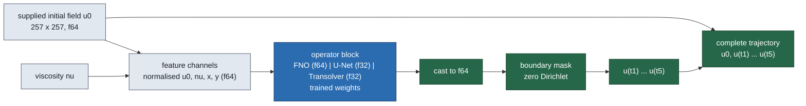

# Second and third neural-operator baselines on the Burgers common dataset: U-Net and Transolver

This report adds a PDEBench-style **U-Net** and a **Transolver** (physics attention) to the
neural-operator comparison on the Burgers common dataset, trained on exactly the data, split,
reference, metric, budget and selection rule the FNO lane used (`no-audit`, job
`3710846`), and scored on the same 32 held-out validation cases and the same eight
ROM/FOM diagnosis cases. **The numbers are final for the jobs listed and provisional as
evidence about neural operators on this problem** (one seed except where a seed control is
shown, one mesh, one Gaussian continuum family, one bounded wall budget per capacity). No
speed ratio against the FNO, the ROM or the FOM is stated anywhere: those were measured in
other jobs.

Jobs: `3780138` (unet01, NVIDIA A100 80GB PCIe, commit `c4f8b045`). Every job printed `jax_backend=gpu` and `torch_backend=cuda`, verified its
staged code against the committed blob and every data file against its recorded
checksum manifest, and ended with `ALL-DONE`. Training/validation index SHA256
`5333584b…` / `468b9e70…`, identical to the FNO job's
(asserted by the audit). Generated 2026-09-17 by `reports/generate_report.py` from the audit
JSONs listed in `summary.json`; no number here is typed.

## Verdict against the pre-registered criteria

- **U-Net**, validation-selected arm `unet-refine` (job `3780138`): mean 1.3523%, median 1.0806%, worst 7.5176% over the 32 validation cases (FNO `fno-large`: 2.2811% / 1.8054% / 6.3825%). Pre-registered V1 (within 1.5× of the FNO on worst and median): **pass**; it is in fact below the FNO on mean, median. On the matched eight cases: worst 1.7110%, median 1.2193% (FNO 2.4829%, ROM 1.8671%, efficient FOM `same_nt1e-2_dt005` 0.9978%). **The selection rule optimises the mean, not the tail:** `unet-medium` has a lower worst validation case (3.9622% vs 7.5176%) at a higher mean (1.4341% vs 1.3523%), and was not selected. Both are in the tables.

The eight-case worst is a single case; the per-case arrays are in the audit JSONs.

## What the models are

All three families share one contract (the FNO lane's): the input is the supplied initial
field, the viscosity broadcast to a channel and the two coordinate channels, all normalised
with the training statistics; the output is the five evolved fields as channels, masked to the
zero-Dirichlet boundary, with the supplied initial state prepended bitwise — a **direct
multi-time output, not an autoregressive rollout**. Only the block between the features and
the mask differs.

$$\mathcal{G}_\theta : (u_0, \nu) \mapsto (u(t_1), \dots, u(t_5)), \qquad t_k \in \{0.05, 0.10, 0.15, 0.20, 0.25\}.$$

- **U-Net**: four-level encoder–decoder, two 3×3 convolutions per level, channels
  `base … 16·base`, 2×2 max-pool down, 2×2 transposed convolution up with skip
  concatenation, GroupNorm(8), GELU; the 257² grid is zero-padded to 272² and cropped back.
- **Transolver**: eight physics-attention layers (8 heads, 64 slices, learned temperature,
  3×3 convolutional projections, pre-norm MLP of ratio 2) on 4×4-patch tokens of the grid
  zero-padded to 260² (4 225 tokens), the paper's unified positional encoding, and a
  per-token MLP decoder unpatched onto the grid.
- **FNO** (parent lane): four Fourier layers, float64/complex128.

The U-Net and Transolver networks run in IEEE float32 with TF32 disabled; features, mask,
trajectory assembly, loss and every reported error are float64, and the float64 precision
control below tests whether the network precision matters.

## How accuracy is defined

The Burgers lane's own metric, identical for every method and recomputed independently with
NumPy from the saved fields:

$$E(\text{case}) = \max_{k=0,\dots,5} \frac{\lVert \hat u(t_k) - u^{\mathrm{ref}}(t_k)\rVert_{2,\mathrm{interior}}}{\lVert u^{\mathrm{ref}}(t_0)\rVert_{2,\mathrm{interior}}}.$$

The reference is the Burgers lane's refined 4096-interval, $\Delta t = 1.5625\times10^{-4}$
numerical solution restricted to the 256-interval grid.

## Protocol (identical to the FNO arm)

AdamW (lr $10^{-3}$, weight decay $10^{-4}$), batch 8, gradient clipping at 1.0,
ReduceLROnPlateau(0.5, patience 20) on the validation mean case-maximum error, early stopping
after 250 epochs without improvement, epoch cap 4000, **3000 s of wall per capacity on one
A100**, checkpoint selected by validation mean case-maximum error, the validation-selected
capacity retrained at lr $3\times10^{-4}$ (`*-refine`), seed 20260914. The Transolver adds a
10-epoch linear warm-up (its one protocol difference). Nothing is selected on the eight-case
cohort. Epoch counts differ by design: equal compute, not equal epochs.

## Capacities trained

| Run | Operator | Capacity | Network dtype | Real parameters | Epochs run | Best epoch | Training s | Budget s | Ended by | Job |
| --- | --- | --- | --- | ---: | ---: | ---: | ---: | ---: | --- | --- |
| `unet-large` | U-Net | base 48 | float32 | 17462021 | 908 | 901 | 3001 | 3000 | wall budget | `3780138` |
| `unet-medium` | U-Net | base 32 | float32 | 7763461 | 1963 | 1925 | 3001 | 3000 | wall budget | `3780138` |
| `unet-refine` | U-Net | base 32 | float32 | 7763461 | 1962 | 1933 | 3002 | 3000 | wall budget | `3780138` |
| `unet-small` | U-Net | base 24 | float32 | 4368389 | 2327 | 2321 | 3001 | 3000 | wall budget | `3780138` |

## Validation accuracy — 32 held-out cases

| Run | Operator | Job | Mean (%) | Median (%) | p95 (%) | Worst (%) | Cases > 1% | Cases > 2% | Cases > 5% |
| --- | --- | --- | ---: | ---: | ---: | ---: | ---: | ---: | ---: |
| `unet-large` | U-Net | `3780138` | 1.7029 | 1.3642 | 3.3313 | 4.2340 | 27 | 10 | 0 |
| `unet-medium` | U-Net | `3780138` | 1.4341 | 1.3169 | 3.4997 | 3.9622 | 25 | 4 | 0 |
| `unet-refine` | U-Net | `3780138` | 1.3523 | 1.0806 | 2.1364 | 7.5176 | 17 | 4 | 1 |
| `unet-small` | U-Net | `3780138` | 1.6047 | 1.3963 | 3.4191 | 5.5937 | 24 | 5 | 1 |
| `fno-large` | FNO (parent lane, other job) | `3710846` | 2.2811 | 1.8054 | 5.3819 | 6.3825 | 24 | 14 | 2 |
| `fno-medium` | FNO (parent lane, other job) | `3710846` | 2.3122 | 1.7638 | 5.3254 | 6.0423 | 27 | 15 | 3 |
| `fno-refine` | FNO (parent lane, other job) | `3710846` | 2.3501 | 1.8810 | 5.4449 | 7.1747 | 28 | 15 | 2 |
| `fno-small` | FNO (parent lane, other job) | `3710846` | 2.5968 | 1.9552 | 6.1454 | 7.4812 | 31 | 15 | 3 |

## Worst error per output time (validation cases)

There is no rollout, so growth across times is the difficulty of later states, not accumulation.

| Run | $t=0$ | $t=0.05$ | $t=0.1$ | $t=0.15$ | $t=0.2$ | $t=0.25$ |
| --- | ---: | ---: | ---: | ---: | ---: | ---: |
| `unet-large` | 0.0000 | 4.2340 | 3.3727 | 3.2084 | 2.7768 | 3.2974 |
| `unet-medium` | 0.0000 | 2.5579 | 3.8988 | 3.1709 | 3.7856 | 3.9622 |
| `unet-refine` | 0.0000 | 5.0759 | 6.7292 | 7.5118 | 7.5176 | 7.2658 |
| `unet-small` | 0.0000 | 3.1658 | 3.9097 | 4.5089 | 5.5937 | 4.8547 |
| `fno-large` (FNO, other job) | 0.0000 | 5.6506 | 6.1626 | 5.7752 | 5.2998 | 6.3825 |
| `fno-medium` (FNO, other job) | 0.0000 | 5.4627 | 6.0423 | 5.3075 | 4.8143 | 5.6573 |
| `fno-refine` (FNO, other job) | 0.0000 | 5.1156 | 6.0213 | 5.6344 | 5.1540 | 7.1747 |
| `fno-small` (FNO, other job) | 0.0000 | 6.6418 | 7.4812 | 6.8576 | 6.5566 | 6.7261 |

## Same-case comparison on the matched eight-case cohort

The eight cases and references the Burgers lane's ROM/FOM diagnosis used at 256 intervals
(job `3702709`), rebuilt in every job from the same anchors and checked disjoint from
training by seed and by input content. **Accuracy is comparable across jobs on these cases;
timing is not**, which is why no time appears here.

| Method | Kind | Job | Worst (%) | Median (%) | Mean (%) | Cases > 1% | Cases > 2% |
| --- | --- | --- | ---: | ---: | ---: | ---: | ---: |
| `unet-large` | U-Net (this lane) | `3780138` | 2.3176 | 1.1724 | 1.3473 | 7 | 1 |
| `unet-medium` | U-Net (this lane) | `3780138` | 1.5189 | 1.1724 | 1.1023 | 5 | 0 |
| `unet-refine` | U-Net (this lane) | `3780138` | 1.7110 | 1.2193 | 1.1043 | 5 | 0 |
| `unet-small` | U-Net (this lane) | `3780138` | 1.4712 | 1.1295 | 1.0858 | 6 | 0 |
| `fno-large` | FNO (parent lane, other job) | `3710846` | 2.4829 | 1.0494 | 1.3269 | 5 | 2 |
| `fno-medium` | FNO (parent lane, other job) | `3710846` | 2.8882 | 1.2195 | 1.4137 | 7 | 1 |
| `fno-refine` | FNO (parent lane, other job) | `3710846` | 3.2660 | 1.3448 | 1.6711 | 8 | 2 |
| `fno-small` | FNO (parent lane, other job) | `3710846` | 2.9350 | 1.2124 | 1.4958 | 7 | 1 |
| `rom` | ROM (Burgers lane, other job) | `3702709` | 1.8671 | — | — | — | — |
| `same_nt1e-2_dt005` | FOM (Burgers lane, other job) | `3702709` | 0.9978 | — | — | — | — |
| `same_nt1e-4_dt005` | FOM (Burgers lane, other job) | `3702709` | 1.3811 | — | — | — | — |
| `same_nt1e-6_dt005` | FOM (Burgers lane, other job) | `3702709` | 1.3811 | — | — | — | — |
| `same_nt1e-2_dt01` | FOM (Burgers lane, other job) | `3702709` | 1.8642 | — | — | — | — |
| `coarse_half_dt005` | FOM (Burgers lane, other job) | `3702709` | 1.8993 | — | — | — | — |
| `coarse_quarter_dt01` | FOM (Burgers lane, other job) | `3702709` | 3.6398 | — | — | — | — |

## Same-job complete-query timing (this lane's arms only)

Measured with the parent lane's `timing.py` protocol (supplied field on device to complete
trajectory on device, 20-query burn-in per block, synchronisation around every repetition,
every repetition retained). **These numbers must not be divided by any timing from another
job**, including the FNO's; the `b-panel` lane owns the same-job panel.

| Run | Job | GPU | Repetitions | Device query, pooled median (ms) | Median of case medians (ms) | Host transfer (ms) | Device + host (ms) |
| --- | --- | --- | ---: | ---: | ---: | ---: | ---: |
| `unet-large` | `3780138` | NVIDIA A100 80GB PCIe | 32×30 | 10.144 | 10.144 | 0.245 | 10.390 |
| `unet-medium` | `3780138` | NVIDIA A100 80GB PCIe | 32×30 | 5.898 | 5.898 | 0.243 | 6.143 |
| `unet-refine` | `3780138` | NVIDIA A100 80GB PCIe | 32×30 | 5.902 | 5.902 | 0.246 | 6.149 |
| `unet-small` | `3780138` | NVIDIA A100 80GB PCIe | 32×30 | 9.490 | 9.489 | 0.244 | 9.736 |

## What this does and does not establish

- Each new family is reported at every capacity it was trained at, with the number of epochs it
  reached and what ended the run, under exactly the FNO's budget and selection rule.
- The comparison is single-seed (plus the seed control where present), one mesh, one Gaussian
  family, one 3000 s budget per capacity. It is a *protocol-matched* screen, not a capacity
  ceiling for any family.
- Runs ended by the wall budget were still improving or plateauing at that budget; the report
  says which, per arm, in the "Ended by" column.
- No speed claim. Checkpoints (`best.pt`) and the `evaluate`-style entry point
  (`model.predict`) are archived for the same-job panel.

## Glossary

- **U-Net / Transolver / FNO:** the three neural-operator families compared; see "What the models are".
- **Capacity:** the network size — `base` channels for the U-Net, hidden `dim` for the Transolver, width/modes for the FNO. `small`, `medium`, `large` are the screened sizes; `refine` is the validation-selected size retrained at a lower learning rate.
- **Real parameters:** trainable real numbers (each complex FNO weight counts as two).
- **Network dtype:** the precision the network's weights and activations use; everything outside the network is float64 for every family.
- **Epoch / best epoch:** one pass over the 128 training cases; the epoch whose checkpoint scored best on the validation cases (that checkpoint is what is evaluated).
- **Ended by:** what stopped the run — `early stopping` (250 epochs without validation improvement), `wall budget` (the 3000 s limit), `epoch cap` (4000 epochs), or `signal` (the scheduler asked it to stop).
- **Validation-32 / diagnosis-8:** the 32 held-out cases used to pick checkpoints and report accuracy; the eight cases the Burgers lane graded its ROM and FOM on, never used for selection.
- **Fixed-initial error:** field discrepancy divided by the size of the *initial* field, maximised over the six output times.
- **Worst / median / mean / p95:** over the per-case numbers, each case already reduced to its worst time.
- **Cases > x%:** how many of the cases exceed that error.
- **Precision control / seed control:** the same capacity retrained with the network in float64, or at a different seed, to show whether those choices move the numbers.
- **Other job:** a number measured in a different Slurm allocation. Accuracy is comparable across jobs; timing never is.
- **ROM / FOM:** the project's reduced-order model and the conventional full-grid solver; `same_nt1e-2_dt005` is the efficient FOM arm (Newton tolerance $10^{-2}$, step 0.005).
- **V1:** the pre-registered competitiveness criterion — within 1.5× of the FNO's validation worst and median.
- **Burn-in / pooled median / host transfer:** timing-protocol terms from the parent lane, reproduced unchanged.
- **Discrete / physical candidate (Poisson):** error against the declared finite-difference training target, and against the finer evaluation-only reference solution; both are whole-field discrepancy over the field's norm.
