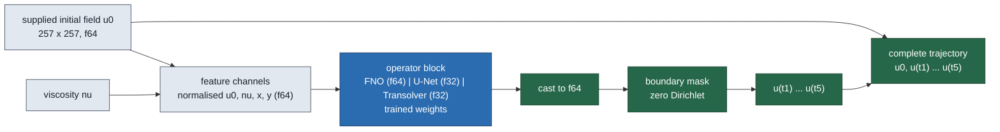

# Second and third neural-operator baselines on the Burgers common dataset: U-Net and Transolver

This report adds a PDEBench-style **U-Net** and a **Transolver** (physics attention) to the
neural-operator comparison on the Burgers common dataset, trained on exactly the data, split,
reference, metric, budget and selection rule the FNO lane used (`no-audit`, job
`3710846`), and scored on the same 32 held-out validation cases and the same eight
ROM/FOM diagnosis cases. **The numbers are final for the jobs listed and provisional as
evidence about neural operators on this problem** (one seed except where a seed control is shown, one mesh, one Gaussian continuum family, one bounded wall budget per capacity). No
speed ratio against the FNO, the ROM or the FOM is stated anywhere: those were measured in
other jobs.

Jobs: `3780139` (tsol01, NVIDIA A100 80GB PCIe, commit `c4f8b045`), `3780138` (unet01, NVIDIA A100 80GB PCIe, commit `c4f8b045`). Every job printed `jax_backend=gpu` and `torch_backend=cuda`, verified its
staged code against the committed blob and every data file against its recorded
checksum manifest, and ended with `ALL-DONE`. Training/validation index SHA256
`5333584b…` / `468b9e70…`, identical to the FNO job's
(asserted by the audit). Generated 2026-09-17 by `reports/generate_report.py` from the audit
JSONs listed in `summary.json`; no number here is typed. The sections below were produced by
different jobs at different commits (printed with each job); the Burgers screens, the Poisson
screen and any control job are separate commits of this lane, not one build.

## Verdict against the pre-registered criteria

- **Transolver**, validation-selected arm `tsol-refine` (job `3780139`): mean 1.9493%, median 1.3591%, worst 9.3183% over the 32 validation cases (FNO `fno-large`: 2.2811% / 1.8054% / 6.3825%). Pre-registered V1 (within 1.5× of the FNO on worst and median): **pass** (worst ratio 1.46×, median ratio 0.75×, bar 1.50×); it is below the FNO on mean, median. On the matched eight cases: worst 1.5224%, median 1.0763% (FNO worst 2.4829% / median 1.0494%, ROM worst 1.8671%, efficient FOM `same_nt1e-2_dt005` worst 0.9978%). **The selection rule optimises the mean, not the tail:** `tsol-large` has a lower worst validation case (6.3953% vs 9.3183%) at a higher mean (3.3412% vs 1.9493%), and was not selected. Both are in the tables.
- **U-Net**, validation-selected arm `unet-refine` (job `3780138`): mean 1.3523%, median 1.0806%, worst 7.5176% over the 32 validation cases (FNO `fno-large`: 2.2811% / 1.8054% / 6.3825%). Pre-registered V1 (within 1.5× of the FNO on worst and median): **pass** (worst ratio 1.18×, median ratio 0.60×, bar 1.50×); it is below the FNO on mean, median. On the matched eight cases: worst 1.7110%, median 1.2193% (FNO worst 2.4829% / median 1.0494%, ROM worst 1.8671%, efficient FOM `same_nt1e-2_dt005` worst 0.9978%). **The selection rule optimises the mean, not the tail:** `unet-medium` has a lower worst validation case (3.9622% vs 7.5176%) at a higher mean (1.4341% vs 1.3523%), and was not selected. Both are in the tables.

The eight-case worst is a single case; the per-case arrays are in the audit JSONs.

**Read these numbers with the following, all pre-registered in DESIGN §A1 finding 17.**

- **Almost nothing here is converged.** 7 of 8 arms in this lane, and
  4 of 4 FNO arms, selected a checkpoint in the last 5% of the epochs they
  ran — they were still improving when the wall budget cut them off. The "Still improving?" column
  below marks each one. Every Burgers number here is therefore a lower bound on its configuration
  at this budget, for the new families **and** for the FNO alike; none is a capacity ceiling.
- **Equal wall in float32 buys more epochs than float64.** At the same 3000 s per capacity,
  `tsol-refine` ran 1628 epochs (2.35× `fno-large`'s 692); `unet-refine` ran 1962 epochs (2.84× `fno-large`'s 692). That asymmetry favours this lane's families and is a deliberate consequence
  of holding *compute* equal rather than epochs — it is the protocol working as designed, not a
  correction applied after the fact.
- **The capacity ranges are not identical.** Transolver spans 3,108,240–12,322,960 real parameters; U-Net spans 4,368,389–17,462,021 real parameters,
  against the FNO's 1,193,125–17,877,317. Where a family's best arm sits at the edge of its own
  range, its optimum may lie outside the range screened.
- **Nothing was tuned per family.** Learning rate, weight decay, batch size, scheduler and patience
  were inherited unchanged from the FNO lane; `refine` (one lower-learning-rate retrain of the
  selected capacity) is the only family-level tuning any family received, and the Transolver's own
  published recipe was not used. This is what "matched protocol" costs: it is fair, not optimal, for
  every family including the FNO.
- **One seed.** Differences between a family's own arms — and between families — are not yet
  separated from seed variation; the one-variable precision and seed controls are in the section "Controls: precision and seed" below, and they twin the validation-selected capacities only (one second seed, one family; not the refined arms).

## What the models are

All three families share one contract (the FNO lane's): the input is the supplied initial
field, the viscosity broadcast to a channel and the two coordinate channels, all normalised
with the training statistics; the output is the five evolved fields as channels, masked to the
zero-Dirichlet boundary, with the supplied initial state prepended bitwise — a **direct
multi-time output, not an autoregressive rollout**. Only the block between the features and
the mask differs.

$$\mathcal{G}_\theta : (u_0, \nu) \mapsto (u(t_1), \dots, u(t_5)), \qquad t_k \in \{0.05, 0.10, 0.15, 0.20, 0.25\}.$$

- **U-Net**: four-level encoder–decoder, two 3×3 convolutions per level, channels
  `base … 16·base`, 2×2 max-pool down, 2×2 transposed convolution up with skip
  concatenation, GroupNorm(8), GELU; the 257² grid is zero-padded to 272² and cropped back.
- **Transolver**: eight physics-attention layers (8 heads, 64 slices, learned temperature,
  3×3 convolutional projections, pre-norm MLP of ratio 2) on 4×4-patch tokens of the grid
  zero-padded to 260² (4 225 tokens), the paper's unified positional encoding, and a
  per-token MLP decoder unpatched onto the grid.
- **FNO** (parent lane): four Fourier layers, float64/complex128.

The U-Net and Transolver networks run in IEEE float32 with TF32 disabled; features, mask,
trajectory assembly, loss and every reported error are float64, and the float64 precision control below tests whether the network precision matters.

## How accuracy is defined

The Burgers lane's own metric, identical for every method and recomputed independently with
NumPy from the saved fields:

$$E(\text{case}) = \max_{k=0,\dots,5} \frac{\lVert \hat u(t_k) - u^{\mathrm{ref}}(t_k)\rVert_{2,\mathrm{interior}}}{\lVert u^{\mathrm{ref}}(t_0)\rVert_{2,\mathrm{interior}}}.$$

The reference is the Burgers lane's refined 4096-interval, $\Delta t = 1.5625\times10^{-4}$
numerical solution restricted to the 256-interval grid. That lane's own record calls it
"empirically calibrated on independent development cases; not a per-case continuum
certificate", with a worst empirical refinement margin of 9.588e-04 — it is a refined
numerical solution, not exact truth.

Two properties of this metric are worth stating plainly, because they are easy to misread.
The denominator is the norm of the **initial** field at every output time, not the norm at that
time; since these solutions decay (the mean final-to-initial interior norm ratio over the
validation cases is 0.566), late-time percentages read smaller than a conventional
per-time relative error would. And the maximum runs over $k=0,\dots,5$ where the $t_0$ term is
identically zero, because every method here returns the supplied state bitwise. Both apply
identically to the FNO, the ROM and the FOM, so the comparisons are fair; the numbers are just
not per-time relative errors.

## Protocol (identical to the FNO arm)

AdamW (lr $10^{-3}$, weight decay $10^{-4}$), batch 8, gradient clipping at 1.0,
ReduceLROnPlateau(0.5, patience 20) on the validation mean case-maximum error, early stopping
after 250 epochs without improvement, epoch cap 4000, **3000 s of wall per capacity on one
A100**, checkpoint selected by validation mean case-maximum error, the validation-selected
capacity retrained at lr $3\times10^{-4}$ (`*-refine`), seed 20260914. The Transolver adds a
10-epoch linear warm-up (its one protocol difference). Nothing is selected on the eight-case
cohort. Epoch counts differ by design: equal compute, not equal epochs.

## Capacities trained

| Run | Operator | Capacity | Network dtype | Real parameters | Epochs run | Best epoch | Still improving? | Training s | Budget s | Ended by | Job |
| --- | --- | --- | --- | ---: | ---: | ---: | --- | ---: | ---: | --- | --- |
| `tsol-large` | Transolver | dim 256, 8 layers, patch 4 | float32 | 12322960 | 882 | 872 | yes | 3004 | 3000 | wall budget | `3780139` |
| `tsol-medium` | Transolver | dim 192, 8 layers, patch 4 | float32 | 6952208 | 586 | 582 | yes | 3006 | 3000 | wall budget | `3780139` |
| `tsol-refine` | Transolver | dim 128, 8 layers, patch 4 | float32 | 3108240 | 1628 | 1542 | no | 3002 | 3000 | wall budget | `3780139` |
| `tsol-small` | Transolver | dim 128, 8 layers, patch 4 | float32 | 3108240 | 1628 | 1619 | yes | 3001 | 3000 | wall budget | `3780139` |
| `unet-large` | U-Net | base 48 | float32 | 17462021 | 908 | 901 | yes | 3001 | 3000 | wall budget | `3780138` |
| `unet-medium` | U-Net | base 32 | float32 | 7763461 | 1963 | 1925 | yes | 3001 | 3000 | wall budget | `3780138` |
| `unet-refine` | U-Net | base 32 | float32 | 7763461 | 1962 | 1933 | yes | 3002 | 3000 | wall budget | `3780138` |
| `unet-small` | U-Net | base 24 | float32 | 4368389 | 2327 | 2321 | yes | 3001 | 3000 | wall budget | `3780138` |
| `fno-large` | FNO (parent lane, other job) | width 64, modes 32 | float64 | 17877317 | 692 | 683 | yes | 3003 | 3000 | wall budget | `3710846` |
| `fno-medium` | FNO (parent lane, other job) | width 48, modes 24 | float64 | 5780213 | 1198 | 1190 | yes | 3004 | 3000 | wall budget | `3710846` |
| `fno-refine` | FNO (parent lane, other job) | width 64, modes 32 | float64 | 17877317 | 688 | 685 | yes | 3005 | 3000 | wall budget | `3710846` |
| `fno-small` | FNO (parent lane, other job) | width 32, modes 16 | float64 | 1193125 | 1741 | 1732 | yes | 3003 | 3000 | wall budget | `3710846` |

## Validation accuracy — 32 held-out cases

| Run | Operator | Job | Mean (%) | Median (%) | p95 (%) | Worst (%) | Cases > 1% | Cases > 2% | Cases > 5% |
| --- | --- | --- | ---: | ---: | ---: | ---: | ---: | ---: | ---: |
| `tsol-large` | Transolver | `3780139` | 3.3412 | 3.0690 | 5.4727 | 6.3953 | 32 | 25 | 5 |
| `tsol-medium` | Transolver | `3780139` | 3.2950 | 2.3846 | 7.1608 | 9.5338 | 32 | 18 | 7 |
| `tsol-refine` | Transolver | `3780139` | 1.9493 | 1.3591 | 3.9310 | 9.3183 | 23 | 10 | 1 |
| `tsol-small` | Transolver | `3780139` | 2.0064 | 1.4522 | 5.3497 | 6.8213 | 21 | 12 | 2 |
| `unet-large` | U-Net | `3780138` | 1.7029 | 1.3642 | 3.3313 | 4.2340 | 27 | 10 | 0 |
| `unet-medium` | U-Net | `3780138` | 1.4341 | 1.3169 | 3.4997 | 3.9622 | 25 | 4 | 0 |
| `unet-refine` | U-Net | `3780138` | 1.3523 | 1.0806 | 2.1364 | 7.5176 | 17 | 4 | 1 |
| `unet-small` | U-Net | `3780138` | 1.6047 | 1.3963 | 3.4191 | 5.5937 | 24 | 5 | 1 |
| `fno-large` | FNO (parent lane, other job) | `3710846` | 2.2811 | 1.8054 | 5.3819 | 6.3825 | 24 | 14 | 2 |
| `fno-medium` | FNO (parent lane, other job) | `3710846` | 2.3122 | 1.7638 | 5.3254 | 6.0423 | 27 | 15 | 3 |
| `fno-refine` | FNO (parent lane, other job) | `3710846` | 2.3501 | 1.8810 | 5.4449 | 7.1747 | 28 | 15 | 2 |
| `fno-small` | FNO (parent lane, other job) | `3710846` | 2.5968 | 1.9552 | 6.1454 | 7.4812 | 31 | 15 | 3 |

## Worst error per output time (validation cases)

There is no rollout, so growth across times is the difficulty of later states, not accumulation.

| Run | $t=0$ | $t=0.05$ | $t=0.1$ | $t=0.15$ | $t=0.2$ | $t=0.25$ |
| --- | ---: | ---: | ---: | ---: | ---: | ---: |
| `tsol-large` | 0.0000 | 5.7329 | 5.4586 | 5.4495 | 5.3331 | 6.3953 |
| `tsol-medium` | 0.0000 | 9.5338 | 9.2293 | 8.0061 | 7.6120 | 8.6367 |
| `tsol-refine` | 0.0000 | 9.3183 | 8.3601 | 6.7930 | 6.2235 | 5.7078 |
| `tsol-small` | 0.0000 | 6.8213 | 6.2832 | 5.3144 | 4.6518 | 4.1963 |
| `unet-large` | 0.0000 | 4.2340 | 3.3727 | 3.2084 | 2.7768 | 3.2974 |
| `unet-medium` | 0.0000 | 2.5579 | 3.8988 | 3.1709 | 3.7856 | 3.9622 |
| `unet-refine` | 0.0000 | 5.0759 | 6.7292 | 7.5118 | 7.5176 | 7.2658 |
| `unet-small` | 0.0000 | 3.1658 | 3.9097 | 4.5089 | 5.5937 | 4.8547 |
| `fno-large` (FNO, other job) | 0.0000 | 5.6506 | 6.1626 | 5.7752 | 5.2998 | 6.3825 |
| `fno-medium` (FNO, other job) | 0.0000 | 5.4627 | 6.0423 | 5.3075 | 4.8143 | 5.6573 |
| `fno-refine` (FNO, other job) | 0.0000 | 5.1156 | 6.0213 | 5.6344 | 5.1540 | 7.1747 |
| `fno-small` (FNO, other job) | 0.0000 | 6.6418 | 7.4812 | 6.8576 | 6.5566 | 6.7261 |

## Same-case comparison on the matched eight-case cohort

The eight cases and references the Burgers lane's ROM/FOM diagnosis used at 256 intervals
(job `3702709`), rebuilt in every job from the same anchors and checked disjoint from
training by seed and by input content. **Accuracy is comparable across jobs on these cases;
timing is not**, which is why no time appears here.

| Method | Kind | Job | Worst (%) | Median (%) | Mean (%) | Cases > 1% | Cases > 2% |
| --- | --- | --- | ---: | ---: | ---: | ---: | ---: |
| `tsol-large` | Transolver (this lane) | `3780139` | 3.0988 | 2.3048 | 2.3213 | 8 | 6 |
| `tsol-medium` | Transolver (this lane) | `3780139` | 2.8498 | 1.6007 | 1.7895 | 8 | 2 |
| `tsol-refine` | Transolver (this lane) | `3780139` | 1.5224 | 1.0763 | 1.1331 | 6 | 0 |
| `tsol-small` | Transolver (this lane) | `3780139` | 2.5273 | 1.4156 | 1.4865 | 6 | 1 |
| `unet-large` | U-Net (this lane) | `3780138` | 2.3176 | 1.1724 | 1.3473 | 7 | 1 |
| `unet-medium` | U-Net (this lane) | `3780138` | 1.5189 | 1.1724 | 1.1023 | 5 | 0 |
| `unet-refine` | U-Net (this lane) | `3780138` | 1.7110 | 1.2193 | 1.1043 | 5 | 0 |
| `unet-small` | U-Net (this lane) | `3780138` | 1.4712 | 1.1295 | 1.0858 | 6 | 0 |
| `fno-large` | FNO (parent lane, other job) | `3710846` | 2.4829 | 1.0494 | 1.3269 | 5 | 2 |
| `fno-medium` | FNO (parent lane, other job) | `3710846` | 2.8882 | 1.2195 | 1.4137 | 7 | 1 |
| `fno-refine` | FNO (parent lane, other job) | `3710846` | 3.2660 | 1.3448 | 1.6711 | 8 | 2 |
| `fno-small` | FNO (parent lane, other job) | `3710846` | 2.9350 | 1.2124 | 1.4958 | 7 | 1 |
| `rom` | ROM (Burgers lane, other job) | `3702709` | 1.8671 | — | — | — | — |
| `same_nt1e-2_dt005` | FOM (Burgers lane, other job) | `3702709` | 0.9978 | — | — | — | — |
| `same_nt1e-4_dt005` | FOM (Burgers lane, other job) | `3702709` | 1.3811 | — | — | — | — |
| `same_nt1e-6_dt005` | FOM (Burgers lane, other job) | `3702709` | 1.3811 | — | — | — | — |
| `same_nt1e-2_dt01` | FOM (Burgers lane, other job) | `3702709` | 1.8642 | — | — | — | — |
| `coarse_half_dt005` | FOM (Burgers lane, other job) | `3702709` | 1.8993 | — | — | — | — |
| `coarse_quarter_dt01` | FOM (Burgers lane, other job) | `3702709` | 3.6398 | — | — | — | — |

## Controls: precision and seed

Each control repeats a screen arm under the identical protocol and budget with **exactly one variable changed**, and is shown beside that arm. Controls are never eligible for capacity selection and are excluded from the tables above. The controls twin the **validation-selected capacity without refinement** (DESIGN §3.4/§A4), so the refined headline arms (`unet-refine`, `tsol-refine`) have no twin here; what the controls test is whether the capacity the selection rule chose is stable under one changed variable.

| Control | Differs from | In | Epochs | Ended by | Validation mean (%) | median (%) | worst (%) | Cohort worst (%) | Cohort median (%) | Job |
| --- | --- | --- | ---: | --- | ---: | ---: | ---: | ---: | ---: | --- |
| `ctrl-medium-f64` | `unet-medium` | network dtype | 500 | wall budget | 1.7513 | 1.5104 | 5.2050 | 1.6721 | 1.4963 | `3783831` |
| `unet-medium` (twin, screen) | — | — | 1963 | wall budget | 1.4341 | 1.3169 | 3.9622 | 1.5189 | 1.1724 | `3780138` |
| `ctrl-medium-seed2` | `unet-medium` | seed | 1969 | wall budget | 1.4776 | 1.1640 | 3.6412 | 1.5479 | 0.9111 | `3783831` |
| `unet-medium` (twin, screen) | — | — | 1963 | wall budget | 1.4341 | 1.3169 | 3.9622 | 1.5189 | 1.1724 | `3780138` |
| `ctrl-tsol-small-f64` | `tsol-small` | network dtype | 682 | wall budget | 2.6394 | 1.8917 | 11.4209 | 3.1329 | 1.6235 | `3783831` |
| `tsol-small` (twin, screen) | — | — | 1628 | wall budget | 2.0064 | 1.4522 | 6.8213 | 2.5273 | 1.4156 | `3780139` |

**Reading rule (DESIGN §A4) under three spreads.** A control is flagged when |delta| exceeds the spread on validation worst or median; the family-screen column is the reading applied, the other two are shown so the reader can see where the verdict would flip.

| Control vs twin | Metric | Delta (pp) | Family screen, 4 arms (§A4 as applied) | Family, 3 capacities only | Both families pooled |
| --- | --- | ---: | ---: | ---: | ---: |
| `ctrl-medium-f64` vs `unet-medium` | worst | +1.2428 | 3.5554 — inside | 1.6314 — inside | 5.5716 — inside |
| `ctrl-medium-f64` vs `unet-medium` | median | +0.1935 | 0.3157 — inside | 0.0794 — **outside** | 1.9884 — inside |
| `ctrl-medium-f64` vs `unet-medium` | mean | +0.3172 | 0.3506 — inside | 0.2688 — **outside** | 1.9889 — inside |
| `ctrl-medium-seed2` vs `unet-medium` | worst | -0.3210 | 3.5554 — inside | 1.6314 — inside | 5.5716 — inside |
| `ctrl-medium-seed2` vs `unet-medium` | median | -0.1529 | 0.3157 — inside | 0.0794 — **outside** | 1.9884 — inside |
| `ctrl-medium-seed2` vs `unet-medium` | mean | +0.0435 | 0.3506 — inside | 0.2688 — inside | 1.9889 — inside |
| `ctrl-tsol-small-f64` vs `tsol-small` | worst | +4.5996 | 3.1385 — **outside** | 3.1385 — **outside** | 5.5716 — inside |
| `ctrl-tsol-small-f64` vs `tsol-small` | median | +0.4395 | 1.7099 — inside | 1.6169 — inside | 1.9884 — inside |
| `ctrl-tsol-small-f64` vs `tsol-small` | mean | +0.6330 | 1.3919 — inside | 1.3348 — inside | 1.9889 — inside |

**At least one control moves its twin's validation worst or median by more than that twin's own screen spread, so the numbers it bears on are flagged precision- or seed-sensitive (DESIGN §A4 reading rule):** `tsol-small` (network dtype, `ctrl-tsol-small-f64`). Every other control lands inside its twin's screen spread and those float32 single-seed numbers stand as reported.

**Equal wall, not equal epochs.** `ctrl-medium-f64` completed 500 epochs against `unet-medium`'s 1963 (0.25×) in the same 3000 s; `ctrl-tsol-small-f64` completed 682 epochs against `tsol-small`'s 1628 (0.42×) in the same 3000 s. A float64 twin at equal compute is therefore also a fewer-epochs twin; the protocol holds compute equal by design, and the dtype effect is not separated from the epoch effect here.

**The positive single-seed claim, tested control by control** (matched eight-case worst, ROM from job `3702709`, accuracy comparable across jobs on these cases).

- `unet-medium` is **below** the ROM on the matched eight-case worst (1.5189% vs 1.8671%); its network dtype twin `ctrl-medium-f64` lands at 1.6721%, **below** the ROM by 0.1950 pp — the same side: the claim survives this control.
- `unet-medium` is **below** the ROM on the matched eight-case worst (1.5189% vs 1.8671%); its seed twin `ctrl-medium-seed2` lands at 1.5479%, **below** the ROM by 0.3192 pp — the same side: the claim survives this control.
- `tsol-small` is **above** the ROM on the matched eight-case worst (2.5273% vs 1.8671%); its network dtype twin `ctrl-tsol-small-f64` lands at 3.1329%, **above** the ROM by 1.2658 pp — no positive claim rests on this arm, so this control defends none; the Transolver arm(s) below the ROM, `tsol-refine` (1.5224%), **have no twin and remain a single-seed float32 result**.

## Same-job complete-query timing (this lane's arms only)

Measured with the parent lane's `timing.py` protocol (supplied field on device to complete
trajectory on device, 20-query burn-in per block, synchronisation around every repetition,
every repetition retained). **These numbers must not be divided by any timing from another
job** — not the FNO's, and **not each other's**: each screen ran in its own allocation, so the
tables below are separated by job and only rows inside one table may be compared. The
`b-panel` lane owns the same-job panel that could compare families.

**Job `3780139` (tsol01, NVIDIA A100 80GB PCIe) — these rows are mutually comparable:**

| Run | Repetitions | Device query, pooled median (ms) | Median of case medians (ms) | Host transfer (ms) | Device + host (ms) |
| --- | ---: | ---: | ---: | ---: | ---: |
| `tsol-large` | 32×30 | 15.326 | 15.327 | 0.246 | 15.574 |
| `tsol-medium` | 32×30 | 12.913 | 12.917 | 0.255 | 13.169 |
| `tsol-refine` | 32×30 | 11.064 | 11.070 | 0.254 | 11.319 |
| `tsol-small` | 32×30 | 11.005 | 11.009 | 0.247 | 11.253 |

**Job `3780138` (unet01, NVIDIA A100 80GB PCIe) — these rows are mutually comparable:**

| Run | Repetitions | Device query, pooled median (ms) | Median of case medians (ms) | Host transfer (ms) | Device + host (ms) |
| --- | ---: | ---: | ---: | ---: | ---: |
| `unet-large` | 32×30 | 10.144 | 10.144 | 0.245 | 10.390 |
| `unet-medium` | 32×30 | 5.898 | 5.898 | 0.243 | 6.143 |
| `unet-refine` | 32×30 | 5.902 | 5.902 | 0.246 | 6.149 |
| `unet-small` | 32×30 | 9.490 | 9.489 | 0.244 | 9.736 |

## What this does and does not establish

- Each new family is reported at every capacity it was trained at, with the number of epochs it
  reached and what ended the run, under exactly the FNO's budget and selection rule.
- The comparison is one seed except where a seed control is shown, one mesh, one Gaussian family, one 3000 s budget per capacity.
  It is a *protocol-matched* screen, not a capacity ceiling for any family.
- Which arms were still improving when their budget ran out is marked per arm in the
  "Still improving?" column of the capacities table, for this lane and for the FNO alike.
- No speed claim. Checkpoints (`best.pt`) and the `evaluate`-style entry point
  (`model.predict`) are archived for the same-job panel.

## Poisson: U-Net on the Poisson operator-screen dataset

Jobs: `3780625` (pois02, NVIDIA A100 80GB PCIe, commit `339c026b`). The dataset is the Poisson FNO job's (`3702464`): 128 training and 32
validation cases at 256 intervals, source field in, zero-Dirichlet solution out, training
target the declared discrete (five-point FD/DST) solution, with an evaluation-only physical
reference sidecar (2048-interval refinement) per validation case. Because no cluster copy
survived, the files were re-uploaded from the Git archive and re-verified in-job against
their recorded hashes; the train/validation index SHA256 equal the FNO job's (asserted by
the audit). Protocol = the Poisson FNO's: 500-epoch cap, patience 80, 7200 s wall budget per
capacity, validation selection on the discrete target, no refinement. Two metrics, as in
the parent audit: **discrete** (against the training target) and **physical candidate**
(against the refinement sidecar). No matched ROM/DST cohort is scored here.

| Run | Operator | Capacity | Network dtype | Real parameters | Epochs run | Best epoch | Still improving? | Training s | Budget | Ended by | Job |
| --- | --- | --- | --- | ---: | ---: | ---: | --- | ---: | --- | --- | --- |
| `unet-large` | U-Net | base 48 | float32 | 17461393 | 500 | 490 | yes | 1609 | 7200 s wall | epoch cap | `3780625` |
| `unet-medium` | U-Net | base 32 | float32 | 7763041 | 500 | 499 | yes | 671 | 7200 s wall | epoch cap | `3780625` |
| `unet-small` | U-Net | base 24 | float32 | 4368073 | 500 | 487 | yes | 538 | 7200 s wall | epoch cap | `3780625` |
| `fno-small` | FNO (parent lane, other job) | — | float64 | 1192801 | 496 | 415 | no | 769 | 500 epoch cap | early stopping | `3702464` |
| `fno-medium` | FNO (parent lane, other job) | — | float64 | 5779729 | 457 | 376 | no | 1092 | 500 epoch cap | early stopping | `3702464` |
| `fno-large` | FNO (parent lane, other job) | — | float64 | 17876673 | 361 | 280 | no | 1571 | 500 epoch cap | early stopping | `3702464` |

**`unet-large`, `unet-medium`, `unet-small` were still improving when training ended:** each selected a checkpoint in the last 5% of the epochs it ran, and the stopping condition was the 500-epoch cap, not the wall budget — the longest arm used 1609 s of its 7200 s. These numbers are therefore a lower bound on what this family reaches under this protocol, not a converged result. The Poisson FNO, by contrast, **early-stopped** inside the same cap — `fno-large` (361 epochs, best 280), `fno-medium` (457 epochs, best 376), `fno-small` (496 epochs, best 415), against a 500-epoch cap with patience 80, so it had stopped improving while these U-Net arms had not (source: `checks/fno-poisson-run-metadata.json`, extracted from that job's own archive).

| Run | Operator | Job | Discrete: median (%) | Discrete: worst (%) | Physical: mean (%) | Physical: median (%) | Physical: p95 (%) | Physical: worst (%) | Cases > 5% (physical) |
| --- | --- | --- | ---: | ---: | ---: | ---: | ---: | ---: | ---: |
| `unet-large` | U-Net | `3780625` | 1.9465 | 8.3123 | 2.2386 | 1.9465 | 3.6529 | 8.3121 | 1 |
| `unet-medium` | U-Net | `3780625` | 1.6795 | 6.0161 | 2.2183 | 1.6792 | 5.3355 | 6.0196 | 3 |
| `unet-small` | U-Net | `3780625` | 2.4015 | 12.7970 | 2.9503 | 2.4005 | 6.4511 | 12.8000 | 2 |
| `fno-small` | FNO (parent lane, other job) | `3702464` | 2.6449 | 32.4707 | 4.0518 | 2.6449 | 9.9986 | 32.4681 | 4 |
| `fno-medium` | FNO (parent lane, other job) | `3702464` | 2.3461 | 28.2778 | 3.5154 | 2.3456 | 8.1723 | 28.2777 | 4 |
| `fno-large` | FNO (parent lane, other job) | `3702464` | 2.0259 | 29.3717 | 3.4504 | 2.0252 | 8.1324 | 29.3747 | 4 |

**Pre-registered criterion V1-P (DESIGN §A2).** The validation-selected U-Net is `unet-medium` (job `3780625`; lowest validation mean against the discrete target), and the FNO reference under the same rule is `fno-large`. On the physical-candidate metric: worst 6.0196% against 29.3747% (ratio 0.20×) and median 1.6792% against 2.0252% (ratio 0.83×), both against the 1.50× bar — **pass**. The worst-case gap is the substantive one: every FNO capacity leaves 4 cases above 5%, the selected U-Net leaves 3.

**The two metric columns are not independent evidence.** The discrete training target and the finer physical reference agree to 6.53e-05 relative on these cases — far below every model error here — so the physical column confirms the discrete one rather than measuring something new. It is reported because the parent audit reports it, and because that agreement is itself the check that this dataset does not repeat the known analytic-data inconsistency: the target's own discrete residual is 7.73e-13.

## The operator's own knob: evaluation resolution

Pre-registered as DESIGN §A5 before the job ran. Each **frozen, validation-selected**
checkpoint is evaluated at 256, 128, 64 and 32 intervals on the same 32 validation cases, graded
exactly as the Burgers lane grades its own coarse-mesh FOM arms: restrict the supplied field by
stride, run the operator on that grid, prolong every output time back to the 256-interval
evaluation grid with the same aligned bilinear map (`engines.output_field`, matched to
0.0e+00), and score against the same reference with the
same fixed-initial metric. No training happens in this job. Job `3787189` (res02, NVIDIA A100 80GB PCIe, commit `40d7fef8`).

**Top-rung gate.** At rung 256 each checkpoint reproduces its already-published validation number
to `fno-large` 0.00e+00; `unet-refine` 0.00e+00; `tsol-refine` 0.00e+00 — the ladder's top rung recovers this lane's and the FNO lane's own results, or the
job would be void.

Three error columns are kept separate, per LANE-PROTOCOL rule 9. At a coarse rung the supplied
state is no longer returned exactly: prolonging the restricted initial field is lossy, and that
loss is a real cost of this knob, so the $t=0$ term is shown on its own rather than folded in.
The **interpolation floor** is the error a *perfect* operator would incur at that rung — the
reference itself restricted and prolonged back — so "error / floor" separates the grid's limit
from the model breaking off-resolution.

**Accuracy on the 32 held-out validation cases (the cohort the labels are decided on)**

| Operator | Rung (intervals) | Worst evolved (%) | Median evolved (%) | Worst all times (%) | $t=0$ term, worst (%) | Interp. floor, worst evolved (%) | Error / floor |
| --- | ---: | ---: | ---: | ---: | ---: | ---: | ---: |
| `fno-large` | 256 | 6.3825 | 1.8054 | 6.3825 | 0.0000 | 0.0000 | — |
| `fno-large` | 128 | 7.2993 | 1.9011 | 7.2993 | 4.5162 | 0.2255 | 32.4 |
| `fno-large` | 64 | 9.8214 | 2.1679 | 9.8214 | 8.4499 | 0.9233 | 10.6 |
| `fno-large` | 32 | 13.8510 | 3.1812 | 13.8510 | 13.3732 | 4.0157 | 3.4 |
| `unet-refine` | 256 | 7.5176 | 1.0806 | 7.5176 | 0.0000 | 0.0000 | — |
| `unet-refine` | 128 | 38.1348 | 20.2755 | 38.1348 | 4.5162 | 0.2255 | 169.1 |
| `unet-refine` | 64 | 60.1808 | 36.4349 | 60.1808 | 8.4499 | 0.9233 | 65.2 |
| `unet-refine` | 32 | 67.6496 | 42.7334 | 67.6496 | 13.3732 | 4.0157 | 16.8 |
| `tsol-refine` | 256 | 9.3183 | 1.3591 | 9.3183 | 0.0000 | 0.0000 | — |
| `tsol-refine` | 128 | 15.2905 | 7.1491 | 15.2905 | 4.5162 | 0.2255 | 67.8 |
| `tsol-refine` | 64 | 35.1768 | 17.9818 | 35.1768 | 8.4499 | 0.9233 | 38.1 |
| `tsol-refine` | 32 | 75.1331 | 32.8800 | 75.1331 | 13.3732 | 4.0157 | 18.7 |

**Accuracy on the matched eight-case ROM/FOM diagnosis cohort, same reference on the common 256-interval grid**

| Operator | Rung (intervals) | Worst evolved (%) | Median evolved (%) | Worst all times (%) | $t=0$ term, worst (%) | Interp. floor, worst evolved (%) | Error / floor |
| --- | ---: | ---: | ---: | ---: | ---: | ---: | ---: |
| `fno-large` | 256 | 2.4829 | 1.0494 | 2.4829 | 0.0000 | 0.0000 | — |
| `fno-large` | 128 | 2.2893 | 1.2180 | 3.3356 | 3.3356 | 0.0729 | 31.4 |
| `fno-large` | 64 | 2.8125 | 1.6629 | 6.2420 | 6.2420 | 0.3105 | 9.1 |
| `fno-large` | 32 | 5.4817 | 2.8138 | 9.8875 | 9.8875 | 1.2462 | 4.4 |
| `unet-refine` | 256 | 1.7110 | 1.2193 | 1.7110 | 0.0000 | 0.0000 | — |
| `unet-refine` | 128 | 25.5894 | 20.7290 | 25.5894 | 3.3356 | 0.0729 | 351.3 |
| `unet-refine` | 64 | 36.5992 | 33.4498 | 36.5992 | 6.2420 | 0.3105 | 117.9 |
| `unet-refine` | 32 | 42.0969 | 38.9563 | 42.0969 | 9.8875 | 1.2462 | 33.8 |
| `tsol-refine` | 256 | 1.5224 | 1.0763 | 1.5224 | 0.0000 | 0.0000 | — |
| `tsol-refine` | 128 | 8.3580 | 5.3872 | 8.3580 | 3.3356 | 0.0729 | 114.7 |
| `tsol-refine` | 64 | 21.8151 | 13.3182 | 21.8151 | 6.2420 | 0.3105 | 70.2 |
| `tsol-refine` | 32 | 46.0569 | 27.5370 | 46.0569 | 9.8875 | 1.2462 | 37.0 |

**Cost, same job, same GPU.** The timed region is the parent lane's device query: on-device supplied field
and parameters to the on-device *complete* six-time trajectory, 30 timed repetitions after a
20-query burn-in on each of 8 cases, every repetition retained
(`timing-*.npz`); the device-to-host copy is not included. Speedups are **only ever within one model's own
curve**; no ratio is formed against another job, another allocation, the ROM or the FOM.

| Operator | Rung (intervals) | Median device complete query (ms) | p05–p95 (ms) | Same-job speedup vs its own 256 | Worst-evolved error vs its own 256 | Error gate (≤2×) | Speed gate (≥1.5×) | Label |
| --- | ---: | ---: | ---: | ---: | ---: | --- | --- | --- |
| `fno-large` | 256 | 7.351 | 7.316–7.423 | 1.00 (reference) | 1.00 (reference) | — | — | **R-USABLE** |
| `fno-large` | 128 | 3.463 | 3.416–3.508 | 2.12× | 1.14× | pass | pass | usable rung |
| `fno-large` | 64 | 3.438 | 3.392–3.511 | 2.14× | 1.54× | pass | pass | usable rung |
| `fno-large` | 32 | 3.326 | 3.274–3.355 | 2.21× | 2.17× | fail | pass | — |
| `unet-refine` | 256 | 5.902 | 5.881–5.932 | 1.00 (reference) | 1.00 (reference) | — | — | **R-DEGENERATE** |
| `unet-refine` | 128 | 2.347 | 2.331–2.372 | 2.51× | 5.07× | fail | pass | — |
| `unet-refine` | 64 | 2.311 | 2.296–2.356 | 2.55× | 8.01× | fail | pass | — |
| `unet-refine` | 32 | 2.302 | 2.285–2.324 | 2.56× | 9.00× | fail | pass | — |
| `tsol-refine` | 256 | 11.195 | 11.108–11.221 | 1.00 (reference) | 1.00 (reference) | — | — | **R-DEGENERATE** |
| `tsol-refine` | 128 | 8.151 | 8.116–8.220 | 1.37× | 1.64× | pass | fail | — |
| `tsol-refine` | 64 | 8.092 | 8.064–8.132 | 1.38× | 3.78× | fail | fail | — |
| `tsol-refine` | 32 | 8.040 | 7.999–8.141 | 1.39× | 8.06× | fail | fail | — |

- `fno-large`: **R-USABLE** — rung 128 reaches 2.12× its own 256 speed at 1.14× its own 256 error, meeting the pre-registered ≥1.5× / ≤2× bars.
- `unet-refine`: **R-DEGENERATE** — already at rung 128, error rises to 5.07× its own 256 value (bar: ≤2×).
- `tsol-refine`: **R-DEGENERATE** — already at rung 128, speedup is only 1.37× (bar: ≥1.5×).

**What each curve looks like** (generated from the same rows):

- `fno-large`: over rungs 128, 64, 32 the same-job speedup is 2.12×, 2.14×, 2.21× and the worst-evolved error is 1.14×, 1.54×, 2.17× its own 256 value. Below rung 128 the speedup moves by only 1.04× more in total while the error keeps rising: the cost curve is flat there (the query is launch-bound at batch 1 on this GPU), so coarsening past 128 buys error, not speed.
- `unet-refine`: over rungs 128, 64, 32 the same-job speedup is 2.51×, 2.55×, 2.56× and the worst-evolved error is 5.07×, 8.01×, 9.00× its own 256 value. Below rung 128 the speedup moves by only 1.02× more in total while the error keeps rising: the cost curve is flat there (the query is launch-bound at batch 1 on this GPU), so coarsening past 128 buys error, not speed.
- `tsol-refine`: over rungs 128, 64, 32 the same-job speedup is 1.37×, 1.38×, 1.39× and the worst-evolved error is 1.64×, 3.78×, 8.06× its own 256 value. Below rung 128 the speedup moves by only 1.01× more in total while the error keeps rising: the cost curve is flat there (the query is launch-bound at batch 1 on this GPU), so coarsening past 128 buys error, not speed.

**The pre-registered falsification clause fires** (`fno-large` at rung 128: 2.12× at 1.14× its own error; bars ≥1.5× and ≤2×). **Withdrawn:** the abstract's opening sentence, “A learned PDE surrogate usually gives one accuracy–cost point; getting another means retraining”, and every restatement of it — the introduction's framing of tunability as the *existence* of a run-time family, and the glossary line that each neural operator “is one trained model giving one accuracy–cost point”. A discretisation-invariant operator evaluated on a coarser grid is a run-time accuracy–cost family, exactly as Li et al. advertise, and this job measured one. **Narrower replacement, to be claimed instead:** the correction rank $q$ is a run-time control with a *structural* meaning — it moves the reachable set from the head's image ($q=0$) toward the bank's span ($q=R$), so each rung is a nested trial manifold of the same weak-residual solve, and error is monotone in $q$ by construction of the family, with the interpolation floor at zero at every rung. Resolution scaling of an operator is not that: it changes the grid the network sees, its cost floors at the launch-bound query (the curve above is flat below the first rung), the supplied state is returned only up to the interpolation floor, and the error at a rung is set by how far the network's off-resolution behaviour sits above that floor (at rung 128, the rung that decides every label, no family is closer than 32× to it), not by a property of the model class. The paper should contrast the two families on those terms and drop the existence claim.
## Glossary

- **U-Net / Transolver / FNO:** the three neural-operator families compared; see "What the models are".
- **Capacity:** the network size — `base` channels for the U-Net, hidden `dim` for the Transolver, width/modes for the FNO. `small`, `medium`, `large` are the screened sizes; `refine` is the validation-selected size retrained at a lower learning rate.
- **Real parameters:** trainable real numbers (each complex FNO weight counts as two).
- **Network dtype:** the precision the network's weights and activations use; everything outside the network is float64 for every family.
- **Epoch / best epoch:** one pass over the 128 training cases; the epoch whose checkpoint scored best on the validation cases (that checkpoint is what is evaluated).
- **Ended by:** what stopped the run — `early stopping` (250 epochs without validation improvement), `wall budget` (the 3000 s limit), `epoch cap` (4000 epochs), or `signal` (the scheduler asked it to stop).
- **Validation-32 / diagnosis-8:** the 32 held-out cases used to pick checkpoints and report accuracy; the eight cases the Burgers lane graded its ROM and FOM on, never used for selection.
- **Fixed-initial error:** field discrepancy divided by the size of the *initial* field, maximised over the six output times.
- **Worst / median / mean / p95:** over the per-case numbers, each case already reduced to its worst time.
- **Cases > x%:** how many of the cases exceed that error.
- **Precision control / seed control:** the same capacity retrained with the network in float64, or at a different seed, to show whether those choices move the numbers.
- **Other job:** a number measured in a different Slurm allocation. Accuracy is comparable across jobs; timing never is.
- **ROM / FOM:** the project's reduced-order model and the conventional full-grid solver; `same_nt1e-2_dt005` is the efficient FOM arm (Newton tolerance $10^{-2}$, step 0.005).
- **V1:** the pre-registered competitiveness criterion — within 1.5× of the FNO's validation worst and median.
- **Burn-in / pooled median / host transfer:** timing-protocol terms from the parent lane, reproduced unchanged.
- **Rung:** one grid resolution on the evaluation ladder, in intervals per axis (257² nodes at 256 intervals).
- **Worst evolved / worst all times / $t=0$ term:** the error maximised over the five evolved output times only; over all six; and at the supplied time alone. They differ at coarse rungs because prolonging a restricted initial field is lossy.
- **Interpolation floor:** the error a perfect operator would still incur at that rung, obtained by restricting the reference itself to the rung and prolonging it back. **Error / floor** is how much worse than that floor a model actually is.
- **Same-job speedup:** a model's median device query at 256 divided by its median at that rung, both measured in the same job on the same GPU. Never a cross-job ratio.
- **R-USABLE / R-DEGENERATE:** the pre-registered labels — usable if some rung is ≥1.5× faster than the model's own 256 evaluation while staying within 2× its own 256 error; degenerate if the first rung below 256 already fails either half.
- **Complete query / device query:** the timed region for the resolution ladder — the whole six-time trajectory produced on the GPU from an input already on the GPU; the copy back to the host is timed separately by the parent lane and not included here.
- **Launch-bound:** the query time no longer falls when the grid shrinks because it is dominated by fixed per-kernel launch overhead, not by arithmetic on the grid.
- **Falsification clause:** the pre-registered rule (DESIGN §A5) that if any operator is R-USABLE the paper's "one accuracy–cost point per trained operator" sentence is withdrawn.
- **Discrete / physical candidate (Poisson):** error against the declared finite-difference training target, and against the finer evaluation-only reference solution; both are whole-field discrepancy over the field's norm.
