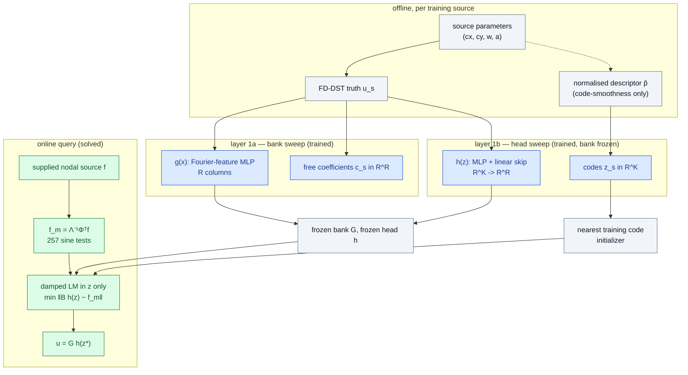

# Poisson 2D — pushing the bank floor and the head, and whether the solve follows

This report covers one pre-registered cell (`experiments/p-bank-head/DESIGN.md`): a bank sweep over feature rank and training-source count, a head sweep over latent dimension and objective, and a frozen solve of every resulting checkpoint through the unchanged head-ablation Poisson machinery, with the incumbent checkpoint as a control in the same job. **All numbers are final for this cell** — they come from two completed, checksum-collected, independently audited GPU jobs — but they are one training seed on one already-opened 12-source development cohort, so they are development evidence, not sealed-cohort results.

Training job `3745606` on `NVIDIA A100-PCIE-40GB`, source commit `c6a63345866e6091c2973ff00f490e59a507ad9e`; solve job `3748202` on `NVIDIA A100 80GB PCIe`, source commit `798c60c290d62fb313fdf1511fa72e5e68bc04c6`. Both logged `jax_backend=gpu`, float64, matmul precision `highest`, JAX 0.10.2.

## Verdict against the pre-registered clauses

At 1024 intervals on the 12 development sources:

| clause | requirement | best checkpoint | value | verdict |
|---|---|---|---:|---|
| 1 solved | worst same-grid < 2.0000 % | `new_K32` | 3.1146 % | **miss** |
| 2 stationary | every solve exits stationary | `new_K32` | 36/36 | **pass** |
| 3 cost | median query within 1.5x the incumbent | `new_K32` | 1.326x | **pass** |
| 4 vs POD | beats POD-LSPG at k' = K on worst error | `new_K32` | 3.1146 % vs 11.8594 % | **pass** |

Every checkpoint at that mesh, control first:

| checkpoint | K | R | bank floor | best-found | solved same-grid | median total ms | cost vs control | stationary |
|---|---:|---:|---:|---:|---:|---:|---:|---:|
| `incumbent` *(control)* | 16 | 128 | 2.3148 % | 6.0926 % | 6.0931 % | 6.222 | 1.000x | 36/36 |
| `new_K32` | 32 | 512 | 0.7419 % | 3.1136 % | 3.1146 % | 8.252 | 1.326x | 36/36 |
| `new_K16` | 16 | 512 | 0.7419 % | 3.3691 % | 3.3695 % | 7.798 | 1.253x | 36/36 |
| `bank_arm_head` | 16 | 512 | 0.7419 % | 3.7418 % | 3.7424 % | 7.894 | 1.269x | 36/36 |

| layer target | requirement | value | verdict |
|---|---|---:|---|
| bank | worst development floor < 1.0000 % at 1023 intervals | 0.6097 % | **pass** |
| head K=16 | best-found within 1.2x its bank floor | 4.527x | **miss** |
| head K=32 | best-found within 1.2x its bank floor | 4.184x | **miss** |

## Why a better bank did not improve the trained head (2026-09-11)

The diagnosis is measured, not argued. D1–D8 are defined in DESIGN.md section 6 and are computed here for the incumbent checkpoint before anything was trained.

> **Retraction inside `pbh01` (DESIGN.md amendment 1).** That job computed the incumbent's *training-side* diagnostics against `core.source_params(0, 512)`, which is not the cohort that checkpoint was trained on (it trained on `core.source_params(0, 576)[:512]`, and the two share nothing). **D2, D3, D4, D6 and D8 as printed by `pbh01` for the incumbent are retracted.** The table immediately below replaces them, recomputed on the correct cohort by `checks/incumbent-diagnosis/`. D1 on the development cohort, D5 and D7 never touch the training parameters and are unchanged.

Corrected, at 255 intervals, 512 training sources (256 sampled for the training-side oracle):

| quantity | worst | median |
|---|---:|---:|
| D1 bank floor, training | 1.9294 % | 0.6841 % |
| D1 bank floor, development | 2.3227 % | 0.3684 % |
| D2 head at the stored codes, training | 4.7007 % | 1.7431 % |
| D3 head best-found, training | 4.6845 % | 1.7426 % |
| D5 head best-found, development | 6.1014 % | 1.2423 % |

D4 code-refit gain (D2 − D3), worst 0.0407 pp, relative worst 0.0157, relative median 0.0010. D6 generalisation gap, ratio of worst 1.302x, ratio of median 0.713x. D8 Spearman of development best-found against distance to the nearest training parameter: 0.371. Head floor over bank floor: **2.627x**.

(Local GB10 diagnostic, `jax_backend=gpu`, float64, matmul precision `highest`, 26.6 s; no cluster job was spent on the correction.)

The `pbh01` table below is kept for the record; read only its D1(dev), D5 and D7 columns.

**`incumbent_r128_joint`** — K=16, R=128, 512 training sources.

| intervals | D1 bank floor (dev) | D2 head at stored codes (train) | D3 head best-found (train) | D4 code-refit gain | D5 head best-found (dev) | D6 dev/train ratio | D7 solved − best-found | D8 Spearman (error vs distance) |
|---:|---:|---:|---:|---:|---:|---:|---:|---:|
| 255 | 2.3227 % | 2091.4971 % | 17.5069 % | 2082.6375 pp | 6.1014 % | 0.349x | 0.0001 pp | 0.210 |
| 1023 | 2.3152 % | 2091.6363 % | 17.4982 % | 2082.7789 pp | 6.0930 % | 0.348x | — pp | 0.210 |

Head floor over bank floor at 1023 intervals: **2.632x**.

## Layer 1a — the bank sweep

Six arms at K=16 with one fixed schedule and one fixed seed: identical phase counts, identical learning rates, identical optimizer seeds, so the only differences are R and S. Equal update counts mean the larger-S arms are NOT given more training compute.

**Selection.** The rule in force is DESIGN.md amendment 4: the lowest worst floor on one **common selection cohort** — `core.source_params(20260916, 256)`, a fresh seed asserted disjoint from every training cohort and from the development cohort — at 255 intervals. The originally pre-registered rule (worst of each arm's *own* validation split) was withdrawn mid-run because those splits have different sizes (29, 115 and 461 sources), so their maxima are not comparable. Selected: **`bank_R512_S3072`**; the withdrawn rule would have selected `bank_R512_S192`; the two DISAGREE. The development cohort selects nothing and its own ranking disagrees with the common-cohort ranking.

| arm | R | S | common cohort worst | common cohort median | own-validation worst (withdrawn rule) | development worst |
|---|---:|---:|---:|---:|---:|---:|
| `bank_R512_S3072` **(selected)** | 512 | 3072 | 0.9191 % | 0.0987 % | 1.0145 % | 0.7459 % |
| `bank_R512_S768` | 512 | 768 | 0.9520 % | 0.1199 % | 0.9841 % | 0.6132 % |
| `bank_R512_S192` | 512 | 192 | 0.9888 % | 0.1072 % | 0.4636 % | 0.8688 % |
| `bank_R128_S3072` | 128 | 3072 | 3.2420 % | 0.6199 % | 4.1107 % | 2.6270 % |
| `bank_R128_S192` | 128 | 192 | 6.0029 % | 0.8508 % | 3.5880 % | 4.9435 % |
| `bank_R128_S768` | 128 | 768 | 7.7093 % | 0.7242 % | 5.2299 % | 1.8605 % |

### At 255 intervals

| arm | R | sources S | fit | rank | floor worst (fit) | floor worst (val) | floor worst (dev) | floor median (dev) | head best-found worst (val) | head best-found worst (dev) | training s |
|---|---:|---:|---:|---:|---:|---:|---:|---:|---:|---:|---:|
| `bank_R128_S192` | 128 | 192 | 163 | 128 | 0.4287 % | 3.5880 % | 4.9435 % | 0.3021 % | 13.6724 % | 19.9765 % | 125.6 |
| `bank_R128_S768` | 128 | 768 | 653 | 128 | 2.1523 % | 5.2299 % | 1.8605 % | 0.4095 % | 6.9232 % | 2.4148 % | 119.5 |
| `bank_R128_S3072` | 128 | 3072 | 2611 | 128 | 3.6962 % | 4.1107 % | 2.6270 % | 0.2768 % | 6.1269 % | 3.6903 % | 124.6 |
| `bank_R512_S192` **(selected)** | 512 | 192 | 163 | 512 | 0.0775 % | 0.4636 % | 0.8688 % | 0.0451 % | 17.5274 % | 18.4702 % | 422.4 |
| `bank_R512_S768` | 512 | 768 | 653 | 512 | 0.6740 % | 0.9841 % | 0.6132 % | 0.0703 % | 7.3335 % | 2.4994 % | 415.4 |
| `bank_R512_S3072` | 512 | 3072 | 2611 | 512 | 0.9274 % | 1.0145 % | 0.7459 % | 0.0580 % | 6.0337 % | 3.7502 % | 434.3 |

### At 1023 intervals

| arm | R | sources S | fit | rank | floor worst (fit) | floor worst (val) | floor worst (dev) | floor median (dev) | head best-found worst (val) | head best-found worst (dev) | training s |
|---|---:|---:|---:|---:|---:|---:|---:|---:|---:|---:|---:|
| `bank_R128_S192` | 128 | 192 | 163 | 128 | 0.4247 % | 3.5882 % | 4.9349 % | 0.3018 % | 13.6684 % | 19.9691 % | 125.6 |
| `bank_R128_S768` | 128 | 768 | 653 | 128 | 2.1459 % | 5.2207 % | 1.8534 % | 0.4092 % | 6.9120 % | 2.4084 % | 119.5 |
| `bank_R128_S3072` | 128 | 3072 | 2611 | 128 | 3.6873 % | 4.1011 % | 2.6191 % | 0.2766 % | 6.1203 % | 3.6826 % | 124.6 |
| `bank_R512_S192` **(selected)** | 512 | 192 | 163 | 512 | 0.0768 % | 0.4617 % | 0.8653 % | 0.0450 % | 17.5217 % | 18.4625 % | 422.4 |
| `bank_R512_S768` | 512 | 768 | 653 | 512 | 0.6700 % | 0.9798 % | 0.6097 % | 0.0703 % | 7.3226 % | 2.4945 % | 415.4 |
| `bank_R512_S3072` | 512 | 3072 | 2611 | 512 | 0.9229 % | 1.0097 % | 0.7421 % | 0.0580 % | 6.0272 % | 3.7422 % | 434.3 |

## Layer 1b — the head sweep on the selected bank

Bank `bank_R512_S3072` frozen (R=512, rank 512), 2611 fit sources, 461 internal-validation sources, 12598 edges in the 8-nearest-neighbour parameter graph. Every arm is 150000 full-batch Adam updates from a fresh head and fresh codes at one seed. Errors below are at 255 intervals, the training mesh.

| arm | K | beta_weak | beta_smooth | head at stored codes (fit, worst) | best-found (val, worst) | best-found (dev, worst) | weak-solved (dev, worst) | stationary | training s |
|---|---:|---:|---:|---:|---:|---:|---:|---:|---:|
| `head_K16_w0_s0` **(primary)** | 16 | 0 | 0 | 3.7225 % | 5.7807 % | 3.3769 % | 3.3770 % | 12/12 | 434.3 |
| `head_K16_w0_s0.001` | 16 | 0 | 0.001 | 5.8466 % | 6.7680 % | 4.1479 % | 4.1480 % | 12/12 | 119.4 |
| `head_K16_w0_s0.01` | 16 | 0 | 0.01 | 9.1076 % | 9.5790 % | 6.2291 % | 6.2291 % | 12/12 | 122.4 |
| `head_K16_w1_s0` | 16 | 1 | 0 | 3.7495 % | 5.8123 % | 3.3318 % | 3.3319 % | 12/12 | 123.7 |
| `head_K16_w1_s0.001` | 16 | 1 | 0.001 | 5.2668 % | 6.5927 % | 4.0978 % | 4.0978 % | 12/12 | 123.5 |
| `head_K16_w1_s0.01` | 16 | 1 | 0.01 | 7.3867 % | 8.6052 % | 5.6336 % | 5.6336 % | 12/12 | 123.9 |
| `head_K32_w0_s0` **(primary)** | 32 | 0 | 0 | 3.0639 % | 4.4257 % | 3.1212 % | 3.1218 % | 12/12 | 141.4 |
| `head_K32_w0_s0.001` | 32 | 0 | 0.001 | 4.2404 % | 5.8629 % | 3.6943 % | 3.6946 % | 12/12 | 127.8 |
| `head_K32_w0_s0.01` | 32 | 0 | 0.01 | 6.4746 % | 7.8316 % | 5.1701 % | 5.1702 % | 12/12 | 127.9 |
| `head_K32_w1_s0` | 32 | 1 | 0 | 3.0670 % | 4.5181 % | 3.1210 % | 3.1216 % | 12/12 | 128.8 |
| `head_K32_w1_s0.001` | 32 | 1 | 0.001 | 3.9466 % | 5.4454 % | 3.5228 % | 3.5231 % | 12/12 | 129.0 |
| `head_K32_w1_s0.01` | 32 | 1 | 0.01 | 5.7957 % | 7.4680 % | 4.6600 % | 4.6601 % | 12/12 | 128.9 |

- K=16: primary `head_K16_w0_s0`; development ranking agrees: no.
- K=32: primary `head_K32_w0_s0`; development ranking agrees: no.

### The same sweep on a bank with a sixteenth of the coverage

`pbh01` ran the identical twelve-arm sweep on `bank_R512_S192` (163 fit sources) because that is the arm the **withdrawn** selection rule chose. The contrast is the cell's clearest single result, so it is reported rather than discarded.

| arm | K | beta_weak | beta_smooth | training fit (worst, at stored codes) | best-found (dev, worst) | | training fit | best-found (dev, worst) |
|---|---:|---:|---:|---:|---:|---|---:|---:|
| | | | | **bank_R512_S3072** (2611 sources) | | | **bank_R512_S192** (163 sources) | |
| `head_K16_w0_s0` | 16 | 0 | 0 | 3.7225 % | 3.3769 % | | 0.3049 % | 16.8183 % |
| `head_K16_w0_s0.001` | 16 | 0 | 0.001 | 5.8466 % | 4.1479 % | | 0.8555 % | 15.8799 % |
| `head_K16_w0_s0.01` | 16 | 0 | 0.01 | 9.1076 % | 6.2291 % | | 1.9033 % | 12.5965 % |
| `head_K16_w1_s0` | 16 | 1 | 0 | 3.7495 % | 3.3318 % | | 0.3040 % | 16.8845 % |
| `head_K16_w1_s0.001` | 16 | 1 | 0.001 | 5.2668 % | 4.0978 % | | 0.7841 % | 15.9200 % |
| `head_K16_w1_s0.01` | 16 | 1 | 0.01 | 7.3867 % | 5.6336 % | | 1.5883 % | 12.7306 % |
| `head_K32_w0_s0` | 32 | 0 | 0 | 3.0639 % | 3.1212 % | | 0.1674 % | 11.4826 % |
| `head_K32_w0_s0.001` | 32 | 0 | 0.001 | 4.2404 % | 3.6943 % | | 0.7518 % | 14.4968 % |
| `head_K32_w0_s0.01` | 32 | 0 | 0.01 | 6.4746 % | 5.1701 % | | 1.5196 % | 15.3659 % |
| `head_K32_w1_s0` | 32 | 1 | 0 | 3.0670 % | 3.1210 % | | 0.1712 % | 11.4540 % |
| `head_K32_w1_s0.001` | 32 | 1 | 0.001 | 3.9466 % | 3.5228 % | | 0.4786 % | 13.8637 % |
| `head_K32_w1_s0.01` | 32 | 1 | 0.01 | 5.7957 % | 4.6600 % | | 1.0818 % | 15.5219 % |

Best development best-found: 3.1210 % with 2611 sources against 11.4540 % with 163, a factor of 3.670. The low-coverage sweep fits its own training data far TIGHTER (0.1674 % worst against 3.0639 %) and generalises far worse: it is memorising, not representing.

## What is trained, what is frozen, what is solved

## Layer 2+3 — the frozen solve

Every reduced arm runs through `poisson_ablation.make_query` / `query_once` unmodified: the same skinny sine-product projection, the same nearest-training-code initializer, 256 requested sine tests, LM budget 300, stationarity tolerance 1e-06, the same dense nodal output contract, 3 timed repetitions in randomised order with GPU burn-in before every invocation. Same-grid error is against the same-mesh FD-DST solution; physical error is against the restricted 2048-interval reference.

### 64 intervals

| subject | k | worst same-grid | median same-grid | worst physical | median total ms | median device ms | stationary | LM iters (median) |
|---|---:|---:|---:|---:|---:|---:|---:|---:|
| `a_neural@bank_arm_head` | 16 | 3.8825 % | 0.8337 % | 3.7465 % | 3.022 | 2.114 | 36/36 | 5.0 |
| `a_neural@incumbent` | 16 | 6.2391 % | 1.2454 % | 6.0948 % | 3.099 | 2.224 | 36/36 | 5.0 |
| `a_neural@new_K16` | 16 | 3.5006 % | 0.6776 % | 3.3750 % | 2.956 | 2.089 | 36/36 | 4.0 |
| `a_neural@new_K32` | 32 | 3.2427 % | 0.5069 % | 3.1219 % | 3.368 | 2.432 | 36/36 | 5.0 |
| `a_neural_q32@bank_arm_head` | 16 | 2.7839 % | 0.6552 % | 2.6720 % | 4.475 | 3.375 | 36/36 | — |
| `a_neural_q32@incumbent` | 16 | 4.7941 % | 0.9423 % | 4.6716 % | 4.530 | 3.447 | 36/36 | — |
| `a_neural_q32@new_K16` | 16 | 2.7627 % | 0.6018 % | 2.6577 % | 4.515 | 3.352 | 36/36 | — |
| `a_neural_q32@new_K32` | 32 | 2.5689 % | 0.4432 % | 2.4730 % | 5.347 | 4.264 | 36/36 | — |
| `e_pod8` | 8 | 22.4651 % | 12.5354 % | 22.3168 % | 2.248 | 1.409 | 36/36 | 1.0 |
| `e_pod8@trainset` | 8 | 22.0846 % | 13.1585 % | 21.9341 % | 2.280 | 1.404 | 36/36 | 1.0 |
| `e_pod16` | 16 | 20.2090 % | 7.3456 % | 20.0539 % | 2.422 | 1.521 | 36/36 | 1.0 |
| `e_pod16@trainset` | 16 | 16.2488 % | 6.6435 % | 16.0908 % | 2.398 | 1.506 | 36/36 | 1.0 |
| `e_pod32` | 32 | 12.0425 % | 2.5102 % | 11.8743 % | 2.685 | 1.771 | 36/36 | 2.0 |
| `e_pod32@trainset` | 32 | 10.1474 % | 2.7608 % | 9.9767 % | 2.498 | 1.682 | 36/36 | 1.5 |
| `e_pod64` | 64 | 7.9362 % | 0.7045 % | 7.7663 % | 2.655 | 1.776 | 36/36 | 2.0 |
| `e_pod64@trainset` | 64 | 5.8923 % | 0.6208 % | 5.7220 % | 2.687 | 1.756 | 36/36 | 2.0 |
| `e_pod128` | 128 | 4.5183 % | 0.2130 % | 4.3830 % | 3.063 | 2.214 | 36/36 | 2.0 |
| `e_pod128@trainset` | 128 | 2.6291 % | 0.1098 % | 2.4949 % | 3.143 | 2.162 | 36/36 | 2.0 |
| `d_freebank@incumbent` | 128 | 2.4614 % | 0.3773 % | 2.3391 % | 3.024 | 2.151 | 36/36 | 2.0 |
| `dst_direct` | — | 0.0000 % | 0.0000 % | 0.2572 % | 1.821 | 0.152 | — | — |

### 256 intervals

| subject | k | worst same-grid | median same-grid | worst physical | median total ms | median device ms | stationary | LM iters (median) |
|---|---:|---:|---:|---:|---:|---:|---:|---:|
| `a_neural@bank_arm_head` | 16 | 3.7503 % | 0.8265 % | 3.7420 % | 3.027 | 2.044 | 36/36 | 5.0 |
| `a_neural@incumbent` | 16 | 6.1014 % | 1.2423 % | 6.0927 % | 2.998 | 1.993 | 36/36 | 5.0 |
| `a_neural@new_K16` | 16 | 3.3769 % | 0.6776 % | 3.3692 % | 2.945 | 1.986 | 36/36 | 4.0 |
| `a_neural@new_K32` | 32 | 3.1217 % | 0.5050 % | 3.1143 % | 3.383 | 2.363 | 36/36 | 5.0 |
| `a_neural_q32@bank_arm_head` | 16 | 2.6718 % | 0.6559 % | 2.6649 % | 4.447 | 3.310 | 36/36 | — |
| `a_neural_q32@incumbent` | 16 | 4.6745 % | 0.9371 % | 4.6671 % | 4.408 | 3.251 | 36/36 | — |
| `a_neural_q32@new_K16` | 16 | 2.6569 % | 0.6026 % | 2.6504 % | 4.355 | 3.275 | 36/36 | — |
| `a_neural_q32@new_K32` | 32 | 2.4699 % | 0.4437 % | 2.4639 % | 5.345 | 4.153 | 36/36 | — |
| `e_pod8` | 8 | 22.3285 % | 12.4820 % | 22.3195 % | 2.099 | 1.131 | 36/36 | 1.0 |
| `e_pod8@trainset` | 8 | 21.9491 % | 13.1088 % | 21.9400 % | 2.173 | 1.249 | 36/36 | 1.0 |
| `e_pod16` | 16 | 20.0642 % | 7.2971 % | 20.0547 % | 2.218 | 1.285 | 36/36 | 1.0 |
| `e_pod16@trainset` | 16 | 16.0999 % | 6.6054 % | 16.0904 % | 2.150 | 1.271 | 36/36 | 1.0 |
| `e_pod32` | 32 | 11.8699 % | 2.4815 % | 11.8598 % | 2.379 | 1.463 | 36/36 | 2.0 |
| `e_pod32@trainset` | 32 | 9.9912 % | 2.7371 % | 9.9808 % | 2.353 | 1.395 | 36/36 | 1.5 |
| `e_pod64` | 64 | 7.7515 % | 0.6914 % | 7.7413 % | 2.410 | 1.476 | 36/36 | 2.0 |
| `e_pod64@trainset` | 64 | 5.7375 % | 0.6105 % | 5.7272 % | 2.492 | 1.581 | 36/36 | 2.0 |
| `e_pod128` | 128 | 4.3556 % | 0.2053 % | 4.3473 % | 2.856 | 1.977 | 36/36 | 2.0 |
| `e_pod128@trainset` | 128 | 2.5125 % | 0.1060 % | 2.5041 % | 3.072 | 2.081 | 36/36 | 2.0 |
| `d_freebank@incumbent` | 128 | 2.3353 % | 0.3726 % | 2.3276 % | 3.012 | 2.000 | 36/36 | 2.0 |
| `dst_direct` | — | 0.0000 % | 0.0000 % | 0.0155 % | 1.708 | 0.132 | — | — |

### 1024 intervals

| subject | k | worst same-grid | median same-grid | worst physical | median total ms | median device ms | stationary | LM iters (median) |
|---|---:|---:|---:|---:|---:|---:|---:|---:|
| `a_neural@bank_arm_head` | 16 | 3.7424 % | 0.8261 % | 3.7420 % | 7.894 | 4.571 | 36/36 | 5.0 |
| `a_neural@incumbent` | 16 | 6.0931 % | 1.2421 % | 6.0927 % | 6.222 | 2.726 | 36/36 | 5.0 |
| `a_neural@new_K16` | 16 | 3.3695 % | 0.6776 % | 3.3692 % | 7.798 | 4.402 | 36/36 | 4.0 |
| `a_neural@new_K32` | 32 | 3.1146 % | 0.5049 % | 3.1142 % | 8.252 | 4.804 | 36/36 | 5.0 |
| `a_neural_q32@bank_arm_head` | 16 | 2.6652 % | 0.6563 % | 2.6649 % | 9.330 | 5.828 | 36/36 | — |
| `a_neural_q32@incumbent` | 16 | 4.6674 % | 0.9368 % | 4.6670 % | 7.637 | 4.085 | 36/36 | — |
| `a_neural_q32@new_K16` | 16 | 2.6507 % | 0.6027 % | 2.6504 % | 9.233 | 5.691 | 36/36 | — |
| `a_neural_q32@new_K32` | 32 | 2.4641 % | 0.4437 % | 2.4638 % | 10.145 | 6.570 | 36/36 | — |
| `e_pod8` | 8 | 22.3201 % | 12.4786 % | 22.3196 % | 4.943 | 1.470 | 36/36 | 1.0 |
| `e_pod8@trainset` | 8 | 21.9408 % | 13.1057 % | 21.9403 % | 4.878 | 1.396 | 36/36 | 1.0 |
| `e_pod16` | 16 | 20.0552 % | 7.2941 % | 20.0548 % | 4.929 | 1.497 | 36/36 | 1.0 |
| `e_pod16@trainset` | 16 | 16.0908 % | 6.6031 % | 16.0903 % | 4.983 | 1.569 | 36/36 | 1.0 |
| `e_pod32` | 32 | 11.8594 % | 2.4797 % | 11.8589 % | 4.984 | 1.621 | 36/36 | 2.0 |
| `e_pod32@trainset` | 32 | 9.9816 % | 2.7357 % | 9.9811 % | 5.172 | 1.762 | 36/36 | 1.5 |
| `e_pod64` | 64 | 7.7403 % | 0.6906 % | 7.7398 % | 5.417 | 2.019 | 36/36 | 2.0 |
| `e_pod64@trainset` | 64 | 5.7282 % | 0.6099 % | 5.7277 % | 5.356 | 1.958 | 36/36 | 2.0 |
| `e_pod128` | 128 | 4.3456 % | 0.2048 % | 4.3452 % | 6.098 | 2.690 | 36/36 | 2.0 |
| `e_pod128@trainset` | 128 | 2.5027 % | 0.1058 % | 2.5023 % | 6.156 | 2.675 | 36/36 | 2.0 |
| `d_freebank@incumbent` | 128 | 2.3278 % | 0.3723 % | 2.3274 % | 6.184 | 2.746 | 36/36 | 2.0 |
| `dst_direct` | — | 0.0000 % | 0.0000 % | 0.0007 % | 4.535 | 0.319 | — | — |

## The three layers per checkpoint

One caveat on reading the middle column against the third. **Best-found minimises the FIELD error; the solve minimises the WEAK residual** over the 257 retained sine tests. They are different objectives and they agree here only because the solutions of this family are smooth enough that the retained modes carry essentially all of their energy — measured, not assumed, and visible in the incumbent control, where the two agree to four decimal places. On a family whose solutions carried energy outside the test span the two columns would separate and the third could sit below the second.

| intervals | checkpoint | K | R | bank floor (worst) | head best-found (worst) | solved same-grid (worst) | solved + q corrections | median total ms |
|---:|---|---:|---:|---:|---:|---:|---:|---:|
| 64 | `incumbent` | 16 | 128 | 2.3147 % | 6.0926 % | 6.2391 % | 4.7941 % | 3.099 |
| 64 | `new_K16` | 16 | 512 | 0.7407 % | 3.3690 % | 3.5006 % | 2.7627 % | 2.956 |
| 64 | `new_K32` | 32 | 512 | 0.7407 % | 3.1135 % | 3.2427 % | 2.5689 % | 3.368 |
| 64 | `bank_arm_head` | 16 | 512 | 0.7407 % | 3.7418 % | 3.8825 % | 2.7839 % | 3.022 |
| 256 | `incumbent` | 16 | 128 | 2.3148 % | 6.0926 % | 6.1014 % | 4.6745 % | 2.998 |
| 256 | `new_K16` | 16 | 512 | 0.7419 % | 3.3691 % | 3.3769 % | 2.6569 % | 2.945 |
| 256 | `new_K32` | 32 | 512 | 0.7419 % | 3.1136 % | 3.1217 % | 2.4699 % | 3.383 |
| 256 | `bank_arm_head` | 16 | 512 | 0.7419 % | 3.7418 % | 3.7503 % | 2.6718 % | 3.027 |
| 1024 | `incumbent` | 16 | 128 | 2.3148 % | 6.0926 % | 6.0931 % | 4.6674 % | 6.222 |
| 1024 | `new_K16` | 16 | 512 | 0.7419 % | 3.3691 % | 3.3695 % | 2.6507 % | 7.798 |
| 1024 | `new_K32` | 32 | 512 | 0.7419 % | 3.1136 % | 3.1146 % | 2.4641 % | 8.252 |
| 1024 | `bank_arm_head` | 16 | 512 | 0.7419 % | 3.7418 % | 3.7424 % | 2.6652 % | 7.894 |

## Honesty clauses, as pre-registered

- **The direct DST full-order solve is faster and more accurate than every reduced arm.** At 1024 intervals it takes 4.535 ms total (0.319 ms device) with 0.0007 % worst physical error, against 6.222 ms and 6.0927 % for the incumbent. **No speedup over any full-order solver is claimed anywhere in this cell.**

**POD-LSPG at the matched rank and at eight times it**, both cohorts, at 1024 intervals. `@trainset` is rebuilt from the selected bank's own 3072 training snapshots and is the stronger competitor; the unsuffixed rungs are the 192-snapshot cohort `pabl01` used.

| checkpoint | K | neural worst / ms | POD k'=K worst / ms | POD k'=8K worst / ms | strongest POD dominates the head on BOTH error and cost? |
|---|---:|---:|---:|---:|---|
| `incumbent` | 16 | 6.0931 % / 6.222 | `e_pod16@trainset` 16.0908 % / 4.983 | `e_pod128@trainset` 2.5027 % / 6.156 | **yes** — `e_pod128`, `e_pod128@trainset`, `e_pod64@trainset` |
| `new_K16` | 16 | 3.3695 % / 7.798 | `e_pod16@trainset` 16.0908 % / 4.983 | `e_pod128@trainset` 2.5027 % / 6.156 | **yes** — `e_pod128@trainset` |
| `new_K32` | 32 | 3.1146 % / 8.252 | `e_pod32@trainset` 9.9816 % / 5.172 | not run (8K = 256 exceeds the pre-registered rank set) | **yes** — `e_pod128@trainset` |
| `bank_arm_head` | 16 | 3.7424 % / 7.894 | `e_pod16@trainset` 16.0908 % / 4.983 | `e_pod128@trainset` 2.5027 % / 6.156 | **yes** — `e_pod128@trainset` |

- **POD at 8K for `incumbent`**: `e_pod128@trainset` reaches 2.5027 % at 6.156 ms against 6.0931 % at 6.222 ms for the neural head — POD **still matches or beats it**.
- **POD at 8K for `new_K16`**: `e_pod128@trainset` reaches 2.5027 % at 6.156 ms against 3.3695 % at 7.798 ms for the neural head — POD **still matches or beats it**.
- **POD at 8K is not in the pre-registered rank set for `new_K32`** (K=32, so 8K=256). The largest rung run is k'=128. This is a stated limitation, not a pass.
- **POD at 8K for `bank_arm_head`**: `e_pod128@trainset` reaches 2.5027 % at 6.156 ms against 3.7424 % at 7.894 ms for the neural head — POD **still matches or beats it**.
- Selections used an internal-validation split or the common held-out cohort only; the 12 development sources report and select nothing. The common-cohort bank ranking and the development ranking DISAGREE; head development rankings K=16 no, K=32 no.
- Every bank arm received the same number of optimizer updates, so the larger-S arms were not given more training compute; realised source exposures are in the run JSON.

### The pre-registered falsification clause

DESIGN.md section 8 fixed two falsification conditions. **The first is met.** On the selected bank every head arm's development best-found stays above 1.2x the bank floor while the bank floor itself improved by 3.120x: `new_K16` 4.541x; `new_K32` 4.197x; `bank_arm_head` 5.043x, against 2.632x for the incumbent. Pushing the bank three times lower made the head's *relative* distance to it **larger**, not smaller, even though the head's absolute error fell by 1.957x. That is the 2026-09-11 finding reproduced at larger scale and it is reported as a negative result, with no rescue arm.

**The second is not met.** The head arms are not inert: their worst development best-found spans 1.996x across the twelve arms on the selected bank, far above the 5 % relative change that would have said the limit is the head's function class and outside this cell's latitude. What moves them is **coverage**, not the objective: on the selected bank the two objective terms are neutral at best (the pre-registered primary at both K is the plain reconstruction objective, beta_weak = beta_smooth = 0), while changing the bank's training cohort from 163 to 2611 fit sources moved the best development best-found from 11.4540 % to 3.1210 %.

## Fidelity gates and audits

| gate | what it checks | worst | tolerance | verdict |
|---|---|---:|---:|---|
| G2/G3 `a_neural@incumbent` @ 64 | reproduces `pabl01` per-case physical error | 3.173e-15 | 1e-09 | pass |
| G2/G3 `e_pod8` @ 64 | reproduces `pabl01` per-case physical error | 0.000e+00 | 1e-09 | pass |
| G2/G3 `e_pod16` @ 64 | reproduces `pabl01` per-case physical error | 0.000e+00 | 1e-09 | pass |
| G2/G3 `e_pod32` @ 64 | reproduces `pabl01` per-case physical error | 2.454e-15 | 1e-09 | pass |
| G2/G3 `e_pod64` @ 64 | reproduces `pabl01` per-case physical error | 1.110e-14 | 1e-09 | pass |
| G2/G3 `e_pod128` @ 64 | reproduces `pabl01` per-case physical error | 1.375e-14 | 1e-09 | pass |
| G2/G3 `d_freebank@incumbent` @ 64 | reproduces `pabl01` per-case physical error | 8.521e-15 | 1e-09 | pass |
| G2/G3 `dst_direct` @ 64 | reproduces `pabl01` per-case physical error | 0.000e+00 | 1e-09 | pass |
| G2/G3 `a_neural@incumbent` @ 256 | reproduces `pabl01` per-case physical error | 3.984e-15 | 1e-09 | pass |
| G2/G3 `e_pod8` @ 256 | reproduces `pabl01` per-case physical error | 2.796e-16 | 1e-09 | pass |
| G2/G3 `e_pod16` @ 256 | reproduces `pabl01` per-case physical error | 3.488e-16 | 1e-09 | pass |
| G2/G3 `e_pod32` @ 256 | reproduces `pabl01` per-case physical error | 1.786e-16 | 1e-09 | pass |
| G2/G3 `e_pod64` @ 256 | reproduces `pabl01` per-case physical error | 7.675e-16 | 1e-09 | pass |
| G2/G3 `e_pod128` @ 256 | reproduces `pabl01` per-case physical error | 3.536e-15 | 1e-09 | pass |
| G2/G3 `d_freebank@incumbent` @ 256 | reproduces `pabl01` per-case physical error | 8.689e-16 | 1e-09 | pass |
| G2/G3 `dst_direct` @ 256 | reproduces `pabl01` per-case physical error | 0.000e+00 | 1e-09 | pass |
| G2/G3 `a_neural@incumbent` @ 1024 | reproduces `pabl01` per-case physical error | 3.671e-15 | 1e-09 | pass |
| G2/G3 `e_pod8` @ 1024 | reproduces `pabl01` per-case physical error | 2.796e-16 | 1e-09 | pass |
| G2/G3 `e_pod16` @ 1024 | reproduces `pabl01` per-case physical error | 1.978e-16 | 1e-09 | pass |
| G2/G3 `e_pod32` @ 1024 | reproduces `pabl01` per-case physical error | 1.356e-16 | 1e-09 | pass |
| G2/G3 `e_pod64` @ 1024 | reproduces `pabl01` per-case physical error | 2.070e-16 | 1e-09 | pass |
| G2/G3 `e_pod128` @ 1024 | reproduces `pabl01` per-case physical error | 6.097e-16 | 1e-09 | pass |
| G2/G3 `d_freebank@incumbent` @ 1024 | reproduces `pabl01` per-case physical error | 4.070e-16 | 1e-09 | pass |
| G2/G3 `dst_direct` @ 1024 | reproduces `pabl01` per-case physical error | 0.000e+00 | 1e-09 | pass |

Reference: `experiments/head-ablation/artifacts/pabl01/result.json` sha256 `b5fe5102cc201045…`, job `3711736` on `NVIDIA A100 80GB PCIe`; its three repetitions agree exactly (max relative spread 0.0e+00).

| audit | scope | verdict |
|---|---|---|
| train `backend` | NumPy/SciPy only, no driver, no JAX | pass |
| train `cohorts` | NumPy/SciPy only, no driver, no JAX | pass |
| train `numpy_bank_floors` | NumPy/SciPy only, no driver, no JAX | pass |
| train `numpy_stored_code_errors` | NumPy/SciPy only, no driver, no JAX | pass |
| train `bank_selection_rule` | NumPy/SciPy only, no driver, no JAX | pass |
| train `head_selection_rule` | NumPy/SciPy only, no driver, no JAX | pass |
| train `correction_bases` | NumPy/SciPy only, no driver, no JAX | pass |
| solve `backend` | NumPy/SciPy only, no driver, no JAX | pass |
| solve `cohort_parameters` | NumPy/SciPy only, no driver, no JAX | pass |
| solve `recomputed_errors` | NumPy/SciPy only, no driver, no JAX | pass |
| solve `timing_identity` | NumPy/SciPy only, no driver, no JAX | pass |
| solve `invocation_grid` | NumPy/SciPy only, no driver, no JAX | pass |
| solve `fidelity_gates` | NumPy/SciPy only, no driver, no JAX | pass |
| solve `fidelity_recomputed` | NumPy/SciPy only, no driver, no JAX | pass |
| solve `numpy_bank_floor` | NumPy/SciPy only, no driver, no JAX | pass |
| solve `exit_bookkeeping` | NumPy/SciPy only, no driver, no JAX | pass |

The solve audit recomputed every one of 2160 reported errors from the retained output fields against an independently rebuilt reference: worst physical difference 2.78e-16, worst same-grid difference 3.36e-16.

## Recorded deviations and limitations

- **`g_hidden = R`.** A rank-R bank needs the last hidden layer of `g` to be at least R wide. The incumbent satisfies this with equality at R=128; this cell keeps that rule and therefore widens `g`'s hidden layers with R. The **head** width stays at the incumbent 128 for every arm; only h's output layer widens. `widen_bank.widen` cannot reach R=512 from the incumbent (its complement is capped at g_hidden+1 columns), so all banks here are trained from scratch.
- **The training cohorts are independent draws, not nested prefixes.** `core.source_params(0, S)` draws each parameter array at length S, so the S=192, 768 and 3072 cohorts do not contain one another. S=192 is exactly the cohort `pabl01` builds its POD arms from. The incumbent checkpoint was trained on 512 sources and is carried through frozen, never retrained.
- **The code-smoothness term uses the family's normalised parameter descriptor offline.** No descriptor reaches any online query; the deployed path still receives nothing but the nodal source field.
- **Best-found is an upper bound.** It is a seeded multistart LM search on a curved manifold, so it can only overstate the head floor — exactly where tightness would favour the neural arms.
- **The free-bank arm needs M > R** and is therefore only run for checkpoints whose feature rank is below the retained test count; the bank projection floor, which is the quantity that arm measures, is reported for every checkpoint as an untimed diagnostic.
- One training seed, one PDE, one already-opened 12-source development cohort. The sealed final cohorts were not touched and no case was opened.

## Glossary

Written for a reader opening this report cold.

- **Bank** — the matrix `G` whose R columns are the coordinate network's spatial features evaluated on the mesh. Every reduced solution is a combination of its columns.
- **R (feature rank)** — the number of bank columns. More columns can represent more fields, at more cost per decode.
- **K (latent dimension)** — the number of unknowns the online nonlinear solve actually solves for. The head maps those K numbers to the R bank coefficients.
- **Head** — the small network `h: R^K -> R^R` (an MLP plus a linear skip) that turns a latent code into bank coefficients. Its image inside the bank is the model's manifold.
- **Code** — the latent vector `z_s` attached to one training source. Codes are learned, not encoded: there is no encoder network in the deployed path.
- **Bank projection floor** — the smallest relative error any combination of bank columns can achieve for a given field. Layer 1 of the error decomposition, and a hard lower bound for everything else.
- **Best-found (oracle from codes)** — the smallest relative error reachable on the head's own manifold, found by a multistart local search over z. It separates "the head cannot represent this field" from "the solver did not find the best z".
- **Solved** — what the actual online query returns. If solved equals best-found, the solver is not the problem.
- **Same-grid error** — against the exact solution of the *same* discrete problem on the same mesh; it isolates reduction error from discretisation error.
- **Physical error** — against a much finer (2048-interval) reference restricted onto the mesh; it includes the mesh's own discretisation error.
- **Worst vs median** — worst is the maximum over the 12 development sources; median is the middle one. Worst is the number the targets are written against.
- **Weak residual** — the quantity the ROM minimises: the mismatch of the candidate solution against the source on 257 sine test functions. For Poisson it is linear in the bank coefficients, which is why it is cheap to add to a training objective.
- **M (test modes)** — how many sine tests the weak residual uses; 257 here.
- **LM / damped Levenberg–Marquardt** — the nonlinear least-squares solver used online.
- **Stationary exit** — the solve stopped because the normalised gradient fell below 1e-6, meaning it reached a genuine critical point rather than running out of budget.
- **POD-LSPG** — the classical linear baseline: build a basis by principal component analysis of training solutions, then solve the same weak least-squares problem in that basis. `k'` is its rank. It is the honest competitor because it has the same online structure and no network.
- **k' = K / k' = 8K** — POD at the *same* number of unknowns as the neural head, and at eight times as many. The first is the matched-dimension comparison; the second asks whether extra linear rank simply buys the neural head's accuracy back.
- **q corrections (the `a_neural_q*` arms)** — a fixed set of q extra linear directions added to the head's output and eliminated analytically, so the nonlinear solve stays K-dimensional. Retained from the accepted 2026-09-11 Poisson family.
- **Free bank** — the diagnostic arm that ignores the head and solves for all R bank coefficients directly. It measures the bank floor through the solver.
- **DST / `dst_direct`** — the direct discrete sine transform solve. For this problem it is an exact, very fast full-order solver, which is why no speed claim is made here.
- **Fit split / internal validation** — the training sources are split 85/15; only the 85 % is optimised on and only the 15 % decides which arm is selected, so no selection touches the development cohort.
- **Development cohort** — the 12 already-opened sources everything is *reported* on. They are not a sealed test set; the project's final cohorts remain unopened.
- **Fidelity gate** — a check that this cell's code reproduces an earlier accepted run's numbers before any new number is believed.
- **pp** — percentage points, the difference between two percentages.
- **Incumbent** — the checkpoint this cell is trying to beat: the accepted 2026-09-11 Poisson model `r128_joint` (K=16, R=128), carried through frozen and never retrained.
- **Arm** — one configuration in a sweep. A *bank arm* is one (R, S) pair; a *head arm* is one (K, beta_weak, beta_smooth) triple; a *solve subject* is one thing that is timed.
- **S (training sources)** — how many source fields the bank and head were fitted to.
- **beta_weak / beta_smooth** — the two weights in the head objective: how much the exact weak residual and the parameter-space code-smoothness term count against plain reconstruction. Both zero reproduces the incumbent objective.
- **Code smoothness** — a penalty that pulls the latent codes of sources with similar parameters towards each other, so the head has to interpolate between them rather than memorise each one. It uses the source parameters offline only; no query ever sees them.
- **Head at the stored codes** — the training error the optimizer actually produced, using each training source's own saved code. Compare it with best-found on the same sources: a large gap means the codes were not converged.
- **Code-refit gain (D4)** — exactly that gap. Small means the training codes are at their own optimum and the problem is not optimisation.
- **D1 … D8** — the eight numbered diagnostics of DESIGN.md section 6, designed so that each of the three ways the head can fail (optimisation, coverage, capacity) leaves a different fingerprint.
- **Generalisation gap (D6)** — how much worse the head is on unseen sources than on its own training sources. Large means the head interpolates badly; the fix is coverage or regularisation, not capacity.
- **Common selection cohort** — one fixed 256-source held-out set, at a seed used nowhere else, on which every bank arm is scored. It exists because each arm's own validation split has a different size, and a maximum over a larger sample is systematically larger for reasons unrelated to the bank.
- **Rank / condition number of a bank** — whether its R columns are genuinely independent on the mesh, and how close to dependent they are. A rank-deficient bank would make R a lie; every arm here is checked to be full rank at every mesh.
- **Exposures** — how many times the optimizer saw a training source. Equal update counts across arms means the larger-S arms get fewer exposures each, which is the honest equal-compute comparison and is why more data is not automatically better here.
- **Total ms vs device ms** — total is the whole query, host array in to dense nodal field out; device is the fused GPU interval inside it. Total is the number that matters to a user; device is where the reduced solve actually happens.
- **Trust radius** — a cap on how far one solver step may move the latent code, set to the radius of the training code cloud so the solve stays where the head was fitted.

