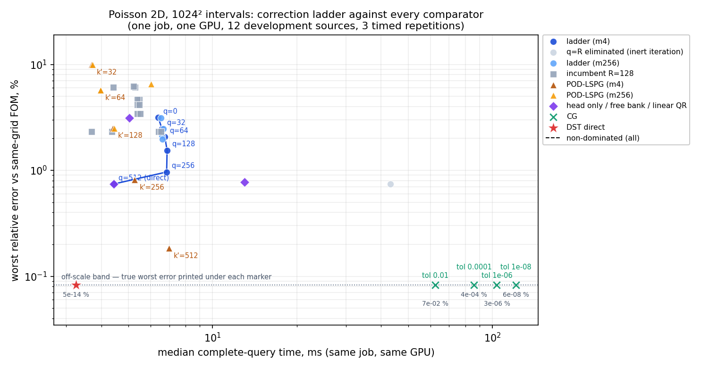
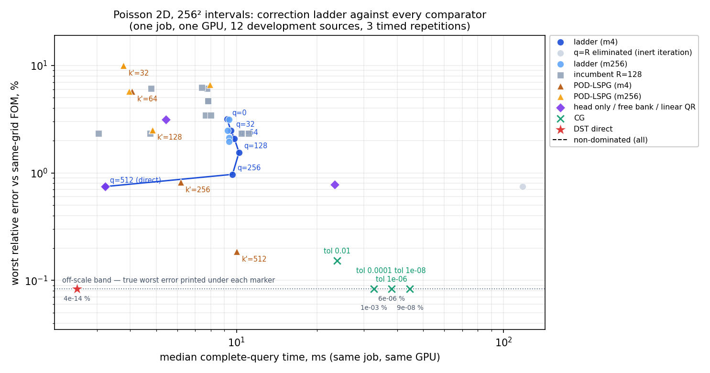

# Poisson 2D — the correction ladder to q = R on the best checkpoint, against POD-LSPG, DST and CG

This report covers one pre-registered cell (`experiments/p-linear/DESIGN.md`): the full correction ladder on the R=512/K=32 Poisson checkpoint with every comparator timed in the same job, at 1024 and 256 intervals, plus a head-capacity job on the same frozen bank. All numbers come from completed, checksum-collected, independently audited GPU jobs on the twelve opened development sources; they are development evidence, not sealed-cohort results. Numbers marked *provisional* below are from an attempt whose audit or archive is not yet complete.

## 1024 intervals — `plin1024b`, job `3783813`, `NVIDIA H200`, source `3e411b5ac59d`

`jax_backend=gpu`, float64, matmul precision `highest`, JAX 0.10.2; 3 timed repetitions, 12 sources, 40 subjects, randomised order, burn-in 0.1 s; elapsed 16.2 min.

### Pre-registered degenerate-curve criterion (m4 ladder of the primary checkpoint)

| clause | requirement | value | verdict |
|---|---|---:|---|
| D1 cost span | max/min median total ms over the ladder < 2 | 1.554x | **pass** |
| D2 top rung lowest error | `d_linear_qr_m4@new_K32` has the lowest worst error of the ladder | 0.7421 % vs min 0.7421 % | **pass** |
| D2 top rung within 1.1x of the cheapest | cheapest is `d_linear_qr_m4@new_K32` | 1.000x | **pass** |
| D2 strict: top rung IS the cheapest | | | yes |
| D3 full-order solver on the non-dominated set | | `dst_direct` | **pass** |
| D3 POD-LSPG on the reduced non-dominated set | | `d_linear_qr_m4@new_K32`, `d_linear_qr_m256@incumbent`, `e_pod512_m4@trainset` | **pass** |

Verdict at 1024 intervals: **DEGENERATE**. Ladder error monotone non-increasing in q: yes.

**Falsification, both readings (DESIGN §A8).** The clause reads: falsified if D1 fails *with error monotone non-increasing in q* — its own parenthetical gloss being "the ladder buys accuracy for $\ge 2\times$ cost".

- **Literal**: D1 holds and the error is monotone, so the literal conjunction is **not met**.
- **Intent**: a rung must cost $\ge 2\times$ the cheapest ladder point *and* be strictly more accurate than it. Rungs that do: **none**, so the intended condition is **not met**.
- The cheapest ladder point is `d_linear_qr_m4@new_K32`; the top rung is `d_linear_qr_m4@new_K32`. The D1 span is driven by the top rung being **1.55x cheaper** than the dearest rung, not by any rung paying more for accuracy. Span over the $q < R$ rungs alone (post-hoc, not pre-registered): 1.075x.

### The ladder

| rung | q | M | worst same-grid | median same-grid | augmented best-found (worst) | bank floor | median total ms | median device ms | valid | LM Jacobians |
|---|---:|---:|---:|---:|---:|---:|---:|---:|---:|---:|
| `q0_m256@new_K32` | 0 | 257 | 3.1146 % | 0.5049 % | 3.1139 % | 0.7421 % | 6.531 | 4.067 | 36/36 | 6.0 |
| `q32_m256@new_K32` | 32 | 257 | 2.4641 % | 0.4437 % | ~~24.2246 %~~ INVALID (A10) | 0.7421 % | 6.655 | 4.120 | 36/36 | 6.0 |
| `q64_m256@new_K32` | 64 | 257 | 2.1231 % | 0.4234 % | ~~32.3207 %~~ INVALID (A10) | 0.7421 % | 6.601 | 4.152 | 36/36 | 6.0 |
| `q128_m256@new_K32` | 128 | 257 | 1.9629 % | 0.4516 % | ~~38.1482 %~~ INVALID (A10) | 0.7421 % | 6.620 | 4.134 | 36/36 | 6.0 |
| `q0_m4@new_K32` | 0 | 129 | 3.1495 % | 0.5079 % | 3.1139 % | 0.7421 % | 6.394 | 3.941 | 36/36 | 6.0 |
| `q32_m4@new_K32` | 32 | 257 | 2.4641 % | 0.4437 % | ~~24.2246 %~~ INVALID (A10) | 0.7421 % | 6.592 | 4.108 | 36/36 | 6.0 |
| `q64_m4@new_K32` | 64 | 384 | 2.0760 % | 0.4128 % | ~~32.3207 %~~ INVALID (A10) | 0.7421 % | 6.745 | 4.240 | 36/36 | 6.0 |
| `q128_m4@new_K32` | 128 | 640 | 1.5459 % | 0.3195 % | ~~38.1482 %~~ INVALID (A10) | 0.7421 % | 6.875 | 4.393 | 36/36 | 6.0 |
| `q256_m4@new_K32` | 256 | 1153 | 0.9648 % | 0.1315 % | ~~43.7694 %~~ INVALID (A10) | 0.7421 % | 6.849 | 4.319 | 36/36 | 6.0 |
| `q512_m4@new_K32` | 512 | 2177 | 0.7421 % | 0.0580 % | ~~45.7496 %~~ INVALID (A10) | 0.7421 % | 43.220 | 40.632 | 0/36 (q=R, degenerate by construction) | 195.0 |
| `d_linear_qr_m4@new_K32` | 512 | 2177 | 0.7421 % | 0.0580 % | ~~45.7496 %~~ INVALID (A10) | 0.7421 % | 4.424 | 1.830 | 36/36 (q=R, degenerate by construction) | 0.0 |

Three layers at q = 0 for `new_K32`: bank floor 0.7421 %, dense best-found — (not run above 256 intervals, DESIGN A7), projected-oracle best-found 3.1139 %, solved (`q0_m256`) 3.1146 %.

**Augmented best-found column, q > 0 (DESIGN §A10).** In this job the untimed oracle projected with $V^\top V = \rho I$, $\rho = ((n-1)/254)^2 = 16.2212$, instead of $I$. Bracket floor ≤ best-found(q) ≤ solved(q) holds at q = 0 and fails at q = 32, 64, 128, 256, 512 (at q = R the oracle must equal the floor; it reads 45.7496 % against 0.7421 %). Every q > 0 value in this column is therefore **retracted** and nothing in this report uses it; the solved errors and the floor bracket each rung on their own. The q = 0 value has no V and is unaffected. The oracle is fixed in `plin_core.py` and verified locally (`checks/2026-09-17-oracle-fix-check-64.json`); a corrected column needs a re-run of the untimed oracle.

### Every subject

| subject | family | unknowns | q | rule | M | worst same-grid | median same-grid | worst physical | median total ms | median device ms | valid | iters |
|---|---|---:|---:|---|---:|---:|---:|---:|---:|---:|---:|---:|
| `q0_m256@new_K32` | neural+linear | 32 | 0 | m256 | 257 | 3.1146 % | 0.5049 % | 3.1142 % | 6.531 | 4.067 | 36/36 | 6.0 |
| `q32_m256@new_K32` | neural+linear | 64 | 32 | m256 | 257 | 2.4641 % | 0.4437 % | 2.4638 % | 6.655 | 4.120 | 36/36 | 6.0 |
| `q64_m256@new_K32` | neural+linear | 96 | 64 | m256 | 257 | 2.1231 % | 0.4234 % | 2.1229 % | 6.601 | 4.152 | 36/36 | 6.0 |
| `q128_m256@new_K32` | neural+linear | 160 | 128 | m256 | 257 | 1.9629 % | 0.4516 % | 1.9627 % | 6.620 | 4.134 | 36/36 | 6.0 |
| `q0_m4@new_K32` | neural+linear | 32 | 0 | m4 | 129 | 3.1495 % | 0.5079 % | 3.1491 % | 6.394 | 3.941 | 36/36 | 6.0 |
| `q32_m4@new_K32` | neural+linear | 64 | 32 | m4 | 257 | 2.4641 % | 0.4437 % | 2.4638 % | 6.592 | 4.108 | 36/36 | 6.0 |
| `q64_m4@new_K32` | neural+linear | 96 | 64 | m4 | 384 | 2.0760 % | 0.4128 % | 2.0757 % | 6.745 | 4.240 | 36/36 | 6.0 |
| `q128_m4@new_K32` | neural+linear | 160 | 128 | m4 | 640 | 1.5459 % | 0.3195 % | 1.5457 % | 6.875 | 4.393 | 36/36 | 6.0 |
| `q256_m4@new_K32` | neural+linear | 288 | 256 | m4 | 1153 | 0.9648 % | 0.1315 % | 0.9646 % | 6.849 | 4.319 | 36/36 | 6.0 |
| `q512_m4@new_K32` | neural+linear | 544 | 512 | m4 | 2177 | 0.7421 % | 0.0580 % | 0.7419 % | 43.220 | 40.632 | 0/36 | 195.0 |
| `a_neural@new_K32` | neural | 32 | 0 | m256 | 257 | 3.1146 % | 0.5049 % | 3.1142 % | 5.047 | 2.667 | 36/36 | 5.0 |
| `d_freebank_m4@new_K32` | free | 512 | 512 | m4 | 2177 | 0.7751 % | 0.0596 % | 0.7749 % | 13.021 | 10.662 | 36/36 | 7.0 |
| `d_linear_qr_m4@new_K32` | linear | 512 | 512 | m4 | 2177 | 0.7421 % | 0.0580 % | 0.7419 % | 4.424 | 1.830 | 36/36 | 0.0 |
| `q0_m256@incumbent` | neural+linear | 16 | 0 | m256 | 257 | 6.0931 % | 1.2421 % | 6.0927 % | 5.288 | 2.857 | 36/36 | 6.0 |
| `q32_m256@incumbent` | neural+linear | 48 | 32 | m256 | 257 | 4.6674 % | 0.9368 % | 4.6670 % | 5.461 | 2.936 | 36/36 | 6.5 |
| `q64_m256@incumbent` | neural+linear | 80 | 64 | m256 | 257 | 3.4311 % | 0.7877 % | 3.4308 % | 5.393 | 2.949 | 36/36 | 6.0 |
| `q128_m256@incumbent` | neural+linear | 144 | 128 | m256 | 257 | 2.3278 % | 0.3723 % | 2.3274 % | 6.407 | 3.921 | 0/36 | 1.5 |
| `q0_m4@incumbent` | neural+linear | 16 | 0 | m4 | 64 | 6.2254 % | 1.2605 % | 6.2249 % | 5.212 | 2.817 | 36/36 | 6.5 |
| `q32_m4@incumbent` | neural+linear | 48 | 32 | m4 | 193 | 4.6807 % | 0.9419 % | 4.6803 % | 5.377 | 2.927 | 36/36 | 6.5 |
| `q64_m4@incumbent` | neural+linear | 80 | 64 | m4 | 320 | 3.4284 % | 0.7862 % | 3.4280 % | 5.502 | 2.993 | 36/36 | 6.0 |
| `q128_m4@incumbent` | neural+linear | 144 | 128 | m4 | 577 | 2.3152 % | 0.3682 % | 2.3148 % | 6.546 | 4.079 | 0/36 | 1.0 |
| `a_neural@incumbent` | neural | 16 | 0 | m256 | 257 | 6.0931 % | 1.2421 % | 6.0927 % | 4.419 | 1.997 | 36/36 | 5.0 |
| `d_freebank_m256@incumbent` | free | 128 | 128 | m256 | 257 | 2.3278 % | 0.3723 % | 2.3274 % | 4.367 | 2.029 | 36/36 | 2.0 |
| `d_linear_qr_m256@incumbent` | linear | 128 | 128 | m256 | 257 | 2.3278 % | 0.3723 % | 2.3274 % | 3.692 | 1.087 | 36/36 | 0.0 |
| `q64_m256_ccrule@incumbent` | neural+linear | 80 | 64 | m256 | 257 | 4.1785 % | 0.6870 % | 4.1781 % | 5.384 | 2.962 | 36/36 | 6.5 |
| `q64_m4_ccrule@incumbent` | neural+linear | 80 | 64 | m4 | 320 | 4.1738 % | 0.6864 % | 4.1734 % | 5.476 | 3.048 | 36/36 | 6.5 |
| `e_pod32_m256@trainset` | pod | 32 | — | m256 | 257 | 9.9816 % | 2.7357 % | 9.9811 % | 3.717 | 1.359 | 36/36 | 1.5 |
| `e_pod64_m256@trainset` | pod | 64 | — | m256 | 257 | 5.7282 % | 0.6099 % | 5.7277 % | 3.977 | 1.615 | 36/36 | 2.0 |
| `e_pod128_m256@trainset` | pod | 128 | — | m256 | 257 | 2.5027 % | 0.1058 % | 2.5023 % | 4.449 | 2.056 | 36/36 | 2.0 |
| `e_pod256_m256@trainset` | pod | 256 | — | m256 | 257 | 6.5498 % | 0.1674 % | 6.5497 % | 6.031 | 3.542 | 36/36 | 3.5 |
| `e_pod32_m4@trainset` | pod | 32 | — | m4 | 129 | 9.9816 % | 2.7357 % | 9.9812 % | 3.696 | 1.318 | 36/36 | 1.5 |
| `e_pod64_m4@trainset` | pod | 64 | — | m4 | 257 | 5.7282 % | 0.6099 % | 5.7277 % | 3.970 | 1.571 | 36/36 | 2.0 |
| `e_pod128_m4@trainset` | pod | 128 | — | m4 | 512 | 2.5019 % | 0.1058 % | 2.5015 % | 4.397 | 2.095 | 36/36 | 2.0 |
| `e_pod256_m4@trainset` | pod | 256 | — | m4 | 1025 | 0.8119 % | 0.0133 % | 0.8116 % | 5.262 | 2.908 | 36/36 | 2.0 |
| `e_pod512_m4@trainset` | pod | 512 | — | m4 | 2048 | 0.1838 % | 0.0014 % | 0.1837 % | 6.972 | 4.572 | 36/36 | 2.0 |
| `dst_direct` | fom | — | — | — | — | 0.0000 % | 0.0000 % | 0.0007 % | 3.248 | 0.237 | 36/36 | — |
| `cg_0.01` | fom | — | — | — | — | 0.0722 % | 0.0297 % | 0.0722 % | 62.498 | 60.017 | 36/36 | 1566.5 |
| `cg_0.0001` | fom | — | — | — | — | 0.0004 % | 0.0001 % | 0.0009 % | 85.988 | 83.437 | 36/36 | 2213.5 |
| `cg_1e-06` | fom | — | — | — | — | 0.0000 % | 0.0000 % | 0.0007 % | 103.642 | 101.260 | 36/36 | 2680.0 |
| `cg_1e-08` | fom | — | — | — | — | 0.0000 % | 0.0000 % | 0.0007 % | 121.385 | 118.879 | 36/36 | 3158.5 |

### Fidelity gates and consistency

| gate | metric | worst relative difference | tolerance | verdict |
|---|---|---:|---:|---|
| `a_neural@incumbent` vs `a_neural@incumbent` (job 3748202) | physical_error | 3.965e-15 | 1e-09 | pass |
| `a_neural@incumbent` vs `a_neural@incumbent` (job 3748202) | same_grid_error | 3.965e-15 | 1e-09 | pass |
| `q32_m256@incumbent` vs `a_neural_q32@incumbent` (job 3748202) | physical_error | 4.322e-15 | 1e-09 | pass |
| `q32_m256@incumbent` vs `a_neural_q32@incumbent` (job 3748202) | same_grid_error | 4.322e-15 | 1e-09 | pass |
| `d_freebank_m256@incumbent` vs `d_freebank@incumbent` (job 3748202) | physical_error | 6.914e-16 | 1e-09 | pass |
| `d_freebank_m256@incumbent` vs `d_freebank@incumbent` (job 3748202) | same_grid_error | 6.784e-16 | 1e-09 | pass |
| `a_neural@new_K32` vs `a_neural@new_K32` (job 3748202) | physical_error | 1.521e-15 | 1e-09 | pass |
| `a_neural@new_K32` vs `a_neural@new_K32` (job 3748202) | same_grid_error | 1.369e-15 | 1e-09 | pass |
| `q32_m256@new_K32` vs `a_neural_q32@new_K32` (job 3748202) | physical_error | 5.385e-13 | 1e-09 | pass |
| `q32_m256@new_K32` vs `a_neural_q32@new_K32` (job 3748202) | same_grid_error | 5.398e-13 | 1e-09 | pass |
| `e_pod32_m256@trainset` vs `e_pod32@trainset` (job 3748202) | physical_error | 1.678e-14 | 1e-09 | pass |
| `e_pod32_m256@trainset` vs `e_pod32@trainset` (job 3748202) | same_grid_error | 1.666e-14 | 1e-09 | pass |
| `e_pod64_m256@trainset` vs `e_pod64@trainset` (job 3748202) | physical_error | 1.964e-13 | 1e-09 | pass |
| `e_pod64_m256@trainset` vs `e_pod64@trainset` (job 3748202) | same_grid_error | 1.966e-13 | 1e-09 | pass |
| `e_pod128_m256@trainset` vs `e_pod128@trainset` (job 3748202) | physical_error | 5.523e-12 | 1e-09 | pass |
| `e_pod128_m256@trainset` vs `e_pod128@trainset` (job 3748202) | same_grid_error | 5.524e-12 | 1e-09 | pass |
| `dst_direct` vs `dst_direct` (job 3748202) | physical_error | 0.000e+00 | 1e-09 | pass |
| `dst_direct` vs `dst_direct` (job 3748202) | same_grid_error | 0.000e+00 | 1e-09 | pass |
| `q0_m256@incumbent` vs `q0_m256` (job 3734084) | physical_error | 1.771e-15 | 1e-09 | pass |
| `q32_m256@incumbent` vs `q32_m256` (job 3734084) | physical_error | 4.890e-15 | 1e-09 | pass |
| `q64_m256_ccrule@incumbent` vs `q64_m256` (job 3734084) | physical_error | 3.729e-14 | 1e-09 | pass |
| `q64_m4_ccrule@incumbent` vs `q64_m4` (job 3734084) | physical_error | 4.145e-14 | 1e-09 | pass |
| `dst_direct` vs `dst_direct` (job 3734084) | physical_error | 0.000e+00 | 1e-09 | pass |

| consistency pair | worst field relative difference | tolerance | verdict |
|---|---:|---:|---|
| `q0_m256@new_K32` vs `a_neural@new_K32` | 6.689e-16 | 1e-06 | pass |
| `q0_m256@incumbent` vs `a_neural@incumbent` | 1.762e-15 | 1e-06 | pass |
| `q512_m4@new_K32` vs `d_linear_qr_m4@new_K32` | 2.481e-07 | 1e-05 | pass |
| `d_freebank_m4@new_K32` vs `d_linear_qr_m4@new_K32` | 2.241e-03 | 0.01 | pass |
| `d_freebank_m256@incumbent` vs `d_linear_qr_m256@incumbent` | 4.090e-07 | 1e-06 | pass |
| `q32_m4@new_K32` vs `q32_m256@new_K32` | 0.000e+00 | 1e-12 | pass |

Directions for `new_K32`: retained prefix exact True; rebuilt-prefix subspace defect 3.35e-06; extension orthonormality error 1.26e-09; residual energy captured at q=32/128/512: 0.421/0.814/1.000.

Directions for `incumbent`: retained prefix exact True; rebuilt-prefix subspace defect 2.83e-07; extension orthonormality error 1.59e-13; residual energy captured at q=32/128/512: 0.702/1.000/1.000.

Independent NumPy audit (`audit.json`): all checks pass; 1440 errors recomputed from 480 retained fields, worst same-grid difference 1.53e-16; criterion re-derived independently: degenerate = True.

## 256 intervals — `plin256`, job `3780692`, `NVIDIA A100-PCIE-40GB`, source `b43a437d7360`

`jax_backend=gpu`, float64, matmul precision `highest`, JAX 0.10.2; 3 timed repetitions, 12 sources, 38 subjects, randomised order, burn-in 0.1 s; elapsed 19.5 min.

### Pre-registered degenerate-curve criterion (m4 ladder of the primary checkpoint)

| clause | requirement | value | verdict |
|---|---|---:|---|
| D1 cost span | max/min median total ms over the ladder < 2 | 3.173x | **FAIL** |
| D2 top rung lowest error | `d_linear_qr_m4@new_K32` has the lowest worst error of the ladder | 0.7459 % vs min 0.7459 % | **pass** |
| D2 top rung within 1.1x of the cheapest | cheapest is `d_linear_qr_m4@new_K32` | 1.000x | **pass** |
| D2 strict: top rung IS the cheapest | | | yes |
| D3 full-order solver on the non-dominated set | | `dst_direct` | **pass** |
| D3 POD-LSPG on the reduced non-dominated set | | `d_linear_qr_m4@new_K32`, `d_linear_qr_m256@incumbent`, `e_pod512_m4@trainset` | **pass** |

Verdict at 256 intervals: **NOT degenerate under the pre-registered clauses as literally written**. Ladder error monotone non-increasing in q: yes.

**Falsification, both readings (DESIGN §A8).** The clause reads: falsified if D1 fails *with error monotone non-increasing in q* — its own parenthetical gloss being "the ladder buys accuracy for $\ge 2\times$ cost".

- **Literal**: D1 fails and the error is monotone, so the literal conjunction is **MET**.
- **Intent**: a rung must cost $\ge 2\times$ the cheapest ladder point *and* be strictly more accurate than it. Rungs that do: **none**, so the intended condition is **not met**.
- The cheapest ladder point is `d_linear_qr_m4@new_K32`; the top rung is `d_linear_qr_m4@new_K32`. The D1 span is driven by the top rung being **3.17x cheaper** than the dearest rung, not by any rung paying more for accuracy. Span over the $q < R$ rungs alone (post-hoc, not pre-registered): 1.109x.

### The ladder

| rung | q | M | worst same-grid | median same-grid | augmented best-found (worst) | bank floor | median total ms | median device ms | valid | LM Jacobians |
|---|---:|---:|---:|---:|---:|---:|---:|---:|---:|---:|
| `q0_m256@new_K32` | 0 | 257 | 3.1217 % | 0.5050 % | 3.1211 % | 0.7459 % | 9.379 | 6.711 | 36/36 | 6.0 |
| `q32_m256@new_K32` | 32 | 257 | 2.4699 % | 0.4437 % | 2.4555 % (inflated ≤ 6.2e-03 %, A10) | 0.7459 % | 9.267 | 6.675 | 36/36 | 6.0 |
| `q64_m256@new_K32` | 64 | 257 | 2.1281 % | 0.4233 % | 2.0787 % (inflated ≤ 6.2e-03 %, A10) | 0.7459 % | 9.384 | 6.924 | 36/36 | 6.0 |
| `q128_m256@new_K32` | 128 | 257 | 1.9661 % | 0.4516 % | 1.5493 % (inflated ≤ 6.2e-03 %, A10) | 0.7459 % | 9.384 | 6.706 | 36/36 | 6.0 |
| `q0_m4@new_K32` | 0 | 129 | 3.1567 % | 0.5080 % | 3.1211 % | 0.7459 % | 9.214 | 6.703 | 36/36 | 6.0 |
| `q32_m4@new_K32` | 32 | 257 | 2.4699 % | 0.4437 % | 2.4555 % (inflated ≤ 6.2e-03 %, A10) | 0.7459 % | 9.537 | 6.893 | 36/36 | 6.0 |
| `q64_m4@new_K32` | 64 | 384 | 2.0808 % | 0.4127 % | 2.0787 % (inflated ≤ 6.2e-03 %, A10) | 0.7459 % | 9.819 | 7.347 | 36/36 | 6.0 |
| `q128_m4@new_K32` | 128 | 640 | 1.5497 % | 0.3195 % | 1.5493 % (inflated ≤ 6.2e-03 %, A10) | 0.7459 % | 10.219 | 7.536 | 36/36 | 6.0 |
| `q256_m4@new_K32` | 256 | 1153 | 0.9689 % | 0.1315 % | 0.9691 % (inflated ≤ 6.2e-03 %, A10) | 0.7459 % | 9.658 | 7.121 | 36/36 | 6.0 |
| `q512_m4@new_K32` | 512 | 2177 | 0.7459 % | 0.0580 % | 0.7462 % (inflated ≤ 6.2e-03 %, A10) | 0.7459 % | 117.854 | 114.990 | 0/36 (q=R, degenerate by construction) | 195.0 |
| `d_linear_qr_m4@new_K32` | 512 | 2177 | 0.7459 % | 0.0580 % | 0.7462 % (inflated ≤ 6.2e-03 %, A10) | 0.7459 % | 3.221 | 1.693 | 36/36 (q=R, degenerate by construction) | 0.0 |

Three layers at q = 0 for `new_K32`: bank floor 0.7459 %, dense best-found 3.1211 %, projected-oracle best-found 3.1211 %, solved (`q0_m256`) 3.1217 %.

**Augmented best-found column, q > 0 (DESIGN §A10).** In this job the untimed oracle projected with $V^\top V = \rho I$, $\rho = ((n-1)/254)^2 = 1.0079$, instead of $I$. Bracket floor ≤ best-found(q) ≤ solved(q) holds at q = 0, 32, 64, 128 and fails at q = 256, 512 (at q = R the oracle must equal the floor; it reads 0.7462 % against 0.7459 %). The q > 0 values are correct to the stated inflation bound and are used nowhere in the criterion. The q = 0 value has no V and is unaffected. The oracle is fixed in `plin_core.py` and verified locally (`checks/2026-09-17-oracle-fix-check-64.json`); a corrected column needs a re-run of the untimed oracle.

### Every subject

| subject | family | unknowns | q | rule | M | worst same-grid | median same-grid | worst physical | median total ms | median device ms | valid | iters |
|---|---|---:|---:|---|---:|---:|---:|---:|---:|---:|---:|---:|
| `q0_m256@new_K32` | neural+linear | 32 | 0 | m256 | 257 | 3.1217 % | 0.5050 % | 3.1143 % | 9.379 | 6.711 | 36/36 | 6.0 |
| `q32_m256@new_K32` | neural+linear | 64 | 32 | m256 | 257 | 2.4699 % | 0.4437 % | 2.4639 % | 9.267 | 6.675 | 36/36 | 6.0 |
| `q64_m256@new_K32` | neural+linear | 96 | 64 | m256 | 257 | 2.1281 % | 0.4233 % | 2.1230 % | 9.384 | 6.924 | 36/36 | 6.0 |
| `q128_m256@new_K32` | neural+linear | 160 | 128 | m256 | 257 | 1.9661 % | 0.4516 % | 1.9630 % | 9.384 | 6.706 | 36/36 | 6.0 |
| `q0_m4@new_K32` | neural+linear | 32 | 0 | m4 | 129 | 3.1567 % | 0.5080 % | 3.1486 % | 9.214 | 6.703 | 36/36 | 6.0 |
| `q32_m4@new_K32` | neural+linear | 64 | 32 | m4 | 257 | 2.4699 % | 0.4437 % | 2.4639 % | 9.537 | 6.893 | 36/36 | 6.0 |
| `q64_m4@new_K32` | neural+linear | 96 | 64 | m4 | 384 | 2.0808 % | 0.4127 % | 2.0759 % | 9.819 | 7.347 | 36/36 | 6.0 |
| `q128_m4@new_K32` | neural+linear | 160 | 128 | m4 | 640 | 1.5497 % | 0.3195 % | 1.5459 % | 10.219 | 7.536 | 36/36 | 6.0 |
| `q256_m4@new_K32` | neural+linear | 288 | 256 | m4 | 1153 | 0.9689 % | 0.1315 % | 0.9647 % | 9.658 | 7.121 | 36/36 | 6.0 |
| `q512_m4@new_K32` | neural+linear | 544 | 512 | m4 | 2177 | 0.7459 % | 0.0580 % | 0.7421 % | 117.854 | 114.990 | 0/36 | 195.0 |
| `a_neural@new_K32` | neural | 32 | 0 | m256 | 257 | 3.1217 % | 0.5050 % | 3.1143 % | 5.432 | 3.846 | 36/36 | 5.0 |
| `d_freebank_m4@new_K32` | free | 512 | 512 | m4 | 2177 | 0.7789 % | 0.0597 % | 0.7749 % | 23.295 | 21.416 | 36/36 | 7.0 |
| `d_linear_qr_m4@new_K32` | linear | 512 | 512 | m4 | 2177 | 0.7459 % | 0.0580 % | 0.7421 % | 3.221 | 1.693 | 36/36 | 0.0 |
| `q0_m256@incumbent` | neural+linear | 16 | 0 | m256 | 257 | 6.1014 % | 1.2423 % | 6.0927 % | 7.755 | 5.215 | 36/36 | 6.0 |
| `q32_m256@incumbent` | neural+linear | 48 | 32 | m256 | 257 | 4.6745 % | 0.9371 % | 4.6671 % | 7.815 | 5.214 | 36/36 | 6.5 |
| `q64_m256@incumbent` | neural+linear | 80 | 64 | m256 | 257 | 3.4376 % | 0.7879 % | 3.4309 % | 7.667 | 5.123 | 36/36 | 6.0 |
| `q128_m256@incumbent` | neural+linear | 144 | 128 | m256 | 257 | 2.3353 % | 0.3726 % | 2.3276 % | 10.451 | 7.777 | 0/36 | 2.0 |
| `q0_m4@incumbent` | neural+linear | 16 | 0 | m4 | 64 | 6.2337 % | 1.2607 % | 6.2242 % | 7.422 | 4.916 | 36/36 | 6.5 |
| `q32_m4@incumbent` | neural+linear | 48 | 32 | m4 | 193 | 4.6878 % | 0.9422 % | 4.6805 % | 7.805 | 5.279 | 36/36 | 6.5 |
| `q64_m4@incumbent` | neural+linear | 80 | 64 | m4 | 320 | 3.4349 % | 0.7865 % | 3.4281 % | 8.028 | 5.497 | 36/36 | 6.0 |
| `q128_m4@incumbent` | neural+linear | 144 | 128 | m4 | 577 | 2.3227 % | 0.3685 % | 2.3149 % | 11.080 | 8.526 | 0/36 | 2.0 |
| `a_neural@incumbent` | neural | 16 | 0 | m256 | 257 | 6.1014 % | 1.2423 % | 6.0927 % | 4.781 | 3.117 | 36/36 | 5.0 |
| `d_freebank_m256@incumbent` | free | 128 | 128 | m256 | 257 | 2.3353 % | 0.3726 % | 2.3276 % | 4.750 | 3.126 | 36/36 | 2.0 |
| `d_linear_qr_m256@incumbent` | linear | 128 | 128 | m256 | 257 | 2.3353 % | 0.3726 % | 2.3276 % | 3.041 | 1.464 | 36/36 | 0.0 |
| `e_pod32_m256@trainset` | pod | 32 | — | m256 | 257 | 9.9912 % | 2.7371 % | 9.9808 % | 3.765 | 2.158 | 36/36 | 1.5 |
| `e_pod64_m256@trainset` | pod | 64 | — | m256 | 257 | 5.7375 % | 0.6105 % | 5.7272 % | 3.966 | 2.322 | 36/36 | 2.0 |
| `e_pod128_m256@trainset` | pod | 128 | — | m256 | 257 | 2.5125 % | 0.1060 % | 2.5041 % | 4.848 | 3.158 | 36/36 | 2.0 |
| `e_pod256_m256@trainset` | pod | 256 | — | m256 | 257 | 6.6264 % | 0.1696 % | 6.6244 % | 7.956 | 6.180 | 36/36 | 4.0 |
| `e_pod32_m4@trainset` | pod | 32 | — | m4 | 129 | 9.9912 % | 2.7371 % | 9.9809 % | 3.766 | 2.094 | 36/36 | 1.5 |
| `e_pod64_m4@trainset` | pod | 64 | — | m4 | 257 | 5.7375 % | 0.6105 % | 5.7272 % | 4.062 | 2.309 | 36/36 | 2.0 |
| `e_pod128_m4@trainset` | pod | 128 | — | m4 | 512 | 2.5117 % | 0.1060 % | 2.5033 % | 4.825 | 3.231 | 36/36 | 2.0 |
| `e_pod256_m4@trainset` | pod | 256 | — | m4 | 1025 | 0.8165 % | 0.0134 % | 0.8117 % | 6.171 | 4.566 | 36/36 | 2.0 |
| `e_pod512_m4@trainset` | pod | 512 | — | m4 | 2048 | 0.1855 % | 0.0014 % | 0.1842 % | 10.002 | 8.340 | 36/36 | 2.0 |
| `dst_direct` | fom | — | — | — | — | 0.0000 % | 0.0000 % | 0.0155 % | 2.526 | 0.227 | 36/36 | — |
| `cg_0.01` | fom | — | — | — | — | 0.1527 % | 0.0554 % | 0.1538 % | 23.818 | 22.290 | 36/36 | 364.5 |
| `cg_0.0001` | fom | — | — | — | — | 0.0012 % | 0.0003 % | 0.0155 % | 32.698 | 30.962 | 36/36 | 536.0 |
| `cg_1e-06` | fom | — | — | — | — | 0.0000 % | 0.0000 % | 0.0155 % | 38.046 | 36.330 | 36/36 | 649.5 |
| `cg_1e-08` | fom | — | — | — | — | 0.0000 % | 0.0000 % | 0.0155 % | 44.597 | 42.669 | 36/36 | 771.0 |

### Fidelity gates and consistency

| gate | metric | worst relative difference | tolerance | verdict |
|---|---|---:|---:|---|
| `a_neural@incumbent` vs `a_neural@incumbent` (job 3748202) | physical_error | 3.541e-15 | 1e-09 | pass |
| `a_neural@incumbent` vs `a_neural@incumbent` (job 3748202) | same_grid_error | 3.542e-15 | 1e-09 | pass |
| `q32_m256@incumbent` vs `a_neural_q32@incumbent` (job 3748202) | physical_error | 4.642e-15 | 1e-09 | pass |
| `q32_m256@incumbent` vs `a_neural_q32@incumbent` (job 3748202) | same_grid_error | 4.636e-15 | 1e-09 | pass |
| `d_freebank_m256@incumbent` vs `d_freebank@incumbent` (job 3748202) | physical_error | 8.689e-16 | 1e-09 | pass |
| `d_freebank_m256@incumbent` vs `d_freebank@incumbent` (job 3748202) | same_grid_error | 8.733e-16 | 1e-09 | pass |
| `a_neural@new_K32` vs `a_neural@new_K32` (job 3748202) | physical_error | 3.128e-15 | 1e-09 | pass |
| `a_neural@new_K32` vs `a_neural@new_K32` (job 3748202) | same_grid_error | 3.322e-15 | 1e-09 | pass |
| `q32_m256@new_K32` vs `a_neural_q32@new_K32` (job 3748202) | physical_error | 1.698e-13 | 1e-09 | pass |
| `q32_m256@new_K32` vs `a_neural_q32@new_K32` (job 3748202) | same_grid_error | 1.700e-13 | 1e-09 | pass |
| `e_pod32_m256@trainset` vs `e_pod32@trainset` (job 3748202) | physical_error | 2.081e-16 | 1e-09 | pass |
| `e_pod32_m256@trainset` vs `e_pod32@trainset` (job 3748202) | same_grid_error | 1.898e-16 | 1e-09 | pass |
| `e_pod64_m256@trainset` vs `e_pod64@trainset` (job 3748202) | physical_error | 1.224e-14 | 1e-09 | pass |
| `e_pod64_m256@trainset` vs `e_pod64@trainset` (job 3748202) | same_grid_error | 2.410e-15 | 1e-09 | pass |
| `e_pod128_m256@trainset` vs `e_pod128@trainset` (job 3748202) | physical_error | 1.538e-14 | 1e-09 | pass |
| `e_pod128_m256@trainset` vs `e_pod128@trainset` (job 3748202) | same_grid_error | 8.834e-15 | 1e-09 | pass |
| `dst_direct` vs `dst_direct` (job 3748202) | physical_error | 0.000e+00 | 1e-09 | pass |
| `dst_direct` vs `dst_direct` (job 3748202) | same_grid_error | 0.000e+00 | 1e-09 | pass |

| consistency pair | worst field relative difference | tolerance | verdict |
|---|---:|---:|---|
| `q0_m256@new_K32` vs `a_neural@new_K32` | 8.049e-16 | 1e-06 | pass |
| `q0_m256@incumbent` vs `a_neural@incumbent` | 2.110e-15 | 1e-06 | pass |
| `q512_m4@new_K32` vs `d_linear_qr_m4@new_K32` | 1.016e-07 | 1e-05 | pass |
| `d_freebank_m4@new_K32` vs `d_linear_qr_m4@new_K32` | 2.251e-03 | 0.01 | pass |
| `d_freebank_m256@incumbent` vs `d_linear_qr_m256@incumbent` | 4.089e-07 | 1e-06 | pass |
| `q32_m4@new_K32` vs `q32_m256@new_K32` | 0.000e+00 | 1e-12 | pass |

Directions for `new_K32`: retained prefix exact True; rebuilt-prefix subspace defect 2.27e-06; extension orthonormality error 1.24e-09; residual energy captured at q=32/128/512: 0.421/0.814/1.000.

Directions for `incumbent`: retained prefix exact True; rebuilt-prefix subspace defect 2.82e-07; extension orthonormality error 1.57e-13; residual energy captured at q=32/128/512: 0.702/1.000/1.000.

Independent NumPy audit (`audit.json`): all checks pass; 1368 errors recomputed from 456 retained fields, worst same-grid difference 3.36e-16; criterion re-derived independently: degenerate = False.

## GPUs, one per job — no ratio is ever formed across meshes or cards

| attempt | mesh | job | GPU |
|---|---:|---|---|
| `plin1024b` | 1024² | `3783813` | `NVIDIA H200` |
| `plin256` | 256² | `3780692` | `NVIDIA A100-PCIE-40GB` |

Each mesh is one job on one card; every cost ratio, span and non-dominated set above is computed within that job only. The 1024² and 256² rows are never compared to each other on cost (an H200 versus a 40 GB A100).

## Retracted attempts

| attempt | job | state | elapsed | node / GPU | failure | disk at failure | timed numbers | gates run | superseded by |
|---|---|---|---|---|---|---|---|---|---|
| `plin1024` | `3780691` | FAILED 1:0 | 00:14:27 | pax144, NVIDIA A100-PCIE-40GB (40960 MiB) | GPU OOM (RESOURCE_EXHAUSTED) inside the UNTIMED dense best-found oracle: f64[8,1046529,32] jacfwd Jacobian, 2.0 GiB per array, 31.94 GiB autotuner variants | 91% (not disk-full) | none | none | plin1024b / 3783813 (H200, 240G, DESIGN A7 dense-oracle cap) |

A retracted attempt contributes nothing above: no timed row, no gate, no oracle value. Its logs are retained under `runs/<attempt>/logs/`. The rule for an *empty* log is that disk-full is the likely cause; a retracted attempt whose log is complete and ends in a traceback is diagnosed from that traceback instead.

## Job 3 — head capacity on the frozen bank (`plhead1`, job `3783883`, `NVIDIA A100-PCIE-40GB`)

Bank `bank_R512_S3072`, R = 512, 3072 training sources; development bank floor at 255 intervals 0.7459 % worst, 0.0580 % median. Recipe: `pbh_fit.train_head_phase`, 150000 full-batch Adam updates at lr 0.001, seed 20260916201, reconstruction objective only, on the 2611-source fit split.

| arm | K | width | layers | updates | head params | fit (stored codes, worst) | best-found val (worst) | best-found dev (worst) | dev best-found / floor | training s |
|---|---:|---:|---:|---:|---:|---:|---:|---:|---:|---:|
| `pbh02_primary_K32` | 32 | 128 | 2 | — | — | 3.0639 % | 4.4257 % | 3.1212 % | 4.184x | 0 |
| `K32_w128_L2` | 32 | 128 | 2 | 150000 | 103168 | 3.0639 % | 4.4257 % | 3.1212 % | 4.184x | 127 |
| `K32_w256_L2` | 32 | 256 | 2 | 150000 | 222208 | 2.2600 % | 3.8470 % | 2.2652 % | 3.037x | 167 |
| `K32_w128_L3` | 32 | 128 | 3 | 150000 | 119680 | 3.1463 % | 4.8947 % | 3.0625 % | 4.106x | 134 |
| `K32_w256_L3` | 32 | 256 | 3 | 150000 | 288000 | 2.1305 % | 4.0194 % | 2.3614 % | 3.166x | 179 |
| `K64_w128_L2` | 64 | 128 | 2 | 150000 | 123648 | 2.3341 % | 3.9157 % | 2.5625 % | 3.435x | 143 |
| `K64_w256_L3` | 64 | 256 | 3 | 150000 | 312576 | 1.8149 % | 4.1022 % | 2.0553 % | 2.755x | 193 |
| `K32_w128_L2_x3` | 32 | 128 | 2 | 450000 | 103168 | 2.8904 % | 4.6248 % | 2.6428 % | 3.543x | 352 |

**H1 (reproducibility).** The re-run of the pbh02 recipe (`K32_w128_L2`) lands at 3.1212 % worst development best-found against pbh02's frozen primary 3.1212 % in the same job: 0.00 % relative difference against the pre-registered 5 % bar — **pass**.

**H2 (verdict).** The primary's ratio is 4.184x. The largest relative reduction of that ratio by any capacity arm is 34.2 % (`K64_w256_L3`), against the 20 % bar; the lowest ratio reached is 2.755x against the 2x bar for a better anchor. **Partial movement only.**
 Selection by the internal-validation split picks `K32_w256_L2`; the development sources selected nothing.

### Solved at 1024 intervals through the unchanged head-ablation kernel

| subject | K | worst same-grid | median same-grid | worst physical | median total ms | median device ms | stationary | LM iters |
|---|---:|---:|---:|---:|---:|---:|---:|---:|
| `a_neural@pbh02_primary_K32` | 32 | 3.1146 % | 0.5049 % | 3.1142 % | 12.959 | 7.359 | 36/36 | — |
| `a_neural@K32_w128_L2` | 32 | 3.1146 % | 0.5049 % | 3.1142 % | 12.935 | 7.354 | 36/36 | — |
| `a_neural@K32_w256_L2` | 32 | 2.2600 % | 0.2923 % | 2.2597 % | 12.835 | 7.323 | 36/36 | — |
| `a_neural@K32_w128_L3` | 32 | 3.0558 % | 0.4434 % | 3.0555 % | 13.225 | 7.569 | 36/36 | — |
| `a_neural@K32_w256_L3` | 32 | 2.3571 % | 0.2776 % | 2.3568 % | 13.390 | 7.827 | 36/36 | — |
| `a_neural@K64_w128_L2` | 64 | 2.5587 % | 0.3157 % | 2.5584 % | 13.723 | 8.063 | 36/36 | — |
| `a_neural@K64_w256_L3` | 64 | 2.0549 % | 0.1996 % | 2.0547 % | 14.115 | 8.467 | 36/36 | — |
| `a_neural@K32_w128_L2_x3` | 32 | 2.6360 % | 0.4174 % | 2.6356 % | 12.970 | 7.283 | 36/36 | — |
| `dst_direct` | — | 0.0000 % | 0.0000 % | 0.0007 % | 6.945 | 0.492 | 36/36 | — |

| model | bank floor (worst) | best-found (worst) | best-found / floor |
|---|---:|---:|---:|
| `pbh02_primary_K32` | 0.7421 % | 3.1139 % | 4.196x |
| `K32_w128_L2` | 0.7421 % | 3.1139 % | 4.196x |
| `K32_w256_L2` | 0.7421 % | 2.2583 % | 3.043x |
| `K32_w128_L3` | 0.7421 % | 3.0552 % | 4.117x |
| `K32_w256_L3` | 0.7421 % | 2.3552 % | 3.174x |
| `K64_w128_L2` | 0.7421 % | 2.5558 % | 3.444x |
| `K64_w256_L3` | 0.7421 % | 2.0499 % | 2.762x |
| `K32_w128_L2_x3` | 0.7421 % | 2.6355 % | 3.551x |

Gates: `a_neural@pbh02_primary_K32` vs `a_neural@new_K32` 1.589e-15 (pass); `dst_direct` vs `dst_direct` 0.000e+00 (pass)
Independent NumPy audit: all checks pass (recomputed errors worst difference 1.06e-16).

## Glossary

- **rung / q**: the number of linear correction directions added to the neural head's output; q = 0 is the head alone, q = R spans the whole bank (a linear least-squares solve).
- **m4 / m256**: the test-count rule: m4 uses M = 4 x (number of unknowns) sine test modes; m256 uses a fixed 256 requested modes (257 retained).
- **M**: the number of retained sine test modes, i.e. the number of equations in the weak least-squares problem.
- **worst / median same-grid**: relative L2 error against the exact FD-DST solution on the same mesh, worst and median over the 12 development sources.
- **worst physical**: the same against the 2048-interval reference restricted to the mesh.
- **median total ms**: median over all timed invocations of the complete query (host source in, dense field out); **device ms** is the fused device portion.
- **valid**: solves that met every solver-validity rule (stationary, linear recovery, rank); CG rows count converged solves; the q = R rung is flagged invalid by construction because its projected Jacobian is zero.
- **augmented best-found**: the smallest error any point of the augmented manifold {G(h(z)+C_q y)} attains for that source (offline multistart oracle); it brackets the solved error from below.
- **bank floor**: the error of the orthogonal projection of the truth onto the bank's column span; no coefficient choice can beat it.
- **POD-LSPG k'**: a classical proper-orthogonal-decomposition basis of rank k' from the same 3072 training snapshots, solved with the same weak least-squares objective.
- **DST direct**: the exact discrete-sine-transform full-order solve; **CG tol**: unpreconditioned conjugate gradients stopped at that relative residual.
- **non-dominated set**: subjects for which no other subject in the same job has both lower error and lower cost.
- **D1–D3, H1–H2**: the pre-registered clauses of DESIGN.md sections 4 and 5.
- **incumbent**: the earlier R=128/K=16 checkpoint, carried as a cross-job control; **new_K32 / pbh02 primary**: the R=512/K=32 checkpoint this cell is about.
- **ccrule**: correction directions built with the cheap-corrections lane's rule, run only to reproduce that lane's q = 64 numbers.
- **best-found / floor ratio**: how far the head's own image sits above what its bank could represent.
