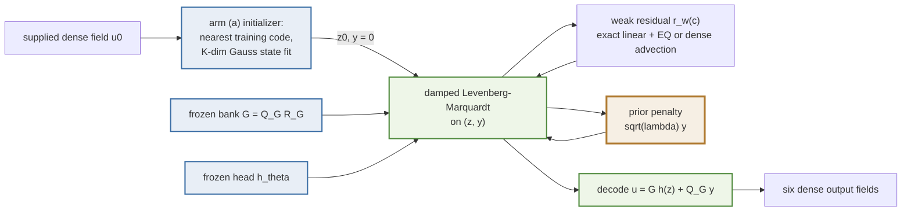
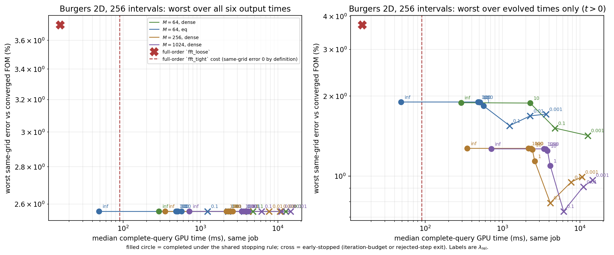
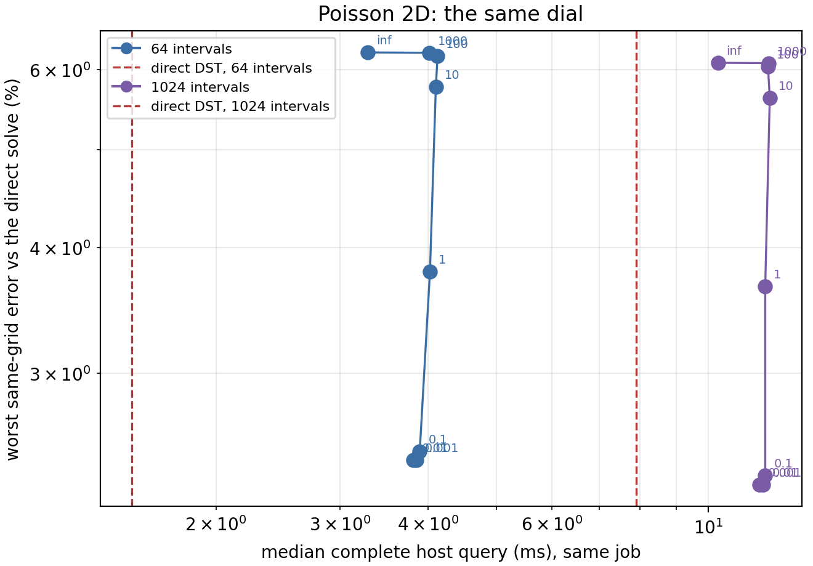

# The prior dial: is trust in the neural prior a usable inference-time knob?

One frozen checkpoint, one knob. Instead of solving only for the latent code with the bank coefficients pinned to the neural head, this cell solves for the **full** bank coefficient vector under a penalty $\lambda$ pulling it back towards the head, and prices the whole range of $\lambda$ from "the head is law" to "the head is a suggestion". **Final for the six opened Burgers development cases and the twelve opened Poisson development sources, and provisional as a paper claim**: one checkpoint per PDE, one training seed, final cohorts sealed.

Burgers job `3733929` on `NVIDIA A100 80GB PCIe` and Poisson job `3733930` on `NVIDIA A100-PCIE-40GB`, source commit `b47211e0ab823fa8359cf0dd57ce06292593d96c`, JAX 0.10.2, backend `gpu`, float64, matmul precision `highest`; elapsed 3952.3 s and 412.7 s.

## The knob

Arm (a) of the head ablation pins the bank coefficients to the head and solves

$$\min_{z\in\mathbb R^{K}}\ \big\|r_w\big(h_\theta(z)\big)\big\|_2^2 .$$

This cell keeps every network weight, the bank $G$, $K=16$, the initializer policy, $\Delta t$, the stopping rule and the output contract, and solves instead

$$\min_{z\in\mathbb R^{K},\,c\in\mathbb R^{R}}\ \big\|r_w(c)\big\|_2^2\;+\;\lambda\,\big\|R_G\,(c-h_\theta(z))\big\|_2^2 ,$$

with $G=Q_GR_G$ the thin QR of the bank, so $\|R_G\delta\|_2=\|G\delta\|_2$ and the penalty is the squared **field-norm** distance between the solved state and the state the head would have produced. Writing $y=R_G(c-h_\theta(z))$ gives $u=G\,h_\theta(z)+Q_G\,y$, so the solver never applies $R_G^{-1}$ to a solved vector, and the residual it sees is

$$F(z,y)=\begin{bmatrix} r_w\big(h_\theta(z)+R_G^{-1}y\big)\\[2pt]\sqrt{\lambda}\,y\end{bmatrix}\in\mathbb R^{M+R}.$$

**The scaling of $\lambda$.** $\lambda=\lambda_{\rm rel}\,\sigma^2$ with $\sigma=\|A R_G^{-1}\|_2=\|\Phi^\top Q_G\|_2$, the exact linear part of $\partial r_w/\partial y$. That part is state independent because the $1/(1+\Delta t\,\nu\lambda_j)$ row scaling of the weak residual cancels the diffusion term exactly, and because $\Phi$ and $Q_G$ both have orthonormal columns $\sigma$ is the largest principal cosine between the test-mode span and the bank span. Measured here: $\sigma=0.9999999997$ at $M=64$ — the frozen bank contains the lowest sine modes almost exactly. $\lambda_{\rm rel}=1$ therefore means one unit of field-norm departure from the head is penalized as strongly as the strongest linear response of the weak residual to it. Every table carries both $\lambda_{\rm rel}$ and $\sigma$, so the absolute $\lambda$ can be recovered.

$\lambda=\infty$ is implemented as the **exact** elimination $c=h_\theta(z)$ — the $y$ block has zero width and is dropped at trace time — not as a large number, which is what makes the first gate a bitwise statement. $\lambda_{\rm rel}=1000$ is the numerically-infinite end of the *finite* code path and exists to show that path returning to arm (a).

## Gates

| gate | result |
| --- | --- |
| (i) local, $\lambda=\infty$ through the new path vs the consolidated saved Burgers case | 2.013e-14 relative (9.593e-13 on internal latents), tolerance 1e-12 |
| (i) local, same vs the incumbent `accuracy_paths.make_rom` | 0.0e+00 — **bit-identical** |
| (i) local, the *finite* path at $\lambda_{\rm rel}=1e+06$ vs that limit | 3.646e-06 relative, realised correction 1.26e-09 of the state norm |
| (ii) in job, `M64_eq_laminf` vs `abl01` `a_neural_eq` on 6 cases | worst 1.007e-12 relative, tolerance 1e-09, 0/6 fields bitwise identical across jobs — **pass** |
| (iii) in job, Poisson `laminf` vs `pabl01` `a_neural` | worst 4.221e-15 relative, tolerance 1e-09 — **pass** |
| (iv) independent NumPy audit recomputing every error from saved fields | worst relative disagreement 5.17e-16; Burgers audit passed, Poisson audit passed |
| structural, the $t=0$ output is $\lambda$-independent | confirmed — see below |

## What the initializer contract already decides

The contract fixes the initializer as arm (a)'s: the nearest training code, a $K$-dimensional Gauss state fit, and $y=0$. So the $t=0$ output of every arm is the head's compression of the supplied field and **cannot depend on $\lambda$** — the audit asserts this and it holds to 0.00e+00 relative across every lambda, test count and quadrature. On these cases that compression error is also the largest of the six output times (exceptions, arm and argmax index: [['M64_dense_lam0p1', 3], ['M64_dense_lam10', 3], ['M64_dense_laminf', 3], ['M64_eq_lam0p001_ty', 1], ['M64_eq_lam0p001_ty', 3], ['M64_eq_lam0p001_ty', 4], ['M64_eq_lam0p001_ty', 5], ['M64_eq_lam0p1', 3], ['M64_eq_lam1', 3], ['M64_eq_lam10', 3]]), so the worst same-grid error over **all** output times is pinned by construction and no setting of $\lambda$ can move it.

That is a real result about this checkpoint, not a defect of the dial, and it is reported as the pre-registered primary metric below. Because it is uninformative about $\lambda$ itself, DESIGN.md amendment 2 — recorded **before** submission, from the local probe — added the worst same-grid error over the **evolved** times as a declared secondary metric, where $\lambda$ can act. Both are reported, and the three acceptance criteria are evaluated against both.

## Burgers: three layers, every setting

Layer 1 is the bank projection floor; layer 2 is the best-found reconstruction on that arm's own reachable set; layer 3 is the solved error. For every **finite** $\lambda$ layers 1 and 2 coincide, because the penalty restricts the *solver*, not the reachable set: the whole bank is still reachable. Only $\lambda=\infty$ has a manifold of its own. Whatever $\lambda$ does, it does entirely in the reduction/solver layer.

The same-grid metric is the discrepancy from the converged full-order solve on this mesh, which is what isolates reduction error from discretization error; the full-order model itself carries 4.0265% worst against the refined reference, and both are reported.

| arm | $M$ | $m$ | quad. | $\lambda_{\rm rel}$ | solved dim | L1 bank floor % | L2 best-found % | L3 worst same-grid % | L3 worst evolved % | median evolved % | worst reference % | realised ‖y‖/‖u‖ % | median iters/step | budget exits | completed | median GPU ms | median host ms |
|---|---:|---:|---|---:|---:|---:|---:|---:|---:|---:|---:|---:|---:|---:|---|---:|---:|
| `M64_dense_laminf` | 64 | — | dense | $\infty$ | 16 | 0.3918 | 2.5447 | 2.5629 | 1.8890 | 1.0059 | 4.5575 | 0.0000 | 3.0 | 0 | yes | 290.338 | 291.984 |
| `M64_dense_lam10` | 64 | — | dense | 10 | 528 | 0.3918 | 0.3918 | 2.5629 | 1.8830 | 1.0004 | 4.5563 | 0.0448 | 3.0 | 0 | yes | 2274.875 | 2276.664 |
| `M64_dense_lam0p1` | 64 | — | dense | 0.1 | 528 | 0.3918 | 0.3918 | 2.5629 | 1.5153 | 0.8743 | 4.3886 | 0.7368 | 5.0 | 6 | no | 4753.035 | 4755.027 |
| `M64_dense_lam0p001` | 64 | — | dense | 0.001 | 528 | 0.3918 | 0.3918 | 2.5629 | 1.4213 | 0.9543 | 4.3223 | 1.0476 | 11.0 | 159 | no | 12634.646 | 12636.676 |
| `M64_eq_laminf` | 64 | 256 | eq | $\infty$ | 16 | 0.3918 | 2.5447 | 2.5629 | 1.9002 | 1.2724 | 4.5546 | 0.0000 | 3.0 | 0 | yes | 48.607 | 50.293 |
| `M64_eq_lam1000` | 64 | 256 | eq | 1000 | 528 | 0.3918 | 0.3918 | 2.5629 | 1.9001 | 1.2724 | 4.5546 | 0.0005 | 3.0 | 0 | yes | 480.726 | 482.507 |
| `M64_eq_lam100` | 64 | 256 | eq | 100 | 528 | 0.3918 | 0.3918 | 2.5629 | 1.8996 | 1.2720 | 4.5545 | 0.0048 | 3.0 | 0 | yes | 496.818 | 498.584 |
| `M64_eq_lam10` | 64 | 256 | eq | 10 | 528 | 0.3918 | 0.3918 | 2.5629 | 1.8940 | 1.2677 | 4.5539 | 0.0440 | 3.0 | 0 | yes | 510.869 | 513.006 |
| `M64_eq_lam1` | 64 | 256 | eq | 1 | 528 | 0.3918 | 0.3918 | 2.5629 | 1.8373 | 1.2313 | 4.5405 | 0.2808 | 4.0 | 0 | yes | 568.029 | 569.829 |
| `M64_eq_lam0p1` | 64 | 256 | eq | 0.1 | 528 | 0.3918 | 0.3918 | 2.5629 | 1.5475 | 1.1479 | 4.4122 | 0.7293 | 5.0 | 6 | no | 1231.406 | 1233.418 |
| `M64_eq_lam0p01` | 64 | 256 | eq | 0.01 | 528 | 0.3918 | 0.3918 | 2.5629 | 1.6844 | 1.1673 | 4.3409 | 0.9696 | 8.0 | 45 | no | 2268.825 | 2270.874 |
| `M64_eq_lam0p001` | 64 | 256 | eq | 0.001 | 528 | 0.3918 | 0.3918 | 2.5629 | 1.7111 | 1.1815 | 4.3399 | 1.0126 | 9.5 | 159 | no | 3637.492 | 3639.417 |
| `M64_eq_lam1_ty` | 64 | 256 | eq | 1 | 528 | 0.3918 | 0.3918 | 2.5629 | 1.8373 | 1.2313 | 4.5405 | 0.2808 | 4.0 | 0 | yes | 778.087 | 779.752 |
| `M64_eq_lam0p001_ty` | 64 | 256 | eq | 0.001 | 528 | 0.3918 | 0.3918 | 81.2051 | 81.2051 | 36.0199 | 79.2034 | 61.8247 | 180.0 | 855 | no | 20280.498 | 20282.448 |
| `M256_dense_laminf` | 256 | — | dense | $\infty$ | 16 | 0.3918 | 2.5447 | 2.5629 | 1.2710 | 0.5812 | 4.0637 | 0.0000 | 3.0 | 0 | yes | 349.607 | 351.510 |
| `M256_dense_lam1000` | 256 | — | dense | 1000 | 528 | 0.3918 | 0.3918 | 2.5629 | 1.2709 | 0.5811 | 4.0637 | 0.0008 | 3.0 | 0 | yes | 2171.134 | 2172.995 |
| `M256_dense_lam100` | 256 | — | dense | 100 | 528 | 0.3918 | 0.3918 | 2.5629 | 1.2697 | 0.5805 | 4.0638 | 0.0076 | 3.0 | 0 | yes | 2344.001 | 2345.904 |
| `M256_dense_lam10` | 256 | — | dense | 10 | 528 | 0.3918 | 0.3918 | 2.5629 | 1.2578 | 0.5740 | 4.0644 | 0.0699 | 3.0 | 0 | yes | 2426.162 | 2428.628 |
| `M256_dense_lam1` | 256 | — | dense | 1 | 528 | 0.3918 | 0.3918 | 2.5629 | 1.1382 | 0.5193 | 4.0668 | 0.4258 | 3.0 | 0 | yes | 2604.874 | 2606.981 |
| `M256_dense_lam0p1` | 256 | — | dense | 0.1 | 528 | 0.3918 | 0.3918 | 2.5629 | 0.7928 | 0.4277 | 4.0429 | 1.1260 | 4.0 | 12 | no | 4133.236 | 4135.374 |
| `M256_dense_lam0p01` | 256 | — | dense | 0.01 | 528 | 0.3918 | 0.3918 | 2.5629 | 0.9488 | 0.5803 | 4.0558 | 1.3921 | 6.0 | 57 | no | 7700.318 | 7702.249 |
| `M256_dense_lam0p001` | 256 | — | dense | 0.001 | 528 | 0.3918 | 0.3918 | 2.5629 | 0.9931 | 0.6116 | 4.0703 | 1.4597 | 6.0 | 129 | no | 10638.457 | 10640.364 |
| `M1024_dense_laminf` | 1024 | — | dense | $\infty$ | 16 | 0.3918 | 2.5447 | 2.5629 | 1.2657 | 0.5887 | 4.0691 | 0.0000 | 3.0 | 0 | yes | 716.399 | 718.347 |
| `M1024_dense_lam1000` | 1024 | — | dense | 1000 | 528 | 0.3918 | 0.3918 | 2.5629 | 1.2655 | 0.5886 | 4.0691 | 0.0011 | 3.0 | 0 | yes | 3420.283 | 3422.145 |
| `M1024_dense_lam100` | 1024 | — | dense | 100 | 528 | 0.3918 | 0.3918 | 2.5629 | 1.2636 | 0.5877 | 4.0691 | 0.0110 | 3.0 | 0 | yes | 3619.939 | 3622.612 |
| `M1024_dense_lam10` | 1024 | — | dense | 10 | 528 | 0.3918 | 0.3918 | 2.5629 | 1.2453 | 0.5790 | 4.0688 | 0.1015 | 3.0 | 0 | yes | 3805.578 | 3807.933 |
| `M1024_dense_lam1` | 1024 | — | dense | 1 | 528 | 0.3918 | 0.3918 | 2.5629 | 1.0939 | 0.5080 | 4.0645 | 0.5679 | 3.0 | 0 | yes | 4135.444 | 4137.645 |
| `M1024_dense_lam0p1` | 1024 | — | dense | 0.1 | 528 | 0.3918 | 0.3918 | 2.5629 | 0.7370 | 0.3828 | 4.0232 | 1.3497 | 4.0 | 6 | no | 6155.749 | 6157.936 |
| `M1024_dense_lam0p01` | 1024 | — | dense | 0.01 | 528 | 0.3918 | 0.3918 | 2.5629 | 0.9110 | 0.5447 | 4.0492 | 1.6533 | 5.0 | 36 | no | 11042.824 | 11044.719 |
| `M1024_dense_lam0p001` | 1024 | — | dense | 0.001 | 528 | 0.3918 | 0.3918 | 2.5629 | 0.9661 | 0.5794 | 4.0655 | 1.8489 | 6.0 | 111 | no | 14535.477 | 14537.247 |
| FOM `fft_loose` | — | — | — | — | — | — | — | 3.7127 | 3.7127 | 1.4783 | 2.4737 | — | 1.0 | — | — | 15.237 | 17.021 |
| FOM `fft_tight` | — | — | — | — | — | — | — | 0.0000 | 0.0000 | 0.0000 | 4.0265 | — | 2.0 | — | — | 90.074 | 91.782 |

The two full-order rows are **context, not competitors**. `fft_tight` is the converged solve that *defines* the same-grid metric, so its own same-grid value is zero by construction and it enters the figure as a cost line. `fft_loose` is the efficient loose-tolerance control. Arms with $M<R=512$ at small $\lambda$ are **regularized underdetermined solves, not the free bank**: there are fewer weak equations than bank coefficients, and what the solver returns is set jointly by $\lambda$ and by the Levenberg-Marquardt damping. Only $M=1024>R$ reaches the free-bank limit as $\lambda\to0$.

## The verdict against the pre-registered criteria

The criteria were fixed in `DESIGN.md` before any implementation: (1) error monotone in $\lambda$; (2) at least three non-dominated points spanning $\ge2\times$ in cost **and** $\ge2\times$ in error; (3) none of them early-stopped. They are evaluated on the primary block ($M=64$, EQ — arm (a)'s own test count and quadrature).

| metric | (1) monotone | (2) non-dominated points / cost span / error span | (3) none early-stopped | **verdict** |
| --- | --- | --- | --- | --- |
| primary: worst same-grid, all six output times | yes | 1 / 1.00$\times$ / 1.00$\times$ (fail) | yes | **NOT A KNOB** |
| secondary: worst same-grid, evolved times only | NO | 6 / 25.33$\times$ / 1.23$\times$ (fail) | NO | **NOT A KNOB** |

**Which pre-registered falsification mode fired (primary metric):** **the frontier collapses** to 1 point(s) spanning 1.00$\times$ in cost and 1.00$\times$ in error.

**Which pre-registered falsification mode fired (secondary metric):** **error is not monotone in $\lambda$** - the weak objective is minimised, the field error is not; **error is flat in $\lambda$** (1.23$\times$ across the whole frontier while cost spans 25.33$\times$), so the prior was never binding on this metric; **the accuracy only appears at $\lambda$ values whose solves do not converge**, which is how the correction ladder failed.

Primary-metric errors along $\lambda_{\rm rel}=[inf, 1000, 100, 10, 1, 0.1, 0.01, 0.001]$: [2.562872, 2.562872, 2.562872, 2.562872, 2.562872, 2.562872, 2.562872, 2.562872] percent. Secondary-metric errors on the same arms: [1.900183, 1.900128, 1.899574, 1.894018, 1.837303, 1.547522, 1.684444, 1.711146] percent.

### Every block against the same three criteria

The criteria are pre-registered on the primary block, but the same arithmetic on each block answers the separate question of whether the test count changes the shape of the frontier — in particular whether the **cost span** clears $2\times$ anywhere.

| block | metric | (1) monotone | non-dom. points | cost span | $\ge2\times$ cost? | error span | $\ge2\times$ error? | (3) none early-stopped | verdict |
|---|---|---|---:|---:|---|---:|---|---|---|
| $M=64$, dense | all times | yes | 1 | 1.00$\times$ | **NO** | 1.00$\times$ | **NO** | yes | not a knob |
| $M=64$, dense | evolved | yes | 4 | 43.52$\times$ | yes | 1.33$\times$ | **NO** | NO | not a knob |
| $M=64$, eq | all times | yes | 1 | 1.00$\times$ | **NO** | 1.00$\times$ | **NO** | yes | not a knob |
| $M=64$, eq | evolved | NO | 6 | 25.33$\times$ | yes | 1.23$\times$ | **NO** | NO | not a knob |
| $M=256$, dense | all times | yes | 1 | 1.00$\times$ | **NO** | 1.00$\times$ | **NO** | yes | not a knob |
| $M=256$, dense | evolved | NO | 6 | 11.82$\times$ | yes | 1.60$\times$ | **NO** | NO | not a knob |
| $M=1024$, dense | all times | yes | 1 | 1.00$\times$ | **NO** | 1.00$\times$ | **NO** | yes | not a knob |
| $M=1024$, dense | evolved | NO | 6 | 8.59$\times$ | yes | 1.72$\times$ | **NO** | NO | not a knob |

So on Burgers the cost span is **not** what fails: at every test count the non-dominated set spans far more than $2\times$ in cost, because the finite-$\lambda$ path solves $K+R=528$ unknowns instead of $K=16$ whatever $\lambda$ is. What fails is the error span, the monotonicity, and the convergence of the points that do buy accuracy. Poisson fails the opposite way — see below. The dial is never a knob, but it fails for a different reason on each PDE.

### The non-dominated set

Over **every** Burgers arm, worst same-grid error over all six output times:

| arm | $M$ | quad. | $\lambda_{\rm rel}$ | worst same-grid % | median GPU ms | completed |
|---|---:|---|---:|---:|---:|---|
| `M64_eq_laminf` | 64 | eq | $\infty$ | 2.5629 | 48.607 | yes |

Over **every** Burgers arm, worst same-grid error over evolved times only:

| arm | $M$ | quad. | $\lambda_{\rm rel}$ | worst same-grid % | median GPU ms | completed |
|---|---:|---|---:|---:|---:|---|
| `M64_eq_laminf` | 64 | eq | $\infty$ | 1.9002 | 48.607 | yes |
| `M64_dense_laminf` | 64 | dense | $\infty$ | 1.8890 | 290.338 | yes |
| `M256_dense_laminf` | 256 | dense | $\infty$ | 1.2710 | 349.607 | yes |
| `M1024_dense_laminf` | 1024 | dense | $\infty$ | 1.2657 | 716.399 | yes |
| `M256_dense_lam10` | 256 | dense | 10 | 1.2578 | 2426.162 | yes |
| `M256_dense_lam1` | 256 | dense | 1 | 1.1382 | 2604.874 | yes |
| `M256_dense_lam0p1` | 256 | dense | 0.1 | 0.7928 | 4133.236 | **no** |
| `M1024_dense_lam0p1` | 1024 | dense | 0.1 | 0.7370 | 6155.749 | **no** |

Against full-order `fft_loose` (3.7127% same-grid over all times, 15.237 ms median GPU, 17.021 ms complete host query): **no arm dominates it on both axes.**
Against full-order `fft_loose` (3.7127% same-grid over evolved times, 15.237 ms median GPU, 17.021 ms complete host query): **no arm dominates it on both axes.**

Against full-order `fft_tight` (0.0000% same-grid over all times, 90.074 ms median GPU, 91.782 ms complete host query): **no arm dominates it on both axes.**
Against full-order `fft_tight` (0.0000% same-grid over evolved times, 90.074 ms median GPU, 91.782 ms complete host query): **no arm dominates it on both axes.**

## Controls

### Does the test count decide what $\lambda$ can do?

- $M=64$, dense (underdetermined in the bank, $R=512$): evolved-time error moves from 1.8890% at $\lambda=\infty$ to 1.4213% at $\lambda_{\rm rel}=0.001$, a factor 1.329, for a cost factor 43.517; that best point **does not complete** under the shared stopping rule, and the realised correction is 1.0476% of the state norm.
- $M=64$, eq (underdetermined in the bank, $R=512$): evolved-time error moves from 1.9002% at $\lambda=\infty$ to 1.5475% at $\lambda_{\rm rel}=0.1$, a factor 1.228, for a cost factor 25.334; that best point **does not complete** under the shared stopping rule, and the realised correction is 0.7293% of the state norm.
- $M=256$, dense (underdetermined in the bank, $R=512$): evolved-time error moves from 1.2710% at $\lambda=\infty$ to 0.7928% at $\lambda_{\rm rel}=0.1$, a factor 1.603, for a cost factor 11.823; that best point **does not complete** under the shared stopping rule, and the realised correction is 1.1260% of the state norm.
- $M=1024$, dense (overdetermined in the bank, $R=512$): evolved-time error moves from 1.2657% at $\lambda=\infty$ to 0.7370% at $\lambda_{\rm rel}=0.1$, a factor 1.717, for a cost factor 8.593; that best point **does not complete** under the shared stopping rule, and the realised correction is 1.3497% of the state norm.

### Is the empirical-quadrature rule still valid off the head manifold?

The EQ rule is fitted on **decoder-output** advection snapshots, so once $c$ leaves the head manifold it is extrapolating. The paired dense block at the same $M$ is what measures that.

| $\lambda_{\rm rel}$ | EQ worst evolved % | dense worst evolved % | difference (pp) | EQ median GPU ms | dense median GPU ms | cost factor |
|---:|---:|---:|---:|---:|---:|---:|
| $\infty$ | 1.9002 | 1.8890 | 0.0112 | 48.607 | 290.338 | 5.973 |
| 10 | 1.8940 | 1.8830 | 0.0111 | 510.869 | 2274.875 | 4.453 |
| 0.1 | 1.5475 | 1.5153 | 0.0323 | 1231.406 | 4753.035 | 3.860 |
| 0.001 | 1.7111 | 1.4213 | 0.2899 | 3637.492 | 12634.646 | 3.473 |

### Does the trust radius decide the answer instead of $\lambda$?

Arm (a)'s trust radius is 1% of the radius of the training code cloud, 0.0525651166 — a *latent-space* number. The correction $y$ is in field-norm units, so the primary sweep bounds $\|\delta z\|$ by it and leaves $\|\delta y\|$ free. These rows repeat two $\lambda$ values with $\|\delta y\|$ bounded by the same number, the correction-ladder convention.

| $\lambda_{\rm rel}$ | free $\delta y$: worst evolved % / GPU ms / completed | bounded $\delta y$: worst evolved % / GPU ms / completed |
|---:|---|---|
| 1 | 1.8373 / 568.029 / yes | 1.8373 / 778.087 / yes |
| 0.001 | 1.7111 / 3637.492 / no | 81.2051 / 20280.498 / no |

## Poisson: the same dial, with $c$ eliminated exactly

The Poisson weak residual is exactly $r(c)=Bc-f_m$, linear in $c$, so for fixed $z$

$$\big(B_y^\top B_y+\lambda I\big)\,y=B_y^\top\big(f_m-B\,h_\theta(z)\big),\qquad B_y=B\,R_G^{-1},$$

is closed form. It is evaluated from one thin SVD of $B_y$ built at setup — never from the Gram, which would square the condition number — so the sweep shares one factorization and the inner solve is two $R\times R$ matvecs inside the timed query. The outer Levenberg-Marquardt therefore runs in $z$ only and differentiates through the closed form, the solved dimension stays $K$, and the trust radius keeps its original latent meaning. Here $M=257>R=128$, so $\lambda\to0$ **does** reach the free bank.

| intervals | $\lambda_{\rm rel}$ | L1 bank floor % | L2 best-found % | L3 worst same-grid % | median same-grid % | worst physical % | realised ‖y‖/‖u‖ % | median iters | completed | median host ms | median device ms |
|---:|---:|---:|---:|---:|---:|---:|---:|---:|---|---:|---:|
| 64 | $\infty$ | 2.3147 | 6.0926 | 6.2391 | 1.2454 | 6.0948 | 0.0000 | 5.0 | yes | 3.2826 | 2.5658 |
| 64 | 1000 | 2.3147 | 2.3147 | 6.2339 | 1.2444 | 6.0895 | 0.0057 | 5.0 | yes | 4.0126 | 3.2696 |
| 64 | 100 | 2.3147 | 2.3147 | 6.1875 | 1.2348 | 6.0429 | 0.0562 | 5.0 | yes | 4.1264 | 3.3268 |
| 64 | 10 | 2.3147 | 2.3147 | 5.7685 | 1.1484 | 5.6211 | 0.5167 | 5.0 | yes | 4.1030 | 3.3354 |
| 64 | 1 | 2.3147 | 2.3147 | 3.7851 | 0.7355 | 3.6223 | 2.8609 | 5.0 | yes | 4.0251 | 3.2866 |
| 64 | 0.1 | 2.3147 | 2.3147 | 2.5109 | 0.3924 | 2.3667 | 5.2382 | 5.0 | yes | 3.8926 | 3.1373 |
| 64 | 0.01 | 2.3147 | 2.3147 | 2.4613 | 0.3771 | 2.3362 | 5.7132 | 5.0 | yes | 3.8103 | 3.0955 |
| 64 | 0.001 | 2.3147 | 2.3147 | 2.4614 | 0.3773 | 2.3387 | 5.7655 | 4.5 | yes | 3.8476 | 3.1053 |
| 64 | FOM `dst_direct` | — | — | 0.0000 | 0.0000 | 0.2572 | — | — | — | 1.5210 | — |
| 1024 | $\infty$ | 2.3148 | 6.0926 | 6.0931 | 1.2421 | 6.0927 | 0.0000 | 5.0 | yes | 10.3103 | 3.6012 |
| 1024 | 1000 | 2.3148 | 2.3148 | 6.0880 | 1.2411 | 6.0876 | 0.0056 | 5.0 | yes | 12.1815 | 5.3996 |
| 1024 | 100 | 2.3148 | 2.3148 | 6.0422 | 1.2315 | 6.0418 | 0.0552 | 5.0 | yes | 12.1440 | 5.3322 |
| 1024 | 10 | 2.3148 | 2.3148 | 5.6279 | 1.1454 | 5.6275 | 0.5076 | 5.0 | yes | 12.2159 | 5.4666 |
| 1024 | 1 | 2.3148 | 2.3148 | 3.6593 | 0.7341 | 3.6589 | 2.8104 | 5.0 | yes | 12.0361 | 5.2936 |
| 1024 | 0.1 | 2.3148 | 2.3148 | 2.3781 | 0.3871 | 2.3777 | 5.1450 | 5.0 | yes | 12.0375 | 5.1497 |
| 1024 | 0.01 | 2.3148 | 2.3148 | 2.3276 | 0.3722 | 2.3272 | 5.6114 | 5.0 | yes | 11.9645 | 5.2245 |
| 1024 | 0.001 | 2.3148 | 2.3148 | 2.3277 | 0.3723 | 2.3273 | 5.6628 | 4.5 | yes | 11.8104 | 5.1542 |
| 1024 | FOM `dst_direct` | — | — | 0.0000 | 0.0000 | 0.0007 | — | — | — | 7.8928 | — |

**Both limits are confirmed against the head ablation, not asserted.** At $\lambda=\infty$ this reproduces `pabl01`'s arm (a) to 4.221e-15 relative (gate (iii)); at the smallest $\lambda_{\rm rel}$ on the grid it lands within 4.50e-04 at 64 intervals, 1.65e-04 at 1024 intervals of `pabl01`'s free-bank arm (d). So the dial really does walk the solved error from the head-manifold floor to the bank floor. What is new here is the shape of the walk and its price; the two endpoints were already measured by the head ablation, and at the low end this **is** arm (d), reached by a different route.

- **64 intervals.** Worst same-grid error is **NOT monotone** in $\lambda$: [6.2391, 6.2339, 6.1875, 5.7685, 3.7851, 2.5109, 2.4613, 2.4614] percent from $\lambda=\infty$ down. 2 non-dominated points spanning 1.16$\times$ in cost and 2.53$\times$ in error; all complete. The direct DST solve costs 1.5210 ms with zero same-grid error by definition, against 3.2826 ms for the ROM at $\lambda=\infty$. **error is not monotone in $\lambda$** - the weak objective is minimised, the field error is not; **cost is flat in $\lambda$** (1.16$\times$ across the whole frontier while error spans 2.53$\times$), so this is an accuracy *lever*, not a cost/accuracy knob: the cheapest good $\lambda$ simply wins and there is nothing to trade.
- **1024 intervals.** Worst same-grid error is **NOT monotone** in $\lambda$: [6.0931, 6.088, 6.0422, 5.6279, 3.6593, 2.3781, 2.3276, 2.3277] percent from $\lambda=\infty$ down. 3 non-dominated points spanning 1.16$\times$ in cost and 2.62$\times$ in error; all complete. The direct DST solve costs 7.8928 ms with zero same-grid error by definition, against 10.3103 ms for the ROM at $\lambda=\infty$. **error is not monotone in $\lambda$** - the weak objective is minimised, the field error is not; **cost is flat in $\lambda$** (1.16$\times$ across the whole frontier while error spans 2.62$\times$), so this is an accuracy *lever*, not a cost/accuracy knob: the cheapest good $\lambda$ simply wins and there is nothing to trade.

## Recorded deviations and caveats

1. **The trust radius applies to the latent block only** in the primary sweep. Arm (a)'s radius 0.0525651166 is 1% of the training code cloud's radius, a latent-space quantity; carrying it to $y$ would cap the field correction at that same number and would regularize the small-$\lambda$ end with something that is not $\lambda$. The trust-control rows above measure the size of that choice. At $\lambda=\infty$ there is no $y$ block and the two are identical.
2. **The residual tolerance now includes the penalty.** The solver stops on $\|F\|$, and $F$ carries the $\sqrt\lambda\,y$ block, so the absolute residual exit is harder to reach at large $\lambda$ than it is for arm (a) at the same $z$. The stationarity and small-step exits are unaffected; every row reports its budget exits and completion status.
3. **Arms above 64 unknowns use a pivoted dense step solve** instead of the incumbent unrolled Gauss-Jordan. More accurate, not weaker.
4. **Empirical quadrature is fitted only at $M=64$** ($m=4M$), which is arm (a)'s own rule, refit with the identical seed, candidate cap, fit-state count and code table. At $M=256$ and $M=1024$ a nonnegative-least-squares rule at $m=4M$ is not constructible inside the job budget, so those blocks use the exact dense grid sum, stated per row.
5. **Layers 1 and 2 coincide at every finite $\lambda$**, as explained above. The reported layer 2 for a finite-$\lambda$ row is therefore the bank projection floor, not a separate measurement.
6. **Completion, not stationarity, is the honest status.** The normalized gradient is scale invariant and stays of order one for an arm whose reduced fit is attainable, which then exits by the small-step rule with a better fit.
7. One checkpoint per PDE, one mesh for Burgers, one training seed, development cases only. These are within-job comparisons on one GPU with burn-in before every timed block and all repetitions retained; no cross-job timing ratio is used anywhere.

## Glossary

- **$\lambda$ / $\lambda_{\rm rel}$:** the knob: how strongly the solver is pulled back towards the neural head. $\lambda_{\rm rel}$ is the dimensionless version, $\lambda=\lambda_{\rm rel}\sigma^2$. Large means "trust the head"; small means "trust the equations".
- **$\sigma$:** the scale that makes $\lambda$ dimensionless: how strongly the weak residual responds, through its exact linear terms, to one unit of field-norm departure from the head. Geometrically, the largest principal cosine between the test-mode span and the bank span.
- **bank / $G$:** the fixed set of spatial fields the reduced state is built from. Frozen here; nothing is retrained.
- **head / $h_\theta$:** the trained network turning the few solved coordinates into bank coefficients. This is the "prior" the dial trusts or distrusts.
- **$K$ / $R$ / solved dimension:** the latent dimension (16) / the number of bank coefficients (512 on Burgers, 128 on Poisson) / how many numbers the online solver actually solves for.
- **$M$ (test modes):** how many smooth functions the PDE residual is averaged against. With the bank free, $M<R$ means fewer equations than unknowns.
- **underdetermined:** fewer weak equations than free bank coefficients ($M<R$). The answer is then decided jointly by $\lambda$ and by the solver damping, and it is NOT the free bank however small $\lambda$ gets.
- **$m$ (quadrature points) / EQ / dense:** grid points used by the learned quadrature rule for the nonlinear advection term / that rule / the exact full grid sum with no approximation.
- **same-grid error:** difference from the converged full-order solve on the same mesh, normalised by the initial reference field norm. Isolates reduction error from discretization error.
- **all times / evolved times:** worst over the six output times $t=0,0.05,\dots,0.25$ / worst over the five with $t>0$. The $t=0$ output is the head's compression of the supplied field and is the same at every $\lambda$, which is why both are reported.
- **reference error:** difference from the refined reference solved on a much finer mesh and time step; it contains this mesh's discretization error as well.
- **L1 bank projection floor:** the smallest error any bank coefficients at all could reach on the reference field. A floor no solver can beat.
- **L2 best-found reconstruction:** the smallest error that arm's own reachable set can reach on the reference field with no PDE involved. Separates representation from dynamics.
- **L3 solved error:** what the real online solve actually produced.
- **realised ‖y‖/‖u‖:** how far the solved state actually departed from the head's prediction, as a fraction of the state norm. If this is near zero the prior was never binding.
- **iterations / budget exits:** Levenberg-Marquardt steps per time step, hardware-free / time steps that stopped because the iteration cap was reached rather than because a stopping criterion was met.
- **completed / early-stopped:** the shared stopping rule terminated everywhere with no budget exit and no rejected-step exit / it did not. An early-stopped point is a legitimate point on a cost curve but is not a converged solution and is never relabelled as one.
- **non-dominated (Pareto):** a setting no other setting beats on both error and cost at once. A knob worth having produces several of them, well spread.
- **complete query:** the timed unit: one supplied dense field on the GPU to the dense output fields, including the initial fit, the solve and the decode. The host column adds the same-invocation transfers.
- **FOM:** full-order model: the unreduced solver. `fft_tight` / the direct DST solve is the converged reference on this mesh; `fft_loose` is the efficient loose-tolerance control. They are context, not competitors.
- **pp:** percentage points.
- **development / final cohort:** cases usable for method selection / cases kept unopened.
- **variable projection (Golub-Pereyra):** eliminating the coefficients that enter linearly, then solving only the remaining nonlinear ones, differentiating through the elimination. Used on Poisson, impossible on Burgers because advection makes the residual quadratic in the coefficients.

---

Generated by `experiments/prior-dial/reports/generate_prior_dial.py` from the Burgers `result.json` (SHA256 `e815c295b8647600d06a6290b50354a4b5446898849d4032e680b74ee8dd0adf`), the Poisson `result.json` (SHA256 `e53a257baa5025c0c59585e2c7c69990af7690effe41f3c82ee1ba342cf1ade2`), both independent audit JSONs and the retained smoke evidence. Figures are produced by the same script (Burgers PNG SHA256 `fcdaae3746b2e69478157556bb32c936f96fe2e48310c4263d6ff9c702d85a74`, Poisson PNG SHA256 `915222dfc7205cb7fe4b8d2ba75d7cdc17475efa1195b9104eb9664992c2cc0d`, 76 plotted points). Every number and marker is read from those files.
