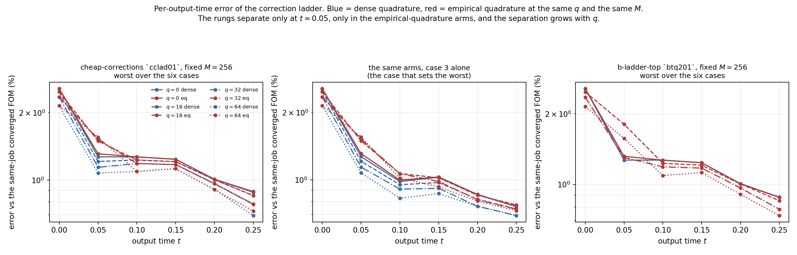

# Why the Burgers correction ladder is not monotone in $q$ on evolved times

A read-only diagnosis of one open item from the b-ladder-top cell: on Burgers $256^2$ at fixed test count $M$, the fixed-weight correction ladder is monotone in $q$ on the worst-over-all-output-times error but not on the worst-over-evolved-times error ($q=16$ is worse than $q=0$). **The numbers below are final** — every one of them is recomputed in NumPy from fields and run JSONs that were already collected, checksum-verified and independently audited; no solve, no fit and no training was rerun, and nothing here depends on a new job. Pre-registered protocol and decision rules: `experiments/q-diag/DESIGN.md`, committed before any number was computed.

## Verdict

**The regression is the empirical quadrature, not $q$.** Ranked by evidence: **(3) quadrature** — decisive; **(2) overfitting the test equations** — a real, separately measured effect that does *not* produce this regression; **(1) trajectory-blind directions** — refuted; **(4) noise** — refuted. At matched $q$, matched $M=256$, matched solver and matched tolerance, the *dense* ladder is monotone on both metrics in every one of the 12 dense ladder/metric combinations measured across four jobs, with 0 violations; the *empirical-quadrature* ladder violates monotonicity on the evolved metric in every job that has more than one EQ rung. Up to $q=256$ the entire empirical-quadrature penalty is injected in the first output interval $t\in(0,0.05]$ and it grows monotonically with $q$: the worst-case evolved error of the EQ arm minus its dense twin is +0.0403, +0.2651, +0.3363, +0.4302, +0.5723 percentage points at $q=0,16,32,64,128$. The mechanism is measured directly: the $m$-point rule's own relative error on the advection functional it is the only approximation of rises from 0.1158 at $q=0$ monotonically to 0.1854 at $q=128$ and 0.7661 at $q=512$, on the converged-FOM state each output interval is stepped from, because the rule for rung $q$ is fitted on a code family whose span grows with $q$ while $m$ does not. **Of the four fixes on offer — trajectory-fitted directions, a ridge on $y$, more tests, or none (noise) — the data supports none of them for this observation.** The directions are innocent here (the dense ladder they drive is monotone and its per-interval step map improves with $q$ at every interval); a ridge on $y$ would damp a correction block that is not misbehaving in the dense arms; more tests is not it either, because the regression is measured at a *fixed* $M=256$ where the dense twin is monotone. What the data supports is refitting or re-certifying the empirical quadrature on the states the ROM actually reaches, and growing $m$ with $q$. Two secondary results are recorded below and are not the answer to this question: the held-out weak residual does grow monotonically with $q$ in the dense arms (a real overfitting effect, latent), and the $q=512$ EQ rung's 3.65 % is the same quadrature mechanism at its extreme.

## Gate 0 — the recomputation reproduces the archives

| gate | value | threshold | passed |
|---|---|---|---|
| `recomputes_archived_reference_errors` | 6.12e-16 | $10^{-12}$ | yes |
| `recomputes_archived_arm_aggregates` (183 comparisons) | 0.00e+00 | $10^{-12}$ | yes |
| `numpy_weak_residual_matches_recorded` | 3.38e-11 | $10^{-9}$ | yes |
| `local_defect_selfcheck` (`fft_tight` through the NumPy operator) | 4.01e-09 | $10^{-6}$ | yes |

The first two gates are exact to the last bit (`0.0e+00` would print as `0.00e+00`); the third says the NumPy re-implementation of the decoder, bank, test modes and weak residual reproduces the cluster job's own recorded per-step residual norms; the fourth says the NumPy full-order stepper is the job's operator.

## The census: dense ladders are monotone, empirical-quadrature ladders are not

Each row is one job's ladder under one quadrature and one test-count rule, read on one metric. `evolved` is the worst over $t>0$; `all times` includes the $t=0$ compression.

| job | ladder | metric | $q=0$ | $q=16$ | $q=32$ | $q=64$ | $q=128$ | $q=256$ | $q=512$ | monotone? |
|---|---|---|---|---|---|---|---|---|---|---|
| `btq201` | EQ, fixed $M=256$, $g_{\mathrm{tol}}=10^{-6}$ | evolved | 1.3186 | 1.8066 | 1.3048 | 1.5738 | 1.3517 | 0.7580 | 3.6505 | **NO** — $q=16$>$q=0$, $q=64$>$q=32$, $q=512$>$q=256$ |
| `btq201` | EQ, fixed $M=256$, $g_{\mathrm{tol}}=10^{-6}$ | all times | 2.5629 | 2.4806 | 2.3534 | 2.1489 | 1.8116 | 0.9053 | 3.6505 | **NO** — $q=512$>$q=256$ |
| `btq201` | EQ, fixed $M=256$, $g_{\mathrm{tol}}=10^{-3}$ | evolved | 1.3182 | 1.8070 | 1.3052 | 1.5742 | 1.3517 | 0.7580 | — | **NO** — $q=16$>$q=0$, $q=64$>$q=32$ |
| `btq201` | EQ, fixed $M=256$, $g_{\mathrm{tol}}=10^{-3}$ | all times | 2.5628 | 2.4806 | 2.3534 | 2.1489 | 1.8116 | 0.9053 | — | yes |
| `btq201` | dense, fixed $M=256$ | evolved | 1.2710 | — | — | — | 1.0418 | — | — | yes |
| `btq201` | dense, fixed $M=256$ | all times | 2.5629 | — | — | — | 1.8116 | — | — | yes |
| `cclad01` | dense, fixed $M=256$ | evolved | 1.2710 | 1.2305 | 1.1869 | 1.1255 | 1.0418 | — | — | yes |
| `cclad01` | dense, fixed $M=256$ | all times | 2.5629 | 2.4806 | 2.3534 | 2.1489 | 1.8116 | — | — | yes |
| `cclad01` | EQ, fixed $M=256$ | evolved | 1.3113 | 1.4956 | 1.5231 | 1.5557 | 1.6141 | — | — | **NO** — $q=16$>$q=0$, $q=32$>$q=16$, $q=64$>$q=32$, $q=128$>$q=64$ |
| `cclad01` | EQ, fixed $M=256$ | all times | 2.5629 | 2.4806 | 2.3534 | 2.1489 | 1.8116 | — | — | yes |
| `cclad01` | dense, $M=2(K+q)$ | evolved | 3.8946 | 1.9720 | 1.6092 | 1.4480 | 0.9799 | 0.7566 | 0.4343 | yes |
| `cclad01` | dense, $M=2(K+q)$ | all times | 3.8946 | 2.4806 | 2.3534 | 2.1489 | 1.8116 | 0.9053 | 0.6027 | yes |
| `cclad01` | dense, $M=4(K+q)$ | evolved | 1.8890 | 1.3985 | 1.2336 | 1.0843 | 0.8930 | 0.5194 | 0.2307 | yes |
| `cclad01` | dense, $M=4(K+q)$ | all times | 2.5629 | 2.4806 | 2.3534 | 2.1489 | 1.8116 | 0.9053 | 0.6027 | yes |
| `qlad01` | dense, $M=4(K+q)$, joint solver | evolved | 1.8890 | 1.3984 | — | 1.0843 | 1.0216 | 0.5193 | 0.4275 | yes |
| `qlad01` | dense, $M=4(K+q)$, joint solver | all times | 2.5629 | 2.4806 | — | 2.1489 | 1.8116 | 0.9053 | 0.6027 | yes |
| `qlad01` | EQ, joint solver | evolved | 1.9002 | 2.1807 | — | — | — | — | — | **NO** — $q=16$>$q=0$ |
| `qlad01` | EQ, joint solver | all times | 2.5629 | 2.4806 | — | — | — | — | — | yes |
| `btq101` | dense, three fixes, $M=2(K+q)$ | evolved | 1.8890 | — | — | 1.4480 | 0.9799 | 0.7566 | 0.4343 | yes |
| `btq101` | dense, three fixes, $M=2(K+q)$ | all times | 2.5629 | — | — | 2.1489 | 1.8116 | 0.9053 | 0.6027 | yes |
| `btq101` | EQ, three fixes | evolved | 1.9002 | — | — | — | 1.1515 | 0.7580 | 3.6505 | **NO** — $q=512$>$q=256$ |
| `btq101` | EQ, three fixes | all times | 2.5629 | — | — | — | 1.8116 | 0.9053 | 3.6505 | **NO** — $q=512$>$q=256$ |

**12 of 12** dense ladder/metric combinations are monotone; **3 of 10** empirical-quadrature combinations are. Every EQ ladder with more than one rung violates monotonicity on the evolved metric, under three different solvers (`joint` in `qlad01`, `block` in `cclad01`, `base` in `btq101`/`btq201`), two evolution tolerances and three test-count rules.

## Cause (3) — quadrature. SUPPORTED, decisively

### The dense/EQ twins at matched $q$ and matched $M=256$

| $q$ | $t_0$ dense % | $t_0$ EQ % | evolved dense % | evolved EQ % | evolved gap pp | case 3 $t=0.05$ dense % | case 3 $t=0.05$ EQ % | gap pp |
|---|---|---|---|---|---|---|---|---|
| 0 | 2.5629 | 2.5629 | 1.2710 | 1.3113 | 0.0403 | 1.2710 | 1.3113 | 0.0403 |
| 16 | 2.4806 | 2.4806 | 1.2305 | 1.4956 | 0.2651 | 1.2116 | 1.4956 | 0.2839 |
| 32 | 2.3534 | 2.3534 | 1.1869 | 1.5231 | 0.3363 | 1.1411 | 1.5231 | 0.3820 |
| 64 | 2.1489 | 2.1489 | 1.1255 | 1.5557 | 0.4302 | 1.0752 | 1.5557 | 0.4805 |
| 128 | 1.8116 | 1.8116 | 1.0418 | 1.6141 | 0.5723 | 1.0418 | 1.6141 | 0.5723 |

The dense column falls monotonically; the EQ column rises monotonically; the two agree at $t_0$ to the last digit because the initial fit uses no quadrature at all. The gap is one case and one time: case 3 at $t=0.05$.

### Where the gap is, case by case

| $q$ | case 0 | case 1 | case 2 | case 3 | case 4 | case 5 | worst |
|---|---|---|---|---|---|---|---|
| 0 | 0.0016 | 0.0008 | 0.0057 | 0.0403 | 0.0014 | -0.0006 | 0.0403 |
| 16 | 0.0024 | 0.0004 | 0.0013 | 0.2839 | 0.0002 | 0.0007 | 0.2839 |
| 32 | 0.0032 | 0.0001 | -0.0002 | 0.3820 | 0.0005 | 0.0001 | 0.3820 |
| 64 | 0.0031 | 0.0004 | 0.0007 | 0.4805 | 0.0000 | -0.0007 | 0.4805 |
| 128 | 0.0047 | 0.0002 | 0.0063 | 0.5723 | 0.0026 | -0.0012 | 0.5723 |

The EQ-minus-dense gap is below $0.01$ pp on five of six cases at every rung. Case 3 is the case with the largest $t_0$ compression error, i.e. the case the frozen decoder represents worst.

### The rule's own error, measured directly

`arms.weak_eq` approximates **only** the advection term of the weak residual; the mass and Laplacian terms go through $A=\Phi^\top G$ exactly. So the rule's entire contribution is

$$\rho(u) \;=\; \frac{\bigl\lVert \sum_{j=1}^{m} w_j\,\Phi(x_j)\,a(u)(x_j) \;-\; \Phi^\top a(u)\bigr\rVert_2}{\lVert\Phi^\top a(u)\rVert_2},$$

a functional of a single field, so it is computable on every archived field with no internal state. Evaluated on the **converged full-order** trajectory, so the arm's own error cannot contaminate it:

| job | arm | $q$ | $M$ | $m$ | NNLS relative fit | truncated | $\rho$ at $t=0.0$ | $\rho$ at $t=0.05$ | $\rho$ at $t=0.1$ | $\rho$ at $t=0.15$ | $\rho$ at $t=0.2$ | $\rho$ at $t=0.25$ |
|---|---|---|---|---|---|---|---|---|---|---|---|---|
| `cclad01` | `q0_m256_eq_block` | 0 | 256 | 1010 | 4.06e-04 | yes | 0.1158 | 0.0091 | 0.0231 | 0.0286 | 0.0278 | 0.0253 |
| `cclad01` | `q16_m256_eq_block` | 16 | 256 | 1000 | 3.89e-04 | yes | 0.1679 | 0.0363 | 0.0112 | 0.0055 | 0.0036 | 0.0029 |
| `cclad01` | `q32_m256_eq_block` | 32 | 256 | 1024 | 3.74e-04 | no | 0.1731 | 0.0324 | 0.0087 | 0.0053 | 0.0038 | 0.0029 |
| `cclad01` | `q64_m256_eq_block` | 64 | 256 | 1010 | 3.87e-04 | yes | 0.1766 | 0.0251 | 0.0078 | 0.0050 | 0.0038 | 0.0032 |
| `cclad01` | `q128_m256_eq_block` | 128 | 256 | 999 | 4.03e-04 | yes | 0.1854 | 0.0347 | 0.0141 | 0.0079 | 0.0050 | 0.0037 |
| `cclad01` | `q256_m2_eq_block` | 256 | 544 | 1176 | 5.52e-04 | yes | 0.2970 | 0.0818 | 0.0403 | 0.0318 | 0.0317 | 0.0308 |
| `cclad01` | `q512_m2_eq_block` | 512 | 1056 | 1209 | 5.67e-03 | yes | 0.7661 | 0.5998 | 0.4419 | 0.3549 | 0.3040 | 0.2715 |
| `btq201` | `q256_M544_eq_g1em06` | 256 | 544 | 2048 | 8.28e-05 | no | 0.2520 | 0.0238 | 0.0103 | 0.0079 | 0.0065 | 0.0070 |
| `btq201` | `q512_M1056_eq_g1em06` | 512 | 1056 | 2048 | 2.06e-04 | no | 0.4961 | 0.1812 | 0.1121 | 0.0836 | 0.0732 | 0.0720 |

Two things to read off. First, at $t=0$ — the state the first output interval is stepped from, and the interval that carries the whole penalty — $\rho$ grows monotonically with $q$ at essentially fixed $m$, over the whole ladder; at later times it jumps once between $q=0$ and $q=16$ and then stays elevated rather than rising smoothly. Second, the NNLS relative fit — the number the rule is certified by today — is flat across the whole table and is *anti*-correlated with $\rho$ at the top: the $q=512$, $m=2048$ rule has the second-best reported fit (2.06e-04) and by far the worst $\rho$. A rule cannot be certified by its own fit residual.

### From the rule's error to the field error, quantitatively

The test modes are orthonormal on the interior grid, so a perturbation $\delta$ of the projected residual displaces the state by $\lVert\delta\rVert$ in the same norm. One backward-Euler step therefore carries at most

$$\varepsilon \;=\; \Delta t\,\rho(u)\,\lVert\Phi^\top a(u)\rVert_2 \,/\, \lVert\hat u_c(t_0)\rVert_2$$

of field error, and the first output interval is ten such steps. Evaluated at each arm's own $t=0$ state — the state the first interval starts from:

| $q$ | case | $\rho$ at $t=0$ | $\lVert\Phi^\top a(u_0)\rVert$ | $10\,\varepsilon$, predicted bound % | measured gap at $t=0.05$ pp |
|---|---|---|---|---|---|
| 0 | 2 | 0.0007 | 524.98 | 0.0277 | -0.0004 |
| 0 | 3 | 0.0989 | 373.23 | 2.4171 | 0.0403 |
| 0 | 4 | 0.0032 | 262.34 | 0.1030 | 0.0012 |
| 16 | 2 | 0.0016 | 525.02 | 0.0635 | -0.0000 |
| 16 | 3 | 0.1646 | 373.26 | 4.0255 | 0.2839 |
| 16 | 4 | 0.0018 | 262.70 | 0.0587 | -0.0008 |
| 32 | 2 | 0.0012 | 525.32 | 0.0506 | -0.0012 |
| 32 | 3 | 0.1811 | 372.99 | 4.4259 | 0.3820 |
| 32 | 4 | 0.0023 | 262.88 | 0.0755 | 0.0005 |
| 64 | 2 | 0.0015 | 525.53 | 0.0624 | 0.0007 |
| 64 | 3 | 0.1873 | 373.24 | 4.5789 | 0.4805 |
| 64 | 4 | 0.0024 | 263.26 | 0.0767 | 0.0000 |
| 128 | 2 | 0.0017 | 526.13 | 0.0680 | -0.0076 |
| 128 | 3 | 0.1930 | 372.67 | 4.7119 | 0.5723 |
| 128 | 4 | 0.0024 | 263.29 | 0.0785 | 0.0026 |

Over all 30 (rung, case) points the correlation between the predicted bound and the measured first-interval gap is Pearson $0.873$. The bound is about an order of magnitude above the realised gap, which is what one expects when the solver re-equilibrates after each perturbed step, and it reproduces the case structure: case 3 is two orders of magnitude above every other case at every rung. So the quadrature error is the *source*; the case that suffers is the case whose state the rule was fitted furthest from, which is also the case the decoder compresses worst.

### The link between the two

Over all 150 (rung, case, evolved time) points of the fixed-$M$ `cclad01` ladder, the correlation between $|$EQ$-$dense field-error gap$|$ and $\rho$ at the same point is Pearson $0.790$, Spearman $0.584$. Every point with $\rho>0.01$ (15 of 150) is on case 3; their largest gap is 0.5723 pp against 0.1915 pp for all the rest.

On case 3 at the first evolved time, both factors move with $q$ — the rule's error and how much of it reaches the field:

| $q$ | $\rho$ at the solved state | field-error gap pp | gap per unit $\rho$ |
|---|---|---|---|
| 0 | 0.0060 | 0.0403 | 6.71 |
| 16 | 0.0397 | 0.2839 | 7.16 |
| 32 | 0.0443 | 0.3820 | 8.63 |
| 64 | 0.0426 | 0.4805 | 11.27 |
| 128 | 0.0497 | 0.5723 | 11.51 |

The trigger is the step from $q=0$ to $q=16$, where $\rho$ rises 6.6x; above that $\rho$ creeps up by a quarter while the transfer into the field nearly doubles. Both the source and the amplification grow with $q$; neither alone accounts for the 14x growth of the gap.

In `btq201` the EQ ladder does not rise monotonically — it bounces ($q=16$ up, $q=32$ down, $q=64$ up, $q=128$ down). The bounce is the rule's, not the rung's; here are the two side by side on the case that sets the metric:

| $q$ | $m$ | NNLS relative fit | case 3 error at $t=0.05$ % | $\rho$ at the same state |
|---|---|---|---|---|
| 0 | 1024 | 3.63e-04 | 1.3186 | 0.0074 |
| 16 | 1024 | 3.75e-04 | 1.8066 | 0.0553 |
| 32 | 1024 | 3.72e-04 | 1.3048 | 0.0203 |
| 64 | 1024 | 4.13e-04 | 1.5738 | 0.0486 |
| 128 | 1024 | 3.95e-04 | 1.3517 | 0.0294 |

## Cause (1) — directions fitted to static reconstruction residual. REFUTED

The pre-registered rule needed **both** (a) the $q=16$-minus-$q=0$ gap to grow with time and (b) the per-interval local defect of $q=16$ to exceed that of $q=0$.

### (a) The gap shrinks with time; it does not grow

| job | quadrature | $t=0.0$ | $t=0.05$ | $t=0.1$ | $t=0.15$ | $t=0.2$ | $t=0.25$ |
|---|---|---|---|---|---|---|---|
| `cclad01` | EQ | -0.0823 | 0.1842 | 0.0701 | -0.0095 | -0.0071 | 0.0114 |
| `cclad01` | dense | -0.0823 | -0.0594 | -0.0321 | -0.0541 | -0.0392 | -0.0174 |
| `btq201` | EQ | -0.0823 | 0.4880 | 0.2121 | 0.0595 | 0.0455 | 0.0551 |

On case 3, the case that sets the metric, the $q=16$ penalty is largest at the first evolved time and decays from there. Criterion (a) fails.

### (b) The $q=16$ step map is *better*, not worse, at every interval

$d_c(t_k) = \lVert f_k - \Phi_{\mathrm{FOM}}(f_{k-1})\rVert_2 / \lVert \hat u_c(t_0)\rVert_2$ with $\Phi_{\mathrm{FOM}}$ ten backward-Euler substeps of the job's own discretisation, run in NumPy on the saved fields. Ratios are the median over the six cases.

| quadrature | $q$ | interval to $t=0.05$ | interval to $t=0.1$ | interval to $t=0.15$ | interval to $t=0.2$ | interval to $t=0.25$ |
|---|---|---|---|---|---|---|
| dense | 16 | 0.949 | 0.977 | 0.967 | 0.969 | 0.974 |
| dense | 32 | 0.867 | 0.932 | 0.934 | 0.939 | 0.948 |
| dense | 64 | 0.729 | 0.859 | 0.902 | 0.923 | 0.886 |
| dense | 128 | 0.650 | 0.778 | 0.779 | 0.845 | 0.838 |
| eq | 16 | 0.952 | 0.977 | 0.963 | 0.965 | 0.969 |
| eq | 32 | 0.876 | 0.932 | 0.934 | 0.931 | 0.944 |
| eq | 64 | 0.729 | 0.869 | 0.895 | 0.919 | 0.879 |
| eq | 128 | 0.648 | 0.827 | 0.774 | 0.846 | 0.825 |

Every entry is below 1. More correction directions make the *local* step strictly more accurate, in both quadratures, at every interval. Criterion (b) fails. Cause (1) is refuted for this observation.

### and the same defect table says where the quadrature damage is injected

| $q$ | dense $d$ to $t=0.05$ | dense $d$ to $t=0.1$ | dense $d$ to $t=0.15$ | dense $d$ to $t=0.2$ | dense $d$ to $t=0.25$ | EQ $d$ to $t=0.05$ | EQ $d$ to $t=0.1$ | EQ $d$ to $t=0.15$ | EQ $d$ to $t=0.2$ | EQ $d$ to $t=0.25$ | first-interval EQ penalty pp |
|---|---|---|---|---|---|---|---|---|---|---|---|
| 0 | 1.5858 | 1.2534 | 1.1314 | 0.9290 | 0.6483 | 1.6273 | 1.2537 | 1.1328 | 0.9287 | 0.6489 | 0.0415 |
| 16 | 1.5083 | 1.2205 | 1.0920 | 0.9328 | 0.6403 | 1.7786 | 1.2201 | 1.0919 | 0.9326 | 0.6402 | 0.2703 |
| 32 | 1.3809 | 1.1745 | 1.0502 | 0.9028 | 0.6169 | 1.7604 | 1.1742 | 1.0509 | 0.9013 | 0.6156 | 0.3795 |
| 64 | 1.3076 | 1.0871 | 1.0572 | 0.8756 | 0.5711 | 1.7834 | 1.0877 | 1.0559 | 0.8756 | 0.5699 | 0.4757 |
| 128 | 1.1314 | 1.0455 | 0.9170 | 0.8057 | 0.5576 | 1.6999 | 1.0508 | 0.9138 | 0.8112 | 0.5539 | 0.5685 |
| 256 | 0.3865 | 0.7587 | 0.5915 | 0.5868 | 0.4130 | 0.9946 | 0.7700 | 0.5960 | 0.5912 | 0.4359 | 0.6081 |
| 512 | 0.3166 | 0.4342 | 0.3528 | 0.2634 | 0.2530 | 13.4524 | 11.3922 | 9.3959 | 7.8110 | 6.5213 | 13.1359 |

The measurement floor of this table — `fft_tight` propagated through the same NumPy operator — is 4.01e-07 %, six orders of magnitude below the signal. Intervals 2–5 agree between dense and EQ to three decimals at every rung up to $q=128$ (at $q=256$ they agree to two, and the $q=512$ EQ rule is so bad that it damages every interval); the EQ penalty is injected in the first interval and it grows monotonically with $q$ over the whole ladder.

## Cause (2) — more unknowns overfit the $M$ test equations. Measured, real, and NOT the explanation

The correction directions $C_q$ are archived nowhere, so they were **recovered** from the saved data: every ROM invocation carries the internal latents $w_n=(z_n,y_n)$ and the decoded field at the six output times, and the exact checkpoint is on disk, so with $c = G^{+}u$ the pairs $(y,\;c-h_\theta(z))$ over-determine $C_q$.

| $q$ | pooled pairs | design rank | fit relative residual | held-out pair relative residual | accepted |
|---|---|---|---|---|---|
| 0 | 396 | 0 | 7.57e-12 | 7.57e-12 | yes |
| 16 | 432 | 16 | 5.68e-13 | 5.91e-13 | yes |
| 32 | 216 | 32 | 3.17e-13 | 6.78e-13 | yes |
| 64 | 324 | 64 | 1.08e-13 | 3.63e-13 | yes |
| 128 | 288 | 128 | 4.96e-14 | 1.43e-12 | yes |

With $C_q$ in hand the weak residual is recomputed at every one of the 50 internal reachable states of the dense $M=256$ arms, on the arm's own 256 test modes and on the next 1024 sine modes, which the solve never sees:

| $q$ | median $\lVert r\rVert$ on the 256 tests | median $\lVert r\rVert$ on the 1024 held-out modes | held-out / on-test | on-test vs $q=0$ | held-out vs $q=0$ | evolved field error % |
|---|---|---|---|---|---|---|
| 0 | 4.3422e-02 | 2.8819e-02 | 0.6637 | 1.0000 | 1.0000 | 1.2710 |
| 16 | 3.7889e-02 | 2.9826e-02 | 0.7872 | 0.8726 | 1.0349 | 1.2305 |
| 32 | 3.5887e-02 | 3.1932e-02 | 0.8898 | 0.8265 | 1.1080 | 1.1869 |
| 64 | 3.3828e-02 | 4.1457e-02 | 1.2255 | 0.7790 | 1.4386 | 1.1255 |
| 128 | 2.1702e-02 | 4.8522e-02 | 2.2358 | 0.4998 | 1.6837 | 1.0418 |

This is a genuine overfitting signature and it is monotone: the residual on the tests that are solved falls by a factor of about two from $q=0$ to $q=128$, while the residual on the modes that are not solved rises by about 1.7, and the ratio crosses 1 between $q=32$ and $q=64$. **But the field error falls monotonically over the same range** (last column), because the solved modes carry the energy. The pre-registered conjunction — lower on-test residual *together with* higher field error — does not hold in the dense arms, so cause (2) does not explain the observed regression. It is recorded here as a measured, latent risk that would bite at larger $q$ or smaller $M$, and it is the same mechanism as cause (3) seen through a different error source: the extra unknowns exploit whatever is wrong in the residual they are handed. With dense quadrature what is wrong lives outside the test space and costs nothing yet; with empirical quadrature it lives *inside* the test space and costs the field directly.

## Cause (4) — noise. REFUTED

Arms that are the same computation by construction — the same $q$, $M$ and quadrature reached by a different solver path — bound what "within noise" means here:

| $q$ | quadrature | arms compared | max $|$per-case per-time difference$|$ pp |
|---|---|---|---|
| 0 | dense | `q0_m256_dense_block`, `q0_m256_dense_varpro` | 0.00e+00 |
| 0 | eq | `q0_m256_eq_block`, `q0_m256_eq_varpro` | 0.00e+00 |
| 16 | dense | `q16_m256_dense_block`, `q16_m256_dense_varpro` | 3.74e-06 |
| 16 | eq | `q16_m256_eq_block`, `q16_m256_eq_varpro` | 3.73e-06 |
| 32 | dense | `q32_m256_dense_block`, `q32_m256_dense_varpro` | 5.70e-06 |
| 32 | eq | `q32_m256_eq_block`, `q32_m256_eq_varpro` | 3.86e-06 |
| 64 | dense | `q64_m256_dense_block`, `q64_m256_dense_varpro` | 6.52e-06 |
| 64 | eq | `q64_m256_eq_block`, `q64_m256_eq_varpro` | 6.51e-06 |
| 128 | dense | `q128_m256_dense_block`, `q128_m256_dense_varpro` | 7.43e-06 |
| 128 | eq | `q128_m256_eq_block`, `q128_m256_eq_varpro` | 6.82e-06 |

### The six per-case evolved deltas

| job | quadrature | case 0 | case 1 | case 2 | case 3 | case 4 | case 5 | positive |
|---|---|---|---|---|---|---|---|---|
| `cclad01` | EQ | -0.0002 | -0.0165 | -0.0405 | 0.1842 | 0.0017 | 0.0024 | 3/6 |
| `cclad01` | dense | -0.0009 | -0.0169 | -0.0397 | -0.0594 | 0.0037 | 0.0043 | 2/6 |
| `btq201` | EQ | -0.0009 | -0.0167 | -0.0386 | 0.4880 | 0.0034 | -0.0018 | 2/6 |
| `qlad01` | EQ | 0.0464 | -0.0203 | -0.5592 | 0.4311 | -0.6095 | -0.6519 | 2/6 |
| `qlad01` | dense | -0.0669 | -0.0227 | -0.5514 | -0.0760 | -0.5707 | -0.1588 | 0/6 |

The $q=16$ evolved regression is one case, not a spread: it is positive in 2 or 3 of six cases and the worst-case magnitude is 0.18–0.49 pp, four to five orders of magnitude above the equivalent-arm spread in the table above. It is also perfectly reproducible: it appears with the same sign in three independent jobs on three different GPUs, at two evolution tolerances, under three solvers. It is not noise — but it is also not "$q=16$ is bad", because it is absent in the dense twin of every one of those arms.

## Question (5) — does it appear at $q=32$, in `cclad01`, in `qlad01`?

Yes to all three, and always in the empirical-quadrature arms only. Read the census table above: `cclad01`'s fixed-$M$ EQ ladder violates monotonicity at **every** rung ($q=16,32,64,128$), its dense twin at none; `btq201`'s EQ ladder violates it at $q=16$ and $q=64$ at *both* evolution tolerances, and at $q=512$ where that rung exists; `qlad01`'s joint-solver EQ ladder violates it at $q=16$ while its dense ladder — same solver, same rungs, same job — is monotone through $q=512$; `btq101` has no $q=16$ EQ arm and violates it at $q=512$. Answering the question as asked: it appears at $q=32$, $q=64$ and $q=128$ as well as at $q=16$; it appears in cheap-corrections' `cclad01` at budget 180, in its EQ arms only; and it appears in head-ablation's `qlad01` joint-solver ladder, again in its EQ arm only. No dense arm in any job shows it.

## The $q=512$ EQ rung: 3.65 % against 0.60 % dense

### Where the error is

| job | arm | what | $t=0.0$ % | $t=0.05$ % | $t=0.1$ % | $t=0.15$ % | $t=0.2$ % | $t=0.25$ % | evolved % | worst cases |
|---|---|---|---|---|---|---|---|---|---|---|
| `btq201` | `q512_M1056_eq_g1em06` | EQ, $m=2048$, untruncated | 0.6027 | 3.0005 | 3.5981 | 3.6505 | 3.4331 | 3.1337 | 3.6505 | 3 |
| `btq101` | `q512_m2_eq_base` | EQ, $m=2048$, untruncated | 0.6027 | 3.0005 | 3.5981 | 3.6505 | 3.4331 | 3.1337 | 3.6505 | 3 |
| `cclad01` | `q512_m2_eq_block` | EQ, $m=1209$, truncated | 0.6027 | 13.4438 | 20.5425 | 24.4798 | 26.6843 | 27.8120 | 27.8120 | 3 |
| `cclad01` | `q512_m2_dense_block` | dense twin | 0.6027 | 0.3169 | 0.4343 | 0.3530 | 0.2637 | 0.2531 | 0.4343 | 3 |
| `btq101` | `q512_m2_dense_base` | dense twin | 0.6027 | 0.3169 | 0.4343 | 0.3530 | 0.2637 | 0.2531 | 0.4343 | 3 |
| `btq201` | `q256_M544_eq_g1em06` | EQ $q=256$, $m=2048$ | 0.9053 | 0.6613 | 0.7580 | 0.5929 | 0.5892 | 0.4332 | 0.7580 | 2 |

The $t_0$ compression of the $q=512$ rung is the best in the whole ladder (0.6027 %, the degenerate $q=R$ endpoint fits the supplied field in the full bank). Everything above that is injected by the time stepping, and it is injected immediately: the error is already 3.00 % at $t=0.05$ with the untruncated $m=2048$ rule and 13.4 % with the truncated $m=1209$ one. Its dense twin, same rung, same solver, same tolerance, reaches 0.4343 %.

### The first-interval local defect says the same thing

| arm | $d$ to $t=0.05$ % | $d$ to $t=0.1$ % | $d$ to $t=0.15$ % | $d$ to $t=0.2$ % | $d$ to $t=0.25$ % |
|---|---|---|---|---|---|
| `q512_m2_dense_block` | 0.3166 | 0.4342 | 0.3528 | 0.2634 | 0.2530 |
| `q512_m2_eq_block` | 13.4524 | 11.3922 | 9.3959 | 7.8110 | 6.5213 |
| `q256_m2_dense_block` | 0.3865 | 0.7587 | 0.5915 | 0.5868 | 0.4130 |
| `q256_m2_eq_block` | 0.9946 | 0.7700 | 0.5960 | 0.5912 | 0.4359 |

### The cause: the rule, not its support

| job | arm | $q$ | $m$ | $m/n$ | mean advection mass sampled, $t>0$ | mean top-1 % $|a|$ cells within one cell of a node, $t>0$ | worst $\rho$, $t>0$ |
|---|---|---|---|---|---|---|---|
| `cclad01` | `q0_m256_eq_block` | 0 | 1010 | 0.0155 | 0.0181 | 0.1611 | 0.0286 |
| `cclad01` | `q128_m256_eq_block` | 128 | 999 | 0.0154 | 0.0182 | 0.1811 | 0.0347 |
| `cclad01` | `q512_m2_eq_block` | 512 | 1209 | 0.0186 | 0.0208 | 0.2019 | 0.5998 |
| `btq201` | `q256_M544_eq_g1em06` | 256 | 2048 | 0.0315 | 0.0384 | 0.3689 | 0.0238 |
| `btq201` | `q512_M1056_eq_g1em06` | 512 | 2048 | 0.0315 | 0.0353 | 0.3378 | 0.1812 |

The support geometry does **not** separate the rungs. At $m=2048$ the $q=512$ rule sits on a larger share of the advection front than the $q=128$ rule at $m=999$ does, and its $\rho$ is five times worse. The rules differ in what they are fitted to, not in where they look: the fit family for rung $q$ is the *enriched* code set $w_i=(z^\ast_i,\,C_q^\top R_b\rho_i)$, whose span grows with $q$ and, at $q=R$, is the entire bank, while $m$ stays at 2048 of 65025 nodes. The most likely cause, with the evidence above: **at $q=R$ the rule is asked to integrate the advection of an essentially arbitrary element of a 512-dimensional space from 2048 point values, and it cannot** — its error on states the ROM actually reaches is 8–50 %, while its NNLS relative fit on its own fitting set reads $2\times10^{-4}$. The b-ladder-top cell already retracted the walltime-cap explanation; this adds that the untruncated rule is not a good rule either, and that no amount of fitting seconds would have made it one at this $m$.

## What this does and does not settle

- It settles that the evolved-metric non-monotonicity reported by b-ladder-top is a property of the empirical quadrature and not of $q$, the solver, the test count, the evolution tolerance or the run-to-run spread.
- It does **not** show that trajectory-fitted directions are useless — only that the directions are not what breaks monotonicity here. Refitting them would also change the enriched codes the quadrature rule is fitted on, so a trajectory-fitted-directions arm could still move these numbers; that is a prediction, not a result.
- It does **not** measure whether growing $m$ with $q$ recovers monotonicity. Every rule in the archives has $m\in[999,2048]$ while $K+q$ spans 16 to 528; no arm varies $m$ at fixed $q$, so the $m$ dependence cannot be read off saved data.
- It could not recompute anything that needs a ROM solve. In particular the weak residual of the **EQ** arms' solved states against the *dense* operator at their own internal steps is available (the recovered $C_q$ makes it computable) but the converse — what those arms would have done under a better rule — is a new job.
- $C_q$ was recovered numerically rather than read from the job; the recovery residuals in the cause (2) table are the warrant, and the recomputed residual norms agree with the job's own recorded norms to $10^{-11}$.

## Glossary

- **correction ladder** — the family of reduced models $u = G(h_\theta(z) + C_q y)$ indexed by $q$: a frozen nonlinear decoder head $h_\theta$ on a $K=16$-dimensional latent $z$, plus $q$ extra linear correction directions with coefficients $y$ solved for at every time step. $q=0$ is the plain frozen model; larger $q$ buys accuracy for cost.
- **$q$** — the number of correction directions. "$q$ is a knob" is the claim under test elsewhere in the project: that sliding $q$ trades cost against accuracy predictably.
- **$K$, $R$** — the latent dimension (16) and the spatial bank size (512). $q=R$ is the degenerate endpoint where the corrections span the whole bank.
- **$G$, bank** — the $n\times R$ matrix of frozen spatial basis functions evaluated on the grid; $n=(L-1)^2=65025$ interior nodes at $L=256$ intervals.
- **$C_q$, directions** — the first $q$ columns of a fixed matrix obtained offline as the field-metric POD of the decoder's reconstruction residual over 1024 *static* training snapshots. Nothing in their construction sees a trajectory — which is why they were a suspect.
- **$M$, test count, test modes** — the number of sine test functions $\Phi$ the weak residual is projected onto. The step equations are "solve so that the residual is zero against these $M$ modes". "fixed $M=256$" means $M$ does not grow with $q$, so rungs are compared at the same number of equations.
- **held-out modes** — the next 1024 sine modes by eigenvalue order, which no arm solves against. A residual that falls on the $M$ tests while rising on these is overfitting the test space.
- **dense quadrature** — the weak residual integrals evaluated at every one of the 65025 nodes — exact for the discretisation, expensive.
- **empirical quadrature, EQ, $m$** — the cheap replacement: the advection integral is approximated by a weighted sum over $m\ll n$ chosen nodes, with nodes and weights fitted offline by nonnegative least squares. $m$ is the number of nodes. EQ is what makes the ROM 5–6x faster.
- **$\rho$** — the empirical rule's own relative error on the one quantity it approximates, the projected advection $\Phi^\top a(u)$, evaluated at a given field $u$. $\rho=0.05$ means the residual the solver is handed is 5 % wrong.
- **NNLS relative fit** — the residual of the rule's own offline fit, on its own fitting states. It is the number the rule is currently certified by; this report shows it does not predict $\rho$.
- **enriched codes** — the states the EQ rule is fitted on at rung $q$: static training snapshots plus their best correction in the $q$-dimensional direction space. Their span grows with $q$; the node budget $m$ does not.
- **advection front** — the region where the upwind advection term $a(u)$ is large — in Burgers, the steepening edge of the travelling blob. "Front covered" is the fraction of the top 1 % of $|a(u)|$ cells lying within one grid cell of a quadrature node.
- **same-grid error, %** — the reported error metric: the relative 2-norm distance between an arm's output field and the *same job's* fully converged full-order field on the same grid, normalised by the norm of that case's reference initial field, in per cent.
- **all-times metric** — the worst same-grid error over all six output times, $t=0$ included. It is dominated by the $t=0$ term, which is pure decoder compression and involves no time stepping at all.
- **evolved metric** — the worst same-grid error over $t>0$ only. This is the metric on which monotonicity fails, and the one that measures the ROM as a time integrator.
- **$t_0$ compression** — the $t=0$ error: how well the frozen decoder plus corrections can represent the supplied initial field. No quadrature enters it, which is why dense and EQ arms agree there exactly.
- **local defect $d_c(t_k)$** — the error injected inside one output interval: the distance between the arm's field at $t_k$ and the full-order operator applied to the arm's own field at $t_{k-1}$. It separates "this interval went wrong" from "the previous error was carried forward and amplified".
- **case** — one of six initial conditions (a Gaussian blob with random centre, width, amplitude and viscosity). Four are "opened development", two "fresh development"; no final-cohort case is opened anywhere in this lane.
- **pp** — percentage points — the unit of a difference between two errors quoted in per cent.
- **`btq101` / `btq102` / `btq201`** — the three b-ladder-top cluster jobs (3745589, 3749039, 3747245): the convergence sweep, the relaxed-contract follow-up, and the full cost/accuracy envelope.
- **`cclad01`** — the cheap-corrections Burgers job 3734098, which introduced the block-damped solver and one EQ rule per rung.
- **`qlad01`** — the head-ablation correction-ladder job 3713867, the original joint-solver ladder.
- **block / joint / varpro / alt** — four solver paths for the same step equations. They are the same computation by construction, so their spread bounds run-to-run noise.
- **`fft_tight`** — the fully converged full-order solver run in the same job on the same GPU; it is the zero of the same-grid metric by construction.

---

Generated by `experiments/q-diag/reports/generate_q_diag.py` from `experiments/q-diag/checks/*.json`. Stage scripts: `per_time.py`, `quadrature.py`, `local_defect.py`, `heldout_tests.py`.
