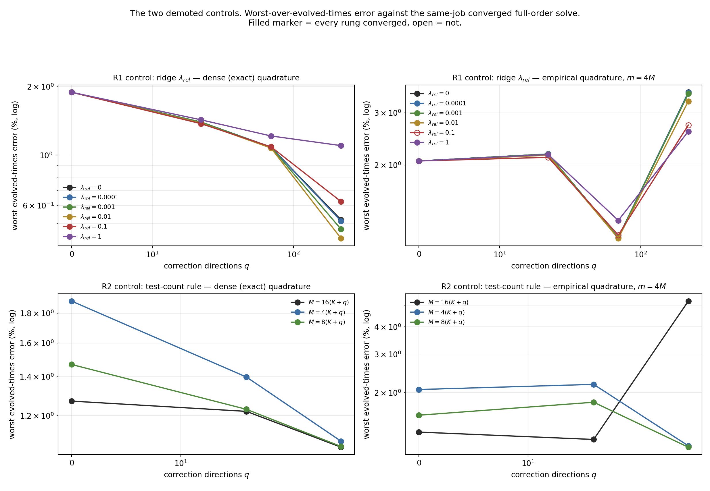

# q-ridge — R1 (ridge) and R2 (more tests) on the evolved-times regression

Final numbers. Three cluster jobs on the frozen Burgers checkpoint `18f0266ae6f0…` at 256 intervals, on the six opened development cases, under the budget-600 block-damped variable-projection contract inherited from `b-ladder-top`. The pre-registered design and its amendment §A3, which re-scoped the lane after the `q-diag` lane reported, are in [`../DESIGN.md`](../DESIGN.md).

| job | attempt | question | job id | GPU | source commit | elapsed (s) | failed gates |
|---|---|---|---|---|---|---|---|
| 1 | qrg101 | R1 | 3757235 | NVIDIA A100 80GB PCIe | 5fc6099127d4 | 5389.4 | none |
| 2 | qrg201 | R2 | 3757237 | NVIDIA A100 80GB PCIe | 5fc6099127d4 | 6834.0 | none |

## Where the regression is, measured before anything was submitted

Recomputed from the retained `cclad01` fields (job 3734098, archive SHA256 `4c6fd589688a253f…`), worst over the six cases, against that job's own converged full-order solve. The `q-diag` lane reached the same conclusion independently and across four jobs.

| configuration | $q=0$ | $q=16$ | $q=32$ | $q=64$ | $q=128$ | monotone in $q$? |
|---|---|---|---|---|---|---|
| m4 dense | 1.8890 | 1.3984 | 1.2336 | 1.0843 | 0.8930 | yes |
| M=256 dense | 1.2710 | 1.2305 | 1.1869 | 1.1255 | 1.0418 | yes |
| M=256 EQ | 1.3113 | 1.4956 | 1.5231 | 1.5557 | 1.6141 | no |
| m4 EQ | 1.9002 | 2.9937 | — | — | — | no |

The dense and the EQ arms at $M=256$ solve the **identical** $M$ test equations against the **identical** $K+q$ unknowns; the only difference is that the advection integral is replaced by an $m$-point rule. The dense ladder is monotone and the EQ ladder is not.

## R1 (control) — the field-metric ridge

### Dense (exact) quadrature

**$\lambda_{rel} = 0$** — monotone in $q$ on evolved times: **yes**; every rung converged: yes; cost within 1.5x of the incumbent: yes; all-times metric not raised: yes; **passes: yes**.

| $q$ | $M$ | $m$ | worst evolved % | worst all-times % | $t=0$ compression % | median GPU ms | cost vs incumbent | converged | EQ rule valid |
|---|---|---|---|---|---|---|---|---|---|
| 0 | 64 | — | 1.8890 | 2.5629 | 2.5629 | 295.2 | 1.000x | yes | — |
| 16 | 128 | — | 1.3985 | 2.4806 | 2.4806 | 368.0 | 1.000x | yes | — |
| 64 | 320 | — | 1.0843 | 2.1489 | 2.1489 | 627.2 | 1.000x | yes | — |
| 256 | 1088 | — | 0.5194 | 0.9053 | 0.9053 | 3911.9 | 1.000x | yes | — |

**$\lambda_{rel} = 0.0001$** — monotone in $q$ on evolved times: **yes**; every rung converged: yes; cost within 1.5x of the incumbent: yes; all-times metric not raised: yes; **passes: yes**.

| $q$ | $M$ | $m$ | worst evolved % | worst all-times % | $t=0$ compression % | median GPU ms | cost vs incumbent | converged | EQ rule valid |
|---|---|---|---|---|---|---|---|---|---|
| 0 | 64 | — | 1.8890 | 2.5629 | 2.5629 | 295.2 | 1.000x | yes | — |
| 16 | 128 | — | 1.3983 | 2.4806 | 2.4806 | 368.7 | 1.002x | yes | — |
| 64 | 320 | — | 1.0842 | 2.1489 | 2.1489 | 625.3 | 0.997x | yes | — |
| 256 | 1088 | — | 0.5127 | 0.9053 | 0.9053 | 4020.5 | 1.028x | yes | — |

**$\lambda_{rel} = 0.001$** — monotone in $q$ on evolved times: **yes**; every rung converged: yes; cost within 1.5x of the incumbent: yes; all-times metric not raised: yes; **passes: yes**.

| $q$ | $M$ | $m$ | worst evolved % | worst all-times % | $t=0$ compression % | median GPU ms | cost vs incumbent | converged | EQ rule valid |
|---|---|---|---|---|---|---|---|---|---|
| 0 | 64 | — | 1.8890 | 2.5629 | 2.5629 | 295.2 | 1.000x | yes | — |
| 16 | 128 | — | 1.3966 | 2.4806 | 2.4806 | 369.5 | 1.004x | yes | — |
| 64 | 320 | — | 1.0830 | 2.1489 | 2.1489 | 627.4 | 1.000x | yes | — |
| 256 | 1088 | — | 0.4727 | 0.9053 | 0.9053 | 3737.6 | 0.955x | yes | — |

**$\lambda_{rel} = 0.01$** — monotone in $q$ on evolved times: **yes**; every rung converged: yes; cost within 1.5x of the incumbent: yes; all-times metric not raised: yes; **passes: yes**.

| $q$ | $M$ | $m$ | worst evolved % | worst all-times % | $t=0$ compression % | median GPU ms | cost vs incumbent | converged | EQ rule valid |
|---|---|---|---|---|---|---|---|---|---|
| 0 | 64 | — | 1.8890 | 2.5629 | 2.5629 | 295.2 | 1.000x | yes | — |
| 16 | 128 | — | 1.3838 | 2.4806 | 2.4806 | 369.9 | 1.005x | yes | — |
| 64 | 320 | — | 1.0745 | 2.1489 | 2.1489 | 629.5 | 1.004x | yes | — |
| 256 | 1088 | — | 0.4308 | 0.9053 | 0.9053 | 3032.5 | 0.775x | yes | — |

**$\lambda_{rel} = 0.1$** — monotone in $q$ on evolved times: **yes**; every rung converged: yes; cost within 1.5x of the incumbent: yes; all-times metric not raised: yes; **passes: yes**.

| $q$ | $M$ | $m$ | worst evolved % | worst all-times % | $t=0$ compression % | median GPU ms | cost vs incumbent | converged | EQ rule valid |
|---|---|---|---|---|---|---|---|---|---|
| 0 | 64 | — | 1.8890 | 2.5629 | 2.5629 | 295.2 | 1.000x | yes | — |
| 16 | 128 | — | 1.3750 | 2.4806 | 2.4806 | 368.6 | 1.002x | yes | — |
| 64 | 320 | — | 1.0877 | 2.1489 | 2.1489 | 633.7 | 1.010x | yes | — |
| 256 | 1088 | — | 0.6251 | 0.9053 | 0.9053 | 2862.1 | 0.732x | yes | — |

**$\lambda_{rel} = 1$** — monotone in $q$ on evolved times: **yes**; every rung converged: yes; cost within 1.5x of the incumbent: yes; all-times metric not raised: no; **passes: no**.

| $q$ | $M$ | $m$ | worst evolved % | worst all-times % | $t=0$ compression % | median GPU ms | cost vs incumbent | converged | EQ rule valid |
|---|---|---|---|---|---|---|---|---|---|
| 0 | 64 | — | 1.8890 | 2.5629 | 2.5629 | 295.2 | 1.000x | yes | — |
| 16 | 128 | — | 1.4297 | 2.4806 | 2.4806 | 366.9 | 0.997x | yes | — |
| 64 | 320 | — | 1.2140 | 2.1489 | 2.1489 | 634.2 | 1.011x | yes | — |
| 256 | 1088 | — | 1.1011 | 1.1011 | 0.9053 | 2657.6 | 0.679x | yes | — |

### Empirical quadrature, $m = 4M$

**$\lambda_{rel} = 0$** — monotone in $q$ on evolved times: **no**; every rung converged: yes; cost within 1.5x of the incumbent: yes; all-times metric not raised: yes; **passes: no**.

| $q$ | $M$ | $m$ | worst evolved % | worst all-times % | $t=0$ compression % | median GPU ms | cost vs incumbent | converged | EQ rule valid |
|---|---|---|---|---|---|---|---|---|---|
| 0 | 64 | 256 | 2.0659 | 2.5629 | 2.5629 | 51.8 | 1.000x | yes | yes |
| 16 | 128 | 512 | 2.1811 | 2.4806 | 2.4806 | 72.4 | 1.000x | yes | yes |
| 64 | 320 | 1280 | 1.1408 | 2.1489 | 2.1489 | 127.4 | 1.000x | yes | yes |
| 256 | 1088 | 2048 | 3.5204 | 3.5204 | 0.9053 | 715.4 | 1.000x | yes | yes |

**$\lambda_{rel} = 0.0001$** — monotone in $q$ on evolved times: **no**; every rung converged: yes; cost within 1.5x of the incumbent: yes; all-times metric not raised: yes; **passes: no**.

| $q$ | $M$ | $m$ | worst evolved % | worst all-times % | $t=0$ compression % | median GPU ms | cost vs incumbent | converged | EQ rule valid |
|---|---|---|---|---|---|---|---|---|---|
| 0 | 64 | 256 | 2.0659 | 2.5629 | 2.5629 | 51.8 | 1.000x | yes | yes |
| 16 | 128 | 512 | 2.1809 | 2.4806 | 2.4806 | 73.4 | 1.015x | yes | yes |
| 64 | 320 | 1280 | 1.1406 | 2.1489 | 2.1489 | 127.3 | 1.000x | yes | yes |
| 256 | 1088 | 2048 | 3.5155 | 3.5155 | 0.9053 | 732.1 | 1.023x | yes | yes |

**$\lambda_{rel} = 0.001$** — monotone in $q$ on evolved times: **no**; every rung converged: yes; cost within 1.5x of the incumbent: yes; all-times metric not raised: yes; **passes: no**.

| $q$ | $M$ | $m$ | worst evolved % | worst all-times % | $t=0$ compression % | median GPU ms | cost vs incumbent | converged | EQ rule valid |
|---|---|---|---|---|---|---|---|---|---|
| 0 | 64 | 256 | 2.0659 | 2.5629 | 2.5629 | 51.8 | 1.000x | yes | yes |
| 16 | 128 | 512 | 2.1786 | 2.4806 | 2.4806 | 74.1 | 1.024x | yes | yes |
| 64 | 320 | 1280 | 1.1396 | 2.1489 | 2.1489 | 126.6 | 0.994x | yes | yes |
| 256 | 1088 | 2048 | 3.4804 | 3.4804 | 0.9053 | 669.1 | 0.935x | yes | yes |

**$\lambda_{rel} = 0.01$** — monotone in $q$ on evolved times: **no**; every rung converged: yes; cost within 1.5x of the incumbent: yes; all-times metric not raised: yes; **passes: no**.

| $q$ | $M$ | $m$ | worst evolved % | worst all-times % | $t=0$ compression % | median GPU ms | cost vs incumbent | converged | EQ rule valid |
|---|---|---|---|---|---|---|---|---|---|
| 0 | 64 | 256 | 2.0659 | 2.5629 | 2.5629 | 51.8 | 1.000x | yes | yes |
| 16 | 128 | 512 | 2.1604 | 2.4806 | 2.4806 | 73.8 | 1.020x | yes | yes |
| 64 | 320 | 1280 | 1.1332 | 2.1489 | 2.1489 | 127.5 | 1.001x | yes | yes |
| 256 | 1088 | 2048 | 3.2834 | 3.2834 | 0.9053 | 518.4 | 0.725x | yes | yes |

**$\lambda_{rel} = 0.1$** — monotone in $q$ on evolved times: **no**; every rung converged: no; cost within 1.5x of the incumbent: yes; all-times metric not raised: yes; **passes: no**.

| $q$ | $M$ | $m$ | worst evolved % | worst all-times % | $t=0$ compression % | median GPU ms | cost vs incumbent | converged | EQ rule valid |
|---|---|---|---|---|---|---|---|---|---|
| 0 | 64 | 256 | 2.0659 | 2.5629 | 2.5629 | 51.8 | 1.000x | yes | yes |
| 16 | 128 | 512 | 2.1247 | 2.4806 | 2.4806 | 72.8 | 1.006x | yes | yes |
| 64 | 320 | 1280 | 1.1623 | 2.1489 | 2.1489 | 132.0 | 1.036x | yes | yes |
| 256 | 1088 | 2048 | 2.7294 | 2.7294 | 0.9053 | 485.4 | 0.679x | no | yes |

**$\lambda_{rel} = 1$** — monotone in $q$ on evolved times: **no**; every rung converged: yes; cost within 1.5x of the incumbent: yes; all-times metric not raised: yes; **passes: no**.

| $q$ | $M$ | $m$ | worst evolved % | worst all-times % | $t=0$ compression % | median GPU ms | cost vs incumbent | converged | EQ rule valid |
|---|---|---|---|---|---|---|---|---|---|
| 0 | 64 | 256 | 2.0659 | 2.5629 | 2.5629 | 51.8 | 1.000x | yes | yes |
| 16 | 128 | 512 | 2.1720 | 2.4806 | 2.4806 | 73.6 | 1.017x | yes | yes |
| 64 | 320 | 1280 | 1.3026 | 2.1489 | 2.1489 | 130.4 | 1.024x | yes | yes |
| 256 | 1088 | 2048 | 2.5988 | 2.5988 | 0.9053 | 452.3 | 0.632x | yes | yes |

## R2 (control) — more tests at fixed $q$

### Dense (exact) quadrature

**$M = 16(K+q)$** — monotone in $q$ on evolved times: **yes**; every rung converged: yes; cost within 1.5x of the incumbent: no; all-times metric not raised: yes; **passes: no**.

| $q$ | $M$ | $m$ | worst evolved % | worst all-times % | $t=0$ compression % | median GPU ms | cost vs incumbent | converged | EQ rule valid |
|---|---|---|---|---|---|---|---|---|---|
| 0 | 256 | — | 1.2710 | 2.5629 | 2.5629 | 343.1 | 1.209x | yes | — |
| 16 | 512 | — | 1.2204 | 2.4806 | 2.4806 | 545.2 | 1.524x | yes | — |
| 64 | 1280 | — | 1.0588 | 2.1489 | 2.1489 | 1301.8 | 2.095x | yes | — |

**$M = 4(K+q)$** — monotone in $q$ on evolved times: **yes**; every rung converged: yes; cost within 1.5x of the incumbent: yes; all-times metric not raised: yes; **passes: yes**.

| $q$ | $M$ | $m$ | worst evolved % | worst all-times % | $t=0$ compression % | median GPU ms | cost vs incumbent | converged | EQ rule valid |
|---|---|---|---|---|---|---|---|---|---|
| 0 | 64 | — | 1.8890 | 2.5629 | 2.5629 | 283.8 | 1.000x | yes | — |
| 16 | 128 | — | 1.3985 | 2.4806 | 2.4806 | 357.7 | 1.000x | yes | — |
| 64 | 320 | — | 1.0843 | 2.1489 | 2.1489 | 621.3 | 1.000x | yes | — |

**$M = 8(K+q)$** — monotone in $q$ on evolved times: **yes**; every rung converged: yes; cost within 1.5x of the incumbent: yes; all-times metric not raised: yes; **passes: yes**.

| $q$ | $M$ | $m$ | worst evolved % | worst all-times % | $t=0$ compression % | median GPU ms | cost vs incumbent | converged | EQ rule valid |
|---|---|---|---|---|---|---|---|---|---|
| 0 | 128 | — | 1.4695 | 2.5629 | 2.5629 | 282.8 | 0.996x | yes | — |
| 16 | 256 | — | 1.2305 | 2.4806 | 2.4806 | 419.3 | 1.172x | yes | — |
| 64 | 640 | — | 1.0619 | 2.1489 | 2.1489 | 895.6 | 1.442x | yes | — |

### Empirical quadrature, $m = 4M$

**$M = 16(K+q)$** — monotone in $q$ on evolved times: **no**; every rung converged: yes; cost within 1.5x of the incumbent: no; all-times metric not raised: no; **passes: no**.

| $q$ | $M$ | $m$ | worst evolved % | worst all-times % | $t=0$ compression % | median GPU ms | cost vs incumbent | converged | EQ rule valid |
|---|---|---|---|---|---|---|---|---|---|
| 0 | 256 | 1024 | 1.3186 | 2.5629 | 2.5629 | 58.1 | 1.165x | yes | yes |
| 16 | 512 | 2048 | 1.2202 | 2.4806 | 2.4806 | 108.5 | 1.526x | yes | yes |
| 64 | 1280 | 2048 | 5.2481 | 5.2481 | 2.1489 | 184.3 | 1.485x | yes | yes |

**$M = 4(K+q)$** — monotone in $q$ on evolved times: **no**; every rung converged: yes; cost within 1.5x of the incumbent: yes; all-times metric not raised: yes; **passes: no**.

| $q$ | $M$ | $m$ | worst evolved % | worst all-times % | $t=0$ compression % | median GPU ms | cost vs incumbent | converged | EQ rule valid |
|---|---|---|---|---|---|---|---|---|---|
| 0 | 64 | 256 | 2.0659 | 2.5629 | 2.5629 | 49.9 | 1.000x | yes | yes |
| 16 | 128 | 512 | 2.1811 | 2.4806 | 2.4806 | 71.1 | 1.000x | yes | yes |
| 64 | 320 | 1280 | 1.1408 | 2.1489 | 2.1489 | 124.1 | 1.000x | yes | yes |

**$M = 8(K+q)$** — monotone in $q$ on evolved times: **no**; every rung converged: yes; cost within 1.5x of the incumbent: yes; all-times metric not raised: yes; **passes: no**.

| $q$ | $M$ | $m$ | worst evolved % | worst all-times % | $t=0$ compression % | median GPU ms | cost vs incumbent | converged | EQ rule valid |
|---|---|---|---|---|---|---|---|---|---|
| 0 | 128 | 512 | 1.5756 | 2.5629 | 2.5629 | 48.8 | 0.978x | yes | yes |
| 16 | 256 | 1024 | 1.8066 | 2.4806 | 2.4806 | 80.2 | 1.128x | yes | yes |
| 64 | 640 | 2048 | 1.1243 | 2.1489 | 2.1489 | 156.7 | 1.263x | yes | yes |

## R3 — the weak residual on held-out test modes

Exactly integrated, in NumPy, from the retained per-step bank coefficients. The common held-out block is the 512 sine modes ranked 1537–2048, beyond every arm's $M$ in any of the three jobs. `q-diag` measured this on the dense fixed-$M=256$ arms and found the on-test residual falling about 2x with $q$ while the held-out residual rose about 1.7x, with the field error falling anyway; what is new here is the same measurement under a **ridge** and under **larger $M$**.

### R1 (qrg101)

| arm | $q$ | quadrature | $\lambda_{rel}$ | $M$ | $m$ | in-space | held-out (common block) | held/in |
|---|---|---|---|---|---|---|---|---|
| `q0_m4_dense_l0` | 0 | dense | 0 | 64 | — | 1.57e-01 | 1.30e-01 | 0.829 |
| `q0_m4_eq_l0` | 0 | eq | 0 | 64 | 256 | 2.92e-01 | 1.33e-01 | 0.455 |
| `q0_m4_eq_l0_ret` | 0 | eq | 0 | 64 | 256 | 1.96e-01 | 1.34e-01 | 0.681 |
| `q16_m4_dense_l0` | 16 | dense | 0 | 128 | — | 1.27e-01 | 1.26e-01 | 0.994 |
| `q16_m4_dense_l0p0001` | 16 | dense | 1e-04 | 128 | — | 1.27e-01 | 1.26e-01 | 0.994 |
| `q16_m4_dense_l0p001` | 16 | dense | 1e-03 | 128 | — | 1.27e-01 | 1.26e-01 | 0.994 |
| `q16_m4_dense_l0p01` | 16 | dense | 1e-02 | 128 | — | 1.27e-01 | 1.26e-01 | 0.994 |
| `q16_m4_dense_l0p1` | 16 | dense | 1e-01 | 128 | — | 1.27e-01 | 1.27e-01 | 0.995 |
| `q16_m4_dense_l1` | 16 | dense | 1e+00 | 128 | — | 1.44e-01 | 1.27e-01 | 0.880 |
| `q16_m4_eq_l0` | 16 | eq | 0 | 128 | 512 | 1.35e-01 | 1.41e-01 | 1.043 |
| `q16_m4_eq_l0p0001` | 16 | eq | 1e-04 | 128 | 512 | 1.35e-01 | 1.41e-01 | 1.043 |
| `q16_m4_eq_l0p001` | 16 | eq | 1e-03 | 128 | 512 | 1.35e-01 | 1.41e-01 | 1.043 |
| `q16_m4_eq_l0p01` | 16 | eq | 1e-02 | 128 | 512 | 1.35e-01 | 1.41e-01 | 1.043 |
| `q16_m4_eq_l0p1` | 16 | eq | 1e-01 | 128 | 512 | 1.36e-01 | 1.41e-01 | 1.039 |
| `q16_m4_eq_l1` | 16 | eq | 1e+00 | 128 | 512 | 1.55e-01 | 1.41e-01 | 0.908 |
| `q256_m2_dense_l0` | 256 | dense | 0 | 544 | — | 2.85e-02 | 6.79e-02 | 2.383 |
| `q256_m4_dense_l0` | 256 | dense | 0 | 1088 | — | 3.13e-02 | 3.63e-02 | 1.160 |
| `q256_m4_eq_l0` | 256 | eq | 0 | 1088 | 2048 | 6.04e-02 | 5.76e-02 | 0.954 |
| `q64_m4_dense_l0` | 64 | dense | 0 | 320 | — | 9.56e-02 | 1.08e-01 | 1.127 |
| `q64_m4_eq_l0` | 64 | eq | 0 | 320 | 1280 | 9.56e-02 | 1.20e-01 | 1.255 |

### R2 (qrg201)

| arm | $q$ | quadrature | $\lambda_{rel}$ | $M$ | $m$ | in-space | held-out (common block) | held/in |
|---|---|---|---|---|---|---|---|---|
| `q0_m16_dense_l0` | 0 | dense | 0 | 256 | — | 1.23e-01 | 1.15e-01 | 0.936 |
| `q0_m16_eq_l0` | 0 | eq | 0 | 256 | 1024 | 1.23e-01 | 1.22e-01 | 0.987 |
| `q0_m4_dense_l0` | 0 | dense | 0 | 64 | — | 1.57e-01 | 1.30e-01 | 0.829 |
| `q0_m4_eq_l0` | 0 | eq | 0 | 64 | 256 | 2.92e-01 | 1.33e-01 | 0.455 |
| `q0_m4_eq_l0_ret` | 0 | eq | 0 | 64 | 256 | 1.96e-01 | 1.34e-01 | 0.681 |
| `q0_m8_dense_l0` | 0 | dense | 0 | 128 | — | 1.37e-01 | 1.30e-01 | 0.945 |
| `q0_m8_eq_l0` | 0 | eq | 0 | 128 | 512 | 1.52e-01 | 1.36e-01 | 0.898 |
| `q16_m16_dense_l0` | 16 | dense | 0 | 512 | — | 1.01e-01 | 9.44e-02 | 0.933 |
| `q16_m16_eq_l0` | 16 | eq | 0 | 512 | 2048 | 1.07e-01 | 1.07e-01 | 1.003 |
| `q16_m4_dense_l0` | 16 | dense | 0 | 128 | — | 1.27e-01 | 1.26e-01 | 0.994 |
| `q16_m4_eq_l0` | 16 | eq | 0 | 128 | 512 | 1.35e-01 | 1.41e-01 | 1.043 |
| `q16_m8_dense_l0` | 16 | dense | 0 | 256 | — | 1.18e-01 | 1.15e-01 | 0.973 |
| `q16_m8_eq_l0` | 16 | eq | 0 | 256 | 1024 | 1.23e-01 | 1.32e-01 | 1.068 |
| `q64_m16_dense_l0` | 64 | dense | 0 | 1280 | — | 8.04e-02 | 6.84e-02 | 0.850 |
| `q64_m16_eq_l0` | 64 | eq | 0 | 1280 | 2048 | 9.60e-02 | 8.14e-02 | 0.848 |
| `q64_m4_dense_l0` | 64 | dense | 0 | 320 | — | 9.56e-02 | 1.08e-01 | 1.127 |
| `q64_m4_eq_l0` | 64 | eq | 0 | 320 | 1280 | 9.56e-02 | 1.20e-01 | 1.255 |
| `q64_m8_dense_l0` | 64 | dense | 0 | 640 | — | 8.63e-02 | 8.62e-02 | 1.000 |
| `q64_m8_eq_l0` | 64 | eq | 0 | 640 | 2048 | 9.43e-02 | 1.01e-01 | 1.070 |

## Same-job full-order controls and every arm

### R1 (qrg101) — full-order controls

| control | worst all-times % | worst evolved % | median GPU ms | repetitions |
|---|---|---|---|---|
| `nt1e-2_dt01` | 3.1999 | 3.1999 | 9.333 | 18 |
| `fft_loose` | 0.0338 | 0.0338 | 36.725 | 18 |
| `fft_tight` | 0.0000 | 0.0000 | 90.825 | 18 |

### R1 (qrg101) — every reduced-order arm

| arm | $q$ | $M$ | $m$ | worst all % | worst evolved % | median GPU ms | median iters | budget exits | worst joint gradient | converged |
|---|---|---|---|---|---|---|---|---|---|---|
| `q0_m4_eq_l0_ret` | 0 | 64 | 256 | 2.5629 | 1.9002 | 50.4 | 3.0 | 0 | 9.92e-07 | yes |
| `q0_m4_eq_l0` | 0 | 64 | 256 | 2.5629 | 2.0659 | 51.8 | 3.0 | 0 | 9.88e-07 | yes |
| `q0_m4_dense_l0` | 0 | 64 | — | 2.5629 | 1.8890 | 295.2 | 3.0 | 0 | 9.97e-07 | yes |
| `q16_m4_dense_l0` | 16 | 128 | — | 2.4806 | 1.3985 | 368.0 | 3.0 | 0 | 9.99e-07 | yes |
| `q16_m4_eq_l0` | 16 | 128 | 512 | 2.4806 | 2.1811 | 72.4 | 3.0 | 0 | 9.87e-07 | yes |
| `q16_m4_eq_l0p0001` | 16 | 128 | 512 | 2.4806 | 2.1809 | 73.4 | 3.0 | 0 | 9.98e-07 | yes |
| `q16_m4_dense_l0p0001` | 16 | 128 | — | 2.4806 | 1.3983 | 368.7 | 3.0 | 0 | 9.93e-07 | yes |
| `q16_m4_eq_l0p001` | 16 | 128 | 512 | 2.4806 | 2.1786 | 74.1 | 3.0 | 0 | 9.92e-07 | yes |
| `q16_m4_dense_l0p001` | 16 | 128 | — | 2.4806 | 1.3966 | 369.5 | 3.0 | 0 | 9.96e-07 | yes |
| `q16_m4_eq_l0p01` | 16 | 128 | 512 | 2.4806 | 2.1604 | 73.8 | 3.0 | 0 | 9.24e-07 | yes |
| `q16_m4_dense_l0p01` | 16 | 128 | — | 2.4806 | 1.3838 | 369.9 | 3.0 | 0 | 9.75e-07 | yes |
| `q16_m4_eq_l0p1` | 16 | 128 | 512 | 2.4806 | 2.1247 | 72.8 | 3.0 | 0 | 9.81e-07 | yes |
| `q16_m4_dense_l0p1` | 16 | 128 | — | 2.4806 | 1.3750 | 368.6 | 3.0 | 0 | 9.50e-07 | yes |
| `q16_m4_eq_l1` | 16 | 128 | 512 | 2.4806 | 2.1720 | 73.6 | 3.0 | 0 | 1.00e-06 | yes |
| `q16_m4_dense_l1` | 16 | 128 | — | 2.4806 | 1.4297 | 366.9 | 3.0 | 0 | 9.87e-07 | yes |
| `q64_m4_eq_l0` | 64 | 320 | 1280 | 2.1489 | 1.1408 | 127.4 | 3.0 | 0 | 9.63e-07 | yes |
| `q64_m4_dense_l0` | 64 | 320 | — | 2.1489 | 1.0843 | 627.2 | 3.0 | 0 | 9.47e-07 | yes |
| `q64_m4_dense_l0p0001` | 64 | 320 | — | 2.1489 | 1.0842 | 625.3 | 3.0 | 0 | 9.45e-07 | yes |
| `q64_m4_eq_l0p0001` | 64 | 320 | 1280 | 2.1489 | 1.1406 | 127.3 | 3.0 | 0 | 9.56e-07 | yes |
| `q64_m4_dense_l0p001` | 64 | 320 | — | 2.1489 | 1.0830 | 627.4 | 3.0 | 0 | 9.58e-07 | yes |
| `q64_m4_eq_l0p001` | 64 | 320 | 1280 | 2.1489 | 1.1396 | 126.6 | 3.0 | 0 | 9.61e-07 | yes |
| `q64_m4_dense_l0p01` | 64 | 320 | — | 2.1489 | 1.0745 | 629.5 | 3.0 | 0 | 9.76e-07 | yes |
| `q64_m4_eq_l0p01` | 64 | 320 | 1280 | 2.1489 | 1.1332 | 127.5 | 3.0 | 0 | 9.96e-07 | yes |
| `q64_m4_eq_l0p1` | 64 | 320 | 1280 | 2.1489 | 1.1623 | 132.0 | 3.0 | 0 | 9.91e-07 | yes |
| `q64_m4_dense_l0p1` | 64 | 320 | — | 2.1489 | 1.0877 | 633.7 | 3.0 | 0 | 9.97e-07 | yes |
| `q64_m4_eq_l1` | 64 | 320 | 1280 | 2.1489 | 1.3026 | 130.4 | 3.0 | 0 | 9.99e-07 | yes |
| `q64_m4_dense_l1` | 64 | 320 | — | 2.1489 | 1.2140 | 634.2 | 3.0 | 0 | 1.00e-06 | yes |
| `q256_m2_dense_l0` | 256 | 544 | — | 0.9053 | 0.7566 | 3347.9 | 5.0 | 0 | 9.71e-07 | yes |
| `q256_m4_eq_l0` | 256 | 1088 | 2048 | 3.5204 | 3.5204 | 715.4 | 5.0 | 0 | 9.96e-07 | yes |
| `q256_m4_dense_l0` | 256 | 1088 | — | 0.9053 | 0.5194 | 3911.9 | 5.0 | 0 | 9.99e-07 | yes |
| `q256_m4_dense_l0p0001` | 256 | 1088 | — | 0.9053 | 0.5127 | 4020.5 | 4.5 | 0 | 9.98e-07 | yes |
| `q256_m4_eq_l0p0001` | 256 | 1088 | 2048 | 3.5155 | 3.5155 | 732.1 | 5.0 | 0 | 9.97e-07 | yes |
| `q256_m4_eq_l0p001` | 256 | 1088 | 2048 | 3.4804 | 3.4804 | 669.1 | 5.0 | 0 | 9.95e-07 | yes |
| `q256_m4_dense_l0p001` | 256 | 1088 | — | 0.9053 | 0.4727 | 3737.6 | 4.0 | 0 | 9.98e-07 | yes |
| `q256_m4_dense_l0p01` | 256 | 1088 | — | 0.9053 | 0.4308 | 3032.5 | 4.0 | 0 | 9.97e-07 | yes |
| `q256_m4_eq_l0p01` | 256 | 1088 | 2048 | 3.2834 | 3.2834 | 518.4 | 5.0 | 0 | 9.98e-07 | yes |
| `q256_m4_dense_l0p1` | 256 | 1088 | — | 0.9053 | 0.6251 | 2862.1 | 3.5 | 0 | 9.98e-07 | yes |
| `q256_m4_eq_l0p1` | 256 | 1088 | 2048 | 2.7294 | 2.7294 | 485.4 | 4.0 | 3 | 5.22e-06 | no |
| `q256_m4_dense_l1` | 256 | 1088 | — | 1.1011 | 1.1011 | 2657.6 | 3.0 | 0 | 9.85e-07 | yes |
| `q256_m4_eq_l1` | 256 | 1088 | 2048 | 2.5988 | 2.5988 | 452.3 | 3.0 | 0 | 9.95e-07 | yes |

### R2 (qrg201) — full-order controls

| control | worst all-times % | worst evolved % | median GPU ms | repetitions |
|---|---|---|---|---|
| `fft_loose` | 0.0338 | 0.0338 | 37.527 | 18 |
| `fft_tight` | 0.0000 | 0.0000 | 90.132 | 18 |
| `nt1e-2_dt01` | 3.1999 | 3.1999 | 8.951 | 18 |

### R2 (qrg201) — every reduced-order arm

| arm | $q$ | $M$ | $m$ | worst all % | worst evolved % | median GPU ms | median iters | budget exits | worst joint gradient | converged |
|---|---|---|---|---|---|---|---|---|---|---|
| `q0_m4_dense_l0` | 0 | 64 | — | 2.5629 | 1.8890 | 283.8 | 3.0 | 0 | 9.97e-07 | yes |
| `q0_m4_eq_l0` | 0 | 64 | 256 | 2.5629 | 2.0659 | 49.9 | 3.0 | 0 | 9.88e-07 | yes |
| `q0_m4_eq_l0_ret` | 0 | 64 | 256 | 2.5629 | 1.9002 | 48.8 | 3.0 | 0 | 9.92e-07 | yes |
| `q0_m8_dense_l0` | 0 | 128 | — | 2.5629 | 1.4695 | 282.8 | 3.0 | 0 | 9.97e-07 | yes |
| `q0_m8_eq_l0` | 0 | 128 | 512 | 2.5629 | 1.5756 | 48.8 | 3.0 | 0 | 9.97e-07 | yes |
| `q0_m16_dense_l0` | 0 | 256 | — | 2.5629 | 1.2710 | 343.1 | 3.0 | 0 | 9.93e-07 | yes |
| `q0_m16_eq_l0` | 0 | 256 | 1024 | 2.5629 | 1.3186 | 58.1 | 3.0 | 0 | 9.91e-07 | yes |
| `q16_m4_eq_l0` | 16 | 128 | 512 | 2.4806 | 2.1811 | 71.1 | 3.0 | 0 | 9.87e-07 | yes |
| `q16_m4_dense_l0` | 16 | 128 | — | 2.4806 | 1.3985 | 357.7 | 3.0 | 0 | 9.99e-07 | yes |
| `q16_m8_dense_l0` | 16 | 256 | — | 2.4806 | 1.2305 | 419.3 | 3.0 | 0 | 9.84e-07 | yes |
| `q16_m8_eq_l0` | 16 | 256 | 1024 | 2.4806 | 1.8066 | 80.2 | 3.0 | 0 | 9.74e-07 | yes |
| `q16_m16_dense_l0` | 16 | 512 | — | 2.4806 | 1.2204 | 545.2 | 3.0 | 0 | 9.80e-07 | yes |
| `q16_m16_eq_l0` | 16 | 512 | 2048 | 2.4806 | 1.2202 | 108.5 | 3.0 | 0 | 9.98e-07 | yes |
| `q64_m4_eq_l0` | 64 | 320 | 1280 | 2.1489 | 1.1408 | 124.1 | 3.0 | 0 | 9.63e-07 | yes |
| `q64_m4_dense_l0` | 64 | 320 | — | 2.1489 | 1.0843 | 621.3 | 3.0 | 0 | 9.47e-07 | yes |
| `q64_m8_eq_l0` | 64 | 640 | 2048 | 2.1489 | 1.1243 | 156.7 | 3.0 | 0 | 9.98e-07 | yes |
| `q64_m8_dense_l0` | 64 | 640 | — | 2.1489 | 1.0619 | 895.6 | 3.0 | 0 | 9.95e-07 | yes |
| `q64_m16_dense_l0` | 64 | 1280 | — | 2.1489 | 1.0588 | 1301.8 | 3.0 | 0 | 9.69e-07 | yes |
| `q64_m16_eq_l0` | 64 | 1280 | 2048 | 5.2481 | 5.2481 | 184.3 | 3.0 | 0 | 9.86e-07 | yes |

## Gates

### R1 (qrg101)

| gate | passed | kind |
|---|---|---|
| `artifacts_present` | yes | blocking |
| `backend_gpu` | yes | blocking |
| `bank_frozen` | yes | blocking |
| `bank_sha256_consistent` | yes | blocking |
| `checkpoint_unchanged` | yes | blocking |
| `complete` | yes | blocking |
| `cross_job_fidelity` | yes | blocking |
| `decoded_fields_match_saved_outputs` | yes | blocking |
| `directions_hash_matches_cclad01` | yes | informational |
| `directions_rank_covers_ladder` | yes | blocking |
| `eq_rules_untruncated` | yes | blocking |
| `evaluation_cohort_bitwise_abl01` | yes | blocking |
| `every_eq_rule_reports_validity` | yes | blocking |
| `every_invocation_paired` | yes | blocking |
| `every_rom_carries_exit_and_stationarity` | yes | blocking |
| `every_subject_case_has_all_reps` | yes | blocking |
| `final_cohort_unopened` | yes | blocking |
| `overdetermined_weak_system` | yes | blocking |
| `precision_highest` | yes | blocking |
| `r3_mode_blocks_complete` | yes | blocking |
| `recorded_errors_recomputed_from_saved_fields` | yes | blocking |
| `reference_fields_bitwise_match_a_source` | yes | informational |
| `reference_residuals` | yes | blocking |
| `repetition_output_identical` | yes | blocking |
| `reproduces_q0_m4_dense_l0` | yes | blocking |
| `reproduces_q0_m4_eq_l0_ret` | yes | blocking |
| `reproduces_q16_m4_dense_l0` | yes | blocking |
| `reproduces_q256_m2_dense_l0` | yes | blocking |
| `reproduces_q64_m4_dense_l0` | yes | blocking |
| `same_grid_baseline_present` | yes | blocking |
| `step_budget_600` | yes | blocking |
| `t0_field_invariant_in_lambda` | yes | blocking |
| `x64` | yes | blocking |

### R1 — cross-job fidelity

| arm | source job | comparator arm | declared tolerance | relative difference (all-times) | relative difference (evolved) | passed |
|---|---|---|---|---|---|---|
| `q0_m4_dense_l0` | btq101 | `q0_m4_dense_base` | 1e-09 | 9.53e-15 | 2.40e-13 | yes |
| `q0_m4_eq_l0_ret` | btq101 | `q0_m4_eq_base` | 1e-09 | 9.53e-15 | 4.05e-13 | yes |
| `q16_m4_dense_l0` | cclad01 | `q16_m4_dense_block` | 1e-09 | 2.40e-14 | 6.51e-15 | yes |
| `q256_m2_dense_l0` | btq102 | `q256_m2_dense_base_b600` | 1e-03 | 1.25e-13 | 3.64e-13 | yes |
| `q64_m4_dense_l0` | cclad01 | `q64_m4_dense_block` | 1e-09 | 9.51e-15 | 8.91e-14 | yes |

### R2 (qrg201)

| gate | passed | kind |
|---|---|---|
| `artifacts_present` | yes | blocking |
| `backend_gpu` | yes | blocking |
| `bank_frozen` | yes | blocking |
| `bank_sha256_consistent` | yes | blocking |
| `checkpoint_unchanged` | yes | blocking |
| `complete` | yes | blocking |
| `cross_job_fidelity` | yes | blocking |
| `decoded_fields_match_saved_outputs` | yes | blocking |
| `directions_hash_matches_cclad01` | no | informational |
| `directions_rank_covers_ladder` | yes | blocking |
| `eq_rules_untruncated` | yes | blocking |
| `evaluation_cohort_bitwise_abl01` | yes | blocking |
| `every_eq_rule_reports_validity` | yes | blocking |
| `every_invocation_paired` | yes | blocking |
| `every_rom_carries_exit_and_stationarity` | yes | blocking |
| `every_subject_case_has_all_reps` | yes | blocking |
| `final_cohort_unopened` | yes | blocking |
| `overdetermined_weak_system` | yes | blocking |
| `precision_highest` | yes | blocking |
| `r3_mode_blocks_complete` | yes | blocking |
| `recorded_errors_recomputed_from_saved_fields` | yes | blocking |
| `reference_fields_bitwise_match_a_source` | yes | informational |
| `reference_residuals` | yes | blocking |
| `repetition_output_identical` | yes | blocking |
| `reproduces_q0_m4_dense_l0` | yes | blocking |
| `reproduces_q0_m4_eq_l0_ret` | yes | blocking |
| `reproduces_q16_m4_dense_l0` | yes | blocking |
| `reproduces_q64_m4_dense_l0` | yes | blocking |
| `same_grid_baseline_present` | yes | blocking |
| `step_budget_600` | yes | blocking |
| `t0_field_invariant_in_lambda` | — | blocking |
| `x64` | yes | blocking |

### R2 — cross-job fidelity

| arm | source job | comparator arm | declared tolerance | relative difference (all-times) | relative difference (evolved) | passed |
|---|---|---|---|---|---|---|
| `q0_m4_dense_l0` | btq101 | `q0_m4_dense_base` | 1e-09 | 0.00e+00 | 2.43e-13 | yes |
| `q0_m4_eq_l0_ret` | btq101 | `q0_m4_eq_base` | 1e-09 | 0.00e+00 | 5.13e-14 | yes |
| `q16_m4_dense_l0` | cclad01 | `q16_m4_dense_block` | 1e-03 | 3.62e-14 | 2.13e-14 | yes |
| `q64_m4_dense_l0` | cclad01 | `q64_m4_dense_block` | 1e-03 | 3.31e-14 | 8.03e-14 | yes |

## Figures

## Glossary

- **$q$** — the number of extra correction directions added to the frozen neural head. The solved state is $u = G(h_\theta(z) + C_q y)$ with $z \in \mathbb{R}^{16}$ the latent code and $y \in \mathbb{R}^{q}$ the corrections. $q = 0$ is the incumbent reduced-order model.
- **rung** — one value of $q$ in the ladder. "The ladder" is the sequence of rungs at a fixed rule for everything else.
- **$M$** — the number of weak test equations the per-step solve is graded on: $M$ sine modes of the square, in ascending discrete-Laplacian order. The incumbent rule is $M = 4(K+q)$, four tests per unknown.
- **$m$** — the number of grid points the empirical-quadrature rule keeps when it approximates the advection integral. The dense arms use every interior point (65\,025 of them) and have no $m$.
- **dense / EQ quadrature** — dense evaluates the advection integral exactly on the grid; EQ replaces it with a nonnegative $m$-point rule fitted offline. Same unknowns, same tests, different integral.
- **$\rho$** — the rule's own relative error on the advection functional it is the only approximation of: $\rho(u) = \|\sum_j w_j \Phi(x_j) a(u)(x_j) - \Phi^\top a(u)\| / \|\Phi^\top a(u)\|$. It is a property of a rule and a state, not of a solve.
- **$\rho^\star$, the bar** — the value a rule's worst held-out $\rho$ must not exceed to be certified. Declared before the job ran at 0.116, the value the q-diag lane measured for the $q=0$ incumbent rule at the state that carries the whole first-interval penalty.
- **reachable states** — states the reduced model actually visits: every Levenberg-Marquardt iterate of its own dense-quadrature rollouts on training-family trajectories. The incumbent rule is instead fitted on static decoder outputs, which is the difference this lane isolates.
- **held-out (rules)** — the certification states come from training-family trajectories disjoint from the ones the rule was fitted on, and both are disjoint from the six evaluation cases.
- **held-out test modes** — sine modes the solve never saw, used only afterwards to measure the weak residual. If a solve were overfitting its $M$ tests, the residual on these would rise with $q$.
- **in-space residual** — the same weak residual on the arm's own $M$ modes, integrated exactly. For a converged dense arm it is essentially zero; for an EQ arm it is not, because the solve drove the quadrature-approximated residual to zero instead.
- **per-mode RMS** — a residual norm divided by the square root of the number of modes, so blocks of different size are comparable; normalised again by the per-node RMS of the previous state to make it dimensionless.
- **$\lambda_{rel}$** — the dimensionless ridge strength of the demoted R1 control. The solve minimises $\|r_w\|^2 + \lambda\|y\|_W^2$ with $W$ the field metric and $\lambda = \lambda_{rel}\sigma_q^2$; $\lambda_{rel} = 0$ is the incumbent solve exactly.
- **$\sigma_q$** — the largest singular value of $\Phi^\top G C_q$, the exact linear response of the weak residual to the corrections. It is what makes $\lambda_{rel}$ dimensionless and comparable across $q$, $M$ and quadrature.
- **worst all-times error** — the largest relative error over the six output times, the six cases included; $t=0$ is included, where the error is the decoder's compression of the supplied initial field.
- **worst evolved-times error** — the same quantity over $t>0$ only — the trajectory error proper, with the compression term removed.
- **$t=0$ compression** — the relative error at $t=0$: how well the reduced model can represent the initial field it was handed. It uses no quadrature at all, which is why every arm at a given $q$ agrees there.
- **same-grid metric** — error measured against the same job's own converged full-order solve (fft_tight) on the same 256-interval grid, so the discretisation error cancels.
- **converged** — every one of the 900 solved steps exited on the gradient, residual or tiny-step criterion — no step ran out of its 600-iteration budget — and the worst normalised joint gradient is at or inside $10^{-6}$.
- **budget exit** — a time step that stopped because it hit the iteration budget rather than a convergence criterion. Any budget exit disqualifies a rung.
- **NNLS relative fit** — the residual of the nonnegative least-squares problem the rule is fitted by. It is reported but never used to certify a rule: it is flat across rules whose $\rho$ differs by an order of magnitude.
- **truncated** — the fitter ran out of its declared walltime before reaching the target $m$. A truncated rule is disqualified.
- **fft_tight / fft_loose / nt1e-2_dt01** — same-job full-order Newton solves at three tolerance/time-step settings. fft_tight is the reference the same-grid metric is measured against, so its own error is zero by construction.
- **cross-job fidelity** — a named arm of this lane reproducing a named arm of an earlier audited job to a declared tolerance. It is how the lane proves it changed only what it said it changed.

