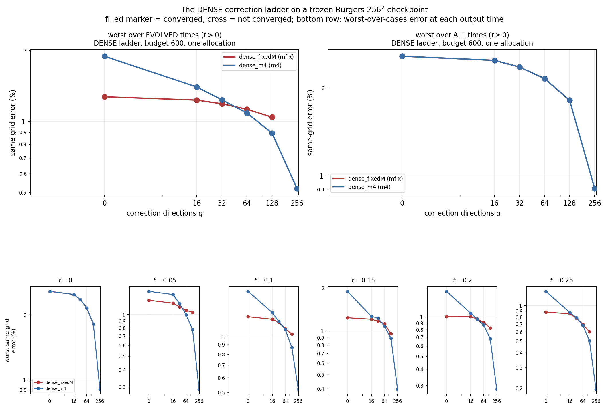

# The dense correction ladder as a tunability knob

Does the **dense** fixed-weight correction ladder — incumbent directions, per-step iteration budget 600, no empirical quadrature anywhere — satisfy the knob criterion on **both** error metrics, inside one allocation, on a frozen Burgers $256^2$ checkpoint? **The redirected criterion PASSES.** These numbers are final for this cell: every one is recomputed in an independent NumPy audit from saved output fields, and nothing in this report is typed by hand.

Primary job `3757505` (`qtd02`), source `f064b8825c57fad2a6c3c62715ad41568ddce828`, GPU `NVIDIA A100-PCIE-40GB`, elapsed 3152.1 s; JAX backend gpu, float64, matmul precision `highest`. Predeclared protocol, the redirect and every amendment: [`DESIGN.md`](../DESIGN.md).

## Why this is the question

This lane was opened to ask whether correction directions fitted to the ROM's **trajectory** error, rather than the head's **static** reconstruction residual, would remove the $q=16$ regression on the worst-over-evolved-times metric. While its job was running, the `q-diag` lane answered the underlying question from data that already existed: **the regression is the empirical quadrature, not the directions** — every dense ladder it measured is monotone on both metrics and only empirical-quadrature ladders regress. The lane was redirected to certify the arm that does not depend on the quadrature at all, and the trajectory-directions job was let finish as a **control** of that verdict. The full redirect is section 11 of `DESIGN.md`.

## The verdict

| redirected criterion (`dense_m4`) | holds | measured |
|---|---|---|
| 1. worst **evolved** error non-increasing in $q$, every rung converged | yes | monotone yes, all rungs converged yes |
| 2. converged non-dominated set spans $\ge2\times$ in **error** and $\ge2\times$ in **cost** on the evolved metric | yes | 6 points, error span 3.637x, cost span 13.070x |
| (reported, not required) worst **all-times** error non-increasing in $q$ | yes | — |

**Overall: the redirected criterion PASSES.**

Converged non-dominated arms on the evolved metric: `old_q128_M576_dense`, `old_q16_M128_dense`, `old_q256_M1088_dense`, `old_q32_M192_dense`, `old_q64_M320_dense`, `q0_M64_dense`.


**What this does not say.** The criterion is about the ladder: it certifies that $q$ is a real accuracy/cost dial on a frozen checkpoint. It is not a claim that the reduced solver beats the full-order one. Over EVERY subject in this job the non-dominated set on both metrics contains only `fom` arms — that is, only the same-job full-order controls, exactly as the campaign's standing conclusion says; the tables below give it in full.


## Part 1 — the dense ladder in data that already existed (no GPU)

Four already-collected, checksum-verified, independently audited jobs were restored from their Git-tracked archive chunks and every same-grid error was recomputed in NumPy from the saved fields. This needed no new job and it is what turned the redirect from a hypothesis into a measurement.

| job | Slurm id | GPU | per-step budget | reference recomputation (relative) |
|---|---|---|---|---|
| `btq101` | 3745589 | `NVIDIA A100 80GB PCIe` | 180 | 5.17e-16 |
| `btq102` | 3749039 | `NVIDIA A100 80GB PCIe` | 180 | 5.17e-16 |
| `btq201` | 3747245 | `NVIDIA A100-PCIE-40GB` | 180 | 5.76e-16 |
| `cclad01` | 3734098 | `NVIDIA A100 80GB PCIe` | 180 | 5.17e-16 |


All four jobs share one evaluation cohort (`all_jobs_share_one_cohort` yes).


**Every dense ladder in the archives, both metrics:**

| ladder | rungs | monotone evolved | monotone all times | every rung converged | converged non-dominated points | evolved error span | cost span | passes redirected criterion |
|---|---|---|---|---|---|---|---|---|
| `btq101_m2` | 64, 128, 256, 512 | yes | yes | no | 2 | 1.478 | 1.705 | no |
| `cclad01_m2` | 0, 16, 32, 64, 128, 256, 512 | yes | yes | no | 5 | 3.975 | 3.040 | no |
| `cclad01_m256` | 0, 16, 32, 64, 128 | yes | yes | yes | 5 | 1.220 | 2.438 | no |
| `cclad01_m4` | 0, 16, 32, 64, 128, 256, 512 | yes | yes | no | 5 | 2.115 | 4.188 | no |


**8 of 8** dense ladder/metric combinations in the archives are monotone, independently reproducing the `q-diag` census from the fields rather than from its tables.


**`btq101_m2`** — btq101, dense, M = 2(K+q).

| $q$ | $M$ | worst all times % | worst evolved % | $t_0$ % | median GPU ms | budget exits | worst joint gradient | converged |
|---|---|---|---|---|---|---|---|---|
| 64 | 160 | 2.1489 | 1.4480 | 2.1489 | 535.90 | 0 | 9.91e-07 | yes |
| 128 | 288 | 1.8116 | 0.9799 | 1.8116 | 913.68 | 0 | 9.98e-07 | yes |
| 256 | 544 | 0.9053 | 0.7566 | 0.9053 | 3398.98 | 15 | 1.19e-03 | no |
| 512 | 1056 | 0.6027 | 0.4343 | 0.6027 | 2402.10 | 0 | 1.50e-01 | no |


**`cclad01_m2`** — cclad01, dense, M = 2(K+q).

| $q$ | $M$ | worst all times % | worst evolved % | $t_0$ % | median GPU ms | budget exits | worst joint gradient | converged |
|---|---|---|---|---|---|---|---|---|
| 0 | 32 | 3.8946 | 3.8946 | 2.5629 | 296.89 | 0 | 9.98e-07 | yes |
| 16 | 64 | 2.4806 | 1.9720 | 2.4806 | 394.25 | 0 | 9.79e-07 | yes |
| 32 | 96 | 2.3534 | 1.6092 | 2.3534 | 415.02 | 0 | 9.96e-07 | yes |
| 64 | 160 | 2.1489 | 1.4480 | 2.1489 | 532.22 | 0 | 9.91e-07 | yes |
| 128 | 288 | 1.8116 | 0.9799 | 1.8116 | 902.40 | 0 | 9.98e-07 | yes |
| 256 | 544 | 0.9053 | 0.7566 | 0.9053 | 3354.32 | 15 | 1.19e-03 | no |
| 512 | 1056 | 0.6027 | 0.4343 | 0.6027 | 2381.77 | 0 | 1.38e-01 | no |


**`cclad01_m256`** — cclad01, dense, fixed M = 256.

| $q$ | $M$ | worst all times % | worst evolved % | $t_0$ % | median GPU ms | budget exits | worst joint gradient | converged |
|---|---|---|---|---|---|---|---|---|
| 0 | 256 | 2.5629 | 1.2710 | 2.5629 | 338.58 | 0 | 9.93e-07 | yes |
| 16 | 256 | 2.4806 | 1.2305 | 2.4806 | 420.40 | 0 | 9.84e-07 | yes |
| 32 | 256 | 2.3534 | 1.1869 | 2.3534 | 477.32 | 0 | 9.80e-07 | yes |
| 64 | 256 | 2.1489 | 1.1255 | 2.1489 | 570.22 | 0 | 9.92e-07 | yes |
| 128 | 256 | 1.8116 | 1.0418 | 1.8116 | 825.53 | 0 | 9.60e-07 | yes |


**`cclad01_m4`** — cclad01, dense, M = 4(K+q).

| $q$ | $M$ | worst all times % | worst evolved % | $t_0$ % | median GPU ms | budget exits | worst joint gradient | converged |
|---|---|---|---|---|---|---|---|---|
| 0 | 64 | 2.5629 | 1.8890 | 2.5629 | 282.87 | 0 | 9.97e-07 | yes |
| 16 | 128 | 2.4806 | 1.3985 | 2.4806 | 359.84 | 0 | 9.99e-07 | yes |
| 32 | 192 | 2.3534 | 1.2336 | 2.3534 | 433.28 | 0 | 9.83e-07 | yes |
| 64 | 320 | 2.1489 | 1.0843 | 2.1489 | 619.24 | 0 | 9.47e-07 | yes |
| 128 | 576 | 1.8116 | 0.8930 | 1.8116 | 1184.68 | 0 | 9.93e-07 | yes |
| 256 | 1088 | 0.9053 | 0.5194 | 0.9053 | 3927.27 | 12 | 2.27e-03 | no |
| 512 | 2112 | 0.6027 | 0.2307 | 0.6027 | 3790.39 | 0 | 1.38e-01 | no |


The one dense rung in the archives that was rerun at per-step budget 600 (`btq102`), which is why the redirected job runs every rung at 600:

| arm | $q$ | $M$ | worst all times % | worst evolved % | median GPU ms | budget exits | converged |
|---|---|---|---|---|---|---|---|
| `q256_m2_dense_base_b600` | 256 | 544 | 0.9053 | 0.7566 | 3618.62 | 0 | yes |


## Part 2 — one allocation, every dense rung at budget 600

Job `3757505` on `NVIDIA A100-PCIE-40GB`: two dense ladders, $q\in\{0, 16, 32, 64, 128, 256\}$, the same six opened development cases, three timed repetitions with burn-in in a seeded randomized subject order, all repetitions retained. No empirical quadrature is fitted anywhere in this job.


**`dense_m4`** — incumbent directions, DENSE quadrature, M = 4(K+q). Monotone on evolved: yes; on all times: yes; every rung converged: yes.

| $q$ | arm | $M$ | $m$ | worst all times % | worst evolved % | $t=0$ compression % | best-found % | median GPU ms | budget exits | worst joint gradient | converged |
|---|---|---|---|---|---|---|---|---|---|---|---|
| 0 | `q0_M64_dense` | 64 | — | 2.5629 | 1.8890 | 2.5629 | 2.5447 | 333.192 | 0 | 9.97e-07 | yes |
| 16 | `old_q16_M128_dense` | 128 | — | 2.4806 | 1.3985 | 2.4806 | 2.4615 | 417.939 | 0 | 9.99e-07 | yes |
| 32 | `old_q32_M192_dense` | 192 | — | 2.3534 | 1.2336 | 2.3534 | 2.3325 | 496.922 | 0 | 9.83e-07 | yes |
| 64 | `old_q64_M320_dense` | 320 | — | 2.1489 | 1.0843 | 2.1489 | 2.1386 | 701.655 | 0 | 9.47e-07 | yes |
| 128 | `old_q128_M576_dense` | 576 | — | 1.8116 | 0.8930 | 1.8116 | 1.8105 | 1330.433 | 0 | 9.93e-07 | yes |
| 256 | `old_q256_M1088_dense` | 1088 | — | 0.9053 | 0.5194 | 0.9053 | 0.9016 | 4354.902 | 0 | 9.99e-07 | yes |


**`dense_fixedM`** — incumbent directions, DENSE quadrature, fixed M = 256. Monotone on evolved: yes; on all times: yes; every rung converged: yes.

| $q$ | arm | $M$ | $m$ | worst all times % | worst evolved % | $t=0$ compression % | best-found % | median GPU ms | budget exits | worst joint gradient | converged |
|---|---|---|---|---|---|---|---|---|---|---|---|
| 0 | `q0_M256_dense` | 256 | — | 2.5629 | 1.2710 | 2.5629 | 2.5447 | 404.245 | 0 | 9.93e-07 | yes |
| 16 | `old_q16_M256_dense` | 256 | — | 2.4806 | 1.2305 | 2.4806 | 2.4615 | 490.820 | 0 | 9.84e-07 | yes |
| 32 | `old_q32_M256_dense` | 256 | — | 2.3534 | 1.1869 | 2.3534 | 2.3325 | 544.416 | 0 | 9.80e-07 | yes |
| 64 | `old_q64_M256_dense` | 256 | — | 2.1489 | 1.1255 | 2.1489 | 2.1386 | 643.200 | 0 | 9.92e-07 | yes |
| 128 | `old_q128_M256_dense` | 256 | — | 1.8116 | 1.0418 | 1.8116 | 1.8105 | 915.975 | 0 | 9.60e-07 | yes |


### Worst-over-cases error at each output time


**`dense_m4`**

| $q$ | $t=0$ % | $t=0.05$ % | $t=0.1$ % | $t=0.15$ % | $t=0.2$ % | $t=0.25$ % |
|---|---|---|---|---|---|---|
| 0 | 2.5629 | 1.4744 | 1.7355 | 1.8890 | 1.5710 | 1.3220 |
| 16 | 2.4806 | 1.3985 | 1.3375 | 1.2669 | 1.0681 | 0.8756 |
| 32 | 2.3534 | 1.2021 | 1.1977 | 1.2336 | 0.9651 | 0.7922 |
| 64 | 2.1489 | 0.9979 | 1.0843 | 1.0819 | 0.8684 | 0.6796 |
| 128 | 1.8116 | 0.7815 | 0.8696 | 0.8930 | 0.6793 | 0.5025 |
| 256 | 0.9053 | 0.2884 | 0.5194 | 0.3948 | 0.2798 | 0.1955 |


**`dense_fixedM`**

| $q$ | $t=0$ % | $t=0.05$ % | $t=0.1$ % | $t=0.15$ % | $t=0.2$ % | $t=0.25$ % |
|---|---|---|---|---|---|---|
| 0 | 2.5629 | 1.2710 | 1.2701 | 1.2386 | 1.0088 | 0.8829 |
| 16 | 2.4806 | 1.2116 | 1.2305 | 1.2097 | 1.0051 | 0.8526 |
| 32 | 2.3534 | 1.1411 | 1.1869 | 1.1735 | 0.9661 | 0.7824 |
| 64 | 2.1489 | 1.0752 | 1.0936 | 1.1255 | 0.9080 | 0.6947 |
| 128 | 1.8116 | 1.0418 | 1.0259 | 0.9583 | 0.8238 | 0.5997 |


### Same-job full-order controls

| control | ntol | ltol | $\Delta t$ | worst all times % | worst evolved % | median GPU ms |
|---|---|---|---|---|---|---|
| `fft_tight` | 1.00e-06 | 1.00e-08 | 0.005 | 0.0000 | 0.0000 | 88.630 |
| `fft_loose` | 1.00e-02 | 5.00e-01 | 0.005 | 3.7127 | 3.7127 | 15.366 |
| `nt1e-2_dt01` | 1.00e-02 | 5.00e-01 | 0.01 | 3.1999 | 3.1999 | 8.883 |


### Non-dominated sets over (median GPU ms, error)


**every subject, all output times**

| arm | family | $q$ | worst all times % | worst evolved % | median GPU ms | converged |
|---|---|---|---|---|---|---|
| `fft_tight` | fom | — | 0.0000 | 0.0000 | 88.630 | — |
| `nt1e-2_dt01` | fom | — | 3.1999 | 3.1999 | 8.883 | — |


**every subject, evolved times only**

| arm | family | $q$ | worst all times % | worst evolved % | median GPU ms | converged |
|---|---|---|---|---|---|---|
| `fft_tight` | fom | — | 0.0000 | 0.0000 | 88.630 | — |
| `nt1e-2_dt01` | fom | — | 3.1999 | 3.1999 | 8.883 | — |


**converged ROM arms, all output times**

| arm | family | $q$ | worst all times % | worst evolved % | median GPU ms | converged |
|---|---|---|---|---|---|---|
| `old_q128_M256_dense` | rom | 128 | 1.8116 | 1.0418 | 915.975 | yes |
| `old_q16_M128_dense` | rom | 16 | 2.4806 | 1.3985 | 417.939 | yes |
| `old_q256_M1088_dense` | rom | 256 | 0.9053 | 0.5194 | 4354.902 | yes |
| `old_q32_M192_dense` | rom | 32 | 2.3534 | 1.2336 | 496.922 | yes |
| `old_q64_M256_dense` | rom | 64 | 2.1489 | 1.1255 | 643.200 | yes |
| `q0_M64_dense` | rom | 0 | 2.5629 | 1.8890 | 333.192 | yes |


**converged ROM arms, evolved times only**

| arm | family | $q$ | worst all times % | worst evolved % | median GPU ms | converged |
|---|---|---|---|---|---|---|
| `old_q128_M256_dense` | rom | 128 | 1.8116 | 1.0418 | 915.975 | yes |
| `old_q128_M576_dense` | rom | 128 | 1.8116 | 0.8930 | 1330.433 | yes |
| `old_q16_M256_dense` | rom | 16 | 2.4806 | 1.2305 | 490.820 | yes |
| `old_q256_M1088_dense` | rom | 256 | 0.9053 | 0.5194 | 4354.902 | yes |
| `old_q32_M256_dense` | rom | 32 | 2.3534 | 1.1869 | 544.416 | yes |
| `old_q64_M256_dense` | rom | 64 | 2.1489 | 1.1255 | 643.200 | yes |
| `old_q64_M320_dense` | rom | 64 | 2.1489 | 1.0843 | 701.655 | yes |
| `q0_M256_dense` | rom | 0 | 2.5629 | 1.2710 | 404.245 | yes |
| `q0_M64_dense` | rom | 0 | 2.5629 | 1.8890 | 333.192 | yes |


### Every arm of the primary job

| arm | $q$ | $M$ | all times % | evolved % | $t_0$ % | reference % | median GPU ms | median iters/step | budget exits | converged |
|---|---|---|---|---|---|---|---|---|---|---|
| `fft_loose` | — | — | 3.7127 | 3.7127 | 0.0000 | 2.4737 | 15.366 | 1.0 | — | — |
| `fft_tight` | — | — | 0.0000 | 0.0000 | 0.0000 | 4.0265 | 88.630 | 2.0 | — | — |
| `nt1e-2_dt01` | — | — | 3.1999 | 3.1999 | 0.0000 | 3.6168 | 8.883 | 1.0 | — | — |
| `old_q16_M128_dense` | 16 | 128 | 2.4806 | 1.3985 | 2.4806 | 4.1065 | 417.939 | 3.0 | 0 | yes |
| `old_q16_M256_dense` | 16 | 256 | 2.4806 | 1.2305 | 2.4806 | 4.0664 | 490.820 | 3.0 | 0 | yes |
| `old_q32_M192_dense` | 32 | 192 | 2.3534 | 1.2336 | 2.3534 | 4.0814 | 496.922 | 3.0 | 0 | yes |
| `old_q32_M256_dense` | 32 | 256 | 2.3534 | 1.1869 | 2.3534 | 4.0760 | 544.416 | 3.0 | 0 | yes |
| `old_q64_M256_dense` | 64 | 256 | 2.1489 | 1.1255 | 2.1489 | 4.0951 | 643.200 | 3.0 | 0 | yes |
| `old_q64_M320_dense` | 64 | 320 | 2.1489 | 1.0843 | 2.1489 | 4.1013 | 701.655 | 3.0 | 0 | yes |
| `old_q128_M256_dense` | 128 | 256 | 1.8116 | 1.0418 | 1.8116 | 4.0926 | 915.975 | 3.0 | 0 | yes |
| `old_q128_M576_dense` | 128 | 576 | 1.8116 | 0.8930 | 1.8116 | 4.0797 | 1330.433 | 3.0 | 0 | yes |
| `old_q256_M1088_dense` | 256 | 1088 | 0.9053 | 0.5194 | 0.9053 | 4.0391 | 4354.902 | 5.0 | 0 | yes |
| `q0_M64_dense` | 0 | 64 | 2.5629 | 1.8890 | 2.5629 | 4.5575 | 333.192 | 3.0 | 0 | yes |
| `q0_M256_dense` | 0 | 256 | 2.5629 | 1.2710 | 2.5629 | 4.0637 | 404.245 | 3.0 | 0 | yes |


### Cross-job fidelity of the primary job

| arm | reproduces | job | declared tolerance | worst relative difference | ours % | theirs % | passed |
|---|---|---|---|---|---|---|---|
| `old_q128_M256_dense` | `q128_M256_dense_g1em06` | btq201 | 1.00e-09 | 7.67e-10 | 1.8116 | 1.8116 | yes |
| `old_q128_M576_dense` | `q128_m4_dense_block` | cclad01 | 1.00e-09 | 1.14e-10 | 1.8116 | 1.8116 | yes |
| `old_q16_M128_dense` | `q16_m4_dense_block` | cclad01 | 1.00e-09 | 5.59e-11 | 2.4806 | 2.4806 | yes |
| `old_q16_M256_dense` | `q16_m256_dense_block` | cclad01 | 1.00e-09 | 5.59e-11 | 2.4806 | 2.4806 | yes |
| `old_q256_M1088_dense` | `q256_m4_dense_block` | cclad01 | 1.00e-09 | 3.03e-09 | 0.9053 | 0.9053 | no |
| `old_q32_M192_dense` | `q32_m4_dense_block` | cclad01 | 1.00e-09 | 3.91e-11 | 2.3534 | 2.3534 | yes |
| `old_q32_M256_dense` | `q32_m256_dense_block` | cclad01 | 1.00e-09 | 3.91e-11 | 2.3534 | 2.3534 | yes |
| `old_q64_M256_dense` | `q64_m256_dense_block` | cclad01 | 1.00e-09 | 1.07e-09 | 2.1489 | 2.1489 | no |
| `old_q64_M320_dense` | `q64_m4_dense_block` | cclad01 | 1.00e-09 | 1.07e-09 | 2.1489 | 2.1489 | no |
| `q0_M256_dense` | `q0_m256_dense_block` | cclad01 | 1.00e-09 | 7.64e-13 | 2.5629 | 2.5629 | yes |
| `q0_M64_dense` | `q0_m4_dense_block` | cclad01 | 1.00e-09 | 3.91e-13 | 2.5629 | 2.5629 | yes |


### Gates of the primary job

| gate | passed | kind |
|---|---|---|
| `artifacts_present` | yes | blocking |
| `backend_gpu` | yes | blocking |
| `bank_frozen` | yes | blocking |
| `btq201_envelope_probe` | yes | informational |
| `checkpoint_unchanged` | yes | blocking |
| `complete` | yes | blocking |
| `cross_job_fidelity` | no | blocking |
| `direction_cohorts_disjoint_from_evaluation` | yes | blocking |
| `direction_prefixes_recomputed_from_artifact` | yes | blocking |
| `directions_hashed_and_saved` | yes | blocking |
| `directions_rank_covers_ladder` | yes | blocking |
| `evaluation_cohort_bitwise_abl01` | yes | blocking |
| `every_eq_rule_reports_validity` | yes | blocking |
| `every_invocation_paired` | yes | blocking |
| `every_rom_carries_exit_and_stationarity` | yes | blocking |
| `every_subject_case_has_all_reps` | yes | blocking |
| `final_cohort_unopened` | yes | blocking |
| `nested_prefix_consistent` | yes | blocking |
| `no_eq_rule_truncated` | yes | blocking |
| `old_directions_hash_matches_comparator` | no | informational |
| `overdetermined_weak_system` | yes | blocking |
| `precision_highest` | yes | blocking |
| `recorded_errors_recomputed_from_saved_fields` | yes | blocking |
| `reference_fields_bitwise_match_comparator` | yes | informational |
| `reference_residuals` | yes | blocking |
| `repetition_output_identical` | yes | blocking |
| `reproduces_old_q128_M256_dense` | yes | blocking |
| `reproduces_old_q128_M576_dense` | yes | blocking |
| `reproduces_old_q16_M128_dense` | yes | blocking |
| `reproduces_old_q16_M256_dense` | yes | blocking |
| `reproduces_old_q256_M1088_dense` | no | blocking |
| `reproduces_old_q32_M192_dense` | yes | blocking |
| `reproduces_old_q32_M256_dense` | yes | blocking |
| `reproduces_old_q64_M256_dense` | no | blocking |
| `reproduces_old_q64_M320_dense` | no | blocking |
| `reproduces_q0_M256_dense` | yes | blocking |
| `reproduces_q0_M64_dense` | yes | blocking |
| `same_grid_baseline_present` | yes | blocking |
| `step_budget_is_600` | yes | blocking |
| `x64` | yes | blocking |


Failed: `reproduces_old_q256_M1088_dense`, `reproduces_old_q64_M256_dense`, `reproduces_old_q64_M320_dense`.


## The control — correction directions fitted to the trajectory error

Job `3756800` (`qtd01`) on `NVIDIA A100-PCIE-40GB`, source `59fa69b1ad0c88140fc9519d6dad74fa0570ad9c`, elapsed time not recorded because it did not finish, submitted **before** the `q-diag` verdict arrived and let run rather than cancelled. It builds three direction sets that differ only in which residual matrix is decomposed — the incumbent static reconstruction residual, and the $q=0$ ROM's own trajectory error against the same-mesh converged full-order solve over 32 and over 6 training trajectories — and runs each over the ladder. It **did not reach its timed phase**; what it did produce is reported here, and what it did not is stated plainly below.


**The three direction sets.**

| set | residual decomposed | rows | rank | orthonormality dev | fit s | `directions_sha256` |
|---|---|---|---|---|---|---|
| `old` | static reconstruction residual, 1024 snapshots | 1024 | 512 | 3.17e-13 | 1546.9 | `104887e76be1e80c…` |
| `traj` | trajectory error, 32 trajectories | 1632 | 512 | 1.09e-14 | 27.0 | `06f85e4493050c5f…` |
| `prac` | trajectory error, 6 trajectories | 306 | 306 | 3.37e-13 | 8.8 | `44cfa21138a127d6…` |


**Cross-capture** $\kappa_q(P,C)=\|\tilde P\tilde C_{:,1:q}\|_F^2/\|\tilde P\|_F^2$, per cent of residual matrix $P$'s whitened energy that direction set $C$ reaches at rung $q$. The diagonal is each set's own POD energy; the off-diagonal says how differently the two rules aim.

| residual $P$ | directions $C$ | $q=16$ | $q=32$ | $q=64$ | $q=128$ | $q=256$ |
|---|---|---|---|---|---|---|
| `old` | `old` | 45.28 | 62.01 | 80.26 | 94.70 | 99.83 |
| `old` | `traj` | 11.41 | 22.76 | 39.98 | 64.82 | 92.68 |
| `old` | `prac` | 8.64 | 15.57 | 28.60 | 53.65 | 90.56 |
| `traj` | `old` | 11.72 | 22.05 | 38.99 | 66.87 | 97.82 |
| `traj` | `traj` | 73.61 | 86.31 | 95.74 | 99.61 | 100.00 |
| `traj` | `prac` | 9.86 | 18.89 | 34.44 | 59.94 | 94.25 |
| `prac` | `old` | 4.53 | 10.60 | 26.17 | 51.33 | 94.86 |
| `prac` | `traj` | 48.11 | 57.80 | 68.92 | 83.95 | 97.45 |
| `prac` | `prac` | 94.37 | 99.37 | 100.00 | 100.00 | 100.00 |


**Principal angles** between the direction subspaces (field metric, degrees); `overlap` is $\frac1q\sum_i\cos^2\theta_i$, 1 for identical subspaces and $q/R$ for a random pair.

| pair | $q$ | overlap | min | median | max |
|---|---|---|---|---|---|
| `prac_vs_old` | 16 | 0.07913 | 56.97 | 77.98 | 89.14 |
| `prac_vs_old` | 64 | 0.30809 | 25.88 | 60.56 | 89.63 |
| `prac_vs_old` | 256 | 0.82904 | 0.00 | 4.89 | 89.71 |
| `traj_vs_old` | 16 | 0.17578 | 38.18 | 70.17 | 88.69 |
| `traj_vs_old` | 64 | 0.44116 | 11.74 | 48.81 | 89.89 |
| `traj_vs_old` | 256 | 0.85741 | 0.00 | 4.11 | 89.08 |
| `traj_vs_prac` | 16 | 0.14263 | 26.37 | 74.96 | 89.84 |
| `traj_vs_prac` | 64 | 0.31203 | 11.63 | 59.87 | 89.55 |
| `traj_vs_prac` | 256 | 0.80031 | 0.00 | 6.15 | 89.36 |


**The static manifold floor each rule buys.** Best-found error on the supplied field over that rung's own manifold, worst over the six cases, found offline by multistart optimisation. It is the accuracy floor the online solver is chasing, and it is the confounder that would otherwise explain any ladder difference. A dash is a rung this job did not build for that rule; the incumbent rule's floor at every rung is in the primary job's ladder tables above.

| directions | $q=0$ % | $q=16$ % | $q=32$ % | $q=64$ % | $q=128$ % | $q=256$ % |
|---|---|---|---|---|---|---|
| `old` | 2.5447 | 2.4615 | — | 2.1386 | — | — |
| `traj` | 2.5447 | 2.4780 | 2.2711 | 2.0764 | 1.8172 | 1.0681 |
| `prac` | 2.5447 | 2.4241 | 2.2857 | 2.0669 | 1.7430 | 0.9492 |


**Its timed ladders do not exist.** The job built all 31 reduced arms and every empirical-quadrature rule, ran every offline diagnostic above, and then died in the compile warm-up of its 21st subject with a CUDA out-of-memory on a 40 GB A100 — it was sized for the 80 GB part. Everything above this paragraph is from its collected, checksum-verified output; nothing below it exists. The coordinator's redirect said not to spend another job on new directions, so it was not resubmitted, and the question it would have answered — whether the $q=16$ evolved regression follows the quadrature rather than the direction rule — is answered by the `q-diag` census and by Part 1 and Part 2 above, on the dense side, without it.


Its terminating error, lifted verbatim from the collected job stderr:

```
jax.errors.JaxRuntimeError: RESOURCE_EXHAUSTED: [0] Failed to load in-memory CUBIN (compiled for a different GPU?).: CUDA_ERROR_OUT_OF_MEMORY: out of memory [executable_name='jit__lambda']
```


**Gates of the control job.**

| gate | passed | kind |
|---|---|---|
| `backend_gpu` | yes | blocking |
| `bank_frozen` | yes | blocking |
| `complete` | no | blocking |
| `direction_cohorts_disjoint_from_evaluation` | yes | blocking |
| `direction_prefixes_recomputed_from_artifact` | yes | blocking |
| `directions_hashed_and_saved` | yes | blocking |
| `directions_rank_covers_ladder` | yes | blocking |
| `evaluation_cohort_bitwise_abl01` | yes | blocking |
| `every_declared_rung_has_a_reconstruction` | yes | blocking |
| `every_eq_rule_reports_validity` | yes | blocking |
| `final_cohort_unopened` | yes | blocking |
| `nested_prefix_consistent` | yes | blocking |
| `no_eq_rule_truncated` | yes | blocking |
| `old_directions_hash_matches_comparator` | no | informational |
| `overdetermined_weak_system` | yes | blocking |
| `precision_highest` | yes | blocking |
| `reference_fields_bitwise_match_comparator` | yes | informational |
| `reference_residuals` | yes | blocking |
| `x64` | yes | blocking |


Failed: `complete`.


## The lane this question came from

`q-diag`'s diagnosis is at `/home/tahmid/Dev/pod-ae-nmrom/Tunable-NM-ROM-Claude/worktrees/2026-09-16-q-diag/experiments/q-diag/reports/2026-09-16-q16-regression-diagnosis.md`, SHA256 `c0bf57626d9e0a422965446b39e79e423c9a39f6886b7ca1893b8a03cd803c6e`. Its verdict — that the $q=16$ evolved-metric regression is the empirical quadrature and not the directions — is what redirected this lane, and Part 1 above reproduces its dense-ladder census independently from the saved fields.


## Figure




## Glossary

Written for a reader who knows none of this project's vocabulary.

- **ROM / reduced-order model.** A cheap surrogate solver: instead of solving the PDE for all $n=255^2$ interior grid values it solves for a handful of coefficients and reconstructs the field from them.
- **FOM / full-order model.** The real solver on the real grid. `fft_tight` is the converged one and is the yardstick every error here is measured against; `fft_loose` and `nt1e-2_dt01` are deliberately under-solved cheap ones, present so the ROM is never only compared against an over-solved competitor.
- **The bank $G$.** A fixed matrix of $R=512$ spatial fields produced once by the frozen neural checkpoint. Everything the ROM can represent is a combination of them.
- **The head $h_\theta$.** The frozen neural map from a $K=16$-dimensional latent code $z$ to the 512 bank coefficients. It is never retrained anywhere in this cell.
- **$q$, the correction directions.** Extra bank directions $C_q$ solved alongside the latent code: $\eta = h_\theta(z) + C_q y$. $q=0$ is the plain frozen model; larger $q$ gives the solver more freedom and costs more per step. **Rung** = one value of $q$; **ladder** = one ordered sweep of $q$ at fixed everything else.
- **Knob / tunability.** The claim being certified: that turning one dial at inference time, with the trained weights untouched, buys a real range of accuracy for a real range of cost. Made precise here as the criterion in "The verdict".
- **Dense vs empirical quadrature (EQ).** The nonlinear advection term is exactly a sum over all $n$ grid points ("dense"); an empirical-quadrature rule replaces it with a weighted sum over $m$ chosen points, fitted offline. EQ is where the ROM's speed comes from — and, per the `q-diag` lane, where the non-monotonicity came from. This report's primary job uses **no EQ at all**.
- **$M$, the test count.** How many test functions the weak residual is measured against. `M = 4(K+q)` grows with $q$; the fixed-$M$ ladder holds it at 256 so the effect of $q$ is separated from the effect of $M$. $M>K+q$ is required, which is why the fixed-$M$ ladder stops before $q=256$.
- **Same-grid error.** Distance from the same-job converged full-order solve on the same grid, divided by the norm of the supplied initial field. **Reference error** is the same against a 4096-interval solve, which also contains the 256-grid's own discretisation error and is therefore larger and less discriminating.
- **All times / evolved times / $t_0$ compression.** The six output times are $t=0,0.05,\dots,0.25$. "All times" is the worst over all six; "evolved times" drops $t=0$; "$t_0$ compression" is the $t=0$ term alone — the error the decoder makes just reproducing the field it was handed, before any time stepping. The all-times metric is usually pinned by that term, which is why both are always reported.
- **Worst / median.** Worst is over the six evaluation cases. Median GPU ms is the median over all retained timed repetitions (three per case, every one kept).
- **Converged.** Every time step and the initial fit exited on a residual, tiny-step or gradient criterion — never on the iteration budget — AND the joint normalized gradient stayed at or below $10^{-6}$. An unconverged arm's error is still reported and labelled, but cannot count towards the criterion.
- **Budget exit.** A time step that ran out of its per-step iteration budget (600 here, 180 in the older archives) before meeting the stopping rule. **Joint normalized gradient** $\|J^\top r\|/(\|J\|\,\|r\|)$ is the scale-free test for "is this actually a stationary point".
- **Best-found.** The smallest error any code on that rung's manifold can reach on a supplied field, found offline by multistart optimisation: the accuracy floor the online solver is chasing.
- **Non-dominated set.** The arms that nothing else beats on both cost and error at once — the usable trade-off curve. **Error span / cost span** are the ratios between its extreme points, and are what the criterion measures.
- **Direction rules (control only).** `old` decomposes the error the head makes fitting each training snapshot on its own; `traj` and `prac` decompose the error the $q=0$ ROM actually accumulates along a trajectory, over 32 and over 6 training trajectories. **Cross-capture** is how much of one rule's error energy the other rule's directions can represent at all; **principal angles / overlap** measure how far apart the two subspaces are (overlap 1 = identical, $q/R$ = as unrelated as a random pair).
- **Gate.** A check that had to pass before any number here was allowed to count. Blocking gates decide; informational ones are probes, reported either way.

