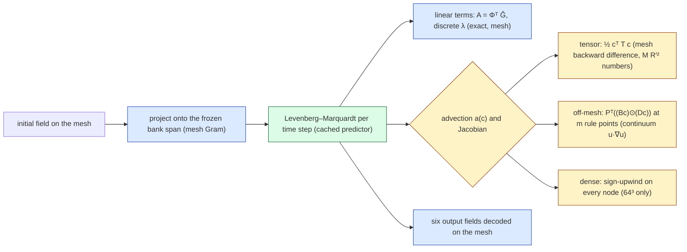

# Off-mesh quadrature for the Burgers 3D reduced model at 64³, 128³ and 256³

This report replaces only the advection term of our frozen Burgers 3D span model ($R = 512$ coordinate-network bank) by Hari's off-mesh quadrature of the continuum term, and compares it with the incumbent precomputed quadratic tensor against a refined reference, on 64 validation and 32 held-out cases. **Status: final** for the held-out numbers (frozen settings, evaluated once by this lane after the selection was frozen); validation numbers are the selection data. All numbers are generated by `experiments/quadrature-burgers3d/make_report.py` from the run JSONs.

## Answers

1. **Lattice vs Gauss at equal $m$ — yes, everywhere.** At 64³, $R' = 512$: worst continuum ρ of the 4096-point CBC lattice 8.3e-02 vs Gauss 16³ 6.2e-01; 32768-point lattice 8.6e-05 vs Gauss 32³ 4.7e-04. At 128³, $R' = 512$: worst continuum ρ of the 4096-point CBC lattice 1.0e-01 vs Gauss 16³ 6.1e-01; 32768-point lattice 1.4e-04 vs Gauss 32³ 5.8e-04. At 256³, $R' = 512$: worst continuum ρ of the 4096-point CBC lattice 1.2e-01 vs Gauss 16³ 6.1e-01; 32768-point lattice 2.0e-04 vs Gauss 32³ 6.6e-04. The smallest lattice size whose validation worst refined error is at most the tensor's: 64³/512: 4096, 64³/256: 4096, 128³/512: 4096, 128³/256: 4096, 256³/512: 4096, 256³/256: 4096; the smallest lattice size within $10^{-3}$ of the converged off-mesh rollout: 64³/512: 16384, 64³/256: 4096, 128³/512: 16384, 128³/256: 4096, 256³/512: 16384, 256³/256: 4096.

2. **Does the off-mesh solve reproduce the tensor against the refined reference?** Held-out worst refined error, selected off-mesh rule vs tensor: 64³/512: gl24_R512 2.83 % vs 10.46 %; 64³/256: lat4096_R256 4.49 % vs 10.57 %; 128³/512: gl24_R512 2.83 % vs 6.09 %; 128³/256: lat4096_R256 4.49 % vs 6.56 %; 256³/512: gl24_R512 2.83 % vs 3.87 %; 256³/256: lat4096_R256 4.49 % vs 5.07 %. See section 4 for the mesh-invariance verdict.

3. **Cost.** Held-out median ms per query, selected off-mesh rule vs tensor (same allocation): 64³/512: 34.1 vs 47.9 ms; 64³/256: 11.1 vs 12.2 ms; 128³/512: 40.6 vs 52.0 ms; 128³/256: 12.1 vs 14.1 ms; 256³/512: 76.7 vs 90.1 ms; 256³/256: 33.0 vs 35.1 ms. Section 5 has memory, Jacobian time and both speedup rules.

4. **k-head revisited (optional): not run.** Nothing was retrained.

## 1. What was changed

The off-mesh term is

$$ a_m(c) = N^{3/2}\sum_{q=1}^{m} w_q\,\psi_m(x_q)\,u(x_q)\,\big(u_x+u_y+u_z\big)(x_q),\qquad u(x_q) = \hat G(x_q)\,c, $$

with the bank and its analytic $(1,1,1)$-derivative evaluated at the rule points. It is a quadrature of the *continuum* advection, whereas the tensor and the full-order model use the mesh's first-order backward/upwind difference; the two differ by the stencil's $O(h)$ consistency gap. Linear terms, the projection of $u_0$ and the output decoding are the mesh operators in every arm. Solver, $\Delta t = 0.01$, $R' \in \{512, 256\}$ and the test count $M \approx 4R'$ are identical across arms (DESIGN.md).

## 2. The refined reference and its own uncertainty

Full-order model at 513 nodes (512³ cells), $\Delta t = 0.0025$, tolerances $(10^{-6}, 10^{-7})$ (DESIGN R3), job 4732869 on NVIDIA H100 PCIe: 96 cases, median 47.7 s per case, every case accepted. Re-solving four validation cases at $(10^{-10}, 10^{-11})$ (job 4733462) changes them by at most 1.0e-05 relative to $\lVert u_0\rVert$ — above the $10^{-5}$ threshold of DESIGN R4, so the reference is declared tolerance-limited at that level and refined-error differences below 1.0e-04 are unresolved. The same-grid references at the lane's meshes differ from it, worst over the held-out cases, by 9.96 % (64³), 5.22 % (128³), 2.28 % (256³); on the probe case the 257-node reference differed from the 513-node one by 1.70 %. The reference is a first-order solution: refined-error differences between arms of under about one percent are within its own discretisation error and are not read as accuracy differences.

## 3. Quadrature error ρ on reached states

Worst (median) ρ over the evolved tensor-reached states of 24 certification cases (923811–923813), against the continuum target (Gauss 80³) and against the mesh target (sign-upwind on every node). Validation jobs.

**$R' = 512$**

| rule | $m$ | ρ continuum 64³ | ρ continuum 128³ | ρ continuum 256³ | ρ mesh 64³ | ρ mesh 128³ | ρ mesh 256³ |
|---|---|---|---|---|---|---|---|
| tensor (incumbent) | mesh | 1.9e-01 (1.3e-01) | 9.8e-02 (6.6e-02) | 5.2e-02 (3.3e-02) | 1.8e-05 | 1.7e-05 | 1.5e-05 |
| dense sign-upwind | mesh | 1.9e-01 (1.3e-01) | 9.8e-02 (6.6e-02) | 5.2e-02 (3.3e-02) | 0.0e+00 | 0.0e+00 | 0.0e+00 |
| `lat4096` | 4096 | 8.3e-02 (7.8e-03) | 1.0e-01 (8.9e-03) | 1.2e-01 (9.4e-03) | 2.0e-01 | 1.5e-01 | 1.3e-01 |
| `lat8192` | 8192 | 1.0e-02 (3.0e-04) | 1.6e-02 (3.4e-04) | 2.1e-02 (3.5e-04) | 1.9e-01 | 1.0e-01 | 5.9e-02 |
| `lat16384` | 16384 | 1.1e-03 (3.7e-05) | 1.4e-03 (3.7e-05) | 1.6e-03 (3.7e-05) | 1.9e-01 | 1.0e-01 | 5.3e-02 |
| `lat32768` | 32768 | 8.6e-05 (2.0e-06) | 1.4e-04 (2.0e-06) | 2.0e-04 (2.1e-06) | 1.9e-01 | 1.0e-01 | 5.3e-02 |
| `kor16381` | 16381 | 1.7e-03 (9.9e-05) | 2.9e-03 (1.1e-04) | 4.1e-03 (1.1e-04) | 1.9e-01 | 1.0e-01 | 5.3e-02 |
| `gl16` | 4096 | 6.2e-01 (2.7e-01) | 6.1e-01 (2.8e-01) | 6.1e-01 (2.8e-01) | 6.4e-01 | 6.1e-01 | 6.1e-01 |
| `gl24` | 13824 | 1.0e-02 (1.2e-03) | 1.3e-02 (1.3e-03) | 1.6e-02 (1.4e-03) | 1.9e-01 | 1.0e-01 | 5.5e-02 |
| `gl32` | 32768 | 4.7e-04 (8.6e-05) | 5.8e-04 (8.7e-05) | 6.6e-04 (8.8e-05) | 1.9e-01 | 1.0e-01 | 5.3e-02 |
| `sob16384` | 16384 | 1.5e-01 (1.1e-01) | 1.5e-01 (1.1e-01) | 1.5e-01 (1.1e-01) | 2.5e-01 | 1.8e-01 | 1.6e-01 |
| `lat256` | 256 | 3.2e+00 (2.8e+00) | 3.3e+00 (2.8e+00) | 3.4e+00 (2.8e+00) | 3.4e+00 | 3.4e+00 | 3.4e+00 |
| `smol8` | 2559 | 4.3e+01 (1.3e+01) | 4.4e+01 (1.3e+01) | 4.5e+01 (1.3e+01) | 4.4e+01 | 4.5e+01 | 4.5e+01 |

Continuum-target check (Gauss 64³ vs 80³, worst ρ): 64³ 3.6e-08, 128³ 8.0e-08, 256³ 1.2e-07.

**$R' = 256$**

| rule | $m$ | ρ continuum 64³ | ρ continuum 128³ | ρ continuum 256³ | ρ mesh 64³ | ρ mesh 128³ | ρ mesh 256³ |
|---|---|---|---|---|---|---|---|
| tensor (incumbent) | mesh | 1.9e-01 (1.3e-01) | 9.7e-02 (6.6e-02) | 5.2e-02 (3.3e-02) | 1.9e-04 | 1.9e-04 | 1.4e-04 |
| dense sign-upwind | mesh | 1.9e-01 (1.3e-01) | 9.7e-02 (6.6e-02) | 5.2e-02 (3.3e-02) | 0.0e+00 | 0.0e+00 | 0.0e+00 |
| `lat4096` | 4096 | 2.4e-02 (1.3e-03) | 2.9e-02 (1.3e-03) | 3.2e-02 (1.4e-03) | 1.9e-01 | 1.1e-01 | 6.2e-02 |
| `lat8192` | 8192 | 2.2e-03 (1.1e-04) | 2.7e-03 (1.1e-04) | 3.1e-03 (1.2e-04) | 1.9e-01 | 1.0e-01 | 5.4e-02 |
| `lat16384` | 16384 | 1.9e-04 (7.6e-06) | 2.6e-04 (7.7e-06) | 2.9e-04 (7.7e-06) | 1.9e-01 | 1.0e-01 | 5.4e-02 |
| `lat32768` | 32768 | 2.9e-05 (7.1e-07) | 3.6e-05 (7.1e-07) | 4.1e-05 (7.0e-07) | 1.9e-01 | 1.0e-01 | 5.4e-02 |
| `kor16381` | 16381 | 6.0e-04 (3.7e-05) | 7.5e-04 (3.7e-05) | 8.6e-04 (3.8e-05) | 1.9e-01 | 1.0e-01 | 5.4e-02 |
| `gl16` | 4096 | 1.9e-01 (4.7e-02) | 1.9e-01 (5.0e-02) | 1.9e-01 (5.2e-02) | 2.7e-01 | 2.1e-01 | 2.0e-01 |
| `gl24` | 13824 | 2.1e-03 (3.3e-04) | 2.5e-03 (3.5e-04) | 2.7e-03 (3.7e-04) | 1.9e-01 | 1.0e-01 | 5.4e-02 |
| `gl32` | 32768 | 8.3e-05 (2.9e-05) | 9.1e-05 (2.9e-05) | 9.8e-05 (2.9e-05) | 1.9e-01 | 1.0e-01 | 5.3e-02 |
| `sob16384` | 16384 | 9.1e-02 (6.0e-02) | 9.4e-02 (6.0e-02) | 9.5e-02 (6.0e-02) | 2.3e-01 | 1.5e-01 | 1.2e-01 |
| `lat256` | 256 | 2.2e+00 (1.8e+00) | 2.2e+00 (1.8e+00) | 2.3e+00 (1.8e+00) | 2.4e+00 | 2.4e+00 | 2.3e+00 |
| `smol8` | 2559 | 2.4e+01 (7.4e+00) | 2.5e+01 (7.3e+00) | 2.5e+01 (7.3e+00) | 2.4e+01 | 2.5e+01 | 2.5e+01 |

Continuum-target check (Gauss 64³ vs 80³, worst ρ): 64³ 1.5e-08, 128³ 2.0e-08, 256³ 2.4e-08.

Reading: the dense sign-upwind stencil's continuum ρ is the mesh's $O(h)$ consistency gap; every off-mesh rule that resolves the continuum term sits at that same distance from the mesh target, so the mesh-target ρ of an off-mesh rule cannot fall below the gap, and the paper's 0.116 certificate against the mesh target is not the right test for an off-mesh rule. The lane certifies off-mesh rules against the continuum target instead (DESIGN section 7).

## 4. End-to-end reduced solves (held-out cohort 923901, 32 cases)

Worst (median) over cases of the evolved-time maximum relative error. `refined` is against the 513-node reference on the 63³ lattice $x = k/64$; `same-grid` against the same-mesh Newton–BiCGStab reference; `dist tensor` / `dist conv` are field distances from the tensor rollout and from the 32768-point lattice rollout. ms: A–B–A median on the first 16 cases.

**64³, $R' = 512$** (job 4737003, NVIDIA H200; selected: `gl24_R512`)

| arm | refined | Richardson (diag.) | same-grid | dist tensor | dist conv | LM its/query | exits (4/0/3) | ms |
|---|---|---|---|---|---|---|---|---|
| `tensor` | 10.46 % (3.52 %) | 12.67 % | 1.52 % | – | 10.625 % | 28 | 800/0/0 | 47.9 |
| `dense` (32 cases) | 10.46 % (3.52 %) | 12.67 % | 1.52 % | 0.00 % | 10.625 % | 28 | 800/0/0 | untimed |
| `lat4096` | 2.83 % (1.08 %) | 4.16 % | 10.26 % | 10.59 % | 0.245 % | 28 | 800/0/0 | 20.4 |
| `lat8192` | 2.83 % (1.08 %) | 4.14 % | 10.29 % | 10.62 % | 0.040 % | 28 | 800/0/0 | 26.2 |
| `lat16384` | 2.83 % (1.08 %) | 4.14 % | 10.29 % | 10.63 % | 0.002 % | 28 | 800/0/0 | 37.9 |
| `lat32768` | 2.83 % (1.08 %) | 4.14 % | 10.29 % | 10.63 % | 0.000 % | 28 | 800/0/0 | 61.1 |
| `kor16381` | 2.83 % (1.08 %) | 4.14 % | 10.30 % | 10.63 % | 0.015 % | 28 | 800/0/0 | 40.2 |
| `gl16` | 4.31 % (1.18 %) | 5.71 % | 8.97 % | 9.23 % | 3.249 % | 26 | 800/0/0 | 19.6 |
| `gl24` | 2.83 % (1.08 %) | 4.14 % | 10.28 % | 10.61 % | 0.089 % | 28 | 800/0/0 | 34.1 |
| `gl32` | 2.83 % (1.08 %) | 4.14 % | 10.29 % | 10.63 % | 0.004 % | 28 | 800/0/0 | 60.4 |
| `sob16384` | 3.26 % (1.19 %) | 4.62 % | 10.36 % | 10.68 % | 1.500 % | 26 | 800/0/0 | 36.1 |
| `lat256` (control) | 37.28 % (12.91 %) | 38.80 % | 32.12 % | 31.37 % | 36.884 % | 28 | 800/0/0 | 15.0 |
| `smol8` (control) | 41.65 % (23.09 %) | 42.97 % | 36.54 % | 35.88 % | 41.565 % | 34 | 746/54/0 | 21.1 |

**64³, $R' = 256$** (job 4737003, NVIDIA H200; selected: `lat4096_R256`)

| arm | refined | Richardson (diag.) | same-grid | dist tensor | dist conv | LM its/query | exits (4/0/3) | ms |
|---|---|---|---|---|---|---|---|---|
| `tensor` | 10.57 % (3.52 %) | 12.76 % | 2.59 % | – | 10.600 % | 27 | 800/0/0 | 12.2 |
| `dense` (32 cases) | 10.57 % (3.52 %) | 12.76 % | 2.59 % | 0.01 % | 10.600 % | 27 | 800/0/0 | untimed |
| `lat4096` | 4.49 % (1.20 %) | 5.61 % | 10.51 % | 10.59 % | 0.049 % | 27 | 800/0/0 | 11.1 |
| `lat8192` | 4.49 % (1.20 %) | 5.61 % | 10.52 % | 10.60 % | 0.009 % | 27 | 800/0/0 | 13.4 |
| `lat16384` | 4.49 % (1.20 %) | 5.61 % | 10.52 % | 10.60 % | 0.000 % | 27 | 800/0/0 | 18.1 |
| `lat32768` | 4.49 % (1.20 %) | 5.61 % | 10.52 % | 10.60 % | 0.000 % | 27 | 800/0/0 | 27.1 |
| `kor16381` | 4.49 % (1.20 %) | 5.61 % | 10.52 % | 10.60 % | 0.002 % | 27 | 800/0/0 | 19.1 |
| `gl16` | 4.54 % (1.20 %) | 5.68 % | 10.19 % | 10.27 % | 1.173 % | 26 | 800/0/0 | 11.0 |
| `gl24` | 4.49 % (1.20 %) | 5.61 % | 10.51 % | 10.60 % | 0.020 % | 27 | 800/0/0 | 16.6 |
| `gl32` | 4.49 % (1.20 %) | 5.61 % | 10.52 % | 10.60 % | 0.001 % | 27 | 800/0/0 | 27.1 |
| `sob16384` | 4.61 % (1.22 %) | 5.82 % | 10.53 % | 10.61 % | 1.039 % | 27 | 800/0/0 | 18.0 |
| `lat256` (control) | 31.55 % (11.52 %) | 32.86 % | 27.75 % | 27.30 % | 31.296 % | 26 | 800/0/0 | 7.3 |
| `smol8` (control) | 41.98 % (22.56 %) | 42.16 % | 41.82 % | 41.68 % | 41.631 % | 34 | 739/61/0 | 12.4 |

Newton–BiCGStab at 64³ (same job): dt0.005_nt0.01_lt0.1 26.93 % refined / 27.27 % Richardson / 26.01 % same-grid / 15.4 ms; dt0.005_nt0.001_lt0.1 9.85 % refined / 12.06 % Richardson / 0.92 % same-grid / 17.9 ms; dt0.01_nt0.01_lt0.1 10.26 % refined / 12.48 % Richardson / 1.26 % same-grid / 7.6 ms; dt0.01_nt0.001_lt0.1 10.41 % refined / 12.63 % Richardson / 1.20 % same-grid / 12.9 ms; dt0.025_nt0.01_lt0.1 11.65 % refined / 13.86 % Richardson / 4.29 % same-grid / 3.6 ms; dt0.025_nt0.001_lt0.1 12.01 % refined / 14.21 % Richardson / 4.29 % same-grid / 7.0 ms.

**128³, $R' = 512$** (job 4737005, NVIDIA H200; selected: `gl24_R512`)

| arm | refined | Richardson (diag.) | same-grid | dist tensor | dist conv | LM its/query | exits (4/0/3) | ms |
|---|---|---|---|---|---|---|---|---|
| `tensor` | 6.09 % (1.92 %) | 8.34 % | 1.87 % | – | 6.040 % | 28 | 800/0/0 | 52.0 |
| `dense` (4 cases) | 2.57 % (2.23 %) | 3.48 % | 1.06 % | 0.00 % | 2.466 % | 28 | 100/0/0 | untimed |
| `lat4096` | 2.84 % (1.08 %) | 4.18 % | 5.56 % | 6.00 % | 0.237 % | 28 | 800/0/0 | 25.6 |
| `lat8192` | 2.83 % (1.08 %) | 4.16 % | 5.60 % | 6.04 % | 0.039 % | 28 | 800/0/0 | 31.9 |
| `lat16384` | 2.83 % (1.08 %) | 4.16 % | 5.60 % | 6.04 % | 0.002 % | 28 | 800/0/0 | 44.5 |
| `lat32768` | 2.83 % (1.08 %) | 4.16 % | 5.60 % | 6.04 % | 0.000 % | 28 | 800/0/0 | 69.3 |
| `kor16381` | 2.83 % (1.08 %) | 4.16 % | 5.60 % | 6.04 % | 0.014 % | 28 | 800/0/0 | 46.6 |
| `gl16` | 4.27 % (1.17 %) | 5.66 % | 4.78 % | 4.90 % | 3.197 % | 26 | 800/0/0 | 24.5 |
| `gl24` | 2.83 % (1.08 %) | 4.16 % | 5.59 % | 6.02 % | 0.090 % | 28 | 800/0/0 | 40.6 |
| `gl32` | 2.83 % (1.08 %) | 4.16 % | 5.60 % | 6.04 % | 0.004 % | 28 | 800/0/0 | 68.8 |
| `sob16384` | 3.27 % (1.18 %) | 4.65 % | 5.73 % | 6.14 % | 1.492 % | 26 | 800/0/0 | 42.6 |
| `lat256` (control) | 37.21 % (12.85 %) | 38.73 % | 34.24 % | 33.43 % | 36.787 % | 28 | 800/0/0 | 19.3 |
| `smol8` (control) | 41.40 % (23.29 %) | 42.87 % | 38.63 % | 37.89 % | 41.452 % | 34 | 742/58/0 | 25.8 |

**128³, $R' = 256$** (job 4737005, NVIDIA H200; selected: `lat4096_R256`)

| arm | refined | Richardson (diag.) | same-grid | dist tensor | dist conv | LM its/query | exits (4/0/3) | ms |
|---|---|---|---|---|---|---|---|---|
| `tensor` | 6.56 % (1.93 %) | 8.67 % | 3.28 % | – | 6.013 % | 27 | 800/0/0 | 14.1 |
| `dense` (4 cases) | 2.57 % (2.25 %) | 3.49 % | 1.12 % | 0.00 % | 2.467 % | 27 | 100/0/0 | untimed |
| `lat4096` | 4.49 % (1.19 %) | 5.62 % | 6.14 % | 6.01 % | 0.048 % | 27 | 800/0/0 | 12.1 |
| `lat8192` | 4.49 % (1.19 %) | 5.62 % | 6.15 % | 6.01 % | 0.009 % | 27 | 800/0/0 | 13.7 |
| `lat16384` | 4.49 % (1.19 %) | 5.62 % | 6.15 % | 6.01 % | 0.000 % | 27 | 800/0/0 | 17.1 |
| `lat32768` | 4.49 % (1.19 %) | 5.62 % | 6.15 % | 6.01 % | 0.000 % | 27 | 800/0/0 | 23.2 |
| `kor16381` | 4.49 % (1.19 %) | 5.62 % | 6.15 % | 6.01 % | 0.002 % | 27 | 800/0/0 | 18.0 |
| `gl16` | 4.54 % (1.20 %) | 5.69 % | 5.86 % | 5.72 % | 1.159 % | 26 | 800/0/0 | 12.1 |
| `gl24` | 4.49 % (1.19 %) | 5.62 % | 6.15 % | 6.01 % | 0.020 % | 27 | 800/0/0 | 16.0 |
| `gl32` | 4.49 % (1.19 %) | 5.62 % | 6.15 % | 6.01 % | 0.001 % | 27 | 800/0/0 | 23.2 |
| `sob16384` | 4.61 % (1.21 %) | 5.83 % | 6.20 % | 6.05 % | 1.034 % | 27 | 800/0/0 | 17.1 |
| `lat256` (control) | 31.50 % (11.48 %) | 32.81 % | 29.11 % | 28.56 % | 31.221 % | 26 | 800/0/0 | 9.4 |
| `smol8` (control) | 41.94 % (22.55 %) | 42.11 % | 41.76 % | 41.56 % | 41.579 % | 34 | 740/60/0 | 13.6 |

Newton–BiCGStab at 128³ (same job): dt0.005_nt0.01_lt0.1 26.44 % refined / 26.77 % Richardson / 25.91 % same-grid / 54.7 ms; dt0.005_nt0.001_lt0.1 5.22 % refined / 7.48 % Richardson / 1.08 % same-grid / 66.3 ms; dt0.01_nt0.01_lt0.1 5.73 % refined / 7.99 % Richardson / 1.47 % same-grid / 27.5 ms; dt0.01_nt0.001_lt0.1 6.00 % refined / 8.27 % Richardson / 1.39 % same-grid / 50.6 ms; dt0.025_nt0.01_lt0.1 8.50 % refined / 10.60 % Richardson / 4.72 % same-grid / 13.7 ms; dt0.025_nt0.001_lt0.1 8.46 % refined / 10.59 % Richardson / 4.72 % same-grid / 29.6 ms.

**256³, $R' = 512$** (job 4737007, NVIDIA H200; selected: `gl24_R512`)

| arm | refined | Richardson (diag.) | same-grid | dist tensor | dist conv | LM its/query | exits (4/0/3) | ms |
|---|---|---|---|---|---|---|---|---|
| `tensor` | 3.87 % (1.27 %) | 5.87 % | 2.20 % | – | 3.252 % | 28 | 800/0/0 | 90.1 |
| `lat4096` | 2.84 % (1.08 %) | 4.18 % | 2.90 % | 3.21 % | 0.234 % | 28 | 800/0/0 | 63.2 |
| `lat8192` | 2.83 % (1.08 %) | 4.17 % | 2.93 % | 3.25 % | 0.039 % | 28 | 800/0/0 | 69.3 |
| `lat16384` | 2.83 % (1.08 %) | 4.17 % | 2.93 % | 3.25 % | 0.002 % | 28 | 800/0/0 | 80.9 |
| `lat32768` | 2.83 % (1.08 %) | 4.17 % | 2.93 % | 3.25 % | 0.000 % | 28 | 800/0/0 | 104.7 |
| `kor16381` | 2.83 % (1.08 %) | 4.17 % | 2.93 % | 3.25 % | 0.014 % | 28 | 800/0/0 | 82.5 |
| `gl16` | 4.27 % (1.17 %) | 5.66 % | 3.53 % | 3.08 % | 3.185 % | 26 | 800/0/0 | 62.3 |
| `gl24` | 2.83 % (1.08 %) | 4.17 % | 2.92 % | 3.24 % | 0.089 % | 28 | 800/0/0 | 76.7 |
| `gl32` | 2.83 % (1.08 %) | 4.17 % | 2.93 % | 3.25 % | 0.004 % | 28 | 800/0/0 | 105.4 |
| `sob16384` | 3.27 % (1.18 %) | 4.65 % | 3.15 % | 3.43 % | 1.489 % | 26 | 800/0/0 | 79.3 |
| `lat256` (control) | 37.20 % (12.83 %) | 38.72 % | 35.78 % | 34.92 % | 36.776 % | 28 | 800/0/0 | 57.7 |
| `smol8` (control) | 41.46 % (23.26 %) | 42.93 % | 40.06 % | 39.45 % | 41.505 % | 34 | 740/60/0 | 64.3 |

**256³, $R' = 256$** (job 4737007, NVIDIA H200; selected: `lat4096_R256`)

| arm | refined | Richardson (diag.) | same-grid | dist tensor | dist conv | LM its/query | exits (4/0/3) | ms |
|---|---|---|---|---|---|---|---|---|
| `tensor` | 5.07 % (1.28 %) | 6.77 % | 3.77 % | – | 3.231 % | 27 | 800/0/0 | 35.1 |
| `lat4096` | 4.49 % (1.19 %) | 5.62 % | 4.20 % | 3.22 % | 0.048 % | 27 | 800/0/0 | 33.0 |
| `lat8192` | 4.49 % (1.19 %) | 5.62 % | 4.21 % | 3.23 % | 0.009 % | 27 | 800/0/0 | 34.6 |
| `lat16384` | 4.49 % (1.19 %) | 5.62 % | 4.21 % | 3.23 % | 0.000 % | 27 | 800/0/0 | 38.0 |
| `lat32768` | 4.49 % (1.19 %) | 5.62 % | 4.21 % | 3.23 % | 0.000 % | 27 | 800/0/0 | 44.4 |
| `kor16381` | 4.49 % (1.19 %) | 5.62 % | 4.21 % | 3.23 % | 0.002 % | 27 | 800/0/0 | 39.0 |
| `gl16` | 4.54 % (1.20 %) | 5.69 % | 4.16 % | 3.00 % | 1.156 % | 26 | 800/0/0 | 32.9 |
| `gl24` | 4.49 % (1.19 %) | 5.62 % | 4.20 % | 3.23 % | 0.020 % | 27 | 800/0/0 | 37.1 |
| `gl32` | 4.49 % (1.19 %) | 5.62 % | 4.21 % | 3.23 % | 0.001 % | 27 | 800/0/0 | 44.4 |
| `sob16384` | 4.61 % (1.21 %) | 5.83 % | 4.17 % | 3.33 % | 1.033 % | 27 | 800/0/0 | 37.9 |
| `lat256` (control) | 31.49 % (11.47 %) | 32.79 % | 30.30 % | 29.66 % | 31.200 % | 26 | 800/0/0 | 30.6 |
| `smol8` (control) | 41.94 % (22.54 %) | 42.11 % | 41.78 % | 41.56 % | 41.576 % | 34 | 740/60/0 | 34.6 |

Newton–BiCGStab at 256³ (same job): dt0.005_nt0.01_lt0.1 26.64 % refined / 26.96 % Richardson / 26.34 % same-grid / 394.4 ms; dt0.005_nt0.001_lt0.1 2.27 % refined / 4.55 % Richardson / 1.18 % same-grid / 494.5 ms; dt0.01_nt0.01_lt0.1 3.01 % refined / 5.24 % Richardson / 1.52 % same-grid / 198.7 ms; dt0.01_nt0.001_lt0.1 3.43 % refined / 5.63 % Richardson / 1.51 % same-grid / 365.7 ms; dt0.025_nt0.01_lt0.1 6.93 % refined / 8.82 % Richardson / 5.16 % same-grid / 99.3 ms; dt0.025_nt0.001_lt0.1 6.92 % refined / 8.81 % Richardson / 5.13 % same-grid / 219.1 ms.

**Mesh invariance** (DESIGN R2-7): worst refined error ratio max/min over the three meshes and cross-mesh field distances of the same arm on the 63³ lattice (held-out).

| arm | $R'$ | refined 64³ / 128³ / 256³ | ratio | dist 64³→128³ | dist 128³→256³ | mesh-invariant |
|---|---|---|---|---|---|---|
| `tensor` | 512 | 10.46 % / 6.09 % / 3.87 % | 2.700 | 4.617 % | 2.793 % | no |
| `lat4096` | 512 | 2.83 % / 2.84 % / 2.84 % | 1.003 | 0.076 % | 0.032 % | yes |
| `lat8192` | 512 | 2.83 % / 2.83 % / 2.83 % | 1.003 | 0.071 % | 0.022 % | yes |
| `lat16384` | 512 | 2.83 % / 2.83 % / 2.83 % | 1.003 | 0.071 % | 0.022 % | yes |
| `lat32768` | 512 | 2.83 % / 2.83 % / 2.83 % | 1.003 | 0.071 % | 0.022 % | yes |
| `kor16381` | 512 | 2.83 % / 2.83 % / 2.83 % | 1.003 | 0.071 % | 0.022 % | yes |
| `gl16` | 512 | 4.31 % / 4.27 % / 4.27 % | 1.010 | 0.297 % | 0.057 % | yes |
| `gl24` | 512 | 2.83 % / 2.83 % / 2.83 % | 1.003 | 0.072 % | 0.023 % | yes |
| `gl32` | 512 | 2.83 % / 2.83 % / 2.83 % | 1.003 | 0.071 % | 0.022 % | yes |
| `sob16384` | 512 | 3.26 % / 3.27 % / 3.27 % | 1.003 | 0.090 % | 0.034 % | yes |
| `tensor` | 256 | 10.57 % / 6.56 % / 5.07 % | 2.085 | 4.608 % | 2.783 % | no |
| `lat4096` | 256 | 4.49 % / 4.49 % / 4.49 % | 1.001 | 0.066 % | 0.016 % | yes |
| `lat8192` | 256 | 4.49 % / 4.49 % / 4.49 % | 1.001 | 0.066 % | 0.016 % | yes |
| `lat16384` | 256 | 4.49 % / 4.49 % / 4.49 % | 1.001 | 0.066 % | 0.016 % | yes |
| `lat32768` | 256 | 4.49 % / 4.49 % / 4.49 % | 1.001 | 0.066 % | 0.016 % | yes |
| `kor16381` | 256 | 4.49 % / 4.49 % / 4.49 % | 1.001 | 0.066 % | 0.016 % | yes |
| `gl16` | 256 | 4.54 % / 4.54 % / 4.54 % | 1.001 | 0.077 % | 0.015 % | yes |
| `gl24` | 256 | 4.49 % / 4.49 % / 4.49 % | 1.001 | 0.066 % | 0.016 % | yes |
| `gl32` | 256 | 4.49 % / 4.49 % / 4.49 % | 1.001 | 0.066 % | 0.016 % | yes |
| `sob16384` | 256 | 4.61 % / 4.61 % / 4.61 % | 1.000 | 0.067 % | 0.017 % | yes |

Verdict (ii): $R' = 512$: the selected `gl24` is mesh-invariant (ratio 1.003), the tensor is not mesh-invariant (ratio 2.700); $R' = 256$: the selected `lat4096` is mesh-invariant (ratio 1.001), the tensor is not mesh-invariant (ratio 2.085). The selected rule is the same at every mesh for both widths, so the policy and the fixed arm coincide.

## 5. Cost

Memory of the advection data and one advection-Jacobian evaluation (microbenchmark, median of 50, held-out jobs); flops per Jacobian. Tensor: $M R'^2$ numbers; off-mesh: $m(2R' + M)$. Total query cost is not mesh-independent (projection of $u_0$ and decoding of six outputs stay on the mesh); only the advection term is.

| mesh | $R'$ | arm | bytes | Jacobian ms | GFLOP / Jacobian | query ms | speedup (same-grid rule) | speedup (refined rule) |
|---|---|---|---|---|---|---|---|---|
| 64³ | 512 | `tensor` | 4.30 GB | 1.048 | 1.08 | 47.9 | 0.16× (dt0.01_nt0.01_lt0.1) | 0.16× (dt0.01_nt0.01_lt0.1) |
| 64³ | 512 | `gl24` (selected) | 0.34 GB | 0.660 | 29.10 | 34.1 | 0.11× (dt0.025_nt0.01_lt0.1) | – (no FOM setting as accurate) |
| 64³ | 512 | `lat4096` | 0.10 GB | 0.266 | 8.62 | 20.4 | 0.18× (dt0.025_nt0.01_lt0.1) | – (no FOM setting as accurate) |
| 64³ | 512 | `lat32768` | 0.81 GB | 1.444 | 68.99 | 61.1 | 0.06× (dt0.025_nt0.01_lt0.1) | – (no FOM setting as accurate) |
| 64³ | 256 | `tensor` | 0.54 GB | 0.198 | 0.13 | 12.2 | 0.62× (dt0.01_nt0.01_lt0.1) | 0.62× (dt0.01_nt0.01_lt0.1) |
| 64³ | 256 | `lat4096` (selected) | 50.4 MB | 0.173 | 2.16 | 11.1 | 0.32× (dt0.025_nt0.01_lt0.1) | – (no FOM setting as accurate) |
| 64³ | 256 | `lat32768` | 0.40 GB | 0.642 | 17.30 | 27.1 | 0.13× (dt0.025_nt0.01_lt0.1) | – (no FOM setting as accurate) |
| 128³ | 512 | `tensor` | 4.30 GB | 1.034 | 1.07 | 52.0 | 0.53× (dt0.01_nt0.01_lt0.1) | 0.53× (dt0.01_nt0.01_lt0.1) |
| 128³ | 512 | `gl24` (selected) | 0.34 GB | 0.718 | 29.06 | 40.6 | 0.34× (dt0.025_nt0.01_lt0.1) | – (no FOM setting as accurate) |
| 128³ | 512 | `lat4096` | 0.10 GB | 0.288 | 8.61 | 25.6 | 0.54× (dt0.025_nt0.01_lt0.1) | – (no FOM setting as accurate) |
| 128³ | 512 | `lat32768` | 0.81 GB | 1.575 | 68.89 | 69.3 | 0.20× (dt0.025_nt0.01_lt0.1) | – (no FOM setting as accurate) |
| 128³ | 256 | `tensor` | 0.54 GB | 0.198 | 0.13 | 14.1 | 1.95× (dt0.01_nt0.01_lt0.1) | 1.95× (dt0.01_nt0.01_lt0.1) |
| 128³ | 256 | `lat4096` (selected) | 50.3 MB | 0.141 | 2.16 | 12.1 | 1.13× (dt0.025_nt0.01_lt0.1) | – (no FOM setting as accurate) |
| 128³ | 256 | `lat32768` | 0.40 GB | 0.469 | 17.25 | 23.2 | 0.59× (dt0.025_nt0.01_lt0.1) | – (no FOM setting as accurate) |
| 256³ | 512 | `tensor` | 4.30 GB | 1.034 | 1.08 | 90.1 | 2.21× (dt0.01_nt0.01_lt0.1) | 2.21× (dt0.01_nt0.01_lt0.1) |
| 256³ | 512 | `gl24` (selected) | 0.34 GB | 0.657 | 29.10 | 76.7 | 2.59× (dt0.01_nt0.01_lt0.1) | 6.45× (dt0.005_nt0.001_lt0.1) |
| 256³ | 512 | `lat4096` | 0.10 GB | 0.265 | 8.62 | 63.2 | 3.14× (dt0.01_nt0.01_lt0.1) | 7.82× (dt0.005_nt0.001_lt0.1) |
| 256³ | 512 | `lat32768` | 0.81 GB | 1.419 | 68.99 | 104.7 | 1.90× (dt0.01_nt0.01_lt0.1) | 4.72× (dt0.005_nt0.001_lt0.1) |
| 256³ | 256 | `tensor` | 0.54 GB | 0.198 | 0.13 | 35.1 | 5.66× (dt0.01_nt0.01_lt0.1) | 5.66× (dt0.01_nt0.01_lt0.1) |
| 256³ | 256 | `lat4096` (selected) | 50.3 MB | 0.139 | 2.16 | 33.0 | 6.01× (dt0.01_nt0.01_lt0.1) | 6.01× (dt0.01_nt0.01_lt0.1) |
| 256³ | 256 | `lat32768` | 0.40 GB | 0.467 | 17.25 | 44.4 | 4.48× (dt0.01_nt0.01_lt0.1) | 4.48× (dt0.01_nt0.01_lt0.1) |

## 6. Gates, controls and audits

| job | cohort | GPU | gates G1–G4, table, reference | timing (drift / neighbour ROM / FOM / determinism) | continuum check | NumPy audit |
|---|---|---|---|---|---|---|
| val65 (4732813) | 923801 × 64 | NVIDIA H200 | pass | 1.024 / 1.017 / 0.998 / 0.0e+00 → pass | 3.6e-08, 1.5e-08 | pass |
| val129 (4732818) | 923801 × 64 | NVIDIA H200 | pass | 1.016 / 1.010 / 0.999 / 0.0e+00 → pass | 8.0e-08, 2.0e-08 | pass |
| val257 (4732820) | 923801 × 64 | NVIDIA H200 | pass | 1.018 / untested / 0.999 / 0.0e+00 → pass | 1.2e-07, 2.4e-08 | pass |
| ho65 (4737003) | 923901 × 32 | NVIDIA H200 | pass | 1.014 / 1.013 / 1.010 / 0.0e+00 → pass | 3.6e-08, 1.5e-08 | pass |
| ho129 (4737005) | 923901 × 32 | NVIDIA H200 | pass | 1.015 / 1.012 / 1.003 / 0.0e+00 → pass | 8.0e-08, 2.0e-08 | pass |
| ho257 (4737007) | 923901 × 32 | NVIDIA H200 | pass | 1.015 / untested / 1.000 / 0.0e+00 → pass | 1.2e-07, 2.4e-08 | pass |

Must-fail controls (held-out; `fired` = continuum ρ above 0.116 **and** distance from the converged rollout above $10^{-3}$):

| mesh | $R'$ | `lat256` ρ / dist | fired | `smol8` ρ / dist | fired | tensor mesh ρ ≤ 1e-2 | dense continuum ρ > 0.116 |
|---|---|---|---|---|---|---|---|
| 64³ | 512 | 3.2e+00 / 36.88 % | True | 4.3e+01 / 41.57 % | True | 1.8e-05 (True) | 1.9e-01 (True) |
| 64³ | 256 | 2.2e+00 / 31.30 % | True | 2.4e+01 / 41.63 % | True | 1.9e-04 (True) | 1.9e-01 (True) |
| 128³ | 512 | 3.3e+00 / 36.79 % | True | 4.4e+01 / 41.45 % | True | 1.7e-05 (True) | 9.8e-02 (False) |
| 128³ | 256 | 2.2e+00 / 31.22 % | True | 2.5e+01 / 41.58 % | True | 1.9e-04 (True) | 9.7e-02 (False) |
| 256³ | 512 | 3.4e+00 / 36.78 % | True | 4.5e+01 / 41.51 % | True | 1.5e-05 (True) | 5.2e-02 (False) |
| 256³ | 256 | 2.3e+00 / 31.20 % | True | 2.5e+01 / 41.58 % | True | 1.4e-04 (True) | 5.2e-02 (False) |

## 7. Validation and the frozen selection

`selection.json` sha256 `ca69098a38b4f145178a4612c96bc12d425fe8f53aa47583eef2aaf55e5bf524`, from validation cohort 923801 × 64 (jobs 4732813, 4732818, 4732820). Rule: the cheapest eligible off-mesh arm (continuum ρ ≤ 0.116, finite, no reason-3 exit, ≤ 1 % non-stationary steps) within $10^{-3}$ of the converged 32768-point lattice rollout.

| mesh | $R'$ | selected | by | validation refined: selected / tensor | validation ms: selected / tensor | rule re-applied to held-out data |
|---|---|---|---|---|---|---|
| 64³ | 512 | `gl24_R512` | median_ms | 3.16 % / 10.22 % | 33.2 / 47.8 | `lat8192_R512` |
| 64³ | 256 | `lat4096_R256` | median_ms | 4.71 % / 10.44 % | 10.7 / 12.1 | `lat4096_R256` |
| 128³ | 512 | `gl24_R512` | median_ms | 3.12 % / 6.11 % | 39.4 / 50.6 | `lat8192_R512` |
| 128³ | 256 | `lat4096_R256` | median_ms | 4.70 % / 6.69 % | 11.8 / 14.0 | `lat4096_R256` |
| 256³ | 512 | `gl24_R512` | median_ms | 3.10 % / 4.03 % | 77.5 / 89.4 | `lat8192_R512` |
| 256³ | 256 | `lat4096_R256` | median_ms | 4.70 % / 5.12 % | 33.0 / 35.1 | `lat4096_R256` |

## 8. What the numbers say, and their limits

- **The tensor inherits the mesh's upwind error; the off-mesh solve does not.** Against the refined reference the tensor at $R' = 512$ is at 10.46 % (64³), 6.09 % (128³), 3.87 % (256³), tracking the same-mesh full-order model, whose best setting is at 9.85 %, 5.22 %, 2.27 %. The selected off-mesh rule is at 2.83 %, 2.83 %, 2.83 %: it solves the continuum advection, so its error is the bank's and the time step's, not the stencil's. This is why "reproduces the tensor" is the wrong expectation: the off-mesh solve differs from the tensor solve by the stencil's $O(h)$ gap (column `dist tensor`), which shrinks as the mesh is refined.
- **Caveat on that comparison.** The refined reference is a first-order upwind solution itself, so it is biased toward upwind discretisations; the Richardson column (post-hoc diagnostic, DESIGN R5) moves every arm, and the off-mesh rule is ahead of the tensor under it at every mesh and width. The bank was trained on fields up to 129 nodes per axis; evaluating its analytic derivative brings in resolution the coarse mesh does not have, which is why an off-mesh solve can beat the same-mesh full-order model at 64³ and 128³. That is a property of the trained bank, not a free lunch: at 256³ the full-order model's best setting is more accurate than either reduced solve.
- **Quadrature error is small next to model error.** Every non-control rule that passes the continuum certificate gives the same refined error to within a few hundredths of a percent; the differences between the converged lattice and Gauss rollouts (`dist conv` of `gl32`) are far below the bank's floor.
- **Continuum ρ of a fixed rule grows with the mesh** (the tensor-reached states are sharper on finer meshes, because the mesh adds less numerical diffusion), so a rule size certified at 64³ is not automatically certified at 256³; the 4096-point lattice at $R' = 512$ crosses the 0.116 bar at 256³ (section 3).
- **Cost.** The off-mesh Jacobian is a dense GEMM of $M \times m \times R'$ flops, more flops than the tensor's $M R'^2$ contraction but far fewer bytes; on the H200 it is faster for $m \lesssim$ 16k at $R' = 512$ and comparable at $R' = 256$. The query time is dominated at 256³ by the mesh-side projection and output decoding, which no advection rule removes, so the speedup against Newton–BiCGStab changes little.

### What was wrong or changed along the way

- `ref1` first attempt (job 4732809, A100 node pax007) failed the GPU preflight (no CUDA device); restaged unchanged on an H100 (4732869).
- The design audit found that the vendor full-order solver would store every time step at 513 nodes (107 GB) and that the selection had an unconditional fallback; both fixed before any experiment job (DESIGN R1–R2).
- The smoke probe could not discriminate the reference tolerances (its case converged to $10^{-10}$ at every tolerance); the re-check job `rck1` was added (R4) and bounds the effect (section 2).
- The Richardson diagnostic was added after the validation refined errors were seen (R5); it is labelled post-hoc and changes no verdict.
- The DESIGN check "dense continuum ρ > 0.116" is meaningful only at 64³; at 128³ and 256³ the $O(h)$ gap is below 0.116 by construction (it halves per refinement), so the `False` entries there are expected, not failures.
- The held-out cohort had been evaluated before by the retry lane for its tensor settings; no off-mesh arm had run on it and no choice here used it.

## Glossary

- **tensor (incumbent)**: the precomputed quadratic form $\tfrac12 c^\top T_m c$ that evaluates the tested advection exactly for the mesh's backward-difference stencil; $M R'^2$ numbers.
- **off-mesh rule**: a fixed quadrature of the continuum advection at $m$ points not tied to the mesh, using the bank and its analytic derivative there (Hari's "point" form, "hybrid": linear terms stay mesh-exact).
- **dense**: the full-order model's sign-upwind advection on every mesh node, with its exact Jacobian; run at 64³ only (and 4 validation cases at 128³) because each Jacobian costs $R'$ full-grid transforms.
- **CBC lattice (`latN`)**: a rank-1 lattice rule with $N$ points, generating vector built component by component to minimise the $P_2$ figure of merit, with one random shift (seed 0).
- **Korobov (`kor16381`)**: a rank-1 lattice whose vector is $(1, a, a^2)$, searched over $a$; 16381 points.
- **Gauss (`glP`)**: tensor Gauss–Legendre with $P$ points per axis, $m = P^3$.
- **Sobol (`sob16384`)**: scrambled Sobol points, equal weights; the plain quasi-Monte-Carlo reference.
- **Smolyak (`smol8`)**: a level-8 sparse grid from nested Clenshaw–Curtis rules; 2559 points, many negative weights. A must-fail control.
- **$m$**: number of quadrature points of a rule.
- **$M$**: number of sine test functions in the reduced residual, about $4R'$.
- **$R'$**: number of leading columns of the importance-ordered bank used in the solve (512 accurate, 256 fast).
- **ρ**: relative error of a rule's tested advection vector against a target on a given state, $\lVert a_{\rm rule}-a_{\rm target}\rVert/\lVert a_{\rm target}\rVert$.
- **continuum target**: the tested continuum advection computed with Gauss 80³ (checked against Gauss 64³).
- **mesh target**: the tested advection of the full-order sign-upwind stencil on every mesh node.
- **reached states**: the coefficient states the tensor solve visits on 24 certification cases; $k \ge 1$ excludes the projected initial state.
- **refined**: error against the 513-node, half-time-step full-order reference on the 63³ lattice $x=k/64$.
- **same-grid**: error against a tightly converged full-order solution on the same mesh.
- **dist tensor / dist conv**: field distance of a rollout from the tensor rollout / from the 32768-point lattice rollout, same case and mesh, normalised by the initial field.
- **worst / median**: over cases, of the largest error over the five evolved output times.
- **exits (4/0/3)**: Levenberg–Marquardt step outcomes: 4 stationary, 0 not stationary after the fixed sweep, 3 non-finite or damping exhausted.
- **A–B–A timing**: reduced model, then the full-order solver, then the reduced model again, in one GPU job, with drift and neighbour gates.
- **speedup (same-grid rule)**: time of the fastest Newton–BiCGStab setting whose worst same-grid error is at most the arm's, divided by the arm's time.
- **speedup (refined rule)**: the same with errors against the refined reference.
- **validation / held-out**: 64 cases used to choose rule sizes / 32 cases evaluated once after the choice was frozen (this cohort had earlier been used by the retry lane for its tensor settings only).
- **must-fail control**: an arm expected to fail (too few points, or Smolyak); if it does not, the threshold it tests is not discriminating.
- **$O(h)$ gap**: the first-order difference between the mesh's upwind derivative and the exact derivative, which halves when the mesh is refined.

