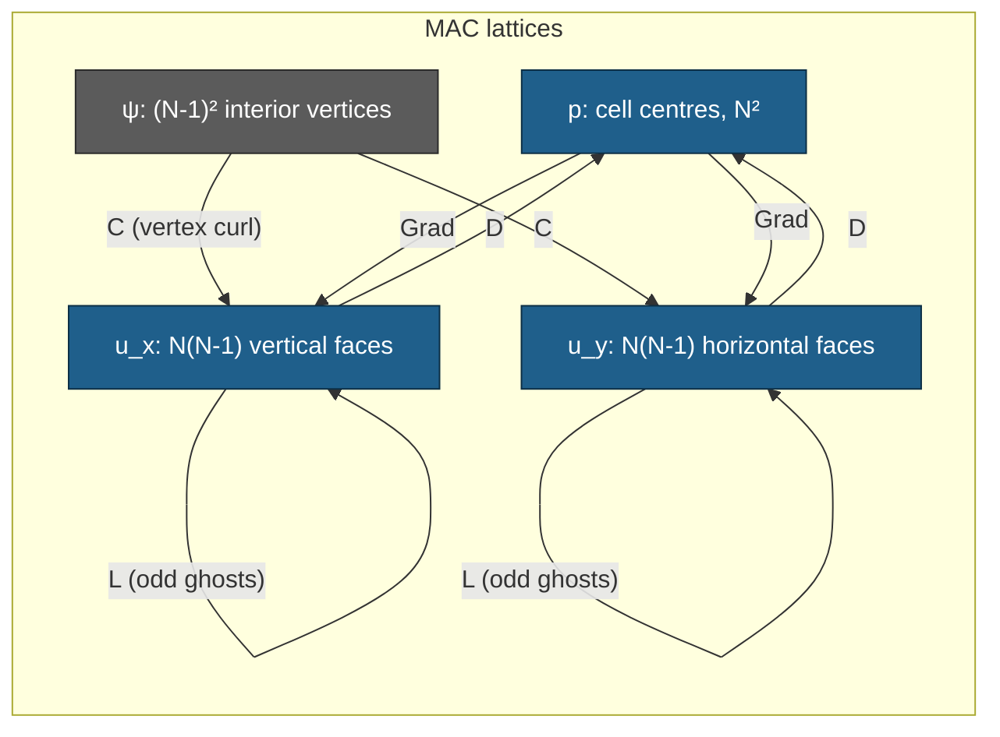
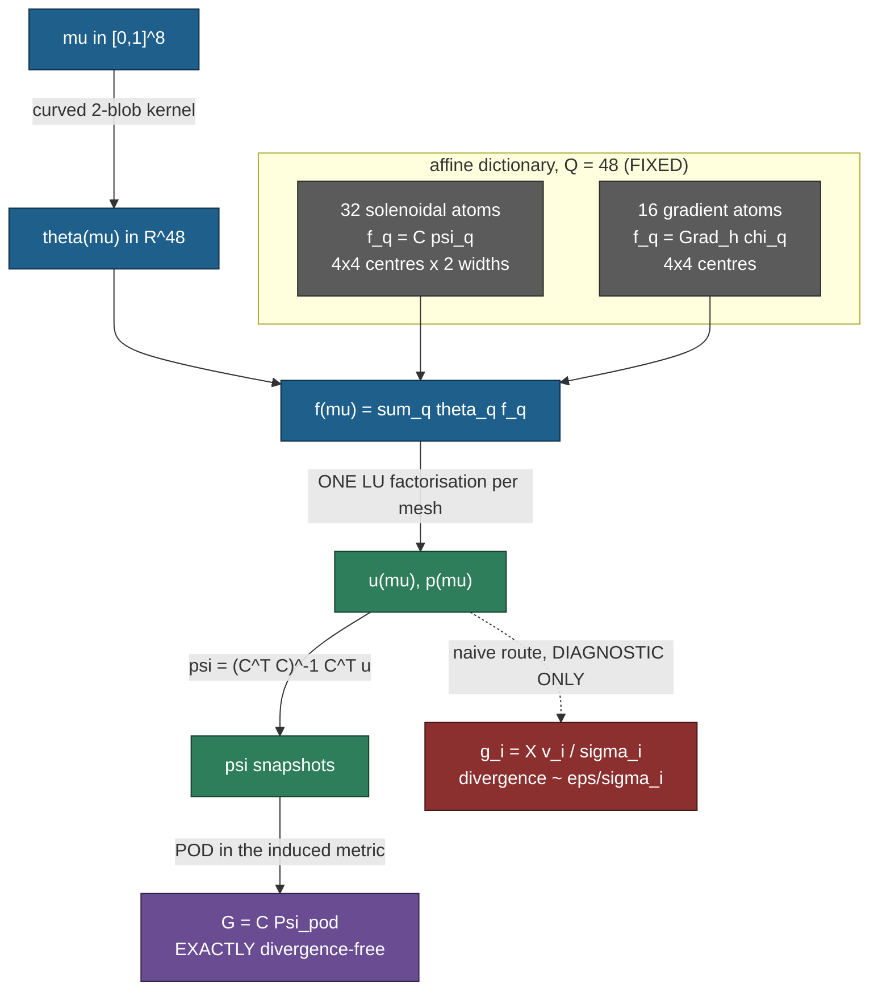

> **This file holds two reports.** Phase 1 (the MAC full-order solver and its
> correctness gates) is below; **phase 2a** (the force family, the
> divergence-free bank, and the test space — gates S1, S2, S-MEAN, S5 and the
> manifold-richness verdict) starts at *"Stokes 2D — phase 2a"*. Retractions are
> numbered continuously across both, 1–11 in phase 1 and 12–23 in phase 2a.

# Stokes 2D — phase 1: the MAC full-order solver and its correctness gates

Phase 1 of the 2026-08-30 Stokes cell (`exp/2026-08-30-stokes-vector`), covering
**only** the full-order model and the gates that certify it: **S-ADJ** (weighted
adjointness) and **S-FOM** (manufactured solution), plus the operator rank /
kernel results phase 2 needs. No ROM, no bank, no decoder, no timing.

**Revision 4.** Three rounds of independent verification by Codex `gpt-5.6-sol`.

*Round 1* (`STOKES-PHASE1-VERIFY-codex.md`, **PROCEED WITH SPECIFIC ADDITIONS**)
confirmed the operators, the solver and the closed-form claim — reproduced by an
independent Kronecker-product implementation through $N=128$ — and required
three additions, all now in: a **second, generic manufactured solution**; a
**repaired S3 control**; and **every diagnostic turned into a real assertion**.

*Round 2* (`STOKES-PHASE1B-VERIFY-codex.md`, **PROCEED AFTER ONE REQUIRED
HARNESS CORRECTION**) confirmed all three additions against its own SymPy
re-derivation and its own independent S3 construction, and found one of my
gates mathematically invalid: the revision-2 S-EXACT *prediction* bound,
**retracted in full** (retraction 7) and replaced by **S-BACKERR**.

*Round 3* (`STOKES-PHASE1C-VERIFY-codex.md`, **NOT SIGNED OFF**) confirmed the
`pred_dev` demotion and found three further harness defects, all now closed:
S-BACKERR was **blind to the bordered rows** and its coverage claim was false
(retraction 10); **PRECOND did not make `complete=true` mean a certified run**
(retraction 11); and the revision-3 $\sqrt M\times$ control-metric assertion
was **tautological** (retraction 9).

**The operators and the solver have not changed since revision 1.** Every round
since has concerned the harness, and this is the last one; phase 2 proceeds from
here.

**Status of the numbers below: final.** Every one is generated from
`runs/stk2d/stk2d_fom_gates_nu1_M64.json` by `stk2d_tables.py`; none is typed by
hand. Every gate is recorded as a **number**, not a boolean.

## What was built

- **`stk2d_common.py`** — the staggered MAC discretization: `MacGrid`, the four
  sparse operators $D$, $\mathrm{Grad}$, $L$, $C$, the mass matrices, an
  *independent* pad-and-slice matrix-free implementation of each, **two**
  manufactured solutions with a finite-difference consistency checker, the
  closed-form discrete solution, the bordered saddle-point direct solve, and the
  mass-normalized curl-sine test space.
- **`stk2d_fom_gates.py`** — the driver (revision 2). Runs every gate, asserts
  every one, writes one JSON.
- **`stk2d_tables.py`** — generates every table in this document from that JSON.

Written fresh. Nothing is shared with the collocated 1D/2D Burgers or Poisson
code in this directory, which uses $(N-2)^2$ interiors and $h=1/(N-1)$; this
cell uses $N$ **cells** and $h=1/N$. Both audits flagged mixing the two as a
silent-corruption risk.

### The discretization actually implemented

Exactly the frozen contract. $N$ cells, $h=1/N$; $p$ at $N^2$ centres with a
**mean-zero gauge** imposed by a bordering row; $u_x$ on $N(N-1)$ interior
vertical faces, $u_y$ on $N(N-1)$ interior horizontal faces, so
$n_u = 2N(N-1)$; boundary-**normal** velocities eliminated; no-slip on the
**tangential** components through **odd ghosts** in $L$, i.e. the wall-adjacent
diagonal is $-5/h^2$, not the interior $-4/h^2$. $M_u = M_p = h^2 I$.

$D$ and $\mathrm{Grad}$ are assembled from **their own separate stencils** —
neither is built as the transpose of the other. That is what makes S-ADJ a
measurement rather than a tautology.

The FOM is a **scipy sparse direct solve** (SuperLU) of the bordered saddle
system

$$\begin{bmatrix}-\nu L & \mathrm{Grad} & 0\\ D & 0 & \mathbf{1}\\ 0 & \mathbf{1}^\top & 0\end{bmatrix}
\begin{bmatrix}u\\p\\\lambda\end{bmatrix}=\begin{bmatrix}f\\0\\0\end{bmatrix}.$$

Since $\mathbf{1}^\top D = 0$, the multiplier $\lambda$ is exactly zero at the
solution; it is recorded per mesh as a consistency witness (largest value
$2.0\times10^{-13}$ at $N=256$). f64 throughout. $N=256$ solves in 76 s at
4.6 GB peak, so the whole ladder is local, as instructed.



---

## The headline result: the frozen manufactured solution has a closed-form discrete solution

**Not in `STOKES-DESIGN.md`; derived in phase 1, and confirmed independently by
the verifier**, which re-derived all three identities and checked the odd-ghost
wall rows specifically — they are no worse than the interior rows.

Write $t = \pi h$. On this MAC layout the *sampled* manufactured fields satisfy
three **exact** discrete identities:

1. $D\,u_{ex} = 0$ **exactly**, not merely to $O(h^2)$. The two cell differences
   are $\pm\pi\sin(t)\sin(2\pi x_c)\sin(2\pi y_c)$ and cancel identically —
   boundary cells included, because the eliminated normal faces equal the
   analytic endpoint values $0$.
2. $L_h\,u_{ex} = \gamma\,(\Delta u)\big|_{\text{lattice}}$ with
   $\gamma = \sin^2(t)/t^2$, on **every active face**. $\sin(2\pi y)$ on cell
   centres is an exact **odd-ghost** eigenvector with eigenvalue
   $-4\sin^2(t)/h^2$ — the analytic continuation $\sin(-t)=-\sin(t)$ *is* the
   odd ghost — and $\sin^2(\pi x)$ on the grid lines second-differences to
   $\mu\cos(2\pi x)/2$, including at $i=1,N-1$.
3. $\mathrm{Grad}_h\,p_{ex} = \delta\,(\nabla p)\big|_{\text{lattice}}$ with
   $\delta = \sin(t)/t$, and $p_{ex}$ has **exactly** zero cell mean.

Because $f = -\nu\Delta u + \nabla p$ and $\Delta u$, $\nabla p$ are linearly
independent on the lattice, the discrete system is solved **exactly** by

$$u_h = \left(\frac{t}{\sin t}\right)^{2} u_{ex},\qquad
  p_h = \frac{t}{\sin t}\, p_{ex},\qquad \text{for every } \nu,$$

hence

$$\frac{\lVert u_h-u_{ex}\rVert}{\lVert u_{ex}\rVert}=\Big(\tfrac{t}{\sin t}\Big)^{2}-1,
\qquad
\frac{\lVert p_h-p_{ex}\rVert}{\lVert p_{ex}\rVert}=\tfrac{t}{\sin t}-1 .$$

Three consequences.

- **The audit's anchors are analytic constants.** $(t/\sin t)^2-1$ evaluates to
  $5.302929\times10^{-2}$, $1.295075\times10^{-2}$, $3.218964\times10^{-3}$,
  $8.035777\times10^{-4}$ at $N=8,16,32,64$ — the auditor's
  $5.303\times10^{-2}$, $1.295\times10^{-2}$, $3.219\times10^{-3}$,
  $8.036\times10^{-4}$ to every digit quoted, and likewise for pressure. The
  earlier independent sparse-MAC check was genuinely independent code, but it
  was unknowingly evaluating predetermined analytic constants.
- **S-FOM can be certified to machine precision**, not to two digits of an
  observed order. Gate **S-EXACT** compares $u_h,p_h$ against the closed form
  directly: worst disagreement $1.97\times10^{-13}$ (velocity) and
  $1.58\times10^{-10}$ (pressure), both at $N=256$ and both roundoff limited by
  the $O(h^{-2})$ saddle conditioning.
- **The observed order is analytically exactly 2**, and the small excesses
  (2.0021, 2.0005, 2.0001) are the exact
  $\log_2\!\big[\varepsilon(h)/\varepsilon(h/2)\big]$ with
  $\varepsilon(h)=(\pi h/\sin\pi h)^2-1$ — verified to all four printed digits,
  velocity and pressure alike — not noise.

### The cost of that, and the second manufactured solution it forced

The discretization error of the frozen pair is a **uniform scalar amplitude
error**: $u_h-u_{ex}$ is exactly parallel to $u_{ex}$ (measured cosine $1.0$ to
machine precision at every $N$; the pointwise ratio $e/u_{ex}$ is constant to
nine significant digits). So **every norm-restricted variant of S-FOM carries
the same number** — the wall-adjacent-only relative error equals the global one
to five digits at every mesh.

*Correction from the verifier, and it is mine to own:* revision 1 explained this
by saying the solution "sits in a two-dimensional invariant subspace of the
operator pair". **That is not literally correct** — the sampled $\sin^2(\pi x)$
factor has 8 nonzero Dirichlet sine components at $N=16$ and 16 at $N=32$, so
the field is neither an eigenvector of $L$ nor confined to a two-dimensional
$L$-invariant space. What is actually special is narrower and simpler: the
sampled velocity and pressure each receive a **uniform scalar consistency
factor**, $\gamma$ and $\delta$. The substantive conclusion — norm-restricted
variants of S-FOM add no information — stands.

The consequence is that the frozen convergence table adds almost nothing beyond
the three identities, so **a second, generic manufactured solution is now
included** (addition A). It is not a substitute; both run.

---

## Gate results

<!-- BEGIN GENERATED (stk2d_tables.py) -->
<!-- generated by stk2d_tables.py from stk2d_fom_gates_nu1_M64.json (commit 701087298547) -- do not edit by hand -->

### S-FOM -- manufactured solution, odd (no-slip) ghosts

| N | n_u | n_p | err_u (mass-rel) | err_p (mass-rel) | audit anchor u | audit anchor p | \|\|Du\|\|/(\|\|D\|\|\|\|u\|\|) | lambda | solve s |
|---|---|---|---|---|---|---|---|---|---|
| 8 | 112 | 64 | 5.3029e-02 | 2.6172e-02 | 5.3030e-02 | 2.6170e-02 | 2.100e-16 | 1.530e-15 | 0.0 |
| 16 | 480 | 256 | 1.2951e-02 | 6.4545e-03 | 1.2950e-02 | 6.4550e-03 | 1.259e-16 | 1.213e-15 | 0.0 |
| 32 | 1984 | 1024 | 3.2190e-03 | 1.6082e-03 | 3.2190e-03 | 1.6080e-03 | 2.457e-16 | 7.750e-15 | 0.1 |
| 64 | 8064 | 4096 | 8.0358e-04 | 4.0171e-04 | 8.0360e-04 | 4.0170e-04 | 1.368e-16 | 1.255e-14 | 0.7 |
| 128 | 32512 | 16384 | 2.0082e-04 | 1.0041e-04 | - | - | 4.696e-16 | 2.645e-14 | 6.9 |
| 256 | 130560 | 65536 | 5.0201e-05 | 2.5100e-05 | - | - | 4.962e-16 | 2.005e-13 | 75.1 |

| refinement | observed order u | observed order p |
|---|---|---|
| 32 -> 64 | 2.0021 | 2.0012 |
| 64 -> 128 | 2.0005 | 2.0003 |
| 128 -> 256 | 2.0001 | 2.0001 |

worst order deviation from 2.00: 0.0021 (band 0.05); worst anchor relative deviation: 1.176e-04

### S-EXACT -- closed-form discrete solution

| N | \|\|u_h-u_h^exact\|\|/\|\|.\|\| | \|\|p_h-p_h^exact\|\|/\|\|.\|\| | predicted err_u | observed err_u | predicted err_p | observed err_p |
|---|---|---|---|---|---|---|
| 8 | 2.474e-15 | 6.355e-14 | 5.302929e-02 | 5.302929e-02 | 2.617215e-02 | 2.617215e-02 |
| 16 | 3.004e-15 | 1.607e-13 | 1.295075e-02 | 1.295075e-02 | 6.454543e-03 | 6.454543e-03 |
| 32 | 1.335e-14 | 1.379e-12 | 3.218964e-03 | 3.218964e-03 | 1.608189e-03 | 1.608189e-03 |
| 64 | 1.682e-14 | 2.800e-12 | 8.035777e-04 | 8.035777e-04 | 4.017082e-04 | 4.017082e-04 |
| 128 | 8.888e-14 | 3.123e-11 | 2.008218e-04 | 2.008218e-04 | 1.004059e-04 | 1.004059e-04 |
| 256 | 1.969e-13 | 1.579e-10 | 5.020092e-05 | 5.020092e-05 | 2.510014e-05 | 2.510014e-05 |

`pred_dev` is a RECORDED DIAGNOSTIC, not a gate (retraction 7). `implied by field gate` is what the asserted field tolerance alone already forces on it:

| N | pred_dev_u (diagnostic) | implied by field gate | pred_dev_p (diagnostic) | implied by field gate |
|---|---|---|---|---|
| 8 | 1.309e-15 | 1.986e-07 | 2.031e-13 | 3.921e-07 |
| 16 | 4.420e-15 | 7.822e-07 | 9.791e-13 | 1.559e-06 |
| 32 | 1.877e-13 | 3.117e-06 | 2.486e-11 | 6.228e-06 |
| 64 | 2.252e-12 | 1.245e-05 | 2.746e-10 | 2.490e-05 |
| 128 | 5.747e-12 | 4.981e-05 | 3.421e-11 | 9.961e-05 |
| 256 | 1.984e-10 | 1.992e-04 | 2.331e-08 | 3.984e-04 |

### S-FOMGEN -- the generic manufactured solution

| N | err_u (mass-rel) | verifier value | rel dev | err_p (mass-rel) | verifier value | rel dev | err/solution cosine | solve s |
|---|---|---|---|---|---|---|---|---|
| 32 | 1.541713e-02 | 1.541713e-02 | 1.172e-07 | 1.833939e-01 | 1.833939e-01 | 1.109e-07 | 0.9107 | 0.1 |
| 64 | 3.820960e-03 | 3.820960e-03 | 6.635e-08 | 4.577326e-02 | 4.577326e-02 | 4.685e-08 | 0.9122 | 0.7 |
| 128 | 9.531800e-04 | 9.531800e-04 | 3.008e-08 | 1.144216e-02 | 1.144216e-02 | 2.578e-07 | 0.9126 | 6.9 |

| refinement | observed order u | observed order p |
|---|---|---|
| 32 -> 64 | 2.0125 | 2.0024 |
| 64 -> 128 | 2.0031 | 2.0001 |

worst order deviation 0.0125 (band 0.05); worst deviation from the verifier's values 2.578e-07 (tol 1.000e-05); error/solution cosine 0.9107-0.9126 (must be < 0.99: this family must not be degenerate)

### gate MMSF -- analytic forcing vs high-accuracy finite differences

| family | Lap u | Lap v | grad p_x | grad p_y | continuous div u | wall trace |
|---|---|---|---|---|---|---|
| frozen | 1.442e-09 | 1.329e-09 | 3.024e-13 | 3.511e-13 | 2.803e-13 | 2.453e-16 |
| generic | 7.187e-10 | 4.015e-10 | 3.658e-13 | 5.818e-13 | 2.953e-13 | 4.787e-16 |

### S-ADJ -- weighted adjointness

| N | primary | test-projected | test-proj (op-norm) | \|\|M_u Grad + D^T M_p\|\|_F | negative control |
|---|---|---|---|---|---|
| 8 | 0.000e+00 | 0.000e+00 | 0.000e+00 | 0.000e+00 | 7.071e-01 |
| 16 | 0.000e+00 | 0.000e+00 | 0.000e+00 | 0.000e+00 | 7.071e-01 |
| 32 | 0.000e+00 | 0.000e+00 | 0.000e+00 | 0.000e+00 | 7.071e-01 |
| 64 | 0.000e+00 | 0.000e+00 | 0.000e+00 | 0.000e+00 | 7.071e-01 |
| 128 | 0.000e+00 | 0.000e+00 | 0.000e+00 | 0.000e+00 | 7.071e-01 |
| 256 | 0.000e+00 | 0.000e+00 | 0.000e+00 | 0.000e+00 | 7.071e-01 |

### S-STRUCT / S-RANK -- operator structure, ranks, kernels

| N | n_u | n_p | n_psi | \|\|D+Grad^T\|\|_inf | \|\|DC\|\|_inf | \|\|DC\|\|_max | \|\|L-L^T\|\|_max |
|---|---|---|---|---|---|---|---|
| 8 | 112 | 64 | 49 | 0.000e+00 | 0.000e+00 | 0.000e+00 | 0.000e+00 |
| 16 | 480 | 256 | 225 | 0.000e+00 | 0.000e+00 | 0.000e+00 | 0.000e+00 |
| 32 | 1984 | 1024 | 961 | 0.000e+00 | 0.000e+00 | 0.000e+00 | 0.000e+00 |
| 64 | 8064 | 4096 | 3969 | 0.000e+00 | 0.000e+00 | 0.000e+00 | 0.000e+00 |
| 128 | 32512 | 16384 | 16129 | 0.000e+00 | 0.000e+00 | 0.000e+00 | 0.000e+00 |
| 256 | 130560 | 65536 | 65025 | 0.000e+00 | 0.000e+00 | 0.000e+00 | 0.000e+00 |

| N | rank D | expected | dim ker D | expected | rank C | expected | SVD s |
|---|---|---|---|---|---|---|---|
| 32 | 1023 | 1023 | 961 | 961 | 961 | 961 | 1 |
| 64 | 4095 | 4095 | 3969 | 3969 | 3969 | 3969 | 103 |

| N | \|\|Grad 1\|\| | min \|U_ii\| bordered pressure Laplacian | min \|U_ii\| C^T C | implied rank D | implied dim ker D | implied rank C |
|---|---|---|---|---|---|---|
| 8 | 0.000e+00 | 2.500e+00 | 1.357e+02 | 63 | 49 | 49 |
| 16 | 0.000e+00 | 2.491e+02 | 4.281e+02 | 255 | 225 | 225 |
| 32 | 0.000e+00 | 6.067e+02 | 1.559e+03 | 1023 | 961 | 961 |
| 64 | 0.000e+00 | 2.594e+03 | 5.171e+03 | 4095 | 3969 | 3969 |
| 128 | 0.000e+00 | 9.195e+03 | 1.773e+04 | 16383 | 16129 | 16129 |
| 256 | 0.000e+00 | 3.637e+04 | 6.319e+04 | 65535 | 65025 | 65025 |

### S-PRESS -- repaired S3, deterministic aligned pressures

GATED, against an INDEPENDENTLY constructed control (the analytic gradient of the same chi, sampled on the face lattices, never touching the `Grad` operator):

| N | M | control Frobenius (min over p=chi_j) | = 1/sqrt(M) | matched cosine (min) | max off-diagonal cosine | solenoidal Frobenius (max) | solenoidal cosine (max) | \|\|D Phi\|\| normalized |
|---|---|---|---|---|---|---|---|---|
| 8 | 49 | 0.141986 | 0.142857 | 0.993901 | 6.663e-16 | 4.326e-17 | 3.893e-16 | 6.753e-18 |
| 16 | 64 | 0.124912 | 0.125000 | 0.999298 | 5.378e-16 | 7.624e-17 | 4.996e-16 | 3.116e-18 |
| 32 | 64 | 0.124995 | 0.125000 | 0.999961 | 5.195e-16 | 6.063e-17 | 5.655e-16 | 1.413e-18 |
| 64 | 64 | 0.125000 | 0.125000 | 0.999998 | 4.374e-16 | 4.782e-17 | 2.810e-16 | 6.499e-19 |
| 128 | 64 | 0.125000 | 0.125000 | 1.000000 | 3.355e-16 | 7.296e-17 | 5.456e-16 | 3.044e-19 |
| 256 | 64 | 0.125000 | 0.125000 | 1.000000 | 3.986e-16 | 1.386e-16 | 1.453e-15 | 1.463e-19 |

DIAGNOSTIC ONLY -- the SELF-NORMALIZED control Psi_j = X_j/(h||X_j||). Both columns are identically 1 for any nonzero X, even if `Grad` is wrong; revisions 2-3 asserted on them (retraction 9):

| N | M | matched cosine | sqrt(M) x control Frobenius |
|---|---|---|---|
| 8 | 49 | 1.000000000000 | 1.000000000000 |
| 16 | 64 | 1.000000000000 | 1.000000000000 |
| 32 | 64 | 1.000000000000 | 1.000000000000 |
| 64 | 64 | 1.000000000000 | 1.000000000000 |
| 128 | 64 | 1.000000000000 | 1.000000000000 |
| 256 | 64 | 1.000000000000 | 1.000000000000 |

SUPERSEDED diagnostic -- the same quantities with a grid-white RANDOM pressure (retained as evidence, not gated):

| N | M | solenoidal Frobenius | control Frobenius | cos_max solenoidal | cos_max control |
|---|---|---|---|---|---|
| 8 | 49 | 2.360e-17 | 1.290e-01 | 1.121e-16 | 3.988e-01 |
| 16 | 64 | 1.846e-17 | 4.590e-02 | 6.908e-17 | 1.422e-01 |
| 32 | 64 | 9.732e-18 | 1.303e-02 | 3.245e-17 | 3.753e-02 |
| 64 | 64 | 4.805e-18 | 2.358e-03 | 1.228e-17 | 6.687e-03 |
| 128 | 64 | 3.525e-18 | 6.739e-04 | 9.595e-18 | 1.881e-03 |
| 256 | 64 | 2.760e-18 | 1.686e-04 | 9.475e-18 | 5.195e-04 |

### S-FREESLIP -- the deliberate wrong answer

| N | err_u free-slip | err_u no-slip | ratio | err_p free-slip | wall-adjacent err (free-slip) | wall-adjacent err (no-slip) |
|---|---|---|---|---|---|---|
| 8 | 1.3317e+00 | 5.3029e-02 | 25.1x | 2.4415e+00 | 3.8471e+00 | 5.3029e-02 |
| 16 | 1.2867e+00 | 1.2951e-02 | 99.4x | 2.5267e+00 | 8.1208e+00 | 1.2951e-02 |
| 32 | 1.2763e+00 | 3.2190e-03 | 396.5x | 2.5474e+00 | 1.6953e+01 | 3.2190e-03 |
| 64 | 1.2738e+00 | 8.0358e-04 | 1585.2x | 2.5526e+00 | 3.4753e+01 | 8.0358e-04 |
| 128 | 1.2732e+00 | 2.0082e-04 | 6339.8x | 2.5540e+00 | 7.0420e+01 | 2.0082e-04 |

| refinement | free-slip order u | free-slip order p |
|---|---|---|
| 8 -> 16 | 0.0495 | -0.0495 |
| 16 -> 32 | 0.0117 | -0.0118 |
| 32 -> 64 | 0.0029 | -0.0029 |
| 64 -> 128 | 0.0007 | -0.0007 |

### Supporting gates

| gate | worst value | rule |
|---|---|---|
| PRECOND (asserts live / config mismatches / smoke) | True / 0 / 0 | asserts live, config == frozen contract, smoke=0 |
| S-BACKERR global (all 17 solves) | 1.790e-17 | <= 1e-13 |
| S-BACKERR momentum block | 1.945e-17 | <= 1e-13 |
| S-BACKERR continuity block | 2.050e-15 | <= 1e-12 |
| S-BACKERR gauge row (normalised) | 2.495e-14 | <= 1e-12 |
| S-BACKERR gauge row (raw \|1^T p\|) | 1.121e-09 | <= 1e-8 |
| MANIFEST (gates / row counts / non-finite) | 0 / 0 / 0 | all zero |
| S0 (solver dtype / jax x64 / matmul / backend) | float64 / True / highest / gpu | all asserted |
| MMSF (analytic forcing vs 4th-order FD) | 1.442e-09 | <= 1e-6 |
| REF (operators vs archived auditor reference) | 0.000e+00 | exactly 0 |
| MF (sparse vs independent matrix-free) | 1.094e-16 | <= 1e-13 |
| SYM (\|\|L - L^T\|\|_max) | 0.000e+00 | exactly 0 |
| S-NU (\|\|nu u_nu - u_1\|\|/\|\|u_1\|\|) | 1.279e-13 | <= 1e-9 |
| S-NU (\|\|p_nu - p_1\|\|/\|\|p_1\|\|) | 1.077e-11 | <= 1e-9 |

run: stk2d_fom_gates_nu1_M64.json | driver rev 4 | complete=True certified=True | commit `701087298547` | host `spark-d69e` | numpy 2.4.4 scipy 1.17.1 | jax backend `gpu` x64=True matmul `highest` | total 202 s
<!-- END GENERATED -->

---

## Reading the gates

### S-FOMGEN — the generic manufactured solution (addition A)

$$\psi_g=\sin^2(\pi x)\sin^2(2\pi y)+0.3\sin^2(3\pi x)\sin^2(\pi y),\qquad
\mathbf{u}_g=(\partial_y\psi_g,\,-\partial_x\psi_g),$$
$$p_g=\sin(4\pi x)+0.37\cos(6\pi y)+0.21\sin(2\pi x)\cos(4\pi y),\qquad
\mathbf{f}_g=-\nu\Delta\mathbf{u}_g+\nabla p_g .$$

Divergence-free by construction, and every $x$-factor vanishes at $x=0,1$ and
every $y$-factor at $y=0,1$, so it is genuine no-slip.

My independently derived and implemented version reproduces the verifier's
tabulated values to **$2.58\times10^{-7}$** relative — all six entries, seven
significant figures — with observed orders **2.0125, 2.0031** (velocity) and
**2.0024, 2.0001** (pressure), exactly as the verifier stated. Crucially the
error/solution cosine is **0.9107–0.9126**, not 1, so this family genuinely
tests the *spatial structure* of the discretization error. Non-degeneracy is
asserted (`cosine < 0.99`), so this arm cannot silently become another amplitude
test.

The pressure error is an order of magnitude larger than the velocity error here
($1.83\times10^{-1}$ vs $1.54\times10^{-2}$ at $N=32$) because $p_g$ carries
frequencies up to $6\pi$ on the coarsest mesh. It still converges cleanly at 2.

**Gate MMSF** guards the hand-derived algebra: each family's analytic
Laplacian, pressure gradient, continuous divergence and wall trace are checked
against fourth-order finite differences of its own $u,p$ at 512 scattered
points. Worst disagreement $1.44\times10^{-9}$, tolerance $10^{-6}$.

Revision 2 said "a sign or coefficient slip would show as $O(1)$". That is loose
and the verifier quantified it: a relative coefficient error of roughly **1–28
ppm**, term dependent, could slip beneath the $10^{-6}$ gate, whereas **sign
flips read $7.10\times10^{-2}$ to $1.99$** — at least $70{,}000\times$ the
tolerance. So MMSF does not detect arbitrarily small coefficient perturbations,
but it decisively catches every sign flip, missing term, and ordinary decimal
slip, which is what it is for. The verifier also re-derived $u,v,\Delta u,
\Delta v,\nabla p$ from $\psi_g,p_g$ with SymPy and found maximum relative
disagreement $1.69\times10^{-16}$ against my formulas, and confirmed that the
published values are hardcoded only as regression anchors in the gate file and
never feed the fields, the forcing, or the solve.

### S-ADJ — passes at exactly zero, and the negative control proves that means something

$\lVert M_u\mathrm{Grad}+D^\top M_p\rVert_F/(\lVert M_u\mathrm{Grad}\rVert_F+
\lVert D^\top M_p\rVert_F)$ is **exactly $0$** (bit-for-bit, not $10^{-16}$) at
every mesh, and so is the test-projected defect. Both are far inside the
$10^{-14}$ requirement.

This is expected once the layout is right: $M_u=M_p=h^2I$ and every entry of
$D$ and $\mathrm{Grad}$ is exactly $\pm 1/h$, so the sum cancels in floating
point with no rounding at all. **A gate that can only read 0 or $O(1)$ is worth
distrusting**, so a negative control is included and now **asserted**: a
$\mathrm{Grad}$ with the $u_y$-block sign flipped gives $0.7071$ at every mesh,
required to be $\ge10^{-2}$.

### S-FOM — order 2.00 in both variables, anchors reproduced and now asserted

Observed orders over the frozen ladder $32\to64\to128\to256$: velocity
2.0021 / 2.0005 / 2.0001, pressure 2.0012 / 2.0003 / 2.0001. Worst deviation
from 2.00 is **0.0021**, band $\pm0.05$. Worst relative deviation from the
audit's anchors is $1.18\times10^{-4}$ — the audit's own rounding to four
significant figures — now asserted at $10^{-3}$.

$\lVert Du_h\rVert/(\lVert D\rVert\lVert u_h\rVert)\le 5\times10^{-16}$ at every
mesh, both families.

### S-FREESLIP — the bug S-FOM exists to catch, now asserted to fail

Even tangential ghosts give relative velocity error $\approx 1.27$ that **does
not converge**: observed order 0.0495, 0.0117, 0.0029, 0.0007. At $N=128$ the
free-slip velocity error is **6340×** the no-slip error, and the wall-adjacent
error grows like $O(h^{-1})$.

Free-slip does not "lose an order" here; it solves a different boundary-value
problem, $\partial_n u_t=0$, whose solution is $O(1)$ away from the manufactured
one. The verifier's Richardson extrapolation from $N=64,128$ gives limiting
errors $E_{u,\infty}=1.2729591$ and $E_{p,\infty}=2.5543888$, with deviations
from those limits shrinking by $\approx4\times$ per refinement — the free-slip
discretization is itself **second-order convergent to the wrong problem**. The
gate now *asserts* this arm fails: error $\ge0.5$ at every mesh and
$|\text{order}|\le0.5$. If it ever looked second-order against the manufactured
solution, S-FOM would be blind.

### Ranks, kernels, and $\lVert DC\rVert$ — asserted at every mesh

At $N=32$, all four of the auditor's structural results are reproduced exactly:
$\lVert D+\mathrm{Grad}^\top\rVert_\infty = 0$ **exactly**,
$\lVert DC\rVert_\infty = 0$ **exactly**, $\operatorname{rank} D = 1023 = N^2-1$,
$\dim\ker D = \operatorname{rank} C = 961 = (N-1)^2$. Confirmed again by dense
SVD at $N=64$ (4095 / 3969 / 3969).

Dense SVD is infeasible at $N\ge128$, so a **cheap exact witness** is asserted at
every mesh instead: $\lVert\mathrm{Grad}\,\mathbf{1}\rVert = 0$ puts the
constants in $\ker\mathrm{Grad}$, and a successful sparse LU of the bordered
pressure Laplacian
$\begin{bmatrix}D\,\mathrm{Grad} & \mathbf{1}\\ \mathbf{1}^\top & 0\end{bmatrix}$
(smallest $|U_{ii}| = 3.6\times10^{4}$ at $N=256$) forces
$\dim\ker\mathrm{Grad}\le1$, hence $=1$, hence $\operatorname{rank} D = N^2-1$
exactly. The same witness on $C^\top C$ shows $C$ injective. With
$\lVert DC\rVert = 0$ this gives $\operatorname{range} C = \ker D$ **exactly at
every mesh on the ladder** — what phase 2's div-free bank rests on.

### S-PRESS — the repaired S3 control, now against an *independent* control

Deterministic pressures $p=\chi_{k\ell}$, one per control column. Revision 2
compared them against a control $\Psi_j=X_j/(h\lVert X_j\rVert)$ with
$X_j=\mathrm{Grad}\,\chi_j$ — **a normalized copy of $X$ itself**, which makes
the matched cosine and $\sqrt M\times$ metric identically 1 for *any* nonzero
$X_j$, even if `Grad` is wrong. Those are now **diagnostics**; see retraction 9.

The gated control is **independently constructed**: the *analytic* gradient
$\nabla\chi_{k\ell}$ evaluated directly on the two face lattices, which never
touches the `Grad` operator. Its numbers are in the generated table above:
control Frobenius $0.141986$ at $N=8$ and $0.125000$ from $N=64$ on, against
$1/\sqrt M$; matched cosine $0.993901$ at $N=8$ rising to $1.000000$; maximum
off-diagonal cosine $\le7.43\times10^{-16}$.

These are **measurements, not identities**: $\mathrm{Grad}_h\chi$ carries
component factors $\mathrm{sinc}(k\pi h/2)$ and $\mathrm{sinc}(l\pi h/2)$ that
*differ between components*, so the cosine is below 1 at coarse $h$ and rises
to 1. Falsifiable: flipping the sign of `Grad`'s $u_y$ block collapses the
matched cosine to $0.000000$ and the control Frobenius metric to $0.000000$.
Known blind spot, stated rather than discovered later: a cosine is invariant to
a **global** scale or sign of `Grad`; those are covered by S-ADJ and S-FOM.

The genuinely non-trivial half of S3 is the **solenoidal** side, and it is
unchanged: solenoidal Frobenius $\le1.386\times10^{-16}$ and solenoidal cosine
$\le1.453\times10^{-15}$ against a $10^{-13}$ requirement. That is the part
that actually says the curl modes annihilate gradient fields.

The superseded random-pressure numbers are retained in the JSON and tables,
labelled and *not* gated, because they are the evidence for retraction 5.

### S-BACKERR — the independent replacement for the retracted prediction gate

**Four** asserted numbers over **all 17** `solve_stokes` calls the driver makes
(the S0 probe, 6 frozen, 3 generic, 2 S-NU, 5 free-slip):

| block | measured worst | threshold |
|---|---|---|
| global $\lVert Kx-b\rVert/(\lVert K\rVert_F\lVert x\rVert+\lVert b\rVert)$ | $1.790\times10^{-17}$ | $10^{-13}$ |
| momentum $\lVert r_{\text{mom}}\rVert/(\nu\lVert L\rVert_F\lVert u\rVert+\lVert\mathrm{Grad}\rVert_F\lVert p\rVert+\lVert f\rVert)$ | $1.945\times10^{-17}$ | $10^{-13}$ |
| continuity $\lVert r_{\text{cont}}\rVert/(\lVert D\rVert_F\lVert u\rVert+\lvert\lambda\rvert\sqrt{n_p})$ | $2.050\times10^{-15}$ | $10^{-12}$ |
| gauge $\lvert\mathbf{1}^\top p\rvert/(\sqrt{n_p}\lVert p\rVert)$ | $2.495\times10^{-14}$ | $10^{-12}$ |
| gauge, raw $\lvert\mathbf{1}^\top p\rvert$ | $1.121\times10^{-9}$ | $10^{-8}$ |

**Why the blocks exist.** Revision 3 gated only the global metric, and that
metric **cannot see the bordered rows**: $\lVert K\rVert_F$ is dominated by the
$O(h^{-2})$ momentum block, so the continuity and unit-valued gauge rows
contribute negligibly to the normalization. Round 3's negative control,
reproduced here exactly: injecting a constant $10^{-8}$ pressure offset at
$N=128$ leaves a raw gauge residual of $\mathbf{1.6384\times10^{-4}}$ while the
global metric reads $\mathbf{4.455\times10^{-14}}$ and **passes**. The field
gates recenter pressure before comparing, so they miss it too, and `p_mean_raw`
was only a diagnostic. Both new gauge gates fail that control by four orders.

**Honest limits of these numbers.**

- The $10^{-13}$ threshold is a **frozen engineering threshold** — about 450
  machine epsilons, and it predates the certified artifact. Revision 3 called it
  "frozen a priori from backward stability, $O(\sqrt{\mathrm{nnz}}\,u)$"; that
  overstates it. The expression gives $1.27\times10^{-13}$ at $N=256$, and
  sparse-LU pivot growth prevents it from being a hard bound.
- S-BACKERR is **reference-direction independent**, not direction independent.
  It has no pathology aligned with the manufactured solution — the flaw that
  sank `pred_dev` — but it measures $\lVert K\,\delta x\rVert$, so sensitivity
  varies with the singular direction of $K$: at $N=32$, equal $10^{-11}$
  relative perturbations give $1.99976\times10^{-13}$ (random),
  $2.78032\times10^{-13}$ (alternating high-frequency) and
  $2.38238\times10^{-15}$ (parallel to velocity).
- It **cannot detect a wrong $K$ or $b$ that is solved accurately.** That is
  S-ADJ, S-FOM, REF and MF's job.
- The **raw gauge threshold has only $9\times$ margin** at the worst mesh
  (free-slip $N=128$, $1.121\times10^{-9}$ against $10^{-8}$), because
  $\lvert\mathbf{1}^\top p\rvert$ is not scale-free — it grows with $n_p$ and
  $\lVert p\rVert$. The *normalized* gauge gate carries the discrimination
  ($40\times$ clean margin, four orders on the control). **Forward note for
  phase 2:** extending `FREESLIP_NS` to $N=256$ would likely push the raw value
  into the same order as its threshold and trip it spuriously; rescale it or
  rely on the normalized form if that happens.

The *un*normalized $\lVert Kx-b\rVert/\lVert b\rVert$ is also recorded and
grows like $h^{-2}$ ($1.13\times10^{-15}$ at $N=8$ to $2.87\times10^{-12}$ at
$N=256$) purely because $\lVert K\rVert$ does. That form is a diagnostic.

### PRECOND and MANIFEST — what `complete=true` now means

Round 3 found that revision 3's PRECOND did not deliver the guarantee it
claimed. Four holes, all closed:

- **`SMOKE=1` could still produce `complete=true`.** It now sets
  `complete=false` and `certified=false` *by construction*, with an
  `incomplete_reason` string. A smoke run cannot be a certified artifact, not
  merely a labelled one.
- **Non-empty ladders were not sufficient.** Environment overrides could shorten
  or alter `NS`, `LADDER`, `GEN_NS`, `ADJ_NS`, `RANK_NS`, `FREESLIP_NS`,
  `M_MODES` or `NU` and still certify. The **entire configuration** is now
  asserted equal to a `FROZEN_CONFIG` manifest, with any mismatch recorded.
- **No gate manifest or row counts.** A new **MANIFEST** gate asserts that every
  one of the 16 expected gates is present *and* that every row count matches
  exactly: `REF 3, MMSF 2, MF 6, S_ADJ 6, S_STRUCT 6, S_PRESS 6, SYM 6,
  S_FOM 6, S_EXACT 6, S_FOMGEN 3, S_FREESLIP 5, S_RANK dense 2 / indirect 6,
  S_BACKERR 17`. All match.
- **NaN passed the aggregates silently — the most dangerous of the three.**
  Python's `max([finite, nan])` returns the finite value, so a failed final
  solve could have passed several aggregate assertions *including S-BACKERR*,
  turning a hard failure into a green run. Every aggregate in the driver now
  goes through a `finite()` helper that asserts `np.isfinite` **before**
  reducing, and a whole-report sweep asserts no non-finite float anywhere in
  `gates/` or `rows/`. Fields that do not apply (the closed form on the generic
  and free-slip arms) are recorded as `null`, never `NaN`, so that sweep is
  unambiguous.

Two more, carried over and kept: the `-O` check is a **`raise`, not an
`assert`** (an assert cannot detect its own removal), and the report is now
saved as `complete=false` **before anything can fail**, so a crash cannot leave
an older `complete=true` artifact untouched at the same path.

The committed artifact is `driver_revision: 4`, `smoke: false`,
`allow_cpu: false`, `config_mismatch: {}`, `complete: true`, `certified: true`.

### Supporting gates

- **S0**: solver output dtype `float64`, JAX `x64=True`,
  `matmul_precision=highest`, backend `gpu` — all four now **asserted**. Phase
  1's numerics are CPU scipy by design, but phase 2 inherits this JAX
  environment, so a silent `x64=False` there would invalidate everything.
- **REF**: $D$, $\mathrm{Grad}$, $L$, $C$ **entry-for-entry identical**
  (difference exactly 0) to the archived `STOKES-AUDIT-mac_check.py` at
  $N=4,8,16$.
- **MF**: sparse vs independently written pad-and-slice matrix-free agree to
  $\le1.1\times10^{-16}$ relative at every mesh, for $L_{\text{odd}}$,
  $L_{\text{even}}$, $D$, $\mathrm{Grad}$, $C$.
- **SYM**: $\lVert L-L^\top\rVert_{\max}=0$ exactly.
- **S-NU**: $1.28\times10^{-13}$ velocity, $1.08\times10^{-11}$ pressure.

### Falsifiability of the new assertions (addition C)

Assertions that have never fired are not evidence. Three out-of-band probes,
run against a scratch copy and not committed:

| probe | result |
|---|---|
| unset `JAX_DEFAULT_MATMUL_PRECISION` | S0 aborts: `JAX_DEFAULT_MATMUL_PRECISION=None` |
| feed the **frozen** family to S-FOMGEN | aborts: `S-FOMGEN vs verifier failed: 0.9912` |
| grid-white random pressure into the S3 floor, $N=256$, $M=64$ | control Frobenius $1.60\times10^{-4}$ (own seed; the run's recorded value on its own stream is $1.686\times10^{-4}$) — **fails** the $10^{-2}$ floor, while the aligned pressure gives $0.125000$ and passes |
| run the driver under `python -O` | refuses with `RuntimeError`, rather than emitting a JSON whose asserts are all dead |
| `ALLOW_CPU=1` | PRECOND aborts: *"ALLOW_CPU=1 is not a certified run"* |
| perturb a converged $N=32$ solution by relative $10^{-11}$ | S-BACKERR rises $5.97\times10^{-18}\to2.00\times10^{-13}$ and **fails**, though the perturbation is well inside the $10^{-8}$ field tolerance |
| inject a constant $10^{-8}$ pressure offset, $N=128$ | global S-BACKERR $4.455\times10^{-14}$ **passes**, but the new gauge gates **fail** at $9.999\times10^{-9}$ (normalized) and $1.638\times10^{-4}$ (raw) — round 3's control, reproduced exactly |
| shorten a ladder via env without `SMOKE=1` | PRECOND aborts, listing every field that differs from `FROZEN_CONFIG` |
| inject a `NaN` into the S-BACKERR aggregate | `finite()` aborts: *"non-finite value(s) in S_BACKERR backward_err: [nan] (indices [9])"* |
| flip the sign of `Grad`'s $u_y$ block, S3 control | independent matched cosine $\to0.000000$ and control Frobenius $\to0.000000$: **fails**. The self-normalized control still reads $1.000000$ — which is exactly why it is no longer gated |

---

## Retractions and corrections

The project convention treats these as more important than the successes.
Retractions 5 and 6 are new in revision 2; 5 is a claim of mine that was
**wrong** and had already been relayed upstream as fact.

1. **S-NU tolerance was mis-set at $10^{-11}$ and the gate FAILED on the first
   full run** at `p_invariance_rel = 1.077e-11`, aborting the job. The threshold
   was wrong, not the discretization. **Confirmed by the verifier**, which
   changed only the SuperLU permutation and moved the same number to
   $9.06\times10^{-14}$ (MMD\_ATA) and $5.12\times10^{-14}$ (NATURAL) — a real
   defect does not vanish under a reordering. It also noted that my "$h^{-2}$
   plus factor seven" explanation *understates* the effect: the $\nu=7$ saddle
   conditioning is about $48\times$ worse than $\nu=1$, not $7\times$. Relaxed
   to $10^{-9}$, with the failure recorded inline in the gate's own `rule`
   string.
2. **S-EXACT's field tolerance was first written at $10^{-10}$**, which the
   $N=256$ pressure ($1.58\times10^{-10}$) would have failed. Caught before the
   full run and set to $10^{-8}$.
3. ~~**The S3 threshold in `STOKES-DESIGN.md` is not achievable as written.**~~
   **RETRACTED IN FULL — see retraction 5.** The claim was wrong and the
   proposed replacement was worse.
4. **`err_u_bnd_rel` is a dead diagnostic on the no-slip arm.** It equals the
   global error to five digits at every mesh, because the error is exactly
   parallel to the solution. It *is* informative on the free-slip arm (it grows
   like $O(h^{-1})$ while the global error plateaus), so it is kept, but it is
   not independent evidence on the no-slip arm.
5. **NEW, and the important one: my S3 diagnosis was WRONG.** Revision 1
   claimed the design's $\ge10^{-2}$ control floor was unachievable, blaming
   "$1/\sqrt{M}$ and $h$ factors in the Frobenius normalization", and proposed a
   max-cosine replacement as resolution-independent. All three parts are wrong.
   - The Frobenius metric is *exactly* the RMS of per-column physical cosines,
     $\sqrt{M^{-1}\sum_j\cos_M(\psi_j,g)^2}$. There is a $1/\sqrt M$
     aggregation and **no residual $h$ factor**.
   - The decay I measured was real but its cause was my **test pressure**: I fed
     grid-white random noise to a control spanning only 64 smooth low-frequency
     modes, so as $N$ grew almost all gradient energy moved outside the fixed
     control space. That is a property of my probe, not of the metric.
   - My proposed max-cosine replacement is **not resolution-independent either**
     — it decays $3.75\times10^{-2}$, $6.69\times10^{-3}$, $1.88\times10^{-3}$,
     $5.20\times10^{-4}$ at $N=32/64/128/256$ for the same pressure — and a
     maximum also depends on how many columns are included. Worse, I proposed
     gating a **ratio whose denominator is roundoff**, which is never a valid
     gate.
   - **The $10^{-2}$ floor is reachable.** With $p=\chi_{k\ell}$ aligned to a
     control column, the control Frobenius metric is $0.125000=1/\sqrt{64}$ at
     every mesh from 16 to 256, matched-control cosine is 1, and the solenoidal
     cosine stays $\le1.45\times10^{-15}$. `STOKES-DESIGN.md`'s S3 was
     **under-specified** — it never said which pressure to use — not
     intrinsically impossible. The floor is kept; the control is repaired.
6. **NEW: S-EXACT's prediction check was gated at the wrong tolerance, and its
   own recorded value already exceeded it.** Revision 1 gated
   `pred_dev` (observed vs closed-form-predicted *error*) at the same flat
   $10^{-8}$ as the field agreement, while recording
   `worst_pred_dev_p = 2.331e-8`. The JSON could therefore say
   `complete=true` while carrying a value outside its own stated rule — exactly
   the class of defect addition C exists to remove. **That diagnosis stands:
   revision 1's threshold was a category error.** ~~The fix was to make the
   threshold self-calibrating, `pred_dev <= exact_rel / predicted_err`, worst
   margin 0.108.~~ **THE FIX IS RETRACTED — see retraction 7.** It was not a
   valid bound and could not have been made into one. The conclusion I should
   have drawn in revision 2, and did not, is that `pred_dev` is *redundant*: it
   is implied by the field assertion and was never an independent test.

7. **NEW, and the second one I got wrong: the revision-2 S-EXACT prediction
   bound was not a valid bound, and is retracted in full.** Retraction 6
   replaced the flat $10^{-8}$ with `pred_dev <= exact_rel / predicted_err`.
   Round 2 showed two things.
   - **It is missing a factor.** With $z$ the sampled continuous solution,
     $y=az$ the exact discrete solution, $x$ the computed one, $\epsilon=a-1$
     and $\rho=\lVert x-y\rVert/\lVert y\rVert$ (the code's `exact_rel`), the
     triangle inequality gives
     $\big|\,\lVert x-z\rVert/\lVert z\rVert-\epsilon\,\big|/\epsilon
     \le a\rho/\epsilon$, not $\rho/\epsilon$. I omitted $a=1+\epsilon$.
   - **Inserting the missing factor would make it tautological**, and this is
     the fatal part. $\rho$ is measured from the very numerical error the check
     is meant to constrain, so with the correct factor the inequality is a
     direct consequence of the reverse triangle inequality and holds for
     *every* $x$, including a completely broken one.
   - As it stood it was therefore **too tight in one direction and blind in the
     other**. At the $N=256$ pressure value $\epsilon=2.5100143\times10^{-5}$
     the verifier constructed a **parallel** perturbation with field error
     $9.9900\times10^{-9}$ — comfortably *inside* my own $10^{-8}$ field
     tolerance — which gives margin $1.0000251$ and **fails**; and a **10%
     orthogonal** perturbation which gives margin $0.999774$ and **passes**. A
     grossly broken field slips through the prediction gate entirely; only the
     separate field assertion catches it. My reported worst margin of
     $0.107594$ was arithmetically correct and **certified nothing**.
   - **Resolution.** `pred_dev` is now a *recorded diagnostic*, flagged
     `pred_dev_gated: false`, with `implied_by_field_gate_*` recorded beside it
     to show the asserted field tolerance already forces it — it is redundant as
     a gate, not merely invalid. The closed-form **field** assertion at a frozen
     $10^{-8}$ remains the gate, and it is the one doing the work. I did **not**
     insert the missing $a$ factor, because that would have produced a gate that
     cannot fail. The replacement, **S-BACKERR**, is independent by
     construction; see above.
8. **The $0.5/\sqrt{M}$ restatement I proposed for the S3 floor was
   arbitrary.** The scaling observation was right — a constant $10^{-2}$ floor
   first rejects a *correct* aligned control at $M>10^4$ — but $0.5$ was a
   number I picked. The verifier's point is that the constant should be derived,
   and it already is: the matched-cosine requirement $\cos\ge0.99$ makes the
   aligned column alone contribute $0.99/\sqrt M$ to the RMS. ~~So the
   dimensionless form $\sqrt M\times$ (control metric) $\ge0.99$ is now gated
   alongside the $10^{-2}$ floor, and it measures exactly
   $1.000000000000$ at every mesh.~~ **THAT GATE IS RETRACTED — see retraction
   9.** The *derivation* is sound, but under the self-normalized control the
   gated quantity was identically 1 by construction, so it could not fail. The
   scaling observation stands as a forward note; the assertion does not. No
   phase-2 threshold change is needed either way: $M\in\{32,64,128\}$ gives
   $0.17678$, $0.125$, $0.08839$, all clear of $10^{-2}$.

9. **NEW: the revision-3 $\sqrt M\times$ control-metric assertion was
   tautological.** With $\Psi_j=X_j/(h\lVert X_j\rVert)$ the control is a
   normalized copy of $X$, so the matched cosine is identically 1, the self
   component alone forces $\sqrt M\,\mathrm{ctl\_fro}\ge1$, and orthogonality of
   the cosine-gradient modes makes it exactly 1. My measured
   $1.000000000000$ was a comparison of $X$ with a normalized copy of itself,
   and the $\ge0.99$ assertion **could not fail for any nonzero $X_j$, even if
   `Grad` were completely wrong**. *Provenance, stated accurately:* the
   suggestion to gate that derived constant came from round 2, and the round-3
   verifier explicitly withdrew it, saying its own proposal "missed this
   self-normalized construction". But the construction was in my own file and I
   shipped the assertion anyway, without running the falsifiability probe I ran
   for every other gate I added that round. That part is mine. **Resolution:**
   both self-normalized quantities are demoted to diagnostics and S3 is gated
   against an independently constructed control (S-PRESS above).
   *Consequence worth stating:* the design's own $10^{-2}$ control-Frobenius
   floor was **also** near-tautological under the self-normalized construction —
   it only tested $M\le10^4$. Against the independent control it is a real
   measurement.
10. **NEW: S-BACKERR as shipped in revision 3 was blind to the bordered rows,
    and its coverage claim was false.** The global metric normalizes by
    $\lVert K\rVert_F$, which the $O(h^{-2})$ momentum block dominates, so a
    violated continuity or mean-zero-gauge row hides inside it — demonstrated by
    the $10^{-8}$ pressure-offset control, which the global gate passes at
    $4.455\times10^{-14}$ while leaving a raw gauge residual of
    $1.6384\times10^{-4}$. Separately, I wrote that it covered "every solve"; it
    covered **14 of 17**, silently excluding the S0 probe and both S-NU solves,
    because I collected the rows from the *report* rather than from the
    *solver*. Both fixed: three blockwise residuals are asserted alongside the
    global one, and every `solve_stokes` call is routed through a registry whose
    length is itself asserted at 17.
11. **NEW: `complete=true` did not mean what revision 3 claimed.** `SMOKE=1`
    could certify; non-empty ladders were not the same as the frozen
    configuration; there was no gate manifest or row-count check; and — the
    dangerous one — **a `NaN` passed the aggregate assertions silently**,
    because Python's `max([finite, nan])` returns the finite value, so a failed
    final solve could have produced a green run including a green S-BACKERR.
    All four closed; see PRECOND and MANIFEST above.

Nothing else was retracted. No gate reported here was skipped or estimated.

## Where I disagree with the design or the audits

Revision 1 listed four disagreements. Two are withdrawn, one is resolved, one
stands.

- ~~**`STOKES-DESIGN.md` gate S3's $\ge10^{-2}$ floor is normalization-dependent
  and unachievable.**~~ **Withdrawn** — retraction 5. The correct criticism is
  narrower: S3 was under-specified because it did not name the test pressure.
  That is now fixed in the implementation.
- ~~**The frozen contract's manufactured solution is not generic, and a second
  one would be a real strengthening; I did not add one.**~~ **Resolved** — the
  generic family is added (addition A) and both run. The observation was right;
  it is no longer an outstanding disagreement.
- **`STOKES-DESIGN.md`, gate S-FOM.** The anchors are stated as if empirical.
  They are the analytic constants $(\pi h/\sin\pi h)^2-1$ and
  $(\pi h/\sin\pi h)-1$. The gate should be stated against the closed form at
  $10^{-8}$, not against a 2-digit order estimate. I implemented **both** and
  substituted neither. **This stands, and the verifier agrees.**
- **Audit r1, section 2 ("the raw $10^{-14}$ S2 threshold must be removed").**
  Agreed and confirmed. The *normalized*
  $\lVert D\Phi\rVert/(\lVert D\rVert\lVert\Phi\rVert)$ measured here **falls**
  with $N$, from $6.8\times10^{-18}$ to $1.5\times10^{-19}$, so the normalized
  form the design adopted has slack to spare.
- **No disagreement** with the audits or the verifier on the odd/even ghost
  analysis, the $n_u = 2N(N-1)$ bookkeeping, the $h=1/N$ vs $h=1/(N-1)$ hazard,
  or the weighted-adjointness formulation. All were confirmed numerically.

## What is not done, and what phase 2 inherits

Out of scope and **not run**: S1, S2 (field path on a POD bank), S3 in full
(only its *control* is repaired and gated here — the bank-side field path is
phase 2), S4, S5, S6, S7, S8, S9, S-MEAN. No bank, no decoder, no force family,
no timing. `test_modes` is used only for the test-projected S-ADJ defect and the
S-PRESS numbers.

Phase 2 inherits: a certified FOM; $D$, $\mathrm{Grad}$, $L$, $C$ with exact
weighted adjointness and $\operatorname{range}C=\ker D$ at every mesh on the
ladder; a mass-normalized curl-sine test space; **two** manufactured solutions,
one of them non-degenerate; the closed-form discrete solution as a
machine-precision regression target for any future change to the operators; and
a gate harness in which every stated rule is actually enforced.

Nothing is left outstanding from either round of verification. Two forward
notes:

- **S3's constant floor does not scale.** It is kept at $10^{-2}$ and cleared by
  $0.125$, but that value *is* $1/\sqrt M$, so a constant floor would reject a
  correct aligned control at $M>10^4$. The dimensionless $\sqrt M\times$
  (control metric) is the form that scales — but note it must be measured
  against the **independent** control, not the self-normalized one, or it is
  identically 1 (retraction 9). Phase 2's frozen $M\in\{32,64,128\}$ is safely
  clear either way, so no change is needed now.
- **The raw mean-zero-gauge threshold is the tightest one here.** $10^{-8}$
  against a measured worst of $1.121\times10^{-9}$ is only $9\times$; the raw
  quantity is not scale-free. Extending the free-slip ladder to $N=256$ would
  likely trip it spuriously. The normalized gauge gate ($40\times$ margin) is
  the one that discriminates.
- **`complete=true` means what it says only under PRECOND.** Any phase-2 script
  that reuses this harness should keep those preconditions, or state plainly
  which it relaxed. A `smoke: true` JSON is not a certified artifact.

---

## Reproducing

```bash
cd experiments/separable-decoder
source /etc/profile.d/jax-mem.sh
XLA_PYTHON_CLIENT_PREALLOCATE=false XLA_PYTHON_CLIENT_MEM_FRACTION=0.02 \
JAX_ENABLE_X64=1 JAX_DEFAULT_MATMUL_PRECISION=highest JAXRUN_MAX=48G \
  jaxrun /home/tahmid/Dev/.venv/bin/python stk2d_fom_gates.py
/home/tahmid/Dev/.venv/bin/python stk2d_tables.py     # regenerates the tables above
```

202 s wall, single local process, no cluster job. The committed JSON is a
`SMOKE=0`, `ALLOW_CPU=0` run on the frozen configuration:
`complete: true`, `certified: true`, `driver_revision: 4`. JAX is imported for provenance
and is asserted by S0 because phase 2 runs in it; the numerics are numpy/scipy
f64 on CPU, because phase 1 is a small sparse **direct** solve and
`scipy.sparse` is the right tool for it. JAX's GPU preallocation is disabled so
the process stays well inside the `jaxrun` cgroup ceiling (peak RSS 4.6 GB,
measured for the $N=256$ solve, which dominates).

Environment knobs: `NS`, `LADDER`, `GEN_NS`, `ADJ_NS`, `RANK_NS`,
`FREESLIP_NS`, `M_MODES`, `NU`, `SEED`, `OUT_TAG`, `OUT_PREFIX`, `ALLOW_CPU`,
`SMOKE` (relaxes PRECOND for development runs; recorded in the JSON).

---

## Glossary

Written for a reader who knows none of this cell's vocabulary.

- **MAC (marker-and-cell) grid** — a *staggered* layout: pressure lives at cell
  centres, each velocity component lives on the cell faces it points through.
  Contrast with a *collocated* grid, where everything lives at the same points.
  Staggering is what makes the pressure/velocity operator pair exactly adjoint.
- **$N$, $h$** — $N$ is the number of **cells** per side of the unit square and
  $h=1/N$ is the cell width. Elsewhere in this repository $N$ counts *points*
  and $h=1/(N-1)$; the two conventions are incompatible and are never mixed.
- **DOF (degree of freedom)** — one stored unknown number. $n_u$, $n_p$,
  $n_\psi$ are the counts of velocity, pressure and streamfunction unknowns.
- **Boundary-normal / tangential velocity** — at a wall, the component pointing
  *through* it (normal) and the component sliding *along* it (tangential).
- **No-slip / free-slip** — no-slip means the fluid is stuck to the wall: *both*
  components vanish there. Free-slip means only the normal component vanishes
  and the fluid may slide. They are different physics; on this grid they differ
  by one sign in the ghost rule, which is why the mistake is easy and invisible.
- **Ghost value, odd vs even** — the tangential velocity sits half a cell
  *inside* the wall, so the stencil needs a value half a cell *outside*. Setting
  it to minus the inside value (**odd**) forces the average — the wall value —
  to zero: no-slip. Setting it to plus the inside value (**even**) forces zero
  *slope* at the wall instead: free-slip.
- **Eliminated unknown** — a value known in advance to be zero, so it is not
  stored at all. Here, all boundary-normal velocities.
- **Pressure gauge / mean-zero gauge** — with velocity fixed on the whole
  boundary, pressure is only determined up to an additive constant. A *gauge*
  picks one; the mean-zero gauge picks the constant that makes the average
  pressure zero.
- **$D$, $\mathrm{Grad}$, $L$, $C$** — the discrete divergence, pressure
  gradient, vector Laplacian, and vertex curl.
- **Weighted adjointness** — the identity $M_u\mathrm{Grad} = -D^\top M_p$: the
  discrete gradient is the negative transpose of the discrete divergence, in the
  mass-weighted inner product. It is the discrete form of integration by parts,
  and it is what makes pressure vanish from a divergence-free-tested residual.
- **$M_u$, $M_p$ (mass matrices)** — the weights that turn a vector of DOF
  values into a physical integral. Here both are $h^2 I$.
- **Mass-weighted norm** — $\lVert x\rVert_M=\sqrt{x^\top M x}$, i.e. the
  discrete $L^2$ norm. On this uniform layout it is $h\lVert x\rVert_2$, so
  mass-weighted *relative* errors coincide with plain relative errors.
- **Solenoidal / divergence-free** — a velocity field with $Du=0$: it neither
  creates nor destroys fluid in any cell.
- **Kernel ($\ker$), rank, range** — $\ker D$ is the set of fields $D$ sends to
  zero (here: the divergence-free ones); $\operatorname{range}C$ is everything
  $C$ can produce. $\operatorname{range}C=\ker D$ says every divergence-free
  field is the curl of some streamfunction, exactly.
- **Streamfunction $\psi$** — a scalar whose curl is automatically
  divergence-free. Here it lives at grid **vertices**, which is what makes the
  cell divergence telescope to exactly zero.
- **Saddle-point system** — the block system coupling velocity and pressure. It
  is *indefinite* (not positive definite), which is why it needs a direct sparse
  LU rather than a Cholesky or plain conjugate gradients.
- **Bordering / Lagrange multiplier $\lambda$** — an extra row and column added
  to impose the mean-zero pressure gauge and make the singular saddle matrix
  invertible. $\lambda$ comes out exactly zero here and is reported as a check.
- **Manufactured solution (MMS)** — a solution *chosen* first; the forcing $f$
  is then computed analytically from it. Comparing the solver's answer against
  the chosen solution across meshes measures whether the discretization is
  correct.
- **Degenerate manufactured solution** — one whose discretization error happens
  to be a scalar multiple of the solution itself. It still detects gross errors
  but tells you nothing about *where* the error lives, which is why a second,
  non-degenerate family was added.
- **Error/solution cosine** — the angle between the error vector and the exact
  solution. $1.0$ means a pure amplitude error (degenerate); $\approx0.91$, as
  in the generic family, means the error has real spatial structure.
- **Observed order (of convergence)** — $\log_2$ of the ratio of errors on
  successive halved meshes. Second order (2.00) means halving $h$ divides the
  error by 4.
- **Richardson extrapolation** — combining errors on two meshes to estimate the
  limit they are converging to. Used by the verifier to show the free-slip arm
  converges second-order to the *wrong* answer.
- **Closed-form discrete solution** — the exact solution of the *discretized*
  system, written as a formula. Stronger than a manufactured solution: it lets
  the solver be checked to machine precision rather than to a convergence rate.
- **Truncation vs roundoff error** — truncation is the $O(h^2)$ error of the
  discretization; roundoff is the $10^{-16}$-scale error of floating-point
  arithmetic, amplified by the *conditioning* of the system being solved.
- **Conditioning ($\kappa$)** — how much a linear solve can amplify roundoff.
  $\kappa\sim h^{-2}$ here, so fine meshes lose digits; this is why several
  gates are stated at $10^{-8}$ rather than $10^{-14}$.
- **Frozen vs self-calibrating threshold** — a *frozen* tolerance is a constant
  fixed in advance and independent of what it measures; a *self-calibrating* one
  is computed from the run's own numbers. This cell used a self-calibrating
  tolerance once, for S-EXACT's prediction check, and it was wrong: the
  tolerance derived from the very error it was testing, so it certified nothing
  (retraction 7). Every threshold here is now frozen.
- **Blockwise residual** — the residual of one row-block of a block-structured
  linear system, normalized on its own scale. Needed here because a single
  global norm is dominated by the largest block and goes blind to the small
  ones — the divergence and gauge rows of this saddle system.
- **Manifest check** — asserting that the expected set of gates ran and that
  each produced exactly the expected number of rows. Guards against a run that
  passes because it quietly did less work.
- **Tautological gate** — one whose measured quantity is guaranteed by how the
  measurement is constructed, so it cannot fail. Distinct from a *circular*
  gate, whose tolerance comes from the thing it tests. This cell shipped one of
  each (retractions 7 and 9); both are named here because both are easy to
  reintroduce.
- **Permutation / reordering (COLAMD, MMD\_ATA, NATURAL)** — the order in which
  a sparse direct solver eliminates unknowns. It changes only the roundoff, not
  the mathematics, so a discrepancy that moves when the ordering changes is
  roundoff and not a defect.
- **Backward error** — instead of asking how far the computed answer is from the
  true one, it asks how small a change to the *problem* would make the computed
  answer exact. A good direct solver keeps it at machine-epsilon scale
  regardless of how ill-conditioned the problem is, which is why it makes a
  clean, mesh-independent gate.
- **Circular (or tautological) gate** — a check whose tolerance is computed from
  the same measurement it is testing, so it cannot fail. The retracted S-EXACT
  prediction bound was one; naming it here because the failure mode is easy to
  reintroduce.
- **Parallel vs orthogonal perturbation** — an error pointing *along* the
  solution (changing only its size) versus *across* it (changing its shape). A
  check sensitive to only one of the two is blind to half of what can go wrong,
  which is what sank the prediction bound.
- **Negative control** — a deliberately broken input fed to a gate to prove the
  gate can fail. Without one, a gate that always reports zero is unfalsifiable.
- **Assertion vs diagnostic** — a *diagnostic* is a number written to the report;
  an *assertion* stops the run when the number is out of bounds. Revision 1 had
  too many of the former; revision 2 converted them.
- **Test space $\Phi$, Petrov(-Galerkin)** — the set of fields a residual is
  projected onto. *Galerkin* uses the same space for trial and test; *Petrov*
  uses different ones, which is the case here.
- **Curl-sine mode** — a test field $C\psi_{k\ell}$ built from a sine
  streamfunction. Divergence-free by construction, so it annihilates pressure.
- **Matched control basis $\Psi$** — a deliberately *non*-solenoidal stand-in
  for $\Phi$, built from gradients of cell-centred cosines at the same
  frequencies and the same normalization. If $\Phi$ annihilates a pressure and
  $\Psi$ does not, the annihilation is a property of divergence-freeness rather
  than an accident.
- **Aligned pressure $\chi_{k\ell}$** — the specific cell-centred cosine whose
  gradient *is* one of the control columns. Using it, rather than random noise,
  is what makes the S3 control floor meaningful.
- **$\lambda_{k\ell}$** — the discrete Laplacian eigenvalue label used to order
  the test modes from smoothest to most oscillatory.
- **Frobenius norm ($\lVert\cdot\rVert_F$)** — the square root of the sum of
  squares of all matrix entries. For mass-normalized columns the normalized
  Frobenius projection used here is exactly the RMS of the per-column physical
  cosines.
- **Sparse LU / SuperLU / $U_{ii}$** — a direct factorization of a sparse
  matrix. A nonzero smallest diagonal entry $|U_{ii}|$ of the $U$ factor
  witnesses that the matrix is nonsingular, which is how ranks are certified at
  meshes too large for a dense SVD.
- **Gate** — a named check with a stated numerical rule, recorded as a number
  and enforced by an assertion. This cell's gates are prefixed `S-`; the
  supporting ones are `S0`, `REF`, `MF`, `SYM`, `MMSF`.
- **$\nu$ (viscosity)** — the diffusion coefficient. In steady Stokes it only
  rescales velocity by $1/\nu$; the S-NU gate confirms exactly that.

---
---

# Stokes 2D — phase 2a: the force family, the divergence-free bank, and the test space

Phase 2a of the 2026-08-30 Stokes cell (`exp/2026-08-30-stokes-vector`), covering
**only** the data generation, the discretely divergence-free bank, and the test
space: gates **S1**, **S2**, **S-MEAN**, **S5**, and the manifold-richness
requirements. No decoder, no training, no residual, no timing — those are phase
2b. It builds on the phase-1 FOM without modifying a single operator or the
solver.

**Status of the numbers below: final.** Every one is generated from
`runs/stk2d/stk2d_bank_gates_bank_nu1.json` by `stk2d_bank_tables.py`; none is
typed by hand. Every gate is recorded as a **number** and enforced by an
assertion, and every gate has a **negative control that was run and made to
fire**.

## The verdict, first, because it is what this phase was for

**Phase 2b is worth running. The manifold is genuinely curved and a linear
POD-$K$ decoder does not represent it.** Three measurements, at every mesh on
the frozen ladder:

- **32 independent solenoidal response directions**, against a requirement of
  $K+1=9$;
- **centred snapshot numerical rank 32 $>$ K = 8** — i.e. no 8-dimensional
  *affine* subspace contains the solution manifold;
- **held-out POD-8 reconstruction error $3.84\times10^{-2}$**. For comparison
  the same bank gives $3.71\times10^{-3}$ at $R=16$ and $1.9\times10^{-12}$ at
  $R=32$, where the manifold is exhausted. So a nonlinear $K=8$ head has, in
  principle, up to ten orders of headroom, and merely beating the *linear*
  POD-16 error at 8 latents would already be a positive result.

The in-band negative control is the scenario the design feared: an **affine**
amplitude map with $K$ independently varying amplitudes. It reads centred rank
**exactly 8** and held-out POD-8 error $1.7$–$5.3\times10^{-14}$ — a linear decoder
reproduces it to machine precision — and it makes the rank gate fire. So the
gate is not decoration.

**Two findings go the other way, and both are contract-level.**

1. **The frozen $R$ ladder's $R=64$ rung is unreachable at $Q=48$**, as a matter
   of algebra rather than of numerics: only the *solenoidal* part of the force
   drives velocity at all (a pure gradient force is balanced entirely by the
   pressure and produces $\lVert u\rVert/\lVert f\rVert \approx 10^{-17}$), so
   the solution manifold has rank at most $Q_s = 32 < 64$. The measured
   spectrum shows a clean gap at index 32 of $2.8\times10^{7}$ (at $N=256$) to
   $9.0\times10^{9}$ (at $N=32$). The certified ladder here is
   $R\in\{8,16,32\}$.
2. **`STOKES-DESIGN.md`'s S5 floor of 0.5 is mesh-dependent and does not hold on
   the whole frozen ladder.** Measured minima over $k,\ell\le\min(8,N-1)$:
   0.0357, 0.1644, 0.4308, 0.7692, 0.9430, 0.9876 at $N=8,16,32,64,128,256$.
   The design anchored the gate only at $N\ge64$ and then stated the floor flat.
   The *conclusion* — dense $A$ required — is untouched; the threshold is not.

## What was built

- **`stk2d_bank.py`** — the $Q=48$ affine force dictionary over a 3-D
  descriptor space, the curved $K=8$ amplitude map, the factor-once/solve-many
  saddle solver, an exact discrete Hodge splitter, the streamfunction-coordinate
  POD bank (with the naive velocity-coordinate route built alongside as a
  diagnostic), metric-correct reorthogonalisation, and the S5 helpers.
- **`stk2d_bank_gates.py`** — the driver. Runs every gate, asserts every one,
  runs every negative control in band, writes one JSON.
- **`stk2d_bank_tables.py`** — generates every table below from that JSON.

Nothing in `stk2d_common.py` was touched. The phase-1 artifact
`runs/stk2d/stk2d_fom_gates_nu1_M64.json` still certifies the operators and the
solver; this phase imports them.



### The force family

The design's two requirements collide and both are met. **Affine**, so
$b(\mu)=\sum_q\theta_q(\mu)\,\Phi^\top M_u\mathbf{f}_q$ stays precomputable:
the dictionary is fixed and only the amplitudes move. **Curved**, or the
nonlinear-decoder comparison is vacuous: the amplitudes come from a nonlinear
map of $\mu\in\mathbb{R}^{8}$.

Each dictionary atom carries a fixed **descriptor** $c_q=(x_q,y_q,\tau_q)$ with
$\tau=\log(\text{blob width})$ — the design's moving centre plus a moving
*scale*, which is what makes an EIM-style interpolation over the dictionary
meaningful. 32 solenoidal atoms sit on a $4\times4$ spatial grid at two scale
levels; 16 gradient atoms sit on the same spatial grid at the coarse level.
Solenoidal atoms are $C\psi_q$ and gradient atoms are $\mathrm{Grad}_h\chi_q$
with $\chi_q$ mean-zero, so **both families are exact by construction**, not to
$O(h^2)$: phase 1 gates $\lVert DC\rVert_\infty$ at exactly 0 and
$M_u\mathrm{Grad}=-D^\top M_p$ at exactly 0, which makes
$\mathbb{R}^{n_u}=\operatorname{range}C\oplus_{M_u}\operatorname{range}\mathrm{Grad}$
an exact discrete Hodge decomposition. Each atom is mass-normalised; the
gradient atoms then carry a frozen mixture weight $\texttt{GRAD\_MIX}=3.0$,
chosen so the two Hodge energies come out roughly equal.

$$\theta_q(\mu)=\sum_{b=1}^{2} w_b
\exp\!\Big(-\tfrac{\lVert(c_q-m_b(\mu))\odot W\rVert^2}{2\,s_b(\mu)^2}\Big),
\qquad w=(1.0,\,0.7),$$

with each blob contributing four of the eight parameters: its descriptor-space
centre $m_b\in\mathbb{R}^3$ and its kernel bandwidth $s_b$ (log-uniform on
$[0.10,0.45]$).

**This deviates from the design's literal formula, and the deviation is the
point.** `STOKES-DESIGN.md` writes a *single* exponential
$\theta_q=\exp(-\lVert c_q-m(\mu)\rVert^2/2s(\mu)^2)$. With one blob the map
$\mu\mapsto\theta$ factors through $(m,s)$, so its image is a three-parameter
manifold whatever $K$ is, and five of the eight latent directions would be
exact degeneracy. That is not a hypothetical: running the single-blob form
through this harness gives **Jacobian rank $[4,4,4]$ instead of 8** and the
S-RICH parameterisation assertion fires. Two blobs is the smallest
superposition of the design's *own* kernel that is genuinely eight-dimensional,
and the unequal weights remove the blob-permutation symmetry.

### The bank, and why it lives in streamfunction coordinates

The design's warning about POD of divergence-free snapshots is correct and it is
**measured here rather than assumed away**. For a Gram POD $g_i=Xv_i/\sigma_i$,
$Dg_i=(DX)v_i/\sigma_i$, so a snapshot residual $\varepsilon$ becomes
$\varepsilon/\sigma_i$ in the tail modes.

The bank is therefore built in **streamfunction coordinates**. Every snapshot
lies in $\operatorname{range}C=\ker D$, so write $u_i=C\psi_i$ with
$\psi_i=(C^\top C)^{-1}C^\top u_i$, run the identical POD in $\psi$ coordinates
under the induced metric $C^\top M_u C$ (identical singular values and modes,
since the two metrics agree on $\operatorname{range}C$), and set
$G=C\,\Psi_{\text{pod}}$. Then $DG$ telescopes cell by cell in floating point.
The affine mean is built the same way, $\bar u=C\bar\psi$.

The naive velocity-coordinate route is built **alongside, as a diagnostic**, so
the amplification is a number rather than a worry. It is not small.

---

## Gate results

<!-- BEGIN GENERATED PHASE2A (stk2d_bank_tables.py) -->
<!-- generated by stk2d_bank_tables.py from stk2d_bank_gates_bank_nu1.json (commit 1f514568932c) -- do not edit by hand -->

### S-RICH -- manifold richness: the verdict this phase exists for

| N | K | indep. solenoidal response dirs | required | centred snapshot rank | sigma_K/sigma_0 | Jacobian rank of mu->u | held-out POD-K err | AFFINE CONTROL centred rank | affine control POD-K err |
|---|---|---|---|---|---|---|---|---|---|
| 32 | 8 | 32 | 9 | 32 | 2.739e-02 | [8, 8, 8] | 3.868e-02 | 8 | 1.694e-14 |
| 64 | 8 | 32 | 9 | 32 | 2.682e-02 | [8, 8, 8] | 3.849e-02 | 8 | 1.714e-14 |
| 128 | 8 | 32 | 9 | 32 | 2.637e-02 | [8, 8, 8] | 3.849e-02 | 8 | 3.010e-14 |
| 256 | 8 | 32 | 9 | 32 | 2.587e-02 | [8, 8, 8] | 3.841e-02 | 8 | 5.318e-14 |

Held-out POD-R reconstruction error (mass-weighted relative), from the psi-route bank:

| N | POD-8 | POD-16 | POD-32 |
|---|---|---|---|
| 32 | 3.868e-02 | 4.366e-03 | 3.270e-12 |
| 64 | 3.849e-02 | 3.953e-03 | 2.583e-12 |
| 128 | 3.849e-02 | 3.800e-03 | 1.039e-12 |
| 256 | 3.841e-02 | 3.707e-03 | 1.853e-12 |

### S-HODGE -- force mixture, measured

| N | solenoidal energy frac (min/mean/max) | gradient energy frac (min/mean/max) | partition defect | \|\|Grad_h p\|\|/\|\|f\|\| (min/mean/max) |
|---|---|---|---|---|
| 32 | 0.2396 / 0.5063 / 0.7768 | 0.2232 / 0.4937 / 0.7604 | 7.994e-15 | 0.6081 / 0.7613 / 0.8962 |
| 64 | 0.2393 / 0.5096 / 0.7791 | 0.2209 / 0.4904 / 0.7607 | 1.688e-14 | 0.6010 / 0.7570 / 0.8967 |
| 128 | 0.2401 / 0.5185 / 0.7842 | 0.2158 / 0.4815 / 0.7599 | 3.841e-14 | 0.5758 / 0.7440 / 0.8932 |
| 256 | 0.2422 / 0.5328 / 0.7920 | 0.2080 / 0.4672 / 0.7578 | 1.179e-13 | 0.5451 / 0.7255 / 0.8897 |

### S-DICT -- the affine dictionary

| N | Q | Q_sol | Q_grad | rank | cond | solenoidal atom div | gradient atom off-family energy | solenoidal atom off-family energy | NEG CTL analytic curl (min/max) |
|---|---|---|---|---|---|---|---|---|---|
| 32 | 48 | 32 | 16 | 48 | 2.579e+01 | 1.315e-18 | 4.509e-33 | 1.714e-29 | 2.380e-05 / 2.356e-03 |
| 64 | 48 | 32 | 16 | 48 | 2.408e+01 | 6.708e-19 | 2.530e-33 | 1.078e-28 | 1.490e-06 / 8.455e-04 |
| 128 | 48 | 32 | 16 | 48 | 2.288e+01 | 3.539e-19 | 3.680e-33 | 8.233e-28 | 1.027e-07 / 3.009e-04 |
| 256 | 48 | 32 | 16 | 48 | 2.229e+01 | 1.571e-19 | 3.355e-33 | 7.770e-27 | 1.676e-08 / 1.067e-04 |

### S1 -- bank divergence per mode, and the 1/sigma_i amplification

| N | R | snapshot div | psi route (raw) | psi route (normalised) | psi route (reorthogonalised) | naive route head | naive route tail | naive amplification | sigma_0/sigma_R | NEG CTL naive (contaminated) | psi under the same control |
|---|---|---|---|---|---|---|---|---|---|---|---|
| 32 | 8 | 6.787e-16 | 7.057e-19 | 1.426e-18 | 6.796e-19 | 1.338e-16 | 7.882e-16 | 5.89e+00 | 2.68e+01 | 3.348e-08 | 7.015e-19 |
| 32 | 16 | 6.787e-16 | 9.429e-19 | 1.471e-18 | 8.893e-19 | 1.338e-16 | 1.406e-14 | 1.05e+02 | 4.65e+02 | 9.345e-08 | 8.522e-19 |
| 32 | 32 | 6.787e-16 | 9.813e-19 | 1.496e-18 | 1.000e-18 | 1.338e-16 | 3.549e-13 | 2.65e+03 | 1.29e+04 | 2.401e-06 | 9.730e-19 |
| 64 | 8 | 4.672e-16 | 2.271e-19 | 6.114e-19 | 2.376e-19 | 9.631e-17 | 4.730e-16 | 4.91e+00 | 2.83e+01 | 1.658e-08 | 2.206e-19 |
| 64 | 16 | 4.672e-16 | 3.394e-19 | 6.762e-19 | 3.149e-19 | 9.631e-17 | 7.297e-15 | 7.58e+01 | 4.68e+02 | 4.564e-08 | 3.420e-19 |
| 64 | 32 | 4.672e-16 | 3.444e-19 | 7.331e-19 | 3.521e-19 | 9.631e-17 | 2.834e-13 | 2.94e+03 | 1.62e+04 | 1.432e-06 | 3.725e-19 |
| 128 | 8 | 2.139e-15 | 7.534e-20 | 3.085e-19 | 7.586e-20 | 1.887e-16 | 2.321e-15 | 1.23e+01 | 2.97e+01 | 8.344e-09 | 7.824e-20 |
| 128 | 16 | 2.139e-15 | 1.168e-19 | 3.153e-19 | 1.125e-19 | 1.887e-16 | 3.889e-14 | 2.06e+02 | 4.68e+02 | 2.155e-08 | 1.209e-19 |
| 128 | 32 | 2.139e-15 | 1.424e-19 | 3.333e-19 | 1.380e-19 | 1.887e-16 | 1.696e-12 | 8.99e+03 | 2.00e+04 | 8.277e-07 | 1.334e-19 |
| 256 | 8 | 4.109e-15 | 2.718e-20 | 1.521e-19 | 2.738e-20 | 3.796e-16 | 4.759e-15 | 1.25e+01 | 3.12e+01 | 4.195e-09 | 2.773e-20 |
| 256 | 16 | 4.109e-15 | 4.185e-20 | 1.539e-19 | 4.370e-20 | 3.796e-16 | 8.714e-14 | 2.30e+02 | 4.68e+02 | 1.017e-08 | 4.220e-20 |
| 256 | 32 | 4.109e-15 | 5.312e-20 | 1.634e-19 | 5.166e-20 | 3.796e-16 | 2.591e-12 | 6.82e+03 | 2.49e+04 | 4.679e-07 | 5.218e-20 |

| N | R | orthonormality (raw Gram POD) | its (sigma_0/sigma_R)^2 budget | orthonormality (reorthogonalised) |
|---|---|---|---|---|
| 32 | 8 | 7.438e-15 | 7.201e-13 | 4.441e-16 |
| 32 | 16 | 9.266e-13 | 2.166e-10 | 4.441e-16 |
| 32 | 32 | 1.555e-09 | 1.666e-07 | 4.441e-16 |
| 64 | 8 | 1.832e-14 | 7.981e-13 | 6.661e-16 |
| 64 | 16 | 1.096e-12 | 2.190e-10 | 6.661e-16 |
| 64 | 32 | 1.775e-09 | 2.619e-07 | 8.882e-16 |
| 128 | 8 | 5.140e-14 | 8.803e-13 | 4.441e-16 |
| 128 | 16 | 2.729e-13 | 2.188e-10 | 8.882e-16 |
| 128 | 32 | 2.013e-09 | 3.984e-07 | 8.882e-16 |
| 256 | 8 | 1.777e-13 | 9.715e-13 | 4.441e-16 |
| 256 | 16 | 2.551e-12 | 2.194e-10 | 1.332e-15 |
| 256 | 32 | 5.905e-09 | 6.189e-07 | 1.332e-15 |

### S-MEAN -- the affine mean

| N | R | \|\|D ubar\|\|/(\|\|D\|\|\|\|ubar\|\|), psi route | same, plain snapshot mean | \|\|ubar - C psibar\|\|/\|\|ubar\|\| | NEG CTL (+1e-6 gradient) |
|---|---|---|---|---|---|
| 32 | 32 | 1.894e-19 | 1.220e-16 | 9.126e-15 | 3.514e-08 |
| 64 | 32 | 6.374e-20 | 9.603e-17 | 1.669e-14 | 1.751e-08 |
| 128 | 32 | 1.059e-20 | 1.459e-16 | 4.567e-14 | 8.789e-09 |
| 256 | 32 | 1.859e-21 | 3.055e-16 | 1.811e-13 | 4.377e-09 |

### S2 -- the test space

| N | M | \|\|DC\|\|_inf | \|\|D Phi\|\| per col, unnormalised | \|\|D Phi\|\| per col, mass-normalised | aggregate | NEG CTL analytic k!=l (min) | k==l (max, exact) | \|\|phi\|\|_M/sqrt(lambda) (min/max) |
|---|---|---|---|---|---|---|---|---|
| 32 | 32 | 0.000e+00 | 1.163e-18 | 1.671e-18 | 1.337e-18 | 1.678e-06 | 8.005e-18 | 0.500000 / 0.500000 |
| 32 | 64 | 0.000e+00 | 1.163e-18 | 1.671e-18 | 1.413e-18 | 1.678e-06 | 1.351e-17 | 0.500000 / 0.500000 |
| 32 | 128 | 0.000e+00 | 1.368e-18 | 1.829e-18 | 1.492e-18 | 1.678e-06 | 1.934e-17 | 0.500000 / 0.500000 |
| 64 | 32 | 0.000e+00 | 4.518e-19 | 7.097e-19 | 6.251e-19 | 1.041e-07 | 4.499e-18 | 0.500000 / 0.500000 |
| 64 | 64 | 0.000e+00 | 4.578e-19 | 7.867e-19 | 6.499e-19 | 1.041e-07 | 7.021e-18 | 0.500000 / 0.500000 |
| 64 | 128 | 0.000e+00 | 6.036e-19 | 8.142e-19 | 6.774e-19 | 1.041e-07 | 9.321e-18 | 0.500000 / 0.500000 |
| 128 | 32 | 0.000e+00 | 1.655e-19 | 3.357e-19 | 2.994e-19 | 6.482e-09 | 1.989e-18 | 0.500000 / 0.500000 |
| 128 | 64 | 0.000e+00 | 1.655e-19 | 3.400e-19 | 3.044e-19 | 6.482e-09 | 3.457e-18 | 0.500000 / 0.500000 |
| 128 | 128 | 0.000e+00 | 2.353e-19 | 3.641e-19 | 3.156e-19 | 6.482e-09 | 4.752e-18 | 0.500000 / 0.500000 |
| 256 | 32 | 0.000e+00 | 5.900e-20 | 1.562e-19 | 1.449e-19 | 4.044e-10 | 8.035e-19 | 0.500000 / 0.500000 |
| 256 | 64 | 0.000e+00 | 5.958e-20 | 1.601e-19 | 1.463e-19 | 4.044e-10 | 1.570e-18 | 0.500000 / 0.500000 |
| 256 | 128 | 0.000e+00 | 8.662e-20 | 1.663e-19 | 1.494e-19 | 4.044e-10 | 2.281e-18 | 0.500000 / 0.500000 |

### S5 -- the curl-sine modes are NOT eigenvectors of the no-slip vector Laplacian

| N | kmax | modes | eigres min | med | max | design anchor (min, max) | 0.5 floor asserted? | NEG CTL even ghosts (max) | its eps N^2 ceiling | odd/even separation |
|---|---|---|---|---|---|---|---|---|---|---|
| 8 | 7 | 49 | 0.035653 | 0.164399 | 0.859813 | - | False | 2.452e-15 | 6.400e-12 | 1.45e+13 |
| 16 | 8 | 64 | 0.164399 | 0.374606 | 0.960995 | - | False | 3.403e-14 | 2.560e-11 | 4.83e+12 |
| 32 | 8 | 64 | 0.430821 | 0.716620 | 0.990145 | - | False | 2.843e-13 | 1.024e-10 | 1.52e+12 |
| 64 | 8 | 64 | 0.769233 | 0.921321 | 0.997553 | 0.769, 0.998 | True | 2.639e-12 | 4.096e-10 | 2.91e+11 |
| 128 | 8 | 64 | 0.942987 | 0.981839 | 0.999392 | 0.943, 0.999 | True | 1.666e-11 | 1.638e-09 | 5.66e+10 |
| 256 | 8 | 64 | 0.987628 | 0.995809 | 0.999849 | 0.988, 0.99985 | True | 1.240e-10 | 6.554e-09 | 7.97e+09 |

Secondary diagnostic ||A + Lambda B||/||A|| (note the PLUS: the convention here is L Phi = -Phi Lambda, so 0 would mean a diagonal A suffices):

| N | auditor's clamped basis | design anchor | the phase-2a bank | even-ghost control (clamped) | even-ghost control (bank) |
|---|---|---|---|---|---|
| 8 | 0.287797 | - | - | 1.185e-15 | - |
| 16 | 0.344596 | - | - | 7.052e-16 | - |
| 32 | 0.365426 | - | 0.621359 | 7.909e-16 | 6.517e-16 |
| 64 | 0.370931 | 0.371 | 0.734607 | 7.767e-16 | 7.234e-16 |
| 128 | 0.372325 | 0.372 | 0.790248 | 2.483e-15 | 2.506e-15 |
| 256 | 0.372674 | 0.373 | 0.817148 | 3.813e-15 | 4.541e-15 |

### S-SPEC -- spectrum, rank, and the unreachable R = 64 rung

| N | snapshots | numerical rank (direct SVD) | rank via the Gram route | Gram noise floor | sigma_{Q_sol}/sigma_0 | sigma_{Q_sol+1}/sigma_0 | rank gap | R=64 reachable? | nested-bank max diff |
|---|---|---|---|---|---|---|---|---|---|
| 32 | 256 | 32 | 128 | 1.256e-08 | 7.747e-05 | 8.659e-15 | 8.95e+09 | False | 0.000e+00 |
| 64 | 256 | 32 | 130 | 1.422e-08 | 6.180e-05 | 1.064e-14 | 5.81e+09 | False | 0.000e+00 |
| 128 | 256 | 32 | 130 | 1.570e-08 | 5.010e-05 | 1.324e-13 | 3.78e+08 | False | 0.000e+00 |
| 256 | 256 | 32 | 130 | 1.352e-08 | 4.020e-05 | 1.437e-12 | 2.80e+07 | False | 0.000e+00 |

Singular spectrum at N=256 (mass-weighted, sigma_i/sigma_0):

| i | 1 | 2 | 4 | 8 | 16 | 24 | 32 | 33 | 36 | 40 |
|---|---|---|---|---|---|---|---|---|---|---|
| sigma_i/sigma_0 | 1.0000e+00 | 3.8323e-01 | 1.1229e-01 | 3.2082e-02 | 2.1349e-03 | 3.9810e-04 | 4.0198e-05 | 1.4369e-12 | 2.0929e-13 | 1.5292e-13 |

### S-SOLVE -- the factor-once path against the certified solver

| N | n_u | vs certified (u) | vs certified (p) | affine superposition (max / median) | its h^-2 budget | cancellation ratio | factor s | ms / back-substitution | NEG CTL: 1e-9-perturbed solution |
|---|---|---|---|---|---|---|---|---|---|
| 32 | 1984 | 0.000e+00 | 0.000e+00 | 3.655e-14 / 1.403e-14 | 1.024e-11 | 2.42 | 0.1 | 1 | 1.827e-11 |
| 64 | 8064 | 0.000e+00 | 0.000e+00 | 4.351e-14 / 1.670e-14 | 4.096e-11 | 2.45 | 0.6 | 13 | 9.185e-12 |
| 128 | 32512 | 0.000e+00 | 0.000e+00 | 4.331e-13 / 1.347e-13 | 1.638e-10 | 2.46 | 6.8 | 84 | 4.521e-12 |
| 256 | 130560 | 0.000e+00 | 0.000e+00 | 4.768e-12 / 5.931e-13 | 6.554e-10 | 2.46 | 80.3 | 295 | 2.259e-12 |

| quantity | worst over all solves | rule |
|---|---|---|
| global backward error | 2.749e-18 | <= 1e-13 |
| momentum block | 1.324e-16 | <= 1e-13 |
| continuity block (blockwise BW error) | 4.805e-16 | <= 1e-12 |
| continuity, PHASE 1's normalisation | 2.484e-02 | DIAGNOSTIC ONLY -- collapses on gradient atoms |
| mean-zero gauge (normalised) | 2.512e-14 | <= 1e-12 |
| mean-zero gauge (raw \|1^T p\|) | 4.246e-10 | RECORDED ONLY -- not scale-free |
| number of solves | 1472 | all tracked |

### Supporting gates

| gate | value | rule |
|---|---|---|
| PRECOND (asserts / config mismatch / smoke) | True / 0 / 0 | asserts live, config == frozen contract, smoke=0 |
| S0 (dtype / jax x64 / matmul / backend) | float64 / True / highest / gpu | all asserted |
| MANIFEST (missing / row mismatch / non-finite) | 0 / 0 / 0 | all zero |

run: stk2d_bank_gates_bank_nu1.json | driver rev 1 | complete=True certified=True | commit `1f514568932c` | host `spark-d69e` | numpy 2.4.4 scipy 1.17.1 | jax backend `gpu` x64=True matmul `highest` | total 689 s
<!-- END GENERATED PHASE2A -->

---

## Reading the gates

### S-RICH — the manifold richness verdict, and its control

Three independent measurements, plus an in-band control designed to make the
decisive one fire.

**Independent solenoidal response directions.** A gradient force produces
*exactly zero* velocity: $-\nu L\cdot 0+\mathrm{Grad}\,\chi=\mathrm{Grad}\,\chi$
with $D\cdot 0=0$, measured at $\lVert u\rVert/\lVert f\rVert\approx10^{-17}$.
So the count of directions that actually drive flow is
$\operatorname{rank}(U_{\text{dict}})$, and it reads **32** at every mesh
against a requirement of 9.

**Centred snapshot rank $>K$.** Snapshots lying in a $K$-dimensional *affine*
subspace would give centred rank $\le K$. Rank $32>8$ is exactly the statement
that no 8-dimensional affine subspace contains the manifold — which is precisely
what a linear POD-$K$ decoder is.

**Jacobian rank of $\mu\mapsto u$.** Reads $[8,8,8]$ at three random interior
parameter points at every mesh, with smallest singular-value ratio $8.3\times10^{-4}$ to $4.4\times10^{-3}$
— the parameterisation is genuinely eight-dimensional, not silently degenerate.
Two ways it could have been degenerate were caught during development: the
design's single-blob kernel (rank 4), and evaluating the two-blob Jacobian at
the symmetric point $\mu=(0.5,\dots,0.5)$, where the blobs coincide and the
derivative pairs collapse (rank 4). The gate now samples interior points at
random.

**Held-out POD-$K$ error, and a threshold that is mine.** Rank $>K$ is
*necessary* but not sufficient: a family whose POD-8 error were $10^{-12}$ would
pass it and still leave a nonlinear head nothing to win. So the held-out
reconstruction error is gated too, at $10^{-3}$. **That floor is my choice, not
the design's**, and it is stated as such in the gate's own `rule` string. The
measured value is $3.84$–$3.87\times10^{-2}$ across the ladder, against
$\sigma_9/\sigma_1\approx2.6\times10^{-2}$ — so the linear ceiling is real, and it
sits ten orders above the POD-32 floor ($\sim2\times10^{-12}$), where the
8-dimensional manifold is exhausted.

### S1 — the $1/\sigma_i$ amplification is real, and it is 4 orders

The two routes give the same bank in exact arithmetic and very different
divergence in floating point.

- **$\psi$ route**: $2.7\times10^{-20}$ to $1.0\times10^{-18}$, flat across modes and *falling* with refinement, at every mesh and every
  $R$, and unchanged after mass normalisation and after reorthogonalisation.
- **Naive route**: rises from $1.3$–$3.8\times10^{-16}$ in mode 1 to
  $2.59\times10^{-12}$ in mode 32, an amplification of up to $9.0\times10^{3}$,
  tracking $\sigma_1/\sigma_{32}=1.3$–$2.5\times10^{4}$ as the design predicted.

The naive route still *passes* $10^{-11}$ here — but with only about 4× margin
at the worst point ($2.59\times10^{-12}$ at $N=256$, $R=32$), on snapshots
whose own divergence is $4.1\times10^{-15}$. It
is not gated; it is recorded, because the margin is a property of this
spectrum's decay and would not survive a slower-decaying family or a larger $R$.

**The paired negative control settles the question.** Contaminating the
snapshots with a relative $10^{-6}$ gradient — invisible to any field tolerance
in this cell — pushes the naive route to $4.2\times10^{-9}$, which **fails**
$10^{-11}$ by more than two orders, while the $\psi$ route stays at
$\le9.7\times10^{-19}$ because the projection onto $\ker D$ removes the
contamination entirely. Both halves are asserted.

**Reorthogonalisation had to be done in the right inner product**, and my first
version was not. A plain `np.linalg.qr` on the $\psi$ modes orthonormalises in
the $\psi$ 2-norm; the lifted basis then reads
$\lVert G^\top M_u G-I\rVert_{\max}\approx0.98$. The correct step is
Cholesky-QR in the induced metric $C^\top M_u C$, two passes, which brings the
defect to $\le1.33\times10^{-15}$ at every mesh and every $R$ while keeping the
divergence at $10^{-19}$.

The **raw** Gram-POD basis is gated at
$10^{-15}\,(\sigma_1/\sigma_R)^2$ rather than at a flat tolerance: a Gram POD
squares the condition number, and the measured defect runs from
$7.4\times10^{-15}$ ($N=32$, $R=8$) to $5.9\times10^{-9}$ ($N=256$, $R=32$), tracking that
budget with a coefficient of $10^{-18}$–$6\times10^{-17}$ across the ladder.

### S5 — the modes are not eigenvectors, and the control proves the gate can tell

The primary number reproduces the audit exactly: minima 0.7692 ($N=64$), 0.9430
($N=128$), 0.9876 ($N=256$), against the design's stated bands 0.769–0.998,
0.943–0.999, 0.988–0.99985.

**The negative control is exact rather than constructed, and that is what makes
it strong.** Under **even** (free-slip) ghosts the even extension of
$\cos(\ell\pi y)$ at the wall *is* its analytic continuation, so the curl-sine
modes become exact eigenvectors of $L$ and the residual collapses to roundoff:
$2.5\times10^{-15}$ at $N=8$ up to $1.24\times10^{-10}$ at $N=256$. The control
is therefore precisely the bug the gate exists to catch — even/free-slip ghosts
— and it makes the gate fire by seven to thirteen orders.

That control ceiling is itself **mesh-normalised**, at $10^{-13}N^2$. The
even-ghost residual is a cancellation of two $O(h^{-2})$ terms, so its roundoff
floor grows like $\varepsilon N^2$ (measured 0.17× to 8.6× that). A flat
ceiling here would have been the fourth mesh-scaling absolute tolerance to be
wrong in this cell.

**`k,l <= 8` is degenerate at $N=8$ and had to be clamped.** $\sin(k\pi x)$
sampled on the interior vertices $x_i=i/N$ is identically zero for $k=N$, so at
$N=8$ the $k=8$ modes are $10^{-16}$ noise and the residual becomes a ratio of
two roundoff quantities: it read **0.0357 (odd) and 0.134 (even)** — i.e. the
*negative control silently stopped being roundoff*, and the gate stopped meaning
anything. `kmax` is now clamped to $N-1$ and the per-mode norms are asserted
non-degenerate.

The secondary diagnostic $\lVert A+\Lambda B\rVert/\lVert A\rVert$ reproduces
the auditor's mass-normalised anchors — 0.370931 / 0.372325 / 0.372674 against
0.371 / 0.372 / 0.373 — and the even-ghost control drops it to $\sim10^{-16}$,
confirming that the "plus" sign and the $L\Phi=-\Phi\Lambda$ convention are
right and that a *diagonal* $A$ would suffice only under free-slip. On the
**actual phase-2a bank** the ratio is *larger* still — 0.621, 0.735, 0.790,
0.817 at $N=32/64/128/256$ — so the design's conclusion holds with more room
than the auditor's clamped basis suggested. **Dense $A$ is required**, confirmed
on both bases.

### S2 — the test space, and a control that could not fire

Structural $\lVert DC\rVert_\infty$ is exactly 0 at every mesh. The field path
is gated **per column**, before and after mass normalisation, and reads
$5.9\times10^{-20}$ to $1.83\times10^{-18}$ — an aggregate Frobenius form could
hide one bad column, so the aggregate is recorded but is not the gate.

The mass normalisation the design asks for is justified **exactly**, not
approximately: $\lVert C\psi_{k\ell}\rVert_{M}/\sqrt{\lambda_{k\ell}}$ measures
$0.500000$ at every mode and every mesh, because
$\lVert C\psi\rVert_M^2=\lambda\lVert\psi\rVert_M^2$ and a unit-amplitude sine
has $\lVert\psi\rVert_M=\tfrac12$. Unnormalised modes really would up-weight the
high-frequency equations by exactly $\sqrt{\lambda_{k\ell}}$ — a factor of 9
between the smoothest and the most oscillatory mode *within one rung*
($\lambda$ runs 19.7 to $1.61\times10^{3}$ at $M=128$).

The negative control is the same curl-sine modes sampled **analytically**: the
discrete curl carries $2\sin(k\pi h/2)/h$ where the analytic field carries
$k\pi$, and the mismatch leaves a cell divergence
$2\cos(k\pi x_c)\cos(\ell\pi y_c)\,[\ell\pi\sin(k\pi h/2)-k\pi\sin(\ell\pi h/2)]$.

**That bracket vanishes identically when $k=\ell$.** So the diagonal modes are
*exactly* divergence-free even under analytic sampling, and my first version of
this control — a minimum over all columns — read $2.9\times10^{-18}$ and could
never have fired. The control is now taken over the off-diagonal modes, every
one of which must exceed 10× the gate tolerance, and the diagonal modes are
asserted at the gate tolerance instead, as the exact fact they are.

The control floor is stated as a **multiple of the gate tolerance**, not as an
absolute number, because it is an $O(h^2)$ consistency error: it falls from
$1.7\times10^{-6}$ at $N=32$ to $4.0\times10^{-10}$ at $N=256$, so a flat
$10^{-9}$ floor would have "failed to fire" at the finest mesh purely from
refinement.

### S-HODGE and S-DICT — the mixture is measured, not assumed

Both dictionary families are exact to their own subspace: the off-family Hodge
energy of every gradient atom is $\le4.5\times10^{-33}$ and of every solenoidal
atom $\le7.8\times10^{-27}$ (these are energies, so squared). The snapshot
forces come out at roughly half solenoidal and half gradient — mean solenoidal
fraction 0.506 to 0.533 across the ladder, with individual snapshots spanning
0.24 to 0.79 — and $\lVert\mathrm{Grad}_h p\rVert/\lVert f\rVert$ averages
0.73–0.76 (range 0.55–0.90). So neither the
velocity side nor the pressure side of the cell is vacuous, and the assertion
that both mean fractions lie in $[0.05,0.95]$ has been probed: setting
$\texttt{GRAD\_MIX}=10^{-6}$ (which leaves the dictionary full rank) drives the
solenoidal fraction to 0.9999999999998739 and the gate fires.

S-DICT's negative control is the "obvious" wrong way to build a solenoidal
force: the **analytic** curl of the same Gaussian stream function, which is only
$O(h^2)$ divergence-free. It reads $1.68\times10^{-8}$ to $2.36\times10^{-3}$
across the ladder and fails the $10^{-11}$ gate everywhere.

### S-SOLVE — what it does and does not certify

The factor-once/solve-many path is the run's central performance decision: one
SuperLU factorisation per mesh (80.3 s at $N=256$), then 368 back-substitutions
at 295 ms each. Without it this phase would need 369 factorisations per mesh at
$N=256$ — about 8.2 hours instead of the 3.2 minutes the cell actually takes.

**Its agreement with the certified `stk.solve_stokes` reads exactly 0.0, and
that is expected rather than impressive.** Both paths hand the same bordered
matrix to the same SuperLU with the same options, so this gate pins the
*assembly* — that I built the same $K$ and the same right-hand side — and not
the factorisation. Saying so plainly is the lesson of retraction 9; the gate is
kept because assembly errors are exactly what it would catch, but it is not
independent evidence about the solve.

The independent evidence is elsewhere and it is real:

- the **blockwise backward errors** over all 1472 bank solves, computed against
  the *independently assembled* $D$, $\mathrm{Grad}$, $L$;
- the **affine superposition identity** $u(\theta)=U_{\text{dict}}\theta$, which
  recombines 48 separately computed FOM solutions and compares them against 256
  direct solves. It reads $3.66\times10^{-14}$ to $4.77\times10^{-12}$ and cannot
  be a tautology. It is also the identity every affine cost claim in phase 2b
  rests on.

Two normalisations had to be changed from phase 1, both because this phase feeds
the solver inputs phase 1 never had.

- **Continuity.** Phase 1 normalised by $\lVert D\rVert_F\lVert u\rVert+|\lambda|\sqrt{n_p}$.
  That denominator **collapses on the 16 gradient dictionary atoms**, whose exact
  velocity is zero: it reads $2.5\times10^{-2}$ on a solve whose absolute
  continuity residual is pure roundoff. The gated form here is the standard
  blockwise normwise backward error for the row block $[D\;|\;0\;|\;1]$; phase
  1's form is recorded as a diagnostic with that value visible.
- **The raw mean-zero gauge $|\mathbf{1}^\top p|$ is recorded, not gated.**
  Phase 1's own forward note says it is not scale-free and that its $10^{-8}$
  threshold had only 9× margin there. The mass-normalised dictionary here makes
  $\lVert f\rVert_2$ grow like $1/h$, so the raw form would trip on refinement
  alone. The *normalised* gauge gate, which phase 1 showed carries the
  discrimination, is asserted.

## Falsifiability of every assertion

Assertions that have never fired are not evidence. Every gate below was made to
fail, out of band on a scratch copy, and none of these changes is committed.

| probe | which gate fired, and at what value |
|---|---|
| `GRAD_MIX = 1e-6` (dictionary still full rank, but no gradient content) | **S-HODGE**: solenoidal fraction 0.9999999999998739 |
| the design's literal **single-blob** amplitude map | **S-RICH**: Jacobian rank `[4, 4, 4]` != K = 8 |
| an **affine** amplitude map, $\theta$ linear in $\mu$, $K$ amplitudes on both families | **S-RICH**: centred snapshot rank 8 <= K = 8 — *"a linear POD-K decoder represents the family exactly and the nonlinear-head comparison is VACUOUS"* |
| only **4 solenoidal atoms** (Q still 48) | **S-RICH** dirs: 4 independent solenoidal response directions against a required 9 (in the full driver S-SOLVE's affine identity fires first, at $4.5\times10^{-10}$ against its $1.0\times10^{-11}$ budget) |
| snapshots contaminated with a relative $10^{-6}$ gradient | **S1** naive route $4.2\times10^{-9}$ to $2.4\times10^{-6}$ (fails $10^{-11}$) while the $\psi$ route holds at $\le9.7\times10^{-19}$ — run **in band**, both halves asserted |
| **even (free-slip) ghosts** in $L$ | **S5**: residual collapses to roundoff — run **in band**, asserted to collapse |
| the mean plus a relative $10^{-6}$ gradient | **S-MEAN**: $4.38\times10^{-9}$ to $3.51\times10^{-8}$ (fails $10^{-11}$) — run **in band** |
| the **analytically sampled** curl-sine test modes | **S2**: $4.04\times10^{-10}$ to $3.58\times10^{-4}$ (fails $10^{-11}$) — run **in band** |
| the **analytic** curl of the dictionary's Gaussian stream functions | **S-DICT**: $1.68\times10^{-8}$ to $2.36\times10^{-3}$ — run **in band** |
| a relative $10^{-9}$ perturbation of a converged solution | **S-SOLVE** backward error $2.26\times10^{-12}$ to $1.83\times10^{-11}$ (fails $10^{-13}$) — run **in band** |
| shortened ladders via env without `SMOKE=1` | **PRECOND** aborts, listing every field that differs from `FROZEN_CONFIG` |
| `python -O` | refuses with `RuntimeError` rather than emitting a JSON whose asserts are all dead |
| `JAX_DEFAULT_MATMUL_PRECISION` unset | **S0** aborts: `JAX_DEFAULT_MATMUL_PRECISION=None` |
| `JAX_PLATFORMS=cpu` | **S0** aborts: `jax backend is cpu, not gpu` |
| a `NaN` injected into an S1 aggregate | `finite()` aborts: *"non-finite value(s) in S1 psi: [nan] (indices [2])"* |

## Retractions and corrections

Numbering continues from phase 1. Items **12–15 and 23** are defects in
`STOKES-DESIGN.md` or in inherited phase-1 machinery; items **16–22 are mine**,
every one caught by a gate or a control during development rather than by
inspection — which is the argument for building the controls first.

12. **`STOKES-DESIGN.md` gate S5's 0.5 floor is mesh-dependent and does not hold
    on the frozen ladder.** Measured minima 0.0357 / 0.1644 / 0.4308 / 0.7692 /
    0.9430 / 0.9876 at $N=8/16/32/64/128/256$. The defect lives on $O(N)$
    boundary-adjacent rows with magnitude $2/h^2$, while $\lVert L\phi\rVert\sim
    \lambda\lVert\phi\rVert$ stays $O(1)$ for fixed $k,\ell$, so the ratio grows
    like $N^2/\lambda$. The design anchored the gate only at $N\ge64$ and then
    stated the floor flat, so **it would have failed at $N=32$**, the coarsest
    mesh on its own ladder. *Resolution:* the 0.5 floor is asserted only at
    $N\in\{64,128,256\}$, and the mesh-independent form of the same statement —
    odd-ghost minimum over even-ghost maximum $\ge10^6$ — is asserted at every
    mesh. That ratio is what "a roundoff value FAILS" actually means.
13. **`STOKES-DESIGN.md`'s "$k,\ell\le8$" is degenerate at $N=8$, and the
    degeneracy silently disables the negative control.** $\sin(8\pi x_i)$ on the
    interior vertices $x_i=i/8$ is identically zero, so the mode is $10^{-16}$
    noise and the eigen-residual becomes a ratio of two roundoff quantities:
    with $k_{\max}=8$ at $N=8$ the even-ghost control read **0.134** instead of
    $2.5\times10^{-15}$. A control that is not roundoff is not a control.
    *Resolution:* $k_{\max}$ clamped to $N-1$, and the per-mode norms asserted
    non-degenerate.
14. **The frozen $R$ ladder's $R=64$ rung is unreachable at $Q=48$.** Only the
    solenoidal part of the force drives velocity, so the solution manifold has
    rank at most $Q_s$. With $Q_s=32$ the measured spectrum shows
    $\sigma_{32}/\sigma_1\approx4\times10^{-5}$ and
    $\sigma_{33}/\sigma_1\approx10^{-12}$–$10^{-15}$: a clean gap of seven to
    nine orders at index 32, at every mesh. Reaching $R=64$ would need
    $Q_s\ge64$, hence $Q\ge80$, which contradicts the frozen $Q=48$. The
    certified ladder here is $R\in\{8,16,32\}$ and the conflict is asserted as a
    measured fact rather than worked around.
15. **Phase 1's continuity backward-error normalisation collapses on gradient
    forcing.** $\lVert r_{\text{cont}}\rVert/(\lVert D\rVert_F\lVert u\rVert+
    |\lambda|\sqrt{n_p})$ reads $2.5\times10^{-2}$ on a roundoff-clean solve
    whenever $u\approx0$, which is exactly what a pure gradient force produces.
    Phase 1 never fed it such a right-hand side. *Resolution:* the gated form is
    the standard blockwise backward error for $[D\;|\;0\;|\;1]$; phase 1's form
    is recorded as a diagnostic.
16. **MINE: the first bank was mis-scaled by $h$.** I set the POD normalisation
    to $\sigma_i/h$ instead of $\sigma_i$, so the modes had unit 2-norm rather
    than unit *mass* norm. The orthonormality gate read $1-h^2=0.999$ and the
    held-out POD-$K$ error read 0.999. Caught by the gate, before any run.
17. **MINE: reorthogonalisation in the wrong inner product.** `np.linalg.qr` on
    the $\psi$ modes orthonormalises in the $\psi$ 2-norm, not in the induced
    metric $C^\top M_u C$; the lifted basis read
    $\lVert G^\top M_u G-I\rVert_{\max}=0.98$. *Resolution:* two-pass
    Cholesky-QR in the induced metric.
18. **MINE: the S2 negative control as first written could not fire.** Taken as
    a minimum over all columns it read $2.9\times10^{-18}$, because the $k=\ell$
    analytic modes are *exactly* divergence-free — the bracket
    $\ell\sin(k\pi h/2)-k\sin(\ell\pi h/2)$ vanishes identically there. This is
    the same class of defect as retraction 9: a control that structurally cannot
    fail. *Resolution:* the control is the off-diagonal modes; the diagonal ones
    are asserted at the gate tolerance as the exact fact they are.
19. **MINE: flat floors for $O(h^2)$ negative controls are wrong.** The analytic
    curl-sine control falls from $1.7\times10^{-6}$ at $N=32$ to
    $4.0\times10^{-10}$ at $N=256$; a flat $10^{-9}$ floor "fails to fire" at
    the finest mesh purely from refinement. *Resolution:* every control floor in
    this driver is stated as a multiple of the gate tolerance it controls.
20. **MINE: a flat tolerance on the affine superposition identity passed three
    meshes and failed the fourth on refinement alone.** $3.7\times10^{-14}$,
    $4.4\times10^{-14}$, $4.3\times10^{-13}$, $4.8\times10^{-12}$ at
    $N=32/64/128/256$ against a flat $10^{-12}$. The identity recombines 48
    independently computed FOM solutions, so its floor is the FOM's own
    *forward* error, $\text{backward\_err}\times\kappa(K)$ with
    $\kappa(K)\sim h^{-2}$ — while the cancellation ratio
    $\sum_q|\theta_q|\lVert u_q\rVert/\lVert u\rVert$ stays flat at 2.46 across
    the ladder, so cancellation is *not* the cause. *Resolution:* gated at
    $10^{-14}N^2$.
21. **MINE: the numerical rank was read at a cut level the noise floor
    outgrows.** At $\texttt{rtol}=10^{-12}$ the direct SVD reported rank **33**
    at $N=256$, because $\sigma_{33}/\sigma_1$ rises from $8.7\times10^{-15}$ at
    $N=32$ to $1.4\times10^{-12}$ at $N=256$ — again the FOM forward error
    $\sim\varepsilon\kappa(K)$. *Resolution:* the cut is $10^{-9}$, which sits
    in the middle of a gap seven to nine orders wide, **and the gap itself is
    asserted** ($\sigma_{Q_s}/\sigma_1\ge10^{-6}$,
    $\sigma_{Q_s+1}/\sigma_1\le10^{-9}$, ratio $\ge10^6$), so the cut level
    cannot silently become the thing that decides the answer.
22. **MINE, and worth stating separately: the Gram POD's numerical-rank floor is
    $\sqrt{\varepsilon}$, not $\varepsilon$.** Reading the rank off the Gram
    POD's own singular values reported **128–130** of 256 snapshots for a matrix of
    true rank 32 (and **48 of 48** in a smaller smoke run), because forming $X^\top X$ square-roots
    the noise floor to $1.26$–$1.57\times10^{-8}$ relative, measured. Every rank statement in
    this phase comes from a direct SVD; the Gram-route rank is recorded beside
    it so the discrepancy is visible rather than folklore.
23. **Phase 1's own $10^{-11}$ perturbation control for the backward error does
    not reliably fire at $N=64$.** A random relative $10^{-11}$ perturbation
    reads $9.2\times10^{-14}$, just *under* the $10^{-13}$ threshold. Phase 1
    measured $2.0\times10^{-13}$ at $N=32$ and documented that S-BACKERR is
    reference-direction independent but not *direction* independent; the same
    perturbation reads $2.4\times10^{-15}$ parallel to the velocity. *Resolution
    here:* the control uses a relative $10^{-9}$ perturbation, still 10× inside
    phase 1's own $10^{-8}$ field tolerance, and it fires by two orders. Phase
    1's number is not retracted; its *control* is not robust across meshes.

Nothing else was retracted. No gate reported here was skipped or estimated.

## Where I disagree with the design, and what I could not do

- **The single-exponential amplitude map cannot support $K=8$.** Stated above
  and gated; this is the one substantive change I made to the frozen family.
- **$Q=48$ with $Q_s\ge24$ is inconsistent with $R\in\{8,16,32,64\}$.**
  Retraction 14. The design should either raise $Q$ to $\ge80$ or drop the
  $R=64$ rung; I did the latter and recorded the evidence, because $Q=48$ is in
  the frozen contract and $R$'s use is phase 2b's.
- **S5's 0.5 floor should be stated per mesh, or as the odd/even separation
  ratio.** Retraction 12.
- **"Independently varied gradient content" is only partly implemented.** The
  gradient atoms share the dictionary's descriptor grid with the solenoidal
  ones, so the gradient/solenoidal balance *does* vary across $\mu$ (measured
  solenoidal fraction 0.24–0.79 per snapshot) but it is not driven by its own latent
  direction — all eight are spent on the two blobs. Adding one would make $K=9$
  and break the frozen contract. Stated rather than hidden.
- **Only $\nu=1$ was run.** In steady Stokes $\nu$ rescales velocity by $1/\nu$
  and nothing else, and phase 1 gate S-NU already confirms that to
  $1.3\times10^{-13}$. Nothing in this phase depends on it.
- **The non-affine moving-centre arm was not run.** The design lists it as a
  separate, separately-reported arm with the $O(Mn_u)$ projection timed inside
  the pipe; there is no timing in phase 2a, so it belongs with phase 2b's S6.
- **S-SOLVE's agreement with the certified solver is an assembly check, not an
  independent solver check**, and it reads exactly 0.0 for that reason. Said in
  full above.

## What is not done, and what phase 2b inherits

Out of scope and **not run**: S3's bank-side field path, S4 (the quadrature-free
residual against an independent full-grid implementation), S6 (cost and the EQ
arm), S7 (the three controls, including the direct reduced solve that is
expected to win), S8 (the $M$ ladder and $\operatorname{rank}(AJ_h)$), S9 (the
$R$ frontier). No decoder, no training, no residual assembly, no timing.

Phase 2b inherits:

- a $Q=48$ affine dictionary with **precomputable** $b_q=\Phi^\top M_u f_q$, and
  the affine superposition identity gated at the FOM's own forward-error budget;
- nested banks $R\in\{8,16,32\}$ from **one** factorisation, bit-for-bit
  prefixes, divergence $\sim10^{-19}$ per mode, $M_u$-orthonormal to
  $1.33\times10^{-15}$ after reorthogonalisation;
- an affine mean $\bar u=C\bar\psi$ with divergence $\sim10^{-19}$;
- a mass-normalised curl-sine test space at $M\in\{32,64,128\}$, per-column
  divergence $\le1.83\times10^{-18}$, with the exact normalisation identity
  $\lVert C\psi_{k\ell}\rVert_M=\tfrac12\sqrt{\lambda_{k\ell}}$;
- the settled S5 conclusion: **$A=\Phi^\top M_u L G$ must be dense**;
- a factor-once saddle solver, gated bit-for-bit against the certified one.

Three forward notes.

- **$R=64$ is not available.** Retraction 14. Any phase-2b sweep over the frozen
  $R$ ladder must stop at 32 or the dictionary must grow.
- **The naive velocity-space POD passes S1 here by about 4×, and that margin is
  a property of this spectrum.** If phase 2b changes the family, the $R$ ladder,
  or the snapshot count, re-measure rather than assume; the $\psi$ route has no
  such dependence and should stay the default.
- **The first thing worth gating in phase 2b is the pressure-eliminated residual
  identity** $\Phi^\top M_u(-\nu Lu-f)\approx0$ on a solenoidal force. It runs
  along a path the solver never takes, it is one matvec per snapshot, and it
  ties S2 and S3 to the FOM. It is S4's natural first rung and it was out of
  scope here.

## Reproducing

```bash
cd experiments/separable-decoder
source /etc/profile.d/jax-mem.sh
XLA_PYTHON_CLIENT_PREALLOCATE=false XLA_PYTHON_CLIENT_MEM_FRACTION=0.02 \
JAX_ENABLE_X64=1 JAX_DEFAULT_MATMUL_PRECISION=highest JAXRUN_MAX=48G \
  jaxrun /home/tahmid/Dev/.venv/bin/python stk2d_bank_gates.py
/home/tahmid/Dev/.venv/bin/python stk2d_bank_tables.py   # regenerates the tables
```

Single local process, no cluster job; 689 s wall, peak RSS about 9 GB, dominated by the
$N=256$ SuperLU factor and the dense SVDs. The numerics are numpy/scipy f64 on
CPU — a sparse *direct* solve is the right tool — while JAX is imported and
asserted by S0 because phase 2b trains in it.

Environment knobs: `BANK_NS`, `S5_NS`, `R_LADDER`, `M_LADDER`, `S_TRAIN`,
`S_TEST`, `NU`, `SEED`, `OUT_TAG`, `OUT_PREFIX`, `ALLOW_CPU`, `SMOKE`. Any of
them differing from `FROZEN_CONFIG` aborts under PRECOND unless `SMOKE=1`, and a
`SMOKE=1` run sets `complete=false` by construction.

## Glossary — phase 2a additions

Written for a reader who knows none of this cell's vocabulary. The phase-1
glossary above still applies.

- **Bank / trial basis $G$** — the fixed set of $R$ velocity fields the reduced
  model is allowed to build its answer from. Every column is divergence-free, so
  every combination of them is too.
- **Snapshot** — one full-order solution $u(\mu_i)$, computed once offline. The
  bank is distilled from a collection of them.
- **POD (proper orthogonal decomposition)** — the singular value decomposition
  of the snapshot collection. Its leading $R$ left singular vectors are the best
  possible $R$-dimensional *linear* basis in the least-squares sense.
- **Gram POD** — computing that SVD via the small $S\times S$ matrix
  $X^\top X$ instead of the tall $X$. Cheap, but it squares the condition
  number and square-roots the accuracy: its noise floor is
  $\sqrt{\varepsilon}\approx1.5\times10^{-8}$ relative, not $\varepsilon$.
- **Centred POD** — subtracting the snapshot mean $\bar u$ first, so the model
  is $u=\bar u+Gh$. The mean is then an extra object that must itself be
  divergence-free (gate S-MEAN).
- **Numerical rank** — how many singular values are genuinely nonzero rather
  than roundoff. It needs a cut level, and choosing that level badly is how
  retractions 21 and 22 happened.
- **Dictionary / atom** — the $Q$ fixed force *shapes*. A force in the family is
  a weighted sum of them, which is what "affine" means here: the shapes never
  move, only the weights.
- **Affine parameter dependence** — the property that
  $f(\mu)=\sum_q\theta_q(\mu)f_q$ with $f_q$ fixed. It lets every expensive
  projection $\Phi^\top M_u f_q$ be computed once, offline, instead of per
  query.
- **Descriptor $c_q$** — the label attached to each dictionary atom saying where
  it sits and how wide it is, $(x,y,\log\text{width})$. The amplitude map is a
  Gaussian kernel over these labels.
- **Latent dimension $K$** — the number of underlying parameters the family
  really has. Here $K=8$: two blobs, each with a 3-D descriptor centre and a
  kernel bandwidth.
- **Curved vs affine (of the amplitude map)** — if the amplitudes moved
  *linearly* with the parameters, the whole solution set would be a flat
  $K$-dimensional slice and a linear decoder would capture it exactly. Curving
  the map is what leaves anything for a nonlinear decoder to do.
- **Solution manifold** — the set of all solutions $\{u(\mu)\}$ as $\mu$ ranges
  over the parameter box. "Curved" means it is not contained in any flat
  $K$-dimensional subspace.
- **Solenoidal / gradient (Hodge) split** — every velocity or force field splits
  uniquely into a divergence-free part and a pressure-gradient part, and here
  that split is *exact* on the grid. Only the solenoidal part of a force moves
  the fluid; the gradient part is cancelled entirely by the pressure.
- **Streamfunction coordinates** — describing a divergence-free field by the
  scalar $\psi$ it is the curl of. Working there makes divergence-freeness
  structural instead of something to be checked.
- **Cholesky-QR** — a way of re-orthogonalising a set of vectors using the small
  matrix of their mutual inner products. It must be done in the *physical*
  (mass-weighted) inner product, or the result is orthonormal in the wrong sense
  (retraction 17).
- **Backward error** — how much the *problem* would have to be perturbed for the
  computed answer to be exactly right. Small backward error means the solver did
  its job; it says nothing about whether the problem was the right one.
- **Blockwise backward error** — the same idea applied to one row block of the
  system at a time, so a violated constraint row cannot hide inside a much
  larger momentum block. Phase 1 learned this the hard way (its retraction 10).
- **Negative control** — a deliberately broken input that the gate must reject.
  A gate that has never rejected anything is not evidence that it works.
- **Jacobian rank** — the number of independent directions the solution actually
  moves in when the parameters are nudged. If it is less than $K$, some
  parameters do nothing.
- **Held-out / test set** — parameter samples never used to build the bank, so
  the reconstruction error measured on them is not self-congratulatory.
- **Eigen-residual** — how far a candidate vector is from being an eigenvector
  of an operator. Here it is *large on purpose*: it is the evidence that the
  test modes are not eigenvectors of the no-slip Laplacian, hence that the
  reduced operator $A$ cannot be replaced by a diagonal.
- **Odd vs even ghost, no-slip vs free-slip** — see the phase-1 glossary. In
  phase 2a the even-ghost operator is used only as a negative control, because
  under it the test modes *are* exact eigenvectors.
