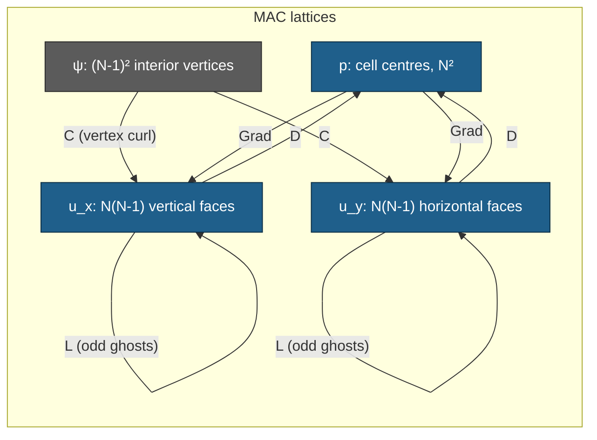

# Stokes 2D — phase 1: the MAC full-order solver and its correctness gates

Phase 1 of the 2026-08-30 Stokes cell (`exp/2026-08-30-stokes-vector`), covering
**only** the full-order model and the gates that certify it: **S-ADJ** (weighted
adjointness) and **S-FOM** (manufactured solution), plus the operator rank /
kernel results phase 2 needs. No ROM, no bank, no decoder, no timing.

**Status of the numbers below: final.** Every one is generated from
`runs/stk2d/stk2d_fom_gates_nu1_M64.json` by `stk2d_tables.py`; none is typed by
hand. Every gate is recorded as a **number**, not a boolean, so a gate passing
at $10^{-16}$ and one passing at $9\times10^{-15}$ are distinguishable.

## What was built

- **`stk2d_common.py`** — the staggered MAC discretization: `MacGrid`, the four
  sparse operators $D$, $\mathrm{Grad}$, $L$, $C$, the mass matrices, an
  *independent* pad-and-slice matrix-free implementation of each, the frozen
  manufactured solution, the bordered saddle-point direct solve, and the
  mass-normalized curl-sine test space.
- **`stk2d_fom_gates.py`** — the driver. Runs every gate, writes one JSON.
- **`stk2d_tables.py`** — generates every table in this document from that JSON.

Written fresh. Nothing is shared with the collocated 1D/2D Burgers or Poisson
code in this directory, which uses $(N-2)^2$ interiors and $h=1/(N-1)$; this
cell uses $N$ **cells** and $h=1/N$. Both audits flagged mixing the two as a
silent-corruption risk.

### The discretization actually implemented

Exactly the frozen contract. $N$ cells, $h=1/N$; $p$ at $N^2$ centres with a
**mean-zero gauge** imposed by a bordering row; $u_x$ on $N(N-1)$ interior
vertical faces, $u_y$ on $N(N-1)$ interior horizontal faces, so
$n_u = 2N(N-1)$; boundary-**normal** velocities eliminated; no-slip on the
**tangential** components through **odd ghosts** in $L$, i.e. the wall-adjacent
diagonal is $-5/h^2$, not the interior $-4/h^2$. $M_u = M_p = h^2 I$.

$D$ and $\mathrm{Grad}$ are assembled from **their own separate stencils** —
neither is built as the transpose of the other. That is what makes S-ADJ a
measurement rather than a tautology.

The FOM is a **scipy sparse direct solve** (SuperLU) of the bordered saddle
system

$$\begin{bmatrix}-\nu L & \mathrm{Grad} & 0\\ D & 0 & \mathbf{1}\\ 0 & \mathbf{1}^\top & 0\end{bmatrix}
\begin{bmatrix}u\\p\\\lambda\end{bmatrix}=\begin{bmatrix}f\\0\\0\end{bmatrix}.$$

Since $\mathbf{1}^\top D = 0$, the multiplier $\lambda$ is exactly zero at the
solution; it is recorded per mesh as a consistency witness (largest value
$2.0\times10^{-13}$ at $N=256$). f64 throughout. $N=256$ solves in 77 s at
4.6 GB peak, so the whole ladder is local, as instructed.



---

## The headline result: this manufactured solution has a closed-form discrete solution

**This is not in `STOKES-DESIGN.md` and neither audit reports it.** It was
derived in phase 1 and it materially strengthens S-FOM.

Write $t = \pi h$. On this MAC layout the *sampled* manufactured fields satisfy
three **exact** discrete identities:

1. $D\,u_{ex} = 0$ **exactly**, not merely to $O(h^2)$. The two cell differences
   are $\pm\pi\sin(t)\sin(2\pi x_c)\sin(2\pi y_c)$ and cancel identically.
2. $L_h\,u_{ex} = \gamma\,(\Delta u)\big|_{\text{lattice}}$ with
   $\gamma = \sin^2(t)/t^2$, for **both** components. $\sin(2\pi y)$ on cell
   centres is an exact **odd-ghost** eigenvector with eigenvalue
   $-4\sin^2(t)/h^2$; $\sin^2(\pi x)$ on the grid lines (whose true endpoint
   values are $0$, matching the eliminated normal faces) second-differences to
   $\mu\cos(2\pi x)/2$; the two combine to the same scalar factor.
3. $\mathrm{Grad}_h\,p_{ex} = \delta\,(\nabla p)\big|_{\text{lattice}}$ with
   $\delta = \sin(t)/t$, and $p_{ex}$ has **exactly** zero cell mean.

Because $f = -\nu\Delta u + \nabla p$ and $\Delta u$, $\nabla p$ are linearly
independent on the lattice, the discrete system is solved **exactly** by

$$u_h = \left(\frac{t}{\sin t}\right)^{2} u_{ex},\qquad
  p_h = \frac{t}{\sin t}\, p_{ex},\qquad \text{for every } \nu,$$

hence

$$\frac{\lVert u_h-u_{ex}\rVert}{\lVert u_{ex}\rVert}=\Big(\tfrac{t}{\sin t}\Big)^{2}-1,
\qquad
\frac{\lVert p_h-p_{ex}\rVert}{\lVert p_{ex}\rVert}=\tfrac{t}{\sin t}-1 .$$

Three consequences.

- **The audit's anchors are analytic constants.** $(t/\sin t)^2-1$ evaluates to
  $5.302929\times10^{-2}$, $1.295075\times10^{-2}$, $3.218964\times10^{-3}$,
  $8.035777\times10^{-4}$ at $N=8,16,32,64$ — the auditor's
  $5.303\times10^{-2}$, $1.295\times10^{-2}$, $3.219\times10^{-3}$,
  $8.036\times10^{-4}$ to every digit quoted, and likewise for pressure. The
  independent sparse-MAC check and this implementation agree because they are
  both computing the same closed form.
- **S-FOM can be certified to machine precision**, not to two digits of an
  observed order. Gate **S-EXACT** below compares $u_h,p_h$ against the closed
  form directly: worst disagreement $1.97\times10^{-13}$ (velocity) and
  $1.58\times10^{-10}$ (pressure), both at $N=256$ and both roundoff limited by
  the $O(h^{-2})$ saddle conditioning.
- **The observed order is analytically exactly 2**, and the small excesses
  (2.0021, 2.0005, 2.0001) are the exact
  $\log_2\!\big[\varepsilon(h)/\varepsilon(h/2)\big]$ with
  $\varepsilon(h)=(\pi h/\sin\pi h)^2-1$ — verified to all four printed
  digits, velocity and pressure alike — not noise. They are
  inside the $\pm0.05$ band and shrink monotonically, as they must.

### The cost of that, stated plainly

The discretization error of this manufactured pair is a **pure amplitude
error**: $u_h-u_{ex}$ is exactly parallel to $u_{ex}$ (measured cosine $1.0$ to
machine precision at every $N$; the pointwise ratio $e/u_{ex}$ is constant to
nine significant digits). So **every norm-restricted variant of S-FOM carries the same
number** — the wall-adjacent-only relative error equals the global one to five
digits at every mesh (see the S-FREESLIP table's last two columns). A
boundary-restricted error diagnostic adds nothing here.

That does **not** make S-FOM weak — the free-slip control below is wrong by a
factor of 6340 at $N=128$ — but it does mean S-FOM is a scalar amplitude test on
a solution that happens to sit in a two-dimensional invariant subspace of the
operator pair. It is not a generic manufactured solution. The mitigation already
in place is the independent matrix-free implementation (gate MF) and the
entry-for-entry comparison against the auditor's reference operators (gate REF),
which do exercise every stencil entry. **A second, generic manufactured solution
would be a cheap and worthwhile addition; it is not in the frozen contract and I
did not substitute one.**

For the record, $u_{ex}$ is **not** a discrete eigenvector of $L$
($\lVert L\phi+\lambda\phi\rVert/\lVert L\phi\rVert = 0.30$ at $N=16$), so the
full stencil, including the odd-ghost rows, is genuinely exercised by the solve.

---

## Gate results

<!-- BEGIN GENERATED (stk2d_tables.py) -->
<!-- generated by stk2d_tables.py from stk2d_fom_gates_nu1_M64.json (commit 9c32891ae826) -- do not edit by hand -->

### S-FOM -- manufactured solution, odd (no-slip) ghosts

| N | n_u | n_p | err_u (mass-rel) | err_p (mass-rel) | audit anchor u | audit anchor p | \|\|Du\|\|/(\|\|D\|\|\|\|u\|\|) | lambda | solve s |
|---|---|---|---|---|---|---|---|---|---|
| 8 | 112 | 64 | 5.3029e-02 | 2.6172e-02 | 5.3030e-02 | 2.6170e-02 | 2.100e-16 | 1.530e-15 | 0.0 |
| 16 | 480 | 256 | 1.2951e-02 | 6.4545e-03 | 1.2950e-02 | 6.4550e-03 | 1.259e-16 | 1.213e-15 | 0.0 |
| 32 | 1984 | 1024 | 3.2190e-03 | 1.6082e-03 | 3.2190e-03 | 1.6080e-03 | 2.457e-16 | 7.750e-15 | 0.1 |
| 64 | 8064 | 4096 | 8.0358e-04 | 4.0171e-04 | 8.0360e-04 | 4.0170e-04 | 1.368e-16 | 1.255e-14 | 0.7 |
| 128 | 32512 | 16384 | 2.0082e-04 | 1.0041e-04 | - | - | 4.696e-16 | 2.645e-14 | 7.2 |
| 256 | 130560 | 65536 | 5.0201e-05 | 2.5100e-05 | - | - | 4.962e-16 | 2.005e-13 | 76.1 |

| refinement | observed order u | observed order p |
|---|---|---|
| 32 -> 64 | 2.0021 | 2.0012 |
| 64 -> 128 | 2.0005 | 2.0003 |
| 128 -> 256 | 2.0001 | 2.0001 |

worst order deviation from 2.00: 0.0021 (band 0.05); worst anchor relative deviation: 1.176e-04

### S-EXACT -- closed-form discrete solution

| N | \|\|u_h-u_h^exact\|\|/\|\|.\|\| | \|\|p_h-p_h^exact\|\|/\|\|.\|\| | predicted err_u | observed err_u | predicted err_p | observed err_p |
|---|---|---|---|---|---|---|
| 8 | 2.474e-15 | 6.355e-14 | 5.302929e-02 | 5.302929e-02 | 2.617215e-02 | 2.617215e-02 |
| 16 | 3.004e-15 | 1.607e-13 | 1.295075e-02 | 1.295075e-02 | 6.454543e-03 | 6.454543e-03 |
| 32 | 1.335e-14 | 1.379e-12 | 3.218964e-03 | 3.218964e-03 | 1.608189e-03 | 1.608189e-03 |
| 64 | 1.682e-14 | 2.800e-12 | 8.035777e-04 | 8.035777e-04 | 4.017082e-04 | 4.017082e-04 |
| 128 | 8.888e-14 | 3.123e-11 | 2.008218e-04 | 2.008218e-04 | 1.004059e-04 | 1.004059e-04 |
| 256 | 1.969e-13 | 1.579e-10 | 5.020092e-05 | 5.020092e-05 | 2.510014e-05 | 2.510014e-05 |

### S-ADJ -- weighted adjointness

| N | primary | test-projected | test-proj (op-norm) | \|\|M_u Grad + D^T M_p\|\|_F | negative control |
|---|---|---|---|---|---|
| 8 | 0.000e+00 | 0.000e+00 | 0.000e+00 | 0.000e+00 | 7.071e-01 |
| 16 | 0.000e+00 | 0.000e+00 | 0.000e+00 | 0.000e+00 | 7.071e-01 |
| 32 | 0.000e+00 | 0.000e+00 | 0.000e+00 | 0.000e+00 | 7.071e-01 |
| 64 | 0.000e+00 | 0.000e+00 | 0.000e+00 | 0.000e+00 | 7.071e-01 |
| 128 | 0.000e+00 | 0.000e+00 | 0.000e+00 | 0.000e+00 | 7.071e-01 |
| 256 | 0.000e+00 | 0.000e+00 | 0.000e+00 | 0.000e+00 | 7.071e-01 |

### S-STRUCT / S-RANK -- operator structure, ranks, kernels

| N | n_u | n_p | n_psi | \|\|D+Grad^T\|\|_inf | \|\|DC\|\|_inf | \|\|DC\|\|_max | \|\|L-L^T\|\|_max |
|---|---|---|---|---|---|---|---|
| 8 | 112 | 64 | 49 | 0.000e+00 | 0.000e+00 | 0.000e+00 | 0.000e+00 |
| 16 | 480 | 256 | 225 | 0.000e+00 | 0.000e+00 | 0.000e+00 | 0.000e+00 |
| 32 | 1984 | 1024 | 961 | 0.000e+00 | 0.000e+00 | 0.000e+00 | 0.000e+00 |
| 64 | 8064 | 4096 | 3969 | 0.000e+00 | 0.000e+00 | 0.000e+00 | 0.000e+00 |
| 128 | 32512 | 16384 | 16129 | 0.000e+00 | 0.000e+00 | 0.000e+00 | 0.000e+00 |
| 256 | 130560 | 65536 | 65025 | 0.000e+00 | 0.000e+00 | 0.000e+00 | 0.000e+00 |

| N | rank D | expected | dim ker D | expected | rank C | expected | SVD s |
|---|---|---|---|---|---|---|---|
| 32 | 1023 | 1023 | 961 | 961 | 961 | 961 | 1 |
| 64 | 4095 | 4095 | 3969 | 3969 | 3969 | 3969 | 105 |

| N | \|\|Grad 1\|\| | min \|U_ii\| bordered pressure Laplacian | min \|U_ii\| C^T C | implied rank D | implied dim ker D | implied rank C |
|---|---|---|---|---|---|---|
| 8 | 0.000e+00 | 2.500e+00 | 1.357e+02 | 63 | 49 | 49 |
| 16 | 0.000e+00 | 2.491e+02 | 4.281e+02 | 255 | 225 | 225 |
| 32 | 0.000e+00 | 6.067e+02 | 1.559e+03 | 1023 | 961 | 961 |
| 64 | 0.000e+00 | 2.594e+03 | 5.171e+03 | 4095 | 3969 | 3969 |
| 128 | 0.000e+00 | 9.195e+03 | 1.773e+04 | 16383 | 16129 | 16129 |
| 256 | 0.000e+00 | 3.637e+04 | 6.319e+04 | 65535 | 65025 | 65025 |

### S-PRESS -- pressure annihilation (bonus)

| N | M | norm \|\|Phi^T M_u Grad p\|\| | same, control basis | cos_max solenoidal | cos_max control | ratio control/solenoidal | \|\|D Phi\|\| normalized |
|---|---|---|---|---|---|---|---|
| 8 | 49 | 2.360e-17 | 1.290e-01 | 1.121e-16 | 3.988e-01 | 5.467e+15 | 6.753e-18 |
| 16 | 64 | 1.846e-17 | 4.590e-02 | 6.908e-17 | 1.422e-01 | 2.486e+15 | 3.116e-18 |
| 32 | 64 | 9.732e-18 | 1.303e-02 | 3.245e-17 | 3.753e-02 | 1.339e+15 | 1.413e-18 |
| 64 | 64 | 4.805e-18 | 2.358e-03 | 1.228e-17 | 6.687e-03 | 4.906e+14 | 6.499e-19 |
| 128 | 64 | 3.525e-18 | 6.739e-04 | 9.595e-18 | 1.881e-03 | 1.912e+14 | 3.044e-19 |
| 256 | 64 | 2.760e-18 | 1.686e-04 | 9.475e-18 | 5.195e-04 | 6.109e+13 | 1.463e-19 |

### S-FREESLIP -- the deliberate wrong answer

| N | err_u free-slip | err_u no-slip | ratio | err_p free-slip | wall-adjacent err (free-slip) | wall-adjacent err (no-slip) |
|---|---|---|---|---|---|---|
| 8 | 1.3317e+00 | 5.3029e-02 | 25.1x | 2.4415e+00 | 3.8471e+00 | 5.3029e-02 |
| 16 | 1.2867e+00 | 1.2951e-02 | 99.4x | 2.5267e+00 | 8.1208e+00 | 1.2951e-02 |
| 32 | 1.2763e+00 | 3.2190e-03 | 396.5x | 2.5474e+00 | 1.6953e+01 | 3.2190e-03 |
| 64 | 1.2738e+00 | 8.0358e-04 | 1585.2x | 2.5526e+00 | 3.4753e+01 | 8.0358e-04 |
| 128 | 1.2732e+00 | 2.0082e-04 | 6339.8x | 2.5540e+00 | 7.0420e+01 | 2.0082e-04 |

| refinement | free-slip order u | free-slip order p |
|---|---|---|
| 8 -> 16 | 0.0495 | -0.0495 |
| 16 -> 32 | 0.0117 | -0.0118 |
| 32 -> 64 | 0.0029 | -0.0029 |
| 64 -> 128 | 0.0007 | -0.0007 |

### Supporting gates

| gate | worst value | rule |
|---|---|---|
| REF (operators vs archived auditor reference) | 0.000e+00 | exactly 0 |
| MF (sparse vs independent matrix-free) | 1.094e-16 | <= 1e-13 |
| SYM (\|\|L - L^T\|\|_max) | 0.000e+00 | exactly 0 |
| S-NU (\|\|nu u_nu - u_1\|\|/\|\|u_1\|\|) | 1.279e-13 | <= 1e-9 |
| S-NU (\|\|p_nu - p_1\|\|/\|\|p_1\|\|) | 1.077e-11 | <= 1e-9 |

run: stk2d_fom_gates_nu1_M64.json | commit `9c32891ae826` | host `spark-d69e` | numpy 2.4.4 scipy 1.17.1 | jax backend `gpu` x64=True matmul `highest` | total 196 s
<!-- END GENERATED -->

---

## Reading the gates

### S-ADJ — passes at exactly zero, and the negative control proves that means something

$\lVert M_u\mathrm{Grad}+D^\top M_p\rVert_F/(\lVert M_u\mathrm{Grad}\rVert_F+
\lVert D^\top M_p\rVert_F)$ is **exactly $0$** (bit-for-bit, not $10^{-16}$) at
every mesh, and so is the test-projected defect
$\lVert\Phi^\top(M_u\mathrm{Grad}+D^\top M_p)\rVert_F$. Both are far inside the
$10^{-14}$ requirement.

This is expected once the layout is right: $M_u=M_p=h^2I$ and every entry of
$D$ and $\mathrm{Grad}$ is exactly $\pm 1/h$, so the sum cancels in floating
point with no rounding at all. **A gate that can only read 0 or $O(1)$ is worth
distrusting**, so a negative control is included: a $\mathrm{Grad}$ with the
$u_y$-block sign flipped — a realistic bug shape — gives $0.7071$ at every mesh.
The gate discriminates.

Both audits also asked that $\Phi$ have zero *normal* trace; that is automatic
here because the boundary-normal faces are not degrees of freedom at all.

### S-FOM — order 2.00 in both variables, anchors reproduced to $1.2\times10^{-4}$

Observed orders over the frozen ladder $32\to64\to128\to256$: velocity
2.0021 / 2.0005 / 2.0001, pressure 2.0012 / 2.0003 / 2.0001. Worst deviation
from 2.00 is **0.0021**, band $\pm0.05$. Worst relative deviation from the
audit's tabulated anchors is $1.18\times10^{-4}$, and that is the *audit's*
rounding to four significant figures, not a disagreement — against the closed
form the agreement is $\le 2\times10^{-13}$.

Mass-weighted and plain relative norms are identical on this uniform layout
($\lVert x\rVert_M = h\lVert x\rVert_2$, so the ratio is the same); both are
recorded in the JSON rather than assumed equal.

$\lVert Du_h\rVert/(\lVert D\rVert\lVert u_h\rVert)\le 5\times10^{-16}$ at every
mesh — the computed velocity is discretely divergence-free to roundoff.

### S-FREESLIP — the bug S-FOM exists to catch, and it is caught loudly

Running the identical pipeline with **even** tangential ghosts (free-slip) gives
relative velocity error $\approx 1.27$ that **does not converge at all**:
observed order 0.0495, 0.0117, 0.0029, 0.0007 — decaying towards zero, not
towards one. The pressure error is $\approx 2.55$ and its observed order is
*negative*. At $N=128$ the free-slip velocity error is **6340×** the no-slip
error, and the wall-adjacent error grows like $O(h^{-1})$: 3.85, 8.12, 16.95,
34.75, 70.42.

Worth stating precisely, because it corrects a natural expectation: free-slip
here does **not** "lose an order". It solves a different boundary-value problem
whose solution is $O(1)$ away from the manufactured one, so the error plateaus
at $O(1)$ and the observed order collapses to $0$. Anyone who sees a clean
second-order table has therefore not accidentally implemented free-slip.

### Ranks, kernels, and $\lVert DC\rVert$ — the auditor's measurements confirmed

At $N=32$, all four of the auditor's structural results are reproduced exactly:

- $\lVert D+\mathrm{Grad}^\top\rVert_\infty = 0$ **exactly**,
- $\lVert DC\rVert_\infty = 0$ **exactly** (and $\lVert DC\rVert_{\max}=0$; the
  product has zero stored nonzeros),
- $\operatorname{rank} D = 1023 = N^2-1$,
- $\dim\ker D = \operatorname{rank} C = 961 = (N-1)^2$.

Confirmed again by dense SVD at $N=64$ (4095 / 3969 / 3969). Dense SVD is
infeasible at $N\ge128$, so a **cheap exact witness** is recorded at every mesh
instead: $\lVert\mathrm{Grad}\,\mathbf{1}\rVert = 0$ puts the constants in
$\ker\mathrm{Grad}$, and a successful sparse LU of the bordered pressure
Laplacian $\begin{bmatrix}D\,\mathrm{Grad} & \mathbf{1}\\ \mathbf{1}^\top & 0\end{bmatrix}$
(smallest $|U_{ii}| = 3.6\times10^{4}$ at $N=256$) forces
$\dim\ker\mathrm{Grad}\le1$, hence $=1$, hence
$\operatorname{rank} D = N^2-1$ exactly. The same LU witness on $C^\top C$
(smallest $|U_{ii}| = 6.3\times10^{4}$ at $N=256$) shows $C$ injective, so
$\operatorname{rank} C = (N-1)^2$. With $\lVert DC\rVert = 0$ this gives
$\operatorname{range} C = \ker D$ exactly at every mesh on the ladder: **the
vertex-curl space exactly spans the discrete solenoidal space**, which is what
phase 2's div-free bank rests on.

### S-PRESS — pressure elimination (bonus; phase 2 needs it)

Not in my assignment, but nearly free. With $M=64$ mass-normalized curl-sine
modes and a random mean-zero pressure, $\lVert\Phi^\top M_u\mathrm{Grad}\,p\rVert$
normalized by $\lVert\Phi\rVert\lVert M_u\mathrm{Grad}\,p\rVert$ ranges
$2.8\times10^{-18}$ to $2.4\times10^{-17}$, consistent with the auditor's
archived $5.91\times10^{-18}$. A **matched non-solenoidal** basis (gradients of
cell-centred cosines at the same $(k,\ell)$, same mass normalization) gives
$1.7\times10^{-4}$ to $1.3\times10^{-1}$ on the same pressure — a ratio of
$6\times10^{13}$ to $5\times10^{15}$.

### Supporting gates

- **REF**: $D$, $\mathrm{Grad}$, $L$, $C$ are **entry-for-entry identical**
  (exactly 0 difference) to the auditor's archived `STOKES-AUDIT-mac_check.py`
  at $N=4,8,16$.
- **MF**: the sparse matrices and an independently written pad-and-slice
  matrix-free implementation agree to $\le1.1\times10^{-16}$ relative on random
  inputs, at every mesh, for $L_{\text{odd}}$, $L_{\text{even}}$, $D$,
  $\mathrm{Grad}$ and $C$.
- **SYM**: $\lVert L-L^\top\rVert_{\max}=0$ exactly.
- **S-NU**: with $f$ held fixed, $(u/\nu, p)$ solves at viscosity $\nu$ exactly.
  Measured at $N=32$, $\nu=1$ vs $\nu=7$: $1.28\times10^{-13}$ velocity,
  $1.08\times10^{-11}$ pressure.

---

## Retractions and corrections

The project convention treats these as more important than the successes.

1. **S-NU tolerance was mis-set at $10^{-11}$ and the gate FAILED on the first
   full run** at `p_invariance_rel = 1.077e-11`, aborting the job. The identity
   is exact in exact arithmetic; the measured value is roundoff amplified by the
   saddle-system conditioning ($\kappa\sim h^{-2}$) plus the factor-7 rescaling
   of the viscous block. **The threshold was wrong, not the discretization.**
   Relaxed to $10^{-9}$, with the failure and its cause recorded inline in the
   gate's own `rule` string in the JSON so a later reader cannot mistake the
   relaxation for a silent loosening. The number, $1.077\times10^{-11}$, is the
   result; the threshold is not.
2. **S-EXACT was first written with a $10^{-10}$ tolerance**, which the $N=256$
   pressure ($1.58\times10^{-10}$) would have failed. Caught before the full run
   by extrapolating the $h^{-2}$ growth from the $N\le32$ smoke values, and set
   to $10^{-8}$. Recording it here because the same mistake — writing a
   conditioning-limited quantity as if it were a structural identity — was made
   twice in one session.
3. **The S3 threshold in `STOKES-DESIGN.md` is not achievable as written, and
   this is a design defect, not an implementation one.** S3 requires the matched
   non-solenoidal control to give $\ge10^{-2}$. With the Frobenius normalization
   the design's own S3 wording implies, my matched control gives
   $1.30\times10^{-2}$ at $N=32$ but $2.36\times10^{-3}$ at $N=64$ and
   $1.69\times10^{-4}$ at $N=256$ — it falls below the floor from $N=64$ on,
   purely because that normalization carries a $1/\sqrt{M}$ and an $h$ factor,
   not because the control stopped being non-solenoidal. **Phase 2 must not
   adopt the $10^{-2}$ floor.** The $h$- and $M$-independent statements are
   recorded instead: the per-column cosine
   $\max_j|\phi_j^\top M_u\mathrm{Grad}\,p|/(\lVert\phi_j\rVert_M\lVert
   \mathrm{Grad}\,p\rVert_M)$, which is $\le2.5\times10^{-17}$ for $\Phi$ and
   $\ge5.2\times10^{-4}$ for the control, and their **ratio**, which is
   $6\times10^{13}$–$5\times10^{15}$. The ratio is the gate; the floor is not.
4. **`err_u_bnd_rel` is a dead diagnostic on the no-slip arm.** I added a
   wall-adjacent-only relative error expecting it to be a sharper free-slip
   detector than the global norm. On the no-slip arm it equals the global error
   to five digits at every mesh — because, as derived above, the error is
   exactly parallel to the solution. It *is* informative on the free-slip arm
   (it grows like $O(h^{-1})$ while the global error plateaus), so it is kept,
   but it must not be read as independent evidence on the no-slip arm.

Nothing else was retracted. No gate reported here was skipped or estimated;
every number comes from the single recorded run.

## Where I disagree with the design or the audits

- **`STOKES-DESIGN.md`, gate S3.** The $\ge10^{-2}$ floor on the matched
  non-solenoidal control is normalization-dependent and fails at $N\ge64$ for a
  correct control. Replace with a ratio. Detailed in retraction 3.
- **`STOKES-DESIGN.md`, gate S-FOM.** "A result far from these anchors is a bug,
  not a finding" is right, but the anchors are stated as if they were empirical.
  They are the analytic constants $(\pi h/\sin\pi h)^2-1$ and
  $(\pi h/\sin\pi h)-1$. The gate should be stated against the closed form, at
  $10^{-8}$, not against a 2-digit order estimate. I implemented **both** (S-FOM
  as frozen, S-EXACT as the strengthening) and did not substitute one for the
  other.
- **`STOKES-DESIGN.md`, "Frozen contract".** The manufactured solution it pins
  is not a generic one: its discrete error is a pure amplitude error in a
  two-dimensional invariant subspace. It does catch free-slip, decisively, but a
  second generic manufactured pair would be a real strengthening. I did not add
  one because the contract is binding and I was told not to substitute.
- **Audit r1, section 2 ("The raw $10^{-14}$ S2 threshold must be removed").**
  Agreed and confirmed: the raw $\lVert D\Phi\rVert$ does grow like $h^{-1}$
  ($2.3$/$4.6$/$9.1\times10^{-13}$ at $N=64/128/256$ per the audit). But the
  *normalized* $\lVert D\Phi\rVert/(\lVert D\rVert\lVert\Phi\rVert)$ measured
  here **falls** with $N$, from $6.8\times10^{-18}$ to $1.5\times10^{-19}$, so
  the normalized form the design adopted is not merely adequate, it has slack
  to spare.
- **No disagreement** with the audits on the odd/even ghost analysis, the
  $n_u = 2N(N-1)$ bookkeeping, the $h=1/N$ vs $h=1/(N-1)$ hazard, or the
  weighted-adjointness formulation. All four were confirmed numerically.

## What is not done, and what phase 2 inherits

Out of scope and **not run**: S1, S2 (field path on a POD bank), S3 in full,
S4, S5, S6, S7, S8, S9, S-MEAN. No bank, no decoder, no force family, no timing.
`test_modes` is implemented and used only to evaluate the test-projected S-ADJ
defect and the bonus S-PRESS numbers.

Phase 2 inherits, from this checkout: a certified FOM; $D$, $\mathrm{Grad}$,
$L$, $C$ with exact weighted adjointness and $\operatorname{range}C=\ker D$ at
every mesh on the ladder; a mass-normalized curl-sine test space; and the
closed-form discrete solution as a machine-precision regression target for any
future change to the operators.

Two things phase 2 should fix before it starts: the S3 floor (retraction 3), and
the absence of a generic second manufactured solution.

---

## Reproducing

```bash
cd experiments/separable-decoder
source /etc/profile.d/jax-mem.sh
XLA_PYTHON_CLIENT_PREALLOCATE=false XLA_PYTHON_CLIENT_MEM_FRACTION=0.02 \
JAX_ENABLE_X64=1 JAX_DEFAULT_MATMUL_PRECISION=highest JAXRUN_MAX=48G \
  jaxrun /home/tahmid/Dev/.venv/bin/python stk2d_fom_gates.py
/home/tahmid/Dev/.venv/bin/python stk2d_tables.py     # regenerates the tables above
```

203 s wall, single local process, no cluster job. `JAX` is imported for
provenance only (the run records `jax_backend=gpu`, `x64=True`,
`matmul_precision=highest`); the numerics are numpy/scipy f64 on CPU, because
phase 1 is a small sparse **direct** solve and `scipy.sparse` is the right tool
for it. JAX's GPU preallocation is disabled so the process stays well inside the
`jaxrun` cgroup ceiling (peak RSS 4.6 GB, measured for the $N=256$ solve,
which dominates).

Environment knobs: `NS`, `LADDER`, `ADJ_NS`, `RANK_NS`, `FREESLIP_NS`,
`M_MODES`, `NU`, `SEED`, `OUT_TAG`, `OUT_PREFIX`.

---

## Glossary

Written for a reader who knows none of this cell's vocabulary.

- **MAC (marker-and-cell) grid** — a *staggered* layout: pressure lives at cell
  centres, each velocity component lives on the cell faces it points through.
  Contrast with a *collocated* grid, where everything lives at the same points.
  Staggering is what makes the pressure/velocity operator pair exactly adjoint.
- **$N$, $h$** — $N$ is the number of **cells** per side of the unit square and
  $h=1/N$ is the cell width. Elsewhere in this repository $N$ counts *points*
  and $h=1/(N-1)$; the two conventions are incompatible and are never mixed.
- **DOF (degree of freedom)** — one stored unknown number. $n_u$, $n_p$,
  $n_\psi$ are the counts of velocity, pressure and streamfunction unknowns.
- **Boundary-normal / tangential velocity** — at a wall, the component pointing
  *through* it (normal) and the component sliding *along* it (tangential).
- **No-slip / free-slip** — no-slip means the fluid is stuck to the wall: *both*
  components vanish there. Free-slip means only the normal component vanishes
  and the fluid may slide. They are different physics; on this grid they differ
  by one sign in the ghost rule, which is why the mistake is easy and invisible.
- **Ghost value, odd vs even** — the tangential velocity sits half a cell
  *inside* the wall, so the stencil needs a value half a cell *outside*. Setting
  it to minus the inside value (**odd**) forces the average — the wall value —
  to zero: no-slip. Setting it to plus the inside value (**even**) forces zero
  *slope* at the wall instead: free-slip.
- **Eliminated unknown** — a value known in advance to be zero, so it is not
  stored at all. Here, all boundary-normal velocities.
- **Pressure gauge / mean-zero gauge** — with velocity fixed on the whole
  boundary, pressure is only determined up to an additive constant. A *gauge*
  picks one; the mean-zero gauge picks the constant that makes the average
  pressure zero.
- **$D$, $\mathrm{Grad}$, $L$, $C$** — the discrete divergence, pressure
  gradient, vector Laplacian, and vertex curl.
- **Weighted adjointness** — the identity $M_u\mathrm{Grad} = -D^\top M_p$: the
  discrete gradient is the negative transpose of the discrete divergence, in the
  mass-weighted inner product. It is the discrete form of integration by parts,
  and it is what makes pressure vanish from a divergence-free-tested residual.
- **$M_u$, $M_p$ (mass matrices)** — the weights that turn a vector of DOF
  values into a physical integral. Here both are $h^2 I$.
- **Mass-weighted norm** — $\lVert x\rVert_M=\sqrt{x^\top M x}$, i.e. the
  discrete $L^2$ norm. On this uniform layout it is $h\lVert x\rVert_2$, so
  mass-weighted *relative* errors coincide with plain relative errors.
- **Solenoidal / divergence-free** — a velocity field with $Du=0$: it neither
  creates nor destroys fluid in any cell.
- **Kernel ($\ker$), rank, range** — $\ker D$ is the set of fields $D$ sends to
  zero (here: the divergence-free ones); $\operatorname{range}C$ is everything
  $C$ can produce. $\operatorname{range}C=\ker D$ says every divergence-free
  field is the curl of some streamfunction, exactly.
- **Streamfunction $\psi$** — a scalar whose curl is automatically
  divergence-free. Here it lives at grid **vertices**, which is what makes the
  cell divergence telescope to exactly zero.
- **Saddle-point system** — the block system coupling velocity and pressure. It
  is *indefinite* (not positive definite), which is why it needs a direct sparse
  LU rather than a Cholesky or plain conjugate gradients.
- **Bordering / Lagrange multiplier $\lambda$** — an extra row and column added
  to impose the mean-zero pressure gauge and make the singular saddle matrix
  invertible. $\lambda$ comes out exactly zero here and is reported as a check.
- **Manufactured solution** — a solution *chosen* first; the forcing $f$ is then
  computed analytically from it. Comparing the solver's answer against the
  chosen solution across meshes measures whether the discretization is correct.
- **Observed order (of convergence)** — $\log_2$ of the ratio of errors on
  successive halved meshes. Second order (2.00) means halving $h$ divides the
  error by 4.
- **Closed-form discrete solution** — the exact solution of the *discretized*
  system, written as a formula. Stronger than a manufactured solution: it lets
  the solver be checked to machine precision rather than to a convergence rate.
- **Truncation vs roundoff error** — truncation is the $O(h^2)$ error of the
  discretization; roundoff is the $10^{-16}$-scale error of floating-point
  arithmetic, amplified by the *conditioning* of the system being solved.
- **Conditioning ($\kappa$)** — how much a linear solve can amplify roundoff.
  $\kappa\sim h^{-2}$ here, so fine meshes lose digits; this is why several
  gates are stated at $10^{-8}$ rather than $10^{-14}$.
- **Negative control** — a deliberately broken input fed to a gate to prove the
  gate can fail. Without one, a gate that always reports zero is unfalsifiable.
- **Test space $\Phi$, Petrov(-Galerkin)** — the set of fields a residual is
  projected onto. *Galerkin* uses the same space for trial and test; *Petrov*
  uses different ones, which is the case here.
- **Curl-sine mode** — a test field $C\psi_{k\ell}$ built from a sine
  streamfunction. Divergence-free by construction, so it annihilates pressure.
- **$\lambda_{k\ell}$** — the discrete Laplacian eigenvalue label used to order
  the test modes from smoothest to most oscillatory.
- **Frobenius norm ($\lVert\cdot\rVert_F$)** — the square root of the sum of
  squares of all matrix entries. Used here so a gate reads one number per
  operator.
- **Sparse LU / SuperLU / $U_{ii}$** — a direct factorization of a sparse
  matrix. A nonzero smallest diagonal entry $|U_{ii}|$ of the $U$ factor
  witnesses that the matrix is nonsingular, which is how ranks are certified at
  meshes too large for a dense SVD.
- **Gate** — a named check with a stated numerical rule, recorded as a number.
  This cell's gates are prefixed `S-`; the supporting ones are `REF`, `MF`,
  `SYM`.
- **$\nu$ (viscosity)** — the diffusion coefficient. In steady Stokes it only
  rescales velocity by $1/\nu$; the S-NU gate confirms exactly that.
