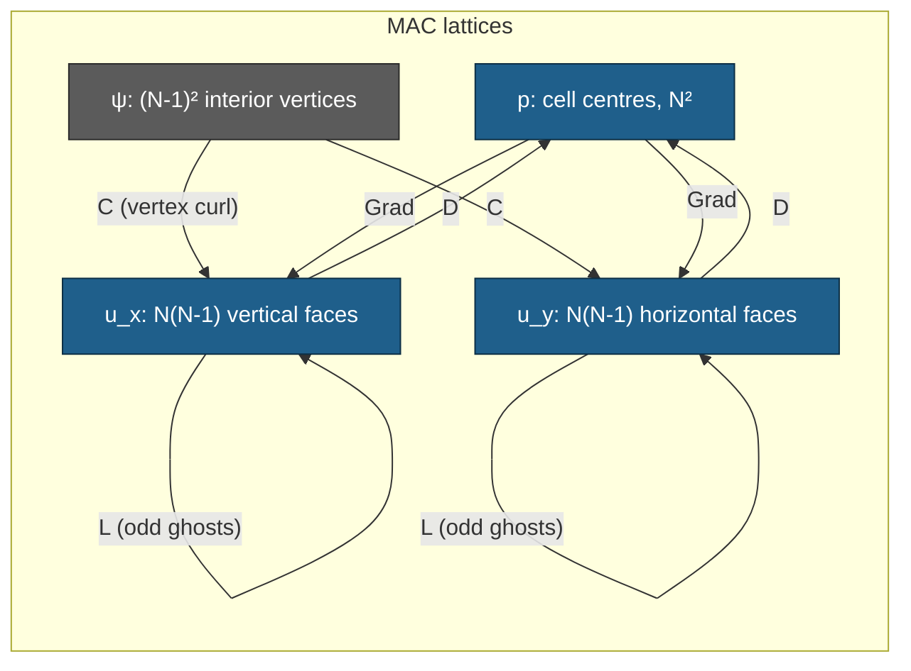

# Stokes 2D — phase 1: the MAC full-order solver and its correctness gates

Phase 1 of the 2026-08-30 Stokes cell (`exp/2026-08-30-stokes-vector`), covering
**only** the full-order model and the gates that certify it: **S-ADJ** (weighted
adjointness) and **S-FOM** (manufactured solution), plus the operator rank /
kernel results phase 2 needs. No ROM, no bank, no decoder, no timing.

**Revision 2.** Revision 1 was independently verified by Codex `gpt-5.6-sol`
(`STOKES-PHASE1-VERIFY-codex.md`), verdict **PROCEED WITH SPECIFIC ADDITIONS**.
The operators, the solver and the closed-form claim were confirmed — reproduced
by an independent Kronecker-product implementation through $N=128$ — and must
not change. Three additions were required and are now in: a **second, generic
manufactured solution**; a **repaired S3 control**; and **every diagnostic
turned into a real assertion**. The verifier also corrected two things I got
wrong; both corrections are carried below, in "Retractions".

**Status of the numbers below: final.** Every one is generated from
`runs/stk2d/stk2d_fom_gates_nu1_M64.json` by `stk2d_tables.py`; none is typed by
hand. Every gate is recorded as a **number**, not a boolean.

## What was built

- **`stk2d_common.py`** — the staggered MAC discretization: `MacGrid`, the four
  sparse operators $D$, $\mathrm{Grad}$, $L$, $C$, the mass matrices, an
  *independent* pad-and-slice matrix-free implementation of each, **two**
  manufactured solutions with a finite-difference consistency checker, the
  closed-form discrete solution, the bordered saddle-point direct solve, and the
  mass-normalized curl-sine test space.
- **`stk2d_fom_gates.py`** — the driver (revision 2). Runs every gate, asserts
  every one, writes one JSON.
- **`stk2d_tables.py`** — generates every table in this document from that JSON.

Written fresh. Nothing is shared with the collocated 1D/2D Burgers or Poisson
code in this directory, which uses $(N-2)^2$ interiors and $h=1/(N-1)$; this
cell uses $N$ **cells** and $h=1/N$. Both audits flagged mixing the two as a
silent-corruption risk.

### The discretization actually implemented

Exactly the frozen contract. $N$ cells, $h=1/N$; $p$ at $N^2$ centres with a
**mean-zero gauge** imposed by a bordering row; $u_x$ on $N(N-1)$ interior
vertical faces, $u_y$ on $N(N-1)$ interior horizontal faces, so
$n_u = 2N(N-1)$; boundary-**normal** velocities eliminated; no-slip on the
**tangential** components through **odd ghosts** in $L$, i.e. the wall-adjacent
diagonal is $-5/h^2$, not the interior $-4/h^2$. $M_u = M_p = h^2 I$.

$D$ and $\mathrm{Grad}$ are assembled from **their own separate stencils** —
neither is built as the transpose of the other. That is what makes S-ADJ a
measurement rather than a tautology.

The FOM is a **scipy sparse direct solve** (SuperLU) of the bordered saddle
system

$$\begin{bmatrix}-\nu L & \mathrm{Grad} & 0\\ D & 0 & \mathbf{1}\\ 0 & \mathbf{1}^\top & 0\end{bmatrix}
\begin{bmatrix}u\\p\\\lambda\end{bmatrix}=\begin{bmatrix}f\\0\\0\end{bmatrix}.$$

Since $\mathbf{1}^\top D = 0$, the multiplier $\lambda$ is exactly zero at the
solution; it is recorded per mesh as a consistency witness (largest value
$2.0\times10^{-13}$ at $N=256$). f64 throughout. $N=256$ solves in 76 s at
4.6 GB peak, so the whole ladder is local, as instructed.



---

## The headline result: the frozen manufactured solution has a closed-form discrete solution

**Not in `STOKES-DESIGN.md`; derived in phase 1, and confirmed independently by
the verifier**, which re-derived all three identities and checked the odd-ghost
wall rows specifically — they are no worse than the interior rows.

Write $t = \pi h$. On this MAC layout the *sampled* manufactured fields satisfy
three **exact** discrete identities:

1. $D\,u_{ex} = 0$ **exactly**, not merely to $O(h^2)$. The two cell differences
   are $\pm\pi\sin(t)\sin(2\pi x_c)\sin(2\pi y_c)$ and cancel identically —
   boundary cells included, because the eliminated normal faces equal the
   analytic endpoint values $0$.
2. $L_h\,u_{ex} = \gamma\,(\Delta u)\big|_{\text{lattice}}$ with
   $\gamma = \sin^2(t)/t^2$, on **every active face**. $\sin(2\pi y)$ on cell
   centres is an exact **odd-ghost** eigenvector with eigenvalue
   $-4\sin^2(t)/h^2$ — the analytic continuation $\sin(-t)=-\sin(t)$ *is* the
   odd ghost — and $\sin^2(\pi x)$ on the grid lines second-differences to
   $\mu\cos(2\pi x)/2$, including at $i=1,N-1$.
3. $\mathrm{Grad}_h\,p_{ex} = \delta\,(\nabla p)\big|_{\text{lattice}}$ with
   $\delta = \sin(t)/t$, and $p_{ex}$ has **exactly** zero cell mean.

Because $f = -\nu\Delta u + \nabla p$ and $\Delta u$, $\nabla p$ are linearly
independent on the lattice, the discrete system is solved **exactly** by

$$u_h = \left(\frac{t}{\sin t}\right)^{2} u_{ex},\qquad
  p_h = \frac{t}{\sin t}\, p_{ex},\qquad \text{for every } \nu,$$

hence

$$\frac{\lVert u_h-u_{ex}\rVert}{\lVert u_{ex}\rVert}=\Big(\tfrac{t}{\sin t}\Big)^{2}-1,
\qquad
\frac{\lVert p_h-p_{ex}\rVert}{\lVert p_{ex}\rVert}=\tfrac{t}{\sin t}-1 .$$

Three consequences.

- **The audit's anchors are analytic constants.** $(t/\sin t)^2-1$ evaluates to
  $5.302929\times10^{-2}$, $1.295075\times10^{-2}$, $3.218964\times10^{-3}$,
  $8.035777\times10^{-4}$ at $N=8,16,32,64$ — the auditor's
  $5.303\times10^{-2}$, $1.295\times10^{-2}$, $3.219\times10^{-3}$,
  $8.036\times10^{-4}$ to every digit quoted, and likewise for pressure. The
  earlier independent sparse-MAC check was genuinely independent code, but it
  was unknowingly evaluating predetermined analytic constants.
- **S-FOM can be certified to machine precision**, not to two digits of an
  observed order. Gate **S-EXACT** compares $u_h,p_h$ against the closed form
  directly: worst disagreement $1.97\times10^{-13}$ (velocity) and
  $1.58\times10^{-10}$ (pressure), both at $N=256$ and both roundoff limited by
  the $O(h^{-2})$ saddle conditioning.
- **The observed order is analytically exactly 2**, and the small excesses
  (2.0021, 2.0005, 2.0001) are the exact
  $\log_2\!\big[\varepsilon(h)/\varepsilon(h/2)\big]$ with
  $\varepsilon(h)=(\pi h/\sin\pi h)^2-1$ — verified to all four printed digits,
  velocity and pressure alike — not noise.

### The cost of that, and the second manufactured solution it forced

The discretization error of the frozen pair is a **uniform scalar amplitude
error**: $u_h-u_{ex}$ is exactly parallel to $u_{ex}$ (measured cosine $1.0$ to
machine precision at every $N$; the pointwise ratio $e/u_{ex}$ is constant to
nine significant digits). So **every norm-restricted variant of S-FOM carries
the same number** — the wall-adjacent-only relative error equals the global one
to five digits at every mesh.

*Correction from the verifier, and it is mine to own:* revision 1 explained this
by saying the solution "sits in a two-dimensional invariant subspace of the
operator pair". **That is not literally correct** — the sampled $\sin^2(\pi x)$
factor has 8 nonzero Dirichlet sine components at $N=16$ and 16 at $N=32$, so
the field is neither an eigenvector of $L$ nor confined to a two-dimensional
$L$-invariant space. What is actually special is narrower and simpler: the
sampled velocity and pressure each receive a **uniform scalar consistency
factor**, $\gamma$ and $\delta$. The substantive conclusion — norm-restricted
variants of S-FOM add no information — stands.

The consequence is that the frozen convergence table adds almost nothing beyond
the three identities, so **a second, generic manufactured solution is now
included** (addition A). It is not a substitute; both run.

---

## Gate results

<!-- BEGIN GENERATED (stk2d_tables.py) -->
<!-- generated by stk2d_tables.py from stk2d_fom_gates_nu1_M64.json (commit b4f0a264b35c) -- do not edit by hand -->

### S-FOM -- manufactured solution, odd (no-slip) ghosts

| N | n_u | n_p | err_u (mass-rel) | err_p (mass-rel) | audit anchor u | audit anchor p | \|\|Du\|\|/(\|\|D\|\|\|\|u\|\|) | lambda | solve s |
|---|---|---|---|---|---|---|---|---|---|
| 8 | 112 | 64 | 5.3029e-02 | 2.6172e-02 | 5.3030e-02 | 2.6170e-02 | 2.100e-16 | 1.530e-15 | 0.0 |
| 16 | 480 | 256 | 1.2951e-02 | 6.4545e-03 | 1.2950e-02 | 6.4550e-03 | 1.259e-16 | 1.213e-15 | 0.0 |
| 32 | 1984 | 1024 | 3.2190e-03 | 1.6082e-03 | 3.2190e-03 | 1.6080e-03 | 2.457e-16 | 7.750e-15 | 0.1 |
| 64 | 8064 | 4096 | 8.0358e-04 | 4.0171e-04 | 8.0360e-04 | 4.0170e-04 | 1.368e-16 | 1.255e-14 | 0.7 |
| 128 | 32512 | 16384 | 2.0082e-04 | 1.0041e-04 | - | - | 4.696e-16 | 2.645e-14 | 7.1 |
| 256 | 130560 | 65536 | 5.0201e-05 | 2.5100e-05 | - | - | 4.962e-16 | 2.005e-13 | 76.4 |

| refinement | observed order u | observed order p |
|---|---|---|
| 32 -> 64 | 2.0021 | 2.0012 |
| 64 -> 128 | 2.0005 | 2.0003 |
| 128 -> 256 | 2.0001 | 2.0001 |

worst order deviation from 2.00: 0.0021 (band 0.05); worst anchor relative deviation: 1.176e-04

### S-EXACT -- closed-form discrete solution

| N | \|\|u_h-u_h^exact\|\|/\|\|.\|\| | \|\|p_h-p_h^exact\|\|/\|\|.\|\| | predicted err_u | observed err_u | predicted err_p | observed err_p |
|---|---|---|---|---|---|---|
| 8 | 2.474e-15 | 6.355e-14 | 5.302929e-02 | 5.302929e-02 | 2.617215e-02 | 2.617215e-02 |
| 16 | 3.004e-15 | 1.607e-13 | 1.295075e-02 | 1.295075e-02 | 6.454543e-03 | 6.454543e-03 |
| 32 | 1.335e-14 | 1.379e-12 | 3.218964e-03 | 3.218964e-03 | 1.608189e-03 | 1.608189e-03 |
| 64 | 1.682e-14 | 2.800e-12 | 8.035777e-04 | 8.035777e-04 | 4.017082e-04 | 4.017082e-04 |
| 128 | 8.888e-14 | 3.123e-11 | 2.008218e-04 | 2.008218e-04 | 1.004059e-04 | 1.004059e-04 |
| 256 | 1.969e-13 | 1.579e-10 | 5.020092e-05 | 5.020092e-05 | 2.510014e-05 | 2.510014e-05 |

| N | pred_dev_u | its roundoff bound | margin | pred_dev_p | its roundoff bound | margin |
|---|---|---|---|---|---|---|
| 8 | 1.309e-15 | 4.665e-14 | 0.028 | 2.031e-13 | 2.428e-12 | 0.084 |
| 16 | 4.420e-15 | 2.319e-13 | 0.019 | 9.791e-13 | 2.490e-11 | 0.039 |
| 32 | 1.877e-13 | 4.147e-12 | 0.045 | 2.486e-11 | 8.575e-10 | 0.029 |
| 64 | 2.252e-12 | 2.093e-11 | 0.108 | 2.746e-10 | 6.969e-09 | 0.039 |
| 128 | 5.747e-12 | 4.426e-10 | 0.013 | 3.421e-11 | 3.110e-07 | 0.000 |
| 256 | 1.984e-10 | 3.922e-09 | 0.051 | 2.331e-08 | 6.290e-06 | 0.004 |

worst margin 0.108 (must be <= 1)

### S-FOMGEN -- the generic manufactured solution

| N | err_u (mass-rel) | verifier value | rel dev | err_p (mass-rel) | verifier value | rel dev | err/solution cosine | solve s |
|---|---|---|---|---|---|---|---|---|
| 32 | 1.541713e-02 | 1.541713e-02 | 1.172e-07 | 1.833939e-01 | 1.833939e-01 | 1.109e-07 | 0.9107 | 0.1 |
| 64 | 3.820960e-03 | 3.820960e-03 | 6.635e-08 | 4.577326e-02 | 4.577326e-02 | 4.685e-08 | 0.9122 | 0.7 |
| 128 | 9.531800e-04 | 9.531800e-04 | 3.008e-08 | 1.144216e-02 | 1.144216e-02 | 2.578e-07 | 0.9126 | 7.1 |

| refinement | observed order u | observed order p |
|---|---|---|
| 32 -> 64 | 2.0125 | 2.0024 |
| 64 -> 128 | 2.0031 | 2.0001 |

worst order deviation 0.0125 (band 0.05); worst deviation from the verifier's values 2.578e-07 (tol 1.000e-05); error/solution cosine 0.9107-0.9126 (must be < 0.99: this family must not be degenerate)

### gate MMSF -- analytic forcing vs high-accuracy finite differences

| family | Lap u | Lap v | grad p_x | grad p_y | continuous div u | wall trace |
|---|---|---|---|---|---|---|
| frozen | 1.442e-09 | 1.329e-09 | 3.024e-13 | 3.511e-13 | 2.803e-13 | 2.453e-16 |
| generic | 7.187e-10 | 4.015e-10 | 3.658e-13 | 5.818e-13 | 2.953e-13 | 4.787e-16 |

### S-ADJ -- weighted adjointness

| N | primary | test-projected | test-proj (op-norm) | \|\|M_u Grad + D^T M_p\|\|_F | negative control |
|---|---|---|---|---|---|
| 8 | 0.000e+00 | 0.000e+00 | 0.000e+00 | 0.000e+00 | 7.071e-01 |
| 16 | 0.000e+00 | 0.000e+00 | 0.000e+00 | 0.000e+00 | 7.071e-01 |
| 32 | 0.000e+00 | 0.000e+00 | 0.000e+00 | 0.000e+00 | 7.071e-01 |
| 64 | 0.000e+00 | 0.000e+00 | 0.000e+00 | 0.000e+00 | 7.071e-01 |
| 128 | 0.000e+00 | 0.000e+00 | 0.000e+00 | 0.000e+00 | 7.071e-01 |
| 256 | 0.000e+00 | 0.000e+00 | 0.000e+00 | 0.000e+00 | 7.071e-01 |

### S-STRUCT / S-RANK -- operator structure, ranks, kernels

| N | n_u | n_p | n_psi | \|\|D+Grad^T\|\|_inf | \|\|DC\|\|_inf | \|\|DC\|\|_max | \|\|L-L^T\|\|_max |
|---|---|---|---|---|---|---|---|
| 8 | 112 | 64 | 49 | 0.000e+00 | 0.000e+00 | 0.000e+00 | 0.000e+00 |
| 16 | 480 | 256 | 225 | 0.000e+00 | 0.000e+00 | 0.000e+00 | 0.000e+00 |
| 32 | 1984 | 1024 | 961 | 0.000e+00 | 0.000e+00 | 0.000e+00 | 0.000e+00 |
| 64 | 8064 | 4096 | 3969 | 0.000e+00 | 0.000e+00 | 0.000e+00 | 0.000e+00 |
| 128 | 32512 | 16384 | 16129 | 0.000e+00 | 0.000e+00 | 0.000e+00 | 0.000e+00 |
| 256 | 130560 | 65536 | 65025 | 0.000e+00 | 0.000e+00 | 0.000e+00 | 0.000e+00 |

| N | rank D | expected | dim ker D | expected | rank C | expected | SVD s |
|---|---|---|---|---|---|---|---|
| 32 | 1023 | 1023 | 961 | 961 | 961 | 961 | 1 |
| 64 | 4095 | 4095 | 3969 | 3969 | 3969 | 3969 | 104 |

| N | \|\|Grad 1\|\| | min \|U_ii\| bordered pressure Laplacian | min \|U_ii\| C^T C | implied rank D | implied dim ker D | implied rank C |
|---|---|---|---|---|---|---|
| 8 | 0.000e+00 | 2.500e+00 | 1.357e+02 | 63 | 49 | 49 |
| 16 | 0.000e+00 | 2.491e+02 | 4.281e+02 | 255 | 225 | 225 |
| 32 | 0.000e+00 | 6.067e+02 | 1.559e+03 | 1023 | 961 | 961 |
| 64 | 0.000e+00 | 2.594e+03 | 5.171e+03 | 4095 | 3969 | 3969 |
| 128 | 0.000e+00 | 9.195e+03 | 1.773e+04 | 16383 | 16129 | 16129 |
| 256 | 0.000e+00 | 3.637e+04 | 6.319e+04 | 65535 | 65025 | 65025 |

### S-PRESS -- repaired S3, deterministic aligned pressures

| N | M | control Frobenius (min over p=chi_j) | = 1/sqrt(M) | matched-control cosine (min) | solenoidal Frobenius (max) | solenoidal cosine (max) | \|\|D Phi\|\| normalized |
|---|---|---|---|---|---|---|---|
| 8 | 49 | 0.142857 | 0.142857 | 1.000000000000 | 4.326e-17 | 3.893e-16 | 6.753e-18 |
| 16 | 64 | 0.125000 | 0.125000 | 1.000000000000 | 7.624e-17 | 4.996e-16 | 3.116e-18 |
| 32 | 64 | 0.125000 | 0.125000 | 1.000000000000 | 6.063e-17 | 5.655e-16 | 1.413e-18 |
| 64 | 64 | 0.125000 | 0.125000 | 1.000000000000 | 4.782e-17 | 2.810e-16 | 6.499e-19 |
| 128 | 64 | 0.125000 | 0.125000 | 1.000000000000 | 7.296e-17 | 5.456e-16 | 3.044e-19 |
| 256 | 64 | 0.125000 | 0.125000 | 1.000000000000 | 1.386e-16 | 1.453e-15 | 1.463e-19 |

SUPERSEDED diagnostic -- the same quantities with a grid-white RANDOM pressure (retained as evidence, not gated):

| N | M | solenoidal Frobenius | control Frobenius | cos_max solenoidal | cos_max control |
|---|---|---|---|---|---|
| 8 | 49 | 2.360e-17 | 1.290e-01 | 1.121e-16 | 3.988e-01 |
| 16 | 64 | 1.846e-17 | 4.590e-02 | 6.908e-17 | 1.422e-01 |
| 32 | 64 | 9.732e-18 | 1.303e-02 | 3.245e-17 | 3.753e-02 |
| 64 | 64 | 4.805e-18 | 2.358e-03 | 1.228e-17 | 6.687e-03 |
| 128 | 64 | 3.525e-18 | 6.739e-04 | 9.595e-18 | 1.881e-03 |
| 256 | 64 | 2.760e-18 | 1.686e-04 | 9.475e-18 | 5.195e-04 |

### S-FREESLIP -- the deliberate wrong answer

| N | err_u free-slip | err_u no-slip | ratio | err_p free-slip | wall-adjacent err (free-slip) | wall-adjacent err (no-slip) |
|---|---|---|---|---|---|---|
| 8 | 1.3317e+00 | 5.3029e-02 | 25.1x | 2.4415e+00 | 3.8471e+00 | 5.3029e-02 |
| 16 | 1.2867e+00 | 1.2951e-02 | 99.4x | 2.5267e+00 | 8.1208e+00 | 1.2951e-02 |
| 32 | 1.2763e+00 | 3.2190e-03 | 396.5x | 2.5474e+00 | 1.6953e+01 | 3.2190e-03 |
| 64 | 1.2738e+00 | 8.0358e-04 | 1585.2x | 2.5526e+00 | 3.4753e+01 | 8.0358e-04 |
| 128 | 1.2732e+00 | 2.0082e-04 | 6339.8x | 2.5540e+00 | 7.0420e+01 | 2.0082e-04 |

| refinement | free-slip order u | free-slip order p |
|---|---|---|
| 8 -> 16 | 0.0495 | -0.0495 |
| 16 -> 32 | 0.0117 | -0.0118 |
| 32 -> 64 | 0.0029 | -0.0029 |
| 64 -> 128 | 0.0007 | -0.0007 |

### Supporting gates

| gate | worst value | rule |
|---|---|---|
| S0 (solver dtype / jax x64 / matmul / backend) | float64 / True / highest / gpu | all asserted |
| MMSF (analytic forcing vs 4th-order FD) | 1.442e-09 | <= 1e-6 |
| REF (operators vs archived auditor reference) | 0.000e+00 | exactly 0 |
| MF (sparse vs independent matrix-free) | 1.094e-16 | <= 1e-13 |
| SYM (\|\|L - L^T\|\|_max) | 0.000e+00 | exactly 0 |
| S-NU (\|\|nu u_nu - u_1\|\|/\|\|u_1\|\|) | 1.279e-13 | <= 1e-9 |
| S-NU (\|\|p_nu - p_1\|\|/\|\|p_1\|\|) | 1.077e-11 | <= 1e-9 |

run: stk2d_fom_gates_nu1_M64.json | commit `b4f0a264b35c` | host `spark-d69e` | numpy 2.4.4 scipy 1.17.1 | jax backend `gpu` x64=True matmul `highest` | total 204 s
<!-- END GENERATED -->

---

## Reading the gates

### S-FOMGEN — the generic manufactured solution (addition A)

$$\psi_g=\sin^2(\pi x)\sin^2(2\pi y)+0.3\sin^2(3\pi x)\sin^2(\pi y),\qquad
\mathbf{u}_g=(\partial_y\psi_g,\,-\partial_x\psi_g),$$
$$p_g=\sin(4\pi x)+0.37\cos(6\pi y)+0.21\sin(2\pi x)\cos(4\pi y),\qquad
\mathbf{f}_g=-\nu\Delta\mathbf{u}_g+\nabla p_g .$$

Divergence-free by construction, and every $x$-factor vanishes at $x=0,1$ and
every $y$-factor at $y=0,1$, so it is genuine no-slip.

My independently derived and implemented version reproduces the verifier's
tabulated values to **$2.58\times10^{-7}$** relative — all six entries, seven
significant figures — with observed orders **2.0125, 2.0031** (velocity) and
**2.0024, 2.0001** (pressure), exactly as the verifier stated. Crucially the
error/solution cosine is **0.9107–0.9126**, not 1, so this family genuinely
tests the *spatial structure* of the discretization error. Non-degeneracy is
asserted (`cosine < 0.99`), so this arm cannot silently become another amplitude
test.

The pressure error is an order of magnitude larger than the velocity error here
($1.83\times10^{-1}$ vs $1.54\times10^{-2}$ at $N=32$) because $p_g$ carries
frequencies up to $6\pi$ on the coarsest mesh. It still converges cleanly at 2.

**Gate MMSF** guards the hand-derived algebra: each family's analytic
Laplacian, pressure gradient, continuous divergence and wall trace are checked
against fourth-order finite differences of its own $u,p$ at 512 scattered
points. Worst disagreement $1.44\times10^{-9}$, tolerance $10^{-6}$; a sign or
coefficient slip would show as $O(1)$.

### S-ADJ — passes at exactly zero, and the negative control proves that means something

$\lVert M_u\mathrm{Grad}+D^\top M_p\rVert_F/(\lVert M_u\mathrm{Grad}\rVert_F+
\lVert D^\top M_p\rVert_F)$ is **exactly $0$** (bit-for-bit, not $10^{-16}$) at
every mesh, and so is the test-projected defect. Both are far inside the
$10^{-14}$ requirement.

This is expected once the layout is right: $M_u=M_p=h^2I$ and every entry of
$D$ and $\mathrm{Grad}$ is exactly $\pm 1/h$, so the sum cancels in floating
point with no rounding at all. **A gate that can only read 0 or $O(1)$ is worth
distrusting**, so a negative control is included and now **asserted**: a
$\mathrm{Grad}$ with the $u_y$-block sign flipped gives $0.7071$ at every mesh,
required to be $\ge10^{-2}$.

### S-FOM — order 2.00 in both variables, anchors reproduced and now asserted

Observed orders over the frozen ladder $32\to64\to128\to256$: velocity
2.0021 / 2.0005 / 2.0001, pressure 2.0012 / 2.0003 / 2.0001. Worst deviation
from 2.00 is **0.0021**, band $\pm0.05$. Worst relative deviation from the
audit's anchors is $1.18\times10^{-4}$ — the audit's own rounding to four
significant figures — now asserted at $10^{-3}$.

$\lVert Du_h\rVert/(\lVert D\rVert\lVert u_h\rVert)\le 5\times10^{-16}$ at every
mesh, both families.

### S-FREESLIP — the bug S-FOM exists to catch, now asserted to fail

Even tangential ghosts give relative velocity error $\approx 1.27$ that **does
not converge**: observed order 0.0495, 0.0117, 0.0029, 0.0007. At $N=128$ the
free-slip velocity error is **6340×** the no-slip error, and the wall-adjacent
error grows like $O(h^{-1})$.

Free-slip does not "lose an order" here; it solves a different boundary-value
problem, $\partial_n u_t=0$, whose solution is $O(1)$ away from the manufactured
one. The verifier's Richardson extrapolation from $N=64,128$ gives limiting
errors $E_{u,\infty}=1.2729591$ and $E_{p,\infty}=2.5543888$, with deviations
from those limits shrinking by $\approx4\times$ per refinement — the free-slip
discretization is itself **second-order convergent to the wrong problem**. The
gate now *asserts* this arm fails: error $\ge0.5$ at every mesh and
$|\text{order}|\le0.5$. If it ever looked second-order against the manufactured
solution, S-FOM would be blind.

### Ranks, kernels, and $\lVert DC\rVert$ — asserted at every mesh

At $N=32$, all four of the auditor's structural results are reproduced exactly:
$\lVert D+\mathrm{Grad}^\top\rVert_\infty = 0$ **exactly**,
$\lVert DC\rVert_\infty = 0$ **exactly**, $\operatorname{rank} D = 1023 = N^2-1$,
$\dim\ker D = \operatorname{rank} C = 961 = (N-1)^2$. Confirmed again by dense
SVD at $N=64$ (4095 / 3969 / 3969).

Dense SVD is infeasible at $N\ge128$, so a **cheap exact witness** is asserted at
every mesh instead: $\lVert\mathrm{Grad}\,\mathbf{1}\rVert = 0$ puts the
constants in $\ker\mathrm{Grad}$, and a successful sparse LU of the bordered
pressure Laplacian
$\begin{bmatrix}D\,\mathrm{Grad} & \mathbf{1}\\ \mathbf{1}^\top & 0\end{bmatrix}$
(smallest $|U_{ii}| = 3.6\times10^{4}$ at $N=256$) forces
$\dim\ker\mathrm{Grad}\le1$, hence $=1$, hence $\operatorname{rank} D = N^2-1$
exactly. The same witness on $C^\top C$ shows $C$ injective. With
$\lVert DC\rVert = 0$ this gives $\operatorname{range} C = \ker D$ **exactly at
every mesh on the ladder** — what phase 2's div-free bank rests on.

### S-PRESS — the repaired S3 control (addition B)

Deterministic pressures $p=\chi_{k\ell}$, each aligned with one of the $M$
control columns $\Psi_j=\mathrm{Grad}\,\chi_j$, replacing revision 1's
grid-white random pressure:

- **control Frobenius metric $=0.125000$ exactly $=1/\sqrt{64}$** at $N=16$
  through $256$ (and $1/\sqrt{49}$ at $N=8$, where $M$ is capped by
  $n_\psi$) — the design's $10^{-2}$ floor is cleared by an order of magnitude
  and is now **asserted**;
- **matched-control cosine $=1.000000000000$**, required $\ge0.99$;
- **solenoidal Frobenius $\le1.39\times10^{-16}$** and **solenoidal cosine
  $\le1.45\times10^{-15}$**, required $\le10^{-13}$.

The superseded random-pressure numbers are retained in the JSON and in the table
above, labelled and *not* gated, because they are the evidence for retraction 5.

### Supporting gates

- **S0**: solver output dtype `float64`, JAX `x64=True`,
  `matmul_precision=highest`, backend `gpu` — all four now **asserted**. Phase
  1's numerics are CPU scipy by design, but phase 2 inherits this JAX
  environment, so a silent `x64=False` there would invalidate everything.
- **REF**: $D$, $\mathrm{Grad}$, $L$, $C$ **entry-for-entry identical**
  (difference exactly 0) to the archived `STOKES-AUDIT-mac_check.py` at
  $N=4,8,16$.
- **MF**: sparse vs independently written pad-and-slice matrix-free agree to
  $\le1.1\times10^{-16}$ relative at every mesh, for $L_{\text{odd}}$,
  $L_{\text{even}}$, $D$, $\mathrm{Grad}$, $C$.
- **SYM**: $\lVert L-L^\top\rVert_{\max}=0$ exactly.
- **S-NU**: $1.28\times10^{-13}$ velocity, $1.08\times10^{-11}$ pressure.

### Falsifiability of the new assertions (addition C)

Assertions that have never fired are not evidence. Three out-of-band probes,
run against a scratch copy and not committed:

| probe | result |
|---|---|
| unset `JAX_DEFAULT_MATMUL_PRECISION` | S0 aborts: `JAX_DEFAULT_MATMUL_PRECISION=None` |
| feed the **frozen** family to S-FOMGEN | aborts: `S-FOMGEN vs verifier failed: 0.9912` |
| grid-white random pressure into the S3 floor, $N=256$, $M=64$ | control Frobenius $1.60\times10^{-4}$ (own seed; the run's recorded value on its own stream is $1.686\times10^{-4}$) — **fails** the $10^{-2}$ floor, while the aligned pressure gives $0.125000$ and passes |

---

## Retractions and corrections

The project convention treats these as more important than the successes.
Retractions 5 and 6 are new in revision 2; 5 is a claim of mine that was
**wrong** and had already been relayed upstream as fact.

1. **S-NU tolerance was mis-set at $10^{-11}$ and the gate FAILED on the first
   full run** at `p_invariance_rel = 1.077e-11`, aborting the job. The threshold
   was wrong, not the discretization. **Confirmed by the verifier**, which
   changed only the SuperLU permutation and moved the same number to
   $9.06\times10^{-14}$ (MMD\_ATA) and $5.12\times10^{-14}$ (NATURAL) — a real
   defect does not vanish under a reordering. It also noted that my "$h^{-2}$
   plus factor seven" explanation *understates* the effect: the $\nu=7$ saddle
   conditioning is about $48\times$ worse than $\nu=1$, not $7\times$. Relaxed
   to $10^{-9}$, with the failure recorded inline in the gate's own `rule`
   string.
2. **S-EXACT's field tolerance was first written at $10^{-10}$**, which the
   $N=256$ pressure ($1.58\times10^{-10}$) would have failed. Caught before the
   full run and set to $10^{-8}$.
3. ~~**The S3 threshold in `STOKES-DESIGN.md` is not achievable as written.**~~
   **RETRACTED IN FULL — see retraction 5.** The claim was wrong and the
   proposed replacement was worse.
4. **`err_u_bnd_rel` is a dead diagnostic on the no-slip arm.** It equals the
   global error to five digits at every mesh, because the error is exactly
   parallel to the solution. It *is* informative on the free-slip arm (it grows
   like $O(h^{-1})$ while the global error plateaus), so it is kept, but it is
   not independent evidence on the no-slip arm.
5. **NEW, and the important one: my S3 diagnosis was WRONG.** Revision 1
   claimed the design's $\ge10^{-2}$ control floor was unachievable, blaming
   "$1/\sqrt{M}$ and $h$ factors in the Frobenius normalization", and proposed a
   max-cosine replacement as resolution-independent. All three parts are wrong.
   - The Frobenius metric is *exactly* the RMS of per-column physical cosines,
     $\sqrt{M^{-1}\sum_j\cos_M(\psi_j,g)^2}$. There is a $1/\sqrt M$
     aggregation and **no residual $h$ factor**.
   - The decay I measured was real but its cause was my **test pressure**: I fed
     grid-white random noise to a control spanning only 64 smooth low-frequency
     modes, so as $N$ grew almost all gradient energy moved outside the fixed
     control space. That is a property of my probe, not of the metric.
   - My proposed max-cosine replacement is **not resolution-independent either**
     — it decays $3.75\times10^{-2}$, $6.69\times10^{-3}$, $1.88\times10^{-3}$,
     $5.20\times10^{-4}$ at $N=32/64/128/256$ for the same pressure — and a
     maximum also depends on how many columns are included. Worse, I proposed
     gating a **ratio whose denominator is roundoff**, which is never a valid
     gate.
   - **The $10^{-2}$ floor is reachable.** With $p=\chi_{k\ell}$ aligned to a
     control column, the control Frobenius metric is $0.125000=1/\sqrt{64}$ at
     every mesh from 16 to 256, matched-control cosine is 1, and the solenoidal
     cosine stays $\le1.45\times10^{-15}$. `STOKES-DESIGN.md`'s S3 was
     **under-specified** — it never said which pressure to use — not
     intrinsically impossible. The floor is kept; the control is repaired.
6. **NEW: S-EXACT's prediction check was gated at the wrong tolerance, and its
   own recorded value already exceeded it.** Revision 1 gated
   `pred_dev` (observed vs closed-form-predicted *error*) at the same flat
   $10^{-8}$ as the field agreement, while recording
   `worst_pred_dev_p = 2.331e-8`. The JSON could therefore say
   `complete=true` while carrying a value outside its own stated rule — exactly
   the class of defect addition C exists to remove. **The check is right; the
   threshold was a category error.** Comparing *errors* of size
   $\varepsilon$ while the fields carry relative roundoff $\rho$ amplifies by
   exactly $\rho/\varepsilon$, so the honest threshold is self-calibrating:
   `pred_dev <= exact_rel / predicted_err`. Measured worst margin against that
   bound is **0.108**, i.e. every value sits an order of magnitude inside it.
   The tolerance was not silently widened: the original failure is recorded
   inline in the gate's `rule` string, as with S-NU.

Nothing else was retracted. No gate reported here was skipped or estimated.

## Where I disagree with the design or the audits

Revision 1 listed four disagreements. Two are withdrawn, one is resolved, one
stands.

- ~~**`STOKES-DESIGN.md` gate S3's $\ge10^{-2}$ floor is normalization-dependent
  and unachievable.**~~ **Withdrawn** — retraction 5. The correct criticism is
  narrower: S3 was under-specified because it did not name the test pressure.
  That is now fixed in the implementation.
- ~~**The frozen contract's manufactured solution is not generic, and a second
  one would be a real strengthening; I did not add one.**~~ **Resolved** — the
  generic family is added (addition A) and both run. The observation was right;
  it is no longer an outstanding disagreement.
- **`STOKES-DESIGN.md`, gate S-FOM.** The anchors are stated as if empirical.
  They are the analytic constants $(\pi h/\sin\pi h)^2-1$ and
  $(\pi h/\sin\pi h)-1$. The gate should be stated against the closed form at
  $10^{-8}$, not against a 2-digit order estimate. I implemented **both** and
  substituted neither. **This stands, and the verifier agrees.**
- **Audit r1, section 2 ("the raw $10^{-14}$ S2 threshold must be removed").**
  Agreed and confirmed. The *normalized*
  $\lVert D\Phi\rVert/(\lVert D\rVert\lVert\Phi\rVert)$ measured here **falls**
  with $N$, from $6.8\times10^{-18}$ to $1.5\times10^{-19}$, so the normalized
  form the design adopted has slack to spare.
- **No disagreement** with the audits or the verifier on the odd/even ghost
  analysis, the $n_u = 2N(N-1)$ bookkeeping, the $h=1/N$ vs $h=1/(N-1)$ hazard,
  or the weighted-adjointness formulation. All were confirmed numerically.

## What is not done, and what phase 2 inherits

Out of scope and **not run**: S1, S2 (field path on a POD bank), S3 in full
(only its *control* is repaired and gated here — the bank-side field path is
phase 2), S4, S5, S6, S7, S8, S9, S-MEAN. No bank, no decoder, no force family,
no timing. `test_modes` is used only for the test-projected S-ADJ defect and the
S-PRESS numbers.

Phase 2 inherits: a certified FOM; $D$, $\mathrm{Grad}$, $L$, $C$ with exact
weighted adjointness and $\operatorname{range}C=\ker D$ at every mesh on the
ladder; a mass-normalized curl-sine test space; **two** manufactured solutions,
one of them non-degenerate; the closed-form discrete solution as a
machine-precision regression target for any future change to the operators; and
a gate harness in which every stated rule is actually enforced.

Nothing is left outstanding from the verification. The one judgement call phase
2 should know about: S3's floor is kept at $10^{-2}$ and is cleared by
$0.125$, but that value is $1/\sqrt{M}$ — if phase 2 raises $M$ above $10^4$ the
floor would bind for a *correct* control, and the threshold should then be
restated as $\ge0.5/\sqrt{M}$ rather than a constant.

---

## Reproducing

```bash
cd experiments/separable-decoder
source /etc/profile.d/jax-mem.sh
XLA_PYTHON_CLIENT_PREALLOCATE=false XLA_PYTHON_CLIENT_MEM_FRACTION=0.02 \
JAX_ENABLE_X64=1 JAX_DEFAULT_MATMUL_PRECISION=highest JAXRUN_MAX=48G \
  jaxrun /home/tahmid/Dev/.venv/bin/python stk2d_fom_gates.py
/home/tahmid/Dev/.venv/bin/python stk2d_tables.py     # regenerates the tables above
```

204 s wall, single local process, no cluster job. JAX is imported for provenance
and is asserted by S0 because phase 2 runs in it; the numerics are numpy/scipy
f64 on CPU, because phase 1 is a small sparse **direct** solve and
`scipy.sparse` is the right tool for it. JAX's GPU preallocation is disabled so
the process stays well inside the `jaxrun` cgroup ceiling (peak RSS 4.6 GB,
measured for the $N=256$ solve, which dominates).

Environment knobs: `NS`, `LADDER`, `GEN_NS`, `ADJ_NS`, `RANK_NS`,
`FREESLIP_NS`, `M_MODES`, `NU`, `SEED`, `OUT_TAG`, `OUT_PREFIX`, `ALLOW_CPU`.

---

## Glossary

Written for a reader who knows none of this cell's vocabulary.

- **MAC (marker-and-cell) grid** — a *staggered* layout: pressure lives at cell
  centres, each velocity component lives on the cell faces it points through.
  Contrast with a *collocated* grid, where everything lives at the same points.
  Staggering is what makes the pressure/velocity operator pair exactly adjoint.
- **$N$, $h$** — $N$ is the number of **cells** per side of the unit square and
  $h=1/N$ is the cell width. Elsewhere in this repository $N$ counts *points*
  and $h=1/(N-1)$; the two conventions are incompatible and are never mixed.
- **DOF (degree of freedom)** — one stored unknown number. $n_u$, $n_p$,
  $n_\psi$ are the counts of velocity, pressure and streamfunction unknowns.
- **Boundary-normal / tangential velocity** — at a wall, the component pointing
  *through* it (normal) and the component sliding *along* it (tangential).
- **No-slip / free-slip** — no-slip means the fluid is stuck to the wall: *both*
  components vanish there. Free-slip means only the normal component vanishes
  and the fluid may slide. They are different physics; on this grid they differ
  by one sign in the ghost rule, which is why the mistake is easy and invisible.
- **Ghost value, odd vs even** — the tangential velocity sits half a cell
  *inside* the wall, so the stencil needs a value half a cell *outside*. Setting
  it to minus the inside value (**odd**) forces the average — the wall value —
  to zero: no-slip. Setting it to plus the inside value (**even**) forces zero
  *slope* at the wall instead: free-slip.
- **Eliminated unknown** — a value known in advance to be zero, so it is not
  stored at all. Here, all boundary-normal velocities.
- **Pressure gauge / mean-zero gauge** — with velocity fixed on the whole
  boundary, pressure is only determined up to an additive constant. A *gauge*
  picks one; the mean-zero gauge picks the constant that makes the average
  pressure zero.
- **$D$, $\mathrm{Grad}$, $L$, $C$** — the discrete divergence, pressure
  gradient, vector Laplacian, and vertex curl.
- **Weighted adjointness** — the identity $M_u\mathrm{Grad} = -D^\top M_p$: the
  discrete gradient is the negative transpose of the discrete divergence, in the
  mass-weighted inner product. It is the discrete form of integration by parts,
  and it is what makes pressure vanish from a divergence-free-tested residual.
- **$M_u$, $M_p$ (mass matrices)** — the weights that turn a vector of DOF
  values into a physical integral. Here both are $h^2 I$.
- **Mass-weighted norm** — $\lVert x\rVert_M=\sqrt{x^\top M x}$, i.e. the
  discrete $L^2$ norm. On this uniform layout it is $h\lVert x\rVert_2$, so
  mass-weighted *relative* errors coincide with plain relative errors.
- **Solenoidal / divergence-free** — a velocity field with $Du=0$: it neither
  creates nor destroys fluid in any cell.
- **Kernel ($\ker$), rank, range** — $\ker D$ is the set of fields $D$ sends to
  zero (here: the divergence-free ones); $\operatorname{range}C$ is everything
  $C$ can produce. $\operatorname{range}C=\ker D$ says every divergence-free
  field is the curl of some streamfunction, exactly.
- **Streamfunction $\psi$** — a scalar whose curl is automatically
  divergence-free. Here it lives at grid **vertices**, which is what makes the
  cell divergence telescope to exactly zero.
- **Saddle-point system** — the block system coupling velocity and pressure. It
  is *indefinite* (not positive definite), which is why it needs a direct sparse
  LU rather than a Cholesky or plain conjugate gradients.
- **Bordering / Lagrange multiplier $\lambda$** — an extra row and column added
  to impose the mean-zero pressure gauge and make the singular saddle matrix
  invertible. $\lambda$ comes out exactly zero here and is reported as a check.
- **Manufactured solution (MMS)** — a solution *chosen* first; the forcing $f$
  is then computed analytically from it. Comparing the solver's answer against
  the chosen solution across meshes measures whether the discretization is
  correct.
- **Degenerate manufactured solution** — one whose discretization error happens
  to be a scalar multiple of the solution itself. It still detects gross errors
  but tells you nothing about *where* the error lives, which is why a second,
  non-degenerate family was added.
- **Error/solution cosine** — the angle between the error vector and the exact
  solution. $1.0$ means a pure amplitude error (degenerate); $\approx0.91$, as
  in the generic family, means the error has real spatial structure.
- **Observed order (of convergence)** — $\log_2$ of the ratio of errors on
  successive halved meshes. Second order (2.00) means halving $h$ divides the
  error by 4.
- **Richardson extrapolation** — combining errors on two meshes to estimate the
  limit they are converging to. Used by the verifier to show the free-slip arm
  converges second-order to the *wrong* answer.
- **Closed-form discrete solution** — the exact solution of the *discretized*
  system, written as a formula. Stronger than a manufactured solution: it lets
  the solver be checked to machine precision rather than to a convergence rate.
- **Truncation vs roundoff error** — truncation is the $O(h^2)$ error of the
  discretization; roundoff is the $10^{-16}$-scale error of floating-point
  arithmetic, amplified by the *conditioning* of the system being solved.
- **Conditioning ($\kappa$)** — how much a linear solve can amplify roundoff.
  $\kappa\sim h^{-2}$ here, so fine meshes lose digits; this is why several
  gates are stated at $10^{-8}$ rather than $10^{-14}$.
- **Self-calibrating threshold** — a tolerance computed from the run's own
  measured roundoff rather than fixed in advance, used where the achievable
  accuracy depends on the mesh. S-EXACT's prediction check uses
  `exact_rel / predicted_err`.
- **Permutation / reordering (COLAMD, MMD\_ATA, NATURAL)** — the order in which
  a sparse direct solver eliminates unknowns. It changes only the roundoff, not
  the mathematics, so a discrepancy that moves when the ordering changes is
  roundoff and not a defect.
- **Negative control** — a deliberately broken input fed to a gate to prove the
  gate can fail. Without one, a gate that always reports zero is unfalsifiable.
- **Assertion vs diagnostic** — a *diagnostic* is a number written to the report;
  an *assertion* stops the run when the number is out of bounds. Revision 1 had
  too many of the former; revision 2 converted them.
- **Test space $\Phi$, Petrov(-Galerkin)** — the set of fields a residual is
  projected onto. *Galerkin* uses the same space for trial and test; *Petrov*
  uses different ones, which is the case here.
- **Curl-sine mode** — a test field $C\psi_{k\ell}$ built from a sine
  streamfunction. Divergence-free by construction, so it annihilates pressure.
- **Matched control basis $\Psi$** — a deliberately *non*-solenoidal stand-in
  for $\Phi$, built from gradients of cell-centred cosines at the same
  frequencies and the same normalization. If $\Phi$ annihilates a pressure and
  $\Psi$ does not, the annihilation is a property of divergence-freeness rather
  than an accident.
- **Aligned pressure $\chi_{k\ell}$** — the specific cell-centred cosine whose
  gradient *is* one of the control columns. Using it, rather than random noise,
  is what makes the S3 control floor meaningful.
- **$\lambda_{k\ell}$** — the discrete Laplacian eigenvalue label used to order
  the test modes from smoothest to most oscillatory.
- **Frobenius norm ($\lVert\cdot\rVert_F$)** — the square root of the sum of
  squares of all matrix entries. For mass-normalized columns the normalized
  Frobenius projection used here is exactly the RMS of the per-column physical
  cosines.
- **Sparse LU / SuperLU / $U_{ii}$** — a direct factorization of a sparse
  matrix. A nonzero smallest diagonal entry $|U_{ii}|$ of the $U$ factor
  witnesses that the matrix is nonsingular, which is how ranks are certified at
  meshes too large for a dense SVD.
- **Gate** — a named check with a stated numerical rule, recorded as a number
  and enforced by an assertion. This cell's gates are prefixed `S-`; the
  supporting ones are `S0`, `REF`, `MF`, `SYM`, `MMSF`.
- **$\nu$ (viscosity)** — the diffusion coefficient. In steady Stokes it only
  rescales velocity by $1/\nu$; the S-NU gate confirms exactly that.
