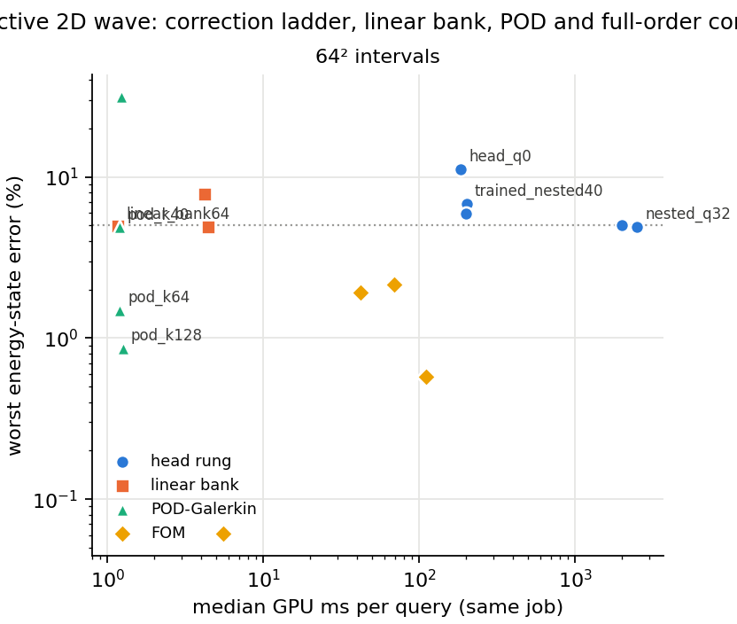
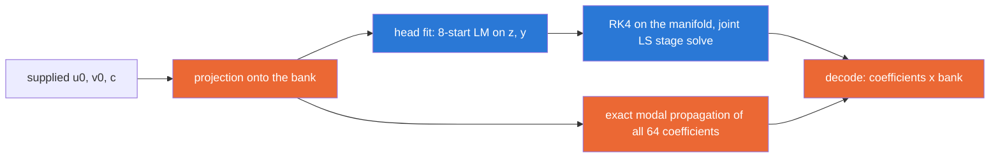

# w-ladder — reflective 2D wave: the correction ladder's top rung is the linear bank, and it is also the cheapest point

What the accuracy–cost curve over correction rank $q$ looks like on the reflective 2D wave from one frozen learned bank and one frozen head, with POD-Galerkin and full-order controls in the same job at each mesh. Numbers are **final for the development cohort listed** (the sealed final cohort was not opened); every table is generated from `artifacts/<attempt>/result.json` by `generate_w_ladder.py`. Pre-registration: `DESIGN.md`. Meshes reported: 64².

## The answer, up front

| mesh | cheapest head rung | top rung `linear_bank64` | top rung vs cheapest head | POD at matched rank 64 | direct DST FOM | degenerate curve (D1-D4) |
|---|---|---|---|---|---|:---:|
| 64² | `head_q0` 11.2055 % at 184.535 ms | 4.9323 % at 1.168 ms | 158× cheaper and 2.27× more accurate | 1.4893 % at 1.202 ms | 0.0000 % at 3.391 ms | **True** |

The top rung of the correction ladder — the full learned bank evolved linearly, with no head — is at every mesh both the most accurate rung (within the integrator tie band of DESIGN §10 A2) and by two orders of magnitude the cheapest, so the accuracy-cost curve over correction rank $q$ is degenerate, as it is on heat. No ROM arm beats the direct full-order solver on accuracy, and POD-Galerkin at the same rank as the learned bank is reported beside it.

## 64² intervals — attempt `wl64b`, job 3780447, NVIDIA A100 80GB PCIe, source `0bb3cc86e7401024838e0949d86e87bf5add3bab`

Cases: 8 development cases (opened [0, 1, 2, 3], fresh_development [0, 1, 2, 3]); 3 timed repetitions per arm and case, all retained. Retained-value gates: 30 checks, all passed = True. Independent NumPy audit: max error recomputation difference 8.88e-16, reference regeneration 5.62e-15, passed = True.

### Verdict (pre-registered §4)

| D1 accuracy (tie band δ) | D1 strict | δ (pp) | D2 cost ≤ 0.1× | head_q0 / bank-RK4 cost ratio | D3 singleton non-dominated | D4 energy certificate | all | H-mono ladder |
|---|---|---:|---|---:|---|---|---|---|
| True | False | 0.0195 | True | 41.6 | True | True | **True** | True |

Non-dominated set, ROM rungs and controls only: `linear_bank64`, `pod_k40`, `pod_k64`, `pod_k128`. Including full-order solvers: `linear_bank64`, `pod_k40`, `pod_k64`, `pod_k128`, `dst`.

### Ladder table (worst over cases of the time-maximum error; medians over all timed repetitions)

| arm | family | q / k′ | dim | worst energy-state % | median energy-state % | worst u % | worst v % | worst current-rel u / v % | t=0 energy-state % | evolved-times energy-state % | GPU ms | complete ms | evolution ms | outliers | reduced-energy drift | physical energy drift | completed / stationary / fallbacks | all-state 5 % |
|---|---|---:|---:|---:|---:|---:|---:|---|---:|---:|---:|---:|---:|---:|---|---|---|:---:|
| `head_q0` | head rung | 0 | 32 | 11.2055 | 5.6212 | 3.6973 | 8.7840 | 6.3109 / 15.2601 | 5.5314 | 11.2055 | 184.535 | 185.575 | 163.489 | 0 |  | 5.31e-05 | True / True / 0 | fail |
| `trained_nested40` | head rung | 8 | 40 | 6.8128 | 4.2213 | 1.9547 | 5.1287 | 3.6187 / 8.9099 | 4.7478 | 6.8128 | 200.232 | 201.072 | 174.402 | 0 |  | 5.41e-05 | True / True / 0 | fail |
| `nested_q8` | head rung | 8 | 40 | 5.9379 | 3.6820 | 1.6723 | 4.2347 | 3.7750 / 6.8809 | 3.7715 | 5.9379 | 199.289 | 200.375 | 174.425 | 0 |  | 5.36e-05 | True / True / 0 | fail |
| `nested_q16` | head rung | 16 | 48 | 5.0053 | 3.2606 | 1.4272 | 3.6033 | 2.8124 / 6.0837 | 2.5994 | 5.0053 | 1977.402 | 1978.383 | 1949.469 | 0 |  | 5.38e-05 | True / True / 7688 | fail |
| `nested_q32` | head rung | 32 | 64 | 4.9161 | 3.0078 | 1.3261 | 3.4796 | 2.6815 / 6.3966 | 2.0345 | 4.9161 | 2500.060 | 2501.038 | 2461.707 | 0 |  | 5.42e-05 | True / True / 7688 | pass |
| `linear_bank64` | linear bank | 64 | 64 | 4.9323 | 3.0176 | 1.3306 | 3.4920 | 2.6913 / 6.4049 | 2.0345 | 4.9323 | 1.168 | 1.986 | 0.720 | 0 | 1.20e-14 | 1.78e-15 | True / True / 0 | pass |
| `linear_bank64_cn` | linear bank | 64 | 64 | 7.8771 | 6.5234 | 3.2107 | 6.4780 | 6.0237 / 11.2539 | 2.0345 | 7.8771 | 4.208 | 5.043 | 3.767 | 0 | 1.46e-13 | 1.45e-13 | True / True / 0 | fail |
| `linear_bank64_rk4` | linear bank | 64 | 64 | 4.9129 | 3.0056 | 1.3252 | 3.4774 | 2.6799 / 6.3952 | 2.0345 | 4.9129 | 4.433 | 5.738 | 3.978 | 0 | 5.74e-05 | 5.74e-05 | True / True / 0 | pass |
| `pod_k16` | POD-Galerkin | 16 | 16 | 31.4920 | 25.3391 | 18.2022 | 27.2494 | 35.7771 / 55.6697 | 23.9119 | 31.4920 | 1.225 | 2.026 | 0.771 | 0 | 3.33e-15 | 3.77e-15 | True / True / 0 | fail |
| `pod_k40` | POD-Galerkin | 40 | 40 | 4.8825 | 2.4099 | 1.5546 | 4.1290 | 3.3397 / 6.8962 | 4.2685 | 4.8825 | 1.190 | 1.989 | 0.728 | 0 | 8.99e-15 | 3.33e-15 | True / True / 0 | pass |
| `pod_k64` | POD-Galerkin | 64 | 64 | 1.4893 | 0.9582 | 0.4499 | 1.3733 | 0.8964 / 2.3097 | 1.4709 | 1.4893 | 1.202 | 2.018 | 0.744 | 0 | 1.30e-14 | 2.22e-15 | True / True / 0 | pass |
| `pod_k128` | POD-Galerkin | 128 | 128 | 0.8668 | 0.5016 | 0.1345 | 0.6355 | 0.2574 / 1.3699 | 0.4932 | 0.8668 | 1.252 | 2.052 | 0.767 | 0 | 1.67e-14 | 3.33e-15 | True / True / 0 | pass |
| `dst` | FOM |  |  | 0.0000 | 0.0000 | 0.0000 | 0.0000 | nan / nan | 0.0000 | 0.0000 | 3.391 | 4.286 | 2.987 | 0 |  | 8.88e-16 | True / True / 0 | pass |
| `rk4_fom` | FOM |  |  | 0.0612 | 0.0293 | 0.0047 | 0.0445 | 0.0080 / 0.0924 | 0.0000 | 0.0612 | 5.511 | 6.865 | 5.494 | 0 |  | 6.68e-06 | True / True / 0 | pass |
| `cg_1e-06` | FOM |  |  | 0.5745 | 0.4810 | 0.2195 | 0.4385 | 0.4005 / 0.7804 | 0.0000 | 0.5745 | 109.836 | 111.350 | 109.830 | 0 |  | 5.56e-07 | True / True / 0 | pass |
| `cgdt_0.005_tol_1e-06` | FOM |  |  | 2.1630 | 1.8479 | 0.8751 | 1.7306 | 1.5967 / 3.0065 | 0.0000 | 2.1630 | 69.374 | 70.843 | 69.369 | 0 |  | 2.69e-06 | True / True / 0 | pass |
| `cgdt_0.005_tol_0.01` | FOM |  |  | 1.9239 | 1.6369 | 1.2280 | 1.6163 | 2.7812 / 2.8750 | 0.0000 | 1.9239 | 41.894 | 43.349 | 41.889 | 0 |  | 3.22e-04 | True / True / 0 | pass |

### Three-layer decomposition (worst over cases; energy-state / displacement %)

| subject | layer | dim | worst energy-state % | worst displacement % | stationary fits |
|---|---|---:|---:|---:|---|
| `linear_bank64` | projection_floor | 64 | 2.3800 | 0.4200 |  |
| `pod_k16` | projection_floor | 16 | 27.2869 | 16.8312 |  |
| `pod_k40` | projection_floor | 40 | 4.3899 | 1.5546 |  |
| `pod_k64` | projection_floor | 64 | 1.4800 | 0.4499 |  |
| `pod_k128` | projection_floor | 128 | 0.5430 | 0.0886 |  |
| `head_q0` | best_found | 32 | 7.9142 | 2.5456 | 392/392 |
| `trained_nested40` | best_found | 40 | 5.8568 | 1.6627 | 392/392 |
| `nested_q8` | best_found | 40 | 5.2490 | 1.3926 | 392/392 |
| `nested_q16` | best_found | 48 | 3.6592 | 0.9697 | 392/392 |
| `nested_q32` | best_found | 64 | 2.3800 | 0.4200 | 392/392 |
| `head_q0` | solved | 32 | 11.2055 | 3.6973 | |
| `trained_nested40` | solved | 40 | 6.8128 | 1.9547 | |
| `nested_q8` | solved | 40 | 5.9379 | 1.6723 | |
| `nested_q16` | solved | 48 | 5.0053 | 1.4272 | |
| `nested_q32` | solved | 64 | 4.9161 | 1.3261 | |

### Consistency checks (relative max-abs coefficient discrepancy over all observation times; reported, not gated)

| case | nested_q8_vs_trained_nested40 | nested_q32_vs_linear_bank64_rk4 | linear_bank64_rk4_vs_linear_bank64 | linear_bank64_cn_vs_linear_bank64 |
|---|---|---|---|---|
| opened_0 | 1.47e-02 | 2.07e-05 | 8.03e-05 | 3.09e-02 |
| opened_1 | 2.65e-02 | 5.35e-05 | 2.33e-04 | 6.16e-02 |
| opened_2 | 3.76e-02 | 3.42e-05 | 2.35e-04 | 5.46e-02 |
| opened_3 | 1.66e-02 | 1.66e-05 | 9.18e-05 | 3.26e-02 |
| fresh_development_0 | 1.68e-02 | 2.82e-05 | 1.76e-04 | 4.96e-02 |
| fresh_development_1 | 1.90e-02 | 5.99e-05 | 2.00e-04 | 5.06e-02 |
| fresh_development_2 | 2.14e-02 | 4.27e-05 | 1.52e-04 | 4.72e-02 |
| fresh_development_3 | 2.10e-02 | 2.05e-05 | 8.39e-05 | 3.10e-02 |

POD from 6272 training snapshots at 256²; captured snapshot energy fraction: k′=16: 0.972353, k′=40: 0.999609, k′=64: 0.999937, k′=128: 0.999994. Mesh audits: bank orthogonality 3.4e-15, POD orthogonality 5.4e-15, sine-mode transfer error 0.0e+00, POD K min eigenvalue 19.735.

## Glossary

- **arm / subject:** one method configuration timed and scored in the job.
- **head rung:** the frozen nonlinear head (32 latent coordinates) plus $q$ appended linear correction directions; `head_q0` is $q=0$, `trained_nested40` the retained $q=8$ selection with scaled directions, `nested_q*` the same construction with orthonormal directions.
- **linear bank:** all 64 bank coefficients evolved by the exact (Galerkin-projected) wave operator with no head; `_cn` / `_rk4` are time-stepped variants at the head’s step.
- **POD-Galerkin, k′:** the classical snapshot basis of rank k′ from the same training data, evolved the same way.
- **FOM:** full-order solver on the same grid: `dst` direct exact, `rk4_fom` explicit, `cg_*` implicit-midpoint conjugate gradient at the named tolerance and step, `dst_coarse64` the 64² direct solve interpolated up.
- **q / k′ / dim:** correction count / POD rank / number of internal configuration coordinates.
- **worst / median energy-state %:** over cases, the time-maximum combined displacement-gradient and velocity error scaled by the initial phase energy; the all-state target is 5 % on energy-state, u and v together.
- **worst u / v %:** displacement error scaled by the initial displacement norm; velocity error scaled by the initial phase energy. Current-relative variants divide by the reference norm at that time.
- **t=0 energy-state %:** the error of the returned initial state alone (the compression of the supplied field).
- **GPU ms / complete ms / evolution ms:** median over all repetitions of the device-resident query, of the query plus host output transfer, and of the evolution component alone.
- **outliers:** repetitions slower than twice the median.
- **reduced-energy drift:** maximum relative change of the reduced energy computed from the coefficient trajectory; **physical energy drift:** the same for the returned fields relative to their own initial state.
- **completed / stationary / fallbacks:** every step valid; every initial fit met the stopping rule; number of guarded-Cholesky fallbacks to QR.
- **projection floor / best-found / solved:** error of the best linear projection onto the subspace / of the best manifold fit to the truth at each time / of the evolved ROM.
- **non-dominated set:** arms no other arm beats on both worst energy-state error and GPU ms.
- **D1–D4, H-mono:** the pre-registered criteria of `DESIGN.md` §4.
- **consistency checks:** agreement between arms that should coincide mathematically (same manifold in different coordinates; the $q=32$ rung against the RK4-stepped bank; the stepped bank against exact modal propagation).
- **development cohort:** cases opened for design; the final paper cohort stays sealed.
