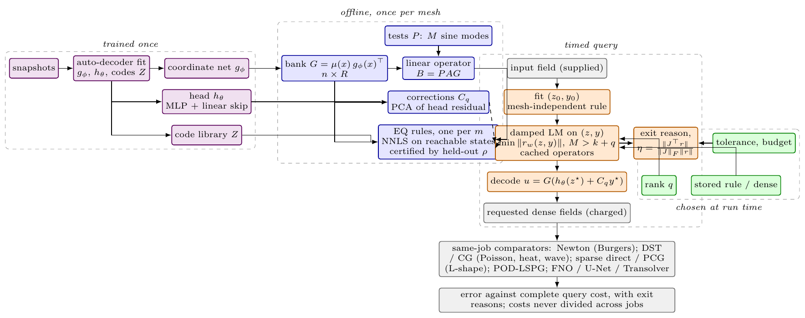

# Tunable Non-linear Manifold ROMs for Elliptic, Parabolic, and Hyperbolic PDEs via Matrix-Free Petrov--Galerkin Projection

*Anonymous submission to ICLR 2027. Every number below is generated from run records by `gen_tables.py`; tables are inlined from `tables-md/` behind an HTML comment naming their id; **[PENDING: …]** marks a lane that has not landed.*

*Status for the reader (generated 2026-09-21 18:59; this block is removed before submission).*
*Populated tables (93): T00, T01, T01b, T02, T02b, T02c, T03, T03b, T03c, T03m, T03mb, T03mc, T04, T04b, T04m, T05, T05b, T05c, T05m, T06a, T06b, T07, T08, T08b, T09, T09b, T09c, T09c, T09d, T10, T11a, T11b, T11c, T11d, T11e, T11f, T11g, T11h, T11i, T12, T12b, T13, T13b, T14, T14b, T14c, T14d, T15, T16, T17, T18a, T18b, T18c, T18d, T18m, T19, T20, T20b, T21, TC, TC, TC, TC, TC, TC, TC, TC, TC, TH, TH, TH, TH, TH, TH, TH, TH, TH, TH, TR, TR, TR, TR, TR, TR, TR, TR, TR, TR, TR, TR, TR, TR, TR. Populated does not mean final: the three-dimensional appendix is provisional development evidence.*
*Pending cells: none. Active experiment status is recorded in the canonical LAB-LOG.md; this manuscript uses a frozen evidence snapshot.*
*The sealed cohort (T13, b-seeds job 3804465) is the headline for the scheduled ladder; T12 is the development-cohort seed table; the two top EQ rungs are single-draw rules, never certified.*
*Open decisions for the user: (1) the headline Burgers metric, worst over evolved times or worst over all times, both printed everywhere, and now decisive for §5.1 at 1024², where reduced rungs are non-dominated on the evolved metric only because the t=0 compression bounds all-times; (2) sign-off on the abstract's new opening two sentences (resolution-knob framing), which are provisionally accepted and unchanged in this pass.*
*Abstract: the readability pass's Abstract A (<= 250 words) with first-use glosses; the previous 397-word abstract and Abstract B (~200 words, one line shorter) are in ABSTRACT-2026-09-17.md for the user to pick.*
*Changed in this pass: b-panel closed (bpn301 replaces bpn101 at 256², bpn203 adds 1024²); L-shape closed at 512² and now in the abstract; b-qxm pin at 4b9723e8 dropped after the lane committed its regeneration (no number in §5.2 moved); three seeds landed on the development cohort; Figure 2 moved into §3.2 beside the equation it draws; the sealed cohort landed (be9415ab): sealed values replace the development q=0 incumbent value as the headline, the wrong-branch cold start at q=0 is a stated failure mode.*

## Abstract

Learned PDE surrogates such as Fourier Neural Operators and DeepONets
typically deliver one (accuracy, speed) operating point per trained
model; moving it generally requires retraining. We present a
nonlinear-manifold reduced-order model (NM-ROM) for Poisson, heat and
viscous Burgers equations that exposes a deployment-time accuracy–speed
tradeoff from a single trained decoder, controlled at inference time by
the correction rank $q$ (accuracy) and the solver tolerance, budget and
empirical-quadrature rule (cost). The framework combines a frozen coordinate-network spatial
bank with a small nonlinear head and nested correction directions; exact
Dirichlet enforcement by a vanishing factor in the bank; least-squares
Petrov–Galerkin projection of the discrete residual onto fixed weak
tests, with every linear operator preassembled; matrix-free JAX
evaluation; and NNLS empirical quadrature for the Burgers advection,
validated on held-out reached states. Across Poisson in two and three
dimensions, and heat and viscous Burgers in two, at meshes up to $4096^2$,
the same frozen model keeps its accuracy as the two-dimensional mesh is
refined, so its speedup over the named iterative solvers grows with
resolution, reaching $\nHiresPoissonAccSFortyNinetySix\times$ at
$\nHeadPoissonAccErr %$ error against conjugate gradients on Poisson,
$\nHeatWideAccS\times$ at $\nHeatWideAccErr %$ against Crank–Nicolson
CG on a sealed held-out heat cohort, and $\nBurgDevAccSFortyNinetySix\times$ at
$\nBurgDevAccErrFortyNinetySix %$ on Burgers against Newton–BiCGStab
($\nBurgHoldAccSFortyNinetySix\times$ at
$\nBurgHoldAccErrFortyNinetySix %$ on held-out cases); at matched latent
dimension its fast setting is far more accurate than a reproduced
shallow-masked-autoencoder NM-ROM and POD-LSPG. The named solvers remain
more accurate at their tolerances, and three-dimensional Burgers and
heat, Navier–Stokes and full-state waves miss their targets.

## 1 Introduction

<!-- section sources: b-qxm analysis.json; b-eqtop summary.json; mesh-ladder json; b-panel summary.json -->

Neural operators for partial differential equations (PDEs)
(Li et al., 2021; Lu et al., 2021; Kovachki et al., 2023) typically
deliver one (accuracy, wall-clock) operating point per trained model,
with no deployment-time knob to trade compute for accuracy; moving the
point generally requires retraining. Full-order methods (FOMs) solved
with iterative solvers such as conjugate gradients
(HestenesStiefel1952CG, ?) expose this knob through their tolerance,
but their cost grows with the mesh. Reduced-order models (ROMs) approach
the problem from the opposite direction: linear projection-based ROMs
(Benner et al., 2015; Sirovich, 1987) can require many basis
functions for moving fronts (Cohen & DeVore, 2015), and
nonlinear-manifold ROMs (NM-ROMs) learn a more compact representation
(Lee & Carlberg, 2020; Kim et al., 2022), but their online nonlinear
solve can offset the benefit of fewer unknowns. The key open question is thus:
*can one trained NM-ROM give a deployment-time accuracy–cost
choice, keep its accuracy as the mesh is refined, and be faster than
named iterative full-order solvers while being more accurate than prior
nonlinear-manifold ROMs?*

This paper answers that question largely affirmatively for
two-dimensional Poisson, heat and viscous Burgers. We present an NM-ROM
whose distinguishing property is a deployment-time accuracy–cost choice
from a single trained model. It represents the solution by a learned
spatial bank multiplied by a nonlinear map of latent variables,
augmented with nested, precomputed correction directions: activating
more directions enlarges the trial space without changing the learned
weights. The correction rank is the accuracy control; stopping
tolerances and empirical quadrature set the cost of the solve. All
online coefficients come from the weak PDE residual, without access to
the reference solution. The accurate error
(Table 1)
stays near its coarse-mesh level up to $4096^2$ while the speedup over
the named solver grows, and on held-out Burgers cases the model is far
more accurate than a reproduced NM-ROM and POD-LSPG
(Table 2). It is not yet so for
three-dimensional Burgers and heat, Navier–Stokes or the full wave
state (Table 3).

**Contributions.**

1. **A tunable NM-ROM with a deployment-time accuracy/speed
tradeoff from a single trained model.**
Nested correction directions provide discrete deployment settings that
change approximation capacity without retraining. We isolate correction
rank at fixed residual test count and separately evaluate a prescribed
test-count schedule across seeds and held-out cases.
2. **Architectural choices that make this tradeoff achievable.**
A learned spatial bank, a nonlinear head with a linear skip, and nested
corrections support compact latent solves, boundary enforcement and
node-local evaluation.
3. **A matrix-free JAX implementation that makes the framework
practical.** With precomputed linear operators, matrix-free
differentiation and validated empirical quadrature, query time grows
more slowly with the mesh than the named solvers': the accurate setting reaches
$\nHeadPoissonAccErr %$ on Poisson at
$\nHiresPoissonAccSFortyNinetySix\times$ the speed of CG, and
$\nBurgDevAccErrFortyNinetySix %$ on Burgers at
$\nBurgDevAccSFortyNinetySix\times$ that of Newton–BiCGStab, at $4096^2$
in the same allocation.

## 2 Related Work

<!-- section sources: none (prose only) -->

**Linear and non-linear manifold ROMs.**
Linear ROMs approximate solutions in a fixed subspace
(Benner et al., 2015; Sirovich, 1987); moving fronts can
require a large basis (Cohen & DeVore, 2015; GreifUrban2019, ?).
Nonlinear-manifold ROMs combine learned representations with residual
projection (Lee & Carlberg, 2020; Kim et al., 2022), including quadratic
manifolds (Geelen et al., 2022; Barnett & Farhat, 2022), neural-field
representations (KimWenLeeChoiCNFROM2024, ?) and adaptive bases
(Peherstorfer & Willcox, 2015; Carlberg, 2015).
Least-squares Petrov–Galerkin projection
(Carlberg et al., 2011) and preassembly of reduced operators
( Stef anescu & Sandu, 2014; Weder et al., 2024) are established
components. We differ from these by a coordinate-network bank with an
exact boundary factor, a head with a linear skip, and nested corrections
selected after training that give deployment-time settings from one
trained model, as runtime-tunable networks do
(YuSlimmable2019, ?; Cai2020OnceForAll, ?).

**Neural operators and hyper-reduction.**
FNO (Li et al., 2021), DeepONet (Lu et al., 2021), U-Net
(Ronneberger et al., 2015; Takamoto et al., 2022) and Transolver
(WuTransolver2024, ?) learn solution maps. Their evaluation resolution
or inference procedure can also change accuracy and cost; our mechanism
instead changes the trial space used to solve the PDE. Empirical
quadrature (Hern'andez et al., 2017; Yano & Patera, 2019) reduces nonlinear
residual evaluation through non-negative weights. We retain that
construction, testing its error on states reached by the solver and
through independent re-draws. The main iterative linear-system
comparator is conjugate gradient (HestenesStiefel1952CG, ?).

## 3 Methodology

<!-- section sources: none (prose only) -->

To answer this question, we turn a learned manifold into a practical
PDE solver through three components. First, a trial manifold whose
decoder enforces Dirichlet conditions exactly and carries nested linear
correction directions (§3.1). Second, a
least-squares Petrov–Galerkin projection of the discrete residual onto
fixed weak tests (§3.2). Third, exact preassembly of
every linear term, with Empirical Quadrature for the Burgers advection
where validated (§3.3); §3.4 gives
the architecture.
Throughout, $u \in \mathbb{R}^{n}$ is the
full-order state on a uniform grid of $N$ intervals per axis,
$A \in \mathbb{R}^{n \times n}$ the discrete negative Laplacian; $R$ is the bank width, $k$ the latent dimension, $M$ the number
of weak tests and $m$ the number of quadrature nodes.
The formulas illustrate scalar Dirichlet problems;
Appendix A gives the per-PDE derivations (periodic vector
fields, time integrators) and exit codes, Figure 1 the data flow.

### 3.1 Trial Manifold with Exact Dirichlet Enforcement

<!-- section sources: none (prose only) -->

We train a decoder $\mathcal{D} : \mathbb{R}^k \to \mathbb{R}^n$, $k \ll n$, with
latent state $z$ and no encoder in the deployed path, separable into a
frozen spatial *bank* $G\in\mathbb{R}^{n\times R}$ times a small
neural *head* $h_\theta:\mathbb{R}^{k}\to\mathbb{R}^{R}$, $k\le R\ll n$, the bank
built once per mesh from a random-Fourier-feature coordinate network
$g_\phi$ (Tancik et al., 2020),

$$
G_{x,:} = \mu(x)\,g_\phi(x)^{\top},
  \qquad
  \mu(x) = 16\,x_1(1-x_1)\,x_2(1-x_2).
$$

<!-- equation (1) -->

On the two-dimensional square the smooth vanishing factor $\mu$ of
(1), zero on the boundary $\Gamma$, is folded into every
column of the bank, so $\partial u/\partial z = 0$ on $\Gamma$ at every
resolution (homogeneous data only); the L-shape uses a distance-based
factor, the cube a scaled product factor, and periodic Navier–Stokes none
(§3.4).

**Nested correction directions.**

The deployed model augments the head's output with $q$ fixed directions
$C_q\in\mathbb{R}^{R\times q}$ and solves for the latent code and the
correction coefficients together,

$$
u(z,y) \;=\; G\big(h_\theta(z) + C_q\,y\big),
  \qquad z\in\mathbb{R}^{k},\; y\in\mathbb{R}^{q},\; 0\le q\le R .
$$

<!-- equation (2) -->

The columns of $C_q$ are chosen offline from training data; the
Burgers construction uses principal components of the head's coefficient
errors. Per-PDE constructions are stated in Appendix A.
The directions are ordered so that $C_{q}$ is a prefix of $C_{q'}$ for $q<q'$; the
ladder is nested and no rung needs retraining. At $q=0$ the model is the
frozen head; at $q=R$ the head is irrelevant and the representation is the full
linear span of the bank. For linear PDEs its coefficients can be found
by a reduced linear solve; for nonlinear PDEs the equations can remain
nonlinear even in this full-bank representation;
in between, $q$ moves the reachable set from the head's image towards
the bank's span, and the solved dimension from $k$ to $k+q$. Two consequences follow: the bank's projection error is a floor on the
achievable error whatever the head or the solver does, so nonlinearity
in $h_\theta$ buys a smaller *solved* dimension, not an escape from the
span; and all $x$-dependence factors through $G$, which makes node
sampling and exact preassembly available from one decoder.

### 3.2 Projecting the PDE onto the Manifold

<!-- section sources: none (prose only) -->

Each PDE we consider gives a discretised residual $r(u)$ that
should vanish at the true solution. We substitute the trial manifold
$u(z,y)$ into $r$ and project onto a fixed, latent-independent
test space. On the Dirichlet square, $P\in\mathbb{R}^{M\times n}$
collects low-frequency tensor-product sine vectors, eigenvectors of the five-point
operator, $PA=\LambdaP$; the L-shape uses Lanczos
eigenvectors of its own operator. The reduced problem solved online
is

$$
(z^{\star},y^{\star})
  =
  \operatorname*{arg\,min}_{z,\,y}\;
  \tfrac12\,\lVert r_{w}(z,y) \rVert_2^2,
  \qquad
  r_{w}(z,y) = \Lambda_\star^{-1}\,P\,r\!\big(u(z,y)\big)
  \in\mathbb{R}^{M},
  \qquad M>k+q ,
$$

<!-- equation (3) -->

with a diagonal row scaling $\Lambda_\star$ stated per PDE in
Appendix A: a least-squares Petrov–Galerkin condition
with an explicit test space (Carlberg et al., 2011; Lee & Carlberg, 2020), not
tangent Galerkin, overdetermined rather than square, solved by a method
appropriate to each PDE's structure.

**Elliptic (Poisson).**
The Poisson residual is $r(u) = A u - f$, and projection gives
$r_{w}(z,y)=B_0(h_\theta(z)+C_q y)-b_0$, $B_0=PG$
(Appendix A.1); the projector onto
$\operatorname{range}(B_0C_q)$ does not depend on $z$, so $y$ is
eliminated exactly (Golub & Pereyra, 1973), the iteration stays
$k$-dimensional at every $q$, and $q=R$ is a linear solve.

**Parabolic (heat).**
The heat semi-discretisation $du/dt = -\kappa A u$ is advanced with
Crank–Nicolson; the reduced step substitutes the manifold into the fully
discrete equation *before* projecting and solves
$z_{n+1}=\operatorname*{arg min}_{z}\lVert B_0h_\theta(z)-D B_0h_\theta(z_n) \rVert_2$, with $D$ the diagonal Crank–Nicolson amplification of the tests (Appendix eq. (6))
(shown at $q=0$; with corrections see Appendix A.2), a nonlinear least-squares problem, not
a linear system; at $q=R$ the step is the linear recurrence
(Appendix eq. (8)). Reflective waves use an explicit latent
integration instead (Appendix A.4).

**Hyperbolic (Burgers).**
For $u_t+u(u_x+u_y)=\nu\Delta u$ with a sign-upwind stencil and backward
Euler (Appendix A.3) the weak residual is nonlinear
in the coefficients, so $y$ is not eliminated in closed form; we damp the
$(z,y)$ blocks separately inside one Levenberg–Marquardt step
(*block-damped* variable projection), which, in the recorded solver comparison, removes the joint LM
configuration's $6$ budget exits
(Table 18).

**Solver and exits.**
Each attempt solves the damped normal system
$(H+\lambda \operatorname{diag}(\operatorname{diag} H)) \delta=-g$, $H=J_{}\TJ_{}$,
$g=J_{}^{\top}r_{w}$, accepting the step only if it strictly decreases the
residual: damped Levenberg–Marquardt with a monotone test
(Marquardt, 1963). Three exit families are recorded and never conflated: the scale-free
stationarity measure
$\eta(z,y)=\lVert J_{}^{\top}r_{w} \rVert_2/(\lVert J_{} \rVert_{F}\lVert r_{w} \rVert_2)\le\eta_{\mathrm{tol}}$
\refstepcounter{equation}

(\theequation), a
residual threshold, and the stalls, reported as early-stopped, never as
converged. No query uses the solution it predicts: the elliptic solve starts from
the cached training code nearest the projected source; the heat and
Burgers queries start from nearest codes and fit $(z,y)$ to the
supplied initial field (Appendix A.6).

### 3.3 Hyper-reduction

<!-- section sources: none (prose only) -->

The non-linear manifold reduces the DOF count from $n$ to $k+q$, but a
projected term such as $P N(G c)$ still costs $O(n)$. For a fixed linear operator
the tested residual is exactly precomputable,
$P(A u-f)=B (h_\theta(z)+C_q y)-b$ with
$B=\Lambda PG=\Lambda B_0$ (the $B_0$ of §3.2 with its rows rescaled) assembled offline by the corresponding discrete transforms, so
linear terms are never approximated; the Burgers advection
$P N(G c)$ is the only term that resists preassembly, evaluated
*densely*, $O(nR)$ per residual, or on an *empirical quadrature*
rule of $m$ nodes (Hern'andez et al., 2017; Yano & Patera, 2019), $O(mR)$. The rule is a non-negative *per-node* weight vector, *independent
of the snapshot*, fitted by NNLS (Lawson & Hanson, 1974) to reproduce
the projected advection term at $n_{\rm fit}$ stored codes with a hard cap
of $m$ nodes (Appendix A.5); changing $m$ re-solves the
fit, rules are not nested, and deployment selects among stored rules. *A rule is never accepted on its NNLS fit residual*; we score it by
the held-out relative error $\rho$ of the projected advection term
(Appendix eq. (13)) over states the solver actually reaches on trajectories
disjoint from the fit and evaluation cases, against a primary bar
$\rho_{\max}\le0.116$ fixed before any certification job ran and a
tight bar $0.06$, and then re-draw the construction: a rule is
*confirmed* only if every re-draw passes
(Table 17).

### 3.4 Model Architecture

<!-- section sources: none (prose only) -->

Three properties of the problem motivate our architecture. First, every
query starts from stored training codes, never cold and without an
encoder (§3.2), and its iteration descends along the
head's Jacobian; this motivates a *linear skip*. Second, quadrature
evaluates the decoder only near sparse nodes, and one model serves every
mesh; this motivates a *coordinate-network bank*. Third, one model
must offer several accuracy–cost settings; this motivates
*nested corrections*.

**Linear skip, for the latent solve.**
$h_\theta(z)=\varphi_\theta(z)+W^{\top}z$, with
$\varphi_\theta$ an MLP with two hidden SiLU layers; the skip keeps a
latent-independent Jacobian component. Widths and $(k,R)$ are per family
(Table 6; three-dimensional sizes in Table 15). The skip is a design
choice, not ablated here.

**Coordinate-network bank, for node-local evaluation.** Every
Dirichlet bank is a coordinate network times a
vanishing factor: $\mu$ of (1) on the square, its product
form in 3D, a distance-based factor on the L-shape; some banks are
right-multiplied by a fixed orthonormalising matrix. The network's
parameters do not depend on the mesh, so a quadrature rule's support is
a cached block, and decoding in row blocks at large $n$ changes memory,
not the model. The periodic Navier–Stokes bank has no factor and a
global solenoidal projection.

**Nested corrections, for accuracy.** $C_q$ holds leading
singular directions of training coefficient residuals, nested in $q$.

**What is fixed, what is chosen, and how error is reported.**

Each row of Table 1 comes from one frozen model, named
by its problem label. Chosen at run time are $q$, the number of
tests $M$ (usually $M=4(k+q)$; fixed along the rank study of
Table 12 and on the L-shape), the quadrature, the
tolerance and budget, and for heat the stepping mode (Crank–Nicolson or
the batched exact-propagator fit).

The representation ablations distinguish three quantities: the *bank floor* (projection
error onto $\operatorname{range}G$), the *best-found* error (the
smallest any point of the augmented manifold attains, from a multistart
oracle) and the *solved* error the iteration returns.

## 4 Implementation

<!-- section sources: none (prose only) -->

\subsection{Matrix-free Projected Operators via JAX}
Every linear term is preassembled once per mesh as the $M\times R$
matrix $B$, so the online residual and Jacobian of a linear PDE are
$B (h_\theta(z)+C_q y)-b$ and $B [Dh_\theta C_q]$, with $Dh_\theta$
from a forward-mode Jacobian-Vector Product (Bradbury et al., 2018); the
sampled Burgers advection uses the cached stencil block. The damped
normal system is solved directly; no Krylov solve is applied to the
projected operator. The Burgers runs above $1024^2$ assemble the
Jacobian analytically, with the solver refinements of
Appendix A.3.

\subsection{Training Protocol}

The bank and the head are trained in two stages, both as auto-decoders:
the coordinate network $g_\phi$ is fitted to the training states through
(1), then frozen, and the head is fitted with a code library
$Z$ on the bank-projected states; $C_q$ is then constructed from training-only coefficient directions
as specified for each PDE. Sizes and cohorts
are in Appendix C; checkpoint hashes and
recorded offline costs are retained with the source evidence described there.

## 5 Experimental Setup and Benchmark Problems

<!-- section sources: none (prose only) -->

**Problems and references.**
The two-dimensional problems are Poisson on the square and on an
L-shaped domain, heat, viscous Burgers and reflective waves; the
three-dimensional problems are Poisson, heat, Burgers and incompressible
Navier–Stokes. Table 6 gives the two-dimensional meshes
and cohorts, Table 7 the sampled families and
Table 15 the three-dimensional configurations. Burgers
provides the correction-rank study.

**Accuracy.**
We report worst relative $L^2$ error over the stated cases and requested
times, in percent. Poisson uses the steady reference norm and heat the
current reference norm; Burgers and Navier–Stokes use the initial-field
norm over evolved times; waves use the energy-state error over
displacement and velocity. Same-grid error measures reduction
error relative to the converged discrete solution. Error against a
refined reference also includes discretisation error; the two are never
interchanged. Settings for a held-out (final) cohort are fixed before its
cases are accessed; all other cohorts are development cohorts.

**Timing and speedup.**
Every accuracy–runtime pair comes from the same solver invocation.
We use double precision, GPU burn-in, synchronised timing and medians
of retained repetitions. GPU query time includes initialization, the
solve or rollout, and requested device outputs. Complete-query time
additionally includes host transfers and is labelled separately.
Training and compilation are offline costs. Speedup is
$S=T_{\mathrm{FOM}}/T_{\mathrm{method}}$ with both times from the same
allocation; each table names the FOM algorithm and shows its error.
Solves that miss their stopping rule are reported as such and do not
enter a speedup.

**Baselines.**
Linear problems are compared with conjugate gradients (CG), including the
L-shaped domain and the CG solve inside each Crank–Nicolson (CN) heat
step. Burgers is compared with Newton–BiCGStab and Navier–Stokes with
its CNAB2 time integrator. The named FOM of a row is that solver at its
fastest tested setting that is at least as accurate as the accurate
NM-ROM setting.

## 6 Numerical Experiments and Results

<!-- section sources: none (prose only) -->

Table 1 reports the headline comparison against the
named iterative solvers; the subsections that follow analyse the settings
behind it and which knob to turn.

### 6.1 Accuracy and Speed against Full-Order Solvers

<!-- section sources: none (prose only) -->

**Table 1.** NM-ROM against the named full-order solver at every measured
problem and mesh. **Both NM-ROM columns of a row come from one
frozen model**: *fast* is the uncorrected setting ($q=0$) and
*accurate* the selected accurate rank (Table 8); no network is
retrained between them. Error is the worst relative $L^2$ error over the
cohort (%). Speedup is the FOM's median time divided by the NM-ROM's in
the same GPU allocation, **bold** where the NM-ROM is faster. The
FOM is the named iterative solver at its fastest tested setting that is at
least as accurate as the accurate setting. $^{f}$ held-out final cohort
(all others development);
$^{r}$ error against a refined reference, which includes discretisation
error (all others same-grid); $^{t}$ all output times including
$t=0$; $^{e}$ evolved output times only; $^{c}$ complete-query time
with host transfers (all others GPU query; heat was measured in GPU query
only). Heat (wide bank) is a separately trained frozen model with a
128-function bank ($q=32$ accurate); over evolved times its accurate
error is $\nHeatWideAccEvolved %$ ($\nHeatWideBatchedAccEvolved %$
batched; the batched fit: Table 8). Burgers accurate
quadrature: $^{s}$ stored rule of job 3780164, not
confirmed on independent re-draws (it fails the confirmation draw at
$256^2$ and passes \nEqcScaledPassFiveTwelve of
\nEqcScaledDrawsFiveTwelve draws at $512^2$; it is not the $q=256$
rule of Table 17); $^{\ell}$ deterministic
$63{\times}63$ lattice rule, marginal: it passes the re-draw check at
$2048^2$ by only $\nEqcLatMargin$ (confirmation $\rho_{\max}=\nEqcLatConfRho$
against the bar $\nEqcBar$); $^{v}$ rule confirmed on independent
re-draws by the pre-registered procedure ($1024^2$ with a thin margin,
confirmation $\rho_{\max}=\nEqcConfRhoTenTwentyFour$; none passes it at
$256^2$, Appendix C.1); $^{d}$ dense residual. The earlier Burgers model has one setting and
may exit on a stall; its rule-selected FOM is the relaxed Newton setting
($10^{-2}/0.5$), and its tight-setting ratio is in
Table 8 with the other rows' tight ratios; the
FOM setting can differ between meshes of a series. $^{h}$ 64 held-out cases never used for
selection (not the sealed final cohort); at $2048^2$ the development-chosen
$M=544$ setting was not run on them, so the $M=1088$ setting is shown. Poisson (dev. sources) rows use development sources of a
separate run and are not the held-out cohort. Dashes mark settings not
measured. Times, settings and complete-query speedups: Table 8.

<!-- table: TH_headline -->
| Problem | Mesh | Accurate err. (%) | Accurate speedup | Fast err. (%) | Fast speedup | FOM err. (%) | FOM |
| --- | --- | --- | --- | --- | --- | --- | --- |
| Poisson 2D (development) | 256^2 | 0.97 | **3.13×** | 3.16 | **3.33×** | 0.15 | CG, rtol 10^{-2} |
| Poisson 2D (development) | 1024^2 | 0.96 | **13.9×** | 3.15 | **15.2×** | 0.072 | CG, rtol 10^{-2} |
| Poisson 2D (development) | 2048^2 | 0.96 | **72.8×** | 3.15 | **74.3×** | 0.049 | CG, rtol 10^{-2} |
| Poisson 2D (development) | 4096^2 | 0.96 | **116×** | 3.15 | **117×** | 0.45 | CG, rtol 10^{-1} |
| Poisson, L-shape 2D (development) | 256^2 | 2.13 | **3.84×** | 3.86 | **4.04×** | 0.64 | CG, rtol 10^{-2} |
| Poisson, L-shape 2D (development) | 512^2 | 2.12 | **6.07×** | 3.85 | **6.18×** | 0.38 | CG, rtol 10^{-2} |
| Poisson, L-shape 2D (development) | 1024^2 | 2.20 | **8.38×** | 3.85 | **8.59×** | 1.05 | CG, rtol 3{\times}10^{-2} |
| Poisson, L-shape 2D (development) | 2048^2 | 2.20 | **17.0×** | 3.85 | **17.1×** | 0.76 | CG, rtol 3{\times}10^{-2} |
| Heat 2D (development; earlier checkpoint, one setting) | 64^2 | — | — | 4.56 | 0.22× | 1.59 | CN–CG, rtol 10^{-2} |
| Heat 2D (development; earlier checkpoint, one setting) | 256^2 | — | — | 4.56 | 0.61× | 0.93 | CN–CG, rtol 10^{-2} |
| Heat 2D (development; earlier checkpoint, one setting) | 1024^2 | — | — | 4.56 | **4.85×** | 0.77 | CN–CG, rtol 10^{-2} |
| Heat (wide bank) 2D (sealed held-out; opened once) | 1024^2 | 0.49 | **1.59×** | 1.36 | **1.57×** | 0.18 | CN–CG, \Delta t=0.05, rtol 10^{-3} |
| Heat (wide bank) 2D (sealed held-out; opened once) | 2048^2 | 0.49 | **9.74×** | 1.36 | **9.59×** | 0.18 | CN–CG, \Delta t=0.05, rtol 10^{-3} |
| Heat (wide bank) 2D (sealed held-out; opened once) | 4096^2 | 0.49 | **36.0×** | 1.36 | **35.4×** | 0.47 | CN–CG, \Delta t=0.05, rtol 10^{-2} |
| Heat (wide bank, batched fit) 2D (sealed held-out; opened once) | 1024^2 | 0.49 | **13.9×** | 1.36 | **13.0×** | 0.18 | CN–CG, \Delta t=0.05, rtol 10^{-3} |
| Heat (wide bank, batched fit) 2D (sealed held-out; opened once) | 2048^2 | 0.49 | **60.0×** | 1.36 | **57.0×** | 0.18 | CN–CG, \Delta t=0.05, rtol 10^{-3} |
| Heat (wide bank, batched fit) 2D (sealed held-out; opened once) | 4096^2 | 0.49 | **103×** | 1.36 | **101×** | 0.47 | CN–CG, \Delta t=0.05, rtol 10^{-2} |
| Burgers 2D (development) | 256^2 | 0.51^{s} | 0.043× | 1.89 | 0.79× | 0.049 | Newton–BiCGStab, tol 10^{-3} |
| Burgers 2D (development) | 512^2 | 0.55^{s} | 0.068× | 2.14 | **1.31×** | 0.052 | Newton–BiCGStab, tol 10^{-3} |
| Burgers 2D (development) | 1024^2 | 0.59^{d} | 0.0037× | 2.29 | **2.02×** | 0.034 | Newton–BiCGStab, tol 10^{-4} |
| Burgers 2D (development; 6 cases, arm chosen here) | 2048^2 | 0.87^{\ell} | 0.99× | 2.37 | **4.16×** | 0.049 | Newton–BiCGStab, tol 3{\times}10^{-3} |
| Burgers 2D (development; 6 cases, arm chosen here) | 4096^2 | 0.60^{\ell} | **4.87×** | 2.41 | **12.9×** | 0.050 | Newton–BiCGStab, tol 3{\times}10^{-3} |
| Burgers (held-out cases) 2D (held-out; 64 cases, one timing repetition) | 2048^2 | 1.31^{\ell} | **1.43×** | 9.03 | **5.63×** | 0.13 | Newton–BiCGStab, tol 10^{-3} |
| Burgers (held-out cases) 2D (held-out; 64 cases, one timing repetition) | 4096^2 | 1.33^{\ell} | **5.38×** | 9.03 | **13.2×** | 0.14 | Newton–BiCGStab, tol 3{\times}10^{-3} |
| Burgers, confirmed rule 2D (development; re-drawn quadrature rule) | 512^2 | 0.56^{v} | 0.091× | 2.14 | 0.75× | 0.050 | Newton–BiCGStab, tol 3{\times}10^{-3} |
| Burgers, confirmed rule 2D (development; re-drawn quadrature rule) | 1024^2 | 0.59^{v} | 0.32× | 2.29 | **1.39×** | 0.048 | Newton–BiCGStab, tol 3{\times}10^{-3} |
| Burgers (earlier model) 2D (development; earlier model, stalled exits permitted) | 1024^2 | — | — | 3.91 | **1.63×** | 2.39 | Newton–BiCGStab, relaxed |
| Burgers (wider learned bank), held-out 64 2D | 2048^2, 4096^2 | results incoming |  |  |  |  | lane burgers-heldout |
| Poisson 3D (accepted final) | 32^3 | 0.26 | 0.94× | 1.40 | 0.99× | 0.16 | CG, rtol 10^{-2} |
| Poisson 3D (accepted final) | 64^3 | 0.26 | **1.33×** | 1.39 | **1.38×** | 0.11 | CG, rtol 10^{-2} |
| Poisson (dev. sources) 3D (development) | 128^3 | 0.16 | **6.75×** | 0.55 | **6.98×** | 0.075 | CG, rtol 10^{-2} |
| Poisson (dev. sources) 3D (development) | 256^3 | 0.16 | **23.2×** | 0.55 | **23.7×** | 0.049 | CG, rtol 10^{-2} |
| Heat 3D (wider bank) 3D | 64^3, 128^3 | results incoming |  |  |  |  | lane heat3d-bank |

**Linear problems.**
On Poisson the accurate setting reaches $\nHeadPoissonAccErr %$ error and
is $\nHeadPoissonAccS\times$ faster than CG at $\nHeadPoissonMesh$; the
corrections cost little speed because they are eliminated analytically
(§3.2). The error stays at $\nHeadPoissonAccErr %$ up
to $4096^2$ while the GPU-query speedup rises to
$\nHiresPoissonAccSFortyNinetySix\times$. On the
L-shaped domain the accurate setting is
$\nHeadLshapeAccS\times$ faster at $\nHeadLshapeAccErr %$. The earlier
heat checkpoint crosses CG between $256^2$ and $1024^2$ ($\nHeadHeatFastS\times$
at $1024^2$). A wider heat bank, evaluated once on a sealed held-out
cohort at every mesh, reaches $\nHeatWideAccErr %$ over all times and is
$\nHeatWideAccS\times$ faster than CN–CG at $4096^2$
($\nHeatWideBatchedAccS\times$ with the batched fit). In three dimensions the held-out Poisson cohort gives
$\nHeadPoissonThreeAccErr %$ at $\nHeadPoissonThreeAccS\times$.

**Burgers.**
The reduced solve costs the same at every mesh, so the fast setting
overtakes Newton–BiCGStab by $1024^2$ ($\nHeadBurgersFastS\times$
faster at $\nHeadBurgersFastErr %$ error). The accurate
setting reaches $\nHeadBurgersAccErr %$ at $256^2$ and, on development
cases, is slower than the FOM through $2048^2$, also with the rules
confirmed on independent re-draws at $512^2$ and $1024^2$ (rows marked
$^{v}$); the dense $1024^2$ panel row's stored $q=128$ rule gives
$\nHeadBurgersMidErr %$ at $\nHeadBurgersMidS\times$. At $4096^2$ the accurate setting chosen on six development cases
reaches $\nBurgDevAccErrFortyNinetySix %$ and is
$\nBurgDevAccSFortyNinetySix\times$ faster than the fastest Newton setting
at least as accurate; on 64 held-out cases the same setting gives
$\nBurgHoldAccErrFortyNinetySix %$ at
$\nBurgHoldAccSFortyNinetySix\times$ (audit note in
Appendix C.1); a re-timing with a wider-margin
quadrature rule (first step exact) and a wider, held-out-tested bank are in progress (results
incoming).

**Resolution.**
Table 1 shows that the NM-ROM query time grows more
slowly with the mesh than the iterative FOM's: in every series the
fast-setting speedup rises with resolution against the FOM setting
selected per row (fastest tested setting at least as accurate as the
accurate NM-ROM; it may change with the mesh), and against one fixed
tight setting where a series timed one (Table 8).

**Table 2.** Other nonlinear-manifold ROMs on the shared Burgers 2D family at
$256^2$ and $512^2$: worst and median evolved same-grid error over 32
validation cases (never used for any choice) and compiled-query memory,
one allocation. Latent dimension is matched for
the baselines and our fast setting; our accurate setting solves
$k+q=272$ unknowns. The shallow masked-autoencoder NM-LSPG of
Kim et al. (2022) passed its reproduction gate, on their own 2D
Burgers benchmark (their Sec. 6.2), on the third of three pre-registered
attempts (\nBaseGateAct activation; median
$\nBaseGateMedian %$ against a $\nBaseGateBar %$ bar; published
${<}\nBaseGatePublished %$); its hyper-reduction was not reproduced,
and its published encoder width ($2n$) needs $\nBaseEncoderNeedGB$ GB
to train at $256^2$ and $\nBaseEncoderNeedGBFiveTwelve$ GB at $512^2$,
beyond the $\nBaseDeviceGB$ and $\nBaseDeviceGBFiveTwelve$ GB devices;
at $512^2$ its encoder, capped at width $\nBaseKimWidth$, trained only
$\nBaseKimEpochs$ epochs in its $\nBaseKimWall$ s budget, so those errors
partly reflect a training-time limit. Data-matched:
trained on our bank's \nBaseDataMatched trajectories. The
convolutional-autoencoder NM-ROM (Lee & Carlberg, 2020) was not run.
No times: every row, ours included, uses a dense residual
(Table 1, Table 11).

<!-- table: TH_nmrom_baselines -->
| Method | Unknowns | 256^2 worst (%) | 256^2 median (%) | 256^2 MB | 512^2 worst (%) | 512^2 median (%) | 512^2 MB |
| --- | --- | --- | --- | --- | --- | --- | --- |
| Kim et al. NM-LSPG | 8 | 163.93 | 43.34 | 2480 | 175.71 | 55.48 | 9959 |
| Kim et al. NM-LSPG | 16 | 145.40 | 43.87 | 2567 | 174.99 | 58.56 | 10511 |
| Kim et al. NM-LSPG | 32 | 127.51 | 43.61 | 2742 | 252.33 | 56.72 | 10879 |
| Kim et al. NM-LSPG, data-matched | 16 | 120.33 | 38.71 | 2567 | — | — | — |
| POD-LSPG | 8 | 55.52 | 22.72 | 18 | 55.82 | 24.08 | 71 |
| POD-LSPG | 16 | 41.53 | 10.45 | 30 | 42.01 | 13.83 | 122 |
| POD-LSPG | 32 | 24.78 | 5.65 | 55 | 25.63 | 7.74 | 222 |
| This work, fast (q=0, k=16) | 16 | 6.79 | 0.66 | 625 | 7.72 | 0.69 | 2368 |
| This work, accurate (q=256, k=16) | 272 | 0.88 | 0.089 | 1769 | 1.05 | 0.080 | 6891 |

On 32 validation Burgers cases at $256^2$ and $512^2$
(Table 2) our fast setting, at matched latent
dimension, reaches worst errors of
$\nBaseOursFastWorst %$, against $\nBaseKimRange %$ for the
reproduced shallow masked-autoencoder NM-ROM and $\nBasePodRange %$
for POD-LSPG; the accurate setting, at 272 solved unknowns, reaches
$\nBaseOursAccWorst %$.

**Where the method currently fails.**

Table 3 collects the four problems that miss their
targets; they are excluded from Table 1. On
three-dimensional Burgers the corrections cut the held-out worst error
from $\nFailBurgersQzero %$ to $\nFailBurgersAcc %$, but the FOM is faster,
and the refined-reference check fails, so only
same-grid reduction error is established. On three-dimensional
Navier–Stokes the corrections lower the worst error only from
$\nFailNsQzero %$ to $\nFailNsAcc %$; \nFailNsFailing of
\nFailNsCases held-out cases miss the $\nFailNsTarget %$ target. On reflective waves the fast setting is faster than
CG but its energy-state error, which includes velocity, is
$\nFailWaveQzero %$; corrections bring it to $\nFailWaveAcc %$, still
above CG's, at a cost that removes the speedup. Three-dimensional heat
reaches $\nFailHeatThreeEvolved %$ over evolved times ($32^3$/$64^3$
records hold no other convention) but $\nFailHeatThreeAll %$ with $t=0$
at $128^3$; it is slower than CN–CG with Crank–Nicolson stepping up to
$128^3$ and faster at $256^3$ (16 cases) and with the batched fit
(Table 10), but misses the all-times target. The
three-dimensional solves evaluate the residual densely. A wider
three-dimensional heat bank is in progress (results incoming).

**Table 3.** Problems on which the method misses its target: Navier–Stokes
$\nFailNsTarget %$ per held-out case; heat 1 % over all output times;
wave, an energy-state error within that of CG; Burgers 3D, faster than the
FOM at its accuracy (no numeric error target was recorded). Error is the
worst same-grid relative $L^2$ error (%) over evolved times, except the
Heat 3D $128^3$ rows (all output times including $t=0$); the wave
error is the energy-state error over displacement and velocity.
Speedup is against the named FOM in the same allocation.

<!-- table: TH_failures -->
| Problem | Setting | NM-ROM err. (%) | FOM err. (%) | Speedup | FOM |
| --- | --- | --- | --- | --- | --- |
| Burgers 3D, $32^3$ (final) | $q=0$ | 16.26 | 2.31 | 0.038× | Newton–BiCGStab |
| Burgers 3D, $32^3$ (final) | $q=192$ | 4.40 | 2.31 | 0.023× | Newton–BiCGStab |
| Navier--Stokes 3D, $32^3$ (final) | $q=0$ | 20.34 | 2.47 | 0.0025× | CNAB2 |
| Navier--Stokes 3D, $32^3$ (final) | $q=256$ | 18.92 | 2.47 | 0.0007× | CNAB2 |
| Wave 2D, $1024^2$ (dev.) | $q=0$ | 11.34 | 4.29 | **3.03×** | midpoint–CG |
| Wave 2D, $1024^2$ (dev.) | $q=32$ | 5.12 | 4.29 | 0.23× | midpoint–CG |
| Heat 3D, $32^3$ (final, evolved) | $q=0$ | 1.56 | 0.32 | 0.13× | CN–CG |
| Heat 3D, $32^3$ (final, evolved) | $q=96$ | 0.76 | 0.32 | 0.066× | CN–CG |
| Heat 3D, $64^3$ (final, evolved) | $q=0$ | 1.55 | 0.34 | 0.27× | CN–CG |
| Heat 3D, $64^3$ (final, evolved) | $q=96$ | 0.75 | 0.34 | 0.13× | CN–CG |
| Heat 3D, $128^3$ (final, all times) | $q=0$ | 3.18 | 1.58 | 0.43× | CN–CG |
| Heat 3D, $128^3$ (final, all times) | $q=96$ | 1.93 | 1.58 | 0.20× | CN–CG |

**Table 4.** Correction-rank tunability at $4096^2$. Each problem block is one
frozen model; every speedup is the median GPU query time of *one*
named full-order setting (the *FOM* row, the fastest at least as
accurate as the block's most accurate setting, in the same allocation)
divided by the setting's (ms). Error is the worst same-grid relative
$L^2$ error (%), over evolved times for Burgers and heat. Burgers
development (6 cases) and held-out (64 cases, never used for selection)
share settings; heat uses the sealed held-out cohort, Poisson
development sources. On Burgers $q$ and $M$ change together
($M\approx4(k+q)$, $M=544$ an alternative at $q=256$; fixed-$M$ ladder:
Table 12), $q>0$ with the lattice rule
($^{\ell}$ in Table 1); heat and Poisson vary $q$ only.
$^{\star}$ looser stopping tolerance; $^{\dagger}$ quadrature rule
failed its held-out check.

<!-- table: TH_tunability -->
| Setting | Dev. err (%) | Dev. ms | Dev. speedup | Held-out err (%) | Held-out ms | Held-out speedup |
| --- | --- | --- | --- | --- | --- | --- |
| Burgers 2D (6 development / 64 held-out cases) |  |  |  |  |  |  |
| q=0, M=64 | 2.41 | 40.7 | 12.9× | 9.03 | 40.6 | 13.2× |
| q=128, M=576 | 1.09 | 77.4 | 6.77× | 2.43 | 74.6 | 7.21× |
| q=256, M=544 | 0.88 | 112 | 4.67× | 2.93 | 105 | 5.11× |
| q=256, M=1088 | 0.60 | 127 | 4.12× | 1.33 | 113 | 4.77× |
| q=256, M=1088, looser tol.\star | 0.60 | 108 | 4.87× | 1.33 | 100 | 5.38× |
| q=256, M=2176\dagger | 0.46 | 132 | 3.96× | 1.13 | 126 | 4.25× |
| FOM: Newton–BiCGStab, tol. 3×10-3 | 0.050 | 524 | 1× | 0.14 | 537 | 1× |
| Heat 2D, wide bank (16 sealed held-out cases) |  |  |  |  |  |  |
| q=0 | –- | –- | –- | 0.84 | 32.2 | 146× |
| q=32 | –- | –- | –- | 0.22 | 31.7 | 149× |
| q=96 | –- | –- | –- | 0.082 | 24.4 | 193× |
| FOM: CN–CG, \Delta t=0.025, rtol 10-6 | –- | –- | –- | 0.045 | 4713 | 1× |
| Poisson 2D (12 development sources) |  |  |  |  |  |  |
| q=0 | 3.15 | 16.7 | 117× | –- | –- | –- |
| q=64 | 2.08 | 16.9 | 116× | –- | –- | –- |
| q=128 | 1.55 | 16.9 | 116× | –- | –- | –- |
| q=256 | 0.96 | 16.9 | 116× | –- | –- | –- |
| FOM: CG, rtol 10-1 | 0.45 | 1955 | 1× | –- | –- | –- |

**Settings.**

Table 8 lists both settings of every row of
Table 1 with their times; moving between them never
requires retraining, only new deployment arguments. This is what we mean by
deployment-time tunability. Appendix Table 12 is the
fixed-test-count evidence at $256^2$: with $M$ held fixed, each added
block of correction directions lowers the error and raises the cost.

### 6.2 Which Knob to Turn

<!-- section sources: none (prose only) -->

Appendix Table 13 summarises the deployment-time controls.
Correction rank is the accuracy control (with a smaller fixed test space
the same ranks give a $1.22\times$ error reduction from
$q=0$ to $256$, so test count is held fixed along the ladder). Empirical quadrature and the stopping tolerance
are cost controls: they lower the runtime at little or no change in
error (Appendix Table 14). The iteration cap
is a safeguard, not a control; a truncated solve fails.

On Burgers at $4096^2$ the correction rank is a genuine accuracy–cost
tradeoff, and every tested setting is faster than the named solver
($\nTuneBurgDevSpeedMin$–$\nTuneBurgDevSpeedMax\times$ on development
cases, Table 4); on the linear problems the
corrections are eliminated analytically, so accuracy improves at nearly
constant cost.

A separate ladder with $M=4(k+q)$, evaluated once on a sealed cohort,
gives monotone error reduction for all 4 checkpoints
(top-rank errors $0.59$–$0.68 %$, Table 16); 3 of 4
meet the pre-registered secondary criterion (settings spanning at least
$2\times$ in error and in cost). Two stricter pre-registered checks fail:
the original model's sealed-to-development ratio at $q=0$ (one sealed case
converges to a wrong branch, $10.1120 %$) and universal
convergence (\nSealedUnconvergedPlain; Table 16).

**Limitations.**

(i) Speedups are measured against the named iterative full-order
solvers at the stated tolerances; comparison with other full-order
solver classes (direct and spectral solvers, coarser discretisations) is
outside the scope of this study. The named FOM is more accurate than the
NM-ROM in every row, and on heat at $4096^2$ the linear solve in the
learned bank, a baseline ($\nHeatLinErr %$ in $\nHeatLinMs$ ms), is
faster than every NM-ROM setting.
(ii) Accuracy is bounded by the frozen bank: Burgers development
accuracy does not carry to held-out cases (the free solve in the same
512-function bank reaches only $\nBurgBankFloorConfirm %$ there); the
Poisson errors sit near the bank floor ($\nHiresFloorSquare %$ square,
$\nHiresFloorCube %$ cube); the L-shape ($\nHiresLshapeAccErr %$ against
a floor of $\nHiresLshapeFloor %$) is limited by the head; the
three-dimensional heat bank represents the initial field only to
$\nHeatThreeInit %$.
(iii) The fixed-test-space rank study uses one checkpoint; the
multi-seed and sealed study sets $M=4(k+q)$, so it does not replicate
it. Comparisons with the FOM do not isolate the nonlinear head's
contribution over the linear span of the same bank.
(iv) Quadrature rules are validated on a finite set of reached states,
not certified globally, and none is used in three dimensions; the
reduced solve can converge to a wrong branch, and lower same-grid error
does not remove discretisation error.
(v) Except where marked final or held-out, cohorts are small
development cohorts, and timings are medians without dispersion.

\FloatBarrier

## 7 Conclusion and Future Work

<!-- section sources: none (prose only) -->

We built an NM-ROM whose distinguishing property is a deployment-time
accuracy–cost choice from one trained model, through nested corrections
that change its capacity after training; it keeps its accuracy under
mesh refinement on
two-dimensional Poisson, heat and Burgers, so its speedup over the named
iterative solvers grows with resolution: at $4096^2$ its accurate setting
reaches $\nHeadPoissonAccErr %$ at $\nHiresPoissonAccSFortyNinetySix\times$
on Poisson, $\nHeatWideAccErr %$ at $\nHeatWideAccS\times$ on held-out
heat and $\nBurgHoldAccErrFortyNinetySix %$ at
$\nBurgHoldAccSFortyNinetySix\times$ on held-out Burgers, far more
accurate than a reproduced NM-ROM and POD-LSPG. The named solvers remain
more accurate, and three-dimensional Burgers, heat and Navier–Stokes
and the full wave state miss their targets (Table 3);
future work is a better three-dimensional bank, a cheaper high-rank
solve and quadrature in three dimensions.

## Reproducibility statement

<!-- section sources: none (prose only) -->

Every table and prose number is generated from hash-pinned run records
that identify source, checkpoint, settings, cohort, allocation and audit
(Appendix C); failed settings are retained.

## AI use statement

<!-- section sources: none (prose only) -->

Language-model assistants supported method and experiment development,
implementation, result analysis, auditing, and manuscript drafting and
editing. Numerical results were computed by the recorded solver runs;
table generators reproduce the reported values from those records.
The authors are responsible for verifying the methods, results and text.

## References

<!-- section sources: none (prose only) -->

See `bib-inline.tex` and `main.pdf`; citations in the text are author–year keys from that file.

---

# Appendices

\setcounter{table}{0}\setcounter{figure}{0}
\makeatletter\@addtoreset{table}{section}\@addtoreset{figure}{section}\makeatother
\renewcommand{\thetable}{\Alph{section}.\arabic{table}}
\renewcommand{\thefigure}{\Alph{section}.\arabic{figure}}

## A Method details

<!-- section sources: none (prose only) -->

The generic overdetermined problem (3) is instantiated
differently per PDE. Poisson, heat and Burgers below are fully discrete
weak least-squares problems; the wave arm (§A.4) is an
explicit second-order latent integration and is not an instance of
(3). Formulas are for the scalar two-dimensional
Dirichlet case; three-dimensional and periodic-vector scope is stated in
Appendix C.1.

### A.1 Elliptic instance: Poisson

<!-- section sources: none (prose only) -->

For $A u=f$ we take $\Lambda_\star=\Lambda$, so the weak residual is

$$
r_{w}(z,y)
  \;=\;\Lambda^{-1}P(Au-f)
  \;=\; B_0\,\big(h_\theta(z)+C_q y\big) - b_0,
  \qquad
  B_0=PG,\quad b_0=\Lambda^{-1}P f .
$$

<!-- equation (4) -->

Because the retained tests are orthonormal and $A u^{\star}=f$, this residual
is exactly the tested error $P(u-u^{\star})$, so the minimised
objective is the squared discrete $L^2$ error of the reduced state in the
retained modes; this holds only for the modes $P$ retains.

**Analytically eliminated corrections.** Let $B_0C_q=Q\mathcal{R}$ be
a thin QR factorisation. $Q$ does not depend on $z$, so the inner
minimisation over $y$ has the closed form
$\mathcal{R}y=Q^{\top}(b_0-B_0h_\theta(z))$ and the minimised value is

$$
\min_{y}\lVert B_0(h_\theta(z)+C_q y)-b_0 \rVert
  \;=\;
  \lVert B_\perp h_\theta(z)-b_\perp \rVert,
  \qquad
  B_\perp=(I-QQ^{\top})B_0,\quad b_\perp=(I-QQ^{\top})b_0 .
$$

<!-- equation (5) -->

The LM iteration runs on $z$ alone with the deflated operator, and $y$ is
recovered by one triangular solve. Because the projector is constant the
elimination introduces no approximation and $B_\perpDh_\theta$ is the exact
Jacobian of the eliminated residual; the only dropped derivative anywhere in
the elliptic solve is the head curvature. At $q=R$ the deflated operator is
zero, the latent problem is degenerate by construction, and the model is the
linear least-squares solve $\min_y\lVert B_0 y-b_0 \rVert$; the timed top rung is that
QR solve, not an LM iteration on a zero Jacobian. We report the reduced
stationarity of the deflated problem, the augmented stationarity of the full
problem, the backward error of the triangular recovery and the numerical rank
of $B_0C_q$.

### A.2 Parabolic instance: heat

<!-- section sources: none (prose only) -->

The semi-discrete heat equation $\dot u=-\kappaA u$ is advanced with
Crank–Nicolson,
$(I+\tfrac{\Delta t\kappa}{2}A)u^{n+1}=(I-\tfrac{\Delta t\kappa}{2}A)u^{n}$,

and the reduced step substitutes the manifold into the fully discrete equation
*before* projecting. With $u^{n}=u(z_n)$, projecting with
$P$ and row-scaling by $\Lambda_\star=I+\tfrac{\Delta t\kappa}{2}\Lambda$
gives

$$
r_{w,n}(z)
  \;=\;
  B_0\,h_\theta(z) \;-\; D\,B_0\,h_\theta(z_n),
  \qquad
  D=\operatorname{diag}\!\left(\frac{1-\tfrac{\Delta t\kappa}{2}\lambda_i}
                      {1+\tfrac{\Delta t\kappa}{2}\lambda_i}\right),
$$

<!-- equation (6) -->

and $z_{n+1}=\operatorname*{arg min}_{z}\lVert r_{w,n}(z) \rVert_2$, warm-started
at $z_n$. Two points are structural. The right-hand side is built from
the *decoded current state* at every step: carrying the quantity the
previous step already made small freezes the recursion and reproduces a
one-step solution to round-off. And $z_{n+1}$ enters through $h_\theta$, so
the step is a nonlinear least-squares problem, not a linear solve.
With corrections, $c_n=h_\theta(z_n)+C_q y_n$ replaces $h_\theta(z_n)$:

$$
(z_{n+1},y_{n+1})=\operatorname*{arg\,min}_{z,y}
  \lVert B_0\big(h_\theta(z)+C_q y\big)-D\,B_0\,c_n \rVert_2 ,
$$

<!-- equation (7) -->

where $y$ is eliminated as in (5) and the *complete*
previous coefficients $c_n$, corrections included, are carried into the next
step. At $q=R$ the head is redundant and the step is the linear
least-squares recurrence

$$
c_{n+1}=B_0^{+}D\,B_0\,c_n,
$$

<!-- equation (8) -->

with $B_0^{+}$ the pseudo-inverse ($M\ge R$; the numerical rank of $B_0$ is
checked) and $c_0$ fitted to the supplied initial field. This endpoint is
the weak Crank–Nicolson propagation of the bank coefficients, with no head
and no iteration. It is the “top rung” of the heat ladder and the
linear-bank baseline of the text. The deployed
path factors the damped normal matrix by Cholesky; a variant assembles the Gram
matrix $S=B_0^{\top} B_0$ offline and forms $H=Dh_\theta^{\top} SDh_\theta$ directly, which is
exact and is reported as an algebraic ablation of the same step.

### A.3 Nonlinear advection: Burgers

<!-- section sources: none (prose only) -->

The full-order problem is $u_t+u(u_x+u_y)=\nu\Delta u$ with the non-conservative
sign-upwind stencil

$$
N(u)_{ij} \;=\; u_{ij}\,\big(\delta_x u + \delta_y u\big)_{ij},
  \qquad
  (\delta_x u)_{ij} = N\!\cdot\!
  \begin{cases}
    u_{ij}-u_{i-1,j}, & u_{ij}>0,\\[2pt]
    u_{i+1,j}-u_{ij}, & u_{ij}\le 0,
  \end{cases}
$$

<!-- equation (9) -->

$\delta_y$ analogous and switching on the same centre value, ghost zeros on all
four walls, and backward Euler in time,
$r_n(u)=u-u^{n}+\Delta t\big(N(u)-\nu\Delta_h u\big)$. Projecting and row
scaling by $\Lambda_\star=I+\Delta t \nu\Lambda$ gives, with
$c=h_\theta(z)+C_q y$,

$$
r_{w,n}
  \;=\;
  \big(I+\Delta t\,\nu\Lambda\big)^{-1}
  \Big[\,
    B_0c-B_0c_n
    \;+\;\Delta t\,\big(\,\widehat{N}(c)+\nu\Lambda B_0c\,\big)
  \Big],
$$

<!-- equation (10) -->

where the diffusion term is exact and the row scaling is the diagonal of the
linearised implicit operator in the modal basis, the modal form of the
Helmholtz preconditioner the full-order Newton solver uses. Only
$\widehat{N}(c)\approxP N(G c)$ requires a choice: dense evaluation at
every interior node, the sampled rule
$\widehat{N}(c)=\sum_{i\in\mathcal S}w_iP_{:,i}N_i(G c)$ with the sign
switch retained at the retained nodes, or the precomputed quadratic form
$\tfrac12 c^{\top} Q c$ with $Q$ the symmetrised tensor
$T_{iab}=\sum_xP_{ix}G_{xa}(DG)_{xb}$, which is an identity only where
$u>0$ at every stencil node of every trial state the solver visits. The last is
an algebraic route we verified in-job (residual and Jacobian parity below
$10^{-11}$ relative on sign-satisfying states) and do not time in this paper.
Time stepping uses a fixed substep count per output interval; each step is
warm-started at the previous code, and the linear extrapolation is used instead
when, and only when, its residual norm is smaller; the $4096^2$ rows also try a
quadratic predictor under the same rule. The runs above $1024^2$ assemble
the Jacobian analytically instead of by forward-mode products and clip the
step; in the settings listed in Table 8 they solve the
normal system by Cholesky factorisation. In every Burgers arm above $1024^2$
except the $2048^2$ development accurate arm, the damping $\lambda$ is carried
from one step to the next rather than reset to $\lambda_0$.

**Block-damped step.**
With $J_{}=[J_{z} J_{y}]$ the Jacobian of
(10) in $(z,y)$, obtained in one forward-mode pass,
each iteration solves

$$
\Big(J_{}\TJ_{}+\lambda\,D_{z}+\varepsilon\,D_{y}\Big)
  \begin{bmatrix}\deltaz\\ \delta y\end{bmatrix}=-J_{}\operatorname{tr}_{w,n},
  \qquad \lVert \deltaz \rVert\le\Delta ,
$$

<!-- equation (11) -->

where $D_{z}=\operatorname{diag}(\operatorname{diag}(J_{z}\TJ_{z}),0)$ carries the
Levenberg–Marquardt damping on the latent block only,
$D_{y}=\operatorname{diag}(0,I)$ with a fixed small ridge $\varepsilon$, and $\Delta$ is
the $q=0$ trust radius. The correction step is therefore an undamped
Gauss–Newton step on the current linearisation, not throttled by a radius
calibrated for the latent code. The step is accepted only if the residual
decreases; otherwise $\lambda$ grows as in §A.6.
Table 18 compares it with joint damping and with
variable projection.

### A.4 Second-order instance: reflective waves

<!-- section sources: none (prose only) -->

For $u_{tt}=c^2\Delta u$ the bank is mass-orthonormal and the $R$ weak
tests are the bank itself, so projection is Galerkin with stiffness
$K=G^{\top} M_hAG$, $M_h$ the diagonal mass matrix. Writing the coefficients as
$a(z,y)=h_\theta(z)+C_q y$ and differentiating twice in time,
$\ddot a=Dh_\theta \ddotz+h_\theta”(z)[\dotz,\dotz]+C_q\ddot y$,
the projected equation $\ddot a=-c^2Ka$ becomes a linear least-squares
problem for the joint acceleration,

$$
\big[\,Dh_\theta(z)\;\;C_q\,\big]
  \begin{pmatrix}\ddotz\\ \ddot y\end{pmatrix}
  = -\Big(c^2K\,a+h_\theta''(z)[\dotz,\dotz]\Big),
$$

<!-- equation (12) -->

whose curvature term $h_\theta”[\dotz,\dotz]$ is a
forward-over-forward derivative of the head. The first-order system in
$(z,y,\dotz,\dot y)$ is advanced with classical RK4 at a fixed
step, one solve of (12) per stage; there is no implicit
residual minimisation and no stationarity exit. Initial coordinates and
velocities are obtained from the supplied displacement and velocity. At $q=R$
the head is dropped and $\ddot a=-c^2Ka$ is propagated exactly through the
eigendecomposition $K=V\Lambda V^{\top}$,
$a(t)=V\big(\cos(\omega t) \hat a_0+\omega^{-1}\sin(\omega t) \hat b_0\big)$,
$\omega=c\sqrt{\Lambda}$. The iterative full-order comparator uses implicit
midpoint with CG. The error reported in Table 3 is the
energy-state error over displacement and velocity.

### A.5 Empirical quadrature: the fit and the counts

<!-- section sources: none (prose only) -->

A fitted rule with support $\mathcal S$ and weights $w$ is scored by the
held-out relative error of the projected advection term,

$$
\rho(u)=\frac{\lVert \sum_{i\in\mathcal S}w_iP_{:,i}N_i(u)-P N(u) \rVert_2}{\lVert P N(u) \rVert_2},
  \quad
  \rho_{\max}\le0.116\ \text{(primary bar)},\quad \rho_{\max}\le0.06\ \text{(tight)},
$$

<!-- equation (13) -->

over the held-out reachable states described below. The primary bar is
the held-out $\rho$ of the original model's $q=0$ rule at the state that
carries its largest first-interval error, measured in an earlier diagnostic
study and fixed before any certification job ran; the tight bar was fixed
before the EQ-ladder job of Table 17. A candidate node set $\mathcal C$ is drawn once with a fixed seed. For each of
$n_{\text{fit}}$ stored codes $c^{(\ell)}$ we evaluate the decoded state, form
the per-node contributions $N_i(G c^{(\ell)})$ and the exact full-grid
target $P N(G c^{(\ell)})$, and solve

$$
\min_{w\ge 0}\;
  \lVert \,\mathcal{G}\,w-\beta\, \rVert_2,
  \qquad
  \mathcal{G}_{(\ell,i),\,c}=P_{i,c}\,N_c\big(G c^{(\ell)}\big),
  \qquad
  \beta_{(\ell,i)}=\big[P N(G c^{(\ell)})\big]_i ,
$$

<!-- equation (14) -->

rows normalised by their Euclidean norms, support grown greedily by the
Lawson–Hanson criterion with an exact non-negative refit after each addition
and a hard cap of $m$ nodes, padded to the requested count if the support
saturates. Three counts are separated: the requested node count $m$, the
achieved support, and the number of fit states $n_{\text{fit}}$. In the
certification study the fit states are reachable states (states of the dense
solver's own converged per-step trajectory on fit trajectories), the held-out
states are 512 reachable states per rung from certification trajectories
disjoint from both the fit and the evaluation cases, and $\rho$ of
(13) is evaluated on those. A deployed rule is a stored triple: node
indices, weights, and the cached $m\times5\times R$ bank block.

### A.6 Solver constants and exit codes

<!-- section sources: none (prose only) -->

Damping starts at $\lambda_0=10^{-6}$ (Poisson, Burgers) or $10^{-4}$ (heat);
$\lambda\leftarrow\max(\lambda/3,10^{-12})$ on acceptance and
$\min(10\lambda,\lambda_{\max})$ on rejection; the trust radius is taken from the
spread of the training codes. Exit codes differ per problem and are reported per
problem. Burgers: 4 stationarity, 1 residual, 2 tiny step, 3 rejected at
$\lambda\ge10^{14}$, 0 budget. Poisson: 6 stationarity, 2 relative residual, 1
stall, 3 damping limit, 5 non-finite initial value, 0 budget. Heat: 1
stationarity, 2 tiny step, 3 damping limit, 4 non-finite, 0 budget. The heat
criterion divides by $\lVert J_{} \rVert_{F}$ only, applied to a residual already
normalised by the target norm; Poisson and Burgers use (3)
directly. An initial fit that meets its stopping rule is accepted as the
starting state of the time loop; this acceptance rule was fixed before the
evaluation jobs ran, and complete exit flags remain in the source records.

## B Architecture and online data flow

<!-- section sources: none (prose only) -->

Figure 1 shows the offline preparation and the online solve
of every NM-ROM query in the paper.

**Figure 1.** NM-ROM from training to prediction. Blue components are prepared
before the query and remain frozen; orange boxes compute the online solution.
The inputs initialize reduced coordinates, which are adjusted to minimize the
weak PDE residual before reconstructing the requested fields. Initialization
and the reduced solver are PDE-specific; linear-PDE corrections can be
eliminated analytically. Time-dependent problems repeat the reduced step,
with reconstruction at requested output times. Empirical quadrature (EQ)
is an optional residual evaluation, used for two-dimensional Burgers;
the three-dimensional and wave solves do not use it. Correction rank changes the
representation, whereas EQ changes residual evaluation. Baselines are evaluated
independently and are not stages of this pipeline.

## C Experimental configuration and reproducibility

<!-- section sources: none (prose only) -->

Table 6 and Table 7 identify the two-dimensional
studies and Table 15 the three-dimensional ones. Within each study,
training precedes evaluation and the selected bank, head and correction
directions remain frozen. Deployment changes reduced coordinates, not
network weights. Recorded training configurations and available offline
costs are retained with the source evidence; unrecorded training costs
are not inferred.
\input{tables/TH_training}

**Table 5.** Training configurations of the frozen checkpoints, transcribed from
the committed configuration and code files of each study (paths and
SHA256 in `evidence/training-configs-2026-09-21`).

<!-- table: TH_training_all -->
| Model | Stage | Network | Optimiser, learning rate | Steps | Batch | Training data |
| --- | --- | --- | --- | --- | --- | --- |
| Burgers 2D (k=16, R=512) | bank | 128 Fourier features (scale 4), width 1024, 2 layers | AdamW, wd 10^{-5}, warm-up + cosine 10^{-3}\to10^{-5} | 300000 | all states \times 4096 points | 16384 states of 576 trajectories |
|  | head | width 512, 2 layers | Adam, warm-up + cosine 10^{-3}\to10^{-5} | 200000 | 4096 states | 131072 states of 4608 trajectories |
| Poisson 2D (k=32, R=512) | bank | 64 Fourier features (scale 4), width R, 2 layers | Adam, four phases at 10^{-3}, 3{\times}10^{-4}, 3{\times}10^{-4}, 10^{-4} | 100000, 40000, 30000, 30000 | 64 sources \times 4096 points | 2611 fit / 461 validation sources |
|  | head | width 128, 2 layers | Adam, 10^{-3} | 150000 (full batch) | all | as bank |
| Poisson 2D (k=16, R=128) | bank + head | 64 Fourier features, g and h width 128, 2 layers | Adam; staged from an R=64 model (bank, head, joint at 3{\times}10^{-4}, 3{\times}10^{-4}, 10^{-4}) | 40000, 30000, 20000 after widening | 64 sources \times 4096 points | 512 training sources |
| L-shape (k=16, R=512) | bank / head | 64 Fourier features (scale 4), 2 layers; head width 128, 2 layers | as Poisson k=32 | 100000, 40000, 30000, 30000; head 150000 | 64 sources \times 4096 points | 2611 fit / 461 validation sources |
| Poisson 3D (k=16, R=128) | bank / head | 64 Fourier features (scale 1.5), widths 256; head width 256 + skip | Adam, cosine (floor 0.03); 10^{-3} bank, 5{\times}10^{-4} head | 150000 / 100000 | 64 states \times 2048 points / 128 states | 512 training / 16 validation fields |
| Heat 3D (k=32, R=128) | bank / head | 32 Fourier features (scale 1.5); head width 256 + skip | Adam, cosine (floor 0.03); 10^{-3} bank, 5{\times}10^{-4} head; clip 1, refit every 10000 | 150000 / 150000 | 64 states \times 2048 points / 128 states | 512 training / 16 validation trajectories |

\input{tables/TH_solver_details}

**Table 6.** Problem specification. Cohort and reduced sizes are read from the run
configurations where recorded. The Burgers sealed cohort has been opened
and is reported in Table 16; other rows describe their
recorded development and validation cohorts.

<!-- table: T01_problems -->
| PDE | equation, domain, boundary | meshes | time stepping | reduced sizes | reference | cohorts |
|---|---|---|---|---|---|---|
| Burgers 2D | $u_t+u(u_x+u_y)=\nu\Delta u$, $(0,1)^2$, $u\|_{\partial\Omega}=0$ | $256^2$ (ladder 64–1024) | $\Delta t=0.005$, backward Euler, sign-upwind | $k=16$, $R=512$ | refined $ 4096^2$, $\Delta t=0.00015625$ | 6 development cases; 32 validation; 64 held-out at $2048^2$, $4096^2$; sealed cohort opened once |
| Poisson 2D | $-\Delta u=f$, $(0,1)^2$, $u\|_{\partial\Omega}=0$ | $256^2$, $1024^2$ | none (elliptic) | $K=16$, $R=128$ (incumbent); $K=32$, $R=512$ | exact discrete solution; 2048$^2$ refinement | 12 development sources |
| Heat 2D | $u_t=\kappa\Delta u$, $(0,1)^2$ | $64^2$–$1024^2$ | Crank–Nicolson | $k=8$, $R=32$ | refined-grid reference ($1024^2$/$2048^2$ pair); error includes discretisation | 12 development cases, 3 repetitions; measured in job 3529772; checkpoint lineage: earlier cell, job 3511417 |
| Wave 2D (reflective) | $u_{tt}=c^2\Delta u$, $(0,1)^2$, $u\|_{\partial\Omega}=0$ | $64^2$, $256^2$, $1024^2$ | RK4 on the manifold; exact modal propagation for the bank | $k=32$, $R=64$ | direct DST | 8 development cases |
| Poisson, L-shape | $-\Delta u=f$, $(0,1)^2\setminus[\tfrac12,1)^2$ | $256^2$, $512^2$ | none | $K\in\{16,32\}$, $R\in\{256,512,514\}$ | converged discrete solution | 3072 / 256 / 32 sources (train / selection / development) |

**Table 7.** Sampled problem families, transcribed from the generator sources named
in the last column (code constants, not run outputs).

<!-- table: T01b_spec -->
| PDE | equation and boundary | sampled family (transcribed from the generator source) | source |
|---|---|---|---|
| Burgers 2D | $u_t+u(u_x+u_y)=\nu\Delta u$ on $(0,1)^2$, $u=0$ on $\partial\Omega$ | $u_0=a\exp(-\lvert x-c\rvert^2/2w^2)$, $c_i\sim U(0.15,0.85)$, $w\sim U(0.05,0.20)$, $a\sim U(0.5,2)$; $\nu\sim\log U(0.01,0.1)$; outputs $t\in\{0.05,\dots,0.25\}$ | `experiments/mr-burgers2d/engines.py:params_draw` |
| Poisson 2D | $-\Delta u=f$ on $(0,1)^2$, $u=0$ on $\partial\Omega$ | $f=a\exp(-\lvert x-c\rvert^2/2w^2)$, $c_i\sim U(0.15,0.85)$, $w\sim\log U(0.02,0.1)$, $a\sim U(0.5,2)$ | `multistage-precision/ms_parametric.py:sample_params` |
| Poisson, L-shape | same source family on $(0,1)^2\setminus[\tfrac12,1)^2$ | as above; sources centred in the removed quadrant rejected | `experiments/lshape` |
| Heat 2D | $u_t=\kappa\Delta u$ on $(0,1)^2$, $\kappa=0.02$ fixed | polynomial-boundary Gaussian family (single_bc_poly_gaussian_v1); Crank–Nicolson $\Delta t=0.025$ | checkpoint `expanded_seed790715` (lineage: linear-bank cell, job 3511417); printed CG measurements: job 3529772 |
| Wave 2D (reflective) | $u_{tt}=c^2\Delta u$ on $(0,1)^2$, $u=0$ on $\partial\Omega$ | compact bump $\times$ Gaussian: half-widths $s_i\sim U(0.36,0.42)$, centre $c_i\sim U(s_i{+}0.025,\,1{-}s_i{-}0.025)$, amplitude $\sim U(0.7,1.3)$, $\sigma_i\sim U(0.12,0.16)$, advective velocity $v_i\sim U(-0.5,0.5)$ (zero every fourth case); speed $c\sim U(0.85,1.15)$ | `experiments/multiresolution-wave/audit_dynamics.py:parameter_rows` |

### C.1 Headline settings, times and timing protocol

<!-- section sources: none (prose only) -->

Table 8 gives the settings and measured times
behind every row of Table 1. Every cost and error come
from the same invocation. Timings use GPU warm-up and synchronisation,
double precision and the highest matrix-multiplication precision; all
repetitions, including outliers, enter the median, and no time is
borrowed from another allocation. Requested full fields and
initialisation are charged; host transfer is included only where the
table says complete query. For the held-out Burgers rows, an independent
restricted-grid recomputation of the errors disagreed with the full-grid
value by more than 5 % on $\nBurgGateBadTwentyFortyEight/\nBurgGateRowsTwentyFortyEight$
($2048^2$) and $\nBurgGateBadFortyNinetySix/\nBurgGateRowsFortyNinetySix$
($4096^2$) case–arm rows; per-arm cohort worsts agree within
$\nBurgGateWorstPct %$ and the full-grid recomputation is exact. For Burgers at $256^2$ no quadrature rule passed the pre-registered
re-draw procedure (its pick failed the confirmation draw), so
Table 1 has no confirmed-rule row there; a post-hoc
follow-up rule with an exact first time step passes all
\nEqcFollowDraws draws of two jobs and gives $\nEqcFollowErr %$ at
$\nEqcFollowS\times$ against the same Newton–BiCGStab rule. For Burgers at $4096^2$, copying the six
double-precision output fields to the host adds about
$\nBurgHostGapMs$ ms to every arm. The Poisson and three-dimensional heat CG comparators are
unpreconditioned; heat CG is warm-started from the previous time level. The Heat2D rows use checkpoint
`expanded_seed790715`; Table 6 separates that
checkpoint's lineage from the job that produced the printed
measurements.

**Table 8.** Supporting data for Table 1, including the full-order setting the rule selected for each row: the two settings
of each frozen model, median times (ms), timing scope and evidence status
(allocations: Appendix C). “EQ” and “dense” name the Burgers residual
evaluation; “single” marks models measured at one setting. Where a
run recorded both timing scopes, the speedups in the scope not used by
Table 1 are listed; a series never mixes scopes.
For heat that column gives the speedups against the tighter
CN–CG setting (rtol $10^{-6}$). The heat batched fit solves each output time independently against
exactly propagated test moments, exploiting the linear, autonomous
structure of the heat equation (eigenfunction tests). Rows from the
paired-CG record list the one full-order setting that record retains,
itself chosen by the same rule.
$^{\ast}$ not in Table 1: a re-measurement of the row
above it, or a development-source run at a mesh whose held-out row is in
Table 1.

<!-- table: TH_headline_times -->
| Problem | Mesh | Accurate | Fast | Accurate ms | Fast ms | FOM setting | FOM ms | Timing | Other scope or FOM: acc. / fast | Status |
| --- | --- | --- | --- | --- | --- | --- | --- | --- | --- | --- |
| Poisson 2D | 256^2 | q=256 | q=0 | 7.12 | 6.70 | CG, rtol 10^{-2} | 22.29 | GPU query | — | development |
| Poisson 2D | 1024^2 | q=256 | q=0 | 4.32 | 3.94 | CG, rtol 10^{-2} | 60.02 | GPU query | — | development |
| Poisson 2D | 2048^2 | q=256 | q=0 | 5.47 | 5.35 | CG, rtol 10^{-2} | 397.80 | GPU query | 28.7× / 28.8× (complete query) | development |
| Poisson 2D | 4096^2 | q=256 | q=0 | 16.92 | 16.74 | CG, rtol 10^{-1} | 1954.80 | GPU query | 32.7× / 33.2× (complete query) | development |
| Poisson 2D^{\ast} | 4096^2 | q=256 | q=0 | 17.17 | 17.01 | CG, rtol 2{\times}10^{-1} | 1779.89 | GPU query | 27.4× / 27.6× (complete query) | development |
| Poisson, L-shape 2D | 256^2 | q=64 | q=0 | 3.03 | 2.88 | CG, rtol 10^{-2} | 11.64 | complete query | — | development |
| Poisson, L-shape 2D | 512^2 | q=64 | q=0 | 4.80 | 4.72 | CG, rtol 10^{-2} | 29.13 | complete query | — | development |
| Poisson, L-shape 2D | 1024^2 | q=128 | q=0 | 5.81 | 5.67 | CG, rtol 3{\times}10^{-2} | 48.70 | complete query | 13.7× / 14.1× (GPU query) | development |
| Poisson, L-shape 2D | 2048^2 | q=128 | q=0 | 18.75 | 18.66 | CG, rtol 3{\times}10^{-2} | 318.22 | complete query | 29.8× / 30.2× (GPU query) | development |
| Heat 2D | 64^2 | — | single | — | 11.23 | CN–CG, rtol 10^{-2} | 2.50 | GPU query | — | development |
| Heat 2D | 256^2 | — | single | — | 11.34 | CN–CG, rtol 10^{-2} | 6.94 | GPU query | — | development |
| Heat 2D | 1024^2 | — | single | — | 12.21 | CN–CG, rtol 10^{-2} | 59.18 | GPU query | — | development |
| Heat (wide bank) 2D | 1024^2 | q=32 | q=0 | 27.33 | 27.77 | CN–CG, \Delta t=0.05, rtol 10^{-3} | 43.51 | GPU query | 4.70× / 4.62× (vs. CN–CG rtol 10^{-6}) | sealed held-out |
| Heat (wide bank) 2D | 2048^2 | q=32 | q=0 | 27.97 | 28.42 | CN–CG, \Delta t=0.05, rtol 10^{-3} | 272.55 | GPU query | 28.8× / 28.3× (vs. CN–CG rtol 10^{-6}) | sealed held-out |
| Heat (wide bank) 2D | 4096^2 | q=32 | q=0 | 31.68 | 32.19 | CN–CG, \Delta t=0.05, rtol 10^{-2} | 1139.83 | GPU query | 149× / 146× (vs. CN–CG rtol 10^{-6}) | sealed held-out |
| Heat (wide bank, batched fit) 2D | 1024^2 | q=32 | q=0 | 3.13 | 3.36 | CN–CG, \Delta t=0.05, rtol 10^{-3} | 43.51 | GPU query | 41.0× / 38.3× (vs. CN–CG rtol 10^{-6}) | sealed held-out |
| Heat (wide bank, batched fit) 2D | 2048^2 | q=32 | q=0 | 4.54 | 4.78 | CN–CG, \Delta t=0.05, rtol 10^{-3} | 272.55 | GPU query | 177× / 169× (vs. CN–CG rtol 10^{-6}) | sealed held-out |
| Heat (wide bank, batched fit) 2D | 4096^2 | q=32 | q=0 | 11.03 | 11.33 | CN–CG, \Delta t=0.05, rtol 10^{-2} | 1139.83 | GPU query | 428× / 416× (vs. CN–CG rtol 10^{-6}) | sealed held-out |
| Burgers 2D | 256^2 | q=256, M=1088, EQ m=2560 | q=0, M=64, EQ m=1024 | 746.02 | 40.36 | Newton–BiCGStab, tol 10^{-3} | 31.79 | GPU query | — | development |
| Burgers 2D | 512^2 | q=256, M=1088, EQ m=2438 | q=0, M=64, EQ m=922 | 783.33 | 40.49 | Newton–BiCGStab, tol 10^{-3} | 52.92 | GPU query | — | development |
| Burgers 2D | 1024^2 | q=256, M=1088, dense | q=0, M=64, EQ m=934 | 22053.85 | 40.27 | Newton–BiCGStab, tol 10^{-4} | 81.31 | GPU query | — | development |
| Burgers 2D | 2048^2 | q=256, M=544, EQ lattice m=3969 | q=0, M=64, EQ m=1024 | 124.15 | 29.48 | Newton–BiCGStab, tol 3{\times}10^{-3} | 122.76 | GPU query | 0.99× / 2.01× (complete query); 6.07× / 25.5× (vs. tight Newton) | development |
| Burgers 2D | 4096^2 | q=256, M=1088, EQ lattice m=3969 | q=0, M=64, EQ m=1024 | 107.51 | 40.73 | Newton–BiCGStab, tol 3{\times}10^{-3} | 523.85 | GPU query | 2.18× / 2.68× (complete query); 30.4× / 80.3× (vs. tight Newton) | development |
| Burgers (held-out cases) 2D | 2048^2 | q=256, M=1088, EQ lattice m=3969 | q=0, M=64, EQ m=1024 | 114.91 | 29.19 | Newton–BiCGStab, tol 10^{-3} | 164.43 | GPU query | 1.28× / 2.49× (complete query); 6.48× / 25.5× (vs. tight Newton) | held-out |
| Burgers (held-out cases) 2D | 4096^2 | q=256, M=1088, EQ lattice m=3969 | q=0, M=64, EQ m=1024 | 99.96 | 40.60 | Newton–BiCGStab, tol 3{\times}10^{-3} | 537.39 | GPU query | 2.28× / 2.74× (complete query); 32.3× / 79.6× (vs. tight Newton) | held-out |
| Burgers, confirmed rule 2D | 512^2 | q=256, M=1088, EQ lattice m=3969, first step exact | q=0, M=64, EQ m=1024 | 194.97 | 23.62 | Newton–BiCGStab, tol 3{\times}10^{-3} | 17.74 | GPU query | — | development |
| Burgers, confirmed rule 2D | 1024^2 | q=256, M=1088, EQ lattice m=3969 | q=0, M=64, EQ m=1024 | 108.58 | 25.00 | Newton–BiCGStab, tol 3{\times}10^{-3} | 34.69 | GPU query | — | development |
| Burgers (earlier model) 2D | 1024^2 | — | single | — | 41.68 | Newton–BiCGStab, relaxed | 68.04 | GPU query | — | development |
| Burgers (earlier model) 2D^{\ast} | 1024^2 | — | single | — | 41.68 | Newton–BiCGStab, tight | 605.75 | GPU query | — | development |
| Poisson 3D | 32^3 | q=96 | q=0 | 2.63 | 2.49 | CG, rtol 10^{-2} | 2.47 | GPU query | — | accepted final |
| Poisson 3D | 64^3 | q=96 | q=0 | 3.36 | 3.22 | CG, rtol 10^{-2} | 4.46 | GPU query | — | accepted final |
| Poisson (dev. sources) 3D^{\ast} | 64^3 | q=96 | q=0 | 1.43 | 1.38 | CG, rtol 10^{-2} | 2.88 | GPU query | 1.57× / 1.56× (complete query) | development |
| Poisson (dev. sources) 3D | 128^3 | q=96 | q=0 | 1.86 | 1.80 | CG, rtol 10^{-2} | 12.55 | GPU query | 2.70× / 2.66× (complete query) | development |
| Poisson (dev. sources) 3D^{\ast} | 128^3 | q=96 | q=0 | 1.90 | 1.76 | CG, rtol 10^{-2} | 12.40 | GPU query | 2.65× / 2.70× (complete query) | development |
| Poisson (dev. sources) 3D | 256^3 | q=96 | q=0 | 6.08 | 5.95 | CG, rtol 10^{-2} | 140.87 | GPU query | 4.18× / 4.21× (complete query) | development |

**Table 9.** Heat at high resolution, accuracy: one frozen model per block;
worst same-grid relative $L^2$ error over all output times and over
evolved times, accurate / fast setting. CN: reduced Crank–Nicolson
steps; batched fit: each output time fitted independently to exactly
propagated test moments (linear autonomous problems with eigenfunction
tests only). The sealed 2D cohort was opened once and gives every
wide-bank row of Table 1; the development row ran on
another GPU (A100) and is shown for reference. Wide bank: $R=128$, $k=8$;
earlier: the $R=32$ checkpoint of the Heat rows; 3D: the Heat 3D model of
Table 3. The 3D rows miss the 1 % all-times target;
$256^3$ is the first 16 final cases, not a mesh trend.

<!-- table: TH_heat_hires -->
| Model | Mesh | Cohort (cases) | Stepping | Acc. / fast | Err. all times (%) | Err. evolved (%) |
| --- | --- | --- | --- | --- | --- | --- |
| Wide bank | 1024^2 | development (12) | CN | 32 / 0 | 0.24 / 0.56 | 0.17 / 0.46 |
| Wide bank | 1024^2 | sealed (16) | CN | 32 / 0 | 0.49 / 1.36 | 0.22 / 0.84 |
| Wide bank | 1024^2 | sealed (16) | batched fit | 32 / 0 | 0.49 / 1.36 | 0.21 / 0.84 |
| Wide bank | 2048^2 | sealed (16) | CN | 32 / 0 | 0.49 / 1.36 | 0.22 / 0.84 |
| Wide bank | 2048^2 | sealed (16) | batched fit | 32 / 0 | 0.49 / 1.36 | 0.21 / 0.84 |
| Wide bank | 4096^2 | sealed (16) | CN | 32 / 0 | 0.49 / 1.36 | 0.22 / 0.84 |
| Wide bank | 4096^2 | sealed (16) | batched fit | 32 / 0 | 0.49 / 1.36 | 0.21 / 0.84 |
| Earlier (R=32) | 2048^2 | development (12) | CN | 24 / 0 | 1.68 / 4.56 | 1.11 / 4.56 |
| Earlier (R=32) | 4096^2 | development (12) | CN | 24 / 0 | 1.68 / 4.56 | 1.11 / 4.56 |
| 3D model | 128^3 | final (64) | CN | 96 / 0 | 1.93 / 3.18 | 0.75 / 1.54 |
| 3D model | 128^3 | final (64) | batched fit | 96 / 0 | 1.93 / 3.18 | 0.72 / 1.36 |
| 3D model | 256^3 | final, 1st 16 (16) | CN | 96 / 0 | 1.27 / 2.02 | 0.55 / 0.91 |
| 3D model | 256^3 | final, 1st 16 (16) | batched fit | 96 / 0 | 1.27 / 2.02 | 0.50 / 0.86 |

**Table 10.** Heat at high resolution, timing for the rows of
Table 9: median GPU query times (ms), the FOM chosen
by the rule of Table 1 and its speedup, and the speedup
against CN–CG at $\Delta t=0.025$, rtol $10^{-6}$.

<!-- table: TH_heat_hires_times -->
| Model | Mesh | Cohort (cases) | Stepping | ms acc. / fast | FOM ms | FOM (Table 1 rule) | Speedup | vs CN–CG 1e-6 |
| --- | --- | --- | --- | --- | --- | --- | --- | --- |
| Wide bank | 1024^2 | development (12) | CN | 31.2 / 36.9 | 66.8 | \Delta t=0.05, rtol 10^{-3} | 2.14 / 1.81× | 6.33 / 5.35× |
| Wide bank | 1024^2 | sealed (16) | CN | 27.3 / 27.8 | 43.5 | \Delta t=0.05, rtol 10^{-3} | 1.59 / 1.57× | 4.70 / 4.62× |
| Wide bank | 1024^2 | sealed (16) | batched fit | 3.1 / 3.4 | 43.5 | \Delta t=0.05, rtol 10^{-3} | 13.9 / 13.0× | 41.0 / 38.3× |
| Wide bank | 2048^2 | sealed (16) | CN | 28.0 / 28.4 | 272.5 | \Delta t=0.05, rtol 10^{-3} | 9.74 / 9.59× | 28.8 / 28.3× |
| Wide bank | 2048^2 | sealed (16) | batched fit | 4.5 / 4.8 | 272.5 | \Delta t=0.05, rtol 10^{-3} | 60.0 / 57.0× | 177 / 169× |
| Wide bank | 4096^2 | sealed (16) | CN | 31.7 / 32.2 | 1139.8 | \Delta t=0.05, rtol 10^{-2} | 36.0 / 35.4× | 149 / 146× |
| Wide bank | 4096^2 | sealed (16) | batched fit | 11.0 / 11.3 | 1139.8 | \Delta t=0.05, rtol 10^{-2} | 103 / 101× | 428 / 416× |
| Earlier (R=32) | 2048^2 | development (12) | CN | 15.9 / 8.9 | 173.1 | \Delta t=0.1, rtol 10^{-2} | 10.9 / 19.5× | 51.1 / 91.4× |
| Earlier (R=32) | 4096^2 | development (12) | CN | 18.0 / 10.8 | 1014.6 | \Delta t=0.1, rtol 10^{-2} | 56.5 / 93.7× | 267 / 442× |
| 3D model | 128^3 | final (64) | CN | 35.1 / 16.5 | 7.0 | \Delta t=0.1, rtol 10^{-2} | 0.20 / 0.43× | 0.83 / 1.78× |
| 3D model | 128^3 | final (64) | batched fit | 5.2 / 4.0 | 7.0 | \Delta t=0.1, rtol 10^{-2} | 1.36 / 1.77× | 5.67 / 7.40× |
| 3D model | 256^3 | final, 1st 16 (16) | CN | 37.0 / 21.0 | 173.3 | \Delta t=0.05, rtol 10^{-4} | 4.69 / 8.27× | 8.96 / 15.8× |
| 3D model | 256^3 | final, 1st 16 (16) | batched fit | 9.6 / 8.4 | 173.3 | \Delta t=0.05, rtol 10^{-4} | 18.1 / 20.5× | 34.7 / 39.3× |

**Table 11.** Supporting data for Table 2: every row
of that table with its residual path and median GPU query time from the
same allocation, plus the exploratory hyper-reduced Kim et al. rows,
whose hyper-reduction did not pass its reproduction gate. Our rows use
the unoptimised dense reference path (no empirical quadrature, stopping
tolerance $10^{-6}$, $M=4(k+q)$ tests); our optimised query is timed only
in Table 1, in other jobs, and no ratio across jobs is
formed.

<!-- table: TH_nmrom_baselines_appx -->
| Mesh | Method | Residual path | k | Worst (%) | Median (%) | GPU ms (this job) | MB |
| --- | --- | --- | --- | --- | --- | --- | --- |
| 256^2 | Kim et al. NM-LSPG | dense | 8 | 163.93 | 43.34 | 1301 | 2480 |
| 256^2 | Kim et al. NM-LSPG | dense | 16 | 145.40 | 43.87 | 2384 | 2567 |
| 256^2 | Kim et al. NM-LSPG | dense | 32 | 127.51 | 43.61 | 3846 | 2742 |
| 256^2 | Kim et al. NM-LSPG, data-matched | dense | 16 | 120.33 | 38.71 | 3886 | 2567 |
| 256^2 | POD-LSPG | dense | 8 | 55.52 | 22.72 | 138 | 18 |
| 256^2 | POD-LSPG | dense | 16 | 41.53 | 10.45 | 259 | 30 |
| 256^2 | POD-LSPG | dense | 32 | 24.78 | 5.65 | 519 | 55 |
| 256^2 | This work, fast (q=0, k=16) | dense (reference path) | 16 | 6.79 | 0.66 | 262 | 625 |
| 256^2 | This work, accurate (q=256, k=16) | dense (reference path) | 272 | 0.88 | 0.089 | 3746 | 1769 |
| 256^2 | Kim et al. NM-LSPG-HR (exploratory) | hyper-reduced, not reproduced | 8 | 115.60 | 51.78 | 65 | 2452 |
| 256^2 | Kim et al. NM-LSPG-HR (exploratory) | hyper-reduced, not reproduced | 16 | 202.87 | 52.51 | 126 | 2506 |
| 256^2 | Kim et al. NM-LSPG-HR (exploratory) | hyper-reduced, not reproduced | 32 | 122.68 | 41.98 | 475 | 2794 |
| 512^2 | Kim et al. NM-LSPG | dense | 8 | 175.71 | 55.48 | 746 | 9959 |
| 512^2 | Kim et al. NM-LSPG | dense | 16 | 174.99 | 58.56 | 1497 | 10511 |
| 512^2 | Kim et al. NM-LSPG | dense | 32 | 252.33 | 56.72 | 2059 | 10879 |
| 512^2 | POD-LSPG | dense | 8 | 55.82 | 24.08 | 314 | 71 |
| 512^2 | POD-LSPG | dense | 16 | 42.01 | 13.83 | 617 | 122 |
| 512^2 | POD-LSPG | dense | 32 | 25.63 | 7.74 | 383 | 222 |
| 512^2 | This work, fast (q=0, k=16) | dense (reference path) | 16 | 7.72 | 0.69 | 404 | 2368 |
| 512^2 | This work, accurate (q=256, k=16) | dense (reference path) | 272 | 1.05 | 0.080 | 6269 | 6891 |
| 512^2 | Kim et al. NM-LSPG-HR (exploratory) | hyper-reduced, not reproduced | 8 | 273.27 | 53.08 | 30 | 9813 |
| 512^2 | Kim et al. NM-LSPG-HR (exploratory) | hyper-reduced, not reproduced | 16 | 185.17 | 58.52 | 62 | 10099 |
| 512^2 | Kim et al. NM-LSPG-HR (exploratory) | hyper-reduced, not reproduced | 32 | 194.47 | 56.00 | 138 | 10569 |

**Table 12.** Burgers 2D correction settings from one frozen model at $256^2$,
test count fixed at $M=1088$, dense residual, one allocation. Errors are worst
evolved same-grid percentages on development cases; times are paired
median GPU query times. All rows meet the stopping rule.

<!-- table: TR_correction_main -->
| Correction rank $q$ | Relative $L^2$ error (%) | GPU query time (ms) |
|---|---|---|
| 0 | 1.2657 | 848.0 |
| 64 | 1.0593 | 1359.4 |
| 128 | 0.8711 | 1886.5 |
| 256 | 0.5194 | 4377.9 |

**Table 13.** Which knob to turn, measured on Burgers 2D from frozen models.
Rank: fixed-$M$ ladder at $256^2$ (Table 12). EQ:
dense time over EQ time at $q=0$ in one allocation per mesh. Tolerance
and cap: 32 validation cases (Table 19),
stopping tolerance $10^{-8}\!\to\!10^{-3}$ and iteration cap 2.
$^{\ast}$ Jobs 3789570 and 3789572;
Table 14 is another allocation.

**Table 14.** Dense and empirical-quadrature (EQ) residual evaluation on
Burgers 2D at $256^2$. Error is worst evolved relative $L^2$ (%); time is
median GPU milliseconds from one allocation (job 3780164, the
EQ-ladder job of Table 17; the $256^2$ row of
Table 1 is job 3789570 and Table 12
is the fixed-$M$ ladder job, each with its own measured error); the last column is dense
time over EQ time. Dashes: no paired dense measurement. Rules at
$q=0, 16, 32$ pass every independent reconstruction;
higher-rank rules pass some (Table 17).

<!-- table: TR_figure1_table -->
| Correction rank $q$ | Dense error (%) | Dense ms | EQ error (%) | EQ ms | Dense / EQ |
|---|---|---|---|---|---|
| 0 | 1.8890 | 292.87 | 1.8891 | 59.07 | 4.96$\times$ |
| 16 | — | — | 1.4270 | 80.61 | — |
| 32 | — | — | 1.2493 | 97.70 | — |
| 64 | 1.0843 | 624.93 | 1.2275 | 120.63 | 5.18$\times$ |
| 128 | 0.8930 | 1190.49 | 0.8936 | 246.87 | 4.82$\times$ |
| 256 | 0.5194 | 3915.14 | 0.5389 | 722.21 | 5.42$\times$ |

**Table 15.** Three-dimensional configurations, read from the run records.
Domains are the unit cube with homogeneous Dirichlet data, except
Navier–Stokes, which is periodic. Burgers and Navier–Stokes appear in
Table 3.

<!-- table: TH_config3d -->
| Problem | Mesh | Cases | Correction ranks | Named FOM | Residual |
| --- | --- | --- | --- | --- | --- |
| Burgers 3D | 32^3 | 32 final | 0, 192 | Newton–BiCGStab, \Delta t=0.01 | dense |
| Poisson 3D | 32^3, 64^3 | 64 final | 0, 32, 96 (k=16) | CG, rtol 10^{-2}, no preconditioner | dense |
| Heat 3D | 32^3, 64^3 | 64 final | 0, 32, 64, 96 (k=32) | CN–CG, \Delta t=0.05, rtol 10^{-4}, warm start | dense |
| Heat 3D | 128^3 | 64 final (all times) | 0, 96 (k=32) | CN–CG, \Delta t=0.1, rtol 10^{-2} | dense |
| Navier–Stokes 3D | 32^3 periodic | 32 final | 0, 32, 64, 128, 256 (k=64, R=1536, M=2048) | CNAB2, \Delta t=0.01 | dense |

Three-dimensional Poisson ($-\Delta u=f$, Gaussian sources), heat
($u_t=\kappa\Delta u$, Gaussian initial fields) and scalar Burgers
($u_t+u(u_x+u_y+u_z)=\nu\Delta u$, backward Euler, sign-upwind) are posed
on the unit cube with zero Dirichlet walls and extend the operators of
Appendix A across three axes. Navier–Stokes uses
periodic vector fields, an incompressibility projection and the CNAB2
integrator; its FOM is not a CG solve. All four three-dimensional problems are evaluated on held-out final
cohorts whose settings were frozen beforehand.

\subsection{Source records}
The accompanying source package retains the full experiment archive,
including failed configurations, retractions, training records, checkpoints,
case-level fields, timing repetitions and independent audits. The PDF
contains the evidence needed for its stated claims rather than every
experiment in that archive. Table generators and frozen evidence identify
the displayed values through these machine-readable manifests:

- `tables/provenance.json`: original two-dimensional studies.
- `tables/rewrite-provenance.json`: paired CG comparisons.
- `tables/burgers-iterative-provenance.json`: the earlier
fine-grid Burgers tight and relaxed controls.
- `tables/headline-provenance.json`: every row of
Table 1, Table 8, Table 3 and
Table 15 and every row of Table 4, with the
commit and SHA256 of each source record.

Each manifest records source hashes; its corresponding evidence retains
solver configuration, checkpoint identity and allocation metadata. Development
selection and final evaluation are distinct. Solver exit flags document
numerical stopping, not a proof of global optimality.

\input{tables/TH_jobs}

\section{Validation of the correction and quadrature studies}

**Table 16.** The sealed cohort (job 3804465, NVIDIA A100-PCIE-40GB),
opened once after every choice was frozen. Top: per rung of the dense
$M=4(k+q)$ ladder, the original model's sealed worst evolved error and device
time, the seed mean $\pm$ sample standard deviation on the sealed and the
development cohort, the pre-registered sealed-over-development ratio of seed means
(raw and difficulty-normalised) and the converged count over the
4 checkpoints. Bottom: per-checkpoint verdicts. The
original model's $q=0$ rung is a single sealed case converged to a wrong branch
(gradient exit, zero budget exits); the pre-registered ratio criterion fails
at $q=0$ for the original model alone (5.35) and the
convergence criterion fails on \nSealedUnconvergedPlain. Top-rank sealed errors per checkpoint: \nSealedTopPerCheckpoint.

<!-- table: T13_sealed -->
| $q$ | $M$ | original model sealed % | ms | seeds sealed % | seeds development % | sealed / dev | normalised | converged |
|---|---|---|---|---|---|---|---|---|
| 0 | 64 | 10.1120 | 375.1 | 2.8023 $\pm$ 0.6357 | 2.0002 $\pm$ 0.4986 | 1.40 | 1.41 | 4 of 4 |
| 16 | 128 | 1.4617 | 480.8 | 1.7305 $\pm$ 0.1297 | 1.5988 $\pm$ 0.0995 | 1.08 | 1.09 | 4 of 4 |
| 32 | 192 | 1.4458 | 540.5 | 1.5044 $\pm$ 0.1422 | 1.3727 $\pm$ 0.1314 | 1.10 | 1.14 | 4 of 4 |
| 64 | 320 | 1.3252 | 754.5 | 1.3528 $\pm$ 0.1099 | 1.2130 $\pm$ 0.0580 | 1.12 | 1.13 | 3 of 4 |
| 128 | 576 | 1.0964 | 1460.4 | 1.0461 $\pm$ 0.0619 | 0.9562 $\pm$ 0.0264 | 1.09 | 1.17 | 4 of 4 |
| 256 | 1088 | 0.6789 | 6725.5 | 0.6188 $\pm$ 0.0345 | 0.4987 $\pm$ 0.1164 | 1.24 | 1.20 | 4 of 4 |

<!-- table: T13b_sealed_verdicts -->
| checkpoint | job | monotone (evolved) | monotone (all-times) | every setting converged | error span | cost span | secondary criterion |
|---|---|---|---|---|---|---|---|
| original | `3804465` | yes | yes | yes | 14.89$\times$ | 17.93$\times$ | yes |
| first seed | `3804465` | yes | yes | yes | 3.52$\times$ | 13.25$\times$ | yes |
| second seed | `3804465` | yes | yes | no | 4.81$\times$ | 13.17$\times$ | no |
| third seed | `3804465` | yes | yes | yes | 5.22$\times$ | 14.62$\times$ | yes |

**Table 17.** The EQ ladder with the cheapest rule passing the primary bar in its
draw per rung, timed in one allocation (job 3780164, A100 80 GB),
with its same-job dense twins, and the construction status from the four-draw
replication (job 3783811): confirmed = every re-draw passes, marginal
= only the listed fraction does. Errors are as measured with these rules
(SHA256-identified); they are not properties of the construction above
$q=32$. Ladder rows are read from the study's final summary record.

<!-- table: T09_eq_ladder -->
| $q$ | $m$ | fit states | $\rho_{\max}$ (this draw) | construction status | EQ evolved % | EQ all % | EQ ms | dense evolved % | dense ms | EQ/dense cost |
|---|---|---|---|---|---|---|---|---|---|---|
| 0 | 1024 | 64 | 0.0153 | confirmed (3 of 3 re-draws) | 1.8891 | 2.5629 | 59.1 | 1.8890 | 292.9 | 0.202 |
| 16 | 1024 | 64 | 0.0935 | confirmed (3 of 3 re-draws) | 1.4270 | 2.4806 | 80.6 | — | — | — |
| 32 | 1024 | 42 | 0.0533 | confirmed (2 of 2 re-draws) | 1.2493 | 2.3534 | 97.7 | — | — | — |
| 64 | 1024 | 25 | 0.0531 | marginal (2 of 6 draws pass) | 1.2275 | 2.1489 | 120.6 | 1.0843 | 624.9 | 0.193 |
| 128 | 2048 | 64 | 0.0669 | marginal (4 of 5 draws pass) | 0.8936 | 1.8116 | 246.9 | 0.8930 | 1190.5 | 0.207 |
| 256 | 2048 | 64 | 0.1074 | marginal (1 of 5 draws pass) | 0.5389 | 0.9053 | 722.2 | 0.5194 | 3915.1 | 0.184 |

**Table 18.** How the corrections are solved on Burgers, one job (job
3734098, NVIDIA A100 80GB PCIe): joint LM on $(z,y)$, block-damped, and plain
variable projection at $q=64$ and $128$. Same error where all converge; the
block-damped step is the one kept.

<!-- table: T19_solver_variants -->
| arm | $M$ | worst all-times % | budget exits | all stationary | device ms |
|---|---|---|---|---|---|
| $q{=}64$, joint LM on $(z,y)$ | 320 | 2.1489 | 6 | no | 1119.7 |
| $q{=}64$, block-damped | 320 | 2.1489 | 0 | yes | 619.2 |
| $q{=}64$, plain variable projection | 320 | 2.1489 | 0 | yes | 9527.9 |
| $q{=}128$, plain variable projection | 256 | 1.8116 | 297 | no | 47566.9 |
| $q{=}128$, block-damped | 256 | 1.8116 | 0 | yes | 825.5 |

**Table 19.** Solver-side controls on Burgers 2D, 32 validation cases,
one allocation: stopping tolerance, EQ node count $m$ and iteration cap,
with full-order settings for scale. Error: worst over
cases and output times of the $L^2$ error against the refined reference,
relative to the initial-field norm, so the full-order rows show their
discretisation error.

<!-- table: T08_solver_knobs -->
| setting | worst % (32 validation) | device ms | early-stopped |
|---|---|---|---|
| EQ $m{=}256$, tol $10^{-6}$, cap 180 | 7.245 | 51.0 | 0/96 |
| EQ $m{=}512$, tol $10^{-8}$ | 6.712 | 64.7 | 0/96 |
| EQ $m{=}512$, tol $10^{-3}$ | 6.701 | 41.6 | 0/96 |
| EQ $m{=}512$, cap 2 (early-stopped) | 90.324 | 28.4 | 96/96 |
| FOM Newton $10^{-2}$, $\Delta t{=}0.01$ | 6.807 | 9.9 | 0/96 |
| FOM Newton $10^{-2}$, $\Delta t{=}0.005$ | 35.357 | 17.4 | 0/96 |
| FOM Newton $10^{-4}$, $\Delta t{=}0.005$ | 6.171 | 22.4 | 0/96 |
| FOM Newton $10^{-6}$, $\Delta t{=}0.005$ | 6.172 | 88.3 | 0/96 |

**Reading the validation tables.**
Correction rank $q$ is the number of added coefficient directions;
$M$ is the number of weak test modes and $m$ the quadrature node count.
A scheduled ladder changes $M$ with $q$; the main fixed-test-space study
holds $M$ constant. A sealed cohort is opened only after choices are frozen.
Confirmed quadrature passes every independent reconstruction of the rule;
marginal means some reconstructions fail. These statuses concern rule
construction, not just the error of one selected trajectory. Same-grid
error and error against a refined reference measure different quantities.
