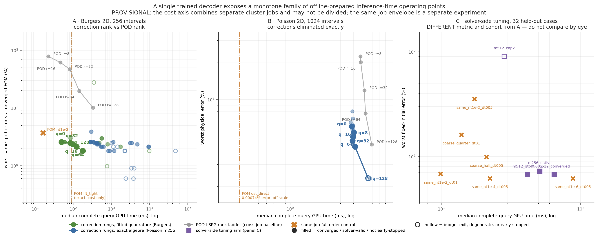
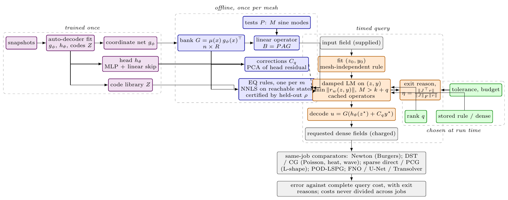
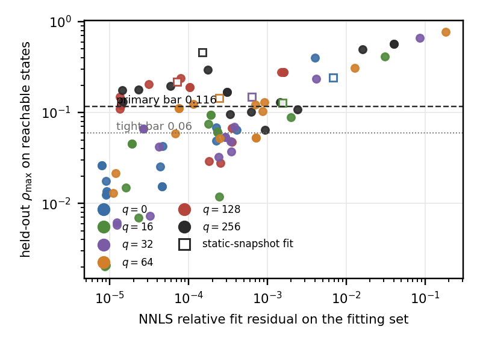

# Tunable Non-linear Manifold ROMs for Elliptic, Parabolic, and Hyperbolic PDEs via Matrix-Free Petrov--Galerkin Projection

*Anonymous submission to ICLR 2027. Every number below is generated from run records by `gen_tables.py`; tables are inlined from `tables-md/` behind an HTML comment naming their id; **[PENDING: …]** marks a lane that has not landed.*

*Status for the reader (generated 2026-09-17 19:53; this block is removed before submission).*
*Final tables (43): T01, T01b, T02b, T02c, T03, T03b, T03m, T03mb, T04, T04b, T04m, T05, T05b, T06a, T06b, T07, T08, T08b, T09, T09b, T09c, T09d, T10, T11a, T11b, T11c, T11d, T11e, T12, T12b, T14, T14b, T14c, T14d, T15, T16, T17, T18a, T18b, T18c, T18d, T18m, T19.*
*Pending cells: `T13` waits on b-seeds sealed cohort; `seeds sealed` waits on b-seeds sealed cohort; `T2 sealed row` waits on b-seeds sealed cohort. In-flight jobs are listed in Table C.3: sealed cohort 3804465 (b-seeds), NS K=32 arm 3787320 (ns2d), low-viscosity training 3804337 (b-lowvisc), 512² panel 3805065 (b-panel).*
*Provisional: the three-seed table (T12) until the sealed cohort lands; the 1024² frontier statement in §5.1 until the 512² panel brackets it; the two top EQ rungs are single-draw rules, never certified.*
*Open decisions for the user: (1) the headline Burgers metric, worst over evolved times or worst over all times, both printed everywhere, and now decisive for §5.1 at 1024², where reduced rungs are non-dominated on the evolved metric only because the t=0 compression bounds all-times; (2) sign-off on the abstract's new opening two sentences (resolution-knob framing), which are provisionally accepted and unchanged in this pass.*
*Changed in this pass: b-panel closed (bpn301 replaces bpn101 at 256², bpn203 adds 1024²); L-shape closed at 512² and now in the abstract; b-qxm pin at 4b9723e8 dropped after the lane committed its regeneration (no number in §5.2 moved); three seeds landed on the development cohort; Figure 2 moved into §3.2 beside the equation it draws.*

## Abstract

Neural operators such as Fourier Neural Operators (Li et al., 2021) and
DeepONets (Lu et al., 2021) deliver one (accuracy, speed) point per
trained model; at deployment only the evaluation grid can be changed,
which moves cost but not what the model can represent. We present a non-linear manifold reduced order
model (NM-ROM) for elliptic, parabolic and hyperbolic PDEs that exposes a
family of accuracy/cost operating points from a single trained
decoder, controlled at inference time by one primary knob, the rank $q$
of a linear correction the solver may switch on, and three solver-side
knobs: the iteration cap, the stopping tolerance, and the
empirical-quadrature (EQ) sample count. The framework combines a matrix-free least-squares Petrov–Galerkin
projection of the discrete PDE residual onto fixed smooth weak tests,
evaluated through JAX autodiff (Bradbury et al., 2018); NNLS-based
(Lawson & Hanson, 1974) EQ hyper-reduction
(Hern'andez et al., 2017; Yano & Patera, 2019) validated on the states the
solver actually reaches; exact boundary condition enforcement inside the
decoder; and a decoder — a per-node spatial bank from a Fourier-feature
coordinate network (Tancik et al., 2020) times a small neural
head with a linear skip, plus nested correction directions — identified
against three constraints: cold-start convergence, EQ compatibility, and
mesh-independent per-node evaluation. Across 2D Burgers, Poisson, heat and waves, the trained-once family's
scheduled ladder is monotone in $q$ on Burgers on each of three training
seeds, and its fixed-test-count ladder, where $q$ is the only control,
meets a bar fixed before any run on one checkpoint, on the same-grid
error: against a fine reference every
rung is within a few percent of the mesh's own discretisation error, so
the knob moves the reduction error, not the physical error, at the
meshes we ran; its quadrature rules are validated on reachable states, not by their
fitting residual, and confirmed on re-draw at $q\le32$ only;
and its cost results are measured in the same job: on an L-shaped Poisson
domain, where no fast transform applies, reduced models are cheaper than
the cheapest full-order solve by $2.77\times$
at $256^2$ and $6.07\times$ at $512^2$ for
the neural head, and by more for plain POD-128, which is cheaper than the
head at both meshes and $15 %$ less accurate; at
$1024^2$ on Burgers the three cheapest rungs are non-dominated on the
evolved-times metric. Nothing reduced is on the
frontier at $256^2$, where a tuned full-order solver and a neural operator
trained on the same data are both cheaper and more accurate; and on
Poisson, heat and waves the family collapses to a linear model, which
says when the nonlinear manifold is worth having.

## 1 Introduction

<!-- section sources: b-qxm analysis.json; b-eqtop summary.json; mesh-ladder json; b-panel summary.json -->

Neural operators for partial differential equations (PDEs)
(Li et al., 2021; Lu et al., 2021; Kovachki et al., 2023; Li2024PINO, ?; BoulleTownsend2024, ?) have
become a strong empirical baseline, but each trained model produces
essentially one (accuracy, wall-clock) operating point: the only
deployment-time knob, the evaluation grid, moves cost without changing
what the model can represent, and it worked for one of the four operator
arms we tested (§6.1). Classical Full Order Methods (FOMs)
(Hughes2000FEM, ?) solved iteratively
(HestenesStiefel1952CG, ?) expose this knob through their iteration
tolerance, and where a fast transform applies they are hard to beat on
wall-clock at the resolutions of interest.

Two families of methods sit on either side of this gap. Neural
operators and PDE foundation models
(HerdePoseidon2024, ?; McCabeMPP2024, ?; HaoDPOT2024, ?; Chen2024UnsupervisedNO, ?) deliver fast amortised inference but fix what the model can represent at
training time, so a materially different accuracy needs retraining. Reduced order
models (ROMs) address the same problem from the opposite direction: linear
projection-based ROMs (Benner et al., 2015; Sirovich, 1987)
inherit the FOM's guarantees but hit the Kolmogorov $n$-width barrier
on advection-dominated regimes (Cohen & DeVore, 2015), and non-linear
manifold ROMs (NM-ROMs) (Lee & Carlberg, 2020; Kim et al., 2022) lift
this barrier with a learned manifold but have so far been demonstrated
mainly on 1D advection-dominated benchmarks rather than head-to-head
against neural operators and tuned full-order solvers in the same job.
The key open question is thus whether a single trained NM-ROM can expose
a deployment-time accuracy/cost tradeoff that neither alternative
offers, and where, if anywhere, that tradeoff is worth having once the
comparators are measured in the same allocation.

This paper answers that question with measurements on 2D Burgers,
Poisson, heat and waves, and the answer is mixed. We present an NM-ROM
framework whose distinguishing property is a *deployment-time
accuracy/cost family traced by a single trained model*: at inference,
one primary knob — the rank $q$ of a linear correction the solver may
switch on — and three solver-side knobs — the iteration cap, the
stopping tolerance, and the Empirical Quadrature sample count —
trade accuracy for cost. The supporting machinery is a decoder that enforces Dirichlet boundary
conditions exactly, a damped Levenberg–Marquardt latent solver
(Marquardt, 1963; NocedalWright2006, ?), NNLS-based Empirical Quadrature
(Hern'andez et al., 2017; Yano & Patera, 2019) validated on reachable
states, and a matrix-free JAX implementation (Bradbury et al., 2018).

**Contributions.**

1. **A tunable NM-ROM with a deployment-time accuracy/cost
family from a single trained model, and a matched-dimension
result.** The correction rank $q$ moves accuracy and the solver-side
knobs move cost. With the test count $M$ held fixed so that $q$ is
the only control, the Burgers $256^2$ ladder is monotone with every
rung converged, spanning $2.44\times$ in error for
$5.16\times$ in cost inside one allocation and meeting a
bar fixed before any run (§6.3); at
matched $k=16$ inside one bank the neural head reaches
$2.5629 %$ where the best linear map reaches
$56.9296 %$ and POD-16 $61.6503 %$
(§6.4).
2. **Architectural choices that make this family
achievable.** We identify the three constraints a decoder must
satisfy — cold-start convergence, EQ compatibility, and
mesh-independent per-node evaluation — and show that a separable
decoder (coordinate-network bank, head with a linear skip, nested
corrections) meets all three.
3. **Precomputed weak operators and validated quadrature that
make the framework practical.** Exact preassembly of every linear
term, Empirical Quadrature for the one nonlinear term, and a rule
that a fitted quadrature is accepted only by its held-out error on
reachable states and by independent re-draws, never by its fitting
residual.
4. **Where the family is not worth having, reported as such.**
At $256^2$ on the square no reduced subject is on the
non-dominated set once a tuned full-order solver and a neural
operator on the same data are in the job; on Poisson, heat and
waves the top rung is the linear model and also the cheapest
point. The cost results are for reduced models in general: on an L-shaped
Poisson domain, where no fast transform applies, the head is
$2.77\times$ and
$6.07\times$ cheaper than the
cheapest same-job full-order solve at $256^2$ and $512^2$ and POD-128
cheaper still; and at $1024^2$ on Burgers the cheapest rungs are
non-dominated on the evolved-times metric only
(§6.1, §6.5).

**What we do not claim.** No speedup over an efficient
full-order solver on the square at $256^2$; no accuracy superiority over
neural operators; no frontier over POD at every rank; no cost ratio
across jobs or GPUs; no convergence theory; and every number is
development-cohort evidence, single-seed except for the Burgers
scheduled ladder (§Table 2).

## 2 Related Work

<!-- section sources: none (prose only) -->

**Linear and non-linear manifold ROMs.**
Linear projection-based ROMs
(Benner et al., 2015; Sirovich, 1987; Berkooz1993, ?; QuarteroniManzoniNegri2015, ?; HesthavenRozzaStamm2016, ?)
suffer from the Kolmogorov $n$-width barrier on advection-dominated and
moving-front problems
(Cohen & DeVore, 2015; GreifUrban2019, ?; Ohlberger & Rave, 2016). NM-ROMs lift
this barrier by using a non-linear trial manifold:
Lee & Carlberg (2020) introduced convolutional-autoencoder NM-ROMs
with LSPG projection (Carlberg et al., 2011), and subsequent work has
explored shallow masked autoencoders with sample-mesh hyper-reduction
(Kim et al., 2022), reduced over-collocation
(RomorStabileRozza2023, ?), domain-decomposed sparse autoencoders
(Diaz2024DomainDecompNMROM, ?), quadratic manifolds with analytic
Jacobian regularity (Geelen et al., 2022; Barnett & Farhat, 2022),
and implicit-feature-tracking variants with EQ
(MirhoseiniZahr2023, ?). Related lines include POD-pre-compressed
DL-ROMs (Fresca & Manzoni, 2022) and conditional-neural-field
ROMs with approximate-distance BC enforcement
(KimWenLeeChoiCNFROM2024, ?). We differ from these by a separable
decoder — a coordinate-network spatial bank
(Tancik et al., 2020) times a small neural head with a linear
skip — augmented by nested *correction* directions chosen offline
once, so that a rank $q$ is selected at run time without any refit, and
by exposing $q$ with three solver-side knobs as a monotone accuracy/cost
family from one trained decoder, analogous to runtime-tunable networks
(YuSlimmable2019, ?; Cai2020OnceForAll, ?). NN-augmented projection ROMs
(Barnett et al., 2023) and online-adaptive bases
(Peherstorfer & Willcox, 2015; Carlberg, 2015) add a
nonlinear correction to a linear basis; ours is the reverse composition,
the nonlinear head inside the linear bank with the linear part as the
correction. The projection is least-squares Petrov–Galerkin
(Carlberg et al., 2011) and the linear terms are preassembled as in
tensorial POD ( Stef anescu & Sandu, 2014; Weder et al., 2024);
we claim no novelty for either.

**Neural operators, hyper-reduction, and differentiable programming.**
Neural-operator surrogates
(Li et al., 2021; Lu et al., 2021; Kovachki et al., 2023; LiGeoFNO2023, ?; TranFFNO2023, ?; Cao2021GalerkinTransformer, ?; LiOFormer2023, ?; HaoGNOT2023, ?; WuTransolver2024, ?; WangLNO2024, ?; WenGAOT2025, ?; HuLinearNO2025, ?; Shikhman2026BoundaryIndexed, ?)
and PDE foundation models
(HerdePoseidon2024, ?; McCabeMPP2024, ?; HaoDPOT2024, ?; HolzschuhPDETransformer2025, ?)
deliver one fixed (accuracy, speed) point per trained model and
typically approximate boundary conditions via penalty terms; partial
fixes via distance functions
(SukumarSrivastava2022, ?; BerroneBC2022, ?), hard-constrained
DeepONets (BrechtHardConstraints2023, ?), BC-embedded operators
(WangBENO2024, ?), and diffusion-style refinement
(LippePDERefiner2023, ?) address pieces of these limitations in
isolation. Hybrid solver-in-the-loop methods
(UmSolverInTheLoop2020, ?; Kochkov2021PNAS, ?; KopanicakovaKarniadakis2024, ?; EshaghiNOWS2025, ?; Raissi2019, ?; Karniadakis2021PIML, ?)
embed operators in classical iterations. We instead use the network
solely for manifold learning and rely on a least-squares Petrov–Galerkin
projection (Carlberg et al., 2011) for the PDE residual, and we compare
against an FNO, a U-Net (Ronneberger et al., 2015), the standard strong
baseline of PDEBench (Takamoto et al., 2022), and a Transolver
(WuTransolver2024, ?) on identical data at an equal wall budget
(§6.1). For hyper-reduction we retain classical
NNLS-based EQ (Hern'andez et al., 2017; Yano & Patera, 2019; Lawson & Hanson, 1974)
over DEIM (Chaturantabut & Sorensen, 2010), ECSW
(Farhat et al., 2014; Chapman et al., 2017), GNAT
(Carlberg et al., 2013), matrix-DEIM (NegriManzoniAmsallem2015, ?),
neural-DEIM (HirschPichiHesthavenNEIM2024, ?), and high-order EIM
(Nguyen2024HighOrderEIM, ?); the difference is that only the
nonlinear advection term is sampled and that a fitted rule is accepted
by its held-out error and by re-draws, not by its fit residual, with the
projected system evaluated matrix-free through JAX
(Bradbury et al., 2018; GriewankWalther2008, ?). On separable
constant-coefficient cells the discrete sine transform is a direct solve
(Swarztrauber, 1977) faster than every reduced model we measure, and
preconditioned Krylov methods (HestenesStiefel1952CG, ?; Saad, 2003) are
the iterative comparator; we name the direct solver wherever it applies.

## 3 Methodology

<!-- section sources: none (prose only) -->

We construct an NM-ROM solver by turning a learned manifold into a
practical PDE solver through three components: a non-linear trial
manifold whose decoder enforces Dirichlet boundary conditions exactly and
carries nested linear correction directions
(§3.1); a least-squares Petrov–Galerkin
projection of the discrete residual onto fixed smooth weak tests
(§3.2); and exact preassembly of every linear term
with Empirical Quadrature for the one nonlinear term
(§3.3); the decoder architecture (§3.4)
supports these requirements. Throughout, $u \in \mathbb{R}^{n}$ is the
full-order state on a uniform grid of $N$ intervals per axis,
$A \in \mathbb{R}^{n \times n}$ the negative five-point Laplacian on
$[0,1]^2$; $R$ is the bank width, $k$ the latent dimension, $M$ the number
of weak tests and $m$ the number of quadrature nodes.
Figure 2 (Appendix C) shows the data flow;
Appendix A gives the per-PDE derivations and exit codes.

### 3.1 Trial Manifold with Exact Dirichlet Enforcement

<!-- section sources: none (prose only) -->

We train a decoder $\mathcal{D} : \mathbb{R}^k \to \mathbb{R}^n$, $k \ll n$, with
latent state $z$; there is no encoder in the deployed path. The decoder
is separable: a frozen spatial *bank* $G\in\mathbb{R}^{n\times R}$
times a small neural *head* $h_\theta:\mathbb{R}^{k}\to\mathbb{R}^{R}$,
$k\le R\ll n$, with the bank built once per mesh from a
random-Fourier-feature coordinate network $g_\phi$
(Tancik et al., 2020),

$$
G_{x,:} = \mu(x)\,g_\phi(x)^{\top},
  \qquad
  \mu(x) = 16\,x_1(1-x_1)\,x_2(1-x_2).
$$

<!-- equation (1) -->

To strictly enforce the homogeneous Dirichlet boundary condition on the
boundary set $\Gamma$, we utilize the smooth vanishing factor $\mu$,
zero on $\Gamma$, folded into every column of the bank. This ensures
$\partial u/\partial z = 0$ on $\Gamma$ at every resolution, naturally
annihilating boundary equations during the projection; as implemented it
covers homogeneous data only.

**The correction ladder.**

The deployed model augments the head's output with $q$ fixed directions
$C_q\in\mathbb{R}^{R\times q}$ and solves for the latent code and the
correction coefficients together,

$$
u(z,y) \;=\; G\big(h_\theta(z) + C_q\,y\big),
  \qquad z\in\mathbb{R}^{k},\; y\in\mathbb{R}^{q},\; 0\le q\le R .
$$

<!-- equation (2) -->

The columns of $C_q$ are chosen offline once per checkpoint by a
principal component analysis of the head's own residual on the training
codes, ordered so that $C_{q}$ is a prefix of $C_{q'}$ for $q<q'$; the
ladder is nested and no rung needs retraining. At $q=0$ the model is the
frozen head; at $q=R$ the head is irrelevant and the model is the linear
reduced model on the bank's span, solved without a nonlinear iteration;
in between, $q$ moves the reachable set from the head's image towards
the bank's span, and the solved dimension from $k$ to $k+q$. Two
consequences organise everything that follows: the bank's projection
error is a floor on the achievable error whatever the head or the solver
does, so nonlinearity in $h_\theta$ buys a smaller *solved* dimension,
not an escape from the span; and all $x$-dependence factors through
$G$, so the decoder restricted to any node set is a cached block
times the coefficients, which makes node sampling and exact preassembly
available from one decoder.

### 3.2 Projecting the PDE onto the Manifold

<!-- section sources: none (prose only) -->

Each PDE we consider gives a discretised residual $r(u)$ that
should vanish at the true solution. We substitute the trial manifold
$u(z,y)$ into $r$ and project onto a fixed, latent-independent
test space: $P\in\mathbb{R}^{M\times n}$ collects the $M$ lowest
tensor-product sine vectors of the square, eigenvectors of the five-point
operator, $PA=\LambdaP$. The reduced problem solved online
is

$$
(z^{\star},y^{\star})
  =
  \operatorname*{arg\,min}_{z,\,y}\;
  \tfrac12\,\lVert r_{w}(z,y) \rVert_2^2,
  \qquad
  r_{w}(z,y) = \Lambda_\star^{-1}\,P\,r\!\big(u(z,y)\big)
  \in\mathbb{R}^{M},
  \qquad M>k+q ,
$$

<!-- equation (3) -->

with a diagonal row scaling $\Lambda_\star$ stated per PDE in
Appendix A. This is a least-squares Petrov–Galerkin
condition with an explicit test space
(Carlberg et al., 2011; Lee & Carlberg, 2020), not tangent Galerkin, and
overdetermined rather than square; it yields a $(k+q)$-dimensional system
that inherits the structure of the original PDE and that we solve by a
method appropriate to that structure.

**Elliptic (Poisson).**
The Poisson residual is $r(u) = A u - f$. Projection gives
$r_{w}(z,y)=B_0(h_\theta(z)+C_q y)-b_0$ with
$B_0=PG$ (Appendix A.1). Because the
projector onto $\operatorname{range}(B_0C_q)$ does not depend on
$z$, $y$ is eliminated exactly (Golub & Pereyra, 1973) and the
nonlinear iteration stays $k$-dimensional at every $q$; at $q=R$ the
model is a linear least-squares solve with no iteration at all.

**Parabolic (heat).**
The heat semi-discretisation $du/dt = -\kappa A u$ is advanced with
Crank–Nicolson; the reduced step substitutes the manifold into the fully
discrete equation *before* projecting and solves
$z_{n+1}=\operatorname*{arg min}_{z}\lVert B_0h_\theta(z)-D B_0h_\theta(z_n) \rVert_2$,
$D$ the diagonal Crank–Nicolson amplification of the retained modes
(Appendix A.2): a nonlinear least-squares problem, not a
linear system in $z_{n+1}$. At $q=R$ the trajectory is the exact
modal propagation of the bank coefficients, with no head and no
iteration.

**Hyperbolic (Burgers).**
For $u_t+u(u_x+u_y)=\nu\Delta u$ with a sign-upwind stencil and backward
Euler (Appendix A.3) the weak residual is quadratic
in the coefficients, so $y$ is not eliminated in closed form; we damp the
$(z,y)$ blocks separately inside one Levenberg–Marquardt step
(*block-damped* variable projection), which exits stationary
everywhere where a joint LM leaves $6$ budget exits
(Table 10).

**Solver and exits.**
Each attempt solves the damped normal system
$(H+\lambda \operatorname{diag}(\operatorname{diag} H)) \delta=-g$, $H=J_{}\TJ_{}$,
$g=J_{}^{\top}r_{w}$, from forward-mode differentiation through $h_\theta$
(Bradbury et al., 2018), accepting the step only if it strictly decreases
the residual: damped Levenberg–Marquardt with a monotone test
(Marquardt, 1963). Three exit families are recorded and never
conflated: the scale-free stationarity measure

$$
\eta(z,y)=\lVert J_{}^{\top}r_{w} \rVert_2\,/\,\big(\lVert J_{} \rVert_{F}\,\lVert r_{w} \rVert_2\big)\le\eta_{\mathrm{tol}},
$$

<!-- equation (4) -->

a residual threshold, and the stalls, whose outputs are reported as
early-stopped, never as converged. No query uses the solution it
predicts: the elliptic solve starts from the cached training code nearest
the projected source, and the Burgers query fits $(z,y)$ to the
supplied initial field on a fixed rule independent of the query mesh
(Appendix A.5).

### 3.3 Hyper-reduction

<!-- section sources: none (prose only) -->

The non-linear manifold reduces the DOF count from $n$ to $k+q$, but a
projected term such as $P N(G c)$ still costs $O(n)$ to
evaluate, which kills the wall-clock benefit. For a fixed linear operator
the tested residual is exactly precomputable:
$P(A u-f)=B (h_\theta(z)+C_q y)-b$ with
$B=PAG=\Lambda PG\in\mathbb{R}^{M\times R}$ assembled
offline by two one-dimensional sine transforms, so linear terms are never
approximated, on any PDE here. For Burgers the advection $P N(G c)$
is the only term that resists preassembly; it is evaluated either
*densely* on every interior node, $O(nR)$ per residual, or on an
*empirical quadrature* rule of $m$ nodes with non-negative weights
(Hern'andez et al., 2017; Yano & Patera, 2019), $O(mR)$ through the cached
stencil block. The rule is a non-negative *per-node* weight vector, *independent
of the snapshot*, fitted by NNLS (Lawson & Hanson, 1974) to reproduce
the projected advection term at $n_{\rm fit}$ stored codes with a hard cap
of $m$ nodes (Appendix A.4); changing $m$ re-solves the
fit, rules are not nested, and deployment selects among stored rules. *A rule is never accepted on its NNLS fit residual*; we score it by
the held-out relative error $\rho$ of the projected advection term
(10) over states the solver actually reaches on trajectories
disjoint from the fit and evaluation cases, against a primary bar
$\rho_{\max}\le0.116$ fixed before any certification job ran and a
tight bar $0.06$, and then re-draw the construction: a rule is
*confirmed* only if every re-draw passes
(§6.3).

### 3.4 Model Architecture

<!-- section sources: none (prose only) -->

Three properties of the problem motivate our architecture. First, the
latent iteration is initialised cold, so the decoder Jacobian must retain
a well-conditioned linear component for the first step to descend into
the manifold; this motivates a *linear skip* in the head. Second,
hyper-reduction retains a sparse subset of mesh nodes, so the decoder
must evaluate at any single node in mesh-independent time; this motivates
a *per-node bank* from a coordinate network. Third, the family must
reach from the head's image to the bank's whole span without retraining;
this motivates the nested *correction directions*.

**Linear skip, for cold-start convergence.**
The head is a two-layer SiLU MLP plus a linear skip,
$h_\theta(z)=\varphi_\theta(z)+W^{\top}z$, so its Jacobian
$Dh_\theta=D\varphi_\theta+W^{\top}$ retains a latent-independent component
along which the cold solve can descend; the elliptic solver checks the
numerical rank of the projected Jacobian at every query. The skip is a
design choice; we do not ablate it in this paper.

**No encoder; per-node bank.**
Elliptic solutions are globally coupled through the Green's function,
which is why the previous design carried a global encoder; none is
needed, since the query fits $(z,y)$ against the supplied input.
Empirical Quadrature only saves wall-clock time if the decoder can be
evaluated at one node without touching the rest of the grid: the decoder
restricted to the rule's support is a cached block times the
coefficients, and the network's parameters do not depend on the mesh.

**What is fixed, what is chosen, and how error is reported.**

Every operating point uses one frozen artefact per PDE ($\theta$,
$G$, $R$, $k$, $C_q$, the time discretisation and the query
contract); selected at run time are the rank $q$, the quadrature (dense
or a stored validated rule) and the stopping tolerance and budget; $M$ is
held fixed along the headline ladder.

Every panel reports three numbers: the *bank floor* (the projection
error onto $\operatorname{range}G$, what no head and no solver can
beat), the *best-found* error (the smallest any point of the
augmented manifold attains, from a multistart oracle) and the
*solved* error the iteration returns; a lever can only move the
layer it acts on.

## 4 Implementation

<!-- section sources: none (prose only) -->

\subsection{Matrix-free Projected Operators via JAX}

To overcome the bottleneck of explicitly forming the Jacobian of the
decoder, the framework is implemented utilizing hardware-accelerated
automatic differentiation. Every linear term is preassembled once per
mesh as the $M\times R$ matrix $B$, so the online residual and Jacobian
for a linear PDE are $B (h_\theta(z)+C_q y)-b$ and
$B [Dh_\theta C_q]$, with $Dh_\theta$ from a forward-mode Jacobian-Vector
Product through the head (Bradbury et al., 2018); for Burgers the sampled
advection term is evaluated on the cached stencil block of the rule's
support. The damped normal system is solved directly; no Krylov solve is
applied to the projected operator.

\subsection{Training Protocol}

The bank and the head are trained in two stages, both as auto-decoders:
the coordinate network $g_\phi$ is fitted to the training states through
the vanishing factor of (1), then frozen, and the head
$h_\theta$ is fitted together with a code library $Z$ on the bank-projected
training states. The correction directions $C_q$ are then the principal
components of the head's residual on the training codes, and the
quadrature rules are fitted on reachable states of the dense solver's own
trajectories. Per-cell sizes, cohorts and the offline cost of each stage
are in Appendix B; all training runs on a
single NVIDIA A100 GPU, and every headline uses one checkpoint per PDE,
named by hash in Table 4.

## 5 Experimental Setup and Benchmark Problems

<!-- section sources: none (prose only) -->

All full-order comparators and reduced solves are benchmarked in one
Slurm allocation on one GPU per job to provide a direct
hardware-to-hardware comparison; *no ratio is ever formed across
jobs or GPUs*. Table 7 specifies each cell and
Table 8 the sampled families. Burgers 2D at $256^2$ with one
frozen checkpoint is the hero; Poisson, heat and the reflective wave are
the linear cases; the L-shaped Poisson domain is the cell where no fast
transform exists.

**Problems.**
*Burgers (hyperbolic):* $u_t+u(u_x+u_y)=\nu\Delta u$ on $(0,1)^2$,
on $256^2$ intervals with a frozen-checkpoint ladder from $64^2$ to
$1024^2$; errors are against the same job's converged full-order solve
on the same grid ($4.0265 %$ discretisation error at
$256^2$ against a $4096^2$ reference). *Poisson (elliptic):*
$-\Delta u = f$ with sources from the family in Table 8;
ground truth is the verified discrete solution from the direct sine
transform, not an analytic field; evaluated at $256^2$ and $1024^2$ on
the square and on the L-shaped domain $(0,1)^2\setminus[\tfrac12,1)^2$
at $64^2$ to $512^2$, where a sparse direct solve replaces the transform.
*Heat and waves:* $\partial_t u - \kappa \Delta u = 0$ with
Crank–Nicolson and $u_{tt}=c^2\Delta u$ with reflective walls, with the
exact modal propagation of the bank as the $q=R$ rung.

**Metrics and timing.**
We report the relative $L^2$ error against the reference of each cell,
maximised over cases and output times; for Burgers two maxima are
reported everywhere and neither is chosen, worst over *all* times
(bounded below by the decoder's compression of the supplied field at
$t=0$) and worst over the *evolved* times $t>0$. Every cost is the
median over repetitions of a completed device computation, timed after a
burn-in with device synchronisation, arms interleaved in a recorded
random order, in float64; offline setup is charged separately.

**Baselines.**
FNO, a PDEBench-style U-Net and a Transolver are trained on the
identical dataset and split with recorded index hashes, an equal wall
budget and the same validation-selection rule; the FNO is timed in the
same allocation as the ROM, the U-Net and Transolver are not, so no cost
statement is made for them. The linear POD-LSPG baseline runs through the same weak objective,
tests, solver and stopping rule. Full-order comparators are always in the
same job: preconditioned Newton at several tolerances (Burgers); the
direct sine transform and tuned conjugate gradients (Poisson, heat,
waves); sparse direct and IC(0)-PCG (L-shape). The shallow-masked-autoencoder NM-ROM of Kim et al. (2022) is not
run under this protocol and is not compared. Every table names its job
id, GPU and checkpoint (Table 4), every solve carries
its exit reason, and every number is emitted by one generator from
audited records.

## 6 Numerical Experiments and Results

<!-- section sources: none (prose only) -->

We evaluate NM-ROM against a Fourier Neural Operator, a U-Net and a
Transolver trained on the same data, against POD-LSPG at several ranks,
and against tuned full-order solvers in the same job. Every number below
is a single training seed on opened development cases, one checkpoint
per PDE, except where three seeds are stated; costs are compared only
inside one allocation. Table 16 (appendix) and
Figure 1 report the headline family at $256^2$. The losses
come first.

### 6.1 Comparison against Neural Operators and Full-Order Solvers

<!-- section sources: none (prose only) -->

Two plain sentences first. At $256^2$ a well-tuned full-order solver and
the FNO are both cheaper and more accurate than every reduced model, ours
included. At $1024^2$ the three cheapest quadrature rungs are on the
non-dominated set, on the evolved-times metric only, and the cheapest
reduced query falls from $4.48\times$ to
$1.82\times$ the cost of the cheapest
same-job full-order setting; we do not call that a crossover until the
$512^2$ panel now queued brackets it.

**Nothing reduced is on the frontier at $256^2$.**
Table 16 and Figure 1 come from one
allocation on one A100 (job 3789570, 48{} timed
subjects: correction rungs, POD-LSPG at ranks 16, 32, 64, 128, 256, 512, the
unrestricted bank, the FNO, and full-order Newton at several settings).
On (GPU ms, worst *evolved* error)
**0{} of the 39{}
admissible reduced subjects are non-dominated** once the full-order
controls are in, and likewise on the *all-times* metric. The most accurate
reduced subject is POD-512 at $0.2184 %$ and
$2790.8$ ms; 4{} same-job
full-order settings are cheaper and at least as accurate (the cheapest
at $0.0489 %$ and $31.8$ ms), and
the FNO reaches $7.4164 %$ at $7.2$ ms. On the
*evolved* metric POD-512 beats the best dense rung on both axes; on the
*all-times* metric the unrestricted bank does. Both are printed because
the metric decides.

**At $1024^2$ the statement is mesh-qualified.**
In a second allocation on one H200 (job 3789572;
Table 17; only same-job ratios are
compared with $256^2$), 5{} of the
20{} admissible reduced subjects are
non-dominated on (GPU ms, worst *evolved* error): the $q=0$, $16$ and
$32$ rungs with rules transferred from $256^2$. On the *all-times* metric
no reduced subject is non-dominated at either mesh, because the $t=0$
compression
($3.71$–$3.86 %$
on those rungs) bounds it: which metric is the headline decides whether
this paragraph reports a gain. The transferred rules at $q\ge64$ miss the
primary bar at $1024^2$; why is open.

**Neural operators on the same data.**
Neural operators trained on the same data are more accurate than the
reduced model, and the one that was timed against it is also cheaper
(Table 15). Worst error on the matched eight-case cohort:
U-Net-small $1.4712$, Transolver-refine
$1.5224$, **ROM $1.8671$**, FNO-large
$2.4829$, efficient full-order solver
$0.9978 %$: $4$ operator arms beat the
ROM and every FNO capacity is worse than it. An
earlier FNO-only finding that the ROM is the more accurate model was an
artefact of the family and is withdrawn; the comparison survives a
float64 and a second-seed control (Appendix F.1),
every operator number is a lower bound, and on Poisson the gap is larger
(Table 36). The operators' own knob, evaluation resolution, is usable for
`fno-large`{} only (Table 34); “one accuracy–cost
point per trained operator” is withdrawn, but $q$ moves what the model
can represent, which a coarser grid does not.

**Figure 1.** The family on Burgers $256^2$. **A**: worst evolved error
against the rank $q$ for the fixed-$M$ and scheduled ladders (b-qxm,
jobs G1 = 3780175 (NVIDIA A100 80GB PCIe), G2 = 3780177 (NVIDIA A100-PCIE-40GB), S1 = 3780178 (NVIDIA A100-PCIE-40GB), E1 = 3783898 (NVIDIA A100-PCIE-40GB), E2 = 3783899 (NVIDIA A100 80GB PCIe); no cost axis, costs span jobs). **B**: the
same-allocation panel (job 3789570): every timed subject on (GPU
ms, worst evolved error); filled markers converged; the step line is the
non-dominated set. **C**: the EQ ladder against its dense twins in
one job (job 3780164; rules later confirmed at
$q=0, 16, 32$, marginal at $q=64 (2/6), 128 (4/5), 256 (1/5)$). The
rank moves error monotonically at fixed $M$; no reduced subject reaches
the non-dominated set once the full-order controls are in; the EQ ladder
tracks its dense twin at a fraction of the cost.

### 6.2 Best Configurations per Problem and Resolution

<!-- section sources: none (prose only) -->

The same trained decoder serves every resolution. With one frozen
checkpoint per PDE transferred across $64$–$1024$ intervals, the cached
reduced solve costs $44.16\to43.58$ ms
on Burgers while the unknowns grow $264\times$
(Table 29); the complete query grows
$1.033\times$ through dense input and output. There
is no crossover against the cheapest same-job full-order arm at any rung
on the square (FOM/ROM 0.265–0.495{} on Burgers,
0.063–0.112{} on Poisson), and a kernel port at
bit-level parity buys $1.520x$ at $256^2$
(Table 37). Moving between operating points never requires
retraining.

### 6.3 Which Knob to Turn

<!-- section sources: none (prose only) -->

The rank $q$ is the one deployment-time knob that moves accuracy; the
quadrature rule and the tolerance move cost; the head's training data
and capacity move the floor and need retraining (Table 11,
Table 23, Table 38).

**Table 1.** The correction ladder on Burgers $256^2$. Top: the fixed-$M$
ladder inside one job (job G2 = 3780177; same-grid evolved error,
median GPU ms). Bottom: the scheduled ladder $M=4(K+q)$ from the
same-allocation panel (job 3789570) with dense advection, the error
against the $4096^2$ reference (“vs ref”), and the replication-selected
EQ rule per rung with its status (Table 16,
Table 28). Against that reference every rung's error is
$1.00$–$1.13\times$ the mesh's
own discretisation error of $4.03 %$.

<!-- table: T04m_fixedM_main -->
| $q$ | $M$ | worst evolved % | GPU ms | converged |
|---|---|---|---|---|
| 0 | 1088 | 1.2657 | 848.0 | yes |
| 64 | 1088 | 1.0593 | 1359.4 | yes |
| 128 | 1088 | 0.8711 | 1886.5 | yes |
| 256 | 1088 | 0.5194 | 4377.9 | yes |

<!-- table: T03m_ladder_main -->
| $q$ | $M$ | dense evolved % | all % | vs ref % | GPU ms | EQ evolved % | EQ ms | EQ rule |
|---|---|---|---|---|---|---|---|---|
| 0 | 64 | 1.8890 | 2.5629 | 4.56 | 283.9 | 1.8891 | 58.6 | confirmed (3 of 3 re-draws) |
| 16 | 128 | 1.3985 | 2.4806 | 4.11 | 360.8 | 1.4270 | 81.1 | confirmed (3 of 3 re-draws) |
| 32 | 192 | 1.2336 | 2.3534 | 4.08 | 434.7 | 1.2493 | 97.8 | confirmed (2 of 2 re-draws) |
| 64 | 320 | 1.0843 | 2.1489 | 4.10 | 621.1 | 1.0840 | 148.9 | confirmed (2 of 2 re-draws) |
| 128 | 576 | 0.8930 | 1.8116 | 4.08 | 1186.9 | 0.8931 | 273.5 | single-draw |
| 256 | 1088 | 0.5194 | 0.9053 | 4.04 | 3939.8 | 0.5129 | 746.0 | single-draw |

**Rank against test count: the family at fixed $M$.**
The rank alone moves the error: hold the test count fixed, add correction
directions, and the error falls at every step while the cost rises
(Table 1). Three plain sentences on what that error
is. The ROM approximates the discrete system, so the same-grid error is
the quantity the knob controls. Against the fine reference the knob moves the error only from
$4.56$ to $4.04 %$ ($1.13\times$),
because at $256^2$ every rung's reference error is
$1.00$–$1.13\times$ the mesh's
own discretisation error of $4.03 %$: the
reduction adds little on top of the discretisation. And a same-job full-order setting at $15.7$ ms
reaches $2.47 %$ against the reference, more accurate
than every reduced subject at a small fraction of the top rung's cost
(partly error cancellation between a coarse time step and the spatial
error); at $1024^2$ the rungs run $3.86$ to
$2.80 %$ against the reference
($1.38\times$) over a discretisation error of
$2.14 %$. The knob is a knob on the reduction error, not on the
physical error at these meshes. The
crossed grid (Table 11) runs $q\in\{0,\dots,256\}$ against
fixed $M\in\{256,1088\}$ and the schedules $M\in\{4,8,16\}(K+q)$ in
5{} jobs whose shared cells agree to $9.9e-09$
relative. At $M=256$ the ladder spans only $1.22\times$
in error and **fails** the pre-registered bar (monotone, at least
three non-dominated points, at least $2\times$ on both axes, nothing
early-stopped). **At $M=1088$ the ladder $q=0,64,128,256$,
inside one job, is monotone, every rung converged, and spans
$2.44\times$ in evolved error for $5.16\times$ in cost
with $4$ non-dominated points**, and passes. $M=1088$ was chosen
as the headline after the grid ran, by the lane's rule (the largest fixed
$M$ holding every rung to $q=256$), not pre-registered; the $q=512$
extension did not converge and enters no span, and raising $M$ at $q=256$
saturates at $M^\star=2176$ with diminishing return past
it. Repeated on 3{} training seeds (Table 32), the
scheduled ladder is monotone on 3{} of 3{}
and meets the knob bar on 2{} of 3{}, which is the
lane's pre-registered pass (at least two of three); the third seed fails
on convergence at one rung (`seed3` at $q=256${},
6{} budget exits), not on span (its own
spans are 3.93$\times${} in error and
20.97$\times${} in cost). The incumbent checkpoint that
every headline uses is better than all three fresh seeds at
$q=16, 32, 64, 128$ on the evolved metric: it is a favourable
draw, and the fixed-$M$ ladder above is that one checkpoint. The sealed
cohort is not yet opened.

**Quadrature and tolerance move cost.**
Quadrature is a cost lever at equal error ($4.77\times$
at $q=0$, $4.81\times$ at $q=128$,
four-decimal-identical error) and the tolerance $10^{-6}\to10^{-3}$
removes a further $27$–$23 %$
(Table 16). Of the two rule sets run side by side, the
one the earlier ladder used breaks upward at $q=256$, where its rule
passes only the secondary bar; the replication-selected set is monotone
at both tolerances,
$4.2$–$5.3\times$ cheaper
than its dense twins, its top two rules single-draw and never called
certified. The solver knobs alone (Table 23) move cost far
more than accuracy, which is why $q$ is the primary knob.

**Validate on reachable states, then re-draw.**

A quadrature rule has to be judged on the states the solver reaches, not
on how well it fits the states it was built from; and that judgement
itself changes from one draw of the rule to the next. A rule's NNLS fit
residual predicts nothing about its error on the states the solver visits
(Figure 3; a static-snapshot rule fitting to
$1.5e-04$ reaches $\rho_{\max}=0.462$
held-out, four times the primary bar).
**Then the pre-registered replication re-drew every construction** (Table 28): $\rho_{\max}$
moves by $1.4$–$9.6\times$ within one
construction, and the ladder's rules are **confirmed at
$q=0, 16, 32$ and marginal at $q=64 (2/6), 128 (4/5), 256 (1/5)$**. The
ladder's errors therefore stand only as measured with the
SHA256-identified rules that happened to pass; a single passing rule is
not a certificate of its construction — a re-draw is
(Appendix F.2).

### 6.4 The Head against Linear Maps at Matched Dimension

<!-- section sources: none (prose only) -->

At the same latent dimension the neural head is more accurate than any
linear map in the same bank; per millisecond it is not the best choice.
At matched $k=16$ in one frozen bank per PDE, the head is compared with
the optimal rank-$k$ affine map, a quadratic map, the unrestricted bank,
and POD-LSPG at ranks $8$–$128$ through the same solver
(Table 21, Table 22). **The
matched-dimension result is the claim**: on Burgers the head reaches
$2.5629 %$ worst same-grid error against
$56.9296 %$ for the best linear map and
$61.6503 %$ for POD-16; larger POD ranks depend on the
metric (Appendix F.3). On
Poisson at $1024^2$ the head wins per dimension ($6.0927 %$
against $17.2966 %$ linear) and loses per millisecond
(POD-128: $4.3452 %$ at
$5.930$ ms against the head's
$5.843$ ms), because that query is dominated by projection
and decode. In three layers (Table 12) the reduction layer
sits $6.5\times$ above the floor and the solver
layer costs $0.018$ pp: the head is the binding layer
(Table 38).

### 6.5 Where the Family Collapses: Linear PDEs, Navier–Stokes, and the L-shaped Domain

<!-- section sources: none (prose only) -->

On the linear PDEs there is no trade to make: the corrections are solved
exactly, and the top rung of the ladder is both the most accurate point
and the cheapest. Poisson at $1024^2$ (Table 13): the rungs
$q=0,\dots,256$ run
$3.1495\to0.9648 %$ at
a flat cost, and the top rung $q=R$ lands on the floor at
$0.7421 %$ as the *cheapest* point
($4.42$ ms; the direct transform is exact at
$3.248$ ms). Heat (Table 14) and the
reflective wave (Table 30) behave the same way
(Appendix F.4). **The collapse is confounded
with a weak bank, and we say so**: on both linear cells the learned bank is
three to four times worse than a POD basis of the same rank, while on
Burgers the free bank and POD-512 are comparable as banks. No reduced arm
beats the direct solve on any of the three.

**Navier–Stokes collapses for a different reason.** On 2D
incompressible flow (a nonlinear residual) the family was gated before
any ladder ran (Table 39): at both $K=16$ and $K=32$ the head's
held-out oracle beats POD-$K$ by only $1.19\times$ and
$1.15\times$ where the pre-registered bar was
$2.0$, so no ladder was built; the limit is head
generalisation, and at $t=0$ POD-32 is the more accurate of the two
(POD/oracle $0.82$), a clean case of linear
beating nonlinear where the data lie in a low-dimensional linear
subspace. So the correction-rank trade, as a trade between rungs, needs a
residual nonlinear in the coefficients and a manifold that beats POD
held-out; Poisson, heat and waves lack the first, this cell the second,
and Burgers on the square had both yet still lost on cost. Whether a
reduced solve wins on cost at all is a separate question, decided by
whether a fast transform exists, and the L-shape below is that case, on a
linear residual.

**Table 2.** L-shaped Poisson, solve layer at $M=257$, one job per mesh
(complete-query ms; every ratio inside its job). The cheapest same-job
full-order arm, POD-128 and the neural head at $q=64$, with each reduced
arm's cost margin against the sparse direct solve and against the
cheapest full-order arm; the head rows are printed even where dominated.
The full non-dominated sets are in Table 40.

<!-- table: T18m_lshape_main -->
| mesh | job | sparse direct ms | cheapest FOM | ms | err % | POD-128 err % | ms | $\times$ vs direct / cheapest | head $q{=}64$ err % | ms | $\times$ vs direct / cheapest | head on set |
|---|---|---|---|---|---|---|---|---|---|---|---|---|
| $64^2$ | `3784662` | 1.28 | sparse direct (SuperLU) | 1.28 | 0.000 | 2.591 | 2.711 | 0.47 / 0.47 | 2.300 | 2.846 | 0.45 / 0.45 | no |
| $128^2$ | `3784662` | 2.48 | sparse direct (SuperLU) | 2.48 | 0.000 | 2.483 | 2.764 | 0.90 / 0.90 | 2.164 | 2.806 | 0.88 / 0.88 | no |
| $256^2$ | `3784663` | 8.39 | sparse direct (SuperLU) | 8.39 | 0.000 | 2.457 | 2.850 | 2.94 / 2.94 | 2.131 | 3.028 | 2.77 / 2.77 | yes |
| $512^2$ | `3789568` | 36.50 | CG $10^{-2}$ | 29.13 | 0.385 | 2.451 | 4.031 | 9.06 / 7.23 | 2.123 | 4.801 | 7.60 / 6.07 | yes |

**On the L-shaped domain reduced models are the cheaper option, and
POD is cheaper than the head.** This is Poisson, a linear residual, so the
cell illustrates the no-fast-transform case, not the structural condition
above. The full-order comparators are a sparse direct solve and CG;
the direct solve's cost climbs with the mesh ($1.28$
to $36.50$ ms from $64^2$ to $512^2$), and at $512^2$
CG at tolerance $10^{-2}$ is the cheaper full-order arm
($29.13$ ms at
$0.385 %$, more accurate than every reduced
arm), while the reduced arms stay nearly flat across meshes (a cross-job
trend: 2.85 $\to$ 2.81 $\to$ 3.03 $\to$ 4.80 ms for the head, Table 2).
Every ratio is inside its job. At $256^2$ the head at $q=64$ reaches
$2.131 %$ at $3.028$ ms,
$2.77\times$ cheaper than the
cheapest full-order arm (the direct solve); POD-128 reaches
$2.457 %$ at $2.850$ ms,
$2.94\times$ cheaper. At $512^2$ the
head is $6.07\times$ cheaper than CG
($7.60\times$ than the direct solve) and
POD-128 $7.23\times$
($9.06\times$). The head is on the non-dominated
set only because it is more accurate: it costs
$6$–$19 %$
more than POD-128 for $15 %$ lower error.
Nothing here is a neural-manifold win: no reduced arm beats the
full-order solves on accuracy at any mesh, and nothing is claimed beyond
$512^2$. The same banks' best-found reconstruction degrades from
$6.8 %$ on the 32 development sources to
$16.7 %$ on the 461 validation sources
(Table 42); no solve sweep on the validation cohort has
been run.

\FloatBarrier

**Limitations.**

(i) Every headline rests on one checkpoint per PDE, and the Burgers one
is a favourable draw: it beats all three fresh seeds at
$q=16, 32, 64, 128$ (Table 32). The scheduled
ladder was repeated on 3{} seeds and meets the knob bar on
2{} of 3{} (the pre-registered pass), the third
failing on convergence at one rung; the fixed-$M$ ladder is single-seed;
the sealed cohort is not yet opened. (ii)
Discretisations are finite-difference on uniform Cartesian grids. (iii)
Benchmarks are restricted to 2D; the Navier–Stokes reduced model failed
its pre-registered gate at $K=16$ and $K=32$
(§6.5), and the development cohorts are small
(six opened Burgers cases, eight wave and twelve Poisson). (iv) No cold-start comparison against a shallow
masked-autoencoder ROM; the linear skip is not ablated. (v) Operator
numbers are lower bounds (7 of 8{} U-Net/Transolver arms and
4 of 4{} FNO arms were still improving at their budget). (vi)
Quadrature rules above $q=32$ are marginal; the headline ladder's $M$ was
chosen after the fact; cross-job spread of an identical cell is
$14 %$; the $1024^2$ frontier statement rests on one job and the evolved metric
(a $512^2$ panel is queued). (vii) The knob moves the same-grid error; against the fine reference it
moves the error only $1.13\times$ at $256^2$, every rung being
$1.00$–$1.13\times$ the
discretisation error, and a same-job full-order setting is more accurate
there (Table 1). (viii) No theory: no
convergence guarantee and no quadrature-error bound on unseen states.

## 7 Conclusion and Future Work

<!-- section sources: none (prose only) -->

We built an NM-ROM for elliptic, parabolic and hyperbolic PDEs whose
distinguishing property is a deployment-time accuracy/cost family traced
by a single trained model: at inference, the correction rank $q$ and
three solver-side knobs — the iteration cap, the stopping tolerance,
and the Empirical Quadrature sample count — trade accuracy for cost,
spanning $2.44\times$ in error for $5.16\times$ in cost on
2D Burgers in one allocation. This is the lever a neural operator does not expose from one trained
model: its evaluation grid moves cost, not what the model can represent
(§6.1). The framework does not beat a tuned full-order solver or
a neural operator trained on the same data at $256^2$ on the square, and
we report that; its cost results are on the L-shaped domain, where no
fast transform applies and plain POD is cheaper still, and, on the
evolved-times metric, at $1024^2$.
Mechanically, the decoder is a learned non-linear manifold inside a
linear bank, the PDE is enforced by least-squares Petrov–Galerkin
projection onto fixed weak tests, and Empirical Quadrature decouples the
one nonlinear term from mesh size. A trade between rungs needs a residual nonlinear in the coefficients
and a manifold that beats POD; a cost advantage for reduced models at all
needs the absence of a fast transform, and on our cells POD then does at
least as well as the head. Natural next steps are a harder Burgers regime at lower viscosity, a
Navier–Stokes head that beats POD held-out, and unstructured meshes.

## Reproducibility statement

<!-- section sources: none (prose only) -->

Every table and every number in the prose is generated by one script
(`paper/gen_tables.py`) from the machine-readable outputs of the
runs named in Appendix D; the script records the SHA256
of every file it reads. Each run's job id, GPU, source commit and
checkpoint hash are in Table 4. Solver definitions,
stopping rules and exit-reason codes are in §3.2 and
Appendix A; timing and cohort protocol in
§5. An anonymised repository with the generator, the
provenance registry, the lane summaries and the audit JSONs, and the
checkpoints by hash, accompanies the submission.

## AI use statement

<!-- section sources: none (prose only) -->

Language-model assistants were used to draft and edit prose, to write the
table generator and the figure scripts, and to audit run records; every
number in the paper comes from the recorded run outputs through that
generator and none was produced by a language model. The authors take
full responsibility for the content.

## References

<!-- section sources: none (prose only) -->

See `bib-inline.tex` and `main.pdf`; citations in the text are author–year keys from that file.

---

# Appendices

## A Method details

<!-- section sources: none (prose only) -->

### A.1 Elliptic instance: Poisson

<!-- section sources: none (prose only) -->

For $A u=f$ we take $\Lambda_\star=\Lambda$, so the weak residual is

$$
r_{w}(z,y)
  \;=\;\Lambda^{-1}P(Au-f)
  \;=\; B_0\,\big(h_\theta(z)+C_q y\big) - b_0,
  \qquad
  B_0=PG,\quad b_0=\Lambda^{-1}P f .
$$

<!-- equation (5) -->

Because the retained tests are orthonormal and $A u^{\star}=f$, this residual
is exactly the tested error $P(u-u^{\star})$, so the minimised
objective is the squared discrete $L^2$ error of the reduced state in the
retained modes; this holds only for the modes $P$ retains.

**Analytically eliminated corrections.** Let $B_0C_q=Q\mathcal{R}$ be
a thin QR factorisation. $Q$ does not depend on $z$, so the inner
minimisation over $y$ has the closed form
$\mathcal{R}y=Q^{\top}(b_0-B_0h_\theta(z))$ and the minimised value is

$$
\min_{y}\lVert B_0(h_\theta(z)+C_q y)-b_0 \rVert
  \;=\;
  \lVert B_\perp h_\theta(z)-b_\perp \rVert,
  \qquad
  B_\perp=(I-QQ^{\top})B_0,\quad b_\perp=(I-QQ^{\top})b_0 .
$$

<!-- equation (6) -->

The LM iteration runs on $z$ alone with the deflated operator, and $y$ is
recovered by one triangular solve. Because the projector is constant the
elimination introduces no approximation and $B_\perpDh_\theta$ is the exact
Jacobian of the eliminated residual; the only dropped derivative anywhere in
the elliptic solve is the head curvature. At $q=R$ the deflated operator is
zero, the latent problem is degenerate by construction, and the model is the
linear least-squares solve $\min_y\lVert B_0 y-b_0 \rVert$; the timed top rung is that
QR solve, not an LM iteration on a zero Jacobian. We report the reduced
stationarity of the deflated problem, the augmented stationarity of the full
problem, the backward error of the triangular recovery and the numerical rank
of $B_0C_q$.

### A.2 Parabolic instance: heat

<!-- section sources: none (prose only) -->

The semi-discrete heat equation $\dot u=-\kappaA u$ is advanced with
Crank–Nicolson,
$(I+\tfrac{\Delta t\kappa}{2}A)u^{n+1}=(I-\tfrac{\Delta t\kappa}{2}A)u^{n}$,

and the reduced step substitutes the manifold into the fully discrete equation
*before* projecting. With $u^{n}=u(z_n)$, projecting with
$P$ and row-scaling by $\Lambda_\star=I+\tfrac{\Delta t\kappa}{2}\Lambda$
gives

$$
r_{w,n}(z)
  \;=\;
  B_0\,h_\theta(z) \;-\; D\,B_0\,h_\theta(z_n),
  \qquad
  D=\operatorname{diag}\!\left(\frac{1-\tfrac{\Delta t\kappa}{2}\lambda_i}
                      {1+\tfrac{\Delta t\kappa}{2}\lambda_i}\right),
$$

<!-- equation (7) -->

and $z_{n+1}=\operatorname*{arg min}_{z}\lVert r_{w,n}(z) \rVert_2$, warm-started
at $z_n$. Two points are structural. The right-hand side is built from
the *decoded current state* at every step: carrying the quantity the
previous step already made small freezes the recursion and reproduces a
one-step solution to round-off. And $z_{n+1}$ enters through $h_\theta$, so
the step is a nonlinear least-squares problem, not a linear solve.
At $q=R$ the step is linear in the coefficients and the whole trajectory is the
exact modal propagation of the bank coefficients, with no head and no
iteration; this is the “top rung” of the heat and wave ladders. The deployed
path factors the damped normal matrix by Cholesky; a variant assembles the Gram
matrix $S=B_0^{\top} B_0$ offline and forms $H=Dh_\theta^{\top} SDh_\theta$ directly, which is
exact and is reported as an algebraic ablation of the same step.

### A.3 Nonlinear advection: Burgers

<!-- section sources: none (prose only) -->

The full-order problem is $u_t+u(u_x+u_y)=\nu\Delta u$ with the non-conservative
sign-upwind stencil

$$
N(u)_{ij} \;=\; u_{ij}\,\big(\delta_x u + \delta_y u\big)_{ij},
  \qquad
  (\delta_x u)_{ij} = N\!\cdot\!
  \begin{cases}
    u_{ij}-u_{i-1,j}, & u_{ij}>0,\\[2pt]
    u_{i+1,j}-u_{ij}, & u_{ij}\le 0,
  \end{cases}
$$

<!-- equation (8) -->

$\delta_y$ analogous and switching on the same centre value, ghost zeros on all
four walls, and backward Euler in time,
$r_n(u)=u-u^{n}+\Delta t\big(N(u)-\nu\Delta_h u\big)$. Projecting and row
scaling by $\Lambda_\star=I+\Delta t \nu\Lambda$ gives, with
$c=h_\theta(z)+C_q y$,

$$
r_{w,n}
  \;=\;
  \big(I+\Delta t\,\nu\Lambda\big)^{-1}
  \Big[\,
    B_0c-B_0c_n
    \;+\;\Delta t\,\big(\,\widehat{N}(c)+\nu\Lambda B_0c\,\big)
  \Big],
$$

<!-- equation (9) -->

where the diffusion term is exact and the row scaling is the diagonal of the
linearised implicit operator in the modal basis, the modal form of the
Helmholtz preconditioner the full-order Newton solver uses. Only
$\widehat{N}(c)\approxP N(G c)$ requires a choice: dense evaluation at
every interior node, the sampled rule
$\widehat{N}(c)=\sum_{i\in\mathcal S}w_iP_{:,i}N_i(G c)$ with the sign
switch retained at the retained nodes, or the precomputed quadratic form
$\tfrac12 c^{\top} Q c$ with $Q$ the symmetrised tensor
$T_{iab}=\sum_xP_{ix}G_{xa}(DG)_{xb}$, which is an identity only where
$u>0$ at every stencil node of every trial state the solver visits. The last is
an algebraic route we verified in-job (residual and Jacobian parity below
$10^{-11}$ relative on sign-satisfying states) and do not time in this paper.
Time stepping uses a fixed substep count per output interval; each step is
warm-started at the previous code, and the linear extrapolation is used instead
when, and only when, its residual norm is smaller.

### A.4 Empirical quadrature: the fit and the counts

<!-- section sources: none (prose only) -->

A fitted rule with support $\mathcal S$ and weights $w$ is scored by the
held-out relative error of the projected advection term,

$$
\rho(u)=\frac{\lVert \sum_{i\in\mathcal S}w_iP_{:,i}N_i(u)-P N(u) \rVert_2}{\lVert P N(u) \rVert_2},
  \qquad
  \rho_{\max}\le0.116\ \text{(primary bar)},\quad \rho_{\max}\le0.06\ \text{(tight)},
$$

<!-- equation (10) -->

over the held-out reachable states described below; the primary bar is
the held-out $\rho$ of the incumbent $q{=}0$ rule at the state carrying the first-interval penalty, measured in the q-diag cell and adopted as the primary bar in the q-ridge design before any certification job ran; the tight bar was declared before b-eqtop ran. A candidate node set $\mathcal C$ is drawn once with a fixed seed. For each of
$n_{\text{fit}}$ stored codes $c^{(\ell)}$ we evaluate the decoded state, form
the per-node contributions $N_i(G c^{(\ell)})$ and the exact full-grid
target $P N(G c^{(\ell)})$, and solve

$$
\min_{w\ge 0}\;
  \lVert \,\mathcal{G}\,w-\beta\, \rVert_2,
  \qquad
  \mathcal{G}_{(\ell,i),\,c}=P_{i,c}\,N_c\big(G c^{(\ell)}\big),
  \qquad
  \beta_{(\ell,i)}=\big[P N(G c^{(\ell)})\big]_i ,
$$

<!-- equation (11) -->

rows normalised by their Euclidean norms, support grown greedily by the
Lawson–Hanson criterion with an exact non-negative refit after each addition
and a hard cap of $m$ nodes, padded to the requested count if the support
saturates. Three counts are separated: the requested node count $m$, the
achieved support, and the number of fit states $n_{\text{fit}}$. In the
certification cell the fit states are reachable states (states of the dense
solver's own converged per-step trajectory on fit trajectories), the held-out
states are 512 reachable states per rung from certification trajectories
disjoint from both the fit and the evaluation cases, and $\rho$ of
(10) is evaluated on those. A deployed rule is a stored triple: node
indices, weights, and the cached $m\times5\times R$ bank block.

### A.5 Solver constants and exit codes

<!-- section sources: none (prose only) -->

Damping starts at $\lambda_0=10^{-6}$ (Poisson, Burgers) or $10^{-4}$ (heat);
$\lambda\leftarrow\max(\lambda/3,10^{-12})$ on acceptance and
$\min(10\lambda,\lambda_{\max})$ on rejection; the trust radius is taken from the
spread of the training codes. Exit codes differ per cell and are reported per
cell. Burgers: 4 stationarity, 1 residual, 2 tiny step, 3 rejected at
$\lambda\ge10^{14}$, 0 budget. Poisson: 6 stationarity, 2 relative residual, 1
stall, 3 damping limit, 5 non-finite initial value, 0 budget. Heat: 1
stationarity, 2 tiny step, 3 damping limit, 4 non-finite, 0 budget. The heat
criterion divides by $\lVert J_{} \rVert_{F}$ only, applied to a residual already
normalised by the target norm; Poisson and Burgers use (4)
directly. The completion rule that accepts an attained initial fit
(§3.2) was pre-registered in the panel cell's design before
the job ran; the stricter flag is printed beside it in Table 18.

### A.6 What the method is, stated once

<!-- section sources: none (prose only) -->

For a reader comparing this construction with related descriptions, the
following hold for every result here. Dirichlet enforcement is a smooth
polynomial factor folded into the bank, with zero lift, and covers homogeneous
data only. The projection is least-squares Petrov–Galerkin with a fixed test
space, not tangent Galerkin; the two differ even for a linear trial space,
since $V^\top A^\top(AVz-b)=0$ and $V^\top(AVz-b)=0$ are different conditions.
The heat scheme is Crank–Nicolson and the reduced step is a nonlinear
least-squares problem, not a linear system in $z_{n+1}$; no latent mass
matrix is formed and no latent ODE is integrated. The quadrature fit targets
the weak advection term with $M$ rows per snapshot; the requested node count
$m$, the achieved support and the fit-state count $n_{\text{fit}}$ are three
different numbers. No conjugate-gradient solve is applied to the projected
operator. There is no encoder in the deployed path. The update is damped
Levenberg–Marquardt, not undamped Gauss–Newton. The Poisson ground truth is
the verified discrete solution, not an analytic field.

## B Per-cell Training Schedule

<!-- section sources: none (prose only) -->

This appendix lists the per-cell configuration and training cost referenced in
§4. The problem specification per cell (mesh, $k$, $R$, $M$,
reference and cohorts) is Table 7 and the sampled families
Table 8; the offline cost per stage, from the lane records, is
Table 9; the head-retraining arms on the frozen Burgers bank
(training-set size, latent dimension and loss terms) are Table 38.
Every headline uses one checkpoint per PDE, named by hash in
Table 4.

## C Architecture Choices: Evidence from Sweeps

<!-- section sources: none (prose only) -->

This appendix collects the evidence behind the architectural choices in
§3.4: the matched-dimension head ablation on Burgers and
Poisson (Table 21, Table 22), the three
error layers per cell (Table 12), the head-capacity sweep on the
frozen Poisson bank (Table 31), the head-retraining arms
(Table 38), and the solver variants for the corrections on
Burgers (Table 10). The linear skip is a design choice
adopted for cold-start convergence and is not ablated in this paper.

**Figure 2.** NM-ROM pipeline. Colour says when each quantity is fixed:
purple, trained once and frozen for every result; blue, assembled
offline once per mesh; orange, computed inside the timed query; green,
chosen at run time among artefacts that already exist; grey, supplied,
or a comparator. This is a schematic, not a measurement. The only things
that change between operating points are the three green controls (the
rank $q$, the stored quadrature rule or dense evaluation, and the
tolerance), so every point of the family comes from one training run.

Figure 2 draws the pipeline;
Table 3 lists its blocks, their sizes in the symbols of
§3.1, and when each is fixed.

**Table 3.** The blocks of Figure 2. “Fixed when” is the colour of
the block in the figure.

## D Provenance

<!-- section sources: every lane; tables/provenance.json -->

**Table 4.** Provenance of every result table: job id, GPU, source commit and
checkpoint. The SHA256 of every machine-readable file the generator read is in
`tables/provenance.json`. Every job asserted `jax_backend=gpu`,
float64 and highest matmul precision before doing any work.

<!-- table: T02_provenance -->
| table | lane | job id(s) | GPU | commit | checkpoint |
|---|---|---|---|---|---|
| T3, T5 | b-panel ($256^2$, bpn301) | 3789570 | NVIDIA A100 80GB PCIe | f3c5fbed8a21… | incumbent (gate checkpoint_unchanged; hash in T2, tuning row) |
| T3b, T5b | b-panel ($1024^2$, bpn203) | 3789572 | NVIDIA H200 | f3c5fbed8a21… | incumbent (gate checkpoint_unchanged; hash in T2, tuning row) |
| T4 | b-qxm | G1 = 3780175 (NVIDIA A100 80GB PCIe), G2 = 3780177 (NVIDIA A100-PCIE-40GB), S1 = 3780178 (NVIDIA A100-PCIE-40GB), E1 = 3783898 (NVIDIA A100-PCIE-40GB), E2 = 3783899 (NVIDIA A100 80GB PCIe) | per job | ed431edb498a / 76072bf42014 | 18f0266ae6f04542… |
| T6a, T7 | head-ablation (Burgers) | 3711424 | NVIDIA A100 80GB PCIe | 2718bd320dce… | 18f0266ae6f04542… |
| T6b, T7 | head-ablation (Poisson) | 3711736 | NVIDIA A100 80GB PCIe | 6759adcc9d85… | a128e7635c31… |
| T8 | fixed-checkpoint tuning | 3712269 | NVIDIA A100 80GB PCIe | d2b93bd4f56d… | 18f0266ae6f0… |
| T9 | b-eqtop | bet101 = 3780164 (NVIDIA A100 80GB PCIe, commit ace8936e42b3…); bet201 = 3780165 (NVIDIA A100 80GB PCIe, commit ace8936e42b3…); bet301 = 3783811 (NVIDIA A100-PCIE-40GB, commit b2844c607290…) | see job list | see job list | 18f0266ae6f04542… |
| T10 | mesh-ladder (Burgers) | 3711388 | NVIDIA A100-PCIE-40GB | 521cdced6f4d… | 18f0266ae6f0… |
| T10 | mesh-ladder (Poisson) | 3711389 | NVIDIA A100 80GB PCIe | 521cdced6f4d… | a128e7635c31… |
| T11a | w-ladder | $64^2$: job 3780447 (NVIDIA A100 80GB PCIe, commit 0bb3cc86); $256^2$: job 3783805 (NVIDIA A100-PCIE-40GB, commit 2655bb01); $1024^2$: job 3780450 (NVIDIA A100 80GB PCIe, commit 0bb3cc86) | per job | per job | frozen-math SHA asserted in job |
| T11d | heat linear bank (2026-09-10) | 3511417 | NVIDIA A100-PCIE-40GB | 73fdaa88eb75… | expanded_seed790715 (frozen) |
| T11b, T11c | p-linear | $256^2$: job 3780692 (NVIDIA A100-PCIE-40GB, commit b43a437d7360); $1024^2$: job 3783813 (NVIDIA H200, commit 3e411b5ac59d); head capacity job 3783883 | per job | per job | R=512/K=32 checkpoint (pbh02 primary) |
| T14, T14c, T14d | no-second (5 of 8 jobs counted; two preamble deaths uncounted) | 3702464, 3702709, 3710846, 3780138, 3780139, 3780625, 3783831, 3787189 | A100 (per job) | per job | operator checkpoints hash-verified in job |
| T15 | b-speed | 3745655 (spd01), 3745656 (fine01), 3745913 (comp01) | A100 80GB PCIe | 8fdfbb08 / 94399dd6 | 18f0266ae6f04542… |
| T16 | b-head-train | 3745912 (training), 3749074 (evaluation) | A100-PCIE-40GB | 0f0c56f7 / 2b9e7ee7 | trained checkpoints hashed in archive |
| T18, T18c, T18d | lshape | training 3784662; solves 3784662, 3784663, 3789568; free rung 3784910 | NVIDIA A100 80GB PCIe | 1086ccefdcb5… | 7 heads + bases Git-tracked |
| T12 | b-seeds (development cohort) | `seed1` = 3783776 (NVIDIA A100 80GB PCIe); `seed2` = 3783777 (NVIDIA A100 80GB PCIe); `seed3` = 3783778 (NVIDIA A100-PCIE-40GB) | per job | per job | three seed checkpoints hashed in summary |
| T13 | b-seeds (sealed cohort) | **[PENDING: b-seeds sealed cohort]** | — | — | — |

**Table 5.** Attempts that produced no reported number. A retracted attempt contributes no timed
row, no gate and no oracle value; it is listed so that it is visibly retracted rather than
absent.

<!-- table: T02b_retracted -->
| lane | attempt | job | what it would have produced | why nothing is reported |
|---|---|---|---|---|
| b-panel | `bpn201` | `3783817` | $1024^2$ panel | config-parsing bug; no timed number produced |
| b-panel | `bpn202` | `3787247` | $1024^2$ panel | out of memory during autotuning inside an untimed diagnostic |
| lshape | `lsh01` | `3780148` | bank and head training | mis-scaled basis-orthonormality gate; rerun in full as lsh02 |
| p-linear | `plin1024` | `3780691` | Poisson $1024^2$ ladder | GPU out of memory in the untimed best-found oracle; rerun on an H200 |
| w-ladder | `wl256b` | `3780448` | wave $256^2$ ladder | retained-value gate failed on a tie-breaking difference; rerun as wl256c |
| no-second | `pois01` | `3780224` | Poisson U-Net screen | stager omitted a config directory; no training ran; rerun as pois02 |
| ns2d | `ns202` | `3783797` | Navier–Stokes $K=32$ head | pre-\S A4 attempt on a rank-capped bank; superseded by ns204 |

**Table 6.** Attempts in flight when this version was prepared; the cells they fill are marked
pending in §Table 2.

<!-- table: T02c_inflight -->
| lane | attempt | job | what it will add |
|---|---|---|---|
| b-panel | `bpn203` | `3789572` | $1024^2$ same-allocation panel, H200 (landed; Tables \ref{tab:tunability-tentwentyfour}, \ref{tab:panel-all-tentwentyfour}) |
| b-panel | `bpn301` | `3789570` | $256^2$ re-run carrying both quadrature rule sets (landed; replaces bpn101 wholesale, which is archived, not withdrawn; Tables \ref{tab:tunability}, \ref{tab:panel-all}) |
| b-panel | `bpn401` | `3805065` | $512^2$ panel, same GPU model as $256^2$, brackets the frontier crossover (pre-registered in the lane design before submission) |
| b-seeds | `sealed` | `3804465` | sealed-cohort evaluation of the three seeds (Table \ref{tab:sealed}) |
| lshape | `lsh07` | `3789568` | L-shape solve at $512^2$ (landed; Table \ref{tab:lshape-solve}) |
| b-eqtop | `bet301` | `3783811` | draw replication (landed; Table \ref{tab:replication}) |
| b-lowvisc | `lvt01` | `3804337` | low-viscosity Burgers; gate passed, mesh under-resolved (F4) |

## E Full tables

<!-- section sources: every lane (see each table comment) -->

**Table 7.** Problem specification. Cohort and reduced sizes are read from the run
configurations where recorded; the sealed final cohorts have not been opened
for any cell.

<!-- table: T01_problems -->
| PDE | equation, domain, boundary | meshes | time stepping | reduced sizes | reference | cohorts |
|---|---|---|---|---|---|---|
| Burgers 2D | $u_t+u(u_x+u_y)=\nu\Delta u$, $(0,1)^2$, $u\|_{\partial\Omega}=0$ | $256^2$ (ladder 64–1024) | $\Delta t=0.005$, backward Euler, sign-upwind | $K=16$, $R=512$ | refined $ 4096^2$, $\Delta t=0.00015625$ | 6 development cases; 32 held-out (tuning); sealed cohort unopened |
| Poisson 2D | $-\Delta u=f$, $(0,1)^2$, $u\|_{\partial\Omega}=0$ | $256^2$, $1024^2$ | none (elliptic) | $K=16$, $R=128$ (incumbent); $K=32$, $R=512$ | exact discrete (DST); 2048$^2$ refinement | 12 development sources |
| Heat 2D | $u_t=\kappa\Delta u$, $(0,1)^2$ | $64^2$–$1024^2$ | Crank–Nicolson | $k=8$, $R=32$ | exact modal | 12 development cases (earlier cell, job 3511417) |
| Wave 2D (reflective) | $u_{tt}=c^2\Delta u$, $(0,1)^2$, $u\|_{\partial\Omega}=0$ | $64^2$, $256^2$, $1024^2$ | RK4 on the manifold; exact modal propagation for the bank | $K=32$, $R=64$ | direct DST | 8 development cases |
| Poisson, L-shape | $-\Delta u=f$, $(0,1)^2\setminus[\tfrac12,1)^2$ | $256^2$, $512^2$ | none | $K\in\{16,32\}$, $R\in\{256,512,514\}$ | sparse direct (SuperLU) | 3072 / 256 / 32 sources (train / selection / development) |

**Table 8.** Sampled problem families, transcribed from the generator sources named
in the last column (code constants, not run outputs).

<!-- table: T01b_spec -->
| PDE | equation and boundary | sampled family (transcribed from the generator source) | source |
|---|---|---|---|
| Burgers 2D | $u_t+u(u_x+u_y)=\nu\Delta u$ on $(0,1)^2$, $u=0$ on $\partial\Omega$ | $u_0=a\exp(-\lvert x-c\rvert^2/2w^2)$, $c_i\sim U(0.15,0.85)$, $w\sim U(0.05,0.20)$, $a\sim U(0.5,2)$; $\nu\sim\log U(0.01,0.1)$; outputs $t\in\{0.05,\dots,0.25\}$ | `experiments/mr-burgers2d/engines.py:params_draw` |
| Poisson 2D | $-\Delta u=f$ on $(0,1)^2$, $u=0$ on $\partial\Omega$ | $f=a\exp(-\lvert x-c\rvert^2/2w^2)$, $c_i\sim U(0.15,0.85)$, $w\sim\log U(0.02,0.1)$, $a\sim U(0.5,2)$ | `multistage-precision/ms_parametric.py:sample_params` |
| Poisson, L-shape | same source family on $(0,1)^2\setminus[\tfrac12,1)^2$ | as above; sources centred in the removed quadrant rejected | `experiments/lshape` |
| Heat 2D | $u_t=\kappa\Delta u$ on $(0,1)^2$, $\kappa=0.02$ fixed | polynomial-boundary Gaussian family (single_bc_poly_gaussian_v1); Crank–Nicolson $\Delta t=0.025$ | heat linear-bank report, job 3511417 |
| Wave 2D (reflective) | $u_{tt}=c^2\Delta u$ on $(0,1)^2$, $u=0$ on $\partial\Omega$ | compact bump $\times$ Gaussian: half-widths $s_i\sim U(0.36,0.42)$, centre $c_i\sim U(s_i{+}0.025,\,1{-}s_i{-}0.025)$, amplitude $\sim U(0.7,1.3)$, $\sigma_i\sim U(0.12,0.16)$, advective velocity $v_i\sim U(-0.5,0.5)$ (zero every fourth case); speed $c\sim U(0.85,1.15)$ | `experiments/multiresolution-wave/audit_dynamics.py:parameter_rows` |

**Table 9.** Offline cost per stage, from the lane records: head training on the
retrained arms (the incumbent's own training time was not recorded), the
correction-direction fit, and the NNLS fit of each rule the primary EQ ladder
ran. Every rule is refit when $m$ changes; nothing is nested.

<!-- table: T17_offline_cost -->
| offline stage | seconds | amortised over | source |
|---|---|---|---|
| head training, like-for-like retrain of the incumbent recipe (4608 traj., 200k steps) | 387 | once per checkpoint | b-head-train job 3745912 (A100-PCIE-40GB) |
| head training, selected retrained arm | 1459 | once per checkpoint | b-head-train job 3745912 (A100-PCIE-40GB) |
| correction directions $C_q$ (PCA of the head residual; flattened LM fit of the best-found codes) | 1242 | once per checkpoint, all $q$ | cheap-corrections job 3734098 |
| certified EQ rule, $q=0$, $m=1024$ (reachable, qrg304:reachable) | 72 | once per rung and rule | b-eqtop job 3780164 |
| certified EQ rule, $q=16$, $m=1024$ (reachable, qrg304:reachable) | 147 | once per rung and rule | b-eqtop job 3780164 |
| certified EQ rule, $q=32$, $m=1024$ (reachable, qrg304:reachable) | 155 | once per rung and rule | b-eqtop job 3780164 |
| certified EQ rule, $q=64$, $m=1024$ (reachable, qrg304:reachable) | 160 | once per rung and rule | b-eqtop job 3780164 |
| certified EQ rule, $q=128$, $m=2048$ (fs64, this_job:reachable) | 2920 | once per rung and rule | b-eqtop job 3780164 |
| certified EQ rule, $q=256$, $m=2048$ (fs64, this_job:reachable) | 2650 | once per rung and rule | b-eqtop job 3780164 |

**Table 10.** How the corrections are solved on Burgers, one job (job
3734098, NVIDIA A100 80GB PCIe): joint LM on $(z,y)$, block-damped, and plain
variable projection at $q=64$ and $128$. Same error where all converge; the
block-damped step is the one kept.

<!-- table: T19_solver_variants -->
| arm | $M$ | worst all-times % | budget exits | all stationary | GPU ms |
|---|---|---|---|---|---|
| $q{=}64$, joint LM on $(z,y)$ | 320 | 2.1489 | 6 | no | 1119.7 |
| $q{=}64$, block-damped | 320 | 2.1489 | 0 | yes | 619.2 |
| $q{=}64$, plain variable projection | 320 | 2.1489 | 0 | yes | 9527.9 |
| $q{=}128$, plain variable projection | 256 | 1.8116 | 297 | no | 47566.9 |
| $q{=}128$, block-damped | 256 | 1.8116 | 0 | yes | 825.5 |

**Figure 3.** Quadrature rules: fit residual against held-out error. Each point is
one fitted rule; the horizontal axis is its NNLS fit residual on the states it
was fitted to, the vertical axis its worst held-out $\rho$ (10) on
states the solver actually reaches, with the primary and tight bars drawn.
Filled markers are rules fitted on reachable states, hollow squares rules
fitted on static snapshots. Data: every rule of the b-eqtop lane, jobs
3780164, 3780165, 3783811{} (Table 26). What it shows: the fit residual
does not predict the held-out error, and because the same construction
re-drawn moves by $1.4$–$9.6\times$
(Table 28), a point below the bar is a passing draw, not a
certified construction.

**Table 11.** Rank against test count (dense advection, budget 600, single seed). Both
fixed-$M$ ladders are shown; the $M=256$ ladder fails the bar and the
$M=1088$ ladder passes it, and $M=1088$ was chosen after the grid was run.
The scheduled ladder's cells span two jobs so its costs are not printed. Jobs G1 = 3780175 (NVIDIA A100 80GB PCIe), G2 = 3780177 (NVIDIA A100-PCIE-40GB), S1 = 3780178 (NVIDIA A100-PCIE-40GB), E1 = 3783898 (NVIDIA A100-PCIE-40GB), E2 = 3783899 (NVIDIA A100 80GB PCIe); commit
ed431edb498a / 76072bf42014; checkpoint 18f0266ae6f04542….

<!-- table: T04_rank_vs_tests -->
| ladder | $q$ | $M$ | worst evolved % | GPU ms |
|---|---|---|---|---|
| fixed $M=256$ (job 3780177) | 0 | 256 | 1.2710 | 406.2 |
| fixed $M=256$ (job 3780177) | 64 | 256 | 1.1255 | 645.6 |
| fixed $M=256$ (job 3780177) | 128 | 256 | 1.0418 | 921.8 |
| fixed $M=1088$ (job 3780177) | 0 | 1088 | 1.2657 | 848.0 |
| fixed $M=1088$ (job 3780177) | 64 | 1088 | 1.0593 | 1359.4 |
| fixed $M=1088$ (job 3780177) | 128 | 1088 | 0.8711 | 1886.5 |
| fixed $M=1088$ (job 3780177) | 256 | 1088 | 0.5194 | 4377.9 |
| scheduled $M=4(K+q)$ | 0 | 64 | 1.8890 | — |
| scheduled $M=4(K+q)$ | 16 | 128 | 1.3985 | — |
| scheduled $M=4(K+q)$ | 32 | 192 | 1.2336 | — |
| scheduled $M=4(K+q)$ | 64 | 320 | 1.0843 | — |
| scheduled $M=4(K+q)$ | 128 | 576 | 0.8930 | — |
| scheduled $M=4(K+q)$ | 256 | 1088 | 0.5194 | — |

**Table 12.** Three layers of deployed error, worst over each cell's development
cases: what the bank can express, what the augmented manifold can reach
(multistart oracle, an upper bound), what the deployed iteration returned. The
p-linear $q>0$ oracle was mis-scaled and is retracted; only its $q=0$ oracle
appears.

<!-- table: T07_three_layers -->
| cell | arm | bank floor % | best-found % | solved % | best/floor | solved $-$ best (pp) | source |
|---|---|---|---|---|---|---|---|
| Burgers $256^2$ | neural head, $q{=}0$ | 0.3918 | 2.5447 | 2.5629 | 6.49 | 0.018 | head-ablation |
| Poisson $1024^2$, $R{=}128$ | neural head | 2.3148 | 6.0926 | 6.0927 | 2.63 | 0.000 | head-ablation |
| Poisson $256^2$, $R{=}512$ | neural head $K{=}32$, $q{=}0$ | 0.7459 | 3.1211 | 3.1217 | 4.18 | 0.001 | p-linear |
| Poisson $1024^2$, $R{=}512$ | neural head $K{=}32$, $q{=}0$ | 0.7421 | 3.1139 | 3.1146 | 4.20 | 0.001 | p-linear |
| wave $256^2$ | head, $q{=}0$ | 2.4571 | 8.0772 | 11.3314 | 3.29 | 3.254 | w-ladder |
| wave $256^2$ | head, $q{=}32$ | 2.4571 | 2.4571 | 5.1038 | 1.00 | 2.647 | w-ladder |
| L-shape $256^2$ | `head_sdf_R512_K32` | 0.7766 | 3.1802 | 3.1814 | 4.09 | 0.001 | lshape (untimed) |
| L-shape $256^2$ | `head_sdf_R512_K16` | 0.7766 | 3.8607 | 3.8608 | 4.97 | 0.000 | lshape (untimed) |

**Table 13.** Poisson ladder at $256^2$ and $1024^2$ (one job per mesh:
$256^2$: job 3780692 (NVIDIA A100-PCIE-40GB, commit b43a437d7360); $1024^2$: job 3783813 (NVIDIA H200, commit 3e411b5ac59d); never compare costs across meshes; $q=512$ via LM is degenerate
by construction and its QR twin is the timed top rung).

<!-- table: T11b_poisson -->
| mesh | subject | $M$ | worst % | median % | total ms | device ms | valid | non-dom. (all) | non-dom. (reduced) |
|---|---|---|---|---|---|---|---|---|---|
| $256^2$ | $q{=}0$ | 129 | 3.1567 | 0.5080 | 9.214 | 6.703 | 36/36 | no | no |
| $256^2$ | $q{=}32$ | 257 | 2.4699 | 0.4437 | 9.537 | 6.893 | 36/36 | no | no |
| $256^2$ | $q{=}64$ | 384 | 2.0808 | 0.4127 | 9.819 | 7.347 | 36/36 | no | no |
| $256^2$ | $q{=}128$ | 640 | 1.5497 | 0.3195 | 10.219 | 7.536 | 36/36 | no | no |
| $256^2$ | $q{=}256$ | 1153 | 0.9689 | 0.1315 | 9.658 | 7.121 | 36/36 | no | no |
| $256^2$ | $q{=}512$ | 2177 | 0.7459 | 0.0580 | 117.854 | 114.990 | 0/36 | no | no |
| $256^2$ | linear top rung ($q{=}R$, QR) | 2177 | 0.7459 | 0.0580 | 3.221 | 1.693 | 36/36 | no | yes |
| $256^2$ | free bank (LM) | 2177 | 0.7789 | 0.0597 | 23.295 | 21.416 | 36/36 | no | no |
| $256^2$ | POD $k'{=}32$ | 129 | 9.9912 | 2.7371 | 3.766 | 2.094 | 36/36 | no | no |
| $256^2$ | POD $k'{=}64$ | 257 | 5.7375 | 0.6105 | 4.062 | 2.309 | 36/36 | no | no |
| $256^2$ | POD $k'{=}128$ | 512 | 2.5117 | 0.1060 | 4.825 | 3.231 | 36/36 | no | no |
| $256^2$ | POD $k'{=}256$ | 1025 | 0.8165 | 0.0134 | 6.171 | 4.566 | 36/36 | no | no |
| $256^2$ | POD $k'{=}512$ | 2048 | 0.1855 | 0.0014 | 10.002 | 8.340 | 36/36 | no | yes |
| $256^2$ | direct DST | — | 0.0000 | 0.0000 | 2.526 | 0.227 | 36/36 | yes | no |
| $256^2$ | CG $10^{-2}$ | — | 0.1527 | 0.0554 | 23.818 | 22.290 | 36/36 | no | no |
| $256^2$ | CG $10^{-4}$ | — | 0.0012 | 0.0003 | 32.698 | 30.962 | 36/36 | no | no |
| $256^2$ | CG $10^{-6}$ | — | 0.0000 | 0.0000 | 38.046 | 36.330 | 36/36 | no | no |
| $1024^2$ | $q{=}0$ | 129 | 3.1495 | 0.5079 | 6.394 | 3.941 | 36/36 | no | no |
| $1024^2$ | $q{=}32$ | 257 | 2.4641 | 0.4437 | 6.592 | 4.108 | 36/36 | no | no |
| $1024^2$ | $q{=}64$ | 384 | 2.0760 | 0.4128 | 6.745 | 4.240 | 36/36 | no | no |
| $1024^2$ | $q{=}128$ | 640 | 1.5459 | 0.3195 | 6.875 | 4.393 | 36/36 | no | no |
| $1024^2$ | $q{=}256$ | 1153 | 0.9648 | 0.1315 | 6.849 | 4.319 | 36/36 | no | no |
| $1024^2$ | $q{=}512$ | 2177 | 0.7421 | 0.0580 | 43.220 | 40.632 | 0/36 | no | no |
| $1024^2$ | linear top rung ($q{=}R$, QR) | 2177 | 0.7421 | 0.0580 | 4.424 | 1.830 | 36/36 | no | yes |
| $1024^2$ | free bank (LM) | 2177 | 0.7751 | 0.0596 | 13.021 | 10.662 | 36/36 | no | no |
| $1024^2$ | POD $k'{=}32$ | 129 | 9.9816 | 2.7357 | 3.696 | 1.318 | 36/36 | no | no |
| $1024^2$ | POD $k'{=}64$ | 257 | 5.7282 | 0.6099 | 3.970 | 1.571 | 36/36 | no | no |
| $1024^2$ | POD $k'{=}128$ | 512 | 2.5019 | 0.1058 | 4.397 | 2.095 | 36/36 | no | no |
| $1024^2$ | POD $k'{=}256$ | 1025 | 0.8119 | 0.0133 | 5.262 | 2.908 | 36/36 | no | no |
| $1024^2$ | POD $k'{=}512$ | 2048 | 0.1838 | 0.0014 | 6.972 | 4.572 | 36/36 | no | yes |
| $1024^2$ | direct DST | — | 0.0000 | 0.0000 | 3.248 | 0.237 | 36/36 | yes | no |
| $1024^2$ | CG $10^{-2}$ | — | 0.0722 | 0.0297 | 62.498 | 60.017 | 36/36 | no | no |
| $1024^2$ | CG $10^{-4}$ | — | 0.0004 | 0.0001 | 85.988 | 83.437 | 36/36 | no | no |
| $1024^2$ | CG $10^{-6}$ | — | 0.0000 | 0.0000 | 103.642 | 101.260 | 36/36 | no | no |

**Table 14.** Heat 2D, an earlier cell of the same decoder family (job
3511417, NVIDIA A100-PCIE-40GB, commit 73fdaa88eb75…; $k=8$, $R=32$, twelve
development cases, three repetitions; the finest three meshes of a five-rung
ladder). The linear evolution of the full bank is the $q=R$ rung.

<!-- table: T11d_heat -->
| mesh | arm | worst physical % | worst same-grid % | GPU ms | host ms |
|---|---|---|---|---|---|
| $64^2$ | linear bank, exact modal evolution ($q{=}R$, no head) | 1.675754 | 1.675754 | 0.116167 | 1.146627 |
| $64^2$ | nonlinear head ($k{=}8$) | 4.559260 | 4.554246 | 12.091245 | 12.540239 |
| $64^2$ | same-grid direct solve | 0.089749 | 0.000000 | 0.184825 | 0.557447 |
| $64^2$ | coarse ($16^2$) direct solve, interpolated | 2.585355 | 2.623291 | 0.176126 | 0.518843 |
| $256^2$ | linear bank, exact modal evolution ($q{=}R$, no head) | 1.675830 | 1.675830 | 0.137731 | 2.326213 |
| $256^2$ | nonlinear head ($k{=}8$) | 4.555681 | 4.555390 | 11.888083 | 13.147866 |
| $256^2$ | same-grid direct solve | 0.005602 | 0.000000 | 0.209627 | 1.438594 |
| $256^2$ | coarse ($16^2$) direct solve, interpolated | 2.578601 | 2.581196 | 0.190585 | 1.400465 |
| $1024^2$ | linear bank, exact modal evolution ($q{=}R$, no head) | 1.675830 | 1.675830 | 0.561659 | 17.681166 |
| $1024^2$ | nonlinear head ($k{=}8$) | 4.555479 | 4.555461 | 12.318828 | 36.325427 |
| $1024^2$ | same-grid direct solve | 0.000350 | 0.000000 | 1.034563 | 25.068664 |
| $1024^2$ | coarse ($16^2$) direct solve, interpolated | 2.577910 | 2.578073 | 0.313116 | 24.364979 |

**Table 15.** Neural operators on the shared Burgers data: capacity, epochs, whether
the arm was still improving at its budget, worst and median error on the
matched eight-case cohort and on the 32 held-out cases. Accuracy is comparable
across jobs; timing never is, and none is shown. Single seed, one mesh, one
3000 s budget per capacity.

<!-- table: T14_operators -->
| arm | family | params | epochs | still improving | 8-case worst % | val-32 worst % | val-32 median % | job |
|---|---|---|---|---|---|---|---|---|
| `same_nt1e-2_dt005` | FOM | — | — | — | 0.9978 | — | — | `3702709` |
| `same_nt1e-6_dt005` | FOM | — | — | — | 1.3811 | — | — | `3702709` |
| `same_nt1e-4_dt005` | FOM | — | — | — | 1.3811 | — | — | `3702709` |
| `unet-small` | U-Net | 4,368,389 | 2327 | yes | 1.4712 | 5.5937 | 1.3963 | `3780138` |
| `unet-medium` | U-Net | 7,763,461 | 1963 | yes | 1.5189 | 3.9622 | 1.3169 | `3780138` |
| `tsol-refine` | Transolver | 3,108,240 | 1628 | no | 1.5224 | 9.3183 | 1.3591 | `3780139` |
| `unet-refine` | U-Net | 7,763,461 | 1962 | yes | 1.7110 | 7.5176 | 1.0806 | `3780138` |
| `same_nt1e-2_dt01` | FOM | — | — | — | 1.8642 | — | — | `3702709` |
| `rom` | ROM | — | — | — | 1.8671 | — | — | `3702709` |
| `coarse_half_dt005` | FOM | — | — | — | 1.8993 | — | — | `3702709` |
| `unet-large` | U-Net | 17,462,021 | 908 | yes | 2.3176 | 4.2340 | 1.3642 | `3780138` |
| `fno-large` | FNO | 17,877,317 | 692 | yes | 2.4829 | 6.3825 | 1.8054 | `3710846` |
| `tsol-small` | Transolver | 3,108,240 | 1628 | yes | 2.5273 | 6.8213 | 1.4522 | `3780139` |
| `tsol-medium` | Transolver | 6,952,208 | 586 | yes | 2.8498 | 9.5338 | 2.3846 | `3780139` |
| `fno-medium` | FNO | 5,780,213 | 1198 | yes | 2.8882 | 6.0423 | 1.7638 | `3710846` |
| `fno-small` | FNO | 1,193,125 | 1741 | yes | 2.9350 | 7.4812 | 1.9552 | `3710846` |
| `tsol-large` | Transolver | 12,322,960 | 882 | yes | 3.0988 | 6.3953 | 3.0690 | `3780139` |
| `fno-refine` | FNO | 17,877,317 | 688 | yes | 3.2660 | 7.1747 | 1.8810 | `3710846` |
| `coarse_quarter_dt01` | FOM | — | — | — | 3.6398 | — | — | `3702709` |

**Table 16.** The correction ladder at $256^2$ in one allocation (job
3789570, NVIDIA A100 80GB PCIe, checkpoint incumbent (gate checkpoint_unchanged; hash in T2, tuning row)), tolerance $10^{-6}$:
dense advection beside two quadrature rule sets, the rules the b-eqtop ladder
used and the rules its replication selected (§Table 1), with each
rule's status from that replication; worst error over evolved and over all
times (%), median GPU ms, and the $t{=}0$ compression bounding the all-times
metric. “Certified in one draw” is a single passing draw, not a certified
construction. Every subject of the job, at both tolerances, is in
Table 18.

<!-- table: T03_tunability -->
| $q$ | $M$ | dense: evolved % | all % | ms | EQ, b-eqtop ladder rules: evolved % | all % | ms | rule status | EQ, replication-selected rules: evolved % | all % | ms | rule status | $t{=}0$ % |
|---|---|---|---|---|---|---|---|---|---|---|---|---|---|
| 0 | 64 | 1.8890 | 2.5629 | 283.9 | 1.8891 | 2.5629 | 59.5 | confirmed (3 of 3 re-draws) | 1.8891 | 2.5629 | 58.6 | confirmed (3 of 3 re-draws) | 2.5629 |
| 16 | 128 | 1.3985 | 2.4806 | 360.8 | 1.4270 | 2.4806 | 81.7 | confirmed (3 of 3 re-draws) | 1.4270 | 2.4806 | 81.1 | confirmed (3 of 3 re-draws) | 2.4806 |
| 32 | 192 | 1.2336 | 2.3534 | 434.7 | 1.2493 | 2.3534 | 96.4 | confirmed (2 of 2 re-draws) | 1.2493 | 2.3534 | 97.8 | confirmed (2 of 2 re-draws) | 2.3534 |
| 64 | 320 | 1.0843 | 2.1489 | 621.1 | 1.2275 | 2.1489 | 119.7 | marginal (2 of 6 draws pass) | 1.0840 | 2.1489 | 148.9 | confirmed (2 of 2 re-draws) | 2.1489 |
| 128 | 576 | 0.8930 | 1.8116 | 1186.9 | 0.8925 | 1.8116 | 246.5 | marginal (4 of 5 draws pass) | 0.8931 | 1.8116 | 273.5 | single-draw | 1.8116 |
| 256 | 1088 | 0.5194 | 0.9053 | 3939.8 | 1.0361 | 1.0361 | 697.6 | marginal (1 of 5 draws pass) | 0.5129 | 0.9053 | 746.0 | single-draw | 0.9053 |

**Table 17.** The correction ladder at $1024^2$ in one allocation (job
3789572, NVIDIA H200, same checkpoint),
tolerance $10^{-6}$: dense advection beside the quadrature rules transferred
from $256^2$ (rule status as at $256^2$; the $q\ge64$ rules miss the primary
bar here, §6.1). Milliseconds are not comparable with
Table 16: different GPU, different job.

<!-- table: T03b_tunability -->
| $q$ | $M$ | dense: evolved % | all % | ms | EQ, rules transferred from $256^2$: evolved % | all % | ms | rule status | $t{=}0$ % |
|---|---|---|---|---|---|---|---|---|---|
| 0 | 64 | 2.2886 | 3.8562 | 1551.7 | 2.2913 | 3.8562 | 40.3 | confirmed (3 of 3 re-draws) | 3.8562 |
| 16 | 128 | 1.5398 | 3.8071 | 1949.1 | 1.5273 | 3.8071 | 59.6 | confirmed (3 of 3 re-draws) | 3.8071 |
| 32 | 192 | 1.4482 | 3.7140 | 2382.9 | 1.4487 | 3.7140 | 72.0 | confirmed (2 of 2 re-draws) | 3.7140 |
| 64 | 320 | 1.2739 | 3.5773 | 3565.6 | 1.2762 | 3.5773 | 84.0 | marginal (2 of 6 draws pass) | 3.5773 |
| 128 | 576 | 1.0444 | 3.2858 | 6895.2 | 1.0442 | 3.2858 | 163.7 | marginal (4 of 5 draws pass) | 3.2858 |
| 256 | 1088 | 0.5861 | 2.7974 | 22053.9 | 1.8664 | 2.7974 | 502.2 | marginal (1 of 5 draws pass) | 2.7974 |

**Table 18.** Every timed subject of the $256^2$ same-allocation panel (job
3789570). “conv.” is the pre-registered completion rule that accepts
an attained initial fit; “strict” is the earlier rule that does not;
“adm.” is admissibility for the frontier (converged, and for EQ subjects a
rule passing a bar).

<!-- table: T05_panel_all -->
| subject | family | $q$ / $k^\prime$ | $M$ | quad. | rule | evolved % | all % | $t{=}0$ % | vs ref % | GPU ms | host ms | conv. | strict | adm. |
|---|---|---|---|---|---|---|---|---|---|---|---|---|---|---|
| `q0_M256_dense_g1em06` | rom | 0 | 256 | dense | none | 1.2710 | 2.5629 | 2.5629 | 4.0637 | 341.5 | 343.4 | yes | yes | yes |
| `q0_M64_dense_g1em06` | rom | 0 | 64 | dense | none | 1.8890 | 2.5629 | 2.5629 | 4.5575 | 283.9 | 285.9 | yes | yes | yes |
| `q0_M64_eqcert_g0p001` | rom | 0 | 64 | eq | eqcert $m{=}1024$, confirmed (3 of 3 re-draws) | 1.8898 | 2.5628 | 2.5628 | 4.5521 | 43.6 | 45.8 | yes | yes | yes |
| `q0_M64_eqcert_g1em06` | rom | 0 | 64 | eq | eqcert $m{=}1024$, confirmed (3 of 3 re-draws) | 1.8891 | 2.5629 | 2.5629 | 4.5529 | 59.5 | 61.7 | yes | yes | yes |
| `q0_M64_eqtop_g0p001` | rom | 0 | 64 | eq | eqtop $m{=}1024$, confirmed (3 of 3 re-draws) | 1.8898 | 2.5628 | 2.5628 | 4.5521 | 43.4 | 45.5 | yes | yes | yes |
| `q0_M64_eqtop_g1em06` | rom | 0 | 64 | eq | eqtop $m{=}1024$, confirmed (3 of 3 re-draws) | 1.8891 | 2.5629 | 2.5629 | 4.5529 | 58.6 | 60.6 | yes | yes | yes |
| `q16_M128_dense_g1em06` | rom | 16 | 128 | dense | none | 1.3985 | 2.4806 | 2.4806 | 4.1065 | 360.8 | 362.8 | yes | yes | yes |
| `q16_M128_eqcert_g0p001` | rom | 16 | 128 | eq | eqcert $m{=}1024$, confirmed (3 of 3 re-draws) | 1.4272 | 2.4806 | 2.4806 | 4.1136 | 63.3 | 65.3 | yes | yes | yes |
| `q16_M128_eqcert_g1em06` | rom | 16 | 128 | eq | eqcert $m{=}1024$, confirmed (3 of 3 re-draws) | 1.4270 | 2.4806 | 2.4806 | 4.1145 | 81.7 | 83.8 | yes | yes | yes |
| `q16_M128_eqtop_g0p001` | rom | 16 | 128 | eq | eqtop $m{=}1024$, confirmed (3 of 3 re-draws) | 1.4272 | 2.4806 | 2.4806 | 4.1136 | 62.1 | 64.2 | yes | yes | yes |
| `q16_M128_eqtop_g1em06` | rom | 16 | 128 | eq | eqtop $m{=}1024$, confirmed (3 of 3 re-draws) | 1.4270 | 2.4806 | 2.4806 | 4.1145 | 81.1 | 83.3 | yes | yes | yes |
| `q32_M192_dense_g1em06` | rom | 32 | 192 | dense | none | 1.2336 | 2.3534 | 2.3534 | 4.0814 | 434.7 | 437.0 | yes | yes | yes |
| `q32_M192_eqcert_g0p001` | rom | 32 | 192 | eq | eqcert $m{=}1024$, confirmed (2 of 2 re-draws) | 1.2497 | 2.3534 | 2.3534 | 4.0805 | 73.7 | 75.7 | yes | yes | yes |
| `q32_M192_eqcert_g1em06` | rom | 32 | 192 | eq | eqcert $m{=}1024$, confirmed (2 of 2 re-draws) | 1.2493 | 2.3534 | 2.3534 | 4.0818 | 96.4 | 98.4 | yes | yes | yes |
| `q32_M192_eqtop_g0p001` | rom | 32 | 192 | eq | eqtop $m{=}1024$, confirmed (2 of 2 re-draws) | 1.2497 | 2.3534 | 2.3534 | 4.0805 | 74.1 | 76.2 | yes | yes | yes |
| `q32_M192_eqtop_g1em06` | rom | 32 | 192 | eq | eqtop $m{=}1024$, confirmed (2 of 2 re-draws) | 1.2493 | 2.3534 | 2.3534 | 4.0818 | 97.8 | 99.8 | yes | yes | yes |
| `q64_M320_dense_g1em06` | rom | 64 | 320 | dense | none | 1.0843 | 2.1489 | 2.1489 | 4.1013 | 621.1 | 623.0 | yes | yes | yes |
| `q64_M320_eqcert_g0p001` | rom | 64 | 320 | eq | eqcert $m{=}1024$, marginal (2 of 6 draws pass) | 1.2278 | 2.1489 | 2.1489 | 4.0836 | 90.8 | 92.6 | yes | yes | yes |
| `q64_M320_eqcert_g1em06` | rom | 64 | 320 | eq | eqcert $m{=}1024$, marginal (2 of 6 draws pass) | 1.2275 | 2.1489 | 2.1489 | 4.0855 | 119.7 | 121.8 | yes | yes | yes |
| `q64_M320_eqtop_g0p001` | rom | 64 | 320 | eq | eqtop $m{=}2048$, confirmed (2 of 2 re-draws) | 1.0841 | 2.1489 | 2.1489 | 4.1008 | 113.9 | 116.0 | yes | yes | yes |
| `q64_M320_eqtop_g1em06` | rom | 64 | 320 | eq | eqtop $m{=}2048$, confirmed (2 of 2 re-draws) | 1.0840 | 2.1489 | 2.1489 | 4.1027 | 148.9 | 151.0 | yes | yes | yes |
| `q128_M576_dense_g1em06` | rom | 128 | 576 | dense | none | 0.8930 | 1.8116 | 1.8116 | 4.0797 | 1186.9 | 1189.0 | yes | yes | yes |
| `q128_M576_eqcert_g0p001` | rom | 128 | 576 | eq | eqcert $m{=}2048$, marginal (4 of 5 draws pass) | 0.8926 | 1.8116 | 1.8116 | 4.0791 | 189.3 | 191.5 | yes | yes | yes |
| `q128_M576_eqcert_g1em06` | rom | 128 | 576 | eq | eqcert $m{=}2048$, marginal (4 of 5 draws pass) | 0.8925 | 1.8116 | 1.8116 | 4.0809 | 246.5 | 248.6 | yes | yes | yes |
| `q128_M576_eqtop_g0p001` | rom | 128 | 576 | eq | eqtop $m{=}2319$, single-draw | 0.8932 | 1.8116 | 1.8116 | 4.0787 | 205.1 | 207.2 | yes | yes | yes |
| `q128_M576_eqtop_g1em06` | rom | 128 | 576 | eq | eqtop $m{=}2319$, single-draw | 0.8931 | 1.8116 | 1.8116 | 4.0806 | 273.5 | 275.3 | yes | yes | yes |
| `q256_M1088_dense_g1em06` | rom | 256 | 1088 | dense | none | 0.5194 | 0.9053 | 0.9053 | 4.0391 | 3939.8 | 3942.0 | yes | yes | yes |
| `q256_M1088_eqcert_g0p001` | rom | 256 | 1088 | eq | eqcert $m{=}2048$, marginal (1 of 5 draws pass) | 1.0324 | 1.0324 | 0.9053 | 4.0322 | 429.6 | 431.6 | yes | yes | yes |
| `q256_M1088_eqcert_g1em06` | rom | 256 | 1088 | eq | eqcert $m{=}2048$, marginal (1 of 5 draws pass) | 1.0361 | 1.0361 | 0.9053 | 4.0332 | 697.6 | 699.7 | yes | yes | yes |
| `q256_M1088_eqtop_g0p001` | rom | 256 | 1088 | eq | eqtop $m{=}2560$, single-draw | 0.5129 | 0.9053 | 0.9053 | 4.0355 | 466.4 | 468.6 | yes | yes | yes |
| `q256_M1088_eqtop_g1em06` | rom | 256 | 1088 | eq | eqtop $m{=}2560$, single-draw | 0.5129 | 0.9053 | 0.9053 | 4.0365 | 746.0 | 748.4 | yes | yes | yes |
| `q0_M64_eqcert_g1em06_fastL4` | fast | 0 | 64 | eq | eqcert $m{=}1024$, confirmed (3 of 3 re-draws) | 1.8891 | 2.5629 | 2.5629 | 4.5529 | 40.4 | 42.5 | yes | yes | yes |
| `pod16_M64_dense` | pod | 16 | 64 | dense | none | 28.7250 | 61.6503 | 61.6503 | 61.6503 | 46.8 | 48.8 | yes | yes | yes |
| `pod32_M128_dense` | pod | 32 | 128 | dense | none | 18.7995 | 47.0681 | 47.0681 | 47.0681 | 81.0 | 82.9 | yes | no | yes |
| `pod64_M256_dense` | pod | 64 | 256 | dense | none | 7.0835 | 19.8156 | 19.8156 | 19.8156 | 145.7 | 147.7 | yes | no | yes |
| `pod128_M512_dense` | pod | 128 | 512 | dense | none | 1.9464 | 10.1198 | 10.1198 | 10.1198 | 331.6 | 333.5 | yes | no | yes |
| `pod256_M1024_dense` | pod | 256 | 1024 | dense | none | 0.7109 | 3.7698 | 3.7698 | 4.0362 | 898.8 | 901.2 | yes | no | yes |
| `pod512_M2048_dense` | pod | 512 | 2048 | dense | none | 0.2184 | 0.6125 | 0.6125 | 4.0266 | 2790.8 | 2794.3 | yes | no | yes |
| `free512_M1024_dense` | free | 512 | 1024 | dense | none | 0.4471 | 0.6027 | 0.6027 | 4.0423 | 2439.6 | 2441.9 | yes | no | yes |
| `fno-large` | fno | — | — | — | — | 7.4164 | 7.4164 | 0.0000 | 5.7495 | 7.2 | 7.4 | — | — | — |
| `dense_tight` | fom | — | — | — | — | 0.0000 | 0.0000 | 0.0000 | 4.0265 | 63.9 | 65.8 | — | — | — |
| `fft_tight` | fom | — | — | — | — | 0.0000 | 0.0000 | 0.0000 | 4.0265 | 90.4 | 92.5 | — | — | — |
| `nt1e-2_dt005` | fom | — | — | — | — | 3.7127 | 3.7127 | 0.0000 | 2.4737 | 15.7 | 17.7 | — | — | — |
| `nt1e-2_dt01` | fom | — | — | — | — | 3.1999 | 3.1999 | 0.0000 | 3.6168 | 9.0 | 11.0 | — | — | — |
| `nt1e-3_dt005` | fom | — | — | — | — | 0.0489 | 0.0489 | 0.0000 | 4.0399 | 31.8 | 34.2 | — | — | — |
| `nt1e-3_dt01` | fom | — | — | — | — | 1.5179 | 1.5179 | 0.0000 | 5.1761 | 19.7 | 21.7 | — | — | — |
| `nt1e-4_dt005` | fom | — | — | — | — | 0.0338 | 0.0338 | 0.0000 | 4.0320 | 37.0 | 39.0 | — | — | — |
| `nt1e-4_dt01` | fom | — | — | — | — | 1.5109 | 1.5109 | 0.0000 | 5.1552 | 27.8 | 30.0 | — | — | — |

**Table 19.** Every timed subject of the $1024^2$ same-allocation panel (job
3789572, H200). Columns as in Table 18;
milliseconds are comparable only within this table.

<!-- table: T05b_panel_all -->
| subject | family | $q$ / $k^\prime$ | $M$ | quad. | rule | evolved % | all % | $t{=}0$ % | vs ref % | GPU ms | host ms | conv. | strict | adm. |
|---|---|---|---|---|---|---|---|---|---|---|---|---|---|---|
| `q0_M64_dense_g1em06` | rom | 0 | 64 | dense | none | 2.2886 | 3.8562 | 3.8562 | 3.8562 | 1551.7 | 1562.4 | yes | yes | yes |
| `q0_M64_eqxfer_g0p001` | rom | 0 | 64 | eq | eqxfer $m{=}934$, confirmed (3 of 3 re-draws) | 2.2925 | 3.8562 | 3.8562 | 3.8562 | 32.2 | 44.4 | yes | yes | yes |
| `q0_M64_eqxfer_g1em06` | rom | 0 | 64 | eq | eqxfer $m{=}934$, confirmed (3 of 3 re-draws) | 2.2913 | 3.8562 | 3.8562 | 3.8562 | 40.3 | 51.4 | yes | yes | yes |
| `q16_M128_dense_g1em06` | rom | 16 | 128 | dense | none | 1.5398 | 3.8071 | 3.8071 | 3.8071 | 1949.1 | 1960.6 | yes | yes | yes |
| `q16_M128_eqxfer_g0p001` | rom | 16 | 128 | eq | eqxfer $m{=}918$, confirmed (3 of 3 re-draws) | 1.5277 | 3.8071 | 3.8071 | 3.8071 | 48.4 | 60.7 | yes | yes | yes |
| `q16_M128_eqxfer_g1em06` | rom | 16 | 128 | eq | eqxfer $m{=}918$, confirmed (3 of 3 re-draws) | 1.5273 | 3.8071 | 3.8071 | 3.8071 | 59.6 | 70.5 | yes | yes | yes |
| `q32_M192_dense_g1em06` | rom | 32 | 192 | dense | none | 1.4482 | 3.7140 | 3.7140 | 3.7140 | 2382.9 | 2393.5 | yes | yes | yes |
| `q32_M192_eqxfer_g0p001` | rom | 32 | 192 | eq | eqxfer $m{=}972$, confirmed (2 of 2 re-draws) | 1.4488 | 3.7140 | 3.7140 | 3.7140 | 57.6 | 69.2 | yes | yes | yes |
| `q32_M192_eqxfer_g1em06` | rom | 32 | 192 | eq | eqxfer $m{=}972$, confirmed (2 of 2 re-draws) | 1.4487 | 3.7140 | 3.7140 | 3.7140 | 72.0 | 83.0 | yes | yes | yes |
| `q64_M320_dense_g1em06` | rom | 64 | 320 | dense | none | 1.2739 | 3.5773 | 3.5773 | 3.5773 | 3565.6 | 3581.8 | yes | yes | yes |
| `q64_M320_eqxfer_g0p001` | rom | 64 | 320 | eq | eqxfer $m{=}942$, marginal (2 of 6 draws pass) | 1.2763 | 3.5773 | 3.5773 | 3.5773 | 64.4 | 76.5 | yes | yes | no |
| `q64_M320_eqxfer_g1em06` | rom | 64 | 320 | eq | eqxfer $m{=}942$, marginal (2 of 6 draws pass) | 1.2762 | 3.5773 | 3.5773 | 3.5773 | 84.0 | 94.5 | yes | yes | no |
| `q128_M576_dense_g1em06` | rom | 128 | 576 | dense | none | 1.0444 | 3.2858 | 3.2858 | 3.2858 | 6895.2 | 6909.1 | yes | yes | yes |
| `q128_M576_eqxfer_g0p001` | rom | 128 | 576 | eq | eqxfer $m{=}1713$, marginal (4 of 5 draws pass) | 1.0443 | 3.2858 | 3.2858 | 3.2858 | 128.3 | 139.2 | yes | yes | yes |
| `q128_M576_eqxfer_g1em06` | rom | 128 | 576 | eq | eqxfer $m{=}1713$, marginal (4 of 5 draws pass) | 1.0442 | 3.2858 | 3.2858 | 3.2858 | 163.7 | 175.4 | yes | yes | yes |
| `q256_M1088_dense_g1em06` | rom | 256 | 1088 | dense | none | 0.5861 | 2.7974 | 2.7974 | 2.7974 | 22053.9 | 22066.3 | yes | yes | yes |
| `q256_M1088_eqxfer_g0p001` | rom | 256 | 1088 | eq | eqxfer $m{=}1658$, marginal (1 of 5 draws pass) | 1.8655 | 2.7974 | 2.7974 | 2.7974 | 277.2 | 290.1 | yes | yes | no |
| `q256_M1088_eqxfer_g1em06` | rom | 256 | 1088 | eq | eqxfer $m{=}1658$, marginal (1 of 5 draws pass) | 1.8664 | 2.7974 | 2.7974 | 2.7974 | 502.2 | 515.1 | yes | yes | no |
| `pod16_M64_dense` | pod | 16 | 64 | dense | none | 29.2793 | 61.9285 | 61.9285 | 61.9285 | 198.2 | 209.6 | yes | yes | yes |
| `pod32_M128_dense` | pod | 32 | 128 | dense | none | 19.4088 | 47.6410 | 47.6410 | 47.6410 | 391.2 | 402.5 | yes | no | yes |
| `pod64_M256_dense` | pod | 64 | 256 | dense | none | 7.4077 | 20.5994 | 20.5994 | 20.5994 | 741.6 | 752.9 | yes | no | yes |
| `pod128_M512_dense` | pod | 128 | 512 | dense | none | 2.1609 | 10.7339 | 10.7339 | 10.7339 | 1760.6 | 1773.0 | yes | no | yes |
| `pod256_M1024_dense` | pod | 256 | 1024 | dense | none | 1.1017 | 4.1416 | 4.1416 | 4.1416 | 4897.6 | 4911.4 | yes | no | yes |
| `free512_M1024_dense` | free | 512 | 1024 | dense | none | 0.5108 | 2.4466 | 2.4466 | 2.4466 | 13514.6 | 13529.0 | yes | no | yes |
| `fno-large` | fno | — | — | — | — | 6.2657 | 6.2657 | 0.0000 | 5.6472 | 58.9 | 71.0 | — | — | — |
| `fft_tight` | fom | — | — | — | — | 0.0000 | 0.0000 | 0.0000 | 2.1416 | 210.9 | 222.2 | — | — | — |
| `nt1e-2_dt005` | fom | — | — | — | — | 4.2628 | 4.2628 | 0.0000 | 2.3899 | 31.1 | 42.7 | — | — | — |
| `nt1e-2_dt01` | fom | — | — | — | — | 3.4582 | 3.4582 | 0.0000 | 2.8919 | 17.7 | 29.3 | — | — | — |
| `nt1e-4_dt005` | fom | — | — | — | — | 0.0343 | 0.0343 | 0.0000 | 2.1281 | 81.3 | 92.5 | — | — | — |
| `nt1e-4_dt01` | fom | — | — | — | — | 1.6287 | 1.6287 | 0.0000 | 3.7562 | 64.0 | 76.3 | — | — | — |

**Table 20.** Fixed-$q$ sweeps in the test count $M$ (dense; errors comparable
across the three b-qxm jobs, costs not shown). The last column restricts the
span to at least two tests per unknown.

<!-- table: T04b_fixed_q -->
| $q$ | $M$ sweep | worst evolved % | monotone | span | best $M$ | span, $M\ge 2(K{+}q)$ |
|---|---|---|---|---|---|---|
| 0 | 64, 128, 256, 512, 1088, 2048, 4096 | 1.8890 / 1.4695 / 1.2710 / 1.2662 / 1.2657 / 1.2652 / 1.2649 | yes | 1.49$\times$ | 4096 | 1.49$\times$ |
| 16 | 128, 192, 256, 512, 1088 | 1.3985 / 1.2690 / 1.2305 / 1.2204 / 1.2204 | yes | 1.15$\times$ | 1088 | 1.15$\times$ |
| 32 | 192, 256, 320, 384, 768, 1088 | 1.2336 / 1.1869 / 1.1717 / 1.1665 / 1.1634 / 1.1629 | yes | 1.06$\times$ | 1088 | 1.06$\times$ |
| 64 | 128, 256, 320, 512, 576, 640, 1088, 1280, 2048, 4096 | 1.8032 / 1.1255 / 1.0843 / 1.0647 / 1.0633 / 1.0619 / 1.0593 / 1.0588 / 1.0594 / 1.0620 | no | 1.70$\times$ | 1280 | 1.06$\times$ |
| 128 | 256, 576, 1088, 1152 | 1.0418 / 0.8930 / 0.8711 / 0.8689 | yes | 1.20$\times$ | 1152 | 1.03$\times$ |
| 256 | 544, 1088, 2176, 3264, 4352, 6528 | 0.7566 / 0.5194 / 0.3736 / 0.3564 / 0.3523 / 0.3510 | yes | 2.16$\times$ | 6528 | 2.16$\times$ |

**Table 21.** Head ablation, Burgers $256^2$ (job 3711424,
NVIDIA A100 80GB PCIe). Same-grid error against the converged full-order solve;
“vs ref” against the $4096^2$ reference.

<!-- table: T06a_head_burgers -->
| arm | dim. | bank floor % | best-found % | solved same-grid % | vs ref % | GPU ms | stationary |
|---|---|---|---|---|---|---|---|
| (a) neural head, EQ | 16 | 0.3918 | 2.5447 | 2.5629 | 4.5546 | 47.6 | yes |
| (a) neural head, dense | 16 | 0.3918 | 2.5447 | 2.5629 | 4.5575 | 281.7 | yes |
| (b) linear map (fit to head outputs) | 16 | 0.3918 | 56.9296 | 56.9296 | 56.9296 | 19.9 | yes |
| (b) linear map (fit to truth) | 16 | 0.3918 | 61.5226 | 61.5226 | 61.5226 | 19.7 | yes |
| (c) quadratic map | 16 | 0.3918 | 31.8276 | 31.8276 | 31.8276 | 28.0 | yes |
| (e) POD-LSPG $k'{=}16$ | 16 | 61.6503 | 61.6503 | 61.6503 | 61.6503 | 46.0 | yes |
| (e) POD-LSPG $k'{=}32$ | 32 | 47.0681 | 47.0681 | 47.0681 | 47.0681 | 80.7 | yes |
| (e) POD-LSPG $k'{=}64$ | 64 | 19.8147 | 19.8147 | 19.8156 | 19.8156 | 144.1 | no |
| (e) POD-LSPG $k'{=}128$ | 128 | 10.1189 | 10.1189 | 10.1198 | 10.1198 | 328.3 | no |
| (d) unrestricted bank ($R{=}512$) | 512 | 0.3918 | 0.3918 | 0.6027 | 4.0423 | 2417.6 | no |
| FOM Newton, loose | — | — | — | 3.7127 | 2.4737 | 15.4 | — |
| FOM Newton, tight (reference) | — | — | — | 0.0000 | 4.0265 | 88.7 | — |

**Table 22.** Head ablation, Poisson $1024^2$, $R=128$ (job 3711736,
NVIDIA A100 80GB PCIe).

<!-- table: T06b_head_poisson -->
| arm | dim. | bank floor % | best-found % | solved % | query ms |
|---|---|---|---|---|---|
| (a) neural head | 16 | 2.3148 | 6.0926 | 6.0927 | 5.843 |
| (a$+$) head $+$ 32 eliminated corrections | 16 | — | — | 4.6670 | 7.317 |
| (b) linear map (head outputs) | 16 | 2.3148 | 17.2966 | 17.2966 | 5.163 |
| (b) linear map (truth) | 16 | 2.3148 | 21.1648 | 21.1648 | 5.329 |
| (c) quadratic map | 16 | 2.3148 | 16.6302 | 16.6303 | 5.774 |
| (e) POD-LSPG $k'{=}8$ | 8 | 22.3196 | 22.3196 | 22.3196 | 4.633 |
| (e) POD-LSPG $k'{=}16$ | 16 | 20.0548 | 20.0548 | 20.0548 | 4.659 |
| (e) POD-LSPG $k'{=}32$ | 32 | 11.8589 | 11.8589 | 11.8589 | 5.050 |
| (e) POD-LSPG $k'{=}64$ | 64 | 7.7397 | 7.7397 | 7.7398 | 5.170 |
| (e) POD-LSPG $k'{=}128$ | 128 | 4.3213 | 4.3213 | 4.3452 | 5.930 |
| (d) unrestricted bank ($R{=}128$) | 128 | 2.3148 | 2.3148 | 2.3274 | 5.995 |
| direct DST | — | — | — | 0.0007 | 4.341 |

**Table 23.** Solver knobs at a fixed Burgers checkpoint on 32 held-out cases (job
3712269, NVIDIA A100 80GB PCIe, checkpoint 18f0266ae6f0…). Loosening the
tolerance from $10^{-8}$ to $10^{-3}$ removes $35.6 %$ of the
query for a change from $6.712$ to $6.701 %$
worst error; a cap of 2 is a cliff ($90.3 %$). The full-order
control at tolerance $10^{-4}$ beats the best ROM setting on both axes.

<!-- table: T08_solver_knobs -->
| setting | worst % (32 held-out) | GPU ms | early-stopped |
|---|---|---|---|
| EQ $m{=}256$, tol $10^{-6}$, cap 180 | 7.245 | 51.0 | 0/96 |
| EQ $m{=}512$, tol $10^{-8}$ | 6.712 | 64.7 | 0/96 |
| EQ $m{=}512$, tol $10^{-3}$ | 6.701 | 41.6 | 0/96 |
| EQ $m{=}512$, cap 2 (early-stopped) | 90.324 | 28.4 | 96/96 |
| FOM Newton $10^{-2}$, $\Delta t{=}0.01$ | 6.807 | 9.9 | 0/96 |
| FOM Newton $10^{-2}$, $\Delta t{=}0.005$ | 35.357 | 17.4 | 0/96 |
| FOM Newton $10^{-4}$, $\Delta t{=}0.005$ | 6.171 | 22.4 | 0/96 |
| FOM Newton $10^{-6}$, $\Delta t{=}0.005$ | 6.172 | 88.3 | 0/96 |
| FOM $128^2$, $\Delta t{=}0.005$ | 9.849 | 21.2 | 0/96 |
| FOM $64^2$, $\Delta t{=}0.01$ | 16.095 | 14.0 | 0/96 |

**Table 24.** Cold-start iteration-cap sweep on Poisson at $1024$ intervals
(local GB10 diagnostic; only ratios transfer). From the nearest training code
the converged answer is reached at a small cap; from $z=0$ the cap traces a
monotone curve that looks like an accuracy–cost frontier, every point of
which is dominated by starting well.

<!-- table: T08b_cold_start -->
| start | LM cap | worst % | median % | median iters | ms (GB10, ratios only) |
|---|---|---|---|---|---|
| nearest | 1 | 13.55 | 4.29 | 1 | 20.18 |
| nearest | 2 | 6.80 | 1.29 | 2 | 25.68 |
| nearest | 4 | 6.09 | 1.24 | 4 | 33.83 |
| nearest | 6 | 6.09 | 1.24 | 5 | 40.58 |
| nearest | 8 | 6.09 | 1.24 | 5 | 38.67 |
| nearest | 10 | 6.09 | 1.24 | 5 | 38.23 |
| nearest | 12 | 6.09 | 1.24 | 5 | 38.92 |
| nearest | 20 | 6.09 | 1.24 | 5 | 38.47 |
| nearest | 300 | 6.09 | 1.24 | 5 | 70.17 |
| zero | 1 | 91.88 | 74.88 | 1 | 20.60 |
| zero | 2 | 91.88 | 74.88 | 2 | 25.46 |
| zero | 4 | 91.88 | 74.88 | 4 | 33.43 |
| zero | 6 | 91.88 | 54.37 | 6 | 45.09 |
| zero | 8 | 30.03 | 5.96 | 8 | 52.23 |
| zero | 10 | 8.19 | 2.10 | 10 | 61.98 |
| zero | 12 | 6.09 | 1.46 | 12 | 71.31 |
| zero | 20 | 6.09 | 1.24 | 14 | 85.48 |
| zero | 300 | 6.09 | 1.24 | 14 | 80.89 |

**Table 25.** Cheapest rule passing each bar per rung in its own draw, with its
fit-state count, and the parent lane's rule re-scored on the same held-out
states. Jobs bet101 = 3780164 (NVIDIA A100 80GB PCIe, commit ace8936e42b3…); bet201 = 3780165 (NVIDIA A100 80GB PCIe, commit ace8936e42b3…); bet301 = 3783811 (NVIDIA A100-PCIE-40GB, commit b2844c607290…). Construction status is in
Table 28.

<!-- table: T09b_eq_certification -->
| $q$ | cheapest rule passing the primary bar (its draw) | cheapest rule passing the tight bar (its draw) | best parent-lane rule, re-scored: primary? |
|---|---|---|---|
| 0 | this_job/std, $m{=}512$, 64 states, $\rho_{\max}{=}0.0641$ | this_job/rhow64, $m{=}622$, 64 states, $\rho_{\max}{=}0.0491$ | $m{=}1024$, $\rho_{\max}{=}0.0153$, yes |
| 16 | this_job/std, $m{=}512$, 64 states, $\rho_{\max}{=}0.0879$ | this_job/std, $m{=}1024$, 64 states, $\rho_{\max}{=}0.0118$ | $m{=}2048$, $\rho_{\max}{=}0.0452$, yes |
| 32 | qrg304/reachable, $m{=}1024$, 42 states, $\rho_{\max}{=}0.0533$ | qrg304/reachable, $m{=}1024$, 42 states, $\rho_{\max}{=}0.0533$ | $m{=}1024$, $\rho_{\max}{=}0.0533$, yes |
| 64 | qrg304/reachable, $m{=}1024$, 25 states, $\rho_{\max}{=}0.0531$ | qrg304/reachable, $m{=}1024$, 25 states, $\rho_{\max}{=}0.0531$ | $m{=}1024$, $\rho_{\max}{=}0.0531$, yes |
| 128 | this_job/fs64, $m{=}2048$, 64 states, $\rho_{\max}{=}0.0669$ | this_job/rhow64, $m{=}2048$, 64 states, $\rho_{\max}{=}0.0472$ | $m{=}2048$, $\rho_{\max}{=}0.1908$, no |
| 256 | this_job/fs64, $m{=}2048$, 64 states, $\rho_{\max}{=}0.1074$ | — | $m{=}2048$, $\rho_{\max}{=}0.1678$, no |

**Table 26.** Every quadrature rule: NNLS fit residual beside the held-out $\rho$,
so the anti-correlation stays visible. Bars: primary
$\rho_{\max}\le0.116$, tight $\rho_{\max}\le0.06$.

<!-- table: T09c_eq_rules_full -->
| $q$ | fit arm | $m$ | population | NNLS rel. fit | $\rho_{\max}$ | $\rho_{95}$ | primary | job |
|---|---|---|---|---|---|---|---|---|
| 0 | reachable | 1024 | qrg304:reachable | 4.58e-05 | 0.0153 | 0.0088 | yes | `3780164` |
| 0 | reachable | 1024 | qrg304:reachable | 4.58e-05 | 0.0153 | 0.0088 | yes | `3780165` |
| 0 | reachable | 1024 | qrg304:reachable | 4.58e-05 | 0.0153 | 0.0088 | yes | `3783811` |
| 0 | reachable | 1521 | qrg304:reachable | 7.83e-06 | 0.0261 | 0.0083 | yes | `3780164` |
| 0 | reachable | 1521 | qrg304:reachable | 7.83e-06 | 0.0261 | 0.0083 | yes | `3780165` |
| 0 | reachable | 1521 | qrg304:reachable | 7.83e-06 | 0.0261 | 0.0083 | yes | `3783811` |
| 0 | static | 256 | qrg304:static | 6.85e-03 | 0.2407 | 0.2073 | no | `3780164` |
| 0 | static | 256 | qrg304:static | 6.85e-03 | 0.2407 | 0.2073 | no | `3780165` |
| 0 | static | 256 | qrg304:static | 6.85e-03 | 0.2407 | 0.2073 | no | `3783811` |
| 0 | fs64 | 1024 | this_job:reachable | 4.70e-05 | 0.0424 | 0.0154 | yes | `3780165` |
| 0 | fs64 | 1546 | this_job:reachable | 8.92e-06 | 0.0177 | 0.0091 | yes | `3780165` |
| 0 | rhow64 | 609 | this_job:reachable | 2.24e-04 | 0.0686 | 0.0550 | yes | `3780165` |
| 0 | rhow64 | 622 | this_job:reachable | 2.24e-04 | 0.0491 | 0.0328 | yes | `3780165` |
| 0 | std | 256 | this_job:reachable | 4.03e-03 | 0.4018 | 0.3674 | no | `3780165` |
| 0 | std | 512 | this_job:reachable | 4.07e-04 | 0.0641 | 0.0545 | yes | `3780165` |
| 0 | std | 1024 | this_job:reachable | 4.35e-05 | 0.0255 | 0.0087 | yes | `3780165` |
| 0 | std | 1526 | this_job:reachable | 9.17e-06 | 0.0135 | 0.0032 | yes | `3780165` |
| 0 | std | 1528 | this_job:reachable | 8.90e-06 | 0.0124 | 0.0038 | yes | `3780165` |
| 0 | std | 1530 | this_job:reachable | 9.07e-06 | 0.0128 | 0.0040 | yes | `3780165` |
| 16 | reachable | 1024 | qrg304:reachable | 1.90e-04 | 0.0935 | 0.0273 | yes | `3780164` |
| 16 | reachable | 1024 | qrg304:reachable | 1.90e-04 | 0.0935 | 0.0273 | yes | `3780165` |
| 16 | reachable | 1024 | qrg304:reachable | 1.90e-04 | 0.0935 | 0.0273 | yes | `3783811` |
| 16 | reachable | 2048 | qrg304:reachable | 1.92e-05 | 0.0452 | 0.0041 | yes | `3780164` |
| 16 | reachable | 2048 | qrg304:reachable | 1.92e-05 | 0.0452 | 0.0041 | yes | `3780165` |
| 16 | reachable | 2048 | qrg304:reachable | 1.92e-05 | 0.0452 | 0.0041 | yes | `3783811` |
| 16 | static | 512 | qrg304:static | 1.54e-03 | 0.1279 | 0.0523 | no | `3780164` |
| 16 | static | 512 | qrg304:static | 1.54e-03 | 0.1279 | 0.0523 | no | `3780165` |
| 16 | static | 512 | qrg304:static | 1.54e-03 | 0.1279 | 0.0523 | no | `3783811` |
| 16 | fs64 | 1024 | this_job:reachable | 1.79e-04 | 0.0751 | 0.0232 | yes | `3780165` |
| 16 | fs64 | 2048 | this_job:reachable | 1.59e-05 | 0.0148 | 0.0043 | yes | `3780165` |
| 16 | rhow64 | 946 | this_job:reachable | 2.30e-04 | 0.0618 | 0.0174 | yes | `3780165` |
| 16 | rhow64 | 972 | this_job:reachable | 2.33e-04 | 0.0603 | 0.0098 | yes | `3780165` |
| 16 | std | 256 | this_job:reachable | 3.09e-02 | 0.4133 | 0.3926 | no | `3780165` |
| 16 | std | 512 | this_job:reachable | 1.99e-03 | 0.0879 | 0.0723 | yes | `3780165` |
| 16 | std | 1024 | this_job:reachable | 2.42e-04 | 0.0118 | 0.0108 | yes | `3780165` |
| 16 | std | 2048 | this_job:reachable | 2.31e-05 | 0.0070 | 0.0031 | yes | `3780165` |
| 16 | std | 2556 | this_job:reachable | 8.89e-06 | 0.0021 | 0.0015 | yes | `3780165` |
| 16 | std | 2581 | this_job:reachable | 8.67e-06 | 0.0020 | 0.0014 | yes | `3780165` |
| 32 | reachable | 1024 | qrg304:reachable | 2.89e-04 | 0.0533 | 0.0226 | yes | `3780164` |
| 32 | reachable | 1024 | qrg304:reachable | 2.89e-04 | 0.0533 | 0.0226 | yes | `3780165` |
| 32 | reachable | 1024 | qrg304:reachable | 2.89e-04 | 0.0533 | 0.0226 | yes | `3783811` |
| 32 | reachable | 2048 | qrg304:reachable | 2.66e-05 | 0.0668 | 0.0120 | yes | `3780164` |
| 32 | reachable | 2048 | qrg304:reachable | 2.66e-05 | 0.0668 | 0.0120 | yes | `3780165` |
| 32 | reachable | 2048 | qrg304:reachable | 2.66e-05 | 0.0668 | 0.0120 | yes | `3783811` |
| 32 | static | 768 | qrg304:static | 6.27e-04 | 0.1482 | 0.0214 | no | `3780164` |
| 32 | static | 768 | qrg304:static | 6.27e-04 | 0.1482 | 0.0214 | no | `3780165` |
| 32 | static | 768 | qrg304:static | 6.27e-04 | 0.1482 | 0.0214 | no | `3783811` |
| 32 | fs64 | 1024 | this_job:reachable | 3.80e-04 | 0.0696 | 0.0324 | yes | `3780165` |
| 32 | fs64 | 2048 | this_job:reachable | 4.21e-05 | 0.0417 | 0.0036 | yes | `3780165` |
| 32 | rhow64 | 1024 | this_job:reachable | 3.50e-04 | 0.0374 | 0.0308 | yes | `3780165` |
| 32 | rhow64 | 1208 | this_job:reachable | 2.40e-04 | 0.0325 | 0.0280 | yes | `3780165` |
| 32 | std | 256 | this_job:reachable | 8.60e-02 | 0.6639 | 0.6101 | no | `3780165` |
| 32 | std | 512 | this_job:reachable | 4.14e-03 | 0.2339 | 0.1944 | no | `3780165` |
| 32 | std | 1024 | this_job:reachable | 3.40e-04 | 0.0481 | 0.0329 | yes | `3780165` |
| 32 | std | 2048 | this_job:reachable | 3.23e-05 | 0.0073 | 0.0049 | yes | `3780165` |
| 32 | std | 2628 | this_job:reachable | 1.23e-05 | 0.0058 | 0.0029 | yes | `3780165` |
| 32 | std | 2675 | this_job:reachable | 1.24e-05 | 0.0062 | 0.0021 | yes | `3780165` |
| 64 | reachable | 1024 | qrg304:reachable | 7.12e-04 | 0.0531 | 0.0230 | yes | `3780164` |
| 64 | reachable | 1024 | qrg304:reachable | 7.12e-04 | 0.0531 | 0.0230 | yes | `3780165` |
| 64 | reachable | 1024 | qrg304:reachable | 7.12e-04 | 0.0531 | 0.0230 | yes | `3783811` |
| 64 | reachable | 2048 | qrg304:reachable | 7.54e-05 | 0.1120 | 0.0172 | yes | `3780164` |
| 64 | reachable | 2048 | qrg304:reachable | 7.54e-05 | 0.1120 | 0.0172 | yes | `3780165` |
| 64 | reachable | 2048 | qrg304:reachable | 7.54e-05 | 0.1120 | 0.0172 | yes | `3783811` |
| 64 | static | 1280 | qrg304:static | 2.43e-04 | 0.1439 | 0.0235 | no | `3780164` |
| 64 | static | 1280 | qrg304:static | 2.43e-04 | 0.1439 | 0.0235 | no | `3780165` |
| 64 | static | 1280 | qrg304:static | 2.43e-04 | 0.1439 | 0.0235 | no | `3783811` |
| 64 | fs64 | 1024 | this_job:reachable | 9.19e-04 | 0.1303 | 0.0332 | no | `3780165` |
| 64 | fs64 | 2048 | this_job:reachable | 1.14e-04 | 0.1248 | 0.0032 | no | `3780165` |
| 64 | reprow64m2048s1 | 2048 | this_job:reachable | 1.26e-04 | 0.0459 | 0.0088 | yes | `3783811` |
| 64 | reprow64m2048s2 | 2048 | this_job:reachable | 1.18e-04 | 0.1036 | 0.0090 | yes | `3783811` |
| 64 | reprow64m2048s3 | 2048 | this_job:reachable | 1.27e-04 | 0.0134 | 0.0042 | yes | `3783811` |
| 64 | reprow64m2048s4 | 2048 | this_job:reachable | 1.36e-04 | 0.0108 | 0.0052 | yes | `3783811` |
| 64 | reprowincumbentm1024s1 | 1024 | this_job:reachable | 4.85e-04 | 0.1420 | 0.0608 | no | `3783811` |
| 64 | reprowincumbentm1024s2 | 1024 | this_job:reachable | 4.66e-04 | 0.1509 | 0.0526 | no | `3783811` |
| 64 | reprowincumbentm1024s3 | 1024 | this_job:reachable | 6.86e-04 | 0.1587 | 0.0924 | no | `3783811` |
| 64 | reprowincumbentm1024s4 | 1024 | this_job:reachable | 6.26e-04 | 0.0670 | 0.0309 | yes | `3783811` |
| 64 | rhow64 | 1024 | this_job:reachable | 8.60e-04 | 0.1039 | 0.0364 | yes | `3780165` |
| 64 | rhow64 | 1563 | this_job:reachable | 2.48e-04 | 0.0518 | 0.0238 | yes | `3780165` |
| 64 | std | 256 | this_job:reachable | 1.84e-01 | 0.7670 | 0.7632 | no | `3780165` |
| 64 | std | 512 | this_job:reachable | 1.28e-02 | 0.3106 | 0.2780 | no | `3780165` |
| 64 | std | 1024 | this_job:reachable | 6.97e-04 | 0.1220 | 0.0262 | no | `3780165` |
| 64 | std | 2048 | this_job:reachable | 6.75e-05 | 0.0583 | 0.0074 | yes | `3780165` |
| 64 | std | 3054 | this_job:reachable | 1.18e-05 | 0.0213 | 0.0022 | yes | `3780165` |
| 64 | std | 3128 | this_job:reachable | 1.11e-05 | 0.0129 | 0.0023 | yes | `3780165` |
| 128 | reachable | 1024 | qrg304:reachable | 1.62e-03 | 0.2786 | 0.2246 | no | `3780164` |
| 128 | reachable | 1024 | qrg304:reachable | 1.62e-03 | 0.2786 | 0.2246 | no | `3780165` |
| 128 | reachable | 1024 | qrg304:reachable | 1.62e-03 | 0.2786 | 0.2246 | no | `3783811` |
| 128 | reachable | 2048 | qrg304:reachable | 1.04e-04 | 0.1908 | 0.0518 | no | `3780164` |
| 128 | reachable | 2048 | qrg304:reachable | 1.04e-04 | 0.1908 | 0.0518 | no | `3780165` |
| 128 | reachable | 2048 | qrg304:reachable | 1.04e-04 | 0.1908 | 0.0518 | no | `3783811` |
| 128 | static | 2048 | qrg304:static | 7.16e-05 | 0.2194 | 0.0677 | no | `3780164` |
| 128 | static | 2048 | qrg304:static | 7.16e-05 | 0.2194 | 0.0677 | no | `3780165` |
| 128 | static | 2048 | qrg304:static | 7.16e-05 | 0.2194 | 0.0677 | no | `3783811` |
| 128 | fs64 | 2048 | this_job:reachable | 3.52e-04 | 0.0669 | 0.0214 | yes | `3780164` |
| 128 | fs64 | 2560 | this_job:reachable | 1.82e-04 | 0.0292 | 0.0111 | yes | `3780164` |
| 128 | reprow64m2048s1 | 2048 | this_job:reachable | 4.12e-04 | 0.0497 | 0.0372 | yes | `3783811` |
| 128 | reprow64m2048s2 | 2048 | this_job:reachable | 4.31e-04 | 0.0426 | 0.0298 | yes | `3783811` |
| 128 | reprow64m2048s3 | 2048 | this_job:reachable | 3.25e-04 | 0.0788 | 0.0234 | yes | `3783811` |
| 128 | reprow64m2048s4 | 2048 | this_job:reachable | 3.66e-04 | 0.2040 | 0.0506 | no | `3783811` |
| 128 | reprowincumbentm1024s1 | 1024 | this_job:reachable | 1.62e-03 | 0.3523 | 0.3057 | no | `3783811` |
| 128 | reprowincumbentm1024s2 | 1024 | this_job:reachable | 1.70e-03 | 0.2098 | 0.1380 | no | `3783811` |
| 128 | reprowincumbentm1024s3 | 1024 | this_job:reachable | 1.01e-03 | 0.3357 | 0.2786 | no | `3783811` |
| 128 | reprowincumbentm1024s4 | 1024 | this_job:reachable | 1.36e-03 | 0.4609 | 0.4217 | no | `3783811` |
| 128 | rhow64 | 2048 | this_job:reachable | 3.54e-04 | 0.0472 | 0.0176 | yes | `3780164` |
| 128 | rhow64 | 2319 | this_job:reachable | 2.52e-04 | 0.0277 | 0.0102 | yes | `3780164` |
| 128 | std | 1024 | this_job:reachable | 1.49e-03 | 0.2793 | 0.1615 | no | `3780164` |
| 128 | std | 2048 | this_job:reachable | 7.98e-05 | 0.2373 | 0.0520 | no | `3780164` |
| 128 | std | 2560 | this_job:reachable | 3.14e-05 | 0.2040 | 0.0308 | no | `3780164` |
| 128 | std | 3055 | this_job:reachable | 1.40e-05 | 0.1193 | 0.0197 | no | `3780164` |
| 128 | std | 3088 | this_job:reachable | 1.35e-05 | 0.1091 | 0.0183 | yes | `3780164` |
| 128 | std | 3128 | this_job:reachable | 1.33e-05 | 0.1487 | 0.0161 | no | `3780164` |
| 256 | reachable | 1024 | qrg304:reachable | 4.01e-02 | 0.5731 | 0.5370 | no | `3780164` |
| 256 | reachable | 1024 | qrg304:reachable | 4.01e-02 | 0.5731 | 0.5370 | no | `3780165` |
| 256 | reachable | 1024 | qrg304:reachable | 4.01e-02 | 0.5731 | 0.5370 | no | `3783811` |
| 256 | reachable | 2048 | qrg304:reachable | 3.08e-04 | 0.1678 | 0.0957 | no | `3780164` |
| 256 | reachable | 2048 | qrg304:reachable | 3.08e-04 | 0.1678 | 0.0957 | no | `3780165` |
| 256 | reachable | 2048 | qrg304:reachable | 3.08e-04 | 0.1678 | 0.0957 | no | `3783811` |
| 256 | static | 2048 | qrg304:static | 1.49e-04 | 0.4621 | 0.4275 | no | `3780164` |
| 256 | static | 2048 | qrg304:static | 1.49e-04 | 0.4621 | 0.4275 | no | `3780165` |
| 256 | static | 2048 | qrg304:static | 1.49e-04 | 0.4621 | 0.4275 | no | `3783811` |
| 256 | fs64 | 2048 | this_job:reachable | 2.41e-03 | 0.1074 | 0.0878 | yes | `3780164` |
| 256 | fs64 | 2560 | this_job:reachable | 9.35e-04 | 0.0647 | 0.0314 | yes | `3780164` |
| 256 | reprow64m2048s1 | 2048 | this_job:reachable | 1.34e-03 | 0.1820 | 0.1299 | no | `3783811` |
| 256 | reprow64m2048s2 | 2048 | this_job:reachable | 1.64e-03 | 0.1899 | 0.1209 | no | `3783811` |
| 256 | reprow64m2048s3 | 2048 | this_job:reachable | 1.41e-03 | 0.1299 | 0.0909 | no | `3783811` |
| 256 | reprow64m2048s4 | 2048 | this_job:reachable | 1.33e-03 | 0.2421 | 0.1413 | no | `3783811` |
| 256 | reprowincumbentm1024s1 | 1024 | this_job:reachable | 1.21e-02 | 0.6743 | 0.4499 | no | `3783811` |
| 256 | reprowincumbentm1024s2 | 1024 | this_job:reachable | 2.26e-02 | 0.5737 | 0.5502 | no | `3783811` |
| 256 | reprowincumbentm1024s3 | 1024 | this_job:reachable | 3.35e-02 | 0.7319 | 0.7216 | no | `3783811` |
| 256 | reprowincumbentm1024s4 | 1024 | this_job:reachable | 1.71e-02 | 0.5075 | 0.4916 | no | `3783811` |
| 256 | rhow64 | 2048 | this_job:reachable | 1.44e-03 | 0.1299 | 0.0836 | no | `3780164` |
| 256 | rhow64 | 2560 | this_job:reachable | 6.23e-04 | 0.1018 | 0.0380 | yes | `3780164` |
| 256 | rhow64 | 3072 | this_job:reachable | 3.37e-04 | 0.0963 | 0.0229 | yes | `3780164` |
| 256 | std | 1024 | this_job:reachable | 1.61e-02 | 0.4977 | 0.4450 | no | `3780164` |
| 256 | std | 2048 | this_job:reachable | 1.75e-04 | 0.2958 | 0.1822 | no | `3780164` |
| 256 | std | 2560 | this_job:reachable | 5.84e-05 | 0.1956 | 0.1052 | no | `3780164` |
| 256 | std | 3072 | this_job:reachable | 2.32e-05 | 0.1774 | 0.0722 | no | `3780164` |
| 256 | std | 3370 | this_job:reachable | 1.45e-05 | 0.1308 | 0.0685 | no | `3780164` |
| 256 | std | 3410 | this_job:reachable | 1.43e-05 | 0.1761 | 0.0836 | no | `3780164` |

**Table 27.** The EQ ladder with the cheapest rule passing the primary bar in its
draw per rung, timed in one allocation (job 3780164, A100 80 GB),
with its same-job dense twins, and the construction status from the four-draw
replication (job 3783811): confirmed = every re-draw passes, marginal
= only the listed fraction does. Errors are as measured with these rules
(SHA256-identified); they are not properties of the construction above
$q=32$. Ladder rows read from the lane summary.json (final).

<!-- table: T09_eq_ladder -->
| $q$ | $m$ | fit states | $\rho_{\max}$ (this draw) | construction status | EQ evolved % | EQ all % | EQ ms | dense evolved % | dense ms | EQ/dense cost |
|---|---|---|---|---|---|---|---|---|---|---|
| 0 | 1024 | 64 | 0.0153 | confirmed (3 of 3 re-draws) | 1.8891 | 2.5629 | 59.1 | 1.8890 | 292.9 | 0.202 |
| 16 | 1024 | 64 | 0.0935 | confirmed (3 of 3 re-draws) | 1.4270 | 2.4806 | 80.6 | — | — | — |
| 32 | 1024 | 42 | 0.0533 | confirmed (2 of 2 re-draws) | 1.2493 | 2.3534 | 97.7 | — | — | — |
| 64 | 1024 | 25 | 0.0531 | marginal (2 of 6 draws pass) | 1.2275 | 2.1489 | 120.6 | 1.0843 | 624.9 | 0.193 |
| 128 | 2048 | 64 | 0.0669 | marginal (4 of 5 draws pass) | 0.8936 | 1.8116 | 246.9 | 0.8930 | 1190.5 | 0.207 |
| 256 | 2048 | 64 | 0.1074 | marginal (1 of 5 draws pass) | 0.5389 | 0.9053 | 722.2 | 0.5194 | 3915.1 | 0.184 |

**Table 28.** The pre-registered draw replication (job 3783811): four
independent draws of candidate pool and fit-state subset at fixed $q$, $m$,
fit-state count and scaling, with the number of draws passing each bar and
the construction status over every draw of that construction in all three
jobs. Withdrawn by these data: the parent lane's extrapolated crossing node
count; the inherited fit-state convention for $q\ge128$ (0 of 6 draws pass);
“64 states is uniformly better” (1 of 5 at $q=256$); and the interim rule
export at $q\ge64$, superseded by rules chosen by moving up in $m$, a
post-hoc choice the lane discloses.

<!-- table: T09d_replication -->
| $q$ | $m$ | fit states | four draws: $\rho_{\max}$ | min / median / max | spread | primary | tight | construction status (all draws) |
|---|---|---|---|---|---|---|---|---|
| 64 | 1024 | 25 | 0.1420, 0.1509, 0.1587, 0.0670 | 0.0670 / 0.1464 / 0.1587 | 2.37 | 1/4 | 0/4 | marginal (2 of 6 draws pass) |
| 64 | 2048 | 64 | 0.0459, 0.1036, 0.0134, 0.0108 | 0.0108 / 0.0297 / 0.1036 | 9.57 | 4/4 | 3/4 | marginal (4 of 5 draws pass) |
| 128 | 1024 | 14 | 0.3523, 0.2098, 0.3357, 0.4609 | 0.2098 / 0.3440 / 0.4609 | 2.20 | 0/4 | 0/4 | marginal (0 of 6 draws pass) |
| 128 | 2048 | 64 | 0.0497, 0.0426, 0.0788, 0.2040 | 0.0426 / 0.0642 / 0.2040 | 4.79 | 3/4 | 2/4 | marginal (4 of 5 draws pass) |
| 256 | 1024 | 8 | 0.6743, 0.5737, 0.7319, 0.5075 | 0.5075 / 0.6240 / 0.7319 | 1.44 | 0/4 | 0/4 | marginal (0 of 6 draws pass) |
| 256 | 2048 | 64 | 0.1820, 0.1899, 0.1299, 0.2421 | 0.1299 / 0.1860 / 0.2421 | 1.86 | 0/4 | 0/4 | marginal (1 of 5 draws pass) |

**Table 29.** Frozen-checkpoint mesh ladder (Burgers job 3711388 on
NVIDIA A100-PCIE-40GB, checkpoint 18f0266ae6f0…; Poisson job
3711389 on NVIDIA A100 80GB PCIe, checkpoint
a128e7635c31…). “efficient FOM” is the cheapest same-job full-order
arm meeting the 5 % target on that mesh.

<!-- table: T10_mesh_ladder -->
| PDE | intervals | unknowns | ROM cached ms | ROM device ms | ROM host ms | ROM worst vs ref % | ROM vs same-grid FOM % | efficient FOM | FOM ms | FOM/ROM | ROM meets 5% |
|---|---|---|---|---|---|---|---|---|---|---|---|
| Burgers | 64 | 3,969 | 44.2 | 48.5 | 50.4 | 10.8570 | 5.5018 | `fom_same_nt1e-2` | 12.9 | 0.265 | no |
| Burgers | 128 | 16,129 | 44.7 | 46.5 | 48.1 | 6.5431 | 2.8939 | `fom_same_nt1e-2` | 14.9 | 0.320 | no |
| Burgers | 256 | 65,025 | 44.7 | 48.2 | 50.6 | 4.5546 | 2.5629 | `fom_same_nt1e-2` | 15.7 | 0.325 | yes |
| Burgers | 512 | 261,121 | 45.1 | 47.4 | 53.7 | 3.7168 | 3.2836 | `fom_same_nt1e-2` | 23.5 | 0.495 | yes |
| Burgers | 1024 | 1,046,529 | 43.6 | 50.1 | 76.8 | 3.8847 | 3.8562 | `fom_coarse4_nt1e-4` | 22.2 | 0.443 | yes |
| Poisson | 64 | 3,969 | 2.1 | 2.3 | 3.2 | 6.1119 | 6.1282 | `dst` | 0.1 | 0.063 | no |
| Poisson | 128 | 16,129 | 2.1 | 2.2 | 3.2 | 6.1107 | 6.1149 | `dst` | 0.1 | 0.065 | no |
| Poisson | 256 | 65,025 | 2.1 | 2.2 | 3.3 | 6.1106 | 6.1116 | `dst` | 0.2 | 0.067 | no |
| Poisson | 512 | 261,121 | 1.9 | 2.3 | 3.8 | 6.1106 | 6.1108 | `dst` | 0.2 | 0.079 | no |
| Poisson | 1024 | 1,046,529 | 2.0 | 3.0 | 6.6 | 6.1106 | 6.1106 | `dst` | 0.3 | 0.112 | no |

**Table 30.** Reflective 2D wave, one job per mesh ($64^2$: job 3780447 (NVIDIA A100 80GB PCIe, commit 0bb3cc86); $256^2$: job 3783805 (NVIDIA A100-PCIE-40GB, commit 2655bb01); $1024^2$: job 3780450 (NVIDIA A100 80GB PCIe, commit 0bb3cc86)); costs
comparable only within a mesh. The top rung is the learned bank evolved by
exact modal propagation with no head.

<!-- table: T11a_waves -->
| mesh | arm | $q$ / $k^\prime$ | worst energy-state % | $t{=}0$ % | GPU ms | complete ms |
|---|---|---|---|---|---|---|
| $64^2$ | `head_q0` | 0 | 11.2055 | 5.5314 | 184.535 | 185.575 |
| $64^2$ | `trained_nested40` | 8 | 6.8128 | 4.7478 | 200.232 | 201.072 |
| $64^2$ | `nested_q8` | 8 | 5.9379 | 3.7715 | 199.289 | 200.375 |
| $64^2$ | `nested_q16` | 16 | 5.0053 | 2.5994 | 1977.402 | 1978.383 |
| $64^2$ | `nested_q32` | 32 | 4.9161 | 2.0345 | 2500.060 | 2501.038 |
| $64^2$ | `linear_bank64` | 64 ($=R$) | 4.9323 | 2.0345 | 1.168 | 1.986 |
| $64^2$ | `pod_k40` | $k'{=}40$ | 4.8825 | 4.2685 | 1.190 | 1.989 |
| $64^2$ | `pod_k64` | $k'{=}64$ | 1.4893 | 1.4709 | 1.202 | 2.018 |
| $64^2$ | `pod_k128` | $k'{=}128$ | 0.8668 | 0.4932 | 1.252 | 2.052 |
| $64^2$ | `dst` | — | 0.0000 | 0.0000 | 3.391 | 4.286 |
| $64^2$ | `rk4_fom` | — | 0.0612 | 0.0000 | 5.511 | 6.865 |
| $64^2$ | `cg_1e-06` | — | 0.5745 | 0.0000 | 109.836 | 111.350 |
| $256^2$ | `head_q0` | 0 | 11.3314 | 5.5585 | 183.516 | 198.619 |
| $256^2$ | `trained_nested40` | 8 | 6.8764 | 4.7840 | 197.587 | 213.401 |
| $256^2$ | `nested_q8` | 8 | 6.0627 | 3.8045 | 197.389 | 212.596 |
| $256^2$ | `nested_q16` | 16 | 5.1661 | 2.6270 | 1989.463 | 2004.700 |
| $256^2$ | `nested_q32` | 32 | 5.1038 | 2.0731 | 2520.177 | 2536.035 |
| $256^2$ | `linear_bank64` | 64 ($=R$) | 5.1208 | 2.0731 | 1.428 | 16.659 |
| $256^2$ | `pod_k40` | $k'{=}40$ | 4.9963 | 4.2844 | 1.365 | 16.639 |
| $256^2$ | `pod_k64` | $k'{=}64$ | 1.5018 | 1.4817 | 1.399 | 16.657 |
| $256^2$ | `pod_k128` | $k'{=}128$ | 0.9873 | 0.5122 | 1.482 | 16.773 |
| $256^2$ | `dst` | — | 0.0000 | 0.0000 | 4.356 | 19.703 |
| $256^2$ | `rk4_fom` | — | 0.0016 | 0.0000 | 24.346 | 40.083 |
| $256^2$ | `cg_1e-06` | — | 0.6018 | 0.0000 | 142.511 | 158.115 |
| $1024^2$ | `head_q0` | 0 | 11.3388 | 5.5602 | 192.462 | 451.994 |
| $1024^2$ | `trained_nested40` | 8 | 6.8789 | 4.7863 | 207.832 | 467.228 |
| $1024^2$ | `nested_q8` | 8 | 6.0692 | 3.8066 | 206.632 | 468.808 |
| $1024^2$ | `nested_q16` | 16 | 5.1763 | 2.6287 | 2003.425 | 2264.489 |
| $1024^2$ | `nested_q32` | 32 | 5.1164 | 2.0755 | 2529.445 | 2789.801 |
| $1024^2$ | `linear_bank64` | 64 ($=R$) | 5.1335 | 2.0755 | 4.562 | 265.785 |
| $1024^2$ | `pod_k40` | $k'{=}40$ | 5.0030 | 4.2854 | 4.183 | 263.883 |
| $1024^2$ | `pod_k64` | $k'{=}64$ | 1.5010 | 1.4824 | 4.232 | 264.860 |
| $1024^2$ | `pod_k128` | $k'{=}128$ | 0.9888 | 0.5135 | 5.879 | 265.409 |
| $1024^2$ | `dst` | — | 0.0000 | 0.0000 | 17.103 | 277.324 |
| $1024^2$ | `rk4_fom` | — | 0.0000 | 0.0000 | 958.007 | 1174.433 |
| $1024^2$ | `cg_1e-06` | — | 0.6079 | 0.0000 | 1043.368 | 1278.837 |

**Table 31.** Poisson head capacity on the frozen $R=512$ bank (job
3783883, NVIDIA A100-PCIE-40GB): width helps, depth alone does not, and
no arm reaches a $2\times$ ratio to the floor. The re-run of the primary
recipe reproduces it exactly.

<!-- table: T11c_head_capacity -->
| head | best-found dev. % | best-found / floor | solved $1024^2$ % | total ms |
|---|---|---|---|---|
| `K32_w128_L2` | 3.1212 | 4.18 | 3.1146 | 12.93 |
| `K32_w256_L2` | 2.2652 | 3.04 | 2.2600 | 12.84 |
| `K32_w128_L3` | 3.0625 | 4.11 | 3.0558 | 13.23 |
| `K32_w256_L3` | 2.3614 | 3.17 | 2.3571 | 13.39 |
| `K64_w128_L2` | 2.5625 | 3.44 | 2.5587 | 13.72 |
| `K64_w256_L3` | 2.0553 | 2.76 | 2.0549 | 14.12 |
| `K32_w128_L2_x3` | 2.6428 | 3.54 | 2.6360 | 12.97 |

**Table 32.** Three training seeds on the development cohort (lane b-seeds, jobs
`seed1` = 3783776 (NVIDIA A100 80GB PCIe); `seed2` = 3783777 (NVIDIA A100 80GB PCIe); `seed3` = 3783778 (NVIDIA A100-PCIE-40GB)). Top: per rung of the dense $M=4(K+q)$ ladder, worst error
over the six development cases as mean $\pm$ sample standard deviation over
the 3{} seed checkpoints, beside the incumbent checkpoint re-run in
each seed's own job (its value is identical in all three jobs). Bottom: the
per-seed ladder verdicts. Costs are never averaged across jobs. Provisional
until the sealed cohort (Table 33) is opened.

<!-- table: T12_seeds -->
| $q$ | $M$ | evolved %, seeds | evolved %, incumbent | all-times %, seeds | all-times %, incumbent | best-found %, seeds | converged |
|---|---|---|---|---|---|---|---|
| 0 | 64 | 2.0002 $\pm$ 0.4986 | 1.8890 | 2.6659 $\pm$ 0.1715 | 2.5629 | 2.6552 $\pm$ 0.1781 | 3 of 3 |
| 16 | 128 | 1.5988 $\pm$ 0.0995 | 1.3985 | 2.5842 $\pm$ 0.1534 | 2.4806 | 2.5731 $\pm$ 0.1576 | 3 of 3 |
| 32 | 192 | 1.3727 $\pm$ 0.1314 | 1.2336 | 2.4971 $\pm$ 0.1344 | 2.3534 | 2.4928 $\pm$ 0.1359 | 3 of 3 |
| 64 | 320 | 1.2130 $\pm$ 0.0580 | 1.0843 | 2.2759 $\pm$ 0.0790 | 2.1489 | 2.2632 $\pm$ 0.0946 | 3 of 3 |
| 128 | 576 | 0.9562 $\pm$ 0.0264 | 0.8930 | 1.8806 $\pm$ 0.0704 | 1.8116 | 1.8793 $\pm$ 0.0704 | 3 of 3 |
| 256 | 1088 | 0.4987 $\pm$ 0.1164 | 0.5194 | 0.9538 $\pm$ 0.0381 | 0.9053 | 0.9431 $\pm$ 0.0398 | 2 of 3 |

<!-- table: T12b_seeds_verdicts -->
| seed | job | GPU | monotone (evolved) | monotone (all-times) | every rung converged | error span | cost span | knob bar |
|---|---|---|---|---|---|---|---|---|
| `seed1` | `3783776` | NVIDIA A100 80GB PCIe | yes | yes | yes | 4.07$\times$ | 16.26$\times$ | yes |
| `seed2` | `3783777` | NVIDIA A100 80GB PCIe | yes | yes | yes | 4.01$\times$ | 10.34$\times$ | yes |
| `seed3` | `3783778` | NVIDIA A100-PCIE-40GB | yes | yes | no | 3.93$\times$ | 20.97$\times$ | no |

**Table 33.** Development against sealed worst error per rung, difficulty-normalised
(lane b-seeds).

<!-- table: T13_sealed -->
**[PENDING: b-seeds sealed cohort]**

**Table 34.** The operators' own inference-time knob: each validation-selected
checkpoint evaluated at coarser grids and prolonged back (job 3787189,
NVIDIA A100 80GB PCIe), with the interpolation floor (a perfect operator's error at that
rung) and the pre-registered gates ($\ge1.5\times$ own speed at $\le2\times$
own error). Speedups are within one model's own curve, same job.

<!-- table: T14c_resolution -->
| operator | rung | worst evolved % | interp. floor % | device ms | speed vs 256 | error vs 256 | both gates |
|---|---|---|---|---|---|---|---|
| `fno-large` | 256 | 6.38 | 0.00 | 7.35 | — | — | ref. |
| `fno-large` | 128 | 7.30 | 0.23 | 3.46 | 2.12 | 1.14 | yes |
| `fno-large` | 64 | 9.82 | 0.92 | 3.44 | 2.14 | 1.54 | yes |
| `fno-large` | 32 | 13.85 | 4.02 | 3.33 | 2.21 | 2.17 | no |
| `tsol-refine` | 256 | 9.32 | 0.00 | 11.20 | — | — | ref. |
| `tsol-refine` | 128 | 15.29 | 0.23 | 8.15 | 1.37 | 1.64 | no |
| `tsol-refine` | 64 | 35.18 | 0.92 | 8.09 | 1.38 | 3.78 | no |
| `tsol-refine` | 32 | 75.13 | 4.02 | 8.04 | 1.39 | 8.06 | no |
| `unet-refine` | 256 | 7.52 | 0.00 | 5.90 | — | — | ref. |
| `unet-refine` | 128 | 38.13 | 0.23 | 2.35 | 2.51 | 5.07 | no |
| `unet-refine` | 64 | 60.18 | 0.92 | 2.31 | 2.55 | 8.01 | no |
| `unet-refine` | 32 | 67.65 | 4.02 | 2.30 | 2.56 | 9.00 | no |

**Table 35.** One-variable controls on the validation-selected capacities (job
3783831): each repeats a screen arm under the identical protocol and
budget with exactly one variable changed, and is never eligible for capacity
selection. “vs ROM” is the matched eight-case worst against the ROM's, from
job 3702709; at equal wall clock a float64 twin is also a fewer-epochs twin.

<!-- table: T14d_controls -->
| control | twin | one variable changed | epochs vs twin | control worst % | twin worst % | control vs ROM | twin vs ROM |
|---|---|---|---|---|---|---|---|
| `ctrl-medium-f64` | `unet-medium` | network dtype float64 | 500 vs 1963 (0.25$\times$) | 1.6721 | 1.5189 | below (0.1950 pp) | below |
| `ctrl-medium-seed2` | `unet-medium` | training seed | 1969 vs 1963 (1.00$\times$) | 1.5479 | 1.5189 | below (0.3192 pp) | below |
| `ctrl-tsol-small-f64` | `tsol-small` | network dtype float64 | 682 vs 1628 (0.42$\times$) | 3.1329 | 2.5273 | above (1.2658 pp) | above |

**Table 36.** U-Net against FNO on the Poisson operator-screen dataset (physical
reference). The U-Net arms hit the epoch cap while still improving; the FNO
early-stopped.

<!-- table: T14b_operators_poisson -->
| arm | family | params | median % | worst % | job |
|---|---|---|---|---|---|
| `fno-large` | FNO | 17,876,673 | 2.03 | 29.37 | `3702464` |
| `fno-medium` | FNO | 5,779,729 | 2.35 | 28.28 | `3702464` |
| `fno-small` | FNO | 1,192,801 | 2.64 | 32.47 | `3702464` |
| `unet-large` | U-Net | 17,461,393 | 1.95 | 8.31 | `3780625` |
| `unet-medium` | U-Net | 7,763,041 | 1.68 | 6.02 | `3780625` |
| `unet-small` | U-Net | 4,368,073 | 2.40 | 12.80 | `3780625` |

**Table 37.** Speed at bit-level parity (jobs 3745655 (spd01), 3745656 (fine01), 3745913 (comp01)): fastest arm whose
fields agree with the incumbent to $10^{-12}$ with identical iteration counts
and exit reasons. The pre-registered $2\times$ target fails at every mesh.

<!-- table: T15_speed -->
| attempt | intervals | arm | incumbent ms | arm ms | GPU speedup | incl. host | parity | 2$\times$ target |
|---|---|---|---|---|---|---|---|---|
| spd01 | 256 | `L4` | 46.856 | 30.824 | 1.520x | 1.478x | 2.565e-13 | FAIL |
| fine01 | 512 | `L4` | 46.928 | 31.106 | 1.509x | 1.454x | 5.053e-13 | FAIL |
| fine01 | 1024 | `L4` | 49.283 | 33.544 | 1.469x | 1.310x | 6.951e-13 | FAIL |
| comp01 | 256 | `C1` | 46.627 | 30.723 | 1.518x | 1.482x | 2.562e-13 | FAIL |
| comp01 | 1024 | `C1` | 49.804 | 33.282 | 1.496x | 1.408x | 7.129e-13 | FAIL |

**Table 38.** Training study on the Burgers head (jobs 3745912 (training), 3749074 (evaluation)): data
density, objective, latent dimension and a joint bank arm, each evaluated
through the unchanged head-ablation machinery. $0$ of
$26$ arms pass the pre-registered success criterion. The
like-for-like retrain does not reproduce the incumbent, so the density verdict
is measured below baseline.

<!-- table: T16_training -->
| arm (EQ query) | $K$ | bank floor % | best-found % | solved all % | solved evolved % | GPU ms | conv. |
|---|---|---|---|---|---|---|---|
| incumbent (4608 traj., $K{=}16$) | 16 | 0.3918 | 2.5447 | 2.5629 | 1.9002 | 48.7 | yes |
| 128 traj., $K{=}16$ | 16 | 0.3918 | 12.6496 | 12.6496 | 7.2529 | 45.4 | yes |
| 512 traj. | 16 | 0.3918 | 6.8202 | 6.8204 | 3.7153 | 39.3 | yes |
| 2048 traj. | 16 | 0.3918 | 3.5570 | 3.5574 | 1.8752 | 46.6 | yes |
| 4608 traj. (like-for-like retrain) | 16 | 0.3918 | 3.9616 | 3.9710 | 1.9522 | 59.1 | yes |
| 128 traj., $K{=}32$ | 32 | 0.3918 | 8.8489 | 8.8496 | 6.2351 | 80.7 | yes |
| 2048 traj., $K{=}32$ | 32 | 0.3918 | 3.1132 | 3.1137 | 2.4882 | 54.5 | yes |
| 128 traj., weak-residual term | 16 | 0.3918 | 14.2164 | 14.2165 | 7.5935 | 43.9 | yes |
| 128 traj., trajectory term | 16 | 0.3918 | 12.8237 | 12.8238 | 7.8543 | 42.8 | yes |
| 128 traj., code-smoothness term | 16 | 0.3918 | 13.6497 | 13.6505 | 13.4135 | 36.8 | yes |
| selected: 2048 traj., $K{=}32$, weak term | 32 | 0.3918 | 2.8289 | 3.1275 | 3.1275 | 55.1 | yes |
| joint bank$+$head, $R{=}512$ | 32 | 2.8517 | 5.0383 | 5.0471 | 2.4399 | 46.3 | yes |

**Table 39.** Navier–Stokes 2D, phase-2 gates on the $K=16$ head over the full-rank
$R=256$ bank (job 3787319, A100; full-order solver and dataset certified in
job 3780151). Every gate passes except the held-out oracle, whose
pre-registered bar was a $2.0\times$ margin over POD at matched dimension; the
ladder and timing were therefore never run. The $K=32$ arm on the same bank
(ns204) is pending.

<!-- table: T11e_ns -->
| mesh | bank rank | B-ORTH | bank worst % | POD-$R$ worst % | B-FLOOR | oracle median % | POD-$K$ median % | POD-$K$ / oracle | H-ORACLE ($\ge$2.0) |
|---|---|---|---|---|---|---|---|---|---|
| $64^2$ | 256 | yes | 14.0487 | 13.0669 | yes | 20.3442 | 24.1747 | 1.19 | no |
| $128^2$ | 256 | yes | 14.0932 | 13.0156 | yes | 20.2574 | 24.0400 | 1.19 | no |
| $256^2$ | 256 | yes | 14.0838 | 13.0322 | yes | 20.2417 | 24.0219 | 1.19 | no |
| $64^2$ ($K{=}32$) | 512 | yes | 7.4103 | 6.0761 | yes | 12.1757 | 14.0697 | 1.16 | no |
| $128^2$ ($K{=}32$) | 512 | yes | 7.5545 | 5.9861 | yes | 12.1115 | 13.9568 | 1.15 | no |
| $256^2$ ($K{=}32$) | 512 | yes | 7.5643 | 5.9983 | yes | 12.0948 | 13.9455 | 1.15 | no |

**Table 40.** L-shaped Poisson, solve layer at $M=257$ (jobs
3784662, 3784663, 3789568, one per mesh): the non-dominated set on (complete-query
ms, worst same-grid error) at each mesh, over every reduced and full-order
subject. The sparse direct solve is exact to round-off. The $512^2$ job's
first attempt (Table 5) failed a residual gate that is
unreachable in float64 at that mesh, where the achievable residual floor grows
like $N^2$; the gate now takes the larger of the two bounds, which changed no
mesh already run, and the re-run differs from that attempt only by the gate.

<!-- table: T18c_lshape_solve -->
| mesh | subject | family | worst same-grid % | complete-query ms |
|---|---|---|---|---|
| $64^2$ | sparse direct (SuperLU) | fom | 0.0000 | 1.282 |
| $128^2$ | POD $k'{=}16$ | pod | 34.6279 | 2.086 |
| $128^2$ | POD $k'{=}32$ | pod | 19.0053 | 2.233 |
| $128^2$ | POD $k'{=}64$ | pod | 7.7013 | 2.294 |
| $128^2$ | sparse direct (SuperLU) | fom | 0.0000 | 2.475 |
| $256^2$ | POD $k'{=}16$ | pod | 34.5764 | 2.240 |
| $256^2$ | POD $k'{=}32$ | pod | 18.9497 | 2.341 |
| $256^2$ | POD $k'{=}64$ | pod | 7.6645 | 2.483 |
| $256^2$ | head $q{=}0$ (head_smooth_R256_K16) | neural | 3.4928 | 2.848 |
| $256^2$ | POD $k'{=}128$ | pod | 2.4575 | 2.850 |
| $256^2$ | head $q{=}64$ (head_sdf_R512_K16) | neural+linear | 2.1305 | 3.028 |
| $256^2$ | sparse direct (SuperLU) | fom | 0.0000 | 8.386 |
| $512^2$ | POD $k'{=}16$ | pod | 34.5639 | 3.217 |
| $512^2$ | POD $k'{=}32$ | pod | 18.9358 | 3.390 |
| $512^2$ | POD $k'{=}64$ | pod | 7.6554 | 3.512 |
| $512^2$ | POD $k'{=}128$ | pod | 2.4511 | 4.031 |
| $512^2$ | head $q{=}128$ (head_sdf_R512_K16) | neural+linear | 2.1977 | 4.748 |
| $512^2$ | head $q{=}64$ (head_sdf_R512_K16) | neural+linear | 2.1233 | 4.801 |
| $512^2$ | CG $10^{-2}$ | fom | 0.3845 | 29.127 |
| $512^2$ | sparse direct (SuperLU) | fom | 0.0000 | 36.505 |

**Table 41.** L-shaped Poisson, free rung at $M=1024$ (job 3784910).
**These costs are not comparable with Table 40**: the
dense projection is charged inside every reduced query here. Non-dominated set
only.

<!-- table: T18d_lshape_free -->
| subject | family | worst same-grid % | complete-query ms |
|---|---|---|---|
| POD $k'{=}16$ | pod | 34.5764 | 2.451 |
| POD $k'{=}32$ | pod | 18.9497 | 2.458 |
| free rung $q{=}R$ (head_sdf_R512_K32) | free | 0.7791 | 2.582 |
| free rung $q{=}R$ (head_sdf_R512_K16) | free | 0.7791 | 2.583 |
| sparse direct (SuperLU) | fom | 0.0000 | 8.351 |

**Table 42.** L-shaped Poisson (job 3784662, NVIDIA A100 80GB PCIe): bank floors
by boundary factor and rank, and the head layer at $256^2$. The solve layer is
in Table 40 ($64^2$–$512^2$, one job per mesh){}.

<!-- table: T18a_lshape_bank -->
| bank | floor, dev. $256^2$ % | floor, dev. $512^2$ % | floor, common $256^2$ % |
|---|---|---|---|
| `smooth_R256` | 1.5113 | 1.5057 | 3.1933 |
| `smooth_R512` | 0.7123 | 0.7093 | 1.9344 |
| `sdf_R256` | 1.5697 | 1.5626 | 3.2101 |
| `sdf_R512` | 0.7766 | 0.7698 | 1.6155 |
| `enrich_R512` | 0.6676 | 0.6650 | 1.7028 |
| `smooth_ff128s2_R512` | 2.5438 | 2.5388 | 3.8411 |

<!-- table: T18b_lshape_head -->
| head arm | best-found % | weak solve % (untimed) | best-found / bank floor |
|---|---|---|---|
| `head_enrich_R512_K16` | 3.8508 | 3.8510 | 5.77 |
| `head_sdf_R256_K16` | 3.5177 | 3.5181 | 2.24 |
| `head_sdf_R512_K16` | 3.8607 | 3.8608 | 4.97 |
| `head_sdf_R512_K32` | 3.1802 | 3.1814 | 4.09 |
| `head_smooth_R256_K16` | 3.4919 | 3.4928 | 2.31 |
| `head_smooth_R512_K16` | 3.5924 | 3.5931 | 5.04 |
| `head_smooth_ff128s2_R512_K16` | 6.7961 | 6.7970 | 2.67 |

## F Extended results

<!-- section sources: none (prose only) -->

### F.1 Neural operators: controls and the resolution knob

<!-- section sources: none (prose only) -->

Both pre-registered controls were run on the selected U-Net
(Table 35): its float64 twin lands at
$1.6721 %$ and its second-seed twin at
$1.5479 %$, both below the ROM, so that comparison is not
a seed or precision artefact — though the float64 margin is
$0.1950$ pp and, at equal wall clock, the float64
twins ran
$0.25$–$0.42\times$
of their parents' epochs, so precision is confounded with an epoch effect.
The Transolver arm below the ROM has no twin and remains a single-seed
float32 result. Every operator number is a lower bound
(7 of 8{} of this lane's arms and 4 of 4{} FNO arms
were still improving at their budget). The operators' own knob,
evaluation resolution, was tested under a pre-registered rule
(Table 34; speedups are within one model's own curve in
one job and carry no comparison to the ROM or the solver):
`fno-large`{} is usable — one step, $256\to128$, buys the whole gain
($2.12\times$ its own speed at $1.14\times$ its own
error), below which the query is launch-bound
($3.46$, $3.44$,
$3.33$ ms) while the error rises to
$1.54\times$ and $2.17\times$
— while `tsol-refine`, `unet-refine`{} are not (the U-Net breaks at once, the
Transolver is cost-flat). At rung 128 no family is within
$32\times$ of the interpolation floor, so the
off-resolution error is the network's, not the grid's.

### F.2 Quadrature: the fit-state count and the replication

<!-- section sources: none (prose only) -->

Scored by (10) on reachable states, the top-rung blocker is the
number of fit states, not the node count: 14- and 8-state rules at $q=128$
and $256$ fail at $m=2048$ ($\rho_{\max}=0.1908$,
$0.1678$) where 64-state rules pass in that draw
($0.0669$, $0.1074$;
Table 25). Rebuilt with the cheapest rule passing the
primary bar per rung and timed in one allocation, the EQ ladder runs
$1.8891\to0.5389 %$ at
$59.1\to722.2$ ms
(Table 27; offline cost in Table 9). In
the replication (pool and fit-state subset, four draws at fixed $q$, $m$,
fit-state count; Table 28) the rules are confirmed at
$q=0, 16, 32$ and marginal at $q=64 (2/6), 128 (4/5), 256 (1/5)$ (draws
passing / draws); at $q=256$ the rule the ladder ran is the only one of
$1 of 5$ draws of its recipe to meet the bar (re-draws
$0.130–0.242$). “Every rung carries a certified rule” is
withdrawn as a statement about the construction, and four earlier
readings are withdrawn by the same data.

### F.3 The head at matched dimension: metric dependence and the three layers

<!-- section sources: none (prose only) -->

On Burgers, on the all-times metric no POD rank up to $k'=128$ matches the
head ($10.1198 %$), while on evolved times POD-128
reaches $1.9464 %$ against the $q=0$ rung's
$1.8890 %$. In three layers (Table 12): floor
$0.3918 %$, best-found $2.5447 %$, solved
$2.5629 %$. On Poisson a wider head moves the
best-found/floor ratio only from $4.18$ to
$2.76$ (Table 31).

### F.4 The linear cells in full

<!-- section sources: none (prose only) -->

Poisson at $1024^2$ ($R=512$, $K=32$; Table 13): the middle
rungs cost a flat
$6.4$–$6.9$ ms; the
pre-registered degenerate-curve criterion passes (at $256^2$ only its
literal cost-span clause fails, because the top rung is
$3.17\times$ cheaper than the middle rungs);
solver effort buys nothing at $q=0$ (floor $0.7421$,
best-found $3.1139$, solved
$3.1495 %$ at $M=129$). Heat at $1024^2$ (an
earlier cell of the same family, Table 14): the bank evolved
linearly reaches $1.68 %$ at
$0.56$ ms against the head's
$4.56 %$ at $12.3$ ms, with
the direct solve at $1.03$ ms. The reflective wave
(Table 30): the top rung, the bank under exact modal
propagation with no head, is not strictly the most accurate rung (strict
reading: no{}) but matches the $q=32$ rung
within the pre-registered integrator tie band of
$0.020$ pp at every mesh ($256^2$:
$5.121$ against $5.104 %$),
and is
$158$–$42\times$
cheaper than the cheapest head rung; the head ladder is monotone in $q$
(yes{}), cost is not. On waves POD $k'=64$
reaches $1.502 %$ against the bank's
$5.121 %$ at the same cost. On the L-shaped domain
the sparse direct solve costs $1.28$,
$2.48$, $8.39$,
$36.50$ ms at $64^2$, $128^2$, $256^2$, $512^2$; at
$64^2$ it dominates everything and at $128^2$ only POD rungs join the
non-dominated set (POD $k'{=}64${} at
$7.701 %$,
$1.08\times$ the direct solve's cost),
cheapness rather than a trade; at $512^2$ the best POD rung,
POD $k'{=}128${}, reaches $2.451 %$ at
$4.031$ ms. In a separate job at $M=1024$, whose
costs are not comparable with those above, the free rung $q=R$ is the one
place the learned bank beats the linear baseline on both axes, at
$1.003\times$ its own bank floor with no solver iterations
(Table 41).

## G Glossary

<!-- section sources: b-eqtop summary.json (bars) -->

Written for a reader who knows none of this project's vocabulary.

- **Bank, head, latent code ($G$, $h_\theta$, $z$; $R$, $k$)** — The fixed spatial functions the decoder combines (width $R$); the small network that maps $k$ latent numbers to their coefficients; the $k$ numbers solved for per query.
- **Correction rank $q$, rung, ladder, $C_q$** — The number of fixed extra bank directions the solver may add to the head's output; one value of $q$; the sequence of rungs; the matrix of directions, a nested prefix chosen offline. $q=0$ is the head alone, $q=R$ the linear model on the bank.
- **Test count $M$, weak tests, row scaling** — How many sine test functions the residual is averaged against; the functions; the diagonal weights on those averaged equations. All three change which solution is selected.
- **$m$, EQ, rule, NNLS, fit states, reachable states** — Quadrature node count; empirical quadrature, evaluating a sum over all nodes by a weighted sum over $m$ of them; one fitted instance; the non-negative least-squares fit; the states used to fit a rule; states the solver actually visits, as opposed to stored snapshots.
- **$\rho$, primary and tight bars, confirmed, marginal** — The rule's relative error on the projected advection term on held-out reachable states; $\rho_{\max}\le0.116$ and $\le0.06$; a construction every one of whose re-draws passes; one only some of whose re-draws pass. Never the NNLS fit residual, and never a single draw.
- **Dense** — Evaluating the advection term at every interior node, exactly.
- **Evolved vs all-times metric, $t{=}0$ compression** — Worst error over output times $t>0$; over all output times including $t=0$; the error at $t=0$ alone, which is the decoder's reconstruction of the supplied initial field and bounds the all-times metric from below.
- **Same-grid, reference, physical error** — Error against the converged full-order solve on the same mesh (isolates the reduction); against a much finer solve (includes the mesh's own discretisation error); the cell's declared accuracy metric.
- **Three layers: bank floor, best-found, solved** — Error of the best linear projection onto the bank (what nothing at inference can beat); the smallest error any point of the augmented manifold attains, found by a multistart oracle (an upper bound on the true minimum); the error the deployed iteration returns.
- **Stationary, budget exit, early-stopped, converged, strict** — The solve met the normalised-gradient tolerance; it hit its iteration cap; any output produced under a cap or stall; the pre-registered completion rule that also accepts an attained initial fit whose residual is at round-off; the earlier rule that does not.
- **Non-dominated, frontier, error span, cost span** — A point nothing else beats on both axes; the set of such points; ratio of largest to smallest error among a ladder's non-dominated converged points; the same for cost. The tunability bar: monotone, at least three non-dominated points, at least $2\times$ on both spans, nothing early-stopped.
- **Same-allocation, same-job, cross-job** — Two measurements inside one cluster allocation on one GPU, which may be divided; two from different allocations, which may not.
- **Development cohort, held-out, sealed cohort** — Cases opened and used for diagnosis; cases never used for selection; cases to be opened once, at the end, with every choice frozen (unopened for every cell here).
- **Pre-registered** — Declared in a design document before the job ran; every bar, gate and falsification clause in this paper was.
- **POD-LSPG, $k'$, DST, CG, Newton** — The classical linear reduced model on a snapshot basis of rank $k'$ solved through the same weak objective; the direct discrete sine transform solve, exact for separable constant-coefficient operators on a rectangle; conjugate gradients; the full-order nonlinear iteration for Burgers.
- **FNO, U-Net, Transolver** — Three neural-operator families. Each is fixed once trained; its evaluation grid is a cost–accuracy control of its own (Table 34), but one that does not change what the model can represent.
- **Checkpoint, frozen, incumbent** — Saved network weights; unchanged for every result; the one Burgers checkpoint every cell shares.
- **Provisional, pending** — A number that is real but rests on one draw, one seed or an unfinished replication; a placeholder for a run that has not landed.

