# Coordinate-decoder NM-ROM — illustrated results report

**16–17 August 2026** · 65 cluster cells on Tufts A100s · f64 throughout · every run verified `jax_backend=gpu` · two independent Codex audits per experiment

---

> ## ⚠ Every speedup in this report is superseded (17 Aug 2026)
>
> **Accuracy results, decoder ceilings and ROM-side timings stand. Only the denominators were wrong — and they were wrong in the direction that flatters us.** Both full-order baselines did more work than the accuracy they delivered required:
>
> - **Burgers** — the FOM baseline is a *fixed-8-Newton* rollout: 400 Newton steps and 400 BiCGStab solves per 50-step trajectory, by construction, landing at a residual of ~9e-13. A tolerance-based solve matched to what it actually reaches needs 105–120 Newton steps. Over-convergence **3.75–4.79×**, measured, and anchored by re-timing the archived function itself to within 0.1–0.5%.
> - **Poisson** — the archived FOM baseline is `jax.scipy.sparse.linalg.cg` at `tol = CG_TOL = 1e-13`, the same constant `ms_parametric.build_snapshots` uses to manufacture the truth data; re-timing that exact call shows it *attains* a true relative residual of 8.9e-14 at N=32 but only 3.9e-12 at N=512, so at fine meshes it neither reaches its requested tolerance nor stops at a useful one. Over-convergence **depends on the tolerance you assume a deployment needs, and the tolerance must always be named**: ~1.16× against 1e-10, ~1.31× against 1e-8, **~1.56× against 1e-6** — near-constant in `N` at each. Two cells measured 1.56–1.57× at 1e-6 independently.
>
> **What that does to the headline numbers:** the Burgers end-to-end ladder of 0.72× → 1.57× → 4.46× → 7.96× becomes roughly **0.19× → 0.36× → 0.93× → 1.83×**. The 8× on §85 is ~1.8×, and the N=128 point moves from clearly winning to break-even. On Poisson, at a 1e-6 consumer tolerance the archived end-to-end ladder goes 0.74× → **0.47×** (N=128), 1.40× → **0.91×** (N=256), 3.56× → **2.33×** (N=512) — note N=256 changes SIGN, from beating the FOM to not.
>
> **And the like-for-like comparison is worse than either of those.** Measured against an iso-accuracy FOM — CG run only as far as the ROM's own accuracy, which is the honest denominator — the coordinate ROM is **≈0.40× at N=32, ≈0.74× at N=64 and ≈1.42× at N=128**: at coarse meshes it is *slower than simply under-converging CG*, and it does not cross 1× until past N=64. **The claim cannot be "the ROM is faster than the FOM."** It is mesh-independence: ROM cost is flat (3.42 → 3.64 ms from N=64→128) while the iso-accuracy FOM roughly doubles per refinement (2.51 → 5.18 ms), so everything of value lies to the right of the crossover.
>
> ⚠ **Those three ratios are PROVISIONAL and will move down.** They pair ROM times from the fanned-out panels with FOM times from a separate ladder job — different GPUs, which is exactly the cross-hardware comparison this experiment exists to avoid. The published figures must come from the single-GPU consolidation run, which times the ROM cells *and* the FOM ladder in one process. They will also shift because a finer tolerance ladder charges the FOM for less unnecessary accuracy: at N=64 the cheapest rung clearing a 1.16e-2 ROM error is now `tol=3e-2` (delivering 5.76e-3) rather than `tol=1e-2` (delivering 1.74e-3), i.e. ~3× less overshoot. A rung ladder can never land exactly on the target, so **every such ratio is a floor on the FOM's efficiency and a ceiling on our advantage.**
>
> **Correcting old tables:** Poisson's factor is nearly constant (2.8% spread), so a single scalar is defensible there. **Burgers' is not** — 3.75–4.79× with a 28% spread, so a scalar bends the slope of the N-ladder, which is the very quantity the mesh-independence claim rests on. Correct per mesh, or not at all.
>
> **Still open:** the two experiment cells ladder *different knobs* on Burgers (a Newton tolerance vs the testbed's `NEWTON_ITERS`), so the Burgers denominator is formally unsettled pending a pre-registered cross-check. Do not quote a corrected Burgers speedup as final until that resolves.
>
> Measured in `exp/2026-08-17-rom-warmstart-fom`; see that cell's `CORRECTION TO THE RECORD` section for the per-mesh tables.

---

## How to read this report

We are building a **reduced-order model (ROM)**: instead of solving a PDE on a mesh with hundreds of thousands of unknowns, we solve for a handful of latent variables `z` on a learned solution manifold, then decode the field.

Three numbers appear in every figure and table. Keeping them straight makes everything else easy:

| | what it is | why it matters |
|---|---|---|
| **decoder's ceiling** (a.k.a. oracle floor) | the error if an oracle handed us the *best possible* `z` for a held-out case | the ROM cannot beat this — it is a property of the trained decoder alone |
| **coordinate ROM** | what we actually deploy: `z` found by minimising a PDE residual, never seeing the true answer | this is the real result |
| **POD control** | a linear reduced basis run through **the same solver, same objective, same training data** | the honest linear baseline; the *only* difference is the manifold |

If the ROM bar sits on the ceiling bar, the solver is doing its job perfectly and any remaining error is the decoder's. If it sits far above, the solve is broken. That single comparison is the spine of this report.

Errors are relative L2 against the full-order model, averaged over 16 held-out cases.

---

## 1. What we set out to fix

We had already replaced the paper's ViT-CP decoder with a **FiLM coordinate decoder** — an implicit neural representation `u(x, t; z)` with no grid-tied parameters — and shown it represents solutions far better than a linear basis of the same size, on four PDEs.

But representation is not a ROM. When we put that decoder behind a real latent solve, the ROM stalled **about 8× above the decoder's own ceiling**. Everything below starts from that problem.

---

## 2. Finding 1 — the gap was the *objective*, not the solver

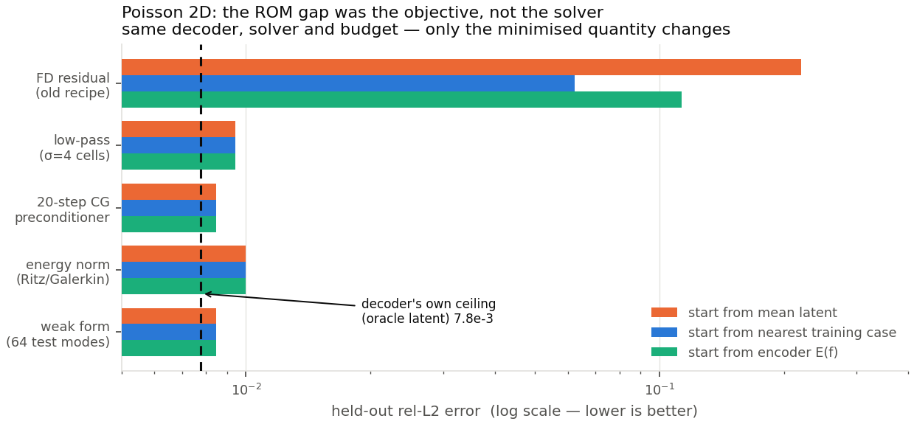

**What you are looking at.** One decoder, one solver, one budget. The only thing that changes between rows is *what quantity the solver minimises*. Three bars per row = three different starting guesses for `z`.

**What it says.**

- The old recipe (**minimise the pointwise/FD residual**, top row) is both far from the ceiling and wildly sensitive to where you start: 6.3e-2 from a good start, 2.2e-1 from a neutral one.
- Every objective that looks at the residual through a **smooth filter** lands essentially *on* the decoder's ceiling (dashed line, 7.8e-3) and is **completely insensitive to the starting guess** — all three bars are the same length.
- The best is the **weak form**: project the residual onto the 64 lowest smooth sine modes, then minimise. 8.5e-3 vs a 7.8e-3 ceiling.

**Why this happens.** The FD residual applies the discrete Laplacian to the decoder's error, which amplifies grid-scale wiggles by roughly (N−1)². So the residual's minimiser is not the field's minimiser — we measured the solver finding points with *lower residual than the true latent* and 8× worse fields. Looking through smooth test functions removes the amplification. Giving the old objective 5× more solver budget changed nothing, which is how we know it was never the optimiser.

---

## 3. The four-PDE picture

We then ported this recipe to four PDEs spanning the classical types.

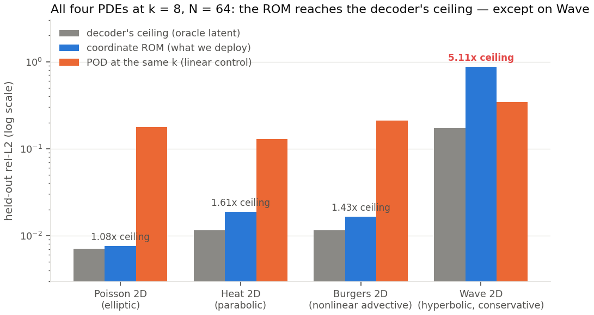

**Read the blue bar against the grey bar.** On Poisson, Heat and Burgers the ROM lands within 1.1–1.6× of the decoder's ceiling — the latent solve is essentially free of error, and it beats the equal-dimension linear control by 7–23×. On **Wave it is 5.1× above its own ceiling and worse than the linear control**. That failure is real, reproducible, and explained in §7.

---

## 4. Finding 2 — how the latent dimension `k` matters

This is the "when is a nonlinear manifold actually needed?" question, which is what sank the paper last time. Both arms below use the same solver, objective and snapshots; only the manifold differs.

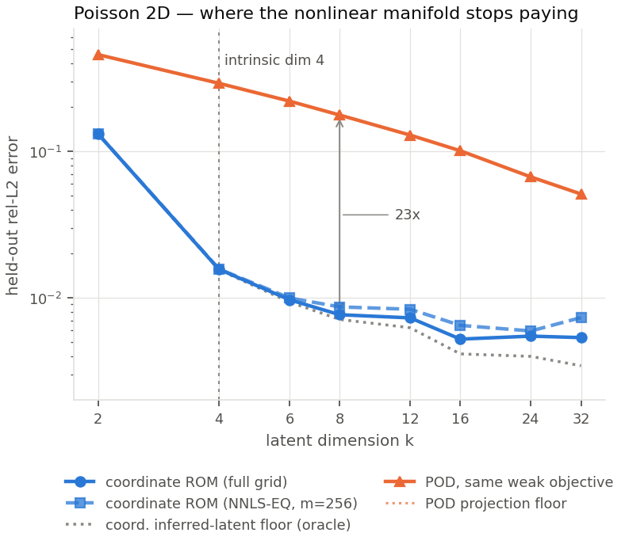

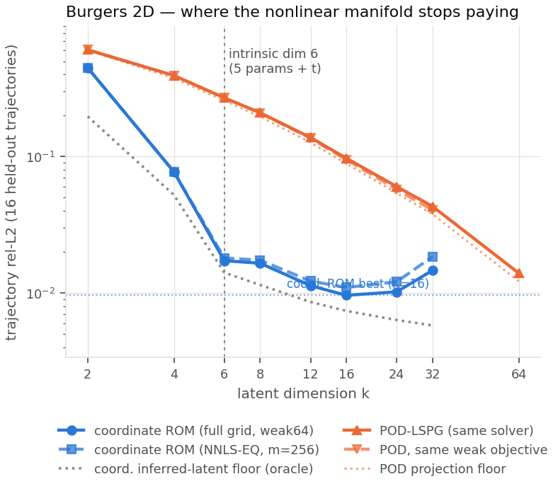

**What it says.**

- The coordinate ROM's error falls steeply until `k` reaches the family's **intrinsic dimension** (4 for the Poisson family, 6 for Burgers = 5 parameters + time), then flattens. It needs about as many latent variables as the problem genuinely has.
- POD needs far more. On Burgers, POD requires **k ≈ 60 to match what the coordinate ROM does with 8** — a 7.4× dimension advantage. On Poisson, extrapolating POD's decay, it would need **k ≈ 240**.
- Past the intrinsic dimension the coordinate ROM stops improving and eventually degrades slightly (the solve gets harder, more iterations get truncated). **More latent variables is not better** — this is a genuinely useful design rule.

---

## 5. Finding 3 — the mesh `N` does not matter

Everything below is measured on a single GPU, all resolutions in one process, median of 7 after warm-up, device-synced, against an identically compiled full-order solver.

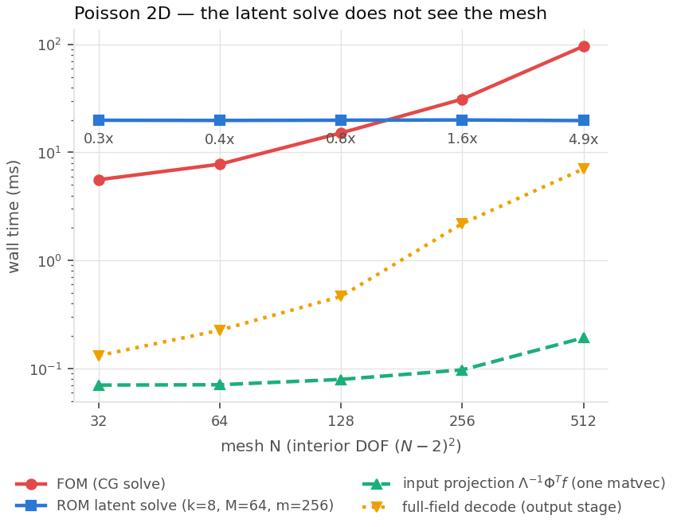

The blue line is the ROM solve: **flat to ±0.7% across a 289× increase in degrees of freedom**, at unchanged accuracy, while the full solver climbs 17×. Speedup goes 0.3× → 4.9×. The two lower lines are the only mesh-dependent pieces left: reading the input in, and decoding the output field.

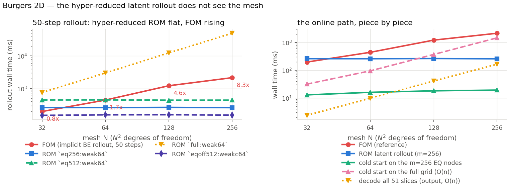

Same story on a nonlinear rollout — but the right panel shows the piece we had to *discover*. Hyper-reducing the time stepping is not enough: the **cold start** (fitting `z` to the initial condition) was still mesh-bound and dominated the total. Putting the cold start on the same 256 quadrature points took it from 1 468 ms to **19.2 ms** at N=256, and end-to-end from 0.7× to **8×**. It also slightly *improved* accuracy.

> **Rule:** hyper-reduce the cold start, not just the stepping. This was the entire difference between Burgers' 8× and Heat's 0.15×.

---

## 6. Finding 4 — hyper-reduction: how few points are enough

Instead of evaluating the objective on the whole mesh, we evaluate it at `m` points with fitted quadrature weights (NNLS). `M` is the number of smooth test modes.

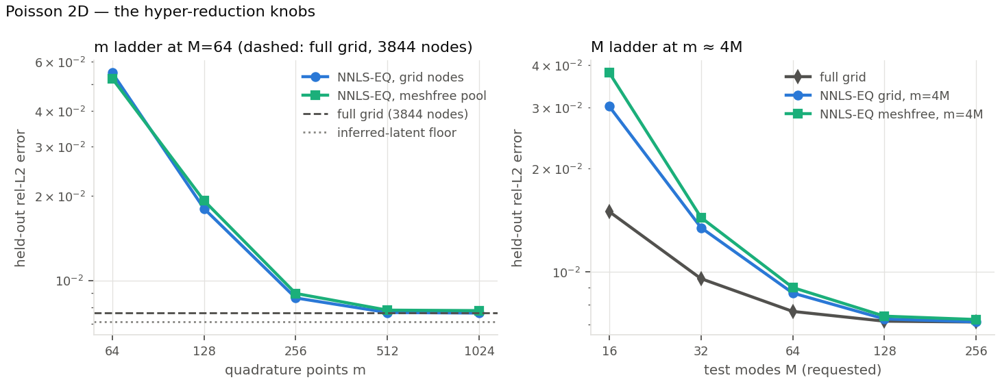

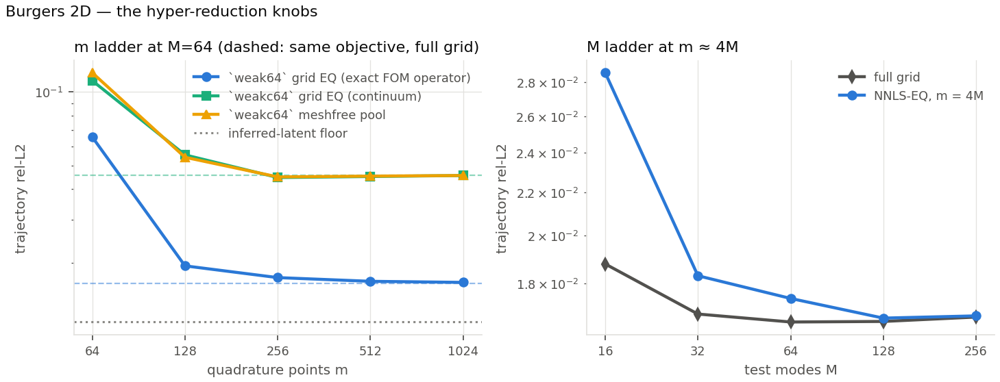

**What it says.**

- **m ≈ 4M points is the knee** on both PDEs. At M=64 that means 256 points — about 15× fewer than the mesh — for ~5% accuracy cost and an **11× cheaper step** on Burgers.
- **Meshfree works.** Points drawn from a continuous pool (green) do as well as points restricted to mesh nodes (blue). The decoder can be evaluated anywhere, so the quadrature is not tied to a grid at all.
- Weights must be fitted to **decoder-output** snapshots. Fitting them to residual snapshots fails.
- **Every purely random collocation scheme failed** on every PDE (uniform, source-biased, off-grid): 0.15–0.99 error. A family of localised bumps cannot be Monte-Carlo integrated with a few hundred points — the fitted quadrature is doing real work.

And the cost side of `k`:

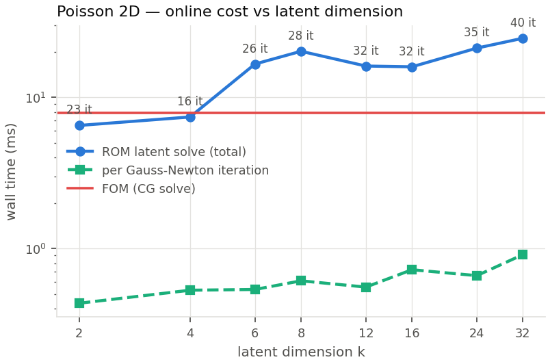

---

## 7. Finding 5 — where it fails, and why (Wave 2D)

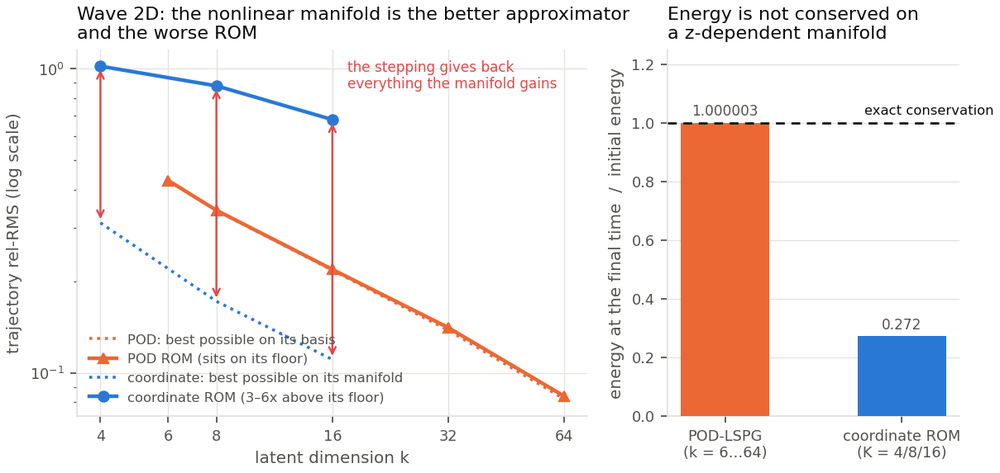

**Left panel.** Dotted lines are each manifold's best possible error; solid lines are the ROM. The linear POD ROM sits **on its floor** (ratio 1.002–1.022) at every rank. The coordinate ROM sits **3.3–6.2× above its own floor**, and — the damning part — that ratio *grows* as the manifold gets better. At equal dimension the coordinate manifold is the better approximator (K=8 floor 1.72e-1 vs POD-8 3.42e-1); the time stepping gives all of it back.

**Right panel.** The wave equation conserves energy. The linear ROM conserves it to six digits. The coordinate ROM ends with **27% of the energy it started with**.

**Why — and this is a derivation, not a guess.** On a *fixed* linear subspace the Crank–Nicolson/Newmark recurrence reduces to

```
S (c_{n+1} + c_{n-1}) = 2 T c_n ,     S, T symmetric
```

The *same* matrix multiplies `c_{n+1}` and `c_{n-1}`, so the recurrence is time-reversible — which is exactly the structure that makes the scheme conservative. On a nonlinear manifold `S` and `T` depend on `z`, that symmetry is lost, and nothing bounds the per-step energy change.

We ruled out the obvious escape: refining the ROM time step 5× lowers the time-discretisation floor 28.9× and **raises** the ROM error 7.5%. Smaller steps are not the fix.

Notably the *hyper-reduction* half of the recipe works fine here (256 points beat the full grid by 1.9% at 5.5× lower cost). It is specifically the latent time stepping that fails on a conservative hyperbolic problem.

---

## 8. Finding 6 — two more honest negatives

### 8a. Heat is accurate but never fast

Accuracy is good: 1.87e-2 at K=8, **6.9× better than POD at equal `k`**, and 1.4× better than the published (bug-fixed) heat ROM at the same speedup. But **no neural configuration beats this full-order solver end-to-end.** Heat's FOM is a jitted CG at 49 ms; our cold start was never hyper-reduced (640 ms at N=128); and decisively, the **direct** reduced POD-Galerkin — a `k×k` solve per step, no iteration — runs **13–38× faster than the FOM** and at k=64 is also more accurate than our K=16.

That is not a bug. For a linear PDE the linear ROM collapses to a direct solve, and nothing iterative can compete. **Conclusion: the speed claim belongs on nonlinear/advection-dominated problems. Heat and Poisson carry the accuracy-per-dimension claim only.**

### 8b. Richer families: a data limit, not a solver limit

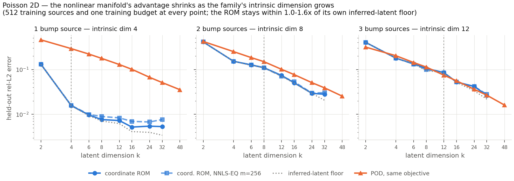

Same PDE, same training budget, but the source has 1, 2 or 3 bumps — intrinsic dimension 4, 8, 12. The coordinate advantage at k=8 goes **23× → 1.4× → 1.1×**.

Crucially, the ROM stays within 1.0–1.6× of its own ceiling in all three panels: **the solver is fine, the decoder is not**. The held-out ceiling degrades 15.4× while training reconstruction only doubles — 512 training samples do not cover a 12-dimensional family. Before claiming anything about richer families we need a training-set-size ladder.

---

## 9. Robustness

Three training seeds (network init and batch order; data, split and test set held fixed):

| | seed 0 | seed 1 | seed 2 | mean ± std |
|---|---|---|---|---|
| Poisson K=8 (new recipe) | 7.65e-3 | 8.16e-3 | 7.71e-3 | **7.84e-3 ± 2.8e-4** (3.6%) |
| Poisson K=8 (old FD recipe) | 4.63e-2 | 6.14e-2 | 4.59e-2 | 5.12e-2 ± 8.8e-3 (17%) |
| Burgers K=8 (new recipe) | 1.65e-2 | 1.57e-2 | 1.46e-2 | **1.56e-2 ± 9.6e-4** (6%) |

The new recipe is not only more accurate, it is markedly more *stable*. Zero blow-ups in any rollout, on any PDE, at any k ≤ 32.

---

## 10. The operating rules we did not know a week ago

1. **Minimise the weak form, not the pointwise residual.** Worth 6× on Poisson and it removes start-point sensitivity entirely.
2. **The number of test modes `M` must exceed the latent dimension `k`.** When they are equal the objective collapses (Heat `M=16, K=16` → 9.0e-2 against a 6.3e-3 ceiling; Burgers POD `k=64, M=64` → diverged).
3. **Hyper-reduce the cold start too**, or the online path stays mesh-bound.
4. **Fit quadrature weights on decoder-output snapshots**, never on residual snapshots; a meshfree point pool is fine.
5. **Never use random collocation** on localised families.
6. **More latent dimensions is not better** past the family's intrinsic dimension.

---

## 11. How we know the numbers are right

Every experiment passed two independent Codex audits — one on the harness *before* using cluster time, one on the results — plus internal numerical identities (weak form with all modes ≡ full Galerkin to 1e-14; our residual ≡ the FOM's own operator to 1e-16; oracle-latent rollout ≡ the decoder's held-out error).

**Caught before running:** a Stage-1 boundary row using `u_{n+1}` instead of `u_{n+1} − u_n`; a "jitted cold start" that was silently a port of the wrong solver (now matches to 9.5e-17); an N-ladder mixing an N=64 quadrature target with per-N source rules; a timed rollout using a stricter tolerance than the graded one.

**Caught after:** the results pass re-derived 1 311 table cells, 321 aggregates, 143 timing medians and 8 figures — **no error in any generated table**. It found 19 hand-written prose errors, one needing a rerun (end-to-end numbers had been *composed* rather than measured), and one copy error on Heat that had flattered a result 2.7×.

Figures in this report are generated by a script that re-verifies every plotted number against its source table before drawing, so a transcription slip fails loudly instead of shipping.

---

## 12. What is still missing

1. **A matched-accuracy cost comparison.** At equal `k` the coordinate ROM is far more accurate, but POD's *per-step* cost is 4–8× lower (Burgers N=64: POD 35–73 ms vs coordinate 260–277 ms). We have accuracy-vs-`k` and cost-vs-`N`; we do **not** yet have a clean iso-error Pareto curve, and at N=64 on Burgers POD-64 may well dominate. **This is the most important missing table** and should exist before any speed claim goes into a paper.
2. **Training-set-size ladder** to separate the §8b generalisation limit from an architectural one.
3. Wave's N=128 cell was still finishing at the time of writing (15 of 16 arms logged, all consistent with N=64).
4. Structure-preserving latent stepping for conservative problems — the natural follow-up to §7.
5. 3D, and the reviewers' other baselines: tuned FNO, POD-DeepONet, SMA cold-start, preconditioned and direct classical solvers, and the L-shaped domain.

---

## 13. Where everything lives

| Branch | Commit | Contents |
|---|---|---|
| `exp/2026-08-16-poisson2d-rom-objective` | `d68d8cb` | objective study, k/m/M ladders, complexity ladder, figures |
| `exp/2026-08-16-burgers2d-rom-latent-stepping` | `c7e9c2e` | the reference ROM implementation, ladders, timing, figures |
| `exp/2026-08-16-heat2d-rom-latent-stepping` | `58f516c` | heat port, direct-POD baseline |
| `exp/2026-08-16-wave2d-rom-latent-stepping` | `084ce0e` | wave port, energy analysis |

All pushed to origin; each carries its README, generated tables, raw JSONs, checkpoints, Slurm logs and both Codex reviews. Figures also in `pod-ae-nmrom/Plots/`.
