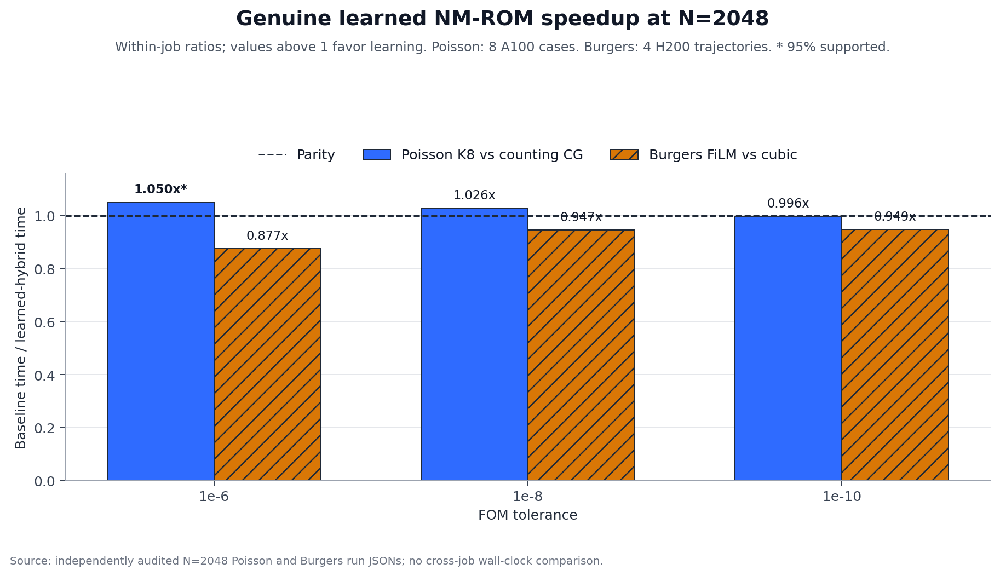
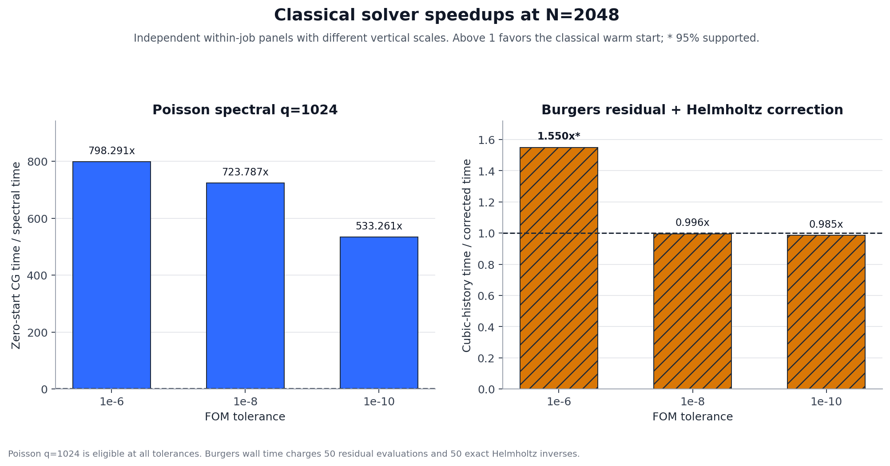

# Poisson-2D and Burgers-2D results and plot audit through August 18, with N=2048 hybrid extension

This generated technical report consolidates the archived Poisson-2D and Burgers-2D evidence available through August 18 and appends the final, independently audited N=2048 hybrid extension under the hybrid section. The accuracy and method conclusions are final within the archived cells; the old cost-to-tolerance curve is explicitly provisional, and the N=2048 results use separate fresh-seed confirmation panels.

[Open the archived through-August-18 HTML companion](2026-08-18-two-pde-results-and-plot-audit.html). The N=2048 extension and its static plots are embedded below in this Markdown report.

## Technical summary

The weak nonlinear ROM is close to its own decoder ceiling on both PDEs: full-grid weak is 1.077x and EQ weak is 1.218x the Poisson ceiling; the corresponding Burgers ratios are 1.442x and 1.519x. For Poisson, replacing the pointwise residual with the weak objective reduces mean error from 6.248e-02 to 8.482e-03.

Quadrature is the sharpest shared implementation inconsistency. At m=M the error is 8.06x full-grid for Poisson and 3.95x for Burgers; at m=4M it is 1.09x and 1.05x. The optimizer diagnostic also removes 11 divergent source-solves while leaving 0 after the trust-region repair, so the earlier latent-dimension stall plot must remain withdrawn.

The cost stories do not yet reconcile. The provisional standalone Poisson curve reaches 3.388x at N=512, but after charging ROM construction and FOM correction the best observed original hybrid is only 0.933x for Poisson and 0.492x for Burgers. Burgers has 0 uncensored consolidated coordinate rows out of 33 in the archived strict cost cell.

The audited N=2048 extension narrows the learned crossover rather than establishing a broad win. The genuine Poisson K=8 hybrid is supported only at tolerance 1e-06, where it reaches 1.050x over counting CG; the genuine Burgers FiLM arm has no supported win at any tested tolerance. The practical Burgers result is classical: at tolerance 1e-06, the charged residual-plus-Helmholtz correction reaches 1.550x over cubic-history FOM.

## Accuracy and objective evidence

The nonlinear weak-form route nearly reaches its learned-manifold ceiling on both PDEs, while the matched POD routes remain much farther away. Ratios use each PDE's own decoder ceiling and are therefore comparable as optimization headroom, not as absolute field accuracy.

| PDE | Route | Mean relative-L2 | Ratio to nonlinear ceiling |
|---|---|---|---|
| Poisson-2D | Decoder ceiling | 7.109e-03 | 1.000x |
| Poisson-2D | Full-grid weak | 7.654e-03 | 1.077x |
| Poisson-2D | EQ weak | 8.658e-03 | 1.218x |
| Poisson-2D | POD-ROM | 1.769e-01 | 24.877x |
| Burgers-2D | Decoder ceiling | 1.147e-02 | 1.000x |
| Burgers-2D | Full-grid weak | 1.654e-02 | 1.442x |
| Burgers-2D | EQ weak | 1.742e-02 | 1.519x |
| Burgers-2D | POD-ROM | 2.094e-01 | 18.256x |

The Poisson objective sweep isolates the residual-definition issue:

| Objective | Mean | Median | Maximum | Sources |
|---|---|---|---|---|
| Pointwise finite difference | 6.248e-02 | 5.064e-02 | 1.630e-01 | 16 |
| Weak / spectral M64 | 8.482e-03 | 7.727e-03 | 1.579e-02 | 16 |
| CG-filtered residual | 8.447e-03 | 7.600e-03 | 1.771e-02 | 16 |
| Ritz energy | 1.002e-02 | 8.379e-03 | 2.099e-02 | 16 |
| Low-pass residual | 9.405e-03 | 8.144e-03 | 1.835e-02 | 16 |

## Quadrature tradeoff

The common operating point is m around four times M. Below it, fit quality and state accuracy deteriorate sharply; above it, accuracy has largely saturated while online cost continues to rise.

| PDE | m/M | Mean error | Error/full | Online ms | Time/full | EQ fit |
|---|---|---|---|---|---|---|
| Poisson-2D | 1xM | 6.251e-02 | 8.056x | 11.1 | 0.312x | 1.400e-01 |
| Poisson-2D | 2xM | 1.722e-02 | 2.219x | 13.9 | 0.390x | 1.607e-02 |
| Poisson-2D | 4xM | 8.422e-03 | 1.085x | 15.1 | 0.423x | 2.412e-03 |
| Poisson-2D | 8xM | 7.788e-03 | 1.004x | 15.2 | 0.426x | 2.428e-04 |
| Poisson-2D | 16xM | 7.756e-03 | 1.000x | 18.9 | 0.531x | 1.597e-05 |
| Poisson-2D | full grid | 7.759e-03 | 1.000x | 35.6 | 1.000x | -- |
| Burgers-2D | 1xM | 6.540e-02 | 3.953x | 3.4 | 0.047x | 2.085e-01 |
| Burgers-2D | 2xM | 1.946e-02 | 1.176x | 4.5 | 0.063x | 4.887e-02 |
| Burgers-2D | 4xM | 1.742e-02 | 1.053x | 6.2 | 0.088x | 6.211e-03 |
| Burgers-2D | 8xM | 1.682e-02 | 1.017x | 10.8 | 0.152x | 1.042e-03 |
| Burgers-2D | 16xM | 1.665e-02 | 1.007x | 20.7 | 0.291x | 1.452e-04 |
| Burgers-2D | full grid | 1.654e-02 | 1.000x | 70.9 | 1.000x | -- |

## Optimizer inconsistency

Mean-only reporting created the apparent k-specific stalls. The medians stay near the decoder ceiling, while a few divergent base-LM solves dominate the means; trust-region globalization removes the recorded divergences.

| k | Base mean | Base median | Base divergent | Trust mean | Trust median | Trust divergent |
|---|---|---|---|---|---|---|
| 4 | 1.109 | 1.005 | 0 | 1.089 | 1.005 | 0 |
| 6 | 7.614 | 1.049 | 3 | 1.053 | 1.027 | 0 |
| 8 | 1.102 | 1.052 | 0 | 1.090 | 1.049 | 0 |
| 12 | 7.854 | 1.096 | 3 | 1.177 | 1.087 | 0 |
| 16 | 1.258 | 1.088 | 0 | 1.277 | 1.092 | 0 |
| 24 | 3.396 | 1.254 | 1 | 1.446 | 1.235 | 0 |
| 32 | 15.487 | 1.795 | 4 | 1.505 | 1.280 | 0 |

## Cost and hybrid evidence

The standalone cost-to-tolerance curve is retained because it is same-GPU consolidated evidence, but it remains provisional: its formal cell review was not completed. The hybrid table is the stronger negative for the specific deployment claim because cost and correction come from the same solver invocation.

| Poisson N | ROM error | ROM ms | Matched FOM error | Matched FOM ms | Speedup | Status |
|---|---|---|---|---|---|---|
| 32 | 1.301e-02 | 3.303 | 8.091e-03 | 1.145 | 0.347x | provisional |
| 64 | 1.155e-02 | 3.431 | 5.761e-03 | 2.218 | 0.646x | provisional |
| 128 | 1.150e-02 | 3.624 | 4.063e-03 | 4.559 | 1.258x | provisional |
| 256 | 1.127e-02 | 4.571 | 1.065e-02 | 7.907 | 1.730x | provisional |
| 512 | 1.178e-02 | 7.865 | 7.104e-03 | 26.650 | 3.388x | provisional |

| PDE | N | ROM tau | FOM tau | Baseline ms | Hybrid ms | Speedup | Baseline/ROM/extrap iterations |
|---|---|---|---|---|---|---|---|
| Poisson-2D | 32 | 5.000e-01 | 1.000e-06 | 2.425 | 4.075 | 0.595x | 77.94/81.88/-- |
| Poisson-2D | 64 | 5.000e-01 | 1.000e-06 | 4.821 | 6.769 | 0.712x | 158.19/168.31/-- |
| Poisson-2D | 128 | 1.000e-01 | 1.000e-06 | 10.047 | 12.086 | 0.831x | 322.12/324.81/-- |
| Poisson-2D | 256 | 1.000e-02 | 1.000e-06 | 19.852 | 22.584 | 0.879x | 658.44/616.50/-- |
| Poisson-2D | 512 | 1.000e-02 | 1.000e-06 | 61.705 | 66.132 | 0.933x | 1341.50/1261.50/-- |
| Burgers-2D | 32 | 1.000e-09 | 1.000e-06 | 47.625 | 327.778 | 0.145x | 98.25/92.50/54.25 |
| Burgers-2D | 64 | 1.000e-09 | 1.000e-06 | 85.559 | 395.354 | 0.216x | 98.50/93.00/55.50 |
| Burgers-2D | 128 | 1.000e-09 | 1.000e-06 | 228.057 | 580.511 | 0.393x | 98.75/92.00/56.50 |
| Burgers-2D | 256 | 1.000e-09 | 1.000e-06 | 449.884 | 914.526 | 0.492x | 99.25/92.00/57.00 |

The independent warm-start verifier was rerun during generation: 146 checks passed and 0 failed.

### Audited N=2048 extension

The extension uses fresh seeds and balanced within-job timing. Poisson K=8 is a genuine learned NM-ROM warm start followed by counting CG. Burgers FiLM is also a genuine weak NM-ROM; the residual-plus-Helmholtz Burgers arm is classical, nonlearned, and not an NM-ROM. Speedup is always the matched within-job baseline time divided by candidate time.

The learned comparison below shows the central limitation: only the loose-tolerance Poisson row is statistically supported above parity. Burgers FiLM remains below cubic-history parity at all three tolerances, and its same-job comparisons against the classical correction also produce no supported FiLM win.

| FOM tolerance | Poisson K8 ms | Poisson zero-CG ms | Poisson speedup [95% CI] | Poisson verdict |
|---|---|---|---|---|
| 1e-06 | 1472.986 | 1547.144 | 1.050x [1.018, 1.067] | supported faster |
| 1e-08 | 1757.347 | 1802.813 | 1.026x [0.993, 1.052] | unsupported / inconclusive |
| 1e-10 | 2015.330 | 2008.121 | 0.996x [0.985, 1.003] | unsupported / inconclusive |

| FOM tolerance | Cubic / FiLM ms | Cubic/FiLM | Dynamic / FiLM ms | Dynamic/FiLM | FiLM supported vs either |
|---|---|---|---|---|---|
| 1e-06 | 756.309 / 862.278 | 0.877x | 713.903 / 862.420 | 0.828x | no |
| 1e-08 | 1418.694 / 1497.729 | 0.947x | 1331.101 / 1497.767 | 0.889x | no |
| 1e-10 | 2213.739 / 2333.497 | 0.949x | 2012.698 / 2333.343 | 0.863x | no |

The production comparison is classical. The Poisson q=1024 spectral warm start is eligible and hundreds of times faster than same-block zero-start CG at every tolerance on this separable rectangle. The Burgers correction is supported only at 1e-6; its tighter rows are inconclusive and should not replace cubic history. The two panels deliberately use separate vertical scales.

| FOM tolerance | Poisson q1024 ms | Poisson zero-CG ms | Poisson speedup | Burgers cubic / corrected ms | Burgers speedup | Burgers paired saving ms [95% CI] | Burgers verdict |
|---|---|---|---|---|---|---|---|
| 1e-06 | 1.921 | 1533.607 | 798.3x | 532.817 / 343.673 | 1.550x | 178.175 [54.945, 195.984] | supported faster |
| 1e-08 | 2.470 | 1787.715 | 723.8x | 923.747 / 927.397 | 0.996x | 5.293 [-27.191, 67.302] | unsupported / inconclusive |
| 1e-10 | 3.734 | 1991.052 | 533.3x | 1191.344 / 1209.532 | 0.985x | 45.404 [-20.894, 266.999] | unsupported / inconclusive |

The Poisson audit covers 576 learned/zero and 1200 production-control records with 0 timing outliers. The Burgers classical audit covers 288 timed records and 144 burns. Its two exact-Helmholtz reference routes pass with worst residual 9.538e-13, maximum step disagreement 4.683e-14, and maximum trajectory disagreement 1.793e-14.

These timings are warmed, compiled steady-state costs. Poisson used eight timed A100-80GB cases; each Burgers panel used four H200 trajectories on its own seed and job. Absolute milliseconds are never compared across those jobs or GPU types.

## What to make consistent next

1. Apply the same trust-region latent solver to the frozen Poisson and Burgers cases, then report mean, median, worst case, and divergent-count together.
2. Use one quadrature policy per comparison: M comfortably above k, m near four times M, decoder-output NNLS weights, and a hyper-reduced cold start.
3. Rebuild cost-to-tolerance with cost and accuracy from the same invocation, saved timing repetitions, GPU burn-in, and the FOM tolerance printed in every plot caption.
4. Compare learned warm starts with the strongest classical history/extrapolation arm in the same job; iteration savings alone are insufficient if construction cost dominates.
5. Finish the archived cost-cell audit before treating the standalone Poisson crossover as a claim, and do not draw a Burgers strict frontier until an uncensored point exists.

## Scope, limitations, and source context

This report preserves the archived evidence available through August 18 and adds only the final N=2048 hybrid extension requested above; it does not import the intervening N<=1024 architecture panels. Accuracy rows are not all from one executable and therefore support method-level consistency checks rather than a single pooled benchmark. The provisional archived Poisson cost curve is descriptive, not inferential; the N=2048 rows are separate fresh-seed confirmations with their own within-job baselines and clustered uncertainty.

Every table, prose quantity, and static N=2048 plot above is generated by `reports/build_2026_08_18_two_pde_results_and_plot_audit.py` from the archived JSONs and the independently audited N=2048 raw/audit JSONs. The linked HTML companion remains the archived through-August-18 interactive surface; the requested N=2048 extension lives in this Markdown report.
