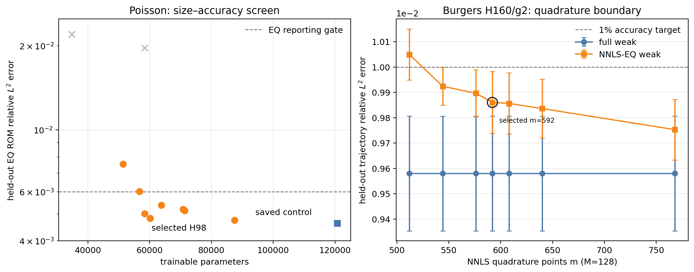
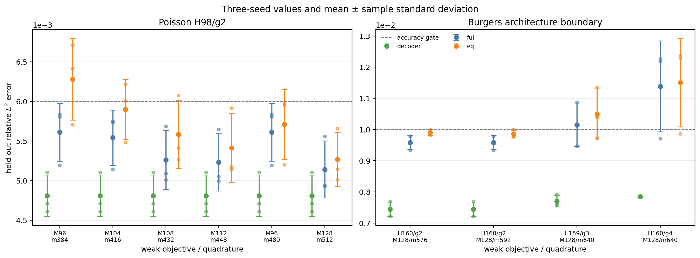
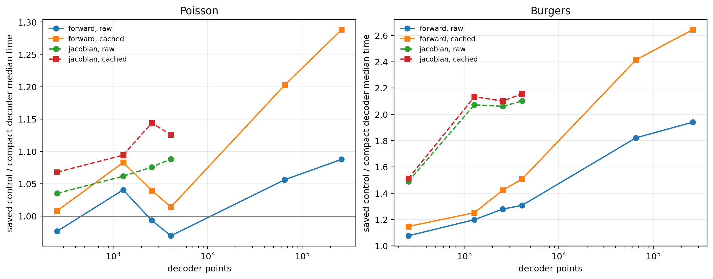

# Pure nonlinear decoder architectures for Poisson and Burgers NMROMs

This report compares compact, purely nonlinear coordinate decoders with the saved FiLM controls. Final for the N=64, k=16 architecture comparison described here. Every table and prose result below is generated from run JSONs, not transcribed manually.

## Recommendation

For Poisson, use group-FiLM H98×4 with group size 2 at M=112,m=448: 58,419 parameters, with three-seed decoder/full/EQ means 4.808e-03, 5.232e-03, and 5.411e-03. It is the narrowest tested even width for which every seed clears the accuracy gates; H96 failed, while H100 is the nearby accuracy-margin option.

The weak-objective boundary is closed to the tested four-mode resolution: the next cheaper M=108,m=432 arm fails, with worst-seed EQ error 6.073e-03 and maximum EQ/full ratio 1.080.

For Burgers, use group-FiLM H160×4 with group size 2 (140,449 parameters) at M=128,m=592. Its three-seed decoder/full/EQ means are 7.446e-03, 9.580e-03, and 9.860e-03, and every seed clears the conservative decoder, full-ROM, EQ-ROM, and EQ/full gates. The M96,m384 arm has full/EQ means 9.890e-03 and 1.028e-02, but is retained only as the aggressive lower-cost arm because at least one per-seed gate fails. The closest cheaper m=576 arm fails, with worst-seed EQ error 9.998e-03 and maximum EQ/full ratio 1.057.

These are not POD-plus-corrector models. Coordinates and the latent state pass through a nonlinear network, and the output is not restricted to a fixed linear basis.

## Accuracy and model size

### Poisson three-seed selection

| model | parameters | decoder mean±std | full mean±std | EQ mean±std |
|---|---:|---:|---:|---:|
| saved H128×4 control (single seed, fair M,m) | 120,769 | 4.133e-03 | 4.427e-03 | 4.630e-03 |
| group-FiLM H98×4, M96,m384 | 58,419 | 4.808e-03±2.618e-04 | 5.611e-03±3.646e-04 | 6.278e-03±5.154e-04 |
| group-FiLM H98×4, M96,m480 | 58,419 | 4.808e-03±2.618e-04 | 5.611e-03±3.646e-04 | 5.709e-03±4.407e-04 |
| group-FiLM H98×4, M104,m416 | 58,419 | 4.808e-03±2.618e-04 | 5.543e-03±3.484e-04 | 5.900e-03±3.765e-04 |
| group-FiLM H98×4, M108,m432 | 58,419 | 4.808e-03±2.618e-04 | 5.261e-03±3.707e-04 | 5.584e-03±4.298e-04 |
| group-FiLM H98×4, M112,m448 | 58,419 | 4.808e-03±2.618e-04 | 5.232e-03±3.612e-04 | 5.411e-03±4.361e-04 |
| group-FiLM H98×4, M128,m512 | 58,419 | 4.808e-03±2.618e-04 | 5.142e-03±3.603e-04 | 5.270e-03±3.406e-04 |
| group-FiLM H100×4, M128,m512 | 60,189 | 4.747e-03±4.551e-04 | 5.068e-03±4.117e-04 | 5.188e-03±3.986e-04 |

The selected Poisson decoder removes 51.6% of the parameters. The saved control remains more accurate in the fair M128,m512 comparison, so the defensible claim is a size/speed tradeoff at acceptable accuracy—not an accuracy improvement over the control.

### Burgers three-seed selection

| model/objective | parameters | decoder mean±std | full mean±std | EQ mean±std |
|---|---:|---:|---:|---:|
| group-FiLM H159×4 g3, M128,m640 | 125,321 | 7.705e-03±1.868e-04 | 1.015e-02±6.991e-04 | 1.049e-02±8.173e-04 |
| group-FiLM H160×4 g2, M96,m384 | 140,449 | 7.446e-03±2.352e-04 | 9.890e-03±1.553e-04 | 1.028e-02±8.558e-05 |
| group-FiLM H160×4 g2, M128,m512 | 140,449 | 7.446e-03±2.352e-04 | 9.580e-03±2.264e-04 | 1.005e-02±1.010e-04 |
| group-FiLM H160×4 g2, M128,m544 | 140,449 | 7.446e-03±2.352e-04 | 9.580e-03±2.264e-04 | 9.924e-03±7.428e-05 |
| group-FiLM H160×4 g2, M128,m576 | 140,449 | 7.446e-03±2.352e-04 | 9.580e-03±2.264e-04 | 9.897e-03±9.252e-05 |
| group-FiLM H160×4 g2, M128,m592 | 140,449 | 7.446e-03±2.352e-04 | 9.580e-03±2.264e-04 | 9.860e-03±1.223e-04 |
| group-FiLM H160×4 g2, M128,m608 | 140,449 | 7.446e-03±2.352e-04 | 9.580e-03±2.264e-04 | 9.856e-03±1.201e-04 |
| group-FiLM H160×4 g2, M128,m640 | 140,449 | 7.446e-03±2.352e-04 | 9.580e-03±2.264e-04 | 9.836e-03±1.161e-04 |
| group-FiLM H160×4 g2, M128,m768 | 140,449 | 7.446e-03±2.352e-04 | 9.580e-03±2.264e-04 | 9.753e-03±1.195e-04 |
| group-FiLM H160×4 g4, M128,m640 | 119,649 | 7.851e-03±1.564e-05 | 1.139e-02±1.456e-03 | 1.150e-02±1.416e-03 |

The selected Burgers decoder removes 69.7% of the saved control parameters.

## Decoder-kernel speed

All accepted decoder timings are f64/highest, use nine persisted repetitions, burn the GPU, then warm the exact compiled kernel. Speedups compare models within one job on one GPU.

| PDE | representative kernel | points | raw speedup | coordinate-cached speedup | outliers control/variant/cache |
|---|---|---:|---:|---:|---:|
| Poisson | hyper-reduced Jacobian | 2560 | 1.075× | 1.144× | 0/0/0 |
| Poisson | large forward | 262144 | 1.088× | 1.288× | 0/0/0 |
| Burgers | hyper-reduced Jacobian | 2560 | 2.061× | 2.101× | 0/0/0 |
| Burgers | large forward | 262144 | 1.940× | 2.644× | 0/0/0 |

Coordinate caching is exact to the check stored in each benchmark JSON; it removes coordinate-only affine work without changing the nonlinear model.

## End-to-end rollout measurements

| cell | M,m | tau | control ms/error | compact ms/error | control/compact | iso-FOM/compact | censored control/compact | timing outliers control/compact |
|---|---:|---:|---:|---:|---:|---:|---:|---:|
| nda_be2e_g160m592tau_r34 | 128,592 | 2.000e-02 | 1130.477 / 9.750e-03 | 514.656 / 1.267e-02 | 2.197× | 0.214× | 98.8% / 100.0% | 0/144 / 0/144 |
| nda_be2e_g160m592tau_r34 | 128,592 | 5.000e-02 | 548.938 / 1.268e-02 | 336.159 / 1.791e-02 | 1.633× | 0.327× | 34.1% / 45.0% | 0/144 / 0/144 |
| nda_be2e_g160m640_r24 | 128,640 | 1.000e-03 | 1363.910 / 9.828e-03 | 589.330 / 9.914e-03 | 2.314× | 0.208× | 100.0% / 100.0% | 0/144 / 0/144 |
| nda_be2e_g160m640_r24 | 128,640 | 1.000e-02 | 1348.831 / 9.828e-03 | 574.507 / 9.914e-03 | 2.348× | 0.214× | 100.0% / 100.0% | 0/144 / 0/144 |
| nda_pe2e_g98_r23 | 128,512 | 1.000e-03 | 12.726 / 4.633e-03 | 10.610 / 5.480e-03 | 1.199× | 0.473× | 93.8% / 100.0% | 0/144 / 0/144 |
| nda_pe2e_g98_r23 | 128,512 | 1.000e-02 | 4.387 / 9.741e-03 | 4.568 / 9.924e-03 | 0.960× | 1.098× | 0.0% / 0.0% | 0/144 / 0/144 |
| nda_pe2e_g98m448_r33 | 112,448 | 1.000e-03 | 11.925 / 4.668e-03 | 12.346 / 7.546e-03 | 0.966× | 0.420× | 93.8% / 100.0% | 0/144 / 0/144 |
| nda_pe2e_g98m448_r33 | 112,448 | 1.000e-02 | 4.447 / 1.083e-02 | 4.516 / 1.237e-02 | 0.985× | 1.149× | 0.0% / 6.2% | 0/144 / 0/144 |
| nda_pe2e_g98m448tau_r35 | 112,448 | 5.000e-03 | 3.256 / 6.563e-03 | 3.504 / 8.954e-03 | 0.929× | 0.949× | 18.8% / 31.2% | 0/144 / 1/144 |
| nda_pe2e_g98m448tau_r35 | 112,448 | 7.500e-03 | 2.790 / 8.655e-03 | 3.038 / 9.689e-03 | 0.918× | 1.095× | 0.0% / 6.2% | 0/144 / 1/144 |

Rows with nonzero censoring are budget-limited. They are useful diagnostic measurements but are not promoted to headline iso-accuracy speedups.

At the deployable Poisson M=128,m=512 arm and tau=1.000e-02, the compact decoder is 1.041× slower than the saved decoder architecture and 1.098× faster than the like-for-like iso-accuracy FOM. This row is uncensored and has compact error 9.924e-03. The smaller M=112,m=448 validation objective did not produce an uncensored 1%-accurate stopping point in the measured tolerance bracket.

At the selected Burgers M=128,m=592 arm and tau=5.000e-02, the compact decoder is 1.633× faster than the saved decoder architecture inside the same job. It is 3.054× slower than the like-for-like iso-accuracy FOM, so this is an architecture speedup—not a claimed FOM crossover. No measured selected-objective row is both uncensored and 1%-accurate. The lowest-error row has error 1.267e-02 with 100.0% censoring; the speed row reported here is therefore diagnostic only.

## Local latent trust-region check

| arm | M,m | decoder | full | EQ | EQ/full | blowups full/EQ |
|---|---:|---:|---:|---:|---:|---:|
| control_tr001 | 96,384 | 7.400e-03 | 9.220e-03 | 9.810e-03 | 1.064 | 0/0 |
| control_tr001 | 128,512 | 7.400e-03 | 8.935e-03 | 9.217e-03 | 1.032 | 0/0 |
| variant_tr001 | 96,384 | 7.688e-03 | 9.803e-03 | 1.026e-02 | 1.047 | 0/0 |
| variant_tr001 | 128,512 | 7.688e-03 | 9.618e-03 | 9.961e-03 | 1.036 | 0/0 |

The trust radius is 1% of the training-cloud radius. This is reported as a solver sensitivity check, not folded into the architectural comparison.

## What failed or was retracted

- Compact residual-FiLM arms failed both PDE accuracy targets; parameter count alone was not enough.
- Burgers H192 did not materially improve the seed-0 decoder or M64 ROM over H160, so increasing width was not the productive direction.
- The old Poisson M64,m256 control comparison is not used for architectural accuracy claims. The control was re-evaluated fairly at M128,m512.
- `nda_pbench_g98_r8` is retained but rejected: its exact kernels were warmed before the GPU burn. `nda_pbench_g98b_r8` is the accepted corrected rerun.
- `nda_be2e_g160_r12` is retained but rejected: the driver dropped the compact checkpoint's decoder metadata and failed before that arm. The loader was fixed in the subsequent runs.
- `nda_pe2e_g98_r11`, `nda_be2e_g160_r14`, and `nda_be2e_g160m640_r21` are excluded from timing claims because they retained per-source medians but not every raw repetition. The accepted r23/r24 reruns persist the full arrays.
- The smaller group-4 H160 decoder is not robust: its three-seed maximum full-ROM error is 1.227e-02, above the 1% gate, despite a passing seed-0 result.
- The group-8 H160 compression bracket fails already at M64 on seed 0: decoder/full/EQ512 errors are 1.213e-02, 2.416e-02, and 2.442e-02.
- The divisible group-3 H159 bracket is also seed-unstable: its three-seed maximum full/EQ errors are 1.087e-02 and 1.135e-02.
- The H144/group-2 width bracket fails on seed 0, so no extra seeds were run: decoder/full/EQ errors are 8.181e-03, 1.089e-02, and 1.113e-02.

## Scope and provenance

The result is limited to N=64, k=16, the recorded held-out families, and the weak-form solvers tested here. Every cluster cell regenerated its data from seed, logged `jax_backend=gpu`, used f64/highest precision, ran alone in its directory, and was pulled with checksums. Exact run rows, timing arrays, medians, maxima, outlier counts, manifests, and job logs are in the experiment directory.

- [Generated full tables](../experiments/nonlinear-decoder-architecture/SUMMARY.md)
- [Machine-readable summary](../experiments/nonlinear-decoder-architecture/summary.json)
- [Generated result audit](../experiments/nonlinear-decoder-architecture/AUDIT.md)
- [Experiment method and code](../experiments/nonlinear-decoder-architecture/README.md)
