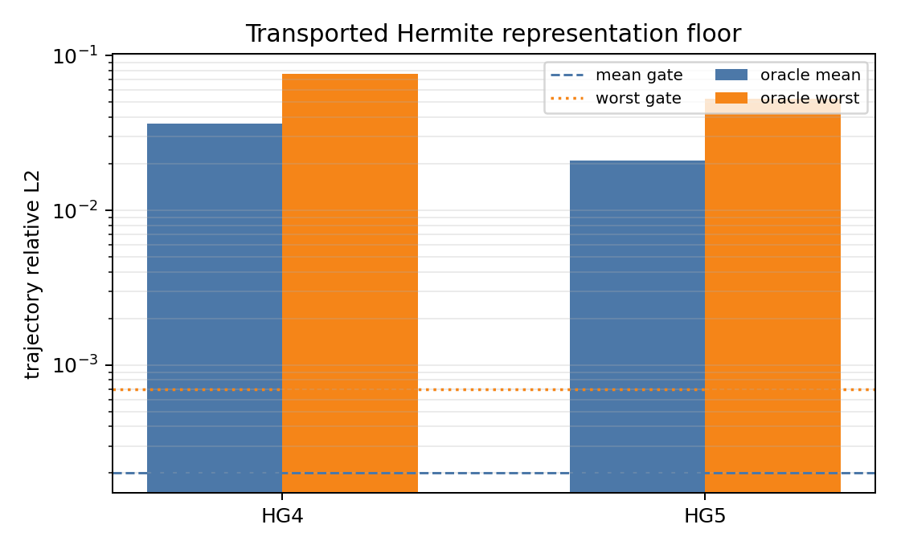
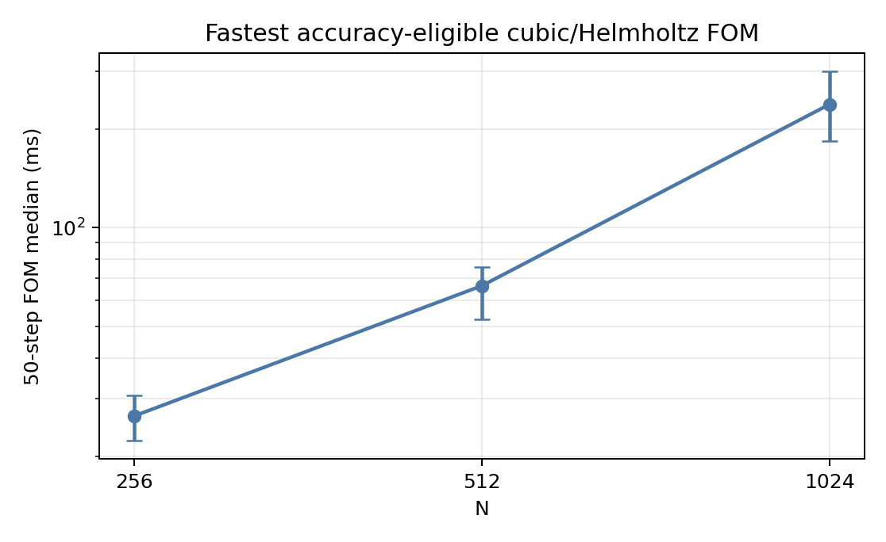
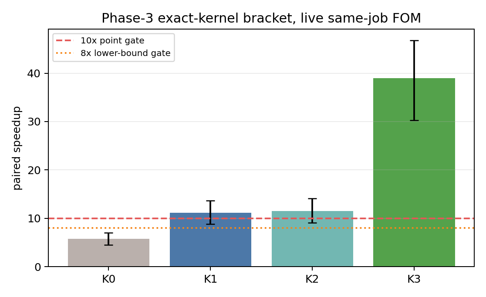

# Burgers 1e-3 / 10x pure NM-ROM search — Phase 6 identity repair

This report covers the finite transported-Hermite search, calibrated Burgers FOM, adaptive transported-spline screens, exact solver/kernel repair, hierarchical-spline diagnostic, H1/k24 seed-11 training, the Phase-5 nonlinear-generator diagnostic, and the Phase-6 Cox-weak/K3-full arithmetic repair. All accepted numbers are **final** through Phase 6. Phase 6 licenses only a separate G1 training proposal/audit; no trained Phase-6 model exists, and model-validation and untouched-confirmation draws remain unopened.

## Outcome

**[final negative]** Phase 1 stopped because the best transported Hermite oracle (HG5) has mean/worst 2.103e-02 / 5.267e-02. Phase 2's much richer R=48/k=24 spline reaches pooled mean/worst 1.015e-04 / 9.968e-04, but its original coefficient fits are unhealthy and its N=128 worst exceeds the 7.000e-04 gate. Its same-job mandatory cost also reaches only 6.548x with clustered interval [5.161, 8.029].

Phase 3 successfully repairs both implementation defects without changing the spline space. Both algebraic solvers become fully healthy, and exact kernel K3 reaches 39.005x with clustered interval [30.285, 46.755]. Yet the best repaired N=128 draw-530 trajectory remains 7.888e-04: a 20.9% improvement over 9.968e-04, but still 1.1269x the unchanged 7.000e-04 representation gate. Therefore `selected_solver=null`, P3-F is not licensed, and no training/weak-EQ/scaling/confirmation result exists.

**[final Phase-4 diagnostic]** The genuinely hierarchical H1 chart passes every exposed free-oracle gate with pooled mean/worst 5.805e-05 / 3.859e-04 and is the preregistered smallest passing arm. Its same-H200 mandatory path reaches 26.007x with clustered interval [20.139, 31.646], which licensed the now-completed seed-11 k24 training cell. The worst-case maximum-one route reaches only 7.057x with interval [5.577, 8.672], so H1 was only conditionally eligible for a zero/occasional-attempt policy; the training hard stop prevents any rollout claim.

**[final Phase-4 training hard stop]** The complete H1/k24 seed-11 hyperdecoder/autolatent fit fails its exposed learned-manifold oracle by orders of magnitude: pooled mean/worst 4.309e-01 / 6.021e-01. Its direct predictor is better but still fails at 8.131e-02 / 1.934e-01. Both are finite and preserve the exact binary boundary. The learned oracle also misses the locked k32 near-miss bracket, so seeds 29/47, k32, model validation, weak/EQ, scaling, and confirmation are not licensed.

**[final Phase-5 diagnostic hard stop; implementation floor repaired in Phase 6]** The fixed nonlinear generator bracket clears target integrity, non-collapse, memory, canonical-work, and mandatory-speed screens, but neither arm clears the unchanged K3/Cox identity tolerance 2.000e-14. G1 is the faster arm at 21.852x with clustered interval [17.003, 26.386], yet its worst weak-residual identity is 4.826e-14. The full-field discrepancy is only 2.858e-16. Phase 5 therefore correctly stopped before training; Phase 6 prospectively tested the single arithmetic repair below.

**[final Phase-6 positive diagnostic]** The actual G1 route now uses Cox--de Boor arithmetic only for the 50 weak evaluations and retains K3/Pallas for the charged 51-field full decode. Its worst Cox-control identity is 2.858e-16, and the independently executed timed route agrees with the identity route to 6.851e-16. Against the same-job eligible FOM at 98.760 ms, the repaired route takes 4.79834 ms for 20.582x with clustered interval [16.204, 25.160]. Exact-50/51 work, zero failures, memory, boundary, basis/support, and live-FOM gates all pass. This is structural eligibility only: `training_authorized=false` remains binding.

The inherited seed-0 H160x4/g2 artifact copied into D0 has full-weak mean/worst 1.039e-02 / 2.175e-02; this specific inherited row is neither a new result nor an eligible Pareto point.

## Phase 1 representation diagnostic

| status | concept | k | oracle mean / worst | predictor mean / worst | wall fraction | decision |
|---|---|---|---|---|---|---|
| final | HG4 | 19 | 3.657e-02 / 7.632e-02 | 1.048e-01 / 4.441e-01 | 0.374408 | kill |
| final | HG5 | 25 | 2.103e-02 / 5.267e-02 | 1.220e-01 / 5.731e-01 | 0.380216 | kill |

The authoritative wall fractions are computed from representation-oracle arrays. Both are below the 0.5 conditional wall-chart license; no failed Hermite concept was trained.

## Calibrated like-for-like FOM

| status | N | outer / inner | mean / worst error | median ms | clustered 95% CI ms | Newton / linear work | tight-vs-tighter worst |
|---|---|---|---|---|---|---|---|
| final | 256 | 3e-03 / 1e-01 | 9.348e-04 / 1.374e-03 | 26.599 | [22.417, 30.680] | 43.25 / 51.00 | 5.234e-13 |
| final | 512 | 3e-03 / 1e-01 | 7.003e-04 / 1.382e-03 | 66.450 | [52.594, 76.001] | 43.00 / 52.00 | 5.134e-13 |
| final | 1024 | 3e-03 / 1e-01 | 6.584e-04 / 1.400e-03 | 238.049 | [184.050, 299.168] | 43.00 / 52.75 | 4.457e-13 |

**[final]** All reference and tighter-audit chains are finite with zero flags/breakdowns. The N=1024 A100 median 238.049 ms is planning evidence only across jobs. Every scientific speed decision below uses a fresh live eligible FOM in the same H200 job.

## Phase 2 adaptive spline screen

| status | N | oracle mean / worst | healthy fits | normal worst | iterations median / max | accuracy / health |
|---|---|---|---|---|---|---|
| final | 64 | 7.507e-05 / 4.536e-04 | 1847/3264 | 8.728e-07 | 500 / 500 | pass / fail |
| final | 128 | 1.324e-04 / 9.968e-04 | 707/1632 | 2.751e-06 | 500 / 500 | fail / fail |
| final | 256 | 1.455e-04 / 6.876e-04 | 313/816 | 1.791e-06 | 500 / 500 | pass / fail |

**[final negative]** Arm C's direct/mandatory/maximum-one medians are 14.966 / 15.078 / 25.935 ms against its live eligible FOM at 98.732 ms. Mandatory speedup is 6.548x with interval [5.161, 8.029]. No arm is promoted.

## Phase 3 exact solver repair

| status | solver | healthy fits | normal worst | draw-530 error | S0 error | no regression | decision |
|---|---|---|---|---|---|---|---|
| final | S1 | 128/128 | 5.672e-14 | 7.888e-04 | 9.968e-04 | pass | kill |
| final | S2 | 128/128 | 1.341e-15 | 7.888e-04 | 9.968e-04 | pass | kill |

**[final negative]** Algebraic health is repaired: all 128 fixed diagnostic fits pass for each solver, with no snapshot regression. The common remaining 7.888e-04 witness is therefore a representation floor for this locked spline, not a coefficient-solve-health artifact. Both solvers miss the fixed 7.000e-04 target and are killed.

## Phase 3 exact kernel repair

| status | route | median ms | speedup | clustered 95% CI | identity / work / memory | decision |
|---|---|---|---|---|---|---|
| final | K0 | 17.25950 | 5.729x | [4.518, 7.011] | fail/pass/pass | fail |
| final | K1 | 8.86708 | 11.152x | [8.821, 13.701] | pass/pass/pass | pass |
| final | K2 | 8.60510 | 11.492x | [9.093, 14.152] | pass/pass/pass | pass |
| final | K3 | 2.53521 | 39.005x | [30.285, 46.755] | pass/pass/pass | pass |

**[final]** The live FOM has mean/worst error 6.584e-04 / 1.400e-03, is healthy/eligible, and has median 98.886 ms. K1, K2, and K3 all pass both speed requirements. For K3, basis-probe maximum absolute weight difference is 1.066e-14; all four live-case full/stencil/previous/residual/rho identities, exact boundaries, finite exactly-50 weak-evaluation work records, memory gates, and the 20-repeat cyclic balance pass. All within-trajectory timing outlier counts are zero.

## Phase 4 hierarchical spline diagnostic

| status | arm | N | oracle mean / worst | snapshot worst | healthy fits | normal worst | decision |
|---|---|---|---|---|---|---|---|
| final | H1 | 64 | 5.425e-05 / 3.593e-04 | 5.825e-04 | 3264/3264 | 1.467e-15 | pass |
| final | H1 | 128 | 6.299e-05 / 3.859e-04 | 6.395e-04 | 1632/1632 | 1.447e-15 | pass |
| final | H1 | 256 | 6.339e-05 / 2.995e-04 | 5.820e-04 | 816/816 | 3.033e-15 | pass |
| final | H1 | pooled | 5.805e-05 / 3.859e-04 | — | 5712/5712 | 3.033e-15 | pass |
| final | H2 | 64 | 5.397e-05 / 3.593e-04 | 5.825e-04 | 3264/3264 | 1.834e-15 | pass |
| final | H2 | 128 | 6.160e-05 / 3.858e-04 | 6.394e-04 | 1632/1632 | 2.026e-15 | pass |
| final | H2 | 256 | 5.977e-05 / 2.995e-04 | 5.820e-04 | 816/816 | 5.010e-15 | pass |
| final | H2 | pooled | 5.698e-05 / 3.858e-04 | — | 5712/5712 | 5.010e-15 | pass |

| status | arm | route | median ms | speedup | clustered 95% CI | outliers | decision |
|---|---|---|---|---|---|---|---|
| final | H1 | mandatory | 3.816 | 26.007x | [20.139, 31.646] | 0 | pass |
| final | H1 | maximum-one | 14.066 | 7.057x | [5.577, 8.672] | 0 | fail |
| final | H2 | mandatory | 3.712 | 26.741x | [21.598, 32.679] | 0 | pass |
| final | H2 | maximum-one | 14.010 | 7.085x | [5.614, 8.686] | 0 | fail |

**[final positive selection]** Both H1 and H2 pass the exposed oracle and mandatory structural-cost gates; the preregistered smallest passing arm H1 is selected. Its full exposed oracle contains 5712 healthy fits with no S0 or fixed-P3-subset regression. The paired live FOM has mean/worst error 6.584e-04 / 1.400e-03 and median 99.257 ms. Identity is at most 4.100e-15; exact boundaries, support, finite exactly-50 mandatory work, memory, balanced 20-repeat ordering, and zero timing outliers pass. The maximum-one row is a measured limitation, not a headline result or a reason to weaken the final speed gate.

## Phase 4 H1/k24 seed-11 training

| status | N | learned oracle mean / worst | direct mean / worst | health | decision |
|---|---|---|---|---|---|
| final | 64 | 4.257e-01 / 6.021e-01 | 7.917e-02 / 1.934e-01 | finite / exact boundary | fail / fail |
| final | 128 | 4.343e-01 / 5.311e-01 | 8.294e-02 / 1.704e-01 | finite / exact boundary | fail / fail |
| final | 256 | 4.449e-01 / 5.508e-01 | 8.658e-02 / 1.689e-01 | finite / exact boundary | fail / fail |
| final | pooled | 4.309e-01 / 6.021e-01 | 8.131e-02 / 1.934e-01 | finite / exact boundary | fail / fail |

**[final negative]** The selected oracle start is 1 by pooled mean snapshot-relative-L2-squared 1.698e-01. The manifold and predictor schedules finish exactly at 30000 and 20000 steps. The learned-manifold failure is the active Phase-4 floor: the free H1 coefficient projection and mandatory K3 path already pass, while the fixed dense coefficient generator cannot reproduce that exposed free-oracle solution set. No deployed rollout was timed in this training cell, so the structural speed row is not a learned-model speed claim.

## Phase 5 nonlinear spatial-generator diagnostic

| status | arm | rank / curvature | mandatory ms / speedup / 95% CI | maximum-one ms / speedup / 95% CI | full / weak identity worst | decision |
|---|---|---|---|---|---|---|
| final | G1 | 127 / 5.507e-02 | 4.539 / 21.852x / [17.003, 26.386] | 60.890 / 1.629x / [1.286, 2.007] | 2.858e-16 / 4.826e-14 | kill |
| final | G2 | 127 / 5.720e-02 | 6.587 / 15.057x / [11.837, 18.486] | 177.276 / 0.559x / [0.442, 0.689] | 2.873e-16 / 4.686e-14 | kill |

**[final Phase-5 negative; repaired route measured separately below]** All 35904 S2/H1 training coefficient targets across 16 locked chunks are finite and healthy; the worst normal residual is 3.278e-15. The train-only per-head coefficient RMS values are 8.495e-01 and 6.798e-01. Both prospective generators exhibit numerical rank 127 and nonzero curvature, so the diagnostic does not show the Phase-4 fixed-affine-output-subspace collapse. The live FOM is eligible at mean/worst 6.584e-04 / 1.400e-03 with median 99.178 ms. Mandatory structural speed passes for both arms, but the Phase-5 weak-residual identity component fails for every live case while fields and stencils agree near machine precision. The locked Phase-5 stop remains valid for that invocation.

## Phase 6 G1 actual-route identity repair

| status | route | median ms / speedup | clustered 95% CI | identity worst | outliers | decision |
|---|---|---|---|---|---|---|
| final | R0_polynomial_weak | 4.67272 / 21.136x | — | 4.826e-14 | 0 | control fails |
| final | R1_cox_weak_k3_full | 4.79834 / 20.582x | [16.204, 25.160] | 2.858e-16 | 0 | repair licensed |

**[final positive diagnostic]** The R0 row reproduces the exposed Phase-5 arithmetic failure. R1 changes no basis, state, learned parameter, weak form, or final full-grid decoder: it uses the canonical Cox evaluator for weak queries and K3/Pallas for the full decode. Its live FOM mean/worst error is 6.584e-04 / 1.400e-03; the tight/tighter reference difference is at most 4.452e-13. All four R1 records have exactly 50 weak evaluations and 51 coefficient-grid evaluations with zero failures. Compiled eligibility memory is 0.496 GB. The result licenses a separate generator-training proposal, not training or a headline NM-ROM claim.

## Gate ledger and stopping condition

| status | gate | result |
|---|---|---|
| final pass | reference numerical error <=1e-4 | 5.234e-13 |
| final fail on exposed selection | seed-11 learned-manifold oracle mean<=2e-4, worst<=7e-4 | 4.309e-01 / 6.021e-01 |
| final fail on exposed selection | seed-11 direct predictor mean<=3e-4, worst<=1e-3 | 8.131e-02 / 1.934e-01 |
| not opened | selected decoder reconstruction mean<=3e-4, worst<=1e-3 on untouched validation | no eligible seed-11 model; validation untouched |
| not reached | full weak<=7e-4 and EQ<=1e-3, degradation<=1.05 | training hard stop prevents weak/EQ |
| final pass (structural only) | N1024 H1 mandatory >=10x, clustered LB>=8x | 26.007x, LB 20.139 |
| final fail (worst-case route) | N1024 H1 maximum-one >=10x, clustered LB>=8x | 7.057x, LB 5.577 |
| final pass | H1 free-oracle mean<=2e-4, worst<=7e-4 | 5.805e-05 / 3.859e-04 |
| not reached | N256/N512 learned scaling | no eligible trained pure model |
| not opened | untouched confirmation | fixed data remained untouched |
| final repaired | G1 actual Cox-weak/K3-full identity <=2e-14 | 2.858e-16 |
| final pass (structural only) | Phase-6 actual route >=10x, clustered LB>=8x | 20.582x, LB 16.204 |

No row is yet a deployable NM-ROM Pareto point. H1 proves that the spline space and structural mandatory kernel can clear their exposed gates; the Phase-4 dense generator fails its learned-manifold gate, while Phase 6 now proves that the G1 nonlinear generator's actual Cox-weak/K3-full route clears the unchanged structural identity and speed gates. Consequently no method yet claims the headline N=1024 result. Phase 6 licenses only a separately preregistered/audited G1 seed-11 training cell; training, model validation, weak/EQ, scaling, and confirmation remain unrun.

## Exclusions and cell accounting

**[excluded]** Job 2667476 is a partial FOM attempt that failed before N=1024. Zero-output jobs 2667361, 2667374, 2667531, and Phase-4 job 2668601 are infrastructure/code-preflight records. Phase-4 job 2668613 is excluded without scientific inspection because its root manifest omitted the nested P3 manifest. Every local smoke is execution-only. The two synthetic-only model-validation drafts are uncommitted and excluded; none touched model-validation or confirmation data.

**[final through Phase-6 accounting]** Nine scientific cells were consumed: D0, one excluded partial FOM cell, corrected FOM calibration, Phase-2 S0, Phase-3 P3-D, Phase-4 P4-D, H1/k24 seed-11 training, Phase-5 P5-D, and Phase-6 P6-D. The two Phase-4 provenance failures did not alter the scientific method/cap and are excluded. Model validation, weak/EQ, scaling, confirmation, and nonlinear-generator training consumed zero cells. All completed remote directories were deleted after checksummed pulls, and the assigned namespace is empty.

## Artifacts and rerun

- Preregistrations: `experiments/burgers-1e3-10x/PRE-REGISTRATION.md`, `PHASE-2-PRE-REGISTRATION.md`, `PHASE-3-PRE-REGISTRATION.md`, `PHASE-4-PRE-REGISTRATION.md`, `PHASE-5-PRE-REGISTRATION.md`, `PHASE-6-PRE-REGISTRATION.md`
- Accepted runs: `experiments/burgers-1e3-10x/runs/d0_r2/`, `fom_cal_r4/`, `s0_spline_r1/`, `p3_d_r1/`, `p4_d_r3/`, `p4_h1_s11_r1/`, `p5_d_r1/`, `p6_d_r1/`
- Machine tables: `reports/generated/burgers_1e3_10x_tables.json`
- Audit: `reports/generated/burgers_1e3_10x_audit.json`
- Regenerate: `/home/tahmid/Dev/.venv/bin/python reports/audit_2026_08_20_burgers_1e3_10x.py && /home/tahmid/Dev/.venv/bin/python reports/build_2026_08_20_burgers_1e3_10x.py`
